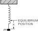

SOURCE: Feynman Lectures on Physics, Volume I, Chapter 9
LANGUAGE: en
TITLE: Chapter 9. Newton’s Laws of Dynamics
SOURCE_URL: https://www.feynmanlectures.caltech.edu/I_09.html
NOTEBOOKLM_USE: clean lecture text with TeX math and figure captions; reader navigation removed.

# Chapter 9. Newton’s Laws of Dynamics

## 9–1 Momentum and force

The discovery of the laws of dynamics, or the laws of motion, was a dramatic moment in the history of science. Before Newton’s time, the motions of things like the planets were a mystery, but after Newton there was complete understanding. Even the slight deviations from Kepler’s laws, due to the perturbations of the planets, were computable. The motions of pendulums, oscillators with springs and weights in them, and so on, could all be analyzed completely after Newton’s laws were enunciated. So it is with this chapter: before this chapter we could not calculate how a mass on a spring would move; much less could we calculate the perturbations on the planet Uranus due to Jupiter and Saturn. After this chapter wewillbe able to compute not only the motion of the oscillating mass, but also the perturbations on the planet Uranus produced by Jupiter and Saturn!

Galileo made a great advance in the understanding of motion when he discovered theprinciple of inertia: if an object is left alone, is not disturbed, it continues to move with a constant velocity in a straight line if it was originally moving, or it continues to stand still if it was just standing still. Of course this never appears to be the case in nature, for if we slide a block across a table it stops, but that is because it isnotleft to itself—it is rubbing against the table. It required a certain imagination to find the right rule, and that imagination was supplied by Galileo.

Of course, the next thing which is needed is a rule for finding how an objectchangesits speed if somethingisaffecting it. That is, the contribution of Newton. Newton wrote down three laws: The First Law was a mere restatement of the Galilean principle of inertia just described. The Second Law gave a specific way of determining how the velocity changes under different influences calledforces. The Third Law describes the forces to some extent, and we shall discuss that at another time. Here we shall discuss only the Second Law, which asserts that the motion of an object is changed by forces in this way:the time-rate-of-change of a quantity called momentum is proportional to the force. We shall state this mathematically shortly, but let us first explain the idea.

Momentumis not the same asvelocity. A lot of words are used in physics, and they all have precise meanings in physics, although they may not have such precise meanings in everyday language. Momentum is an example, and we must define it precisely. If we exert a certain push with our arms on an object that is light, it moves easily; if we push just as hard on another object that is much heavier in the usual sense, then it moves much less rapidly. Actually, we must change the words from “light” and “heavy” toless massiveandmore massive, because there is a difference to be understood between theweightof an object and itsinertia. (How hard it is to get it going is one thing, and how much it weighs is something else.) Weight and inertia areproportional, and on the earth’s surface are often taken to be numerically equal, which causes a certain confusion to the student. On Mars, weights would be different but the amount of force needed to overcome inertia would be the same.

We use the termmassas a quantitative measure of inertia, and we may measure mass, for example, by swinging an object in a circle at a certain speed and measuring how much force we need to keep it in the circle. In this way we find a certain quantity of mass for every object. Now themomentumof an object is a product of two parts: itsmassand itsvelocity. Thus Newton’s Second Law may be written mathematically this way:
\[
\begin{equation}
\label{Eq:I:9:1}
F=\ddt{}{t}(mv).
\end{equation}
\]
Now there are several points to be considered. In writing down any law such as this, we use many intuitive ideas, implications, and assumptions which are at first combined approximately into our “law.” Later we may have to come back and study in greater detail exactly what each term means, but if we try to do this too soon we shall get confused. Thus at the beginning we take several things for granted. First, that the mass of an object isconstant; it isn’t really, but we shall start out with the Newtonian approximation that mass is constant, the same all the time, and that, further, when we put two objects together, their massesadd. These ideas were of course implied by Newton when he wrote his equation, for otherwise it is meaningless. For example, suppose the mass varied inversely as the velocity; then the momentum wouldnever changein any circumstance, so the law means nothing unless you know how the mass changes with velocity. At first we say,it does not change.

Then there are some implications concerning force. As a rough approximation we think of force as a kind of push or pull that we make with our muscles, but we can define it more accurately now that we have this law of motion. The most important thing to realize is that this relationship involves not only changes in themagnitudeof the momentum or of the velocity but also in theirdirection. If the mass is constant, then Eq. (9.1) can also be written as
\[
\begin{equation}
\label{Eq:I:9:2}
F=m\,\ddt{v}{t}=ma.
\end{equation}
\]
The acceleration \(a\) is the rate of change of the velocity, and Newton’s Second Law says more than that the effect of a given force varies inversely as the mass; it says also that thedirectionof the change in the velocity and thedirectionof the force are the same. Thus we must understand that a change in a velocity, or an acceleration, has a wider meaning than in common language: The velocity of a moving object can change by its speeding up, slowing down (when it slows down, we say it accelerates with a negative acceleration), or changing its direction of motion. An acceleration at right angles to the velocity was discussed in Chapter7. There we saw that an object moving in a circle of radius \(R\) with a certain speed \(v\) along the circle falls away from a straightline path by a distance equal to \(\tfrac{1}{2}(v^2/R)t^2\) if \(t\) is very small. Thus the formula for acceleration at right angles to the motion is
\[
\begin{equation}
\label{Eq:I:9:3}
a=v^2/R,
\end{equation}
\]
and a force at right angles to the velocity will cause an object to move in a curved path whose radius of curvature can be found by dividing the force by the mass to get the acceleration, and then using (9.3).

## 9–2 Speed and velocity

In order to make our language more precise, we shall make one further definition in our use of the wordsspeedandvelocity. Ordinarily we think of speed and velocity as being the same, and in ordinary language they are the same. But in physics we have taken advantage of the fact that therearetwo words and have chosen to use them to distinguish two ideas. We carefully distinguish velocity, which has both magnitude and direction, from speed, which we choose to mean the magnitude of the velocity, but which does not include the direction. We can formulate this more precisely by describing how the \(x\) -, \(y\) -, and \(z\) -coordinates of an object change with time. Suppose, for example, that at a certain instant an object is moving as shown in Fig.9–1. In a given small interval of time \(\Delta t\) it will move a certain distance \(\Delta x\) in the \(x\) -direction, \(\Delta y\) in the \(y\) -direction, and \(\Delta z\) in the \(z\) -direction. The total effect of these three coordinate changes is a displacement \(\Delta s\) along the diagonal of a parallelepiped whose sides are \(\Delta x\) , \(\Delta
y\) , and \(\Delta z\) . In terms of the velocity, the displacement \(\Delta
x\) is the \(x\) -component of the velocity times \(\Delta t\) , and similarly for \(\Delta y\) and \(\Delta z\) :
\[
\begin{equation}
\begin{aligned}
\Delta x&=v_x\,\Delta t,\\[.5ex]
\Delta y&=v_y\,\Delta t,\\[.5ex]
\Delta z&=v_z\,\Delta t.
\end{aligned}
\label{Eq:I:9:4}
\end{equation}
\]

### Figure Ch9-F1
Caption: Fig. 9–1.A small displacement of an object.
Image: figures/Ch9-F1.svg

## 9–3 Components of velocity, acceleration, and force

In Eq. (9.4)we have resolved the velocity into componentsby telling how fast the object is moving in the \(x\) -direction, the \(y\) -direction, and the \(z\) -direction. The velocity is completely specified, both as to magnitude and direction, if we give the numerical values of its three rectangular components:
\[
\begin{equation}
\begin{aligned}
v_x&=dx/dt,\\[.5ex]
v_y&=dy/dt,\\[.5ex]
v_z&=dz/dt.
\end{aligned}
\label{Eq:I:9:5}
\end{equation}
\]
On the other hand, the speed of the object is
\[
\begin{equation}
\label{Eq:I:9:6}
ds/dt=\abs{v}=\sqrt{v_x^2+v_y^2+v_z^2}.
\end{equation}
\]

### Figure Ch9-F2
Caption: Fig. 9–2.A change in velocity in which both the magnitude and direction change.
Image: figures/Ch9-F2.svg

Next, suppose that, because of the action of a force, the velocity changes to some other direction and a different magnitude, as shown in Fig.9–2. We can analyze this apparently complex situation rather simply if we evaluate the changes in the \(x\) -, \(y\) -, and \(z\) -components of velocity. The change in the component of the velocity in the \(x\) -direction in a time \(\Delta t\) is \(\Delta
v_x=a_x\,\Delta t\) , where \(a_x\) is what we call the \(x\) -component of the acceleration. Similarly, we see that \(\Delta v_y=a_y\,\Delta t\) and \(\Delta v_z=a_z\,\Delta t\) . In these terms, we see that Newton’s Second Law, in saying that the force is in the same direction as the acceleration, is really three laws, in the sense that the component of the force in the \(x\) -, \(y\) -, or \(z\) -direction is equal to the mass times the rate of change of the corresponding component of velocity:
\[
\begin{equation}
\begin{alignedat}{5}
&F_x&&=m(dv_x&&/dt)=m(d^2x&&/dt^2)=ma_x&&,\\
&F_y&&=m(dv_y&&/dt)=m(d^2y&&/dt^2)=ma_y&&,\\
&F_z&&=m(dv_z&&/dt)=m(d^2z&&/dt^2)=ma_z&&.
\end{alignedat}
\label{Eq:I:9:7}
\end{equation}
\]
Just as the velocity and acceleration have been resolved into components by projecting a line segment representing the quantity, and its direction onto three coordinate axes, so, in the same way, a force in a given direction is represented by certain components in the \(x\) -, \(y\) -, and \(z\) -directions:
\[
\begin{equation}
\begin{alignedat}{3}
&F_x&&=F\cos\,(x&&,F),\\
&F_y&&=F\cos\,(y&&,F),\\
&F_z&&=F\cos\,(z&&,F),
\end{alignedat}
\label{Eq:I:9:8}
\end{equation}
\]
where \(F\) is the magnitude of the force and \((x,F)\) represents the angle between the \(x\) -axis and the direction of \(F\) , etc.

Newton’s Second Law is given in complete form in Eq. (9.7). If we know the forces on an object and resolve them into \(x\) -, \(y\) -, and \(z\) -components, then we can find the motion of the object from these equations. Let us consider a simple example. Suppose there are no forces in the \(y\) - and \(z\) -directions, the only force being in the \(x\) -direction, say vertically. Equation (9.7) tells us that there would be changes in the velocity in the vertical direction, but no changes in the horizontal direction. This was demonstrated with a special apparatus in Chapter7(see Fig.7–3). A falling body moves horizontally without any change in horizontal motion, while it moves vertically the same way as it would move if the horizontal motion were zero. In other words, motions in the \(x\) -, \(y\) -, and \(z\) -directions are independent if theforcesare not connected.

## 9–4 What is the force?

In order to use Newton’s laws, we have to have some formula for the force; these laws saypay attention to the forces. If an object is accelerating, some agency is at work; find it. Our program for the future of dynamics must be tofind the laws for the force. Newton himself went on to give some examples. In the case of gravity he gave a specific formula for the force. In the case of other forces he gave some part of the information in his Third Law, which we will study in the next chapter, having to do with the equality of action and reaction.

Extending our previous example, what are the forces on objects near the earth’s surface? Near the earth’s surface, the force in the vertical direction due to gravity is proportional to the mass of the object and is nearly independent of height for heights small compared with the earth’s radius \(R\) : \(F=\) \(GmM/R^2=\) \(mg\) , where \(g=GM/R^2\) is called theacceleration of gravity. Thus the law of gravity tells us that weight is proportional to mass; the force is in the vertical direction and is the mass times \(g\) . Again we find that the motion in the horizontal direction is at constant velocity. The interesting motion is in the vertical direction, and Newton’s Second Law tells us
\[
\begin{equation}
\label{Eq:I:9:9}
mg=m(d^2x/dt^2).
\end{equation}
\]
Cancelling the \(m\) ’s, we find that the acceleration in the \(x\) -direction is constant and equal to \(g\) . This is of course the well known law of free fall under gravity, which leads to the equations
\[
\begin{alignat}{2}
v_x&=v_0&&+gt,\notag\\
\label{Eq:I:9:10}
x&=x_0&&+v_0t+\tfrac{1}{2}gt^2.
\end{alignat}
\]

### Figure Ch9-F3
Caption: Fig. 9–3.A mass on a spring.
Image: figures/Ch9-F3.svg

As another example, let us suppose that we have been able to build a gadget (Fig.9–3) which applies a force proportional to the distance and directed oppositely—a spring. If we forget about gravity, which is of course balanced out by the initial stretch of the spring, and talk only aboutexcessforces, we see that if we pull the mass down, the spring pulls up, while if we push it up the spring pulls down. This machine has been designed carefully so that the force is greater, the more we pull it up, in exact proportion to the displacement from the balanced condition, and the force upward is similarly proportional to how far we pull down. If we watch the dynamics of this machine, we see a rather beautiful motion—up, down, up, down, … The question is, will Newton’s equations correctly describe this motion? Let us see whether we can exactly calculate how it moves with this periodic oscillation, by applying Newton’s law (9.7). In the present instance, the equation is
\[
\begin{equation}
\label{Eq:I:9:11}
-kx=m(dv_x/dt).
\end{equation}
\]
Here we have a situation where the velocity in the \(x\) -direction changes at a rate proportional to \(x\) . Nothing will be gained by retaining numerous constants, so we shall imagine either that the scale of time has changed or that there is an accident in the units, so that we happen to have \(k/m=1\) . Thus we shall try to solve the equation
\[
\begin{equation}
\label{Eq:I:9:12}
dv_x/dt=-x.
\end{equation}
\]
To proceed, we must know what \(v_x\) is, but of course we know that the velocity is the rate of change of the position.

## 9–5 Meaning of the dynamical equations

Now let us try to analyze just what Eq. (9.12) means. Suppose that at a given time \(t\) the object has a certain velocity \(v_x\) and position \(x\) . What is the velocity and what is the position at a slightly later time \(t+\epsilon\) ? If we can answer this question our problem is solved, for then we can start with the given condition and compute how it changes for the first instant, the next instant, the next instant, and so on, and in this way we gradually evolve the motion. To be specific, let us suppose that at the time \(t=0\) we are given that \(x=1\) and \(v_x=0\) . Why does the object move at all? Because there is aforceon it when it is at any position except \(x=0\) . If \(x>0\) , that force is upward. Therefore the velocity which is zero starts to change, because of the law of motion. Once it starts to build up some velocity the object starts to move up, and so on. Now at any time \(t\) , if \(\epsilon\) is very small, we may express the position at time \(t+\epsilon\) in terms of the position at time \(t\) and the velocity at time \(t\) to a very good approximation as
\[
\begin{equation}
\label{Eq:I:9:13}
x(t+\epsilon)=x(t)+\epsilon v_x(t).
\end{equation}
\]
The smaller the \(\epsilon\) , the more accurate this expression is, but it is still usefully accurate even if \(\epsilon\) is not vanishingly small. Now what about the velocity? In order to get the velocity later, the velocity at the time \(t+\epsilon\) , we need to know how the velocity changes, theacceleration. And how are we going to find the acceleration? That is where the law of dynamics comes in. The law of dynamics tells us what the acceleration is. It says the acceleration is \(-x\) .
\[
\begin{align}
\label{Eq:I:9:14}
v_x(t+\epsilon)&=v_x(t)+\epsilon a_x(t)\\[1ex]
\label{Eq:I:9:15}
&=v_x(t)-\epsilon x(t).
\end{align}
\]
Equation (9.14) is merely kinematics; it says that a velocity changes because of the presence of acceleration. But Eq. (9.15) isdynamics, because it relates the acceleration to the force; it says that at this particular time for this particular problem, you can replace the acceleration by \(-x(t)\) . Therefore, if we know both the \(x\) and \(v\) at a given time, we know the acceleration, which tells us the new velocity, and we know the new position—this is how the machinery works. The velocity changes a little bit because of the force, and the position changes a little bit because of the velocity.

## 9–6 Numerical solution of the equations

Now let us really solve the problem. Suppose that we take \(\epsilon=0.100\) sec. After we do all the work if we find that this is not small enough we may have to go back and do it again with \(\epsilon=0.010\) sec. Starting with our initial value \(x(0)=1.00\) , what is \(x(0.1)\) ? It is the old position \(x(0)\) plus the velocity (which is zero) times \(0.10\) sec. Thus \(x(0.1)\) is still \(1.00\) because it has not yet started to move. But the new velocity at \(0.10\) sec will be the old velocity \(v(0)=0\) plus \(\epsilon\) times the acceleration. The acceleration is \(-x(0)=-1.00\) . Thus
\[
\begin{equation*}
v(0.1) =0.00-0.10\times1.00=-0.10.
\end{equation*}
\]
Now at \(0.20\) sec
\[
\begin{align*}
x(0.2) &=x(0.1)+\epsilon v(0.1)\\[1ex]
&=1.00-0.10\times0.10=0.99
\end{align*}
\]
and
\[
\begin{align*}
v(0.2) &=v(0.1)+\epsilon a(0.1)\\[1ex]
&=-0.10-0.10\times1.00=-0.20.
\end{align*}
\]
And so, on and on and on, we can calculate the rest of the motion, and that is just what we shall do. However, for practical purposes there are some little tricks by which we can increase the accuracy. If we continued this calculation as we have started it, we would find the motion only rather crudely because \(\epsilon=0.100\) sec is rather crude, and we would have to go to a very small interval, say \(\epsilon=0.01\) . Then to go through a reasonable total time interval would take a lot of cycles of computation. So we shall organize the work in a way that will increase the precision of our calculations, using the same coarse interval \(\epsilon=0.10\) sec. This can be done if we make a subtle improvement in the technique of the analysis.

Notice that the new position is the old position plus the time interval \(\epsilon\) times the velocity. But the velocitywhen?The velocity at the beginning of the time interval is one velocity and the velocity at the end of the time interval is another velocity. Our improvement is to use the velocityhalfway between. If we know the speed now, but the speed is changing, then we are not going to get the right answer by going at the same speed as now. We should use some speed between the “now” speed and the “then” speed at the end of the interval. The same considerations also apply to the velocity: to compute the velocity changes, we should use the acceleration midway between the two times at which the velocity is to be found. Thus the equations that we shall actually use will be something like this: the position later is equal to the position before plus \(\epsilon\) times the velocityat the time in the middle of the interval. Similarly, the velocity at this halfway point is the velocity at a time \(\epsilon\) before (which is in the middle of the previous interval) plus \(\epsilon\) times the acceleration at the time \(t\) . That is, we use the equations
\[
\begin{equation}
\begin{aligned}
x(t+\epsilon)&=x(t)+\epsilon v(t+\epsilon/2),\\
v(t+\epsilon/2)&=v(t-\epsilon/2)+\epsilon a(t),\\
a(t)&=-x(t).
\end{aligned}
\label{Eq:I:9:16}
\end{equation}
\]
There remains only one slight problem: what is \(v(\epsilon/2)\) ? At the start, we are given \(v(0)\) , not \(v(-\epsilon/2)\) . To get our calculation started, we shall use a special equation, namely, \(v(\epsilon/2)=v(0)+(\epsilon/2)a(0)\) .

### Table Ch9-T1

Caption: Table 9–1Solution of \(dv_x/dt=-x\) Interval: \(\epsilon=0.10\) sec

- \(t\) | \(x\) | \(v_x\) | \(a_x\)
- \(0.0\) | \(\phantom{-}1.000\) | \(\phantom{-}0.000\) | \(-1.000\)
- \(-0.050\)
- \(0.1\) | \(\phantom{-}0.995\) | \(-0.995\)
- \(-0.150\)
- \(0.2\) | \(\phantom{-}0.980\) | \(-0.980\)
- \(-0.248\)
- \(0.3\) | \(\phantom{-}0.955\) | \(-0.955\)
- \(-0.343\)
- \(0.4\) | \(\phantom{-}0.921\) | \(-0.921\)
- \(-0.435\)
- \(0.5\) | \(\phantom{-}0.877\) | \(-0.877\)
- \(-0.523\)
- \(0.6\) | \(\phantom{-}0.825\) | \(-0.825\)
- \(-0.605\)
- \(0.7\) | \(\phantom{-}0.764\) | \(-0.764\)
- \(-0.682\)
- \(0.8\) | \(\phantom{-}0.696\) | \(-0.696\)
- \(-0.751\)
- \(0.9\) | \(\phantom{-}0.621\) | \(-0.621\)
- \(-0.814\)
- \(1.0\) | \(\phantom{-}0.540\) | \(-0.540\)
- \(-0.868\)
- \(1.1\) | \(\phantom{-}0.453\) | \(-0.453\)
- \(-0.913\)
- \(1.2\) | \(\phantom{-}0.362\) | \(-0.362\)
- \(-0.949\)
- \(1.3\) | \(\phantom{-}0.267\) | \(-0.267\)
- \(-0.976\)
- \(1.4\) | \(\phantom{-}0.169\) | \(-0.169\)
- \(-0.993\)
- \(1.5\) | \(\phantom{-}0.070\) | \(-0.070\)
- \(-1.000\)
- \(1.6\) | \(-0.030\) | \(+0.030\)

Now we are ready to carry through our calculation. For convenience, we may arrange the work in the form of a table, with columns for the time, the position, the velocity, and the acceleration, and the in-between lines for the velocity, as shown in Table9–1. Such a table is, of course, just a convenient way of representing the numerical values obtained from the set of equations (9.16), and in fact the equations themselves need never be written. We just fill in the various spaces in the table one by one. This table now gives us a very good idea of the motion: it starts from rest, first picks up a little upward (negative) velocity and it loses some of its distance. The acceleration is then a little bit less but it is still gaining speed. But as it goes on it gains speed more and more slowly, until as it passes \(x=0\) at about \(t=1.50\) sec we can confidently predict that it will keep going, but now it will be on the other side; the position \(x\) will become negative, the acceleration therefore positive. Thus the speed decreases. It is interesting to compare these numbers with the function \(x=\cos t\) , which is done in Fig.9–4. The agreement is within the three significant figure accuracy of our calculation! We shall see later that \(x=\cos t\) is the exact mathematical solution of our equation of motion, but it is an impressive illustration of the power of numerical analysis that such an easy calculation should give such precise results.

### Figure Ch9-F4
Caption: Fig. 9–4.Graph of the motion of a mass on a spring.
Image: figures/Ch9-F4.svg

## 9–7 Planetary motions

The above analysis is very nice for the motion of an oscillating spring, but can we analyze the motion of a planet around the sun? Let us see whether we can arrive at an approximation to an ellipse for the orbit. We shall suppose that the sun is infinitely heavy, in the sense that we shall not include its motion. Suppose a planet starts at a certain place and is moving with a certain velocity; it goes around the sun in some curve, and we shall try to analyze, by Newton’s laws of motion and his law of gravitation, what the curve is. How? At a given moment it is at some position in space. If the radial distance from the sun to this position is called \(r\) , then we know that there is a force directed inward which, according to the law of gravity, is equal to a constant times the product of the sun’s mass and the planet’s mass divided by the square of the distance. To analyze this further we must find out what acceleration will be produced by this force. We shall need thecomponentsof the acceleration along two directions, which we call \(x\) and \(y\) . Thus if we specify the position of the planet at a given moment by giving \(x\) and \(y\) (we shall suppose that \(z\) is always zero because there is no force in the \(z\) -direction and, if there is no initial velocity \(v_z\) , there will be nothing to make \(z\) other than zero), the force is directed along the line joining the planet to the sun, as shown in Fig.9–5.

### Figure Ch9-F5
Caption: Fig. 9–5.The force of gravity on a planet.
Image: figures/Ch9-F5.svg

From this figure we see that the horizontal component of the force is related to the complete force in the same manner as the horizontal distance \(x\) is to the complete hypotenuse \(r\) , because the two triangles are similar. Also, if \(x\) is positive, \(F_x\) is negative. That is, \(F_x/\abs{F}=-x/r\) , or \(F_x=\) \(-\abs{F}x/r=\) \(-GMmx/r^3\) . Now we use the dynamical law to find that this force component is equal to the mass of the planet times the rate of change of its velocity in the \(x\) -direction. Thus we find the following laws:
\[
\begin{equation}
\begin{aligned}
m(dv_x/dt)&=-GMmx/r^3,\\
m(dv_y/dt)&=-GMmy/r^3,\\
r&=\sqrt{x^2+y^2}.
\end{aligned}
\label{Eq:I:9:17}
\end{equation}
\]
This, then, is the set of equations we must solve. Again, in order to simplify the numerical work, we shall suppose that the unit of time, or the mass of the sun, has been so adjusted (or luck is with us) that \(GM\equiv1\) . For our specific example we shall suppose that the initial position of the planet is at \(x=0.500\) and \(y=0.000\) , and that the velocity is all in the \(y\) -direction at the start, and is of magnitude \(1.630\) . Now how do we make the calculation? We again make a table with columns for the time, the \(x\) -position, the \(x\) -velocity \(v_x\) , and the \(x\) -acceleration \(a_x\) ; then, separated by a double line, three columns for position, velocity, and acceleration in the \(y\) -direction. In order to get the accelerations we are going to need Eq. (9.17); it tells us that the acceleration in the \(x\) -direction is \(-x/r^3\) , and the acceleration in the \(y\) -direction is \(-y/r^3\) , and that \(r\) is the square root of \(x^2+y^2\) . Thus, given \(x\) and \(y\) , we must do a little calculating on the side, taking the square root of the sum of the squares to find \(r\) and then, to get ready to calculate the two accelerations, it is useful also to evaluate \(1/r^3\) . This work can be done rather easily by using a table of squares, cubes, and reciprocals: then we need only multiply \(x\) by \(1/r^3\) , which we do on a slide rule.

Our calculation thus proceeds by the following steps, using time intervals \(\epsilon=0.100\) : Initial values at \(t=0\) :
\[
\begin{alignat*}{2}
x(0)&=0.500&\qquad\qquad y(0)&=\phantom{+}0.000\\[.5ex]
v_x(0)&=0.000&\qquad\qquad v_y(0)&=+1.630
\end{alignat*}
\]
From these we find:
\[
\begin{alignat*}{2}
r(0)&=\phantom{-}0.500&\qquad 1/r^3(0)&=8.000\\[.5ex]
a_x(0)&=-4.000&\qquad a_y(0)&=0.000
\end{alignat*}
\]
Thus we may calculate the velocities \(v_x(0.05)\) and \(v_y(0.05)\) :
\[
\begin{align*}
v_x(0.05) &= 0.000 - 4.000 \times 0.050 = -0.200;\\[1ex]
v_y(0.05) &= 1.630 + 0.000 \times 0.050 = \phantom{-}1.630.
\end{align*}
\]
Now our main calculations begin:
\[
\begin{alignat*}{2}
x(0.1)&=0.500-0.20 \times 0.1&&=\phantom{-}0.480\\[.5ex]
y(0.1)&=0.0+1.63 \times 0.1 &&=\phantom{-}0.163\\[.5ex]
r(0.1)&=\sqrt{0.480^2+0.163^2}&&=\phantom{-}0.507\\[.5ex]
1/r^3(0.1)&=7.677 &&\\[.5ex]
a_x(0.1)&=-0.480 \times 7.677 &&=-3.685\\[.5ex]
a_y(0.1)&=-0.163 \times 7.677 &&=-1.250\\[.5ex]
v_x(0.15)&=-0.200-3.685\times0.1 &&=-0.568\\[.5ex]
v_y(0.15)&=1.630-1.250\times0.1 &&=\phantom{-}1.505\\[.5ex]
x(0.2)&=0.480-0.568\times 0.1&&=\phantom{-}0.423\\[.5ex]
y(0.2)&=0.163+1.505\times0.1&&=\phantom{-}0.313\\[.5ex]
&\qquad\qquad\text{etc.}&&
\end{alignat*}
\]
In this way we obtain the values given in Table9–2, and in \(20\) steps or so we have chased the planet halfway around the sun! In Fig.9–6are plotted the \(x\) - and \(y\) -coordinates given in Table9–2. The dots represent the positions at the succession of times a tenth of a unit apart; we see that at the start the planet moves rapidly and at the end it moves slowly, and so the shape of the curve is determined. Thus we see that wereally doknow how to calculate the motion of planets!

### Table Ch9-T2

Caption: Table 9–2Solution of \(dv_x/dt=-x/r^3\) , \(dv_y/dt=-y/r^3\) , \(r=\sqrt{x^2+y^2}\) .Interval: \(\epsilon=0.100\) Orbit \(v_y=1.63\) \(v_x=0\) \(x=0.5\) \(y=0\) at \(t=0\)

- \(t\) | \(x\) | \(v_x\) | \(a_x\) | \(y\) | \(v_y\) | \(a_y\) | \(r\) | \(1/r^3\)
- \(0.0\) | \(\phantom{-}0.500\) | \(-4.000\) | \(\phantom{-}0.000\) | \(\phantom{-}0.000\) | \(0.500\) | \(8.000\)
- \(-0.200\) | \(\phantom{-}1.630\)
- \(0.1\) | \(\phantom{-}0.480\) | \(-3.685\) | \(\phantom{-}0.163\) | \(-1.251\) | \(0.507\) | \(7.677\)
- \(-0.568\) | \(\phantom{-}1.505\)
- \(0.2\) | \(\phantom{-}0.423\) | \(-2.897\) | \(\phantom{-}0.313\) | \(-2.146\) | \(0.527\) | \(6.847\)
- \(-0.858\) | \(\phantom{-}1.290\)
- \(0.3\) | \(\phantom{-}0.337\) | \(-1.958\) | \(\phantom{-}0.443\) | \(-2.569\) | \(0.556\) | \(5.805\)
- \(-1.054\) | \(\phantom{-}1.033\)
- \(0.4\) | \(\phantom{-}0.232\) | \(-1.112\) | \(\phantom{-}0.546\) | \(-2.617\) | \(0.593\) | \(4.794\)
- \(-1.165\) | \(\phantom{-}0.772\)
- \(0.5\) | \(\phantom{-}0.115\) | \(-0.454\) | \(\phantom{-}0.623\) | \(-2.449\) | \(0.634\) | \(3.931\)
- \(-1.211\) | \(\phantom{-}0.527\)
- \(0.6\) | \(-0.006\) | \(+0.018\) | \(\phantom{-}0.676\) | \(-2.190\) | \(0.676\) | \(3.241\)
- \(-1.209\) | \(\phantom{-}0.308\)
- \(0.7\) | \(-0.127\) | \(+0.342\) | \(\phantom{-}0.706\) | \(-1.911\) | \(0.718\) | \(2.705\)
- \(-1.175\) | \(\phantom{-}0.117\)
- \(0.8\) | \(-0.244\) | \(+0.559\) | \(\phantom{-}0.718\) | \(-1.646\) | \(0.758\) | \(2.292\)
- \(-1.119\) | \(-0.048\)
- \(0.9\) | \(-0.356\) | \(+0.702\) | \(\phantom{-}0.713\) | \(-1.408\) | \(0.797\) | \(1.974\)
- \(-1.048\) | \(-0.189\)
- \(1.0\) | \(-0.461\) | \(+0.796\) | \(\phantom{-}0.694\) | \(-1.200\) | \(0.833\) | \(1.728\)
- \(-0.969\) | \(-0.309\)
- \(1.1\) | \(-0.558\) | \(+0.856\) | \(\phantom{-}0.664\) | \(-1.019\) | \(0.867\) | \(1.536\)
- \(-0.883\) | \(-0.411\)
- \(1.2\) | \(-0.646\) | \(+0.895\) | \(\phantom{-}0.623\) | \(-0.862\) | \(0.897\) | \(1.385\)
- \(-0.794\) | \(-0.497\)
- \(1.3\) | \(-0.725\) | \(+0.919\) | \(\phantom{-}0.573\) | \(-0.726\) | \(0.924\) | \(1.267\)
- \(-0.702\) | \(-0.569\)
- \(1.4\) | \(-0.795\) | \(+0.933\) | \(\phantom{-}0.516\) | \(-0.605\) | \(0.948\) | \(1.174\)
- \(-0.608\) | \(-0.630\)
- \(1.5\) | \(-0.856\) | \(+0.942\) | \(\phantom{-}0.453\) | \(-0.498\) | \(0.969\) | \(1.100\)
- \(-0.514\) | \(-0.680\)
- \(1.6\) | \(-0.908\) | \(+0.947\) | \(\phantom{-}0.385\) | \(-0.402\) | \(0.986\) | \(1.043\)
- \(-0.420\) | \(-0.720\)
- \(1.7\) | \(-0.950\) | \(+0.950\) | \(\phantom{-}0.313\) | \(-0.313\) | \(1.000\) | \(1.000\)
- \(-0.325\) | \(-0.751\)
- \(1.8\) | \(-0.982\) | \(+0.952\) | \(\phantom{-}0.238\) | \(-0.230\) | \(1.010\) | \(0.969\)
- \(-0.229\) | \(-0.774\)
- \(1.9\) | \(-1.005\) | \(+0.953\) | \(\phantom{-}0.160\) | \(-0.152\) | \(1.018\) | \(0.949\)
- \(-0.134\) | \(-0.790\)
- \(2.0\) | \(-1.018\) | \(+0.955\) | \(\phantom{-}0.081\) | \(-0.076\) | \(1.022\) | \(0.938\)
- \(-0.038\) | \(-0.797\)
- \(2.1\) | \(-1.022\) | \(+0.957\) | \(\phantom{-}0.002\) | \(-0.002\) | \(1.022\) | \(0.936\)
- \(+0.057\) | \(-0.797\)
- \(2.2\) | \(-1.017\) | \(+0.959\) | \(-0.078\) | \(+0.074\) | \(1.020\) | \(0.944\)
- \(-0.790\)
- \(2.3\)
- Crossed \(x\) -axis at \(2.101\) sec, \(\therefore\) period \({}=4.20\) sec. \(v_x=0\) at \(2.086\) sec.Cross \(x\) at \(-1.022\) , \(\therefore\) semimajor axis \({}=\) \(\dfrac{1.022+0.500}{2}\) \(=0.761\) . \(v_y=-0.797\) .Predicted time \(\pi(0.761)^{3/2}=\) \(\pi(0.663)=\) \(2.082\) .

### Figure Ch9-F6
Caption: Fig. 9–6.The calculated motion of a planet around the sun.
Image: figures/Ch9-F6.svg

Now let us see how we can calculate the motion of Neptune, Jupiter, Uranus, or any other planet. If we have a great many planets, and let the sun move too, can we do the same thing? Of course we can. We calculate the force on a particular planet, let us say planet number \(i\) , which has a position \(x_i,y_i,z_i\) ( \(i=1\) may represent the sun, \(i=2\) Mercury, \(i=3\) Venus, and so on). We must know the positions of all the planets. The force acting on one is due to all the other bodies which are located, let us say, at positions \(x_j,y_j,z_j\) . Therefore the equations are
\[
\begin{align}
m_i\,\ddt{v_{ix}}{t}&=
\sum_{j=1}^N-\frac{Gm_im_j(x_i-x_j)}{r_{ij}^3},\notag\\
\label{Eq:I:9:18}
m_i\,\ddt{v_{iy}}{t}&=
\sum_{j=1}^N-\frac{Gm_im_j(
y_i-
y_j
)}{r_{ij}^3},\\
m_i\,\ddt{v_{iz}}{t}&=
\sum_{j=1}^N-\frac{Gm_im_j(
z_i-
z_j
)}{r_{ij}^3}.\notag
\end{align}
\]
Further, we define \(r_{ij}\) as the distance between the two planets \(i\) and \(j\) ; this is equal to
\[
\begin{equation}
\label{Eq:I:9:19}
r_{ij}=\sqrt{(x_i-x_j)^2+(y_i-y_j)^2+(z_i-z_j)^2}.
\end{equation}
\]
Also, \(\sum\) means a sum over all values of \(j\) —all other bodies—except, of course, for \(j=i\) . Thus all we have to do is to make more columns,lotsmore columns. We need nine columns for the motions of Jupiter, nine for the motions of Saturn, and so on. Then when we have all initial positions and velocities we can calculate all the accelerations from Eq. (9.18) by first calculating all the distances, using Eq. (9.19). How long will it take to do it? If you do it at home, it will take a very long time! But in modern times we have machines which do arithmetic very rapidly; a very good computing machine may take \(1\) microsecond, that is, a millionth of a second, to do an addition. To do a multiplication takes longer, say \(10\) microseconds. It may be that in one cycle of calculation, depending on the problem, we may have \(30\) multiplications, or something like that, so one cycle will take \(300\) microseconds. That means that we can do \(3000\) cycles of computation per second. In order to get an accuracy, of, say, one part in a billion, we would need \(4\times10^5\) cycles to correspond to one revolution of a planet around the sun. That corresponds to a computation time of \(130\) seconds or about two minutes. Thus it takes only two minutes to follow Jupiter around the sun, with all the perturbations of all the planets correct to one part in a billion, by this method! (It turns out that the error varies about as the square of the interval \(\epsilon\) . If we make the interval a thousand times smaller, it is a million times more accurate. So, let us make the interval \(10{,}000\) times smaller.)

So, as we said, we began this chapter not knowing how to calculate even the motion of a mass on a spring. Now, armed with the tremendous power of Newton’s laws, we can not only calculate such simple motions but also, given only a machine to handle the arithmetic, even the tremendously complex motions of the planets, to as high a degree of precision as we wish!
