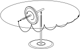

SOURCE: Feynman Lectures on Physics, Volume I, Chapter 20
LANGUAGE: en
TITLE: Chapter 20. Rotation in space
SOURCE_URL: https://www.feynmanlectures.caltech.edu/I_20.html
NOTEBOOKLM_USE: clean lecture text with TeX math and figure captions; reader navigation removed.

# Chapter 20. Rotation in space

## 20–1 Torques in three dimensions

In this chapter we shall discuss one of the most remarkable and amusing consequences of mechanics, the behavior of a rotating wheel. In order to do this we must first extend the mathematical formulation of rotational motion, the principles of angular momentum, torque, and so on, to three-dimensional space. We shall notusethese equations in all their generality and study all their consequences, because this would take many years, and we must soon turn to other subjects. In an introductory course we can present only the fundamental laws and apply them to a very few situations of special interest.

First, we notice that if we have a rotation in three dimensions, whether of a rigid body or any other system, what we deduced for two dimensions is still right. That is, it is still true that \(xF_y
- yF_x\) is the torque “in the \(xy\) -plane,” or the torque “around the \(z\) -axis.” It also turns out that this torque is still equal to the rate of change of \(xp_y - yp_x\) , for if we go back over the derivation of Eq. (18.15) from Newton’s laws we see that we did not have to assume that the motion was in a plane; when we differentiate \(xp_y - yp_x\) , we get \(xF_y - yF_x\) , so this theorem is still right. The quantity \(xp_y - yp_x\) , then, we call the angular momentum belonging to the \(xy\) -plane, or the angular momentum about the \(z\) -axis. This being true, we can use any other pair of axes and get another equation. For instance, we can use the \(yz\) -plane, and it is clear from symmetry that if we just substitute \(y\) for \(x\) and \(z\) for \(y\) , we would find \(yF_z -
zF_y\) for the torque and \(yp_z - zp_y\) would be the angular momentum associated with the \(yz\) -plane. Of course we could have another plane, the \(zx\) -plane, and for this we would find \(zF_x - xF_z = d/dt\,(zp_x -
xp_z)\) .

That these three equations can be deduced for the motion of a single particle is quite clear. Furthermore, if we added such things as \(xp_y
- yp_x\) together for many particles and called it the total angular momentum, we would have three kinds for the three planes \(xy\) , \(yz\) , and \(zx\) , and if we did the same with the forces, we would talk about the torque in the planes \(xy\) , \(yz\) , and \(zx\) also. Thus we would have laws that the external torque associated with any plane is equal to the rate of change of the angular momentum associated with that plane. This is just a generalization of what we wrote in two dimensions.

But now one may say, “Ah, but there are more planes; after all, can we not take some other plane at some angle, and calculate the torque on that plane from the forces? Since we would have to write another set of equations for every such plane, we would have a lot of equations!” Interestingly enough, it turns out that if we were to work out the combination \(x'F_{y'} - y'F_{x'}\) for another plane, measuring the \(x'\) , \(F_{y'}\) , etc., in that plane, the result can be written as somecombinationof the three expressions for the \(xy\) -, \(yz\) - and \(zx\) -planes. There is nothing new. In other words, if we know what the three torques in the \(xy\) -, \(yz\) -, and \(zx\) -planes are, then the torque in any other plane, and correspondingly the angular momentum also, can be written as some combination of these: six percent of one and ninety-two percent of another, and so on. This property we shall now analyze.

Suppose that in the \(xyz\) -axes, Joe has worked out all his torques and his angular momenta in his planes. But Moe has axes \(x',y',z'\) in some other direction. To make it a little easier, we shall suppose that only the \(x\) - and \(y\) -axes have been turned. Moe’s \(x'\) and \(y'\) are new, but his \(z'\) happens to be the same. That is, he has new planes, let us say, for \(yz\) and \(zx\) . He therefore has new torques and angular momenta which he would work out. For example, his torque in the \(x'y'\) -plane would be equal to \(x'F_{y'} - y'F_{x'}\) and so forth. What we must now do is to find the relationship between the new torques and the old torques, so we will be able to make a connection from one set of axes to the other. Someone may say, “That looks just like what we did with vectors.” And indeed, that is exactly what we are intending to do. Then he may say, “Well, isn’t torque just a vector?” Itdoesturn out to be a vector, but we do not know that right away without making an analysis. So in the following steps we shall make the analysis. We shall not discuss every step in detail, since we only want to illustrate how it works. The torques calculated by Joe are
\[
\begin{equation}
\begin{alignedat}{6}
&\tau_{xy}~&&=x&&F_y&&-y&&F_x&&,\\[.5ex]
&\tau_{yz}~&&=y&&F_z&&-z&&F_y&&,\\[.5ex]
&\tau_{zx}~&&=z&&F_x&&-x&&F_z&&.
\end{alignedat}
\label{Eq:I:20:1}
\end{equation}
\]

We digress at this point to note that in such cases as this one may get the wrong sign for some quantity if the coordinates are not handled in the right way. Why not write \(\tau_{yz}= zF_y - yF_z\) ? The problem arises from the fact that a coordinate system may be either “right-handed” or “left-handed.” Having chosen (arbitrarily) a sign for, say \(\tau_{xy}\) , then the correct expressions for the other two quantities may always be found by interchanging the letters \(xyz\) in either orderor

Moe now calculates the torques in his system:
\[
\begin{equation}
\begin{alignedat}{6}
&\tau_{x'y'}~&&=x'&&F_{y'}&&-y'&&F_{x'}&&,\\[.5ex]
&\tau_{y'z'}~&&=y'&&F_{z'}&&-z'&&F_{y'}&&,\\[.5ex]
&\tau_{z'x'}~&&=z'&&F_{x'}&&-x'&&F_{z'}&&.
\end{alignedat}
\label{Eq:I:20:2}
\end{equation}
\]
Now we suppose that one coordinate system is rotated by a fixed angle \(\theta\) , such that the \(z\) - and \(z'\) -axes are the same. (This angle \(\theta\) has nothing to do with rotating objects or what is going on inside the coordinate system. It is merely the relationship between the axes used by one man and the axes used by the other, and is supposedly constant.) Thus the coordinates of the two systems are related by
\[
\begin{equation}
\begin{alignedat}{4}
&x'~&&=x&&\cos\theta+y&&\sin\theta,\\[.5ex]
&y'~&&=y&&\cos\theta-x&&\sin\theta,\\[.5ex]
&z'~&&=z&&.
\end{alignedat}
\label{Eq:I:20:3}
\end{equation}
\]
Likewise, because force is a vector it transforms into the new system in the same way as do \(x\) , \(y\) , and \(z\) , since a thing is a vector if and only if the various components transform in the same way as \(x\) , \(y\) , and \(z\) :
\[
\begin{equation}
\begin{alignedat}{4}
&F_{x'}~&&=F_x&&\cos\theta+F_y&&\sin\theta,\\[.5ex]
&F_{y'}~&&=F_y&&\cos\theta-F_x&&\sin\theta,\\[.5ex]
&F_{z'}~&&=F_z&&.
\end{alignedat}
\label{Eq:I:20:4}
\end{equation}
\]

Now we can find out how the torque transforms by merely substituting for \(x'\) , \(y'\) , and \(z'\) the expressions (20.3), and for \(F_{x'}\) , \(F_{y'}\) , \(F_{z'}\) those given by (20.4), all into (20.2). So, we have a rather long string of terms for \(\tau_{x'y'}\) and (rather surprisingly at first) it turns out that it comes right down to \(xF_y - yF_x\) , which we recognize to be the torque in the \(xy\) -plane:
\[
\begin{align}
\tau_{x'y'}&=\!
\begin{aligned}[t]
&(x\cos\theta+y\sin\theta)(F_y\cos\theta-F_x\sin\theta)\\
-&(y\cos\theta-x\sin\theta)(F_x\cos\theta+F_y\sin\theta)
\end{aligned}\notag\\[2ex]
&=\!
\begin{aligned}[t]
&xF_y(\cos^2\theta+\sin^2\theta)\\
-&yF_x(\sin^2\theta+\cos^2\theta)\\
+&xF_x(-\sin\theta\cos\theta+\sin\theta\cos\theta)\\
+&yF_y(\sin\theta\cos\theta-\sin\theta\cos\theta)
\end{aligned}\notag\\[2ex]
\label{Eq:I:20:5}
&=xF_y - yF_x = \tau_{xy}.
\end{align}
\]
That result is clear, for if we only turn our axesin the plane, the twist around \(z\) in that plane is no different than it was before, because it is the same plane! What will be more interesting is the expression for \(\tau_{y'z'}\) , because that is a new plane. We now do exactly the same thing with the \(y'z'\) -plane, and it comes out as follows:
\[
\begin{align}
\tau_{y'z'}&=\!
\begin{aligned}[t]
&(y\cos\theta-x\sin\theta)F_z\\
&-~z(F_y\cos\theta-F_x\sin\theta)
\end{aligned}\notag\\[1ex]
&=(yF_z - zF_y)\cos\theta+(zF_x - xF_z)\sin\theta\notag\\[1ex]
\label{Eq:I:20:6}
&=\tau_{yz}\cos\theta+\tau_{zx}\sin\theta.
\end{align}
\]
Finally, we do it for \(z'x'\) :
\[
\begin{align}
\tau_{z'x'}&=\!
\begin{aligned}[t]
&z(F_x\cos\theta+F_y\sin\theta)\\
&-(x\cos\theta+y\sin\theta)F_z
\end{aligned}\notag\\[1ex]
&=(zF_x - xF_z)\cos\theta-(yF_z - z F_y)\sin\theta\notag\\[1ex]
\label{Eq:I:20:7}
&=\tau_{zx}\cos\theta-\tau_{yz}\sin\theta.
\end{align}
\]

We wanted to get a rule for finding torques in new axes in terms of torques in old axes, and now we have the rule. How can we ever remember that rule? If we look carefully at (20.5), (20.6), and (20.7), we see that there is a close relationship between these equations and the equations for \(x\) , \(y\) , and \(z\) . If, somehow, we could call \(\tau_{xy}\) the \(z\) -componentof something, let us call it the \(z\) -component of \(\FLPtau\) , then it would be all right; we would understand (20.5) as a vector transformation, since the \(z\) -component would be unchanged, as it should be. Likewise, if we associate with the \(yz\) -plane the \(x\) -component of our newly invented vector, and with the \(zx\) -plane, the \(y\) -component, then these transformation expressions would read
\[
\begin{equation}
\begin{alignedat}{4}
&\tau_{z'}~&&=\tau_z&&,\\[.5ex]
&\tau_{x'}~&&=\tau_x&&\cos\theta+\tau_y&&\sin\theta,\\[.5ex]
&\tau_{y'}~&&=\tau_y&&\cos\theta-\tau_x&&\sin\theta,
\end{alignedat}
\label{Eq:I:20:8}
\end{equation}
\]
which is just the rule for vectors!

Therefore we have proved that we may identify the combination of \(xF_y
- yF_x\) with what we ordinarily call the \(z\) -component of a certain artificially invented vector. Although a torque is a twist on a plane, and it has noa priorivector character, mathematically it does behave like a vector. This vector is at right angles to the plane of the twist, and its length is proportional to the strength of the twist. The three components of such a quantity will transform like a real vector.

So we represent torques by vectors; with each plane on which the torque is supposed to be acting, we associate a line at right angles, by a rule. But “at right angles” leaves the sign unspecified. To get the sign right, we must adopt a rule which will tell us that if the torque were in a certain sense on the \(xy\) -plane, then the axis that we want to associate with it is in the “up” \(z\) -direction. That is, somebody has to define “right” and “left” for us. Supposing that the coordinate system is \(x\) , \(y\) , \(z\) in a right-hand system, then the rule will be the following: if we think of the twist as if we were turning a screw having a right-hand thread, then the direction of the vector that we will associate with that twist is in the direction that the screw would advance.

Why is torque a vector? It is a miracle of good luck that we can associate a single axis with a plane, and therefore that we can associate a vector with the torque; it is a special property of three-dimensional space. In two dimensions, the torque is an ordinary scalar, and there need be no direction associated with it. In three dimensions, it is a vector. If we had four dimensions, we would be in great difficulty, because (if we had time, for example, as the fourth dimension) we would not only have planes like \(xy\) , \(yz\) , and \(zx\) , we would also have \(tx\) -, \(ty\) -, and \(tz\) -planes. There would besixof them, and one cannot represent six quantities as one vector in four dimensions.

We will be living in three dimensions for a long time, so it is well to notice that the foregoing mathematical treatment did not depend upon the fact that \(x\) was position and \(F\) was force; it only depended on the transformation laws for vectors. Therefore if, instead of \(x\) , we used the \(x\) -component of some other vector, it is not going to make any difference. In other words, if we were to calculate \(a_xb_y - a_yb_x\) , where \(\FLPa\) and \(\FLPb\) are vectors, and call it the \(z\) -component of some new quantity \(c\) , then these new quantities form a vector \(\FLPc\) . We need a mathematical notation for the relationship of the new vector, with its three components, to the vectors \(\FLPa\) and \(\FLPb\) . The notation that has been devised for this is \(\FLPc = \FLPa\times\FLPb\) . We have then, in addition to the ordinary scalar product in the theory of vector analysis, a new kind of product, called thevector product. Thus, if \(\FLPc = \FLPa\times\FLPb\) , this is the same as writing
\[
\begin{equation}
\begin{alignedat}{6}
&c_x~&&=a_y&&b_z&&-a_z&&b_y&&,\\[.5ex]
&c_y~&&=a_z&&b_x&&-a_x&&b_z&&,\\[.5ex]
&c_z~&&=a_x&&b_y&&-a_y&&b_x&&.
\end{alignedat}
\label{Eq:I:20:9}
\end{equation}
\]
If we reverse the order of \(\FLPa\) and \(\FLPb\) , calling \(\FLPa\) , \(\FLPb\) and \(\FLPb\) , \(\FLPa\) , we would have the sign of \(\FLPc\) reversed, because \(c_z\) would be \(b_xa_y - b_ya_x\) . Therefore the cross product is unlike ordinary multiplication, where \(ab = ba\) ; for the cross product, \(\FLPb\times\FLPa = -\FLPa\times\FLPb\) . From this, we can prove at once that if \(\FLPa = \FLPb\) , the cross product is zero. Thus, \(\FLPa\times\FLPa = 0\) .

The cross product is very important for representing the features of rotation, and it is important that we understand the geometrical relationship of the three vectors \(\FLPa\) , \(\FLPb\) , and \(\FLPc\) . Of course the relationship in components is given in Eq. (20.9) and from that one can determine what the relationship is in geometry. The answer is, first, that the vector \(\FLPc\) is perpendicular to both \(\FLPa\) and \(\FLPb\) . (Try to calculate \(\FLPc\cdot\FLPa\) , and see if it does not reduce to zero.) Second, the magnitude of \(\FLPc\) turns out to be the magnitude of \(\FLPa\) times the magnitude of \(\FLPb\) times the sine of the angle between the two. In which direction does \(\FLPc\) point? Imagine that we turn \(\FLPa\) into \(\FLPb\) through an angle less than \(180^\circ\) ; a screw with a right-hand thread turning in this way will advance in the direction of \(\FLPc\) . The fact that we say aright-hand screw instead of aleft-hand screw is a convention, and is a perpetual reminder that if \(\FLPa\) and \(\FLPb\) are “honest” vectors in the ordinary sense, the new kind of “vector” which we have created by \(\FLPa\times\FLPb\) is artificial, or slightly different in its character from \(\FLPa\) and \(\FLPb\) , because it was made up with a special rule. If \(\FLPa\) and \(\FLPb\) are called ordinary vectors, we have a special name for them, we call thempolar vectors. Examples of such vectors are the coordinate \(\FLPr\) , force \(\FLPF\) , momentum \(\FLPp\) , velocity \(\FLPv\) , electric field \(\FLPE\) , etc.; these are ordinary polar vectors. Vectors which involve just one cross product in their definition are calledaxial vectorsorpseudo vectors. Examples of pseudo vectors are, of course, torque \(\FLPtau\) and the angular momentum \(\FLPL\) . It also turns out that the angular velocity \(\FLPomega\) is a pseudo vector, as is the magnetic field \(\FLPB\) .

In order to complete the mathematical properties of vectors, we should know all the rules for their multiplication, using dot and cross products. In our applications at the moment, we will need very little of this, but for the sake of completeness we shall write down all of the rules for vector multiplication so that we can use the results later. These are
\[
\begin{equation}
\begin{alignedat}{2}
&(\text{a})&\quad
\FLPa\times(\FLPb+\FLPc)&\;=\FLPa\times\FLPb+\FLPa\times\FLPc,\\[.5ex]
&(\text{b})&\quad
(\alpha\FLPa)\times\FLPb&\;=\alpha(\FLPa\times\FLPb),\\[.5ex]
&(\text{c})&\quad
\FLPa\cdot(\FLPb\times\FLPc)&\;=(\FLPa\times\FLPb)\cdot\FLPc,\\[.5ex]
&(\text{d})&\quad
\FLPa\times(\FLPb\times\FLPc)&\;=\FLPb(\FLPa\cdot\FLPc)-
\FLPc(\FLPa\cdot\FLPb),\\[.5ex]
&(\text{e})&\;\quad
\FLPa\times\FLPa&\;=0,\\[.5ex]
&(\text{f})&\;\quad
\FLPa\cdot(\FLPa\times\FLPb)&\;=0.
\end{alignedat}
\label{Eq:I:20:10}
\end{equation}
\]

## 20–2 The rotation equations using cross products

Now let us ask whether any equations in physics can be written using the cross product. The answer, of course, is that a great many equations can be so written. For instance, we see immediately that the torque is equal to the position vector cross the force:
\[
\begin{equation}
\label{Eq:I:20:11}
\FLPtau=\FLPr\times\FLPF.
\end{equation}
\]
This is a vector summary of the three equations \(\tau_x = yF_z -
zF_y\) , etc. By the same token, the angular momentum vector, if there is only one particle present, is the distance from the origin multiplied by the vector momentum:
\[
\begin{equation}
\label{Eq:I:20:12}
\FLPL=\FLPr\times\FLPp.
\end{equation}
\]
For three-dimensional space rotation, the dynamical law analogous to the law \(\FLPF = d\FLPp/dt\) of Newton, is that the torque vector is the rate of change with time of the angular momentum vector:
\[
\begin{equation}
\label{Eq:I:20:13}
\FLPtau=d\FLPL/dt.
\end{equation}
\]
If we sum (20.13) over many particles, the external torque on a system is the rate of change of the total angular momentum:
\[
\begin{equation}
\label{Eq:I:20:14}
\FLPtau_{\text{ext}}=d\FLPL_{\text{tot}}/dt.
\end{equation}
\]

Another theorem: If the total external torque is zero, then the total vector angular momentum of the system is a constant. This is called the law ofconservation of angular momentum. If there is no torque on a given system, its angular momentum cannot change.

What about angular velocity? Is it a vector? We have already discussed turning a solid object about a fixed axis, but for a moment suppose that we are turning it simultaneously abouttwoaxes. It might be turning about an axis inside a box, while the box is turning about some other axis. The net result of such combined motions is that the object simply turns about some new axis! The wonderful thing about this new axis is that it can be figured out this way. If the rate of turning in the \(xy\) -plane is written as a vector in the \(z\) -direction whose length is equal to the rate of rotation in the plane, and if another vector is drawn in the \(y\) -direction, say, which is the rate of rotation in the \(zx\) -plane, then if we add these together as a vector, the magnitude of the result tells us how fast the object is turning, and the direction tells us in what plane, by the rule of the parallelogram. That is to say, simply, angular velocityisa vector, where we draw the magnitudes of the rotations in the three planes as projections at right angles to those planes.1

As a simple application of the use of the angular velocity vector, we may evaluate the power being expended by the torque acting on a rigid body. The power, of course, is the rate of change of work with time; in three dimensions, the power turns out to be \(P =
\FLPtau\cdot\FLPomega\) .

All the formulas that we wrote for plane rotation can be generalized to three dimensions. For example, if a rigid body is turning about a certain axis with angular velocity \(\FLPomega\) , we might ask, “What is the velocity of a point at a certain radial position \(\FLPr\) ?” We shall leave it as a problem for the student to show that the velocity of a particle in a rigid body is given by \(\FLPv=
\FLPomega\times\FLPr\) , where \(\FLPomega\) is the angular velocity and \(\FLPr\) is the position. Also, as another example of cross products, we had a formula for Coriolis force, which can also be written using cross products: \(\FLPF_c =
2m\FLPv\times\FLPomega\) . That is, if a particle is moving with velocity \(\FLPv\) in a coordinate system which is, in fact, rotating with angular velocity \(\FLPomega\) , and we want to think in terms of the rotating coordinate system, then we have to add the pseudo force \(\FLPF_c\) .

## 20–3 The gyroscope

### Figure Ch20-F1
Caption: Fig. 20–1.Before:axis is horizontal; momentum about vertical axis \({}= 0\) .After:axis is vertical; momentum about vertical axis is still zero; man and chair spin in direction opposite to spin of the wheel.
Image: figures/Ch20-F1.svg

Let us now return to the law of conservation of angular momentum. This law may be demonstrated with a rapidly spinning wheel, or gyroscope, as follows (see Fig.20–1). If we sit on a swivel chair and hold the spinning wheel with its axis horizontal, the wheel has an angular momentum about the horizontal axis. Angular momentum around averticalaxis cannot change because of the (frictionless) pivot of the chair, so if we turn the axis of the wheel into the vertical, then the wheel would have angular momentum about the vertical axis, because it is now spinning about this axis. But thesystem(wheel, ourself, and chair)cannothave a vertical component, so we and the chair have to turn in the direction opposite to the spin of the wheel, to balance it.

### Figure Ch20-F2
Caption: Fig. 20–2.A gyroscope.
Image: figures/Ch20-F2.svg

First let us analyze in more detail the thing we have just described. What is surprising, and what we must understand, is the origin of the forces which turn us and the chair around as we turn the axis of the gyroscope toward the vertical. Figure20–2shows the wheel spinning rapidly about the \(y\) -axis. Therefore its angular velocity is about that axis and, it turns out, its angular momentum is likewise in that direction. Now suppose that we wish to rotate the wheel about the \(x\) -axis at a small angular velocity \(\Omega\) ; what forces are required? After a short time \(\Delta t\) , the axis has turned to a new position, tilted at an angle \(\Delta\theta\) with the horizontal. Since the major part of the angular momentum is due to the spin on the axis (very little is contributed by the slow turning), we see that the angular momentum vector has changed. What is the change in angular momentum? The angular momentum does not change inmagnitude, but it does change indirectionby an amount \(\Delta\theta\) . The magnitude of the vector \(\Delta\FLPL\) is thus \(\Delta L = L_0\,\Delta\theta\) , so that the torque, which is the time rate of change of the angular momentum, is \(\tau= \Delta L/\Delta
t = L_0\,\Delta\theta/\Delta t = L_0\Omega\) . Taking the directions of the various quantities into account, we see that
\[
\begin{equation}
\label{Eq:I:20:15}
\FLPtau=\FLPOmega\times\FLPL_0.
\end{equation}
\]
Thus, if \(\FLPOmega\) and \(\FLPL_0\) are both horizontal, as shown in the figure, \(\FLPtau\) isvertical. To produce such a torque, horizontal forces \(\FLPF\) and \(-\FLPF\) must be applied at the ends of the axle. How are these forces applied? By our hands, as we try to rotate the axis of the wheel into the vertical direction. But Newton’s Third Law demands that equal and opposite forces (and equal and oppositetorques) act onus. This causes us to rotate in the opposite sense about the vertical axis \(z\) .

### Figure Ch20-F3
Caption: Fig. 20–3.A rapidly spinning top. Note that the direction of the torque vector is the direction of the precession.
Image: figures/Ch20-F3.svg

This result can be generalized for a rapidly spinning top. In the familiar case of a spinning top, gravity acting on its center of mass furnishes a torque about the point of contact with the floor (see Fig.20–3). This torque is in the horizontal direction, and causes the top to precess with its axis moving in a circular cone about the vertical. If \(\FLPOmega\) is the (vertical) angular velocity of precession, we again find that
\[
\begin{equation*}
\FLPtau=d\FLPL/dt=\FLPOmega\times\FLPL_0.
\end{equation*}
\]
Thus, when we apply a torque to a rapidly spinning top, the direction of the precessional motion is in the direction of the torque, or at right angles to the forces producing the torque.

We may now claim to understand the precession of gyroscopes, and indeed we do, mathematically. However, this is a mathematical thing which, in a sense, appears as a “miracle.” It will turn out, as we go to more and more advanced physics, that many simple things can be deduced mathematically more rapidly than they can be really understood in a fundamental or simple sense. This is a strange characteristic, and as we get into more and more advanced work there are circumstances in which mathematics will produce results whichno onehas really been able to understand in any direct fashion. An example is the Dirac equation, which appears in a very simple and beautiful form, but whose consequences are hard to understand. In our particular case, the precession of a top looks like some kind of a miracle involving right angles and circles, and twists and right-hand screws. What we should try to do is to understand it in a more physical way.

### Figure Ch20-F4
Caption: Fig. 20–4.The motion of particles in the spinning wheel of Fig.20–2, whose axis is turning, is in curved lines.
Image: figures/Ch20-F4.svg

How can we explain the torque in terms of the real forces and the accelerations? We note that when the wheel is precessing, the particles that are going around the wheel are not really moving in a plane because the wheel is precessing (see Fig.20–4). As we explained previously (Fig.19–4), the particles which are crossing through the precession axis are moving incurved paths, and this requires application of a lateral force. This is supplied by our pushing on the axle, which then communicates the force to the rim through the spokes. “Wait,” someone says, “what about the particles that are going back on the other side?” It does not take long to decide that there must be a force in theopposite directionon that side. The net force that we have to apply is therefore zero. Theforcesbalance out, but one of them must be applied at one side of the wheel, and the other must be applied at the other side of the wheel. We could apply these forces directly, but because the wheel is solid we are allowed to do it by pushing on the axle, since forces can be carried up through the spokes.

What we have so far proved is that if the wheel is precessing, it can balance the torque due to gravity or some other applied torque. But all we have shown is that this isasolution of an equation. That is, if the torque is given, andif we get the spinning started right, then the wheel will precess smoothly and uniformly. But we have not proved (and it is not true) that a uniform precession is themost generalmotion a spinning body can undergo as the result of a given torque. The general motion involves also a “wobbling” about the mean precession. This “wobbling” is callednutation.

Some people like to say that when one exerts a torque on a gyroscope, it turns and it precesses, and that the torqueproducesthe precession. It is very strange that when one suddenly lets go of a gyroscope, it does notfallunder the action of gravity, but moves sidewise instead! Why is it that thedownwardforce of the gravity, which weknowandfeel, makes it gosidewise? All the formulas in the world like (20.15) are not going to tell us, because (20.15) is a special equation, valid only after the gyroscope is precessing nicely. What really happens, in detail, is the following. If we were to hold the axis absolutely fixed, so that it cannot precess in any manner (but the top is spinning) then there is no torque acting, not even a torque from gravity, because it is balanced by our fingers. But if we suddenly let go, then there will instantaneously be a torque from gravity. Anyone in his right mind would think that the top would fall, and that is what it starts to do, as can be seen if the top is not spinning too fast.

The gyro actually does fall, as we would expect. But as soon as it falls, it is then turning, and if this turning were to continue, a torque would be required. In the absence of a torque in this direction, the gyro begins to “fall” in the direction opposite that of the missing force. This gives the gyro a component of motion around the vertical axis, as it would have in steady precession. But the actual motion “overshoots” the steady precessional velocity, and the axis actually rises again to the level from which it started. The path followed by the end of the axle is a cycloid (the path followed by a pebble that is stuck in the tread of an automobile tire). Ordinarily, this motion is too quick for the eye to follow, and it damps out quickly because of the friction in the gimbal bearings, leaving only the steady precessional drift (Fig.20–5). The slower the wheel spins, the more obvious the nutation is.

### Figure Ch20-F5
Caption: Fig. 20–5.Actual motion of tip of axis of gyroscope under gravity just after releasing axis previously held fixed.
Image: figures/Ch20-F5.svg

When the motion settles down, the axis of the gyro is a little bit lower than it was at the start. Why? (These are the more complicated details, but we bring them in because we do not want the reader to get the idea that the gyroscope is an absolute miracle. Itisa wonderful thing, but it is not a miracle.) If we were holding the axis absolutely horizontally, and suddenly let go, then the simple precession equation would tell us that it precesses, that it goes around in a horizontal plane. But that is impossible! Although we neglected it before, it is true that the wheel hassomemoment of inertia about the precession axis, and if it is moving about that axis, even slowly, it has a weak angular momentum about the axis. Where did it come from? If the pivots are perfect, there is no torque about the vertical axis. How thendoesit get to precess if there is no change in the angular momentum? The answer is that the cycloidal motion of the end of the axis damps down to the average, steady motion of the center of the equivalent rolling circle. That is, it settles down a little bit low. Because it is low, the spin angular momentum now has a small vertical component, which is exactly what is needed for the precession. So you see it has to go down a little, in order to go around. It has to yield a little bit to the gravity; by turning its axis down a little bit, it maintains the rotation about the vertical axis. That, then, is the way a gyroscope works.

## 20–4 Angular momentum of a solid body

### Figure Ch20-F6
Caption: Fig. 20–6.The angular momentum of a rotating body is not necessarily parallel to the angular velocity.
Image: figures/Ch20-F6.svg

Before we leave the subject of rotations in three dimensions, we shall discuss, at least qualitatively, a few effects that occur in three-dimensional rotations that are not self-evident. The main effect is that, in general, the angular momentum of a rigid body isnot necessarilyin the same direction as the angular velocity. Consider a wheel that is fastened onto a shaft in a lopsided fashion, but with the axis through the center of gravity, to be sure (Fig.20–6). When we spin the wheel around the axis, anybody knows that there will be shaking at the bearings because of the lopsided way we have it mounted. Qualitatively, we know that in the rotating system there is centrifugal force acting on the wheel, trying to throw its mass as far as possible from the axis. This tends to line up the plane of the wheel so that it is perpendicular to the axis. To resist this tendency, a torque is exerted by the bearings. If there is a torque exerted by the bearings, there must be a rate of change of angular momentum. How can there be a rate of change of angular momentum when we are simply turning the wheel about the axis? Suppose we break the angular velocity \(\FLPomega\) into components \(\FLPomega_1\) and \(\FLPomega_2\) perpendicular and parallel to the plane of the wheel. What is the angular momentum? The moments of inertia about these two axes aredifferent, so the angular momentum components, which (in these particular, special axes only) are equal to the moments of inertia times the corresponding angular velocity components, are in adifferent ratiothan are the angular velocity components. Therefore the angular momentum vector is in a direction in spacenotalong the axis. When we turn the object, we have to turn the angular momentum vector in space, so we must exert torques on the shaft.

Although it is much too complicated to prove here, there is a very important and interesting property of the moment of inertia which is easy to describe and to use, and which is the basis of our above analysis. This property is the following: Any rigid body, even an irregular one like a potato, possesses three mutually perpendicular axes through the CM, such that the moment of inertia about one of these axes has the greatest possible value for any axis through the CM, the moment of inertia about another of the axes has theminimumpossible value, and the moment of inertia about the third axis is intermediate between these two (or equal to one of them). These axes are called theprincipal axesof the body, and they have the important property that if the body is rotating about one of them, its angular momentum is in the same direction as the angular velocity. For a body having axes of symmetry, the principal axes are along the symmetry axes.

### Figure Ch20-F7
Caption: Fig. 20–7.The angular velocity and angular momentum of a rigid body \((A>B>C)\) .
Image: figures/Ch20-F7.svg

If we take the \(x\) -, \(y\) -, and \(z\) -axes along the principal axes, and call the corresponding principal moments of inertia \(A\) , \(B\) , and \(C\) , we may easily evaluate the angular momentum and the kinetic energy of rotation of the body for any angular velocity \(\FLPomega\) . If we resolve \(\FLPomega\) into components \(\omega_x\) , \(\omega_y\) , and \(\omega_z\) along the \(x\) -, \(y\) -, \(z\) -axes, and use unit vectors \(\FLPi\) , \(\FLPj\) , \(\FLPk\) , also along \(x\) , \(y\) , \(z\) , we may write the angular momentum as
\[
\begin{equation}
\label{Eq:I:20:16}
\FLPL=A\omega_x\FLPi+B\omega_y\FLPj+C\omega_z\FLPk.
\end{equation}
\]
The kinetic energy of rotation is
\[
\begin{align}
\label{Eq:I:20:17}
\text{KE} &=\tfrac{1}{2}(A\omega_x^2+B\omega_y^2+C\omega_z^2)\\[1ex]
&=\tfrac{1}{2}\FLPL\cdot\FLPomega.\
\end{align}
\]
