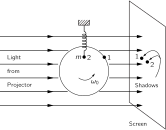

SOURCE: Feynman Lectures on Physics, Volume I, Chapter 21
LANGUAGE: en
TITLE: Chapter 21. The Harmonic Oscillator
SOURCE_URL: https://www.feynmanlectures.caltech.edu/I_21.html
NOTEBOOKLM_USE: clean lecture text with TeX math and figure captions; reader navigation removed.

# Chapter 21. The Harmonic Oscillator

## 21–1 Linear differential equations

In the study of physics, usually the course is divided into a series of subjects, such as mechanics, electricity, optics, etc., and one studies one subject after the other. For example, this course has so far dealt mostly with mechanics. But a strange thing occurs again and again: the equations which appear in different fields of physics, and even in other sciences, are often almost exactly the same, so that many phenomena have analogs in these different fields. To take the simplest example, the propagation of sound waves is in many ways analogous to the propagation of light waves. If we study acoustics in great detail we discover that much of the work is the same as it would be if we were studying optics in great detail. So the study of a phenomenon in one field may permit an extension of our knowledge in another field. It is best to realize from the first that such extensions are possible, for otherwise one might not understand the reason for spending a great deal of time and energy on what appears to be only a small part of mechanics.

The harmonic oscillator, which we are about to study, has close analogs in many other fields; although we start with a mechanical example of a weight on a spring, or a pendulum with a small swing, or certain other mechanical devices, we are really studying a certaindifferential equation. This equation appears again and again in physics and in other sciences, and in fact it is a part of so many phenomena that its close study is well worth our while. Some of the phenomena involving this equation are the oscillations of a mass on a spring; the oscillations of charge flowing back and forth in an electrical circuit; the vibrations of a tuning fork which is generating sound waves; the analogous vibrations of the electrons in an atom, which generate light waves; the equations for the operation of a servosystem, such as a thermostat trying to adjust a temperature; complicated interactions in chemical reactions; the growth of a colony of bacteria in interaction with the food supply and the poisons the bacteria produce; foxes eating rabbits eating grass, and so on; all these phenomena follow equations which are very similar to one another, and this is the reason why we study the mechanical oscillator in such detail. The equations are calledlinear differential equations with constant coefficients. A linear differential equation with constant coefficients is a differential equation consisting of a sum of several terms, each term being a derivative of the dependent variable with respect to the independent variable, and multiplied by some constant. Thus
\[
\begin{align}
a_n\,d^nx/dt^n&+a_{n-1}\,d^{n-1}x/dt^{n-1}+\dotsb\notag\\
&+a_1\,dx/dt+a_0x=f(t)
\label{Eq:I:21:1}
\end{align}
\]
is called a linear differential equation of order \(n\) with constant coefficients (each \(a_i\) is constant).

## 21–2 The harmonic oscillator

### Figure Ch21-F1
Caption: Fig. 21–1.A mass on a spring: a simple example of a harmonic oscillator.
Image: figures/Ch21-F1.svg

Perhaps the simplest mechanical system whose motion follows a linear differential equation with constant coefficients is a mass on a spring: first the spring stretches to balance the gravity; once it is balanced, we then discuss the vertical displacement of the mass from its equilibrium position (Fig.21–1). We shall call this upward displacement \(x\) , and we shall also suppose that the spring is perfectly linear, in which case the force pulling back when the spring is stretched is precisely proportional to the amount of stretch. That is, the force is \(-kx\) (with a minus sign to remind us that it pulls back). Thus the mass times the acceleration must equal \(-kx\) :
\[
\begin{equation}
\label{Eq:I:21:2}
m\,d^2x/dt^2=-kx.
\end{equation}
\]
For simplicity, suppose it happens (or we change our unit of time measurement) that the ratio \(k/m = 1\) . We shall first study the equation
\[
\begin{equation}
\label{Eq:I:21:3}
d^2x/dt^2=-x.
\end{equation}
\]
Later we shall come back to Eq. (21.2) with the \(k\) and \(m\) explicitly present.

We have already analyzed Eq. (21.3) in detail numerically; when we first introduced the subject of mechanics we solved this equation (see Eq.9.12) to find the motion. By numerical integration we found a curve (Fig.9–4) which showed that if \(m\) was initially displaced, but at rest, it would come down and go through zero; we did not then follow it any farther, but of course we know that it just keeps going up and down—itoscillates. When we calculated the motion numerically, we found that it went through the equilibrium point at \(t = 1.570\) . The length of the whole cycle is four times this long, or \(t_0 = 6.28\) “sec.” This was found numerically, before we knew much calculus. We assume that in the meantime the Mathematics Department has brought forth a function which, when differentiated twice, is equal to itself with a minus sign. (There are, of course, ways of getting at this function in a direct fashion, but they are more complicated than already knowing what the answer is.) The function is \(x= \cos t\) . If we differentiate this we find \(dx/dt = -\sin t\) and \(d^2x/dt^2 =\) \(-\cos t=\) \(-x\) . The function \(x =
\cos t\) starts, at \(t = 0\) , with \(x= 1\) , and no initial velocity; that was the situation with which we started when we did our numerical work. Now that we know that \(x = \cos t\) , we can calculate aprecisevalue for the time at which it should pass \(x = 0\) . The answer is \(t=\pi/2\) , or \(1.57080\) . We were wrong in the last figure because of the errors of numerical analysis, but it was very close!

Now to go further with the original problem, we restore the time units to real seconds. What is the solution then? First of all, we might think that we can get the constants \(k\) and \(m\) in by multiplying \(\cos t\) by something. So let us try the equation \(x = A \cos t\) ; then we find \(dx/dt = -A \sin t\) , and \(d^2x/dt^2 =\) \(-A \cos t=\) \(-x\) . Thus we discover to our horror that we did not succeed in solving Eq. (21.2), but we got Eq. (21.3) again! That fact illustrates one of the most important properties of linear differential equations:if we multiply a solution of the equation by any constant, it is again a solution. The mathematical reason for this is clear. If \(x\) is a solution, and we multiply both sides of the equation, say by \(A\) , we see that all derivatives are also multiplied by \(A\) , and therefore \(Ax\) is just as good a solution of the original equation as \(x\) was. The physics of it is the following. If we have a weight on a spring, and pull it down twice as far, the force is twice as much, the resulting acceleration is twice as great, the velocity it acquires in a given time is twice as great, the distance covered in a given time is twice as great; but ithasto cover twice as great a distance in order to get back to the origin because it is pulled down twice as far. So it takes thesame timeto get back to the origin, irrespective of the initial displacement. In other words, with a linear equation, the motion has the sametime pattern, no matter how “strong” it is.

That was the wrong thing to do—it only taught us that we can multiply the solution by anything, and it satisfies the same equation, but not a different equation. After a little cut and try to get to an equation with a different constant multiplying \(x\) , we find that we must alter the scale oftime. In other words, Eq. (21.2) has a solution of the form
\[
\begin{equation}
\label{Eq:I:21:4}
x=\cos\omega_0t.
\end{equation}
\]
(It is important to realize that in the present case, \(\omega_0\) is not an angular velocity of a spinning body, but we run out of letters if we are not allowed to use the same letter for more than one thing.) The reason we put a subscript “ \(0\) ” on \(\omega\) is that we are going to have more omegas before long; let us remember that \(\omega_0\) refers to the natural motion of this oscillator. Now we try Eq. (21.4) and this time we are more successful, because \(dx/dt =-\omega_0\sin \omega_0t\) and \(d^2x/dt^2
=\) \(-\omega_0^2\cos\omega_0t =\) \(-\omega_0^2x\) . So at last we have solved the equation that we really wanted to solve. The equation \(d^2x/dt^2
=-\omega_0^2x\) is the same as Eq. (21.2) if \(\omega_0^2 =
k/m\) .

The next thing we must investigate is the physical significance of \(\omega_0\) . We know that the cosine function repeats itself when the angle it refers to is \(2\pi\) . So \(x= \cos\omega_0t\) will repeat its motion, it will go through a complete cycle, when the “angle” changes by \(2\pi\) . The quantity \(\omega_0t\) is often called thephaseof the motion. In order to change \(\omega_0t\) by \(2\pi\) , the time must change by an amount \(t_0\) , called theperiodof one complete oscillation; of course \(t_0\) must be such that \(\omega_0t_0 = 2\pi\) . That is, \(\omega_0t_0\) must account for one cycle of the angle, and then everything will repeat itself—if we increase \(t\) by \(t_0\) , we add \(2\pi\) to the phase. Thus
\[
\begin{equation}
\label{Eq:I:21:5}
t_0=2\pi/\omega_0=2\pi\sqrt{m/k}.
\end{equation}
\]
Thus if we had a heavier mass, it would take longer to oscillate back and forth on a spring. That is because it has more inertia, and so, while the forces are the same, it takes longer to get the mass moving. Or, if the spring is stronger, it will move more quickly, and that is right: the period is less if the spring is stronger.

Note that the period of oscillation of a mass on a spring does not depend in any way onhowit has been started, how far down we pull it. Theperiodis determined, but the amplitude of the oscillation isnotdetermined by the equation of motion (21.2). The amplitudeisdetermined, in fact, by how we let go of it, by what we call theinitial conditionsor starting conditions.

Actually, we have not quite found the most general possible solution of Eq. (21.2). There are other solutions. It should be clear why: because all of the cases covered by \(x = a \cos \omega_0t\) start with an initial displacement and no initial velocity. But it is possible, for instance, for the mass to start at \(x= 0\) , and we may then give it an impulsive kick, so that it has some speed at \(t =
0\) . Such a motion is not represented by a cosine—it is represented by a sine. To put it another way, if \(x = \cos \omega_0t\) is a solution, then is it not obvious that if we were to happen to walk into the room at some time (which we would call “ \(t = 0\) ”) and saw the mass as it was passing \(x= 0\) , it would keep on going just the same? Therefore, \(x = \cos \omega_0t\) cannot be the most general solution; it must be possible to shift the beginning of time, so to speak. As an example, we could write the solution this way: \(x= a \cos
\omega_0(t - t_1)\) , where \(t_1\) is some constant. This also corresponds to shifting the origin of time to some new instant. Furthermore, we may expand
\[
\begin{equation*}
\cos\,(\omega_0t+\Delta)=\cos\omega_0t\cos\Delta-
\sin\omega_0t\sin\Delta,
\end{equation*}
\]
and write
\[
\begin{equation*}
x = A \cos \omega_0t + B \sin \omega_0t,
\end{equation*}
\]
where \(A = a \cos\Delta\) and \(B = -a \sin\Delta\) . Any one of these forms is a possible way to write the complete, general solution of (21.2): that is, every solution of the differential equation \(d^2x/dt^2 =-\omega_0^2x\) that exists in the world can be written as
\[
\begin{alignat}{2}
&(\text{a})\quad x&=\;&a\cos\omega_0(t-t_1),\notag\\[1ex]
\kern{-2em}\text{or}\notag\\ % ebook remove
% ebook insert: \makebox[0em]{\kern{-3.33em}\text{or}}\notag\\
\label{Eq:I:21:6}
&(\text{b})\quad x&=\;&a\cos\,(\omega_0t+\Delta)\\[1ex]
\kern{-2em}\text{or}\notag\\ % ebook remove
% ebook insert: \makebox[0em]{\kern{-3.33em}\text{or}}\notag\\
&(\text{c})\quad x&=\;&A\cos\omega_0t+B\sin\omega_0t.\notag
\end{alignat}
\]

Some of the quantities in (21.6) have names: \(\omega_0\) is called theangular frequency; it is the number of radians by which the phase changes in a second. That is determined by the differential equation. The other constants are not determined by the equation, but by how the motion is started. Of these constants, \(a\) measures the maximum displacement attained by the mass, and is called theamplitudeof oscillation. The constant \(\Delta\) is sometimes called thephaseof the oscillation, but that is a confusion, because other people call \(\omega_0t +
\Delta\) the phase, and say the phase changes with time. We might say that \(\Delta\) is aphase shiftfrom some defined zero. Let us put it differently. Different \(\Delta\) ’s correspond to motions in different phases. That is true, but whether we want to call \(\Delta\) thephase, or not, is another question.

## 21–3 Harmonic motion and circular motion

### Figure Ch21-F2
Caption: Fig. 21–2.A particle moving in a circular path at constant speed.
Image: figures/Ch21-F2.svg

The fact that cosines are involved in the solution of Eq. (21.2) suggests that there might be some relationship to circles. This is artificial, of course, because there is no circle actually involved in the linear motion—it just goes up and down. We may point out that we have, in fact, already solved that differential equation when we were studying the mechanics of circular motion. If a particle moves in a circle with a constant speed \(v\) , the radius vector from the center of the circle to the particle turns through an angle whose size is proportional to the time. If we call this angle \(\theta=
vt/R\) (Fig.21–2) then \(d\theta/dt =\) \(\omega_0 =\) \(v/R\) . We know that there is an acceleration \(a =\) \(v^2/R =\) \(\omega_0^2R\) toward the center. Now we also know that the position \(x\) , at a given moment, is the radius of the circle times \(\cos\theta\) , and that \(y\) is the radius times \(\sin\theta\) :
\[
\begin{equation*}
x=R\cos\theta,\quad
y=R\sin\theta.
\end{equation*}
\]
Now what about the acceleration? What is the \(x\) -component of acceleration, \(d^2x/dt^2\) ? We have already worked that out geometrically; it is the magnitude of the acceleration times the cosine of the projection angle, with a minus sign because it is toward the center.
\[
\begin{equation}
\label{Eq:I:21:7}
a_x=-a\cos\theta=-\omega_0^2R\cos\theta=-\omega_0^2x.
\end{equation}
\]
In other words, when a particle is moving in a circle, the horizontal component of its motion has an acceleration which is proportional to the horizontal displacement from the center. Of course we also have the solution for motion in a circle: \(x = R \cos \omega_0t\) . Equation (21.7) does not depend upon the radius of the circle, so for a circle of any radius, one finds the same equation for a given \(\omega_0\) . Thus, for several reasons, we expect that the displacement of a mass on a spring will turn out to be proportional to \(\cos\omega_0t\) , and will, in fact, be exactly the same motion as we would see if we looked at the \(x\) -component of the position of an object rotating in a circle with angular velocity \(\omega_0\) . As a check on this, one can devise an experiment to show that the up-and-down motion of a mass on a spring is the same as that of a point going around in a circle. In Fig.21–3an arc light projected on a screen casts shadows of a crank pin on a shaft and of a vertically oscillating mass, side by side. If we let go of the mass at the right time from the right place, and if the shaft speed is carefully adjusted so that the frequencies match, each should follow the other exactly. One can also check the numerical solution we obtained earlier with the cosine function, and see whether that agrees very well.

### Figure Ch21-F3
Caption: Fig. 21–3.Demonstration of the equivalence between simple harmonic motion and uniform circular motion.
Image: figures/Ch21-F3.svg

Here we may point out that because uniform motion in a circle is so closely related mathematically to oscillatory up-and-down motion, we can analyze oscillatory motion in a simpler way if we imagine it to be a projection of something going in a circle. In other words, although the distance \(y\) means nothing in the oscillator problem, we may still artificially supplement Eq. (21.2) with another equation using \(y\) , and put the two together. If we do this, we will be able to analyze our one-dimensional oscillator withcircularmotions, which is a lot easier than having to solve a differential equation. The trick in doing this is to use complex numbers, a procedure we shall introduce in the next chapter.

## 21–4 Initial conditions

Now let us consider what determines the constants \(A\) and \(B\) , or \(a\) and \(\Delta\) . Of course these are determined by how we start the motion. If we start the motion with just a small displacement, that is one type of oscillation; if we start with an initial displacement and then push up when we let go, we get still a different motion. The constants \(A\) and \(B\) , or \(a\) and \(\Delta\) , or any other way of putting it, are determined, of course, by the way the motion started, not by any other features of the situation. These are called theinitial conditions. We would like to connect the initial conditions with the constants. Although this can be done using any one of the forms (21.6), it turns out to be easiest if we use Eq. (21.6c). Suppose that at \(t= 0\) we have started with an initial displacement \(x_0\) and a certain velocity \(v_0\) . This is the most general way we can start the motion. (We cannot specify theaccelerationwith which it started, true, because that is determined by the spring, once we specify \(x_0\) .) Now let us calculate \(A\) and \(B\) . We start with the equation for \(x\) ,
\[
\begin{equation*}
x = A \cos \omega_0t + B \sin \omega_0t.
\end{equation*}
\]
Since we shall later need the velocity also, we differentiate \(x\) and obtain
\[
\begin{equation*}
v=-\omega_0 A \sin \omega_0t + \omega_0 B \cos \omega_0t.
\end{equation*}
\]
These expressions are valid for all \(t\) , but we have special knowledge about \(x\) and \(v\) at \(t= 0\) . So if we put \(t= 0\) into these equations, on the left we get \(x_0\) and \(v_0\) , because that is what \(x\) and \(v\) are at \(t = 0\) ; also, we know that the cosine of zero is unity, and the sine of zero is zero. Therefore we get
\[
\begin{equation*}
x_0=A\cdot 1 + B\cdot 0=A
\end{equation*}
\]
and
\[
\begin{equation*}
v_0=-\omega_0 A\cdot 0 + \omega_0 B\cdot 1 = \omega_0 B.
\end{equation*}
\]
So for this particular case we find that
\[
\begin{equation*}
A=x_0,\quad
B=v_0/\omega_0.
\end{equation*}
\]
From these values of \(A\) and \(B\) , we can get \(a\) and \(\Delta\) if we wish.

That is the end of our solution, but there is one physically interesting thing to check, and that is the conservation of energy. Since there are no frictional losses, energy ought to be conserved. Let us use the formula
\[
\begin{equation*}
x =a\cos\,(\omega_0t+\Delta);
\end{equation*}
\]
then
\[
\begin{equation*}
v =-\omega_0 a\sin\,(\omega_0t+\Delta).
\end{equation*}
\]
Now let us find out what the kinetic energy \(T\) is, and what the potential energy \(U\) is. The potential energy at any moment is \(\tfrac{1}{2}kx^2\) , where \(x\) is the displacement and \(k\) is the constant of the spring. If we substitute for \(x\) , using our expression above, we get
\[
\begin{equation*}
U=\tfrac{1}{2}kx^2=\tfrac{1}{2}ka^2\cos^2\,(\omega_0t+\Delta).
\end{equation*}
\]
Of course the potential energy is not constant; the potential never becomes negative, naturally—there is always some energy in the spring, but the amount of energy fluctuates with \(x\) . The kinetic energy, on the other hand, is \(\tfrac{1}{2}mv^2\) , and by substituting for \(v\) we get
\[
\begin{equation*}
T=\tfrac{1}{2}mv^2=\tfrac{1}{2}m\omega_0^2a^2\sin^2\,(\omega_0t+\Delta).
\end{equation*}
\]
Now the kinetic energy is zero when \(x\) is at the maximum, because then there is no velocity; on the other hand, it is maximal when \(x\) is passing through zero, because then it is moving fastest. This variation of the kinetic energy is just the opposite of that of the potential energy. But the total energy ought to be a constant. If we note that \(k = m\omega_0^2\) , we see that
\[
\begin{align*}
T+U &=\tfrac{1}{2}m\omega_0^2a^2[\cos^2\,(\omega_0t+\Delta)+
\sin^2\,(\omega_0t+\Delta)]\\[1.5ex]
&= \tfrac{1}{2}m\omega_0^2a^2.
\end{align*}
\]
The energy is dependent on the square of the amplitude; if we have twice the amplitude, we get an oscillation which has four times the energy. Theaveragepotential energy is half the maximum and, therefore, half the total, and the average kinetic energy is likewise half the total energy.

## 21–5 Forced oscillations

Next we shall discuss theforced harmonic oscillator, i.e., one in which there is an external driving force acting. The equation then is the following:
\[
\begin{equation}
\label{Eq:I:21:8}
m\,d^2x/dt^2=-kx+F(t).
\end{equation}
\]
We would like to find out what happens in these circumstances. The external driving force can have various kinds of functional dependence on the time; the first one that we shall analyze is very simple—we shall suppose that the force is oscillating:
\[
\begin{equation}
\label{Eq:I:21:9}
F(t)=F_0\cos\omega t.
\end{equation}
\]
Notice, however, that this \(\omega\) is not necessarily \(\omega_0\) : we have \(\omega\) under our control; the forcing may be done at different frequencies. So we try to solve Eq. (21.8) with the special force (21.9). What is the solution of (21.8)? One special solution, (we shall discuss the more general cases later) is
\[
\begin{equation}
\label{Eq:I:21:10}
x=C\cos\omega t,
\end{equation}
\]
where the constant is to be determined. In other words, we might suppose that if we kept pushing back and forth, the mass would follow back and forth in step with the force. We can try it anyway. So we put (21.10) and (21.9) into (21.8), and get
\[
\begin{equation}
\label{Eq:I:21:11}
-m\omega^2C\cos\omega t=-m\omega_0^2C\cos\omega t+F_0\cos\omega t.
\end{equation}
\]
We have also put in \(k = m\omega_0^2\) , so that we will understand the equation better at the end. Now because the cosine appears everywhere, we can divide it out, and that shows that (21.10) is, in fact, a solution, provided we pick \(C\) just right. The answer is that \(C\) must be
\[
\begin{equation}
\label{Eq:I:21:12}
C=F_0/m(\omega_0^2-\omega^2).
\end{equation}
\]
That is, \(m\) oscillates at the same frequency as the force, but with an amplitude which depends on the frequency of the force, and also upon the frequency of the natural motion of the oscillator. It means, first, that if \(\omega\) is very small compared with \(\omega_0\) , then the displacement and the force are in the same direction. On the other hand, if we shake it back and forth very fast, then (21.12) tells us that \(C\) is negative if \(\omega\) is above the natural frequency \(\omega_0\) of the harmonic oscillator. (We will call \(\omega_0\) the natural frequency of the harmonic oscillator, and \(\omega\) the applied frequency.) At very high frequency the denominator may become very large, and there is then not much amplitude.

Of course the solution we have found is the solution only if things are started just right, for otherwise there is a part which usually dies out after a while. This other part is called thetransientresponse to \(F(t)\) , while (21.10) and (21.12) are called thesteady-stateresponse.

According to our formula (21.12), a very remarkable thing should also occur: if \(\omega\) is almost exactly the same as \(\omega_0\) , then \(C\) should approach infinity. So if we adjust the frequency of the force to be “in time” with the natural frequency, then we should get an enormous displacement. This is well known to anybody who has pushed a child on a swing. It does not work very well to close our eyes and push at a certain speed at random. If we happen to get the right timing, then the swing goes very high, but if we have the wrong timing, then sometimes we may be pushing when we should be pulling, and so on, and it does not work.

If we make \(\omega\) exactly equal to \(\omega_0\) , we find that it should oscillate at aninfiniteamplitude, which is, of course, impossible. The reason it does not is that something goes wrong with the equation, there are some other frictional terms, and other forces, which are not in (21.8) but which occur in the real world. So the amplitude does not reach infinity for some reason; it may be that the spring breaks!
