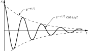
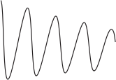
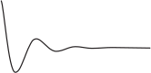

SOURCE: Feynman Lectures on Physics, Volume I, Chapter 24
LANGUAGE: en
TITLE: Chapter 24. Transients
SOURCE_URL: https://www.feynmanlectures.caltech.edu/I_24.html
NOTEBOOKLM_USE: clean lecture text with TeX math and figure captions; reader navigation removed.

# Chapter 24. Transients

## 24–1 The energy of an oscillator

Although this chapter is entitled “transients,” certain parts of it are, in a way, part of the last chapter on forced oscillation. One of the features of a forced oscillation which we have not yet discussed is theenergyin the oscillation. Let us now consider that energy.

In a mechanical oscillator, how much kinetic energy is there? It is proportional to the square of the velocity. Now we come to an important point. Consider an arbitrary quantity \(A\) , which may be the velocity or something else that we want to discuss. When we write \(A =
\hat{A}e^{i\omega t}\) , a complex number, the true and honest \(A\) , in the physical world, is only thereal part; therefore if, for some reason, we want to use thesquareof \(A\) , it is not right to square the complex number and then take the real part, because the real part of the square of a complex number is not just the square of the real part, but also involves theimaginarypart. So when we wish to find the energy we have to get away from the complex notation for a while to see what the inner workings are.

Now the true physical \(A\) is the real part of \(A_0e^{i(\omega
t+\Delta)}\) , that is, \(A = A_0 \cos\,(\omega t + \Delta)\) , where \(\hat{A}\) , the complex number, is written as \(A_0e^{i\Delta}\) . Now the square of this real physical quantity is \(A^2 = A_0^2 \cos^2\,(\omega
t + \Delta)\) . The square of the quantity, then, goes up and down from a maximum to zero, like the square of the cosine. The square of the cosine has a maximum of \(1\) and a minimum of \(0\) , and its average value is \(1/2\) .

In many circumstances we are not interested in the energy at any specific moment during the oscillation; for a large number of applications we merely want the average of \(A^2\) , themeanof the square of \(A\) over a period of time large compared with the period of oscillation. In those circumstances, the average of the cosine squared may be used, so we have the following theorem: if \(A\) is represented by a complex number, then the mean of \(A^2\) is equal to \(\tfrac{1}{2}A_0^2\) . Now \(A_0^2\) is the square of the magnitude of the complex \(\hat{A}\) . (This can be written in many ways—some people like to write \(\abs{\hat{A}}^2\) ; others write, \(\hat{A}\hat{A}\cconj\) , \(\hat{A}\) times its complex conjugate.) We shall use this theorem several times.

Now let us consider the energy in a forced oscillator. The equation for the forced oscillator is
\[
\begin{equation}
\label{Eq:I:24:1}
m\,d^2x/dt^2+\gamma m\,dx/dt+m\omega_0^2x=F(t).
\end{equation}
\]
In our problem, of course, \(F(t)\) is a cosine function of \(t\) . Now let us analyze the situation: how much work is done by the outside force \(F\) ? The work done by the force per second, i.e., the power, is the force times the velocity. (We know that the differential work in a time \(dt\) is \(F\,dx\) , and the power is \(F\,dx/dt\) .) Thus
\[
\begin{align}
P=F\,&\ddt{x}{t}\notag\\[1.25ex]
=m&\biggl[\biggl(\ddt{x}{t}\biggr)\biggl(
\frac{d^2x}{dt^2}\biggr)+\omega_0^2x\biggl(\ddt{x}{t}\biggr)\biggr]\notag\\[.5ex]
\label{Eq:I:24:2}
&+\gamma m\biggl(\ddt{x}{t}\biggr)^2.
\end{align}
\]
But the first two terms on the right can also be written as \(d/dt[\tfrac{1}{2}m(dx/dt)^2 + \tfrac{1}{2}m\omega_0^2x^2]\) , as is immediately verified by differentiating. That is to say, the term in brackets is a pure derivative of two terms that are easy to understand—one is the kinetic energy of motion, and the other is the potential energy of the spring. Let us call this quantity thestored energy, that is, the energy stored in the oscillation. Suppose that we want the average power over many cycles when the oscillator is being forced and has been running for a long time. In the long run, the stored energy does not change—its derivative gives zero average effect. In other words, if we average the power in the long run,all the energy ultimately ends up in the resistive term \(\gamma m(dx/dt)^2\) . There issomeenergy stored in the oscillation, but that does not change with time, if we average over many cycles. Therefore the mean power \(\avg{P}\) is
\[
\begin{equation}
\label{Eq:I:24:3}
\avg{P} = \avg{\gamma m(dx/dt)^2}.
\end{equation}
\]

Using our method of writing complex numbers, and our theorem that \(\avg{A^2} = \tfrac{1}{2}A_0^2\) , we may find this mean power. Thus if \(x=
\hat{x}e^{i\omega t}\) , then \(dx/dt = i\omega\hat{x}e^{i\omega
t}\) . Therefore, in these circumstances, the average power could be written as
\[
\begin{equation}
\label{Eq:I:24:4}
\avg{P} = \tfrac{1}{2}\gamma m\omega^2x_0^2.
\end{equation}
\]

In the notation for electrical circuits, \(dx/dt\) is replaced by the current \(I\) ( \(I\) is \(dq/dt\) , where \(q\) corresponds to \(x\) ), and \(m\gamma\) corresponds to the resistance \(R\) . Thus the rate of the energy loss—the power used up by the forcing function—is the resistance in the circuit times the average square of the current:
\[
\begin{equation}
\label{Eq:I:24:5}
\avg{P} = R\avg{I^2} = 
R\cdot\tfrac{1}{2}I_0^2.
\end{equation}
\]
This energy, of course, goes into heating the resistor; it is sometimes called the heating loss or the Joule heating.

Another interesting feature to discuss is how much energy isstored. That is not the same as the power, because although power was at first used to store up some energy, after that the system keeps on absorbing power, insofar as there are any heating (resistive) losses. At any moment there is a certain amount of stored energy, so we would like to calculate the mean stored energy \(\avg{E}\) also. We have already calculated what the average of \((dx/dt)^2\) is, so we find
\[
\begin{equation}
\begin{aligned}
\avg{E} &= \tfrac{1}{2}m
\avg{(dx/dt)^2} + \tfrac{1}{2}m\omega_0^2
\avg{x^2}\\[1ex]
&=\tfrac{1}{2}m(\omega^2+\omega_0^2)\tfrac{1}{2}x_0^2.
\end{aligned}
\label{Eq:I:24:6}
\end{equation}
\]
Now, when an oscillator is very efficient, and if \(\omega\) is near \(\omega_0\) , so that \(\abs{\hat{x}}\) is large, the stored energy is very high—we can get a large stored energy from a relatively small force. The force does a great deal of work in getting the oscillation going, but then to keep it steady, all it has to do is to fight the friction. The oscillator can have a great deal of energy if the friction is very low, and even though it is oscillating strongly, not much energy is being lost. The efficiency of an oscillator can be measured by how much energy is stored, compared with how much work the force does per oscillation.

How does the stored energy compare with the amount of work that is done in one cycle? This is called the \(Q\) of the system, and \(Q\) is defined as \(2\pi\) times the mean stored energy, divided by the work done per cycle. (If we were to say the work done perradianinstead of per cycle, then the \(2\pi\) disappears.)
\[
\begin{equation}
\label{Eq:I:24:7}
Q=2\pi\,\frac{\tfrac{1}{2}m(\omega^2+\omega_0^2)\cdot
\avg{x^2}}{\gamma m\omega^2\avg{x^2}\cdot
2\pi/\omega}=\frac{\omega^2+\omega_0^2}{2\gamma\omega}.
\end{equation}
\]
 \(Q\) is not a very useful number unless it is very large. When it is relatively large, it gives a measure of how good the oscillator is. People have tried to define \(Q\) in the simplest and most useful way; various definitions differ a bit from one another, but if \(Q\) is very large, all definitions are in agreement. The most generally accepted definition is Eq. (24.7), which depends on \(\omega\) . For a good oscillator, close to resonance, we can simplify (24.7) a little by setting \(\omega=\omega_0\) , and we then have \(Q= \omega_0/\gamma\) , which is the definition of \(Q\) that we used before.

What is \(Q\) for an electrical circuit? To find out, we merely have to translate \(L\) for \(m\) , \(R\) for \(m\gamma\) , and \(1/C\) for \(m\omega_0^2\) (see Table23–1). The \(Q\) at resonance is \(L\omega/R\) , where \(\omega\) is the resonance frequency. If we consider a circuit with a high \(Q\) , that means that the amount of energy stored in the oscillation is very large compared with the amount of work done per cycle by the machinery that drives the oscillations.

## 24–2 Damped oscillations

We now turn to our main topic of discussion: transients. By atransientis meant a solution of the differential equation when there is no force present, but when the system is not simply at rest. (Of course, if it is standing still at the origin with no force acting, that is a nice problem—it stays there!) Suppose the oscillation starts another way: say it was driven by a force for a while, and then we turn off the force. What happens then? Let us first get a rough idea of what will happen for a very high \(Q\) system. So long as a force is acting, the stored energy stays the same, and there is a certain amount of work done to maintain it. Now suppose we turn off the force, and no more work is being done; then the losses which are eating up the energy of the supply are no longer eating up its energy—thereisno more driver. The losses will have to consume, so to speak, the energy that is stored. Let us suppose that \(Q/2\pi = 1000\) . Then the work done per cycle is \(1/1000\) of the stored energy. Is it not reasonable, since it is oscillating with no driving force, that in one cycle the system will still lose a thousandth of its energy \(E\) , which ordinarily would have been supplied from the outside, and that it will continue oscillating, always losing \(1/1000\) of its energy per cycle? So, as a guess, for a relatively high \(Q\) system, we would suppose that the following equation might be roughly right (we will later do it exactly, and it will turn out that itwasright!):
\[
\begin{equation}
\label{Eq:I:24:8}
dE/dt=-\omega E/Q.
\end{equation}
\]
This is rough because it is true only for large \(Q\) . In each radian the system loses a fraction \(1/Q\) of the stored energy \(E\) . Thus in a given amount of time \(dt\) the energy will change by an amount \(\omega\,dt/Q\) , since the number of radians associated with the time \(dt\) is \(\omega\,dt\) . What is the frequency? Let us suppose that the system moves so nicely, with hardly any force, that if we let go it will oscillate at essentially the same frequency all by itself. So we will guess that \(\omega\) is the resonant frequency \(\omega_0\) . Then we deduce from Eq. (24.8) that the stored energy will vary as
\[
\begin{equation}
\label{Eq:I:24:9}
E=E_0e^{-\omega_0t/Q}=E_0e^{-\gamma t}.
\end{equation}
\]
This would be the measure of theenergyat any moment. What would the formula be, roughly, for the amplitude of the oscillation as a function of the time? The same? No! The amount of energy in a spring, say, goes as thesquareof the displacement; the kinetic energy goes as thesquareof the velocity; so the total energy goes as thesquareof the displacement. Thus the displacement, the amplitude of oscillation, will decrease half as fast because of the square. In other words, we guess that the solution for the damped transient motion will be an oscillation of frequency close to the resonance frequency \(\omega_0\) , in which the amplitude of the sine-wave motion will diminish as \(e^{-\gamma t/2}\) :
\[
\begin{equation}
\label{Eq:I:24:10}
x=A_0e^{-\gamma t/2}\cos\omega_0 t.
\end{equation}
\]
This equation and Fig.24–1give us an idea of what we should expect; now let us try to analyze the motionpreciselyby solving the differential equation of the motion itself.

### Figure Ch24-F1
Caption: Fig. 24–1.A damped cosine oscillation.
Image: figures/Ch24-F1.svg

So, starting with Eq. (24.1), with no outside force, how do we solve it? Being physicists, we do not have to worry about themethodas much as we do about what the solutionis. Armed with our previous experience, let us try as a solution an exponential curve, \(x = Ae^{i\alpha t}\) . (Why do we try this? It is the easiest thing to differentiate!) We put this into (24.1) (with \(F(t) = 0\) ), using the rule that each time we differentiate \(x\) with respect to time, we multiply by \(i\alpha\) . So it is really quite simple to substitute. Thus our equation looks like this:
\[
\begin{equation}
\label{Eq:I:24:11}
(-\alpha^2+i\gamma\alpha+\omega_0^2)Ae^{i\alpha t}=0.
\end{equation}
\]
The net result must be zero forall times, which is impossible unless (a) \(A = 0\) , which is no solution at all—it stands still, or (b)
\[
\begin{equation}
\label{Eq:I:24:12}
-\alpha^2+i\alpha\gamma+\omega_0^2=0.
\end{equation}
\]
If we can solve this and find an \(\alpha\) , then we will have a solution in which \(A\) need not be zero!
\[
\begin{equation}
\label{Eq:I:24:13}
\alpha=i\gamma/2\pm\sqrt{\omega_0^2-\gamma^2/4}.
\end{equation}
\]

For a while we shall assume that \(\gamma\) is fairly small compared with \(\omega_0\) , so that \(\omega_0^2-\gamma^2/4\) is definitely positive, and there is nothing the matter with taking the square root. The only bothersome thing is that we gettwosolutions! Thus
\[
\begin{equation}
\label{Eq:I:24:14}
\alpha_1 =i\gamma/2+\sqrt{\omega_0^2-\gamma^2/4}=
i\gamma/2+\omega_\gamma
\end{equation}
\]
and
\[
\begin{equation}
\label{Eq:I:24:15}
\alpha_2 =i\gamma/2-\sqrt{\omega_0^2-\gamma^2/4}=i\gamma/2-\omega_\gamma.
\end{equation}
\]
Let us consider the first one, supposing that we had not noticed that the square root has two possible values. Then we know that a solution for \(x\) is \(x_1= Ae^{i\alpha_1t}\) , where \(A\) is any constant whatever. Now, in substituting \(\alpha_1\) , because it is going to come so many times and it takes so long to write, we shall call \(\sqrt{\omega_0^2-\gamma^2/4}=\omega_\gamma\) . Thus \(i\alpha_1=-\gamma/2 + i\omega_\gamma\) , and we get \(x =
Ae^{(-\gamma/2+i\omega_\gamma)t}\) , or what is the same, because of the wonderful properties of an exponential,
\[
\begin{equation}
\label{Eq:I:24:16}
x_1=Ae^{-\gamma t/2}e^{i\omega_\gamma t}.
\end{equation}
\]
First, we recognize this as an oscillation, an oscillation at a frequency \(\omega_\gamma\) , which is notexactlythe frequency \(\omega_0\) , but is rather close to \(\omega_0\) if it is a good system. Second, the amplitude of the oscillation is decreasing exponentially! If we take, for instance, the real part of (24.16), we get
\[
\begin{equation}
\label{Eq:I:24:17}
x_1=Ae^{-\gamma t/2}\cos\omega_\gamma t.
\end{equation}
\]
This is very much like our guessed-at solution (24.10), except that the frequency really is \(\omega_\gamma\) . This is the only error, so it is the same thing—we have the right idea. But everything isnotall right! What is not all right is thatthere is another solution.

The other solution is \(\alpha_2\) , and we see that the difference is only that the sign of \(\omega_\gamma\) is reversed:
\[
\begin{equation}
\label{Eq:I:24:18}
x_2=Be^{-\gamma t/2}e^{-i\omega_\gamma t}.
\end{equation}
\]
What does this mean? We shall soon prove that if \(x_1\) and \(x_2\) are each a possible solution of Eq. (24.1) with \(F = 0\) , then \(x_1 + x_2\) is also a solution of the same equation! So the general solution \(x\) is of the mathematical form
\[
\begin{equation}
\label{Eq:I:24:19}
x=e^{-\gamma t/2}(Ae^{i\omega_\gamma t}+Be^{-i\omega_\gamma t}).
\end{equation}
\]
Now we may wonder why we bother to give this other solution, since we were so happy with the first one all by itself. What is the extra one for, because of course we know we should only take the real part?Weknow that we must take the real part, but how did themathematicsknow that we only wanted the real part? When we had a nonzero driving force \(F(t)\) , we put in anartificialforce to go with it, and theimaginarypart of the equation, so to speak, was driven in a definite way. But when we put \(F(t) \equiv 0\) , our convention that \(x\) should be only the real part of whatever we write down is purely our own, and the mathematical equations do not know it yet. The physical worldhasa real solution, but the answer that we were so happy with before is not real, it iscomplex. Theequationdoes not know that we are arbitrarily going to take the real part, so it has to present us, so to speak, with a complex conjugate type of solution, so that by putting them together we canmake a truly realsolution; that is what \(\alpha_2\) is doing for us. In order for \(x\) to be real, \(Be^{-i\omega_\gamma t}\) will have to be the complex conjugate of \(Ae^{i\omega_\gamma t}\) that the imaginary parts disappear. So it turns out that \(B\) is the complex conjugate of \(A\) , and our real solution is
\[
\begin{equation}
\label{Eq:I:24:20}
x=e^{-\gamma t/2}(Ae^{i\omega_\gamma t}+A\cconj e^{-i\omega_\gamma
t}).
\end{equation}
\]
So our real solution is an oscillation with aphase shiftand a damping—just as advertised.

## 24–3 Electrical transients

### Figure Ch24-F2
Caption: Fig. 24–2.An electrical circuit for demonstrating transients.
Image: figures/Ch24-F2.svg

Now let us see if the above really works. We construct the electrical circuit shown in Fig.24–2, in which we apply to an oscilloscope the voltage across the inductance \(L\) after we suddenly turn on a voltage by closing the switch \(S\) . It is an oscillatory circuit, and it generates a transient of some kind. It corresponds to a circumstance in which we suddenly apply a force and the system starts to oscillate. It is the electrical analog of a damped mechanical oscillator, and we watch the oscillation on an oscilloscope, where we should see the curves that we were trying to analyze. (The horizontal motion of the oscilloscope is driven at a uniform speed, while the vertical motion is the voltage across the inductor. The rest of the circuit is only a technical detail. We would like to repeat the experiment many, many times, since the persistence of vision is not good enough to see only one trace on the screen. So we do the experiment again and again by closing the switch \(60\) times a second; each time we close the switch, we also start the oscilloscope horizontal sweep, and it draws the curve over and over.) In Figs.24–3to24–6we see examples of damped oscillations, actually photographed on an oscilloscope screen. Figure24–3shows a damped oscillation in a circuit which has a high \(Q\) , a small \(\gamma\) . It does not die out very fast; it oscillates many times on the way down.

### Figure Ch24-F3
Caption: Figure 24–3
Image: figures/Ch24-F3.svg

### Figure Ch24-F4
Caption: Figure 24–4
Image: figures/Ch24-F4.svg

### Figure Ch24-F5
Caption: Figure 24–5
Image: figures/Ch24-F5.svg

### Figure Ch24-F6
Caption: Figure 24–6
Image: figures/Ch24-F6.svg

But let us see what happens as we decrease \(Q\) , so that the oscillation dies out more rapidly. We can decrease \(Q\) by increasing the resistance \(R\) in the circuit. When we increase the resistance in the circuit, it dies out faster (Fig.24–4). Then if we increase the resistance in the circuit still more, it dies out faster still (Fig.24–5). But when we put in more than a certain amount, we cannot see any oscillation at all! The question is, is this because our eyes are not good enough? If we increase the resistance still more, we get a curve like that of Fig.24–6, which does not appear to have any oscillations, except perhaps one. Now, how can we explain that by mathematics?

The resistance is, of course, proportional to the \(\gamma\) term in the mechanical device. Specifically, \(\gamma\) is \(R/L\) . Now if we increase the \(\gamma\) in the solutions (24.14) and (24.15) that we were so happy with before, chaos sets in when \(\gamma/2\) exceeds \(\omega_0\) ; we must write it a different way, as
\[
\begin{equation*}
i\gamma/2+i\sqrt{\gamma^2/4-\omega_0^2}\quad
\text{and}\quad
i\gamma/2-i\sqrt{\gamma^2/4-\omega_0^2}.
\end{equation*}
\]
Those are now the two solutions and, following the same line of mathematical reasoning as previously, we again find two solutions: \(e^{i\alpha_1 t}\) and \(e^{i\alpha_2 t}\) . If we now substitute for \(\alpha_1\) , we get
\[
\begin{equation*}
x=Ae^{-(\gamma/2+\sqrt{\gamma^2/4-\omega_0^2})t},
\end{equation*}
\]
a nice exponential decay with no oscillations. Likewise, the other solution is
\[
\begin{equation*}
x=Be^{-(\gamma/2-\sqrt{\gamma^2/4-\omega_0^2})t}.
\end{equation*}
\]
Note that the square root cannot exceed \(\gamma/2\) , because even if \(\omega_0=0\) , one term just equals the other. But \(\omega_0^2\) is taken away from \(\gamma^2/4\) , so the square root is less than \(\gamma/2\) , and the term in parentheses is, therefore, always a positive number. Thank goodness! Why? Because if it were negative, we would find \(e\) raised to apositivefactor times \(t\) , which would mean it was exploding! In putting more and more resistance into the circuit, we know it is not going to explode—quite the contrary. So now we have two solutions, each one by itself a dying exponential, but one having a much faster “dying rate” than the other. The general solution is of course a combination of the two; the coefficients in the combination depending upon how the motion starts—what the initial conditions of the problem are. In the particular way this circuit happens to be starting, the \(A\) is negative and the \(B\) is positive, so we get the difference of two exponential curves.

Now let us discuss how we can find the two coefficients \(A\) and \(B\) (or \(A\) and \(A\cconj\) ), if we know how the motion was started.

Suppose that at \(t = 0\) we know that \(x = x_0\) , and \(dx/dt = v_0\) . If we put \(t= 0\) , \(x = x_0\) , and \(dx/dt = v_0\) into the expressions
\[
\begin{align*}
x=e^{-\gamma t/2}(&Ae^{i\omega_\gamma t}+
A\cconj e^{-i\omega_\gamma t}),\\[1ex]
dx/dt=e^{-\gamma t/2}\bigl[
&(-\gamma/2+i\omega_\gamma)Ae^{i\omega_\gamma t}+\\
&(-\gamma/2-i\omega_\gamma)A\cconj e^{-i\omega_\gamma t}\,\bigr],
\end{align*}
\]
we find, since \(e^0 =\) \(e^{i0} =\) \(1\) ,
\[
\begin{align*}
x_0&=A+A\cconj=2A_R,\\[1ex]
v_0&=-(\gamma/2)(A+A\cconj)+i\omega_\gamma(A-A\cconj)\\[.5ex]
&=-\gamma x_0/2+i\omega_\gamma(2iA_I),
\end{align*}
\]
where \(A = A_R + iA_I\) , and \(A\cconj = A_R - iA_I\) . Thus we find
\[
\begin{equation}
A_R =x_0/2\notag
\end{equation}
\]
and
\[
\begin{equation}
\label{Eq:I:24:21}
A_I =-(v_0+\gamma x_0/2)/2\omega_\gamma.
\end{equation}
\]
This completely determines \(A\) and \(A\cconj\) , and therefore the complete curve of the transient solution, in terms of how it begins. Incidentally, we can write the solution another way if we note that
\[
\begin{equation*}
e^{i\theta}+e^{-i\theta}=2\cos\theta
\quad\text{and}\quad
e^{i\theta}-e^{-i\theta}=2i\sin\theta.
\end{equation*}
\]
We may then write the complete solution as
\[
\begin{equation}
\label{Eq:I:24:22}
x=e^{-\gamma t/2}\biggl[
x_0\cos\omega_\gamma t+
\frac{v_0+\gamma x_0/2}{\omega_\gamma}\sin\omega_\gamma t
\biggr],
\end{equation}
\]
where \(\omega_\gamma=+\sqrt{\omega_0^2-\gamma^2/4}\) . This is the mathematical expression for the way an oscillation dies out. We shall not make direct use of it, but there are a number of points we should like to emphasize that are true in more general cases.

First of all the behavior of such a system with no external force is expressed by a sum, or superposition, of pure exponentials in time (which we wrote as \(e^{i\alpha t}\) ). This is a good solution to try in such circumstances. The values of \(\alpha\) may be complex in general, the imaginary parts representing damping. Finally the intimate mathematical relation of the sinusoidal and exponential function discussed in Chapter22often appears physically as a change from oscillatory to exponential behavior when some physical parameter (in this case resistance, \(\gamma\) ) exceeds some critical value.
