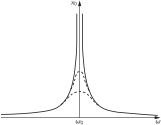
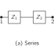

SOURCE: Feynman Lectures on Physics, Volume I, Chapter 25
LANGUAGE: en
TITLE: Chapter 25. Linear Systems and Review
SOURCE_URL: https://www.feynmanlectures.caltech.edu/I_25.html
NOTEBOOKLM_USE: clean lecture text with TeX math and figure captions; reader navigation removed.

# Chapter 25. Linear Systems and Review

## 25–1 Linear differential equations

In this chapter we shall discuss certain aspects of oscillating systems that are found somewhat more generally than just in the particular systems we have been discussing. For our particular system, the differential equation that we have been solving is
\[
\begin{equation}
\label{Eq:I:25:1}
m\,\frac{d^2x}{dt^2}+\gamma m\,\ddt{x}{t}+m\omega_0^2x=F(t).
\end{equation}
\]
Now this particular combination of “operations” on the variable \(x\) has the interesting property that if we substitute \((x + y)\) for \(x\) , then we get the sum of the same operations on \(x\) and \(y\) ; or, if we multiply \(x\) by \(a\) , then we get just \(a\) times the same combination. This is easy to prove. Just as a “shorthand” notation, because we get tired of writing down all those letters in (25.1), we shall use the symbol \(\uL(x)\) instead. When we see this, it means the left-hand side of (25.1), with \(x\) substituted in. With this system of writing, \(\uL(x + y)\) would mean the following:
\[
\begin{align}
\uL(x+y)=m\,\frac{d^2(x+y)}{dt^2}&+\gamma m\,\ddt{(x+y)}{t}\notag\\
&+m\omega_0^2(x+y).
\label{Eq:I:25:2}
\end{align}
\]
(We underline the \(\uL\) so as to remind ourselves that it is not an ordinary function.) We sometimes call this anoperator notation, but it makes no difference what we call it, it is just “shorthand.”

Our first statement was that
\[
\begin{equation}
\label{Eq:I:25:3}
\uL(x+y)=\uL(x)+\uL(y),
\end{equation}
\]
which of course follows from the fact that \(a(x + y) = ax + ay\) , \(d(x
+ y)/dt = dx/dt + dy/dt\) , etc.

Our second statement was, for constant \(a\) ,
\[
\begin{equation}
\label{Eq:I:25:4}
\uL(ax)=a\uL(x).
\end{equation}
\]
[Actually, (25.3) and (25.4) are very closely related, because if we put \(x + x\) into (25.3), this is the same as setting \(a = 2\) in (25.4), and so on.]

In more complicated problems, there may be more derivatives, and more terms in \(\uL\) ; the question of interest is whether the two equations (25.3) and (25.4) are maintained or not. If they are, we call such a problem alinearproblem. In this chapter we shall discuss some of the properties that exist because the system is linear, to appreciate the generality of some of the results that we have obtained in our special analysis of a special equation.

Now let us study some of the properties of linear differential equations, having illustrated them already with the specific equation (25.1) that we have studied so closely. The first property of interest is this: suppose that we have to solve the differential equation for a transient, the free oscillation with no driving force. That is, we want to solve
\[
\begin{equation}
\label{Eq:I:25:5}
\uL(x)=0.
\end{equation}
\]
Suppose that, by some hook or crook, we have found a particular solution, which we shall call \(x_1\) . That is, we have an \(x_1\) for which \(\uL(x_1) = 0\) . Now we notice that \(ax_1\) is also a solution to the same equation; we can multiply this special solution by any constant whatever, and get a new solution. In other words, if we had a motion of a certain “size,” then a motion twice as “big” is again a solution.Proof: \(\uL(ax_1) =\) \(a\uL(x_1) =\) \(a\cdot0 = 0\) .

Next, suppose that, by hook or by crook, we have not only foundonesolution \(x_1\) , but also another solution, \(x_2\) . (Remember that when we substituted \(x = e^{i\alpha t}\) for finding the transients, we foundtwovalues for \(\alpha\) , that is, two solutions, \(x_1\) and \(x_2\) .) Now let us show that the combination \((x_1 + x_2)\) is also a solution. In other words, if we put \(x = x_1 +
x_2\) , \(x\) is again a solution of the equation. Why? Because, if \(\uL(x_1) = 0\) and \(\uL(x_2) = 0\) , then \(\uL(x_1 + x_2) = \uL(x_1) +
\uL(x_2) = 0 + 0 = 0\) . So if we have found a number of solutions for the motion of a linear system we can add them together.

Combining these two ideas, we see, of course, that we can also add six of one and two of the other: if \(x_1\) is a solution, so is \(\alpha
x_1\) . Therefore any sum of these two solutions, such as \((\alpha x_1 +
\beta x_2)\) , is also a solution. If we happen to be able to find three solutions, then we find that any combination of the three solutions is again a solution, and so on. It turns out that the number of what we callindependent solutions1that we have obtained for our oscillator problem is onlytwo. The number of independent solutions that one finds in the general case depends upon what is called the number ofdegrees of freedom. We shall not discuss this in detail now, but if we have a second-order differential equation, there are only two independent solutions, and we have found both of them; so we have the most general solution.

Now let us go on to another proposition, which applies to the situation in which the system is subjected to an outside force. Suppose the equation is
\[
\begin{equation}
\label{Eq:I:25:6}
\uL(x)=F(t),
\end{equation}
\]
and suppose that we have found a special solution of it. Let us say that Joe’s solution is \(x_J\) , and that \(\uL(x_J) = F(t)\) . Suppose we want to find yet another solution; suppose we add to Joe’s solution one of those that was a solution of the free equation (25.5), say \(x_1\) . Then we see by (25.3) that
\[
\begin{equation}
\begin{aligned}
\uL(x_J+x_1)&=\uL(x_J)+\uL(x_1)\\[1ex]
&=F(t)+0\\[.75ex]
&=F(t).
\end{aligned}
\label{Eq:I:25:7}
\end{equation}
\]
Therefore, to the “forced” solution we can add any “free” solution, and we still have a solution. The free solution is called atransientsolution.

When we have no force acting, and suddenly turn one on, we do not immediately get the steady solution that we solved for with the sine wave solution, but for a while there is a transient which sooner or later dies out, if we wait long enough. The “forced” solution does not die out, since it keeps on being driven by the force. Ultimately, for long periods of time, the solution is unique, but initially the motions are different for different circumstances, depending on how the system was started.

## 25–2 Superposition of solutions

Now we come to another interesting proposition. Suppose that we have a certain particular driving force \(F_a\) (let us say an oscillatory one with a certain \(\omega = \omega_a\) , but our conclusions will be true for any functional form of \(F_a\) ) and we have solved for the forced motion (with or without the transients; it makes no difference). Now suppose some other force is acting, let us say \(F_b\) , and we solve the same problem, but for this different force. Then suppose someone comes along and says, “I have a new problem for you to solve; I have the force \(F_a + F_b\) .” Can we do it? Of course we can do it, because the solution is the sum of the two solutions \(x_a\) and \(x_b\) for the forces taken separately—a most remarkable circumstance indeed. If we use (25.3), we see that
\[
\begin{equation}
\begin{aligned}
\uL(x_a+x_b)&=\uL(x_a)+\uL(x_b)\\[1ex]
&=F_a(t)+F_b(t).
\end{aligned}
\label{Eq:I:25:8}
\end{equation}
\]

This is an example of what is called theprinciple of superpositionfor linear systems, and it is very important. It means the following: if we have a complicated force which can be broken up in any convenient manner into a sum of separate pieces, each of which is in some way simple, in the sense that for each special piece into which we have divided the force we can solve the equation, then the answer is available for thewholeforce, because we may simply add the pieces of thesolutionback together, in the same manner as the totalforceis compounded out of pieces (Fig.25–1).

### Figure Ch25-F1
Caption: Fig. 25–1.An example of the principle of superposition for linear systems.
Image: figures/Ch25-F1.svg

Let us give another example of the principle of superposition. In Chapter12we said that it was one of the great facts of the laws of electricity that if we have a certain distribution of charges \(q_a\) and calculate the electric field \(\FLPE_a\) arising from these charges at a certain place \(P\) , and if, on the other hand, we have another set of charges \(q_b\) and we calculate the field \(\FLPE_b\) due to these at the corresponding place, then if both charge distributions are present at the same time, the field \(\FLPE\) at \(P\) is thesumof \(\FLPE_a\) due to one set plus \(\FLPE_b\) due to the other. In other words, if we know the field due to a certain charge, then the field due to many charges is merely the vector sum of the fields of these charges taken individually. This is exactly analogous to the above proposition that if we know the result of two given forces taken at one time, then if the force is considered as a sum of them, the response is a sum of the corresponding individual responses.

### Figure Ch25-F2
Caption: Fig. 25–2.The principle of superposition in electrostatics.
Image: figures/Ch25-F2.svg

The reason why this is true in electricity is that the great laws of electricity, Maxwell’s equations, which determine the electric field, turn out to be differential equations which arelinear, i.e., which have the property (25.3). What corresponds to the force is thechargegenerating the electric field, and the equation which determines the electric field in terms of the charge is linear.

As another interesting example of this proposition, let us ask how it is possible to “tune in” to a particular radio station at the same time as all the radio stations are broadcasting. The radio station transmits, fundamentally, an oscillating electric field of very high frequency which acts on our radio antenna. It is true that the amplitude of the oscillation of the field is changed, modulated, to carry the signal of the voice, but that is very slow, and we are not going to worry about it. When one hears “This station is broadcasting at a frequency of \(780\) kilocycles,” this indicates that \(780{,}000\) oscillations per second is the frequency of the electric field of the station antenna, and this drives the electrons up and down at that frequency in our antenna. Now at the same time we may have another radio station in the same town radiating at a different frequency, say \(550\) kilocycles per second; then the electrons in our antenna are also being driven by that frequency. Now the question is, how is it that we can separate the signals coming into the one radio at \(780\) kilocycles from those coming in at \(550\) kilocycles? We certainly do not hear both stations at the same time.

By the principle of superposition, the response of the electric circuit in the radio, the first part of which is a linear circuit, to the forces that are acting due to the electric field \(F_a + F_b\) , is \(x_a + x_b\) . It therefore looks as though we will never disentangle them. In fact, the very proposition of superposition seems to insist that we cannotavoidhaving both of them in our system. But remember, for aresonantcircuit, the response curve, the amount of \(x\) per unit \(F\) , as a function of the frequency, looks like Fig.25–3. If it were a very high \(Q\) circuit, the response would show a very sharp maximum. Now suppose that the two stations are comparable in strength, that is, the twoforcesare of the same magnitude. Theresponsethat we get is the sum of \(x_a\) and \(x_b\) . But, in Fig.25–3, \(x_a\) is tremendous, while \(x_b\) is small. So, in spite of the fact that the two signals are equal in strength, when they go through the sharp resonant circuit of the radio tuned for \(\omega_a\) , the frequency of the transmission of one station, then the response to this station is much greater than to the other. Therefore the complete response, with both signals acting, is almost all made up of \(\omega_a\) , and we have selected the station we want.

### Figure Ch25-F3
Caption: Fig. 25–3.A sharply tuned resonance curve.
Image: figures/Ch25-F3.svg

Now what about the tuning? How do we tune it? We change \(\omega_0\) by changing the \(L\) or the \(C\) of the circuit, because the frequency of the circuit has to do with the combination of \(L\) and \(C\) . In particular, most radios are built so that one can change the capacitance. When we retune the radio, we can make a new setting of the dial, so that the natural frequency of the circuit is shifted, say, to \(\omega_c\) . In those circumstances we hear neither one station nor the other; we get silence, provided there is no other station at frequency \(\omega_c\) . If we keep on changing the capacitance until the resonance curve is at \(\omega_b\) , then of course we hear the other station. That is how radio tuning works; it is again the principle of superposition, combined with a resonant response.2

To conclude this discussion, let us describe qualitatively what happens if we proceed further in analyzing a linear problem with a given force, when the force is quite complicated. Out of the many possible procedures, there are two especially useful general ways that we can solve the problem. One is this: suppose that we can solve it for special known forces, such as sine waves of different frequencies. We know it is child’s play to solve it for sine waves. So we have the so-called “child’s play” cases. Now the question is whether our very complicated force can be represented as the sum of two or more “child’s play” forces. In Fig.25–1we already had a fairly complicated curve, and of course we can make it more complicated still if we add in more sine waves. So it is certainly possible to obtain very complicated curves. And, in fact, the reverse is also true: practically every curve can be obtained by adding togetherinfinite numbersof sine waves of different wavelengths (or frequencies) for each one of which we know the answer. We just have to know how much of each sine wave to put in to make the given \(F\) , and then our answer, \(x\) , is the corresponding sum of the \(F\) sine waves, each multiplied by its effective ratio of \(x\) to \(F\) . This method of solution is called the method ofFourier transformsorFourier analysis. We are not going to actually carry out such an analysis just now; we only wish to describe the idea involved.

Another way in which our complicated problem can be solved is the following very interesting one. Suppose that, by some tremendous mental effort, it were possible to solve our problem for a special force, namely animpulse. The force is quickly turned on and then off; it is all over. Actually we need only solve for an impulse of some unit strength, any other strength can be gotten by multiplication by an appropriate factor. We know that the response \(x\) for an impulse is a damped oscillation. Now what can we say about some other force, for instance a force like that of Fig.25–4?

### Figure Ch25-F4
Caption: Fig. 25–4.A complicated force may be treated as a succession of sharp impulses.
Image: figures/Ch25-F4.svg

Such a force can be likened to a succession of blows with a hammer. First there is no force, and all of a sudden there is a steady force—impulse, impulse, impulse, impulse, … and then it stops. In other words, we imagine the continuous force to be a series of impulses, very close together. Now, we know the result for an impulse, so the result for a whole series of impulses will be a whole series of damped oscillations: it will be the curve for the first impulse, and then (slightly later) we add to that the curve for the second impulse, and the curve for the third impulse, and so on. Thus we can represent, mathematically, the complete solution for arbitrary functions if we know the answer for an impulse. We get the answer for any other force simply by integrating. This method is called theGreen’s function method. A Green’s function is a response to an impulse, and the method of analyzing any force by putting together the response of impulses is called the Green’s function method.

The physical principles involved in both of these schemes are so simple, involving just the linear equation, that they can be readily understood, but themathematicalproblems that are involved, the complicated integrations and so on, are a little too advanced for us to attack right now. You will most likely return to this some day when you have had more practice in mathematics. But theideais very simple indeed.

Finally, we make some remarks on whylinearsystems are so important. The answer is simple: because we can solve them! So most of the time we solve linear problems. Second (and most important), it turns out thatthe fundamental laws of physics are often linear. The Maxwell equations for the laws of electricity are linear, for example. The great laws of quantum mechanics turn out, so far as we know, to be linear equations.Thatis why we spend so much time on linear equations: because if we understand linear equations, we are ready, in principle, to understand a lot of things.

We mention another situation where linear equations are found. When displacements are small, many functions can beapproximatedlinearly. For example, if we have a simple pendulum, the correct equation for its motion is
\[
\begin{equation}
\label{Eq:I:25:9}
d^2\theta/dt^2=-(g/L)\sin\theta.
\end{equation}
\]
This equation can be solved by elliptic functions, but the easiest way to solve it is numerically, as was shown in Chapter9on Newton’s Laws of Motion. A nonlinear equation cannot be solved, ordinarily, any other waybutnumerically. Now for small \(\theta\) , \(\sin\theta\) is practically equal to \(\theta\) , and we have a linear equation. It turns out that there are many circumstances where small effects are linear: for the example here the swing of a pendulum through small arcs. As another example, if we pull a little bit on a spring, the force is proportional to the extension. If we pull hard, we break the spring, and the force is a completely different function of the distance! Linear equations are important. In fact they are so important that perhaps fifty percent of the time we are solving linear equations in physics and in engineering.

## 25–3 Oscillations in linear systems

Let us now review the things we have been talking about in the past few chapters. It is very easy for the physics of oscillators to become obscured by the mathematics. The physics is actually very simple, and if we may forget the mathematics for a moment we shall see that we can understand almost everything that happens in an oscillating system. First, if we have only the spring and the weight, it is easy to understand why the system oscillates—it is a consequence of inertia. We pull the mass down and the force pulls it back up; as it passes zero, which is the place it likes to be, it cannot just suddenly stop; because of its momentum it keeps on going and swings to the other side, and back and forth. So, if there were no friction, we would surelyexpectan oscillatory motion, and indeed we get one. But if there is even a little bit of friction, then on the return cycle, the swing will not be quite as high as it was the first time.

Now what happens, cycle by cycle? That depends on the kind and amount of friction. Suppose that we could concoct a kind of friction force that always remains in the same proportion to the other forces, of inertia and in the spring, as the amplitude of oscillation varies. In other words, for smaller oscillations the friction should be weaker than for big oscillations. Ordinary friction does not have this property, so a special kind of friction must be carefully invented for the very purpose of creating a friction that is directly proportional to the velocity—so that for big oscillations it is stronger and for small oscillations it is weaker. If we happen to have that kind of friction, then at the end of each successive cycle the system is in the same condition as it was at the start, except a little bit smaller. All the forces are smaller in the same proportion: the spring force is reduced, the inertial effects are lower because the accelerations are now weaker, and the friction is less too, by our careful design. When we actually have that kind of friction, we find that each oscillation is exactly the same as the first one, except reduced in amplitude. If the first cycle dropped the amplitude, say, to \(90\) percent of what it was at the start, the next will drop it to \(90\) percent of \(90\) percent, and so on:the sizes of the oscillations are reduced by the same fraction of themselves in every cycle. An exponential function is a curve which does just that. It changes by the same factor in each equal interval of time. That is to say, if the amplitude of one cycle, relative to the preceding one, is called \(a\) , then the amplitude of the next is \(a^2\) , and of the next, \(a^3\) . So the amplitude is some constant raised to a power equal to the number of cycles traversed:
\[
\begin{equation}
\label{Eq:I:25:10}
A=A_0a^n.
\end{equation}
\]
But of course \(n\propto t\) , so it is perfectly clear that the general solution will be some kind of an oscillation, sine or cosine \(\omega
t\) , times an amplitude which goes as \(b^t\) more or less. But \(b\) can be written as \(e^{-c}\) , if \(b\) is positive and less than \(1\) . So this is why the solution looks like \(e^{-ct}\cos\omega_0 t\) . It is very simple.

What happens if the friction is not so artificial; for example, ordinary rubbing on a table, so that the friction force is a certain constant amount, and is independent of the size of the oscillation that reverses its direction each half-cycle? Then the equation is no longer linear, it becomes hard to solve, and must be solved by the numerical method given in Chapter9, or by considering each half-cycle separately. The numerical method is the most powerful method of all, and can solve any equation. It is only when we have a simple problem that we can use mathematical analysis.

Mathematical analysis is not the grand thing it is said to be; it solves only the simplest possible equations. As soon as the equations get a little more complicated, just a shade—they cannot be solved analytically. But the numerical method, which was advertised at the beginning of the course, can take care of any equation of physical interest.

Next, what about the resonance curve? Why is there a resonance? First, imagine for a moment that there is no friction, and we have something which could oscillate by itself. If we tapped the pendulum just right each time it went by, of course we could make it go like mad. But if we close our eyes and do not watch it, and tap at arbitrary equal intervals, what is going to happen? Sometimes we will find ourselves tapping when it is going the wrong way. When we happen to have the timing just right, of course, each tap is given at just the right time, and so it goes higher and higher and higher. So without friction we get a curve which looks like the solid curve in Fig.25–5for different frequencies. Qualitatively, we understand the resonance curve; in order to get the exact shape of the curve it is probably just as well to do the mathematics. The curve goes toward infinity as \(\omega\to\omega_0\) , where \(\omega_0\) is the natural frequency of the oscillator.

### Figure Ch25-F5
Caption: Fig. 25–5.Resonance curves with various amounts of friction present.
Image: figures/Ch25-F5.svg

Now suppose there is a little bit of friction; then when the displacement of the oscillator is small, the friction does not affect it much; the resonance curve is the same, except when we are near resonance. Instead of becoming infinite near resonance, the curve is only going to get so high that the work done by our tapping each time is enough to compensate for the loss of energy by friction during the cycle. So the top of the curve is rounded off—it does not go to infinity. If there is more friction, the top of the curve is rounded off still more. Now someone might say, “I thought the widths of the curves depended on the friction.” That is because the curve is usually plotted so that the top of the curve is called one unit. However, the mathematical expression is even simpler to understand if we just plot all the curves on the same scale; then all that happens is that the friction cuts down the top! If there is less friction, we can go farther up into that little pinnacle before the friction cuts it off, so it looks relatively narrow. That is, the higher the peak of the curve, the narrower the width at half the maximum height.

Finally, we take the case where there is an enormous amount of friction. It turns out that if there is too much friction, the system does not oscillate at all. The energy in the spring is barely able to move it against the frictional force, and so it slowly oozes down to the equilibrium point.

## 25–4 Analogs in physics

The next aspect of this review is to note that masses and springs are not the only linear systems; there are others. In particular, there are electrical systems called linear circuits, in which we find a complete analog to mechanical systems. We did not learn exactlywhyeach of the objects in an electrical circuit works in the way it does—that is not to be understood at the present moment; we may assert it as an experimentally verifiable fact that they behave as stated.

For example, let us take the simplest possible circumstance. We have a piece of wire, which is just a resistance, and we have applied to it a difference in potential, \(V\) . Now the \(V\) means this: if we carry a charge \(q\) through the wire from one terminal to another terminal, the work done is \(qV\) . The higher the voltage difference, the more work was done when the charge, as we say, “falls” from the high potential end of the terminal to the low potential end. So charges release energy in going from one end to the other. Now the charges do not simply fly from one end straight to the other end; the atoms in the wire offer some resistance to the current, and this resistance obeys the following law for almost all ordinary substances: if there is a current \(I\) , that is, so and so many charges per second tumbling down, the number per second that comes tumbling through the wire is proportional to how hard we push them—in other words, proportional to how much voltage there is:
\[
\begin{equation}
\label{Eq:I:25:11}
V=IR=R(dq/dt).
\end{equation}
\]
The coefficient \(R\) is called theresistance, and the equation is called Ohm’s Law. The unit of resistance is the ohm; it is equal to one volt per ampere. In mechanical situations, to get such a frictional force in proportion to the velocity is difficult; in an electrical system it is very easy, and this law is extremely accurate for most metals.

We are often interested in how much work is done per second, the power loss, or the energy liberated by the charges as they tumble down the wire. When we carry a charge \(q\) through a voltage \(V\) , the work is \(qV\) , so the work done per second would be \(V(dq/dt)\) , which is the same as \(VI\) , or also \(IR\cdot I= I^2 R\) . This is called theheating loss—this is how much heat is generated in the resistance per second, by the conservation of energy. It is this heat that makes an ordinary incandescent light bulb work.

Of course, there are other interesting properties of mechanical systems, such as the mass (inertia), and it turns out that there is an electrical analog to inertia also. It is possible to make something called aninductor, having a property calledinductance, such that a current, once started through the inductance,does not want to stop. It requires a voltage in order to change the current! If the current is constant, there is no voltage across an inductance.dccircuits do not know anything about inductance; it is only when wechangethe current that the effects of inductance show up. The equation is
\[
\begin{equation}
\label{Eq:I:25:12}
V=L(dI/dt)=L(d^2q/dt^2),
\end{equation}
\]
and the unit of inductance, called thehenry, is such that one volt applied to an inductance of one henry produces a change of one ampere per second in the current. Equation (25.12) is the analog of Newton’s law for electricity, if we wish: \(V\) corresponds to \(F\) , \(L\) corresponds to \(m\) , and \(I\) corresponds to velocity! All of the consequent equations for the two kinds of systems will have the same derivations because, in all the equations, we can change any letter to its corresponding analog letter and we get the same equation; everything we deduce will have a correspondence in the two systems.

Now what electrical thing corresponds to the mechanical spring, in which there was a force proportional to the stretch? If we start with \(F= kx\) and replace \(F\to V\) and \(x\to q\) , we get \(V = \alpha q\) . It turns out that thereissuch a thing, in fact it is the only one of the three circuit elements we can really understand, because we did study a pair of parallel plates, and we found that if there were a charge of certain equal, opposite amounts on each plate, the electric field between them would be proportional to the size of the charge. So the work done in moving a unit charge across the gap from one plate to the other is precisely proportional to the charge. This work is thedefinitionof the voltage difference, and it is the line integral of the electric field from one plate to another. It turns out, for historical reasons, that the constant of proportionality is not called \(C\) , but \(1/C\) . It could have been called \(C\) , but it was not. So we have
\[
\begin{equation}
\label{Eq:I:25:13}
V=q/C.
\end{equation}
\]
The unit of capacitance, \(C\) , is the farad; a charge of one coulomb on each plate of a one-farad capacitor yields a voltage difference of one volt.

There are our analogies, and the equation corresponding to the oscillating circuit becomes the following, by direct substitution of \(L\) for \(m\) , \(q\) for \(x\) , etc:
\[
\begin{alignat}{2}
\label{Eq:I:25:14}
m(d^2x/dt^2)&\,+\,\gamma m(dx/dt)+kx&&=F,\\[1.5ex]
\label{Eq:I:25:15}
L(d^2q/dt^2)&\,+\,R(dq/dt)+q/C&&=V.
\end{alignat}
\]
Now everything we learned about (25.14) can be transformed to apply to (25.15). Everyconsequenceis the same; so much the same that there is a brilliant thing we can do.

Suppose we have a mechanical system which is quite complicated, not just one mass on a spring, but several masses on several springs, all hooked together. What do we do? Solve it? Perhaps; but look, we can make anelectricalcircuit which will have the same equations as the thing we are trying to analyze! For instance, if we wanted to analyze a mass on a spring, why can we not build an electrical circuit in which we use an inductance proportional to the mass, a resistance proportional to the corresponding \(m\gamma\) , \(1/C\) proportional to \(k\) , all in the same ratio? Then, of course, this electrical circuit will be the exact analog of our mechanical one, in the sense that whatever \(q\) does, in response to \(V\) ( \(V\) also is made to correspond to the forces that are acting), so the \(x\) would do in response to the force! So if we have a complicated thing with a whole lot of interconnecting elements, we can interconnect a whole lot of resistances, inductances, and capacitances, toimitatethe mechanically complicated system. What is the advantage to that? One problem is just as hard (or as easy) as the other, because they are exactly equivalent. The advantage is not that it is any easier to solve themathematical equationsafter we discover that we have an electrical circuit (although thatisthe method used by electrical engineers!), but instead, the real reason for looking at the analog is that it is easier tomakethe electrical circuit, and tochangesomething in the system.

Suppose we have designed an automobile, and want to know how much it is going to shake when it goes over a certain kind of bumpy road. We build an electrical circuit with inductances to represent the inertia of the wheels, spring constants as capacitances to represent the springs of the wheels, and resistors to represent the shock absorbers, and so on for the other parts of the automobile. Then we need a bumpy road. All right, we apply avoltagefrom a generator, which represents such and such a kind of bump, and then look at how the left wheel jiggles by measuring the charge on some capacitor. Having measured it (it is easy to do), we find that it is bumping too much. Do we need more shock absorber, or less shock absorber? With a complicated thing like an automobile, do we actually change the shock absorber, and solve it all over again? No!, we simply turn a dial; dial number ten is shock absorber number three, so we put in more shock absorber. The bumps are worse—all right, we try less. The bumps are still worse; we change the stiffness of the spring (dial \(17\) ), and we adjust all these thingselectrically, with merely the turn of a knob.

This is called ananalog computer. It is a device which imitates the problem that we want to solve by making another problem, which has the same equation, but in another circumstance of nature, and which is easier to build, to measure, to adjust, and to destroy!

## 25–5 Series and parallel impedances

Finally, there is an important item which is not quite in the nature of review. This has to do with an electrical circuit in which there is more than one circuit element. For example, when we have an inductor, a resistor, and a capacitor connected as in Fig.24–2, we note that all the charge went through every one of the three, so that the current in such a singly connected thing is the same at all points along the wire. Since the current is the same in each one, the voltage across \(R\) is \(IR\) , the voltage across \(L\) is \(L(dI/dt)\) , and so on. So, the total voltage drop is the sum of these, and this leads to Eq. (25.15). Using complex numbers, we found that we could solve the equation for the steady-state motion in response to a sinusoidal force. We thus found that \(\hat{V}= \hat{Z}\hat{I}\) . Now \(\hat{Z}\) is called theimpedanceof this particular circuit. It tells us that if we apply a sinusoidal voltage, \(\hat{V}\) , we get a current \(\hat{I}\) .

### Figure Ch25-F6
Caption: Fig. 25–6.Two impedances, connected in series and in parallel.
Image: figures/Ch25-F6.svg

Now suppose we have a more complicated circuit which has two pieces, which by themselves have certain impedances, \(\hat{Z}_1\) and \(\hat{Z}_2\) and we put them inseries(Fig.25–6a) and apply a voltage. What happens? It is now a little more complicated, but if \(\hat{I}\) is the current through \(\hat{Z}_1\) , the voltage difference across \(\hat{Z}_1\) , is \(\hat{V}_1=\hat{I}\hat{Z}_1\) ; similarly, the voltage across \(\hat{Z}_2\) is \(\hat{V}_2=\hat{I}\hat{Z}_2\) .The same current goes through both. Therefore the total voltage is the sum of the voltages across the two sections and is equal to \(\hat{V}= \hat{V}_1 + \hat{V}_2 =(\hat{Z}_1 +
\hat{Z}_2)\hat{I}\) . This means that the voltage on the complete circuit can be written \(\hat{V}=\hat{I}\hat{Z}_s\) , where the \(\hat{Z}_s\) of the combined system in series is the sum of the two \(\hat{Z}\) ’s of the separate pieces:
\[
\begin{equation}
\label{Eq:I:25:16}
\hat{Z}_s=\hat{Z}_1 + \hat{Z}_2.
\end{equation}
\]

This is not the only way things may be connected. We may also connect them in another way, called aparallelconnection (Fig.25–6b). Now we see that a given voltage across the terminals, if the connecting wires are perfect conductors, is effectively applied to both of the impedances, and will cause currents in each independently. Therefore the current through \(\hat{Z}_1\) is equal to \(\hat{I}_1 = \hat{V}/\hat{Z}_1\) . The current in \(\hat{Z}_2\) is \(\hat{I}_2 = \hat{V}/\hat{Z}_2\) . It is thesame voltage. Now the total current which is supplied to the terminals is thesumof the currents in the two sections: \(\hat{I}= \hat{V}/\hat{Z}_1 +
\hat{V}/\hat{Z}_2\) . This can be written as
\[
\begin{equation}
\hat{V}=\frac{\hat{I}}{(1/\hat{Z}_1)+(1/\hat{Z}_2)}=
\hat{I}\hat{Z}_p.\notag
\end{equation}
\]
Thus
\[
\begin{equation}
\label{Eq:I:25:17}
1/\hat{Z}_p=1/\hat{Z}_1 + 1/\hat{Z}_2.
\end{equation}
\]

More complicated circuits can sometimes be simplified by taking pieces of them, working out the succession of impedances of the pieces, and combining the circuit together step by step, using the above rules. If we have any kind of circuit with many impedances connected in all kinds of ways, and if we include the voltages in the form of little generators having no impedance (when we pass charge through it, the generator adds a voltage \(V\) ), then the following principles apply: (1) At any junction, the sum of the currents into a junction is zero. That is, all the current which comes in must come back out. (2) If we carry a charge around any loop, and back to where it started, the net work done is zero. These rules are calledKirchhoff’s lawsfor electrical circuits. Their systematic application to complicated circuits often simplifies the analysis of such circuits. We mention them here in conjunction with Eqs. (25.16) and (25.17), in case you have already come across such circuits that you need to analyze in laboratory work. They will be discussed again in more detail next year.
