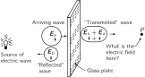
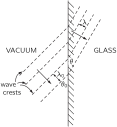
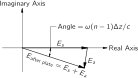
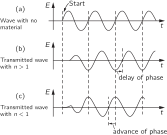
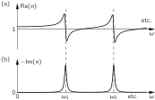
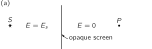

SOURCE: Feynman Lectures on Physics, Volume I, Chapter 31
LANGUAGE: en
TITLE: Chapter 31. The Origin of the Refractive Index
SOURCE_URL: https://www.feynmanlectures.caltech.edu/I_31.html
NOTEBOOKLM_USE: clean lecture text with TeX math and figure captions; reader navigation removed.

# Chapter 31. The Origin of the Refractive Index

## 31–1 The index of refraction

We have said before that light goes slower in water than in air, and slower, slightly, in air than in vacuum. This effect is described by the index of refraction \(n\) . Now we would like to understand how such a slower velocity could come about. In particular, we should try to see what the relation is to some physical assumptions, or statements, we made earlier, which were the following:That the total electric field in any physical circumstance can always be represented by the sum of the fields from all the charges in the universe.That the field from a single charge is given by its acceleration evaluated with a retardation at the speed \(c\) ,always(for theradiationfield).

But, for a piece of glass, you might think: “Oh, no, you should modify all this. You should say it is retarded at the speed \(c/n\) .” That, however, is not right, and we have to understand why it is not.

Itisapproximately true that light or any electrical wavedoes appearto travel at the speed \(c/n\) through a material whose index of refraction is \(n\) , but the fields are still produced by the motions ofallthe charges—including the charges moving in the material—and with these basic contributions of the field travelling at the ultimate velocity \(c\) . Our problem is to understand how theapparentlyslower velocity comes about.

### Figure Ch31-F1
Caption: Fig. 31–1.Electric waves passing through a layer of transparent material.
Image: figures/Ch31-F1.svg

We shall try to understand the effect in a very simple case. A source which we shall call “theexternalsource” is placed a large distance away from a thin plate of transparent material, say glass. We inquire about the field at a large distance on the opposite side of the plate. The situation is illustrated by the diagram of Fig.31–1, where \(S\) and \(P\) are imagined to be very far away from the plate. According to the principles we have stated earlier, an electric field anywhere that is far from all moving charges is the (vector) sum of the fields produced by the external source (at \(S\) )andthe fields produced byeachof the charges in the plate of glass,every one with its proper retardation at the velocity \(c\) . Remember that the contribution of each charge is not changed by the presence of the other charges. These are our basic principles. The field at \(P\) can be written thus:
\[
\begin{equation}
\label{Eq:I:31:1}
\FLPE=\sum_{\text{all charges}}\FLPE_{\text{each charge}}
\end{equation}
\]
or
\[
\begin{equation}
\label{Eq:I:31:2}
\FLPE=\FLPE_s+\sum_{\text{all other charges}}\FLPE_{\text{each charge}},
\end{equation}
\]
where \(\FLPE_s\) is the field due to the source alone and would be precisely the field at \(P\) if there were no material present. We expect the field at \(P\) to be different from \(\FLPE_s\) if there are any other moving charges.

Why should there be charges moving in the glass? We know that all material consists of atoms which contain electrons. When the electric fieldof the sourceacts on these atoms it drives the electrons up and down, because it exerts a force on the electrons. And moving electrons generate a field—they constitute new radiators. These new radiators are related to the source \(S\) , because they are driven by the field of the source. The total field is not just the field of the source \(S\) , but it is modified by the additional contribution from the other moving charges. This means that the field is not the same as the one which was there before the glass was there, but is modified, and it turns out that it is modified in such a way that the field inside the glass appears to be moving at a different speed. That is the idea which we would like to work out quantitatively.

Now this is, in the exact case, pretty complicated, because although we have said that all the other moving charges are driven by the source field, that is not quite true. If we think of a particular charge, it feels not only the source, but like anything else in the world, it feelsallof the charges that are moving. It feels, in particular, the charges that are moving somewhere else in the glass. So the total field which is acting on aparticular chargeis a combination of the fields from the other charges,whose motions depend on what this particular charge is doing!You can see that it would take a complicated set of equations to get the complete and exact formula. It is so complicated that we postpone this problem until next year.

Instead we shall work out a very simple case in order to understand all the physical principles very clearly. We take a circumstance in which the effects from the other atoms are very small relative to the effects from the source. In other words, we take a material in which the total field is not modified very much by the motion of the other charges. That corresponds to a material in which the index of refraction is very close to \(1\) , which will happen, for example, if the density of the atoms is very low. Our calculation will be valid for any case in which the index is for any reason very close to \(1\) . In this way we shall avoid the complications of the most general, complete solution.

Incidentally, you should notice that there is another effect caused by the motion of the charges in the plate. These charges will also radiate waves back toward the source \(S\) . This backward-going field is the light we see reflected from the surfaces of transparent materials. It does not come from just the surface. The backward radiation comes from everywhere in the interior, but it turns out that the total effect is equivalent to a reflection from the surfaces. These reflection effects are beyond our approximation at the moment because we shall be limited to a calculation for a material with an index so close to \(1\) that very little light is reflected.

### Figure Ch31-F2
Caption: Fig. 31–2.Relation between refraction and velocity change.
Image: figures/Ch31-F2.svg

Before we proceed with our study of how the index of refraction comes about, we should understand that all that is required to understand refraction is to understand why the apparent wavevelocityis different in different materials. Thebendingof light rays comes about justbecausethe effective speed of the waves is different in the materials. To remind you how that comes about we have drawn in Fig.31–2several successive crests of an electric wave which arrives from a vacuum onto the surface of a block of glass. The arrow perpendicular to the wave crests indicates the direction of travel of the wave. Now all oscillations in the wave must have the samefrequency. (We have seen that driven oscillations have the same frequency as the driving source.) This means, also, that the wave crests for the waves on both sides of the surface must have thesame spacing along the surfacebecause they must travel together, so that a charge sitting at the boundary will feel only one frequency. Theshortestdistance between crests of the wave, however, is the wavelength which is the velocity divided by the frequency. On the vacuum side it is \(\lambda_0 = 2\pi c/\omega\) , and on the other side it is \(\lambda = 2\pi v/\omega\) or \(2\pi c/\omega
n\) , if \(v = c/n\) is the velocity of the wave. From the figure we can see that the only way for the waves to “fit” properly at the boundary is for the waves in the material to be travelling at a different angle with respect to the surface. From the geometry of the figure you can see that for a “fit” we must have \(\lambda_0/\sin
\theta_0 = \lambda/\sin \theta\) , or \(\sin\theta_0/\sin\theta= n\) , which is Snell’s law. We shall, for the rest of our discussion, consider only why light has an effective speed of \(c/n\) in material of index \(n\) , and no longer worry, in this chapter, about the bending of the light direction.

We go back now to the situation shown in Fig.31–1. We see that what we have to do is to calculate the field produced at \(P\) by all the oscillating charges in the glass plate. We shall call this part of the field \(E_a\) , and it is just the sum written as the second term in Eq. (31.2). When we add it to the term \(E_s\) , due to the source, we will have the total field at \(P\) .

This is probably the most complicated thing that we are going to do this year, but it is complicated only in that there are many pieces that have to be put together; each piece, however, is very simple. Unlike other derivations where we say, “Forget the derivation, just look at the answer!,” in this case we do not need the answer so much as the derivation. In other words, the thing to understand now is the physical machinery for the production of the index.

To see where we are going, let us first find out what the “correction field” \(E_a\) would have to be if the total field at \(P\) is going to look like radiation from the source that is slowed down while passing through the thin plate. If the plate had no effect on it, the field of a wave travelling to the right (along the \(z\) -axis) would be
\[
\begin{equation}
\label{Eq:I:31:3}
E_s=E_0\cos\omega(t-z/c)
\end{equation}
\]
or, using the exponential notation,
\[
\begin{equation}
\label{Eq:I:31:4}
E_s=E_0e^{i\omega(t-z/c)}.
\end{equation}
\]

Now what would happen if the wave travelled more slowly in going through the plate? Let us call the thickness of the plate \(\Delta
z\) . If the plate were not there the wave would travel the distance \(\Delta z\) in the time \(\Delta z/c\) . But if it appears to travel at the speed \(c/n\) then it should take the longer time \(n\,\Delta z/c\) or theadditionaltime \(\Delta t = (n - 1)\,\Delta z/c\) . After that it would continue to travel at the speed \(c\) again. We can take into account the extra delay in getting through the plate by replacing \(t\) in Eq. (31.4) by \((t - \Delta t)\) or by \([t - (n -
1)\,\Delta z/c]\) . So the wave after insertion of the plate should be written
\[
\begin{equation}
\label{Eq:I:31:5}
E_{\text{after plate}}=E_0e^{i\omega[t - (n -
1)\,\Delta z/c-z/c]}.
\end{equation}
\]
We can also write this equation as
\[
\begin{equation}
\label{Eq:I:31:6}
E_{\text{after plate}}=e^{-i\omega(n-1)\,\Delta z/c}
E_0e^{i\omega(t - z/c)},
\end{equation}
\]
which says that the wave after the plate is obtained from the wave which could exist without the plate, i.e., from \(E_s\) , by multiplying by the factor \(e^{-i\omega(n-1)\,\Delta z/c}\) . Now we know that multiplying an oscillating function like \(e^{i\omega t}\) by a factor \(e^{i\theta}\) just says that we change the phase of the oscillation by the angle \(\theta\) , which is, of course, what the extra delay in passing through the thickness \(\Delta z\) has done. It has retarded the phase by the amount \(\omega(n - 1)\,\Delta z/c\) (retarded, because of the minus sign in the exponent).

We have said earlier that the plate shouldadda field \(E_a\) to the original field \(E_s = E_0e^{i\omega(t-z/c)}\) , but we have found instead that the effect of the plate is tomultiplythe field by a factor which shifts its phase. However, that is really all right because we can get the same result by adding a suitable complex number. It is particularly easy to find the right number to add in the case that \(\Delta z\) is small, for you will remember that if \(x\) is a small number then \(e^x\) is nearly equal to \((1 + x)\) . We can write, therefore,
\[
\begin{equation}
\label{Eq:I:31:7}
e^{-i\omega(n-1)\,\Delta z/c}\approx1-i\omega(n-1)\,\Delta z/c.
\end{equation}
\]
Using this approximation in Eq. (31.6), we have
\[
\begin{equation}
\label{Eq:I:31:8}
E_{\text{after plate}}=
\underbrace{\vphantom{\frac{i}{c}}E_0
e^{i\omega(t-z/c)}}_{\displaystyle E_s}-
\underbrace{\frac{i\omega(n-1)\,\Delta z}{c}\,
E_0e^{i\omega(t-z/c)}}_{\displaystyle E_a}.
\end{equation}
\]
The first term is just the field from the source, and the second term must just be equal to \(E_a\) , the field produced to the right of the plate by the oscillating charges of the plate—expressed here in terms of the index of refraction \(n\) , and depending, of course, on the strength of the wave from the source.

What we have been doing is easily visualized if we look at the complex number diagram in Fig.31–3. We first draw the number \(E_s\) (we chose some values for \(z\) and \(t\) so that \(E_s\) comes out horizontal, but this is not necessary). The delay due to slowing down in the plate would delay the phase of this number, that is, it would rotate \(E_s\) through a negative angle. But this is equivalent to adding the small vector \(E_a\) at roughly right angles to \(E_s\) . But that is just what the factor \(-i\) means in the second term of Eq. (31.8). It says that if \(E_s\) is real, then \(E_a\) is negative imaginary or that, in general, \(E_s\) and \(E_a\) make a right angle.

### Figure Ch31-F3
Caption: Fig. 31–3.Diagram for the transmitted wave at a particular \(t\) and \(z\) .
Image: figures/Ch31-F3.svg

## 31–2 The field due to the material

We now have to ask: Is the field \(E_a\) obtained in the second term of Eq. (31.8) the kind we would expect from oscillating charges in the plate? If we can show that it is, we will then have calculated what the index \(n\) should be! [Since \(n\) is the only nonfundamental number in Eq. (31.8).] We turn now to calculating what field \(E_a\) the charges in the material will produce. (To help you keep track of the many symbols we have used up to now, and will be using in the rest of our calculation, we have put them all together in Table31–1.)

### Table Ch31-T1

Caption: Table 31–1Symbols used in the calculations

- \(E_s=\) | field from the source
- \(E_a=\) | field produced by charges in the plate
- \(\Delta z=\) | thickness of the plate
- \(z=\) | perpendicular distance from the plate
- \(n=\) | index of refraction
- \(\omega=\) | frequency (angular) of the radiation
- \(N=\) | number of charges per unit volume in the plate
- \(\eta=\) | number of charges per unit area of the plate
- \(q_e=\) | charge on an electron
- \(m=\) | mass of an electron
- \(\omega_0=\) | resonant frequency of an electron bound in an atom

If the source \(S\) (of Fig.31–1) is far off to the left, then the field \(E_s\) will have the same phase everywhere on the plate, so we can write that in the neighborhood of the plate
\[
\begin{equation}
\label{Eq:I:31:9}
E_s=E_0e^{i\omega(t-z/c)}.
\end{equation}
\]
Right at the plate, where \(z = 0\) , we will have
\[
\begin{equation}
\label{Eq:I:31:10}
E_s=E_0e^{i\omega t}\text{ (at the plate)}.
\end{equation}
\]

Each of the electrons in the atoms of the plate will feel this electric field and will be driven up and down (we assume the direction of \(E_0\) is vertical) by the electric force \(qE\) . To find what motion we expect for the electrons, we will assume that the atoms are little oscillators, that is, that the electrons are fastened elastically to the atoms, which means that if a force is applied to an electron its displacement from its normal position will be proportional to the force.

You may think that this is a funny model of an atom if you have heard about electrons whirling around in orbits. But that is just an oversimplified picture. The correct picture of an atom, which is given by the theory of wave mechanics, says that,so far as problems involving light are concerned, the electrons behave as though they were held by springs. So we shall suppose that the electrons have a linear restoring force which, together with their mass \(m\) , makes them behave like little oscillators, with a resonant frequency \(\omega_0\) . We have already studied such oscillators, and we know that the equation of their motion is written this way:
\[
\begin{equation}
\label{Eq:I:31:11}
m\biggl(\frac{d^2x}{dt^2}+\omega_0^2x\biggr)=F,
\end{equation}
\]
where \(F\) is the driving force.

For our problem, the driving force comes from the electric field of the wave from the source, so we should use
\[
\begin{equation}
\label{Eq:I:31:12}
F=q_eE_s=q_eE_0e^{i\omega t},
\end{equation}
\]
where \(q_e\) is the electric charge on the electron and for \(E_s\) we use the expression \(E_s = E_0e^{i\omega t}\) from (31.10). Our equation of motion for the electron is then
\[
\begin{equation}
\label{Eq:I:31:13}
m\biggl(\frac{d^2x}{dt^2}+\omega_0^2x\biggr)=q_eE_0e^{i\omega t}.
\end{equation}
\]
We have solved this equation before, and we know that the solution is
\[
\begin{equation}
\label{Eq:I:31:14}
x=x_0e^{i\omega t},
\end{equation}
\]
where, by substituting in (31.13), we find that
\[
\begin{equation}
\label{Eq:I:31:15}
x_0=\frac{q_eE_0}{m(\omega_0^2-\omega^2)},
\end{equation}
\]
so that
\[
\begin{equation}
\label{Eq:I:31:16}
x=\frac{q_eE_0}{m(\omega_0^2-\omega^2)}\,e^{i\omega t}.
\end{equation}
\]
We have what we needed to know—the motion of the electrons in the plate. And it is the same for every electron, except that the mean position (the “zero” of the motion) is, of course, different for each electron.

Now we are ready to find the field \(E_a\) that these atoms produce at the point \(P\) , because we have already worked out (at the end of Chapter30) what field is produced by a sheet of charges that all move together. Referring back to Eq. (30.19), we see that the field \(E_a\) at \(P\) is just a negative constant times the velocity of the charges retarded in time by the amount \(z/c\) . Differentiating \(x\) in Eq. (31.16) to get the velocity, and sticking in the retardation [or just putting \(x_0\) from (31.15) into (30.18)] yields
\[
\begin{equation}
\label{Eq:I:31:17}
E_a=-\frac{\eta q_e}{2\epsO c}\biggl[
i\omega\,\frac{q_eE_0}{m(\omega_0^2-\omega^2)}\,
e^{i\omega(t-z/c)}\biggr].
\end{equation}
\]
Just as we expected, the driven motion of the electrons produced an extra wave which travels to the right (that is what the factor \(e^{i\omega(t-z/c)}\) says), and the amplitude of this wave is proportional to the number of atoms per unit area in the plate (the factor \(\eta\) ) and also proportional to the strength of the source field (the factor \(E_0\) ). Then there are some factors which depend on the atomic properties ( \(q_e\) , \(m\) , and \(\omega_0\) ), as we should expect.

The most important thing, however, is that this formula (31.17) for \(E_a\) looks very much like the expression for \(E_a\) that we got in Eq. (31.8) by saying that the original wave was delayed in passing through a material with an index of refraction \(n\) . The two expressions will, in fact, be identical if
\[
\begin{equation}
\label{Eq:I:31:18}
(n-1)\,\Delta z=\frac{\eta q_e^2}{2\epsO m(\omega_0^2-\omega^2)}.
\end{equation}
\]
Notice that both sides are proportional to \(\Delta z\) , since \(\eta\) , which is the number of atomsper unit area, is equal to \(N\,\Delta z\) , where \(N\) is the number of atomsper unit volumeof the plate. Substituting \(N\,\Delta z\) for \(\eta\) and cancelling the \(\Delta z\) , we get our main result, a formula for the index of refraction in terms of the properties of the atoms of the material—and of the frequency of the light:
\[
\begin{equation}
\label{Eq:I:31:19}
n=1+\frac{Nq_e^2}{2\epsO m(\omega_0^2-\omega^2)}.
\end{equation}
\]
This equation gives the “explanation” of the index of refraction that we wished to obtain.

## 31–3 Dispersion

Notice that in the above process we have obtained something very interesting. For we have not only a number for the index of refraction which can be computed from the basic atomic quantities, but we have also learned how the index of refraction should vary with the frequency \(\omega\) of the light. This is something we would never understand from the simple statement that “light travels slower in a transparent material.” We still have the problem, of course, of knowing how many atoms per unit volume there are, and what is their natural frequency \(\omega_0\) . We do not know this just yet, because it is different for every different material, and we cannot get a general theory of that now. Formulation of a general theory of the properties of different substances—their natural frequencies, and so on—is possible only with quantum atomic mechanics. Also, different materials have different properties and different indexes, so we cannot expect, anyway, to get a general formula for the index which will apply to all substances.

However, we shall discuss the formula we have obtained, in various possible circumstances. First of all, for most ordinary gases (for instance, for air, most colorless gases, hydrogen, helium, and so on) the natural frequencies of the electron oscillators correspond to ultraviolet light. These frequencies are higher than the frequencies of visible light, that is, \(\omega_0\) is much larger than \(\omega\) of visible light, and to a first approximation, we can disregard \(\omega^2\) in comparison with \(\omega_0^2\) . Then we find that the index is nearly constant. So for a gas, the index is nearly constant. This is also true for most other transparent substances, like glass. If we look at our expression a little more closely, however, we notice that as \(\omega\) rises, taking a little bit more away from the denominator, the index also rises. So \(n\) rises slowly with frequency. The index is higher for blue light than for red light. That is the reason why a prism bends the light more in the blue than in the red.

The phenomenon that the index depends upon the frequency is called the phenomenon ofdispersion, because it is the basis of the fact that light is “dispersed” by a prism into a spectrum. The equation for the index of refraction as a function of frequency is called adispersion equation. So we have obtained a dispersion equation. (In the past few years “dispersion equations” have been finding a new use in the theory of elementary particles.)

Our dispersion equation suggests other interesting effects. If we have a natural frequency \(\omega_0\) which lies in the visible region, or if we measure the index of refraction of a material like glass in the ultraviolet, where \(\omega\) gets near \(\omega_0\) , we see that at frequencies very close to the natural frequency the index can get enormously large, because the denominator can go to zero. Next, suppose that \(\omega\) is greater than \(\omega_0\) . This would occur, for example, if we take a material like glass, say, and shine x-ray radiation on it. In fact, since many materials which are opaque to visible light, like graphite for instance, are transparent to x-rays, we can also talk about the index of refraction of carbon for x-rays. All the natural frequencies of the carbon atoms would be much lower than the frequency we are using in the x-rays, since x-ray radiation has a very high frequency. The index of refraction is that given by our dispersion equation if we set \(\omega_0\) equal to zero (we neglect \(\omega_0^2\) in comparison with \(\omega^2\) ).

A similar situation would occur if we beam radiowaves (or light) on a gas of free electrons. In the upper atmosphere electrons are liberated from their atoms by ultraviolet light from the sun and they sit up there as free electrons. For free electrons \(\omega_0 = 0\) (there is no elastic restoring force). Setting \(\omega_0 = 0\) in our dispersion equation yields the correct formula for the index of refraction for radiowaves in the stratosphere, where \(N\) is now to represent the density of free electrons (number per unit volume) in the stratosphere. But let us look again at the equation, if we beam x-rays on matter, or radiowaves (or any electric waves) on free electrons the term \((\omega_0^2-\omega^2)\) becomesnegative, and we obtain the result that \(n\) isless than one. That means that the effective speed of the waves in the substance isfasterthan \(c\) ! Can that be correct?

It is correct. In spite of the fact that it is said that you cannot send signals any faster than the speed of light, it is nevertheless true that the index of refraction of materials at a particular frequency can be either greater or less than \(1\) . This just means that thephase shiftwhich is produced by the scattered light can be either positive or negative. It can be shown, however, that the speed at which you can send asignalis not determined by the index at one frequency, but depends on what the index is atmanyfrequencies. What the index tells us is the speed at which thenodes(or crests) of the wave travel. Thenodeof a wave is not a signal by itself. In a perfect wave, which has no modulations of any kind, i.e., which is a steady oscillation, you cannot really say when it “starts,” so you cannot use it for a timing signal. In order to send asignalyou have to change the wave somehow, make a notch in it, make it a little bit fatter or thinner. That means that you have to have more than one frequency in the wave, and it can be shown that the speed at whichsignalstravel is not dependent upon the index alone, but upon the way that the index changes with the frequency. This subject we must also delay (until Chapter48). Then we will calculate for you the actual speed ofsignalsthrough such a piece of glass, and you will see that it will not be faster than the speed of light, although the nodes, which are mathematical points, do travel faster than the speed of light.

Just to give a slight hint as to how that happens, you will note that the real difficulty has to do with the fact that the responses of the charges are opposite to the field, i.e., the sign has gotten reversed. Thus in our expression for \(x\) (Eq.31.16) the displacement of the charge is in the direction opposite to the driving field, because \((\omega_0^2 - \omega^2)\) is negative for small \(\omega_0\) . The formula says that when the electric field is pulling in one direction, the charge is moving in the opposite direction.

How does the charge happen to be going in the opposite direction? It certainly does not start off in the opposite direction when the field is first turned on. When the motion first starts there is a transient, which settles down after awhile, and onlythenis the phase of the oscillation of the charge opposite to the driving field. And it is then that thephaseof the transmitted field can appear to beadvancedwith respect to the source wave. It is thisadvance in phasewhich is meant when we say that the “phase velocity” or velocity of the nodes is greater than \(c\) . In Fig.31–4we give a schematic idea of how the waves might look for a case where the wave is suddenly turned on (to make a signal). You will see from the diagram that thesignal(i.e., thestartof the wave) isnotearlier for the wave which ends up with an advance in phase.

### Figure Ch31-F4
Caption: Fig. 31–4.Wave “signals.”
Image: figures/Ch31-F4.svg

Let us now look again at our dispersion equation. We should remark that our analysis of the refractive index gives a result that is somewhat simpler than you would actually find in nature. To be completely accurate we must add some refinements. First, we should expect that our model of the atomic oscillator should have some damping force (otherwise once started it would oscillate forever, and we do not expect that to happen). We have worked out before (Eq.23.8) the motion of a damped oscillator and the result is that the denominator in Eq. (31.16), and therefore in (31.19), is changed from \((\omega_0^2 - \omega^2)\) to \((\omega_0^2 - \omega^2 + i\gamma\omega)\) , where \(\gamma\) is the damping coefficient.

We need a second modification to take into account the fact that there are several resonant frequencies for a particular kind of atom. It is easy to fix up our dispersion equation by imagining that there are several different kinds of oscillators, but that each oscillator acts separately, and so we simply add the contributions of all the oscillators. Let us say that there are \(N_k\) electrons per unit of volume, whose natural frequency is \(\omega_k\) and whose damping factor is \(\gamma_k\) . We would then have for our dispersion equation
\[
\begin{equation}
\label{Eq:I:31:20}
n=1+\frac{q_e^2}{2\epsO m}
\sum_k\frac{N_k}{\omega_k^2-\omega^2+i\gamma_k\omega}.
\end{equation}
\]
We have, finally, a complete expression which describes the index of refraction that is observed for many substances.1The real part of the index described by this formula varies with frequency roughly like the curve shown in Fig.31–5(a).

### Figure Ch31-F5
Caption: Fig. 31–5.The index of refraction as a function of frequency.
Image: figures/Ch31-F5.svg

You will note that so long as \(\omega\) is not too close to one of the resonant frequencies, the slope of the curve is positive. Such a positive slope is called “normal” dispersion (because it is clearly the most common occurrence). Very near the resonant frequencies, however, there is a small range of \(\omega\) ’s for which the slope is negative. Such a negative slope is often referred to as “anomalous” (meaning abnormal) dispersion, because it seemed unusual when it was first observed, long before anyone even knew there were such things as electrons. From our point of view both slopes are quite “normal”!

## 31–4 Absorption

Perhaps you have noticed something a little strange about the last form (Eq.31.20) we obtained for our dispersion equation. Because of the term \(i\gamma\) we put in to take account of damping, the index of refraction is now acomplex number!What doesthatmean? By working out what the real and imaginary parts of \(n\) are we could write
\[
\begin{equation}
\label{Eq:I:31:21}
n=n'-in'',
\end{equation}
\]
where \(n'\) and \(n''\) are real numbers. (We use the minus sign in front of the \(in''\) because then \(n''\) will turn out to be a positive number, as you can show for yourself.)

We can see what such a complex index means when there is only one resonant frequency by going back to Eq. (31.6), which is the equation of the wave after it goes through a plate of material with an index \(n\) . If we put our complex \(n\) into this equation, and do some rearranging, we get
\[
\begin{equation}
\label{Eq:I:31:22}
E_{\text{after plate}}=
\underbrace{\vphantom{E_0}e^{-\omega n''\,\Delta z/c}}_{\text{A}}
\underbrace{e^{-i\omega(n'-1)\,\Delta z/c}
E_0e^{i\omega(t-z/c)}}_{\text{B}}.
\end{equation}
\]
The last factors, marked B in Eq. (31.22), are just the form we had before, and again describe a wave whose phase has been delayed by the angle \(\omega(n' - 1)\,\Delta z/c\) in traversing the material. The first term (A) is new and is an exponential factor with arealexponent, because there were two \(i\) ’s that cancelled. Also, the exponent is negative, so the factor is a real number less than one. It describes adecreasein the magnitude of the field and, as we should expect, by an amount which is more the larger \(\Delta z\) is. As the wave goes through the material, it is weakened. The material is “absorbing” part of the wave. The wave comes out the other side with less energy. We should not be surprised at this, because the damping we put in for the oscillators is indeed a friction force and must be expected to cause a loss of energy. We see that the imaginary part \(n''\) of a complex index of refraction represents an absorption (or “attenuation”) of the wave. In fact, \(n''\) is sometimes referred to as the “absorption index.”

We may also point out that an imaginary part to the index \(n\) corresponds to bending the arrow \(E_a\) in Fig.31–3toward the origin. It is clear why the transmitted field is then decreased.

Normally, for instance as in glass, the absorption of light is very small. This is to be expected from our Eq. (31.20), because the imaginary part of the denominator, \(i\gamma_k\omega\) , is much smaller than the term \((\omega_k^2 - \omega^2)\) . But if the light frequency \(\omega\) is very close to \(\omega_k\) then the resonance term \((\omega_k^2 - \omega^2)\) can become small compared with \(i\gamma_k\omega\) and the index becomes almost completely imaginary, as shown in Fig.31–5(b). The absorption of the light becomes the dominant effect. It is just this effect that gives the dark lines in the spectrum of light which we receive from the sun. The light from the solar surface has passed through the sun’s atmosphere (as well as the earth’s), and the light has been strongly absorbed at the resonant frequencies of the atoms in the solar atmosphere.

The observation of such spectral lines in the sunlight allows us to tell the resonant frequencies of the atoms and hence the chemical composition of the sun’s atmosphere. The same kind of observations tell us about the materials in the stars. From such measurements we know that the chemical elements in the sun and in the stars are the same as those we find on the earth.

## 31–5 The energy carried by an electric wave

We have seen that the imaginary part of the index means absorption. We shall now use this knowledge to find out how much energy is carried by a light wave. We have given earlier an argument that the energy carried by light is proportional to \(\overline{E^2}\) , the time average of the square of the electric field in the wave. The decrease in \(E\) due to absorption must mean a loss of energy, which would go into some friction of the electrons and, we might guess, would end up as heat in the material.

If we consider the light arriving on a unit area, say one square centimeter, of our plate in Fig.31–1, then we can write the following energy equation (if we assume that energy is conserved, as wedo!):
\[
\begin{equation}
\begin{gathered}
\text{Energy in per sec} =\\[1ex]
\text{energy out per sec} +
\text{work done per sec}.
\end{gathered}
\label{Eq:I:31:23}
\end{equation}
\]
For the first term we can write \(\alpha\overline{E_s^2}\) , where \(\alpha\) is the as yet unknown constant of proportionality which relates the average value of \(E^2\) to the energy being carried. For the second term we must include the part from the radiating atoms of the material, so we should use \(\alpha\overline{(E_s+E_a)^2}\) , or (evaluating the square) \(\alpha(\overline{E_s^2} + 2\overline{E_sE_a}
+ \overline{E_a^2})\) .

All of our calculations have been made for a thin layer of material whose index is not too far from \(1\) , so that \(E_a\) would always be much less than \(E_s\) (just to make the calculations easier). In keeping with our approximations, we should, therefore, leave out the term \(\overline{E_a^2}\) , because it is much smaller than \(\overline{E_sE_a}\) . You may say: “Then you should leave out \(\overline{E_sE_a}\) also, becauseitis much smaller than \(\overline{E_s^2}\) .” It is true that \(\overline{E_sE_a}\) is much smaller than \(\overline{E_s^2}\) , but we must keep \(\overline{E_sE_a}\) or our approximation will be the one that would apply if we neglected the presence of the material completely! One way of checking that our calculations are consistent is to see that we always keep terms which are proportional to \(N\,\Delta z\) , the area density of atoms in the material, but we leave out terms which are proportional to \((N\,\Delta
z)^2\) or any higher power of \(N\,\Delta z\) . Ours is what should be called a “low-density approximation.”

In the same spirit, we might remark that our energy equation has neglected the energy in the reflected wave. But that is OK because this term, too, is proportional to \((N\,\Delta z)^2\) , since the amplitude of the reflected wave is proportional to \(N\,\Delta z\) .

For the last term in Eq. (31.23) we wish to compute the rate at which the incoming wave is doing work on the electrons. We know that work is force times distance, so therateof doing work (also called power) is the force times the velocity. It is really \(\FLPF\cdot\FLPv\) , but we do not need to worry about the dot product when the velocity and force are along the same direction as they are here (except for a possible minus sign). So for each atom we take \(\overline{q_eE_sv}\) for the average rate of doing work. Since there are \(N\,\Delta z\) atoms in a unit area, the last term in Eq. (31.23) should be \(N\,\Delta z\,q_e\overline{E_sv}\) . Our energy equation now looks like
\[
\begin{equation}
\label{Eq:I:31:24}
\alpha\overline{E_s^2}=\alpha\overline{E_s^2}+
2\alpha\overline{E_sE_a}+
N\,\Delta z\,q_e\overline{E_sv}.
\end{equation}
\]
The \(\overline{E_s^2}\) terms cancel, and we have
\[
\begin{equation}
\label{Eq:I:31:25}
2\alpha\overline{E_sE_a}=
-N\,\Delta z\,q_e\overline{E_sv}.
\end{equation}
\]
We now go back to Eq. (30.19), which tells us that for large \(z\) 
\[
\begin{equation}
\label{Eq:I:31:26}
E_a=-\frac{N\,\Delta z\,q_e}{2\epsO c}\,v(\text{ret by $z/c$})
\end{equation}
\]
(recalling that \(\eta=N\,\Delta z\) ). Putting Eq. (31.26) into the left-hand side of (31.25), we get
\[
\begin{equation*}
-2\alpha\,\frac{N\,\Delta z\,q_e}{2\epsO c}\,
\overline{E_s(\text{at $z$})\cdot
v(\text{ret by $z/c$})}.
\end{equation*}
\]
However, \(E_s(\text{at \(z\)})\) is \(E_s(\text{at atoms})\) retarded by \(z/c\) . Since the average is independent of time, it is the same now as retarded by \(z/c\) , or is \(\overline{E_s(\text{at atoms})\cdot v}\) , the same average that appears on the right-hand side of (31.25). The two sides are therefore equal if
\[
\begin{equation}
\label{Eq:I:31:27}
\frac{\alpha}{\epsO c}=1,\quad
\text{or}\quad
\alpha=\epsO c.
\end{equation}
\]
We have discovered that if energy is to be conserved, the energy carried in an electric wave per unit area and per unit time (or what we have called theintensity) must be given by \(\epsO
c\overline{E^2}\) . If we call the intensity \(\overline{S}\) , we have
\[
\begin{equation}
\label{Eq:I:31:28}
\overline{S}=
\begin{Bmatrix}
\text{intensity}\\
\text{or}\\
\text{energy/area/time}
\end{Bmatrix}
=\epsO c\overline{E^2},
\end{equation}
\]
where thebarmeans thetime average. We have a nice bonus result from our theory of the refractive index!

## 31–6 Diffraction of light by a screen

It is now a good time to take up a somewhat different matter which we can handle with the machinery of this chapter. In the last chapter we said that when you have an opaque screen and the light can come through some holes, the distribution of intensity—the diffraction pattern—could be obtained by imagining instead that the holes are replaced by sources (oscillators) uniformly distributed over the hole. In other words, the diffracted wave is the same as though the hole were a new source. We have to explain the reason for that, because the hole is, of course, just where there arenosources, where there arenoaccelerating charges.

Let us first ask: “Whatisan opaque screen?” Suppose we have a completely opaque screen between a source \(S\) and an observer at \(P\) , as in Fig.31–6(a). If the screen is “opaque” there is no field at \(P\) . Why is there no field there? According to the basic principles we should obtain the field at \(P\) as the field \(E_s\) of the source delayed, plus the field from all the other charges around. But, as we have seen above, the charges in the screen will be set in motion by the field \(E_s\) , and these motions generate a new field which, if the screen is opaque, mustexactly cancelthe field \(E_s\) on the back side of the screen. You say: “What a miracle that it balancesexactly! Suppose it was not exactly right!” If it were not exactly right (remember that this opaque screen has some thickness), the field toward the rear part of the screen would not be exactly zero. So, not being zero, it would set into motion some other charges in the material of the screen, and thus make a little more field, trying to get the total balanced out. So if we make the screen thick enough, there is no residual field, because there is enough opportunity to finally get the thing quieted down. In terms of our formulas above we would say that the screen has a large and imaginary index, so the wave is absorbed exponentially as it goes through. You know, of course, that a thin enough sheet of the most opaque material, even gold, is transparent.

### Figure Ch31-F6
Caption: Fig. 31–6.Diffraction by a screen.
Image: figures/Ch31-F6.svg

Now let us see what happens with an opaque screen which has holes in it, as in Fig.31–6(b). What do we expect for the field at \(P\) ? The field at \(P\) can be represented as a sum of two parts—the field due to the source \(S\) plus the field due to the wall, i.e., due to the motions of the charges in the walls. We might expect the motions of the charges in the walls to be complicated, but we can find outwhat fields they producein a rather simple way.

Suppose that we were to take the same screen, but plug up the holes, as indicated in part (c) of the figure. We imagine that the plugs are of exactly the same material as the wall. Mind you, the plugs go where the holes were in case (b). Now let us calculate the field at \(P\) . The field at \(P\) is certainly zero in case (c), but it isalsoequal to the field from the source plus the field due to all the motions of the atoms in the walls and in the plugs. We can write the following equations:
\[
\begin{alignat*}{3}
&\textit{Case (b):}&&
\quad &E_{\text{at $P$}}&\;= E_s + E_{\text{wall}},\\[1ex]
&\textit{Case (c):}&&
\quad &E_{\text{at $P$}}'&\;= 0 = E_s + E_{\text{wall}}' +
E_{\text{plug}}',
\end{alignat*}
\]
where the primes refer to the case where the plugs are in place, but \(E_s\) is, of course, the same in both cases. Now if we subtract the two equations, we get
\[
\begin{equation*}
E_{\text{at $P$}}=(E_{\text{wall}}-E_{\text{wall}}')-E_{\text{plug}}'.
\end{equation*}
\]
Now if the holes are not too small (say many wavelengths across), we would not expect the presence of the plugs to change the fields which arrive at the walls except possibly for a little bit around the edges of the holes. Neglecting this small effect, we can set \(E_{\text{wall}}=E_{\text{wall}}'\) and obtain that
\[
\begin{equation*}
E_{\text{at $P$}}=-E_{\text{plug}}'.
\end{equation*}
\]
We have the result that the field at \(P\) when there are holesin a screen (case b) is the same (except for sign) as the field that is produced bythat partof a complete opaque wall which islocated where the holes are!(The sign is not too interesting, since we are usually interested in intensity which is proportional to the square of the field.) It seems like an amazing backwards-forwards argument. It is, however, not only true (approximately for not too small holes), but useful, and is the justification for the usual theory of diffraction.

The field \(E_{\text{plug}}'\) is computed in any particular case by remembering that the motion of the chargeseverywherein the screen is just that which will cancel out the field \(E_s\) on the back of the screen. Once we know these motions, we add the radiation fields at \(P\) due just to the charges in the plugs.

We remark again that this theory of diffraction is only approximate, and will be good only if the holes are not too small. For holes which are too small the \(E_{\text{plug}}'\) term will be small and then the difference between \(E_{\text{wall}}'\) and \(E_{\text{wall}}\) (which difference we have taken to be zero) may be comparable to or larger than the small \(E_{\text{plug}}'\) term, and our approximation will no longer be valid.
