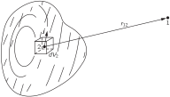
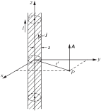
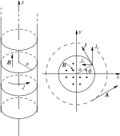
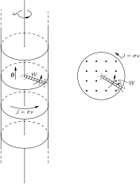
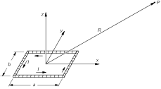
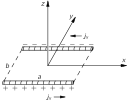
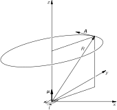
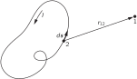

# 14. The Magnetic Field in Various Situations

## 14–1 The vector potential

In this chapter we continue our discussion of magnetic fields associated with steady currents—the subject of magnetostatics. The magnetic field is related to electric currents by our basic equations

\begin{aligned} \mathbf{d}iv{\mathbf{B}}=0,\\[1ex] c^2\mathbf{c}url{\mathbf{B}}=\frac{\mathbf{j}}{\epsilon_0}. \end{aligned} (14.1)

We want now to solve these equations mathematically in a general way, that is, without requiring any special symmetry or intuitive guessing. In electrostatics, we found that there was a straightforward procedure for finding the field when the positions of all electric charges are known: One simply works out the scalar potential \phi by taking an integral over the charges—as in Eq. ( 4.25). Then if one wants the electric field, it is obtained from the derivatives of \phi . We will now show that there is a corresponding procedure for finding the magnetic field \mathbf{B} if we know the current density \mathbf{j} of all moving charges.

In electrostatics we saw that (because the curl of \mathbf{E} was always zero) it was possible to represent \mathbf{E} as the gradient of a scalar field \phi . Now the curl of \mathbf{B} is not always zero, so it is not possible, in general, to represent it as a gradient. However, the divergence of \mathbf{B} is always zero, and this means that we can always represent \mathbf{B} as the curl of another vector field. For, as we saw in Section 2–7 , the divergence of a curl is always zero. Thus we can always relate \mathbf{B} to a field we will call \mathbf{A} by

\mathbf{B}=\mathbf{c}url{\mathbf{A}}. (14.3)

Or, by writing out the components,

\begin{alignedat}{4} &B_x&&=(\mathbf{c}url{\mathbf{A}})_x&&=\frac{\partial A_z}{\partial y}&&-\frac{\partial A_y}{\partial z},\\[.75ex] &B_y&&=(\mathbf{c}url{\mathbf{A}})_y&&=\frac{\partial A_x}{\partial z}&&-\frac{\partial A_z}{\partial x},\\[.75ex] &B_z&&=(\mathbf{c}url{\mathbf{A}})_z&&=\frac{\partial A_y}{\partial x}&&-\frac{\partial A_x}{\partial y}.\\ \end{alignedat} (14.4)

Writing \mathbf{B}=\mathbf{c}url{\mathbf{A}} guarantees that Eq. ( 14.1) is satisfied, since, necessarily,

\mathbf{d}iv{\mathbf{B}}=\mathbf{d}iv{(\mathbf{c}url{\mathbf{A}})}=0.

The field \mathbf{A} is called the vector potential.

You will remember that the scalar potential \phi was not completely specified by its definition. If we have found \phi for some problem, we can always find another potential \phi' that is equally good by adding a constant:

\phi'=\phi+C.

The new potential \phi' gives the same electric fields, since the gradient \boldsymbol{\nabla}{C} is zero; \phi' and \phi represent the same physics.

Similarly, we can have different vector potentials \mathbf{A} which give the same magnetic fields. Again, because \mathbf{B} is obtained from \mathbf{A} by differentiation, adding a constant to \mathbf{A} doesn’t change anything physical. But there is even more latitude for \mathbf{A} . We can add to \mathbf{A} any field which is the gradient of some scalar field, without changing the physics. We can show this as follows. Suppose we have an \mathbf{A} that gives correctly the magnetic field \mathbf{B} for some real situation, and ask in what circumstances some other new vector potential \mathbf{A}' will give the same field \mathbf{B} if substituted into ( 14.3). Then \mathbf{A} and \mathbf{A}' must have the same curl:

\mathbf{B}=\mathbf{c}url{\mathbf{A}'}=\mathbf{c}url{\mathbf{A}}.

Therefore

\mathbf{c}url{\mathbf{A}'}-\mathbf{c}url{\mathbf{A}}=\mathbf{c}url{(\mathbf{A}'-\mathbf{A})}=\FLPzero.

But if the curl of a vector is zero it must be the gradient of some scalar field, say \psi , so \mathbf{A}'-\mathbf{A}=\boldsymbol{\nabla}{\psi} . That means that if \mathbf{A} is a satisfactory vector potential for a problem then, for any \psi , at all,

\mathbf{A}'=\mathbf{A}+\boldsymbol{\nabla}{\psi} (14.5)

will be an equally satisfactory vector potential, leading to the same field \mathbf{B} .

It is usually convenient to take some of the “latitude” out of \mathbf{A} by arbitrarily placing some other condition on it (in much the same way that we found it convenient—often—to choose to make the potential \phi zero at large distances). We can, for instance, restrict \mathbf{A} by choosing arbitrarily what the divergence of \mathbf{A} must be. We can always do that without affecting \mathbf{B} . This is because although \mathbf{A}' and \mathbf{A} have the same curl, and give the same \mathbf{B} , they do not need to have the same divergence. In fact, \mathbf{d}iv{\mathbf{A}'}=\mathbf{d}iv{\mathbf{A}}+\nabla^2\psi , and by a suitable choice of \psi we can make \mathbf{d}iv{\mathbf{A}'} anything we wish.

What should we choose for \mathbf{d}iv{\mathbf{A}} ? The choice should be made to get the greatest mathematical convenience and will depend on the problem we are doing. For magnetostatics, we will make the simple choice

\mathbf{d}iv{\mathbf{A}}=0. (14.6)

(Later, when we take up electrodynamics, we will change our choice.) Our complete definition 1 of \mathbf{A} is then, for the moment, \mathbf{c}url{\mathbf{A}}=\mathbf{B} and \mathbf{d}iv{\mathbf{A}}=0 .

To get some experience with the vector potential, let’s look first at what it is for a uniform magnetic field \mathbf{B}_0 . Taking our z -axis in the direction of \mathbf{B}_0 , we must have

\begin{alignedat}{4} &B_x&&=\frac{\partial A_z}{\partial y}&&-\frac{\partial A_y}{\partial z}&&=0,\\[1ex] &B_y&&=\frac{\partial A_x}{\partial z}&&-\frac{\partial A_z}{\partial x}&&=0,\\[1ex] &B_z&&=\frac{\partial A_y}{\partial x}&&-\frac{\partial A_x}{\partial y}&&=B_0.\\ \end{alignedat} (14.7)

By inspection, we see that one possible solution of these equations is

A_y=xB_0,\quad A_x=0,\quad A_z=0.

Or we could equally well take

A_x=-yB_0,\quad A_y=0,\quad A_z=0.

Still another solution is a linear combination of the two:

A_x=-\frac{1}{2}yB_0,\quad A_y=\frac{1}{2}xB_0,\quad A_z=0. (14.8)

It is clear that for any particular field \mathbf{B} , the vector potential \mathbf{A} is not unique; there are many possibilities.

The third solution, Eq. ( 14.8), has some interesting properties. Since the x -component is proportional to -y and the y -component is proportional to +x , \mathbf{A} must be at right angles to the vector from the z -axis, which we will call \mathbf{r}' (the “prime” is to remind us that it is not the vector displacement from the origin). Also, the magnitude of \mathbf{A} is proportional to \sqrt{x^2+y^2} and, hence, to r' . So \mathbf{A} can be simply written (for our uniform field) as

\mathbf{A}=\frac{1}{2}\mathbf{B}_0\times\mathbf{r}'. (14.9)

The vector potential \mathbf{A} has the magnitude B_0r'/2 and rotates about the z -axis as shown in Fig. 14–1 . If, for example, the \mathbf{B} field is the axial field inside a solenoid, then the vector potential circulates in the same sense as do the currents of the solenoid.

### Figure Ch14-F1
Caption: Fig. 14–1.A uniform magnetic field B\FigB in the zz-direction corresponds to a vector potential A\FigA that rotates about the zz-axis, with the magnitude A=Br′/2A=Br'/2 (r′r' is the displacement from the zz-axis).
Image: figures/Ch14-F1.svg

The vector potential for a uniform field can be obtained in another way. The circulation of \mathbf{A} on any closed loop \Gamma can be related to the surface integral of \mathbf{c}url{\mathbf{A}} by Stokes’ theorem, Eq. ( 3.38):

\oint_\Gamma\mathbf{A}\cdot d\mathbf{s}= \underset{\text{inside $\Gamma$}}{\int} (\mathbf{c}url{\mathbf{A}})\cdot\FLPn\,da. (14.10)

But the integral on the right is equal to the flux of \mathbf{B} through the loop, so

\oint_\Gamma\mathbf{A}\cdot d\mathbf{s}= \underset{\text{inside $\Gamma$}}{\int} \mathbf{B}\cdot\FLPn\,da. (14.11)

So the circulation of \mathbf{A} around any loop is equal to the flux of \mathbf{B} through the loop. If we take a circular loop, of radius r' in a plane perpendicular to a uniform field \mathbf{B} , the flux is just

\pi r'^2B.

If we choose our origin on an axis of symmetry, so that we can take \mathbf{A} as circumferential and a function only of r' , the circulation will be

\oint\mathbf{A}\cdot d\mathbf{s}=2\pi r'A=\pi r'^2B.

We get, as before,

A=\frac{Br'}{2}.

In the example we have just given, we have calculated the vector potential from the magnetic field, which is opposite to what one normally does. In complicated problems it is usually easier to solve for the vector potential, and then determine the magnetic field from it. We will now show how this can be done.

## 14–2 The vector potential of known currents

Since \mathbf{B} is determined by currents, so also is \mathbf{A} . We want now to find \mathbf{A} in terms of the currents. We start with our basic equation ( 14.2):

c^2\mathbf{c}url{\mathbf{B}}=\frac{\mathbf{j}}{\epsilon_0},

which means, of course, that

c^2\mathbf{c}url{(\mathbf{c}url{\mathbf{A}})}=\frac{\mathbf{j}}{\epsilon_0}. (14.12)

This equation is for magnetostatics what the equation

\mathbf{d}iv{\boldsymbol{\nabla}{\phi}}=-\frac{\rho}{\epsilon_0} (14.13)

was for electrostatics.

Our equation ( 14.12) for the vector potential looks even more like that for \phi if we rewrite \mathbf{c}url{(\mathbf{c}url{\mathbf{A}})} using the vector identity Eq. ( 2.58):

\mathbf{c}url{(\mathbf{c}url{\mathbf{A}})}=\boldsymbol{\nabla}{(\mathbf{d}iv{\mathbf{A}})}-\nabla^2\mathbf{A}. (14.14)

Since we have chosen to make \mathbf{d}iv{\mathbf{A}}=0 (and now you see why), Eq. ( 14.12) becomes

\nabla^2\mathbf{A}=-\frac{\mathbf{j}}{\epsilon_0 c^2}. (14.15)

This vector equation means, of course, three equations:

\begin{aligned} \nabla^2A_x&=-\frac{j_x}{\epsilon_0 c^2},\\[1ex] \nabla^2A_y&=-\frac{j_y}{\epsilon_0 c^2},\\[1ex] \nabla^2A_z&=-\frac{j_z}{\epsilon_0 c^2}. \end{aligned} (14.16)

And each of these equations is mathematically identical to

\nabla^2\phi=-\frac{\rho}{\epsilon_0}. (14.17)

All we have learned about solving for potentials when \rho is known can be used for solving for each component of \mathbf{A} when \mathbf{j} is known!

We have seen in Chapter 4 that a general solution for the electrostatic equation ( 14.17) is

\phi(1)=\frac{1}{4\pi\epsilon_0}\int\frac{\rho(2)\,dV_2}{r_{12}}.

So we know immediately that a general solution for A_x is

A_x(1)=\frac{1}{4\pi\epsilon_0 c^2}\int\frac{j_x(2)\,dV_2}{r_{12}}, (14.18)

and similarly for A_y and A_z . (Figure 14–2 will remind you of our conventions for r_{12} and dV_2 .) We can combine the three solutions in the vector form

\mathbf{A}(1)=\frac{1}{4\pi\epsilon_0 c^2}\int\frac{\mathbf{j}(2)\,dV_2}{r_{12}}, (14.19)

(You can verify if you wish, by direct differentiation of components, that this integral for \mathbf{A} satisfies \mathbf{d}iv{\mathbf{A}}=0 so long as \mathbf{d}iv{\mathbf{j}}=0 , which, as we saw, must happen for steady currents.)

### Figure Ch14-F2
Caption: Fig. 14–2.The vector potential A\FigA at point 11 is given by an integral over the current elements jdV\Figj\,dV at all points 22.
Image: figures/Ch14-F2.svg

We have, then, a general method for finding the magnetic field of steady currents. The principle is: the x -component of vector potential arising from a current density \mathbf{j} is the same as the electric potential \phi that would be produced by a charge density \rho equal to j_x/c^2 —and similarly for the y - and z -components. (This principle works only with components in fixed directions. The “radial” component of \mathbf{A} does not come in the same way from the “radial” component of \mathbf{j} , for example.) So from the vector current density \mathbf{j} , we can find \mathbf{A} using Eq. ( 14.19)—that is, we find each component of \mathbf{A} by solving three imaginary electrostatic problems for the charge distributions \rho_1=j_x/c^2 , \rho_2=j_y/c^2 , and \rho_3=j_z/c^2 . Then we get \mathbf{B} by taking various derivatives of \mathbf{A} to obtain \mathbf{c}url{\mathbf{A}} . It’s a little more complicated than electrostatics, but the same idea. We will now illustrate the theory by solving for the vector potential in a few special cases.

## 14–3 A straight wire

For our first example, we will again find the field of a straight wire—which we solved in the last chapter by using Eq. ( 14.2) and some arguments of symmetry. We take a long straight wire of radius a , carrying the steady current I . Unlike the charge on a conductor in the electrostatic case, a steady current in a wire is uniformly distributed throughout the cross section of the wire. If we choose our coordinates as shown in Fig. 14–3 , the current density vector \mathbf{j} has only a z -component. Its magnitude is

j_z=\frac{I}{\pi a^2} (14.20)

inside the wire, and zero outside.

### Figure Ch14-F3
Caption: Fig. 14–3.A long cylindrical wire along the zz-axis with a uniform current density j\Figj.
Image: figures/Ch14-F3.svg

Since j_x and j_y are both zero, we have immediately

A_x=0,\qquad A_y=0.

To get A_z we can use our solution for the electrostatic potential \phi of a wire with a uniform charge density \rho=j_z/c^2 . For points outside an infinite charged cylinder, the electrostatic potential is

\phi=-\frac{\lambda}{2\pi\epsilon_0}\ln r',

where r'=\sqrt{x^2+y^2} and \lambda is the charge per unit length, \pi a^2\rho . So A_z must be

A_z=-\frac{\pi a^2j_z}{2\pi\epsilon_0 c^2}\ln r'

for points outside a long wire carrying a uniform current. Since \pi a^2j_z=I , we can also write

A_z=-\frac{I}{2\pi\epsilon_0 c^2}\ln r' (14.21)

Now we can find \mathbf{B} from ( 14.4). There are only two of the six derivatives that are not zero. We get

\begin{aligned} &B_x&&=-&&\frac{I}{2\pi\epsilon_0 c^2}\frac{\partial }{\partial y}&&\ln r'= -&&\frac{I}{2\pi\epsilon_0 c^2}\,\frac{y}{r'^2}&&,\\[1ex] &B_y&&=&&\frac{I}{2\pi\epsilon_0 c^2}\vphantom{\frac{\partial }{\partial y}}\frac{\partial }{\partial x}&&\ln r'= &&\frac{I}{2\pi\epsilon_0 c^2}\,\frac{x}{r'^2}&&,\\[2pt] % ebook insert: &B_z&&=&&0\vphantom{\frac{\partial }{\partial y}}. \end{aligned} (14.22)

We get the same result as before: \mathbf{B} circles around the wire, and has the magnitude

B=\frac{1}{4\pi\epsilon_0 c^2}\,\frac{2I}{r'}. (14.24)

## 14–4 A long solenoid

Next, we consider again the infinitely long solenoid with a circumferential current on the surface of nI per unit length. (We imagine there are n turns of wire per unit length, carrying the current I , and we neglect the slight pitch of the winding.)

Just as we have defined a “surface charge density” \sigma , we define here a “surface current density” \FLPJ equal to the current per unit length on the surface of the solenoid (which is, of course, just the average \mathbf{j} times the thickness of the thin winding). The magnitude of \FLPJ is, here, nI . This surface current (see Fig. 14–4 ) has the components:

J_x=-J\sin\phi,\quad J_y=J\cos\phi,\quad J_z=0.

Now we must find \mathbf{A} for such a current distribution.

### Figure Ch14-F4
Caption: Fig. 14–4.A long solenoid with a surface current density J\FigJ.
Image: figures/Ch14-F4.svg

First, we wish to find A_x for points outside the solenoid. The result is the same as the electrostatic potential outside a cylinder with a surface charge density

\sigma=\sigma_0\sin\phi,

with \sigma_0=-J/c^2 . We have not solved such a charge distribution, but we have done something similar. This charge distribution is equivalent to two solid cylinders of charge, one positive and one negative, with a slight relative displacement of their axes in the y -direction. The potential of such a pair of cylinders is proportional to the derivative with respect to y of the potential of a single uniformly charged cylinder. We could work out the constant of proportionality, but let’s not worry about it for the moment.

The potential of a cylinder of charge is proportional to \ln r' ; the potential of the pair is then

\phi\propto\frac{\partial \ln r'}{\partial y}=\frac{y}{r'^2}.

So we know that

A_x=-K\,\frac{y}{r'^2}, (14.25)

where K is some constant. Following the same argument, we would find

A_y=K\,\frac{x}{r'^2}. (14.26)

Although we said before that there was no magnetic field outside a solenoid, we find now that there is an \mathbf{A} -field which circulates around the z -axis, as in Fig. 14–4 . The question is: Is its curl zero?

Clearly, B_x and B_y are zero, and

\begin{aligned} B_z&=\frac{\partial }{\partial x}\biggl(K\,\frac{x}{r'^2}\biggr)- \frac{\partial }{\partial y}\biggl(-K\,\frac{y}{r'^2}\biggr)\\[1.5ex] &=K\biggl( \frac{1}{r'^2}-\frac{2x^2}{r'^4}+\frac{1}{r'^2}-\frac{2y^2}{r'^4} \biggr)=0. \end{aligned}

So the magnetic field outside a very long solenoid is indeed zero, even though the vector potential is not.

We can check our result against something else we know: The circulation of the vector potential around the solenoid should be equal to the flux of \mathbf{B} inside the coil (Eq. 14.11). The circulation is A\cdot2\pi r' or, since A=K/r' , the circulation is 2\pi K . Notice that it is independent of r' . That is just as it should be if there is no \mathbf{B} outside, because the flux is just the magnitude of \mathbf{B} inside the solenoid times \pi a^2 . It is the same for all circles of radius r'>a . We have found in the last chapter that the field inside is nI/\epsilon_0 c^2 , so we can determine the constant K :

2\pi K=\pi a^2\,\frac{nI}{\epsilon_0 c^2},

or

K=\frac{nIa^2}{2\epsilon_0 c^2}.

So the vector potential outside has the magnitude

A=\frac{nIa^2}{2\epsilon_0 c^2}\,\frac{1}{r'}, (14.27)

and is always perpendicular to the vector \mathbf{r}' .

We have been thinking of a solenoidal coil of wire, but we would produce the same fields if we rotated a long cylinder with an electrostatic charge on the surface. If we have a thin cylindrical shell of radius a with a surface charge \sigma , rotating the cylinder makes a surface current J=\sigma v , where v=a\omega is the velocity of the surface charge. There will then be a magnetic field B=\sigma a\omega/\epsilon_0 c^2 inside the cylinder.

### Figure Ch14-F5
Caption: Fig. 14–5.A rotating charged cylinder produces a magnetic field inside. A short radial wire rotating with the cylinder has charges induced on its ends.
Image: figures/Ch14-F5.svg

Now we can raise an interesting question. Suppose we put a short piece of wire W perpendicular to the axis of the cylinder, extending from the axis out to the surface, and fastened to the cylinder so that it rotates with it, as in Fig. 14–5 . This wire is moving in a magnetic field, so the \mathbf{v}\times\mathbf{B} forces will cause the ends of the wire to be charged (they will charge up until the \mathbf{E} -field from the charges just balances the \mathbf{v}\times\mathbf{B} force). If the cylinder has a positive charge, the end of the wire at the axis will have a negative charge. By measuring the charge on the end of the wire, we could measure the speed of rotation of the system. We would have an “angular-velocity meter”!

But are you wondering: “What if I put myself in the frame of reference of the rotating cylinder? Then there is just a charged cylinder at rest, and I know that the electrostatic equations say there will be no electric fields inside, so there will be no force pushing charges to the center. So something must be wrong.” But there is nothing wrong. There is no “relativity of rotation.” A rotating system is not an inertial frame, and the laws of physics are different. We must be sure to use equations of electromagnetism only with respect to inertial coordinate systems.

It would be nice if we could measure the absolute rotation of the earth with such a charged cylinder, but unfortunately the effect is much too small to observe even with the most delicate instruments now available.

## 14–5 The field of a small loop; the magnetic dipole

Let’s use the vector-potential method to find the magnetic field of a small loop of current. As usual, by “small” we mean simply that we are interested in the fields only at distances large compared with the size of the loop. It will turn out that any small loop is a “magnetic dipole.” That is, it produces a magnetic field like the electric field from an electric dipole.

### Figure Ch14-F6
Caption: Fig. 14–6.A rectangular loop of wire with the current II. What is the magnetic field at PP? (R≫aR\gg a and R≫bR\gg b.)
Image: figures/Ch14-F6.svg

We take first a rectangular loop, and choose our coordinates as shown in Fig. 14–6 . There are no currents in the z -direction, so A_z is zero. There are currents in the x -direction on the two sides of length a . In each leg, the current density (and current) is uniform. So the solution for A_x is just like the electrostatic potential from two charged rods (see Fig. 14–7 ). Since the rods have opposite charges, their electric potential at large distances would be just the dipole potential (Section 6–5 ). At the point P in Fig. 14–6 , the potential would be

\phi=\frac{1}{4\pi\epsilon_0}\,\frac{\mathbf{p}\cdot\mathbf{e}_R}{R^2}, (14.28)

where \mathbf{p} is the dipole moment of the charge distribution. The dipole moment, in this case, is the total charge on one rod times the separation between them:

p=\lambda ab. (14.29)

The dipole moment points in the negative y -direction, so the cosine of the angle between \mathbf{R} and \mathbf{p} is -y/R (where y is the coordinate of P ). So we have

\phi=-\frac{1}{4\pi\epsilon_0}\,\frac{\lambda ab}{R^2}\,\frac{y}{R}.

### Figure Ch14-F7
Caption: Fig. 14–7.The distribution of jxj_x in the current loop of Fig. 14–6.
Image: figures/Ch14-F7.svg

We get A_x simply by replacing \lambda by I/c^2 :

A_x=-\frac{Iab}{4\pi\epsilon_0 c^2}\,\frac{y}{R^3}. (14.30)

By the same reasoning,

A_y=\frac{Iab}{4\pi\epsilon_0 c^2}\,\frac{x}{R^3}. (14.31)

Again, A_y is proportional to x and A_x is proportional to -y , so the vector potential (at large distances) goes in circles around the z -axis, circulating in the same sense as I in the loop, as shown in Fig. 14–8.

### Figure Ch14-F8
Caption: Fig. 14–8.The vector potential of a small current loop at the origin (in the xyxy-plane); a magnetic dipole field.
Image: figures/Ch14-F8.svg

The strength of \mathbf{A} is proportional to Iab , which is the current times the area of the loop. This product is called the magnetic dipole moment (or, often, just “magnetic moment”) of the loop. We represent it by \mu :

\mu=Iab. (14.32)

The vector potential of a small plane loop of any shape (circle, triangle, etc.) is also given by Eqs. ( 14.30) and ( 14.31) provided we replace Iab by

\mu=I\cdot(\text{area of the loop}). (14.33)

We leave the proof of this to you.

We can put our equation in vector form if we define the direction of the vector \FLPmu to be the normal to the plane of the loop, with a positive sense given by the right-hand rule (Fig. 14–8). Then we can write

\mathbf{A}=\frac{1}{4\pi\epsilon_0 c^2}\,\frac{\FLPmu\times\mathbf{R}}{R^3}= \frac{1}{4\pi\epsilon_0 c^2}\,\frac{\FLPmu\times\mathbf{e}_R}{R^2}. (14.34)

We have still to find \mathbf{B} . Using ( 14.33) and ( 14.34), together with ( 14.4), we get

B_x=-\frac{\partial }{\partial z}\,\frac{\mu}{4\pi\epsilon_0 c^2}\,\frac{x}{R^3}= \dotsm\frac{3xz}{R^5} (14.35)

(where by \dotsm we mean \mu/4\pi\epsilon_0 c^2 ),

\begin{aligned} B_y&=\frac{\partial }{\partial z}\biggl(-\dotsm\frac{y}{R^3}\biggr)=\dotsm\frac{3yz}{R^5},\\[1ex] B_z&=\frac{\partial }{\partial x}\biggl(\dotsm\frac{x}{R^3}\biggr)- \frac{\partial }{\partial y}\biggl(-\dotsm\frac{y}{R^3}\biggr)\\[1ex] &=-\dotsm\biggl(\frac{1}{R^3}-\frac{3z^2}{R^5}\biggr). \end{aligned} (14.36)

The components of the \mathbf{B} -field behave exactly like those of the \mathbf{E} -field for a dipole oriented along the z -axis. (See Eqs. ( 6.14) and ( 6.15); also Fig. 6–4 .) That’s why we call the loop a magnetic dipole. The word “dipole” is slightly misleading when applied to a magnetic field because there are no magnetic “poles” that correspond to electric charges. The magnetic “dipole field” is not produced by two “charges,” but by an elementary current loop.

It is curious, though, that starting with completely different laws, \mathbf{d}iv{\mathbf{E}}=\rho/\epsilon_0 and \mathbf{c}url{\mathbf{B}}=\mathbf{j}/\epsilon_0 c^2 , we can end up with the same kind of a field. Why should that be? It is because the dipole fields appear only when we are far away from all charges or currents. So through most of the relevant space the equations for \mathbf{E} and \mathbf{B} are identical: both have zero divergence and zero curl. So they give the same solutions. However, the sources whose configuration we summarize by the dipole moments are physically quite different—in one case, it’s a circulating current; in the other, a pair of charges, one above and one below the plane of the loop for the corresponding field.

## 14–6 The vector potential of a circuit

### Figure Ch14-F9
Caption: Fig. 14–9.For a fine wire jdV\Figj\,dV is the same as IdsI\,d\Figs.
Image: figures/Ch14-F9.svg

We are often interested in the magnetic fields produced by circuits of wire in which the diameter of the wire is very small compared with the dimensions of the whole system. In such cases, we can simplify the equations for the magnetic field. For a thin wire we can write our volume element as

dV=S\,ds

where S is the cross-sectional area of the wire and ds is the element of distance along the wire. In fact, since the vector d\mathbf{s} is in the same direction as \mathbf{j} , as shown in Fig. 14–9 (and we can assume that \mathbf{j} is constant across any given cross section), we can write a vector equation:

\mathbf{j}\,dV=jS\,d\mathbf{s}. (14.37)

But jS is just what we call the current I in a wire, so our integral for the vector potential ( 14.19) becomes

\mathbf{A}(1)=\frac{1}{4\pi\epsilon_0 c^2}\int\frac{I\,d\mathbf{s}_2}{r_{12}} (14.38)

(see Fig. 14–10). (We assume that I is the same throughout the circuit. If there are several branches with different currents, we should, of course, use the appropriate I for each branch.)

### Figure Ch14-F10
Caption: Fig. 14–10.The magnetic field of a wire can be obtained from an integral around the circuit.
Image: figures/Ch14-F10.svg

Again, we can find the fields from ( 14.38) either by integrating directly or by solving the corresponding electrostatic problems.

## 14–7 The law of Biot and Savart

In studying electrostatics we found that the electric field of a known charge distribution could be obtained directly with an integral, Eq. ( 4.16):

\mathbf{E}(1)=\frac{1}{4\pi\epsilon_0}\int \frac{\rho(2)\mathbf{e}_{12}\,dV_2}{r_{12}^2}.

As we have seen, it is usually more work to evaluate this integral—there are really three integrals, one for each component—than to do the integral for the potential and take its gradient.

There is a similar integral which relates the magnetic field to the currents. We already have an integral for \mathbf{A} , Eq. ( 14.19); we can get an integral for \mathbf{B} by taking the curl of both sides:

\begin{aligned} \mathbf{B}(1)&=\mathbf{c}url{\mathbf{A}(1)}\\ &=\mathbf{c}url{\biggl[\frac{1}{4\pi\epsilon_0 c^2}\!\int\! \frac{\mathbf{j}(2)\,dV_2}{r_{12}}\biggr]}\!. \end{aligned} (14.39)

Now we must be careful: The curl operator means taking the derivatives of \mathbf{A}(1) , that is, it operates only on the coordinates (x_1,y_1,z_1) . We can move the \mathbf{c}url{} operator inside the integral sign if we remember that it operates only on variables with the subscript 1 , which of course, appear only in

r_{12}=[(x_1\!-\!x_2)^2\!+\!(y_1\!-\!y_2)^2\!+\!(z_1\!-\!z_2)^2]^{1/2}. (14.40)

We have, for the x -component of \mathbf{B} ,

\begin{aligned} B_x&=\frac{\partial A_z}{\partial y_1}-\frac{\partial A_y}{\partial z_1}\\[1.5ex] &=\frac{1}{4\pi\epsilon_0 c^2}\!\int\biggl[ j_z\frac{\partial }{\partial y_1}\biggl(\!\frac{1}{r_{12}}\!\biggr)\!-\! j_y\frac{\partial }{\partial z_1}\biggl(\!\frac{1}{r_{12}}\!\biggr) \!\biggr]dV_2\\[2ex] &=-\frac{1}{4\pi\epsilon_0 c^2}\!\int\biggl[ j_z\frac{y_1-y_2}{r_{12}^3}\!-\!j_y\frac{z_1-z_2}{r_{12}^3} \biggr]dV_2. \end{aligned} (14.41)

The quantity in brackets is just the negative of the x -component of

\frac{\mathbf{j}\times\mathbf{r}_{12}}{r_{12}^3}= \frac{\mathbf{j}\times\mathbf{e}_{12}}{r_{12}^2}

Corresponding results will be found for the other components, so we have

\mathbf{B}(1)=\frac{1}{4\pi\epsilon_0 c^2}\int \frac{\mathbf{j}(2)\times\mathbf{e}_{12}}{r_{12}^2}\,dV_2. (14.42)

The integral gives \mathbf{B} directly in terms of the known currents. The geometry involved is the same as that shown in Fig. 14–2 .

If the currents exist only in circuits of small wires we can, as in the last section, immediately do the integral across the wire, replacing \mathbf{j}\,dV by I\,d\mathbf{s} , where d\mathbf{s} is an element of length of the wire. Then, using the symbols in Fig. 14–10,

\mathbf{B}(1)=-\frac{1}{4\pi\epsilon_0 c^2}\int \frac{I\mathbf{e}_{12}\times d\mathbf{s}_2}{r_{12}^2}. (14.43)

(The minus sign appears because we have reversed the order of the cross product.) This equation for \mathbf{B} is called the Biot-Savart law, after its discoverers. It gives a formula for obtaining directly the magnetic field produced by wires carrying currents.

You may wonder: “What is the advantage of the vector potential if we can find \mathbf{B} directly with a vector integral? After all, \mathbf{A} also involves three integrals!” Because of the cross product, the integrals for \mathbf{B} are usually more complicated, as is evident from Eq. ( 14.41). Also, since the integrals for \mathbf{A} are like those of electrostatics, we may already know them. Finally, we will see that in more advanced theoretical matters (in relativity, in advanced formulations of the laws of mechanics, like the principle of least action to be discussed later, and in quantum mechanics) the vector potential plays an important role.
