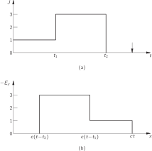
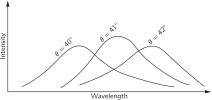

# 20. Solutions of Maxwell’s Equations in Free Space

## 20–1 Waves in free space; plane waves

In Chapter 18 we had reached the point where we had the Maxwell equations in complete form. All there is to know about the classical theory of the electric and magnetic fields can be found in the four equations:

\begin{alignedat}{3} &\text{I.}&&\mathbf{d}iv{\mathbf{E}}&\;=&\;\frac{\rho}{\epsilon_0}\\[1ex] &\text{II.}&&\mathbf{c}url{\mathbf{E}}&\;=&\;-\frac{\partial \mathbf{B}}{\partial t}\\[1ex] &\text{III.}&&\mathbf{d}iv{\mathbf{B}}&\;=&\;0\\[1ex] &\text{IV.}&\quad c^2&\mathbf{c}url{\mathbf{B}}&\;=&\;\frac{\mathbf{j}}{\epsilon_0}+\frac{\partial \mathbf{E}}{\partial t} \end{alignedat} (20.1)

When we put all these equations together, a remarkable new phenomenon occurs: fields generated by moving charges can leave the sources and travel alone through space. We considered a special example in which an infinite current sheet is suddenly turned on. After the current has been on for the time t , there are uniform electric and magnetic fields extending out the distance ct from the source. Suppose that the current sheet lies in the yz -plane with a surface current density J going toward positive y . The electric field will have only a y -component, and the magnetic field, only a z -component. The field components are given by

E_y=cB_z=-\frac{J}{2\epsilon_0 c}, (20.2)

for positive values of x less than ct . For larger x the fields are zero. There are, of course, similar fields extending the same distance from the current sheet in the negative x -direction. In Fig. 20–1 we show a graph of the magnitude of the fields as a function of x at the instant t . As time goes on, the “wavefront” at ct moves outward in x at the constant velocity c .

### Figure Ch20-F1
Caption: Fig. 20–1.The electric and magnetic field as a function of xx at the time tt after the current sheet is turned on.
Image: figures/Ch20-F1.svg

Now consider the following sequence of events. We turn on a current of unit strength for a while, then suddenly increase the current strength to three units, and hold it constant at this value. What do the fields look like then? We can see what the fields will look like in the following way. First, we imagine a current of unit strength that is turned on at t=0 and left constant forever. The fields for positive x are then given by the graph in part (a) of Fig. 20–2 . Next, we ask what would happen if we turn on a steady current of two units at the time t_1 .

### Figure Ch20-F2
Caption: Fig. 20–2.The electric field of a current sheet. (a) One unit of current turned on at t=0t=0; (b) Two units of current turned on at t=t1t=t_1; (c) Superposition of (a) and (b).
Image: figures/Ch20-F2.svg

The fields in this case will be twice as high as before, but will extend out in x only the distance c(t-t_1) , as shown in part (b) of the figure. When we add these two solutions, using the principle of superposition, we find that the sum of the two sources is a current of one unit for the time from zero to t_1 and a current of three units for times greater than t_1 . At the time t the fields will vary with x as shown in part (c) of Fig. 20–2 .

Now let’s take a more complicated problem. Consider a current which is turned on to one unit for a while, then turned up to three units, and later turned off to zero. What are the fields for such a current? We can find the solution in the same way—by adding the solutions of three separate problems. First, we find the fields for a step current of unit strength. (We have solved that problem already.) Next, we find the fields produced by a step current of two units. Finally, we solve for the fields of a step current of minus three units. When we add the three solutions, we will have a current which is one unit strong from t=0 to some later time, say t_1 , then three units strong until a still later time t_2 , and then turned off—that is, to zero. A graph of the current as a function of time is shown in Fig. 20–3 (a). When we add the three solutions for the electric field, we find that its variation with x , at a given instant t , is as shown in Fig. 20–3 (b). The field is an exact representation of the current. The field distribution in space is a nice graph of the current variation with time—only drawn backwards. As time goes on the whole picture moves outward at the speed c , so there is a little blob of field, travelling toward positive x , which contains a completely detailed memory of the history of all the current variations. If we were to stand miles away, we could tell from the variation of the electric or magnetic field exactly how the current had varied at the source.

### Figure Ch20-F3
Caption: Fig. 20–3.If the current source strength varies as shown in (a), then at the time tt shown by the arrow the electric field as a function of xx is as shown in (b).
Image: figures/Ch20-F3.svg

You will also notice that long after all activity at the source has completely stopped and all charges and currents are zero, the block of field continues to travel through space. We have a distribution of electric and magnetic fields that exist independently of any charges or currents. That is the new effect that comes from the complete set of Maxwell’s equations. If we want, we can give a complete mathematical representation of the analysis we have just done by writing that the electric field at a given place and a given time is proportional to the current at the source, only not at the same time, but at the earlier time t-x/c . We can write

E_y(t)=-\frac{J(t-x/c)}{2\epsilon_0 c}. (20.3)

We have, believe it or not, already derived this same equation from another point of view in Vol. I, when we were dealing with the theory of the index of refraction. Then, we had to figure out what fields were produced by a thin layer of oscillating dipoles in a sheet of dielectric material with the dipoles set in motion by the electric field of an incoming electromagnetic wave. Our problem was to calculate the combined fields of the original wave and the waves radiated by the oscillating dipoles. How could we have calculated the fields generated by moving charges when we didn’t have Maxwell’s equations? At that time we took as our starting point (without any derivation) a formula for the radiation fields produced at large distances from an accelerating point charge. If you will look in Chapter 30 of Vol. I, you will see that Eq. ( 30.19) there is just the same as the Eq. ( 20.3) that we have just written down. Although our earlier derivation was correct only at large distances from the source, we see now that the same result continues to be correct even right up to the source.

We want now to look in a general way at the behavior of electric and magnetic fields in empty space far away from the sources, i.e., from the currents and charges. Very near the sources—near enough so that during the delay in transmission, the source has not had time to change much—the fields are very much the same as we have found in what we called the electrostatic or magnetostatic cases. If we go out to distances large enough so that the delays become important, however, the nature of the fields can be radically different from the solutions we have found. In a sense, the fields begin to take on a character of their own when they have gone a long way from all the sources. So we can begin by discussing the behavior of the fields in a region where there are no currents or charges.

Suppose we ask: What kind of fields can there be in regions where \rho and \mathbf{j} are both zero? In Chapter 18 we saw that the physics of Maxwell’s equations could also be expressed in terms of differential equations for the scalar and vector potentials:

\begin{aligned} \nabla^2\phi- \frac{1}{c^2}\,\frac{\partial^2\phi}{\partial t^2}&= -\frac{\rho}{\epsilon_0},\\[1ex] \nabla^2\mathbf{A}- \frac{1}{c^2}\,\frac{\partial^2\mathbf{A}}{\partial t^2}&= -\frac{\mathbf{j}}{\epsilon_0 c^2}. \end{aligned} (20.4)

If \rho and \mathbf{j} are zero, these equations take on the simpler form

\begin{aligned} \nabla^2\phi- \frac{1}{c^2}\,\frac{\partial^2\phi}{\partial t^2}&=0,\\[1ex] \nabla^2\mathbf{A}- \frac{1}{c^2}\,\frac{\partial^2\mathbf{A}}{\partial t^2}&=\FLPzero. \end{aligned} (20.6)

Thus in free space the scalar potential \phi and each component of the vector potential \mathbf{A} all satisfy the same mathematical equation. Suppose we let \psi (psi) stand for any one of the four quantities \phi , A_x , A_y , A_z ; then we want to investigate the general solutions of the following equation:

\nabla^2\psi- \frac{1}{c^2}\,\frac{\partial^2\psi}{\partial t^2}=0. (20.8)

This equation is called the three-dimensional wave equation—three-dimensional, because the function \psi may depend in general on x , y , and z , and we need to worry about variations in all three coordinates. This is made clear if we write out explicitly the three terms of the Laplacian operator:

\frac{\partial^2\psi}{\partial x^2}+ \frac{\partial^2\psi}{\partial y^2}+ \frac{\partial^2\psi}{\partial z^2}- \frac{1}{c^2}\,\frac{\partial^2\psi}{\partial t^2}=0. (20.9)

In free space, the electric fields \mathbf{E} and \mathbf{B} also satisfy the wave equation. For example, since \mathbf{B}=\mathbf{c}url{\mathbf{A}} , we can get a differential equation for \mathbf{B} by taking the curl of Eq. ( 20.7). Since the Laplacian is a scalar operator, the order of the Laplacian and curl operations can be interchanged:

\mathbf{c}url{(\nabla^2\mathbf{A})}=\nabla^2(\mathbf{c}url{\mathbf{A}})=\nabla^2\mathbf{B}.

Similarly, the order of the operations curl and \frac{\partial }{\partial t} can be interchanged:

\mathbf{c}url{\frac{1}{c^2}\,\frac{\partial^2\mathbf{A}}{\partial t^2}}= \frac{1}{c^2}\,\frac{\partial^2}{\partial t^2}(\mathbf{c}url{\mathbf{A}})= \frac{1}{c^2}\,\frac{\partial^2\mathbf{B}}{\partial t^2}.

Using these results, we get the following differential equation for \mathbf{B} :

\nabla^2\mathbf{B}- \frac{1}{c^2}\,\frac{\partial^2\mathbf{B}}{\partial t^2}=\FLPzero. (20.10)

So each component of the magnetic field \mathbf{B} satisfies the three-dimensional wave equation. Similarly, using the fact that \mathbf{E}=-\boldsymbol{\nabla}{\phi}-\frac{\partial \mathbf{A}}{\partial t} , it follows that the electric field \mathbf{E} in free space also satisfies the three-dimensional wave equation:

\nabla^2\mathbf{E}- \frac{1}{c^2}\,\frac{\partial^2\mathbf{E}}{\partial t^2}=\FLPzero. (20.11)

All of our electromagnetic fields satisfy the same wave equation, Eq. ( 20.8). We might well ask: What is the most general solution to this equation? However, rather than tackling that difficult question right away, we will look first at what can be said in general about those solutions in which nothing varies in y and z . (Always do an easy case first so that you can see what is going to happen, and then you can go to the more complicated cases.) Let’s suppose that the magnitudes of the fields depend only upon x —that there are no variations of the fields with y and z . We are, of course, considering plane waves again. We should expect to get results something like those in the previous section. In fact, we will find precisely the same answers. You may ask: “Why do it all over again?” It is important to do it again, first, because we did not show that the waves we found were the most general solutions for plane waves, and second, because we found the fields only from a very particular kind of current source. We would like to ask now: What is the most general kind of one-dimensional wave there can be in free space? We cannot find that by seeing what happens for this or that particular source, but must work with greater generality. Also we are going to work this time with differential equations instead of with integral forms. Although we will get the same results, it is a way of practicing back and forth to show that it doesn’t make any difference which way you go. You should know how to do things every which way, because when you get a hard problem, you will often find that only one of the various ways is tractable.

We could consider directly the solution of the wave equation for some electromagnetic quantity. Instead, we want to start right from the beginning with Maxwell’s equations in free space so that you can see their close relationship to the electromagnetic waves. So we start with the equations in ( 20.1), setting the charges and currents equal to zero. They become

\begin{alignedat}{3} &\text{I.}&&\mathbf{d}iv{\mathbf{E}}&\;=&\;0\\[1ex] &\text{II.}&&\mathbf{c}url{\mathbf{E}}&\;=&\;-\frac{\partial \mathbf{B}}{\partial t}\\[1ex] &\text{III.}&&\mathbf{d}iv{\mathbf{B}}&\;=&\;0\\[1ex] &\text{IV.}&\quad c^2&\mathbf{c}url{\mathbf{B}}&\;=&\;\frac{\partial \mathbf{E}}{\partial t} \end{alignedat} (20.12)

We write the first equation out in components:

\mathbf{d}iv{\mathbf{E}}=\frac{\partial E_x}{\partial x}+\frac{\partial E_y}{\partial y}+\frac{\partial E_z}{\partial z}=0. (20.13)

We are assuming that there are no variations with y and z , so the last two terms are zero. This equation then tells us that

\frac{\partial E_x}{\partial x}=0. (20.14)

Its solution is that E_x , the component of the electric field in the x -direction, is a constant in space. If you look at IV in ( 20.12), supposing no \mathbf{B} -variation in y and z either, you can see that E_x is also constant in time. Such a field could be the steady dc field from some charged condenser plates a long distance away. We are not interested now in such an uninteresting static field; we are at the moment interested only in dynamically varying fields. For dynamic fields, E_x=0 .

We have then the important result that for the propagation of plane waves in any direction, the electric field must be at right angles to the direction of propagation. It can, of course, still vary in a complicated way with the coordinate x .

The transverse \mathbf{E} -field can always be resolved into two components, say the y -component and the z -component. So let’s first work out a case in which the electric field has only one transverse component. We’ll take first an electric field that is always in the y -direction, with zero z -component. Evidently, if we solve this problem we can also solve for the case where the electric field is always in the z -direction. The general solution can always be expressed as the superposition of two such fields.

How easy our equations now get. The only component of the electric field that is not zero is E_y , and all derivatives—except those with respect to x —are zero. The rest of Maxwell’s equations then become quite simple.

Let’s look next at the second of Maxwell’s equations [II of Eq. ( 20.12)]. Writing out the components of the curl \mathbf{E} , we have

\begin{aligned} &(\mathbf{c}url{\mathbf{E}})_x&&=\frac{\partial E_z}{\partial y}&&-\frac{\partial E_y}{\partial z}&&=0,\\[1.5ex] &(\mathbf{c}url{\mathbf{E}})_y&&=\frac{\partial E_x}{\partial z}&&-\frac{\partial E_z}{\partial x}&&=0,\\[1.5ex] &(\mathbf{c}url{\mathbf{E}})_z&&=\frac{\partial E_y}{\partial x}&&-\frac{\partial E_x}{\partial y}&&=\frac{\partial E_y}{\partial x}. \end{aligned}

The x -component of \mathbf{c}url{\mathbf{E}} is zero because the derivatives with respect to y and z are zero. The y -component is also zero; the first term is zero because the derivative with respect to z is zero, and the second term is zero because E_z is zero. The only components of the curl of \mathbf{E} that is not zero is the z -component, which is equal to \frac{\partial E_y}{\partial x} . Setting the three components of \mathbf{c}url{\mathbf{E}} equal to the corresponding components of -\frac{\partial \mathbf{B}}{\partial t} , we can conclude the following:

\begin{aligned} &\frac{\partial B_x}{\partial t}=0,\quad\frac{\partial B_y}{\partial t}=0.\\[1ex] &\frac{\partial B_z}{\partial t}=-\frac{\partial E_y}{\partial x}. \end{aligned} (20.15)

Since the x -component of the magnetic field and the y -component of the magnetic field both have zero time derivatives, these two components are just constant fields and correspond to the magnetostatic solutions we found earlier. Somebody may have left some permanent magnets near where the waves are propagating. We will ignore these constant fields and set B_x and B_y equal to zero.

Incidentally, we would already have concluded that the x -component of \mathbf{B} should be zero for a different reason. Since the divergence of \mathbf{B} is zero (from the third Maxwell equation), applying the same arguments we used above for the electric field, we would conclude that the longitudinal component of the magnetic field can have no variation with x . Since we are ignoring such uniform fields in our wave solutions, we would have set B_x equal to zero. In plane electromagnetic waves the \mathbf{B} -field, as well as the \mathbf{E} -field, must be directed at right angles to the direction of propagation.

Equation ( 20.16) gives us the additional proposition that if the electric field has only a y -component, the magnetic field will have only a z -component. So \mathbf{E} and \mathbf{B} are at right angles to each other. This is exactly what happened in the special wave we have already considered.

We are now ready to use the last of Maxwell’s equations for free space [IV of Eq. ( 20.12)]. Writing out the components, we have

\begin{alignedat}{4} &c^2(\mathbf{c}url{\mathbf{B}})_x&&= c^2\,\frac{\partial B_z}{\partial y}&&-c^2\,\frac{\partial B_y}{\partial z}&&=\frac{\partial E_x}{\partial t},\\[1ex] &c^2(\mathbf{c}url{\mathbf{B}})_y&&= c^2\,\frac{\partial B_x}{\partial z}&&-c^2\,\frac{\partial B_z}{\partial x}&&=\frac{\partial E_y}{\partial t},\\[1ex] &c^2(\mathbf{c}url{\mathbf{B}})_z&&= c^2\,\frac{\partial B_y}{\partial x}&&-c^2\,\frac{\partial B_x}{\partial y}&&=\frac{\partial E_z}{\partial t}. \end{alignedat} (20.17)

Of the six derivatives of the components of \mathbf{B} , only the term \frac{\partial B_z}{\partial x} is not equal to zero. So the three equations give us simply

-c^2\,\frac{\partial B_z}{\partial x}=\frac{\partial E_y}{\partial t}. (20.18)

The result of all our work is that only one component each of the electric and magnetic fields is not zero, and that these components must satisfy Eqs. ( 20.16) and ( 20.18). The two equations can be combined into one if we differentiate the first with respect to x and the second with respect to t ; the left-hand sides of the two equations will then be the same (except for the factor c^2 ). So we find that E_y satisfies the equation

\frac{\partial^2E_y}{\partial x^2}-\frac{1}{c^2}\,\frac{\partial^2E_y}{\partial t^2}=0. (20.19)

We have seen the same differential equation before, when we studied the propagation of sound. It is the wave equation for one-dimensional waves.

You should note that in the process of our derivation we have found something more than is contained in Eq. ( 20.11). Maxwell’s equations have given us the further information that electromagnetic waves have field components only at right angles to the direction of the wave propagation.

Let’s review what we know about the solutions of the one-dimensional wave equation. If any quantity \psi satisfies the one-dimensional wave equation

\frac{\partial^2\psi}{\partial x^2}-\frac{1}{c^2}\,\frac{\partial^2\psi}{\partial t^2}=0, (20.20)

then one possible solution is a function \psi(x,t) of the form

\psi(x,t)=f(x-ct), (20.21)

that is, some function of the single variable (x-ct) . The function f(x-ct) represents a “rigid” pattern in x which travels toward positive x at the speed c (see Fig. 20–4 ). For example, if the function f has a maximum when its argument is zero, then for t=0 the maximum of \psi , will occur at x=0 . At some later time, say t=10 , \psi will have its maximum at x=10c . As time goes on, the maximum moves toward positive x at the speed c .

### Figure Ch20-F4
Caption: Fig. 20–4.The function f(x−ct)f(x-ct) represents a constant “shape” that travels toward positive xx with the speed cc.
Image: figures/Ch20-F4.svg

Sometimes it is more convenient to say that a solution of the one-dimensional wave equation is a function of (t-x/c) . However, this is saying the same thing, because any function of (t-x/c) is also a function of (x-ct) :

F(t-x/c)=F\biggl[-\frac{x-ct}{c}\biggr]=f(x-ct).

Let’s show that f(x-ct) is indeed a solution of the wave equation. Since it is a function of only one variable—the variable (x-ct) —we will let f' represent the derivative of f with respect to its variable and f'' represent the second derivative of f . Differentiating Eq. ( 20.21) with respect to x , we have

\frac{\partial \psi}{\partial x}=f'(x-ct),

since the derivative of (x-ct) with respect to x is 1 . The second derivative of \psi , with respect to x is clearly

\frac{\partial^2\psi}{\partial x^2}=f''(x-ct). (20.22)

Taking derivatives of \psi with respect to t , we find

\begin{aligned} &\frac{\partial \psi}{\partial t}=f'(x-ct)(-c),\\[1.5ex] &\frac{\partial^2\psi}{\partial t^2}=+c^2f''(x-ct). \end{aligned} (20.23)

We see that \psi does indeed satisfy the one-dimensional wave equation.

You may be wondering: “If I have the wave equation, how do I know that I should take f(x-ct) as a solution? I don’t like this backward method. Isn’t there some forward way to find the solution?” Well, one good forward way is to know the solution. It is possible to “cook up” an apparently forward mathematical argument, especially because we know what the solution is supposed to be, but with an equation as simple as this we don’t have to play games. Soon you will get so that when you see Eq. ( 20.20), you nearly simultaneously see \psi=f(x-ct) as a solution. (Just as now when you see the integral of x^2\,dx , you know right away that the answer is x^3/3 .)

Actually you should also see a little more. Not only is any function of (x-ct) a solution, but any function of (x+ct) is also a solution. Since the wave equation contains only c^2 , changing the sign of c makes no difference. In fact, the most general solution of the one-dimensional wave equation is the sum of two arbitrary functions, one of (x-ct) and the other of (x+ct) :

\psi=f(x-ct)+g(x+ct). (20.24)

The first term represents a wave travelling toward positive x , and the second term an arbitrary wave travelling toward negative x . The general solution is the superposition of two such waves both existing at the same time.

We will leave the following amusing question for you to think about. Take a function \psi of the following form:

\psi=\cos kx\cos kct.

This equation isn’t in the form of a function of (x-ct) or of (x+ct) . Yet you can easily show that this function is a solution of the wave equation by direct substitution into Eq. ( 20.20). How can we then say that the general solution is of the form of Eq. ( 20.24)?

Applying our conclusions about the solution of the wave equation to the y -component of the electric field, E_y , we conclude that E_y can vary with x in any arbitrary fashion. However, the fields which do exist can always be considered as the sum of two patterns. One wave is sailing through space in one direction with speed c , with an associated magnetic field perpendicular to the electric field; another wave is travelling in the opposite direction with the same speed. Such waves correspond to the electromagnetic waves that we know about—light, radiowaves, infrared radiation, ultraviolet radiation, x-rays, and so on. We have already discussed the radiation of light in great detail in Vol. I. Since everything we learned there applies to any electromagnetic wave, we don’t need to consider in great detail here the behavior of these waves.

We should perhaps make a few further remarks on the question of the polarization of the electromagnetic waves. In our solution we chose to consider the special case in which the electric field has only a y -component. There is clearly another solution for waves travelling in the plus or minus x -direction, with an electric field which has only a z -component. Since Maxwell’s equations are linear, the general solution for one-dimensional waves propagating in the x -direction is the sum of waves of E_y and waves of E_z . This general solution is summarized in the following equations:

\begin{aligned} \mathbf{E}&=(0,E_y,E_z)\\[.5ex] E_y&=f(x-ct)+g(x+ct)\\[.5ex] E_z&=F(x-ct)+G(x+ct)\\[1ex] \mathbf{B}&=(0,B_y,B_z)\\[.5ex] cB_z&=f(x-ct)-g(x+ct)\\[.5ex] cB_y&=-F(x-ct)+G(x+ct). \end{aligned} (20.25)

Such electromagnetic waves have an \mathbf{E} -vector whose direction is not constant but which gyrates around in some arbitrary way in the yz -plane. At every point the magnetic field is always perpendicular to the electric field and to the direction of propagation.

If there are only waves travelling in one direction, say the positive x -direction, there is a simple rule which tells the relative orientation of the electric and magnetic fields. The rule is that the cross product \mathbf{E}\times\mathbf{B} —which is, of course, a vector at right angles to both \mathbf{E} and \mathbf{B} —points in the direction in which the wave is travelling. If \mathbf{E} is rotated into \mathbf{B} by a right-hand screw, the screw points in the direction of the wave velocity. (We shall see later that the vector \mathbf{E}\times\mathbf{B} has a special physical significance: it is a vector which describes the flow of energy in an electromagnetic field.)

## 20–2 Three-dimensional waves

We want now to turn to the subject of three-dimensional waves. We have already seen that the vector \mathbf{E} satisfies the wave equation. It is also easy to arrive at the same conclusion by arguing directly from Maxwell’s equations. Suppose we start with the equation

\mathbf{c}url{\mathbf{E}}=-\frac{\partial \mathbf{B}}{\partial t}

and take the curl of both sides:

\mathbf{c}url{(\mathbf{c}url{\mathbf{E}})}=-\frac{\partial }{\partial t}(\mathbf{c}url{\mathbf{B}}). (20.26)

You will remember that the curl of the curl of any vector can be written as the sum of two terms, one involving the divergence and the other the Laplacian,

\mathbf{c}url{(\mathbf{c}url{\mathbf{E}})}=\boldsymbol{\nabla}{(\mathbf{d}iv{\mathbf{E}})}-\nabla^2\mathbf{E}.

In free space, however, the divergence of \mathbf{E} is zero, so only the Laplacian term remains. Also, from the fourth of Maxwell’s equations in free space [Eq. ( 20.12)] the time derivative of c^2\,\mathbf{c}url{\mathbf{B}} is the second derivative of \mathbf{E} with respect to t :

c^2\,\frac{\partial }{\partial t}(\mathbf{c}url{\mathbf{B}})=\frac{\partial^2\mathbf{E}}{\partial t^2}.

Equation ( 20.26) then becomes

\nabla^2\mathbf{E}=\frac{1}{c^2}\,\frac{\partial^2\mathbf{E}}{\partial t^2},

which is the three-dimensional wave equation. Written out in all its glory, this equation is, of course,

\frac{\partial^2\mathbf{E}}{\partial x^2}+ \frac{\partial^2\mathbf{E}}{\partial y^2}+ \frac{\partial^2\mathbf{E}}{\partial z^2}- \frac{1}{c^2}\,\frac{\partial^2\mathbf{E}}{\partial t^2}=\FLPzero. (20.27)

How shall we find the general wave solution? The answer is that all the solutions of the three-dimensional wave equation can be represented as a superposition of the one-dimensional solutions we have already found. We obtained the equation for waves which move in the x -direction by supposing that the field did not depend on y and z . Obviously, there are other solutions in which the fields do not depend on x and z , representing waves going in the y -direction. Then there are solutions which do not depend on x and y , representing waves travelling in the z -direction. Or in general, since we have written our equations in vector form, the three-dimensional wave equation can have solutions which are plane waves moving in any direction at all. Again, since the equations are linear, we may have simultaneously as many plane waves as we wish, travelling in as many different directions. Thus the most general solution of the three-dimensional wave equation is a superposition of all sorts of plane waves moving in all sorts of directions.

Try to imagine what the electric and magnetic fields look like at present in the space in this lecture room. First of all, there is a steady magnetic field; it comes from the currents in the interior of the earth—that is, the earth’s steady magnetic field. Then there are some irregular, nearly static electric fields produced perhaps by electric charges generated by friction as various people move about in their chairs and rub their coat sleeves against the chair arms. Then there are other magnetic fields produced by oscillating currents in the electrical wiring—fields which vary at a frequency of 60 cycles per second, in synchronism with the generator at Boulder Dam. But more interesting are the electric and magnetic fields varying at much higher frequencies. For instance, as light travels from window to floor and wall to wall, there are little wiggles of the electric and magnetic fields moving along at 186{,}000 miles per second. Then there are also infrared waves travelling from the warm foreheads to the cold blackboard. And we have forgotten the ultraviolet light, the x-rays, and the radiowaves travelling through the room.

Flying across the room are electromagnetic waves which carry music of a jazz band. There are waves modulated by a series of impulses representing pictures of events going on in other parts of the world, or of imaginary aspirins dissolving in imaginary stomachs. To demonstrate the reality of these waves it is only necessary to turn on electronic equipment that converts these waves into pictures and sounds.

If we go into further detail to analyze even the smallest wiggles, there are tiny electromagnetic waves that have come into the room from enormous distances. There are now tiny oscillations of the electric field, whose crests are separated by a distance of one foot, that have come from millions of miles away, transmitted to the earth from the Mariner II space craft which has just passed Venus. Its signals carry summaries of information it has picked up about the planets (information obtained from electromagnetic waves that travelled from the planet to the space craft).

There are very tiny wiggles of the electric and magnetic fields that are waves which originated billions of light years away—from galaxies in the remotest corners of the universe. That this is true has been found by “filling the room with wires”—by building antennas as large as this room. Such radiowaves have been detected from places in space beyond the range of the greatest optical telescopes. Even they, the optical telescopes, are simply gatherers of electromagnetic waves. What we call the stars are only inferences, inferences drawn from the only physical reality we have yet gotten from them—from a careful study of the unendingly complex undulations of the electric and magnetic fields reaching us on earth.

There is, of course, more: the fields produced by lightning miles away, the fields of the charged cosmic ray particles as they zip through the room, and more, and more. What a complicated thing is the electric field in the space around you! Yet it always satisfies the three-dimensional wave equation.

## 20–3 Scientific imagination

I have asked you to imagine these electric and magnetic fields. What do you do? Do you know how? How do I imagine the electric and magnetic field? What do I actually see? What are the demands of scientific imagination? Is it any different from trying to imagine that the room is full of invisible angels? No, it is not like imagining invisible angels. It requires a much higher degree of imagination to understand the electromagnetic field than to understand invisible angels. Why? Because to make invisible angels understandable, all I have to do is to alter their properties a little bit —I make them slightly visible, and then I can see the shapes of their wings, and bodies, and halos. Once I succeed in imagining a visible angel, the abstraction required—which is to take almost invisible angels and imagine them completely invisible—is relatively easy. So you say, “Professor, please give me an approximate description of the electromagnetic waves, even though it may be slightly inaccurate, so that I too can see them as well as I can see almost invisible angels. Then I will modify the picture to the necessary abstraction.”

I’m sorry I can’t do that for you. I don’t know how. I have no picture of this electromagnetic field that is in any sense accurate. I have known about the electromagnetic field a long time—I was in the same position 25 years ago that you are now, and I have had 25 years more of experience thinking about these wiggling waves. When I start describing the magnetic field moving through space, I speak of the \mathbf{E} - and \mathbf{B} -fields and wave my arms and you may imagine that I can see them. I’ll tell you what I see. I see some kind of vague shadowy, wiggling lines—here and there is an E and B written on them somehow, and perhaps some of the lines have arrows on them—an arrow here or there which disappears when I look too closely at it. When I talk about the fields swishing through space, I have a terrible confusion between the symbols I use to describe the objects and the objects themselves. I cannot really make a picture that is even nearly like the true waves. So if you have some difficulty in making such a picture, you should not be worried that your difficulty is unusual.

Our science makes terrific demands on the imagination. The degree of imagination that is required is much more extreme than that required for some of the ancient ideas. The modern ideas are much harder to imagine. We use a lot of tools, though. We use mathematical equations and rules, and make a lot of pictures. What I realize now is that when I talk about the electromagnetic field in space, I see some kind of a superposition of all of the diagrams which I’ve ever seen drawn about them. I don’t see little bundles of field lines running about because it worries me that if I ran at a different speed the bundles would disappear, I don’t even always see the electric and magnetic fields because sometimes I think I should have made a picture with the vector potential and the scalar potential, for those were perhaps the more physically significant things that were wiggling.

Perhaps the only hope, you say, is to take a mathematical view. Now what is a mathematical view? From a mathematical view, there is an electric field vector and a magnetic field vector at every point in space; that is, there are six numbers associated with every point. Can you imagine six numbers associated with each point in space? That’s too hard. Can you imagine even one number associated with every point? I cannot! I can imagine such a thing as the temperature at every point in space. That seems to be understandable. There is a hotness and coldness that varies from place to place. But I honestly do not understand the idea of a number at every point.

So perhaps we should put the question: Can we represent the electric field by something more like a temperature, say like the displacement of a piece of jello? Suppose that we were to begin by imagining that the world was filled with thin jello and that the fields represented some distortion—say a stretching or twisting—of the jello. Then we could visualize the field. After we “see” what it is like we could abstract the jello away. For many years that’s what people tried to do. Maxwell, Ampère, Faraday, and others tried to understand electromagnetism this way. (Sometimes they called the abstract jello “ether.”) But it turned out that the attempt to imagine the electromagnetic field in that way was really standing in the way of progress. We are unfortunately limited to abstractions, to using instruments to detect the field, to using mathematical symbols to describe the field, etc. But nevertheless, in some sense the fields are real, because after we are all finished fiddling around with mathematical equations—with or without making pictures and drawings or trying to visualize the thing—we can still make the instruments detect the signals from Mariner II and find out about galaxies a billion miles away, and so on.

The whole question of imagination in science is often misunderstood by people in other disciplines. They try to test our imagination in the following way. They say, “Here is a picture of some people in a situation. What do you imagine will happen next?” When we say, “I can’t imagine,” they may think we have a weak imagination. They overlook the fact that whatever we are allowed to imagine in science must be consistent with everything else we know: that the electric fields and the waves we talk about are not just some happy thoughts which we are free to make as we wish, but ideas which must be consistent with all the laws of physics we know. We can’t allow ourselves to seriously imagine things which are obviously in contradiction to the known laws of nature. And so our kind of imagination is quite a difficult game. One has to have the imagination to think of something that has never been seen before, never been heard of before. At the same time the thoughts are restricted in a strait jacket, so to speak, limited by the conditions that come from our knowledge of the way nature really is. The problem of creating something which is new, but which is consistent with everything which has been seen before, is one of extreme difficulty.

While I’m on this subject I want to talk about whether it will ever be possible to imagine beauty that we can’t see. It is an interesting question. When we look at a rainbow, it looks beautiful to us. Everybody says, “Ooh, a rainbow.” (You see how scientific I am. I am afraid to say something is beautiful unless I have an experimental way of defining it.) But how would we describe a rainbow if we were blind? We are blind when we measure the infrared reflection coefficient of sodium chloride, or when we talk about the frequency of the waves that are coming from some galaxy that we can’t see—we make a diagram, we make a plot. For instance, for the rainbow, such a plot would be the intensity of radiation vs. wavelength measured with a spectrophotometer for each direction in the sky. Generally, such measurements would give a curve that was rather flat. Then some day, someone would discover that for certain conditions of the weather, and at certain angles in the sky, the spectrum of intensity as a function of wavelength would behave strangely; it would have a bump. As the angle of the instrument was varied only a little bit, the maximum of the bump would move from one wavelength to another. Then one day the physical review of the blind men might publish a technical article with the title “The Intensity of Radiation as a Function of Angle under Certain Conditions of the Weather.” In this article there might appear a graph such as the one in Fig. 20–5. The author would perhaps remark that at the larger angles there was more radiation at long wavelengths, whereas for the smaller angles the maximum in the radiation came at shorter wavelengths. (From our point of view, we would say that the light at 40^\circ is predominantly green and the light at 42^\circ is predominantly red.)

### Figure Ch20-F5
Caption: Fig. 20–5.The intensity of electromagnetic waves as a function of wavelength for three angles (measured from the direction opposite the sun), observed only with certain meteorological conditions.
Image: figures/Ch20-F5.svg

Now do we find the graph of Fig. 20–5 beautiful? It contains much more detail than we apprehend when we look at a rainbow, because our eyes cannot see the exact details in the shape of a spectrum. The eye, however, finds the rainbow beautiful. Do we have enough imagination to see in the spectral curves the same beauty we see when we look directly at the rainbow? I don’t know.

But suppose I have a graph of the reflection coefficient of a sodium chloride crystal as a function of wavelength in the infrared, and also as a function of angle. I would have a representation of how it would look to my eyes if they could see in the infrared—perhaps some glowing, shiny “green,” mixed with reflections from the surface in a “metallic red.” That would be a beautiful thing, but I don’t know whether I can ever look at a graph of the reflection coefficient of NaCl measured with some instrument and say that it has the same beauty.

On the other hand, even if we cannot see beauty in particular measured results, we can already claim to see a certain beauty in the equations which describe general physical laws. For example, in the wave equation ( 20.9), there’s something nice about the regularity of the appearance of the x , the y , the z , and the t . And this nice symmetry in appearance of the x , y , z , and t suggests to the mind still a greater beauty which has to do with the four dimensions, the possibility that space has four-dimensional symmetry, the possibility of analyzing that and the developments of the special theory of relativity. So there is plenty of intellectual beauty associated with the equations.

## 20–4 Spherical waves

We have seen that there are solutions of the wave equation which correspond to plane waves, and that any electromagnetic wave can be described as a superposition of many plane waves. In certain special cases, however, it is more convenient to describe the wave field in a different mathematical form. We would like to discuss now the theory of spherical waves—waves which correspond to spherical surfaces that are spreading out from some center. When you drop a stone into a lake, the ripples spread out in circular waves on the surface—they are two-dimensional waves. A spherical wave is a similar thing except that it spreads out in three dimensions.

Before we start describing spherical waves, we need a little mathematics. Suppose we have a function that depends only on the radial distance r from a certain origin—in other words, a function that is spherically symmetric. Let’s call the function \psi(r) , where by r we mean

r=\sqrt{x^2+y^2+z^2},

the radial distance from the origin. In order to find out what functions \psi(r) satisfy the wave equation, we will need an expression for the Laplacian of \psi . So we want to find the sum of the second derivatives of \psi with respect to x , y , and z . We will use the notation that \psi'(r) represents the derivative of \psi with respect to r and \psi''(r) represents the second derivative of \psi with respect to r .

First, we find the derivatives with respect to x . The first derivative is

\frac{\partial \psi(r)}{\partial x}=\psi'(r)\,\frac{\partial r}{\partial x}.

The second derivative of \psi with respect to x is

\frac{\partial^2\psi}{\partial x^2}= \psi''\biggl(\frac{\partial r}{\partial x}\biggr)^2+ \psi'\,\frac{\partial^2r}{\partial x^2}.

We can evaluate the partial derivatives of r with respect to x from

\frac{\partial r}{\partial x}=\frac{x}{r},\quad \frac{\partial^2r}{\partial x^2}= \frac{1}{r}\biggl(1-\frac{x^2}{r^2}\biggr).

So the second derivative of \psi with respect to x is

\frac{\partial^2\psi}{\partial x^2}=\frac{x^2}{r^2}\psi''+\frac{1}{r}\biggl(1-\frac{x^2}{r^2}\biggr)\psi'. (20.28)

Likewise,

\begin{aligned} \frac{\partial^2\psi}{\partial y^2}&= \frac{y^2}{r^2}\,&&\psi''+ \frac{1}{r}\biggl(1-\frac{y^2}{r^2}&&\biggr)\psi',\\[1.5ex] \frac{\partial^2\psi}{\partial z^2}&= \frac{z^2}{r^2}\,&&\psi''+ \frac{1}{r}\biggl(1-\frac{z^2}{r^2}&&\biggr)\psi'. \end{aligned} (20.29)

The Laplacian is the sum of these three derivatives. Remembering that x^2+y^2+z^2=r^2 , we get

\nabla^2\psi(r)=\psi''(r)+\frac{2}{r}\,\psi'(r). (20.31)

It is often more convenient to write this equation in the following form:

\nabla^2\psi(r)=\frac{1}{r}\,\frac{d^2}{dr^2}(r\psi). (20.32)

If you carry out the differentiation indicated in Eq. ( 20.32), you will see that the right-hand side is the same as in Eq. ( 20.31).

If we wish to consider spherically symmetric fields which can propagate as spherical waves, our field quantity must be a function of both r and t . Suppose we ask, then, what functions \psi(r,t) are solutions of the three-dimensional wave equation

\nabla^2\psi(r,t)-\frac{1}{c^2}\, \frac{\partial^2}{\partial t^2}\,\psi(r,t)=0. (20.33)

Since \psi(r,t) depends only on the spatial coordinates through r , we can use the equation for the Laplacian we found above, Eq. ( 20.32). To be precise, however, since \psi is also a function of t , we should write the derivatives with respect to r as partial derivatives. Then the wave equation becomes

\frac{1}{r}\,\frac{\partial^2}{\partial r^2}\,(r\psi)- \frac{1}{c^2}\,\frac{\partial^2}{\partial t^2}\,\psi=0.

We must now solve this equation, which appears to be much more complicated than the plane wave case. But notice that if we multiply this equation by r , we get

\frac{\partial^2}{\partial r^2}\,(r\psi)- \frac{1}{c^2}\,\frac{\partial^2}{\partial t^2}\,(r\psi)=0. (20.34)

This equation tells us that the function r\psi satisfies the one-dimensional wave equation in the variable r . Using the general principle which we have emphasized so often, that the same equations always have the same solutions, we know that if r\psi is a function only of (r-ct) then it will be a solution of Eq. ( 20.34). So we know that spherical waves must have the form

r\psi(r,t)=f(r-ct).

Or, as we have seen before, we can equally well say that r\psi can have the form

r\psi=f(t-r/c).

Dividing by r , we find that the field quantity \psi (whatever it may be) has the following form:

\psi=\frac{f(t-r/c)}{r}. (20.35)

Such a function represents a general spherical wave travelling outward from the origin at the speed c . If we forget about the r in the denominator for a moment, the amplitude of the wave as a function of the distance from the origin at a given time has a certain shape that travels outward at the speed c . The factor r in the denominator, however, says that the amplitude of the wave decreases in proportion to 1/r as the wave propagates. In other words, unlike a plane wave in which the amplitude remains constant as the wave runs along, in a spherical wave the amplitude steadily decreases, as shown in Fig. 20–6. This effect is easy to understand from a simple physical argument.

### Figure Ch20-F6
Caption: Fig. 20–6.A spherical wave [math]\psi=f(t-r/c)/r. (a) [math]\psi as a function of [math]r for [math]t=t_1 and the same wave for the later time [math]t_2. (b) [math]\psi as a function of [math]t for [math]r=r_1 and the same wave seen at [math]r_2.
Image: figures/Ch20-F6.svg
![Fig. 20–6.A spherical wave [math]\psi=f(t-r/c)/r. (a) [math]\psi as a function of [math]r for [math]t=t_1 and the same wave for the later time [math]t_2. (b) [math]\psi as a function of [math]t for [math]r=r_1 and the same wave seen at [math]r_2.](figures/Ch20-F6.svg)

We know that the energy density in a wave depends on the square of the wave amplitude. As the wave spreads, its energy is spread over larger and larger areas proportional to the radial distance squared. If the total energy is conserved, the energy density must fall as 1/r^2 , and the amplitude of the wave must decrease as 1/r . So Eq. ( 20.35) is the “reasonable” form for a spherical wave.

We have disregarded the second possible solution to the one-dimensional wave equation:

r\psi=g(t+r/c),

or

\psi=\frac{g(t+r/c)}{r}.

This also represents a spherical wave, but one which travels inward from large r toward the origin.

We are now going to make a special assumption. We say, without any demonstration whatever, that the waves generated by a source are only the waves which go outward. Since we know that waves are caused by the motion of charges, we want to think that the waves proceed outward from the charges. It would be rather strange to imagine that before charges were set in motion, a spherical wave started out from infinity and arrived at the charges just at the time they began to move. That is a possible solution, but experience shows that when charges are accelerated the waves travel outward from the charges. Although Maxwell’s equations would allow either possibility, we will put in an additional fact —based on experience—that only the outgoing wave solution makes “physical sense.”

We should remark, however, that there is an interesting consequence to this additional assumption: we are removing the symmetry with respect to time that exists in Maxwell’s equations. The original equations for \mathbf{E} and \mathbf{B} , and also the wave equations we derived from them, have the property that if we change the sign of t , the equation is unchanged. These equations say that for every solution corresponding to a wave going in one direction there is an equally valid solution for a wave travelling in the opposite direction. Our statement that we will consider only the outgoing spherical waves is an important additional assumption. (A formulation of electrodynamics in which this additional assumption is avoided has been carefully studied. Surprisingly, in many circumstances it does not lead to physically absurd conclusions, but it would take us too far astray to discuss these ideas just now. We will talk about them a little more in Chapter 28.)

We must mention another important point. In our solution for an outgoing wave, Eq. ( 20.35), the function \psi is infinite at the origin. That is somewhat peculiar. We would like to have a wave solution which is smooth everywhere. Our solution must represent physically a situation in which there is some source at the origin. In other words, we have inadvertently made a mistake. We have not solved the free wave equation ( 20.33) everywhere; we have solved Eq. ( 20.33) with zero on the right everywhere, except at the origin. Our mistake crept in because some of the steps in our derivation are not “legal” when r=0 .

Let’s show that it is easy to make the same kind of mistake in an electrostatic problem. Suppose we want a solution of the equation for an electrostatic potential in free space, \nabla^2\phi=0 . The Laplacian is equal to zero, because we are assuming that there are no charges anywhere. But what about a spherically symmetric solution to this equation—that is, some function \phi that depends only on r . Using the formula of Eq. ( 20.32) for the Laplacian, we have

\frac{1}{r}\,\frac{d^2}{dr^2}\,(r\phi)=0.

Multiplying this equation by r , we have an equation which is readily integrated:

\frac{d^2}{dr^2}\,(r\phi)=0.

If we integrate once with respect to r , we find that the first derivative of r\phi is a constant, which we may call a :

\frac{d }{d r}\,(r\phi)=a.

Integrating again, we find that r\phi is of the form

r\phi=ar+b,

where b is another constant of integration. So we have found that the following \phi is a solution for the electrostatic potential in free space:

\phi=a+\frac{b}{r}.

Something is evidently wrong. In the region where there are no electric charges, we know the solution for the electrostatic potential: the potential is everywhere a constant. That corresponds to the first term in our solution. But we also have the second term, which says that there is a contribution to the potential that varies as one over the distance from the origin. We know, however, that such a potential corresponds to a point charge at the origin. So, although we thought we were solving for the potential in free space, our solution also gives the field for a point source at the origin. Do you see the similarity between what happened now and what happened when we solved for a spherically symmetric solution to the wave equation? If there were really no charges or currents at the origin, there would not be spherical outgoing waves. The spherical waves must, of course, be produced by sources at the origin. In the next chapter we will investigate the connection between the outgoing electromagnetic waves and the currents and voltages which produce them.
