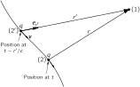
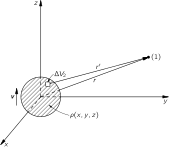
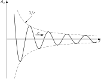
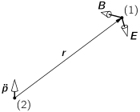

# 21. Solutions of Maxwell’s Equations with Currents and Charges

## 21–1 Light and electromagnetic waves

We saw in the last chapter that among their solutions, Maxwell’s equations have waves of electricity and magnetism. These waves correspond to the phenomena of radio, light, x-rays, and so on, depending on the wavelength. We have already studied light in great detail in Vol. I. In this chapter we want to tie together the two subjects—we want to show that Maxwell’s equations can indeed form the base for our earlier treatment of the phenomena of light.

When we studied light, we began by writing down equations for the electric and magnetic fields produced by a charge which moves in any arbitrary way. Those equations were

\mathbf{E}=\frac{q}{4\pi\epsilon_0}\biggl[ \frac{\mathbf{e}_{r'}}{r'^2}+\frac{r'}{c}\,\frac{d }{d t}\biggl( \frac{\mathbf{e}_{r'}}{r'^2}\biggr)+\frac{1}{c^2}\,\frac{d^2}{dt^2}\,\mathbf{e}_{r'} \biggr] (21.1)

and

c\mathbf{B}=\mathbf{e}_{r'}\times\mathbf{E}.

[See Eqs. ( 28.3) and ( 28.4), Vol. I. As explained below, the signs here are the negatives of the old ones.]

If a charge moves in an arbitrary way, the electric field we would find now at some point depends only on the position and motion of the charge not now, but at an earlier time—at an instant which is earlier by the time it would take light, going at the speed c , to travel the distance r' from the charge to the field point. In other words, if we want the electric field at point (1) at the time t , we must calculate the location (2') of the charge and its motion at the time (t-r'/c) , where r' is the distance to the point (1) from the position of the charge (2') at the time (t-r'/c) . The prime is to remind you that r' is the so-called “retarded distance” from the point (2') to the point (1) , and not the actual distance between point (2) , the position of the charge at the time t , and the field point (1) (see Fig. 21-1 ). Note that we are using a different convention now for the direction of the unit vector \mathbf{e}_r . In Chapters 28 and 34 of Vol. I it was convenient to take \mathbf{r} (and hence \mathbf{e}_r ) pointing toward the source. Now we are following the definition we took for Coulomb’s law, in which \mathbf{r} is directed from the charge, at (2) , toward the field point at (1) . The only difference, of course, is that our new \mathbf{r} (and \mathbf{e}_r ) are the negatives of the old ones.

### Figure Ch21-F1
Caption: Fig. 21–1. The fields at (1)(1) at the time tt depend on the position (2′)(2') occupied by the charge qq at the time (t−r′/c)(t-r'/c).
Image: figures/Ch21-F1.svg

We have also seen that if the velocity v of a charge is always much less than c , and if we consider only points at large distances from the charge, so that only the last term of Eq. ( 21.1) is important, the fields can also be written as

\mathbf{E}=\frac{q}{4\pi\epsilon_0 c^2r'} \begin{bmatrix} \text{acceleration of the charge}\\[-.5ex] \text{at $(t-r'/c)$}\\[-.5ex] \text{projected at right angles to $r'$} \end{bmatrix}

and

c\mathbf{B}=\mathbf{e}_{r'}\times\mathbf{E}.

Let’s look at what the complete equation, Eq. ( 21.1), says in a little more detail. The vector \mathbf{e}_{r'} is the unit vector to point (1) from the retarded position (2') . The first term, then, is what we would expect for the Coulomb field of the charge at its retarded position—we may call this “the retarded Coulomb field.” The electric field depends inversely on the square of the distance and is directed away from the retarded position of the charge (that is, in the direction of \mathbf{e}_{r'} ).

But that is only the first term. The other terms tell us that the laws of electricity do not say that all the fields are the same as the static ones, but just retarded (which is what people sometimes like to say). To the “retarded Coulomb field” we must add the other two terms. The second term says that there is a “correction” to the retarded Coulomb field which is the rate of change of the retarded Coulomb field multiplied by r'/c , the retardation delay. In a way of speaking, this term tends to compensate for the retardation in the first term. The first two terms correspond to computing the “retarded Coulomb field” and then extrapolating it toward the future by the amount r'/c , that is, right up to the time t ! The extrapolation is linear, as if we were to assume that the “retarded Coulomb field” would continue to change at the rate computed for the charge at the point (2') . If the field is changing slowly, the effect of the retardation is almost completely removed by the correction term, and the two terms together give us an electric field that is the “instantaneous Coulomb field”—that is, the Coulomb field of the charge at the point (2) —to a very good approximation.

Finally, there is a third term in Eq. ( 21.1) which is the second derivative of the unit vector \mathbf{e}_{r'} . For our study of the phenomena of light, we made use of the fact that far away from the charge the first two terms went inversely as the square of the distance and, for large distances, became very weak in comparison to the last term, which decreases as 1/r . So we concentrated entirely on the last term, and we showed that it is (again, for large distances) proportional to the component of the acceleration of the charge at right angles to the line of sight. (Also, for most of our work in Vol. I, we took the case in which the charges were moving nonrelativistically. We considered the relativistic effects in only one chapter, Chapter 34.)

Now we should try to connect the two things together. We have the Maxwell equations, and we have Eq. ( 21.1) for the field of a point charge. We should certainly ask whether they are equivalent. If we can deduce Eq. ( 21.1) from Maxwell’s equations, we will really understand the connection between light and electromagnetism. To make this connection is the main purpose of this chapter.

It turns out that we won’t quite make it—that the mathematical details get too complicated for us to carry through in all their gory details. But we will come close enough so that you should easily see how the connection could be made. The missing pieces will only be in the mathematical details. Some of you may find the mathematics in this chapter rather complicated, and you may not wish to follow the argument very closely. We think it is important, however, to make the connection between what you have learned earlier and what you are learning now, or at least to indicate how such a connection can be made. You will notice, if you look over the earlier chapters, that whenever we have taken a statement as a starting point for a discussion, we have carefully explained whether it is a new “assumption” that is a “basic law,” or whether it can ultimately be deduced from some other laws. We owe it to you in the spirit of these lectures to make the connection between light and Maxwell’s equations. If it gets difficult in places, well, that’s life—there is no other way.

## 21–2 Spherical waves from a point source

In Chapter 18 we found that Maxwell’s equations could be solved by letting

\mathbf{E}=-\boldsymbol{\nabla}{\phi}-\frac{\partial \mathbf{A}}{\partial t} (21.2)

and

\mathbf{B}=\mathbf{c}url{\mathbf{A}}, (21.3)

where \phi and \mathbf{A} must then be solutions of the equations

\nabla^2\phi-\frac{1}{c^2}\,\frac{\partial^2\phi}{\partial t^2}= -\frac{\rho}{\epsilon_0} (21.4)

and

\nabla^2\mathbf{A}-\frac{1}{c^2}\,\frac{\partial^2\mathbf{A}}{\partial t^2}= -\frac{\mathbf{j}}{\epsilon_0 c^2}, (21.5)

and must also satisfy the condition that

\mathbf{d}iv{\mathbf{A}}=-\frac{1}{c^2}\,\frac{\partial \phi}{\partial t}. (21.6)

Now we will find the solution of Eqs. ( 21.4) and ( 21.5). To do that we have to find the solution \psi , of the equation

\nabla^2\psi-\frac{1}{c^2}\,\frac{\partial^2\psi}{\partial t^2}= -s, (21.7)

where s , which we call the source, is known. Of course, s corresponds to \rho/\epsilon_0 and \psi to \phi for Eq. ( 21.4), or s is j_x/\epsilon_0 c^2 if \psi is A_x , etc., but we want to solve Eq. ( 21.7) as a mathematical problem no matter what \psi and s are physically.

In places where \rho and \mathbf{j} are zero—in what we have called “free” space—the potentials \phi and \mathbf{A} , and the fields \mathbf{E} and \mathbf{B} , all satisfy the three-dimensional wave equation without sources, whose mathematical form is

\nabla^2\psi-\frac{1}{c^2}\,\frac{\partial^2\psi}{\partial t^2}= 0. (21.8)

In Chapter 20 we saw that solutions of this equation can represent waves of various kinds: plane waves in the x -direction, \psi=f(t-x/c) ; plane waves in the y - or z -direction, or in any other direction; or spherical waves of the form

\psi(x,y,z,t)=\frac{f(t-r/c)}{r}. (21.9)

(The solutions can be written in still other ways, for example cylindrical waves that spread out from an axis.)

We also remarked that, physically, Eq. ( 21.9) does not represent a wave in free space—that there must be charges at the origin to get the outgoing wave started. In other words, Eq. ( 21.9) is a solution of Eq. ( 21.8) everywhere except right near r=0 , where it must be a solution of the complete equation ( 21.7), including some sources. Let’s see how that works. What kind of a source s in Eq. ( 21.7) would give rise to a wave like Eq. ( 21.9)?

Suppose we have the spherical wave of Eq. ( 21.9) and look at what is happening for very small r . Then the retardation -r/c in f(t-r/c) can be neglected—provided f is a smooth function—and \psi becomes

\psi=\frac{f(t)}{r}\quad(r\to0). (21.10)

So \psi is just like a Coulomb field for a charge at the origin that varies with time. That is, if we had a little lump of charge, limited to a very small region near the origin, with a density \rho , we know that

\phi=\frac{Q/4\pi\epsilon_0}{r},

where Q=\int\rho\,dV . Now we know that such a \phi satisfies the equation

\nabla^2\phi=-\frac{\rho}{\epsilon_0}.

Following the same mathematics, we would say that the \psi of Eq. ( 21.10) satisfies

\nabla^2\psi=-s\quad(r\to0), (21.11)

where s is related to f by

f=\frac{S}{4\pi},

with

S=\int s\,dV.

The only difference is that in the general case, s , and therefore S , can be a function of time.

Now the important thing is that if \psi satisfies Eq. ( 21.11) for small r , it also satisfies Eq. ( 21.7). As we go very close to the origin, the 1/r dependence of \psi causes the space derivatives to become very large. But the time derivatives keep their same values. [They are just the time derivatives of f(t) .] So as r goes to zero, the term \partial^2\psi/\partial t^2 in Eq. ( 21.7) can be neglected in comparison with \nabla^2\psi , and Eq. ( 21.7) becomes equivalent to Eq. ( 21.11).

To summarize, then, if the source function s(t) of Eq. ( 21.7) is localized at the origin and has the total strength

S(t)=\int s(t)\,dV, (21.12)

the solution of Eq. ( 21.7) is

\psi(x,y,z,t)=\frac{1}{4\pi}\,\frac{S(t-r/c)}{r}. (21.13)

The only effect of the term \partial^2\psi/\partial t^2 in Eq. ( 21.7) is to introduce the retardation (t-r/c) in the Coulomb-like potential.

## 21–3 The general solution of Maxwell’s equations

We have found the solution of Eq. ( 21.7) for a “point” source. The next question is: What is the solution for a spread-out source? That’s easy; we can think of any source s(x,y,z,t) as made up of the sum of many “point” sources, one for each volume element dV , and each with the source strength s(x,y,z,t)\,dV . Since Eq. ( 21.7) is linear, the resultant field is the superposition of the fields from all of such source elements.

Using the results of the preceding section [Eq. ( 21.13)] we know that the field d\psi at the point (x_1,y_1,z_1) —or (1) for short—at the time t , from a source element s\,dV at the point (x_2,y_2,z_2) —or (2) for short—is given by

d\psi(1,t)=\frac{s(2,t-r_{12}/c)\,dV_2}{4\pi r_{12}},

where r_{12} is the distance from (2) to (1) . Adding the contributions from all the pieces of the source means, of course, doing an integral over all regions where s\neq0 ; so we have

\psi(1,t)=\int\frac{s(2,t-r_{12}/c)}{4\pi r_{12}}\,dV_2. (21.14)

That is, the field at (1) at the time t is the sum of all the spherical waves which leave the source elements at (2) at the times (t-r_{12}/c) . This is the solution of our wave equation for any set of sources.

We see now how to obtain a general solution for Maxwell’s equations. If for \psi we mean the scalar potential \phi , the source function s becomes \rho/\epsilon_0 . Or we can let \psi represent any one of the three components of the vector potential \mathbf{A} , replacing s by the corresponding component of \mathbf{j}/\epsilon_0 c^2 . Thus, if we know the charge density \rho(x,y,z,t) and the current density \mathbf{j}(x,y,z,t) everywhere, we can immediately write down the solutions of Eqs. ( 21.4) and ( 21.5). They are

\phi(1,t)=\int\frac{\rho(2,t-r_{12}/c)}{4\pi\epsilon_0 r_{12}}\,dV_2 (21.15)

and

\mathbf{A}(1,t)=\int\frac{\mathbf{j}(2,t-r_{12}/c)}{4\pi\epsilon_0 c^2r_{12}}\,dV_2. (21.16)

The fields \mathbf{E} and \mathbf{B} can then be found by differentiating the potentials, using Eqs. ( 21.2) and ( 21.3). [Incidentally, it is possible to verify that the \phi and \mathbf{A} obtained from Eqs. ( 21.15) and ( 21.16) do satisfy the equality ( 21.6).]

We have solved Maxwell’s equations. Given the currents and charges in any circumstance, we can find the potentials directly from these integrals and then differentiate and get the fields. So we have finished with the Maxwell theory. Also this permits us to close the ring back to our theory of light, because to connect with our earlier work on light, we need only calculate the electric field from a moving charge. All that remains is to take a moving charge, calculate the potentials from these integrals, and then differentiate to find \mathbf{E} from -\boldsymbol{\nabla}{\phi}-\frac{\partial \mathbf{A}}{\partial t} . We should get Eq. ( 21.1). It turns out to be lots of work, but that’s the principle.

So here is the center of the universe of electromagnetism—the complete theory of electricity and magnetism, and of light; a complete description of the fields produced by any moving charges; and more. It is all here. Here is the structure built by Maxwell, complete in all its power and beauty. It is probably one of the greatest accomplishments of physics. To remind you of its importance, we will put it all together in a nice frame.

\begin{aligned} \begin{aligned} \textbf{Maxwell’s equ}&\textbf{ations:}\\ \mathbf{d}iv{\mathbf{E}}&=\frac{\rho}{\epsilon_0}\\ \mathbf{c}url{\mathbf{E}}&=-\frac{\partial \mathbf{B}}{\partial t}\\[1ex] \mathbf{d}iv{\mathbf{B}}&=0\\[1ex] c^2\mathbf{c}url{\mathbf{B}}&=\frac{\mathbf{j}}{\epsilon_0}+\frac{\partial \mathbf{E}}{\partial t}\\[2.5ex] \textbf{Their solution}&\textbf{s:} \end{aligned}\\ \mathbf{E}=-\boldsymbol{\nabla}{\phi}-\frac{\partial \mathbf{A}}{\partial t}\\ \mathbf{B}=\mathbf{c}url{\mathbf{A}}\\[1ex] \phi(1,t)=\int\frac{\rho(2,t-r_{12}/c)}{4\pi\epsilon_0 r_{12}}\,dV_2\\[1ex] \mathbf{A}(1,t)=\int\frac{\mathbf{j}(2,t-r_{12}/c)}{4\pi\epsilon_0 c^2r_{12}}\,dV_2 \end{aligned}

## 21–4 The fields of an oscillating dipole

We have still not lived up to our promise to derive Eq. ( 21.1) for the electric field of a point charge in motion. Even with the results we already have, it is a relatively complicated thing to derive. We have not found Eq. ( 21.1) anywhere in the published literature except in Vol. I of these lectures. 1 So you can see that it is not easy to derive. (The fields of a moving charge have been written in many other forms that are equivalent, of course.) We will have to limit ourselves here just to showing that, in a few examples, Eqs. ( 21.15) and ( 21.16) give the same results as Eq. ( 21.1). First, we will show that Eq. ( 21.1) gives the correct fields with only the restriction that the motion of the charged particle is nonrelativistic. (Just this special case will take care of 90 percent, or more, of what we said about light.)

We consider a situation in which we have a blob of charge that is moving about in some way, in a small region, and we will find the fields far away. To put it another way, we are finding the field at any distance from a point charge that is shaking up and down in very small motion. Since light is usually emitted from neutral objects such as atoms, we will consider that our wiggling charge q is located near an equal and opposite charge at rest. If the separation between the centers of the charges is \mathbf{d} , the charges will have a dipole moment \mathbf{p}=q\mathbf{d} , which we take to be a function of time. Now we should expect that if we look at the fields close to the charges, we won’t have to worry about the delay; the electric field will be exactly the same as the one we have calculated earlier for an electrostatic dipole—using, of course, the instantaneous dipole moment \mathbf{p}(t) . But if we go very far out, we ought to find a term in the field that goes as 1/r and depends on the acceleration of the charge perpendicular to the line of sight. Let’s see if we get such a result.

### Figure Ch21-F2
Caption: Fig. 21–2. The potential at (1)(1) are given by integrals over the charge density ρ\rho.
Image: figures/Ch21-F2.svg

We begin by calculating the vector potential \mathbf{A} , using Eq. ( 21.16). Suppose that our moving charge is in a small blob whose charge density is given by \rho(x,y,z) , and the whole thing is moving at any instant with the velocity \mathbf{v} . Then the current density \mathbf{j}(x,y,z) will be equal to \mathbf{v}\rho(x,y,z) . It will be convenient to take our coordinate system so that the z -axis is in the direction of \mathbf{v} ; then the geometry of our problem is as shown in Fig. 21-2 . We want the integral

\int\frac{\mathbf{j}(2,t-r_{12}/c)}{r_{12}}\,dV_2. (21.17)

Now if the size of the charge-blob is really very small compared with r_{12} , we can set the r_{12} term in the denominator equal to r , the distance to the center of the blob, and take r outside the integral. Next, we are also going to set r_{12}=r in the numerator, although that is not really quite right. It is not right because we should take \mathbf{j} at, say, the top of the blob at a slightly different time than we used for \mathbf{j} at the bottom of the blob. When we set r_{12}=r in \mathbf{j}(t-r_{12}/c) , we are taking the current density for the whole blob at the same time (t-r/c) . That is an approximation that will be good only if the velocity v of the charge is much less than c . So we are making a nonrelativistic calculation. Replacing \mathbf{j} by \rho\mathbf{v} , the integral ( 21.17) becomes

\frac{1}{r}\int\mathbf{v}\rho(2,t-r/c)\,dV_2.

Since all the charge has the same velocity, this integral is just \mathbf{v}/r times the total charge q . But q\mathbf{v} is just \frac{\partial \mathbf{p}}{\partial t} , the rate of change of the dipole moment—which is, of course, to be evaluated at the retarded time (t-r/c) . We will write it as \dot{\mathbf{p}}(t-r/c) . So we get for the vector potential

\mathbf{A}(1,t)=\frac{1}{4\pi\epsilon_0 c^2}\,\frac{\dot{\mathbf{p}}(t-r/c)}{r}. (21.18)

Our result says that the current in a varying dipole produces a vector potential in the form of spherical waves whose source strength is \dot{\mathbf{p}}/\epsilon_0 c^2 .

We can now get the magnetic field from \mathbf{B}=\mathbf{c}url{\mathbf{A}} . Since \dot{\mathbf{p}} is totally in the z -direction, \mathbf{A} has only a z -component; there are only two nonzero derivatives in the curl. So B_x=\frac{\partial A_z}{\partial y} and B_y=-\frac{\partial A_z}{\partial x} . Let’s first look at B_x :

B_x=\frac{\partial A_z}{\partial y}=\frac{1}{4\pi\epsilon_0 c^2}\,\frac{\partial }{\partial y}\, \frac{\dot{p}(t-r/c)}{r}. (21.19)

To carry out the differentiation, we must remember that r=\sqrt{x^2+y^2+z^2} , so

\begin{aligned} B_x=\frac{1}{4\pi\epsilon_0 c^2}\,\dot{p}(t-r/c)\,&\frac{\partial }{\partial y}\, \biggl(\frac{1}{r}\biggr)\,+\\[1ex] \frac{1}{4\pi\epsilon_0 c^2}\,\frac{1}{r}\, &\frac{\partial }{\partial y}\,\dot{p}(t-r/c). \end{aligned} (21.20)

Remembering that \frac{\partial r}{\partial y}=y/r , the first term gives

-\frac{1}{4\pi\epsilon_0 c^2}\,\frac{y\dot{p}(t-r/c)}{r^3}, (21.21)

which drops off as 1/r^2 like the potential of a static dipole (because y/r is constant for a given direction).

The second term in Eq. ( 21.20) gives us the new effects. Carrying out the differentiation, we get

-\frac{1}{4\pi\epsilon_0 c^2}\,\frac{y}{cr^2}\,\ddot{p}(t-r/c), (21.22)

where \ddot{p} means, of course, the second derivative of p with respect to t . This term, which comes from differentiating the numerator, is responsible for radiation. First, it describes a field which decreases with distance only as 1/r . Second, it depends on the acceleration of the charge. You can begin to see how we are going to get a result like Eq. ( 21.1´), which describes the radiation of light.

Let’s examine in a little more detail how this radiation term comes about—it is such an interesting and important result. We start with the expression ( 21.18), which has a 1/r dependence and is therefore like a Coulomb potential, except for the delay term in the numerator. Why is it then that when we differentiate with respect to space coordinates to get the fields, we don’t just get a 1/r^2 field—with, of course, the corresponding time delays?

We can see why in the following way: Suppose that we let our dipole oscillate up and down in a sinusoidal motion. Then we would have

p=p_z=p_0\sin\omega t

and

A_z=\frac{1}{4\pi\epsilon_0 c^2}\,\frac{\omega p_0\cos\omega(t-r/c)}{r}.

If we plot a graph of A_z as a function of r at a given instant, we get the curve shown in Fig. 21-3 . The peak amplitude decreases as 1/r , but there is, in addition, an oscillation in space, bounded by the 1/r envelope. When we take the spatial derivatives, they will be proportional to the slope of the curve. From the figure we see that there are slopes much steeper than the slope of the 1/r curve itself. It is, in fact, evident that for a given frequency the peak slopes are proportional to the amplitude of the wave, which varies as 1/r . So that explains the drop-off rate of the radiation term.

### Figure Ch21-F3
Caption: Fig. 21–3. The zz-component of A\FigA as a function of rr at the instant tt for the spherical wave from an oscillating dipole.
Image: figures/Ch21-F3.svg

It all comes about because the variations with time at the source are translated into variations in space as the waves are propagated outward, and the magnetic fields depend on the spatial derivatives of the potential.

Let’s go back and finish our calculation of the magnetic field. We have for B_x the two terms ( 21.21) and ( 21.22), so

B_x=\frac{1}{4\pi\epsilon_0 c^2}\biggl[ -\frac{y\dot{p}(t-r/c)}{r^3}-\frac{y\ddot{p}(t-r/c)}{cr^2} \biggr].

With the same kind of mathematics, we get

B_y=\frac{1}{4\pi\epsilon_0 c^2}\biggl[ \frac{x\dot{p}(t-r/c)}{r^3}+\frac{x\ddot{p}(t-r/c)}{cr^2} \biggr].

Or we can put it all together in a nice vector formula:

\mathbf{B}=\frac{1}{4\pi\epsilon_0 c^2}\, \frac{[\dot{\mathbf{p}}+(r/c)\ddot{\mathbf{p}}]_{t-r/c}\times\mathbf{r}}{r^3}. (21.23)

Now let’s look at this formula. First of all, if we go very far out in r , only the \ddot{\mathbf{p}} term counts. The direction of \mathbf{B} is given by \ddot{\mathbf{p}}\times\mathbf{r} , which is at right angles to the radius \mathbf{r} and also at right angles to the acceleration, as in Fig. 21-4 . Everything is coming out right; that is also the result we get from Eq. ( 21.1´).

### Figure Ch21-F4
Caption: Fig. 21–4. The radiation fields B\FigB and E\FigE of an oscillating dipole.
Image: figures/Ch21-F4.svg

Now let’s look at what we are not used to—at what happens closer in. In Section 14-7 we worked out the law of Biot and Savart for the magnetic field of an element of current. We found that a current element \mathbf{j}\,dV contributes to the magnetic field the amount

d\mathbf{B}=\frac{1}{4\pi\epsilon_0 c^2}\, \frac{\mathbf{j}\times\mathbf{r}}{r^3}\,dV. (21.24)

You see that this formula looks very much like the first term of Eq. ( 21.23), if we remember that \dot{\mathbf{p}} is the current. But there is one difference. In Eq. ( 21.23), the current is to be evaluated at the time (t-r/c) , which doesn’t appear in Eq. ( 21.24). Actually, however, Eq. ( 21.24) is still very good for small r , because the second term of Eq. ( 21.23) tends to cancel out the effect of the retardation in the first term. The two together give a result very near to Eq. ( 21.24) when r is small.

We can see that this way: When r is small, (t-r/c) is not very different from t , so we can expand the bracket in Eq. ( 21.23) in a Taylor series. For the first term,

\dot{\mathbf{p}}(t-r/c)=\dot{\mathbf{p}}(t)-\frac{r}{c}\,\ddot{\mathbf{p}}(t)+\text{etc.},

and to the same order in r/c ,

\frac{r}{c}\,\ddot{\mathbf{p}}(t-r/c)=\frac{r}{c}\,\ddot{\mathbf{p}}(t)+\text{etc.}

When we take the sum, the two terms in \ddot{\mathbf{p}} cancel, and we are left with the unretarded current \dot{\mathbf{p}} : that is, \dot{\mathbf{p}}(t) —plus terms of order (r/c)^2 or higher [e.g., \frac{1}{2}(r/c)^2\dddot{\mathbf{p}}\, ] which will be very small for r small enough that \dot{\mathbf{p}} does not alter markedly in the time r/c .

So Eq. ( 21.23) gives fields very much like the instantaneous theory—much closer than the instantaneous theory with a delay; the first-order effects of the delay are taken out by the second term. The static formulas are very accurate, much more accurate than you might think. Of course, the compensation only works for points close in. For points far out the correction becomes very bad, because the time delays produce a very large effect, and we get the important 1/r term of the radiation.

We still have the problem of computing the electric field and demonstrating that it is the same as Eq. ( 21.1´). For large distances we can see that the answer is going to come out all right. We know that far from the sources, where we have a propagating wave, \mathbf{E} is perpendicular to \mathbf{B} (and also to \mathbf{r} ), as in Fig. 21-4 , and that cB=E . So \mathbf{E} is proportional to the acceleration \ddot{\mathbf{p}} , as expected from Eq. ( 21.1´).

To get the electric field completely for all distances, we need to solve for the electrostatic potential. When we computed the current integral for \mathbf{A} to get Eq. ( 21.18), we made an approximation by disregarding the slight variation of r in the delay terms. This will not work for the electrostatic potential, because we would then get 1/r times the integral of the charge density, which is a constant. This approximation is too rough. We need to go to one higher order. Instead of getting involved in that higher-order computation directly, we can do something else—we can determine the scalar potential from Eq. ( 21.6), using the vector potential we have already found. The divergence of \mathbf{A} , in our case, is just \frac{\partial A_z}{\partial z} —since A_x and A_y are identically zero. Differentiating in the same way that we did above to find \mathbf{B} ,

\begin{aligned} \mathbf{d}iv{\mathbf{A}}&=\frac{1}{4\pi\epsilon_0 c^2}\biggl[ \dot{p}(t-r/c)\,\frac{\partial }{\partial z}\,\biggl(\frac{1}{r}\biggr)+ \frac{1}{r}\,\frac{\partial }{\partial z}\,\dot{p}(t-r/c) \biggr]\\[2ex] &=\frac{1}{4\pi\epsilon_0 c^2}\biggl[ -\frac{z\dot{p}(t-r/c)}{r^3}-\frac{z\ddot{p}(t-r/c)}{cr^2} \biggr]. \end{aligned}

Or, in vector notation,

\mathbf{d}iv{\mathbf{A}}=-\frac{1}{4\pi\epsilon_0 c^2}\, \frac{[\dot{\mathbf{p}}+(r/c)\ddot{\mathbf{p}}]_{t-r/c}\cdot\mathbf{r}}{r^3}.

Using Eq. ( 21.6), we have an equation for \phi :

\frac{\partial \phi}{\partial t}=\frac{1}{4\pi\epsilon_0}\, \frac{[\dot{\mathbf{p}}+(r/c)\ddot{\mathbf{p}}]_{t-r/c}\cdot\mathbf{r}}{r^3}.

Integrating with respect to t just removes one dot from each of the \mathbf{p} 's, so

\phi(\mathbf{r},t)=\frac{1}{4\pi\epsilon_0}\, \frac{[\mathbf{p}+(r/c)\dot{\mathbf{p}}]_{t-r/c}\cdot\mathbf{r}}{r^3}. (21.25)

(The constant of integration would correspond to some superposed static field which could, of course, exist. For the oscillating dipole we have taken, there is no static field.)

We are now able to find the electric field \mathbf{E} from

\mathbf{E}=-\boldsymbol{\nabla}{\phi}-\frac{\partial \mathbf{A}}{\partial t}.

Since the steps are tedious but straightforward [providing you remember that \mathbf{p}(t-r/c) and its time derivatives depend on x , y , and z through the retardation r/c ], we will just give the result:

\begin{aligned} \mathbf{E}(\mathbf{r},t)=\frac{1}{4\pi\epsilon_0 r^3}\biggl[ &\frac{3(\mathbf{p}^*\cdot\mathbf{r})\mathbf{r}}{r^2}- \mathbf{p}^*+\\ &\frac{1}{c^2} \{\ddot{\mathbf{p}}(t-r/c)\times\mathbf{r}\}\times\mathbf{r} \biggr] \end{aligned} (21.26)

with

\mathbf{p}^*=\mathbf{p}(t-r/c)+\frac{r}{c}\,\dot{\mathbf{p}}(t-r/c). (21.27)

Although it looks rather complicated, the result is easily interpreted. The vector \mathbf{p}^* is the dipole moment retarded and then “corrected” for the retardation, so the two terms with \mathbf{p}^* give just the static dipole field when r is small. [See Chapter 6, Eq. ( 6.14).] When r is large, the term in \ddot{\mathbf{p}} dominates, and the electric field is proportional to the acceleration of the charges, at right angles to \mathbf{r} , and, in fact, directed along the projection of \ddot{\mathbf{p}} in a plane perpendicular to \mathbf{r} .

This result agrees with what we would have gotten using Eq. ( 21.1). Of course, Eq. ( 21.1) is more general; it works with any motion, while Eq. ( 21.26) is valid only for small motions for which we can take the retardation r/c as constant over the source. At any rate, we have now provided the underpinnings for our entire previous discussion of light (excepting some matters discussed in Chapter 34 of Vol. I), for it all hinged on the last term of Eq. ( 21.26). We will discuss next how the fields can be obtained for more rapidly moving charges (leading to the relativistic effects of Chapter 34 of Vol. I).

## 21–5 The potentials of a moving charge; the general solution of Liénard and Wiechert

In the last section we made a simplification in calculating our integral for \mathbf{A} by considering only low velocities. But in doing so we missed an important point and also one where it is easy to go wrong. We will therefore take up now a calculation of the potentials for a point charge moving in any way whatever—even with a relativistic velocity. Once we have this result, we will have the complete electromagnetism of electric charges. Even Eq. ( 21.1) can then be derived by taking derivatives. The story will be complete. So bear with us.

Let’s try to calculate the scalar potential \phi(1) at the point (x_1,y_1,z_1) produced by a point charge, such as an electron, moving in any manner whatsoever. By a “point” charge we mean a very small ball of charge, shrunk down as small as you like, with a charge density \rho(x,y,z) . We can find \phi from Eq. ( 21.15):

\phi(1,t)=\frac{1}{4\pi\epsilon_0} \int\frac{\rho(2,t-r_{12}/c)}{r_{12}}\,dV_2. (21.28)

The answer would seem to be—and almost everyone would, at first, think—that the integral of \rho over such a “point” charge is just the total charge q , so that

\phi(1,t)=\frac{1}{4\pi\epsilon_0}\,\frac{q}{r_{12}'}\quad(\text{wrong}).

By \mathbf{r}_{12}' we mean the radius vector from the charge at point (2) to point (1) at the retarded time (t-r_{12}/c) . It is wrong.

The correct answer is

\phi(1,t)=\frac{1}{4\pi\epsilon_0}\,\frac{q}{r_{12}'}\cdot \frac{1}{1-v_{r'}/c}, (21.29)

where v_{r'} , is the component of the velocity of the charge parallel to \mathbf{r}_{12}' —namely, toward point (1) . We will now show you why. To make the argument easier to follow, we will make the calculation first for a “point” charge which is in the form of a little cube of charge moving toward the point (1) with the speed v , as shown in Fig. 21-5 (a). Let the length of a side of the cube be a , which we take to be much, much less than r_{12} , the distance from the center of the charge to the point (1) .

### Figure Ch21-F5
Caption: Fig. 21–5. (a) A “point” charge—considered as a small cubical distribution of charge—moving with the speed [math]v toward point [math](1). (b) The volume element [math]\Delta V_i used for calculating the potentials.
Image: figures/Ch21-F5.svg
![Fig. 21–5. (a) A “point” charge—considered as a small cubical distribution of charge—moving with the speed [math]v toward point [math](1). (b) The volume element [math]\Delta V_i used for calculating the potentials.](figures/Ch21-F5.svg)

Now to evaluate the integral of Eq. ( 21.28), we will return to basic principles; we will write it as the sum

\sum_i\frac{\rho_i\,\Delta V_i}{r_i}, (21.30)

where r_i is the distance from point (1) to the i th volume element \Delta V_i and \rho_i is the charge density at \Delta V_i at the time t_i=t-r_i/c . Since r_i\gg a , always, it will be convenient to take our \Delta V_i in the form of thin, rectangular slices perpendicular to \mathbf{r}_{12} , as shown in Fig. 21-5 (b).

Suppose we start by taking the volume elements \Delta V_i with some thickness w much less than a . The individual elements will appear as shown in Fig. 21-6 (a), where we have put in more than enough to cover the charge. But we have not shown the charge, and for a good reason. Where should we draw it? For each volume element \Delta V_i we are to take \rho at the time t_i=(t-r_i/c) , but since the charge is moving, it is in a different place for each volume element \Delta V_i !

### Figure Ch21-F6
Caption: Fig. 21–6. Integrating [math]\rho(t-r'/c)\,dV for a moving charge.
Image: figures/Ch21-F6.svg
![Fig. 21–6. Integrating [math]\rho(t-r'/c)\,dV for a moving charge.](figures/Ch21-F6.svg)

Let’s say that we begin with the volume element labeled “1” in Fig. 21-6 (a), chosen so that at the time t_1=(t-r_1/c) the “back” edge of the charge occupies \Delta V_1 , as shown in Fig. 21-6 (b). Then when we evaluate \rho_2\,\Delta V_2 , we must use the position of the charge at the slightly later time t_2=(t-r_2/c) , when the charge will be in the position shown in Fig. 21-6 (c). And so on, for \Delta V_3 , \Delta V_4 , etc. Now we can evaluate the sum.

Since the thickness of each \Delta V_i is w , its volume is wa^2 . Then each volume element that overlaps the charge distribution contains the amount of charge wa^2\rho , where \rho is the density of charge within the cube—which we take to be uniform. When the distance from the charge to point (1) is large, we will make a negligible error by setting all the r_i ’s in the denominators equal to some average value, say the retarded position r' of the center of the charge. Then the sum ( 21.30) is

\sum_{i=1}^N\frac{\rho wa^2}{r'},

where \Delta V_N is the last \Delta V_i that overlaps the charge distributions, as shown in Fig. 21-6 (e). The sum is, clearly,

N\,\frac{\rho wa^2}{r'}=\frac{\rho a^3}{r'}\biggl(\frac{Nw}{a}\biggr).

Now \rho a^3 is just the total charge q and Nw is the length b shown in part (e) of the figure. So we have

\phi=\frac{q}{4\pi\epsilon_0 r'}\biggl(\frac{b}{a}\biggr). (21.31)

What is b ? It is the length of the cube of charge increased by the distance moved by the charge between t_1=(t-r_1/c) and t_N=(t-r_N/c) —which is the distance the charge moves in the time

\Delta t=t_N-t_1=(r_1-r_N)/c=b/c.

Since the speed of the charge is v , the distance moved is v\,\Delta t=vb/c . But the length b is this distance added to a :

b=a+\frac{v}{c}\,b.

Solving for b , we get

b=\frac{a}{1-(v/c)}.

Of course by v we mean the velocity at the retarded time t'=(t-r'/c) , which we can indicate by writing [1-v/c]_{\text{ret}} , and Eq. ( 21.31) for the potential becomes

\phi(1,t)=\frac{q}{4\pi\epsilon_0 r'}\,\frac{1}{[1-(v/c)]_{\text{ret}}}.

This result agrees with our assertion, Eq. ( 21.29). There is a correction term which comes about because the charge is moving as our integral “sweeps over the charge.” When the charge is moving toward the point (1) , its contribution to the integral is increased by the ratio b/a . Therefore the correct integral is q/r' multiplied by b/a , which is 1/[1-v/c]_{\text{ret}} .

If the velocity of the charge is not directed toward the observation point (1) , you can see that what matters is the component of its velocity toward point (1) . Calling this velocity component v_r , the correction factor is 1/[1-v_r/c]_{\text{ret}} . Also, the analysis we have made goes exactly the same way for a charge distribution of any shape—it doesn’t have to be a cube. Finally, since the “size” of the charge q doesn’t enter into the final result, the same result holds when we let the charge shrink to any size—even to a point. The general result is that the scalar potential for a point charge moving with any velocity is

\phi(1,t)=\frac{q}{4\pi\epsilon_0 r'[1-(v_r/c)]_{\text{ret}}}. (21.32)

This equation is often written in the equivalent form

\phi(1,t)=\frac{q}{4\pi\epsilon_0[r-(\mathbf{v}\cdot\mathbf{r}/c)]_{\text{ret}}}, (21.33)

where \mathbf{r} is the vector from the charge to the point (1) , where \phi is being evaluated, and all the quantities in the bracket are to have their values at the retarded time t'=t-r'/c .

The same thing happens when we compute \mathbf{A} for a point charge, from Eq. ( 21.16). The current density is \rho\mathbf{v} and the integral over \rho is the same as we found for \phi . The vector potential is

\mathbf{A}(1,t)=\frac{q\mathbf{v}_{\text{ret}}} {4\pi\epsilon_0 c^2[r-(\mathbf{v}\cdot\mathbf{r}/c)]_{\text{ret}}}. (21.34)

The potentials for a point charge were first deduced in this form by Liénard and Wiechert and are called the Liénard-Wiechert potentials.

To close the ring back to Eq. ( 21.1) it is only necessary to compute \mathbf{E} and \mathbf{B} from these potentials (using \mathbf{B}=\mathbf{c}url{\mathbf{A}} and \mathbf{E}=-\boldsymbol{\nabla}{\phi}-\frac{\partial \mathbf{A}}{\partial t} ). It is now only arithmetic. The arithmetic, however, is fairly involved, so we will not write out the details. Perhaps you will take our word for it that Eq. ( 21.1) is equivalent to the Liénard-Wiechert potentials we have derived. 2

## 21–6 The potentials for a charge moving with constant velocity; the Lorentz formula

We want next to use the Liénard-Wiechert potentials for a special case—to find the fields of a charge moving with uniform velocity in a straight line. We will do it again later, using the principle of relativity. We already know what the potentials are when we are standing in the rest frame of a charge. When the charge is moving, we can figure everything out by a relativistic transformation from one system to the other. But relativity had its origin in the theory of electricity and magnetism. The formulas of the Lorentz transformation (Chapter 15, Vol. I) were discoveries made by Lorentz when he was studying the equations of electricity and magnetism. So that you can appreciate where things have come from, we would like to show that the Maxwell equations do lead to the Lorentz transformation. We begin by calculating the potentials of a charge moving with uniform velocity, directly from the electrodynamics of Maxwell’s equations. We have shown that Maxwell’s equations lead to the potentials for a moving charge that we got in the last section. So when we use these potentials, we are using Maxwell’s theory.

### Figure Ch21-F7
Caption: Fig. 21–7. Finding the potential at [math]P of a charge moving with uniform velocity along the [math]x-axis.
Image: figures/Ch21-F7.svg
![Fig. 21–7. Finding the potential at [math]P of a charge moving with uniform velocity along the [math]x-axis.](figures/Ch21-F7.svg)

Suppose we have a charge moving along the x -axis with the speed v . We want the potentials at the point P(x,y,z) , as shown in Fig. 21-7. If t=0 is the moment when the charge is at the origin, at the time t the charge is at x=vt , y=z=0 . What we need to know, however, is its position at the retarded time

t'=t-\frac{r'}{c}, (21.35)

where r' is the distance to the point P from the charge at the retarded time. At the earlier time t' , the charge was at x=vt' , so

r'=\sqrt{(x-vt')^2+y^2+z^2}. (21.36)

To find r' or t' we have to combine this equation with Eq. ( 21.35). First, we eliminate r' by solving Eq. ( 21.35) for r' and substituting in Eq. ( 21.36). Then, squaring both sides, we get

c^2(t-t')^2=(x-vt')^2+y^2+z^2,

which is a quadratic equation in t' . Expanding the squared binomials and collecting like terms in t' , we get

(v^2-c^2)t'^2-2(xv-c^2t)t'+x^2+y^2+z^2-(ct)^2=0.

Solving for t' ,

\begin{aligned} \biggl(1-\frac{v^2}{c^2}\biggr)t'=\\[1.5ex] t-\frac{vx}{c^2}-\frac{1}{c} \sqrt{(x-vt)^2+\biggl(1-\frac{v^2}{c^2}\biggr)(y^2+z^2)}. \end{aligned} (21.37)

To get r' we have to substitute this expression for t' into

r'=c(t-t').

Now we are ready to find \phi from Eq. ( 21.33), which, since \mathbf{v} is constant, becomes

\phi(x,y,z,t)=\frac{q}{4\pi\epsilon_0}\, \frac{1}{r'-(\mathbf{v}\cdot\mathbf{r}'/c)}. (21.38)

The component of \mathbf{v} in the direction of \mathbf{r}' is v\times(x-vt')/r' , so \mathbf{v}\cdot\mathbf{r}' is just v\times(x-vt') , and the whole denominator is

c(t-t')-\frac{v}{c}(x-vt')=c\biggl[ t-\frac{vx}{c^2}-\biggl( 1-\frac{v^2}{c^2} \biggr)t' \biggr].

Substituting for (1-v^2/c^2)t' from Eq. ( 21.37), we get for \phi

\begin{aligned} \phi(x,y,z,t)=\\[1ex] \frac{q}{4\pi\epsilon_0}\,\frac{1} {\sqrt{(x-vt)^2+\biggl(1-\dfrac{v^2}{c^2}\biggr)(y^2+z^2)}}. \end{aligned}

This equation is more understandable if we rewrite it as

\begin{aligned} \phi(x,y,z,t)=\\[1ex] \frac{q}{4\pi\epsilon_0} \frac{1}{\sqrt{1\!-\!\dfrac{v^2}{c^2}}} \frac{1} {\biggl[\!\biggl( \dfrac{x-vt}{\sqrt{1\!-\!v^2/c^2}}\! \biggr)^2\kern{-1.75ex}+\!y^2\!+\!z^2 \biggr]^{1/2}}. \end{aligned} (21.39)

The vector potential \mathbf{A} is the same expression with an additional factor of \mathbf{v}/c^2 :

\mathbf{A}=\frac{\mathbf{v}}{c^2}\,\phi.

In Eq. ( 21.39) you can clearly see the beginning of the Lorentz transformation. If the charge were at the origin in its own rest frame, its potential would be

\phi(x,y,z)=\frac{q}{4\pi\epsilon_0}\, \frac{1}{[x^2+y^2+z^2]^{1/2}}.

We are seeing it in a moving coordinate system, and it appears that the coordinates should be transformed by

\begin{aligned} &x\to\frac{x-vt}{\sqrt{1-v^2/c^2}},\\ &y\to y,\\ &z\to z. \end{aligned}

That is just the Lorentz transformation, and what we have done is essentially the way Lorentz discovered it.

But what about that extra factor 1/\sqrt{1-v^2/c^2} that appears at the front of Eq. ( 21.39)? Also, how does the vector potential \mathbf{A} appear, when it is everywhere zero in the rest frame of the particle? We will soon show that (when c=1 ) \mathbf{A} and \phi together constitute a four-vector, like the momentum \mathbf{p} and the total energy U of a particle. The extra 1/\sqrt{1-v^2/c^2} in Eq. ( 21.39) is the same factor that always comes in when one transforms the components of a four-vector—just as the charge density \rho transforms to \rho/\sqrt{1-v^2/c^2} . In fact, it is almost apparent from Eqs. ( 21.4) and ( 21.5) that \mathbf{A} and \phi/c are components of a four-vector, because we have already shown in Chapter 13 that \mathbf{j} and c\rho are the components of a four-vector.

Later we will take up in more detail the relativity of electrodynamics; here we only wished to show how naturally the Maxwell equations lead to the Lorentz transformation. You will not, then, be surprised to find that the laws of electricity and magnetism are already correct for Einstein’s relativity. We will not have to “fix them up,” as we had to do for Newton’s laws of mechanics.
