# 22. AC Circuits

## 22–1 Impedances

Most of our work in this course has been aimed at reaching the complete equations of Maxwell. In the last two chapters we have been discussing the consequences of these equations. We have found that the equations contain all the static phenomena we had worked out earlier, as well as the phenomena of electromagnetic waves and light that we had gone over in some detail in Volume I. The Maxwell equations give both phenomena, depending upon whether one computes the fields close to the currents and charges, or very far from them. There is not much interesting to say about the intermediate region; no special phenomena appear there.

There still remain, however, several subjects in electromagnetism that we want to take up. We want to discuss the question of relativity and the Maxwell equations—what happens when one looks at the Maxwell equations with respect to moving coordinate systems. There is also the question of the conservation of energy in electromagnetic systems. Then there is the broad subject of the electromagnetic properties of materials; so far, except for the study of the properties of dielectrics, we have considered only the electromagnetic fields in free space. And although we covered the subject of light in some detail in Volume I, there are still a few things we would like to do again from the point of view of the field equations.

In particular, we want to take up again the subject of the index of refraction, particularly for dense materials. Finally, there are the phenomena associated with waves confined in a limited region of space. We touched on this kind of problem briefly when we were studying sound waves. Maxwell’s equations lead also to solutions which represent confined waves of the electric and magnetic fields. We will take up this subject, which has important technical applications, in some of the following chapters. In order to lead up to that subject, we will begin by considering the properties of electrical circuits at low frequencies. We will then be able to make a comparison between those situations in which the almost static approximations of Maxwell’s equations are applicable and those situations in which high-frequency effects are dominant.

So we descend from the great and esoteric heights of the last few chapters and turn to the relatively low-level subject of electrical circuits. We will see, however, that even such a mundane subject, when looked at in sufficient detail, can contain great complications.

We have already discussed some of the properties of electrical circuits in Chapters 23 and 25 of Vol. I. Now we will cover some of the same material again, but in greater detail. Again we are going to deal only with linear systems and with voltages and currents which all vary sinusoidally; we can then represent all voltages and currents by complex numbers, using the exponential notation described in Chapter 23 of Vol. I. Thus a time-varying voltage V(t) will be written

V(t)=\hat{V}e^{i\omega t}, (22.1)

where \hat{V} represents a complex number that is independent of t . It is, of course, understood that the actual time-varying voltage V(t) is given by the real part of the complex function on the right-hand side of the equation.

Similarly, all of our other time-varying quantities will be taken to vary sinusoidally at the same frequency \omega . So we write

\begin{aligned} I&=\hat{I}\,e^{i\omega t}\quad(\text{current}),\\[3pt] \emf&=\hat{\emf}\,e^{i\omega t}\quad(\text{emf}),\\[3pt] \mathbf{E}&=\hat{\mathbf{E}}\,e^{i\omega t}\quad(\text{electric field}), \end{aligned} (22.2)

and so on.

Most of the time we will write our equations in terms of V , I , \emf , … (instead of in terms of \hat{V} , \hat{I} , \hat{\emf} , …), remembering, though, that the time variations are as given in ( 22.2).

In our earlier discussion of circuits we assumed that such things as inductances, capacitances, and resistances were familiar to you. We want now to look in a little more detail at what is meant by these idealized circuit elements. We begin with the inductance.

### Figure Ch22-F1
Caption: Fig. 22–1.An inductance.
Image: figures/Ch22-F1.svg
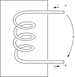

An inductance is made by winding many turns of wire in the form of a coil and bringing the two ends out to terminals at some distance from the coil, as shown in Fig. 22–1 . We want to assume that the magnetic field produced by currents in the coil does not spread out strongly all over space and interact with other parts of the circuit. This is usually arranged by winding the coil in a doughnut-shaped form, or by confining the magnetic field by winding the coil on a suitable iron core, or by placing the coil in some suitable metal box, as indicated schematically in Fig. 22–1 . In any case, we assume that there is a negligible magnetic field in the external region near the terminals a and b . We are also going to assume that we can neglect any electrical resistance in the wire of the coil. Finally, we will assume that we can neglect the amount of electrical charge that appears on the surface of a wire in building up the electric fields.

With all these approximations we have what we call an “ideal” inductance. (We will come back later and discuss what happens in a real inductance.) For an ideal inductance we say that the voltage across the terminals is equal to L(dI/dt) . Let’s see why that is so. When there is a current through the inductance, a magnetic field proportional to the current is built up inside the coil. If the current changes with time, the magnetic field also changes. In general, the curl of \mathbf{E} is equal to -\frac{\partial \mathbf{B}}{\partial t} ; or, put differently, the line integral of \mathbf{E} all the way around any closed path is equal to the negative of the rate of change of the flux of \mathbf{B} through the loop. Now suppose we consider the following path: Begin at terminal a and go along the coil (staying always inside the wire) to terminal b ; then return from terminal b to terminal a through the air in the space outside the inductance. The line integral of \mathbf{E} around this closed path can be written as the sum of two parts:

\oint\mathbf{E}\cdot d\mathbf{s}=\kern{-1ex} \underset{\substack{\text{via}\\\text{coil}}}{\int_a^b} \kern{-.5ex}\mathbf{E}\cdot d\mathbf{s}\;+\kern{-.75ex} \underset{\text{outside}}{\int_b^a} \kern{-1.5ex}\mathbf{E}\cdot d\mathbf{s}. (22.3)

As we have seen before, there can be no electric fields inside a perfect conductor. (The smallest fields would produce infinite currents.) Therefore the integral from a to b via the coil is zero. The whole contribution to the line integral of \mathbf{E} comes from the path outside the inductance from terminal b to terminal a . Since we have assumed that there are no magnetic fields in the space outside of the “box,” this part of the integral is independent of the path chosen and we can define the potentials of the two terminals. The difference of these two potentials is what we call the voltage difference, or simply the voltage V , so we have

V=-\int_b^a\kern{-1ex}\mathbf{E}\cdot d\mathbf{s}=-\oint\mathbf{E}\cdot d\mathbf{s}.

The complete line integral is what we have before called the electromotive force \emf and is, of course, equal to the rate of change of the magnetic flux in the coil. We have seen earlier that this emf is proportional to the negative rate of change of the current, so we have

V=-\emf=L\,\frac{d I}{d t},

where L is the inductance of the coil. Since dI/dt=i\omega I , we have

V=i\omega LI. (22.4)

The way we have described the ideal inductance illustrates the general approach to other ideal circuit elements—usually called “lumped” elements. The properties of the element are described completely in terms of currents and voltages that appear at the terminals. By making suitable approximations, it is possible to ignore the great complexities of the fields that appear inside the object. A separation is made between what happens inside and what happens outside.

For all the circuit elements we will find a relation like the one in Eq. ( 22.4), in which the voltage is proportional to the current with a proportionality constant that is, in general, a complex number. This complex coefficient of proportionality is called the impedance and is usually written as z (not to be confused with the z -coordinate). It is, in general, a function of the frequency \omega . So for any lumped element we write

\frac{V}{I}=\frac{\hat{V}}{\hat{I}}=z. (22.5)

For an inductance, we have

z\,(\text{inductance})=z_L=i\omega L. (22.6)

Now let’s look at a capacitor from the same point of view. 1 A capacitor consists of a pair of conducting plates from which two wires are brought out to suitable terminals. The plates may be of any shape whatsoever, and are often separated by some dielectric material. We illustrate such a situation schematically in Fig. 22–2 . Again we make several simplifying assumptions. We assume that the plates and the wires are perfect conductors. We also assume that the insulation between the plates is perfect, so that no charges can flow across the insulation from one plate to the other. Next, we assume that the two conductors are close to each other but far from all others, so that all field lines which leave one plate end up on the other. Then there are always equal and opposite charges on the two plates and the charges on the plates are much larger than the charges on the surfaces of the lead-in wires. Finally, we assume that there are no magnetic fields close to the capacitor.

### Figure Ch22-F2
Caption: Fig. 22–2.A capacitor (or condenser).
Image: figures/Ch22-F2.svg

Suppose now we consider the line integral of \mathbf{E} around a closed loop which starts at terminal a , goes along inside the wire to the top plate of the capacitor, jumps across the space between the plates, passes from the lower plate to terminal b through the wire, and returns to terminal a in the space outside the capacitor. Since there is no magnetic field, the line integral of \mathbf{E} around this closed path is zero. The integral can be broken down into three parts:

\oint\mathbf{E}\cdot d\mathbf{s}=\kern{-1.3ex} \underset{\substack{\text{along}\\\text{wires}}}{\int} % ebook insert: \mathbf{E}\cdot d\mathbf{s}+\kern{-2.2ex} \underset{\substack{\text{between}\\\text{plates}}}{\int} \kern{-1.5ex}\mathbf{E}\cdot d\mathbf{s}+\kern{-1.2ex} \underset{\text{outside}}{\int_b^a} \kern{-1.6ex}\mathbf{E}\cdot d\mathbf{s}. (22.7)

The integral along the wires is zero, because there are no electric fields inside perfect conductors. The integral from b to a outside the capacitor is equal to the negative of the potential difference between the terminals. Since we imagined that the two plates are in some way isolated from the rest of the world, the total charge on the two plates must be zero; if there is a charge Q on the upper plate, there is an equal, opposite charge -Q on the lower plate. We have seen earlier that if two conductors have equal and opposite charges, plus and minus Q , the potential difference between the plates is equal to Q/C , where C is called the capacity of the two conductors. From Eq. ( 22.7) the potential difference between the terminals a and b is equal to the potential difference between the plates. We have, therefore, that

V=\frac{Q}{C}.

The electric current I entering the capacitor through terminal a (and leaving through terminal b ) is equal to dQ/dt , the rate of change of the electric charge on the plates. Writing dV/dt as i\omega V , we can put the voltage current relationship for a capacitor in the following way:

i\omega V=\frac{I}{C},

or

V=\frac{I}{i\omega C}. (22.8)

The impedance z of a capacitor, is then

z\,(\text{capacitor})=z_C=\frac{1}{i\omega C}. (22.9)

### Figure Ch22-F3
Caption: Fig. 22–3.A resistor
Image: figures/Ch22-F3.svg
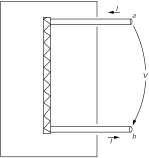

The third element we want to consider is a resistor. However, since we have not yet discussed the electrical properties of real materials, we are not yet ready to talk about what happens inside a real conductor. We will just have to accept as fact that electric fields can exist inside real materials, that these electric fields give rise to a flow of electric charge—that is, to a current—and that this current is proportional to the integral of the electric field from one end of the conductor to the other. We then imagine an ideal resistor constructed as in the diagram of Fig. 22–3 . Two wires which we take to be perfect conductors go from the terminals a and b to the two ends of a bar of resistive material. Following our usual line of argument, the potential difference between the terminals a and b is equal to the line integral of the external electric field, which is also equal to the line integral of the electric field through the bar of resistive material. It then follows that the current I through the resistor is proportional to the terminal voltage V :

I=\frac{V}{R},

where R is called the resistance. We will see later that the relation between the current and the voltage for real conducting materials is only approximately linear. We will also see that this approximate proportionality is expected to be independent of the frequency of variation of the current and voltage only if the frequency is not too high. For alternating currents then, the voltage across a resistor is in phase with the current, which means that the impedance is a real number:

z\,(\text{resistance})=z_R=R. (22.10)

### Figure Ch22-F4
Caption: Fig. 22–4.The ideal lumped circuit elements (passive).
Image: figures/Ch22-F4.svg

Our results for the three lumped circuit elements—the inductor, the capacitor, and the resistor—are summarized in Fig. 22–4 . In this figure, as well as in the preceding ones, we have indicated the voltage by an arrow that is directed from one terminal to another. If the voltage is “positive”—that is, if the terminal a is at a higher potential than the terminal b —the arrow indicates the direction of a positive “voltage drop.”

Although we are talking about alternating currents, we can of course include the special case of circuits with steady currents by taking the limit as the frequency \omega goes to zero. For zero frequency—that is, for dc —the impedance of an inductance goes to zero; it becomes a short circuit. For dc, the impedance of a condenser goes to infinity; it becomes an open circuit. Since the impedance of a resistor is independent of frequency, it is the only element left when we analyze a circuit for dc.

In the circuit elements we have described so far, the current and voltage are proportional to each other. If one is zero, so also is the other. We usually think in terms like these: An applied voltage is “responsible” for the current, or a current “gives rise to” a voltage across the terminals; so in a sense the elements “respond” to the “applied” external conditions. For this reason these elements are called passive elements. They can thus be contrasted with the active elements, such as the generators we will consider in the next section, which are the sources of the oscillating currents or voltages in a circuit.

## 22–2 Generators

Now we want to talk about an active circuit element—one that is a source of the currents and voltages in a circuit—namely, a generator.

### Figure Ch22-F5
Caption: Fig. 22–5.A generator consisting of a fixed coil and a rotating magnetic field.
Image: figures/Ch22-F5.svg

Suppose that we have a coil like an inductance except that it has very few turns, so that we may neglect the magnetic field of its own current. This coil, however, sits in a changing magnetic field such as might be produced by a rotating magnet, as sketched in Fig. 22–5 . (We have seen earlier that such a rotating magnetic field can also be produced by a suitable set of coils with alternating currents.) Again we must make several simplifying assumptions. The assumptions we will make are all the ones that we described for the case of the inductance. In particular, we assume that the varying magnetic field is restricted to a definite region in the vicinity of the coil and does not appear outside the generator in the space between the terminals.

Following closely the analysis we made for the inductance, we consider the line integral of \mathbf{E} around a complete loop that starts at terminal a , goes through the coil to terminal b and returns to its starting point in the space between the two terminals. Again we conclude that the potential difference between the terminals is equal to the total line integral of \mathbf{E} around the loop:

V=-\oint\mathbf{E}\cdot d\mathbf{s}.

This line integral is equal to the emf in the circuit, so the potential difference V across the terminals of the generator is also equal to the rate of change of the magnetic flux linking the coil:

V=-\emf=\frac{d }{d t}\,(\text{flux}). (22.11)

For an ideal generator we assume that the magnetic flux linking the coil is determined by external conditions—such as the angular velocity of a rotating magnetic field—and is not influenced in any way by the currents through the generator. Thus a generator—at least the ideal generator we are considering—is not an impedance. The potential difference across its terminals is determined by the arbitrarily assigned electromotive force \emf(t) . Such an ideal generator is represented by the symbol shown in Fig. 22–6 . The little arrow represents the direction of the emf when it is positive. A positive emf in the generator of Fig. 22–6 will produce a voltage V=\emf , with the terminal a at a higher potential than the terminal b .

### Figure Ch22-F6
Caption: Fig. 22–6.Symbol for an ideal generator.
Image: figures/Ch22-F6.svg

There is another way to make a generator which is quite different on the inside but which is indistinguishable from the one we have just described insofar as what happens beyond its terminals. Suppose we have a coil of wire which is rotated in a fixed magnetic field, as indicated in Fig. 22–7 . We show a bar magnet to indicate the presence of a magnetic field; it could, of course, be replaced by any other source of a steady magnetic field, such as an additional coil carrying a steady current. As shown in the figure, connections from the rotating coil are made to the outside world by means of sliding contacts or “slip rings.” Again, we are interested in the potential difference that appears across the two terminals a and b , which is of course the integral of the electric field from terminal a to terminal b along a path outside the generator.

### Figure Ch22-F7
Caption: Fig. 22–7.A generator consisting of a coil rotating in a fixed magnetic field.
Image: figures/Ch22-F7.svg

Now in the system of Fig. 22–7 there are no changing magnetic fields, so we might at first wonder how any voltage could appear at the generator terminals. In fact, there are no electric fields anywhere inside the generator. We are, as usual, assuming for our ideal elements that the wires inside are made of a perfectly conducting material, and as we have said many times, the electric field inside a perfect conductor is equal to zero. But that is not true. It is not true when a conductor is moving in a magnetic field. The true statement is that the total force on any charge inside a perfect conductor must be zero. Otherwise there would be an infinite flow of the free charges. So what is always true is that the sum of the electric field \mathbf{E} and the cross product of the velocity of the conductor and the magnetic field \mathbf{B} —which is the total force on a unit charge—must have the value zero inside the conductor:

\begin{aligned} \mathbf{F}/\text{unit charge}&=\mathbf{E}+\mathbf{v}\times\mathbf{B}\\ &=\FLPzero\;(\text{in a perfect conductor}), \end{aligned} (22.12)

where \mathbf{v} represents the velocity of the conductor. Our earlier statement that there is no electric field inside a perfect conductor is all right if the velocity \mathbf{v} of the conductor is zero; otherwise the correct statement is given by Eq. ( 22.12).

Returning to our generator of Fig. 22–7 , we now see that the line integral of the electric field \mathbf{E} from terminal a to terminal b through the conducting path of the generator must be equal to the line integral of \mathbf{v}\times\mathbf{B} on the same path,

\underset{\substack{\text{inside}\\\text{conductor}}}{\int_a^b} \kern{-1.75ex}\mathbf{E}\cdot d\mathbf{s}\;=-\kern{-1.75ex} \underset{\substack{\text{inside}\\\text{conductor}}}{\int_a^b} \kern{-1.5ex}(\mathbf{v}\times\mathbf{B})\cdot d\mathbf{s}. (22.13)

It is still true, however, that the line integral of \mathbf{E} around a complete loop, including the return from b to a outside the generator, must be zero, because there are no changing magnetic fields. So the first integral in Eq. ( 22.13) is also equal to V , the voltage between the two terminals. It turns out that the right-hand integral of Eq. ( 22.13) is just the rate of change of the flux linkage through the coil and is therefore—by the flux rule—equal to the emf in the coil. So we have again that the potential difference across the terminals is equal to the electromotive force in the circuit, in agreement with Eq. ( 22.11). So whether we have a generator in which a magnetic field changes near a fixed coil, or one in which a coil moves in a fixed magnetic field, the external properties of the generators are the same. There is a voltage difference V across the terminals, which is independent of the current in the circuit but depends only on the arbitrarily assigned conditions inside the generator.

### Figure Ch22-F8
Caption: Fig. 22–8.A chemical cell.
Image: figures/Ch22-F8.svg

So long as we are trying to understand the operation of generators from the point of view of Maxwell’s equations, we might also ask about the ordinary chemical cell, like a flashlight battery. It is also a generator, i.e., a voltage source, although it will of course only appear in dc circuits. The simplest kind of cell to understand is shown in Fig. 22–8 . We imagine two metal plates immersed in some chemical solution. We suppose that the solution contains positive and negative ions. We suppose also that one kind of ion, say the negative, is much heavier than the one of opposite polarity, so that its motion through the solution by the process of diffusion is much slower. We suppose next that by some means or other it is arranged that the concentration of the solution is made to vary from one part of the liquid to the other, so that the number of ions of both polarities near, say, the lower plate is much larger than the concentration of ions near the upper plate. Because of their rapid mobility the positive ions will drift more readily into the region of lower concentration, so that there will be a slight excess of positive charge arriving at the upper plate. The upper plate will become positively charged and the lower plate will have a net negative charge.

As more and more charges diffuse to the upper plate, the potential of this plate will rise until the resulting electric field between the plates produces forces on the ions which just compensate for their excess mobility, so the two plates of the cell quickly reach a potential difference which is characteristic of the internal construction.

Arguing just as we did for the ideal capacitor, we see that the potential difference between the terminals a and b is just equal to the line integral of the electric field between the two plates when there is no longer any net diffusion of the ions. There is, of course, an essential difference between a capacitor and such a chemical cell. If we short-circuit the terminals of a condenser for a moment, the capacitor is discharged and there is no longer any potential difference across the terminals. In the case of the chemical cell a current can be drawn from the terminals continuously without any change in the emf—until, of course, the chemicals inside the cell have been used up. In a real cell it is found that the potential difference across the terminals decreases as the current drawn from the cell increases. In keeping with the abstractions we have been making, however, we may imagine an ideal cell in which the voltage across the terminals is independent of the current. A real cell can then be looked at as an ideal cell in series with a resistor.

## 22–3 Networks of ideal elements; Kirchhoff’s rules

As we have seen in the last section, the description of an ideal circuit element in terms of what happens outside the element is quite simple. The current and the voltage are linearly related. But what is actually happening inside the element is quite complicated, and it is quite difficult to give a precise description in terms of Maxwell’s equations. Imagine trying to give a precise description of the electric and magnetic fields of the inside of a radio which contains hundreds of resistors, capacitors, and inductors. It would be an impossible task to analyze such a thing by using Maxwell’s equations. But by making the many approximations we have described in Section 22–2 and summarizing the essential features of the real circuit elements in terms of idealizations, it becomes possible to analyze an electrical circuit in a relatively straightforward way. We will now show how that is done.

### Figure Ch22-F9
Caption: Fig. 22–9.The sum of the voltage drops around any closed path is zero.
Image: figures/Ch22-F9.svg
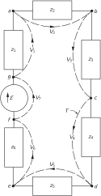

Suppose we have a circuit consisting of a generator and several impedances connected together, as shown in Fig. 22–9. According to our approximations there is no magnetic field in the region outside the individual circuit elements. Therefore the line integral of \mathbf{E} around any curve which does not pass through any of the elements is zero. Consider then the curve \Gamma shown by the broken line which goes all the way around the circuit in Fig. 22–9. The line integral of \mathbf{E} around this curve is made up of several pieces. Each piece is the line integral from one terminal of a circuit element to the other. This line integral we have called the voltage drop across the circuit element. The complete line integral is then just the sum of the voltage drops across all of the elements in the circuit:

\oint\mathbf{E}\cdot d\mathbf{s}=\sum V_n.

Since the line integral is zero, we have that the sum of the potential differences around a complete loop of a circuit is equal to zero:

\underset{\substack{\text{around}\\\text{any loop}}}{\sum} V_n=0. (22.14)

This result follows from one of Maxwell’s equations—that in a region where there are no magnetic fields the line integral of \mathbf{E} around any complete loop is zero.

### Figure Ch22-F10
Caption: Fig. 22–10.The sum of the currents into any node is zero.
Image: figures/Ch22-F10.svg

Suppose we consider now a circuit like that shown in Fig. 22–10. The horizontal line joining the terminals a , b , c , and d is intended to show that these terminals are all connected, or that they are joined by wires of negligible resistance. In any case, the drawing means that terminals a , b , c , and d are all at the same potential and, similarly, that the terminals e , f , g , and h are also at one common potential. Then the voltage drop V across each of the four elements is the same.

Now one of our idealizations has been that negligible electrical charges accumulate on the terminals of the impedances. We now assume further that any electrical charges on the wires joining terminals can also be neglected. Then the conservation of charge requires that any charge which leaves one circuit element immediately enters some other circuit element. Or, what is the same thing, we require that the algebraic sum of the currents which enter any given junction must be zero. By a junction, of course, we mean any set of terminals such as a , b , c , and d which are connected. Such a set of connected terminals is usually called a “node.” The conservation of charge then requires that for the circuit of Fig. 22–10,

I_1-I_2-I_3-I_4=0. (22.15)

The sum of the currents entering the node which consists of the four terminals e , f , g , and h must also be zero:

-I_1+I_2+I_3+I_4=0. (22.16)

This is, of course, the same as Eq. ( 22.15). The two equations are not independent. The general rule is that the sum of the currents into any node must be zero:

\underset{\substack{\text{into}\\\text{a node}}}{\sum} I_n=0. (22.17)

Our earlier conclusion that the sum of the voltage drops around a closed loop is zero must apply to any loop in a complicated circuit. Also, our result that the sum of the currents into a node is zero must be true for any node. These two equations are known as Kirchhoff’s rules. With these two rules it is possible to solve for the currents and voltages in any network whatever.

### Figure Ch22-F11
Caption: Fig. 22–11.Analyzing a circuit with Kirchhoff’s rules.
Image: figures/Ch22-F11.svg

Suppose we consider the more complicated circuit of Fig. 22–11. How shall we find the currents and voltages in this circuit? We can find them in the following straightforward way. We consider separately each of the four subsidiary closed loops, which appear in the circuit. (For instance, one loop goes from terminal a to terminal b to terminal e to terminal d and back to terminal a .) For each of the loops we write the equation for the first of Kirchhoff’s rules—that the sum of the voltages around each loop is equal to zero. We must remember to count the voltage drop as positive if we are going in the direction of the current and negative if we are going across an element in the direction opposite to the current; and we must remember that the voltage drop across a generator is the negative of the emf in that direction. Thus if we consider the small loop that starts and ends at terminal a we have the equation

z_1I_1+z_3I_3+z_4I_4-\emf_1=0.

Applying the same rule to the remaining loops, we would get three more equations of the same kind.

Next, we must write the current equation for each of the nodes in the circuit. For example, summing the currents into the node at terminal b gives the equation

I_1-I_3-I_2=0.

Similarly, for the node labeled e we would have the current equation

I_3-I_4+I_8-I_5=0.

For the circuit shown there are five such current equations. It turns out, however, that any one of these equations can be derived from the other four; there are, therefore, only four independent current equations. We thus have a total of eight independent, linear equations: the four voltage equations and the four current equations. With these eight equations we can solve for the eight unknown currents. Once the currents are known the circuit is solved. The voltage drop across any element is given by the current through that element times its impedance (or, in the case of the voltage sources, it is already known).

We have seen that when we write the current equations, we get one equation which is not independent of the others. Generally it is also possible to write down too many voltage equations. For example, in the circuit of Fig. 22–11, although we have considered only the four small loops, there are a large number of other loops for which we could write the voltage equation. There is, for example, the loop along the path abcfeda . There is another loop which follows the path abcfehgda . You can see that there are many loops. In analyzing complicated circuits it is very easy to get too many equations. There are rules which tell us how to proceed so that only the minimum number of equations is written down, but usually with a little thought it is possible to see how to get the right number of equations in the simplest form. Besides, writing an extra equation or two doesn’t do any harm. They will not lead to any wrong answers, only perhaps a little unnecessary algebra.

### Figure Ch22-F12
Caption: Fig. 22–12.A circuit which can be analyzed in terms of series and parallel combinations.
Image: figures/Ch22-F12.svg
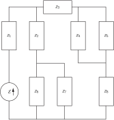

In Chapter 25 of Vol. I we showed that if the two impedances z_1 and z_2 are in series, they are equivalent to a single impedance z_s given by

z_s=z_1+z_2. (22.18)

We also showed that if the two impedances are connected in parallel, they are equivalent to the single impedance z_p given by

z_p=\frac{1}{(1/z_1)+(1/z_2)}=\frac{z_1z_2}{z_1+z_2}. (22.19)

If you look back you will see that in deriving these results we were in effect making use of Kirchhoff’s rules. It is often possible to analyze a complicated circuit by repeated application of the formulas for series and parallel impedances. For instance, the circuit of Fig. 22–12 can be analyzed that way. First, the impedances z_4 and z_5 can be replaced by their parallel equivalent, and so also can z_6 and z_7 . Then the impedance z_2 can be combined with the parallel equivalent of z_6 and z_7 by the series rule. Proceeding in this way, the whole circuit can be reduced to a generator in series with a single impedance Z . The current through the generator is then just \emf/Z . Then by working backward one can solve for the currents in each of the impedances.

### Figure Ch22-F13
Caption: Fig. 22–13.A circuit that cannot be analyzed in terms of series and parallel combinations.
Image: figures/Ch22-F13.svg
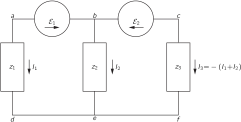

There are, however, quite simple circuits which cannot be analyzed by this method, as for example the circuit of Fig. 22–13. To analyze this circuit we must write down the current and voltage equations from Kirchhoff’s rules. Let’s do it. There is just one current equation:

I_1+I_2+I_3=0,

so we know immediately that

I_3=-(I_1+I_2).

We can save ourselves some algebra if we immediately make use of this result in writing the voltage equations. For this circuit there are two independent voltage equations; they are

-\emf_1+I_2z_2-I_1z_1=0

and

\emf_2-(I_1+I_2)z_3-I_2z_2=0.

There are two equations and two unknown currents. Solving these equations for I_1 and I_2 , we get

I_1=\frac{z_2\emf_2-(z_2+z_3)\emf_1}{z_1(z_2+z_3)+z_2z_3} (22.20)

and

I_2=\frac{z_1\emf_2+z_3\emf_1}{z_1(z_2+z_3)+z_2z_3}. (22.21)

The third current is obtained from the sum of these two.

### Figure Ch22-F14
Caption: Fig. 22–14.A bridge circuit.
Image: figures/Ch22-F14.svg

Another example of a circuit that cannot be analyzed by using the rules for series and parallel impedance is shown in Fig. 22–14. Such a circuit is called a “bridge.” It appears in many instruments used for measuring impedances. With such a circuit one is usually interested in the question: How must the various impedances be related if the current through the impedance z_3 is to be zero? We leave it for you to find the conditions for which this is so.

## 22–4 Equivalent circuits

### Figure Ch22-F15
Caption: Fig. 22–15.Any two-terminal network of passive elements is equivalent to an effective impedance.
Image: figures/Ch22-F15.svg
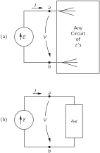

Suppose we connect a generator \emf to a circuit containing some complicated interconnection of impedances, as indicated schematically in Fig. 22–15 (a). All of the equations we get from Kirchhoff’s rules are linear, so when we solve them for the current I through the generator, we will get that I is proportional to \emf . We can write

I=\frac{\emf}{z_{\text{eff}}},

where now z_{\text{eff}} is some complex number, an algebraic function of all the elements in the circuit. (If the circuit contains no generators other than the one shown, there is no additional term independent of \emf .) But this equation is just what we would write for the circuit of Fig. 22–15 (b). So long as we are interested only in what happens to the left of the two terminals a and b , the two circuits of Fig. 22–15 are equivalent. We can, therefore, make the general statement that any two-terminal network of passive elements can be replaced by a single impedance z_{\text{eff}} without changing the currents and voltages in the rest of the circuit. This statement is of course, just a remark about what comes out of Kirchhoff’s rules—and ultimately from the linearity of Maxwell’s equations.

### Figure Ch22-F16
Caption: Fig. 22–16.Any two-terminal network can be replaced by a generator in series with an impedance.
Image: figures/Ch22-F16.svg

The idea can be generalized to a circuit that contains generators as well as impedances. Suppose we look at such a circuit “from the point of view” of one of the impedances, which we will call z_n , as in Fig. 22–16 (a). If we were to solve the equation for the whole circuit, we would find that the voltage V_n between the two terminals a and b is a linear function of I_n , which we can write

V_n=A-BI_n, (22.22)

where A and B depend on the generators and impedances in the circuit to the left of the terminals. For instance, for the circuit of Fig. 22–13, we find V_1=I_1z_1 . This can be written [by rearranging Eq. ( 22.20)] as

V_1=\biggl[ \biggl(\frac{z_2}{z_2+z_3}\biggr)\emf_2-\emf_1 \biggr]-\frac{z_2z_3}{z_2+z_3}\,I_1. (22.23)

The complete solution is then obtained by combining this equation with the one for the impedance z_1 , namely, V_1=I_1z_1 , or in the general case, by combining Eq. ( 22.22) with

V_n=I_nz_n.

If now we consider that z_n is attached to a simple series circuit of a generator and an impedance, as in Fig. 22–16 (b), the equation corresponding to Eq. ( 22.22) is

V_n=\emf_{\text{eff}}-I_nz_{\text{eff}},

which is identical to Eq. ( 22.22) provided we set \emf_{\text{eff}}=A and z_{\text{eff}}=B . So if we are interested only in what happens to the right of the terminals a and b , the arbitrary circuit of Fig. 22–16 can always be replaced by an equivalent combination of a generator in series with an impedance.

## 22–5 Energy

We have seen that to build up the current I in an inductance, the energy U=\frac{1}{2}LI^2 must be provided by the external circuit. When the current falls back to zero, this energy is delivered back to the external circuit. There is no energy-loss mechanism in an ideal inductance. When there is an alternating current through an inductance, energy flows back and forth between it and the rest of the circuit, but the average rate at which energy is delivered to the circuit is zero. We say that an inductance is a nondissipative element; no electrical energy is dissipated—that is, “lost”—in it.

Similarly, the energy of a condenser, U=\frac{1}{2}CV^2 , is returned to the external circuit when a condenser is discharged. When a condenser is in an ac circuit energy flows in and out of it, but the net energy flow in each cycle is zero. An ideal condenser is also a nondissipative element.

We know that an emf is a source of energy. When a current I flows in the direction of the emf, energy is delivered to the external circuit at the rate dU/dt=\emf I . If current is driven against the emf—by other generators in the circuit—the emf will absorb energy at the rate \emf I ; since I is negative, dU/dt will also be negative.

If a generator is connected to a resistor R , the current through the resistor is I=\emf/R . The energy being supplied by the generator at the rate \emf I is being absorbed by the resistor. This energy goes into heat in the resistor and is lost from the electrical energy of the circuit. We say that electrical energy is dissipated in a resistor. The rate at which energy is dissipated in a resistor is dU/dt=RI^2 .

In an ac circuit the average rate of energy lost to a resistor is the average of RI^2 over one cycle. Since I=\hat{I}e^{i\omega t} —by which we really mean that I varies as \cos\omega t —the average of I^2 over one cycle is \left|\hat{I}\right|^2/2 , since the peak current is \left|\hat{I}\right| and the average of \cos^2\omega t is 1/2 .

What about the energy loss when a generator is connected to an arbitrary impedance z ? (By “loss” we mean, of course, conversion of electrical energy into thermal energy.) Any impedance z can be written as the sum of its real and imaginary parts. That is,

z=R+iX, (22.24)

where R and X are real numbers. From the point of view of equivalent circuits we can say that any impedance is equivalent to a resistance in series with a pure imaginary impedance—called a reactance —as shown in Fig. 22–17.

### Figure Ch22-F17
Caption: Fig. 22–17.Any impedance is equivalent to a series combination of a pure resistance and a pure reactance.
Image: figures/Ch22-F17.svg
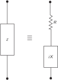

We have seen earlier that any circuit that contains only L ’s and C ’s has an impedance that is a pure imaginary number. Since there is no energy loss into any of the L ’s and C ’s on the average, a pure reactance containing only L ’s and C ’s will have no energy loss. We can see that this must be true in general for a reactance.

If a generator with the emf \emf is connected to the impedance z of Fig. 22–17, the emf must be related to the current I from the generator by

\emf=I(R+iX). (22.25)

To find the average rate at which energy is delivered, we want the average of the product \emf I . Now we must be careful. When dealing with such products, we must deal with the real quantities \emf(t) and I(t) . (The real parts of the complex functions will represent the actual physical quantities only when we have linear equations; now we are concerned with products, which are certainly not linear.)

Suppose we choose our origin of t so that the amplitude \hat{I} is a real number, let’s say I_0 ; then the actual time variation I is given by

I=I_0\cos\omega t.

The emf of Eq. ( 22.25) is the real part of

I_0e^{i\omega t}(R+iX)

or

\emf=I_0R\cos\omega t-I_0X\sin\omega t. (22.26)

The two terms in Eq. ( 22.26) represent the voltage drops across R and X in Fig. 22–17. We see that the voltage drop across the resistance is in phase with the current, while the voltage drop across the purely reactive part is out of phase with the current.

The average rate of energy loss, \av{P} , from the generator is the integral of the product \emf I over one cycle divided by the period T ; in other words,

\begin{aligned} \av{P} = \frac{1}{T}\!\int_0^T\!\! &\emf I\,dt\\[1.5ex] =\frac{1}{T}\!\int_0^T\!\! &I_0^2R\cos^2\omega t\,dt\\[-.25ex] -\;&\frac{1}{T}\!\int_0^T\!\!\!I_0^2X\cos\omega t\sin\omega t\,dt. \end{aligned}

The first integral is \frac{1}{2}I_0^2R , and the second integral is zero. So the average energy loss in an impedance z=R+iX depends only on the real part of z , and is I_0^2R/2 , which is in agreement with our earlier result for the energy loss in a resistor. There is no energy loss in the reactive part.

## 22–6 A ladder network

### Figure Ch22-F18
Caption: Fig. 22–18.The effective impedance of a ladder.
Image: figures/Ch22-F18.svg
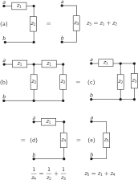

We would like now to consider an interesting circuit which can be analyzed in terms of series and parallel combinations. Suppose we start with the circuit of Fig. 22–18 (a). We can see right away that the impedance from terminal a to terminal b is simply z_1+z_2 . Now let’s take a little harder circuit, the one shown in Fig. 22–18 (b). We could analyze this circuit using Kirchhoff’s rules, but it is also easy to handle with series and parallel combinations. We can replace the two impedances on the right-hand end by a single impedance z_3=z_1+z_2 , as in part (c) of the figure. Then the two impedances z_2 and z_3 can be replaced by their equivalent parallel impedance z_4 , as shown in part (d) of the figure. Finally, z_1 and z_4 are equivalent to a single impedance z_5 , as shown in part (e).

### Figure Ch22-F19
Caption: Fig. 22–19.The effective impedance of an infinite ladder.
Image: figures/Ch22-F19.svg
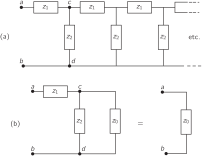

Now we may ask an amusing question: What would happen if in the network of Fig. 22–18 (b) we kept on adding more sections forever —as we indicate by the dashed lines in Fig. 22–19 (a)? Can we solve such an infinite network? Well, that’s not so hard. First, we notice that such an infinite network is unchanged if we add one more section at the “front” end. Surely, if we add one more section to an infinite network it is still the same infinite network. Suppose we call the impedance between the two terminals a and b of the infinite network z_0 ; then the impedance of all the stuff to the right of the two terminals c and d is also z_0 . Therefore, so far as the front end is concerned, we can represent the network as shown in Fig. 22–19 (b). Forming the parallel combination of z_2 with z_0 and adding the result in series with z_1 , we can immediately write down the impedance of this circuit:

z=z_1\!+\!\frac{1}{(1/z_2)\!+\!(1/z_0)}\quad\text{or}\quad z=z_1\!+\!\frac{z_2z_0}{z_2\!+\!z_0}.

But this impedance is also equal to z_0 , so we have the equation

z_0=z_1+\frac{z_2z_0}{z_2+z_0}.

We can solve for z_0 to get

z_0=\frac{z_1}{2}+\sqrt{(z_1^2/4)+z_1z_2}. (22.27)

So we have found the solution for the impedance of an infinite ladder of repeated series and parallel impedances. The impedance z_0 is called the characteristic impedance of such an infinite network.

### Figure Ch22-F20
Caption: Fig. 22–20.An LL-CC ladder drawn in two equivalent ways.
Image: figures/Ch22-F20.svg

Let’s now consider a specific example in which the series element is an inductance L and the shunt element is a capacitance C , as shown in Fig. 22–20 (a). In this case we find the impedance of the infinite network by setting z_1=i\omega L and z_2=1/i\omega C . Notice that the first term, z_1/2 , in Eq. ( 22.27) is just one-half the impedance of the first element. It would therefore seem more natural, or at least somewhat simpler, if we were to draw our infinite network as shown in Fig. 22–20 (b). Looking at the infinite network from the terminal a' we would see the characteristic impedance

z_0=\sqrt{(L/C)-(\omega^2L^2/4)}. (22.28)

Now there are two interesting cases, depending on the frequency \omega . If \omega^2 is less than 4/LC , the second term in the radical will be smaller than the first, and the impedance z_0 will be a real number. On the other hand, if \omega^2 is greater than 4/LC the impedance z_0 will be a pure imaginary number which we can write as

z_0=i\sqrt{(\omega^2L^2/4)-(L/C)}.

We have said earlier that a circuit which contains only imaginary impedances, such as inductances and capacitances, will have an impedance which is purely imaginary. How can it be then that for the circuit we are now studying—which has only L ’s and C ’s—the impedance is a pure resistance for frequencies below \sqrt{4/LC} ? For higher frequencies the impedance is purely imaginary, in agreement with our earlier statement. For lower frequencies the impedance is a pure resistance and will therefore absorb energy. But how can the circuit continuously absorb energy, as a resistance does, if it is made only of inductances and capacitances? Answer: Because there is an infinite number of inductances and capacitances, so that when a source is connected to the circuit, it supplies energy to the first inductance and capacitance, then to the second, to the third, and so on. In a circuit of this kind, energy is continually absorbed from the generator at a constant rate and flows constantly out into the network, supplying energy which is stored in the inductances and capacitances down the line.

This idea suggests an interesting point about what is happening in the circuit. We would expect that if we connect a source to the front end, the effects of this source will be propagated through the network toward the infinite end. The propagation of the waves down the line is much like the radiation from an antenna which absorbs energy from its driving source; that is, we expect such a propagation to occur when the impedance is real, which occurs if \omega is less than \sqrt{4/LC} . But when the impedance is purely imaginary, which happens for \omega greater than \sqrt{4/LC} , we would not expect to see any such propagation.

## 22–7 Filters

We saw in the last section that the infinite ladder network of Fig. 22–20 absorbs energy continuously if it is driven at a frequency below a certain critical frequency \sqrt{4/LC} , which we will call the cutoff frequency \omega_0 . We suggested that this effect could be understood in terms of a continuous transport of energy down the line. On the other hand, at high frequencies, for w>\omega_0 , there is no continuous absorption of energy; we should then expect that perhaps the currents don’t “penetrate” very far down the line. Let’s see whether these ideas are right.

Suppose we have the front end of the ladder connected to some ac generator and we ask what the voltage looks like at, say, the 754 th section of the ladder. Since the network is infinite, whatever happens to the voltage from one section to the next is always the same; so let’s just look at what happens when we go from some section, say the n th to the next. We will define the currents I_n and voltages V_n as shown in Fig. 22–21 (a).

### Figure Ch22-F21
Caption: Fig. 22–21.Finding the propagation factor of a ladder.
Image: figures/Ch22-F21.svg
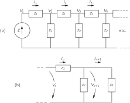

We can get the voltage V_{n+1} from V_n by remembering that we can always replace the rest of the ladder after the n th section by its characteristic impedance z_0 ; then we need only analyze the circuit of Fig. 22–21 (b). First, we notice that any V_n , since it is across z_0 , must equal I_nz_0 . Also, the difference between V_n and V_{n+1} is just I_nz_1 :

V_n-V_{n+1}=I_nz_1=V_n\,\frac{z_1}{z_0}.

So we get the ratio

\frac{V_{n+1}}{V_n}=1-\frac{z_1}{z_0}=\frac{z_0-z_1}{z_0}.

We can call this ratio the propagation factor for one section of the ladder; we’ll call it \alpha . It is, of course, the same for all sections:

\alpha=\frac{z_0-z_1}{z_0}. (22.29)

The voltage after the n th section is then

V_n=\alpha^n\emf. (22.30)

You can now find the voltage after 754 sections; it is just \alpha to the 754 th power times \emf .

Suppose we see what \alpha is like for the L - C ladder of Fig. 22–20 (a). Using z_0 from Eq. ( 22.27), and z_1=i\omega L , we get

\alpha=\frac{\sqrt{(L/C)-(\omega^2L^2/4)}-i(\omega L/2)} {\sqrt{(L/C)-(\omega^2L^2/4)}+i(\omega L/2)}. (22.31)

If the driving frequency is below the cutoff frequency \omega_0=\sqrt{4/LC} , the radical is a real number, and the magnitudes of the complex numbers in the numerator and denominator are equal. Therefore, the magnitude of \alpha is one; we can write

\alpha=e^{i\delta},

which means that the magnitude of the voltage is the same at every section; only its phase changes. The phase change \delta is, in fact, a negative number and represents the “delay” of the voltage as it passes along the network.

For frequencies above the cutoff frequency \omega_0 it is better to factor out an i from the numerator and denominator of Eq. ( 22.31) and rewrite it as

\alpha=\frac{\sqrt{(\omega^2L^2/4)-(L/C)}-(\omega L/2)} {\sqrt{(\omega^2L^2/4)-(L/C)}+(\omega L/2)}. (22.32)

The propagation factor \alpha is now a real number, and a number less than one. That means that the voltage at any section is always less than the voltage at the preceding section by the factor \alpha . For any frequency above \omega_0 , the voltage dies away rapidly as we go along the network. A plot of the absolute value of \alpha as a function of frequency looks like the graph in Fig. 22–22.

### Figure Ch22-F22
Caption: Fig. 22–22.The propagation factor of a section of an LL-CC ladder.
Image: figures/Ch22-F22.svg

We see that the behavior of \alpha , both above and below \omega_0 , agrees with our interpretation that the network propagates energy for \omega<\omega_0 and blocks it for \omega>\omega_0 . We say that the network “passes” low frequencies and “rejects” or “filters out” the high frequencies. Any network designed to have its characteristics vary in a prescribed way with frequency is called a “filter.” We have been analyzing a “low-pass filter.”

You may be wondering why all this discussion of an infinite network which obviously cannot actually occur. The point is that the same characteristics are found in a finite network if we finish it off at the end with an impedance equal to the characteristic impedance z_0 . Now in practice it is not possible to exactly reproduce the characteristic impedance with a few simple elements—like R ’s, L ’s, and C ’s. But it is often possible to do so with a fair approximation for a certain range of frequencies. In this way one can make a finite filter network whose properties are very nearly the same as those for the infinite case. For instance, the L - C ladder behaves much as we have described it if it is terminated in the pure resistance R=\sqrt{L/C} .

### Figure Ch22-F23
Caption: Fig. 22-23(a) A high-pass filter; (b) its propagation factor as a function of 1/ω1/\omega.
Image: figures/Ch22-F23.svg

If in our L - C ladder we interchange the positions of the L ’s and C ’s, to make the ladder shown in Fig. 22–23 (a), we can have a filter that propagates high frequencies and rejects low frequencies. It is easy to see what happens with this network by using the results we already have. You will notice that whenever we change an L to a C and vice versa, we also change every i\omega to 1/i\omega . So whatever happened at \omega before will now happen at 1/\omega . In particular, we can see how \alpha will vary with frequency by using Fig. 22–22 and changing the label on the axis to 1/\omega , as we have done in Fig. 22–23 (b).

The low-pass and high-pass filters we have described have various technical applications. An L - C low-pass filter is often used as a “smoothing” filter in a dc power supply. If we want to manufacture dc power from an ac source, we begin with a rectifier which permits current to flow only in one direction. From the rectifier we get a series of pulses that look like the function V(t) shown in Fig. 22–24, which is lousy dc, because it wobbles up and down. Suppose we would like a nice pure dc, such as a battery provides. We can come close to that by putting a low-pass filter between the rectifier and the load.

### Figure Ch22-F24
Caption: Fig. 22-24.The output voltage of a full-wave rectifier.
Image: figures/Ch22-F24.svg

We know from Chapter 50 of Vol. I that the time function in Fig. 22–24 can be represented as a superposition of a constant voltage plus a sine wave, plus a higher-frequency sine wave, plus a still higher-frequency sine wave, etc.—by a Fourier series. If our filter is linear (if, as we have been assuming, the L ’s and C ’s don’t vary with the currents or voltages) then what comes out of the filter is the superposition of the outputs for each component at the input. If we arrange that the cutoff frequency \omega_0 of our filter is well below the lowest frequency in the function V(t) , the dc (for which \omega=0 ) goes through fine, but the amplitude of the first harmonic will be cut down a lot. And amplitudes of the higher harmonics will be cut down even more. So we can get the output as smooth as we wish, depending only on how many filter sections we are willing to buy.

A high-pass filter is used if one wants to reject certain low frequencies. For instance, in a phonograph amplifier a high-pass filter may be used to let the music through, while keeping out the low-pitched rumbling from the motor of the turntable.

It is also possible to make “band-pass” filters that reject frequencies below some frequency \omega_1 and above another frequency \omega_2 (greater than \omega_1 ), but pass the frequencies between \omega_1 and \omega_2 . This can be done simply by putting together a high-pass and a low-pass filter, but it is more usually done by making a ladder in which the impedances z_1 and z_2 are more complicated—being each a combination of L ’s and C ’s. Such a band-pass filter might have a propagation constant like that shown in Fig. 22–25 (a). It might be used, for example, in separating signals that occupy only an interval of frequencies, such as each of the many voice channels in a high-frequency telephone cable, or the modulated carrier of a radio transmission.

### Figure Ch22-F25
Caption: Fig. 22-25.(a) A band-pass filter. (b) A simple resonant filter.
Image: figures/Ch22-F25.svg

We have seen in Chapter 25 of Vol. I that such filtering can also be done using the selectivity of an ordinary resonance curve, which we have drawn for comparison in Fig. 22–25 (b). But the resonant filter is not as good for some purposes as the band-pass filter. You will remember (Chapter 48, Vol. I) that when a carrier of frequency \omega_c is modulated with a “signal” frequency \omega_s , the total signal contains not only the carrier frequency but also the two side-band frequencies \omega_c+\omega_s and \omega_c-\omega_s . With a resonant filter, these side-bands are always attenuated somewhat, and the attenuation is more, the higher the signal frequency, as you can see from the figure. So there is a poor “frequency response.” The higher musical tones don’t get through. But if the filtering is done with a band-pass filter designed so that the width \omega_2-\omega_1 is at least twice the highest signal frequency, the frequency response will be “flat” for the signals wanted.

We want to make one more point about the ladder filter: the L - C ladder of Fig. 22–20 is also an approximate representation of a transmission line. If we have a long conductor that runs parallel to another conductor—such as a wire in a coaxial cable, or a wire suspended above the earth—there will be some capacitance between the two conductors and also some inductance due to the magnetic field between them. If we imagine the line as broken up into small lengths \Delta\ell , each length will look like one section of the L - C ladder with a series inductance \Delta L and a shunt capacitance \Delta C . We can then use our results for the ladder filter. If we take the limit as \Delta\ell goes to zero, we have a good description of the transmission line. Notice that as \Delta\ell is made smaller and smaller, both \Delta L and \Delta C decrease, but in the same proportion, so that the ratio \Delta L/\Delta C remains constant. So if we take the limit of Eq. ( 22.28) as \Delta L and \Delta C go to zero, we find that the characteristic impedance z_0 is a pure resistance whose magnitude is \sqrt{\Delta L/\Delta C} . We can also write the ratio \Delta L/\Delta C as L_0/C_0 , where L_0 and C_0 are the inductance and capacitance of a unit length of the line; then we have

z_0=\sqrt{\frac{L_0}{C_0}}. (22.33)

You will also notice that as \Delta L and \Delta C go to zero, the cutoff frequency \omega_0=\sqrt{4/LC} goes to infinity. There is no cutoff frequency for an ideal transmission line.

## 22–8 Other circuit elements

### Figure Ch22-F26
Caption: Fig. 22-26.Equivalent circuit of a mutual inductance.
Image: figures/Ch22-F26.svg

We have so far defined only the ideal circuit impedances—the inductance, the capacitance, and the resistance—as well as the ideal voltage generator. We want now to show that other elements, such as mutual inductances or transistors or vacuum tubes, can be described by using only the same basic elements. Suppose that we have two coils and that on purpose, or otherwise, some flux from one of the coils links the other, as shown in Fig. 22–26 (a). Then the two coils will have a mutual inductance M such that when the current varies in one of the coils, there will be a voltage generated in the other. Can we take into account such an effect in our equivalent circuits? We can in the following way. We have seen that the induced emf’s in each of two interacting coils can be written as the sum of two parts:

\begin{aligned} \emf_1&=-L_1\,\frac{d I_1}{d t}\pm M\,\frac{d I_2}{d t},\\[1.5ex] \emf_2&=-L_2\,\frac{d I_2}{d t}\pm M\,\frac{d I_1}{d t}. \end{aligned} (22.34)

The first term comes from the self-inductance of the coil, and the second term comes from its mutual inductance with the other coil. The sign of the second term can be plus or minus, depending on the way the flux from one coil links the other. Making the same approximations we used in describing an ideal inductance, we would say that the potential difference across the terminals of each coil is equal to the electromotive force in the coil. Then the two equations of ( 22.34) are the same as the ones we would get from the circuit of Fig. 22–26 (b), provided the electromotive force in each of the two circuits shown depends on the current in the opposite circuit according to the relations

\emf_1=\pm i\omega MI_2,\quad \emf_2=\pm i\omega MI_1. (22.35)

So what we can do is represent the effect of the self-inductance in a normal way but replace the effect of the mutual inductance by an auxiliary ideal voltage generator. We must in addition, of course, have the equation that relates this emf to the current in some other part of the circuit; but so long as this equation is linear, we have just added more linear equations to our circuit equations, and all of our earlier conclusions about equivalent circuits and so forth are still correct.

In addition to mutual inductances there may also be mutual capacitances. So far, when we have talked about condensers we have always imagined that there were only two electrodes, but in many situations, for example in a vacuum tube, there may be many electrodes close to each other. If we put an electric charge on any one of the electrodes, its electric field will induce charges on each of the other electrodes and affect its potential. As an example, consider the arrangement of four plates shown in Fig. 22–27 (a). Suppose these four plates are connected to external circuits by means of the wires A , B , C , and D . So long as we are only worried about electrostatic effects, the equivalent circuit of such an arrangement of electrodes is as shown in part (b) of the figure. The electrostatic interaction of any electrode with each of the others is equivalent to a capacity between the two electrodes.

### Figure Ch22-F27
Caption: Fig. 22-27.Equivalent circuit of mutual capacitance.
Image: figures/Ch22-F27.svg

Finally, let’s consider how we should represent such complicated devices as transistors and radio tubes in an ac circuit. We should point out at the start that such devices are often operated in such a way that the relationship between the currents and voltages is not at all linear. In such cases, those statements we have made which depend on the linearity of equations are, of course, no longer correct. On the other hand, in many applications the operating characteristics are sufficiently linear that we may consider the transistors and tubes to be linear devices. By this we mean that the alternating currents in, say, the plate of a vacuum tube are linearly proportional to the voltages that appear on the other electrodes, say the grid voltage and the plate voltage. When we have such linear relationships, we can incorporate the device into our equivalent circuit representation.

### Figure Ch22-F28
Caption: Fig. 22-28.A low-frequency equivalent circuit of a vacuum triode.
Image: figures/Ch22-F28.svg
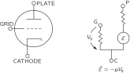

As in the case of the mutual inductance, our representation will have to include auxiliary voltage generators which describe the influence of the voltages or currents in one part of the device on the currents or voltages in another part. For example, the plate circuit of a triode can usually be represented by a resistance in series with an ideal voltage generator whose source strength is proportional to the grid voltage. We get the equivalent circuit shown in Fig. 22–28. 2 Similarly, the collector circuit of a transistor is conveniently represented as a resistor in series with an ideal voltage generator whose source strength is proportional to the current from the emitter to the base of the transistor. The equivalent circuit is then like that in Fig. 22–29. So long as the equations which describe the operation are linear, we can use such representations for tubes or transistors. Then, when they are incorporated in a complicated network, our general conclusions about the equivalent representation of any arbitrary connection of elements is still valid.

### Figure Ch22-F29
Caption: Fig. 22-29.A low-frequency equivalent circuit of a transistor.
Image: figures/Ch22-F29.svg
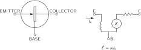

There is one remarkable thing about transistor and radio tube circuits which is different from circuits containing only impedances: the real part of the effective impedance z_{\text{eff}} can become negative. We have seen that the real part of z represents the loss of energy. But it is the important characteristic of transistors and tubes that they supply energy to the circuit. (Of course they don’t just “make” energy; they take energy from the dc circuits of the power supplies and convert it into ac energy.) So it is possible to have a circuit with a negative resistance. Such a circuit has the property that if you connect it to an impedance with a positive real part, i.e., a positive resistance, and arrange matters so that the sum of the two real parts is exactly zero, then there is no dissipation in the combined circuit. If there is no loss of energy, any alternating voltage once started will remain forever. This is the basic idea behind the operation of an oscillator or signal generator which can be used as a source of alternating voltage at any desired frequency.
