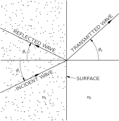
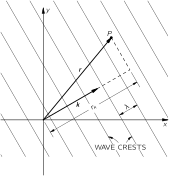
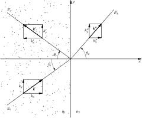
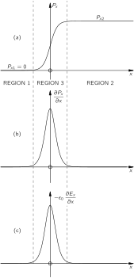
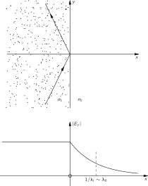
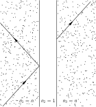
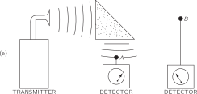

# 33. Reflection from Surfaces

## 33–1 Reflection and refraction of light

### Figure Ch33-F1
Caption: Fig. 33–1.Reflection and refraction of light waves at a surface. (The wave directions are normal to the wave crests.)
Image: figures/Ch33-F1.svg

The subject of this chapter is the reflection and refraction of light—or electromagnetic waves in general—at surfaces. We have already discussed the laws of reflection and refraction in Chapters 26 and 33 of Volume I. Here’s what we found out there: The angle of reflection is equal to the angle of incidence. With the angles defined as shown in Fig. 33-1 ,

\theta_r=\theta_i. (33.1)

The product n\sin\theta is the same for the incident and transmitted beams (Snell’s law):

n_1\sin\theta_i=n_2\sin\theta_t. (33.2)

The intensity of the reflected light depends on the angle of incidence and also on the direction of polarization. For \mathbf{E} perpendicular to the plane of incidence, the reflection coefficient R_\perp is

R_\perp=\frac{I_r}{I_i}=\frac{\sin^2(\theta_i-\theta_t)} {\sin^2(\theta_i+\theta_t)}. (33.3)

For \mathbf{E} parallel to the plane of incidence, the reflection coefficient R_{\parallel} is

R_\parallel=\frac{I_r}{I_i}=\frac{\tan^2(\theta_i-\theta_t)} {\tan^2(\theta_i+\theta_t)}. (33.4)

For normal incidence (any polarization, of course!),

\frac{I_r}{I_i}=\biggl(\frac{n_2-n_1}{n_2+n_1}\biggr)^2. (33.5)

(Earlier, we used i for the incident angle and r for the refracted angle. Since we can’t use r for both “refracted” and “reflected” angles, we are now using \theta_i={} incident angle, \theta_r={} reflected angle, and \theta_t={} transmitted angle.)

Our earlier discussion is really about as far as anyone would normally need to go with the subject, but we are going to do it all over again a different way. Why? One reason is that we assumed before that the indexes were real (no absorption in the materials). But another reason is that you should know how to deal with what happens to waves at surfaces from the point of view of Maxwell’s equations. We’ll get the same answers as before, but now from a straightforward solution of the wave problem, rather than by some clever arguments.

We want to emphasize that the amplitude of a surface reflection is not a property of the material, as is the index of refraction. It is a “surface property,” one that depends precisely on how the surface is made. A thin layer of extraneous junk on the surface between two materials of indices n_1 and n_2 will usually change the reflection. (There are all kinds of possibilities of interference here—like the colors of oil films. Suitable thickness can even reduce the reflected amplitude to zero for a given frequency; that’s how coated lenses are made.) The formulas we will derive are correct only if the change of index is sudden—within a distance very small compared with one wavelength. For light, the wavelength is about 5000 Å, so by a “smooth” surface we mean one in which the conditions change in going a distance of only a few atoms (or a few angstroms). Our equations will work for light for highly polished surfaces. In general, if the index changes gradually over a distance of several wavelengths, there is very little reflection at all.

## 33–2 Waves in dense materials

First, we remind you about the convenient way of describing a sinusoidal plane wave we used in Chapter 34 of Volume I. Any field component in the wave (we use E as an example) can be written in the form

E=E_0e^{i(\omega t-\mathbf{k}\cdot\mathbf{r})}, (33.6)

where E represents the amplitude at the point \mathbf{r} (from the origin) at the time t . The vector \mathbf{k} points in the direction the wave is travelling, and its magnitude \left|\mathbf{k}\right|= k= 2\pi/\lambda is the wave number. The phase velocity of the wave is v_{\text{ph}}=\omega/k ; for a light wave in a material of index n , v_{\text{ph}}=c/n , so

k=\frac{\omega n}{c}. (33.7)

Suppose \mathbf{k} is in the z -direction; then \mathbf{k}\cdot\mathbf{r} is just kz , as we have often used it. For \mathbf{k} in any other direction, we should replace z by r_k , the distance from the origin in the \mathbf{k} -direction; that is, we should replace kz by kr_k , which is just \mathbf{k}\cdot\mathbf{r} . (See Fig. 33–2 .) So Eq. ( 33.6) is a convenient representation of a wave in any direction.

### Figure Ch33-F2
Caption: Fig. 33–2.For a wave moving in the direction k\Figk, the phase at any point PP is (ωt−k⋅r)(\omega t-\Figk\cdot\Figr).
Image: figures/Ch33-F2.svg

We must remember, of course, that

\mathbf{k}\cdot\mathbf{r}=k_xx+k_yy+k_zz,

where k_x , k_y , and k_z are the components of \mathbf{k} along the three axes. In fact, we pointed out once that (\omega,k_x,k_y,k_z) is a four-vector, and that its scalar product with (t,x,y,z) is an invariant. So the phase of a wave is an invariant, and Eq. ( 33.6) could be written

E=E_0e^{ik_\mu x_\mu}.

But we don’t need to be that fancy now.

For a sinusoidal E , as in Eq. ( 33.6), \frac{\partial E}{\partial t} is the same as i\omega E , and \frac{\partial E}{\partial x} is -ik_xE , and so on for the other components. You can see why it is very convenient to use the form in Eq. ( 33.6) when working with differential equations—differentiations are replaced by multiplications. One further useful point: The operation \boldsymbol{\nabla}=(\frac{\partial }{\partial x},\frac{\partial }{\partial y},\frac{\partial }{\partial z}) gets replaced by the three multiplications (-ik_x,-ik_y,-ik_z) . But these three factors transform as the components of the vector \mathbf{k} , so the operator \boldsymbol{\nabla} gets replaced by multiplication with -i\mathbf{k} :

\begin{aligned} &\frac{\partial }{\partial t}\to i\omega,\\[1ex] &\boldsymbol{\nabla}\to-i\mathbf{k}. \end{aligned} (33.8)

This remains true for any \boldsymbol{\nabla} operation—whether it is the gradient, or the divergence, or the curl. For instance, the z -component of \mathbf{c}url{\mathbf{E}} is

\frac{\partial E_y}{\partial x}-\frac{\partial E_x}{\partial y}.

If both E_y and E_x vary as e^{-i\mathbf{k}\cdot\mathbf{r}} , then we get

-ik_xE_y+ik_yE_x,

which is, you see, the z -component of -i\mathbf{k}\times\mathbf{E} .

So we have the very useful general fact that whenever you have to take the gradient of a vector that varies as a wave in three dimensions (they are an important part of physics), you can always take the derivations quickly and almost without thinking by remembering that the operation \boldsymbol{\nabla} is equivalent to multiplication by -i\mathbf{k} .

For instance, the Faraday equation

\mathbf{c}url{\mathbf{E}}=-\frac{\partial \mathbf{B}}{\partial t}

becomes for a wave

-i\mathbf{k}\times\mathbf{E}=-i\omega\mathbf{B}.

This tells us that

\mathbf{B}=\frac{\mathbf{k}\times\mathbf{E}}{\omega}, (33.9)

which corresponds to the result we found earlier for waves in free space—that \mathbf{B} , in a wave, is at right angles to \mathbf{E} and to the wave direction. (In free space, \omega/k=c .) You can remember the sign in Eq. ( 33.9) from the fact that \mathbf{k} is in the direction of Poynting’s vector \FLPS=\epsilon_0 c^2\mathbf{E}\times\mathbf{B} .

If you use the same rule with the other Maxwell equations, you get again the results of the last chapter and, in particular, that

\mathbf{k}\cdot\mathbf{k}=k^2=\frac{\omega^2n^2}{c^2}. (33.10)

But since we know that, we won’t do it again.

If you want to entertain yourself, you can try the following terrifying problem that was the ultimate test for graduate students back in 1890: solve Maxwell’s equations for plane waves in an anisotropic crystal, that is, when the polarization \FLPP is related to the electric field \mathbf{E} by a tensor of polarizability. You should, of course, choose your axes along the principal axes of the tensor, so that the relations are simplest (then P_x=\alpha_aE_x , P_y=\alpha_bE_y , and P_z=\alpha_cE_z ), but let the waves have an arbitrary direction and polarization. You should be able to find the relations between \mathbf{E} and \mathbf{B} , and how \mathbf{k} varies with direction and wave polarization. Then you will understand the optics of an anisotropic crystal. It would be best to start with the simpler case of a birefringent crystal—like calcite—for which two of the polarizabilities are equal (say, \alpha_b=\alpha_c ), and see if you can understand why you see double when you look through such a crystal. If you can do that, then try the hardest case, in which all three \alpha ’s are different. Then you will know whether you are up to the level of a graduate student of 1890. In this chapter, however, we will consider only isotropic substances.

We know from experience that when a plane wave arrives at the boundary between two different materials—say, air and glass, or water and oil—there is a wave reflected and a wave transmitted. Suppose we assume no more than that and see what we can work out. We choose our axes with the yz -plane in the surface and the xy -plane perpendicular to the incident wave surfaces, as shown in Fig. 33–3 .

### Figure Ch33-F3
Caption: Fig. 33–3.The propagation vectors k\Figk, k′\Figk', and k″\Figk'' for the incident, reflected, and transmitted waves.
Image: figures/Ch33-F3.svg

The electric vector of the incident wave can then be written as

\mathbf{E}_i=\mathbf{E}_0e^{i(\omega t-\mathbf{k}\cdot\mathbf{r})}. (33.11)

Since \mathbf{k} is perpendicular to the z -axis,

\mathbf{k}\cdot\mathbf{r}=k_xx+k_yy. (33.12)

We write the reflected wave as

\mathbf{E}_r=\mathbf{E}_0'e^{i(\omega't-\mathbf{k}'\cdot\mathbf{r})}, (33.13)

so that its frequency is \omega' , its wave number is \mathbf{k}' , and its amplitude is \mathbf{E}_0' . (We know, of course, that the frequency is the same and the magnitude of \mathbf{k}' is the same as for the incident wave, but we are not going to assume even that. We will let it come out of the mathematical machinery.) Finally, we write for the transmitted wave,

\mathbf{E}_t=\mathbf{E}_0''e^{i(\omega''t-\mathbf{k}''\cdot\mathbf{r})}. (33.14)

We know that one of Maxwell’s equations gives Eq. ( 33.9), so for each of the waves we have

\mathbf{B}_i=\frac{\mathbf{k}\times\mathbf{E}_i}{\omega},\quad \mathbf{B}_r=\frac{\mathbf{k}'\times\mathbf{E}_r}{\omega'},\quad \mathbf{B}_t=\frac{\mathbf{k}''\times\mathbf{E}_t}{\omega''}. (33.15)

Also, if we call the indexes of the two media n_1 and n_2 , we have from Eq. ( 33.10)

k^2=k_x^2+k_y^2=\frac{\omega^2n_1^2}{c^2}. (33.16)

Since the reflected wave is in the same material, then

k'^2=\frac{\omega'^2n_1^2}{c^2} (33.17)

whereas for the transmitted wave,

k''^2=\frac{\omega''^2n_2^2}{c^2}. (33.18)

## 33–3 The boundary conditions

All we have done so far is to describe the three waves; our problem now is to work out the parameters of the reflected and transmitted waves in terms of those of the incident wave. How can we do that? The three waves we have described satisfy Maxwell’s equations in the uniform material, but Maxwell’s equations must also be satisfied at the boundary between the two different materials. So we must now look at what happens right at the boundary. We will find that Maxwell’s equations demand that the three waves fit together in a certain way.

### Figure Ch33-F4
Caption: Fig. 33–4.A boundary condition [math]E_{y2}=E_{y1} is obtained from [math]\oint_\Gamma\FigE\cdot d\Figs = 0.
Image: figures/Ch33-F4.svg
![Fig. 33–4.A boundary condition [math]E_{y2}=E_{y1} is obtained from [math]\oint_\Gamma\FigE\cdot d\Figs = 0.](figures/Ch33-F4.svg)

As an example of what we mean, the y -component of the electric field \mathbf{E} must be the same on both sides of the boundary. This is required by Faraday’s law,

\mathbf{c}url{\mathbf{E}}=-\frac{\partial \mathbf{B}}{\partial t}, (33.19)

as we can see in the following way. Consider a little rectangular loop \Gamma which straddles the boundary, as shown in Fig. 33–4 . Equation ( 33.19) says that the line integral of \mathbf{E} around \Gamma is equal to the rate of change of the flux of \mathbf{B} through the loop:

\oint_\Gamma\mathbf{E}\cdot d\mathbf{s}=-\frac{\partial }{\partial t}\int\mathbf{B}\cdot\FLPn\,da.

Now imagine that the rectangle is very narrow, so that the loop encloses an infinitesimal area. If \mathbf{B} remains finite (and there’s no reason it should be infinite at the boundary!) the flux through the area is zero. So the line integral of \mathbf{E} must be zero. If E_{y1} and E_{y2} are the components of the field on the two sides of the boundary and if the length of the rectangle is l , we have

E_{y1}l-E_{y2}l=0

or

E_{y1}=E_{y2}, (33.20)

as we have said. This gives us one relation among the fields of the three waves.

The procedure of working out the consequences of Maxwell’s equations at the boundary is called “determining the boundary conditions.” Ordinarily, it is done by finding as many equations like Eq. ( 33.20) as one can, by making arguments about little rectangles like \Gamma in Fig. 33–4 , or by using little Gaussian surfaces that straddle the boundary. Although that is a perfectly good way of proceeding, it gives the impression that the problem of dealing with a boundary is different for every different physical problem.

For example, in a problem of heat flow across a boundary, how are the temperatures on the two sides related? Well, you could argue, for one thing, that the heat flow to the boundary from one side would have to equal the flow away from the other side. It is usually possible, and generally quite useful, to work out the boundary conditions by making such physical arguments. There may be times, however, when in working on some problem you have only some equations, and you may not see right away what physical arguments to use. So although we are at the moment interested only in an electromagnetic problem, where we can make the physical arguments, we want to show you a method that can be used for any problem—a general way of finding what happens at a boundary directly from the differential equations.

We begin by writing all the Maxwell equations for a dielectric—and this time we are very specific and write out explicitly all the components:

\begin{aligned} &\mathbf{d}iv{\mathbf{E}}=-\frac{\mathbf{d}iv{\FLPP}}{\epsilon_0}\\[1ex] &\quad \epsilon_0\biggl(\frac{\partial E_x}{\partial x}\!+\!\frac{\partial E_y}{\partial y}\!+\!\frac{\partial E_z}{\partial z}\biggr)= -\biggl(\frac{\partial P_x}{\partial x}\!+\!\frac{\partial P_y}{\partial y}\!+\!\frac{\partial P_z}{\partial z}\biggr)\\[2ex] % ebook insert: &\mathbf{c}url{\mathbf{E}}=-\frac{\partial \mathbf{B}}{\partial t}\\[1ex] % ebook indent &\quad \frac{\partial E_z}{\partial y}-\frac{\partial E_y}{\partial z}=-\frac{\partial B_x}{\partial t}\\[.75ex] &\quad \frac{\partial E_x}{\partial z}-\frac{\partial E_z}{\partial x}=-\frac{\partial B_y}{\partial t}\\[.75ex] &\quad \frac{\partial E_y}{\partial x}-\frac{\partial E_x}{\partial y}=-\frac{\partial B_z}{\partial t}\\[2ex] &\mathbf{d}iv{\mathbf{B}}=0\\[1.75ex] &\quad \frac{\partial B_x}{\partial x}+\frac{\partial B_y}{\partial y}+\frac{\partial B_z}{\partial z}=0\\[2ex] % ebook insert: &c^2\mathbf{c}url{\mathbf{B}}=\frac{1}{\epsilon_0}\,\frac{\partial \FLPP}{\partial t}+\frac{\partial \mathbf{E}}{\partial t}\\[1ex] % ebook indent &\quad c^2\biggl(\frac{\partial B_z}{\partial y}-\frac{\partial B_y}{\partial z}\biggr)= \frac{1}{\epsilon_0}\,\frac{\partial P_x}{\partial t}+\frac{\partial E_x}{\partial t}\\[.75ex] &\quad c^2\biggl(\frac{\partial B_x}{\partial z}-\frac{\partial B_z}{\partial x}\biggr)= \frac{1}{\epsilon_0}\,\frac{\partial P_y}{\partial t}+\frac{\partial E_y}{\partial t}\\[.75ex] &\quad c^2\biggl(\frac{\partial B_y}{\partial x}-\frac{\partial B_x}{\partial y}\biggr)= \frac{1}{\epsilon_0}\,\frac{\partial P_z}{\partial t}+\frac{\partial E_z}{\partial t} \end{aligned} (33.21)

Now these equations must all hold in region 1 (to the left of the boundary) and in region 2 (to the right of the boundary). We have already written the solutions in regions 1 and 2 . Finally, they must also be satisfied in the boundary, which we can call region 3 . Although we usually think of the boundary as being sharply discontinuous, in reality it is not. The physical properties change very rapidly but not infinitely fast. In any case, we can imagine that there is a very rapid, but continuous, transition of the index between region 1 and 2 , in a short distance we can call region 3 . Also, any field quantity like P_x , or E_y , etc., will make a similar kind of transition in region 3 . In this region, the differential equations must still be satisfied, and it is by following the differential equations in this region that we can arrive at the needed “boundary conditions.”

For instance, suppose that we have a boundary between vacuum (region 1 ) and glass (region 2 ). There is nothing to polarize in the vacuum, so \FLPP_1=0 . Let’s say there is some polarization \FLPP_2 in the glass. Between the vacuum and the glass there is a smooth, but rapid, transition. If we look at any component of \FLPP , say P_x , it might vary as drawn in Fig. 33–5 (a). Suppose now we take the first of our equations, Eq. ( 33.21). It involves derivatives of the components of \FLPP with respect to x , y , and z . The y - and z -derivatives are not interesting; nothing spectacular is happening in those directions. But the x -derivative of P_x will have some very large values in region 3 , because of the tremendous slope of P_x . The derivative \frac{\partial P_x}{\partial x} will have a sharp spike at the boundary, as shown in Fig. 33–5 (b). If we imagine squashing the boundary to an even thinner layer, the spike would get much higher. If the boundary is really sharp for the waves we are interested in, the magnitude of \frac{\partial P_x}{\partial x} in region 3 will be much, much greater than any contributions we might have from the variation of \FLPP in the wave away from the boundary—so we ignore any variations other than those due to the boundary.

### Figure Ch33-F5
Caption: Fig. 33–5.The fields in the transition region 3 between two different materials in regions 1 and 2.
Image: figures/Ch33-F5.svg

Now how can Eq. ( 33.21) be satisfied if there is a whopping big spike on the right-hand side? Only if there is an equally whopping big spike on the other side. Something on the left-hand side must also be big. The only candidate is \frac{\partial E_x}{\partial x} , because the variations with y and z are only those small effects in the wave we just mentioned. So -\epsilon_0(\frac{\partial E_x}{\partial x}) must be as drawn in Fig. 33–5 (c)—just a copy of \frac{\partial P_x}{\partial x} . We have that

\epsilon_0\,\frac{\partial E_x}{\partial x}=-\frac{\partial P_x}{\partial x}.

If we integrate this equation with respect to x across region 3 , we conclude that

\epsilon_0(E_{x2}-E_{x1})=-(P_{x2}-P_{x1}). (33.25)

In other words, the jump in \epsilon_0 E_x in going from region 1 to region 2 must be equal to the jump in -P_x .

We can rewrite Eq. ( 33.25) as

\epsilon_0 E_{x2}+P_{x2}=\epsilon_0 E_{x1}+P_{x1}, (33.26)

which says that the quantity (\epsilon_0 E_x+P_x) has equal values in region 2 and region 1 . People say: the quantity (\epsilon_0 E_x+P_x) is continuous across the boundary. We have, in this way, one of our boundary conditions.

Although we took as an illustration the case in which \FLPP_1 was zero because region 1 was a vacuum, it is clear that the same argument applies for any two materials in the two regions, so Eq. ( 33.26) is true in general.

Let’s now go through the rest of Maxwell’s equations and see what each of them tells us. We take next Eq. ( 33.22a). There are no x -derivatives, so it doesn’t tell us anything. (Remember that the fields themselves do not get especially large at the boundary; only the derivatives with respect to x can become so huge that they dominate the equation.) Next, we look at Eq. ( 33.22b). Ah! There is an x -derivative! We have \frac{\partial E_z}{\partial x} on the left-hand side. Suppose it has a huge derivative. But wait a moment! There is nothing on the right-hand side to match it with; therefore E_z cannot have any jump in going from region 1 to region 2 . [If it did, there would be a spike on the left of Eq. ( 33.22b) but none on the right, and the equation would be false.] So we have a new condition:

E_{z2}=E_{z1}. (33.27)

By the same argument, Eq. ( 33.22c) gives

E_{y2}=E_{y1}. (33.28)

This last result is just what we got in Eq. ( 33.20) by a line integral argument.

We go on to Eq. ( 33.23). The only term that could have a spike is \frac{\partial B_x}{\partial x} . But there’s nothing on the right to match it, so we conclude that

B_{x2}=B_{x1}. (33.29)

On to the last of Maxwell’s equations! Equation ( 33.24a) gives nothing, because there are no x -derivatives. Equation ( 33.24b) has one, -c^2\,\frac{\partial B_z}{\partial x} , but again, there is nothing to match it with. We get

B_{z2}=B_{z1}. (33.30)

The last equation is quite similar, and gives

B_{y2}=B_{y1}. (33.31)

The last three equations gives us that \mathbf{B}_2=\mathbf{B}_1 . We want to emphasize, however, that we get this result only when the materials on both sides of the boundary are nonmagnetic—or rather, when we can neglect any magnetic effects of the materials. This can usually be done for most materials, except ferromagnetic ones. (We will treat the magnetic properties of materials in some later chapters.)

| (\epsilon_0\mathbf{E}_1+\FLPP_1)_x=(\epsilon_0\mathbf{E}_2+\FLPP_2)_x |
| --- |
| (\mathbf{E}_1)_y=(\mathbf{E}_2)_y |
| (\mathbf{E}_1)_z=(\mathbf{E}_2)_z |
| \mathbf{B}_1=\mathbf{B}_2 |
| (The surface is in the yz -plane) |

Our program has netted us the six relations between the fields in region 1 and those in region 2 . We have put them all together in Table 33–1 . We can now use them to match the waves in the two regions. We want to emphasize, however, that the idea we have just used will work in any physical situation in which you have differential equations and you want a solution that crosses a sharp boundary between two regions where some property changes. For our present purposes, we could have easily derived the same equations by using arguments about the fluxes and circulations at the boundary. (You might see whether you can get the same result that way.) But now you have seen a method that will work in case you ever get stuck and don’t see any easy argument about the physics of what is happening at the boundary—you can just work with the equations.

## 33–4 The reflected and transmitted waves

Now we are ready to apply our boundary conditions to the waves we wrote down in Section 33–2 . We had:

\begin{aligned} \mathbf{E}_i&=\mathbf{E}_0e^{i(\omega t-k_xx-k_yy)},\\[1.3ex] \mathbf{E}_r&=\mathbf{E}_0'e^{i(\omega't-k_x'x-k_y'y)},\\[1.3ex] \mathbf{E}_t&=\mathbf{E}_0''e^{i(\omega''t-k_x''x-k_y''y)},\\[1.5ex] \mathbf{B}_i&=\frac{\mathbf{k}\times\mathbf{E}_i}{\omega},\\[1ex] \mathbf{B}_r&=\frac{\mathbf{k}'\times\mathbf{E}_r}{\omega'},\\[1ex] \mathbf{B}_t&=\frac{\mathbf{k}''\times\mathbf{E}_t}{\omega''}. \end{aligned} (33.32)

We have one further bit of knowledge: \mathbf{E} is perpendicular to its propagation vector \mathbf{k} for each wave.

The results will depend on the direction of the \mathbf{E} -vector (the “polarization”) of the incoming wave. The analysis is much simplified if we treat separately the case of an incident wave with its \mathbf{E} -vector parallel to the “plane of incidence” (that is, the xy -plane) and the case of an incident wave with the \mathbf{E} -vector perpendicular to the plane of incidence. A wave of any other polarization is just a linear combination of two such waves. In other words, the reflected and transmitted intensities are different for different polarizations, and it is easiest to pick the two simplest cases and treat them separately.

We will carry through the analysis for an incoming wave polarized perpendicular to the plane of incidence and then just give you the result for the other. We are cheating a little by taking the simplest case, but the principle is the same for both. So we take that \mathbf{E}_i has only a z -component, and since all the \mathbf{E} -vectors are in the same direction we can leave off the vector signs.

### Figure Ch33-F6
Caption: Fig. 33–6.Polarization of the reflected and transmitted waves when the [math]\FigE-field of the incident wave is perpendicular to the plane of incidence.
Image: figures/Ch33-F6.svg
![Fig. 33–6.Polarization of the reflected and transmitted waves when the [math]\FigE-field of the incident wave is perpendicular to the plane of incidence.](figures/Ch33-F6.svg)

So long as both materials are isotropic, the induced oscillations of charges in the material will also be in the z -direction, and the \mathbf{E} -field of the transmitted and radiated waves will have only z -components. So for all the waves, E_x and E_y and P_x and P_y are zero. The waves will have their \mathbf{E} - and \mathbf{B} -vectors as drawn in Fig. 33–6 . (We are cutting a corner here on our original plan of getting everything from the equations. This result would also come out of the boundary conditions, but we can save a lot of algebra by using the physical argument. When you have some spare time, see if you can get the same result from the equations. It is clear that what we have said agrees with the equations; it is just that we have not shown that there are no other possibilities.)

Now our boundary conditions, Eqs. ( 33.26) through ( 33.31), give relations between the components of \mathbf{E} and \mathbf{B} in regions 1 and 2 . For region 2 we have only the transmitted wave, but in region 1 we have two waves. Which one do we use? The fields in region 1 are, of course, the superposition of the fields of the incident and reflected waves. (Since each satisfies Maxwell’s equations, so does the sum.) So when we use the boundary conditions, we must use that

\mathbf{E}_1=\mathbf{E}_i+\mathbf{E}_r,\quad \mathbf{E}_2=\mathbf{E}_t,

and similarly for the \mathbf{B} ’s.

For the polarization we are considering, Eqs. ( 33.26) and ( 33.28) give us no new information; only Eq. ( 33.27) is useful. It says that

E_i+E_r=E_t,

at the boundary, that is, for x=0 . So we have that

E_0e^{i(\omega t-k_yy)}+E_0'e^{i(\omega't-k_y'y)}= E_0''e^{i(\omega''t-k_y''y)}, (33.38)

which must be true for all t and for all y . Suppose we look first at y=0 . Then we have

E_0e^{i\omega t}+E_0'e^{i\omega't}= E_0''e^{i\omega''t}.

This equation says that two oscillating terms are equal to a third oscillation. That can happen only if all the oscillations have the same frequency. (It is impossible for three—or any number—of such terms with different frequencies to add to zero for all times.) So

\omega''=\omega'=\omega. (33.39)

As we knew all along, the frequencies of the reflected and transmitted waves are the same as that of the incident wave.

We should really have saved ourselves some trouble by putting that in at the beginning, but we wanted to show you that it can also be got out of the equations. When you are doing a real problem, it is usually the best thing to put everything you know into the works right at the start and save yourself a lot of trouble.

By definition, the magnitude of \mathbf{k} is given by k^2=n^2\omega^2/c^2 , so we have also that

\frac{k''^2}{n_2^2}=\frac{k'^2}{n_1^2}=\frac{k^2}{n_1^2}. (33.40)

Now look at Eq. ( 33.38) for t=0 . Using again the same kind of argument we have just made, but this time based on the fact that the equation must hold for all values of y , we get that

k_y''=k_y'=k_y. (33.41)

From Eq. ( 33.40), k'^2=k^2 , so

k_x'^2+k_y'^2=k_x^2+k_y^2.

Combining this with Eq. ( 33.41), we have that

k_x'^2=k_x^2,

or that k_x'=\pm k_x . The positive sign makes no sense; that would not give a reflected wave, but another incident wave, and we said at the start that we were solving the problem of only one incident wave. So we have

k_x'=-k_x. (33.42)

The two equations ( 33.41) and ( 33.42) give us that the angle of reflection is equal to the angle of incidence, as we expected. (See Fig. 33–3 .) The reflected wave is

E_r=E_0'e^{i(\omega t+k_xx-k_yy)}. (33.43)

For the transmitted wave we already have that

k_y''=k_y,

and

\frac{k''^2}{n_2^2}=\frac{k^2}{n_1^2}; (33.44)

so we can solve these to find k_x'' . We get

k_x''^2=k''^2-k_y''^2=\frac{n_2^2}{n_1^2}\,k^2-k_y^2. (33.45)

Suppose for a moment that n_1 and n_2 are real numbers (that the imaginary parts of the indexes are very small). Then all the k ’s are also real numbers, and from Fig. 33–3 we find that

\frac{k_y}{k}=\sin\theta_i,\quad \frac{k_y''}{k''}=\sin\theta_t. (33.46)

From ( 33.44) we get that

n_2\sin\theta_t=n_1\sin\theta_i, (33.47)

which is Snell’s law of refraction—again, something we already knew. If the indexes are not real, the wave numbers are complex, and we have to use Eq. ( 33.45). [We could still define the angles \theta_i and \theta_t by Eq. ( 33.46), and Snell’s law, Eq. ( 33.47), would be true in general. But then the “angles” also are complex numbers, thereby losing their simple geometrical interpretation as angles. It is best then to describe the behavior of the waves by their complex k_x or k_x'' values.]

So far, we haven’t found anything new. We have just had the simple-minded delight of getting some obvious answers from a complicated mathematical machinery. Now we are ready to find the amplitudes of the waves which we have not yet known. Using our results for the \omega ’s and k ’s, the exponential factors in Eq. ( 33.38) can be cancelled, and we get

E_0+E_0'=E_0''. (33.48)

Since both E_0' and E_0'' are unknown, we need one more relationship. We must use another of the boundary conditions. The equations for E_x and E_y are no help, because all the \mathbf{E} ’s have only a z -component. So we must use the conditions on \mathbf{B} . Let’s try Eq. ( 33.29):

B_{x2}=B_{x1}.

From Eqs. ( 33.35) through ( 33.37),

\begin{aligned} B_{xi}&=\frac{k_yE_i}{\omega},\\[1ex] B_{xr}&=\frac{k_y'E_r}{\omega'},\\[1ex] B_{xt}&=\frac{k_y''E_t}{\omega''}. \end{aligned}

Recalling that \omega''=\omega'=\omega and k_y''=k_y'=k_y , we get that

E_0+E_0'=E_0''.

But this is just Eq. ( 33.48) all over again! We’ve just wasted time getting something we already knew.

We could try Eq. ( 33.30), B_{z2}=B_{z1} , but there are no z -components of \mathbf{B} ! So there’s only one equation left: Eq. ( 33.31), B_{y2}=B_{y1} . For the three waves:

\begin{aligned} B_{yi}=-\frac{k_xE_i}{\omega},\\[1ex] B_{yr}=-\frac{k_x'E_r}{\omega'},\\[1ex] B_{yt}=-\frac{k_x''E_t}{\omega''}. \end{aligned} (33.49)

Putting for E_i , E_r , and E_t the wave expression for x=0 (to be at the boundary), the boundary condition is

\frac{k_x}{\omega}\,E_0e^{i(\omega t-k_yy)}+ \frac{k_x'}{\omega'}\,E_0'e^{i(\omega't-k_y'y)}= \frac{k_x''}{\omega''}\,E_0''e^{i(\omega''t-k_y''y)}.

Again all \omega ’s and k_y ’s are equal, so this reduces to

k_xE_0+k_x'E_0'=k_x''E_0''. (33.50)

This gives us an equation for the E ’s that is different from Eq. ( 33.48). With the two, we can solve for E_0' and E_0'' . Remembering that k_x'=-k_x , we get

\begin{aligned} E_0'&=\frac{k_x-k_x''}{k_x+k_x''}\,E_0,\\[1ex] E_0''&=\frac{2k_x}{k_x+k_x''}\,E_0. \end{aligned} (33.51)

These, together with Eq. ( 33.45) or Eq. ( 33.46) for k_x'' , give us what we wanted to know. We will discuss the consequences of this result in the next section.

### Figure Ch33-F7
Caption: Fig. 33–7.Polarization of the waves when the [math]\FigE-field of the incident wave is parallel to the plane of incidence.
Image: figures/Ch33-F7.svg
![Fig. 33–7.Polarization of the waves when the [math]\FigE-field of the incident wave is parallel to the plane of incidence.](figures/Ch33-F7.svg)

If we begin with a wave polarized with its \mathbf{E} -vector parallel to the plane of incidence, \mathbf{E} will have both x - and y -components, as shown in Fig. 33–7. The algebra is straightforward but more complicated. (The work can be somewhat reduced by expressing things in this case in terms of the magnetic fields, which are all in the z -direction.) One finds that

\left|E_0'\right|=\frac{n_2^2k_x-n_1^2k_x''}{n_2^2k_x+n_1^2k_x''}\, \left|E_0\right| (33.53)

and

\left|E_0''\right|=\frac{2n_1n_2k_x}{n_2^2k_x+n_1^2k_x''}\, \left|E_0\right|. (33.54)

Let’s see whether our results agree with those we got earlier. Equation ( 33.3) is the result we worked out in Chapter 33 of Volume I for the ratio of the intensity of the reflected wave to the intensity of the incident wave. Then, however, we were considering only real indexes. For real indexes (and k ’s), we can write

\begin{aligned} k_x=k\cos\theta_i=\frac{\omega n_1}{c}\cos\theta_i,\\[1ex] k_x''=k''\cos\theta_t=\frac{\omega n_2}{c}\cos\theta_t. \end{aligned}

Substituting in Eq. ( 33.51), we have

\frac{E_0'}{E_0}=\frac{n_1\cos\theta_i-n_2\cos\theta_t} {n_1\cos\theta_i+n_2\cos\theta_t}, (33.55)

which does not look the same as Eq. ( 33.3). It will, however, if we use Snell’s law to get rid of the n ’s. Setting n_2=n_1\sin\theta_i/\sin\theta_t , and multiplying the numerator and denominator by \sin\theta_t , we get

\frac{E_0'}{E_0}=\frac{\cos\theta_i\sin\theta_t-\sin\theta_i\cos\theta_t} {\cos\theta_i\sin\theta_t+\sin\theta_i\cos\theta_t}.

The numerator and denominator are just the sines of -(\theta_i-\theta_t) and (\theta_i+\theta_t) ; we get

\frac{E_0'}{E_0}=-\frac{\sin(\theta_i-\theta_t)} {\sin(\theta_i+\theta_t)}. (33.56)

Since E_0' and E_0 are in the same material, the intensities are proportional to the squares of the electric fields, and we get the same result as before. Similarly, Eq. ( 33.53) is the same as Eq. ( 33.4).

For waves which arrive at normal incidence, \theta_i=0 and \theta_t=0 . Equation ( 33.56) gives 0/0 , which is not very useful. We can, however, go back to Eq. ( 33.55), which gives

\frac{I_r}{I_i}=\biggl(\frac{E_0'}{E_0}\biggr)^2=\biggl( \frac{n_1-n_2}{n_1+n_2}\biggr)^2. (33.57)

This result, naturally, applies for “either” polarization, since for normal incidence there is no special “plane of incidence.”

## 33–5 Reflection from metals

We can now use our results to understand the interesting phenomenon of reflection from metals. Why is it that metals are shiny? We saw in the last chapter that metals have an index of refraction which, for some frequencies, has a large imaginary part. Let’s see what we would get for the reflected intensity when light shines from air (with n=1 ) onto a material with n=-in_I . Then Eq. ( 33.55) gives (for normal incidence)

\frac{E_0'}{E_0}=\frac{1+in_I}{1-in_I}.

For the intensity of the reflected wave, we want the square of the absolute values of E_0' and E_0 :

\frac{I_r}{I_i}=\frac{\left|E_0'\right|^2}{\left|E_0\right|^2}= \frac{\left|1+in_I\right|^2}{\left|1-in_I\right|^2},

or

\frac{I_r}{I_i}=\frac{1+n_I^2}{1+n_I^2}=1. (33.58)

For a material with an index which is a pure imaginary number, there is 100 percent reflection!

Metals do not reflect 100 percent, but many do reflect visible light very well. In other words, the imaginary part of their indexes is very large. But we have seen that a large imaginary part of the index means a strong absorption. So there is a general rule that if any material gets to be a very good absorber at any frequency, the waves are strongly reflected at the surface and very little gets inside to be absorbed. You can see this effect with strong dyes. Pure crystals of the strongest dyes have a “metallic” shine. Probably you have noticed that at the edge of a bottle of purple ink the dried dye will give a golden metallic reflection, or that dried red ink will sometimes give a greenish metallic reflection. Red ink absorbs out the greens of transmitted light, so if the ink is very concentrated, it will exhibit a strong surface reflection for the frequencies of green light.

### Figure Ch33-F8
Caption: Fig. 33–8.A material which absorbs light strongly at the frequency [math]\omega also reflects light of that frequency.
Image: figures/Ch33-F8.svg
![Fig. 33–8.A material which absorbs light strongly at the frequency [math]\omega also reflects light of that frequency.](figures/Ch33-F8.svg)

You can easily show this effect by coating a glass plate with red ink and letting it dry. If you direct a beam of white light at the back of the plate, as shown in Fig. 33–8, there will be a transmitted beam of red light and a reflected beam of green light.

## 33–6 Total internal reflection

If light goes from a material like glass, with a real index n greater than 1 , toward, say, air, with an index n_2 equal to 1 , Snell’s law says that

\sin\theta_t=n\sin\theta_i.

The angle \theta_t of the transmitted wave becomes 90^\circ when the incident angle \theta_i is equal to the “critical angle” \theta_c given by

n\sin\theta_c=1. (33.59)

What happens for \theta_i greater than the critical angle? You know that there is total internal reflection. But how does that come about?

Let’s go back to Eq. ( 33.45) which gives the wave number k_x'' for the transmitted wave. We would have

k_x''^2=\frac{k^2}{n^2}-k_y^2.

Now k_y=k\sin\theta_i and k=\omega n/c , so

k_x''^2=\frac{\omega^2}{c^2}\,(1-n^2\sin^2\theta_i).

If n\sin\theta_i is greater than one, k_x''^2 is negative and k_x'' is a pure imaginary, say \pm ik_I . You know by now what that means! The “transmitted” wave (Eq. 33.34) will have the form

\mathbf{E}_t=\mathbf{E}_0''e^{\pm k_Ix}e^{i(\omega t-k_yy)}.

The wave amplitude either grows or drops off exponentially with increasing x . Clearly, what we want here is the negative sign. Then the amplitude of the wave to the right of the boundary will go as shown in Fig. 33–9. Notice that k_I is around \omega/c —which is of the order 1/\lambda_0 , the reciprocal of the free-space wavelength of the light. When light is totally reflected from the inside of a glass-air surface, there are fields in the air, but they extend beyond the surface only a distance of the order of the wavelength of the light.

### Figure Ch33-F9
Caption: Fig. 33–9.Total internal reflection.
Image: figures/Ch33-F9.svg

We can now see how to answer the following question: If a light wave in glass arrives at the surface at a large enough angle, it is reflected; if another piece of glass is brought up to the surface (so that the “surface” in effect disappears) the light is transmitted. Exactly when does this happen? Surely there must be continuous change from total reflection to no reflection! The answer, of course, is that if the air gap is so small that the exponential tail of the wave in the air has an appreciable strength at the second piece of glass, it will shake the electrons there and generate a new wave, as shown in Fig. 33–10. Some light will be transmitted. (Clearly, our solution is incomplete; we should solve all the equations again for a thin layer of air between two regions of glass.)

### Figure Ch33-F10
Caption: Fig. 33–10.If there is a small gap, internal reflection is not “total;” a transmitted wave appears beyond the gap.
Image: figures/Ch33-F10.svg

This transmission effect can be observed with ordinary light only if the air gap is very small (of the order of the wavelength of light, like 10^{-5} cm), but it is easily demonstrated with three-centimeter waves. Then the exponentially decreasing field extends several centimeters. A microwave apparatus that shows the effect is drawn in Fig. 33–11. Waves from a small three-centimeter transmitter are directed at a 45^\circ prism of paraffin. The index of refraction of paraffin for these frequencies is 1.50 , and therefore the critical angle is 41.5^\circ . So the wave is totally reflected from the 45^\circ face and is picked up by detector A , as indicated in Fig. 33–11 (a). If a second paraffin prism is placed in contact with the first, as shown in part (b) of the figure, the wave passes straight through and is picked up at detector B . If a gap of a few centimeters is left between the two prisms, as in part (c), there are both transmitted and reflected waves. The electric field outside the 45^\circ face of the prism in Fig. 33–11 (a) can also be shown by bringing detector B to within a few centimeters of the surface.

### Figure Ch33-F11
Caption: Fig. 33–11.A demonstration of the penetration of internally reflected waves.
Image: figures/Ch33-F11.svg

