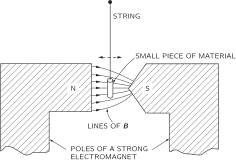
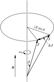
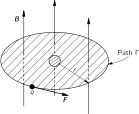

# 34. The Magnetism of Matter

## 34–1 Diamagnetism and paramagnetism

In this chapter we are going to talk about the magnetic properties of materials. The material which has the most striking magnetic properties is, of course, iron. Similar magnetic properties are shared also by the elements nickel, cobalt, and—at sufficiently low temperatures (below 16^\circ C)—by gadolinium, as well as by a number of peculiar alloys. That kind of magnetism, called ferromagnetism, is sufficiently striking and complicated that we will discuss it in a special chapter. However, all ordinary substances do show some magnetic effects, although very small ones—a thousand to a million times less than the effects in ferromagnetic materials. Here we are going to describe ordinary magnetism, that is to say, the magnetism of substances other than the ferromagnetic ones.

This small magnetism is of two kinds. Some materials are attracted toward magnetic fields; others are repelled. Unlike the electrical effect in matter, which always causes dielectrics to be attracted, there are two signs to the magnetic effect. These two signs can be easily shown with the help of a strong electromagnet which has one sharply pointed pole piece and one flat pole piece, as drawn in Fig. 34-1 . The magnetic field is much stronger near the pointed pole than near the flat pole. If a small piece of material is fastened to a long string and suspended between the poles, there will, in general, be a small force on it. This small force can be seen by the slight displacement of the hanging material when the magnet is turned on. The few ferromagnetic materials are attracted very strongly toward the pointed pole; all other materials feel only a very weak force. Some are weakly attracted to the pointed pole; and some are weakly repelled.

### Figure Ch34-F1
Caption: Fig. 34–1. A small cylinder of bismuth is weakly repelled by the sharp pole; a piece of aluminum is attracted.
Image: figures/Ch34-F1.svg

The effect is most easily seen with a small cylinder of bismuth, which is repelled from the high-field region. Substances which are repelled in this way are called diamagnetic. Bismuth is one of the strongest diamagnetic materials, but even with it, the effect is still quite weak. Diamagnetism is always very weak. If a small piece of aluminum is suspended between the poles, there is also a weak force, but toward the pointed pole. Substances like aluminum are called paramagnetic. (In such an experiment, eddy-current forces arise when the magnet is turned on and off, and these can give off strong impulses. You must be careful to look for the net displacement after the hanging object settles down.)

We want now to describe briefly the mechanisms of these two effects. First, in many substances the atoms have no permanent magnetic moments, or rather, all the magnets within each atom balance out so that the net moment of the atom is zero. The electron spins and orbital motions all exactly balance out, so that any particular atom has no average magnetic moment. In these circumstances, when you turn on a magnetic field little extra currents are generated inside the atom by induction. According to Lenz’s law, these currents are in such a direction as to oppose the increasing field. So the induced magnetic moments of the atoms are directed opposite to the magnetic field. This is the mechanism of diamagnetism.

Then there are some substances for which the atoms do have a permanent magnetic moment—in which the electron spins and orbits have a net circulating current that is not zero. So besides the diamagnetic effect (which is always present), there is also the possibility of lining up the individual atomic magnetic moments. In this case, the moments try to line up with the magnetic field (in the way the permanent dipoles of a dielectric are lined up by the electric field), and the induced magnetism tends to enhance the magnetic field. These are the paramagnetic substances. Paramagnetism is generally fairly weak because the lining-up forces are relatively small compared with the forces from the thermal motions which try to derange the order. It also follows that paramagnetism is usually sensitive to the temperature. (The paramagnetism arising from the spins of the electrons responsible for conduction in a metal constitutes an exception. We will not be discussing this phenomenon here.) For ordinary paramagnetism, the lower the temperature, the stronger the effect. There is more lining-up at low temperatures when the deranging effects of the collisions are less. Diamagnetism, on the other hand, is more or less independent of the temperature. In any substance with built-in magnetic moments there is a diamagnetic as well as a paramagnetic effect, but the paramagnetic effect usually dominates.

In Chapter 11 we described a ferroelectric material, in which all the electric dipoles get lined up by their own mutual electric fields. It is also possible to imagine the magnetic analog of ferroelectricity, in which all the atomic moments would line up and lock together. If you make calculations of how this should happen, you will find that because the magnetic forces are so much smaller than the electric forces, thermal motions should knock out this alignment even at temperatures as low as a few tenths of a degree Kelvin. So it would be impossible at room temperature to have any permanent lining up of the magnets.

On the other hand, this is exactly what does happen in iron—it does get lined up. There is an effective force between the magnetic moments of the different atoms of iron which is much, much greater than the direct magnetic interaction. It is an indirect effect which can be explained only by quantum mechanics. It is about ten thousand times stronger than the direct magnetic interaction, and is what lines up the moments in ferromagnetic materials. We discuss this special interaction in a later chapter.

Now that we have tried to give you a qualitative explanation of diamagnetism and paramagnetism, we must correct ourselves and say that it is not possible to understand the magnetic effects of materials in any honest way from the point of view of classical physics. Such magnetic effects are a completely quantum-mechanical phenomenon. It is, however, possible to make some phoney classical arguments and to get some idea of what is going on. We might put it this way. You can make some classical arguments and get guesses as to the behavior of the material, but these arguments are not “legal” in any sense because it is absolutely essential that quantum mechanics be involved in every one of these magnetic phenomena. On the other hand, there are situations, such as in a plasma or a region of space with many free electrons, where the electrons do obey the laws of classical mechanics. And in those circumstances, some of the theorems from classical magnetism are worthwhile. Also, the classical arguments are of some value for historical reasons. The first few times that people were able to guess at the meaning and behavior of magnetic materials, they used classical arguments. Finally, as we have already illustrated, classical mechanics can give us some useful guesses as to what might happen—even though the really honest way to study this subject would be to learn quantum mechanics first and then to understand the magnetism in terms of quantum mechanics.

On the other hand, we don’t want to wait until we learn quantum mechanics inside out to understand a simple thing like diamagnetism. We will have to lean on the classical mechanics as kind of half showing what happens, realizing, however, that the arguments are really not correct. We therefore make a series of theorems about classical magnetism that will confuse you because they will prove different things. Except for the last theorem, every one of them will be wrong. Furthermore, they will all be wrong as a description of the physical world, because quantum mechanics is left out.

## 34–2 Magnetic moments and angular momentum

The first theorem we want to prove from classical mechanics is the following: If an electron is moving in a circular orbit (for example, revolving around a nucleus under the influence of a central force), there is a definite ratio between the magnetic moment and the angular momentum. Let’s call \FLPJ the angular momentum and \FLPmu the magnetic moment of the electron in the orbit. The magnitude of the angular momentum is the mass of the electron times the velocity times the radius. (See Fig. 34-2 .) It is directed perpendicular to the plane of the orbit.

J=mvr. (34.1)

(This is, of course, a nonrelativistic formula, but it is a good approximation for atoms, because for the electrons involved v/c is generally of the order of e^2/\hbar c\approx1/137 , or about 1 percent.)

### Figure Ch34-F2
Caption: Fig. 34–2. For any circular orbit the magnetic moment μ\Figmu is q/2mq/2m times the angular momentum J\FigJ.
Image: figures/Ch34-F2.svg

The magnetic moment of the same orbit is the current times the area. (See Section 14-5 .) The current is the charge per unit time which passes any point on the orbit, namely, the charge q times the frequency of rotation. The frequency is the velocity divided by the circumference of the orbit; so

I=q\,\frac{v}{2\pi r}.

The area is \pi r^2 , so the magnetic moment is

\mu=\frac{qvr}{2}. (34.2)

It is also directed perpendicular to the plane of the orbit. So \FLPJ and \FLPmu are in the same direction:

\FLPmu=\frac{q}{2m}\,\FLPJ\:(\text{orbit}). (34.3)

Their ratio depends neither on the velocity nor on the radius. For any particle moving in a circular orbit the magnetic moment is equal to q/2m times the angular momentum. For an electron, the charge is negative—we can call it -q_e ; so for an electron

\FLPmu=-\frac{q_e}{2m}\,\FLPJ\:(\text{electron orbit}). (34.4)

That’s what we would expect classically and, miraculously enough, it is also true quantum-mechanically. It’s one of those things. However, if you keep going with the classical physics, you find other places where it gives the wrong answers, and it is a great game to try to remember which things are right and which things are wrong. We might as well give you immediately what is true in general in quantum mechanics. First, Eq. ( 34.4) is true for orbital motion, but that’s not the only magnetism that exists. The electron also has a spin rotation about its own axis (something like the earth rotating on its axis), and as a result of that spin it has both an angular momentum and a magnetic moment. But for reasons that are purely quantum-mechanical—there is no classical explanation—the ratio of \FLPmu to \FLPJ for the electron spin is twice as large as it is for orbital motion of the spinning electron:

\FLPmu=-\frac{q_e}{m}\,\FLPJ\:(\text{electron spin}). (34.5)

In any atom there are, generally speaking, several electrons and some combination of spin and orbit rotations which builds up a total angular momentum and a total magnetic moment. Although there is no classical reason why it should be so, it is always true in quantum mechanics that (for an isolated atom) the direction of the magnetic moment is exactly opposite to the direction of the angular momentum. The ratio of the two is not necessarily either -q_e/m or -q_e/2m , but somewhere in between, because there is a mixture of the contributions from the orbits and the spins. We can write

\FLPmu=-g\biggl(\frac{q_e}{2m}\biggr)\FLPJ, (34.6)

where g is a factor which is characteristic of the state of the atom. It would be 1 for a pure orbital moment, or 2 for a pure spin moment, or some other number in between for a complicated system like an atom. This formula does not, of course, tell us very much. It says that the magnetic moment is parallel to the angular momentum, but can have any magnitude. The form of Eq. ( 34.6) is convenient, however, because g —called the “Landé g -factor”—is a dimensionless constant whose magnitude is of the order of one. It is one of the jobs of quantum mechanics to predict the g -factor for any particular atomic state.

You might also be interested in what happens in nuclei. In nuclei there are protons and neutrons which may move around in some kind of orbit and at the same time, like an electron, have an intrinsic spin. Again the magnetic moment is parallel to the angular momentum. Only now the order of magnitude of the ratio of the two is what you would expect for a proton going around in a circle, with m in Eq. ( 34.3) equal to the proton mass. Therefore it is usual to write for nuclei

\FLPmu=g\biggl(\frac{q_e}{2m_p}\biggr)\FLPJ, (34.7)

where m_p is the mass of the proton, and g —called the nuclear g -factor—is a number near one, to be determined for each nucleus.

Another important difference for a nucleus is that the spin magnetic moment of the proton does not have a g -factor of 2 , as the electron does. For a proton, g=2\cdot(2.79) . Surprisingly enough, the neutron also has a spin magnetic moment, and its magnetic moment relative to its angular momentum is 2\cdot(-1.91) . The neutron, in other words, is not exactly “neutral” in the magnetic sense. It is like a little magnet, and it has the kind of magnetic moment that a rotating negative charge would have.

## 34–3 The precession of atomic magnets

One of the consequences of having the magnetic moment proportional to the angular momentum is that an atomic magnet placed in a magnetic field will precess. First we will argue classically. Suppose that we have the magnetic moment \FLPmu suspended freely in a uniform magnetic field. It will feel a torque \boldsymbol{\tau} , equal to \FLPmu\times\mathbf{B} , which tries to bring it in line with the field direction. But the atomic magnet is a gyroscope—it has the angular momentum \FLPJ . Therefore the torque due to the magnetic field will not cause the magnet to line up. Instead, the magnet will precess, as we saw when we analyzed a gyroscope in Chapter 20 of Volume I. The angular momentum—and with it the magnetic moment—precesses about an axis parallel to the magnetic field. We can find the rate of precession by the same method we used in Chapter 20 of the first volume.

### Figure Ch34-F3
Caption: Fig. 34–3. An object with angular momentum J\FigJ and a parallel magnetic moment μ\Figmu placed in a magnetic field B\FigB precesses with the angular velocity ωp\omega_p.
Image: figures/Ch34-F3.svg

Suppose that in a small time \Delta t the angular momentum changes from \FLPJ to \FLPJ' , as drawn in Fig. 34-3 , staying always at the same angle \theta with respect to the direction of the magnetic field \mathbf{B} . Let’s call \omega_p the angular velocity of the precession, so that in the time \Delta t the angle of precession is \omega_p\,\Delta t . From the geometry of the figure, we see that the change of angular momentum in the time \Delta t is

\Delta J=(J\sin\theta)(\omega_p\,\Delta t).

So the rate of change of the angular momentum is

\frac{d J}{d t}=\omega_pJ\sin\theta, (34.8)

which must be equal to the torque:

\tau=\mu B\sin\theta. (34.9)

The angular velocity of precession is then

\omega_p=\frac{\mu}{J}\,B. (34.10)

Substituting \mu/J from Eq. ( 34.6), we see that for an atomic system

\omega_p=g\,\frac{q_eB}{2m}; (34.11)

the precession frequency is proportional to B . It is handy to remember that for an atom (or electron)

f_p=\frac{\omega_p}{2\pi}=(\text{$1.4$ megacycles/gauss})gB, (34.12)

and that for a nucleus

f_p=\frac{\omega_p}{2\pi}=(\text{$0.76$ kilocycles/gauss})gB. (34.13)

(The formulas for atoms and nuclei are different only because of the different conventions for g for the two cases.)

According to the classical theory, then, the electron orbits—and spins—in an atom should precess in a magnetic field. Is it also true quantum-mechanically? It is essentially true, but the meaning of the “precession” is different. In quantum mechanics one cannot talk about the direction of the angular momentum in the same sense as one does classically; nevertheless, there is a very close analogy—so close that we continue to call it “precession.” We will discuss it later when we talk about the quantum-mechanical point of view.

## 34–4 Diamagnetism

### Figure Ch34-F4
Caption: Fig. 34–4. The induced electric forces on the electrons in an atom.
Image: figures/Ch34-F4.svg

Next we want to look at dia magnetism from the classical point of view. It can be worked out in several ways, but one of the nice ways is the following. Suppose that we slowly turn on a magnetic field in the vicinity of an atom. As the magnetic field changes an electric field is generated by magnetic induction. From Faraday’s law, the line integral of \mathbf{E} around any closed path is the rate of change of the magnetic flux through the path. Suppose we pick a path \Gamma which is a circle of radius r concentric with the center of the atom, as shown in Fig. 34-4 . The average tangential electric field E around this path is given by

E2\pi r=-\frac{d }{d t}\,(B\pi r^2),

and there is a circulating electric field whose strength is

E=-\frac{r}{2}\,\frac{d B}{d t}.

The induced electric field acting on an electron in the atom produces a torque equal to -q_eEr , which must equal the rate of change of the angular momentum dJ/dt :

\frac{d J}{d t}=\frac{q_er^2}{2}\,\frac{d B}{d t}. (34.14)

Integrating with respect to time from zero field, we find that the change in angular momentum due to turning on the field is

\Delta J=\frac{q_er^2}{2}\,B. (34.15)

This is the extra angular momentum from the twist given to the electrons as the field is turned on.

This added angular momentum makes an extra magnetic moment which, because it is an orbital motion, is just -q_e/2m times the angular momentum. The induced diamagnetic moment is

\Delta\mu=-\frac{q_e}{2m}\,\Delta J=-\frac{q_e^2r^2}{4m}\,B. (34.16)

The minus sign (as you can see is right by using Lenz’s law) means that the added moment is opposite to the magnetic field.

We would like to write Eq. ( 34.16) a little differently. The r^2 which appears is the radius from an axis through the atom parallel to \mathbf{B} , so if \mathbf{B} is along the z -direction, it is x^2+y^2 . If we consider spherically symmetric atoms (or average over atoms with their natural axes in all directions) the average of x^2+y^2 is 2/3 of the average of the square of the true radial distance from the center point of the atom. It is therefore usually more convenient to write Eq. ( 34.16) as

\Delta\mu=-\frac{q_e^2}{6m}\av{r^2}B. (34.17)

In any case, we have found an induced atomic moment proportional to the magnetic field B and opposing it. This is diamagnetism of matter. It is this magnetic effect that is responsible for the small force on a piece of bismuth in a nonuniform magnetic field. (You could compute the force by working out the energy of the induced moments in the field and seeing how the energy changes as the material is moved into or out of the high-field region.)

We are still left with the problem: What is the mean square radius, \av{r^2} ? Classical mechanics cannot supply an answer. We must go back and start over with quantum mechanics. In an atom we cannot really say where an electron is, but only know the probability that it will be at some place. If we interpret \av{r^2} to mean the average of the square of the distance from the center for the probability distribution, the diamagnetic moment given by quantum mechanics is just the same as formula ( 34.17). This equation, of course, is the moment for one electron. The total moment is given by the sum over all the electrons in the atom. The surprising thing is that the classical argument and quantum mechanics give the same answer, although, as we shall see, the classical argument that gives Eq. ( 34.17) is not really valid in classical mechanics.

The same diamagnetic effect occurs even when an atom already has a permanent moment. Then the system will precess in the magnetic field. As the whole atom precesses, it takes up an additional small angular velocity, and that slow turning gives a small current which represents a correction to the magnetic moment. This is just the diamagnetic effect represented in another way. But we don’t really have to worry about that when we talk about paramagnetism. If the diamagnetic effect is first computed, as we have done here, we don’t have to worry about the fact that there is an extra little current from the precession. That has already been included in the diamagnetic term.

## 34–5 Larmor’s theorem

We can already conclude something from our results so far. First of all, in the classical theory the moment \FLPmu was always proportional to \FLPJ , with a given constant of proportionality for a particular atom. There wasn’t any spin of the electrons, and the constant of proportionality was always -q_e/2m ; that is to say, in Eq. ( 34.6) we should set g=1 . The ratio of \FLPmu to \FLPJ was independent of the internal motion of the electrons. Thus, according to the classical theory, all systems of electrons would precess with the same angular velocity. (This is not true in quantum mechanics.) This result is related to a theorem in classical mechanics that we would now like to prove. Suppose we have a group of electrons which are all held together by attraction toward a central point—as the electrons are attracted by a nucleus. The electrons will also be interacting with each other, and can, in general, have complicated motions. Suppose you have solved for the motions with no magnetic field and then want to know what the motions would be with a weak magnetic field. The theorem says that the motion with a weak magnetic field is always one of the no-field solutions with an added rotation, about the axis of the field, with the angular velocity \omega_L=q_eB/2m . (This is the same as \omega_p , if g=1 .) There are, of course, many possible motions. The point is that for every motion without the magnetic field there is a corresponding motion in the field, which is the original motion plus a uniform rotation. This is called Larmor’s theorem, and \omega_L is called the Larmor frequency.

We would like to show how the theorem can be proved, but we will let you work out the details. Take, first, one electron in a central force field. The force on it is just \mathbf{F}(r) , directed toward the center. If we now turn on a uniform magnetic field, there is an additional force, q\mathbf{v}\times\mathbf{B} ; so the total force is

\mathbf{F}(r)+q\mathbf{v}\times\mathbf{B}. (34.18)

Now let’s look at the same system from a coordinate system rotating with angular velocity \omega about an axis through the center of force and parallel to \mathbf{B} . This is no longer an inertial system, so we have to put in the proper pseudo forces—the centrifugal and Coriolis forces we talked about in Chapter 19 of Volume I. We found there that in a frame rotating with angular velocity \omega , there is an apparent tangential force proportional to v_r , the radial component of velocity:

F_t=-2m\omega v_r. (34.19)

And there is an apparent radial force which is given by

F_r=m\omega^2r+2m\omega v_t, (34.20)

where v_t is the tangential component of the velocity, measured in the rotating frame. (The radial component v_r for rotating and inertial frames is the same.)

Now for small enough angular velocities (that is, if \omega r\ll v_t ), we can neglect the first term (centrifugal) in Eq. ( 34.20) in comparison with the second (Coriolis). Then Eqs. ( 34.19) and ( 34.20) can be written together as

\mathbf{F}=-2m\boldsymbol{\omega}\times\mathbf{v}. (34.21)

If we now combine a rotation and a magnetic field, we must add the force in Eq. ( 34.21) to that in Eq. ( 34.18). The total force is

\mathbf{F}(r)+q\mathbf{v}\times\mathbf{B}+2m\mathbf{v}\times\boldsymbol{\omega} (34.22)

[we reverse the cross product and the sign of Eq. ( 34.21) to get the last term]. Looking at our result, we see that if

2m\boldsymbol{\omega}=-q\mathbf{B}

the two terms on the right cancel, and in the moving frame the only force is \mathbf{F}(r) . The motion of the electron is just the same as with no magnetic field—and, of course, no rotation. We have proved Larmor’s theorem for one electron. Since the proof assumes a small \omega , it also means that the theorem is true only for weak magnetic fields. The only thing we could ask you to improve on is to take the case of many electrons mutually interacting with each other, but all in the same central field, and prove the same theorem. So no matter how complex an atom is, if it has a central field the theorem is true. But that’s the end of the classical mechanics, because it isn’t true in fact that the motions precess in that way. The precession frequency \omega_p of Eq. ( 34.11) is only equal to \omega_L if g happens to be equal to 1 .

## 34–6 Classical physics gives neither diamagnetism nor paramagnetism

Now we would like to demonstrate that according to classical mechanics there can be no diamagnetism and no paramagnetism at all. It sounds crazy—first, we have proved that there are paramagnetism, diamagnetism, precessing orbits, and so on, and now we are going to prove that it is all wrong. Yes!—We are going to prove that if you follow the classical mechanics far enough, there are no such magnetic effects— they all cancel out. If you start a classical argument in a certain place and don’t go far enough, you can get any answer you want. But the only legitimate and correct proof shows that there is no magnetic effect whatever.

It is a consequence of classical mechanics that if you have any kind of system—a gas with electrons, protons, and whatever—kept in a box so that the whole thing can’t turn, there will be no magnetic effect. It is possible to have a magnetic effect if you have an isolated system, like a star held together by itself, which can start rotating when you put on the magnetic field. But if you have a piece of material that is held in place so that it can’t start spinning, then there will be no magnetic effects. What we mean by holding down the spin is summarized this way: At a given temperature we suppose that there is only one state of thermal equilibrium. The theorem then says that if you turn on a magnetic field and wait for the system to get into thermal equilibrium, there will be no paramagnetism or diamagnetism—there will be no induced magnetic moment. Proof: According to statistical mechanics, the probability that a system will have any given state of motion is proportional to e^{-U/kT} , where U is the energy of that motion. Now what is the energy of motion? For a particle moving in a constant magnetic field, the energy is the ordinary potential energy plus mv^2/2 , with nothing additional for the magnetic field. [You know that the forces from electromagnetic fields are q(\mathbf{E}+\mathbf{v}\times\mathbf{B}) , and that the rate of work \mathbf{F}\cdot\mathbf{v} is just q\mathbf{E}\cdot\mathbf{v} , which is not affected by the magnetic field.] So the energy of a system, whether it is in a magnetic field or not, is always given by the kinetic energy plus the potential energy. Since the probability of any motion depends only on the energy—that is, on the velocity and position—it is the same whether or not there is a magnetic field. For thermal equilibrium, therefore, the magnetic field has no effect. If we have one system in a box, and then have another system in a second box, this time with a magnetic field, the probability of any particular velocity at any point in the first box is the same as in the second. If the first box has no average circulating current (which it will not have if it is in equilibrium with the stationary walls), there is no average magnetic moment. Since in the second box all the motions are the same, there is no average magnetic moment there either. Hence, if the temperature is kept constant and thermal equilibrium is re-established after the field is turned on, there can be no magnetic moment induced by the field—according to classical mechanics. We can only get a satisfactory understanding of magnetic phenomena from quantum mechanics.

Unfortunately, we cannot assume that you have a thorough understanding of quantum mechanics, so this is hardly the place to discuss the matter. On the other hand, we don’t always have to learn something first by learning the exact rules and then by learning how they are applied in different cases. Almost every subject that we have taken up in this course has been treated in a different way. In the case of electricity, we wrote the Maxwell equations on “Page One” and then deduced all the consequences. That’s one way. But we will not now try to begin a new “Page One,” writing the equations of quantum mechanics and deducing everything from them. We will just have to tell you some of the consequences of quantum mechanics, before you learn where they come from. So here we go.

## 34–7 Angular momentum in quantum mechanics

We have already given you a relation between the magnetic moment and the angular momentum. That’s pleasant. But what do the magnetic moment and the angular momentum mean in quantum mechanics? In quantum mechanics it turns out to be best to define things like magnetic moments in terms of the other concepts such as energy, in order to make sure that one knows what it means. Now, it is easy to define a magnetic moment in terms of energy, because the energy of a moment in a magnetic field is, in the classical theory, \FLPmu\cdot\mathbf{B} . Therefore, the following definition has been taken in quantum mechanics: If we calculate the energy of a system in a magnetic field and we find that it is proportional to the field strength (for small field), the coefficient is called the component of magnetic moment in the direction of the field. (We don’t have to get so elegant for our work now; we can still think of the magnetic moment in the ordinary, to some extent classical, sense.)

Now we would like to discuss the idea of angular momentum in quantum mechanics—or rather, the characteristics of what, in quantum mechanics, is called angular momentum. You see, when you go to new kinds of laws, you can’t just assume that each word is going to mean exactly the same thing. You may think, say, “Oh, I know what angular momentum is. It’s that thing that is changed by a torque.” But what’s a torque? In quantum mechanics we have to have new definitions of old quantities. It would, therefore, be legally best to call it by some other name such as “quantangular momentum,” or something like that, because it is the angular momentum as defined in quantum mechanics. But if we can find a quantity in quantum mechanics which is identical to our old idea of angular momentum when the system becomes large enough, there is no use in inventing an extra word. We might as well just call it angular momentum. With that understanding, this odd thing that we are about to describe is angular momentum. It is the thing which in a large system we recognize as angular momentum in classical mechanics.

First, we take a system in which angular momentum is conserved, such as an atom all by itself in empty space. Now such a thing (like the earth spinning on its axis) could, in the ordinary sense, be spinning around any axis one wished to choose. And for a given spin, there could be many different “states,” all of the same energy, each “state” corresponding to a particular direction of the axis of the angular momentum. So in the classical theory, with a given angular momentum, there is an infinite number of possible states, all of the same energy.

It turns out in quantum mechanics, however, that several strange things happen. First, the number of states in which such a system can exist is limited—there is only a finite number. If the system is small, the finite number is very small, and if the system is large, the finite number gets very, very large. Second, we cannot describe a “state” by giving the direction of its angular momentum, but only by giving the component of the angular momentum along some direction—say in the z -direction. Classically, an object with a given total angular momentum J could have, for its z -component, any value from +J to -J . But quantum-mechanically, the z -component of angular momentum can have only certain discrete values. Any given system—a particular atom, or a nucleus, or anything—with a given energy, has a characteristic number j , and its z -component of angular momentum can only be one of the following set of values:

\begin{aligned} j\hbar&\\ (j-1)\hbar&\\ (j-2)\hbar&\\ \vdots\phantom{)\hbar}&\\ -(j-2)\hbar&\\ -(j-1)\hbar&\\ -j\hbar&\\ \end{aligned} (34.23)

The largest z -component is j times \hbar ; the next smaller is one unit of \hbar less, and so on down to -j\hbar . The number j is called “the spin of the system.” (Some people call it the “total angular momentum quantum number”; but we’ll call it the “spin.”)

You may be worried that what we are saying can only be true for some “special” z -axis. But that is not so. For a system whose spin is j , the component of angular momentum along any axis can have only one of the values in ( 34.23). Although it is quite mysterious, we ask you just to accept it for the moment. We will come back and discuss the point later. You may at least be pleased to hear that the z -component goes from some number to minus the same number, so that we at least don’t have to decide which is the plus direction of the z -axis. (Certainly, if we said that it went from +j to minus a different amount, that would be infinitely mysterious, because we wouldn’t have been able to define the z -axis, pointing the other way.)

Now if the z -component of angular momentum must go down by integers from +j to -j , then j must be an integer. No! Not quite; twice j must be an integer. It is only the difference between +j and -j that must be an integer. So, in general, the spin j is either an integer or a half-integer, depending on whether 2j is even or odd. Take, for instance, a nucleus like lithium, which has a spin of three-halves, j=3/2 . Then the angular momentum around the z -axis, in units of \hbar , is one of the following:

\begin{matrix} +3/2\phantom{.}\\ +1/2\phantom{.}\\ -1/2\phantom{.}\\ -3/2. \end{matrix}

There are four possible states, each of the same energy, if the nucleus is in empty space with no external fields. If we have a system whose spin is two, then the z -component of angular momentum has only the values, in units of \hbar ,

\begin{matrix} \phantom{-}2\phantom{.}\\ \phantom{-}1\phantom{.}\\ \phantom{-}0\phantom{.}\\ -1\phantom{.}\\ -2. \end{matrix}

If you count how many states there are for a given j , there are (2j+1) possibilities. In other words, if you tell me the energy and also the spin j , it turns out that there are exactly (2j+1) states with that energy, each state corresponding to one of the different possible values of the z -component of the angular momentum.

We would like to add one other fact. If you pick out any atom of known j at random and measure the z -component of the angular momentum, then you may get any one of the possible values, and each of the values is equally likely. All of the states are in fact single states, and each is just as good as any other. Each one has the same “weight” in the world. (We are assuming that nothing has been done to sort out a special sample.) This fact has, incidentally, a simple classical analog. If you ask the same question classically: What is the likelihood of a particular z -component of angular momentum if you take a random sample of systems, all with the same total angular momentum?—the answer is that all values from the maximum to the minimum are equally likely. (You can easily work that out.) The classical result corresponds to the equal probability of the (2j+1) possibilities in quantum mechanics.

From what we have so far, we can get another interesting and somewhat surprising conclusion. In certain classical calculations the quantity that appears in the final result is the square of the magnitude of the angular momentum \FLPJ —in other words, \FLPJ\cdot\FLPJ . It turns out that it is often possible to guess at the correct quantum-mechanical formula by using the classical calculation and the following simple rule: Replace J^2=\FLPJ\cdot\FLPJ by j(j+1)\hbar^2 . This rule is commonly used, and usually gives the correct result, but not always. We can give the following argument to show why you might expect this rule to work.

The scalar product \FLPJ\cdot\FLPJ can be written as

\FLPJ\cdot\FLPJ=J_x^2+J_y^2+J_z^2.

Since it is a scalar, it should be the same for any orientation of the spin. Suppose we pick samples of any given atomic system at random and make measurements of J_x^2 , or J_y^2 , or J_z^2 , the average value should be the same for each. (There is no special distinction for any one of the directions.) Therefore, the average of \FLPJ\cdot\FLPJ is just equal to three times the average of any component squared, say of J_z^2 ;

\av{\FLPJ\cdot\FLPJ} = 3\av{J_z^2}.

But since \FLPJ\cdot\FLPJ is the same for all orientations, its average is, of course, just its constant value; we have

\FLPJ\cdot\FLPJ = 3\av{J_z^2}. (34.24)

If we now say that we will use the same equation for quantum mechanics, we can easily find \av{J_z^2} . We just have to take the sum of the (2j+1) possible values of J_z^2 , and divide by the total number;

\begin{aligned} \av{J_z^2} =\\[1ex] \frac{j^2+(j-1)^2+\dotsb+(-j+1)^2+(-j)^2} {2j+1}\,\hbar^2. \end{aligned} (34.25)

For a system with a spin of 3/2 , it goes like this:

\begin{aligned} \av{J_z^2} =\\[1.25ex] \frac{(3/2)^2+(1/2)^2+(-1/2)^2+(-3/2)^2} {4}\,\hbar^2\\[1.25ex] \kern{-1.75ex}=\frac{5}{4}\,\hbar^2. \end{aligned}

We conclude that

\FLPJ\cdot\FLPJ = 3\av{J_z^2} = 3\frac{5}{4}\hbar^2=\frac{3}{2}(\frac{3}{2}+1)\hbar^2.

We will leave it for you to show that Eq. ( 34.25), together with Eq. ( 34.24), gives the general result

\FLPJ\cdot\FLPJ=j(j+1)\hbar^2. (34.26)

Although we would think classically that the largest possible value of the z -component of \FLPJ is just the magnitude of \FLPJ —namely, \sqrt{\FLPJ\cdot\FLPJ} —quantum mechanically the maximum of J_z is always a little less than that, because j\hbar is always less than \sqrt{j(j+1)}\hbar . The angular momentum is never “completely along the z -direction.”

## 34–8 The magnetic energy of atoms

Now we want to talk again about the magnetic moment. We have said that in quantum mechanics the magnetic moment of a particular atomic system can be written in terms of the angular momentum by Eq. ( 34.6);

\FLPmu=-g\biggl(\frac{q_e}{2m}\biggr)\FLPJ, (34.27)

where -q_e and m are the charge and mass of the electron.

An atomic magnet placed in an external magnetic field will have an extra magnetic energy which depends on the component of its magnetic moment along the field direction. We know that

U_{\text{mag}}=-\FLPmu\cdot\mathbf{B}. (34.28)

Choosing our z -axis along the direction of \mathbf{B} ,

U_{\text{mag}}=-\mu_zB. (34.29)

Using Eq. ( 34.27), we have that

U_{\text{mag}}=g\biggl(\frac{q_e}{2m}\biggr)J_zB.

Quantum mechanics says that J_z can have only certain values: j\hbar , (j-1)\hbar , …, -j\hbar . Therefore, the magnetic energy of an atomic system is not arbitrary; it can have only certain values. Its maximum value, for instance, is

g\biggl(\frac{q_e}{2m}\biggr)\hbar jB.

The quantity q_e\hbar/2m is usually given the name “the Bohr magneton” and written \mu_B :

\mu_B=\frac{q_e\hbar}{2m}.

The possible values of the magnetic energy are

U_{\text{mag}}=g\mu_BB\,\frac{J_z}{\hbar},

where J_z/\hbar takes on the possible values j , (j-1) , (j-2) , …, (-j+1) , -j .

In other words, the energy of an atomic system is changed when it is put in a magnetic field by an amount that is proportional to the field, and proportional to J_z . We say that the energy of an atomic system is “split into 2j+1 levels” by a magnetic field. For instance, an atom whose energy is U_0 outside a magnetic field and whose j is 3/2 , will have four possible energies when placed in a field. We can show these energies by an energy-level diagram like that drawn in Fig. 34-5 . Any particular atom can have only one of the four possible energies in any given field B . That is what quantum mechanics says about the behavior of an atomic system in a magnetic field.

### Figure Ch34-F5
Caption: Fig. 34–5. The possible magnetic energies of an atomic system with a spin of 3/23/2 in a magnetic filed B\FigB.
Image: figures/Ch34-F5.svg

The simplest “atomic” system is a single electron. The spin of an electron is 1/2 , so there are two possible states: J_z=\hbar/2 and J_z=-\hbar/2 . For an electron at rest (no orbital motion), the spin magnetic moment has a g -value of 2 , so the magnetic energy can be either \pm\mu_BB . The possible energies in a magnetic field are shown in Fig. 34-6 . Speaking loosely we say that the electron either has its spin “up” (along the field) or “down” (opposite the field).

### Figure Ch34-F6
Caption: Fig. 34–6. The two possible energy states of an electron in a magnetic field B\FigB.
Image: figures/Ch34-F6.svg

For systems with higher spins, there are more states. We can think that the spin is “up” or “down” or cocked at some “angle” in between, depending on the value of J_z .

We will use these quantum mechanical results to discuss the magnetic properties of materials in the next chapter.
