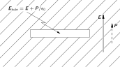
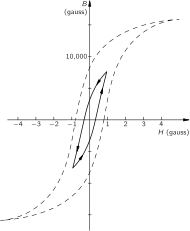
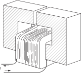
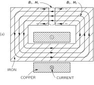

# 36. Ferromagnetism

## 36–1 Magnetization currents

In this chapter we will discuss some materials in which the net effect of the magnetic moments in the material is much greater than in the case of paramagnetism or diamagnetism. The phenomenon is called ferromagnetism. In paramagnetic and diamagnetic materials the induced magnetic moments are usually so weak that we don’t have to worry about the additional fields produced by the magnetic moments. For ferromagnetic materials, however, the magnetic moments induced by applied magnetic fields are quite enormous and have a great effect on the fields themselves. In fact, the induced moments are so strong that they are often the dominant effect in producing the observed fields. So one of the things we will have to worry about is the mathematical theory of large induced magnetic moments. That is, of course, just a technical question. The real problem is, why are the magnetic moments so strong—how does it all work? We will come to that question in a little while.

Finding the magnetic fields of ferromagnetic materials is something like the problem of finding the electrostatic field in the presence of dielectrics. You will remember that we first described the internal properties of a dielectric in terms of a vector field \FLPP , the dipole moment per unit volume. Then we figured out that the effects of this polarization are equivalent to a charge density \rho_{\text{pol}} given by the divergence of \FLPP :

\rho_{\text{pol}}=-\mathbf{d}iv{\FLPP}. (36.1)

The total charge in any situation can be written as the sum of this polarization charge plus all other charges, whose density we write 1 \rho_{\text{other}} . Then the Maxwell equation which relates the divergence of \mathbf{E} to the charge density becomes

\mathbf{d}iv{\mathbf{E}}=\frac{\rho}{\epsilon_0}= \frac{\rho_{\text{pol}}+\rho_{\text{other}}}{\epsilon_0},

or

\mathbf{d}iv{\mathbf{E}}=-\frac{\mathbf{d}iv{\FLPP}}{\epsilon_0}+ \frac{\rho_{\text{other}}}{\epsilon_0}.

We can then pull out the polarization part of the charge and put it on the other side of the equation, to get the new law

\mathbf{d}iv{(\epsilon_0\mathbf{E}+\FLPP)}=\rho_{\text{other}}. (36.2)

The new law says the divergence of the quantity (\epsilon_0\mathbf{E}+\FLPP) is equal to the density of the other charges.

Pulling \mathbf{E} and \FLPP together as in Eq. ( 36.2), of course, is useful only if we know some relation between them. We have seen that the theory which relates the induced electric dipole moment to the field was a relatively complicated business and can really only be applied to certain simple situations, and even then as an approximation. We would like to remind you of one of the approximate ideas we used. To find the induced dipole moment of an atom inside a dielectric, it is necessary to know the electric field that acts on an individual atom. We made the approximation—which is not too bad in many cases—that the field on the atom is the same as it would be at the center of the small hole which would be left if we took out the atom (keeping the dipole moments of all the neighboring atoms the same). You will also remember that the electric field in a hole in a polarized dielectric depends on the shape of the hole. We summarize our earlier results in Fig. 36–1 . For a thin, disc-shaped hole perpendicular to the polarization, the electric field in the hole is given by

\mathbf{E}_{\text{hole}}=\mathbf{E}_{\text{dielectric}}+\frac{\FLPP}{\epsilon_0},

which we showed by using Gauss’ law. On the other hand, in a needle-shaped slot parallel to the polarization, we showed—by using the fact that the curl of \mathbf{E} is zero—that the electric fields inside and outside of the slot are the same. Finally, we found that for a spherical hole the electric field was one-third of the way between the field of the slot and the field of the disc:

\mathbf{E}_{\text{hole}}=\mathbf{E}_{\text{dielectric}}+\frac{1}{3}\, \frac{\FLPP}{\epsilon_0}\:(\text{spherical hole}). (36.3)

This was the field we used in thinking about what happens to an atom inside a polarized dielectric.

### Figure Ch36-F1
Caption: Fig. 36–1.The electric field in a cavity in a dielectric depends on the shape of the cavity.
Image: figures/Ch36-F1.svg

Now we have to discuss the analog of all this for the case of magnetism. One simple, short-cut way of doing this is to say the \FLPM , the magnetic moment per unit volume, is just like \FLPP , the electric dipole moment per unit volume, and that, therefore, the negative of the divergence of \FLPM is equivalent to a “magnetic charge density” \rho_m —whatever that may mean. The trouble is, of course, that there isn’t any such thing as a “magnetic charge” in the physical world. As we know, the divergence of \mathbf{B} is always zero. But that does not stop us from making an artificial analog and writing

\mathbf{d}iv{\FLPM}=-\rho_m, (36.4)

where it is to be understood that \rho_m is purely mathematical. Then we could make a complete analogy with the electrostatic case and use all our old equations from electrostatics. People have often done something like that. In fact, historically, people even believed that the analogy was right. They believed that the quantity \rho_m represented the density of “magnetic poles.” These days, however, we know that the magnetization of materials comes from circulating currents within the atoms—either from the spinning electrons or from the motion of the electrons in the atom. It is therefore nicer from a physical point of view to describe things realistically in terms of the atomic currents, rather than in terms of a density of some mythical “magnetic poles.” Incidentally, these currents are sometimes called “Ampèrian” currents, because Ampère first suggested that the magnetism of matter came from circulating atomic currents.

The actual microscopic current density in magnetized matter is, of course, very complicated. Its value depends on where you look in the atom—it’s large in some places and small in others; it goes one way in one part of the atom and the opposite way in another part (just as the microscopic electric field varies enormously inside a dielectric). In many practical problems, however, we are interested only in the fields outside of the matter or in the average magnetic field inside of the matter—where we mean an average taken over many, many atoms. It is only for such macroscopic problems that it is convenient to describe the magnetic state of the matter in terms of \FLPM , the average dipole moment per unit volume. What we want to show now is that the atomic currents of magnetized matter can give rise to certain large-scale currents which are related to \FLPM .

What we are going to do, then, is to separate the current density \mathbf{j} —which is the real source of the magnetic fields—into various parts: one part to describe the circulating currents of the atomic magnets, and the other parts to describe what other currents there may be. It is usually most convenient to separate the currents into three parts. In Chapter 32 we made a distinction between the currents which flow freely on conductors and the ones which are due to the back and forth motions of the bound charges in dielectrics. In Section 32–2 we wrote

\mathbf{j}=\mathbf{j}_{\text{pol}}+\mathbf{j}_{\text{other}},

where \mathbf{j}_{\text{pol}} represented the currents from the motion of the bound charges in dielectrics and \mathbf{j}_{\text{other}} took care of all other currents. Now we want to go further. We want to separate \mathbf{j}_{\text{other}} into one part, \mathbf{j}_{\text{mag}} , which describes the average currents inside of magnetized materials, and an additional term which we can call \mathbf{j}_{\text{cond}} for whatever is left over. The last term will generally refer to currents in conductors, but it may also include other currents—for example the currents from charges moving freely through empty space. So we will write for the total current density:

\mathbf{j}=\mathbf{j}_{\text{pol}}+\mathbf{j}_{\text{mag}}+\mathbf{j}_{\text{cond}}. (36.5)

Of course it is this total current which belongs in the Maxwell equation for the curl of \mathbf{B} :

c^2\mathbf{c}url{\mathbf{B}}=\frac{\mathbf{j}}{\epsilon_0}+\frac{\partial \mathbf{E}}{\partial t}. (36.6)

Now we have to relate the current \mathbf{j}_{\text{mag}} to the magnetization vector \FLPM . So that you can see where we are going, we will tell you that the result is going to be that

\mathbf{j}_{\text{mag}}=\mathbf{c}url{\FLPM}. (36.7)

If we are given the magnetization vector \FLPM everywhere in a magnetic material, the circulation current density is given by the curl of \FLPM . Let’s see if we can understand why this is so.

### Figure Ch36-F2
Caption: Fig. 36–2.Schematic diagram of the circulating atomic currents as seen in a cross section of an iron rod magnetized in the zz-direction.
Image: figures/Ch36-F2.svg

First, let’s take the case of a cylindrical rod which has a uniform magnetization parallel to its axis. Physically, we know that such a uniform magnetization really means a uniform density of atomic circulating currents everywhere inside the material. Suppose we try to imagine what the actual currents would look like in a cross section of the material. We would expect to see currents something like those shown in Fig. 36–2 . Each atomic current goes around and around in a little circle, with all the circulating currents going around in the same direction. Now what is the effective current of such a thing? Well, in most of the bar there is no effect at all, because right next to each current there is another current going in the opposite direction. If we imagine a small surface—but one still quite a bit larger than a single atom—such as is indicated in Fig. 36–2 by the line \overline{AB} , the net current through such a surface is zero. There is no net current anywhere inside the material. Note, however, that at the surface of the material there are atomic currents which are not cancelled by neighboring currents going the other way. At the surface there is a net current always going in the same direction around the rod. Now you see why we said earlier that a uniformly magnetized rod is equivalent to a long solenoid carrying an electric current.

How does this view fit with Eq. ( 36.7)? First, inside the material the magnetization \FLPM is constant, so all its derivatives are zero. This agrees with our geometric picture. At the surface, however, \FLPM is not really constant—it is constant up to the edge and then suddenly collapses to zero. So, right at the surface there are terrific gradients which, according to ( 36.7), will give a high current density. Suppose we look at what happens near the point C in Fig. 36–2 . Taking the x - and y -directions as in the figure, the magnetization \FLPM is in the z -direction. Writing out the components of Eq. ( 36.7), we have

\begin{aligned} \frac{\partial M_z}{\partial y}&=(j_{\text{mag}})_x,\\[1ex] -\frac{\partial M_z}{\partial x}&=(j_{\text{mag}})_y. \end{aligned} (36.8)

At the point C , the derivative \frac{\partial M_z}{\partial y} is zero, but \frac{\partial M_z}{\partial x} is large and positive. Equation ( 36.7) says that there is a large current density in the minus y -direction. This agrees with our picture of a surface current going around the bar.

Now we want to find the current density for a more complicated case in which the magnetization varies from point to point in a material. It is easy to see qualitatively that if the magnetization is different in two neighboring regions, there will not be a perfect cancellation of the circulating currents so that there will be a net current in the volume of the material. It is this effect that we want to work out quantitatively.

Fig. 36–3.The dipole moment μ\mu of a current loop is IAIA. Fig. 36–3.The dipole moment μ\mu of a current loop is IAIA. Fig. 36–4.A small magnetized block is equivalent to a circulating surface current. Fig. 36–4.A small magnetized block is equivalent to a circulating surface current.

First, we need to recall the results of Section 14–5 that a circulating current I has a magnetic moment \mu given by

\mu=IA, (36.9)

where A is the area of the current loop (see Fig. 36–3 ). Now let’s consider a small rectangular block inside of a magnetized material, as sketched in Fig. 36–4 . We take the block so small that we can consider that the magnetization is uniform inside it. If this block has a magnetization M_z in the z -direction, the net effect will be the same as a surface current going around on the vertical faces, as shown. We can find the magnitude of these currents from Eq. ( 36.9). The total magnetic moment of the block is equal to the magnetization times the volume:

\mu=M_z(abc),

from which we get (remembering that the area of the loop is ac )

I=M_zb.

In other words, the current per unit length (vertically) on each of the vertical surfaces is equal to M_z .

### Figure Ch36-F5
Caption: Fig. 36–5.If the magnetization of two neighboring blocks is not the same, there is a net surface current in between.
Image: figures/Ch36-F5.svg

Now suppose that we imagine two such little blocks next to each other, as shown in Fig. 36–5 . Because block 2 is slightly displaced from block 1 , it will have a slightly different vertical component of magnetization, which we call M_z+\Delta M_z . Now on the surface between the two blocks there will be two contributions to the total current. Block 1 will produce a current I_1 flowing in the positive y -direction, and block 2 will produce a surface current I_2 flowing in the negative y -direction. The total surface current in the positive y -direction is the sum:

\begin{aligned} I&=I_1-I_2=M_zb-(M_z+\Delta M_z)b\\[1ex] &=-\Delta M_zb. \end{aligned}

We can write \Delta M_z , as the derivative of M_z in the x -direction times the displacement from block 1 to block 2 , which is just a :

\Delta M_z=\frac{\partial M_z}{\partial x}\,a.

The current flowing between the two blocks is then

I=-\frac{\partial M_z}{\partial x}\,ab.

To relate the current I to an average volume current density \mathbf{j} , we must realize that this current I is really spread over a certain cross-sectional area. If we imagine the whole volume of the material to be filled with such little blocks, one such side face (perpendicular to the x -axis) can be associated with each block. 2 Then we see that the area to be associated with the current I is just the area ab of one of the front faces. We get the result

j_y=\frac{I}{ab}=-\frac{\partial M_z}{\partial x}.

We have at least the beginning of the curl of \FLPM .

### Figure Ch36-F6
Caption: Fig. 36–6.Two blocks, one above the other, may also contribute to jyj_y.
Image: figures/Ch36-F6.svg

There should be another term in j_y from the variation of the x -component of the magnetization with z . This contribution to \mathbf{j} will come from the surface between two little blocks stacked one on top of the other, as shown in Fig. 36–6 . Using the same arguments we have just made, you can show that this surface will contribute to j_y the amount \frac{\partial M_x}{\partial z} . These are the only surfaces which can contribute to the y -component of the current so we have that the total current density in the y -direction is

j_y=\frac{\partial M_x}{\partial z}-\frac{\partial M_z}{\partial x}.

Working out the currents on the remaining faces of a cube—or using the fact that our z -direction is completely arbitrary—we can conclude that the vector current density is indeed given by the equation

\mathbf{j}=\mathbf{c}url{\FLPM}.

So if we choose to describe the magnetic situation in matter in terms of the average magnetic moment per unit volume \FLPM , we find that the circulating atomic currents are equivalent to an average current density in matter given by Eq. ( 36.7). If the material is also a dielectric, there may be, in addition, a polarization current \mathbf{j}_{\text{pol}}=\frac{\partial \FLPP}{\partial t} . And if the material is also a conductor, we may have a conduction current \mathbf{j}_{\text{cond}} as well. We can write the total current as

\mathbf{j}=\mathbf{j}_{\text{cond}}+\mathbf{c}url{\FLPM}+\frac{\partial \FLPP}{\partial t}. (36.10)

## 36–2 The field H\FLPH

Next, we want to insert the current as written in Eq. ( 36.10) into Maxwell’s equations. We get

\begin{aligned} c^2\mathbf{c}url{\mathbf{B}}&=\frac{\mathbf{j}}{\epsilon_0}+\frac{\partial \mathbf{E}}{\partial t}\\[1ex] &=\frac{1}{\epsilon_0}\biggl(\! \mathbf{j}_{\text{cond}}\!+\!\mathbf{c}url{\FLPM}\!+\!\frac{\partial \FLPP}{\partial t} \!\biggr)\!+\!\frac{\partial \mathbf{E}}{\partial t}. \end{aligned}

We can move the term in \FLPM to the left-hand side:

c^2\mathbf{c}url{\biggl(\!\mathbf{B}\!-\!\frac{\FLPM}{\epsilon_0 c^2}\!\biggr)}\!= \frac{\mathbf{j}_{\text{cond}}}{\epsilon_0}\!+\!\frac{\partial }{\partial t}\biggl(\! \mathbf{E}\!+\!\frac{\FLPP}{\epsilon_0}\!\biggr). (36.11)

As we remarked in Chapter 32, many people like to write (\mathbf{E}+\FLPP/\epsilon_0) as a new vector field \FLPD/\epsilon_0 . Similarly, it is often convenient to write (\mathbf{B}-\FLPM/\epsilon_0 c^2) as a single vector field. We choose to define a new vector field \FLPH by

\FLPH=\mathbf{B}-\frac{\FLPM}{\epsilon_0 c^2}. (36.12)

Then Eq. ( 36.11) becomes

\epsilon_0 c^2\mathbf{c}url{\FLPH}=\mathbf{j}_{\text{cond}}+\frac{\partial \FLPD}{\partial t}. (36.13)

It looks simple, but all the complexity is just hidden in the letters \FLPD and \FLPH .

Now we have to give you a warning. Most people who use the mks units have chosen to use a different definition of \FLPH . Calling their field \FLPH' (of course, they still call it \FLPH without the prime), it is defined by

\FLPH'=\epsilon_0 c^2\mathbf{B}-\FLPM. (36.14)

(Also, they usually write \epsilon_0 c^2 as a new number 1/\mu_0 ; then they have one more constant to keep track of!) With this definition, Eq. ( 36.13) looks even simpler:

\mathbf{c}url{\FLPH'}=\mathbf{j}_{\text{cond}}+\frac{\partial \FLPD}{\partial t}. (36.15)

But the difficulties with this definition of \FLPH' are, first, that it doesn’t agree with the definition of people who don’t use the mks units, and second, that it makes \FLPH' and \mathbf{B} have different units. We think it is more convenient for \FLPH to have the same units as \mathbf{B} —rather than the units of \FLPM , as \FLPH' does. But if you are going to be an engineer and work on the design of transformers, magnets, and such, you will have to watch out. You will find many books which use for \FLPH the definition of Eq. ( 36.14) rather than our definition of Eq. ( 36.12), and many other books—especially handbooks about magnetic materials—that relate \mathbf{B} and \FLPH the way we have done. You’ll have to be careful to figure out which convention they are using.

One way to tell is by the units they use. Remember that in the mks system, \mathbf{B} —and therefore our \FLPH —are measured with the unit: one weber per square meter, equal to 10{,}000 gauss. In the mks system, a magnetic moment (a current times an area) has the unit: one ampere-meter ^2 . The magnetization \FLPM , then, has the unit: one ampere per meter. For \FLPH' the units are the same as for \FLPM . You can see that this also agrees with Eq. ( 36.15), since \boldsymbol{\nabla} has the dimensions of one over a length. People who are working with electromagnets also get in the habit of calling the unit of \FLPH (with the \FLPH' definition) “one ampere turn per meter”—thinking of the turns of wire on a winding. But a “turn” is really a dimensionless number, so that doesn’t need to confuse you. Since our H is equal to H'/\epsilon_0 c^2 , if you are using the mks system, H (in webers/meter ^2 ) is equal to 4\pi\times10^{-7} times H' (in amperes per meter). It is perhaps more convenient to remember that H (in gauss) {}=0.0126H' (in amp/meter).

There is one more horrible thing. Many people who use our definition of \FLPH have decided to call the units of \FLPH and \mathbf{B} by different names! Even though they have the same dimensions, they call the unit of \mathbf{B} one gauss, and the unit of \FLPH one oersted (after Gauss and Oersted, of course). So, in many books you will find graphs with \mathbf{B} plotted in gauss and \FLPH in oersteds. They are really the same unit— 10^{-4} of the mks unit. We have summarized the confusion about magnetic units in Table 36–1 .

| [B]=\text{weber/meter\(^2\)}=10^4\text{ gauss} |
| --- |
| [H]=\text{weber/meter\(^2\)}=10^4\text{ gauss} \phantom{[H]=}~\mathit{or}\;10^4\text{ oersted} |
| [M]=\text{ampere/meter} |
| [H']=\text{ampere/meter} |
| B\,\text{ (gauss)}=10^4\,B\text{ (weber/meter\(^2\))} |
| H\text{ (gauss)}=H\text{ (oersted)} |
| \phantom{H\text{ (gauss)}}=0.0126\,H'\text{ (amp/meter)} |

## 36–3 The magnetization curve

Now we will look at some simple situations in which the magnetic field is constant, or in which the fields change slowly enough that we can neglect \frac{\partial \FLPD}{\partial t} in comparison with \mathbf{j}_{\text{cond}} . Then the fields obey the equations

\begin{aligned} \mathbf{d}iv{\mathbf{B}}=0,\\[1.5ex] \mathbf{c}url{\FLPH}=\mathbf{j}_{\text{cond}}/\epsilon_0 c^2,\\[1.5ex] \FLPH=\mathbf{B}-\FLPM/\epsilon_0 c^2. \end{aligned} (36.16)

### Figure Ch36-F7
Caption: Fig. 36–7.(a) A torus of iron wound with a coil of insulated wire. (b) Cross section of torus showing field lines.
Image: figures/Ch36-F7.svg

Suppose we have a torus (a donut) of iron wrapped with a coil of copper wire, as shown in Fig. 36–7 (a). A current I flows in the wire. What is the magnetic field? The magnetic field will be mainly inside the iron; there, the lines of \mathbf{B} will be circles, as drawn in Fig. 36–7 (b). Since the flux of \mathbf{B} is continuous, its divergence is zero, and Eq. ( 36.16) is satisfied. Next, we write Eq. ( 36.17) in another form by integrating around the closed loop \Gamma drawn in Fig. 36–7 (b). From Stokes’ theorem, we have that

\oint_\Gamma\FLPH\cdot d\mathbf{s}=\frac{1}{\epsilon_0 c^2} \int_S\mathbf{j}_{\text{cond}}\cdot\FLPn\,da, (36.19)

where the integral of \mathbf{j} is to be carried out over any surface S bounded by \Gamma . This surface is cut once by each turn of the winding. Each turn contributes the current I to the integral, and, if there are N turns in all, the integral is NI . From the symmetry of our problem, \mathbf{B} is the same all around the curve \Gamma ; if we assume that the magnetization, and therefore, the field H is also constant along \Gamma , Eq. ( 36.19) becomes

Hl=\frac{NI}{\epsilon_0 c^2},

where l is the length of the curve \Gamma . So,

H=\frac{1}{\epsilon_0 c^2}\,\frac{NI}{l}. (36.20)

It is because \FLPH is directly proportional to the magnetizing current in cases like this one that \FLPH is sometimes called the magnetizing field.

Now all we need is an equation which relates \FLPH to \mathbf{B} . But there isn’t any such equation! There is, of course, Eq. ( 36.18), but it is no help because there is no direct relation between \FLPM and \mathbf{B} for a ferromagnetic material like iron. The magnetization \FLPM depends on the whole past history of the iron, and not only on what \mathbf{B} is at the moment.

All is not lost, though. We can get solutions in certain simple cases. If we start out with unmagnetized iron—let’s say with iron that has been annealed at high temperatures—then in the simple geometry of the torus, all the iron will have the same magnetic history. Then we can say something about \FLPM —and therefore about the relation between \mathbf{B} and \FLPH —from experimental measurements. The field \FLPH in the torus is, from Eq. ( 36.20), given as a constant times the current I in the winding. The field \mathbf{B} can be measured by integrating over time the emf in the coil (or in an extra coil wound over the magnetizing coil shown in the figure). This emf is equal to the rate of change of the flux of \mathbf{B} , so the integral of the emf with time is equal to \mathbf{B} times the cross-sectional area of the torus.

### Figure Ch36-F8
Caption: Fig. 36–8.Typical magnetization and hysteresis curve for soft iron.
Image: figures/Ch36-F8.svg

Figure 36–8 shows the relation between \mathbf{B} and \FLPH , observed with a torus of soft iron. When the current is first turned on, \mathbf{B} increases with increasing \FLPH along the curve a . Note the different scales on \mathbf{B} and \FLPH ; initially, it takes only a relatively small \FLPH to make a large \mathbf{B} . Why is \mathbf{B} so much larger with the iron than it would be with air? Because there is a large magnetization \FLPM which is equivalent to a large surface current on the iron—the field \mathbf{B} comes from the sum of this current and the conduction current in the winding. Why \FLPM should be so large, we will discuss later.

At higher values of \FLPH , the magnetization curve levels off. We say that the iron saturates. With the scales of our figure, the curve appears to become horizontal. Actually, it continues to rise slightly—for large fields, \mathbf{B} becomes proportional to \FLPH , and with a unit slope. There is no further increase of \FLPM . Incidentally, we should point out that if the torus were made of some nonmagnetic material, \FLPM would be zero and \mathbf{B} would equal \FLPH for all fields.

The first thing we notice is that curve a in Fig. 36–8 —which is the so-called magnetization curve —is highly nonlinear. But it’s worse than that. If, after reaching saturation, we decrease the current in the coil to bring \FLPH back to zero, the magnetic field \mathbf{B} falls along curve b . When \FLPH reaches zero, there is still some \mathbf{B} left. Even with no magnetizing current there is a magnetic field in the iron—it has become permanently magnetized. If we now turn on a negative current in the coil, the B - H curve continues along b until the iron is saturated in the negative direction. If we then bring the current back to zero again, \mathbf{B} goes along curve c . If we alternate the current between large positive and negative values, the B - H curve goes back and forth along very nearly the curves b and c . If we vary \FLPH in some arbitrary way, however, we can get more complicated curves which will, in general, lie somewhere between the curves b and c . The loop made by repeated oscillation of the fields is called a hysteresis loop of the iron.

We see then that we cannot write a functional relationship like B=f(H) , because the value of \mathbf{B} at any instant depends not only on what \FLPH is at that time, but on its whole past history. Naturally, the magnetization and hysteresis curves are different for different substances. The shape of the curves depends critically on the chemical composition of the material, and also on the details of its preparation and subsequent physical treatment. We will discuss some of the physical explanations for these complications in the next chapter.

## 36–4 Iron-core inductances

One of the most important applications of magnetic materials is in electrical circuits—for example, in transformers, electric motors, and so on. One reason is that with iron we can control where the magnetic fields go, and also get much larger fields for a given electric current. For example, the typical “toroidal” inductance is made very much like the object shown in Fig. 36–7. For a given inductance, it can be much smaller in volume and use much less copper than an equivalent “air-core” inductance. For a given inductance, we get a much smaller resistance in the winding, so the inductance is more nearly “ideal”—particularly for low frequencies. It is very easy to understand, qualitatively, how such an inductance works. If I is the current in the winding, then the field \FLPH which is produced in the inside is proportional to I —as given by Eq. ( 36.20). The voltage \voltage across the terminals is related to the magnetic field \mathbf{B} . Neglecting the resistance of the winding, the voltage \voltage is proportional to \frac{\partial \mathbf{B}}{\partial t} . The inductance \selfInd , which is the ratio of \voltage to dI/dt (see Section 17–7 ), thus involves the relation between B and H in the iron. Since the \mathbf{B} is so much bigger than the \FLPH , we get a large factor in the inductance. Physically, what happens is that a small current in the coil, which would ordinarily produce a small magnetic field, causes the little “slave” magnets in the iron to line up and produce a tremendously greater “magnetic” current than the external current in the winding. It is as if we had a lot more current going through the coil than we really have. When we reverse the current, all the little magnets flip over—all those internal currents reverse—and we get a much higher induced emf than we would get without the iron. If we want to calculate the inductance, we can do so through the energy—as described in Section 17–8 . The rate at which energy is delivered from the current source is I\voltage . The voltage \voltage is the cross-sectional area A of the core, times N , times dB/dt . From Eq. ( 36.20), I=(\epsilon_0 c^2l/N)H . So we have

\frac{d U}{d t}=\voltage I=(\epsilon_0 c^2lA)H\,\frac{d B}{d t}.

Integrating over time, we have

U=(\epsilon_0 c^2lA)\int H\,dB. (36.21)

Notice that lA is the volume of the torus, so we have shown that the energy density u=U/\text{vol} in a magnetic material is given by

u=\epsilon_0 c^2\int H\,dB. (36.22)

An interesting feature is involved here. When we use alternating currents, the iron is driven around a hysteresis loop. Since B is not a single-valued function of H , the integral of \int H\,dB around one complete cycle is not equal to zero. It is the area enclosed inside the hysteresis curve. Thus, the driving source delivers a certain net energy each cycle—an energy proportional to the area inside the hysteresis loop. And that energy is “lost.” It is lost from the electromagnetic goings on, but turns up as heat in the iron. It is called the hysteresis loss. To keep such energy losses small, we would like the hysteresis loop to be as narrow as possible. One way to decrease the area of the loop is to reduce the maximum field that is reached during each cycle. For smaller maximum fields, we get a hysteresis curve like the one shown in Fig. 36–9. Also, special materials are designed to have a very narrow loop. The so-called transformer irons —which are iron alloys with a small amount of silicon—have been developed to have this property.

### Figure Ch36-F9
Caption: Fig. 36–9.A hysteresis loop that doesn’t reach saturation.
Image: figures/Ch36-F9.svg

When an inductance is run over a small hysteresis loop, the relationship between B and H can be approximated by a linear equation. People usually write

B=\mu H. (36.23)

The constant \mu is not the magnetic moment we have used before. It is called the permeability of the iron. (It is also sometimes called the “ relative permeability.”) The permeability of ordinary irons is typically several thousand. There are special alloys alike “supermalloy” which can have permeabilities as high as a million.

If we use the approximation that B=\mu H in Eq. ( 36.21), we can write the energy in a toroidal inductance as

\begin{aligned} U&=(\epsilon_0 c^2lA)\mu\int H\,dH\\[1ex] &=(\epsilon_0 c^2lA)\,\frac{\mu H^2}{2}. \end{aligned} (36.24)

So the energy density is approximately

u\approx\frac{\epsilon_0 c^2}{2}\,\mu H^2.

We can now set the energy of Eq. ( 36.24) equal to the energy \selfInd I^2/2 of an inductance, and solve for \selfInd . We get

\selfInd=(\epsilon_0 c^2lA)\mu\biggl(\frac{H}{I}\biggr)^2.

Using H/I from Eq. ( 36.20), we have

\selfInd=\frac{\mu N^2A}{\epsilon_0 c^2l}. (36.25)

The inductance is proportional to \mu . If you want inductances for such things as audio amplifiers, you will try to operate them on a hysteresis loop where the B - H relationship is as linear as possible. (You will remember that we spoke in Chapter 50, Vol. I, about the generation of harmonics in nonlinear systems.) For such purposes, Eq. ( 36.23) is a useful approximation. On the other hand, if you want to generate harmonics, you may use an inductance which is intentionally operated in a highly nonlinear way. Then you will have to use the complete B - H curves, and analyze what happens by graphical or numerical methods.

A “transformer” is often made by putting two coils on the same torus—or core —of a magnetic material. (For the larger transformers, the core is made with rectangular proportions for convenience.) Then a varying current in the “primary” winding causes the magnetic field in the core to change, which induces an emf in the “secondary” winding. Since the flux through each turn of both windings is the same, the emf’s in the two windings are in the same ratio as the number of turns on each. A voltage applied to the primary is transformed to a different voltage at the secondary. Since a certain net current around the core is needed to produce the required change in the magnetic field, the algebraic sum of the currents in the two windings will be fixed and equal to the required “magnetizing” current. If the current drawn from the secondary increases, the primary current must increase in proportion—there is a “transformation” of currents as well as voltage.

## 36–5 Electromagnets

### Figure Ch36-F10
Caption: Fig. 36–10.An electromagnet.
Image: figures/Ch36-F10.svg

Now let’s discuss a practical situation which is a little more complicated. Suppose we have an electromagnet of the rather standard form shown in Fig. 36–10 —there is a “C-shaped” yoke of iron, with a coil of many turns of wire wrapped around the yoke. What is the magnetic field \mathbf{B} in the gap?

If the gap thickness is small compared with all the other dimensions, we can, as a first approximation, assume that the lines of \mathbf{B} will go around through the loop, just as they did in the torus. They will look more or less as shown in Fig. 36–11 (a). They tend to spread out somewhat in the gap, but if the gap is narrow, this will be a small effect. It is a fair approximation to assume that the flux of \mathbf{B} through any cross section of the yoke is a constant. If the yoke has a uniform cross-sectional area A —and if we neglect any edge effects at the gaps or at the corners—we can say that \mathbf{B} is uniform around the yoke.

### Figure Ch36-F11
Caption: Fig. 36–11.Cross section of an electromagnet.
Image: figures/Ch36-F11.svg

Also, \mathbf{B} will have the same value in the gap. This follows from Eq. ( 36.16). Imagine the closed surface S , shown in Fig. 36–11 (b), which has one face in the gap and the other in the iron. The total flux of \mathbf{B} out of this surface must be zero. Calling B_1 the field in the gap and B_2 the field in the iron, we have (to our approximation) that

B_1A-B_2A=0.

It follows that B_1=B_2 .

Now let’s look at H . We can again use Eq. ( 36.19), taking the line integral around the curve \Gamma in Fig. 36–11 (b). As before, the integral on the right-hand side is NI , the number of turns times the current. Now, however, H will be different in the iron and in the air. Calling H_2 the field in the iron and l_2 the path length around the yoke, this part of the curve will contribute the amount H_2l_2 to the integral. Calling H_1 the field in the gap and l_1 the gap thickness, we get the contribution H_1l_1 from the gap. We have that

H_1l_1+H_2l_2=\frac{NI}{\epsilon_0 c^2}. (36.26)

Now we know something else: that in the air gap, the magnetization is negligible, so that B_1=H_1 . Since B_1=B_2 , Eq. ( 36.26) becomes

B_2l_1+H_2l_2=\frac{NI}{\epsilon_0 c^2}. (36.27)

We still have two unknowns. To find B_2 and H_2 , we need another relationship—namely, the one which relates B to H in the iron.

If we can make the approximation that B_2=\mu H_2 , we can solve the equation algebraically. However, let’s do the general case, in which the magnetization curve of the iron is one like that shown in Fig. 36–8. What we want is the simultaneous solution of this functional relationship together with Eq. ( 36.27). We can find it by plotting a graph of Eq. ( 36.27) on the same graph with the magnetization curve, as is done in Fig. 36–12. Where the two curves intersect, we have our solution.

### Figure Ch36-F12
Caption: Fig. 36–12.Solving for the field in an electromagnet.
Image: figures/Ch36-F12.svg

For a given current I , the function ( 36.27) is the straight line marked I>0 in Fig. 36–12. The line intersects the H -axis ( B_2=0 ) at H_2=NI/\epsilon_0 c^2l_2 , and the slope is -l_2/l_1 . Different currents just shift the line horizontally. From Fig. 36–12, we see that for a given current there are several different solutions, depending on how you got there. If you have just built the magnet and turned the current up to I , the field B_2 (which is also B_1 ) will have the value given by point a . If you have run the current to some very high value and come down to I , the field will be given by point b . Or, if you have just had a high negative current in the magnet and then come up to I , the field is the one at point c . The field in the gap will depend on what you have done in the past.

When the current in the magnet is zero, the relation between B_2 and H_2 in Eq. ( 36.27) is shown by the line marked I=0 in the figure. There are still various possible solutions. If you have first saturated the iron, there may be a considerable residual field in the magnet as given by point d . You can take the coil off, and you have a permanent magnet. You can see that for a good permanent magnet, you would want a material with a wide hysteresis loop. Special alloys, such as Alnico V, have very wide loops.

## 36–6 Spontaneous magnetization

We now turn to the question of why it is that in ferromagnetic materials a small magnetic field produces such a large magnetization. The magnetization of ferromagnetic materials like iron and nickel comes from the magnetic moment of the electrons in the inner shell of the atom. Each electron has a magnetic moment \FLPmu equal to q/2m times its g -factor, times its angular momentum \FLPJ . For a single electron with no net orbital motion, g=2 , and the component of \FLPJ in any direction—say the z -direction—is \pm\hbar/2 , so the component of \FLPmu along the z -axis is

\mu_z=\frac{q\hbar}{2m}=0.928\times10^{-23}\text{ amp$\cdot$m$^2$}. (36.28)

In an iron atom, there are actually two electrons that contribute to the ferromagnetism, so to keep the discussion simpler we will talk about nickel, which is ferromagnetic like iron but which has only one electron in the inner shell. (It is easy to extend the arguments to iron.)

Now the point is that in the presence of an external field \mathbf{B} , the atomic magnets tend to line up with the field, but are knocked about by thermal motions just as we described for paramagnetic materials. In the last chapter we found out that the balance between a magnetic field trying to line up the atomic magnets and the thermal motions trying to derange them produced the result that the mean magnetic moment per unit volume will end up as

M=N\mu\tanh\frac{\mu B_a}{kT}. (36.29)

By \mathbf{B}_a we mean the field acting at the atom, and kT is the Boltzmann energy. In the theory of paramagnetism we used for B_a just B itself, neglecting the part of the field at any given atom contributed by the atoms nearby. In the ferromagnetic case, there is a complication. We shouldn’t use the average field in the iron for the \mathbf{B}_a acting on an individual atom. Instead, we must do as we did in the case of dielectrics—we have to find the local field acting at a single atom. For an exact calculation we should add up the fields at the atom in question contributed by all of the other atoms in the crystal lattice. But as we did for dielectrics, we will make the approximation that the field at an atom is the same as we would find in a small spherical hole in the material—assuming that the moments of the atoms in the neighborhood are not changed by the presence of the hole.

Following the arguments we made in Chapter 11, we might think that we could write

\mathbf{B}_{\text{hole}}=\mathbf{B}+\frac{1}{3}\,\frac{\FLPM}{\epsilon_0 c^2}\quad (\text{wrong!}).

But that is not right. We can, however, make use of the results of Chapter 11 if we make a careful comparison of the equations of Chapter 11 with the equations for ferromagnetism in this chapter. Let’s put together the corresponding equations. For regions where there are no conduction currents or charges we have:

\begin{aligned} &\text{Electrostatics}\\[.5ex] &\mathbf{d}iv{\biggl(\mathbf{E}+\frac{\FLPP}{\epsilon_0}\biggr)}=0\\[1ex] &\mathbf{c}url{\mathbf{E}}=\FLPzero\\[2ex] &\text{Static ferromagnetism}\\[1ex] &\mathbf{d}iv{\mathbf{B}}=0\\[1ex] &\mathbf{c}url{\biggl(\mathbf{B}-\frac{\FLPM}{\epsilon_0 c^2}\biggr)}=\FLPzero \end{aligned} (36.30)

These two sets of equations can be thought of as analogous if we make the following purely mathematical correspondences:

\mathbf{E}\to\mathbf{B}-\frac{\FLPM}{\epsilon_0 c^2},\quad \mathbf{E}+\frac{\FLPP}{\epsilon_0}\to\mathbf{B}.

This is the same as making the analogy

\mathbf{E}\to\FLPH,\quad\FLPP\to\FLPM/c^2. (36.31)

In other words, if we write the equations of ferromagnetism as

\begin{aligned} &\mathbf{d}iv{\biggl(\FLPH+\frac{\FLPM}{\epsilon_0 c^2}\biggr)}=0,\\[1ex] &\mathbf{c}url{\FLPH}=\FLPzero, \end{aligned} (36.32)

they look like the equations of electrostatics.

This purely algebraic correspondence has led to some confusion in the past. People tended to think that \FLPH was “ the magnetic field.” But, as we have seen, \mathbf{B} and \mathbf{E} are physically the fundamental fields, and \FLPH is a derived idea. So although the equations are analogous, the physics is not analogous. However, that doesn’t need to stop us from using the principle that the same equations have the same solutions.

We can use our earlier results for the electric field inside of holes of various shapes in dielectrics—summarized in Fig. 36–1 —to find the field \FLPH inside of corresponding holes. Knowing \FLPH , we can determine \mathbf{B} . For instance (using the results we summarized in Section 36–1 ), the field \FLPH in a needle-shaped hole parallel to \FLPM is the same as the \FLPH in the material,

\FLPH_{\text{hole}}=\FLPH_{\text{material}}.

But since \FLPM in the hole is zero, we have

\mathbf{B}_{\text{hole}}=\mathbf{B}_{\text{material}}-\frac{\FLPM}{\epsilon_0 c^2}. (36.33)

On the other hand, for a disc-shaped hole, perpendicular to \FLPM , we have

\mathbf{E}_{\text{hole}}=\mathbf{E}_{\text{dielectric}}+\frac{\FLPP}{\epsilon_0},

which translates into

\FLPH_{\text{hole}}=\FLPH_{\text{material}}+\frac{\FLPM}{\epsilon_0 c^2}.

Or, in terms of \mathbf{B} ,

\mathbf{B}_{\text{hole}}=\mathbf{B}_{\text{material}}. (36.34)

Finally, for a spherical hole, by making our analogy with Eq. ( 36.3) we would have

\FLPH_{\text{hole}}=\FLPH_{\text{material}}+\frac{\FLPM}{3\epsilon_0 c^2}

or

\mathbf{B}_{\text{hole}}=\mathbf{B}_{\text{material}}-\frac{2}{3}\, \frac{\FLPM}{\epsilon_0 c^2}. (36.35)

This result is quite different from what we got for \mathbf{E} .

It is, of course, possible to get these results in a more physical way, by using the Maxwell equations directly. For example, Eq. ( 36.34) follows directly from \mathbf{d}iv{\mathbf{B}}=0 . (You use a Gaussian surface that is half in the material and half out.) Similarly, you can get Eq. ( 36.33) by using a line integral along a curve that goes up inside the hole and returns through the material. Physically, the field in the hole is reduced because of the surface currents—which are given by \mathbf{c}url{\FLPM} . We will leave it for you to show that Eq. ( 36.35) can also be obtained by considering the effects of the surface currents on the boundary of the spherical cavity.

In finding the equilibrium magnetization from Eq. ( 36.29), it turns out to be most convenient to deal with \FLPH ; so write

\mathbf{B}_a=\FLPH+\lambda\,\frac{\FLPM}{\epsilon_0 c^2}. (36.36)

In the spherical hole approximation, we would have \lambda=\frac{1}{3} , but, as you will see, we will want later to use some other value, so we leave it as an adjustable parameter. Also, we will take all the fields in the same direction so that we won’t need to worry about the vector directions. If we were now to substitute Eq. ( 36.36) into Eq. ( 36.29), we would have one equation that relates the magnetization M to the magnetizing field H :

M=N\mu\tanh\biggl(\mu\,\frac{H+\lambda M/\epsilon_0 c^2}{kT}\biggr).

It is however, an equation that cannot be solved explicitly, so we will do it graphically.

Let’s put the problem in a generalized form by writing Eq. ( 36.29) as

\frac{M}{M_{\text{sat}}}=\tanh x, (36.37)

where M_{\text{sat}} is the saturation value of the magnetization, namely, N\mu , and x represents \mu B_a/kT . The dependence of M/M_{\text{sat}} on x is shown by curve a in Fig. 36–13. We can also write x as a function of M —using Eq. ( 36.36) for B_a —as

x=\frac{\mu B_a}{kT}=\frac{\mu H}{kT}+\biggl(\frac{\mu\lambda M_{\text{sat}}} {\epsilon_0 c^2kT}\biggr)\frac{M}{M_{\text{sat}}}. (36.38)

For any given value of H , this is a straight-line relationship between M/M_{\text{sat}} and x . The x intercept is at x=\mu H/kT , and the slope is \epsilon_0 c^2kT/\mu\lambda M_{\text{sat}} . For any particular H , we would have a line like the one marked b in Fig. 36–13. The intersection of curves a and b gives us the solution for M/M_{\text{sat}} . We have solved the problem.

### Figure Ch36-F13
Caption: Fig. 36–13.A graphical solution of Eqs. (36.37) and (36.38).
Image: figures/Ch36-F13.svg

Let’s look at how the solutions will go for various circumstances. We start with H=0 . There are two possible situations, shown by the lines b_1 and b_2 in Fig. 36–14. You will notice from Eq. ( 36.38) that the slope of the line is proportional to the absolute temperature T . So, at high temperatures we would have a line like b_1 . The solution is M/M_{\text{sat}}=0 . When the magnetizing field H is zero, the magnetization is also zero. But at low temperatures, we would have a line like b_2 , and there are two solutions for M/M_{\text{sat}} —one with M/M_{\text{sat}}=0 and one with M/M_{\text{sat}} near one. It turns out that only the upper solution is stable—as you can see by considering small variations about these solutions.

### Figure Ch36-F14
Caption: Fig. 36–14.Finding the magnetization when H=0H=0.
Image: figures/Ch36-F14.svg

According to these ideas, then, a magnetic material should magnetize itself spontaneously at sufficiently low temperatures. In short, when the thermal motions are small enough, the coupling between the atomic magnets causes them all to line up parallel to each other—we have a permanently magnetized material analogous to the ferroelectrics we discussed in Chapter 11.

If we start at high temperatures and come down, there is a critical temperature, called the Curie temperature T_c , where the ferromagnetic behavior suddenly sets in. This temperature corresponds to the line b_3 of Fig. 36–14, which is tangent to the curve a , and has, therefore, a slope of 1 . The Curie temperature is given by

\frac{\epsilon_0 c^2kT_c}{\mu\lambda M_{\text{sat}}}=1. (36.39)

We can, if we wish, write Eq. ( 36.38) more simply in terms of T_c as

x=\frac{\mu H}{kT}+\frac{T_c}{T}\biggl(\frac{M}{M_{\text{sat}}}\biggr). (36.40)

Now we want to see what happens for small magnetizing fields H . We can see from Fig. 36–14 how things will go if we shift our straight lines a little to the right. For the low-temperature case, the intersection point will move out a little bit along the low-slope part of curve a , and M will change relatively little. For the high-temperature case, however, the intersection point runs up the steep part of curve a , and M will change relatively rapidly. In fact, we can approximate this part of curve a by a straight line of unit slope, and write:

\frac{M}{M_{\text{sat}}}=x=\frac{\mu H}{kT}+ \frac{T_c}{T}\biggl(\frac{M}{M_{\text{sat}}}\biggr).

Now we can solve for M/M_{\text{sat}} :

\frac{M}{M_{\text{sat}}}=\frac{\mu H}{k(T-T_c)}. (36.41)

We have a law that is something like the one we had for paramagnetism. For paramagnetism, we had

\frac{M}{M_{\text{sat}}}=\frac{\mu B}{kT}. (36.42)

One difference now is that we have the magnetization in terms of H , which includes some of the effects of the interaction of the atomic magnets, but the main difference is that the magnetization is inversely proportional to the difference between T and T_c , instead of to the absolute temperate T , alone. Neglecting the interactions between neighboring atoms corresponds to taking \lambda=0 , which from Eq. ( 36.39) means taking T_c=0 . Then the results are just what we had in Chapter 35.

We can check our theoretical picture with the experimental data for nickel. It is observed experimentally that the ferromagnetic behavior of nickel disappears when its temperature is raised above 631^\circ K. We can compare this with T_c calculated from Eq. ( 36.39). Remembering that M_{\text{sat}}=\mu N , we have

T_c=\lambda\,\frac{N\mu^2}{k\epsilon_0 c^2}.

From the density and atomic weight of nickel, we get

N=9.1\times10^{28}\:\text{m}^{-3}.

Taking \mu from Eq. ( 36.28), and setting \lambda=\frac{1}{3} , we get

T_c=0.24^\circ\text{K}.

There is a discrepancy of a factor of about 2600 ! Our theory of ferromagnetism fails completely.

We can try to “patch up” the theory as Weiss did by saying that for some unknown reason \lambda is not one-third, but (2600)\times\frac{1}{3} —or about 900 . It turns out that one gets similar values for other ferromagnetic materials like iron. To see what this means, let’s go back to Eq. ( 36.36). We see that a large \lambda means that B_a , the local field on the atom, appears to be much, much larger than we would think. In fact, writing H=B-M/\epsilon_0 c^2 , we have

B_a=B+\frac{(\lambda-1)M}{\epsilon_0 c^2}.

According to our original idea—with \lambda=\frac{1}{3} the local magnetization M reduces the effective field B_a by the amount -\frac{2}{3}M/\epsilon_0 c^2 . Even if our model of a spherical hole were not very good, we would still expect some reduction. Instead, to explain the phenomenon of ferromagnetism, we have to imagine that the magnetization of the field enhances the local field by some large factor—like one thousand or more. There doesn’t seem to be any reasonable way to manufacture such tremendous fields at an atom—nor even fields of the proper sign! Clearly, our “magnetic” theory of ferromagnetism is a dismal failure. We must conclude, then, that ferromagnetism has to do with some nonmagnetic interaction between the spinning electrons in neighboring atoms. This interaction must generate a strong tendency for all of the nearby spins to line up in one direction. We will see later that it has to do with quantum mechanics and the Pauli exclusion principle.

Finally, we look at what happens at low temperatures—for T<T_c . We have seen that there will then be a spontaneous magnetization—even with H=0 —given by the intersection of the curves a and b_2 of Fig. 36–14. If we solve for M for various temperatures—by varying the slope of the line b_2 —we get the theoretical curve shown in Fig. 36–15. This curve should be the same for all ferromagnetic materials for which the atomic moment comes from a single electron. The curves for other materials are only slightly different.

### Figure Ch36-F15
Caption: Fig. 36–15.Spontaneous magnetization as a function of temperature for nickel.
Image: figures/Ch36-F15.svg

In the limit, as T goes to absolute zero, M goes to M_{\text{sat}} . As the temperature is increased, the magnetization decreases, falling to zero at the Curie temperature. The points in Fig. 36–15 are the experimental observations for nickel. They fit the theoretical curve fairly well. Even though we don’t understand the basic mechanism, the general features of the theory seem to be correct.

Finally, there is one more disturbing discrepancy in our attempt to understand ferromagnetism. We have found that above some temperature the material should behave like a paramagnetic substance with a magnetization M proportional to H (or B ), and that below that temperature it should become spontaneously magnetized. But that’s not what we found when we measured the magnetization curve for iron. It only became permanently magnetized after we had “magnetized” it. According to the ideas just discussed, it would magnetize itself! What is wrong? Well, it turns out that if you look at a small enough crystal of iron or nickel, it is indeed completely magnetized! But in large pieces of iron, there are many small regions or “domains” that are magnetized in different directions, so that on a large scale the average magnetization appears to be zero. In each small domain, however, the iron has a locked-in magnetization with M nearly equal to M_{\text{sat}} . The consequences of this domain structure are that gross properties of large pieces of material are quite different from the microscopic properties that we have really been treating. We will take up in the next lecture the story of the practical behavior of bulk magnetic materials.
