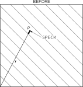
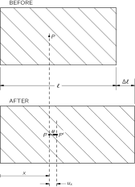
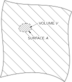
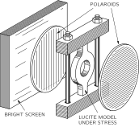
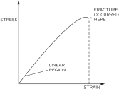
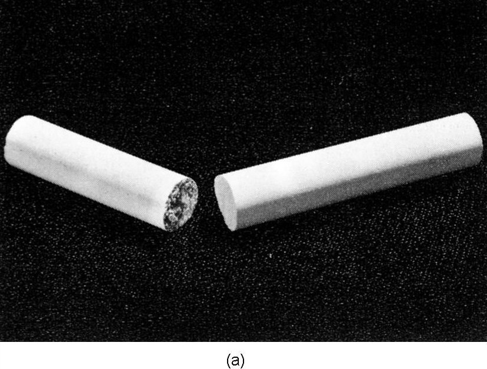

# 39. Elastic Materials

## 39–1 The tensor of strain

In the last chapter we talked about the distortions of particular elastic objects. In this chapter we want to look at what can happen in general inside an elastic material. We would like to be able to describe the conditions of stress and strain inside some big glob of jello which is twisted and squashed in some complicated way. To do this, we need to be able to describe the local strain at every point in an elastic body; we can do it by giving a set of six numbers—which are the components of a symmetric tensor—for each point. Earlier, we spoke of the stress tensor (Chapter 31); now we need the tensor of strain.

### Figure Ch39-F1
Caption: Fig. 39–1.A speck of the material at the point PP in an unstrained block moves to P′P' where the block is strained.
Image: figures/Ch39-F1.svg

Imagine that we start with the material initially unstrained and watch the motion of a small speck of “dirt” embedded in the material when the strain is applied. A speck that was at the point P located at \mathbf{r}=(x,y,z) moves to a new position P' at \mathbf{r}'=(x',y',z') as shown in Fig. 39–1 . We will call \FLPu the vector displacements from P to P' . Then

\FLPu=\mathbf{r}'-\mathbf{r}. (39.1)

The displacement \FLPu depends, of course, on which point P we start with, so \FLPu is a vector function of \mathbf{r} —or, if you prefer, of (x,y,z) .

### Figure Ch39-F2
Caption: Fig. 39–2.A homogenous stretch-type strain.
Image: figures/Ch39-F2.svg

Let’s look first at a simple situation in which the strain is constant over the material—so we have what is called a homogeneous strain. Suppose, for instance, that we have a block of material and we stretch it uniformly. We just change its dimensions uniformly in one direction—say, in the x -direction, as shown in Fig. 39–2 . The motion u_x of a speck at x is proportional to x . In fact,

\frac{u_x}{x}=\frac{\Delta l}{l}.

We will write u_x this way:

u_x=e_{xx}x.

The proportionality constant e_{xx} is, of course, the same thing as \Delta l/l . (You will see shortly why we use a double subscript.)

If the strain is not uniform, the relation between u_x and x will vary from place to place in the material. For the general situation, we define the e_{xx} by a kind of local \Delta l/l , namely by

e_{xx}=\frac{\partial u_x}{\partial x}. (39.2)

This number—which is now a function of x , y , and z —describes the amount of stretching in the x -direction throughout the hunk of jello. There may, of course, also be stretching in the y - and z -directions. We describe them by the numbers

e_{yy}=\frac{\partial u_y}{\partial y},\quad e_{zz}=\frac{\partial u_z}{\partial z}. (39.3)

### Figure Ch39-F3
Caption: Fig. 39–3.A homogenous shear strain.
Image: figures/Ch39-F3.svg

We need to be able to describe also the shear-type strains. Suppose we imagine a little cube marked out in the initially undisturbed jello. When the jello is pushed out of shape, this cube may get changed into a parallelogram, as sketched in Fig. 39–3 . 1 In this kind of a strain, the x -motion of each particle is proportional to its y -coordinate,

u_x=\frac{\theta}{2}\,y. (39.4)

And there is also a y -motion proportional to x ,

u_y=\frac{\theta}{2}\,x. (39.5)

So we can describe such a shear-type strain by writing

u_x=e_{xy}y,\quad u_y=e_{yx}x

with

e_{xy}=e_{yx}=\frac{\theta}{2}.

Now you might think that when the strains are not homogeneous we could describe the generalized shear strains by defining the quantities e_{xy} and e_{yx} by

e_{xy}=\frac{\partial u_x}{\partial y},\quad e_{yx}=\frac{\partial u_y}{\partial x}. (39.6)

But there is one difficulty. Suppose that the displacements u_x and u_y were given by

u_x=\frac{\theta}{2}\,y,\quad u_y=-\frac{\theta}{2}\,x

They are like Eqs. ( 39.4) and ( 39.5) except that the sign of u_y is reversed. With these displacements a little cube in the jello simply gets shifted by the angle \theta/2 , as shown in Fig. 39–4 . There is no strain at all—just a rotation in space. There is no distortion of the material; the relative positions of all the atoms are not changed at all. We must somehow make our definitions so that pure rotations are not included in our definitions of a shear strain. The key point is that if \frac{\partial u_y}{\partial x} and \frac{\partial u_x}{\partial y} are equal and opposite, there is no strain; so we can fix things up by defining

e_{xy}=e_{yx}=\frac{1}{2}(\frac{\partial u_y}{\partial x}+\frac{\partial u_x}{\partial y}).

For a pure rotation they are both zero, but for a pure shear we get that e_{xy} is equal to e_{yx} , as we would like.

### Figure Ch39-F4
Caption: Fig. 39–4.A homogenous rotation—there is no strain.
Image: figures/Ch39-F4.svg

In the most general distortion—which may include stretching or compression as well as shear—we define the state of strain by giving the nine numbers

\begin{aligned} e_{xx}&=\frac{\partial u_x}{\partial x},\\[2pt] e_{yy}&=\frac{\partial u_y}{\partial y},\\[-2pt] &\qquad\vdots\\ e_{xy}&=\frac{1}{2}(\frac{\partial u_y}{\partial x}+\frac{\partial u_x}{\partial y}),\\[-4pt] &\qquad\vdots \end{aligned} (39.7)

These are the terms of a tensor of strain. Because it is a symmetric tensor —our definitions make e_{xy}=e_{yx} , always—there are really only six different numbers. You remember (see Chapter 31) that the general characteristic of a tensor is that the terms transform like the products of the components of two vectors. (If \mathbf{A} and \mathbf{B} are vectors, C_{ij}=A_iB_j is a tensor.) Each term of e_{ij} is a product (or the sum of such products) of the components of the vector \FLPu=(u_x,u_y,u_z) , and of the operator \boldsymbol{\nabla}=(\frac{\partial }{\partial x},\frac{\partial }{\partial y},\frac{\partial }{\partial z}) , which we know transforms like a vector. Let’s let x_1 , x_2 , and x_3 stand for x , y , and z and u_1 , u_2 , and u_3 stand for u_x , u_y , and u_z ; then we can write the general term e_{ij} of the strain tensor as

e_{ij}=\frac{1}{2}(\frac{\partial u_j}{\partial x_i}+\frac{\partial u_i}{\partial x_j}), (39.8)

where i and j can be 1 , 2 , or 3 .

When we have a homogeneous strain—which may include both stretching and shear—all of the e_{ij} are constants, and we can write

u_x=e_{xx}x+e_{xy}y+e_{xz}z. (39.9)

(We choose our origin of x , y , z at the point where \FLPu is zero.) In this case, the strain tensor e_{ij} gives the relationship between two vectors: the coordinate vector \mathbf{r}=(x,y,z) and the displacement vector \FLPu=(u_x,u_y,u_z) .

When the strains are not homogeneous, any piece of the jello may also get somewhat twisted—there will be a local rotation. If the distortions are all small, we would have

\Delta u_i=\sum_j(e_{ij}-\omega_{ij})\,\Delta x_j, (39.10)

where \omega_{ij} is an antisymmetric tensor,

\omega_{ij}=\frac{1}{2}(\frac{\partial u_j}{\partial x_i}-\frac{\partial u_i}{\partial x_j}), (39.11)

which describes the rotation. We will, however, not worry any more about rotations, but only about the strains described by the symmetric tensor e_{ij} .

## 39–2 The tensor of elasticity

Now that we have described the strains, we want to relate them to the internal forces—the stresses in the material. For each small piece of the material, we assume Hooke’s law holds and write that the stresses are proportional to the strains. In Chapter 31 we defined the stress tensor S_{ij} as the i th component of the force across a unit-area perpendicular to the j -axis. Hooke’s law says that each component of S_{ij} is linearly related to each of the components of strain. Since S and e each have nine components, there are 9\times9=81 possible coefficients which describe the elastic properties of the material. They are constants if the material itself is homogeneous. We write these coefficients as C_{ijkl} and define them by the equation

S_{ij}=\sum_{k,l}C_{ijkl}e_{kl}, (39.12)

where i , j , k , l all take on the values 1 , 2 , or 3 . Since the coefficients C_{ijkl} relate one tensor to another, they also form a tensor—a tensor of the fourth rank. We can call it the tensor of elasticity.

Suppose that all the C ’s are known and that you put a complicated force on an object of some peculiar shape. There will be all kinds of distortion, and the thing will settle down with some twisted shape. What are the displacements? You can see that it is a complicated problem. If you knew the strains, you could find the stresses from Eq. ( 39.12)—or vice versa. But the stresses and strains you end up with at any point depend on what happens in all the rest of the material.

The easiest way to get at the problem is by thinking of the energy. When there is a force F proportional to a displacement x , say F=kx , the work required for any displacement x is kx^2/2 . In a similar way, the work w that goes into each unit volume of a distorted material turns out to be

w=\frac{1}{2}\sum_{ijkl}C_{ijkl}e_{ij}e_{kl}. (39.13)

The total work W done in distorting the body is the integral of w over its volume:

W=\int\frac{1}{2}\sum_{ijkl}C_{ijkl}e_{ij}e_{kl}\,dV. (39.14)

This is then the potential energy stored in the internal stresses of the material. Now when a body is in equilibrium, this internal energy must be at a minimum. So the problem of finding the strains in a body can be solved by finding the set of displacements \FLPu throughout the body which will make W a minimum. In Chapter 19 we gave some of the general ideas of the calculus of variations that are used in tackling minimization problems like this. We cannot go into the problem in any more detail here.

What we are mainly interested in now is what we can say about the general properties of the tensor of elasticity. First, it is clear that there are not really 81 different terms in C_{ijkl} . Since both S_{ij} and e_{ij} are symmetric tensors, each with only six different terms, there can be at most 36 different terms in C_{ijkl} . There are, however, usually many fewer than this.

Let’s look at the special case of a cubic crystal. In it, the energy density w starts out like this:

\begin{aligned} w=\frac{1}{2}\{&C_{xxxx}e_{xx}^2\!+C_{xxxy}e_{xx}e_{xy}\!+C_{xxxz}e_{xx}e_{xz}\\[.5ex] +\;&C_{xxyx}e_{xx}e_{xy}\!+C_{xxyy}e_{xx}e_{yy}\ldots\text{etc}\ldots\\[.5ex] +\;&C_{yyyy}e_{yy}^2\!+\ldots\text{etc}\ldots\text{etc}\ldots\}, \end{aligned} (39.15)

with 81 terms in all! Now a cubic crystal has certain symmetries. In particular, if the crystal is rotated 90^\circ , it has the same physical properties. It has the same stiffness for stretching in the y -direction as for stretching in the x -direction. Therefore, if we change our definition of the coordinate directions x and y in Eq. ( 39.15), the energy wouldn’t change. It must be that for a cubic crystal

C_{xxxx}=C_{yyyy}=C_{zzzz}. (39.16)

Next we can show that the terms like C_{xxxy} must be zero. A cubic crystal has the property that it is symmetric under a reflection about any plane perpendicular to one of the axes. If we replace y by -y , nothing is different. But changing y to -y changes e_{xy} to -e_{xy} —a displacement which was toward +y is now toward -y . If the energy is not to change, C_{xxxy} must go into -C_{xxxy} when we make a reflection. But a reflected crystal is the same as before, so C_{xxxy} must be the same as -C_{xxxy} . This can happen only if both are zero.

You say, “But the same argument will make C_{yyyy}=0 !” No, because there are four y ’s. The sign changes once for each y , and four minuses make a plus. If there are two or four y ’s, the term does not have to be zero. It is zero only when there is one, or three. So, for a cubic crystal, any nonzero term of C will have only an even number of identical subscripts. (The arguments we have made for y obviously hold also for x and z .) We might then have terms like C_{xxyy} , C_{xyxy} , C_{xyyx} , and so on. We have already shown, however, that if we change all x ’s to y ’s and vice versa (or all z ’s and x ’s, and so on) we must get—for a cubic crystal—the same number. This means that there are only three different nonzero possibilities:

\begin{aligned} &C_{xxxx}\:(=C_{yyyy}=C_{zzzz}),\\[.5ex] &C_{xxyy}\:(=C_{yyxx}=C_{xxzz},\:\text{etc.}),\\[.5ex] &C_{xyxy}\:(=C_{yxyx}=C_{xzxz},\:\text{etc.}). \end{aligned} (39.17)

For a cubic crystal, then, the energy density will look like this:

\begin{aligned} w&=\frac{1}{2}\{C_{xxxx}(e_{xx}^2+e_{yy}^2+e_{zz}^2)\\[.5ex] &\quad+\,2C_{xxyy}(e_{xx}e_{yy}+e_{yy}e_{zz}+e_{zz}e_{xx})\\[.5ex] &\quad+\,4C_{xyxy}(e_{xy}^2+e_{yz}^2+e_{zx}^2)\}. \end{aligned} (39.18)

For an isotropic—that is, noncrystalline—material, the symmetry is still higher. The C ’s must be the same for any choice of the coordinate system. Then it turns out that there is another relation among the C ’s, namely, that

C_{xxxx}=C_{xxyy}+2C_{xyxy}. (39.19)

We can see that this is so by the following general argument. The stress tensor S_{ij} has to be related to e_{ij} in a way that doesn’t depend at all on the coordinate directions—it must be related only by scalar quantities. “That’s easy,” you say. “The only way to obtain S_{ij} from e_{ij} is by multiplication by a scalar constant. It’s just Hooke’s law. It must be that S_{ij}=(\text{const})e_{ij} .” But that’s not quite right; there could also be the unit tensor \delta_{ij} multiplied by some scalar, linearly related to e_{ij} . The only invariant you can make that is linear in the e ’s is \sum e_{ii} . (It transforms like x^2+y^2+z^2 , which is a scalar.) So the most general form for the equation relating S_{ij} to e_{ij} —for isotropic materials—is

S_{ij}=2\mu e_{ij}+\lambda\Bigl(\sum_ke_{kk}\Bigr)\delta_{ij}. (39.20)

(The first constant is usually written as two times \mu ; then the coefficient \mu is equal to the shear modulus we defined in the last chapter.) The constants \mu and \lambda are called the Lamé elastic constants. Comparing Eq. ( 39.20) with Eq. ( 39.12), you see that

\begin{aligned} C_{xxyy}&=\lambda,\\[.5ex] C_{xyxy}&=\mu,\\[.5ex] C_{xxxx}&=2\mu+\lambda. \end{aligned} (39.21)

So we have proved that Eq. ( 39.19) is indeed true. You also see that the elastic properties of an isotropic material are completely given by two constants, as we said in the last chapter.

The C ’s can be put in terms of any two of the elastic constants we have used earlier—for instance, in terms of Young’s modulus Y and Poisson’s ratio \sigma . We will leave it for you to show that

\begin{aligned} C_{xxxx}&=\frac{Y}{1+\sigma} \biggl(1+\frac{\sigma}{1-2\sigma}\biggr),\\[.5ex] C_{xxyy}&=\frac{Y}{1+\sigma} \biggl(\frac{\sigma}{1-2\sigma}\biggr),\\[.5ex] C_{xyxy}&=\frac{Y}{2(1+\sigma)}. \end{aligned} (39.22)

## 39–3 The motions in an elastic body

### Figure Ch39-F5
Caption: Fig. 39–5.A small volume element VV bounded by the surface AA.
Image: figures/Ch39-F5.svg

We have pointed out that for an elastic body in equilibrium the internal stresses adjust themselves to make the energy a minimum. Now we take a look at what happens when the internal forces are not in equilibrium. Let’s say we have a small piece of the material inside some surface A . See Fig. 39–5 . If the piece is in equilibrium, the total force \mathbf{F} acting on it must be zero. We can think of this force as being made up of two parts. There could be one part due to “external” forces like gravity, which act from a distance on the matter in the piece to produce a force per unit volume \FLPf_{\text{ext}} . The total external force \mathbf{F}_{\text{ext}} is the integral of \FLPf_{\text{ext}} over the volume of the piece:

\mathbf{F}_{\text{ext}}=\int\FLPf_{\text{ext}}\,dV. (39.23)

In equilibrium, this force would be balanced by the total force \mathbf{F}_{\text{int}} from the neighboring material which acts across the surface A . When the piece is not in equilibrium—if it is moving—the sum of the internal and external forces is equal to the mass times the acceleration. We would have

\mathbf{F}_{\text{ext}}+\mathbf{F}_{\text{int}}= \int\rho\ddot{\mathbf{r}}\,dV, (39.24)

where \rho is the density of the material, and \ddot{\mathbf{r}} is its acceleration. We can now combine Eqs. ( 39.23) and ( 39.24), writing

\mathbf{F}_{\text{int}}=\int_v(-\FLPf_{\text{ext}}+\rho\ddot{\mathbf{r}})\,dV. (39.25)

We will simplify our writing by defining

\FLPf=-\FLPf_{\text{ext}}+\rho\ddot{\mathbf{r}}. (39.26)

Then Eq. ( 39.25) is written

\mathbf{F}_{\text{int}}=\int_v\FLPf\,dV. (39.27)

What we have called \mathbf{F}_{\text{int}} is related to the stresses in the material. The stress tensor S_{ij} was defined (Chapter 31) so that the x -component of the force dF across a surface element da , whose unit normal is \FLPn , is given by

dF_x=(S_{xx}n_x+S_{xy}n_y+S_{xz}n_z)\,da. (39.28)

The x -component of \mathbf{F}_{\text{int}} on our little piece is then the integral of dF_x over the surface. Substituting this into the x -component of Eq. ( 39.27), we get

\int_A(S_{xx}n_x+S_{xy}n_y+S_{xz}n_z)\,da=\int_vf_x\,dV. (39.29)

We have a surface integral related to a volume integral—and that reminds us of something we learned in electricity. Note that if you ignore the first subscript x on each of the S ’s in the left-hand side of Eq. ( 39.29), it looks just like the integral of a quantity \unicode{x201C}\FLPS\,\unicode{x201D}\cdot\FLPn —that is, the normal component of a vector—over the surface. It would be the flux of \unicode{x201C}\FLPS\,\unicode{x201D} out of the volume. And this could be written, using Gauss law, as the volume integral of the divergence of \unicode{x201C}\FLPS\,\unicode{x201D} . It is, in fact, true whether the x -subscript is there or not—it is just a mathematical theorem you get by integrating by parts. In other words, we can change Eq. ( 39.29) into

\int_v\biggl( \frac{\partial S_{xx}}{\partial x}+\frac{\partial S_{xy}}{\partial y}+\frac{\partial S_{xz}}{\partial z} \biggr)dV=\int_vf_x\,dV. (39.30)

Now we can leave off the volume integrals and write the differential equation for the general component of \FLPf as

f_i=\sum_j\frac{\partial S_{ij}}{\partial x_j}. (39.31)

This tells us how the force per unit volume is related to the stress tensor S_{ij} .

The theory of the motions inside a solid works this way. If we start out knowing the initial displacements—given by, say, \FLPu —we can work out the strains e_{ij} . From the strains we can get the stresses from Eq. ( 39.12). From the stresses we can get the force density \FLPf in Eq. ( 39.31). Knowing \FLPf , we can get, from Eq. ( 39.26), the acceleration \ddot{\mathbf{r}} of the material, which tells us how the displacements will be changing. Putting everything together, we get the horrible equation of motion for an elastic solid. We will just write down the results that come out for an isotropic material. If you use ( 39.20) for S_{ij} , and write the e_{ij} as \frac{1}{2}(\frac{\partial u_i}{\partial x_j}+\frac{\partial u_j}{\partial x_i}) , you end up with the vector equation

\FLPf=(\lambda+\mu)\,\boldsymbol{\nabla}{(\mathbf{d}iv{\FLPu})}+\mu\,\nabla^2\FLPu. (39.32)

You can, in fact, see that the equation relating \FLPf and \FLPu must have this form. The force must depend on the second derivatives of the displacements \FLPu . What second derivatives of \FLPu are there that are vectors? One is \boldsymbol{\nabla}{(\mathbf{d}iv{\FLPu})} ; that’s a true vector. The only other one is \nabla^2\FLPu . So the most general form is

\FLPf=a\,\boldsymbol{\nabla}{(\mathbf{d}iv{\FLPu})}+b\,\nabla^2\FLPu,

which is just ( 39.32) with a different definition of the constants. You may be wondering why we don’t have a third term using \mathbf{c}url{\mathbf{c}url{\FLPu}} , which is also a vector. But remember that \mathbf{c}url{\mathbf{c}url{\FLPu}} is the same thing as \boldsymbol{\nabla}{(\mathbf{d}iv{\FLPu})}-\nabla^2\FLPu , so it is a linear combination of the two terms we have. Adding it would add nothing new. We have proved once more that isotropic material has only two elastic constants.

For the equation of motion of the material, we can set ( 39.32) equal to \rho\,\partial^2\FLPu/\partial t^2 —neglecting for now any body forces like gravity—and get

\rho\,\frac{\partial^2\FLPu}{\partial t^2}= (\lambda+\mu)\,\boldsymbol{\nabla}{(\mathbf{d}iv{\FLPu})}+\mu\,\nabla^2\FLPu. (39.33)

It looks something like the wave equation we had in electromagnetism, except that there is an additional complicating term. For materials whose elastic properties are everywhere the same we can see what the general solutions look like in the following way. You will remember that any vector field can be written as the sum of two vectors: one whose divergence is zero, and the other whose curl is zero. In other words, we can put

\FLPu=\FLPu_1+\FLPu_2, (39.34)

where

\mathbf{d}iv{\FLPu_1}=0,\quad \mathbf{c}url{\FLPu_2}=\FLPzero. (39.35)

Substituting \FLPu_1+\FLPu_2 for \FLPu in ( 39.33), we get

\begin{aligned} \rho\,\partial^2/&\partial t^2[\FLPu_1+\FLPu_2]=\\[1ex] &(\lambda+\mu)\,\boldsymbol{\nabla}{(\mathbf{d}iv{\FLPu_2})}+ \mu\,\nabla^2(\FLPu_1+\FLPu_2). \end{aligned} (39.36)

We can eliminate \FLPu_1 by taking the divergence of this equation,

\begin{aligned} \rho\,\partial^2/&\partial t^2(\mathbf{d}iv{\FLPu_2})=\\[1ex] &(\lambda+\mu)\,\nabla^2(\mathbf{d}iv{\FLPu_2})+ \mu\,\mathbf{d}iv{\nabla^2(\FLPu_2)}. \end{aligned}

Since the operators ( \nabla^2 ) and ( \mathbf{d}iv{} ) can be interchanged, we can factor out the divergence to get

\mathbf{d}iv{\{\rho\,\partial^2\FLPu_2/\partial t^2- (\lambda+2\mu)\,\nabla^2\FLPu_2\}}=0. (39.37)

Since \mathbf{c}url{\FLPu_2} is zero by definition, the curl of the bracket \{\} is also zero; so the bracket itself is identically zero, and

\rho\,\partial^2\FLPu_2/\partial t^2= (\lambda+2\mu)\,\nabla^2\FLPu_2. (39.38)

This is the vector wave equation for waves which move at the speed C_2=\sqrt{(\lambda+2\mu)/\rho} . Since the curl of \FLPu_2 is zero, there is no shearing associated with this wave; this wave is just the compressional—sound-type—wave we discussed in the last chapter, and the velocity is just what we found for C_{\text{long}} .

In a similar way—by taking the curl of Eq. ( 39.36)—we can show that \FLPu_1 satisfies the equation

\rho\,\partial^2\FLPu_1/\partial t^2=\mu\,\nabla^2\FLPu_1. (39.39)

This is again a vector wave equation for waves with the speed C_1=\sqrt{\mu/\rho} . Since \mathbf{d}iv{\FLPu_1} is zero, \FLPu_1 produces no changes in density; the vector \FLPu_1 corresponds to the transverse, or shear-type, wave we saw in the last chapter, and C_1=C_{\text{shear}} .

If we wished to know the static stresses in an isotropic material, we could, in principle, find them by solving Eq. ( 39.32) with \FLPf equal to zero—or equal to the static body forces from gravity such as \rho\FLPg —under certain conditions which are related to the forces acting on the surfaces of our large block of material. This is somewhat more difficult to do than the corresponding problems in electromagnetism. It is more difficult, first, because the equations are a little more difficult to handle, and second, because the shape of the elastic bodies we are likely to be interested in are usually much more complicated. In electromagnetism, we are often interested in solving Maxwell’s equations around relatively simple geometric shapes such as cylinders, spheres, and so on, since these are convenient shapes for electrical devices. In elasticity, the objects we would like to analyze may have quite complicated shapes—like a crane hook, or an automobile crankshaft, or the rotor of a gas turbine. Such problems can sometimes be worked out approximately by numerical methods, using the minimum energy principle we mentioned earlier. Another way is to use a model of the object and measure the internal strains experimentally, using polarized light.

### Figure Ch39-F6
Caption: Fig. 39–6.Measuring internal stresses with polarized light.
Image: figures/Ch39-F6.svg

It works this way: When a transparent isotropic material—for example, a clear plastic like lucite—is put under stress, it becomes birefringent. If you put polarized light through it, the plane of polarization will be rotated by an amount related to the stress: by measuring the rotation, you can measure the stress. Figure 39–6 shows how such a setup might look. Figure 39–7 is a photograph of a photoelastic model of a complicated shape under stress.

### Figure Ch39-F7
Caption: Fig. 39–7.A stressed plastic model as seen between crossed polaroids. [From F. W. Sears, Optics, Addison-Wesley Publishing Co., Mass., 1949.]
Image: figures/Ch39-F7.jpg
![Fig. 39–7.A stressed plastic model as seen between crossed polaroids. [From F. W. Sears, Optics, Addison-Wesley Publishing Co., Mass., 1949.]](figures/Ch39-F7.jpg)

## 39–4 Nonelastic behavior

In all that has been said so far, we have assumed that stress is proportional to strain; in general, that is not true. Figure 39–8 shows a typical stress-strain curve for a ductile material. For small strains, the stress is proportional to the strain. Eventually, however, after a certain point, the relationship between stress and strain begins to deviate from a straight line. For many materials—the ones we would call “brittle”—the object breaks for strains only a little above the point where the curve starts to bend over. In general, there are other complications in the stress-strain relationship. For example, if you strain an object, the stresses may be high at first, but decrease slowly with time. Also if you go to high stresses, but still not to the “breaking” point, when you lower the strain the stress will return along a different curve. There is a small hysteresis effect (like the one we saw between B and H in magnetic materials).

### Figure Ch39-F8
Caption: Fig. 39–8.A typical stress-strain relation for large strains.
Image: figures/Ch39-F8.svg

The stress at which a material will break varies widely from one material to another. Some materials will break when the maximum tensile stress reaches a certain value. Other materials will fail when the maximum shear stress reaches a certain value. Chalk is an example of a material which is much weaker in tension than in shear. If you pull on the ends of a piece of blackboard chalk, the chalk will break perpendicular to the direction of the applied stress, as shown in Fig. 39–9 (a). It breaks perpendicular to the applied force because it is only a bunch of particles packed together which are easily pulled apart. The material is, however, much harder to shear, because the particles get in each other’s way. Now you will remember that when we had a rod in torsion there was a shear all around it. Also, we showed that a shear was equivalent to a combination of a tension and compression at 45^\circ . For these reasons, if you twist a piece of blackboard chalk, it will break along a complicated surface which starts out at 45^\circ to the axis. A photograph of a piece of chalk broken in this way is shown in Fig. 39–9 (b). The chalk breaks where the material is in maximum tension.

### Figure Ch39-F9
Caption: Fig. 39–9.(a) A piece of chalk broken by pulling on the ends; (b) a piece broken by twisting.
Image: figures/Ch39-F9.jpg

Other materials behave in strange and complicated ways. The more complicated the materials are, the more interesting their behavior. If we take a sheet of “Saran-Wrap” and crumple it up into a ball and throw it on the table, it slowly unfolds itself and returns toward its original flat form. At first sight, we might be tempted to think that it is inertia which prevents it from returning to its original form. However, a simple calculation shows that the inertia is several orders of magnitude too small to account for the effect. There appear to be two important competing effects: “something” inside the material “remembers” the shape it had initially and “tries” to get back there, but something else “prefers” the new shape and “resists” the return to the old shape.

We will not attempt to describe the mechanism at play in the Saran plastic, but you can get an idea of how such an effect might come about from the following model. Suppose you imagine a material made of long, flexible, but strong, fibers mixed together with some hollow cells filled with a viscous liquid. Imagine also that there are narrow pathways from one cell to the next so the liquid can leak slowly from a cell to its neighbor. When we crumple a sheet of this stuff, we distort the long fibers, squeezing the liquid out of the cells in one place and forcing it into other cells which are being stretched. When we let go, the long fibers try to return to their original shape. But to do this, they have to force the liquid back to its original location—which will happen relatively slowly because of the viscosity. The forces we apply in crumpling the sheet are much larger than the forces exerted by the fibers. We can crumple the sheet quickly, but it will return more slowly. It is undoubtedly a combination of large stiff molecules and smaller, movable ones in the Saran-Wrap that is responsible for its behavior. This idea also fits with the fact that the material returns more quickly to its original shape when it’s warmed up than when it’s cold—the heat increases the mobility (decreases the viscosity) of the smaller molecules.

Although we have been discussing how Hooke’s law breaks down, the remarkable thing is perhaps not that Hooke’s law breaks down for large strains but that it should be so generally true. We can get some idea of why this might be by looking at the strain energy in a material. To say that the stress is proportional to the strain is the same thing as saying that the strain energy varies as the square of the strain. Suppose we have a rod and we twist it through a small angle \theta . If Hooke’s law holds, the strain energy should be proportional to the square of \theta . Suppose we were to assume that the energy were some arbitrary function of the angle; we could write it as a Taylor expansion about zero angle

\begin{aligned} U(\theta)=U(0)&+U'(0)\,\theta+\!\frac{1}{2}U''(0)\,\theta^2\\[.5ex] &+\frac{1}{6}U'''(0)\,\theta^3\!+\dotsb \end{aligned} (39.40)

The torque \tau is the derivative of U with respect to angle; we would have

\tau(\theta)=U'(0)+U''(0)\,\theta+\!\frac{1}{2}U'''(0)\,\theta^2\!+\dotsb (39.41)

Now if we measure our angles from the equilibrium position, the first term is zero. So the first remaining term is proportional to \theta ; and for small enough angles, it will dominate the term in \theta^2 . [Actually, materials are sufficiently symmetric internally so that \tau(\theta)=-\tau(-\theta) ; the term in \theta^2 will be zero, and the departures from linearity would come only from the \theta^3 term. There is, however, no reason why this should be true for compressions and tensions.] The thing we have not explained is why materials usually break soon after the higher-order terms become significant.

## 39–5 Calculating the elastic constants

As our last topic on elasticity we would like to show how one could try to calculate the elastic constants of a material, starting with some knowledge of the properties of the atoms which make up the material. We will take only the simple case of an ionic cubic crystal like sodium chloride. When a crystal is strained, its volume or its shape is changed. Such changes result in an increase in the potential energy of the crystal. To calculate the change in strain energy, we have to know where each atom goes. In complicated crystals, the atoms will rearrange themselves in the lattice in very complicated ways to make the total energy as small as possible. This makes the computation of the strain energy rather difficult. In the case of a simple cubic crystal, however, it is easy to see what will happen. The distortions inside the crystal will be geometrically similar to the distortions of the outside boundaries of the crystal.

We can calculate the elastic constants for a cubic crystal in the following way. First, we assume some force law between each pair of atoms in the crystal. Then, we calculate the change in the internal energy of the crystal when it is distorted from its equilibrium shape. This gives us a relation between the energy and the strains which is quadratic in all the strains. Comparing the energy obtained this way with Eq. ( 39.13), we can identify the coefficient of each term with the elastic constants C_{ijkl} .

For our example we will assume a simple force law: that the force between neighboring atoms is a central force, by which we mean that it acts along the line between the two atoms. We would expect the forces in ionic crystals to be like this, since they are just primarily Coulomb forces. (The forces of covalent bonds are usually more complicated, since they can exert a sideways push on a nearby atom; we will leave out this complication.) We are also going to include only the forces between each atom and its nearest and next-nearest neighbors. In other words, we will make an approximation which neglects all forces beyond the next-nearest neighbor. The forces we will include are shown for the xy -plane in Fig. 39–10 (a). The corresponding forces in the yz - and zx -planes also have to be included.

### Figure Ch39-F10
Caption: Fig. 39–10.(a) The interatomic forces we are taking into account; (b) a model in which the atoms are connected by springs.
Image: figures/Ch39-F10.svg

Since we are only interested in the elastic coefficients which apply to small strains, and therefore only want the terms in the energy which vary quadratically with the strains, we can imagine that the force between each atom pair varies linearly with the displacements. We can then imagine that each pair of atoms is joined by a linear spring, as drawn in Fig. 39–10 (b). All of the springs between a sodium atom and a chlorine atom should have the same spring constant, say k_1 . The springs between two sodiums and between two chlorines could have different constants, but we will make our discussion simpler by taking them equal; we call them k_2 . (We could come back later and make them different after we have seen how the calculations go.)

### Figure Ch39-F11
Caption: Fig. 39–11.The displacements of the nearest and next-nearest neighbors of atom [math]1 (exaggerated).
Image: figures/Ch39-F11.svg
![Fig. 39–11.The displacements of the nearest and next-nearest neighbors of atom [math]1 (exaggerated).](figures/Ch39-F11.svg)

Now we assume that the crystal is distorted by a homogeneous strain described by the strain tensor e_{ij} . In general, it will have components involving x , y , and z ; but we will consider now only a strain with the three components e_{xx} , e_{xy} , and e_{yy} so that it will be easy to visualize. If we pick one atom as our origin, the displacement of every other atom is given by equations like Eq. ( 39.9):

\begin{aligned} u_x&=e_{xx}x+e_{xy}y,\\ u_y&=e_{xy}x+e_{yy}y. \end{aligned} (39.42)

Suppose we call the atom at x=y=0 “atom 1 ” and number its neighbors in the xy -plane as shown in Fig. 39–11. Calling the lattice constant a , we get the x and y displacements u_x and u_y listed in Table 39–1 .

| Atom | Location x,y | u_x | u_y | k |
| --- | --- | --- | --- | --- |
| 1 | \phantom{-}0,0\phantom{-} | 0 | 0 | — |
| 2 | \phantom{-}a,0\phantom{-} | e_{xx}a | e_{yx}a | k_1 |
| 3 | \phantom{-}a,a\phantom{-} | (e_{xx}+e_{xy})a | (e_{yx}+e_{yy})a | k_2 |
| 4 | \phantom{-}0,a\phantom{-} | e_{xy}a | e_{yy}a | k_1 |
| 5 | -a,a\phantom{-} | (-e_{xx}+e_{xy})a | (-e_{yx}+e_{yy})a | k_2 |
| 6 | -a,0\phantom{-} | -e_{xx}a | -e_{yx}a | k_1 |
| 7 | -a,-a | -(e_{xx}+e_{xy})a | -(e_{yx}+e_{yy})a | k_2 |
| 8 | \phantom{-}0,-a | -e_{xy}a | -e_{yy}a | k_1 |
| 9 | \phantom{-}a,-a | (e_{xx}-e_{xy})a | (e_{yx}-e_{yy})a | k_2 |

Now we can calculate the energy stored in the springs, which is k/2 times the square of the extension for each spring. For example, the energy in the horizontal spring between atom 1 and atom 2 is

\frac{k_1(e_{xx}a)^2}{2}. (39.43)

Note that to first order, the y -displacement of atom 2 does not change the length of the spring between atom 1 and atom 2 . To get the strain energy in a diagonal spring, such as that to atom 3 , however, we need to calculate the change in length due to both the horizontal and vertical displacements. For small displacements from the original cube, we can write the change in the distance to atom 3 as the sum of the components of u_x and u_y in the diagonal direction, namely as

\frac{1}{\sqrt{2}}\,(u_x+u_y).

Using the values of u_x and u_y from the table, we get the energy

\frac{k_2}{2}\!\biggl(\!\frac{u_x\!+u_y}{\sqrt{2}}\!\biggr)^2\!\!\!=\! \frac{k_2a^2}{4}(e_{xx}\!+e_{yx}\!+e_{xy}\!+e_{yy})^2. (39.44)

For the total energy for all the springs in the xy -plane, we need the sum of eight terms like ( 39.43) and ( 39.44). Calling this energy U_0 , we get

\begin{aligned} U_0=\,&\frac{a^2}{2}\bigg\{\!k_1e_{xx}^2\!+\! \frac{k_2}{2}(e_{xx}\!+e_{yx}\!+e_{xy}\!+e_{yy})^2\\[-2pt] &+k_1e_{yy}^2\!+\! \frac{k_2}{2}(e_{xx}\!-e_{yx}\!-e_{xy}\!+e_{yy})^2\\ &+k_1e_{xx}^2\!+\! \frac{k_2}{2}(e_{xx}\!+e_{yx}\!+e_{xy}\!+e_{yy})^2\\ &+k_1e_{yy}^2\!+\! \frac{k_2}{2}(e_{xx}\!-e_{yx}\!-e_{xy}\!+e_{yy})^2\!\biggr\}. \end{aligned} (39.45)

To get the total energy of all the springs connected to atom 1 , we must make one addition to the energy in Eq. ( 39.45). Even though we have only x - and y -components of the strain, there are still some energies associated with the next-nearest neighbors off the xy -plane. This additional energy is

k_2(e_{xx}^2a^2+e_{yy}^2a^2). (39.46)

The elastic constants are related to the energy density w by Eq. ( 39.13). The energy we have calculated is the energy associated with one atom, or rather, it is twice the energy per atom, since one-half of the energy of each spring should be assigned to each of the two atoms it joins. Since there are 1/a^3 atoms per unit volume, w and U_0 are related by

w=\frac{U_0}{2a^3}.

To find the elastic constants C_{ijkl} , we need only to expand out the squares in Eq. ( 39.45)—adding the terms of ( 39.46)—and compare the coefficients of e_{ij}e_{kl} with the corresponding coefficient in Eq. ( 39.13). For example, collecting the terms in e_{xx}^2 and in e_{yy}^2 , we get the factor

(k_1+2k_2)a^2,

so

C_{xxxx}=C_{yyyy}=\frac{k_1+2k_2}{a}.

For the remaining terms, there is a slight complication. Since we cannot distinguish the product of two terms like e_{xx}e_{yy} , from e_{yy}e_{xx} , the coefficient of such terms in our energy is equal to the sum of two terms in Eq. ( 39.13). The coefficient of e_{xx}e_{yy} in Eq. ( 39.45) is 2k_2 , so we have that

(C_{xxyy}+C_{yyxx})=\frac{2k_2}{a}.

But because of the symmetry in our crystal, C_{xxyy}=C_{yyxx} , so we have that

C_{xxyy}=C_{yyxx}=\frac{k_2}{a}.

By a similar process, we can also get

C_{xyxy}=C_{yxyx}=\frac{k_2}{a}.

Finally, you will notice that any term which involves either x or y only once is zero—as we concluded earlier from symmetry arguments. Summarizing our results:

\begin{aligned} C_{xxxx}&=C_{yyyy}=\frac{k_1+2k_2}{a},\\[-.5ex] C_{xyxy}&=C_{yxyx}=\frac{k_2}{a},\\[-.5ex] C_{xxyy}&=C_{yyxx}=C_{xyyx}=C_{yxxy}=\frac{k_2}{a},\\[.5ex] C_{xxxy}&=C_{xyyy}=\text{etc.}=0. \end{aligned} (39.47)

We have been able to relate the bulk elastic constants to the atomic properties which appear in the constants k_1 and k_2 . In our particular case, C_{xyxy}=C_{xxyy} . It turns out—as you can perhaps see from the way the calculations went—that these terms are always equal for a cubic crystal, no matter how many force terms are taken into account, provided only that the forces act along the line joining each pair of atoms—that is, so long as the forces between atoms are like springs and don’t have a sideways part such as you might get from a cantilevered beam (and you do get in covalent bonds).

We can check this conclusion with the experimental measurements of the elastic constants. In Table 39–2 we give the observed values of the three elastic coefficients for several cubic crystals. 2 You will notice that C_{xxyy} and C_{xyxy} are, in general, not equal. The reason is that in metals like sodium and potassium the interatomic forces are not along the line joining the atoms, as we assumed in our model. Diamond does not obey the law either, because the forces in diamond are covalent forces and have some directional properties—the bonds would prefer to be at the tetrahedral angle. The ionic crystals like lithium fluoride, sodium chloride, and so on, do have nearly all the physical properties assumed in our model, and the table shows that the constants C_{xxyy} and C_{xyxy} are almost equal. It is not clear why silver chloride should not satisfy the condition that C_{xxyy}=C_{xyxy} .

| \underline{C_{xxxx}} | \underline{C_{xxyy}} | \underline{C_{xyxy}} |  |
| --- | --- | --- | --- |
| Na | \phantom{0}0.055 | 0.042 | 0.049 |
| K | \phantom{0}0.046 | 0.037 | 0.026 |
| Fe | \phantom{0}2.37\phantom{0} | 1.41\phantom{0} | 1.16\phantom{0} |
| Diamond | 10.76\phantom{0} | 1.25\phantom{0} | 5.76\phantom{0} |
| Al | \phantom{0}1.08\phantom{0} | 0.62\phantom{0} | 0.28\phantom{0} |
| LiF | \phantom{0}1.19\phantom{0} | 0.54\phantom{0} | 0.53\phantom{0} |
| NaCl | \phantom{0}0.486 | 0.127 | 0.128 |
| KCl | \phantom{0}0.40\phantom{0} | 0.062 | 0.062 |
| NaBr | \phantom{0}0.33\phantom{0} | 0.13\phantom{0} | 0.13\phantom{0} |
| KI | \phantom{0}0.27\phantom{0} | 0.043 | 0.042 |
| AgCl | \phantom{0}0.60\phantom{0} | 0.36\phantom{0} | 0.062 |
| *From: C. Kittel, Introduction to Solid State Physics, John Wiley and Sons, Inc., New York, 2nd ed., 1956, p. 93. |  |  |  |
