# 40. The Flow of Dry Water

## 40–1 Hydrostatics

The subject of the flow of fluids, and particularly of water, fascinates everybody. We can all remember, as children, playing in the bathtub or in mud puddles with the strange stuff. As we get older, we watch streams, waterfalls, and whirlpools, and we are fascinated by this substance which seems almost alive relative to solids. The behavior of fluids is in many ways very unexpected and interesting—it is the subject of this chapter and the next. The efforts of a child trying to dam a small stream flowing in the street and his surprise at the strange way the water works its way out has its analog in our attempts over the years to understand the flow of fluids. We have tried to dam the water up—in our understanding—by getting the laws and the equations that describe the flow. We will describe these attempts in this chapter. In the next chapter, we will describe the unique way in which water has broken through the dam and escaped our attempts to understand it.

We suppose that the elementary properties of water are already known to you. The main property that distinguishes a fluid from a solid is that a fluid cannot maintain a shear stress for any length of time. If a shear is applied to a fluid, it will move under the shear. Thicker liquids like honey move less easily than fluids like air or water. The measure of the ease with which a fluid yields is its viscosity. In this chapter we will consider only situations in which the viscous effects can be ignored. The effects of viscosity will be taken up in the next chapter.

### Figure Ch40-F1
Caption: Fig. 40–1. In a static fluid the force per unit area across any surface is normal to the surface and is the same for all orientations of the surface.
Image: figures/Ch40-F1.svg
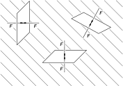

We begin by considering hydrostatics, the theory of liquids at rest. When liquids are at rest, there are no shear forces (even for viscous liquids). The law of hydrostatics, therefore, is that the stresses are always normal to any surface inside the fluid. The normal force per unit area is called the pressure. From the fact that there is no shear in a static fluid it follows that the pressure stress is the same in all directions (Fig. 40-1 ). We will let you entertain yourself by proving that if there is no shear on any plane in a fluid, the pressure must be the same in any direction.

### Figure Ch40-F2
Caption: Fig. 40–2. The pressure in a static liquid.
Image: figures/Ch40-F2.svg
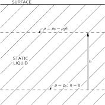

The pressure in a fluid may vary from place to place. For example, in a static fluid at the earth’s surface the pressure will vary with height because of the weight of the fluid. If the density \rho of the fluid is considered constant, and if the pressure at some arbitrary zero level is called p_0 (Fig. 40-2 ), then the pressure at a height h above this point is p=p_0-\rho gh , where g is the gravitational force per unit mass. The combination

p+\rho gh

is, therefore, a constant in the static fluid. This relation is familiar to you, but we will now derive a more general result of which it is a special case.

If we take a small cube of water, what is the net force on it from the pressure? Since the pressure at any place is the same in all directions, there can be a net force per unit volume only because the pressure varies from one point to another. Suppose that the pressure is varying in the x -direction—and we take the coordinate directions parallel to the cube edges. The pressure on the face at x gives the force p\,\Delta y\,\Delta z (Fig. 40-3 ), and the pressure on the face at x+\Delta x gives the force -[p+(\frac{\partial p}{\partial x})\,\Delta x]\,\Delta y\,\Delta z , so that the resultant force is -(\frac{\partial p}{\partial x})\,\Delta x\,\Delta y\,\Delta z . If we take the remaining pairs of faces of the cube, we easily see that the pressure force per unit volume is -\boldsymbol{\nabla}{p} . If there are other forces in addition—such as gravity—then the pressure must balance them to give equilibrium.

### Figure Ch40-F3
Caption: Fig. 40–3. The net pressure force on a cube is −∇p-\Fignabla p per unit volume.
Image: figures/Ch40-F3.svg
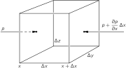

Let’s take a circumstance in which such an additional force can be described by a potential energy, as would be true in the case of gravitation; we will let \phi stand for the potential energy per unit mass. (For gravity, for instance, \phi is just gz .) The force per unit mass is given in terms of the potential by -\boldsymbol{\nabla}{\phi} , and if \rho is the density of the fluid, the force per unit volume is -\rho\,\boldsymbol{\nabla}{\phi} . For equilibrium this force per unit volume added to the pressure force per unit volume must give zero:

-\boldsymbol{\nabla}{p}-\rho\,\boldsymbol{\nabla}{\phi}=\FLPzero. (40.1)

Equation ( 40.1) is the equation of hydrostatics. In general, it has no solution. If the density varies in space in an arbitrary way, there is no way for the forces to be in balance, and the fluid cannot be in static equilibrium. Convection currents will start up. We can see this from the equation since the pressure term is a pure gradient, whereas for variable \rho the other term is not. Only when \rho is a constant is the potential term a pure gradient. Then the equation has a solution

p+\rho\phi=\text{const}.

Another possibility which allows hydrostatic equilibrium is for \rho to be a function only of p . However, we will leave the subject of hydrostatics because it is not nearly so interesting as the situation when fluids are in motion.

## 40–2 The equations of motion

First, we will discuss fluid motions in a purely abstract, theoretical way and then consider special examples. To describe the motion of a fluid, we must give its properties at every point. For example, at different places, the water (let us call the fluid “water”) is moving with different velocities. To specify the character of the flow, therefore, we must give the three components of velocity at every point and for any time. If we can find the equations that determine the velocity, then we would know how the liquid moves at all times. The velocity, however, is not the only property that the fluid has which varies from point to point. We have just discussed the variation of the pressure from point to point. And there are still other variables. There may also be a variation of density from point to point. In addition, the fluid may be a conductor and carry an electric current whose density \mathbf{j} varies from point to point in magnitude and direction. There may be a temperature which varies from point to point, or a magnetic field, and so on. So the number of fields needed to describe the complete situation will depend on how complicated the problem is. There are interesting phenomena when currents and magnetism play a dominant part in determining the behavior of the fluid; the subject is called magnetohydrodynamics, and great attention is being paid to it at the present time. However, we are not going to consider these more complicated situations because there are already interesting phenomena at a lower level of complexity, and even the more elementary level will be complicated enough.

We will take the situation where there is no magnetic field and no conductivity, and we will not worry about the temperature because we will suppose that the density and pressure determine in a unique manner the temperature at any point. As a matter of fact, we will reduce the complexity of our work by making the assumption that the density is a constant—we imagine that the fluid is essentially incompressible. Putting it another way, we are supposing that the variations of pressure are so small that the changes in density produced thereby are negligible. If that is not the case, we would encounter phenomena additional to the ones we will be discussing here—for example, the propagation of sound or of shock waves. We have already discussed the propagation of sound and shocks to some extent, so we will now isolate our consideration of hydrodynamics from these other phenomena by making the approximation that the density \rho is a constant. It is easy to determine when the approximation of constant \rho is a good one. We can say that if the velocities of flow are much less than the speed of a sound wave in the fluid, we do not have to worry about variations in density. The escape that water makes in our attempts to understand it is not related to the approximation of constant density. The complications that do permit the escape will be discussed in the next chapter.

In the general theory of fluids one must begin with an equation of state for the fluid which connects the pressure to the density. In our approximation this equation of state is simply

\rho=\text{const}.

This then is the first relation for our variables. The next relation expresses the conservation of matter—if matter flows away from a point, there must be a decrease in the amount left behind. If the fluid velocity is \mathbf{v} , then the mass which flows in a unit time across a unit area of surface is the component of \rho\mathbf{v} normal to the surface. We have had a similar relation in electricity. We also know from electricity that the divergence of such a quantity gives the rate of decrease of the density per unit time. In the same way, the equation

\mathbf{d}iv{(\rho\mathbf{v})}=-\frac{\partial \rho}{\partial t} (40.2)

expresses the conservation of mass for a fluid; it is the hydrodynamic equation of continuity. In our approximation, which is the incompressible fluid approximation, \rho is a constant, and the equation of continuity is simply

\mathbf{d}iv{\mathbf{v}}=0. (40.3)

The fluid velocity \mathbf{v} —like the magnetic field \mathbf{B} —has zero divergence. (The hydrodynamic equations are often closely analogous to the electrodynamic equations; that’s why we studied electrodynamics first. Some people argue the other way; they think that one should study hydrodynamics first so that it will be easier to understand electricity afterwards. But electrodynamics is really much easier than hydrodynamics.)

We will get our next equation from Newton’s law which tells us how the velocity changes because of the forces. The mass of an element of volume of the fluid times its acceleration must be equal to the force on the element. Taking an element of unit volume, and writing the force per unit volume as \FLPf , we have

\rho\times(\text{acceleration})=\FLPf.

We will write the force density as the sum of three terms. We have already considered the pressure force per unit volume, -\boldsymbol{\nabla}{p} . Then there are the “external” forces which act at a distance—like gravity or electricity. When they are conservative forces with a potential per unit mass, \phi , they give a force density -\rho\,\boldsymbol{\nabla}{\phi} . (If the external forces are not conservative, we would have to write \FLPf_{\text{ext}} for the external force per unit volume.) Then there is another “internal” force per unit volume, which is due to the fact that in a flowing fluid there can also be a shearing stress. This is called the viscous force, which we will write \FLPf_{\text{visc}} . Our equation of motion is

\rho\times(\text{acceleration})= -\boldsymbol{\nabla}{p}-\rho\,\boldsymbol{\nabla}{\phi}+\FLPf_{\text{visc}}. (40.4)

For this chapter we are going to suppose that the liquid is “thin” in the sense that the viscosity is unimportant, so we will omit \FLPf_{\text{visc}} . When we drop the viscosity term, we will be making an approximation which describes some ideal stuff rather than real water. John von Neumann was well aware of the tremendous difference between what happens when you don’t have the viscous terms and when you do, and he was also aware that, during most of the development of hydrodynamics until about 1900, almost the main interest was in solving beautiful mathematical problems with this approximation which had almost nothing to do with real fluids. He characterized the theorist who made such analyses as a man who studied “dry water.” Such analyses leave out an essential property of the fluid. It is because we are leaving this property out of our calculations in this chapter that we have given it the title “The Flow of Dry Water.” We are postponing a discussion of real water to the next chapter.

### Figure Ch40-F4
Caption: Fig. 40–4. The acceleration of a fluid particle.
Image: figures/Ch40-F4.svg
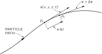

If we leave out \FLPf_{\text{visc}} , we have in Eq. ( 40.4) everything we need except an expression for the acceleration. You might think that the formula for the acceleration of a fluid particle would be very simple, for it seems obvious that if \mathbf{v} is the velocity of a fluid particle at some place in the fluid, the acceleration would just be \frac{\partial \mathbf{v}}{\partial t} . It is not —and for a rather subtle reason. The derivative \frac{\partial \mathbf{v}}{\partial t} , is the rate at which the velocity \mathbf{v}(x,y,z,t) changes at a fixed point in space. What we need is how fast the velocity changes for a particular piece of fluid. Imagine that we mark one of the drops of water with a colored speck so we can watch it. In a small interval of time \Delta t , this drop will move to a different location. If the drop is moving along some path as sketched in Fig. 40-4 , it might in \Delta t move from P_1 to P_2 . In fact, it will move in the x -direction by an amount v_x\,\Delta t , in the y -direction by the amount v_y\,\Delta t , and in the z -direction by the amount v_z\,\Delta t . We see that, if \mathbf{v}(x,y,z,t) is the velocity of the fluid particle which is at (x,y,z) at the time t , then the velocity of the same particle, at the time t+\Delta t is given by \mathbf{v}(x+\Delta x,y+\Delta y,z+\Delta z,t+\Delta t) —with

\Delta x=v_x\,\Delta t,\quad \Delta y=v_y\,\Delta t,\quad \text{and}\quad \Delta z=v_z\,\Delta t.

From the definition of the partial derivatives—recall Eq. ( 2.7)—we have, to first order, that

\begin{aligned} \mathbf{v}(x+v_x\Delta t,\,y+v_y\Delta t,\,z+v_z\Delta t,\,t+\Delta t)=\\[1.5ex] \mathbf{v}(x,y,z,t)\!+\! \frac{\partial \mathbf{v}}{\partial x}\,v_x\Delta t+\! \frac{\partial \mathbf{v}}{\partial y}\,v_y\Delta t+\! \frac{\partial \mathbf{v}}{\partial z}\,v_z\Delta t+\! \frac{\partial \mathbf{v}}{\partial t}\,\Delta t. \end{aligned}

The acceleration \Delta\mathbf{v}/\Delta t is

v_x\,\frac{\partial \mathbf{v}}{\partial x}+v_y\,\frac{\partial \mathbf{v}}{\partial y}+v_z\,\frac{\partial \mathbf{v}}{\partial z}+\frac{\partial \mathbf{v}}{\partial t}.

We can write this symbolically—treating \boldsymbol{\nabla} as a vector—as

(\mathbf{v}\cdot\boldsymbol{\nabla})\mathbf{v}+\frac{\partial \mathbf{v}}{\partial t}. (40.5)

Note that there can be an acceleration even though \frac{\partial \mathbf{v}}{\partial t}=\FLPzero so that velocity at a given point is not changing. As an example, water flowing in a circle at a constant speed is accelerating even though the velocity at a given point is not changing. The reason is, of course, that the velocity of a particular piece of water which is initially at one point on the circle has a different direction a moment later; there is a centripetal acceleration.

The rest of our theory is just mathematical—finding solutions of the equation of motion we get by putting the acceleration ( 40.5) into Eq. ( 40.4). We get

\frac{\partial \mathbf{v}}{\partial t}+(\mathbf{v}\cdot\boldsymbol{\nabla})\mathbf{v}= -\frac{\boldsymbol{\nabla}{p}}{\rho}-\boldsymbol{\nabla}{\phi}, (40.6)

where viscosity has been omitted. We can rearrange this equation by using the following identity from vector analysis:

(\mathbf{v}\cdot\boldsymbol{\nabla})\mathbf{v}=(\mathbf{c}url{\mathbf{v}})\times\mathbf{v}+ \frac{1}{2}\boldsymbol{\nabla}{(\mathbf{v}\cdot\mathbf{v})}.

If we now define a new vector field \boldsymbol{\Omega} , as the curl of \mathbf{v} ,

\boldsymbol{\Omega}=\mathbf{c}url{\mathbf{v}}, (40.7)

the vector identity can be written as

(\mathbf{v}\cdot\boldsymbol{\nabla})\mathbf{v}=\boldsymbol{\Omega}\times\mathbf{v}+ \frac{1}{2}\boldsymbol{\nabla}{v^2},

and our equation of motion ( 40.6) becomes

\frac{\partial \mathbf{v}}{\partial t}+\boldsymbol{\Omega}\times\mathbf{v}+ \frac{1}{2}\,\boldsymbol{\nabla}{v^2}= -\frac{\boldsymbol{\nabla}{p}}{\rho}-\boldsymbol{\nabla}{\phi}. (40.8)

You can verify that Eqs. ( 40.6) and ( 40.8) are equivalent by checking that the components of the two sides of the equation are equal—and making use of ( 40.7).

The vector field \boldsymbol{\Omega} is called the vorticity. If the vorticity is zero everywhere, we say that the flow is irrotational. We have already defined in Section 3-5 a thing called the circulation of a vector field. The circulation around any closed loop in a fluid is the line integral of the fluid velocity, at a given instant of time, around that loop:

(\text{Circulation})=\oint\mathbf{v}\cdot d\mathbf{s}.

The circulation per unit area for an infinitesimal loop is then—using Stokes’ theorem—equal to \mathbf{c}url{\mathbf{v}} . So the vorticity \boldsymbol{\Omega} is the circulation around a unit area (perpendicular to the direction of \boldsymbol{\Omega} ). It also follows that if you put a little piece of dirt— not an infinitesimal point—at any place in the liquid it will rotate with the angular velocity \boldsymbol{\Omega}/2 . Try to see if you can prove that. You can also check it out that for a bucket of water on a turntable, \boldsymbol{\Omega} is equal to twice the local angular velocity of the water.

If we are interested only in the velocity field, we can eliminate the pressure from our equations. Taking the curl of both sides of Eq. ( 40.8), remembering that \rho is a constant and that the curl of any gradient is zero, and using Eq. ( 40.3), we get

\frac{\partial \boldsymbol{\Omega}}{\partial t}+\mathbf{c}url{(\boldsymbol{\Omega}\times\mathbf{v})}=\FLPzero. (40.9)

This equation, together with the equations

\boldsymbol{\Omega}=\mathbf{c}url{\mathbf{v}} (40.10)

and

\mathbf{d}iv{\mathbf{v}}=0, (40.11)

describes completely the velocity field \mathbf{v} . Mathematically speaking, if we know \boldsymbol{\Omega} at some time, then we know the curl of the velocity vector, and we also know that its divergence is zero, so given the physical situation we have all we need to determine \mathbf{v} everywhere. (It is just like the situation in magnetism where we had \mathbf{d}iv{\mathbf{B}}=0 and \mathbf{c}url{\mathbf{B}}=\mathbf{j}/\epsilon_0 c^2 .) Thus, a given \boldsymbol{\Omega} determines \mathbf{v} just as a given \mathbf{j} determines \mathbf{B} . Then, knowing \mathbf{v} , Eq. ( 40.9) tells us the rate of change of \boldsymbol{\Omega} from which we can get the new \boldsymbol{\Omega} for the next instant. Using Eq. ( 40.10), again we find the new \mathbf{v} , and so on. You see how these equations contain all the machinery for calculating the flow. Note, however, that this procedure gives the velocity field only; we have lost all information about the pressure.

We point out one special consequence of our equation. If \boldsymbol{\Omega}=\FLPzero everywhere at any time t , \frac{\partial \boldsymbol{\Omega}}{\partial t} also vanishes, so that \boldsymbol{\Omega} is still zero everywhere at t+\Delta t . We have a solution to the equation; the flow is permanently irrotational. If a flow was started with zero rotation, it would always have zero rotation. The equations to be solved then are

\mathbf{d}iv{\mathbf{v}}=0,\quad \mathbf{c}url{\mathbf{v}}=\FLPzero.

They are just like the equations for the electrostatic or magnetostatic fields in free space. We will come back to them and look at some special problems later.

## 40–3 Steady flow—Bernoulli’s theorem

Now we want to return to the equation of motion, Eq. ( 40.8), but limit ourselves to situations in which the flow is “steady.” By steady flow we mean that at any one place in the fluid the velocity never changes. The fluid at any point is always replaced by new fluid moving in exactly the same way. The velocity picture always looks the same— \mathbf{v} is a static vector field. In the same way that we drew “field lines” in magnetostatics, we can now draw lines which are always tangent to the fluid velocity as shown in Fig. 40-5 . These lines are called streamlines. For steady flow, they are evidently the actual paths of fluid particles. (In unsteady flow the streamline pattern changes in time, and the streamline pattern at any instant does not represent the path of a fluid particle.)

### Figure Ch40-F5
Caption: Fig. 40–5. Streamlines in steady fluid flow.
Image: figures/Ch40-F5.svg
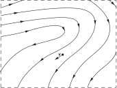

A steady flow does not mean that nothing is happening—atoms in the fluid are moving and changing their velocities. It only means that \frac{\partial \mathbf{v}}{\partial t}=\FLPzero . Then if we take the dot product of \mathbf{v} into the equation of motion, the term \mathbf{v}\cdot(\boldsymbol{\Omega}\times\mathbf{v}) drops out, and we are left with

\mathbf{v}\cdot\boldsymbol{\nabla}{\biggl\{ \frac{p}{\rho}+\phi+\frac{1}{2}\,v^2 \biggr\}}=0. (40.12)

This equation says that for a small displacement in the direction of the fluid velocity the quantity inside the brackets doesn’t change. Now in steady flow all displacements are along streamlines, so Eq. ( 40.12) tells us that for all the points along a streamline, we can write

\frac{p}{\rho}+\frac{1}{2}\,v^2+\phi=\text{const}\:(\text{streamline}). (40.13)

This is Bernoulli’s theorem. The constant may in general be different for different streamlines; all we know is that the left-hand side of Eq. ( 40.13) is the same all along a given streamline. Incidentally, we may notice that for steady irrotational motion for which \boldsymbol{\Omega}=\FLPzero , the equation of motion ( 40.8) gives us the relation

\boldsymbol{\nabla}{\biggl\{ \frac{p}{\rho}+\frac{1}{2}\,v^2+\phi \biggr\}}=0,

so that

\frac{p}{\rho}+\frac{1}{2}\,v^2+\phi=\text{const}\:(\text{everywhere}). (40.14)

It’s just like Eq. ( 40.13) except that now the constant has the same value throughout the fluid.

The theorem of Bernoulli is in fact nothing more than a statement of the conservation of energy. A conservation theorem such as this gives us a lot of information about a flow without our actually having to solve the detailed equations. Bernoulli’s theorem is so important and so simple that we would like to show you how it can be derived in a way that is different from the formal calculations we have just used. Imagine a bundle of adjacent streamlines which form a stream tube as sketched in Fig. 40-6. Since the walls of the tube consist of streamlines, no fluid flows out through the wall. Let’s call the area at one end of the stream tube A_1 , the fluid velocity there v_1 , the density of the fluid \rho_1 , and the potential energy \phi_1 . At the other end of the tube, we have the corresponding quantities A_2 , v_2 , \rho_2 , and \phi_2 . Now after a short interval of time \Delta t , the fluid at A_1 has moved a distance v_1\,\Delta t , and the fluid at A_2 has moved a distance v_2\,\Delta t [Fig. 40-6 (b)]. The conservation of mass requires that the mass which enters through A_1 must be equal to the mass which leaves through A_2 . These masses at these two ends must be the same:

\Delta M=\rho_1A_1v_1\,\Delta t=\rho_2A_2v_2\,\Delta t.

So we have the equality

\rho_1A_1v_1=\rho_2A_2v_2. (40.15)

This equation tells us that the velocity varies inversely with the area of the stream tube if \rho is constant.

### Figure Ch40-F6
Caption: Fig. 40–6. Fluid motion in a flow tube.
Image: figures/Ch40-F6.svg
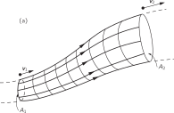

Now we calculate the work done by the fluid pressure. The work done on the fluid entering at A_1 is p_1A_1v_1\,\Delta t , and the work given up at A_2 is p_2A_2v_2\,\Delta t . The net work on the fluid between A_1 and A_2 is, therefore,

p_1A_1v_1\,\Delta t-p_2A_2v_2\,\Delta t,

which must equal the increase in the energy of a mass \Delta M of fluid in going from A_1 to A_2 . In other words,

p_1A_1v_1\,\Delta t-p_2A_2v_2\,\Delta t=\Delta M(E_2-E_1), (40.16)

where E_1 is the energy per unit mass of fluid at A_1 , and E_2 is the energy per unit mass at A_2 . The energy per unit mass of the fluid can be written as

E=\frac{1}{2}v^2+\phi+U,

where \frac{1}{2}v^2 is the kinetic energy per unit mass, \phi is the potential energy per unit mass, and U is an additional term which represents the internal energy per unit mass of fluid. The internal energy might correspond, for example, to the thermal energy in a compressible fluid, or to chemical energy. All these quantities can vary from point to point. Using this form for the energies in ( 40.16), we have

\begin{aligned} \frac{p_1A_1v_1\,\Delta t}{\Delta M}&- \frac{p_2A_2v_2\,\Delta t}{\Delta M}\,=\\[1ex] \frac{1}{2}\,v_2^2+\phi_2+U_2&- \frac{1}{2}\,v_1^2-\phi_1-U_1. \end{aligned}

But we have seen that \Delta M=\rho Av\,\Delta t , so we get

\begin{aligned} &\frac{p_1}{\rho_1}+\frac{1}{2}\,v_1^2+\phi_1+U_1\,=\\[1ex] &\frac{p_2}{\rho_2}+\frac{1}{2}\,v_2^2+\phi_2+U_2, \end{aligned} (40.17)

which is the Bernoulli result with an additional term for the internal energy. If the fluid is incompressible, the internal energy term is the same on both sides, and we get again that Eq. ( 40.14) holds along any streamline.

### Figure Ch40-F7
Caption: Fig. 40–7. Flow from a tank.
Image: figures/Ch40-F7.svg
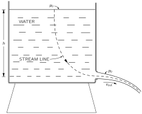

We consider now some simple examples in which the Bernoulli integral gives us a description of the flow. Suppose we have water flowing out of a hole near the bottom of a tank, as drawn in Fig. 40-7. We take a situation in which the flow speed v_{\text{out}} at the hole is much larger than the flow speed near the top of the tank; in other words, we imagine that the diameter of the tank is so large that we can neglect the drop in the liquid level. (We could make a more accurate calculation if we wished.) At the top of the tank the pressure is p_0 , the atmospheric pressure, and the pressure at the sides of the jet is also p_0 . Now we write our Bernoulli equation for a streamline, such as the one shown in the figure. At the top of the tank, we take v equal to zero and we also take the gravity potential \phi to be zero. At the hole v=v_{\text{out}} and \phi=-gh , so that

p_0=p_0+\frac{1}{2}\rho v_{\text{out}}^2-\rho gh,

or

v_{\text{out}}=\sqrt{2gh}. (40.18)

This velocity is just what we would get for something which falls the distance h . It is not too surprising, since the water at the exit gains kinetic energy at the expense of the potential energy of the water at the top. Do not get the idea, however, that you can figure out the rate that the fluid flows out of the tank by multiplying this velocity by the area of the hole. The fluid velocities as the jet leaves the hole are not all parallel to each other but have components inward toward the center of the stream—the jet is converging. After the jet has gone a little way, the contraction stops and the velocities do become parallel. So the total flow is the velocity times the area at that point. In fact, if we have a discharge opening which is just a round hole with a sharp edge, the jet contracts to 62 percent of the area of the hole. The reduced effective area of the discharge varies for different shapes of discharge tubes, and experimental contractions are available as tables of efflux coefficients.

### Figure Ch40-F8
Caption: Fig. 40–8. With a re-entrant discharge tube, the stream contracts to one-half the area of the opening.
Image: figures/Ch40-F8.svg
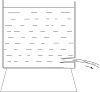

If the discharge tube is re-entrant, as shown in Fig. 40-8, it is possible to prove in a most beautiful way that the efflux coefficient is exactly 50 percent. We will give just a hint of how the proof goes. We have used the conservation of energy to get the velocity, Eq. ( 40.18), but there is also momentum conservation to consider. Since there is an outflow of momentum in the discharge jet, there must be a force applied over the cross section of the discharge tube. Where does the force come from? The force must come from the pressure on the walls. As long as the efflux hole is small and away from the walls, the fluid velocity near the walls of the tank will be very small. Therefore, the pressure on every face is almost exactly the same as the static pressure in a fluid at rest—from Eq. ( 40.14). Then the static pressure at any point on the side of the tank must be matched by an equal pressure at the point on the opposite wall, except at the points on the wall opposite the charge tube. If we calculate the momentum poured out through the jet by this pressure, we can show that the efflux coefficient is 1/2 . We cannot use this method for a discharge hole like that shown in Fig. 40-7, however, because the velocity increase along the wall right near the discharge area gives a pressure fall which we are not able to calculate.

### Figure Ch40-F9
Caption: Fig. 40–9. The pressure is lowest where the velocity is highest.
Image: figures/Ch40-F9.svg
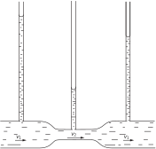

Let’s look at another example—a horizontal pipe with changing cross section, as shown in Fig. 40-9, with water flowing in one end and out the other. The conservation of energy, namely Bernoulli’s formula, says that the pressure is lower in the constricted area where the velocity is higher. We can easily demonstrate this effect by measuring the pressure at different cross sections with small vertical columns of water attached to the flow tube through holes small enough so that they do not disturb the flow. The pressure is then measured by the height of water in these vertical columns. The pressure is found to be less at the constriction than it is on either side. If the area beyond the constriction comes back to the same value it had before the constriction, the pressure rises again. Bernoulli’s formula would predict that the pressure downstream of the constriction should be the same as it was upstream, but actually it is noticeably less. The reason that our prediction is wrong is that we have neglected the frictional, viscous forces which cause a pressure drop along the tube. Despite this pressure drop the pressure is definitely lower at the constriction (because of the increased speed) than it is on either side of it—as predicted by Bernoulli. The speed v_2 must certainly exceed v_1 to get the same amount of water through the narrower tube. So the water accelerates in going from the wide to the narrow part. The force that gives this acceleration comes from the drop in pressure.

### Figure Ch40-F10
Caption: Fig. 40–10. Proof that vv is not equal to √2gh\sqrt{2gh}.
Image: figures/Ch40-F10.svg
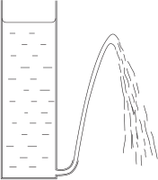

We can check our results with another simple demonstration. Suppose we have on a tank a discharge tube which throws a jet of water upward as shown in Fig. 40-10. If the efflux velocity were exactly \sqrt{2gh} , the discharge water should rise to a level even with the surface of the water in the tank. Experimentally, it falls somewhat short. Our prediction is roughly right, but again viscous friction which has not been included in our energy conservation formula has resulted in a loss of energy.

Have you ever held two pieces of paper close together and tried to blow them apart? Try it! They come together. The reason, of course, is that the air has a higher speed going through the constricted space between the sheets than it does when it gets outside. The pressure between the sheets is lower than atmospheric pressure, so they come together rather than separating.

## 40–4 Circulation

We saw at the beginning of the last section that if we have an incompressible fluid with no circulation, the flow satisfies the following two equations:

\mathbf{d}iv{\mathbf{v}}=0,\quad \mathbf{c}url{\mathbf{v}}=\FLPzero. (40.19)

They are the same as the equations of electrostatics or magnetostatics in empty space. The divergence of the electric field is zero when there are no charges, and the curl of the electrostatic field is always zero. The curl of the magnetostatic field is zero if there are no currents, and the divergence of the magnetic field is always zero. Therefore, Eqs. ( 40.19) have the same solutions as the equations for \mathbf{E} in electrostatics or for \mathbf{B} in magnetostatics. As a matter of fact, we have already solved the problem of the flow of a fluid past a sphere, as an electrostatic analogy, in Section 12-5 . The electrostatic analog is a uniform electric field plus a dipole field. The dipole field is so adjusted that the flow velocity normal to the surface of the sphere is zero. The same problem for the flow past a cylinder can be worked out in a similar way by using a suitable line dipole with a uniform flow field. This solution holds for a situation in which the fluid velocity at large distances is constant—both in magnitude and direction. The solution is sketched in Fig. 40-11 (a).

### Figure Ch40-F11
Caption: Fig. 40–11. (a) Ideal fluid flow past a cylinder. (b) Circulation around a cylinder. (c) The superposition of (a) and (b).
Image: figures/Ch40-F11.svg
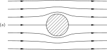

There is another solution for the flow around a cylinder when the conditions are such that the fluid at large distances moves in circles around the cylinder. The flow is, then, circular everywhere, as in Fig. 40-11 (b). Such a flow has a circulation around the cylinder, although \mathbf{c}url{\mathbf{v}} is still zero in the fluid. How can there be circulation without a curl? We have a circulation around the cylinder because the line integral of \mathbf{v} around any loop enclosing the cylinder is not zero. At the same time, the line integral of \mathbf{v} around any closed path which does not include the cylinder is zero. We saw the same thing when we found the magnetic field around a wire. The curl of \mathbf{B} was zero outside of the wire, although a line integral of \mathbf{B} around a path which encloses the wire did not vanish. The velocity field in an irrotational circulation around a cylinder is precisely the same as the magnetic field around a wire. For a circular path with its center at the center of the cylinder, the line integral of the velocity is

\oint\mathbf{v}\cdot d\mathbf{s}=2\pi rv.

For irrotational flow the integral must be independent of r . Let’s call the constant value C , then we have that

v=\frac{C}{2\pi r}, (40.20)

where v is the tangential velocity, and r is the distance from the axis.

There is a nice demonstration of a fluid circulating around a hole. You take a transparent cylindrical tank with a drain hole in the center of the bottom. You fill it with water, stir up some circulation with a stick, and pull the drain plug. You get the pretty effect shown in Fig. 40-12. (You’ve seen a similar thing many times in the bathtub!) Although you put in some \omega at beginning, it soon dies down because of viscosity and the flow becomes irrotational—although still with some circulation around the hole.

### Figure Ch40-F12
Caption: Fig. 40–12. Water with circulation draining from a tank.
Image: figures/Ch40-F12.svg
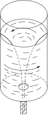

From the theory, we can calculate the shape of the inner surface of the water. As a particle of the water moves inward it picks up speed. From Eq. ( 40.20) the tangential velocity goes as 1/r —it’s just from the conservation of angular momentum, like the skater pulling in her arms. Also the radial velocity goes as 1/r . Ignoring the tangential motion, we have water going radially inward toward a hole; from \mathbf{d}iv{\mathbf{v}}=0 , it follows that the radial velocity is proportional to 1/r . So the total velocity also increases as 1/r , and the water goes in along equiangular (or "logarithmic") spirals. The air-water surface is all at atmospheric pressure, so it must have—from Eq. ( 40.14)—the property that

gz+\frac{1}{2}v^2=\text{const}.

But v is proportional to 1/r , so the shape of the surface is

(z-z_0)=\frac{k}{r^2}.

An interesting point—which is not true in general but is true for incompressible, irrotational flow—is that if we have one solution and a second solution, then the sum is also a solution. This is true because the equations in ( 40.19) are linear. The complete equations of hydrodynamics, Eqs. ( 40.9), ( 40.10), and ( 40.11), are not linear, which makes a vast difference. For the irrotational flow about the cylinder, however, we can superpose the flow of Fig. 40-11 (a) on the flow of Fig. 40-11 (b) and get the new flow pattern shown in Fig. 40-11 (c). This flow is of special interest. The flow velocity is higher on the upper side of the cylinder than on the lower side. The pressures are therefore lower on the upper side than on the lower side. So when we have a combination of a circulation around a cylinder and a net horizontal flow, there is a net vertical force on the cylinder—it is called a lift force. Of course, if there is no circulation, there is no net force on any body according to our theory of “dry” water.

## 40–5 Vortex lines

We have already written down the general equations for the flow of an incompressible fluid when there may be vorticity. They are

\begin{aligned} \text{I.}&\quad\mathbf{d}iv{\mathbf{v}}=0,\\[1.5ex] \text{II.}&\quad\boldsymbol{\Omega}=\mathbf{c}url{\mathbf{v}},\\[1ex] \text{III.}&\quad\frac{\partial \boldsymbol{\Omega}}{\partial t}+ \mathbf{c}url{(\boldsymbol{\Omega}\times\mathbf{v})}=\FLPzero. \end{aligned}

The physical content of these equations has been described in words by Helmholtz in terms of three theorems. First, imagine that in the fluid we were to draw vortex lines rather than streamlines. By vortex lines we mean field lines that have the direction of \boldsymbol{\Omega} and have a density in any region proportional to the magnitude of \boldsymbol{\Omega} . From II the divergence of \boldsymbol{\Omega} is always zero (remember—Section 3-7 —that the divergence of a curl is always zero). So vortex lines are like lines of \mathbf{B} —they never start or stop, and will tend to go in closed loops. Now Helmholtz described III in words by the following statement: the vortex lines move with the fluid. This means that if you were to mark the fluid particles along some vortex lines—by coloring them with ink, for example—then as the fluid moves and carries those particles along, they will always mark the new positions of the vortex lines. In whatever way the atoms of the liquid move, the vortex lines move with them. That is one way to describe the laws.

It also suggests a method for solving any problems. Given the initial flow pattern—say \mathbf{v} everywhere—then you can calculate \boldsymbol{\Omega} . From the \mathbf{v} you can also tell where the vortex lines are going to be a little later—they move with the speed \mathbf{v} . With the new \boldsymbol{\Omega} you can use I and II to find the new \mathbf{v} . (That’s just like the problem of finding \mathbf{B} , given the currents.) If we are given the flow pattern at one instant we can in principle calculate it for all subsequent times. We have the general solution for nonviscous flow.

### Figure Ch40-F13
Caption: Fig. 40–13. (a) A group of vortex lines at tt; (b) the same lines at a later time t′t'.
Image: figures/Ch40-F13.svg
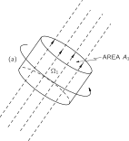

We would like to show how Helmholtz’s statement—and, therefore, III—can be at least partly understood. It is really just the law of conservation of angular momentum applied to the fluid. Suppose we imagine a small cylinder of the liquid whose axis is parallel to the vortex lines, as in Fig. 40-13 (a). At some time later, this same piece of fluid will be somewhere else. Generally it will occupy a cylinder with a different diameter and be in a different place. It may also have a different orientation, say as in Fig. 40-13 (b). If, however, the diameter has decreased as shown in Fig. 40-13, the length will have increased to keep the volume constant (since we are assuming an incompressible fluid). Also, since the vortex lines are stuck with the material, their density will go up as the cross-sectional area goes down. The product of the vorticity \boldsymbol{\Omega} and area A of the cylinder will remain constant, so according to Helmholtz, we should have

\Omega_2A_2=\Omega_1A_1. (40.21)

Now notice that with zero viscosity all the forces on the surface of the cylindrical volume (or any volume, for that matter) are perpendicular to the surface. The pressure forces can cause the volume to be moved from place to place, or can cause it to change shape; but with no tangential forces the magnitude of the angular momentum of the material inside cannot change. The angular momentum of the liquid in the little cylinder is its moment of inertia I times the angular velocity of the liquid, which is proportional to the vorticity \Omega . For a cylinder, the moment of inertia is proportional to mr^2 . So from the conservation of angular momentum, we would conclude that

(M_1R_1^2)\,\Omega_1=(M_2R_2^2)\,\Omega_2.

But the mass is the same, M_1=M_2 , and the areas are proportional to R^2 , so we get again just Eq. ( 40.21). Helmholtz’s statement—which is equivalent to III—is just a consequence of the fact that in the absence of viscosity the angular momentum of an element of the fluid cannot change.

### Figure Ch40-F14
Caption: Fig. 40–14. Making a travelling vortex ring.
Image: figures/Ch40-F14.svg
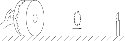

There is a nice demonstration of a moving vortex which is made with the simple apparatus of Fig. 40-14. It is a “drum” two feet in diameter and two feet long made by stretching a thick rubber sheet over the open end of a cylindrical “box.” The “bottom”—the drum is tipped on its side—is solid except for a 3 -inch diameter hole. If you give a sharp blow on the rubber diaphragm with your hand, a vortex ring is projected out of the hole. Although the vortex is invisible, you can tell it’s there because it will blow out a candle 10 to 20 feet away. By the delay in the effect, you can tell that “something” is travelling at a finite speed. You can see better what is going on if you first blow some smoke into the box. Then you see the vortex as a beautiful round “smoke ring.”

### Figure Ch40-F15
Caption: Fig. 40–15. A moving vortex ring (a smoke ring). (a) The vortex lines. (b) A cross section of the ring.
Image: figures/Ch40-F15.svg

The smoke ring is a torus-shaped bundle of vortex lines, as shown in Fig. 40-15(a). Since \boldsymbol{\Omega}=\mathbf{c}url{\mathbf{v}} , these vortex lines represent also a circulation of \mathbf{v} as shown in part (b) of the figure. We can understand the forward motion of the ring in the following way: The circulating velocity around the bottom of the ring extends up to the top of the ring, having there a forward motion. Since the lines of \boldsymbol{\Omega} move with the fluid, they also move ahead with the velocity \mathbf{v} . (Of course, the circulation of \mathbf{v} around the top part of the ring is responsible for the forward motion of the vortex lines at the bottom.)

We must now mention a serious difficulty. We have already noted that Eq. ( 40.9) says that, if \boldsymbol{\Omega} is initially zero, it will always be zero. This result is a great failure of the theory of “dry” water, because it means that once \boldsymbol{\Omega} is zero it is always zero—it is impossible to produce any vorticity under any circumstance. Yet, in our simple demonstration with the drum, we can generate a vortex ring starting with air which was initially at rest. (Certainly, \mathbf{v}=\FLPzero , \boldsymbol{\Omega}=\FLPzero everywhere in the box before we hit it.) Also, we all know that we can start some vorticity in a lake with a paddle. Clearly, we must go to a theory of “wet” water to get a complete understanding of the behavior of a fluid.

Another feature of the dry water theory which is incorrect is the supposition we make regarding the flow at the boundary between it and the surface of a solid. When we discussed the flow past a cylinder—as in Fig. 40-11, for example—we permitted the fluid to slide along the surface of the solid. In our theory, the velocity at a solid surface could have any value depending on how it got started, and we did not consider any “friction” between the fluid and the solid. It is an experimental fact, however, that the velocity of a real fluid always goes to zero at the surface of a solid object. Therefore, our solution for the cylinder, with or without circulation, is wrong—as is our result regarding the generation of vorticity. We will tell you about the more correct theories in the next chapter.
