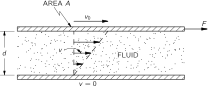
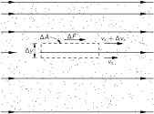
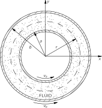
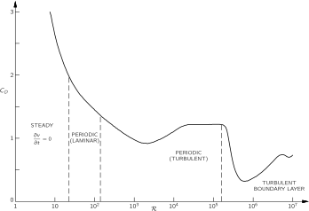
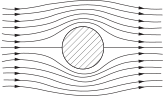
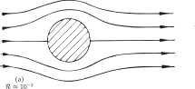
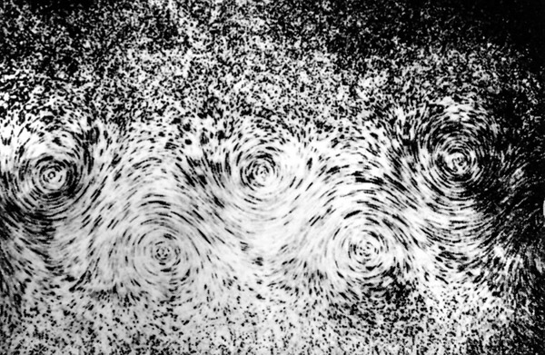
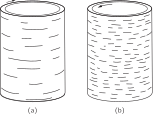
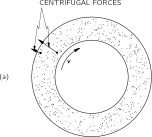

# 41. The Flow of Wet Water

## 41–1 Viscosity

In the last chapter we discussed the behavior of water, disregarding the phenomenon of viscosity. Now we would like to discuss the phenomena of the flow of fluids, including the effects of viscosity. We want to look at the real behavior of fluids. We will describe qualitatively the actual behavior of the fluids under various different circumstances so that you will get some feel for the subject. Although you will see some complicated equations and hear about some complicated things, it is not our purpose that you should learn all these things. This is, in a sense, a “cultural” chapter which will give you some idea of the way the world is. There is only one item which is worth learning, and that is the simple definition of viscosity which we will come to in a moment. The rest is only for your entertainment.

In the last chapter we found that the laws of motion of a fluid are contained in the equation

\frac{\partial \mathbf{v}}{\partial t}+(\mathbf{v}\cdot\boldsymbol{\nabla})\mathbf{v}= -\frac{\boldsymbol{\nabla}{p}}{\rho}-\boldsymbol{\nabla}{\phi}+ \frac{\FLPf_{\text{visc}}}{\rho}. (41.1)

In our “dry” water approximation we left out the last term, so we were neglecting all viscous effects. Also, we sometimes made an additional approximation by considering the fluid as incompressible; then we had the additional equation

\mathbf{d}iv{\mathbf{v}}=0.

This last approximation is often quite good—particularly when flow speeds are much slower than the speed of sound. But in real fluids it is almost never true that we can neglect the internal friction that we call viscosity; most of the interesting things that happen come from it in one way or another. For example, we saw that in “dry” water the circulation never changes—if there is none to start out with, there will never be any. Yet, circulation in fluids is an everyday occurrence. We must fix up our theory.

We begin with an important experimental fact. When we worked out the flow of “dry” water around or past a cylinder—the so-called “potential flow”—we had no reason not to permit the water to have a velocity tangent to the surface; only the normal component had to be zero. We took no account of the possibility that there might be a shear force between the liquid and the solid. It turns out—although it is not at all self-evident—that in all circumstances where it has been experimentally checked, the velocity of a fluid is exactly zero at the surface of a solid. You have noticed, no doubt, that the blade of a fan will collect a thin layer of dust—and that it is still there after the fan has been churning up the air. You can see the same effect even on the great fan of a wind tunnel. Why isn’t the dust blown off by the air? In spite of the fact that the fan blade is moving at high speed through the air, the speed of the air relative to the fan blade goes to zero right at the surface. So the very smallest dust particles are not disturbed. 1 We must modify the theory to agree with the experimental fact that in all ordinary fluids, the molecules next to a solid surface have zero velocity (relative to the surface). 2

### Figure Ch41-F1
Caption: Fig. 41–1.Viscous drag between two parallel plates.
Image: figures/Ch41-F1.svg

We originally characterized a liquid by the fact that if you put a shearing stress on it—no matter how small—it would give way. It flows. In static situations, there are no shear stresses. But before equilibrium is reached—as long as you still push on it—there can be shear forces. Viscosity describes these shear forces which exist in a moving fluid. To get a measure of the shear forces during the motion of a fluid, we consider the following kind of experiment. Suppose that we have two solid plane surfaces with water between them, as in Fig. 41–1 , and we keep one stationary while moving the other parallel to it at the slow speed v_0 . If you measure the force required to keep the upper plate moving, you find that it is proportional to the area of the plates and to v_0/d , where d is the distance between the plates. So the shear stress F/A is proportional to v_0/d :

\frac{F}{A}=\eta\,\frac{v_0}{d}.

The constant of proportionality \eta is called the coefficient of viscosity.

### Figure Ch41-F2
Caption: Fig. 41–2.The shear stress in a viscous fluid.
Image: figures/Ch41-F2.svg

If we have a more complicated situation, we can always consider a little, flat, rectangular cell in the water with its faces parallel to the flow, as in Fig. 41–2 . The shear force across this cell is given by

\frac{\Delta F}{\Delta A}=\eta\,\frac{\Delta v_x}{\Delta y} =\eta\frac{\partial v_x}{\partial y}. (41.2)

Now, \frac{\partial v_x}{\partial y} is the rate of change of the shear strain we defined in Chapter 39, so for a liquid, the shear stress is proportional to the rate of change of the shear strain.

In the general case we write

S_{xy}=\eta\biggl(\frac{\partial v_y}{\partial x}+\frac{\partial v_x}{\partial y}\biggr). (41.3)

If there is a uniform rotation of the fluid, \frac{\partial v_x}{\partial y} is the negative of \frac{\partial v_y}{\partial x} and S_{xy} is zero—as it should be since there are no stresses in a uniformly rotating fluid. (We did a similar thing in defining e_{xy} in Chapter 39.) There are, of course, the corresponding expressions for S_{yz} and S_{zx} .

### Figure Ch41-F3
Caption: Fig. 41–3.The flow in a fluid between two concentric cylinders rotating at different angular velocities.
Image: figures/Ch41-F3.svg

As an example of the application of these ideas, we consider the motion of a fluid between two coaxial cylinders. Let the inner one have the radius a and the peripheral velocity v_a , and let the outer one have radius b and velocity v_b . See Fig. 41–3 . We might ask, what is the velocity distribution between the cylinders? To answer this question, we begin by finding a formula for the viscous shear in the fluid at a distance r from the axis. From the symmetry of the problem, we can assume that the flow is always tangential and that its magnitude depends only on r ; v=v(r) . If we watch a speck in the water at the radius r , its coordinates as a function of time are

x=r\cos\omega t,\quad y=r\sin\omega t,

where \omega=v/r . Then the x - and y -components of velocity are

\begin{alignedat}{3} v_x\;&=&\;-r\omega\sin\omega t\;&=&\;-\omega&y,\\[.5ex] v_y\;&=&\;r\omega\cos\omega t\;&=&\omega&x. \end{alignedat} (41.4)

From Eq. ( 41.3), we have

\begin{aligned} S_{xy}&=\eta\biggl[\frac{\partial }{\partial x}\,(x\omega)-\frac{\partial }{\partial y}\,(y\omega)\biggl]\\[1.25ex] &=\eta\biggl[x\,\frac{\partial \omega}{\partial x}-y\,\frac{\partial \omega}{\partial y}\biggl]. \end{aligned} (41.5)

For a point at y=0 , \frac{\partial \omega}{\partial y}=0 , and x\,\frac{\partial \omega}{\partial x} is the same as r\,d\omega/dr . So at that point

(S_{xy})_{y=0}=\eta r\,\frac{d \omega}{d r}. (41.6)

(It is reasonable that S should depend on \frac{\partial \omega}{\partial r} ; when there is no change in \omega with r , the liquid is in uniform rotation and there are no stresses.)

The stress we have calculated is the tangential shear which is the same all around the cylinder. We can get the torque acting across a cylindrical surface at the radius r by multiplying the shear stress by the moment arm r and the area 2\pi rl (where l is the length of the cylinder). We get

\tau=2\pi r^2l(S_{xy})_{y=0}=2\pi\eta lr^3\,\frac{d \omega}{d r}. (41.7)

Since the motion of the water is steady—there is no angular acceleration—the net torque on the cylindrical shell of water between r and r+dr must be zero; that is, the torque at r must be balanced by an equal and opposite torque at r+dr , so that \tau must be independent of r . In other words, r^3\,d\omega/dr is equal to some constant, say A , and

\frac{d \omega}{d r}=\frac{A}{r^3}. (41.8)

Integrating, we find that \omega varies with r as

\omega=-\frac{A}{2r^2}+B. (41.9)

The constants A and B are to be determined to fit the conditions that \omega=\omega_a at r=a , and \omega=\omega_b at r=b . We get that

\begin{aligned} A&=\frac{2a^2b^2}{b^2-a^2}\,(\omega_b-\omega_a),\\[1.5ex] B&=\frac{b^2\omega_b-a^2\omega_a}{b^2-a^2}. \end{aligned} (41.10)

So we know \omega as a function of r , and from it v=\omega r .

If we want the torque, we can get it from Eqs. ( 41.7) and ( 41.8):

\tau=2\pi\eta lA

or

\tau=\frac{4\pi\eta la^2b^2}{b^2-a^2}\,(\omega_b-\omega_a). (41.11)

It is proportional to the relative angular velocities of the two cylinders. One standard apparatus for measuring the coefficients of viscosity is built this way. One cylinder—say the outer one—is on pivots but is held stationary by a spring balance which measures the torque on it, while the inner one is rotated at a constant angular velocity. The coefficient of viscosity is then determined from Eq. ( 41.11).

From its definition, you see that the units of \eta are newton \cdot sec/m ^2 . For water at 20^\circ C,

\eta=10^{-3}\:\text{newton$\cdot$sec/m$^2$}.

It is usually more convenient to use the kinematic viscosity, which is \eta divided by the density \rho . The values for water and air are then comparable:

\begin{aligned} \text{water at $20^\circ$C},&\quad \eta/\rho=10^{-6}\text{ m$^2$/sec},\\[.5ex] \text{air at $20^\circ$C},&\quad \eta/\rho=15\times10^{-6}\text{ m$^2$/sec}. \end{aligned} (41.12)

Viscosities usually depend strongly on temperature. For instance, for water just above the freezing point, \eta/\rho is 1.8 times larger than it is at 20^\circ C.

## 41–2 Viscous flow

We now go to a general theory of viscous flow—at least in the most general form known to man. We already understand that the shear stress components are proportional to the spatial derivatives of the various velocity components such as \frac{\partial v_x}{\partial y} or \frac{\partial v_y}{\partial x} . However, in the general case of a compressible fluid there is another term in the stress which depends on other derivatives of the velocity. The general expression is

S_{ij}=\eta\biggl(\frac{\partial v_i}{\partial x_j}+\frac{\partial v_j}{\partial x_i}\biggr)+ \eta'\,\delta_{ij}(\mathbf{d}iv{\mathbf{v}}), (41.13)

where x_i is any one of the rectangular coordinates x , y , or z , and v_i is any one of the rectangular coordinates of the velocity. (The symbol \delta_{ij} is the Kronecker delta which is 1 when i=j and 0 for i\neq j .) The additional term adds \eta'\,\mathbf{d}iv{\mathbf{v}} to all the diagonal elements S_{ii} of the stress tensor. If the liquid is incompressible \mathbf{d}iv{\mathbf{v}}=0 , and this extra term doesn’t appear. So it has to do with internal forces during compression. So two constants are required to describe the liquid, just as we had two constants to describe a homogeneous elastic solid. The coefficient \eta is the “ordinary” coefficient of viscosity which we have already encountered. It is also called the first coefficient of viscosity or the “shear viscosity coefficient,” and the new coefficient \eta' is called the second coefficient of viscosity.

Now we want to determine the viscous force per unit volume, \FLPf_{\text{visc}} , so we can put it into Eq. ( 41.1) to get the equation of motion for a real fluid. The force on a small cubical volume element of a fluid is the resultant of the forces on all the six faces. Taking them two at a time, we will get differences that depend on the derivatives of the stresses, and, therefore, on the second derivatives of the velocity. This is nice because it will get us back to a vector equation. The component of the viscous force per unit volume in the direction of the rectangular coordinate x_i is

\begin{aligned} (f_{\text{visc}})_i =&\sum_{j=1}^3\frac{\partial S_{ij}}{\partial x_j}\\[.75ex] =&\sum_{j=1}^3\frac{\partial }{\partial x_j}\biggl\{ \eta\biggl(\frac{\partial v_i}{\partial x_j}+\frac{\partial v_j}{\partial x_i}\biggr) \biggr\}\\ &+\;\;\frac{\partial }{\partial x_i}\,(\eta'\,\mathbf{d}iv{\mathbf{v}}). \end{aligned} (41.14)

Usually, the variation of the viscosity coefficients with position is not significant and can be neglected. Then, the viscous force per unit volume contains only second derivatives of the velocity. We saw in Chapter 39 that the most general form of second derivatives that can occur in a vector equation is the sum of a term in the Laplacian ( \mathbf{d}iv{\boldsymbol{\nabla}}\mathbf{v}=\nabla^2\mathbf{v} ), and a term in the gradient of the divergence \bigl(\boldsymbol{\nabla}{(\mathbf{d}iv{\mathbf{v}})}\bigr) . Equation ( 41.14) is just such a sum with the coefficients \eta and (\eta+\eta') . We get

\FLPf_{\text{visc}}=\eta\,\nabla^2\mathbf{v}+(\eta+\eta')\, \boldsymbol{\nabla}{(\mathbf{d}iv{\mathbf{v}})}. (41.15)

In the incompressible case, \mathbf{d}iv{\mathbf{v}}=0 , and the viscous force per unit volume is just \eta\,\nabla^2\mathbf{v} . That is all that many people use; however, if you should want to calculate the absorption of sound in a fluid, you would need the second term.

We can now complete our general equation of motion for a real fluid. Substituting Eq. ( 41.15) into Eq. ( 41.1), we get

\begin{aligned} \rho\biggl\{\frac{\partial \mathbf{v}}{\partial t}+(\mathbf{v}\cdot\boldsymbol{\nabla})\mathbf{v}\biggr\}=\\[1.25ex] -\boldsymbol{\nabla}{p}-\rho\,\boldsymbol{\nabla}{\phi}+\eta\,\nabla^2\mathbf{v}+ (\eta+\eta')\,\boldsymbol{\nabla}{(\mathbf{d}iv{\mathbf{v}})}. \end{aligned}

It’s complicated. But that’s the way nature is.

If we introduce the vorticity \boldsymbol{\Omega}=\mathbf{c}url{\mathbf{v}} , as we did before, we can write our equation as

\begin{gathered} \rho\biggl\{\frac{\partial \mathbf{v}}{\partial t}+\boldsymbol{\Omega}\times\mathbf{v}+ \frac{1}{2}\,\boldsymbol{\nabla}{v^2}\biggr\}=\\[1.25ex] -\boldsymbol{\nabla}{p}-\rho\,\boldsymbol{\nabla}{\phi}+\eta\,\nabla^2\mathbf{v} +(\eta+\eta')\,\boldsymbol{\nabla}{(\mathbf{d}iv{\mathbf{v}})}. \end{gathered} (41.16)

We are supposing again that the only body forces acting are conservative forces like gravity. To see what the new term means, let’s look at the incompressible fluid case. Then, if we take the curl of Eq. ( 41.16), we get

\frac{\partial \boldsymbol{\Omega}}{\partial t}+\mathbf{c}url{(\boldsymbol{\Omega}\times\mathbf{v})}= \frac{\eta}{\rho}\,\nabla^2\boldsymbol{\Omega}. (41.17)

This is like Eq. ( 40.9) except for the new term on the right-hand side. When the right-hand side was zero, we had the Helmholtz theorem that the vorticity stays with the fluid. Now, we have the rather complicated nonzero term on the right-hand side which, however, has straightforward physical consequences. If we disregard for the moment the term \mathbf{c}url{(\boldsymbol{\Omega}\times\mathbf{v})} , we have a diffusion equation. The new term means that the vorticity \boldsymbol{\Omega} diffuses through the fluid. If there is a large gradient in the vorticity, it will spread out into the neighboring fluid.

This is the term that causes the smoke ring to get thicker as it goes along. Also, it shows up nicely if you send a “clean” vortex (a “smokeless” ring made by the apparatus described in the last chapter) through a cloud of smoke. When it comes out of the cloud, it will have picked up some smoke, and you will see a hollow shell of a smoke ring. Some of the \boldsymbol{\Omega} diffuses outward into the smoke, while still maintaining its forward motion with the vortex.

## 41–3 The Reynolds number

We will now describe the changes which are made in the character of fluid flow as a consequence of the new viscosity term. We will look at two problems in some detail. The first of these is the flow of a fluid past a cylinder—a flow which we tried to calculate in the previous chapter using the theory for nonviscous flow. It turns out that the viscous equations can be solved by man today only for a few special cases. So some of what we will tell you is based on experimental measurements—assuming that the experimental model satisfies Eq. ( 41.17).

The mathematical problem is this: We would like the solution for the flow of an incompressible, viscous fluid past a long cylinder of diameter D . The flow should be given by Eq. ( 41.17) and by

\boldsymbol{\Omega}=\mathbf{c}url{\mathbf{v}} (41.18)

with the conditions that the velocity at large distances is some constant velocity, say V (parallel to the x -axis), and at the surface of the cylinder is zero. That is,

v_x=v_y=v_z=0 (41.19)

for

x^2+y^2=\frac{D^2}{4}.

That specifies completely the mathematical problem.

If you look at the equations, you see that there are four different parameters to the problem: \eta , \rho , D , and V . You might think that we would have to give a whole series of cases for different V ’s, different D ’s, and so on. However, that is not the case. All the different possible solutions correspond to different values of one parameter. This is the most important general thing we can say about viscous flow. To see why this is so, notice first that the viscosity and density appear only in the ratio \eta/\rho —the kinematic viscosity. That reduces the number of independent parameters to three. Now suppose we measure all distances in the only length that appears in the problem, the diameter D of the cylinder; that is, we substitute for x , y , z , the new variables x' , y' , z' with

x=x'D,\quad y=y'D,\quad z=z'D.

Then D disappears from ( 41.19). In the same way, if we measure all velocities in terms of V —that is, we set v=v'V —we get rid of the V , and v' is just equal to 1 at large distances. Since we have fixed our units of length and velocity, our unit of time is now D/V ; so we should set

t=t'\,\frac{D}{V}. (41.20)

With our new variables, the derivatives in Eq. ( 41.18) get changed from \frac{\partial }{\partial x} to (1/D)\,\frac{\partial }{\partial x'} , and so on; so Eq. ( 41.18) becomes

\boldsymbol{\Omega}=\mathbf{c}url{\mathbf{v}}=\frac{V}{D}\,\boldsymbol{\nabla}'\times\mathbf{v}'= \frac{V}{D}\,\boldsymbol{\Omega}'. (41.21)

Our main equation ( 41.17) then reads

\frac{\partial \boldsymbol{\Omega}'}{\partial t'}+\boldsymbol{\nabla}'\times(\boldsymbol{\Omega}'\times\mathbf{v}')= \frac{\eta}{\rho VD}\,\nabla'^2\boldsymbol{\Omega}'.

All the constants condense into one factor which we write, following tradition, as 1/\ReynoldsR :

\ReynoldsR=\frac{\rho}{\eta}\,VD. (41.22)

If we just remember that all of our equations are to be written with all quantities in the new units, we can omit all the primes. Our equations for the flow are then

\frac{\partial \boldsymbol{\Omega}}{\partial t}+\mathbf{c}url{(\boldsymbol{\Omega}\times\mathbf{v})}= \frac{1}{\ReynoldsR}\,\nabla^2\boldsymbol{\Omega}. (41.23)

and

\boldsymbol{\Omega}=\mathbf{c}url{\mathbf{v}}

with the conditions

\mathbf{v}=\FLPzero

for

x^2+y^2=1/4 (41.24)

and

v_x=1,\quad v_y=v_z=0

for

x^2+y^2+z^2\gg1.

What this all means physically is very interesting. It means, for example, that if we solve the problem of the flow for one velocity V_1 and a certain cylinder diameter D_1 , and then ask about the flow for a different diameter D_2 and a different fluid, the flow will be the same for the velocity V_2 which gives the same Reynolds number—that is, when

\ReynoldsR_1=\frac{\rho_1}{\eta_1}\,V_1D_1= \ReynoldsR_2=\frac{\rho_2}{\eta_2}\,V_2D_2. (41.25)

For any two situations which have the same Reynolds number, the flows will “look” the same—in terms of the appropriate scaled x' , y' , z' , and t' . This is an important proposition because it means that we can determine what the behavior of the flow of air past an airplane wing will be without having to build an airplane and try it. We can, instead, make a model and make measurements using a velocity that gives the same Reynolds number. This is the principle which allows us to apply the results of “wind-tunnel” measurements on small-scale airplanes, or “model-basin” results on scale model boats, to the full-scale objects. Remember, however, that we can only do this provided the compressibility of the fluid can be neglected. Otherwise, a new quantity enters—the speed of sound. And different situations will really correspond to each other only if the ratio of V to the sound speed is also the same. This latter ratio is called the Mach number. So, for velocities near the speed of sound or above, the flows are the same in two situations if both the Mach number and the Reynolds number are the same for both situations.

## 41–4 Flow past a circular cylinder

### Figure Ch41-F4
Caption: Fig. 41–4.The drag coefficient CDC_D of a circular cylinder as a function of the Reynolds number.
Image: figures/Ch41-F4.svg

Let’s go back to the problem of low-speed (nearly incompressible) flow over the cylinder. We will give a qualitative description of the flow of a real fluid. There are many things we might want to know about such a flow—for instance, what is the drag force on the cylinder? The drag force on a cylinder is plotted in Fig. 41–4 as a function of \ReynoldsR —which is proportional to the air speed V if everything else is held fixed. What is actually plotted is the so-called drag coefficient C_D , which is a dimensionless number equal to the force divided by \frac{1}{2}\rho V^2Dl , where D is the diameter, l is the length of the cylinder, and \rho is the density of the liquid:

C_D=\frac{F}{\frac{1}{2}\rho V^2Dl}.

The coefficient of drag varies in a rather complicated way, giving us a pre-hint that something rather interesting and complicated is happening in the flow. We will now describe the nature of flow for the different ranges of the Reynolds number. First, when the Reynolds number is very small, the flow is quite steady; that is, the velocity is constant at any place, and the flow goes around the cylinder. The actual distribution of the flow lines is, however, not like it is in potential flow. They are solutions of a somewhat different equation. When the velocity is very low or, what is equivalent, when the viscosity is very high so the stuff is like honey, then the inertial terms are negligible and the flow is described by the equation

\nabla^2\boldsymbol{\Omega}=\FLPzero.

This equation was first solved by Stokes. He also solved the same problem for a sphere. If you have a small sphere moving under such conditions of low Reynolds number, the force needed to drag it is equal to 6\pi\eta aV , where a is the radius of the sphere and V is its velocity. This is a very useful formula because it tells the speed at which tiny grains of dirt (or other particles which can be approximated as spheres) move through a fluid under a given force—as, for instance, in a centrifuge, or in sedimentation, or diffusion. In the low Reynolds number region—for \ReynoldsR less than 1 —the lines of \mathbf{v} around a cylinder are as drawn in Fig. 41–5 .

### Figure Ch41-F5
Caption: Fig. 41–5.Viscous flow (low velocities) around a circular cylinder.
Image: figures/Ch41-F5.svg

If we now increase the fluid speed to get a Reynolds number somewhat greater than 1 , we find that the flow is different. There is a circulation behind the sphere, as shown in Fig. 41–6 (b). It is still an open question as to whether there is always a circulation there even at the smallest Reynolds number or whether things suddenly change at a certain Reynolds number. It used to be thought that the circulation grew continuously. But it is now thought that it appears suddenly, and it is certain that the circulation increases with \ReynoldsR . In any case, there is a different character to the flow for \ReynoldsR in the region from about 10 to 30 . There is a pair of vortices behind the cylinder.

### Figure Ch41-F6
Caption: Fig. 41–6.Flow past a cylinder for various Reynolds numbers.
Image: figures/Ch41-F6.svg

The flow changes again by the time we get to a number of 40 or so. There is suddenly a complete change in the character of the motion. What happens is that one of the vortices behind the cylinder gets so long that it breaks off and travels downstream with the fluid. Then the fluid curls around behind the cylinder and makes a new vortex. The vortices peel off alternately on each side, so an instantaneous view of the flow looks roughly as sketched in Fig. 41–6 (c). The stream of vortices is called a “Kármán vortex street.” They always appear for \ReynoldsR>40 . We show a photograph of such a flow in Fig. 41–7.

### Figure Ch41-F7
Caption: Fig. 41–7.Photograph by Ludwig Prandtl of the “vortex street” in the flow behind a cylinder.
Image: figures/Ch41-F7.jpg

The difference between the two flows in Fig. 41–6 (c) and 41–6 (b) or 41–6 (a) is almost a complete difference in regime. In Fig. 41–6 (a) or (b), the velocity is constant, whereas in Fig. 41–6 (c), the velocity at any point varies with time. There is no steady solution above \ReynoldsR=40 —which we have marked on Fig. 41–4 by a dashed line. For these higher Reynolds numbers, the flow varies with time but in a regular, cyclic fashion.

We can get a physical idea of how these vortices are produced. We know that the fluid velocity must be zero at the surface of the cylinder and that it also increases rapidly away from that surface. Vorticity is created by this large local variation in fluid velocity. Now when the main stream velocity is low enough, there is sufficient time for this vorticity to diffuse out of the thin region near the solid surface where it is produced and to grow into a large region of vorticity. This physical picture should help to prepare us for the next change in the nature of the flow as the main stream velocity, or \ReynoldsR , is increased still more.

As the velocity gets higher and higher, there is less and less time for the vorticity to diffuse into a larger region of fluid. By the time we reach a Reynolds number of several hundred, the vorticity begins to fill in a thin band, as shown in Fig. 41–6 (d). In this layer the flow is chaotic and irregular. The region is called the boundary layer and this irregular flow region works its way farther and farther upstream as \ReynoldsR is increased. In the turbulent region, the velocities are very irregular and “noisy”; also the flow is no longer two-dimensional but twists and turns in all three dimensions. There is still a regular alternating motion superimposed on the turbulent one.

As the Reynolds number is increased further, the turbulent region works its way forward until it reaches the point where the flow lines leave the cylinder—for flows somewhat above \ReynoldsR=10^5 . The flow is as shown in Fig. 41–6 (e), and we have what is called a “turbulent boundary layer.” Also, there is a drastic change in the drag force; it drops by a large factor, as shown in Fig. 41–4 . In this speed region, the drag force actually decreases with increasing speed. There seems to be little evidence of periodicity.

What happens for still larger Reynolds numbers? As we increase the speed further, the wake increases in size again and the drag increases. The latest experiments—which go up to \ReynoldsR=10^7 or so—indicate that a new periodicity appears in the wake, either because the whole wake is oscillating back and forth in a gross motion or because some new kind of vortex is occurring together with an irregular noisy motion. The details are as yet not entirely clear, and are still being studied experimentally.

## 41–5 The limit of zero viscosity

We would like to point out that none of the flows we have described are anything like the potential flow solution we found in the preceding chapter. This is, at first sight, quite surprising. After all, \ReynoldsR is proportional to 1/\eta . So \eta going to zero is equivalent to \ReynoldsR going to infinity. And if we take the limit of large \ReynoldsR in Eq. ( 41.23), we get rid of the right-hand side and get just the equations of the last chapter. Yet, you would find it hard to believe that the highly turbulent flow at \ReynoldsR=10^7 was approaching the smooth flow computed from the equations of “dry” water. How can it be that as we approach \ReynoldsR=\infty , the flow described by Eq. ( 41.23) gives a completely different solution from the one we obtained taking \eta=0 to start out with? The answer is very interesting. Note that the right-hand term of Eq. ( 41.23) has 1/\ReynoldsR times a second derivative. It is a higher derivative than any other derivative in the equation. What happens is that although the coefficient 1/\ReynoldsR is small, there are very rapid variations of \boldsymbol{\Omega} in the space near the surface. These rapid variations compensate for the small coefficient, and the product does not go to zero with increasing \ReynoldsR . The solutions do not approach the limiting case as the coefficient of \nabla^2\boldsymbol{\Omega} goes to zero.

You may be wondering, “What is the fine-grain turbulence and how does it maintain itself? How can the vorticity which is made somewhere at the edge of the cylinder generate so much noise in the background?” The answer is again interesting. Vorticity has a tendency to amplify itself. If we forget for a moment about the diffusion of vorticity which causes a loss, the laws of flow say (as we have seen) that the vortex lines are carried along with the fluid, at the velocity \mathbf{v} . We can imagine a certain number of lines of \boldsymbol{\Omega} which are being distorted and twisted by the complicated flow pattern of \mathbf{v} . This pulls the lines closer together and mixes them all up. Lines that were simple before will get knotted and pulled close together. They will be longer and tighter together. The strength of the vorticity will increase and its irregularities—the pluses and minuses—will, in general, increase. So the magnitude of vorticity in three dimensions increases as we twist the fluid about.

You might well ask, “When is the potential flow a satisfactory theory at all?” In the first place, it is satisfactory outside the turbulent region where the vorticity has not entered appreciably by diffusion. By making special streamlined bodies, we can keep the turbulent region as small as possible; the flow around airplane wings—which are carefully designed—is almost entirely true potential flow.

## 41–6 Couette flow

### Figure Ch41-F8
Caption: Fig. 41–8.Liquid flow patterns between two transparent rotating cylinders.
Image: figures/Ch41-F8.svg

It is possible to demonstrate that the complex and shifting character of the flow past a cylinder is not special but that the great variety of flow possibilities occurs generally. We have worked out in Section 41–1 a solution for the viscous flow between two cylinders, and we can compare the results with what actually happens. If we take two concentric cylinders with an oil in the space between them and put a fine aluminum powder as a suspension in the oil, the flow is easy to see. Now if we turn the outer cylinder slowly, nothing unexpected happens; see Fig. 41–8 (a). Alternatively, if we turn the inner cylinder slowly, nothing very striking occurs. However, if we turn the inner cylinder at a higher rate, we get a surprise. The fluid breaks into horizontal bands, as indicated in Fig. 41–8 (b). When the outer cylinder rotates at a similar rate with the inner one at rest, no such effect occurs. How can it be that there is a difference between rotating the inner or the out cylinder? After all, the flow pattern we derived in Section 41–1 depended only on \omega_b-\omega_a . We can get the answer by looking at the cross sections shown in Fig. 41–9. When the inner layers of the fluid are moving more rapidly than the outer ones, they tend to move outward —the centrifugal force is larger than the pressure holding them in place. A whole layer cannot move out uniformly because the outer layers are in the way. It must break into cells and circulate, as shown in Fig. 41–9 (b). It is like the convection currents in a room which has hot air at the bottom. When the inner cylinder is at rest and the outer cylinder has a high velocity, the centrifugal forces build up a pressure gradient which keeps everything in equilibrium—see Fig. 41–9 (c) (as in a room with hot air at the top).

### Figure Ch41-F9
Caption: Fig. 41–9.Why the flow breaks up into bands.
Image: figures/Ch41-F9.svg

Now let’s speed up the inner cylinder. At first, the number of bands increases. Then suddenly you see the bands become wavy, as in Fig. 41–8 (c), and the waves travel around the cylinder. The speed of these waves is easily measured. For high rotation speeds they approach 1/3 the speed of the inner cylinder. And no one knows why! There’s a challenge. A simple number like 1/3 , and no explanation. In fact, the whole mechanism of the wave formation is not very well understood; yet it is steady laminar flow.

If we now start rotating the outer cylinder also—but in the opposite direction—the flow pattern starts to break up. We get wavy regions alternating with apparently quiet regions, as sketched in Fig. 41–8 (d), making a spiral pattern. In these “quiet” regions, however, we can see that the flow is really quite irregular; it is, in fact completely turbulent. The wavy regions also begin to show irregular turbulent flow. If the cylinders are rotated still more rapidly, the whole flow becomes chaotically turbulent.

In this simple experiment we see many interesting regimes of flow which are quite different, and yet which are all contained in our simple equation for various values of the one parameter \ReynoldsR . With our rotating cylinders, we can see many of the effects which occur in the flow past a cylinder: first, there is a steady flow; second, a flow sets in which varies in time but in a regular, smooth way; finally, the flow becomes completely irregular. You have all seen the same effects in the column of smoke rising from a cigarette in quiet air. There is a smooth steady column followed by a series of twistings as the stream of smoke begins to break up, ending finally in an irregular churning cloud of smoke.

The main lesson to be learned from all of this is that a tremendous variety of behavior is hidden in the simple set of equations in ( 41.23). All the solutions are for the same equations, only with different values of \ReynoldsR . We have no reason to think that there are any terms missing from these equations. The only difficulty is that we do not have the mathematical power today to analyze them except for very small Reynolds numbers—that is, in the completely viscous case. That we have written an equation does not remove from the flow of fluids its charm or mystery or its surprise.

If such variety is possible in a simple equation with only one parameter, how much more is possible with more complex equations! Perhaps the fundamental equation that describes the swirling nebulae and the condensing, revolving, and exploding stars and galaxies is just a simple equation for the hydrodynamic behavior of nearly pure hydrogen gas. Often, people in some unjustified fear of physics say you can’t write an equation for life. Well, perhaps we can. As a matter of fact, we very possibly already have the equation to a sufficient approximation when we write the equation of quantum mechanics:

H\psi=-\frac{\hbar}{i}\,\frac{\partial \psi}{\partial t}.

We have just seen that the complexities of things can so easily and dramatically escape the simplicity of the equations which describe them. Unaware of the scope of simple equations, man has often concluded that nothing short of God, not mere equations, is required to explain the complexities of the world.

We have written the equations of water flow. From experiment, we find a set of concepts and approximations to use to discuss the solution—vortex streets, turbulent wakes, boundary layers. When we have similar equations in a less familiar situation, and one for which we cannot yet experiment, we try to solve the equations in a primitive, halting, and confused way to try to determine what new qualitative features may come out, or what new qualitative forms are a consequence of the equations. Our equations for the sun, for example, as a ball of hydrogen gas, describe a sun without sunspots, without the rice-grain structure of the surface, without prominences, without coronas. Yet, all of these are really in the equations; we just haven’t found the way to get them out.

There are those who are going to be disappointed when no life is found on other planets. Not I—I want to be reminded and delighted and surprised once again, through interplanetary exploration, with the infinite variety and novelty of phenomena that can be generated from such simple principles. The test of science is its ability to predict. Had you never visited the earth, could you predict the thunderstorms, the volcanos, the ocean waves, the auroras, and the colorful sunset? A salutary lesson it will be when we learn of all that goes on on each of those dead planets—those eight or ten balls, each agglomerated from the same dust cloud and each obeying exactly the same laws of physics.

The next great era of awakening of human intellect may well produce a method of understanding the qualitative content of equations. Today we cannot. Today we cannot see that the water flow equations contain such things as the barber pole structure of turbulence that one sees between rotating cylinders. Today we cannot see whether Schrödinger’s equation contains frogs, musical composers, or morality—or whether it does not. We cannot say whether something beyond it like God is needed, or not. And so we can all hold strong opinions either way.
