# 42. Curved Space

## 42–1 Curved spaces with two dimensions

According to Newton everything attracts everything else with a force inversely proportional to the square of the distance from it, and objects respond to forces with accelerations proportional to the forces. They are Newton’s laws of universal gravitation and of motion. As you know, they account for the motions of balls, planets, satellites, galaxies, and so forth.

Einstein had a different interpretation of the law of gravitation. According to him, space and time—which must be put together as space-time—are curved near heavy masses. And it is the attempt of things to go along “straight lines” in this curved space-time which makes them move the way they do. Now that is a complex idea—very complex. It is the idea we want to explain in this chapter.

Our subject has three parts. One involves the effects of gravitation. Another involves the ideas of space-time which we already studied. The third involves the idea of curved space-time. We will simplify our subject in the beginning by not worrying about gravity and by leaving out the time—discussing just curved space. We will talk later about the other parts, but we will concentrate now on the idea of curved space—what is meant by curved space, and, more specifically, what is meant by curved space in this application of Einstein. Now even that much turns out to be somewhat difficult in three dimensions. So we will first reduce the problem still further and talk about what is meant by the words “curved space” in two dimensions.

### Figure Ch42-F1
Caption: Fig. 42–1.A bug on a plane surface.
Image: figures/Ch42-F1.svg

In order to understand this idea of curved space in two dimensions you really have to appreciate the limited point of view of the character who lives in such a space. Suppose we imagine a bug with no eyes who lives on a plane, as shown in Fig. 42–1 . He can move only on the plane, and he has no way of knowing that there is anyway to discover any “outside world.” (He hasn’t got your imagination.) We are, of course, going to argue by analogy. We live in a three-dimensional world, and we don’t have any imagination about going off our three-dimensional world in a new direction; so we have to think the thing out by analogy. It is as though we were bugs living on a plane, and there was a space in another direction. That’s why we will first work with the bug, remembering that he must live on his surface and can’t get out.

### Figure Ch42-F2
Caption: Fig. 42–2.A bug on a sphere.
Image: figures/Ch42-F2.svg
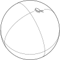

As another example of a bug living in two dimensions, let’s imagine one who lives on a sphere. We imagine that he can walk around on the surface of the sphere, as in Fig. 42–2 but that he can’t look “up,” or “down,” or “out.”

### Figure Ch42-F3
Caption: Fig. 42–3.A bug on a hot plate.
Image: figures/Ch42-F3.svg
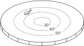

Now we want to consider still a third kind of creature. He is also a bug like the others, and also lives on a plane, as our first bug did, but this time the plane is peculiar. The temperature is different at different places. Also, the bug and any rulers he uses are all made of the same material which expands when it is heated. Whenever he puts a ruler somewhere to measure something the ruler expands immediately to the proper length for the temperature at that place. Wherever he puts any object—himself, a ruler, a triangle, or anything—the thing stretches itself because of the thermal expansion. Everything is longer in the hot places than it is in the cold places, and everything has the same coefficient of expansion. We will call the home of our third bug a “hot plate,” although we will particularly want to think of a special kind of hot plate that is cold in the center and gets hotter as we go out toward the edges (Fig. 42–3 ).

### Figure Ch42-F4
Caption: Fig. 42–4.Making a “straight” line on a plane.
Image: figures/Ch42-F4.svg
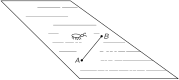

Now we are going to imagine that our bugs begin to study geometry. Although we imagine that they are blind so that they can’t see any “outside” world, they can do a lot with their legs and feelers. They can draw lines, and they can make rulers, and measure off lengths. First, let’s suppose that they start with the simplest idea in geometry. They learn how to make a straight line—defined as the shortest line between two points. Our first bug—see Fig. 42–4 —learns to make very good lines. But what happens to the bug on the sphere? He draws his straight line as the shortest distance— for him —between two points, as in Fig. 42–5 . It may look like a curve to us, but he has no way of getting off the sphere and finding out that there is “really” a shorter line. He just knows that if he tries any other path in his world it is always longer than his straight line. So we will let him have his straight line as the shortest arc between two points. (It is, of course an arc of a great circle.)

### Figure Ch42-F5
Caption: Fig. 42–5.Making a “straight line” on a sphere.
Image: figures/Ch42-F5.svg

Finally, our third bug—the one in Fig. 42–3 —will also draw “straight lines” that look like curves to us. For instance, the shortest distance between A and B in Fig. 42–6 would be on a curve like the one shown. Why? Because when his line curves out toward the warmer parts of his hot plate, the rulers get longer (from our omniscient point of view) and it takes fewer “yardsticks” laid end-to-end to get from A to B . So for him the line is straight—he has no way of knowing that there could be someone out in a strange three-dimensional world who would call a different line “straight.”

### Figure Ch42-F6
Caption: Fig. 42–6.Making a “straight line” on the hot plate.
Image: figures/Ch42-F6.svg
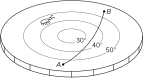

We think you get the idea now that all the rest of the analysis will always be from the point of view of the creatures on the particular surfaces and not from our point of view. With that in mind let’s see what the rest of their geometries looks like. Let’s assume that the bugs have all learned how to make two lines intersect at right angles. (You can figure out how they could do it.) Then our first bug (the one on the normal plane) finds an interesting fact. If he starts at the point A and makes a line 100 inches long, then makes a right angle and marks off another 100 inches, then makes another right angle and goes another 100 inches, then makes a third right angle and a fourth line 100 inches long, he ends up right at the starting point as shown in Fig. 42–7 (a). It is a property of his world—one of the facts of his “geometry.”

### Figure Ch42-F7
Caption: Fig. 42–7.A square, triangle, and circle in flat space.
Image: figures/Ch42-F7.svg
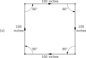

Then he discovers another interesting thing. If he makes a triangle—a figure with three straight lines—the sum of the angles is equal to 180^\circ , that is, to the sum of two right angles. See Fig. 42–7 (b).

Then he invents the circle. What’s a circle? A circle is made this way: You rush off on straight lines in many many directions from a single point, and lay out a lot of dots that are all the same distance from that point. See Fig. 42–7 (c). (We have to be careful how we define these things because we’ve got to be able to make the analogs for the other fellows.) Of course, its equivalent to the curve you can make by swinging a ruler around a point. Anyway, our bug learns how to make circles. Then one day he thinks of measuring the distance around a circle. He measures several circles and finds a neat relationship: The distance around is always the same number times the radius r (which is, of course, the distance from the center out to the curve). The circumference and the radius always have the same ratio—approximately 6.283 —independent of the size of the circle.

### Figure Ch42-F8
Caption: Fig. 42–8.Trying to make a “square” on a sphere.
Image: figures/Ch42-F8.svg
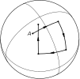

Now let’s see what our other bugs have been finding out about their geometries. First, what happens to the bug on the sphere when he tries to make a “square”? If he follows the prescription we gave above, he would probably think that the result was hardly worth the trouble. He gets a figure like the one shown in Fig. 42–8 . His endpoint B isn’t on top of the starting point A . It doesn’t work out to a closed figure at all. Get a sphere and try it. A similar thing would happen to our friend on the hot plate. If he lays out four straight lines of equal length—as measured with his expanding rulers—joined by right angles he gets a picture like the one in Fig. 42–9 .

### Figure Ch42-F9
Caption: Fig. 42–9.Trying to make a “square” on the hot plate.
Image: figures/Ch42-F9.svg
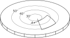

Now suppose that our bugs had each had their own Euclid who had told them what geometry “should” be like, and that they had checked him out roughly by making crude measurements on a small scale. Then as they tried to make accurate squares on a larger scale they would discover that something was wrong. The point is, that just by geometrical measurements they would discover that something was the matter with their space. We define a curved space to be a space in which the geometry is not what we expect for a plane. The geometry of the bugs on the sphere or on the hot plate is the geometry of a curved space. The rules of Euclidean geometry fail. And it isn’t necessary to be able to lift yourself out of the plane in order to find out that the world that you live in is curved. It isn’t necessary to circumnavigate the globe in order to find out that it is a ball. You can find out that you live on a ball by laying out a square. If the square is very small you will need a lot of accuracy, but if the square is large the measurement can be done more crudely.

### Figure Ch42-F10
Caption: Fig. 42–10.On a sphere a “triangle” can have three 90∘90^\circ angles.
Image: figures/Ch42-F10.svg
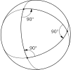

Let’s take the case of a triangle on a plane. The sum of the angles is 180 degrees. Our friend on the sphere can find triangles that are very peculiar. He can, for example, find triangles which have three right angles. Yes indeed! One is shown in Fig. 42–10. Suppose our bug starts at the north pole and makes a straight line all the way down to the equator. Then he makes a right angle and another perfect straight line the same length. Then he does it again. For the very special length he has chosen he gets right back to his starting point, and also meets the first line with a right angle. So there is no doubt that for him this triangle has three right angles, or 270 degrees in the sum. It turns out that for him the sum of the angles of the triangle is always greater than 180 degrees. In fact, the excess (for the special case shown, the extra 90 degrees) is proportional to how much area the triangle has. If a triangle on a sphere is very small, its angles add up to very nearly 180 degrees, only a little bit over. As the triangle gets bigger the discrepancy goes up. The bugs on the hot plate would discover similar difficulties with their triangles.

### Figure Ch42-F11
Caption: Fig. 42–11.Making a circle on a sphere.
Image: figures/Ch42-F11.svg
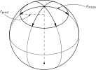

Let’s look next at what our other bugs find out about circles. They make circles and measure their circumferences. For example, the bug on the sphere might make a circle like the one shown in Fig. 42–11. And he would discover that the circumference is less than 2\pi times the radius. (You can see that because from the wisdom of our three-dimensional view it is obvious that what he calls the “radius” is a curve which is longer than the true radius of the circle.) Suppose that the bug on the sphere had read Euclid, and decided to predict a radius by dividing the circumference C by 2\pi , taking

r_{\text{pred}}=\frac{C}{2\pi}. (42.1)

Then he would find that the measured radius was larger than the predicted radius. Pursuing the subject, he might define the difference to be the “excess radius,” and write

r_{\text{meas}}-r_{\text{pred}}=r_{\text{excess}}, (42.2)

and study how the excess radius effect depended on the size of the circle.

### Figure Ch42-F12
Caption: Fig. 42–12.Making a circle on the hot plate.
Image: figures/Ch42-F12.svg
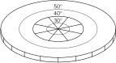

Our bug on the hot plate would discover a similar phenomenon. Suppose he was to draw a circle centered at the cold spot on the plate as in Fig. 42–12. If we were to watch him as he makes the circle we would notice that his rulers are short near the center and get longer as they are moved outward—although the bug doesn’t know it, of course. When he measures the circumference the ruler is long all the time, so he, too, finds out that the measured radius is longer than the predicted radius, C/2\pi . The hot-plate bug also finds an “excess radius effect.” And again the size of the effect depends on the radius of the circle.

We will define a “curved space” as one in which these types of geometrical errors occur: The sum of the angles of a triangle is different from 180 degrees; the circumference of a circle divided by 2\pi is not equal to the radius; the rule for making a square doesn’t give a closed figure. You can think of others.

We have given two different examples of curved space: the sphere and the hot plate. But it is interesting that if we choose the right temperature variation as a function of distance on the hot plate, the two geometries will be exactly the same. It is rather amusing. We can make the bug on the hot plate get exactly the same answers as the bug on the ball. For those who like geometry and geometrical problems we’ll tell you how it can be done. If you assume that the length of the rulers (as determined by the temperature) goes in proportion to one plus some constant times the square of the distance away from the origin, then you will find that the geometry of that hot plate is exactly the same in all details 1 as the geometry of the sphere.

There are, of course, other kinds of geometry. We could ask about the geometry of a bug who lived on a pear, namely something which has a sharper curvature in one place and a weaker curvature in the other place, so that the excess in angles in triangles is more severe when he makes little triangles in one part of his world than when he makes them in another part. In other words, the curvature of a space can vary from place to place. That’s just a generalization of the idea. It can also be imitated by a suitable distribution of temperature on a hot plate.

We may also point out that the results could come out with the opposite kind of discrepancies. You could find out, for example, that all triangles when they are made too large have the sum of their angles less than 180 degrees. That may sound impossible, but it isn’t at all. First of all, we could have a hot plate with the temperature decreasing with the distance from the center. Then all the effects would be reversed. But we can also do it purely geometrically by looking at the two-dimensional geometry of the surface of a saddle. Imagine a saddle-shaped surface like the one sketched in Fig. 42–13. Now draw a “circle” on the surface, defined as the locus of all points the same distance from a center. This circle is a curve that oscillates up and down with a scallop effect. So its circumference is larger than you would expect from calculating 2\pi r_{\text{meas}} . So C/2\pi is now greater than r_{\text{meas}} . The “excess radius” would be negative.

### Figure Ch42-F13
Caption: Fig. 42–13.Making a “circle” on a saddle-shaped surface.
Image: figures/Ch42-F13.svg
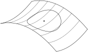

Spheres and pears and such are all surfaces of positive curvatures; and the others are called surfaces of negative curvature. In general, a two-dimensional world will have a curvature which varies from place to place and may be positive in some places and negative in other places. In general, we mean by a curved space simply one in which the rules of Euclidean geometry break down with one sign of discrepancy or the other. The amount of curvature—defined, say, by the excess radius—may vary from place to place.

### Figure Ch42-F14
Caption: Fig. 42–14.A two-dimensional space with zero intrinsic curvature.
Image: figures/Ch42-F14.svg
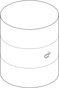

We might point out that, from our definition of curvature, a cylinder is, surprisingly enough, not curved. If a bug lived on a cylinder, as shown in Fig. 42–14, he would find out that triangles, squares, and circles would all have the same behavior they have on a plane. This is easy to see, by just thinking about how all the figures will look if the cylinder is unrolled onto a plane. Then all the geometrical figures can be made to correspond exactly to the way they are in a plane. So there is no way for a bug living on a cylinder (assuming that he doesn’t go all the way around, but just makes local measurements) to discover that his space is curved. In our technical sense, then, we consider that his space is not curved. What we want to talk about is more precisely called intrinsic curvature; that is, a curvature which can be found by measurements only in a local region. (A cylinder has no intrinsic curvature.) This was the sense intended by Einstein when he said that our space is curved. But we as yet only have defined a curved space in two dimensions; we must go onward to see what the idea might mean in three dimensions.

## 42–2 Curvature in three-dimensional space

We live in three-dimensional space and we are going to consider the idea that three-dimensional space is curved. You say, “But how can you imagine it being bent in any direction?” Well, we can’t imagine space being bent in any direction because our imagination isn’t good enough. (Perhaps it’s just as well that we can’t imagine too much, so that we don’t get too free of the real world.) But we can still define a curvature without getting out of our three-dimensional world. All we have been talking about in two dimensions was simply an exercise to show how we could get a definition of curvature which didn’t require that we be able to “look in” from the outside.

We can determine whether our world is curved or not in a way quite analogous to the one used by the gentlemen who live on the sphere and on the hot plate. We may not be able to distinguish between two such cases but we certainly can distinguish those cases from the flat space, the ordinary plane. How? Easy enough: We lay out a triangle and measure the angles. Or we make a great big circle and measure the circumference and the radius. Or we try to lay out some accurate squares, or try to make a cube. In each case we test whether the laws of geometry work. If they don’t work, we say that our space is curved. If we lay out a big triangle and the sum of its angles exceeds 180 degrees, we can say our space is curved. Or if the measured radius of a circle is not equal to its circumference over 2\pi , we can say our space is curved.

You will notice that in three dimensions the situation can be much more complicated than in two. At any one place in two dimensions there is a certain amount of curvature. But in three dimensions there can be several components to the curvature. If we lay out a triangle in some plane, we may get a different answer than if we orient the plane of the triangle in a different way. Or take the example of a circle. Suppose we draw a circle and measure the radius and it doesn’t check with C/2\pi so that there is some excess radius. Now we draw another circle at right angles—as in Fig. 42–15. There’s no need for the excess to be exactly the same for both circles. In fact, there might be a positive excess for a circle in one plane, and a defect (negative excess) for a circle in the other plane.

### Figure Ch42-F15
Caption: Fig. 42–15.The excess radius may be different for circles with different orientations.
Image: figures/Ch42-F15.svg
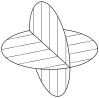

Perhaps you are thinking of a better idea: Can’t we get around all of these components by using a sphere in three dimensions? We can specify a sphere by taking all the points that are the same distance from a given point in space. Then we can measure the surface area by laying out a fine scale rectangular grid on the surface of the sphere and adding up all the bits of area. According to Euclid the total area A is supposed to be 4\pi times the square of the radius; so we can define a “predicted radius” as \sqrt{A/4\pi} . But we can also measure the radius directly by digging a hole to the center and measuring the distance. Again, we can take the measured radius minus the predicted radius and call the difference the radius excess,

r_{\text{excess}}=r_{\text{meas}}-\biggl( \frac{\text{measured area}}{4\pi}\biggr)^{1/2},

which would be a perfectly satisfactory measure of the curvature. It has the great advantage that it doesn’t depend upon how we orient a triangle or a circle.

But the excess radius of a sphere also has a disadvantage; it doesn’t completely characterize the space. It gives what is called the mean curvature of the three-dimensional world, since there is an averaging effect over the various curvatures. Since it is an average, however, it does not solve completely the problem of defining the geometry. If you know only this number you can’t predict all properties of the geometry of the space, because you can’t tell what would happen with circles of different orientation. The complete definition requires the specification of six “curvature numbers” at each point. Of course the mathematicians know how to write all those numbers. You can read someday in a mathematics book how to write them all in a high-class and elegant form, but it is first a good idea to know in a rough way what it is that you are trying to write about. For most of our purposes the average curvature will be enough. 2

## 42–3 Our space is curved

Now comes the main question. Is it true? That is, is the actual physical three-dimensional space we live in curved? Once we have enough imagination to realize the possibility that space might be curved, the human mind naturally gets curious about whether the real world is curved or not. People have made direct geometrical measurements to try to find out, and haven’t found any deviations. On the other hand, by arguments about gravitation, Einstein discovered that space is curved, and we’d like to tell you what Einstein’s law is for the amount of curvature, and also tell you a little bit about how he found out about it.

Einstein said that space is curved and that matter is the source of the curvature. (Matter is also the source of gravitation, so gravity is related to the curvature—but that will come later in the chapter.) Let us suppose, to make things a little easier, that the matter is distributed continuously with some density, which may vary, however, as much as you want from place to place. 3 The rule that Einstein gave for the curvature is the following: If there is a region of space with matter in it and we take a sphere small enough that the density \rho of matter inside it is effectively constant, then the radius excess for the sphere is proportional to the mass inside the sphere. Using the definition of excess radius, we have

\text{Radius excess}= r_{\text{meas}}-\sqrt{\frac{A}{4\pi}} =\frac{G}{3c^2}\cdot M. (42.3)

Here, G is the gravitational constant (of Newton’s theory), c is the velocity of light, and M=4\pi\rho r^3/3 is the mass of the matter inside the sphere. This is Einstein’s law for the mean curvature of space.

Suppose we take the earth as an example and forget that the density varies from point to point—so we won’t have to do any integrals. Suppose we were to measure the surface of the earth very carefully, and then dig a hole to the center and measure the radius. From the surface area we could calculate the predicted radius we would get from setting the area equal to 4\pi r^2 . When we compared the predicted radius with the actual radius, we would find that the actual radius exceeded the predicted radius by the amount given in Eq. ( 42.3). The constant G/3c^2 is about 2.5\times10^{-29} cm per gram, so for each gram of material the measured radius is off by 2.5\times10^{-29} cm. Putting in the mass of the earth, which is about 6\times10^{27} grams, it turns out that the earth has 1.5 millimeters more radius than it should have for its surface area. 4 Doing the same calculation for the sun, you find that the sun’s radius is one-half a kilometer too long.

You should note that the law says that the average curvature above the surface area of the earth is zero. But that does not mean that all the components of the curvature are zero. There may still be—and, in fact, there is—some curvature above the earth. For a circle in a plane there will be an excess radius of one sign for some orientations and of the opposite sign for other orientations. It just turns out that the average over a sphere is zero when there is no mass inside it. Incidentally, it turns out that there is a relation between the various components of the curvature and the variation of the average curvature from place to place. So if you know the average curvature everywhere, you can figure out the details of the curvature components at each place. The average curvature inside the earth varies with altitude, and this means that some curvature components are nonzero both inside the earth and outside. It is that curvature that we see as a gravitational force.

Suppose we have a bug on a plane, and suppose that the “plane” has little pimples in the surface. Wherever there is a pimple the bug would conclude that his space had little local regions of curvature. We have the same thing in three dimensions. Wherever there is a lump of matter, our three-dimensional space has a local curvature—a kind of three-dimensional pimple.

If we make a lot of bumps on a plane there might be an overall curvature besides all the pimples—the surface might become like a ball. It would be interesting to know whether our space has a net average curvature as well as the local pimples due to the lumps of matter like the earth and the sun. The astrophysicists have been trying to answer that question by making measurements of galaxies at very large distances. For example, if the number of galaxies we see in a spherical shell at a large distance is different from what we would expect from our knowledge of the radius of the shell, we would have a measure of the excess radius of a tremendously large sphere. From such measurements it is hoped to find out whether our whole universe is flat on the average, or round—whether it is “closed,” like a sphere, or “open” like a plane. You may have heard about the debates that are going on about this subject. There are debates because the astronomical measurements are still completely inconclusive; the experimental data are not precise enough to give a definite answer. Unfortunately, we don’t have the slightest idea about the overall curvature of our universe on a large scale.

## 42–4 Geometry in space-time

Now we have to talk about time. As you know from the special theory of relativity, measurements of space and measurements of time are interrelated. And it would be kind of crazy to have something happening to the space, without the time being involved in the same thing. You will remember that the measurement of time depends on the speed at which you move. For instance, if we watch a guy going by in a spaceship we see that things happen more slowly for him than for us. Let’s say he takes off on a trip and returns in 100 seconds flat by our watches; his watch might say that he had been gone for only 95 seconds. In comparison with ours, his watch—and all other processes, like his heart beat—have been running slow.

Now let’s consider an interesting problem. Suppose you are the one in the spaceship. We ask you to start off at a given signal and return to your starting place just in time to catch a later signal—at, say, exactly 100 seconds later according to our clock. And you are also asked to make the trip in such a way that your watch will show the longest possible elapsed time. How should you move? You should stand still. If you move at all your watch will read less than 100 sec when you get back.

Suppose, however, we change the problem a little. Suppose we ask you to start at point A on a given signal and go to point B (both fixed relative to us), and to do it in such a way that you arrive back just at the time of a second signal (say 100 seconds later according to our fixed clock). Again you are asked to make the trip in the way that lets you arrive with the latest possible reading on your watch. How would you do it? For which path and schedule will your watch show the greatest elapsed time when you arrive? The answer is that you will spend the longest time from your point of view if you make the trip by going at a uniform speed along a straight line. Reason: Any extra motions and any extra-high speeds will make your clock go slower. (Since the time deviations depend on the square of the velocity, what you lose by going extra fast at one place you can never make up by going extra slowly in another place.)

The point of all this is that we can use the idea to define “a straight line” in space-time. The analog of a straight line in space is for space-time a motion at uniform velocity in a constant direction.

The curve of shortest distance in space corresponds in space-time not to the path of shortest time, but to the one of longest time, because of the funny things that happen to signs of the t -terms in relativity. “Straight-line” motion—the analog of “uniform velocity along a straight line”—is then that motion which takes a watch from one place at one time to another place at another time in the way that gives the longest time reading for the watch. This will be our definition for the analog of a straight line in space-time.

## 42–5 Gravity and the principle of equivalence

Now we are ready to discuss the laws of gravitation. Einstein was trying to generate a theory of gravitation that would fit with the relativity theory that he had developed earlier. He was struggling along until he latched onto one important principle which guided him into getting the correct laws. That principle is based on the idea that when a thing is falling freely everything inside it seems weightless. For example, a satellite in orbit is falling freely in the earth’s gravity, and an astronaut in it feels weightless. This idea, when stated with greater precision, is called Einstein’s principle of equivalence. It depends on the fact that all objects fall with exactly the same acceleration no matter what their mass, or what they are made of. If we have a spaceship that is “coasting”—so it’s in a free fall—and there is a man inside, then the laws governing the fall of the man and the ship are the same. So if he puts himself in the middle of the ship he will stay there. He doesn’t fall with respect to the ship. That’s what we mean when we say he is “weightless.”

Now suppose you are in a rocket ship which is accelerating. Accelerating with respect to what? Let’s just say that its engines are on and generating a thrust so that it is not coasting in a free fall. Also imagine that you are way out in empty space so that there are practically no gravitational forces on the ship. If the ship is accelerating with “ 1 g” you will be able to stand on the “floor” and will feel your normal weight. Also if you let go of a ball, it will “fall” toward the floor. Why? Because the ship is accelerating “upward,” but the ball has no forces on it, so it will not accelerate; it will get left behind. Inside the ship the ball will appear to have a downward acceleration of “ 1 g.”

Now let’s compare that with the situation in a spaceship sitting at rest on the surface of the earth. Everything is the same! You would be pressed toward the floor, a ball would fall with an acceleration of 1 g, and so on. In fact, how could you tell inside a space ship whether you are sitting on the earth or are accelerating in free space? According to Einstein’s equivalence principle there is no way to tell if you only make measurements of what happens to things inside!

To be strictly correct, that is true only for one point inside the ship. The gravitational field of the earth is not precisely uniform, so a freely falling ball has a slightly different acceleration at different places—the direction changes and the magnitude changes. But if we imagine a strictly uniform gravitational field, it is completely imitated in every respect by a system with a constant acceleration. That is the basis of the principle of equivalence.

## 42–6 The speed of clocks in a gravitational field

### Figure Ch42-F16
Caption: Fig. 42–16.An accelerating rocket ship with two clocks.
Image: figures/Ch42-F16.svg
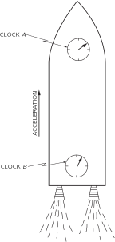

Now we want to use the principle of equivalence for figuring out a strange thing that happens in a gravitational field. We’ll show you something that happens in a rocket ship which you probably wouldn’t have expected to happen in a gravitational field. Suppose we put a clock at the “head” of the rocket ship—that is, at the “front” end—and we put another identical clock at the “tail,” as in Fig. 42–16. Let’s call the two clocks A and B . If we compare these two clocks when the ship is accelerating, the clock at the head seems to run fast relative to the one at the tail. To see that, imagine that the front clock emits a flash of light each second, and that you are sitting at the tail comparing the arrival of the light flashes with the ticks of clock B . Let’s say that the rocket is in the position a of Fig. 42–17 when clock A emits a flash, and at the position b when the flash arrives at clock B . Later on the ship will be at position c when the clock A emits its next flash, and at position d when you see it arrive at clock B .

### Figure Ch42-F17
Caption: Fig. 42–17.A clock at the head of an accelerating rocket ship appears to run faster than a clock at the tail.
Image: figures/Ch42-F17.svg
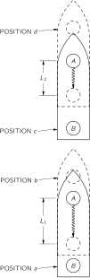

The first flash travels the distance L_1 and the second flash travels the shorter distance L_2 . It is a shorter distance because the ship is accelerating and has a higher speed at the time of the second flash. You can see, then, that if the two flashes were emitted from clock A one second apart, they would arrive at clock B with a separation somewhat less than one second, since the second flash doesn’t spend as much time on the way. The same thing will also happen for all the later flashes. So if you were sitting in the tail you would conclude that clock A was running faster than clock B . If you were to do the same thing in reverse—letting clock B emit light and observing it at clock A —you would conclude that B was running slower than A . Everything fits together and there is nothing mysterious about it all.

But now let’s think of the rocket ship at rest in the earth’s gravity. The same thing happens. If you sit on the floor with one clock and watch another one which is sitting on a high shelf, it will appear to run faster than the one on the floor! You say, “But that is wrong. The times should be the same. With no acceleration there’s no reason for the clocks to appear to be out of step.” But they must if the principle of equivalence is right. And Einstein insisted that the principle was right, and went courageously and correctly ahead. He proposed that clocks at different places in a gravitational field must appear to run at different speeds. But if one always appears to be running at a different speed with respect to the other, then so far as the first is concerned the other is running at a different rate.

But now you see we have the analog for clocks of the hot ruler we were talking about earlier, when we had the bug on a hot plate. We imagined that rulers and bugs and everything changed lengths in the same way at various temperatures so they could never tell that their measuring sticks were changing as they moved around on the hot plate. It’s the same with clocks in a gravitational field. Every clock we put at a higher level is seen to go faster. Heartbeats go faster, all processes run faster.

If they didn’t you would be able to tell the difference between a gravitational field and an accelerating reference system. The idea that time can vary from place to place is a difficult one, but it is the idea Einstein used, and it is correct—believe it or not.

Using the principle of equivalence we can figure out how much the speed of a clock changes with height in a gravitational field. We just work out the apparent discrepancy between the two clocks in the accelerating rocket ship. The easiest way to do this is to use the result we found in Chapter 34 of Vol. I for the Doppler effect. There, we found—see Eq. ( 34.14)—that if v is the relative velocity of a source and a receiver, the received frequency \omega is related to the emitted frequency \omega_0 by

\omega=\omega_0\,\frac{1+v/c}{\sqrt{1-v^2/c^2}}. (42.4)

Now if we think of the accelerating rocket ship in Fig. 42–17 the emitter and receiver are moving with equal velocities at any one instant. But in the time that it takes the light signals to go from clock A to clock B the ship has accelerated. It has, in fact, picked up the additional velocity gt , where g is the acceleration and t is time it takes light to travel the distance H from A to B . This time is very nearly H/c . So when the signals arrive at B , the ship has increased its velocity by gH/c . The receiver always has this velocity with respect to the emitter at the instant the signal left it. So this is the velocity we should use in the Doppler shift formula, Eq. ( 42.4). Assuming that the acceleration and the length of the ship are small enough that this velocity is much smaller than c , we can neglect the term in v^2/c^2 . We have that

\omega=\omega_0\biggl(1+\frac{gH}{c^2}\biggr). (42.5)

So for the two clocks in the spaceship we have the relation

\begin{pmatrix} \text{Rate}\\[-.75ex] \text{at the}\\[-.75ex] \text{receiver} \end{pmatrix}= \begin{pmatrix} \text{Rate of}\\[-.75ex] \text{emission} \end{pmatrix} \!\biggl(\!1+\frac{gH}{c^2}\biggr), (42.6)

where H is the height of the emitter above the receiver.

From the equivalence principle the same result must hold for two clocks separated by the height H in a gravitational field with the free fall acceleration g .

This is such an important idea we would like to demonstrate that it also follows from another law of physics—from the conservation of energy. We know that the gravitational force on an object is proportional to its mass M , which is related to its total internal energy E by M=E/c^2 . For instance, the masses of nuclei determined from the energies of nuclear reactions which transmute one nucleus into another agree with the masses obtained from atomic weights.

Now think of an atom which has a lowest energy state of total energy E_0 and a higher energy state E_1 , and which can go from the state E_1 to the state E_0 by emitting light. The frequency \omega of the light will be given by

\hbar\omega=E_1-E_0. (42.7)

Now suppose we have such an atom in the state E_1 sitting on the floor, and we carry it from the floor to the height H . To do that we must do some work in carrying the mass m_1=E_1/c^2 up against the gravitational force. The amount of work done is

\frac{E_1}{c^2}\,gH. (42.8)

Then we let the atom emit a photon and go into the lower energy state E_0 . Afterward we carry the atom back to the floor. On the return trip the mass is E_0/c^2 ; we get back the energy

\frac{E_0}{c^2}\,gH, (42.9)

so we have done a net amount of work equal to

\Delta U=\frac{E_1-E_0}{c^2}\,gH. (42.10)

When the atom emitted the photon it gave up the energy E_1-E_0 . Now suppose that the photon happened to go down to the floor and be absorbed. How much energy would it deliver there? You might at first think that it would deliver just the energy E_1-E_0 . But that can’t be right if energy is conserved, as you can see from the following argument. We started with the energy E_1 at the floor. When we finish, the energy at the floor level is the energy E_0 of the atom in its lower state plus the energy E_{\text{ph}} received from the photon. In the meantime we have had to supply the additional energy \Delta U of Eq. ( 42.10). If energy is conserved, the energy we end up with at the floor must be greater than we started with by just the work we have done. Namely, we must have that

E_{\text{ph}}+E_0=E_1+\Delta U,

or

E_{\text{ph}}=(E_1-E_0)+\Delta U. (42.11)

It must be that the photon does not arrive at the floor with just the energy E_1-E_0 it started with, but with a little more energy. Otherwise some energy would have been lost. If we substitute in Eq. ( 42.11) the \Delta U we got in Eq. ( 42.10) we get that the photon arrives at the floor with the energy

E_{\text{ph}}=(E_1-E_0)\biggl(1+\frac{gH}{c^2}\biggr). (42.12)

But a photon of energy E_{\text{ph}} has the frequency \omega=E_{\text{ph}}/\hbar . Calling the frequency of the emitted photon \omega_0 —which is by Eq. ( 42.7) equal to (E_1-E_0)/\hbar —our result in Eq. ( 42.12) gives again the relation of ( 42.5) between the frequency of the photon when it is absorbed on the floor and the frequency with which it was emitted.

The same result can be obtained in still another way. A photon of frequency \omega_0 has the energy E_0=\hbar\omega_0 . Since the energy E_0 has the relativistic mass E_0/c^2 the photon has a mass ( not rest mass) \hbar\omega_0/c^2 , and is “attracted” by the earth. In falling the distance H it will gain an additional energy (\hbar\omega_0/c^2)gH , so it arrives with the energy

E=\hbar\omega_0\biggl(1+\frac{gH}{c^2}\biggr).

But its frequency after the fall is E/\hbar , giving again the result in Eq. ( 42.5). Our ideas about relativity, quantum physics, and energy conservation all fit together only if Einstein’s predictions about clocks in a gravitational field are right. The frequency changes we are talking about are normally very small. For instance, for an altitude difference of 20 meters at the earth’s surface the frequency difference is only about two parts in 10^{15} . However, just such a change has recently been found experimentally using the Mössbauer effect. 5 Einstein was perfectly correct.

## 42–7 The curvature of space-time

### Figure Ch42-F18
Caption: Fig. 42–18.Trying to make a rectangle in space-time.
Image: figures/Ch42-F18.svg
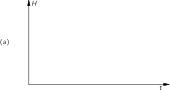

Now we want to relate what we have just been talking about to the idea of curved space-time. We have already pointed out that if the time goes at different rates in different places, it is analogous to the curved space of the hot plate. But it is more than an analogy; it means that space-time is curved. Let’s try to do some geometry in space-time. That may at first sound peculiar, but we have often made diagrams of space-time with distance plotted along one axis and time along the other. Suppose we try to make a rectangle in space-time. We begin by plotting a graph of height H versus t as in Fig. 42–18 (a). To make the base of our rectangle we take an object which is at rest at the height H_1 and follow its world line for 100 seconds. We get the line BD in part (b) of the figure which is parallel to the t -axis. Now let’s take another object which is 100 feet above the first one at t=0 . It starts at the point A in Fig. 42–18 (c). Now we follow its world line for 100 seconds as measured by a clock at A . The object goes from A to C , as shown in part (d) of the figure. But notice that since time goes at a different rate at the two heights—we are assuming that there is a gravitational field—the two points C and D are not simultaneous. If we try to complete the square by drawing a line to the point C' which is 100 feet above D at the same time, as in Fig. 42–18 (e), the pieces don’t fit. And that’s what we mean when we say that space-time is curved.

## 42–8 Motion in curved space-time

Let’s consider an interesting little puzzle. We have two identical clocks, A and B , sitting together on the surface of the earth. Now we lift clock A to some height H , hold it there awhile, and return it to the ground so that it arrives at just the instant when clock B has advanced by 100 seconds. Then clock A will read something like 107 seconds, because it was running faster when it was up in the air. Now here is the puzzle. How should we move clock A so that it reads the latest possible time—always assuming that it returns when B reads 100 seconds? You say, “That’s easy. Just take A as high as you can. Then it will run as fast as possible, and be the latest when you return.” Wrong. You forgot something—we’ve only got 100 seconds to go up and back. If we go very high, we have to go very fast to get there and back in 100 seconds. And you mustn’t forget the effect of special relativity which causes moving clocks to slow down by the factor \sqrt{1-v^2/c^2} . This relativity effect works in the direction of making clock A read less time than clock B . You see that we have a kind of game. If we stand still with clock A we get 100 seconds. If we go up slowly to a small height and come down slowly we can get a little more than 100 seconds. If we go a little higher, maybe we can gain a little more. But if we go too high we have to move fast to get there, and we may slow down the clock enough that we end up with less than 100 seconds. What program of height versus time—how high to go and with what speed to get there, carefully adjusted to bring us back to clock B when it has increased by 100 seconds—will give us the largest possible time reading on clock A ?

Answer: Find out how fast you have to throw a ball up into the air so that it will fall back to earth in exactly 100 seconds. The ball’s motion—rising fast, slowing down, stopping, and coming back down—is exactly the right motion to make the time the maximum on a wrist watch strapped to the ball.

### Figure Ch42-F19
Caption: Fig. 42–19.In a uniform gravitational field the trajectory with the maximum proper time for a fixed elapsed time is a parabola.
Image: figures/Ch42-F19.svg

Now consider a slightly different game. We have two points A and B both on the earth’s surface at some distance from one another, as in Fig. 42–19. We play the same game that we did earlier to find what we call the straight line. We ask how we should go from A to B so that the time on our moving watch will be the longest—assuming we start at A on a given signal and arrive at B on another signal at B which we will say is 100 seconds later by a fixed clock. Now you say, “Well we found out before that the thing to do is to coast along a straight line at a uniform speed chosen so that we arrive at B exactly 100 seconds later. If we don’t go along a straight line it takes more speed, and our watch is slowed down.” But wait! That was before we took gravity into account. Isn’t it better to curve upward a little bit and then come down? Then during part of the time we are higher up and our watch will run a little faster? It is, indeed. If you solve the mathematical problem of adjusting the curve of the motion so that the elapsed time of the moving watch is the most it can possibly be, you will find that the motion is a parabola—the same curve followed by something that moves on a free ballistic path in the gravitational field, as in Fig. 42–19. Therefore the law of motion in a gravitational field can also be stated: An object always moves from one place to another so that a clock carried on it gives a longer time than it would on any other possible trajectory —with, of course, the same starting and finishing conditions. The time measured by a moving clock is often called its “proper time.” In free fall, the trajectory makes the proper time of an object a maximum.

Let’s see how this all works out. We begin with Eq. ( 42.5) which says that the excess rate of the moving watch is

\frac{\omega_0gH}{c^2}. (42.13)

Besides this, we have to remember that there is a correction of the opposite sign for the speed. For this effect we know that

\omega=\omega_0\sqrt{1-v^2/c^2}.

Although the principle is valid for any speed, we take an example in which the speeds are always much less than c . Then we can write this equation as

\omega=\omega_0(1-v^2/2c^2),

and the defect in the rate of our clock is

-\omega_0\,\frac{v^2}{2c^2}. (42.14)

Combining the two terms in ( 42.13) and ( 42.14) we have that

\Delta\omega=\frac{\omega_0}{c^2}\biggl(gH-\frac{v^2}{2}\biggr). (42.15)

Such a frequency shift of our moving clock means that if we measure a time dt on a fixed clock, the moving clock will register the time

dt\biggl[ 1+\biggl(\frac{gH}{c^2}-\frac{v^2}{2c^2}\biggr) \biggr], (42.16)

The total time excess over the trajectory is the integral of the extra term with respect to time, namely

\frac{1}{c^2}\int\biggl(gH-\frac{v^2}{2}\biggr)\,dt, (42.17)

which is supposed to be a maximum.

The term gH is just the gravitational potential \phi . Suppose we multiply the whole thing by a constant factor -mc^2 , where m is the mass of the object. The constant won’t change the condition for the maximum, but the minus sign will just change the maximum to a minimum. Equation ( 42.17) then says that the object will move so that

\int\biggl(\frac{mv^2}{2}-m\phi\biggr)\,dt= \text{a minimum}. (42.18)

But now the integrand is just the difference of the kinetic and potential energies. And if you look in Chapter 19 of Volume II you will see that when we discussed the principle of least action we showed that Newton’s laws for an object in any potential could be written exactly in the form of Eq. ( 42.18).

## 42–9 Einstein’s theory of gravitation

Einstein’s form of the equations of motion—that the proper time should be a maximum in curved space-time—gives the same results as Newton’s laws for low velocities. As he was circling around the earth, Gordon Cooper’s watch was reading later than it would have in any other path you could have imagined for his satellite. 6

So the law of gravitation can be stated in terms of the ideas of the geometry of space-time in this remarkable way. The particles always take the longest proper time—in space-time a quantity analogous to the “shortest distance.” That’s the law of motion in a gravitational field. The great advantage of putting it this way is that the law doesn’t depend on any coordinates, or any other way of defining the situation.

Now let’s summarize what we have done. We have given you two laws for gravity: How the geometry of space-time changes when matter is present—namely, that the curvature expressed in terms of the excess radius is proportional to the mass inside a sphere, Eq. ( 42.3). How objects move if there are only gravitational forces—namely, that objects move so that their proper time between two end conditions is a maximum. Those two laws correspond to similar pairs of laws we have seen earlier. We originally described motion in a gravitational field in terms of Newton’s inverse square law of gravitation and his laws of motion. Now laws (1) and (2) take their places. Our new pair of laws also correspond to what we have seen in electrodynamics. There we had our law—the set of Maxwell’s equations—which determines the fields produced by charges. It tells how the character of “space” is changed by the presence of charged matter, which is what law (1) does for gravity. In addition, we had a law about how particles move in the given fields— d(m\mathbf{v})/dt=q(\mathbf{E}+\mathbf{v}\times\mathbf{B}) . This, for gravity, is done by law (2).

In the laws (1) and (2) you have a precise statement of Einstein’s theory of gravitation—although you will usually find it stated in a more complicated mathematical form. We should, however, make one further addition. Just as time scales change from place to place in a gravitational field, so do also the length scales. Rulers change lengths as you move around. It is impossible with space and time so intimately mixed to have something happen with time that isn’t in some way reflected in space. Take even the simplest example: You are riding past the earth. What is “ time ” from your point of view is partly space from our point of view. So there must also be changes in space. It is the entire space-time which is distorted by the presence of matter, and this is more complicated than a change only in time scale. However, the rule that we gave in Eq. ( 42.3) is enough to determine completely all the laws of gravitation, provided that it is understood that this rule about the curvature of space applies not only from one man’s point of view but is true for everybody. Somebody riding by a mass of material sees a different mass content because of the kinetic energy he calculates for its motion past him, and he must include the mass corresponding to that energy. The theory must be arranged so that everybody—no matter how he moves—will, when he draws a sphere, find that the excess radius is G/3c^2 times the total mass (or, better, G/3c^4 times the total energy content) inside the sphere. That this law—law (1)—should be true in any moving system is one of the great laws of gravitation, called Einstein’s field equation. The other great law is (2)—that things must move so that the proper time is a maximum—and is called Einstein’s equation of motion.

To write these laws in a complete algebraic form, to compare them with Newton’s laws, or to relate them to electrodynamics is difficult mathematically. But it is the way our most complete laws of the physics of gravity look today.

Although they gave a result in agreement with Newton’s mechanics for the simple example we considered, they do not always do so. The three discrepancies first derived by Einstein have been experimentally confirmed: The orbit of Mercury is not a fixed ellipse; starlight passing near the sun is deflected twice as much as you would think; and the rates of clocks depend on their location in a gravitational field. Whenever the predictions of Einstein have been found to differ from the ideas of Newtonian mechanics Nature has chosen Einstein’s.

Let’s summarize everything that we have said in the following way. First, time and distance rates depend on the place in space you measure them and on the time. This is equivalent to the statement that space-time is curved. From the measured area of a sphere we can define a predicted radius, \sqrt{A/4\pi} , but the actual measured radius will have an excess over this which is proportional (the constant is G/3c^2 ) to the total mass contained inside the sphere. This fixes the exact degree of the curvature of space-time. And the curvature must be the same no matter who is looking at the matter or how it is moving. Second, particles move on “straight lines” (trajectories of maximum proper time) in this curved space-time. This is the content of Einstein’s formulation of the laws of gravitation.
