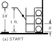

SOURCE: Feynman Lectures on Physics, Volume I, Chapter 4
LANGUAGE: ru
TITLE: Глава 4. Сохранение энергии
SOURCE_URL: https://www.feynmanlectures.caltech.edu/I_04.html
NOTEBOOKLM_USE: clean lecture text with TeX math and figure captions; reader navigation removed.

# Глава 4. Сохранение энергии

## 4–1 Что такое энергия?

С этой главы, покончив с общим описанием природы вещей, мы начнем подробное изучение различных физических вопросов. Чтобы показать характер идей и тип рассуждений, которые могут применяться в теоретической физике, мы разберем один из основных законов физики — сохранение энергии.

Существует факт, или, если угодно, закон, управляющий всеми явлениями природы, всем, что было известно до сих пор. Исключений из этого закона не существует; насколько мы знаем, он абсолютно точен. Название его — сохранение энергии. Он утверждает, что существует определенная величина, называемая энергией, которая не меняется ни при каких превращениях, происходящих в природе. Само это утверждение весьма и весьма отвлеченно; это по существу математический принцип, утверждающий, что существует некоторая численная величина, которая не изменяется ни при каких обстоятельствах. Это отнюдь не описание механизма явления или чего-то конкретного, просто-напросто отмечается то странное обстоятельство, что можно подсчитать какое-то число и затем спокойно следить, как природа будет выкидывать любые свои трюки, а потом опять подсчитать это число — и оно останется прежним. (Ну, все равно, как слон на черном шахматном поле: как бы ни разворачивались события на доске, какие бы ходы ни делались, слон все равно окажется на черном поле. Наш закон как раз такого типа.) И поскольку утверждение это отвлеченно, то мы выявим его смысл на некоторой аналогии.

Представьте себе ребенка, этакого «Монти-гомо Ястребиный Коготь», у которого есть кубики, абсолютно неразрушимые, которые невозможно разделить на части. Все они одинаковы. Предположим, что у него есть \(28\) кубиков. В начале дня мама оставляет его вместе с его \(28\) кубиками в комнате. В конце дня из любопытства она очень тщательно пересчитывает кубики и открывает поразительный закон: что бы ее сынишка ни вытворял с кубиками, их все равно остается \(28\) ! Так продолжается несколько дней, пока однажды кубиков не оказывается всего \(27\) . Однако небольшие поиски показывают, что один кубик лежит под ковром: ей приходится все обыскать, чтобы убедиться в неизменности числа кубиков. В другой раз, однако, число кубиков, по-видимому, изменяется — их оказывается всего \(26\) . Тщательное исследование показывает, что окно было открыто; взглянув наружу, она находит два других кубика. В другой раз тщательный подсчет дает \(30\) кубиков! Это приводит ее в полное замешательство, пока она не понимает, что в гости приходил Брюс, принес с собой свои кубики и оставил несколько из них в доме Монти. Убрав лишние кубики, она закрывает окно, не пускает больше Брюса, и все опять идет как следует, пока однажды подсчет не дает всего \(25\) кубиков. Однако в комнате есть ящик, ящик для игрушек, и мама собирается открыть его, но мальчик кричит: «Нет, не открывай мой ящик для игрушек!» и ревет. Мама к ящику не допускается. Будучи чрезвычайно любопытной и довольно хитрой, она придумывает выход! Она знает, что кубик весит три унции, поэтому она взвешивает ящик в то время, когда видит \(28\) кубиков, и он весит \(16\) унций. Когда в следующий раз она хочет проверить количество кубиков, она опять взвешивает ящик, вычитает шестнадцать унций и делит на три. Она открывает следующее:
\[
\begin{align}
\begin{pmatrix}
\text{number of}\\
\text{blocks seen}
\end{pmatrix}&+
\frac{(\text{weight of box})-\text{$16$ ounces}}{\text{$3$ ounces}}\notag\\[1ex]
\label{Eq:I:4:1}
&=\text{constant}.
\end{align}
\]
Затем, по-видимому, возникают новые отклонения, но тщательное исследование показывает, что уровень грязной воды в ванне меняется. Дитя бросает кубики в воду, и она не может их увидеть, потому что вода очень грязная, но она может узнать, сколько кубиков в воде, добавив в формулу еще один член. Поскольку первоначальная высота уровня воды составляла \(6\) дюймов, а каждый кубик поднимает воду на четверть дюйма, новая формула будет выглядеть так:
\[
\begin{align}
\begin{pmatrix}
\text{number of}\\
\text{blocks seen}
\end{pmatrix}&+
\frac{(\text{weight of box})-\text{$16$ ounces}}
{\text{$3$ ounces}}\notag\\[1ex]
&+\frac{(\text{height of water})-\text{$6$ inches}}
{\text{$1/4$ inch}}\notag\\[2ex]
\label{Eq:I:4:2}
&=\text{constant}.
\end{align}
\]
По мере постепенного усложнения ее мира она находит целый ряд членов, представляющих способы вычисления того, сколько кубиков находится там, куда ей не разрешается заглядывать. В итоге она находит сложную формулу — величину, которую необходимо рассчитать и которая в ее ситуации всегда остается неизменной.

В чем же аналогия между этим примером и сохранением энергии? Самое существенное, что надлежит помнить в этой картинке, — это что кубиков не существует. Отбросьте в выражениях (4.1) и (4.2) первые члены и вы обнаружите, что считаете более или менее отвлеченные количества. Аналогия же в следующем. Во-первых, при расчете энергии временами часть ее уходит из системы, временами же какая-то энергия появляется. Чтобы проверить сохранение энергии, мы должны быть уверены, что не забыли учесть ее убыль или прибыль. Во-вторых, энергия имеет множество разных форм и для каждой из них есть своя формула: энергия тяготения, кинетическая энергия, тепловая энергия, упругая энергия, электроэнергия, химическая энергия, энергия излучения, ядерная энергия, энергия массы. Когда мы объединим формулы для вклада каждой из них, то их сумма не будет меняться, если не считать убыли энергии и ее притока.

Важно понимать, что физике сегодняшнего дня неизвестно, что такое энергия. Мы не считаем, что энергия передается в виде маленьких пилюль. Ничего подобного. Просто имеются формулы для расчета определенных численных величин, сложив которые, мы получаем « \(28\) » — всегда одно и то же число. Это нечто отвлеченное, ничего не говорящее нам ни о механизме, ни о причинах появления в формуле различных членов.

## 4–2 Потенциальная энергия тяготения

Сохранение энергии можно понять, только если имеются формулы для всех ее видов. Я сейчас рассмотрю формулу для энергии тяготения близ земной поверхности; я хочу вывести ее, но не так, как она впервые исторически была получена, а при помощи специально придуманной для этой лекции нити рассуждений. Я хочу вам показать тот достопримечательный факт, что нескольких наблюдений и строгого размышления достаточно, чтобы узнать о природе очень и очень многое. Вы увидите, в чем состоит работа физика-теоретика. Вывод подсказан блестящими рассуждениями Карно о к. п. д. тепловых машин *.

Рассмотрим грузоподъемные машины, способные подымать один груз, опуская при этом другой. Предположим еще, что вечное движение этих машин невозможно. (Именно недопустимость вечного движения и есть общая формулировка закона сохранения энергии.) Определяя вечное движение, нужно быть очень осторожным. Сделаем это сначала для грузоподъемных машин. Если мы подняли и опустили какие-то грузы, восстановили прежнее состояние машины и после этого обнаружили, что в итоге груз поднят, то мы получили вечный двигатель: поднятый груз может привести в движение что-то другое. Здесь существенно, чтобы машина, поднявшая груз, вернулась в первоначальное положение и чтобы она ни от чего не зависела (чтобы не получала от внешнего источника энергию для подъема груза, словом, чтобы не приходил в гости Кожаный Чулок со своими кубиками).

### Figure Ch4-F1
Caption: Фиг. 4.1. Простая грузоподъемная машина.
Image: figures/Ch4-F1.svg

Очень простая грузоподъемная машина показана на фиг. 4.1. Она подымает тройной вес. На одну чашку весов помещают три единицы веса, на другую — одну. Правда, чтобы она и впрямь заработала, с левой чашки необходимо снять хоть малюсенький грузик. И наоборот, чтобы поднять единичный груз, опуская тройной, тоже нужно немного сплутовать и убрать с правой чашки часть груза. Мы понимаем, что в настоящей подъемной машине надо создать небольшую перегрузку на одну сторону, чтобы поднять другую. Но пока махнем на это рукой. Идеальные машины, хотя их и нет на самом деле, не нуждаются в перевесе. Машины, которыми мы фактически пользуемся, можно считать в некотором смысле почти обратимыми, т. е. если они поднимают тройной вес при помощи единичного, то они могут поднять также почти единичный вес, опуская тройной.

Представим, что имеются два класса машин — необратимые (сюда входят все реальные машины) и обратимые, которых на самом деле не существует; как бы тщательно ни изготавливать подшипники, рычаги и т. д., таких машин все равно не построишь. Но мы предположим все же, что обратимая машина существует и способна, опустив единичный груз (фунт или любую другую единицу) на единичную длину, поднять в то же время тройной груз. Назовем эту обратимую машину машиной \(A\) . Положим, что данная обратимая машина подымает тройной груз на расстояние \(X\) . Затем предположим, что имеется другая машина, машина \(B\) , не обязательно обратимая, которая тоже опускает единичный вес на единицу длины, но поднимает тройной вес на расстояние \(Y\) . Теперь можно доказать, что \(Y\) не выше \(X\) ; то есть невозможно построить машину, которая смогла бы поднять груз выше, чем обратимая. Давайте посмотрим почему. Предположим, что \(Y\) выше \(X\) . Мы берем единичный вес и опускаем его на единицу высоты машиной \(B\) , тем самым поднимая тройной груз на расстояние \(Y\) . Затем мы могли бы опустить груз с высоты \(Y\) до \(X\) , получив свободную энергию, и запустить обратимую машину \(A\) в обратную сторону, чтобы опустить тройной груз на расстояние \(X\) и поднять единичный вес на единичную высоту. Это вернет единичный вес туда, где он был прежде, и обе машины окажутся в состоянии начать работу сызнова! Таким образом, если бы \(Y\) было выше \(X\) , возник бы вечный двигатель, а мы предположили, что это невозможно. Исходя из этих предположений, мы приходим к выводу, что \(Y\) не выше \(X\) , так что из всех машин, которые можно сконструировать, обратимая машина — наилучшая.

Легко понять также, что все обратимые машины должны поднимать груз точно на одну и ту же высоту. Положим, что \(B\) также обратима. Рассуждение о том, что \(Y\) не выше \(X\) , остается, конечно, столь же верным, как и прежде, но мы можем также провести наши рассуждения в обратную сторону, используя машины в противоположном порядке, и доказать, что \(X\) не выше \(Y\) . Это очень знаменательное наблюдение, ибо оно позволяет узнать, на какую высоту разные машины будут поднимать грузы, не заглядывая в их внутреннее устройство. Мы сразу же понимаем: если кто-нибудь построит невероятно запутанную систему рычагов, которая поднимает три единицы веса на определенное расстояние за счет опускания одной единицы на единичное расстояние, и мы сравним ее с простым рычагом, который делает то же самое и является принципиально обратимым, то его машина поднимет груз не выше, а возможно, и ниже. Если же его машина обратима, мы также знаем точно, на какую высоту она будет его поднимать. Вывод: каждая обратимая машина, как бы она ни действовала, опуская один фунт на один фут и поднимая трехфунтовый груз, всегда поднимает его на одно и то же расстояние \(X\) . Ясно, что это всеобщий закон огромной полезности. Следующий вопрос, конечно, состоит в том, чему равно \(X\) ?

### Figure Ch4-F2
Caption: Фиг. 4.2. Обратимая машина.
Image: figures/Ch4-F2.svg

Предположим, у нас есть обратимая машина, которая будет поднимать на расстояние \(X\) три шара за счет одного. Мы помещаем три шара на неподвижный стеллаж, как показано на фиг. 4.2. Один шар удерживается на подставке на высоте одного фута над полом. Машина может поднять три шара, опустив один на расстояние \(1\) . Мы устроили так, что платформа, удерживающая три шара, имеет основание и две полки, расположенные точно на расстоянии \(X\) друг от друга, и, кроме того, полки стеллажа, удерживающего шары, также расположены на расстоянии \(X\) , (а). Сначала мы перекатываем шары по горизонтали со стеллажа на полки, (б), и предполагаем, что для этого не требуется энергии, поскольку мы не меняем высоту. Затем включается обратимая машина: она опускает одиночный шар на пол и поднимает платформу на расстояние \(X\) , (в). Теперь мы так остроумно устроили стеллаж, что эти шары снова оказались на одном уровне с полками. Таким образом, мы разгружаем шары на стеллаж, (г); разгрузив шары, мы можем вернуть машину в первоначальное состояние. Теперь у нас три шара на трех верхних полках и один внизу. Но странно то, что, в некотором смысле, два из них мы вовсе не поднимали, ведь на полках \(2\) и \(3\) шары лежали и раньше. В итоге один шар поднялся на расстояние \(3X\) . Если теперь \(3X\) превышает один фут, то мы можем опустить шар, чтобы вернуть машину в начальное состояние, (е), и снова запустить аппарат. Следовательно, \(3X\) не может превышать один фут, ибо если \(3X\) превышает один фут, мы можем получить вечное движение. Точно так же можно доказать, что один фут не может превышать \(3X\) , запустив всю машину в обратную сторону, поскольку это обратимая машина. Следовательно, \(3X\) ни больше ни меньше фута, и с помощью одних только рассуждений мы открываем закон: \(X=\tfrac{1}{3}\) фута. Обобщить это легко: при работе обратимой машины один фунт падает на некоторое расстояние; тогда машина способна поднять \(p\) фунтов на это расстояние, деленное на \(p\) . Другими словами, три фунта, умноженные на высоту подъема, которая в нашей задаче составляла \(X\) , равны одному фунту, умноженному на расстояние опускания, равное в данном случае одному футу. Если мы возьмем все веса и умножим их на высоты над полом, на которых они находятся сейчас, дадим машине поработать, а затем снова умножим все веса на все высоты, то в итоге выйдет то же самое. (Мы должны обобщить пример, в котором двигался только один груз, на случай, когда при опускании одного груза поднимается несколько различных грузов, — но это легко.)

Назовем сумму весов, умноженных на высоту, потенциальной энергией тяготения, т. е. энергией, которой обладает тело вследствие своего положения в пространстве по отношению к земле. Формула для энергии тяготения, пока тело не слишком далеко от земли (вес при подъеме ослабляется), такова:
\[
\begin{equation}
\label{Eq:I:4:3}
\begin{pmatrix}
\text{gravitational}\\
\text{potential energy}\\
\text{for one object}
\end{pmatrix}=
(\text{weight})\times(\text{height}).
\end{equation}
\]
Не правда ли, очень красивое рассуждение? Вопрос только в том, справедливо ли оно. (Ведь, в конце концов, природа не обязана следовать нашим рассуждениям.) Например, не исключено, что в действительности вечное движение возможно. Или другие предположения ошибочны. Или мы просмотрели что-то в своих рассуждениях. Поэтому их непременно нужно проверить. И вот — справедливость их подтверждает опыт.

Потенциальная энергия — это общее название для энергии, связанной с расположением по отношению к чему-либо. В данном частном случае это, конечно, потенциальная энергия тяготения. Если же производится работа против электрических сил, а не сил тяготения, если мы «поднимаем» заряды «над» другими зарядами с помощью многочисленных рычагов, тогда запас энергии именуется электрической потенциальной энергией. Общий принцип состоит в том, что изменение энергии равно силе, умноженной на то расстояние, на котором она действует, и это представляет собой изменение энергии в самом общем виде:
\[
\begin{equation}
\label{Eq:I:4:4}

\begin{pmatrix}
\text{change in}\\
\text{energy}
\end{pmatrix}=
(\text{force})\times

\begin{pmatrix}
\text{distance force}\\
\text{acts through}
\end{pmatrix}.
\end{equation}
\]
По мере чтения курса мы еще не раз будем возвращаться ко многим другим видам энергии.

### Figure Ch4-F3
Caption: Фиг. 4.3. Наклонная плоскость.
Image: figures/Ch4-F3.svg

Принцип сохранения энергии во многих обстоятельствах оказывается очень полезен при предсказании того, что может произойти. В средней школе мы учили немало правил о блоках и рычагах, применяемых по-разному. Мы можем теперь убедиться, что все эти «законы» сводятся к одному и тому же, и нет нужды запоминать \(75\) правил, чтобы разобраться в этом. Простой пример — гладкая наклонная плоскость, которая, к счастью, представляет собой треугольник со сторонами 3, 4, 5 (фиг. 4.3). Подвесим к блоку груз весом в один фунт и положим его на плоскость, а с другой стороны подвесим груз \(W\) . Мы хотим знать, какова должна быть тяжесть \(W\) , чтобы уравновесить груз в один фунт на плоскости. Как нам это выяснить? Если мы скажем, что они как раз уравновешены, то это состояние обратимо, так что они могут двигаться вверх и вниз, и мы можем рассмотреть следующую ситуацию. В начальном состоянии (а) груз в один фунт находится внизу, а груз \(W\) — наверху. Когда \(W\) обратимым образом соскользнет вниз (б), груз в один фунт окажется наверху, а груз \(W\) — на расстоянии длины склона, или пяти футов, от той плоскости, в которой он находился раньше. Мы подняли груз в один фунт всего на три фута, а опустили \(W\) фунтов на java пять футов. Следовательно, \(W=\tfrac{3}{5}\) фунта. Заметьте, что этот ловкий вывод получен не из разложения сил, а из сохранения энергии. Ловкость, впрочем, относительна. Его можно вывести еще более красивым способом, который был открыт Стевином и высечен на его надгробии.2 Фиг. 4.4 объясняет, почему должно получиться \(\tfrac{3}{5}\) фунта: цепь не вращается. Очевидно, что нижняя часть цепи уравновешена сама по себе, так что сила натяжения пяти грузов с одной стороны должна уравновешивать силу натяжения трех грузов с другой (или каково бы ни было отношение катетов). Глядя на эту диаграмму, вы видите, что \(W\) должно быть \(\tfrac{3}{5}\) фунта. (Неплохо было бы, если бы когда-нибудь что-нибудь подобное высекли и на вашем надгробном камне.)

### Figure Ch4-F4
Caption: Фиг. 4.4. Это выгравировано на надгробии Стевина.
Image: figures/Ch4-F4.svg

Проиллюстрируем теперь закон сохранения энергии на примере более сложной задачи — домкрата, показанного на фиг. 4.5. Для вращения винта служит ручка длиной \(20\) дюймов, а нарезка имеет \(10\) витков на дюйм. Мы хотим узнать, какую силу нужно приложить к ручке, чтобы поднять одну тонну ( \(2000\) фунтов). Если мы хотим поднять эту тонну, скажем, на один дюйм, то мы должны повернуть ручку десять раз. За один оборот она проходит приблизительно \(126\) дюймов. Таким образом, ручка должна пройти \(1260\) дюймов, и если бы мы использовали различные блоки и т. п., мы могли бы поднять нашу тонну с помощью неизвестного меньшего груза \(W\) , приложенного к концу ручки. Отсюда мы находим, что \(W\) равен примерно \(1.6\) фунтам. Это — следствие сохранения энергии.

### Figure Ch4-F5
Caption: Фиг. 4.5. Домкрат.
Image: figures/Ch4-F5.svg

### Figure Ch4-F6
Caption: Фиг. 4.6. Нагруженный стержень, подпертый с одного конца.
Image: figures/Ch4-F6.svg

Рассмотрим теперь другой, более сложный пример (фиг. 4.6). Подопрем один конец стержня (или рейки) длиной \(8\) м. Посредине рейки поместим груз весом \(60\) кг, а в 2 м от подпорки — груз весом \(100\) кг. Сколько надо силы, чтобы удержать рейку за другой конец в равновесии, пренебрегая ее весом? Пусть мы прикрепили блок и перекинули через него веревку, привязав ее к концу рейки. Каков же должен быть вес \(W\) , уравновешивающий стержень? Представим, что вес опустился на произвольное расстояние (для простоты пусть это будет \(4\) см) — на сколько тогда поднимутся наши два груза? Середина рейки на \(2\) см, а второй груз (он лежит на четверти длины рейки) на \(1\) см. Значит, в согласии с правилом, что сумма весов, умноженных на высоты, не меняется, мы должны написать: вес \(W\) на \(4\) см вниз плюс \(60\) кг на \(2\) см вверх плюс \(100\) кг на \(1\) см вверх, что после сложения должно дать нуль:
\[
\begin{equation}
\begin{gathered}
-4W+(2)(60)+(1)(100)=0,\\[.5ex]
W=\text{$55$ lb}.
\end{gathered}
\label{Eq:I:4:5}
\end{equation}
\]
Выходит, чтобы удержать рейку, хватит \(55\) кг. Таким же путем можно разработать законы «равновесия» — статику сложных мостовых сооружений и т. д. Такой подход именуют принципом виртуальной (т. е. возможной или воображаемой) работы, потому что для его применения мы обязаны представить себе, что наша система чуть сдвинулась, даже если она в действительности не двигалась или вовсе неспособна двигаться. Мы используем небольшие воображаемые движения, чтобы применить принцип сохранения энергии.

## 4–3 Кинетическая энергия

Чтобы проиллюстрировать еще один вид энергии, рассмотрим маятник (фиг. 4.7). Если отвести груз в сторону и отпустить его, он станет качаться взад и вперед. Двигаясь от края к середине, он теряет высоту. Куда же девается потенциальная энергия? Когда он опускается до самого низа, энергия тяготения пропадает, однако он вновь взбирается вверх. Выходит, что энергия тяготения должна превращаться в другую форму. Ясно, что способность взбираться наверх остается у маятника благодаря тому, что он движется; значит, в наинизшей точке качания энергия тяготения переходит в другой вид энергии.

### Figure Ch4-F7
Caption: Фиг. 4.7. Маятник.
Image: figures/Ch4-F7.svg

Нам нужно получить формулу для энергии движения. Теперь, вспоминая наши рассуждения об обратимых машинах, легко видеть, что в движении внизу должно содержаться некоторое количество энергии, позволяющее подняться на определенную высоту, причем это количество никак не связано ни с устройством машины, с помощью которой происходит подъем, ни с путем подъема. Таким образом, мы получаем формулу эквивалентности, похожую на ту, которую мы написали для детских кубиков. У нас есть еще одна форма представления энергии. Ее нетрудно выразить. Кинетическая энергия внизу равна весу, умноженному на высоту, на которую тело могло бы подняться в соответствии со своей скоростью: \(\text{K.E.}= WH\) . Нам нужна формула, которая определяла бы высоту по какому-то правилу, связанному с движением тел. Если запустить тело с некоторой скоростью, скажем, прямо вверх, оно достигнет определенной высоты; мы пока не знаем, какой именно, но она зависит от скорости — для этого существует формула. Тогда, чтобы найти формулу кинетической энергии для тела, движущегося со скоростью \(V\) , мы должны вычислить высоту, которой оно могло бы достичь, и умножить на тяжесть тела. В одной из следующих глав мы убедимся, что получается
\[
\begin{equation}
\label{Eq:I:4:6}
\text{K.E.}=WV^2/2g.
\end{equation}
\]
Конечно, тот факт, что движение обладает энергией, никак не связан с полем тяготения, в котором находится тело. Неважно, откуда явилось движение. Это общая формула для любых скоростей. Кстати, и (4.3) и (4.6) — формулы приближенные; первая становится неправильной на больших высотах (настолько больших, что тяжесть тела ослабляется), а вторая — на больших скоростях (настолько больших, что требуются релятивистские поправки). Однако, когда мы вводим точные формулы для энергии, закон сохранения энергии опять соблюдается.

## 4–4 Другие формы энергии

Мы можем продолжать в том же духе, иллюстрируя существование энергии в других формах. Прежде всего рассмотрим упругую энергию. Если оттянуть вниз пружину, то придется совершить некоторую работу, потому что, удерживая ее внизу, мы можем поднимать с ее помощью грузы. Поэтому в растянутом состоянии она обладает возможностью совершать работу. Если бы мы стали подсчитывать сумму произведений весов на высоты, баланса бы не получилось: пришлось бы добавить еще что-то, учитывающее тот факт, что пружина натянута. Упругая энергия — это формула для пружины, когда она растянута. Какая это энергия? Если отпустить пружину, то при прохождении через точку равновесия упругая энергия превратится в кинетическую, и начнется ее колебание — превращение упругой энергии сжатия или растяжения в кинетическую энергию движения и обратно. (При этом энергия тяготения то возрастает, то убывает, но, если угодно, мы можем проделать этот опыт «на боку».) Это продолжается до тех пор, пока из-за потерь энергии... Постойте! Выходит, мы все время жульничали: то совершали обвес, чтобы рычаг наклонился, то говорили, что машины обратимы, то уверяли, что они будут работать вечно. А машина в конечном счете останавливается. Где же теперь, когда пружина перестала сжиматься-разжиматься, находится энергия? Она перешла в новую форму энергии — тепло.

Внутри пружины или рычага имеются кристаллы, состоящие из множества атомов; при очень тонкой и аккуратной пригонке деталей можно попытаться отрегулировать все так, чтобы при перекатывании одной детали по другой атомы совершенно не дрожали. Но здесь нужна величайшая осторожность. Обычно при качении тел из-за неровностей материала возникают толчки и сотрясения, и атомы внутри начинают дрожать. Из-за этого мы теряем след этой энергии; мы обнаруживаем, что по мере того как движение замедляется, все сильнее становятся случайные, неожиданные дрожания атомов вещества машины. Конечно, это все еще кинетическая энергия, но не связанная с видимым движением. Позвольте, какая кинетическая энергия? Что за сказка? Откуда известно, что это все еще кинетическая энергия? Оказывается, термометр способен обнаружить, что пружина или рычаг нагреваются, т. е. что и впрямь происходит определенный прирост кинетической энергии. Мы ее называем тепловой, а сами помним, что никакая это не новая форма энергии, а всего лишь кинетическая, но внутреннего движения. (Одна из трудностей всех опытов с большим количеством вещества в том и состоит, что невозможно взаправду показать сохраняемость энергии, сделать настоящую обратимую машину; каждый раз, когда поворачивается большой комок вещества, атомы не остаются в прежнем состоянии, в их систему включается некоторое количество случайного движения. Увидеть это нельзя, но измерить термометрами и другими приборами можно.)

Существует еще немало других форм энергии, но описать их сейчас сколько-нибудь подробно мы, конечно, не сможем. Имеется энергия электрическая, связанная с притяжением и отталкиванием электрических зарядов. Есть энергия излучения, или энергия света, — одна из форм электрической энергии, ибо свет может быть представлен как колебания электромагнитного поля. Бывает энергия химическая — энергия, высвобождаемая в химических реакциях. Упругая энергия в некотором роде похожа на химическую; и химическая энергия есть энергия притяжения атомов друг к другу, и упругая энергия тоже. В настоящее время мы это понимаем следующим образом: химическая энергия складывается из двух частей — энергии движения электронов внутри атомов, т. е. из кинетической части, и электрической энергии притяжения электронов к протонам, т. е. из электрической части. Дальше, бывает ядерная энергия, связанная с расстановкой частиц в ядре; для нее тоже существует формула, хотя основные законы нам и неведомы. Мы знаем, что это не электричество, не тяготение, просто химия — словом, неизвестно что. Видимо, это добавочная форма энергии. И наконец, теория относительности видоизменяет формулу кинетической энергии, так что название это становится условным, сочетая ее с другим понятием: энергией массы. Любой объект обладает энергией уже потому, что он существует. Если электрон и позитрон спокойно стоят рядом, ничем не занимаясь (ни тяготением, ни чем иным), а потом сливаются и исчезают, то освобождается определенная порция энергии излучения, и эту порцию можно подсчитать. Все, что для этого нужно, — это знать массу объекта. Неважно, что это такое — два тела исчезли, определенная энергия появилась. Формулу впервые придумал Эйнштейн: это \(E=mc^2\) .

Из наших рассуждений ясно, что закон сохранения энергии чрезвычайно полезен при проведении анализа, как мы уже показали на нескольких примерах, не зная всех формул. Владей мы всеми формулами для всех видов энергии, мы могли бы, не вдаваясь в детали, анализировать, как должны протекать процессы. Поэтому законы сохранения очень интересны. Естественно возникает вопрос о том, какие еще законы сохранения существуют в физике. Есть еще два закона сохранения, аналогичных закону сохранения энергии. Один называется сохранением импульса (или количества движения). Другой называется сохранением момента количества движения. Позже мы узнаем о них подробнее. В конечном счете мы не понимаем законы сохранения глубоко. Мы не понимаем сохранения энергии. Мы не понимаем энергию как некое количество маленьких порций. Вы, вероятно, слышали, что фотоны вылетают порциями и что энергия фотона равна постоянной Планка, умноженной на частоту. Это правда, но так как частота света может быть любой, нет никакого закона, утверждающего, что энергия обязана иметь строго определенную величину. В отличие от кубиков Монтигомо Ястребиного Когтя, может существовать любое количество энергии, по крайней мере, в настоящее время. Таким образом, мы понимаем эту энергию не как подсчет чего-то в данный момент, а всего лишь как математическую величину, что является абстрактным и довольно странным обстоятельством. В квантовой механике выясняется, что сохранение энергии тесно связано с другим важным свойством мира: тем, что всё не зависит от абсолютного времени. Мы можем поставить опыт в некоторый момент и провести его, а затем повторить тот же опыт в более поздний момент, и он будет вести себя точно так же. Верно ли это строго или нет — мы не знаем. Если мы примем, что это верно, и добавим принципы квантовой механики, то мы сможем вывести принцип сохранения энергии. Это довольно тонкая и интересная вещь, и объяснить ее нелегко. Другие законы сохранения также связаны друг с другом. Сохранение импульса связывается в квантовой механике с утверждением, что не имеет значения, где проводится опыт, — его результаты всегда будут одинаковыми. Подобно тому, как независимость от положения в пространстве связана с сохранением импульса, а независимость от времени — с сохранением энергии, наконец, если мы повернем наши приборы, это тоже ничего не изменит; таким образом, инвариантность мира к угловой ориентации связана с сохранением момента количества движения. Кроме этого, существуют еще три закона сохранения, которые точны, насколько мы можем судить сегодня, и понять их гораздо проще, поскольку по своей природе они близки к подсчету кубиков.

Первый из них — сохранение заряда; он просто означает, что если подсчитать, сколько есть положительных зарядов, и из этого вычесть количество отрицательных, то число это никогда не изменится. Вы можете избавиться от положительных вместе с отрицательными, но не создадите никогда чистого избытка одних над другими. Два других закона аналогичны этому: один называют сохранением числа барионов. Имеется некоторое количество удивительных частиц (примеры: нейтрон и протон), называемых барионами. В любой реакции, где бы в природе она ни происходила, если подсчитать, сколько барионов вступает в процесс, то на выходе их число окажется точно тем же. Существует другой закон — сохранение числа лептонов. Можно сказать, что группа частиц, называемых лептонами, включает электрон, мюон и нейтрино. Существует антиэлектрон, который является позитроном, то есть \(-1\) лептоном. Подсчет общего числа лептонов в реакции обнаруживает, что на входе и на выходе реакции это число одинаково, по крайней мере насколько нам сейчас известно.

Вот шесть законов сохранения: три из них замысловатые, связанные с пространством и временем, и три простых, в смысле подсчета чего-то.

К сохраняемости энергии доступность и полезность энергии не имеет никакого отношения. В атомах морской воды немало энергии движения, так как температура моря довольно высока, но нет никакой возможности направить эту энергию в определенное русло, не отобрав ее откуда-нибудь еще. Иначе говоря, хотя нам известен тот факт, что энергия сохраняется, но не так-то просто сохранить энергию, пригодную для человека. Законы, управляющие количеством пригодной для человека энергии, называются законами термодинамики и включают понятие, называемое энтропией необратимых термодинамических процессов.

Наконец, остановимся на вопросе о том, откуда мы сегодня можем получать запасы энергии. Энергией нас снабжают Солнце, дожди, уголь, уран и водород. Солнце создает дожди, а также и уголь, так что все это — от Солнца. Хотя энергия сохраняется, природа, по всей видимости, этим ничуть не интересуется; она освобождает из Солнца множество энергии, но только одна двухмиллиардная часть ее падает на Землю. Природа сохраняет энергию, но в действительности о ней не заботится, расточая ее направо и налево. Мы уже получаем энергию из урана; мы можем получать ее и из водорода, но пока только во взрывоопасном и угрожающем состоянии. Если бы удалось управлять ею в термоядерных реакциях, то оказалось бы, что энергия, которую можно получить из \(10\) кварт воды в секунду, равна всей электроэнергии, вырабатываемой в Соединенных Штатах. Имея всего \(150\) галлонов проточной воды в минуту, у вас будет достаточно топлива, чтобы обеспечить всю энергию, которая используется сегодня в Соединенных Штатах! Поэтому именно физикам придется придумать, как избавить нас от нужды в энергии. И это, бесспорно, достижимо.
