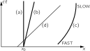
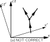
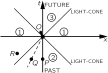
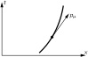

SOURCE: Feynman Lectures on Physics, Volume I, Chapter 17
LANGUAGE: ru
TITLE: Глава 17. Пространство-время
SOURCE_URL: https://www.feynmanlectures.caltech.edu/I_17.html
NOTEBOOKLM_USE: clean lecture text with TeX math and figure captions; reader navigation removed.

# Глава 17. Пространство-время

## 17–1 Геометрия пространства-времени

Теория относительности показывает, что связь между местоположением события и моментом, в какой оно происходит, при измерениях в двух разных системах отсчета совсем не такая, как можно было ожидать на основе наших интуитивных представлений. Очень важно ясно представить себе связь пространства и времени, возникающую из преобразований Лоренца. Поэтому в этой главе мы глубже рассмотрим этот вопрос.

Координаты и время \((x,y,z,t)\) , измеренные «покоящимся» наблюдателем, преобразуются в соответствующие координаты и время \((x',y',z',t')\) , измеренные внутри «движущегося» со скоростью \(u\) космического корабля, с помощью преобразований Лоренца:
\[
\begin{equation}
 \begin{aligned}
 x'&=\frac{x-ut}{\sqrt{1-u^2/c^2}},\\
 y'&=y,\\[2ex]
 z'&=z,\\
 t'&=\frac{t-ux/c^2}{\sqrt{1-u^2/c^2}}.
 \end{aligned}
 \label{Eq:I:17:1}
 \end{equation}
\]
Давайте сравним эти уравнения с уравнением (11.5), которое тоже связывает измерения в двух системах, только одна из них теперь вращается относительно другой:
\[
\begin{equation}
 \begin{alignedat}{4}
 &x'&&=x&&\cos\theta+y&&\sin\theta,\\
 &y'&&=y&&\cos\theta-x&&\sin\theta,\\
 &z'&&=z&&.
 \end{alignedat}
 \label{Eq:I:17:2}
 \end{equation}
\]
В этом частном случае Мик и Джо проводят измерения с осями, образующими угол \(\theta\) между осями \(x'\) и \(x\) . Но и в том и в другом случае мы замечаем, что «штрихованные» величины — это «перемешанные» между собой «нештрихованные»: новое \(x'\) есть смесь \(x\) и \(y\) , а новое \(y'\) — также смесь \(x\) и \(y\) .

Проведем следующую аналогию: когда мы глядим на предмет, мы различаем его «видимую ширину» и «видимую толщину». Но эти два понятия — «ширина» и «толщина» — отнюдь не основные свойства предмета. Отойдите в сторону, взгляните на предмет под другим углом — видимая ширина и видимая толщина предмета станут другими. Можно написать формулы, позволяющие узнать новые ширину и толщину по известным старым и по углу поворота. Уравнения (17.2) — как раз эти формулы. Можно сказать, что данная толщина есть своего рода «смесь» всех ширин и всех толщин. Если б мы не могли сдвинуться с места, если б мы на данный предмет всегда глядели из одного и того же положения, то нам все эти рассуждения показались бы неуместными; мы ведь и так всегда видели бы пред собой «настоящую» ширину и «настоящую» толщину и знали бы, что это совершенно разные качества предмета: один связан с углом, под каким виден предмет, другой требует фокусирования глаза и даже интуиции. Они казались бы абсолютно различными, их незачем было бы смешивать. Только потому, что мы в состоянии обойти вокруг предмета, мы понимаем, что ширина и толщина — это разные стороны одного и того же предмета.

Нельзя ли взглянуть на преобразование Лоренца таким же способом? Ведь и здесь перед нами смесь — смесь местоположения и момента времени. Разность пространственного и временного измерений дает новое пространственное измерение. Иначе говоря, в измерениях пространства, сделанных одним человеком, есть с точки зрения другого малая примесь времени. Наша аналогия позволяет высказать следующую мысль: «реальность» предмета, на который мы смотрим, включает нечто большее (говоря грубо и образно), чем его «ширину» и его «толщину», потому что обе они зависят от того, как мы смотрим на предмет. Оказавшись на новом месте, наш мозг немедленно пересчитывает и ширину, и толщину. Но когда мы будем двигаться с большой скоростью, наш мозг не сможет немедленно пересчитать координаты и время: у нас нет опыта движений со скоростями, близкими к световой, мы не ощущаем время и пространство как явления одной природы. Все равно как если бы нас усадили на какое-то место, заставили бы разглядывать ширину какого-то предмета и при этом не разрешали бы даже поворачивать голову. Мы теперь понимаем, что, будь у нас такая возможность, мы могли бы увидеть немножко от времени другого человека, как бы «заглянуть» сзади него.

Итак, мы попытаемся представить себе предметы в мире нового типа, в котором пространство и время смешаны в том же смысле, в каком реальны предметы нашего обычного пространственного мира и их можно разглядеть с разных направлений. Мы будем считать, что предметы, занимающие определенное место и существующие в течение некоторого времени, занимают некую «дольку» в мире нового типа и что мы смотрим на эту «дольку» с разных точек зрения, когда движемся с разной скоростью. Этот новый мир, эта геометрическая реальность, в которой существуют «дольки», занимающие определенное положение и отнимающие некоторое время, называется пространством-временем. Данная точка \((x,y,z,t)\) в пространстве-времени носит название события. Представьте, например, что положения \(x\) мы откладываем горизонтально, \(y\) и \(z\) — в двух других направлениях, взаимно под «прямым углом» друг к другу и под «прямым углом» к бумаге (!), а время — вертикально. Как на такой диаграмме изобразится, скажем, движущаяся частица? Если частица покоится, то у нее есть определенная \(x\) , и с течением времени она имеет ту же \(x\) , ту же \(x\) , ту же \(x\) ; так что ее «путь» — это линия, проходящая параллельно оси \(t\) (фиг. 17.1, а). С другой стороны, если она удаляется, то с течением времени \(x\) увеличивается (фиг. 17.1, б). Таким образом, например, частица, которая начинает удаляться, а затем замедляется, должна совершать движение, похожее на показанное на фиг. 17.1, в. Другими словами, всякая устойчивая, нераспадающаяся частица изображается линией в пространстве-времени. Распадающаяся частица изображалась бы вилкой, поскольку она превращалась бы в два других объекта, выходящих из этой точки.

### Figure Ch17-F1
Caption: Фиг. 17.1. Пути трех частиц в пространстве-времени: а — частица покоится в \(x = x_0\) ; b — частица отправилась из \(x = x_0\) с постоянной скоростью; c — частица начала двигаться с большой скоростью, но затормозила; d — путь света.
Image: figures/Ch17-F1.svg

А как обстоит дело со светом? Свет распространяется со скоростью \(c\) , и это изображалось бы линией с определенным постоянным наклоном (d на фиг. 17.1).

Итак, согласно нашей новой идее, если с частицей происходит некое событие, например если она внезапно распадается в какой-то пространственно-временной точке на две новые, которые следуют по новым путям, и это интересное событие произошло при определенном значении \(x\) и определенном значении \(t\) , то мы ожидали бы, что, если в этом есть хоть какой-то смысл, нам достаточно просто взять новую пару осей и повернуть их, и это даст нам новые \(t\) и новые \(x\) в нашей новой системе, как показано на фиг. 17.2, а. Но это не так: ведь уравнение (17.1) представляет собой не совсем то же самое математическое преобразование, что и уравнение (17.2). Обратите внимание, например, на разницу в знаках между ними, а также на то, что одно записано через \(\cos\theta\) и \(\sin\theta\) , в то время как другое содержит алгебраические величины. (Конечно, не исключено, что эти алгебраические величины можно было бы выразить через косинус и синус, но на самом деле это невозможно.) А все-таки эти два выражения очень похожи. Как мы с вами увидим, нельзя представлять себе пространство-время в виде реальной обычной геометрии, и все из-за этой разницы в знаках. На самом деле, хотя мы не будем подчеркивать этот момент, оказывается, что движущийся наблюдатель должен пользоваться осями, равнонаклоненными к световому лучу, используя особый вид проектирования параллельно осям \(x'\) и \(t'\) для определения своих \(x'\) и \(t'\) , как показано на фиг. 17.2, б. Мы не будем заниматься этой геометрией, она не особенно помогает; легче работать прямо с уравнениями.

### Figure Ch17-F2
Caption: Фиг. 17.2. Два изображения распада частицы.
Image: figures/Ch17-F2.svg

## 17–2 Пространственно-временные интервалы

Хотя геометрия пространства-времени не является евклидовой в обычном смысле, тем не менее эта геометрия очень похожа на неё, но в некоторых отношениях весьма своеобразная. Если это представление о геометрии правильно, то должны существовать такие функции координат и времени, которые не зависят от системы координат. К примеру, при обычных вращениях, если взять две точки, одну для простоты в начале координат обеих систем, а другую в любом другом месте, то расстояние от начала до другой точки будет одинаковым в обеих. Это одно из свойств, которое не зависит от частного способа измерения. Квадрат расстояния равен \(x^2 + y^2 + z^2\) . А как с пространством-временем? Нетрудно показать, что и здесь есть нечто, остающееся неизменным, а именно комбинация \(c^2t^2 - x^2 -
 y^2 - z^2\) одинакова до и после преобразования:
\[
\begin{equation}
 \label{Eq:I:17:3}
 c^2t'^2\!-x'^2\!-y'^2\!-z'^2\!=c^2t^2\!-x^2\!-y^2\!-z^2\!.
 \end{equation}
\]
Поэтому эта величина, подобно расстоянию, «реальна» в некотором смысле; её называют интервалом между двумя пространственно-временными точками, одна из которых в данном случае находится в начале координат. (На самом деле, конечно, это квадрат интервала, точно так же как и \(x^2 + y^2 +
 z^2\) — квадрат расстояния.) Мы даем ему другое название, поскольку оно относится к другой геометрии, но интересно лишь то, что некоторые знаки обращены и в формуле присутствует \(c\) .

Давайте избавимся от \(c\) ; это просто нелепо, если мы хотим иметь прекрасное пространство, в котором \(x\) и \(y\) можно переставлять. Одним из примеров путаницы, которую мог бы создать человек без опыта, было бы измерение ширины, скажем, по углу, под которым виден предмет, и измерение глубины каким-то другим способом, например по напряжению мышц, необходимому для фокусировки глаза, так что глубина измерялась бы в футах, а ширина — в метрах. При преобразованиях уравнений типа ( 17.2 ) тогда получится страшная неразбериха и невозможно будет разглядеть всю простоту и ясность предмета по той простой технической причине, что одно и то же измеряется в двух различных единицах. В уравнениях ( 17.1 ) и ( 17.3 ) природа говорит нам, что время равнозначно пространству; время становится пространством; их надо измерять в одинаковых единицах. Какое расстояние измеряет «секунда»? Из уравнения ( 17.3 ) легко понять, что это такое. Это \(3\times10^8\) метров — расстояние, которое свет проходит за одну секунду. Иначе говоря, если бы мы измеряли все расстояния и время в одних и тех же единицах, секундах, то наша единица длины составляла бы \(3\times10^8\) метров, и уравнения стали бы проще. Другой способ сделать единицы одинаковыми — измерять время в метрах. Что такое метр времени? Метр времени — это время, за которое свет проходит расстояние в один метр, и, следовательно, оно составляет \(1/3\times10^{-8}\) с, или \(3.3\) миллиардных доли секунды! Иными словами, мы хотели бы записать все наши уравнения в системе единиц, в которой \(c = 1\) . Если время и пространство измерять в одних и тех же единицах, как было предложено, то уравнения, очевидно, значительно упростятся. Они имеют вид:
\[
\begin{gather}
 \begin{aligned}
 x'&=\frac{x-ut}{\sqrt{1-u^2}},\\
 y'&=y,\\[1.5ex]
 z'&=z,\\
 t'&=\frac{t-ux}{\sqrt{1-u^2}}.
 \end{aligned}
 \label{Eq:I:17:4}\\[2.25ex]
 t'^2\!-x'^2\!-y'^2\!-z'^2\!=t^2\!-x^2\!-y^2\!-z^2\!.
 \label{Eq:I:17:5}
 \end{gather}
\]
Если мы когда-либо засомневаемся или «испугаемся», что, перейдя к системе с \(c=1\) , мы никогда не сможем вернуть уравнениям их правильный вид, то все обстоит как раз наоборот. Без \(c\) их гораздо легче запомнить, а поставить \(c\) на место всегда просто, если следить за размерностями. Например, в \(\sqrt{1 - u^2}\) мы знаем, что нельзя вычитать квадрат скорости, имеющий размерность, из чистого числа \(1\) , поэтому мы должны разделить \(u^2\) на \(c^2\) , чтобы сделать эту величину безразмерной; именно так это и делается.

Очень интересно различие между пространством-временем и обыкновенным пространством, различие между интервалом и расстоянием. Согласно формуле (17.5), если мы рассмотрим точку, которая в данной системе координат имеет нулевое время и только пространственные координаты, то квадрат интервала получится отрицательным, а сам интервал — мнимым (корень квадратный из отрицательного числа). Интервалы в этой теории бывают и действительные, и мнимые. Квадрат интервала может быть и положительным, и отрицательным, в отличие от расстояния, квадрат которого бывает только положительным. Когда интервал мнимый, говорят, что интервал между двумя точками пространственно-подобный (а не мнимый), потому что этот интервал больше похож на пространство, чем на время. С другой стороны, если два предмета находятся в одном и том же месте в данной системе координат, но отличаются только временем, то квадрат времени положителен, расстояния равны нулю, а квадрат интервала положителен; это называется времени-подобным интервалом. Таким образом, на нашей диаграмме пространства-времени мы получим примерно следующее представление: под углом \(45^\circ\) проходят две прямые (в четырех измерениях они обратятся в «конусы», называемые световыми), и все точки на этих прямых будут отделены от начала координат нулевым интервалом. Куда бы ни распространялся свет из данной точки, он всегда отделен от нее нулевым интервалом, как легко видеть из уравнения (17.5). Кстати, мы сейчас доказали, что если свет распространяется со скоростью \(c\) в одной системе координат, то он распространяется со скоростью \(c\) и в другой, ведь если интервал в обеих системах одинаков, то есть равен нулю в одной из них и равен нулю в другой, то сказать, что скорость распространения света — инвариант, это все равно что сказать, что интервал равен нулю.

## 17–3 Прошедшее, настоящее, будущее

### Figure Ch17-F3
Caption: Фиг. 17.3. Область пространства-времени, окружающая начало координат.
Image: figures/Ch17-F3.svg

Пространственно-временную область, окружающую данную точку пространства-времени, можно разделить на три области, как показано на фиг. 17.3. В одной из них интервалы пространственно-подобны, в остальных двух — времени-подобны. Эти три области, на которые распадается окружающее точку пространство-время, в физическом отношении связаны с самой точкой очень интересно: физический объект или сигнал, двигаясь со скоростью, меньшей скорости света, может попасть из точки в области \(2\) в событие \(O\) . Поэтому события в этой области могут воздействовать на точку \(O\) , могут влиять на нее из прошлого. Действительно, предмет в \(P\) на оси отрицательных \(t\) оказывается точно в «прошлом» по отношению к \(O\) ; это та же пространственная точка, что и \(O\) , только в более ранний момент времени. Что в ней когда-то случилось, теперь сказывается на \(O\) . (К сожалению, именно такова наша жизнь.) Другой предмет в \(Q\) может попасть в \(O\) , двигаясь с определенной скоростью, меньшей, чем \(c\) ; значит, если бы этот предмет двигался в космическом корабле, он мог бы тоже оказаться прошлым той же пространственной точки. То есть в другой системе координат ось времени могла бы пройти через \(O\) и \(Q\) . Таким образом, все точки области \(2\) оказываются по отношению к \(O\) в «прошлом», и все, что в этой области происходит, может сказаться на \(O\) . Поэтому область \(2\) иногда называют воздействующим прошлым; это геометрическое место всех событий, которые хоть каким-то образом могут повлиять на точку \(O\) .

А зато область \(3\) — это область, на которую мы можем повлиять из \(O\) ; мы можем «попадать» в тела, стреляя «пулями» со скоростью, меньшей \(c\) . Это тот мир, на будущее которого мы можем повлиять, и его можно назвать воздействуемым будущим. Остальное же пространство-время, т. е. область \(1\) , интересно тем, что мы не можем ни повлиять на него сейчас из \(O\) , ни оно не может сейчас повлиять на нас в \(O\) , потому что ничто не может двигаться быстрее скорости света. Конечно, то, что происходит в \(R\) , может сказаться на нас позднее; то есть, если Солнце взрывается «прямо сейчас», пройдет восемь минут, прежде чем мы узнаем об этом, и раньше этого времени это никак не может на нас повлиять.

То, что происходит «сейчас», «сию минуту» — это на самом деле нечто таинственное; оно не поддается определению, не поддается и воздействию, однако несколько позже оно может воздействовать на нас (или мы на него, если какое-то время тому назад мы позаботились об этом). Когда мы смотрим на звезду Альфа Центавра, мы видим ее такой, какой она была 4 года тому назад; нам может захотеться узнать, на что она похожа «сейчас». «Сейчас» — это значит в этот же момент в нашей системе координат. Альфу Центавра мы можем видеть только при помощи световых лучей, явившихся к нам из нашего прошлого, прошлого четырехлетней давности, но что на ней происходит «сейчас», мы не знаем. Происходящее на ней «сейчас» сможет воздействовать на нас только через четыре года. «Альфа Центавра сейчас» — это идея, или понятие, существующее в нашем мозге; никакого физического определения для такого понятия в этот момент нет, потому что надо подождать, прежде чем «сейчас» удастся увидеть; для Альфы Центавра даже правильное понятие «сейчас» не поддается определению сию минуту. Ведь «сейчас» зависит от системы координат. Если бы, к примеру, Альфа Центавра двигалась, то наблюдатель на ней не согласился бы с нашим пониманием его «сейчас», потому что его оси координат были бы повернуты на какой-то угол, а его «сейчас» было бы совсем другим временем. Мы уже говорили, что одновременность не определяется однозначно.

Встречаются порой предсказатели судьбы, гадалки, люди, утверждающие, что они могут узнавать будущее; немало чудесных историй рассказывается и о человеке, который внезапно обнаруживает, что знает воздействуемое будущее. От этого возникает множество парадоксов: ведь если мы знаем, что что-то случится, то мы наверняка сможем избежать этого, сделав то, что нужно, в нужное время, и так далее. Но на самом деле нет ни одного предсказателя, который мог бы сказать нам хотя бы настоящее! Нам никто не может сказать, что на самом деле происходит прямо сейчас на каком-либо разумном расстоянии, потому что это ненаблюдаемо. Мы можем задать себе вопрос (попытаться ответить на который мы предлагаем самому студенту): возник бы какой-нибудь парадокс, если бы внезапно появилась возможность знать о том, что находится в пространственно-подобных интервалах области \(1\) ?

## 17–4 Еще о четырехвекторах

Вернемся опять к аналогии между преобразованием Лоренца и вращением пространственных осей. Мы уже убедились, что полезно собирать воедино отличные от координат величины, которые преобразуются так же, как и координаты; эти соединенные величины называют векторами, или направленными отрезками. При обычных вращениях немало величин преобразуется в точности так же, как \(x\) , \(y\) и \(z\) при вращении: например, скорость имеет три компоненты — \(x\) -, \(y\) - и \(z\) -компоненты; при переходе из одной системы координат в другую ни одна из компонент не остается прежней, все они приобретают новые значения. Но «сама» скорость, во всяком случае, более реальна, чем любая из ее компонент, и изображаем мы эту скорость направленным отрезком.

Теперь мы спросим: существуют ли величины, которые преобразуются при переходе от неподвижной системы к движущейся так же, как и \(x\) , \(y\) , \(z\) и \(t\) ? Наш опыт обращения с векторами подсказывает, что три из этих величин, подобно \(x\) , \(y\) , \(z\) , могли бы представлять собой три компоненты обычного пространственного вектора, а четвертая могла бы оказаться похожей на обычный скаляр относительно пространственных вращений: она бы не изменялась, пока мы не перейдем в движущуюся систему координат. Возможно ли, однако, связать с одним из известных «тривекторов» некоторый четвертый объект (который можно назвать «временной компонентой») таким образом, чтобы вся четверка «вращалась» точно так же, как изменяются пространство и время в пространстве-времени? Мы сейчас покажем, что действительно существует по крайней мере одна такая четверка (на самом деле далеко не одна): три компоненты импульса и энергия в качестве временной компоненты преобразуются вместе и образуют так называемый «четырехвектор». Доказывая это, поскольку писать везде \(c\) очень неудобно, мы воспользуемся тем же приемом относительно единиц энергии, массы и импульса, какой употреблялся в уравнении (17.4). Например, энергия и масса отличаются только множителем \(c^2\) , и при надлежащем выборе единиц измерения энергия совпадет с массой. Вместо того чтобы писать \(c^2\) , мы положим \(E = m\) . Если понадобится, в окончательных уравнениях можно опять расставить \(c\) в нужных степенях, чтобы восстановить размерность, но не в промежуточных.

Итак, уравнения для энергии и импульса имеют вид
\[
\begin{equation}
 \begin{alignedat}{2}
 &E&&=m=m_0/\sqrt{1-v^2},\\[1ex]
 &\FLPp&&=m\FLPv=m_0\FLPv/\sqrt{1-v^2}.
 \end{alignedat}
 \label{Eq:I:17:6}
 \end{equation}
\]
Значит, при таком выборе единиц получится
\[
\begin{equation}
 \label{Eq:I:17:7}
 E^2-p^2=m_0^2.
 \end{equation}
\]
Скажем, если энергия выражена в электронвольтах (эв), то чему равна масса в \(1\) эв? Она равна массе с энергией покоя \(1\) эв, т. е. \(m_0c^2\) равна одному электронвольту. У электрона, например, масса покоя равна \(0.511\times10^6\) эв.

Как же будут выглядеть импульс и энергия в новой системе координат? Чтобы узнать это, надо преобразовать уравнения (17.6). Это преобразование легко получить, зная, как преобразуется скорость. Пусть некоторое тело имело скорость \(v\) , а мы наблюдаем за ним из космического корабля, который сам имеет скорость \(u\) , и обозначаем соответствующие величины штрихами. Для простоты сперва мы рассмотрим случай, когда скорость \(v\) направлена по скорости \(u\) . (Более общий случай мы рассмотрим позже.) Чему равна скорость \(v'\) по измерениям из космического корабля? Эта скорость равна «разности» между \(v\) и \(u\) . По прежде полученному нами закону
\[
\begin{equation}
 \label{Eq:I:17:8}
 v'=\frac{v-u}{1-uv}.
 \end{equation}
\]
Теперь подсчитаем, какой окажется энергия \(E'\) по измерениям космонавта. Он, конечно, воспользуется той же массой покоя, но зато скорость станет \(v'\) . Он возведет \(v'\) в квадрат, вычтет из единицы, извлечет квадратный корень и найдет обратную величину:
\[
\begin{equation*}
 \begin{aligned}
 v'^2&=\frac{v^2-2uv+u^2}{1-2uv+u^2v^2},\\[1.5ex]
 1-v'^2&=\frac{1-2uv+u^2v^2-v^2+2uv-u^2}{1-2uv+u^2v^2},\\[1ex]
 &=\frac{1-v^2-u^2+u^2v^2}{1-2uv+u^2v^2},\\[1.5ex]
 &=\frac{(1-v^2)(1-u^2)}{(1-uv)^2}.
 \end{aligned}
 \end{equation*}
\]
Поэтому
\[
\begin{equation}
 \label{Eq:I:17:9}
 \frac{1}{\sqrt{1-v'^2}}=\frac{1-uv}{\sqrt{1-v^2}\sqrt{1-u^2}}.
 \end{equation}
\]

Энергия \(E'\) просто равна \(m_0\) , умноженной на это выражение. Но нам хочется выразить энергию через нештрихованные энергию и импульс, и мы замечаем, что
\[
\begin{align*}
 E'&=\frac{m_0-m_0uv}{\sqrt{1-v^2}\sqrt{1-u^2}}\\[2ex]
 &=\frac{(m_0/\sqrt{1-v^2})-(m_0v/\sqrt{1-v^2})u}{\sqrt{1-u^2}},
 \end{align*}
\]
или
\[
\begin{equation}
 \label{Eq:I:17:10}
 E'=\frac{E-up_x}{\sqrt{1-u^2}},
 \end{equation}
\]
, в котором мы узнаем выражение, по форме точно совпадающее с
\[
\begin{equation*}
 t'=\frac{t-ux}{\sqrt{1-u^2}}.
 \end{equation*}
\]
Теперь мы должны найти новый импульс \(p_x'\) . Он просто равен энергии \(E'\) , умноженной на \(v'\) , и так же просто выражается через \(E\) и \(p\) :
\[
\begin{align*}
 p_x'=E'v'&=\frac{m_0(1-uv)}{\sqrt{1-v^2}\sqrt{1-u^2}}\cdot
 \frac{v-u}{(1-uv)}\\[2ex]
 &=\frac{m_0v-m_0u}{\sqrt{1-v^2}\sqrt{1-u^2}}.
 \end{align*}
\]
Итак,
\[
\begin{equation}
 \label{Eq:I:17:11}
 p_x'=\frac{p_x-uE}{\sqrt{1-u^2}},
 \end{equation}
\]
, в котором мы опять распознаем в точности ту же форму, что и у
\[
\begin{equation*}
 x'=\frac{x-ut}{\sqrt{1-u^2}}.
 \end{equation*}
\]

Итак, преобразования новых энергии и импульса через старые энергию и импульс в точности совпадают с преобразованиями \(t'\) через \(t\) и \(x\) , а также \(x'\) через \(x\) и \(t\) : все, что нам нужно сделать, — это каждый раз, когда мы видим \(t\) в (17.4), подставлять \(E\) , а каждый раз, когда мы видим \(x\) , подставлять \(p_x\) , и тогда уравнения (17.4) превратятся в уравнения (17.10) и (17.11). Если все верно, это предполагает добавочное правило, согласно которому \(p_y' = p_y\) и \(p_z' = p_z\) . Чтобы доказать это, нам пришлось бы вернуться назад и рассмотреть случай движения вверх и вниз. На самом деле мы рассмотрели случай движения вверх и вниз в предыдущей главе. Мы анализировали сложное столкновение и заметили, что поперечный импульс действительно не меняется при наблюдении из движущейся системы; стало быть, мы уже убедились, что \(p_y' = p_y\) и \(p_z' = p_z\) . Итак, полное преобразование равно
\[
\begin{equation}
 \begin{aligned}
 p_x'&=\frac{p_x-uE}{\sqrt{1-u^2}},\\
 p_y'&=p_y,\\[1ex]
 p_z'&=p_z,\\
 E'&=\frac{E-up_x}{\sqrt{1-u^2}}.
 \end{aligned}
 \label{Eq:I:17:12}
 \end{equation}
\]

Таким образом, эти преобразования выявили четыре величины, которые преобразуются подобно \(x\) , \(y\) , \(z\) и \(t\) и которые мы называем четырехвектором импульса. Так как импульс — это четырехвектор, его можно изобразить на диаграмме пространства-времени движущейся частицы в виде «стрелки», касательной к пути, как показано на фиг. 17.4. У этой стрелки временная компонента равна энергии, а ее пространственные компоненты представляют собой его тривектор импульса; сама стрелка «реальнее», чем энергия или импульс, потому что они зависят лишь от того, как мы смотрим на диаграмму.

### Figure Ch17-F4
Caption: Фиг. 17.4. Четырехвектор импульса частицы.
Image: figures/Ch17-F4.svg

## 17–5 Алгебра четырехвекторов

Четырехвекторы обозначаются иначе, чем тривекторы. В случае тривекторов, если бы мы говорили об обычном тривекторе импульса, мы бы записали его как \(\FLPp\) . Если бы мы хотели дать более детальную запись, мы могли бы сказать, что для рассматриваемых осей он имеет три компоненты, равные \(p_x\) , \(p_y\) и \(p_z\) , или же мы могли бы просто обозначить общую компоненту как \(p_i\) и сказать, что \(i\) может быть либо \(x\) , либо \(y\) , либо \(z\) , и это и есть три компоненты; то есть, представим себе, что \(i\) — это любое из трех направлений: \(x\) , \(y\) или \(z\) . Обозначение, которое мы используем для четырехвекторов, аналогично этому: мы пишем \(p_\mu\) для четырехвектора, а \(\mu\) заменяет собой четыре возможных направления: \(t\) , \(x\) , \(y\) или \(z\) .

Конечно, можно пользоваться любыми обозначениями. Не улыбайтесь, что мы так много говорим об обозначениях; учитесь изобретать их: в них вся сила. Ведь и сама математика в значительной степени состоит в изобретении лучших обозначений. Идея четырехвектора — это тоже усовершенствование обозначений с таким расчетом, чтобы преобразования было легче запомнить. Итак, \(A_\mu\) — это общий четырехвектор, но для частного случая импульса \(p_t\) отождествляется с энергией, \(p_x\) — это импульс в направлении \(x\) , \(p_y\) — в направлении \(y\) , а \(p_z\) — в направлении \(z\) . Складывая четырехвекторы, складывают их соответствующие компоненты.

Если четырехвекторы связаны каким-то уравнением, то это значит, что уравнение выполняется для любой компоненты. Например, если закон сохранения тривектора импульса соблюдается в столкновении частиц, т. е. сумма импульсов множества взаимодействующих или сталкивающихся частиц постоянна, то это означает, что сумма всех компонент импульсов постоянна и в направлении \(x\) , и в направлении \(y\) , и в направлении \(z\) . Сам по себе такой закон в теории относительности невозможен: он неполон; это все равно, что говорить только о двух компонентах тривектора. Неполон он потому, что при повороте осей разные компоненты смешиваются, значит, в закон сохранения должны войти все три компоненты. Таким образом, в теории относительности нужно дополнить закон сохранения импульса, включив в него сохранение временной компоненты. Абсолютно необходимо, чтобы сохранение первых трех компонент сопровождалось сохранением четвертой, иначе не получится релятивистской инвариантности. Четвертое уравнение — это как раз сохранение энергии; оно должно сопровождать сохранение импульса для того, чтобы четырехвекторные соотношения в геометрии пространства-времени были справедливы. Итак, закон сохранения энергии и импульса в четырехмерном обозначении таков:
\[
\begin{equation}
 \label{Eq:I:17:13}
 \sum_{\substack{\text{particles}\\\text{in}}}p_\mu=
 \sum_{\substack{\text{particles}\\\text{out}}}p_\mu
 \end{equation}
\]
или в чуть измененных обозначениях
\[
\begin{equation}
 \label{Eq:I:17:14}
 \sum_ip_{i\mu}=\sum_jp_{j\mu},
 \end{equation}
\]
где \(i = 1\) , \(2\) , ... относится к сталкивающимся частицам, \(j= 1\) , \(2\) , ... — к частицам, возникающим при столкновении, а \(\mu = x\) , \(y\) , \(z\) или \(t\) . Вы спросите: «А что по осям координат?» Это неважно. Закон верен для любых компонент, при любых осях.

В векторном анализе нам встретилось еще одно понятие — скалярное произведение двух векторов. Давайте теперь рассмотрим аналогичное понятие в пространстве-времени. При обычных вращениях мы обнаружили неизменную величину \(x^2 +
 y^2 + z^2\) . В четырехмерном мире мы находим, что соответствующая величина равна \(t^2 - x^2 - y^2 - z^2\) (уравнение 17.3). Как можно это записать? Один из способов — записать какое-то четырехмерное выражение с квадратной точкой посередине, наподобие \(A_\mu \boxdot B_\mu\) ; но обычно используют обозначение
\[
\begin{equation}
 \label{Eq:I:17:15}
 \sideset{}{'}\sum_\mu A_\mu A_\mu=A_t^2-A_x^2-A_y^2-A_z^2.
 \end{equation}
\]
. Штрих при \(\sum\) означает, что первый, «временной», член положителен, а остальные три члена отрицательны. Эта величина, следовательно, будет одной и той же в любой системе координат, и мы можем назвать ее квадратом длины четырехвектора. Чему равен, например, квадрат длины четырехвектора импульса отдельной частицы? Он будет равен \(p_t^2 - p_x^2 - p_y^2 - p_z^2\) или, иначе говоря, \(E^2 - p^2\) , потому что мы знаем, что \(p_t\) — это \(E\) . Чему равно \(E^2 -
 p^2\) ? Это должно быть что-то, что одинаково в любой системе координат. В частности, оно должно быть тем же самым в системе координат, которая движется вместе с частицей, так что частица в этой системе покоится. Если частица покоится, у нее нет импульса. Значит, в этой системе координат это просто ее энергия, совпадающая с ее массой покоя. Таким образом, \(E^2 - p^2 = m_0^2\) . Итак, мы видим, что квадрат длины этого вектора, четырехвектора импульса, равен \(m_0^2\) .

Пользуясь выражением для квадрата вектора, легко изобрести «скалярное произведение», или произведение, являющееся скаляром: если один четырехвектор — это \(a_\mu\) , а другой — \(b_\mu\) , то скалярное произведение равно
\[
\begin{equation}
 \label{Eq:I:17:16}
 \sideset{}{'}\sum a_\mu b_\mu=a_tb_t-a_xb_x-a_yb_y-a_zb_z.
 \end{equation}
\]
Оно одинаково во всех координатных системах.

Следует еще упомянуть о частицах, масса покоя которых \(m_0\) равна нулю. Например, о фотоне — частице света. Фотон похож на частицу тем, что он переносит энергию и импульс. Энергия фотона равна произведению некоторой постоянной, называемой постоянной Планка, на частоту фотона: \(E = h\nu\) . Такой фотон также несет с собой импульс, причем импульс фотона (или вообще любой другой частицы) равен \(h\) , деленной на длину волны: \(p = h/\lambda\) . Но для фотона существует определенная связь между частотой и длиной волны: \(\nu= c/\lambda\) . (Количество волн в секунду, помноженное на длину каждой из них, — это расстояние, которое свет проходит за одну секунду, то есть, конечно, \(c\) .) Таким образом, мы сразу видим, что энергия фотона должна быть равна импульсу, умноженному на \(c\) , а если \(c = 1\) , то энергия и импульс равны. То есть масса покоя равна нулю. Давайте взглянем на это еще раз; это весьма любопытно. Если это частица с нулевой массой покоя, то что с ней происходит, когда она останавливается? Она никогда не останавливается! Она всегда движется со скоростью \(c\) . Обычная формула для энергии — это \(m_0/\sqrt{1 -
 v^2}\) . Можно ли теперь сказать, что раз \(m_0 = 0\) и \(v = 1\) , то энергия равна \(0\) ? Нельзя сказать, что она равна нулю; фотон действительно может обладать (и обладает) энергией, хотя и не имеет массы покоя, за счет того, что постоянно движется со скоростью света!

Мы знаем также, что импульс любой частицы равен произведению полной энергии на скорость: если \(c = 1\) , то \(p = vE\) или, в обычных единицах, \(p = vE/c^2\) . Для любой частицы, движущейся со скоростью света, \(p = E\) , если \(c = 1\) . Формулы для энергии фотона в движущейся системе даются, конечно, уравнением (17.12), но вместо импульса туда нужно подставить энергию, деленную на \(c\) (или на \(1\) в данном случае). Разные значения энергии после преобразования означают разные частоты. Это явление называется эффектом Допплера, и его формулу легко получить из уравнения (17.12), используя также \(E = p\) и \(E = h\nu\) .

Как сказал Минковский: «Пространство само по себе и время само по себе погрузятся в реку забвенья, а останется жить лишь своеобразный их союз».
