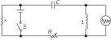
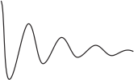

SOURCE: Feynman Lectures on Physics, Volume I, Chapter 24
LANGUAGE: ru
TITLE: Глава 24. Переходные решения
SOURCE_URL: https://www.feynmanlectures.caltech.edu/I_24.html
NOTEBOOKLM_USE: clean lecture text with TeX math and figure captions; reader navigation removed.

# Глава 24. Переходные решения

## 24–1 Энергия осциллятора

Хотя глава названа «Переходные решения», речь здесь все еще в основном идет об осцилляторе, на который действует внешняя сила. Мы еще ничего не говорили об энергии колебаний. Давайте займемся ею.

Чему равна кинетическая энергия механического осциллятора? Она пропорциональна квадрату скорости. Здесь мы затронули важный вопрос. Предположим, что мы изучаем свойства некоторой величины \(A\) ; это может быть скорость или еще что-нибудь. Когда мы пишем комплексное число \(A =
\hat{A}e^{i\omega t}\) , истинная, физическая величина \(A\) — это только его действительная часть; поэтому если нам для чего-нибудь понадобится получить квадрат \(A\) , то не следует возводить в квадрат комплексное число, чтобы потом выделить его действительную часть. Действительная часть квадрата комплексного числа не равна квадрату действительной части, она содержит еще и мнимую часть первоначального числа. Таким образом, если мы захотим найти энергию и посмотреть на ее превращения, нам придется на время забыть о комплексных числах.

Итак, истинно физическая величина \(A\) — это действительная часть \(A_0e^{i(\omega
t+\Delta)}\) , то есть \(A = A_0 \cos\,(\omega t + \Delta)\) , где комплексное число \(\hat{A}\) записывается как \(A_0e^{i\Delta}\) . Квадрат этой действительной физической величины равен \(A^2 = A_0^2 \cos^2\,(\omega
t + \Delta)\) . Тогда квадрат этой величины изменяется от максимума до нуля, как и квадрат косинуса. Максимальное значение квадрата косинуса равно \(1\) , минимальное равно \(0\) , а его среднее значение равно \(1/2\) .

Зачастую нас совсем не интересует энергия в каждый данный момент колебания; во многих случаях нам нужно лишь среднее значение \(A^2\) , то есть среднее значение квадрата \(A\) в течение времени, большого по сравнению с периодом колебаний. При этих условиях можно использовать среднее значение квадрата косинуса, так что мы получаем следующую теорему: если \(A\) представляется комплексным числом, то среднее значение \(A^2\) равно \(\tfrac{1}{2}A_0^2\) . Здесь \(A_0^2\) — это квадрат модуля комплексного числа \(\hat{A}\) . (Это можно записать по-разному: некоторые предпочитают писать \(\abs{\hat{A}}^2\) , другие пишут \(\hat{A}\hat{A}\cconj\) — произведение \(\hat{A}\) на его комплексно сопряженное.) Эта теорема пригодится нам еще много раз.

Итак, речь идет об энергии осциллятора, на который действует внешняя сила. Движение такого осциллятора описывается уравнением
\[
\begin{equation}
\label{Eq:I:24:1}
m\,d^2x/dt^2+\gamma m\,dx/dt+m\omega_0^2x=F(t).
\end{equation}
\]
. В нашей задаче, конечно, \(F(t)\) является косинусоидальной функцией от \(t\) . Выясним теперь, какую работу совершает внешняя сила \(F\) ? Работа, совершаемая силой в секунду, то есть мощность, равна произведению силы на скорость. (Мы знаем, что элементарная работа за время \(dt\) равна \(F\,dx\) , а мощность равна \(F\,dx/dt\) .) Значит,
\[
\begin{align}
P=F\,&\ddt{x}{t}\notag\\[1.25ex]
=m&\biggl[\biggl(\ddt{x}{t}\biggr)\biggl(
\frac{d^2x}{dt^2}\biggr)+\omega_0^2x\biggl(\ddt{x}{t}\biggr)\biggr]\notag\\[.5ex]
\label{Eq:I:24:2}
&+\gamma m\biggl(\ddt{x}{t}\biggr)^2.
\end{align}
\]
. Но первые два члена в правой части можно также переписать в виде \(d/dt[\tfrac{1}{2}m(dx/dt)^2 + \tfrac{1}{2}m\omega_0^2x^2]\) , в чем легко убедиться простым дифференцированием. Иными словами, выражение в скобках — это чистая производная от двух простых для понимания членов: один из них — кинетическая энергия движения, а другой — потенциальная энергия пружины. Назовем эту величину запасенной энергией, то есть энергией, накопленной при колебаниях. Предположим, что мы хотим найти среднюю мощность за много периодов, когда на осциллятор действует вынуждающая сила и он колеблется уже долгое время. В конечном счете запасенная энергия не изменяется — ее производная дает в среднем нулевой эффект. Иными словами, если усреднить мощность за долгое время, вся энергия в итоге поглотится из-за сопротивления, описываемого членом \(\gamma m(dx/dt)^2\) . Определенная часть энергии запасается при колебаниях, но при усреднении по многим периодам она не меняется со временем. Таким образом, средняя мощность \(\avg{P}\) равна
\[
\begin{equation}
\label{Eq:I:24:3}
\avg{P} = \avg{\gamma m(dx/dt)^2}.
\end{equation}
\]

Применяя метод комплексных чисел и нашу теорему о том, что \(\avg{A^2} = \tfrac{1}{2}A_0^2\) , легко найти эту среднюю мощность. Таким образом, если \(x=
\hat{x}e^{i\omega t}\) , то \(dx/dt = i\omega\hat{x}e^{i\omega
t}\) . Следовательно, в этих условиях среднюю мощность можно записать в виде
\[
\begin{equation}
\label{Eq:I:24:4}
\avg{P} = \tfrac{1}{2}\gamma m\omega^2x_0^2.
\end{equation}
\]

В обозначениях для электрических цепей \(dx/dt\) заменяется током \(I\) ( \(I\) — это \(dq/dt\) , где \(q\) соответствует \(x\) ), а \(m\gamma\) соответствует сопротивлению \(R\) . Таким образом, скорость потери энергии — мощность, затрачиваемая вынуждающей силой, — равна произведению сопротивления в цепи на средний квадрат силы тока:
\[
\begin{equation}
\label{Eq:I:24:5}
\avg{P} = R\avg{I^2} = 
R\cdot\tfrac{1}{2}I_0^2.
\end{equation}
\]
Эта энергия, естественно, переходит в тепло, выделяемое сопротивлением; её иногда называют тепловыми потерями, или джоулевым теплом.

Интересно разобраться также в том, много ли энергии может накопить осциллятор. Не путайте этого вопроса с вопросом о средней мощности, ибо хотя выделяемая силой мощность сначала действительно накапливается осциллятором, потом на его долю остается лишь то, что не поглотило трение. В каждый момент осциллятор обладает вполне определенной энергией, поэтому можно вычислить также среднюю запасенную энергию \(\avg{E}\) . Мы уже вычислили среднее значение \((dx/dt)^2\) , так что
\[
\begin{equation}
\begin{aligned}
\avg{E} &= \tfrac{1}{2}m
\avg{(dx/dt)^2} + \tfrac{1}{2}m\omega_0^2
\avg{x^2}\\[1ex]
&=\tfrac{1}{2}m(\omega^2+\omega_0^2)\tfrac{1}{2}x_0^2.
\end{aligned}
\label{Eq:I:24:6}
\end{equation}
\]
. Если осциллятор достаточно добротен и частота \(\omega\) близка к \(\omega_0\) , так что \(\abs{\hat{x}}\) — большая величина, запасенная энергия очень велика — мы можем получить большую запасенную энергию за счет относительно небольшой силы. Сила производит большую работу, заставляя осциллятор раскачиваться, но после того, как установилось равновесие, вся сила уходит на борьбу с трением. Осциллятор располагает большой энергией, если трение очень мало, и потери энергии невелики даже при очень большом размахе колебаний. Добротность осциллятора можно измерять величиной запасенной энергии по сравнению с работой, совершенной силой за период колебания.

Как соотносится накопленная энергия с работой, совершаемой за один цикл? Ее называют \(Q\) системы, и \(Q\) определяется как умноженное на \(2\pi\) отношение средней запасенной энергии к работе, совершаемой за один цикл. (Если бы мы говорили о работе за радиан, а не за цикл, то \(2\pi\) исчезло бы.)
\[
\begin{equation}
\label{Eq:I:24:7}
Q=2\pi\,\frac{\tfrac{1}{2}m(\omega^2+\omega_0^2)\cdot
\avg{x^2}}{\gamma m\omega^2\avg{x^2}\cdot
2\pi/\omega}=\frac{\omega^2+\omega_0^2}{2\gamma\omega}.
\end{equation}
\]
Величина \(Q\) — не очень полезное число, если только она не очень велика. Когда она относительно велика, она служит мерой добротности осциллятора. Многие пытались дать самое простое и полезное определение \(Q\) ; разные определения немногим отличаются друг от друга, но если \(Q\) очень велика, то все они согласуются друг с другом. Наиболее общепринятым определением является уравнение (24.7), которое зависит от \(\omega\) . Для хорошего осциллятора вблизи резонанса мы можем немного упростить (24.7), положив \(\omega=\omega_0\) , и тогда мы получим \(Q= \omega_0/\gamma\) — определение \(Q\) , которое мы использовали ранее.

Что такое \(Q\) для электрической цепи? Чтобы найти эту величину, надо заменить \(L\) на \(m\) , \(R\) на \(m\gamma\) и \(1/C\) на \(m\omega_0^2\) (см. табл. 23.1). Тогда \(Q\) в точке резонанса равна \(L\omega/R\) , где \(\omega\) — резонансная частота. В цепи с большой \(Q\) запасенная цепью энергия велика по сравнению с работой за один цикл, производимой поддерживающей колебания в цепи машиной.

## 24–2 Затухающие колебания

Вернемся к основной теме — переходным решениям. Переходными решениями называются решения дифференциального уравнения, соответствующие ситуации, когда внешняя сила не действует, но система тем не менее не находится в покое. (Конечно, лучше всего решать задачу, когда сила не действует, а система покоится, покоится — ну и пусть покоится!) Соответствующие переходным решениям колебания можно вызвать так: заставить силу поработать, а потом выключить ее. Что тогда случится с осциллятором? Сначала подумаем, как будет вести себя система с очень большой \(Q\) . Если сила действовала долго, то запасенная энергия была постоянной и работа тратилась лишь для того, чтобы поддержать ее. Предположим теперь, что мы выключили силу, тогда трению, которое раньше поглощало энергию поставщика, питаться больше нечем — кормильца-то нет. И трение начинает пожирать запасенную осциллятором энергию. Пусть \(Q/2\pi = 1000\) . Тогда работа, произведенная за один цикл, составляет \(1/1000\) запасенной энергии. Пожалуй, разумно предположить, что при не поддерживаемых внешней силой колебаниях за каждый цикл все так же будет теряться тысячная доля энергии \(E\) , которая обычно поступала бы извне, и система продолжит колебаться, каждый раз теряя \(1/1000\) своей энергии за цикл. Таким образом, в качестве догадки для системы с относительно высокой \(Q\) мы можем предположить, что следующее уравнение будет приблизительно верным (мы еще вернемся к этому уравнению и сделаем его совсем верным!):
\[
\begin{equation}
\label{Eq:I:24:8}
dE/dt=-\omega E/Q.
\end{equation}
\]
Уравнение это приближенное, потому что оно справедливо только для больших \(Q\) . За каждый радиан система теряет долю \(1/Q\) запасенной энергии \(E\) . Значит, за данный промежуток времени \(dt\) энергия изменится на величину \(\omega\,dt/Q\) , так как число радианов, связанное с временем \(dt\) , равно \(\omega\,dt\) . А какая это частота? Предположим, что система колеблется так свободно, почти без сопротивления, что если ее предоставить самой себе, она будет совершать колебания практически на той же частоте. Поэтому будем считать, что \(\omega\) — это резонансная частота \(\omega_0\) . Тогда из уравнения (24.8) следует, что запасенная энергия меняется как
\[
\begin{equation}
\label{Eq:I:24:9}
E=E_0e^{-\omega_0t/Q}=E_0e^{-\gamma t}.
\end{equation}
\]
Это дает значение энергии в любой момент времени. Какой будет приближенная формула, определяющая амплитуду колебаний как функцию времени? Той же самой? Нет! Потенциальная энергия пружины, скажем, изменяется как квадрат смещения; кинетическая энергия — как квадрат скорости; это приводит к тому, что полная энергия пропорциональна квадрату смещения. Таким образом, из-за квадрата смещение (амплитуда колебаний) будет уменьшаться с половинной скоростью. Иначе говоря, мы ожидаем, что решение в случае затухающего переходного движения будет выглядеть как колебание с частотой, близкой к резонансной частоте \(\omega_0\) , причем амплитуда этого синусоидального колебания будет уменьшаться как \(e^{-\gamma t/2}\) :
\[
\begin{equation}
\label{Eq:I:24:10}
x=A_0e^{-\gamma t/2}\cos\omega_0 t.
\end{equation}
\]
Эта формула и фиг. 24.1 дают представление о том, чего следует ожидать, а теперь приступим к точному анализу движения, то есть к решению дифференциального уравнения самого движения.

### Figure Ch24-F1
Caption: Фиг. 24.1. Затухающие колебания.
Image: figures/Ch24-F1.svg

Как же решить уравнение (24.1), если выкинуть из него внешнюю силу? Будучи физиками, мы интересуемся не столько методом, сколько самим решением. Поскольку мы люди уже опытные, попытаемся представить решение в виде экспоненциальной кривой, \(x = Ae^{i\alpha t}\) . (Почему мы так поступили? Оттого, что экспоненту легче всего дифференцировать!) Подставим это выражение в (24.1) (при \(F(t) = 0\) ), помня о том, что каждое дифференцирование \(x\) по времени сводится к умножению на \(i\alpha\) . Сделать это очень легко, и наше уравнение примет вид:
\[
\begin{equation}
\label{Eq:I:24:11}
(-\alpha^2+i\gamma\alpha+\omega_0^2)Ae^{i\alpha t}=0.
\end{equation}
\]
Левая часть равенства должна быть равна нулю все время, но это возможно только в двух случаях: а) \(A = 0\) , однако это даже и не решение: ведь тогда все покоится, или б)
\[
\begin{equation}
\label{Eq:I:24:12}
-\alpha^2+i\alpha\gamma+\omega_0^2=0.
\end{equation}
\]
Если мы сможем решить это уравнение и найти \(\alpha\) , то мы найдем и решение, амплитуда которого \(A\) не обязательно равна нулю!
\[
\begin{equation}
\label{Eq:I:24:13}
\alpha=i\gamma/2\pm\sqrt{\omega_0^2-\gamma^2/4}.
\end{equation}
\]

Предположим на время, что \(\gamma\) достаточно мало по сравнению с \(\omega_0\) , так что \(\omega_0^2-\gamma^2/4\) — определенно положительная величина, и извлечение квадратного корня не представляет никаких затруднений. Беспокоит другое: мы получаем два решения! Таким образом,
\[
\begin{equation}
\label{Eq:I:24:14}
\alpha_1 =i\gamma/2+\sqrt{\omega_0^2-\gamma^2/4}=
i\gamma/2+\omega_\gamma
\end{equation}
\]
и
\[
\begin{equation}
\label{Eq:I:24:15}
\alpha_2 =i\gamma/2-\sqrt{\omega_0^2-\gamma^2/4}=i\gamma/2-\omega_\gamma.
\end{equation}
\]
Рассмотрим первое из них, предположив, что мы не заметили, что квадратный корень может принимать два значения. Тогда мы знаем, что решением для \(x\) является \(x_1= Ae^{i\alpha_1t}\) , где \(A\) — произвольная постоянная. Теперь при подстановке \(\alpha_1\) , поскольку это выражение будет встречаться так часто и писать его так долго, мы назовем его \(\sqrt{\omega_0^2-\gamma^2/4}=\omega_\gamma\) . Так, \(i\alpha_1=-\gamma/2 + i\omega_\gamma\) , и мы получаем \(x =
Ae^{(-\gamma/2+i\omega_\gamma)t}\) , или, что то же самое, благодаря замечательному свойству экспоненты,
\[
\begin{equation}
\label{Eq:I:24:16}
x_1=Ae^{-\gamma t/2}e^{i\omega_\gamma t}.
\end{equation}
\]
Во-первых, мы видим, что это колебание — колебание с частотой \(\omega_\gamma\) , которая в точности не равна частоте \(\omega_0\) , но довольно близка к \(\omega_0\) , если система достаточно добротна. Во-вторых, амплитуда колебаний экспоненциально затухает! Если взять, например, действительную часть (24.16), мы получим
\[
\begin{equation}
\label{Eq:I:24:17}
x_1=Ae^{-\gamma t/2}\cos\omega_\gamma t.
\end{equation}
\]
Это решение очень напоминает угаданное нами решение (24.10), вот только частота на самом деле равна \(\omega_\gamma\) . Это единственная ошибка, так что по сути это то же самое — первоначальная идея была правильной. И все-таки не все благополучно! А не благополучно то, что существует второе решение.

Этому решению соответствует \(\alpha_2\) , и мы видим, что оно отличается от первого лишь знаком \(\omega_\gamma\) :
\[
\begin{equation}
\label{Eq:I:24:18}
x_2=Be^{-\gamma t/2}e^{-i\omega_\gamma t}.
\end{equation}
\]
Что все это значит? Скоро мы докажем, что если \(x_1\) и \(x_2\) — возможные решения уравнения (24.1) при \(F = 0\) , то \(x_1 + x_2\) — тоже решение этого уравнения! Таким образом, общее решение \(x\) имеет вид
\[
\begin{equation}
\label{Eq:I:24:19}
x=e^{-\gamma t/2}(Ae^{i\omega_\gamma t}+Be^{-i\omega_\gamma t}).
\end{equation}
\]
Теперь можно спросить: зачем нам беспокоить себя еще одним решением, если нас вполне устраивало первое само по себе? К чему это дополнительное решение, ведь мы, конечно, знаем, что должны взять только действительную часть? Мы знаем, что нужно взять действительную часть, но откуда математика знает, что мы хотели взять только действительную часть? Когда у нас была отличная от нуля внешняя сила \(F(t)\) , мы дополнили её искусственной силой, и мнимая часть уравнения, так сказать, совершала вынужденные колебания определенным образом. Но когда мы положили \(F(t) \equiv 0\) , то наше соглашение о том, что \(x\) должно быть только действительной частью того, что мы пишем, стало нашим чисто личным делом, и математические уравнения об этом еще не знали. В физическом мире есть действительное решение, но ответ, которому мы так радовались, не является действительным, он комплексен. Уравнение не знает, что мы произвольно собираемся взять действительную часть, поэтому оно предлагает нам, так сказать, комплексно сопряженное решение, чтобы, сложив их вместе, мы могли получить по-настоящему действительное решение; вот что делает для нас \(\alpha_2\) . Чтобы \(x\) было действительным, \(Be^{-i\omega_\gamma t}\) должно быть комплексно сопряженным к \(Ae^{i\omega_\gamma t}\) , чтобы мнимые части исчезли. Таким образом, оказывается, что \(B\) является комплексно сопряженным к \(A\) , и наше действительное решение имеет вид
\[
\begin{equation}
\label{Eq:I:24:20}
x=e^{-\gamma t/2}(Ae^{i\omega_\gamma t}+A\cconj e^{-i\omega_\gamma
t}).
\end{equation}
\]
Значит, наше действительное решение представляет собой колебания с фазовым сдвигом и, как полагается, с затуханием.

## 24–3 Переходные колебания в электрических цепях

### Figure Ch24-F2
Caption: Фиг. 24.2. Электрическая цепь для демонстрации переходных процессов.
Image: figures/Ch24-F2.svg

Посмотрим теперь, действительно ли все это работает. Соберем электрическую цепь, изображенную на фиг. 24.2, в которой на осциллоскоп подается напряжение на индуктивности \(L\) после того, как мы внезапно включаем напряжение, замыкая рубильник \(S\) . Это колебательный контур, и в нем возникают своего рода переходные колебания. Они соответствуют случаю, когда мы внезапно прикладываем силу и система начинает колебаться. Это электрический аналог механического осциллятора с затуханием, и мы наблюдаем колебания на экране осциллоскопа, где мы должны увидеть кривые, которые пытались анализировать. (Движение луча осциллоскопа по горизонтали происходит с постоянной скоростью, тогда как его движение по вертикали определяется напряжением на индуктивности. Вся остальная часть цепи — это лишь технические детали. Мы хотели бы повторить этот опыт много-много раз, так как из-за инерционности зрения невозможно разглядеть одну-единственную линию на экране. Поэтому мы повторяем опыт снова и снова, замыкая рубильник \(60\) раз в секунду; при каждом замыкании рубильника мы также запускаем горизонтальную развертку осциллоскопа, и он рисует кривую снова и снова.) На фиг. 24.3—24.6 представлены примеры затухающих колебаний, сфотографированные на экране осциллоскопа. На фиг. 24.3 показаны затухающие колебания в цепи с большой \(Q\) , малым \(\gamma\) . Они затухают не очень быстро, совершая много колебаний в процессе затухания.

### Figure Ch24-F3
Caption: Фиг. 24.3
Image: figures/Ch24-F3.svg

### Figure Ch24-F4
Caption: Фиг. 24.4
Image: figures/Ch24-F4.svg

### Figure Ch24-F5
Caption: Фиг. 24.5
Image: figures/Ch24-F5.svg

### Figure Ch24-F6
Caption: Фиг. 24.6
Image: figures/Ch24-F6.svg

Теперь давайте посмотрим, что произойдет, если мы будем уменьшать \(Q\) , так что колебания будут затухать быстрее. Мы можем уменьшить \(Q\) , увеличив сопротивление \(R\) в цепи. При увеличении сопротивления в цепи они затухают быстрее (фиг. 24.4). Если еще увеличить сопротивление в цепи, то они затухнут еще быстрее (фиг. 24.5). Но если ввести его сверх некоторого предела, колебаний мы вообще не увидим! А может быть, нам просто отказывают глаза? Если еще увеличить сопротивление, то мы получим кривую, подобную изображенной на фиг. 24.6, на которой, по-видимому, нет колебаний, ну разве что одно. Как мы можем объяснить это математически?

Сопротивление, конечно, пропорционально члену с \(\gamma\) в механическом устройстве. В частности, \(\gamma\) — это \(R/L\) . Теперь, если мы увеличим \(\gamma\) в столь радовавших нас прежде решениях (24.14) и (24.15), наступает беспорядок, когда \(\gamma/2\) превышает \(\omega_0\) ; нам приходится записывать это по-другому, в виде
\[
\begin{equation*}
i\gamma/2+i\sqrt{\gamma^2/4-\omega_0^2}\quad
\text{and}\quad
i\gamma/2-i\sqrt{\gamma^2/4-\omega_0^2}.
\end{equation*}
\]
. Теперь это два решения, и, следуя тому же ходу математических рассуждений, что и ранее, мы снова находим два решения: \(e^{i\alpha_1 t}\) и \(e^{i\alpha_2 t}\) . Подставив теперь \(\alpha_1\) , мы получим
\[
\begin{equation*}
x=Ae^{-(\gamma/2+\sqrt{\gamma^2/4-\omega_0^2})t},
\end{equation*}
\]
— чисто экспоненциальное затухание без колебаний. Точно так же, другое решение имеет вид
\[
\begin{equation*}
x=Be^{-(\gamma/2-\sqrt{\gamma^2/4-\omega_0^2})t}.
\end{equation*}
\]
. Заметим, что квадратный корень не может превысить \(\gamma/2\) , потому что даже если \(\omega_0=0\) , один член просто равен другому. Но \(\omega_0^2\) вычитается из \(\gamma^2/4\) , поэтому квадратный корень меньше \(\gamma/2\) , и, следовательно, выражение в скобках всегда является положительным числом. Слава богу! Почему? Потому что если бы оно было отрицательным, мы получили бы \(e\) в степени с положительным множителем при \(t\) , что означало бы неограниченный рост! Вводя в цепь все большее и большее сопротивление, мы знаем, что процесс не пойдет вразнос — совсем наоборот. Итак, теперь мы имеем два решения, каждое из которых само по себе представляет собой затухающую экспоненту, но одно из них стремится «умереть» гораздо скорее. Общее решение, конечно, представляет собой комбинацию обоих решений; коэффициенты в этой комбинации зависят от того, как начинается движение — каковы начальные условия задачи. При таком конкретном способе запуска цепи \(A\) оказывается отрицательным, а \(B\) — положительным, так что мы получаем разность двух экспоненциальных кривых.

Давайте обсудим, как найти два коэффициента \(A\) и \(B\) (или \(A\) и \(A\cconj\) ), если известно, как начиналось движение.

Предположим, что в момент \(t = 0\) нам известно, что \(x = x_0\) и \(dx/dt = v_0\) . Если мы подставим \(t= 0\) , \(x = x_0\) и \(dx/dt = v_0\) в соотношения
\[
\begin{align*}
x=e^{-\gamma t/2}(&Ae^{i\omega_\gamma t}+
A\cconj e^{-i\omega_\gamma t}),\\[1ex]
dx/dt=e^{-\gamma t/2}\bigl[
&(-\gamma/2+i\omega_\gamma)Ae^{i\omega_\gamma t}+\\
&(-\gamma/2-i\omega_\gamma)A\cconj e^{-i\omega_\gamma t}\,\bigr],
\end{align*}
\]
, то найдем, поскольку \(e^0 =\) , \(e^{i0} =\) \(1\) ,
\[
\begin{align*}
x_0&=A+A\cconj=2A_R,\\[1ex]
v_0&=-(\gamma/2)(A+A\cconj)+i\omega_\gamma(A-A\cconj)\\[.5ex]
&=-\gamma x_0/2+i\omega_\gamma(2iA_I),
\end{align*}
\]
где \(A = A_R + iA_I\) и \(A\cconj = A_R - iA_I\) . Таким образом, мы находим
\[
\begin{equation}
A_R =x_0/2\notag
\end{equation}
\]
и
\[
\begin{equation}
\label{Eq:I:24:21}
A_I =-(v_0+\gamma x_0/2)/2\omega_\gamma.
\end{equation}
\]
. Это полностью определяет \(A\) и \(A\cconj\) , а следовательно, и всю кривую переходного решения в зависимости от того, как оно начинается. Кстати, мы можем записать решение по-другому, если заметим, что
\[
\begin{equation*}
e^{i\theta}+e^{-i\theta}=2\cos\theta
\quad\text{and}\quad
e^{i\theta}-e^{-i\theta}=2i\sin\theta.
\end{equation*}
\]
. Тогда мы можем записать полное решение в виде
\[
\begin{equation}
\label{Eq:I:24:22}
x=e^{-\gamma t/2}\biggl[
x_0\cos\omega_\gamma t+
\frac{v_0+\gamma x_0/2}{\omega_\gamma}\sin\omega_\gamma t
\biggr],
\end{equation}
\]
, где \(\omega_\gamma=+\sqrt{\omega_0^2-\gamma^2/4}\) . Это математическое выражение того, как затухают колебания. Мы не будем использовать его непосредственно, однако отметим несколько моментов, справедливых и в более общих случаях.

Прежде всего поведение такой системы при отсутствии внешней силы выражается суммой (суперпозицией) чистых временных экспонент (которые мы записали в виде \(e^{i\alpha t}\) ). Такое решение хорошо передает истинное положение вещей. В общем случае значения \(\alpha\) могут быть комплексными, и их мнимые части соответствуют затуханию. Наконец, тесная математическая связь синусоидальных и экспоненциальных функций, о которой говорилось в гл. 22, физически часто проявляется в переходе от колебательного поведения к экспоненциальному, когда некоторый физический параметр (в данном случае сопротивление \(\gamma\) ) превышает некоторое критическое значение.
