SOURCE: Feynman Lectures on Physics, Volume I, Chapter 26
LANGUAGE: ru
TITLE: Глава 26. Оптика. Принцип наименьшего времени
SOURCE_URL: https://www.feynmanlectures.caltech.edu/I_26.html
NOTEBOOKLM_USE: clean lecture text with TeX math and figure captions; reader navigation removed.

# Глава 26. Оптика. Принцип наименьшего времени

## 26–1 Свет

Эта глава — первая из нескольких глав, посвященных электромагнитному излучению. Свет, с помощью которого мы видим, — это лишь малая часть огромного спектра явлений той же природы, причем различные части этого спектра отличаются друг от друга значениями некоторой меняющейся величины. Эту переменную величину можно назвать «длиной волны». По мере её изменения в видимом спектре свет, по-видимому, меняет свой цвет от красного до фиолетового. Если мы начнем систематическое изучение спектра от длинных волн к более коротким, то начнем с того, что обычно называют радиоволнами. В технике радиоволны доступны в широком диапазоне длин волн, причем некоторые из них ещё длиннее тех, которые используются в обычном радиовещании; обычное радиовещание ведется на волнах, соответствующих примерно \(500\) метрам. Затем идут так называемые «короткие волны», то есть радиолокационные волны, миллиметровые волны и так далее. Между различными диапазонами длин волн нет никаких реальных границ, так как природа не создала для нас чётких граней. Числа, связанные с тем или иным названием волн, весьма приблизительны, и, конечно же, столь же условны названия, которые мы даем различным диапазонам.

Далее, пройдя долгий путь через миллиметровый диапазон, мы придем к инфракрасным волнам, а оттуда к спектру видимого света. Спустившись за его границы, мы попадем в ультрафиолетовую область. За ультрафиолетовой областью начинаются рентгеновские лучи, но границу между ними точно определить мы не можем, она где-то около \(10^{-8}\) м, или \(10^{-2}\) \(\mu\) м. Это область мягких рентгеновских лучей, за нею идет обычное рентгеновское излучение, затем жесткое излучение, потом \(\gamma\) -излучение и так ко все меньшим значениям величины, которую мы назвали длиной волны.

В пределах обширного диапазона длин волн имеется не менее трех областей, где возможны весьма интересные приближения. Существует, например, область, где длина волны мала по сравнению с размерами приборов, с помощью которых изучают такие волны; более того, энергия фотонов, если говорить на языке квантовой механики, меньше порога чувствительности приборов. В этой области первое грубое приближение дает метод, называемый геометрической оптикой. С другой стороны, когда длина волны становится порядка размеров прибора (такие условия проще создать для радиоволн, чем для видимого света), а энергия фотонов по-прежнему ничтожна, применяется другое очень полезное приближение, в котором учтены волновые свойства света, но снова пренебрегается эффектами квантовой механики. Это приближение основано на классической теории электромагнитного излучения; оно будет обсуждаться в одной из последующих глав. Наконец, для еще более коротких длин волн, когда энергия фотонов велика по сравнению с чувствительностью приборов и от волнового характера излучения можно отвлечься, снова возникает простая картина. Такую фотонную картину мы рассмотрим только в общих чертах. Полную теорию, описывающую все на основе единой модели, вы узнаете гораздо позже.

В этой главе мы ограничимся той областью, для которой эффективна геометрическая оптика, и, как будет видно в дальнейшем, длина волны и фотонный характер света роли не играют. Мы даже не зададим вопроса, а что такое свет, и только опишем его поведение в масштабе длин и времен, много больших, чем некоторые характерные величины. Из сказанного ясно, что речь пойдет об очень грубом приближении, потом нам придется «отучаться» от изложенных здесь методов. Но отучимся мы легко, потому что почти сразу перейдем к более точному анализу.

Геометрическая оптика, хотя и является приближением, представляет огромный интерес с технической и исторической точек зрения. На истории этого вопроса мы намеренно остановимся подробнее, чтобы дать представление о развитии физической теории или физической идеи вообще.

Начнем с того, что свет знаком каждому и известен с незапамятных времен. Возникает первая проблема: каков механизм видения света? Теорий было много, но в конце концов они свелись к одной: существует нечто, попадающее в глаз при отражении от предметов. Эта идея существует уже давно и столь привычна, что теперь даже трудно себе представить другие идеи, предложенные, однако, весьма умными людьми, например, что нечто выходит из глаза и чувствует окружающие предметы. Были и другие важные наблюдения: свет распространяется из одной точки в другую по прямой линии, если ничто ему не препятствует и лучи света не взаимодействуют друг с другом. Иными словами, свет распространяется в комнате во всевозможных направлениях, но тот луч, который перпендикулярен направлению нашего взгляда, не воздействует на лучи, идущие к нам от какого-либо предмета. В свое время это был сильнейший аргумент против корпускулярной теории света, и его использовал Гюйгенс. Но если представить себе свет в виде пучка летящих стрел, то как могли бы тогда другие стрелы легко пронизывать его? На самом деле ценность таких схоластических доказательств весьма сомнительна. Всегда можно сказать, что свет состоит именно из таких стрел, которые свободно проходят друг через друга!

## 26–2 Отражение и преломление

### Figure Ch26-F1
Caption: Фиг. 26.1. Угол падения равен углу отражения.
Image: figures/Ch26-F1.svg
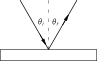

Все сказанное дает представление об основной идее геометрической оптики. Теперь перейдем к ее количественному описанию. До сих пор у нас свет распространялся только по прямым линиям между двумя точками; теперь давайте изучим поведение света при его падении на различные материалы. Простейшим объектом является зеркало, и закон для зеркала состоит в том, что, когда свет попадает на зеркало, он не продолжает движение по прямой, а отражается от него и уходит по новой прямой линии, которая меняется при изменении наклона зеркала. Перед людьми древности стоял вопрос: каково соотношение между этими двумя углами? Это очень простое соотношение, и найдено оно было давным-давно. Свет, падающий на зеркало, распространяется таким образом, что два угла между каждым лучом и зеркалом равны. По какой-то причине углы принято отсчитывать от нормали к поверхности зеркала. Таким образом, так называемый закон отражения гласит:
\[
\begin{equation}
 \label{Eq:I:26:1}
 \theta_i=\theta_r.
 \end{equation}
\]

Это достаточно простое утверждение, но с более сложной задачей мы сталкиваемся при переходе света из одной среды в другую, например из воздуха в воду; здесь мы также видим, что он идет не по прямой. В воде луч направлен под углом к своему пути в воздухе; если мы изменим угол \(\theta_i\) так, чтобы он падал почти вертикально, то угол «преломления» будет не столь велик. Но если мы наклоним луч света под значительным углом, то угол отклонения станет очень большим. Вопрос в том, каково соотношение между одним углом и другим? Это также долго ставило древних в тупик, и они так и не нашли ответа! Тем не менее, это одна из немногих областей во всей древнегреческой физике, где можно найти какие-либо экспериментальные результаты. Клавдий Птолемей составил список углов в воде для каждого из ряда различных углов в воздухе. В таблице 26.1 приведены углы в воздухе в градусах и соответствующие углы, измеренные в воде. (Обычно говорят, что греческие ученые никогда не проводили опытов. Но получить такую таблицу значений, не зная правильного закона, было бы невозможно, кроме как экспериментальным путем. Следует отметить, однако, что эти данные не представляют собой независимые тщательные измерения для каждого угла, а являются лишь числами, интерполированными по нескольким измерениям, поскольку все они идеально ложатся на параболу.)

### Figure Ch26-F2
Caption: Фиг. 26.2. При переходе из одной среды в другую луч света преломляется.
Image: figures/Ch26-F2.svg
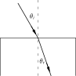

### Table Ch26-T1

Caption: Таблица 26.1

- Angle in air | Angle in water
- \(10^\circ\) | \(\phantom{1}8^\circ\)
- \(20^\circ\) | \(15\) - \(1/2^\circ\)
- \(30^\circ\) | \(22\) - \(1/2^\circ\)
- \(40^\circ\) | \(29^\circ\)
- \(50^\circ\) | \(35^\circ\)
- \(60^\circ\) | \(40\) - \(1/2^\circ\)
- \(70^\circ\) | \(45\) - \(1/2^\circ\)
- \(80^\circ\) | \(50^\circ\)

Это был очень важный шаг в становлении физического закона: сначала мы наблюдаем эффект, затем проводим измерения и сводим результаты в таблицу, после чего пытаемся найти закон, по которому одни величины сопоставляются с другими. Приведенная таблица была составлена еще в 140 г. нашей эры, и вплоть до 1621 г. никто не смог найти такого закона, который связал бы эти два угла! Закон, найденный голландским математиком Виллебрордом Снеллом, состоит в следующем: если \(\theta_i\) — угол в воздухе, а \(\theta_r\) — угол в воде, то оказывается, что синус \(\theta_i\) равен синусу \(\theta_r\) , умноженному на некоторую константу:
\[
\begin{equation}
 \label{Eq:I:26:2}
 \sin\theta_i=n\sin\theta_r.
 \end{equation}
\]
Для воды число \(n\) равно примерно \(1.33\) . Равенство (26.2) называется законом Снелла; оно позволяет предсказать отклонение света при переходе из воздуха в воду. В табл. 26.2 указаны углы в воздухе и в воде согласно закону Снелла. Обратите внимание на удивительное согласие с таблицей Птолемея.

### Table Ch26-T2

Caption: Таблица 26.2

- Angle in air | Angle in water
- \(10^\circ\) | \(\phantom{1}7\) - \(1/2^\circ\)
- \(20^\circ\) | \(15^\circ\)
- \(30^\circ\) | \(22^\circ\)
- \(40^\circ\) | \(29^\circ\)
- \(50^\circ\) | \(35^\circ\)
- \(60^\circ\) | \(40\) - \(1/2^\circ\)
- \(70^\circ\) | \(45^\circ\)
- \(80^\circ\) | \(48^\circ\)

## 26–3 Принцип наименьшего времени Ферма

По мере развития науки нам хочется получить нечто большее, чем просто формулу. Сначала мы наблюдаем явления, затем с помощью измерений получаем числа и наконец находим закон, связывающий эти числа. Но истинное величие науки состоит в том, что мы можем найти такой способ рассуждения, при котором закон становится очевидным.

Впервые общий принцип, наглядно объясняющий закон поведения света, был предложен Ферма примерно в 1650 г. и получил название принципа наименьшего времени, или принципа Ферма. Вот его идея: свет выбирает из всех возможных путей, соединяющих две точки, тот путь, который требует наименьшего времени для его прохождения.

Покажем сначала, что это верно для случая с зеркалом, что этот простой принцип объясняет и прямолинейность распространения света, и закон отражения света от зеркала. Мы явно делаем успехи! Попытаемся решить следующую задачу. На фиг. 26.3 изображены две точки \(A\) и \(B\) и плоское зеркало \(MM'\) . Каким путем можно за кратчайшее время попасть из точки \(A\) в точку \(B\) ? Ответ: по прямой, проведенной из \(A\) в \(B\) ! Но если мы добавим дополнительное условие, что свет должен попасть на зеркало, отразиться от него и вернуться опять-таки за кратчайшее время, то ответить не так уж просто. Один путь — как можно скорее добраться до зеркала, а оттуда в точку \(B\) , т. е. по пути \(ADB\) . Путь \(DB\) , конечно, длинен. Если сдвинуться чуть-чуть вправо в точку \(E\) , то первый отрезок пути немного увеличится, но зато сильно уменьшится второй, и время прохождения поэтому станет меньше. Как найти точку \(C\) , для которой время прохождения наименьшее? Воспользуемся для этого хитрым геометрическим приемом.

### Figure Ch26-F3
Caption: Фиг. 26.3. Иллюстрация принципа наименьшего времени.
Image: figures/Ch26-F3.svg
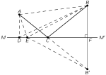

По другую сторону \(MM'\) мы построим искусственную точку \(B'\) , которая находится на таком же расстоянии под плоскостью \(MM'\) , на каком точка \(B\) находится над плоскостью. Затем проведем линию \(EB'\) . Поскольку угол \(BFM\) прямой и \(BF = FB'\) , то \(EB\) равно \(EB'\) . Следовательно, сумма двух расстояний, \(AE + EB\) , которая пропорциональна времени прохождения (если свет распространяется с постоянной скоростью), также равна сумме двух длин \(AE + EB'\) . Теперь задача сводится к тому, чтобы выяснить, когда сумма этих двух длин наименьшая. Ответ прост: когда линия проходит через точку \(C\) как прямая от \(A\) до \(B'\) ! Другими словами, нам нужно найти точку, при движении к которой мы направляемся к искусственной точке, и она-то и будет искомой. Теперь, если \(ACB'\) — прямая линия, то угол \(BCF\) равен углу \(B'CF\) и, следовательно, углу \(ACM\) . Таким образом, утверждение о равенстве углов падения и отражения равносильно утверждению, что свет идет к зеркалу так, чтобы вернуться в точку \(B\) за наименьшее возможное время. Еще Герон Александрийский утверждал, что свет распространяется так, что идет к зеркалу и к другой точке по кратчайшему расстоянию, так что эта теория не нова. Именно это вдохновило Ферма предположить, что, возможно, преломление происходит на похожей основе. Но при преломлении свет, очевидно, идет не по пути кратчайшего расстояния, поэтому Ферма испробовал идею о том, что он затрачивает наименьшее время.

Прежде чем перейти к анализу преломления, нам следует сделать еще одно замечание о зеркале. Если у нас есть источник света в точке \(B\) и он направляет свет к зеркалу, то мы увидим, что свет, идущий к \(A\) из точки \(B\) , приходит в \(A\) точно так же, как он пришел бы в \(A\) , если бы предмет находился в \(B'\) , а зеркала не было вообще. Конечно, наш глаз воспринимает только тот свет, который физически входит в него, поэтому если у нас есть предмет в \(B\) и зеркало, которое направляет свет в глаз точно так же, как он попадал бы в глаз, если бы предмет находился в \(B'\) , то система глаз — мозг интерпретирует это (при условии, что она знает не слишком много) так, будто предмет находится в \(B'\) . Поэтому иллюзия, что предмет находится за зеркалом, вызывается только тем фактом, что свет попадает в глаз физически точно так же, как если бы предмет действительно находился позади зеркала (если не принимать во внимание пыль на зеркале, наше знание о существовании зеркала и так далее, которые корректируются мозгом).

Покажем теперь, что из принципа наименьшего времени вытекает закон Снелла для преломления. Мы должны, однако, сделать предположение относительно скорости света в воде. Будем считать, что скорость света в воде меньше скорости света в воздухе в некоторое число раз, \(n\) .

### Figure Ch26-F4
Caption: Фиг. 26.4. Иллюстрация принципа Ферма для случая преломления.
Image: figures/Ch26-F4.svg
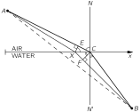

### Figure Ch26-F5
Caption: Фиг. 26.5. Наименьшее время соответствует точке \(C\) , но соседние точки приводят примерно к такому же времени прохождения.
Image: figures/Ch26-F5.svg
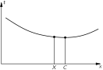

На фиг. 26.4 наша задача по-прежнему состоит в том, чтобы попасть из \(A\) в \(B\) за наименьшее время. Чтобы убедиться, что путь по прямой здесь не самый лучший, представим себе следующую ситуацию: хорошенькая девушка упала из лодки в воду в точке \(B\) и кричит, прося о помощи. Линия, обозначенная \(x\) , — это берег. Мы находимся в точке \(A\) на суше, видим происшествие, и мы умеем бегать, а также умеем плавать. Но бегаем мы быстрее, чем плаваем. Что нам делать? Побежать по прямой? (Да, без сомнения!) Однако, немного поразмыслив, мы поймем, что выгоднее пройти несколько большее расстояние по суше, чтобы сократить путь в воде, потому что в воде мы двигаемся гораздо медленнее. (Продолжая эти рассуждения, мы бы сказали, что правильнее всего было бы заранее тщательно рассчитать, как поступить!) Во всяком случае, давайте попытаемся показать, что окончательное решение задачи — это путь \(ACB\) , и что этот путь занимает наименьшее время из всех возможных. Если этот путь кратчайший по времени, это значит, что любой другой окажется длиннее. Поэтому, если отложить на графике зависимость времени от положения точки \(X\) , мы получим кривую, похожую на изображенную на фиг. 26.5, где точка \(C\) соответствует наименьшему из всех возможных времен. Это означает, что если мы сместим точку \(X\) в точки вблизи \(C\) , то в первом приближении время прохождения практически не изменится, так как в нижней точке кривой наклон равен нулю. Итак, наш способ нахождения закона будет состоять в том, чтобы рассмотреть небольшое смещение точки и потребовать, чтобы время прохождения при этом практически не изменялось. (Конечно, возникнут бесконечно малые изменения времени второго порядка; при смещении в любом направлении от \(C\) приращение должно быть положительным.) Поэтому мы рассмотрим близкую точку \(X\) , вычислим, сколько времени потребуется на прохождение пути от \(A\) до \(B\) по этим двум траекториям, и сравним новый путь со старым. Сделать это очень просто. Конечно, мы хотим, чтобы разность времен стремилась к нулю, если расстояние \(XC\) мало. Сначала обратимся к пути по суше. Если мы опустим перпендикуляр \(XE\) , то легко увидим, что наш путь стал короче на величину \(EC\) . Можно сказать, что это расстояние мы выиграли. С другой стороны, опустив в воде соответствующий перпендикуляр \(CF\) , мы обнаружим, что нам приходится проходить дополнительное расстояние \(XF\) , и в этом мы проигрываем. Или, если говорить о времени, мы выигрываем время, которое потребовалось бы на прохождение расстояния \(EC\) , но теряем время, необходимое на прохождение расстояния \(XF\) . Эти два интервала времени должны быть равны, так как в первом приближении полное время прохождения не меняется. Но, предположив, что скорость в воде составляет \(1/n\) от скорости в воздухе, мы должны получить
\[
\begin{equation}
 \label{Eq:I:26:3}
 EC=n\cdot XF.
 \end{equation}
\]
Поэтому мы видим, что когда мы выбрали правильную точку, \(X\!C\sin E\!X\!C =
 n\cdot X\!C\sin X\!C\!F\) или, сократив на общую длину гипотенузы \(XC\) и заметив, что
\[
\begin{gather*}
 EXC=ECN=\theta_i
 \,\text{ and }\,
 XCF\approx BCN'=\theta_r\\
 (\text{when $X$ is near $C$}),
 \end{gather*}
\]
мы получаем
\[
\begin{equation}
 \label{Eq:I:26:4}
 \sin\theta_i=n\sin\theta_r.
 \end{equation}
\]
Отсюда видно, что для перехода из одной точки в другую за наименьшее время при отношении скоростей, равном \(n\) , свет должен входить под таким углом, чтобы отношение синусов углов \(\theta_i\) и \(\theta_r\) было равно отношению скоростей в двух средах.

## 26–26 4. Применения принципа Ферма

Рассмотрим теперь некоторые интересные следствия принципа наименьшего времени. Первое из них — принцип обратимости. Если для перехода из \(A\) в \(B\) мы нашли путь, требующий наименьшего времени, то для движения в обратном направлении (считая, что скорость света не зависит от направления) наименьшему времени будет отвечать тот же путь, и, следовательно, если свет можно направить в одну сторону, его можно направить и в другую.

### Figure Ch26-F6
Caption: Фиг. 26.6. Луч света, выходящий из прозрачной пластины, параллелен падающему лучу.
Image: figures/Ch26-F6.svg
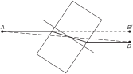

Другой интересный пример! На пути света под некоторым углом поставлена четырехгранная стеклянная призма с параллельными гранями. Свет проходит из точки \(A\) в \(B\) и, встретив на своем пути призму (фиг. 26.6), отклоняется, причем длительность пути в призме уменьшается за счет изменения наклона траектории, а путь в воздухе немного удлиняется. Участки траектории вне призмы оказываются параллельными друг другу, потому что углы входа и выхода из призмы одинаковы.

### Figure Ch26-F7
Caption: Фиг. 26.7. У горизонта Солнце кажется примерно на \(1/2\) градуса выше, чем на самом деле.
Image: figures/Ch26-F7.svg
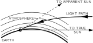

Третье интересное явление состоит в том, что когда мы видим заходящее солнце, оно на самом деле находится уже ниже горизонта! На вид оно не кажется опустившимся за горизонт, но это так (фиг. 26.7). Земная атмосфера вверху разрежена, а в нижних слоях более плотная. Свет распространяется в воздухе медленнее, чем в вакууме, и поэтому солнечный свет может быстрее достичь точки \(S\) за горизонтом, если вместо движения просто по прямой линии он будет избегать плотных областей, где он движется медленно, проходя через них под более крутым наклоном. Когда кажется, что солнце заходит за горизонт, на самом деле оно уже находится глубоко под горизонтом. Другой пример этого явления — мираж, который часто можно видеть при езде по раскаленным дорогам. Вы видите на дороге «воду», но когда подъезжаете туда, там оказывается сухо, как в пустыне! Сущность явления заключается в следующем. То, что мы видим на самом деле, — это свет неба, «отраженный» дорогой: свет от неба, направляющийся к дороге, может попасть в глаз, как показано на фиг. 26.8. Почему? Воздух сильно раскален над самой дорогой, а в верхних слоях холоднее. Более горячий воздух сильнее расширен, чем холодный, и более разрежен, и это в меньшей степени снижает скорость света. Иными словами, свет идет быстрее в горячей области, чем в холодной. Поэтому вместо того, чтобы идти по прямому пути, свет выбирает путь наименьшего времени, проходящий через область, где он какое-то время движется быстрее, чтобы сэкономить время. Таким образом, он может идти по кривой.

### Figure Ch26-F8
Caption: Фиг. 26.8. Мираж.
Image: figures/Ch26-F8.svg
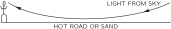

В качестве еще одного важного примера принципа наименьшего времени представим себе такую ситуацию, когда весь свет, испускаемый в точке \(P\) , собирается обратно в другую точку \(P'\) (фиг. 26.9). Это означает, конечно, что свет может попасть из \(P\) в \(P'\) по прямой линии. Это правильно. Но как устроить так, чтобы свет, идущий от \(P\) к \(Q\) , тоже попал в \(P'\) ? Мы хотим собрать весь свет снова в одной точке, которую называют фокусом. Как это сделать? Поскольку свет всегда выбирает путь с наименьшим временем, то наверняка он не пойдет по другим предложенным нами путям. Единственный способ сделать целый ряд близлежащих траекторий приемлемыми для света — это устроить так, чтобы для всех время прохождения было точно одинаковым! В противном случае свет пойдет по траектории, требующей минимального времени. Поэтому задача построения фокусирующей системы сводится просто к созданию устройства, в котором свет тратит на всех путях одинаковое время!

### Figure Ch26-F9
Caption: Фиг. 26.9. Оптический «черный ящик».
Image: figures/Ch26-F9.svg
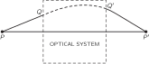

Такое устройство создать просто. Возьмем кусок стекла, в котором свет движется медленнее, чем в воздухе (фиг. 26.10). Проследим путь луча света, проходящего в воздухе по линии \(PQP'\) . Этот путь длиннее, чем прямо из \(P\) в \(P'\) , и наверняка занимает больше времени. Но если взять кусок стекла нужной толщины (позже мы вычислим, какой именно), то он в точности скомпенсирует добавочное время, затрачиваемое при отклонении луча! При этих условиях можно устроить так, чтобы время, затрачиваемое светом на пути по прямой, совпадало со временем, затрачиваемым на пути \(PQP'\) . Точно так же, если взять частично отклоненный луч \(PRR'P'\) (более короткий, чем \(PQP'\) ), то придется скомпенсировать уже не так много времени, как для прямолинейной траектории, но некоторую долю времени все же скомпенсировать придется. В результате мы приходим к форме куска стекла, изображенной на фиг. 26.10. При такой форме весь свет из точки \(P\) попадет в \(P'\) . Все это нам известно уже давно, и называется такое устройство собирательной линзой. В следующей главе мы вычислим, какой должна быть форма линзы, чтобы получить идеальную фокусировку.

### Figure Ch26-F10
Caption: Фиг. 26.10. Фокусирующая оптическая система.
Image: figures/Ch26-F10.svg
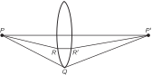

Рассмотрим другой пример: предположим, что нам нужно так поставить зеркала, чтобы свет из \(P\) всегда приходил в \(P'\) (фиг. 26.11). На любом пути свет должен отразиться от зеркала, и время для всех путей должно быть одинаковым. В данном случае свет проходит только в воздухе, так что время прохождения пропорционально длине пути. Поэтому требование равенства времен сводится к требованию равенства полных длин путей. Следовательно, сумма расстояний \(r_1\) и \(r_2\) должна оставаться постоянной. Эллипс обладает как раз тем свойством, что сумма расстояний любой точки на его кривой от двух заданных точек постоянна; поэтому свет, отразившись от зеркала, имеющего такую форму, наверняка попадет из одного фокуса в другой.

### Figure Ch26-F11
Caption: Фиг. 26.11. Эллиптическое зеркало.
Image: figures/Ch26-F11.svg
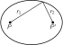

Тот же принцип применим для собирания света звезды. Большой \(200\) -дюймовый паломарский телескоп построен по следующему принципу. Вообразите себе звезду, удаленную от нас на миллиарды миль; мы хотели бы собрать весь приходящий свет в фокус. Конечно, мы не можем начертить лучи, идущие до самой звезды, но мы все же хотим проверить, равны ли времена. Мы, конечно, знаем, что когда различные лучи достигают некоторой плоскости \(KK'\) , перпендикулярной лучам, все времена в этой плоскости равны (фиг. 26.12). Затем лучи должны дойти до зеркала и за равные промежутки времени попасть к \(P'\) . То есть мы должны найти такую кривую, которая обладает тем свойством, что сумма расстояний \(XX' + X'P'\) постоянна, независимо от того, где выбрана точка \(X\) . Легкий способ найти её — продолжить отрезок \(XX'\) вниз до плоскости \(LL'\) . Теперь, если мы расположим нашу кривую так, чтобы выполнялись соотношения \(A'A'' = A'P'\) , \(B'B'' = B'P'\) , \(C'C'' =
 C'P'\) и так далее, то мы получим нужную нам кривую, потому что тогда, конечно, сумма \(AA' +
 A'P' = AA' + A'A''\) будет постоянной. Значит, наша кривая есть геометрическое место всех точек, равноудаленных от линии и точки. Такая кривая называется параболой; зеркало изготавливается в форме параболы.

### Figure Ch26-F12
Caption: Фиг. 26.12. Параболическое зеркало.
Image: figures/Ch26-F12.svg
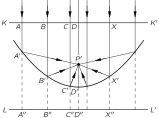

Приведенные примеры в общих чертах иллюстрируют принцип устройства оптических систем. Точные кривые можно рассчитать, используя правило равенства времен на всех путях, ведущих в точку фокуса, и требуя, чтобы время прохождения на всех соседних путях было большим.

Мы продолжим обсуждение этих фокусирующих оптических устройств в следующей главе; сейчас же давайте рассмотрим дальнейшее развитие теории. Когда провозглашается новый физический принцип, такой, как принцип наименьшего времени, то нашей первой естественной реакцией могли бы быть слова: «Все это очень хорошо, восхитительно, но вопрос заключается в том, улучшает ли это вообще наше понимание физики?» На это можно ответить: «Да. Посмотрите, сколько новых фактов мы теперь поняли!» А кто-то возразит: «Ну, в зеркалах я и так разбираюсь. Мне нужна такая кривая, чтобы каждая касательная к ней плоскость образовывала равные углы с двумя лучами света. Я могу рассчитать и линзу, потому что каждый падающий на нее луч отклоняется на угол, даваемый законом Снелла». Здесь очевидным образом содержание принципа наименьшего времени совпадает с законом равенства углов при отражении и пропорциональности синусов углов при преломлении. Тогда, может быть, это философский вопрос, а может быть, вопрос просто в том, какой путь красивее? Можно привести аргументы в пользу обеих точек зрения.

Однако критерий важности всякого принципа состоит в том, что он предсказывает нечто новое.

Легко показать, что принцип Ферма позволяет сделать ряд новых предсказаний. Во-первых, предположим, что имеются три среды — стекло, вода и воздух, и мы проводим опыт по преломлению и измеряем показатель преломления \(n\) для перехода из одной среды в другую. Обозначим через \(n_{12}\) показатель преломления для перехода из воздуха ( \(1\) ) в воду ( \(2\) ), а через \(n_{13}\) — для перехода из воздуха ( \(1\) ) в стекло ( \(3\) ). Измерив преломление в системе вода — стекло, найдем еще один показатель преломления и назовем его \(n_{23}\) . Здесь заранее нет оснований считать, что \(n_{12}\) , \(n_{13}\) и \(n_{23}\) связаны между собой. Если же исходить из принципа наименьшего времени, то такую связь можно установить. Показатель \(n_{12}\) есть отношение двух величин — скорости света в воздухе к скорости света в воде; показатель \(n_{13}\) есть отношение скорости в воздухе к скорости в стекле, а \(n_{23}\) есть отношение скорости в воде к скорости в стекле. Поэтому, сокращая скорость света в воздухе, получаем
\[
\begin{equation}
 \label{Eq:I:26:5}
 n_{23}=\frac{v_2}{v_3}=\frac{v_1/v_3}{v_1/v_2}=\frac{n_{13}}{n_{12}}.
 \end{equation}
\]
Другими словами, мы предсказываем, что показатель преломления для перехода из одного материала в другой можно получить из показателей преломления каждого материала по отношению к некоторой среде, скажем воздуху или вакууму. Таким образом, измерив скорость света во всех средах, мы образуем одно число для каждой среды — показатель преломления для перехода из вакуума в среду — и называем его \(n_i\) (например, \(n_1\) есть отношение скорости в вакууме к скорости в воздухе и т. д.), после чего легко написать нужную формулу. Показатель преломления для любых двух материалов \(i\) и \(j\) равен
\[
\begin{equation}
 \label{Eq:I:26:6}
 n_{ij}=\frac{v_i}{v_j}=\frac{n_j}{n_i}.
 \end{equation}
\]
Используя только закон Снелла, подобное соотношение предсказать невозможно.* Но связь эта существует. Соотношение (26.5) известно давно и послужило сильным аргументом в пользу принципа наименьшего времени.

Еще одно предсказание принципа наименьшего времени состоит в том, что скорость света в воде при измерении должна оказаться меньше скорости света в воздухе. Это уже предсказание совсем другого рода. Оно гораздо глубже, потому что носит теоретический характер и никак не связано с наблюдениями, из которых Ферма вывел принцип наименьшего времени (до сих пор мы имели дело только с углами). Как оказалось, скорость света в воде действительно меньше скорости в воздухе, и ровно настолько, чтобы получился правильный показатель преломления.

## 26–26 5. Более точная формулировка принципа Ферма

На самом деле мы должны сформулировать принцип наименьшего времени несколько точнее. Выше он был сформулирован неправильно. Мы неправильно называли его принципом наименьшего времени и для удобства по ходу дела применяли неправильную его трактовку, но теперь мы должны выяснить точное содержание принципа. Предположим, у нас есть зеркало, как на фиг. 26.3. Откуда свет знает, что он должен двигаться к зеркалу? Очевидно, путь, требующий наименьшего времени, — это \(AB\) . Кое-кто поэтому может сказать: «Иногда этот путь требует как раз наибольшего времени». Но это не наибольшее время, ведь путь по кривой наверняка занял бы еще больше времени! Точная формулировка следующая: луч, проходящий по определенной траектории, обладает тем свойством, что если мы совершим малое изменение (скажем, сдвиг на 1%) пути луча любым образом — например, в расположении точки его падения на зеркало, в форме кривой или в чем-либо еще, — это не приведет к изменению времени в первом порядке; изменение времени произойдет только во втором порядке. Другими словами, принцип заключается в том, что свет выбирает такой путь, для которого поблизости есть множество других путей, требующих почти точно такого же времени.

С принципом наименьшего времени связана еще одна трудность, которую многие, не любящие такого рода теории, никак не могут переварить. Теория Снелла позволяет нам «понять» свет. Свет проходит, видит перед собой поверхность и отклоняется, потому что на поверхности с ним что-то происходит. Легко понять идею причинности, проявляющуюся в том, что свет идет из одной точки в другую, а затем в следующую. Но принцип наименьшего времени — это совершенно другой философский принцип, описывающий то, как устроена природа. Вместо причинной обусловленности, когда из одного нашего действия вытекает другое и т. д., этот принцип говорит следующее: мы создаем ситуацию, а свет решает, какое время будет наименьшим, или экстремальным, и выбирает этот путь. Но как он это делает, как он это выясняет? Вынюхивает ли он соседние пути и сравнивает ли их друг с другом? Ответ: да, в некотором смысле так и происходит. Это та особенность, которая, конечно, неизвестна в геометрической оптике и которая связана с понятием длины волны; длина волны, грубо говоря, указывает, на каком расстоянии свет должен «почувствовать» путь, чтобы сравнить его с соседними. Этот факт трудно продемонстрировать на опыте со светом в большом масштабе, так как длина волны чрезвычайно мала. Но для радиоволн, скажем с длиной волны \(3\) см, расстояния, на которых они сравнивают пути, больше. Если у нас есть источник радиоволн, детектор и щель, как показано на фиг. 26.13, то лучи, конечно, идут от \(S\) к \(D\) , поскольку это прямолинейная траектория, и если сузить щель, все в порядке — они все равно пройдут. Но если теперь отодвинуть детектор в сторону, в точку \(D'\) , то при широкой щели волны не пойдут от \(S\) к \(D'\) , потому что они проверят несколько соседних путей и скажут: «Нет, друг мой, все они соответствуют разному времени». С другой стороны, если помешать излучению проверять пути, сузив щель до очень узкой щелки, то останется доступным только один путь, и излучение пойдет по нему! При узкой щели в точку \(D'\) попадает больше излучения, чем при широкой щели!

### Figure Ch26-F13
Caption: Фиг. 26.13. Прохождение радиоволн сквозь узкую щель.
Image: figures/Ch26-F13.svg
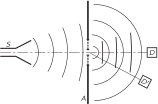

Такой же опыт возможен со светом, но в большом масштабе его проделать трудно. Этот эффект, однако, можно наблюдать в следующих простых условиях. Найдите маленький и яркий источник света, например уличный фонарь где-нибудь в конце улицы или отражение солнца от колеса автомобиля. Поставьте перед глазами два пальца, оставив для света узенькую щель, и постепенно сближайте пальцы, пока щель полностью не исчезнет. Вы увидите, что свет, который вначале казался крохотной точкой, начнет расплываться и даже вытянется в длинную линию. Происходит это потому, что между пальцами оставлена лишь очень маленькая щель и свет не идет, как обычно, по прямой, а расходится под некоторым углом и в глаз попадает с разных направлений. Если вы будете достаточно внимательны, то заметите еще боковые максимумы и своеобразную кайму по краям. Кроме того, само изображение будет окрашено. Все это будет в свое время объяснено, а сейчас этот опыт (а его очень легко проделать) просто демонстрирует, что свет не всегда распространяется по прямой.

## 26–26 -6. Квантовый механизм

В заключение дадим очень грубую картину того, что происходит на самом деле, как все это устроено с квантовомеханической точки зрения, которую сейчас считают самой правильной (разумеется, наше описание будет носить лишь качественный характер). Следя за ходом света из \(A\) в \(B\) на фиг. 26.3, мы обнаруживаем, что свет вовсе не похож на волны. Оказывается, лучи состоят из фотонов, и они действительно вызывают щелчки в счетчике фотонов, если мы его используем. Яркость света пропорциональна среднему числу фотонов, приходящих в секунду, а вычисляем мы вероятность того, что фотон попадет из \(A\) в \(B\) , скажем, отразившись от зеркала. Закон для этой вероятности весьма необычен. Выберем какой-нибудь путь и найдем время для этого пути; затем образуем комплексное число или нарисуем маленький комплексный вектор \(\rho
 e^{i\theta}\) , угол которого \(\theta\) пропорционален времени. Число оборотов в секунду — это частота света. Теперь возьмем другой путь; для него время будет другим, так что соответствующий ему вектор повернется на другой угол — причем этот угол всегда пропорционален времени. Возьмем все возможные пути и сложим маленькие векторы для каждого из них; тогда результат таков: вероятность прибытия фотона пропорциональна квадрату длины результирующего вектора, от начала до конца!

### Figure Ch26-F14
Caption: Фиг. 26.14. Суммирование амплитуд вероятности на всех возможных соседних траекториях.
Image: figures/Ch26-F14.svg

Покажем теперь, как отсюда следует принцип наименьшего времени для зеркала. Рассмотрим все лучи, все возможные пути \(ADB\) , \(AEB\) , \(ACB\) и т. д., изображенные на фиг. 26.3. Путь \(ADB\) вносит определенный небольшой вклад, но следующий путь \(AEB\) занимает совсем другое время, так что его угол \(\theta\) тоже совсем другой. Пусть точка \(C\) соответствует пути с наименьшим временем, когда при изменении путей времена не меняются. Поэтому какое-то время времена меняются, а затем, по мере приближения к точке \(C\) , они начинают меняться все меньше и меньше (фиг. 26.14). Таким образом, векторы, которые мы должны сложить, идут вблизи \(C\) какое-то время почти под одним и тем же углом, а затем время начинает постепенно снова расти, фазы поворачиваются в другую сторону и так далее. В конце концов получается довольно тугой клубок. Полная вероятность есть расстояние от одного конца до другого, возведенное в квадрат. Почти вся эта накопленная вероятность приходится на область, где все векторы направлены в одном направлении (или имеют одну и ту же фазу). Все вклады от путей с сильно различающимися временами при изменении пути взаимно уничтожаются, поскольку они направлены в разные стороны. Вот почему, если закрыть края зеркала, оно все равно будет отражать почти точно так же, поскольку все, что мы сделали, — это убрали часть диаграммы внутри спиральных концов, а это лишь очень незначительно меняет свет. Такова связь между окончательной картиной фотонов, в которой вероятность попадания зависит от сложения векторов, и принципом наименьшего времени.
