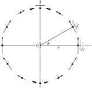
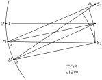

SOURCE: Feynman Lectures on Physics, Volume I, Chapter 28
LANGUAGE: ru
TITLE: Глава 28. Электромагнитное излучение
SOURCE_URL: https://www.feynmanlectures.caltech.edu/I_28.html
NOTEBOOKLM_USE: clean lecture text with TeX math and figure captions; reader navigation removed.

# Глава 28. Электромагнитное излучение

## 28–1 Электромагнетизм

Решающие и наиболее поразительные периоды развития физики — это периоды великих обобщений, когда явления, казавшиеся разобщенными, неожиданно становятся всего лишь разными аспектами одного и того же процесса. История физики — это история таких обобщений, и в основе успеха физической науки лежит главным образом наша способность к синтезу.

По-видимому, самым знаменательным моментом в развитии физики XIX столетия следует считать тот день в 1860 г., когда Дж. К. Максвелл сопоставил законы электричества и магнетизма с законами поведения света. В результате были частично объяснены свойства света — этой старой и тонкой субстанции, настолько загадочной и важной, что в свое время при написании главы о сотворении мира сочли нужным отвести для него отдельный акт творения. Закончив свое исследование, Максвелл мог бы сказать: «Да будет электричество и магнетизм, и станет свет!»

Этот кульминационный момент долго подготавливался постепенным открытием и раскрытием законов электричества и магнетизма. Эту историю мы отложим для подробного изучения в следующем году. Вкратце же она сводится к следующему. Постепенно открывавшиеся свойства электричества и магнетизма, электрических сил притяжения и отталкивания, а также магнитных сил показали, что, хотя эти силы были довольно сложными, все они спадают обратно пропорционально квадрату расстояния. Мы знаем, например, что простой закон Кулона для неподвижных зарядов состоит в том, что поле электрических сил меняется обратно пропорционально квадрату расстояния. В результате на достаточно больших расстояниях влияние одной системы зарядов на другую очень мало. Максвелл заметил, что открытые к тому времени законы или уравнения оказываются взаимно несовместными, когда он попытался объединить их все вместе, и, чтобы сделать всю систему совместной, ему пришлось добавить к своим уравнениям еще один член. С этим новым членом возникло удивительное предсказание: часть электрического и магнитного полей будет спадать с расстоянием гораздо медленнее, чем обратный квадрат расстояния, а именно обратно пропорционально первой степени расстояния! И тогда он понял, что электрические токи в одном месте могут воздействовать на другие заряды, находящиеся далеко, и предсказал основные эффекты, с которыми мы знакомы сегодня — передачу радиоволн, радиолокацию и так далее.

Кажется поистине чудом, что с помощью каких-то электрических воздействий человек, говорящий где-нибудь в Европе, может быть услышан за тысячи миль в Лос-Анджелесе. Почему это стало возможным? Потому, что поля спадают обратно пропорционально не квадрату, а первой степени расстояния. Наконец, было показано, что свет тоже представляет собой электрические и магнитные поля, распространяющиеся на большие расстояния, а генерируется он неправдоподобно быстрым колебанием электронов в атомах. Все эти явления мы будем называть излучением, или, более точно, электромагнитным излучением, потому что бывают и другие типы излучений. Но почти всегда излучение означает электромагнитное излучение.

И тут выступает единство явлений во Вселенной. Движение атомов далекой звезды даже на огромных расстояниях возбуждает электроны нашего глаза, и мы узнаем о звездах. Если бы закона воздействия полей не существовало, мы бы буквально ничего не знали о внешнем мире! А электрические бури в галактике, удаленной от нас на пять миллиардов световых лет (самой далекой из обнаруженных до сих пор), еще способны возбуждать токи в гигантской «чаше» радиотелескопа. Вот почему мы видим и звезды, и галактики.

Об этих замечательных явлениях и пойдет речь в настоящей главе. В самом начале нашего курса лекций мы обрисовали общую картину мира, но теперь мы более подготовлены к тому, чтобы понять ее глубже. Поэтому вернемся снова к общей картине явлений и поговорим о ней более подробно. Начнем мы с описания положения, которое физика занимала в конце XIX столетия. Все, что тогда было известно об основных закономерностях, можно сформулировать так.

Во-первых, существовали законы сил: одной из сил был закон тяготения, который мы записывали неоднократно; сила, действующая на тело массой \(m\) со стороны другого тела массой \(M\) , дается выражением
\[
\begin{equation}
 \label{Eq:I:28:1}
 \FLPF=GmM\FLPe_r/r^2,
 \end{equation}
\]
, где \(\FLPe_r\) — единичный вектор, направленный от \(m\) к \(M\) , а \(r\) — расстояние между ними.

Далее, законы электричества и магнетизма, известные к концу XIX века, таковы: электрические силы, действующие на заряд \(q\) , могут быть описаны двумя полями, называемыми \(\FLPE\) и \(\FLPB\) , и скоростью \(\FLPv\) заряда \(q\) , с помощью уравнения
\[
\begin{equation}
 \label{Eq:I:28:2}
 \FLPF=q(\FLPE+\FLPv\times\FLPB).
 \end{equation}
\]
Чтобы дополнить этот закон, мы должны сказать, каковы формулы для \(\FLPE\) и \(\FLPB\) в данных условиях: если имеется несколько зарядов, то \(\FLPE\) и \(\FLPB\) представляют собой суммы вкладов от каждого отдельного заряда. Таким образом, если мы сможем найти \(\FLPE\) и \(\FLPB\) , создаваемые одним зарядом, нам нужно лишь сложить все эффекты от всех зарядов во Вселенной, чтобы получить полные \(\FLPE\) и \(\FLPB\) ! В этом и состоит принцип суперпозиции.

Как теперь получить формулу для электрического и магнитного поля одного заряда? Оказывается, это очень сложно; понадобится затратить много труда и использовать тонкие доказательства. Но не в этом дело. Мы пишем этот закон сейчас, собственно, чтобы подчеркнуть красоту природы, показать, что все фундаментальные знания можно уместить на одной странице (с обозначениями читатель уже знаком). Этот закон для полей отдельного заряда является полным и точным, насколько мы знаем (если отвлечься от эффектов квантовой механики), но выглядит довольно сложным. Мы не будем сейчас подробно разбирать все его части; мы лишь выписываем его, чтобы произвести впечатление, показать, что это возможно сделать, и чтобы мы могли заранее увидеть, как примерно он выглядит. На самом деле правильнее было бы записать законы электричества и магнетизма с помощью уравнений поля, о которых мы узнаем в следующем году. Но математические обозначения для них иные и новые, поэтому давайте сейчас напишем закон в уже знакомой нам форме, хотя она и не очень удобна для вычислений.

Электрическое поле \(\FLPE\) дается выражением
\[
\begin{equation}
 \label{Eq:I:28:3}
 \FLPE=\frac{-q}{4\pi\epsO}\biggl[
 \frac{\FLPe_{r'}}{r'^2}+\frac{r'}{c}\,\ddt{}{t}\biggl(
 \frac{\FLPe_{r'}}{r'^2}\biggr)+\frac{1}{c^2}\,\frac{d^2}{dt^2}\,\FLPe_{r'}
 \biggr].
 \end{equation}
\]
Что означают отдельные члены в этом выражении? Возьмем первый член, \(\FLPE=-q\FLPe_{r'}/4\pi\epsO r'^2\) . Это, конечно, уже знакомый нам закон Кулона: \(q\) — заряд, создающий поле, \(\FLPe_{r}\) — единичный вектор, направленный от точки \(P\) , где измеряется \(\FLPE\) , а \(r\) — расстояние от \(P\) до \(q\) . Но закон Кулона неверен. Открытия, сделанные в XIX веке, показали, что воздействия не могут распространяться быстрее некоторой фундаментальной скорости \(c\) , которую мы теперь называем скоростью света. Неправильно считать первый член законом Кулона не только потому, что невозможно знать, где сейчас находится заряд и на каком расстоянии он находится, но и потому, что единственное, что может влиять на поле в данном месте и в данный момент времени, — это поведение зарядов в прошлом. А как давно в прошлом? Задержка во времени, или так называемое время запаздывания, — это время, необходимое для того, чтобы добраться со скоростью \(c\) от заряда до точки поля \(P\) . Задержка равна \(r'/c\) .

Чтобы учесть это запаздывание во времени, мы поставили штрих у \(r\) , понимая под этим то расстояние, на котором он находился, когда информация, приходящая сейчас в \(P\) , покинула \(q\) . Представим на минуту, что заряд несёт с собой свет и этот свет может прийти в \(P\) только со скоростью \(c\) . Тогда, глядя на \(q\) , мы, конечно, увидели бы его не там, где он находится сейчас, а там, где он был в некоторый более ранний момент времени. В нашу формулу входит кажущееся направление \(\FLPe_{r'}\) — направление, в котором он находился раньше, так называемое запаздывающее направление, — и запаздывающее расстояние \(r'\) . Это также было бы достаточно легко понять, но это тоже неправильно. Всё дело обстоит гораздо сложнее.

Имеется еще несколько членов. Вторым членом природа как бы учитывает запаздывание в первом грубом приближении. Это поправка к запаздывающему кулоновскому члену; она представляет собой произведение скорости изменения кулоновского поля и времени запаздывания. Природа как будто пытается угадать, каким будет поле в настоящий момент времени, беря скорость его изменения и умножая на время запаздывания. Но и это не все. Есть еще третий член — вторая производная по \(t\) единичного вектора, направленного к заряду. Этим исчерпывается формула; мы учли все вклады в электрическое поле от произвольно движущегося заряда.

Магнитное поле выражается следующим образом:
\[
\begin{equation}
 \label{Eq:I:28:4}
 \FLPB=-\FLPe_{r'}\times\FLPE/c.
 \end{equation}
\]
Мы написали это только для того, чтобы показать красоту природы или, в некотором смысле, могущество математики. Мы не пытаемся понять, почему столь значительные по содержанию формулы занимают так мало места, но в (28.3) и (28.4) содержатся и принцип действия генераторов тока, и особенности поведения света — словом, все явления электричества и магнетизма. Конечно, для полноты картины нам нужно также кое-что знать о поведении используемых материалов — свойствах вещества, которые не описываются должным образом формулой (28.3).

Заканчивая краткое описание представлений о мире в XIX веке, следует упомянуть еще об одном фундаментальном обобщении, к которому в большой степени причастен и Максвелл, а именно о единстве явлений механики и теплоты. Мы будем говорить об этом в ближайшем будущем.

В XX столетии пришлось добавить то, что все законы динамики Ньютона оказались совершенно неверными, и для их исправления пришлось ввести квантовую механику. Законы Ньютона справедливы лишь приблизительно, когда масштабы вещей достаточно велики. Эти квантовомеханические законы в сочетании с законами электричества были лишь недавно объединены в систему законов, называемую квантовой электродинамикой. Кроме того, был открыт ряд новых явлений, первым из которых была радиоактивность, открытая Беккерелем в 1896 г. — он похитил её из-под самого носа у XX столетия. Изучение этого явления радиоактивности привело к возникновению наших знаний о ядрах и о новых видах сил, не гравитационных и не электрических, а также о новых частицах с иными взаимодействиями — области, которая до сих пор ещё не распутана.

Для уж очень строгих и образованных читателей (скажем, профессоров, которым случится читать эти строки) специально добавим: наше утверждение, что выражение (28.3) содержит все известное из электродинамики, не совсем точно. Существует вопрос, который так и не был разрешен к концу XIX столетия. Если попробовать вычислить поле, создаваемое всеми зарядами, включая и тот заряд, на который в свою очередь действует поле, то возникнут трудности при попытке определить, например, расстояние от заряда до него самого и последующей подстановке этой величины, равной нулю, в знаменатель. Как быть с той частью поля, которая создается зарядом и на него же действует, до сих пор не понятно. Оставим этот вопрос, загадка не разгадана до конца, и мы по возможности будем избегать говорить о ней.

## 28–2 Излучение

Таков краткий обзор картины мира. Теперь воспользуемся им для обсуждения явлений, называемых излучением. Чтобы обсудить эти явления, мы должны выбрать из выражения (28.3) только ту часть, которая изменяется обратно пропорционально расстоянию, а не квадрату расстояния. Оказывается, что этот член имеет столь простой вид, что если принять его в качестве «закона» поведения электрического поля, создаваемого движущимся зарядом на больших расстояниях, то можно излагать электродинамику и оптику на элементарном уровне. Мы временно примем его как заданный закон, а в следующем году изучим его подробнее.

Из членов, входящих в (28.3), первый, очевидно, изменяется обратно пропорционально квадрату расстояния, а второй представляет собой лишь поправку на запаздывание, так что легко показать, что оба они меняются обратно пропорционально квадрату расстояния. Весь интересующий нас эффект заключен в третьем члене, который, в конце концов, не так уж сложен. Этот член говорит нам следующее: посмотрите на заряд и отметьте направление единичного вектора (мы можем спроецировать его конец на поверхность единичной сферы). По мере движения заряда единичный вектор колеблется, и ускорение этого единичного вектора — как раз то, что нам нужно. Вот и все. Таким образом,
\[
\begin{equation}
 \label{Eq:I:28:5}
 \FLPE=\frac{-q}{4\pi\epsO c^2}\,
 \frac{d^2\FLPe_{r'}}{dt^2}
 \end{equation}
\]
выражает законы излучения, поскольку это единственный важный член на достаточно больших расстояниях, когда поля меняются обратно пропорционально расстоянию. (Части, меняющиеся обратно пропорционально квадрату расстояния, убывают настолько сильно, что они нас больше не интересуют.)

Теперь мы можем продвинуться несколько дальше в изучении (28.5), чтобы выяснить, что это означает. Пусть заряд движется произвольным образом, и мы наблюдаем его на некотором расстоянии. Представим на минуту, что в некотором смысле он «светится» (хотя именно свет мы и пытаемся объяснить); представим его себе в виде маленькой белой точки. Тогда мы увидели бы, как эта белая точка бегает вокруг. Но мы не видим в точности, как она движется прямо сейчас, из-за запаздывания, о котором мы говорили. Важно лишь то, как она двигалась раньше. Единичный вектор \(\FLPe_{r'}\) направлен к кажущемуся положению заряда. Конечно, конец вектора \(\FLPe_{r'}\) описывает некоторую кривую, так что его ускорение имеет две составляющие. Одна из них — поперечная, поскольку его конец движется вверх и вниз, а другая — радиальная, поскольку он остается на сфере. Легко показать, что последняя составляющая много меньше и изменяется обратно пропорционально квадрату \(r\) , когда \(r\) очень велико. Это легко видеть, поскольку если мы представим себе, что удаляем данный источник все дальше и дальше, то колебания \(\FLPe_{r'}\) кажутся все меньше и меньше, обратно пропорционально расстоянию, но радиальная составляющая ускорения изменяется гораздо быстрее, чем обратно пропорционально расстоянию. Поэтому для практических целей все, что нам нужно сделать, — это спроектировать движение на плоскость, находящуюся на единичном расстоянии. В результате мы приходим к следующему правилу: представим себе, что мы смотрим на движущийся заряд и все, что мы видим, запаздывает — подобно художнику, пытающемуся изобразить картину на полотне, находящемся на единичном расстоянии. Настоящий художник, конечно, не учитывает тот факт, что свет распространяется с определенной скоростью, а рисует мир таким, каким он его видит. Мы хотим посмотреть, как будет выглядеть его картина. Итак, мы видим точку, изображающую заряд, которая движется по картине. Ускорение этой точки пропорционально электрическому полю. Вот и всё — всё, что нам нужно.

Таким образом, формула (28.5) дает полное и точное описание процесса излучения; в ней содержатся даже все релятивистские эффекты. Однако часто мы хотим применить ее к еще более простой ситуации, когда заряды смещаются на небольшие расстояния и с относительно малой скоростью. Поскольку они движутся медленно, они не уходят на заметное расстояние от своего начального положения, так что время запаздывания оказывается практически постоянным. В этом случае закон оказывается еще проще, поскольку время запаздывания фиксировано. Таким образом, мы представляем себе, что заряд совершает очень малые перемещения на практически постоянном расстоянии. Время запаздывания на расстоянии \(r\) равно \(r/c\) . Тогда наше правило принимает следующий вид: если заряженное тело совершает очень малое движение и смещается в боковом направлении на расстояние \(x(t)\) , то угол, на который поворачивается единичный вектор \(\FLPe_{r'}\) , равен \(x/r\) , и поскольку \(r\) практически постоянно, \(x\) -составляющая \(d^2\FLPe_{r'}/dt^2\) равна просто ускорению самой величины \(x\) в более ранний момент времени, деленному на \(r\) , и в результате мы приходим к искомому закону:
\[
\begin{equation}
 \label{Eq:I:28:6}
 E_x(t)=\frac{-q}{4\pi\epsO c^2r}\,a_x
 \Bigl(t-\frac{r}{c}\Bigr).
 \end{equation}
\]

Сюда входит только составляющая \(a_x\) , перпендикулярная лучу зрения. Попробуем понять, почему это так. В самом деле, когда заряд движется прямо к нам или от нас, единичный вектор в направлении заряда не смещается и ускорение равно нулю. Поэтому для нас существенно только боковое движение, т. е. только та часть ускорения, которая проецируется на экран.

## 28–3 Дипольный излучатель

Примем формулу (28.6) в качестве основного закона электромагнитного излучения, т. е. будем считать, что электрическое поле, создаваемое нерелятивистски движущимся зарядом на достаточно больших расстояниях \(r\) , имеет вид (28.6). Электрическое поле обратно пропорционально \(r\) и прямо пропорционально ускорению заряда, спроецированному на «плоскость зрения», причем ускорение берется не в данный момент времени, а в более ранний (время запаздывания равно \(r/c\) ). В оставшейся части главы мы обсудим этот закон, чтобы лучше понять его физически, поскольку мы собираемся использовать его для понимания всех явлений распространения света и радиоволн, таких, как отражение, преломление, интерференция, дифракция и рассеяние. Этот закон имеет фундаментальное значение и содержит всю необходимую для нас информацию. Остальная часть формулы (28.3) только декорация и нужна лишь для того, чтобы понять, как и почему возник закон (28.6).

### Figure Ch28-F1
Caption: Фиг. 28.1. Высокочастотный генератор раскачивает электроны в проволоках вверх и вниз.
Image: figures/Ch28-F1.svg

В дальнейшем мы еще вернемся к формуле (28.3), а пока примем ее как нечто данное и отметим, что справедливость ее основывается не только на теоретических выводах. Можно придумать целый ряд опытов, в которых проявлялось бы действие этого закона. Для этого необходим ускоряющийся заряд. Строго говоря, заряд должен быть одиночным, но, если взять большое количество зарядов, движущихся одинаково, поле представится суммой вкладов отдельных зарядов; мы их просто складываем. Для примера рассмотрим два отрезка проволоки, присоединенных к генератору, как показано на фиг. 28.1. Суть дела в том, что генератор создает разность потенциалов или поле, которое в один момент времени выталкивает электроны из участка \(A\) и втягивает их в участок \(B\) , а через ничтожно малый промежуток времени действие поля становится обратным, и электроны из \(B\) перекачиваются обратно в \(A\) ! Так что в этих двух проволочках заряды, скажем, ускоряются вверх в проволоке \(A\) и вверх в проволоке \(B\) в один момент времени, а мгновение спустя они ускоряются вниз в проволоке \(A\) и вниз в проволоке \(B\) . То, что нам нужны две проволоки и генератор, — это всего лишь способ осуществить это. Окончательный же результат таков, что мы просто имеем заряд, ускоряющийся вверх и вниз так, как если бы \(A\) и \(B\) составляли один кусок проволоки. Отрезок проволоки, длина которого очень мала по сравнению с расстоянием, проходимым светом за один период колебаний, называется электрическим дипольным осциллятором. Таким образом, мы имеем условия для применения нашего закона, согласно которому этот заряд создает электрическое поле, и поэтому нам нужен прибор для детектирования электрического поля, а в качестве такого прибора мы используем то же самое устройство — пару проволок вроде \(A\) и \(B\) ! Если к такому устройству приложить электрическое поле, возникнет сила, движущая электроны по обеим проволокам либо вверх, либо вниз. Этот сигнал фиксируется с помощью выпрямителя, смонтированного между \(A\) и \(B\) , а информация передается по очень тонкому проводку в усилитель, где она усиливается, так что мы можем слышать тон звуковой частоты, которой модулирована радиочастота. Когда этот зонд чувствует электрическое поле, из громкоговорителя доносится громкий шум, а когда нет возбуждающего его электрического поля, шума не возникает.

В помещении, где мы детектируем волны, обычно находятся и другие объекты, и электрическое поле тоже раскачивает в них электроны; они колеблются вверх и вниз и в свою очередь воздействуют на детектор. Поэтому для успешного эксперимента расстояние между источником волн и детектором не должно быть большим, чтобы снизить влияние волн, отраженных от стен и от нас самих. Таким образом, опыт может дать результаты, не вполне точно совпадающие с (28.6), но достаточные для грубой проверки нашего закона.

### Figure Ch28-F2
Caption: Фиг. 28.2. Мгновенное электрическое поле на сфере с центром в точке нахождения локализованного, линейно колеблющегося заряда.
Image: figures/Ch28-F2.svg

Включим теперь генератор и прислушаемся к звуковому сигналу. Мы обнаружим сильное поле, когда детектор \(D\) параллелен генератору \(G\) в точке \(1\) (фиг. 28.2). Такую же величину поля мы найдем и при любом другом азимутальном угле вокруг оси \(G\) , потому что здесь нет эффектов направленности. С другой стороны, когда детектор находится в \(3\) , поле оказывается равным нулю. И это правильно, поскольку, согласно нашей формуле, поле должно равняться ускорению заряда, спроецированному перпендикулярно лучу зрения. Поэтому, когда мы смотрим сверху на \(G\) , заряд движется по направлению к \(D\) и от него, и никакого эффекта не возникает. Итак, это подтверждает первое правило: никакого эффекта нет, когда заряд движется прямо на нас. Во-вторых, из формулы следует, что электрическое поле должно быть перпендикулярно \(r\) и лежать в плоскости \(G\) и \(r\) ; поэтому, если мы поместим \(D\) в \(1\) , но повернем его на \(90^\circ\) , мы не должны получить никакого сигнала. И это как раз то, что мы находим: электрическое поле действительно направлено по вертикали, а не по горизонтали. Когда мы смещаем \(D\) на некоторый промежуточный угол, мы видим, что самый сильный сигнал получается при его ориентации, указанной на рисунке, потому что, хотя \(G\) и расположен вертикально, создаваемое им поле не будет просто параллельно ему самому — значение имеет проекция ускорения, перпендикулярная лучу зрения. Сигнал в \(2\) слабее, чем в \(1\) , именно из-за эффекта проецирования.

## 28–4 Интерференция

Теперь мы можем проверить, что произойдет, если взять два источника, расположенных рядом на расстоянии в несколько длин волн друг от друга (фиг. 28.3). Закон состоит в том, что действия обоих источников в точке \(1\) должны складываться, если оба источника присоединены к одному генератору и заряды в них движутся вверх и вниз одинаковым образом, так что суммарное электрическое поле равно сумме двух полей и оказывается в два раза больше, чем прежде.

### Figure Ch28-F3
Caption: Фиг. 28.3. Интерференция полей от двух источников.
Image: figures/Ch28-F3.svg

Здесь появляется интересная возможность. Пусть заряды в \(S_1\) и \(S_2\) ускоряются вверх и вниз, но движение в \(S_2\) запаздывает, так что они сдвинуты по фазе на \(180^\circ\) . Тогда в любой момент времени поле, создаваемое \(S_1\) , будет иметь одно направление, а поле, создаваемое \(S_2\) , — противоположное, и, следовательно, в точке \(1\) никакого эффекта не возникнет. Фазу колебаний легко регулировать с помощью трубки, передающей сигнал в \(S_2\) . При изменении длины этой трубки меняется время прохождения сигнала до \(S_2\) , и, следовательно, меняется фаза этих колебаний. Подбирая эту длину, мы действительно можем найти такое положение, где сигнала больше не останется, несмотря на то, что и \(S_1\) , и \(S_2\) движутся! То, что они оба движутся, можно проверить: если отключить один из них, мы увидим движение другого. Таким образом, если все правильно настроить, они оба в совокупности могут дать нуль.

Теперь интересно убедиться, что сложение двух полей фактически есть векторное сложение. Мы только что проверили это для движения вверх и вниз; обратимся теперь к двум непараллельным направлениям. Прежде всего восстановим для \(S_1\) и \(S_2\) одинаковую фазу; то есть они снова движутся одинаково. Но теперь повернем \(S_1\) на угол \(90^\circ\) , как показано на фиг. 28.4. Теперь в точке \(1\) мы должны получить сумму двух эффектов, один из которых направлен вертикально, а другой — горизонтально. Полное электрическое поле представится векторной суммой этих двух синфазных сигналов — они оба одновременно максимальны и одновременно проходят через нуль; суммарное поле должно быть равно сигналу \(R\) , повернутому на \(45^\circ\) . Если повернуть \(D\) , чтобы получить максимальный звук, то он должен быть повернут примерно на \(45^\circ\) , а не в вертикальном направлении. А при повороте его на прямой угол к этому направлению мы должны получить нуль, что легко измерить. И действительно, именно это и наблюдается!

### Figure Ch28-F4
Caption: Фиг. 28.4. Иллюстрация векторного характера сложения полей.
Image: figures/Ch28-F4.svg

А как быть с запаздыванием? Как показать, что сигнал действительно запаздывает? Конечно, прибегнув к большому числу сложных устройств, можно измерить время прибытия сигнала, но есть другой, очень простой способ. Обратимся снова к фиг. 28.3 и предположим, что \(S_1\) и \(S_2\) находятся в одной фазе. Оба источника колеблются одинаково и создают в точке \(1\) равные поля. Но вот мы перешли в точку \(2\) , которая находится ближе к \(S_2\) , чем к \(S_1\) . Тогда, поскольку запаздывание определяется величиной \(r/c\) , при разных запаздываниях сигналы будут приходить с разными фазами. Следовательно, должна существовать такая точка, для которой расстояния от \(D\) до \(S_1\) и \(S_2\) различаются на такую величину \(\Delta\) , когда сигналы будут погашаться. В этом случае расстояние \(\Delta\) должно быть равно расстоянию, проходимому светом за половину периода колебаний генератора. Сдвинемся еще дальше и найдем точку, где разность расстояний больше на целый период; т. е. сигнал от первой антенны достигает точки \(3\) с запаздыванием по сравнению с сигналом от второй антенны, и это запаздывание в точности равно одному периоду колебаний электрического тока, и поэтому оба электрических поля, создаваемых в \(3\) , снова находятся в одной фазе. В точке \(3\) сигнал опять становится сильным.

На этом закончим описание экспериментальной проверки важнейших следствий формулы (28.6). Мы, конечно, не касались вопроса об электрических полях, спадающих по закону \(1/r\) , и не учитывали, что магнитное поле сопутствует электрическому при распространении сигнала. Для этого требуется довольно сложная техника вычислений, и вряд ли это что-либо добавит к нашему пониманию вопроса. Во всяком случае, мы установили свойства, наиболее важные для последующих приложений, а к другим свойствам электромагнитных волн мы еще вернемся.
