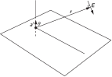
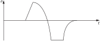
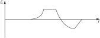
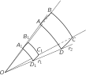
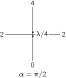
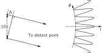
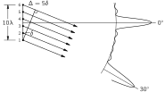
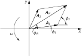

SOURCE: Feynman Lectures on Physics, Volume I, Chapter 29
LANGUAGE: ru
TITLE: Глава 29. Интерференция
SOURCE_URL: https://www.feynmanlectures.caltech.edu/I_29.html
NOTEBOOKLM_USE: clean lecture text with TeX math and figure captions; reader navigation removed.

# Глава 29. Интерференция

## 29–1 Электромагнитные волны

В этой главе мы будем обсуждать те же вопросы, что и в предыдущей, но с большими математическими подробностями. Качественно мы уже показали, что поле излучения двух источников имеет максимумы и минимумы, и теперь наша задача — дать математическое, а не просто качественное описание поля.

### Figure Ch29-F1
Caption: Фиг. 29.1. Напряженность поля \(\FigE\) , создаваемая положительным зарядом с запаздывающим ускорением \(\Figa'\) .
Image: figures/Ch29-F1.svg

Мы вполне удовлетворительно разобрали физический смысл формулы (28.6), рассмотрим теперь некоторые ее математические черты. Прежде всего поле заряда, движущегося вверх и вниз с малой амплитудой в направлении \(\theta\) от оси движения, перпендикулярно лучу зрения и лежит в плоскости ускорения и луча зрения (фиг. 29.1). Обозначим расстояние через \(r\) , тогда в момент времени \(t\) величина электрического поля равна
\[
\begin{equation}
\label{Eq:I:29:1}
E(t)=\frac{-qa(t-r/c)\sin\theta}{4\pi\epsO c^2r},
\end{equation}
\]
, где \(a(t - r/c)\) — ускорение в момент времени \((t - r/c)\) , или запаздывающее ускорение.

Интересно нарисовать картину распределения поля в разных случаях. Наиболее характерным, конечно, является множитель \(a(t - r/c)\) ; чтобы его понять, мы можем взять простейший случай \(\theta = 90^\circ\) и изобразить поле на графике. Раньше мы исходили из того, что находимся в одной точке и наблюдаем, как поле в ней меняется со временем. Но вместо этого теперь мы посмотрим, как выглядит поле в разных точках пространства в данный момент времени. Иначе говоря, нам нужен «моментальный снимок» поля, который показывает, каково оно в разных местах. Разумеется, это зависит от ускорения заряда. Предположим, что сначала заряд совершал определенное движение: изначально он покоился, затем внезапно начал определенным образом ускоряться, как показано на фиг. 29.2, а затем остановился. Затем, чуть позже, мы измерим поле в другом месте. Тогда мы можем утверждать, что поле будет иметь вид, показанный на фиг. 29.3. В каждой точке поле определяется ускорением заряда в более ранний момент времени, причем величина этого опережения равна запаздыванию \(r/c\) . Чем дальше точка, тем более ранним моментом времени определяется для нее ускорение. Поэтому кривая на фиг. 29.3 в некотором смысле представляет собой «обращенный» график зависимости ускорения от времени; расстояние связано со временем постоянным масштабным множителем \(c\) , который мы часто принимаем за единицу. Это легко заметить, рассмотрев математическое поведение \(a(t - r/c)\) . Очевидно, что если мы добавим небольшой промежуток времени \(\Delta t\) , мы получим то же значение для \(a(t - r/c)\) , как если бы мы вычли небольшое расстояние: \(\Delta r = -c\,\Delta t\) .

### Figure Ch29-F2
Caption: Фиг. 29.2. Ускорение некоторого заряда как функция времени.
Image: figures/Ch29-F2.svg

### Figure Ch29-F3
Caption: Фиг. 29.3. Электрическое поле как функция положения точки наблюдения спустя некоторый промежуток времени. (Множителем \(1/r\) пренебрегаем.)
Image: figures/Ch29-F3.svg

Другими словами, увеличив время на \(\Delta t\) , можно восстановить значение \(a(t - r/c)\) добавлением отрезка \(\Delta r = c\,\Delta t\) . То есть поле распространяется со временем как волна, уходящая от источника. Вот почему иногда говорят, что свет движется как волна. Можно также сказать, что поле запаздывает во времени, или, иначе, что электрическое поле распространяется вширь с течением времени.

Особый интерес представляет случай периодических колебаний заряда \(q\) . В опыте, рассмотренном в предыдущей главе, смещение \(x\) в любой момент времени \(t\) равнялось некоторой константе \(x_0\) , амплитуде колебаний, умноженной на \(\cos\omega t\) . Тогда ускорение равно
\[
\begin{equation}
\label{Eq:I:29:2}
a=-\omega^2x_0\cos\omega t=a_0\cos\omega t,
\end{equation}
\]
, где \(a_0\) — максимальное ускорение, равное \(-\omega^2x_0\) . Подставляя эту формулу в (29.1), находим
\[
\begin{equation}
\label{Eq:I:29:3}
E=-q\sin\theta\,
\frac{a_0\cos\omega(t-r/c)}{4\pi\epsO rc^2}.
\end{equation}
\]
Теперь, отвлекаясь от угла \(\theta\) и постоянных множителей, посмотрим, как это выглядит как функция координат или как функция времени.

## 29–2 Энергия излучения

Прежде всего, в любой момент времени и в любой точке пространства напряженность поля меняется обратно пропорционально расстоянию \(r\) , как мы уже говорили ранее. Теперь следует заметить, что энергия, несомая волной, или любые энергетические характеристики электрического поля пропорциональны квадрату поля, потому что если, например, в электрическом поле находится какой-либо заряд или осциллятор и мы позволим полю подействовать на осциллятор, оно заставит его двигаться. Если это линейный осциллятор, то ускорение, скорость и смещение, возникающие под действием действующего на заряд электрического поля, пропорциональны полю. Поэтому кинетическая энергия, развивающаяся в заряде, пропорциональна квадрату поля. Таким образом, мы примем, что энергия, которую поле может передать системе, каким-то образом пропорциональна квадрату поля.

### Figure Ch29-F4
Caption: Фиг. 29.4. Количество энергии, протекающей внутри конуса \(OABCD\) , не зависит от расстояния \(r\) , на котором оно измеряется.
Image: figures/Ch29-F4.svg

Это означает, что энергия, получаемая в данном месте от источника поля, уменьшается по мере удаления от источника; точнее, она падает обратно пропорционально квадрату расстояния. Существует очень простая интерпретация этого факта: если мы захотим собрать всю энергию волны, попадающую в определенный конус на расстоянии \(r_1\) (фиг. 29.4), и проделаем то же самое на другом расстоянии \(r_2\) , то окажется, что количество энергии на единицу площади в любом месте обратно пропорционально квадрату \(r\) , в то время как площадь поверхности, вырезаемая конусом, растет прямо пропорционально квадрату \(r\) . Таким образом, на каком бы расстоянии мы ни находились, энергия, которую мы можем извлечь из волны внутри данного конуса, одна и та же! В частности, если окружить источник со всех сторон поглощающими осцилляторами, то полное количество энергии, которое мы могли бы извлечь из всей волны, будет постоянным. Таким образом, тот факт, что амплитуда \(E\) меняется как \(1/r\) , эквивалентен утверждению, что имеется поток энергии, который нигде не теряется; при этом энергия уходит все дальше и дальше, распространяясь по все большей и большей эффективной площади. Таким образом, мы видим, что после того как заряд совершил колебание, он теряет некоторую часть энергии, которую уже никогда не сможет вернуть; эта энергия продолжает уходить все дальше и дальше без уменьшения. Поэтому, если мы находимся достаточно далеко, так что наше основное приближение применимо, заряд не может вернуть энергию, которая, как мы говорим, излучилась прочь. Конечно, энергия все еще где-то существует и ее можно поглотить с помощью других систем. Эту «потерю» энергии мы будем изучать подробнее в гл. 32.

Рассмотрим теперь более подробно, как волна (29.3) меняется как функция времени в данном месте и как функция расстояния в данный момент времени. Как и раньше, мы будем отвлекаться от изменения \(1/r\) и от постоянных.

## 29–3 Синусоидальные волны

Зафиксируем вначале \(r\) и рассмотрим поле как функцию времени. Получается функция, которая осциллирует с угловой частотой \(\omega\) . Угловую частоту \(\omega\) можно определить как скорость изменения фазы со временем (радианы в секунду). Эта величина нам уже знакома. Период есть время одного колебания, одного полного цикла, и мы его тоже уже находили; он равен \(2\pi/\omega\) , так как произведение \(\omega\) на период есть полный период косинуса.

Теперь мы введем новую величину, которая очень широко используется в физике. Она связана с противоположной ситуацией, когда \(t\) фиксировано и волна рассматривается как функция расстояния \(r\) . Легко увидеть, что как функция \(r\) волна (29.3) тоже осциллирует. Если отвлечься от множителя \(1/r\) , то мы видим, что \(E\) тоже осциллирует, когда мы меняем положение. Тогда по аналогии с \(\omega\) введем так называемое волновое число и обозначим его через \(k\) . Оно определяется как скорость изменения фазы с расстоянием (радианы на метр). То есть при перемещении в пространстве в фиксированный момент времени фаза меняется.

Существует и другая величина, соответствующая периоду; мы могли бы назвать ее «пространственным периодом», но обычно ее называют длиной волны, а обозначается она буквой \(\lambda\) . Длина волны — это расстояние, занимаемое одним полным циклом. Легко видеть, что длина волны равна \(2\pi/k\) , потому что \(k\) , умноженное на длину волны, дает изменение фазы в радианах на всем этом расстоянии (оно равно произведению скорости изменения фазы в радианах на метр на число метров), а для одного полного цикла это изменение должно составлять \(2\pi\) . Итак, соотношение \(k\lambda =
2\pi\) полностью аналогично \(\omega t_0 = 2\pi\) .

В нашей конкретной волне существует определенная связь между частотой и длиной волны, но приведенные выше определения \(k\) и \(\omega\) на самом деле совершенно общие. Иными словами, в других физических условиях длина волны и частота могут быть связаны иначе. Однако в нашем случае скорость изменения фазы с расстоянием найти легко: если обозначить фазу через \(\phi =
\omega(t - r/c)\) и взять частную производную по расстоянию \(r\) , то скорость изменения \(\ddpl{\phi}{r}\) окажется равной
\[
\begin{equation}
\label{Eq:I:29:4}
\biggl|\ddp{\phi}{r}\biggr|=
k = \frac{\omega}{c}.
\end{equation}
\]
Это соотношение можно записать разными способами, например
\[
\begin{align}
 \label{Eq:I:29:5}
 \lambda &= ct_0 &\\[1.5ex]
 \label{Eq:I:29:6}
 \omega &= ck &
 \end{align}
\]

\[
\begin{align}
 \label{Eq:I:29:7}
 \lambda\nu &= c &\\[1.5ex]
 \label{Eq:I:29:8}
 \omega\lambda &= 2\pi c &
 \end{align}
\]
Почему длина волны оказывается равной периоду, умноженному на \(c\) ? Очень просто. Дело в том, что если мы постоим на месте и подождем, пока пройдет один период, то волны, двигаясь со скоростью \(c\) , пройдут расстояние \(ct_0\) , которое, естественно, должно быть равно как раз одной длине волны.

В других физических условиях, отличных от случая со светом, такого простого соотношения между \(k\) и \(\omega\) может и не быть. Если обозначить расстояние вдоль оси через \(x\) , то формула для косинусоидальной волны, распространяющейся в направлении \(x\) с волновым числом \(k\) и угловой частотой \(\omega\) , в общем виде запишется как \(\cos\,(\omega t - kx)\) .

Теперь, когда мы ввели понятие длины волны, можно подробнее сказать об условиях, при которых формула (29.1) справедлива. Мы помним, что поле складывается из нескольких частей: одна меняется обратно пропорционально \(r\) , другая — обратно пропорционально \(r^2\) , а остальные — еще быстрее. Полезно знать, при каких условиях часть поля \(1/r\) будет главной, а остальные части — относительно малыми. Естественно ответить: «Когда мы отойдем достаточно далеко от источника», потому что члены, меняющиеся обратно пропорционально квадрату, в конечном счете становятся пренебрежимо малыми по сравнению с членом \(1/r\) . Но что значит «достаточно далеко»? В общих чертах ответ таков: все остальные члены имеют порядок величины \(\lambda/r\) по сравнению с первым членом \(1/r\) . Так что когда мы находимся на расстоянии нескольких длин волн от источника, формула (29.1) описывает поле в хорошем приближении. Область, удаленную от источника на расстояние, превышающее несколько длин волн, иногда называют «волновой зоной».

## 29–4 Два дипольных излучателя

Перейдем теперь к математическому описанию сложения действий двух осцилляторов с целью найти результирующее поле в данной точке. В тех немногих случаях, которые мы рассмотрели в предыдущей главе, сделать это было очень просто. Сначала мы опишем эти явления качественно, а затем более количественно. Рассмотрим простой случай, когда центры осцилляторов лежат в одной горизонтальной плоскости с детектором, а линия колебаний вертикальна.

### Figure Ch29-F5
Caption: Фиг. 29.5. Интенсивность излучения в различных направлениях от двух дипольных осцилляторов, находящихся на расстоянии в половину длины волны. Слева: в фазе ( \(\alpha =
 0\) ). Справа: в противофазе ( \(\alpha = \pi\) ).
Image: figures/Ch29-F5.svg

На фиг. 29.5, а показан вид сверху на два таких осциллятора. В данном конкретном примере они находятся на расстоянии половины длины волны друг от друга в направлении север — юг и колеблются в одной фазе, которую мы назовем нулевой фазой. Теперь мы хотели бы знать интенсивность излучения в различных направлениях. Под интенсивностью мы понимаем количество энергии, переносимое полем в секунду мимо нас, которое пропорционально среднему по времени квадрату поля. Таким образом, когда мы хотим узнать, насколько ярок свет, мы должны рассматривать квадрат электрического поля, а не само электрическое поле. (Электрическое поле определяет величину силы, действующей на неподвижный заряд, но количество переносимой энергии в ваттах на квадратный метр пропорционально квадрату электрического поля. Коэффициент пропорциональности мы выведем в гл. 31.) Если смотреть на эту систему с запада, то оба осциллятора дают одинаковый вклад и колеблются в фазе, так что электрическое поле оказывается вдвое сильнее, чем от одного осциллятора. Следовательно, интенсивность в четыре раза больше интенсивности, возникающей от действия только одного осциллятора. (Числа на фиг. 29.5 указывают интенсивность, причем за единицу измерения выбрана интенсивность излучения одного осциллятора, помещенного в начале координат.) Пусть теперь поле измеряется в северном или южном направлении, вдоль линии осцилляторов. Поскольку расстояние между осцилляторами равно половине длины волны, их поля излучения различаются по фазе ровно на полцикла, а, следовательно, суммарное поле равно нулю. Для промежуточного угла (равного \(30^\circ\) ) интенсивность равна \(2\) , т. е., уменьшаясь, интенсивность последовательно принимает значения \(4\) , \(2\) , \(0\) и т. д. Нам нужно научиться находить интенсивность для разных углов. По существу, это сводится к задаче о сложении двух колебаний с разными фазами.

Давайте коротко рассмотрим еще несколько интересных случаев. Пусть расстояние между осцилляторами, как и раньше, равно половине длины волны, но фаза \(\alpha\) одного из них в его колебаниях отстает от другого на половину периода (см. фиг. 29.5,б). В западном направлении интенсивность теперь равна нулю, потому что один осциллятор «толкает», когда другой «тянет». Но в северном направлении сигнал от ближайшего приходит в определенный момент времени, а сигнал от другого — на полпериода позже. Но последний изначально отставал по времени на полпериода, так что теперь они приходят точно одновременно, и интенсивность в этом направлении равна \(4\) . Интенсивность в направлении под углом \(30^\circ\) все еще равна \(2\) , как мы сможем доказать позже.

Теперь мы подошли к одному интересному свойству, весьма полезному на практике. Заметим, что фазовые соотношения между осцилляторами используются при передаче радиоволн. Допустим, мы хотим направить радиосигнал на Гавайские острова. Используем для этого систему антенн, расположенную так, как показано на фиг. 29.5, а, и установим между ними нулевую разность фаз. Тогда максимальная интенсивность будет идти как раз в нужном направлении, поскольку Гавайские острова лежат на западе от США. На следующий день мы решим передавать сигналы уже в Канаду. А поскольку Канада находится на севере, нам надо только изменить знак одной из антенн, чтобы антенны находились в противофазе, как на фиг. 29.5, б, и передача пойдет на север. Можно придумать разные устройства системы антенн. Наш способ — один из самых простых; мы можем значительно усложнить систему и, выбрав нужные фазовые соотношения, послать пучок с максимальной интенсивностью в требуемом направлении, даже не сдвинув с места ни одну из антенн! Однако в обеих радиопередачах мы затрачивали много энергии зря, она уходила в прямо противоположном направлении; интересно знать, есть ли способ посылать сигналы только в одном направлении? На первый взгляд кажется, что пара антенн такого типа будет всегда излучать симметрично. На самом деле картина гораздо разнообразнее; рассмотрим для примера случай несимметричного излучения двух антенн.

### Figure Ch29-F6
Caption: Фиг. 29.6. Две дипольные антенны, дающие максимум излучения в одном направлении.
Image: figures/Ch29-F6.svg

Если расстояние между антеннами равно четверти длины волны и антенна N отстает от антенны S на четверть периода по времени, то что же произойдет (фиг. 29.6)? В западном направлении мы получим \(2\) , как мы увидим позже. В южном направлении получится нуль, потому что сигнал от S приходит в определенный момент времени; сигнал от N приходит на \(90^\circ\) позже по времени, но он уже отстает по своей собственной фазе на \(90^\circ\) , поэтому в итоге он приходит со сдвигом фаз на \(180^\circ\) , и суммарный эффект равен нулю. С другой стороны, в северном направлении сигнал N приходит раньше сигнала S по времени на \(90^\circ\) , поскольку он на четверть длины волны ближе. Но его фаза установлена так, что он колеблется с отставанием по времени на \(90^\circ\) , что как раз компенсирует разность задержек, и поэтому оба сигнала приходят вместе в фазе, делая напряженность поля в два раза больше, а энергию — в четыре раза больше.

Таким образом, проявив некоторую изобретательность в расположении антенн и выбрав нужные сдвиги фаз, можно направить энергию излучения в одном направлении. Правда, энергия будет все-таки испускаться в довольно большой интервал углов. А можно ли сфокусировать излучение в еще более узкий интервал углов? Обратимся снова к передаче волн на Гавайские острова; там радиоволны шли на запад и на восток в широком диапазоне углов и даже на угол \(30^\circ\) интенсивность была всего вдвое меньше максимальной, энергия расходовалась впустую. Можно ли улучшить это положение? Рассмотрим случай, когда расстояние между источниками равно десяти длинам волн (фиг. 29.7); это ближе к ситуации, в которой мы экспериментировали в предыдущей главе, с интервалами, равными нескольким длинам волн, а не малым долям длины волны. Здесь иная картина.

### Figure Ch29-F7
Caption: Фиг. 29.7. Распределение интенсивности двух диполей, находящихся на расстоянии \(10\lambda\) друг от друга.
Image: figures/Ch29-F7.svg

Если расстояние между осцилляторами равно десяти длинам волн (мы берем случай колебаний в фазе, чтобы упростить задачу), то в западном и восточном направлениях они колеблются в фазе, и мы получаем большую интенсивность, в четыре раза превосходящую ту, которую давал бы один источник в отдельности. С другой стороны, при отклонении на очень небольшой угол времена прихода сигналов будут отличаться на \(180^\circ\) и интенсивность обратится в нуль. Более строго: если мы проведем прямые от каждого осциллятора до удаленной точки и разность двух расстояний \(\Delta\) окажется равной \(\lambda/2\) (половине периода колебания), то они окажутся в противофазе. Таким образом, этот первый нуль возникает именно при этих условиях. (Масштаб на рисунке не выдержан; это всего лишь грубый набросок.) Это означает, что мы действительно получаем очень узкий луч в нужном направлении, так как, если мы чуть сдвинемся в сторону, вся интенсивность исчезнет. К сожалению, для практических целей, если бы мы думали о создании радиовещательной антенной решетки и разность расстояний \(\Delta\) удвоилась, то разность фаз составила бы целый период, что эквивалентно тому, как если бы они снова оказались точно в фазе! В результате получается картина со множеством чередующихся максимумов и минимумов, точь-в-точь как мы обнаружили в гл. 28 для расстояния \(2\tfrac{1}{2}\lambda\) .

Как избавиться от всех этих лишних максимумов, или «лепестков», как их называют? Существует довольно интересный способ устранения нежелательных лепестков. Предположим, что мы поместили целый ряд других антенн между теми двумя, которые у нас уже есть. То есть крайние по-прежнему находятся на расстоянии \(10\lambda\) друг от друга, но между ними, скажем, через каждые \(2\lambda\) , мы поставили по антенне и настроили их все на одну фазу. Теперь у нас шесть антенн, и если посмотреть на интенсивность в направлении запад — восток, она, конечно, окажется гораздо выше с шестью антеннами, чем с одной. Поле увеличится в шесть раз, а интенсивность — в тридцать шесть раз (квадрат поля). В этом направлении мы получим \(36\) единиц интенсивности. Если теперь посмотреть на соседние точки, мы обнаружим, грубо говоря, такой же нуль, как и раньше, но если пойти дальше, туда, где раньше возникал большой «горб», то теперь появится гораздо меньший «горб». Попробуем разобраться, почему так происходит.

### Figure Ch29-F8
Caption: Фиг. 29.8. Устройство из шести дипольных антенн и часть распределения интенсивности его излучения.
Image: figures/Ch29-F8.svg

Причина в том, что хотя, казалось бы, можно ожидать появления большого «горба», когда расстояние \(\Delta\) в точности равно длине волны, действительно, диполи \(1\) и \(6\) при этом колеблются в фазе и совместно пытаются создать некоторую силу в этом направлении. Но номера \(3\) и \(4\) сдвинуты по фазе примерно на \(\tfrac{1}{2}\) длины волны относительно \(1\) и \(6\) , и хотя \(1\) и \(6\) действуют совместно, \(3\) и \(4\) тоже действуют совместно, но в противоположной фазе. Поэтому в этом направлении интенсивность очень мала, — но всё же она есть; они не компенсируют друг друга полностью. Подобное явление продолжается; мы получаем лишь небольшие «горбы», а в нужном нам направлении образуется мощный луч. Но в этом конкретном примере произойдет кое-что еще: а именно, поскольку расстояние между соседними диполями равно \(2\lambda\) , можно найти угол, для которого разность хода \(\delta\) лучей от соседних диполей в точности равна одной длине волны, так что действия всех их снова окажутся в фазе. Каждый из них запаздывает относительно соседнего на \(360^\circ\) , так что они все снова оказываются в фазе, и в этом направлении мы получаем еще один мощный луч! На практике этого легко избежать, так как можно расположить диполи на расстоянии меньше одной длины волны друг от друга. Если мы поставим больше антенн на расстоянии меньше одной длины волны друг от друга, то этого не произойдет. Но то, что это может происходить при определенных углах, если расстояние между осцилляторами больше одной длины волны, представляет собой очень интересное и полезное явление для других приложений — не для радиовещания, а для дифракционных решеток.

## 29–5 Математическое описание интерференции

Мы закончили качественный анализ явлений излучения диполей, и теперь мы должны научиться анализировать их количественно. Чтобы найти действие двух источников под некоторым определенным углом в самом общем случае, когда два осциллятора имеют некоторую собственную относительную фазу \(\alpha\) друг относительно друга, а силы \(A_1\) и \(A_2\) не равны, мы увидим, что нам придется сложить два косинуса с одинаковой частотой, но разными фазами. Эту разность фаз найти очень просто: она складывается из запаздывания, обусловленного разностью расстояний, и внутренней, собственной фазы колебаний. Выражаясь математически, нам необходимо найти сумму \(R\) двух волн: \(R = A_1 \cos\,(\omega t + \phi_1) + A_2 \cos\,(\omega t + \phi_2)\) . Как это сделать?

Каждый, вероятно, сумеет провести это сложение, но тем не менее проследим за ходом вычислений. Прежде всего, если мы разбираемся в математике и достаточно ловко управляемся с синусами и косинусами, эту задачу легко решить. Самый простой случай — это когда \(A_1\) и \(A_2\) равны; положим, что обе они равны \(A\) . В этих условиях (назовем это тригонометрическим методом решения задачи) мы имеем
\[
\begin{equation}
\label{Eq:I:29:9}
R = A[\cos\,(\omega t+\phi_1)+\cos\,(\omega t + \phi_2)].
\end{equation}
\]
На уроках тригонометрии мы, возможно, учили правило, что
\[
\begin{equation}
\label{Eq:I:29:10}
\cos A+\cos B=2\cos\tfrac{1}{2}(A+B)\cos\tfrac{1}{2}(A-B).
\end{equation}
\]
Если это нам известно, то мы можем немедленно записать \(R\) в виде
\[
\begin{equation}
\label{Eq:I:29:11}
R=2A\cos\tfrac{1}{2}(\phi_1-\phi_2)\cos\,(\omega t+\tfrac{1}{2}\phi_1+
\tfrac{1}{2}\phi_2).
\end{equation}
\]
Итак, мы видим, что получили колебательную волну с новой фазой и новой амплитудой. Вообще в результате получается колебательная волна с новой амплитудой \(A_R\) , которую мы можем назвать результирующей амплитудой, колеблющаяся на той же частоте, но со сдвигом фазы \(\phi_R\) , называемым результирующей фазой. Ввиду этого для нашего частного случая получается следующий результат: результирующая амплитуда равна
\[
\begin{equation}
\label{Eq:I:29:12}
A_R=2A\cos\tfrac{1}{2}(\phi_1-\phi_2),
\end{equation}
\]
, а результирующая фаза есть среднее значение обеих фаз, и мы полностью решили нашу задачу.

### Figure Ch29-F9
Caption: Фиг. 29.9. Геометрический способ сложения двух косинусоидальных волн. Чертеж вращается со скоростью \(\omega\) против часовой стрелки.
Image: figures/Ch29-F9.svg

Предположим теперь, что мы забыли формулу сложения косинусов. Тогда можно применить другой метод решения — геометрический. Косинус, зависящий от \(\omega t\) , можно представить в виде горизонтальной проекции некоторого вращающегося вектора. Пусть имеется вектор \(\FLPA_1\) , вращающийся с течением времени; длина его равна \(A_1\) , а угол с осью абсцисс равен \(\omega t + \phi_1\) . (Мы пока опустим слагаемое \(\omega t\) ; как мы увидим, при выводе это не играет роли.) Сделаем моментальный снимок в момент времени \(t = 0\) , помня, что на самом деле вся схема вращается с угловой скоростью \(\omega\) (фиг. 29.9). Проекция \(\FLPA_1\) на ось абсцисс в точности равна \(A_1\cos\,(\omega t + \phi_1)\) . В момент времени \(t= 0\) вторая волна представляется вектором \(\FLPA_2\) , длина которого равна \(A_2\) , а его угол с осью абсцисс равен \(\phi_2\) , причем он тоже вращается. Оба вектора вращаются с одинаковой угловой скоростью \(\omega\) , и их относительное расположение неизменно. Вся система вращается жестко, подобно твердому телу. Горизонтальная проекция \(\FLPA_2\) равна \(A_2\cos\,(\omega t + \phi_2)\) . Но из теории векторов известно, что при сложении двух векторов обычным способом, по правилу параллелограмма, и построении результирующего вектора \(\FLPA_R\) , \(x\) -компонента результирующего вектора равна сумме \(x\) -компонент двух других векторов. Отсюда получаем решение нашей задачи. Легко проверить, что получается правильный ответ в нашем частном случае, когда \(A_1=\) \(A_2 =\) \(A\) . Действительно, из фиг. 29.9 очевидно, что \(\FLPA_R\) лежит посредине между \(\FLPA_1\) и \(\FLPA_2\) и составляет угол \(\tfrac{1}{2}(\phi_2 - \phi_1)\) с каждым из них. Следовательно, \(A_R = 2A\cos\tfrac{1}{2}(\phi_2 -
\phi_1)\) , как и прежде. Кроме того, как видно из треугольника, фаза \(\FLPA_R\) при его вращении есть среднее значение углов \(\FLPA_1\) и \(\FLPA_2\) , когда обе амплитуды равны. Очевидно, что для случая неравных амплитуд задача решается столь же просто. Мы можем назвать это геометрическим решением задачи.

Существует еще один метод решения задачи, его можно было бы назвать аналитическим. То есть вместо того чтобы рисовать схему, подобную приведенной на фиг. 29.9, мы можем написать выражение, имеющее тот же смысл, что и чертеж: вместо того чтобы рисовать векторы, мы сопоставим каждому вектору комплексное число. Действительные части этих комплексных чисел отвечают реальным физическим величинам. В нашем конкретном случае волны записываются следующим образом: \(A_1e^{i(\omega t + \phi_1)}\) [действительная часть этого равна \(A_1\cos\,(\omega t + \phi_1)\) ] и \(A_2e^{i(\omega t + \phi_2)}\) . Сложим обе волны:
\[
\begin{align}
R&=A_1e^{i(\omega t + \phi_1)}+A_2e^{i(\omega t + \phi_2)}\notag\\[1ex]
&=(A_1e^{i\phi_1}+A_2e^{i\phi_2})e^{i\omega t}
\label{Eq:I:29:13}
\end{align}
\]
или
\[
\begin{equation}
\label{Eq:I:29:14}
\hat{R}=A_1e^{i\phi_1}+A_2e^{i\phi_2}=A_Re^{i\phi_R}.
\end{equation}
\]
. Задача, таким образом, решена, так как мы имеем результат в виде комплексного числа с модулем \(A_R\) и фазой \(\phi_R\) .

Для иллюстрации аналитического метода найдем амплитуду \(A_R\) , т. е. «длину» \(\hat{R}\) . «Длина» комплексного числа в квадрате есть само комплексное число, умноженное на сопряженное ему. Комплексное сопряжение состоит в изменении знака \(i\) . Отсюда получаем
\[
\begin{equation}
\label{Eq:I:29:15}
A_R^2=(A_1e^{i\phi_1}+A_2e^{i\phi_2})(A_1e^{-i\phi_1}+A_2e^{-i\phi_2}).
\end{equation}
\]
. Перемножая, получаем \(A_1^2 + A_2^2\) (здесь \(e\) сокращаются), а для перекрестных членов имеем
\[
\begin{equation*}
A_1A_2(e^{i(\phi_1-\phi_2)}+e^{i(\phi_2-\phi_1)}).
\end{equation*}
\]
. Далее
\[
\begin{equation*}
e^{i\theta}+e^{-i\theta}=
\cos\theta+i\sin\theta+\cos\theta-i\sin\theta.
\end{equation*}
\]
, т. е. \(e^{i\theta} + e^{-i\theta} = 2\cos\theta\) . Следовательно, окончательный результат есть
\[
\begin{equation}
\label{Eq:I:29:16}
A_R^2=A_1^2+A_2^2+2A_1A_2\cos\,(\phi_2-\phi_1).
\end{equation}
\]
.

Как мы видим, с помощью формул тригонометрии легко установить совпадение этого результата с длиной \(\FLPA_R\) на фиг. 29.9.

Итак, суммарная интенсивность складывается из интенсивности \(A_1^2\) , которую мы получили бы от одного из них в отдельности, плюс интенсивность \(A_2^2\) , которую мы получили бы от другого в отдельности, и еще дополнительного члена. Этот дополнительный член мы называем эффектом интерференции. Он представляет собой разность между истинным результатом сложения и суммой интенсивностей. Мы называем это интерференцией независимо от того, положительна она или отрицательна. (Интерференция в обычном языке обычно означает противодействие или помеху, но в физике мы часто используем язык не так, как он был изначально задуман!) Если интерференционный член положителен, мы говорим о конструктивной интерференции (буквальный смысл этого выражения покажется ужасным всем, кроме физиков!). В противном случае мы говорим о деструктивной интерференции.

### Figure Ch29-F10
Caption: Фиг. 29.10. Два осциллятора, обладающие одинаковой амплитудой и разностью фаз \(\alpha\) .
Image: figures/Ch29-F10.svg

Посмотрим теперь, как применить нашу общую формулу (29.16) для случая двух осцилляторов к тем частным ситуациям, которые мы качественно обсудили. Для применения этой общей формулы необходимо лишь найти, какая разность фаз, \(\phi_2 - \phi_1\) , существует между сигналами, приходящими в данную точку. (Эффект, разумеется, связан с разностью фаз, а не с их абсолютными значениями.) Рассмотрим случай, когда два осциллятора с равными амплитудами расположены на некотором расстоянии \(d\) друг от друга и обладают относительной разностью фаз \(\alpha\) . (Когда фаза одного равна нулю, фаза другого равна \(\alpha\) .) Тогда мы хотим узнать, какова будет интенсивность в некотором азимутальном направлении \(\theta\) от линии запад — восток. [Заметьте, что этот угол \(\theta\) не имеет ничего общего с тем, который входит в формулу (29.1). Мы колеблемся между выбором необычного символа вроде \(\cancel{\text{U}}\!\!,\) или общепринятого символа \(\theta\) (фиг. 29.10).] Связь между фазами находится из того соображения, что разность расстояний от \(P\) до двух осцилляторов равна \(d\sin\theta\) , поэтому вклад в разность фаз, возникающий по этой причине, равен числу длин волн, укладывающихся в \(d\sin\theta\) , умноженному на \(2\pi\) . (Более подготовленный читатель, вероятно, захочет умножить волновое число \(k\) , которое представляет собой скорость изменения фазы с расстоянием, на \(d\sin\theta\) ; результат получится точно таким же.) Разность фаз, возникающая из-за разности хода, есть, таким образом, \(2\pi
d\sin\theta/\lambda\) , но из-за запаздывания осцилляторов возникает дополнительная фаза \(\alpha\) . Отсюда полная разность фаз двух волн в точке наблюдения равна
\[
\begin{equation}
\label{Eq:I:29:17}
\phi_2-\phi_1=\alpha+2\pi d\sin\theta/\lambda.
\end{equation}
\]
Это выражение охватывает все случаи. Теперь остается только подставить это выражение в (29.16) для случая \(A_1 = A_2\) , и мы сможем рассчитать все различные результаты для двух антенн одинаковой интенсивности.

Посмотрим теперь, что происходит в наших различных случаях. Причина, по которой мы знаем, например, что интенсивность равна \(2\) при \(30^\circ\) на фиг. 29.5, заключается в следующем: оба осциллятора находятся на расстоянии \(\tfrac{1}{2}\lambda\) друг от друга, так что при \(30^\circ\) получаем \(d\sin\theta=\lambda/4\) . Таким образом, \(\phi_2 - \phi_1 =\) \(2\pi\lambda/4\lambda =\) \(\pi/2\) , и поэтому интерференционный член равен нулю. (Мы складываем два вектора под углом \(90^\circ\) друг к другу.) В результате получается гипотенуза прямоугольного \(45^\circ\) треугольника, которая в \(\sqrt{2}\) раз больше единичной амплитуды; возведя её в квадрат, мы получаем удвоенную интенсивность одного осциллятора. Все остальные случаи исследуются точно таким же способом.
