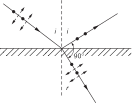
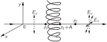
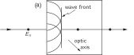
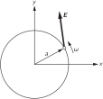

SOURCE: Feynman Lectures on Physics, Volume I, Chapter 33
LANGUAGE: ru
TITLE: Глава 33. Поляризация
SOURCE_URL: https://www.feynmanlectures.caltech.edu/I_33.html
NOTEBOOKLM_USE: clean lecture text with TeX math and figure captions; reader navigation removed.

# Глава 33. Поляризация

## 33–1 Вектор электрического поля световой волны

В этой главе мы рассмотрим круг явлений, связанных с векторным характером электрического поля световой волны. В предыдущих главах направление колебаний электрического поля нас не интересовало, правда, мы отметили, что вектор электрического поля лежит в плоскости, перпендикулярной направлению распространения света. Но нам не нужно было знать направление вектора более точно. Теперь мы перейдем к изучению явлений, в которых главную роль играет определенное направление колебаний электрического вектора.

В идеально монохроматической световой волне электрическое поле колеблется с определенной частотой, а так как \(x\) - и \(y\) -компоненты поля могут колебаться независимо с одной и той же частотой, то сначала мы рассмотрим сложение двух взаимно перпендикулярных колебаний. Какое электрическое поле возникает при сложении колебаний \(x\) - и \(y\) -компонент поля с одинаковой частотой? Складывая колебание в направлении \(x\) и колебание с той же фазой в направлении \(y\) , получаем в плоскости \(xy\) колебание в новом направлении. На фиг. 33.1 показано, как происходит сложение колебаний с разными амплитудами в направлениях \(x\) и \(y\) . Но примеры, представленные на фиг. 33.1, не исчерпывают всех возможностей; во всех этих случаях предполагалось, что колебания в направлениях \(x\) и \(y\) находятся в одной фазе, но это совсем не обязательно. Может случиться, что колебания в направлениях \(x\) и \(y\) происходят с разными фазами.

### Figure Ch33-F1
Caption: Фиг. 33.1. Сложение колебаний в направлениях \(x\) и \(y\) в одной фазе.
Image: figures/Ch33-F1.svg

Когда \(x\) - и \(y\) -колебания происходят с разными фазами, вектор электрического поля описывает эллипс, и мы можем проиллюстрировать это простым примером. Если подвесить мяч на длинной веревке к опоре так, чтобы он мог свободно колебаться в горизонтальной плоскости, колебания будут носить синусоидальный характер. Если мысленно представить себе горизонтальные координаты \(x\) и \(y\) с началом координат в точке покоя мяча, то мяч может колебаться как в направлении \(x\) , так и в направлении \(y\) с одной и той же частотой маятника. Выбирая соответствующее начальное смещение и начальную скорость, можно заставить мяч колебаться вдоль оси \(x\) , вдоль оси \(y\) или по любой прямой в плоскости \(xy\) . Эти движения мяча аналогичны колебаниям электрического вектора, приведенным на фиг. 33.1. В каждом случае, поскольку колебания в направлениях \(x\) и \(y\) достигают максимума и минимума одновременно, колебания по \(x\) и \(y\) находятся в фазе. Но мы знаем, что наиболее общим типом движения мяча является движение по эллипсу, что соответствует колебаниям, в которых направления \(x\) и \(y\) находятся в разных фазах. Сложение \(x\) - и \(y\) -колебаний с разными фазами показано на фиг. 33.2 для различных углов между фазой \(x\) -колебания и фазой \(y\) -колебания. В общем случае электрический вектор описывает эллипс. Движение по прямой является частным случаем, соответствующим разности фаз, равной нулю (или целому кратному \(\pi\) ); движение по окружности соответствует равным амплитудам при разности фаз \(90^\circ\) (или любом нечетным целым кратным \(\pi/2\) ).

### Figure Ch33-F2
Caption: Фиг. 33.2. Сложение колебаний в направлениях \(x\) и \(y\) с равными амплитудами и различными относительными фазами. Компоненты \(E_x\) и \(E_y\) записаны и в действительных, и в комплексных обозначениях.
Image: figures/Ch33-F2.svg

На фиг. 33–2 компоненты вектора электрического поля в направлениях \(x\) и \(y\) записаны в виде комплексных чисел, что представляет собой удобный способ для выражения разности фаз. В этих обозначениях не следует путать действительную и мнимую части комплексного вектора электрического поля с координатами \(x\) и \(y\) поля. Координаты \(x\) и \(y\) , изображенные на фиг. 33–1 и фиг. 33–2, представляют собой реальные электрические поля, которые мы можем измерить. Действительная и мнимая части комплексного вектора электрического поля введены только для математического удобства и не имеют физического смысла.

Сделаем несколько замечаний о терминологии. Свет называется линейно поляризованным (иногда плоско поляризованным), если электрическое поле колеблется по прямой линии; на фиг. 33.1 показан случай линейной поляризации. Когда вектор электрического поля описывает эллипс, говорят об эллиптической поляризации. Если же электрический вектор описывает окружность, мы имеем круговую поляризацию. Если электрический вектор при своем движении в световой волне крутится как правосторонний винт, говорят о правой круговой поляризации. На фиг. 33.2, ж приведен пример правой круговой поляризации, а на фиг. 33.2, в — пример левой круговой поляризации. В обоих случаях свет движется от плоскости страницы к читателю. Наше определение левой и правой круговых поляризаций согласуется с подобными определениями для всех других частиц в современной физике, для которых можно ввести понятие поляризации (например, для электронов). Однако в курсах оптики иногда используются прямо противоположные определения, поэтому читателю следует с осторожностью относиться к терминам левая и правая поляризация.

Мы рассмотрели линейно, кругово и эллиптически поляризованный свет, что охватывает все случаи, кроме случая неполяризованного света. Но как же свет может быть неполяризованным, если мы знаем, что колебания должны происходить по тому или иному из этих эллипсов? Если свет не является абсолютно монохроматическим или если фазы \(x\) - и \(y\) -колебаний не связаны жестко друг с другом, так что электрический вектор колеблется то в одном направлении, то в другом, поляризация постоянно меняется. Вспомним, что один атом излучает в течение \(10^{-8}\) сек, и если один атом излучает свет с определенной поляризацией, а затем другой атом излучает свет с другой поляризацией, то поляризация будет меняться каждые \(10^{-8}\) сек. Если поляризация меняется быстрее, чем мы можем ее обнаружить, мы называем свет неполяризованным, потому что все эффекты поляризации усредняются. Ни один из интерференционных эффектов поляризации не проявится для неполяризованного света. Но, как видно из определения, свет является неполяризованным только тогда, когда мы не в состоянии выяснить, поляризован он или нет.

## 33–2 Поляризация рассеянного света

Первый пример поляризационных явлений, который мы уже ранее обсуждали, есть рассеяние света. Рассмотрим проходящий в воздухе пучок света, например солнечного света. Электрическое поле возбуждает колебания зарядов в воздухе, и в результате этих колебаний излучается свет, интенсивность которого максимальна в плоскости, перпендикулярной движению зарядов. Пучок солнечного света неполяризован, так что направление поляризации постоянно меняется, а следовательно, постоянно меняется и направление колебаний зарядов в воздухе. Если мы рассмотрим свет, рассеянный под углом \(90^\circ\) , то колебания заряженных частиц излучают по направлению к наблюдателю только тогда, когда эти колебания перпендикулярны линии зрения наблюдателя, и тогда свет будет поляризован в направлении колебаний. Таким образом, рассеяние дает нам пример одного из способов получения поляризации.

## 33–3 Двойное лучепреломление

Еще один интересный эффект поляризации состоит в том, что существуют вещества, показатель преломления которых различен для света, линейно поляризованного в одном направлении и линейно поляризованного в другом. Допустим, например, что имеется некий материал, состоящий из вытянутых несферических молекул, длина которых больше их ширины; предположим, что молекулы в веществе выстроены так, чтобы их большие оси оказались параллельными. Что произойдет, когда осциллирующее электрическое поле будет проходить через это вещество? Предположим, что из-за структуры молекул электроны в веществе легче поддаются колебаниям вдоль оси молекулы, чем поперек нее. При таких условиях следует ожидать, что поляризация в одном направлении будет вызывать один эффект, а поляризация, направленная под прямым углом к первой, — совсем другой. Назовем направление осей молекул оптической осью. Когда поляризация направлена вдоль оптической оси, показатель преломления будет иным, чем в случае, когда направление поляризации перпендикулярно ей. Такое вещество называется двоякопреломляющим. Оно обладает двумя разными способами преломления, т. е. двумя показателями преломления в зависимости от направления поляризации внутри вещества. Какие вещества могут быть двоякопреломляющими? В двоякопреломляющем веществе по той или иной причине должно присутствовать некоторое количество ориентированных несимметричных молекул. Ясно, что кубический кристалл, имеющий симметрию куба, не может быть двоякопреломляющим. А вот длинные игловидные кристаллы, безусловно, содержат несимметричные молекулы, и в них легко наблюдать этот эффект.

Попробуем сообразить, что получится, если направить поляризованный луч на пластинку двоякопреломляющего материала. Если поляризация параллельна оптической оси, свет пройдет через пластинку с одной скоростью, а если поляризация перпендикулярна — с другой скоростью. Интересная ситуация возникает, если луч света поляризован, например, под углом \(45^\circ\) к направлению оптической оси. Тогда \(45^\circ\) поляризация, как мы уже замечали, может быть представлена в виде суммы \(x\) - и \(y\) -поляризаций с равными амплитудами и в одной фазе, как показано на фиг. 33.2, а. Поскольку \(x\) - и \(y\) -поляризации движутся в среде с разной скоростью, фазы обеих компонент меняются по-разному по мере прохождения света через вещество. Таким образом, несмотря на то что вначале \(x\) - и \(y\) -колебания совпадают по фазе, внутри материала разность фаз между \(x\) - и \(y\) -колебаниями пропорциональна глубине проникновения в вещество. По мере прохождения света через вещество его поляризация меняется так, как показано на серии рисунков на фиг. 33.2. Если толщина пластинки как раз такова, чтобы создать сдвиг фаз в \(90^\circ\) между \(x\) - и \(y\) -поляризациями, как на фиг. 33.2, в, свет выйдет из нее поляризованным по кругу. Пластинка такой толщины называется пластинкой в четверть волны, поскольку она вносит разность фаз в одну четверть цикла между \(x\) - и \(y\) -поляризациями. Если пропустить линейно поляризованный свет через две пластинки в четверть волны, он снова выйдет плоскополяризованным, но под прямым углом к первоначальному направлению, как видно из фиг. 33.2, д.

Явление двойного лучепреломления легко продемонстрировать с помощью листка целлофана. Целлофан состоит из длинных молекул — волокон, и его структура неизотропна, поскольку волокна по большей части вытянуты в одном направлении. Для наблюдения явления двойного лучепреломления необходим пучок линейно поляризованного света, который нетрудно получить, пропуская неполяризованный свет через пластинку поляроида. О поляроиде мы еще будем говорить более подробно, а пока отметим одно его важное свойство: свет, поляризованный вдоль оси поляроида, проходит через него почти свободно, а свет, поляризованный перпендикулярно оси, сильно поглощается поляроидом. Когда неполяризованный свет пропускается через пластинку поляроида, то проходит только та часть света, колебания которой параллельны оси поляроида, поэтому прошедший через пластинку луч окажется линейно поляризованным. Это свойство поляроида используют также для определения направления поляризации линейно поляризованного света; кроме того, с помощью поляроида можно определить, есть ли у света вообще линейная поляризация или нет. Для этого достаточно пропустить свет через пластинку поляроида и поворачивать ее в плоскости, перпендикулярной лучу. Линейно поляризованный свет не может пройти через поляроид, когда ось поляроида перпендикулярна направлению поляризации луча. Повернув пластинку на \(90^\circ\) , мы увидим прошедший через нее луч лишь чуть-чуть менее ярким, чем падающий пучок света. Если яркость луча, пропущенного поляроидом, не зависит от ориентации поляроида, падающий пучок света не имеет линейной поляризации.

### Figure Ch33-F3
Caption: Фиг. 33.3. Схема эксперимента по двойному лучепреломлению в целлофане. Векторы электрического поля световой волны изображены пунктирными стрелками. Направления поляризации, пропускаемые поляроидами, и оптические оси целлофана изображены сплошными стрелками. Падающий луч света неполяризован.
Image: figures/Ch33-F3.svg

Для демонстрации двойного лучепреломления в целлофане возьмем два поляроида и расположим их, как показано на фиг. 33.3. Из первого поляроида выходит линейно поляризованный пучок света; мы пропускаем его через целлофан, а затем через другой поляроид, чтобы учесть действие целлофана на линейно поляризованный свет. Сначала расположим оси поляроидов перпендикулярно друг другу и уберем листок целлофана. Через второй поляроид свет не проходит совсем. Теперь поставим листок целлофана между поляроидами и будем поворачивать его вокруг оси пучка света. При этом, вообще говоря, некоторая часть света будет все время проходить через второй поляроид. Имеются, однако, две ориентации листка целлофана, перпендикулярные друг другу, при которых свет через второй поляроид не проходит. Ясно, что эти ориентации целлофана не влияют на линейную поляризацию проходящего через него света и должны поэтому совпадать с направлением оптической оси целлофана и перпендикулярным к нему направлением.

Здесь мы предполагаем, что скорость света, проходящего через целлофан, различна для указанных двух направлений поляризации, но само направление поляризации при прохождении света не меняется. Если выбрать промежуточную ориентацию целлофана где-то между двумя главными направлениями, как на фиг. 33.3, то через второй поляроид пройдет яркий пучок света.

Оказывается, толщина обычного целлофана, используемого в магазинах для упаковки, равна почти точно половине длины волны для большинства цветов в спектральном разложении белого света. Целлофан такой толщины поворачивает направление поляризации линейно поляризованного света на \(90^\circ\) , если это направление в падающем пучке образует угол \(45^\circ\) с оптической осью целлофана. Таким образом, выходящий из целлофана луч обладает как раз такой поляризацией, что может пройти второй поляроид.

Если в нашем опыте использовать пучок белого света, то только для одной компоненты его спектрального разложения толщина целлофана совпадет с половиной длины волны, и пучок, пропущенный вторым поляроидом, будет иметь цвет именно этой компоненты. Цвет пучка, прошедшего через наше устройство, будет зависеть от толщины листа целлофана, а эффективную толщину целлофана мы можем менять, наклоняя листок под некоторым углом и таким образом заставляя свет проходить больший путь внутри целлофана. При наклоне листка целлофана цвет пропущенного пучка меняется. Используя целлофан разной толщины, можно сконструировать фильтры, пропускающие лучи вполне определенного цвета. Эти фильтры обладают тем замечательным свойством, что они пропускают один цвет, когда оси двух поляроидов перпендикулярны, и дополнительный к нему цвет, когда оси поляроидов параллельны.

Системы ориентированных молекул имеют еще одно, на этот раз вполне практическое применение. Некоторые пластики состоят из очень длинных и сложных молекул, скрученных между собой. При очень тщательном проведении процесса затвердевания пластика молекулы, скручиваясь, образуют сплошную массу и ориентируются равномерно в самых разных направлениях, так что пластик обычно не проявляет свойства двойного лучепреломления. Но при затвердевании часто образуются дефекты и напряжения, которые приводят к некоторой неоднородности материала. Однако если подвергнуть растяжению кусок такого пластика, мы как бы тянем за целую путаницу нитей, и большее их число ориентируется преимущественно параллельно натяжению, чем в любом другом направлении. Поэтому, когда в этих пластиках возникает напряжение, они становятся двоякопреломляющими, и эффект двойного лучепреломления можно наблюдать, пропуская через них поляризованный свет. Анализируя пропущенный свет с помощью поляроида, мы заметим темные и светлые полосы (окрашенные в разные цвета, если берется белый свет). Если образец подвергнуть растяжению, вся совокупность полос начинает сдвигаться, а подсчитав полосы и определив место их наибольшего скопления, можно найти внутренние напряжения, возникающие в образце. Инженеры обычно используют это явление как способ определения напряжений в деталях, форма которых трудно поддается расчету.

Еще один интересный пример — двойное лучепреломление в жидкостях. Рассмотрим жидкость, состоящую из длинных асимметричных молекул, которые несут вблизи своих концов распределенный положительный или отрицательный заряд, т. е. молекулы являются электрическими диполями. Сталкиваясь, молекулы в жидкости принимают любую ориентацию, причем какого-либо преимущественного направления ориентации не существует. Но если приложить электрическое поле, молекулы начнут выстраиваться вдоль поля и в этот самый момент жидкость становится двоякопреломляющей средой. Взяв два поляроида и прозрачную ячейку с жидкостью такого сорта, можно создать устройство, которое пропускает свет только при включении электрического поля. В результате мы получаем электрический переключатель для света, который называют ячейкой Керра. А сам эффект, когда в жидкости возникает двойное лучепреломление под действием электрического поля, называется эффектом Керра.

## 33–4 Поляризаторы

До сих пор мы рассматривали вещества, у которых показатель преломления различен для света, поляризованного в разных направлениях. Большое практическое значение имеют те кристаллы и другие вещества, у которых не только показатель преломления, но и коэффициент поглощения различен для света, поляризованного в разных направлениях. Из тех же соображений, на которых основывалось представление о двойном лучепреломлении, понятно, что в анизотропном веществе поглощение может меняться в зависимости от направления, в котором заряды совершают вынужденные колебания. Турмалин — старый, знаменитый пример, а поляроид — другой. Поляроид состоит из тонкого слоя маленьких кристаллов герапатита (соль йода и хинина), выстроенных своими осями параллельно друг другу. Эти кристаллы поглощают свет, когда колебания происходят в одном направлении, и почти не поглощают его, когда колебания совершаются в другом направлении.

Предположим, что мы направляем на лист поляроида свет, поляризованный линейно под углом \(\theta\) к направлению пропускания. Какая интенсивность пройдет через него? Этот падающий свет можно разложить на компоненту, перпендикулярную направлению пропускания, которая пропорциональна \(\sin\theta\) , и компоненту вдоль направления пропускания, которая пропорциональна \(\cos\theta\) . Амплитуда на выходе из поляроида составляет лишь косинусную часть \(\theta\) ; компонента \(\sin\theta\) поглощается. Амплитуда прошедшего через поляроид света меньше амплитуды вошедшего света в \(\cos\theta\) раз. Энергия, проходящая через поляроид, то есть интенсивность света, пропорциональна квадрату \(\cos\theta\) . Таким образом, \(\operatorname{Cos}^2\theta\) — это интенсивность, прошедшая, когда свет падает поляризованным под углом \(\theta\) к направлению пропускания. Поглощенная интенсивность, разумеется, равна \(\sin^2\theta\) .

Интересный парадокс возникает в следующем опыте. Известно, что два поляроида с осями, расположенными перпендикулярно друг другу, не пропускают света. Но если между такими поляроидами поместить третий, ось которого направлена под углом \(45^\circ\) к осям двух других, часть света пройдет через нашу систему. Как мы знаем, поляроид только поглощает свет, создать свет он не может. Тем не менее, поставив третий поляроид под углом \(45^\circ\) , мы увеличиваем количество прошедшего света. Вы можете сами проанализировать это явление в качестве упражнения.

Одно из интереснейших поляризационных явлений, возникающее не в сложных кристаллах и всяких специальных материалах, а в простом и очень хорошо знакомом случае,— это отражение от поверхности. Кажется невероятным, но при отражении от стекла свет может поляризоваться, и объяснить физически такой факт весьма просто. На опыте Брюстер показал, что отраженный от поверхности свет полностью поляризован, если отраженный и преломленный в среде лучи образуют прямой угол. Этот случай показан на фиг. 33.4. Если падающий луч поляризован в плоскости падения, отраженного луча не будет совсем. Отраженный луч возникает только при условии, что падающий луч поляризован перпендикулярно плоскости падения. Причину этого явления легко понять. В отражающей среде свет поляризован перпендикулярно направлению движения луча, а мы знаем, что именно движение зарядов в отражающей среде генерирует исходящий из нее луч, который называют отраженным. Появление этого так называемого отраженного луча объясняется не просто тем, что падающий луч отражается; мы теперь уже знаем, что падающий луч возбуждает движение зарядов в среде, а оно в свою очередь генерирует отраженный луч. Из фиг. 33.4 ясно, что только колебания, перпендикулярные плоскости страницы, дают излучение в направлении отраженного луча, а следовательно, отраженный луч поляризован перпендикулярно плоскости падения. Если же падающий луч поляризован в плоскости падения, отраженного луча не будет совсем.

### Figure Ch33-F4
Caption: Фиг. 33.4. Отражение линейно поляризованного света под углом Брюстера. Направление поляризации дается пунктирными стрелками; круглые точки изображают поляризацию, перпендикулярную плоскости страницы.
Image: figures/Ch33-F4.svg

Это явление легко продемонстрировать при отражении линейно поляризованного луча от плоской стеклянной пластинки. Поворачивая пластинку под разными углами к направлению падающего поляризованного луча, можно заметить резкий спад интенсивности отраженного света, когда угол падения проходит через угол Брюстера. Это падение интенсивности наблюдается только в том случае, когда плоскость поляризации совпадает с плоскостью падения. Если же плоскость поляризации перпендикулярна плоскости падения, то при всех углах наблюдается обычная интенсивность отраженного света.

## 33–5 Оптическая активность

Еще один интереснейший поляризационный эффект наблюдается в материалах, состоящих из молекул, не обладающих зеркальной симметрией: молекул в виде штопора, перчатки с одной руки или вообще какой-то формы, которая при отражении в зеркале переходит в другую форму, подобно тому как перчатка с левой руки в этом случае принимает вид перчатки с правой. Предположим, что все молекулы в веществе одинаковы, т. е. среди них нет молекул, которые являлись бы зеркальными отражениями других. Такое вещество может обнаруживать интересный эффект, называемый оптической активностью, при котором направление поляризации линейно поляризованного света при прохождении через вещество поворачивается вокруг оси пучка.

### Figure Ch33-F5
Caption: Фиг. 33.5. Молекула, форма которой не обладает зеркальной симметрией. На молекулу падает пучок света, линейно поляризованный в направлении оси \(y\) .
Image: figures/Ch33-F5.svg

Чтобы разобраться в явлении оптической активности, надо вывести ряд формул, но суть дела можно понять и качественно, без всяких вычислений. Возьмем асимметричную молекулу в форме спирали, показанную на фиг. 33.5. Молекулы не обязательно должны иметь форму штопора, чтобы проявлять оптическую активность, но это простая форма, которую мы возьмем в качестве типичного примера молекул, не обладающих зеркальной симметрией. Когда на эту молекулу падает луч света, линейно поляризованный в направлении \(y\) , электрическое поле вызывает движение зарядов вверх и вниз по спирали, так что в направлении \(y\) возникает ток и происходит излучение электрического поля \(E_y\) , поляризованного в направлении \(y\) . Если, однако, электроны могут двигаться только вдоль спирали, они должны также перемещаться в направлении \(x\) при их движении вверх и вниз. Когда ток течет вверх по спирали, он также течет в плоскость рисунка в точке \(z = z_1\) и из плоскости рисунка в точке \(z = z_1 + A\) , если \(A\) — диаметр нашей молекулярной спирали. Казалось бы, ток в направлении \(x\) не должен давать никакого результирующего излучения, поскольку на противоположных сторонах спирали токи текут в противоположных направлениях. Однако, если мы рассмотрим \(x\) -компоненты электрического поля, приходящие в \(z = z_2\) , мы увидим, что поле, излученное током в \(z = z_1 + A\) , и поле, излученное из \(z = z_1\) , приходят в \(z_2\) разделенными во времени на величину \(A/c\) и, следовательно, с разностью фаз \(\pi + \omega A/c\) . Поскольку разность фаз в точности не равна \(\pi\) , оба поля не могут полностью погасить друг друга, и остается небольшая \(x\) -компонента электрического поля, вызванная движением электронов в молекуле, хотя возбуждающее электрическое поле имело только \(y\) -компоненту. Эта небольшая \(x\) -компонента, сложенная с большой \(y\) -компонентой, дает результирующее поле, слегка наклоненное по отношению к оси \(y\) (первоначальному направлению поляризации). При движении света через вещество направление поляризации поворачивается вокруг оси пучка. Изобразив несколько примеров и рассмотрев токи, которые будут приводиться в движение падающим электрическим полем, можно убедиться, что существование оптической активности и знак вращения не зависят от ориентации молекул.

Обычная патока — это распространенное вещество, обладающее оптической активностью. Это явление легко продемонстрировать с помощью поляроида, дающего на выходе линейно поляризованный луч, прозрачного сосуда с патокой и второго поляроида, служащего для определения вращения направления поляризации при прохождении света через патоку.

## 33–6 Интенсивность отраженного света

Рассмотрим теперь количественную зависимость коэффициента отражения от угла падения. На фиг. 33.6 (а) показан пучок света, падающий на поверхность стеклянной пластинки, от которой он частично отражается, а остальная его часть преломляется и уходит в глубь стекла. Пусть падающий луч имеет единичную амплитуду и линейно поляризован перпендикулярно плоскости рисунка. Обозначим амплитуду отраженной волны через \(b\) , а амплитуду преломленной — через \(a\) . Отраженная и преломленная волны будут, разумеется, линейно поляризованы, а направления электрического поля в падающей, отраженной и преломленной волнах параллельны друг другу. На фиг. 33.6 (б) показана подобная же ситуация, но теперь мы предполагаем, что падающая волна единичной амплитуды поляризована в плоскости рисунка. Теперь обозначим амплитуды отраженной и преломленной волн через \(B\) и \(A\) соответственно.

### Figure Ch33-F6
Caption: Фиг. 33.6. Падающая волна единичной амплитуды отражается и преломляется на поверхности стекла. В (а) падающая волна линейно поляризована по нормали к плоскости страницы. В (б) падающая волна линейно поляризована в направлении, указанном пунктирными стрелками.
Image: figures/Ch33-F6.svg

Мы хотим вычислить, насколько сильно отражение в двух случаях, показанных на фиг. 33.6, а и 33.6, б. Как мы уже знаем, в случае, показанном на фиг. 33.6, б, отраженной волны не возникает, если угол между отраженным и преломленным лучами прямой, но давайте посмотрим, нельзя ли получить количественный результат — точную формулу для \(B\) и \(b\) как функций угла падения \(i\) .

Полезно усвоить следующий принцип. Индуцированные в стекле токи генерируют две волны. Прежде всего они создают волну отражения. Далее, если бы в стекле токов не было, падающая волна прошла бы его насквозь, не меняя направления. Вспомним, что все заряды во Вселенной создают некое результирующее поле. Источник, создавший падающий пучок света, дает поле единичной амплитуды, которое само по себе должно было бы проходить внутрь стекла по пунктирной линии на рисунке. Это поле не наблюдается, а, следовательно, токи, возбуждаемые в стекле, должны создавать поле с амплитудой \(-1\) , распространяющееся вдоль пунктирной линии. Используя этот факт, мы вычислим амплитуды преломленных волн \(a\) и \(A\) .

Из фиг. 33.6, а видно, что поле с амплитудой \(b\) создается движением зарядов внутри стекла, реагирующих на поле \(a\) внутри стекла, и что поэтому \(b\) пропорционально \(a\) . Можно было бы предположить, что, поскольку оба наши рисунка совершенно одинаковы, за исключением направления поляризации, отношение \(B/A\) будет таким же, как и отношение \(b/a\) . На самом деле это не совсем правильно, потому что на фиг. 33.6, б направления поляризаций не все параллельны друг другу, как на фиг. 33.6, а. Только та компонента электрического поля в стекле, которая перпендикулярна \(B\) , \(A \cos\,(i + r)\) , эффективно участвует в создании \(B\) . Правильное соотношение пропорциональности выглядит поэтому так:
\[
\begin{equation}
\label{Eq:I:33:1}
\frac{b}{a}=\frac{B}{A \cos\,(i + r)}.
\end{equation}
\]

Теперь немного схитрим. Мы знаем, что и на рис. (а), и на рис. (б) фиг. 33.6 электрическое поле в стекле должно вызывать колебания зарядов, которые генерируют поле с амплитудой \(-1\) , поляризованное параллельно падающему лучу и распространяющееся в направлении пунктирной линии. Но из части (б) рисунка видно, что только компонента электрического поля в стекле, перпендикулярная пунктирной линии, имеет подходящую поляризацию для создания этого поля, тогда как на фиг. 33.6, а эффективно участвует вся амплитуда \(a\) , поскольку поляризация волны \(a\) параллельна поляризации волны с амплитудой \(-1\) . Следовательно, мы можем записать
\[
\begin{equation}
\label{Eq:I:33:2}
\frac{A \cos\,(i - r)}{a}=\frac{-1}{-1},
\end{equation}
\]
, так как обе амплитуды в левой части уравнения (33.2) создают волну с амплитудой \(-1\) .

Разделив (33.1) на (33.2), получаем
\[
\begin{equation}
\label{Eq:I:33:3}
\frac{B}{b}=\frac{\cos\,(i+r)}{\cos\,(i-r)},
\end{equation}
\]
Проверим правильность этого результата на уже известном нам факте. Положив \((i + r) = 90^\circ\) , из (33.3) получим \(B = 0\) , что и было найдено в свое время Брюстером; таким образом, наш результат по крайней мере не содержит очевидной ошибки.

По предположению падающие волны имеют единичные амплитуды, так что \(\abs{B}^2/1^2\) есть коэффициент отражения лучей, поляризованных в плоскости падения, а \(\abs{b}^2/1^2\) — коэффициент отражения лучей, поляризованных перпендикулярно плоскости падения. Отношение этих двух коэффициентов определяется с помощью формулы (33.3).

А теперь сотворим чудо и вычислим не только отношение, но и каждый коэффициент \(\abs{B}^2\) и \(\abs{b}^2\) в отдельности! Из закона сохранения энергии вытекает, что энергия преломленной волны должна быть равна энергии падающей волны минус энергия отраженной волны, т. е. \(1-\abs{B}^2\) в одном случае и \(1-\abs{b}^2\) — в другом. Более того, энергия, проходящая внутрь стекла на фиг. 33.6, б, относится к энергии, проходящей внутрь стекла на фиг. 33.6, а, как отношение квадратов амплитуд преломленных волн, \(\abs{A}^2/\abs{a}^2\) . Возникает вопрос, действительно ли мы умеем вычислять энергию внутри стекла, ведь, в конце концов, кроме энергии электрического поля, существует и энергия движения атомов. Однако ясно, что все различные вклады в полную энергию будут пропорциональны квадрату амплитуды электрического поля. Следовательно, мы можем записать
\[
\begin{equation}
\label{Eq:I:33:4}
\frac{1-\abs{B}^2}{1-\abs{b}^2}=
\frac{\abs{A}^2}{\abs{a}^2}.
\end{equation}
\]

Подставим сюда соотношение (33.2) и исключим \(A/a\) в написанном выражении, а величину \(B\) выразим через \(b\) с помощью формулы (33.3):
\[
\begin{equation}
\label{Eq:I:33:5}
\frac{1-\abs{b}^2\,\dfrac{\cos^2\,(i+r)}{\cos^2\,(i-r)}}
{1-\abs{b}^2}=\frac{1}{\cos^2\,(i-r)}.
\end{equation}
\]
Здесь неизвестной величиной остается только \(b\) . Разрешая уравнение относительно \(\abs{b}^2\) , получаем
\[
\begin{equation}
\label{Eq:I:33:6}
\abs{b}^2=\frac{\sin^2\,(i-r)}{\sin^2\,(i+r)}
\end{equation}
\]
и, воспользовавшись (33.3), находим
\[
\begin{equation}
\label{Eq:I:33:7}
\abs{B}^2=\frac{\tan^2\,(i-r)}{\tan^2\,(i+r)}.
\end{equation}
\]
Таким образом, мы нашли коэффициент отражения \(\abs{b}^2\) для падающей волны, поляризованной перпендикулярно плоскости падения, и коэффициент отражения \(\abs{B}^2\) для волны, поляризованной в плоскости падения!

Используя подобные приемы доказательства, можно пойти дальше и вывести, что \(b\) действительно. Для доказательства рассмотрим случай, когда свет приходит одновременно с обеих сторон поверхности стекла (ситуация, трудно осуществимая на опыте, но забавная в теоретическом отношении). Анализируя этот общий случай, можно убедиться в действительности величины \(b\) , откуда следует, что \(b = \pm\sin\,(i -
r)/\sin\,(i + r)\) . Если взять очень тонкий слой, в котором отражение происходит от обеих поверхностей, и вычислить интенсивность отраженного света, то можно установить даже знак b. Доля света, отраженного тонким слоем, нам известна, поскольку мы знаем ток, генерируемый в таком слое, и даже получили формулу для поля, создаваемого током.

Эти аргументы приводят к соотношениям
\[
\begin{equation}
\label{Eq:I:33:8}
b=-\frac{\sin\,(i-r)}{\sin\,(i+r)},\quad
B=-\frac{\tan\,(i-r)}{\tan\,(i+r)}.
\end{equation}
\]
Формулы (33.8) для коэффициентов отражения как функций углов падения и преломления называются формулами Френеля.

В пределе, когда углы \(i\) и \(r\) стремятся к нулю, мы получаем в случае падения по нормали, что \(B^2\approx
b^2\approx(i-r)^2/(i+r)^2\) для обеих поляризаций, поскольку и синусы, и тангенсы практически равны углам. Но мы знаем, что \(\sin i/\sin r = n\) , а при малых углах \(i/r \approx
n\) . Отсюда совсем просто вывести, что коэффициент отражения при падении по нормали равен
\[
\begin{equation*}
B^2=b^2=\frac{(n-1)^2}{(n+1)^2}.
\end{equation*}
\]

Интересно вычислить, например, коэффициент отражения для воды. Для воды \(n\) равен \(4/3\) , так что коэффициент отражения равен \((1/7)^2 \approx 2\%\) . При падении по нормали от поверхности воды отражается только два процента света.

## 33–7 Аномальное преломление

Последним рассмотрим поляризационное явление, которое исторически было обнаружено самым первым, — аномальное преломление. Моряки, побывавшие в Исландии, привозили в Европу кристаллы исландского шпата (CaCO \(_3\) ), которые обладали тем забавным свойством, что рассматриваемые сквозь них предметы как бы двоились, т. е. получалось два изображения предмета. Это явление привлекло внимание Гюйгенса и сыграло важную роль в открытии поляризации света. Как часто бывает, найденные раньше других явления оказываются в конечном счете наиболее трудными для объяснения. Обычно лишь после того, как физическая идея становится понятной в мельчайших подробностях, можно подобрать явления, иллюстрирующие эту идею наиболее просто и наглядно.

### Figure Ch33-F7
Caption: Фиг. 33.7. На рисунке (а) показан путь обыкновенного луча в двоякопреломляющем кристалле. Необыкновенный луч показан на рисунке (б). Оптическая ось лежит в плоскости страницы.
Image: figures/Ch33-F7.svg

Аномальное преломление представляет собой частный случай уже изученного нами явления двойного лучепреломления. Аномальное преломление возникает тогда, когда оптическая ось, т. е. большая ось асимметричных молекул, не параллельна поверхности кристалла. На фиг. 33.7 изображены два двоякопреломляющих кристалла и показано направление оптической оси. На рисунке (а) падающий на кристалл луч линейно поляризован в направлении, перпендикулярном оптической оси кристалла. Когда этот луч попадает на поверхность кристалла, каждая точка поверхности служит источником новой волны, распространяющейся внутрь кристалла со скоростью \(v_\perp\) (скоростью света в кристалле, поляризация которого перпендикулярна направлению оптической оси). Волновой фронт представляется просто огибающей всех этих маленьких сферических волн, и этот волновой фронт движется прямо сквозь кристалл и выходит с другой стороны. Такое поведение света считается обычным, а соответствующий луч называется обыкновенным лучом.

На части (б) рисунка поляризация падающего на кристалл линейно поляризованного света повернута на \(90^\circ\) , так что оптическая ось лежит в плоскости поляризации. Рассматривая теперь маленькие волны, возникающие в любой точке поверхности кристалла, мы видим, что они не распространяются в виде сферических волн. Свет, распространяющийся вдоль оптической оси, движется со скоростью \(v_\perp\) , потому что поляризация перпендикулярна оптической оси, тогда как свет, распространяющийся перпендикулярно оптической оси, движется со скоростью \(v_\parallel\) , поскольку поляризация параллельна оптической оси. В двоякопреломляющем материале \(v_\parallel\neq v_\perp\) , а на рисунке \(v_\parallel < v_\perp\) . Более полный анализ показывает, что волны распространяются по поверхности эллипсоида, большая ось которого совпадает с оптической осью. Огибающая всех этих эллиптических волн представляет собой волновой фронт, который распространяется сквозь кристалл в указанном направлении. Опять же, на задней поверхности луч будет отклоняться так же, как и на передней, так что свет выходит параллельно падающему лучу, но сместившись относительно него. Совершенно очевидно, что этот луч не подчиняется закону Снелла, а идет в необычном направлении. Поэтому его называют необыкновенным лучом.

Если на аномально преломляющий кристалл направить неполяризованный пучок света, он разделится на два луча: обыкновенный, движущийся прямо через кристалл по обычным законам, и необыкновенный, который, пройдя через кристалл, смещается относительно падающего луча. Оба прошедших через кристалл луча линейно поляризованы перпендикулярно друг другу. Этот факт легко установить опытным путем, используя поляроид для определения поляризации вышедших из кристалла лучей света. Можно также подтвердить правильность нашей интерпретации, посылая на кристалл линейно поляризованный луч. Выбирая нужную ориентацию поляризации падающего пучка, мы в одном случае увидим луч, прошедший прямо сквозь кристалл, а в другом — единственный сместившийся луч.

### Figure Ch33-F8
Caption: Фиг. 33.8. Два вектора одной длины, вращающиеся в противоположные стороны, дают при сложении вектор, направление которого не меняется, а амплитуда осциллирует.
Image: figures/Ch33-F8.svg

Мы представили все различные случаи поляризации на фиг. 33.1 и 33.2 в виде суперпозиций двух частных случаев поляризации, а именно \(x\) и \(y\) в разных количествах и фазах. Вместо них с тем же успехом можно было бы использовать и другие пары. Поляризация вдоль любых двух перпендикулярных осей \(x'\) , \(y'\) , повернутых относительно \(x\) и \(y\) , подошла бы так же хорошо [например, любую поляризацию можно представить в виде суперпозиции случаев а и д на фиг. 33.2]. Интересно, однако, что эту мысль можно распространить и на другие случаи. Например, любую линейную поляризацию можно получить путем суперпозиции правой и левой круговой поляризации в подходящих количествах и с подходящими фазами [случаи в и ж на фиг. 33.2], поскольку два равных вектора, вращающихся в противоположных направлениях, при сложении дают один вектор, осциллирующий вдоль прямой линии (фиг. 33.8). Если фаза одного из них сдвинута относительно другого, то эта прямая будет наклонена. Таким образом, все графики фиг. 33.1 можно было бы назвать «суперпозициями равного количества право- и левополяризованного света при разных сдвигах фаз». Когда левополяризованный свет отстает по фазе от правополяризованного, направление линейной поляризации меняется. Поэтому оптически активные среды можно в некотором смысле назвать двоякопреломляющими. Их свойства можно описать, говоря, что они имеют разные показатели преломления для света правой и левой круговой поляризации. Суперпозиция право- и левополяризованного света с разной интенсивностью дает эллиптически поляризованный свет.

### Figure Ch33-F9
Caption: Фиг. 33.9. Действие света с круговой поляризацией на вращающийся заряд.
Image: figures/Ch33-F9.svg

Свет с круговой поляризацией обладает еще одним интересным свойством — он переносит момент количества движения (относительно направления распространения). Чтобы проиллюстрировать это, предположим, что такой свет падает на атом, представляющий собой гармонический осциллятор, который может в равной степени смещаться в любом направлении в плоскости \(xy\) . Тогда \(x\) -смещение электрона будет отвечать компоненте поля \(E_x\) , в то время как \(y\) -компонента отвечает, в равной мере, равной компоненте поля \(E_y\) , но отстающей по фазе на \(90^\circ\) . Это означает, что реагирующий электрон движется по окружности с угловой скоростью \(\omega\) под действием вращающегося электрического поля света (фиг. 33.9). В зависимости от характеристик затухания отклика осциллятора направление смещения \(\FLPa\) электрона и направление действующей на него силы \(q_e\FLPE\) не обязательно совпадают, но они вращаются вместе. Поле \(\FLPE\) может иметь компоненту, перпендикулярную \(\FLPa\) , так что над системой совершается работа и на нее действует крутящий момент \(\tau\) . Работа, совершаемая в секунду, равна \(\tau\omega\) . За период времени \(T\) поглощенная энергия равна \(\tau\omega T\) , причем \(\tau T\) — это момент количества движения, передаваемый поглощающему энергию веществу. Таким образом, мы видим, что луч света с правой круговой поляризацией, содержащий полную энергию \(\energy\) , переносит момент количества движения (вектор которого направлен вдоль направления распространения) \(\energy/\omega\) . Действительно, когда этот луч поглощается, этот момент количества движения передается поглотителю. Левополяризованный свет переносит момент количества движения противоположного знака, \(-\energy/\omega\) .
