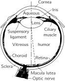
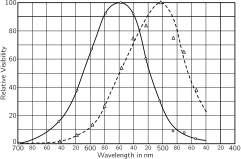
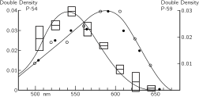

SOURCE: Feynman Lectures on Physics, Volume I, Chapter 35
LANGUAGE: ru
TITLE: Глава 35. Цветовое зрение
SOURCE_URL: https://www.feynmanlectures.caltech.edu/I_35.html
NOTEBOOKLM_USE: clean lecture text with TeX math and figure captions; reader navigation removed.

# Глава 35. Цветовое зрение

(Конспекта этой лекции не было.)

## 35–1 Человеческий глаз

Явление цвета отчасти зависит от физического мира. Мы обсуждаем цвета мыльных пленок и тому подобное как возникающие в результате интерференции. Но, конечно, это также зависит от глаза или от того, что происходит позади глаза, в мозгу. Физика характеризует свет, попадающий в глаз, но после этого наши ощущения являются результатом фотохимических и нервных процессов и психологических реакций.

С восприятием света связано множество интересных явлений, в которых тесно переплетаются и физические, и физиологические процессы, так что познавание явлений природы, воспринимаемых через зрение, выходит за рамки физики как таковой. Мы не станем извиняться за то, что собираемся несколько вторгнуться в другие области науки, потому что, как мы уже подчеркивали, науки разделены не естественным путем, а лишь из соображений удобства. Природа вовсе не заинтересована в подобном разделении, и многие интересные явления лежат именно на стыке разных областей науки.

В гл. 3 мы в общих чертах говорили о связях физики с другими науками; теперь мы хотим более подробно исследовать ту область явлений, где физика и другие науки исключительно тесно связаны между собой. Эта область — восприятие света, зрение. Особое внимание мы уделим цветовому зрению. В этой главе мы в основном будем говорить о явлениях, связанных со зрением человека; следующая глава будет посвящена физиологическим аспектам зрения как у человека, так и у животных.

Все начинается с глаза; поэтому, чтобы понять, какие явления мы видим, нужны некоторые знания о глазе. В следующей главе мы довольно подробно обсудим, как работают отдельные части глаза и как они связаны с нервной системой. А пока мы лишь кратко опишем, как функционирует глаз (фиг. 35.1).

### Figure Ch35-F1
Caption: Фиг. 35.1. Глаз.
Image: figures/Ch35-F1.svg

Свет входит в глаз через роговицу; мы уже обсуждали, как он преломляется и дает изображение на слое, называемом сетчаткой, в задней части глаза, так что различные части сетчатки получают свет от различных частей внешнего поля зрения. Сетчатка не абсолютно однородна: в центре нашего поля зрения есть место, пятнышко, которым мы пользуемся, когда хотим рассмотреть предмет особенно внимательно, и где острота зрения у нас наибольшая; оно называется центральной ямкой, или желтым пятном. Боковые части глаза, как мы сразу же замечаем из опыта, видят детали рассматриваемого предмета не столь эффективно, как центральный участок. В сетчатке имеется еще один участок, где зрительные нервы, несущие всю информацию, собираются вместе и выходят из глаза; этот участок называется слепым пятном. Сетчатка там не имеет чувствительности, и если, например, закрыть левый глаз и посмотреть перед собой, а затем медленно отодвигать палец (или другой небольшой предмет) из поля зрения, то в каком-то месте поля зрения этот предмет неожиданно исчезнет. Известен пока лишь один случай, когда из этого эффекта была извлечена реальная польза. Один физиолог, показавший действие слепого пятна, стал любимцем при дворе французского короля; на утомительных заседаниях со своими придворными король развлекался, «отрубая им головы»: он смотрел на одного из них и следил, как в это время «исчезала» голова другого.

### Figure Ch35-F2
Caption: Фиг. 35.2. Структура сетчатки (свет входит снизу).
Image: figures/Ch35-F2.svg

На фиг. 35.2 схематически показан разрез сетчатки в увеличенном виде. В различных частях сетчатки структуры неодинаковы. Элементы, преобладающие на периферии сетчатки, называются палочками. Ближе к желтому пятну (центральной ямке) наряду с палочками появляются колбочки. Строение этих клеток мы опишем позже. По мере приближения к желтому пятну число колбочек растет, а в самом желтом пятне нет ничего, кроме колбочек, расположенных очень тесно, так тесно, что они здесь гораздо тоньше, чем в любом другом месте сетчатки. Таким образом, в самом центре поля зрения мы видим с помощью колбочек, а на периферии в восприятии света участвуют палочки. Интересно, что любая чувствительная к свету клетка в сетчатке не связана со зрительным нервом непосредственно, а соединена с другими клетками, которые в свою очередь соединены между собой. Существует несколько типов клеток: одни несут информацию к зрительному нерву, а другие связаны между собой в основном в «горизонтальном» направлении. Всего имеется четыре типа клеток, но мы сейчас не будем об этом говорить подробно, а только подчеркнем основную идею: что световой сигнал уже на этом этапе «продумывается». Иначе говоря, информация, полученная от различных клеток, не сразу поступает в мозг от каждой точки в отдельности, а частично осмысливается в сетчатке путем комбинирования информации от нескольких зрительных рецепторов. Важно понять, что сам глаз выполняет часть функций осмысливания, свойственных головному мозгу.

## 35–35 -2. Цвет зависит от интенсивности

Одно из самых поразительных явлений зрения — это адаптация глаза к темноте. Если мы перейдем из ярко освещенной комнаты в темную, то первое время мы плохо видим, но постепенно предметы проступают все яснее, и в конце концов мы начинаем видеть там, где раньше ничего не могли разглядеть. Если интенсивность света очень мала, то видимые нами предметы не имеют окраски. Известно, что это зрение в темноте осуществляется почти исключительно с помощью палочек, тогда как в условиях яркого света — с помощью колбочек. В результате мы распознаем целый ряд явлений, связанных с передачей функции зрения от палочек и колбочек, действующих совместно, к одним только палочкам.

Существует много ситуаций, когда при большей интенсивности света мы могли бы видеть цвета, и эти вещи показались бы нам очень красивыми. Один из примеров — это то, что в телескоп мы почти всегда видим «черно-белые» изображения слабых туманностей, но У. С. Миллер из обсерваторий Маунт-Вилсон и Паломар проявил терпение и сделал цветные снимки некоторых из этих объектов. Никто никогда по-настоящему не видел этих цветов глазом, но это не искусственные цвета, просто интенсивность света слишком мала, чтобы колбочки наших глаз могли определить цвет. Особенно красивы Кольцевидная и Крабовидная туманности. На снимке Кольцевидной туманности центральная часть окрашена в прекрасный синий цвет и окружена она ярким красным ореолом, а на снимке Крабовидной туманности на фоне голубоватой дымки перемежаются яркие красно-оранжевые нити.

При ярком свете чувствительность палочек, по-видимому, очень мала, но в темноте они постепенно восстанавливают способность видеть свет. Диапазон интенсивностей света, к которым может адаптироваться глаз, превышает миллион к одному. Оказывается, природа осуществляет все это не с помощью клеток одного-единственного типа: она передает эту работу от клеток дневного зрения — колбочек, различающих цвета, к клеткам сумеречного зрения — это палочки. Отсюда возникают интересные следствия: первое — это обесцвечивание предметов (в слабом свете), а второе — различие в относительной яркости двух предметов, окрашенных в разные цвета. Оказывается, палочки видят синий конец спектра лучше, чем колбочки, но зато колбочки видят, например, темно-красный цвет, тогда как палочки его совершенно не могут увидеть. Поэтому для палочек красный цвет — все равно что черный. Если взять два листка бумаги, скажем красный и синий, то в полутьме синий будет казаться ярче красного, хотя при хорошем освещении красный листок гораздо ярче синего. Это совершенно поразительное явление. Если мы в темноте рассматриваем ярко раскрашенную обложку журнала и представляем себе ее расцветку, то на свету все становится совершенно неузнаваемым. Описанное выше явление называется эффектом Пуркинье.

### Figure Ch35-F3
Caption: Фиг. 35.3. Спектральная чувствительность глаза. Пунктирная кривая — палочки; сплошная кривая — колбочки.
Image: figures/Ch35-F3.svg

На фиг. 35.3 пунктирная кривая изображает чувствительность глаза в темноте, т. е. чувствительность палочек, а сплошная кривая — на свету. Мы видим, что максимум чувствительности палочек лежит в зеленой области, а колбочек — ближе к желтой области. Если страница окрашена в красный цвет (красный цвет — это около \(650\) м \(\mu\) ), мы можем видеть ее при ярком освещении, но в темноте она почти невидима.

Еще одно следствие того, что в темноте действуют палочки и что их нет в центральной ямке, заключается в том, что когда мы смотрим в темноте прямо на предмет, наше зрение не столь остро, как когда мы смотрим в сторону. Слабую звезду или туманность иногда можно разглядеть лучше, если смотреть не прямо на нее, а чуть-чуть в сторону, потому что в самом центре ямки нет чувствительных палочек.

Другое интересное следствие того факта, что число колбочек убывает по мере удаления к периферии поля зрения, заключается в том, что даже при ярком свете цвет пропадает, когда объект уходит далеко в сторону. Проверить это можно так: смотрите в каком-то определенном фиксированном направлении, а ваш приятель пусть заходит сбоку с цветными карточками; попробуйте определить их цвет до того, как они окажутся прямо перед вами. Оказывается, что присутствие карточек замечается гораздо раньше, чем определяется их цвет. При этом опыте желательно заходить со стороны, противоположной слепому пятну, иначе возникнет путаница: сначала вы почти различаете цвет, затем ничего не видите, а затем снова видите его.

Другое интересное явление состоит в том, что периферия сетчатки очень чувствительна к движению. Хотя краем глаза мы видим неважно, но если там проползет какое-нибудь насекомое, а мы этого совсем не ожидали, мы сразу же его заметим. Мы все «устроены» так, чтобы замечать всякое шевеление на краю поля зрения.

## 35–3 Измерение цветовых ощущений

Теперь мы перейдем к колбочковому зрению — зрению при более ярком свете — и обратимся к вопросу, который наиболее характерен для колбочкового зрения, т. е. к цвету. Как известно, белый свет может быть разложен призмой в спектр волн различной длины, которые кажутся нам окрашенными в разные цвета; цвета — это, конечно, зрительные ощущения. Любой источник света может быть проанализирован с помощью дифракционной решетки или призмы, и для него можно определить спектральное распределение, т. е. «количество» света каждой длины волны. В каком-то определенном свете может быть много синего цвета, порядочно красного, совсем мало желтого и т. д. Все это совершенно точно с точки зрения физики, но вопрос состоит в том, каким этот свет покажется нашему глазу? Очевидно, что различные цвета каким-то образом зависят от спектрального распределения света, но задача заключается в том, чтобы найти, какие именно характеристики спектрального распределения вызывают те или иные ощущения. Что нужно сделать, например, чтобы получить зеленый цвет? Все мы знаем, что можно просто взять зеленую часть спектра. Но единственный ли это путь для получения зеленого, оранжевого или любого другого цвета?

Существует ли более чем одно спектральное распределение, вызывающее одно и то же зрительное ощущение? Ответ, безусловно, да. Число зрительных ощущений весьма ограничено (в действительности, как мы вскоре увидим, это просто трехмерное многообразие), тогда как различных кривых, которые мы можем построить для света от различных источников, существует бесконечно много. Теперь нам предстоит обсудить вопрос о том, при каких условиях различные распределения света кажутся глазу совершенно одинаковыми по цвету?

Самый мощный психофизический метод при оценке цвета состоит в использовании глаза в качестве нулевого прибора. То есть мы не пытаемся определить, из чего складывается ощущение зеленого цвета, или измерить, при каких условиях возникает ощущение зеленого, — все это оказывается чрезвычайно сложным. Вместо этого мы изучаем условия, при которых два раздражителя неразличимы. Тогда нам не приходится решать, испытывают ли два человека одинаковые ощущения в различных условиях; требуется лишь выяснить, будут ли два ощущения, одинаковые для одного человека, одинаковыми и для другого. Нам не нужно решать, совпадает ли то внутреннее чувство, которое испытывает один человек, глядя на зеленый цвет, с тем, что чувствует другой, когда он видит зеленый цвет; об этом мы ничего не знаем.

Чтобы проиллюстрировать эти возможности, мы можем использовать четыре фонаря с фильтрами, яркость которых можно плавно регулировать в широких пределах: один снабжен красным фильтром и дает красное пятно на экране, у следующего зеленый фильтр, и он дает зеленое пятно, у третьего синий фильтр, а четвертый дает белый круг с черным пятном посредине. Если мы теперь включим красный свет, а рядом с ним направим зеленый, то увидим, что в области их перекрытия возникает ощущение цвета, который мы назовем вовсе не красно-зеленым, а совершенно новым, в данном случае желтым. Меняя соотношение красного и зеленого, можно получить самые разные оттенки оранжевого и т. д. Если мы настроимся на определенный желтый цвет, мы сможем получить тот же самый желтый цвет не смешиванием этих двух цветов, а смешиванием каких-то других, например, света от желтого фильтра с белым светом или как-то иначе, чтобы вызвать то же самое ощущение. Другими словами, получить различные цвета смешиванием света от разных фильтров можно не одним, а несколькими путями.

То, что мы только что обнаружили, можно выразить аналитически следующим образом. Конкретный желтый цвет, например, можно представить определенным символом \(Y\) , который является «суммой» некоторого количества света, прошедшего через красный фильтр ( \(R\) ), и света, прошедшего через зеленый фильтр ( \(G\) ). Используя два числа, скажем \(r\) и \(g\) , для описания яркости \(R\) и \(G\) , мы можем записать формулу для этого желтого цвета:
\[
\begin{equation}
\label{Eq:I:35:1}
Y = rR + gG.
\end{equation}
\]
. Вопрос состоит в том, можем ли мы получить всевозможные цвета, складывая два или три пучка света различных фиксированных цветов? Посмотрим, что можно сделать в этой связи. Мы, конечно, не сможем получить все цвета, смешивая только красный и зеленый, потому что, например, синий цвет в такой смеси никогда не появится. Однако, добавив немного синего, можно сделать так, чтобы центральная область, где перекрываются все три пятна, выглядела вполне белой. Смешивая различные цвета и наблюдая за этой центральной областью, мы обнаружим, что за счет изменения пропорций в ней можно получить весьма широкий диапазон цветов, и поэтому не исключено, что все цвета можно получить путем смешивания этих трех цветных пучков света. Мы обсудим, в какой мере это верно; на самом деле это в основном правильно, и вскоре мы увидим, как точнее сформулировать это утверждение.

Чтобы проиллюстрировать наше утверждение, сдвинем пятна на экране так, чтобы они наложились друг на друга, а затем попытаемся воспроизвести цвет, возникающий в кольце, освещаемом четвертым фонарем. То, что раньше казалось нам «белым» светом четвертого фонаря, теперь выглядит желтоватым. Мы попытаемся подобрать этот цвет, регулируя яркость красного, зеленого и синего фонарей (просто методом проб и ошибок), и увидим, что нам удастся довольно близко подойти к этому специфическому оттенку «кремового» цвета. Теперь уже нетрудно поверить, что мы можем получить любой цвет. Через минуту мы попробуем получить желтый цвет, но сначала поговорим о цвете, который получить, пожалуй, труднее всего. Люди, демонстрирующие опыты с цветом, обычно показывают все «яркие» цвета, но никогда не воспроизводят коричневый цвет; да и вообще трудно припомнить, видел ли кто-нибудь когда-нибудь коричневый свет. На самом деле этот цвет никогда не используется для сценических эффектов, никто никогда не видел прожектора, светящего коричневым светом. Поэтому можно подумать, что коричневый свет вообще невозможно получить. Чтобы выяснить, так ли это, заметим прежде всего, что коричневый цвет — это просто цвет, который мы не привыкли видеть без окружающего его фона. На самом деле его можно получить, смешав красный и желтый цвета. Чтобы убедиться, что на экране действительно получился коричневый цвет, достаточно увеличить яркость окружающего фона, на котором расположено цветовое пятно, и вы увидите пятно того самого цвета, который мы называем коричневым! Коричневый цвет всегда выглядит темным на фоне более светлого окружения. Легко получить коричневый цвет самых разных оттенков. Например, если уменьшить долю желтого света, возникнет красновато-коричневый цвет с шоколадным оттенком, а если добавить зеленый, получится ужасный цвет военного обмундирования, принятый в армии. Но сам по себе свет, создающий этот цвет, не так уж страшен — он просто желтовато-зеленый цвет, который рассматривается на светлом фоне.

Теперь мы поставим перед четвертым фонарем желтый светофильтр и попробуем путем смешивания подобрать такой же желтый цвет. (Яркость четвертого фонаря должна находиться в пределах яркости первых трех, иначе мы не сумеем создать смешанный цвет точно такой же яркости.) Оказывается, мы можем получить желтый цвет; достаточно только смешать зеленый и красный, а для оттенка добавить немного синего. После этого уже нетрудно поверить, что при соответствующих условиях можно в точности подобрать любой заданный цвет.

Теперь обсудим законы смешения цветов. Во-первых, мы обнаружили, что различные спектральные распределения могут создавать один и тот же цвет; далее мы увидели, что «любой» цвет может быть получен путем сложения трех особых цветов — красного, синего и зеленого. Интересное свойство смеси цветов состоит в следующем: пусть задан свет определенного состава, назовем его \(X\) , который на глаз неотличим от другого света \(Y\) (они могут иметь разные спектральные распределения, но зрительно кажутся одинаковыми); назовем эти цвета «одинаковыми» в том смысле, что глаз видит их как одинаковые, и запишем
\[
\begin{equation}
\label{Eq:I:35:2}
X=Y.
\end{equation}
\]
. Один из основных законов цвета выражается так: если два спектральных распределения неразличимы на глаз, и мы добавим к каждому из них определенный свет, скажем \(Z\) (запись \(X + Z\) означает, что оба пучка света падают на одно и то же место экрана), а затем возьмем \(Y\) и добавим к нему то же самое количество того же другого света \(Z\) , то новые смеси будут по-прежнему неразличимы:
\[
\begin{equation}
\label{Eq:I:35:3}
X+Z=Y+Z.
\end{equation}
\]
. Мы только что смогли подобрать два одинаковых желтых цвета; если теперь осветить всю картину розовым светом, то они по-прежнему останутся одинаковыми. Итак, добавление любого другого света к совпадающим цветам сохраняет их совпадение. Обобщая все эти цветовые явления, можно сказать и по-другому: если цвета двух расположенных рядом друг с другом лучей света в одних условиях выглядят одинаковыми, то при любых смешениях они останутся одинаковыми и один луч может быть заменен другим при любом смешении цветов. Важным и интересным оказывается также то обстоятельство, что совпадение цветов не зависит от свойств зрения в момент наблюдения; известно, что если долго смотреть на яркую красную поверхность или яркий красный свет, а затем взглянуть на белый лист бумаги, то он покажется зеленоватым и другие цвета также будут восприниматься с искажениями (из-за того, что мы долго перед этим смотрели на ярко-красный цвет). Пусть мы добились совпадения двух желтых цветов, а затем долго смотрели на яркий красный цвет; повернувшись снова к желтым пятнам, мы обнаружим, что они уже не кажутся нам больше желтыми (какими именно они будут казаться — я не знаю, но только не желтыми). Тем не менее желтые цвета по-прежнему будут казаться одинаковыми, и, таким образом, по мере адаптации глаза к различным уровням интенсивности совпадение цветов все еще сохраняется, за очевидным исключением случая, когда мы переходим в область столь малой интенсивности света, что зрение переключается с колбочек на палочки; тогда совпадение цветов перестает быть таковым, поскольку мы используем совсем другую систему.

Второй закон смешения цветов состоит в следующем: любой цвет может быть получен смешением трех разных цветов — в нашем случае красного, зеленого и синего. Подходящим образом смешивая эти три цвета, мы можем получить абсолютно любой цвет, как мы уже продемонстрировали на двух примерах. Описанные выше законы, кроме того, очень интересны с математической точки зрения. Для тех, кого интересует математическая сторона вопроса, дело обстоит следующим образом. Предположим, что мы возьмем три наших цвета — красный, зеленый и синий, но обозначим их \(A\) , \(B\) и \(C\) и назовем их основными цветами. Тогда любой цвет может быть получен с помощью определенных количеств этих трех цветов: например, количество \(a\) цвета \(A\) , количество \(b\) цвета \(B\) и количество \(c\) цвета \(C\) образуют \(X\) :
\[
\begin{equation}
\label{Eq:I:35:4}
X=aA+bB+cC.
\end{equation}
\]
Предположим теперь, что другой цвет \(Y\) составляется из тех же трех цветов:
\[
\begin{equation}
\label{Eq:I:35:5}
Y=a'A+b'B+c'C.
\end{equation}
\]
Тогда оказывается, что смесь этих двух цветов (это одно из следствий законов, о которых мы уже упоминали) получается сложением компонентов \(X\) и \(Y\) :
\[
\begin{gather}
\label{Eq:I:35:6}
Z=X+Y\\[.5ex]
=(a+a')A+(b+b')B+(c+c')C.\notag
\end{gather}
\]
Это очень напоминает математическое правило сложения векторов, где \((a,b,c)\) — компоненты одного вектора, \((a',b',c')\) — компоненты другого, а новый свет \(Z\) представляет собой «сумму» этих векторов. Этот вопрос всегда привлекал к себе внимание физиков и математиков. В частности, Шрёдингер написал замечательную работу о цветовом зрении, в которой он развил теорию «векторного анализа» в применении к смеси цветов. 1

Возникает вопрос: как нужно выбрать основные цвета? В самом деле, никакого единственно правильного выбора основных цветов для смешивания света нет. С практической точки зрения, возможно, существуют три краски, которые более полезны, чем другие, для получения большего разнообразия смешанных пигментов, но мы не будем сейчас на этом останавливаться. Любые три по-разному окрашенных пучка света всегда могут быть смешаны в нужной пропорции, чтобы получить какой угодно другой цвет. Возможно ли показать на опыте действие этого удивительного, фантастического правила? Вместо красного, зеленого и синего будем использовать в нашем проекторе красный, синий и желтый свет. Сможем ли мы с помощью красного, синего и желтого получить, скажем, зеленый?

Смешивая эти три новых цвета в разных пропорциях, мы получаем целый спектр разных цветов. Но после целого ряда проб и ошибок мы убеждаемся, что ничего похожего на зеленый цвет получить не удается. А можем ли мы вообще образовать зеленый цвет? Да, можем. Но каким образом? Проецируя красный свет на зеленое пятно, мы можем затем подобрать точно такой же цвет путем смешения желтого и синего! Таким путем мы составляем две комбинации одного цвета, правда, немного сжульничав, так как поместили красный в другую комбинацию. Но поскольку мы уже умеем разбираться в математических ухищрениях, то прекрасно понимаем, что вместо доказательства возможности составления \(X\) из трех других цветов, например желтого, красного и голубого, мы установили, что красный плюс \(X\) могут быть сделаны из желтого и голубого. Перенесем теперь красный цвет в другую часть равенства и будем интерпретировать его как отрицательную величину. Следовательно, в уравнениях типа (35.4) возможны как положительные, так и отрицательные значения коэффициентов, причем отрицательным величинам придается такой смысл, что их следует перенести в другую часть равенства со знаком плюс, тогда каждый цвет может быть действительно составлен из любых трех, и говорить о каком-то «правильном» выборе основных цветов бессмысленно.

Возникает вопрос, всегда ли при составлении смеси любого цвета входят три основных цвета с положительными коэффициентами? Нет, не всегда. Для каждой тройки основных цветов имеются цвета, для которых в смеси появляется отрицательный коэффициент, и поэтому однозначного способа выбора основной тройки не существует. В популярных книжках красный, зеленый и синий обычно называют основными цветами, но это объясняется только тем, что с их помощью можно создать более широкий набор цветов при положительных значениях коэффициентов в комбинации основных.

## 35–4 Диаграмма цветности

### Figure Ch35-F4
Caption: Фиг. 35.4. Стандартная диаграмма цветности.
Image: figures/Ch35-F4.svg

Рассмотрим теперь смешивание цветов с математической точки зрения как некое геометрическое построение. Если какой-либо цвет описывается уравнением (35.4), мы можем представить его в виде вектора в пространстве, отложив по трем осям величины \(a\) , \(b\) и \(c\) , и тогда данному цвету будет соответствовать точка. Если другой цвет равен \(a'\) , \(b'\) , \(c'\) , то он расположен в другом месте. Сумма этих двух цветов, как мы знаем, есть цвет, который получается их векторным суммированием. Мы можем упростить эту диаграмму и изобразить все на плоскости, если воспользуемся следующим наблюдением: если бы мы имели свет определенного цвета и просто удвоили \(a\) , \(b\) и \(c\) , то есть если мы все их увеличим в одном и том же отношении, то получится тот же самый цвет, но более яркий. Поэтому, если мы договоримся приводить любой свет к одной и той же интенсивности, то мы сможем спроектировать все на плоскость, как это и сделано на фиг. 35.4. Отсюда следует, что любой цвет, полученный смешением двух заданных цветов в некоторой пропорции, будет лежать где-то на линии, соединяющей эти две точки. Например, смесь, составленная в равных пропорциях (пятьдесят на пятьдесят), будет находиться посередине между ними, а смесь из \(1/4\) одного цвета и \(3/4\) другого будет находиться на расстоянии \(1/4\) пути от одной точки к другой и т. д. Если в качестве основных цветов использовать синий, зеленый и красный, мы увидим, что все цвета, которые мы можем получить с положительными коэффициентами, лежат внутри пунктирного треугольника. Он содержит почти все цвета, которые мы вообще способны видеть, поскольку все цвета, которые мы можем видеть, заключены внутри области довольно странной формы, ограниченной кривой. Откуда взялась эта область? Когда-то кто-то весьма тщательно сопоставил все видимые нами цвета с тремя особыми цветами. Но нам не нужно проверять все цвета, которые мы видим, достаточно лишь проверить чистые спектральные цвета, линии спектра. Любой свет можно рассматривать как сумму различных положительных количеств различных чистых спектральных цветов — чистых с физической точки зрения. Данный свет будет содержать определенное количество красного, желтого, синего и так далее — спектральных цветов. Поэтому, если мы знаем, какое количество каждого из трех выбранных основных цветов необходимо для получения каждого из этих чистых компонентов, мы можем вычислить, сколько каждого из них требуется для получения нашего заданного цвета. Таким образом, если мы найдем цветовые коэффициенты всех спектральных цветов для любых трех заданных основных цветов, мы сможем составить полную таблицу смешения цветов.

### Figure Ch35-F5
Caption: Фиг. 35.5. Цветовые коэффициенты чистых спектральных тонов для некоторого выбора основных цветов.
Image: figures/Ch35-F5.svg

В качестве примера на фиг. 35.5 приведены опытные данные по смешению трех цветов. Кривые показывают количество каждого из трех основных цветов (красного, зеленого, синего), образующих при смешении любой из цветов спектра. Красный цвет расположен на левом конце спектра, следом идет желтый цвет и т. д. до синего цвета, расположенного на правом краю. Заметьте, что в некоторых случаях необходимо брать отрицательные коэффициенты. Именно из таких данных и можно определить положение всех цветов на диаграмме, где координаты \(x\) и \(y\) связаны с количествами различных используемых основных цветов. Отсюда же была найдена и граничная кривая диаграммы. Она представляет собой геометрическое место всех чистых спектральных тонов. Но каждый цвет может быть получен смешением спектральных тонов, поэтому любой цвет на линии, соединяющей две произвольные точки кривой, существует в природе. На диаграмме прямая соединяет крайний фиолетовый и далекий красный концы спектра. На ней расположены пурпурные цвета. Внутри кривой находятся те цвета, которые могут быть получены с помощью света, а цвета вне кривой вообще не могут быть созданы светом, и никто их никогда не видел (разве только, быть может, в виде последовательных образов!).

## 35–5 Механизм цветового зрения

Следующий вопрос: почему цвета ведут себя таким образом? Простейшая теория, предложенная Юнгом и Гельмгольцем, предполагает, что в глазу есть три различных пигмента, воспринимающих свет, и что у них разные спектры поглощения, так что один пигмент сильно поглощает, скажем, в красной области, другой — в синей, а третий — в зеленой. Поэтому, когда свет падает на них, мы получаем различные степени поглощения в этих трех областях, и эти три части информации как-то обрабатываются в мозгу, или в глазу, или еще где-то, чтобы определить, какой это цвет. Легко показать, что все правила смешения цветов вытекают из этого предположения. По этому поводу возникли серьезные разногласия, потому что следующая проблема, конечно, состоит в том, чтобы найти характеристики поглощения каждого из трех пигментов. К несчастью, оказывается, что из-за возможности преобразовывать цветовые координаты любым желаемым способом, с помощью опытов по смешению цветов можно найти лишь всевозможные линейные комбинации кривых поглощения, но не кривые для отдельных пигментов. Пробовали использовать самые разные пути для получения конкретной кривой, описывающей то или иное физическое свойство глаза. Одна из таких кривых называется кривой яркости; она приведена на фиг. 35.3. На этом рисунке показаны две кривые: одна для глаза, адаптированного к темноте, другая — для глаза на свету (последняя представляет собой кривую яркости для колбочкового зрения). Она измеряется нахождением наименьшего количества цветного света, которое необходимо для того, чтобы его едва можно было различить. Это характеризует чувствительность глаза в различных спектральных областях. Существует другой, очень интересный способ измерения этой величины. Если взять два цвета и попеременно показывать их на одном участке, то при слишком низкой частоте мы увидим мелькание. Однако с увеличением частоты мелькание в конце концов исчезнет при некоторой частоте, зависящей от яркости света, скажем при \(16\) повторениях в секунду. Теперь, если настроить яркость или интенсивность одного цвета относительно другого, наступает такая интенсивность, при которой мелькание при 16 циклах исчезает. Чтобы получить мелькание при так настроенной яркости, нам придется перейти к гораздо более низкой частоте, чтобы увидеть мелькание цвета. Следовательно, при большей частоте мы получаем так называемое мелькание яркости, а при меньших частотах — мелькание цвета. С помощью такого метода мельканий удается подобрать два цвета с «одинаковой яркостью». Получающиеся отсюда результаты почти, но не совсем аналогичны данным по пороговой чувствительности глаза к слабому свету, наблюдаемому с помощью колбочек. Большинство исследователей используют метод мельканий для определения кривой яркости.

Итак, если глаз содержит три рода цветочувствительного пигмента, то задача заключается в определении формы спектра поглощения для каждого из них. Как? Известно, что встречаются люди, не различающие цветов, — 8% мужского населения и 0,5% женского. Большинство людей с цветовой слепотой или отклонениями в цветовом зрении обладают иной степенью чувствительности к изменению цвета, чем другие, но им все же требуются три цвета для подбора смеси. Есть, однако, и такие люди (их называют дихроматами), для которых любой цвет может быть получен с помощью всего двух основных цветов. Естественно предположить, что у них отсутствует один из трех пигментов. Если бы мы могли найти три типа дихроматов, для которых правила смешения цветов различны, то у одного типа должна была бы отсутствовать красная пигментация, у другого — зеленая, а у третьего — синяя. Измерив все эти типы, мы можем определить эти три кривые! Оказывается, существует три типа дихроматической слепоты: два обычных типа и третий, крайне редкий, и на основе исследования этих трех типов удалось установить спектры поглощения пигментов.

### Figure Ch35-F6
Caption: Фиг. 35.6. Смешение цветов у дейтеранопов.
Image: figures/Ch35-F6.svg

На фиг. 35.6 показано смешение цветов у людей с определенным типом цветовой слепоты, называемых дейтеранопами. Для него геометрические места точек постоянного цвета — это не точки, а определенные линии, вдоль каждой из которых цвет кажется ему одним и тем же. Если теория о том, что у него отсутствует одна из трех составных частей информации, верна, то все эти линии должны пересекаться в одной точке. Если тщательно провести измерения на этом графике, они действительно прекрасно пересекаются. Очевидно, следовательно, это было сделано математиком и не представляет собой реальных данных! В самом деле, если посмотреть на последнюю работу с реальными данными, оказывается, что на графике на фиг. 35.6 точка схождения всех линий находится не совсем в нужном месте. Используя линии на приведенном выше рисунке, мы не можем найти разумных спектров; нам требуются отрицательное и положительное поглощения в разных областях. Но при использовании новых данных Юстовой оказывается, что каждая из кривых поглощения всюду положительна.

### Figure Ch35-F7
Caption: Фиг. 35.7. Дефект цветового зрения, свойственный протанопам.
Image: figures/Ch35-F7.svg

Фиг. 35.7 иллюстрирует другой дефект цветового зрения, свойственный протанопам, точка схождения для которого лежит вблизи красного конца граничной кривой. Примерно такое же положение точки пересечения получается и из данных Юстовой. Измерения восприятия цвета у людей, страдающих тремя разными дефектами цветового зрения, окончательно установили кривые поглощения для трех пигментов, они приведены на фиг. 35.8. Окончательно ли? Может быть. Остается выяснить еще следующие вопросы: справедлива ли на самом деле теория трех пигментов, проистекают ли дефекты восприятия цвета из-за недостатка пигмента, и, кроме того, непонятно, насколько правильны данные по смешению цвета в случае дефектов зрения. Ряд исследователей получили разные результаты. И вопросы эти пока находятся в стадии изучения.

### Figure Ch35-F8
Caption: Фиг. 35.8. Кривые спектральной чувствительности для рецепторов, воспринимающих три основных цвета.
Image: figures/Ch35-F8.svg

## 35–6 Физико-химические свойства цветового зрения

Что можно сказать о сравнении полученных кривых с настоящими пигментами глаза? Пигменты, которые можно получить из сетчатки, состоят в основном из пигмента, называемого зрительным пурпуром. Самые примечательные свойства его заключаются, во-первых, в том, что он присутствует в глазах почти всех позвоночных животных, и, во-вторых, в том, что его кривая чувствительности отлично согласуется с чувствительностью глаза, как это видно на фиг. 35.9, где в одном масштабе построены поглощение зрительного пурпура и чувствительность адаптированного к темноте глаза. Очевидно, именно с помощью этого пигмента мы видим в темноте: зрительный пурпур представляет собой пигмент палочек и никакого отношения к цветовому зрению не имеет. Этот факт был открыт в 1877 г. Даже сегодня можно сказать, что цветовые пигменты колбочек ни разу не были получены в пробирке. В 1958 г. еще можно было утверждать, что цветовые пигменты вообще никто никогда не видел. Но с тех пор два из них были обнаружены Раштоном с помощью очень простого и красивого метода.

### Figure Ch35-F9
Caption: Фиг. 35.9. Кривая чувствительности глаза при сумеречном зрении и кривая поглощения зрительного пурпура.
Image: figures/Ch35-F9.svg

Трудность, по-видимому, заключается в том, что глаз гораздо менее чувствителен к яркому свету, чем к свету малой интенсивности и, следовательно, для зрения требуется много пурпура, но относительно мало пигмента, восприимчивого к цвету. Замысел Раштона состоял в том, чтобы пигмент оставить в глазе и там как-то определить его свойства. Конкретно он сделал следующее. Есть такой прибор — офтальмоскоп, который позволяет послать луч света в глаз через хрусталик и сфокусировать отраженный глазом свет. С помощью этого прибора можно измерить количество отраженного света. В результате получают коэффициент отражения для света, дважды прошедшего через пигмент (свет отражается задними слоями глазного яблока и снова проходит через пигмент колбочек). В природе не часто бывает так здорово устроено. Колбочки устроены так хитро, что попадающий в них свет многократно отражается и постепенно доходит до маленьких чувствительных точек в вершинах колбочек. Попав прямо в чувствительную точку, свет отражается и выходит обратно, проделав значительный участок пути в светочувствительном пигменте. Кроме того, если направить луч в желтое пятно, где нет палочек, можно избежать побочного действия зрительного пурпура. Цвет сетчатки наблюдали уже давно, он имеет оранжево-розоватый оттенок; но сюда примешивается также цвет кровеносных сосудов и цвет задней стенки глаза и т. д. Как узнать, когда в офтальмоскопе виден сам пигмент? Ответ: сначала нужно найти человека с дефектом цветового зрения, у которого пигментов меньше и, следовательно, на котором легче провести анализ. Во-вторых, многие пигменты, в частности зрительный пурпур, обесцвечиваются на свету и теряют свою интенсивность; при освещении их концентрация меняется. Поэтому при измерении спектра поглощения глаза Раштон освещал весь глаз другим пучком, меняющим концентрацию пигмента, и измерял изменение спектра, на котором уже не сказывается отражение от сосудов, задней стенки глаза и т. д., и таким путем Раштону удалось получить кривую для пигмента в глазе протанопа, которая приведена на фиг. 35.10.

### Figure Ch35-F10
Caption: Фиг. 35.10. Спектр поглощения цветового пигмента протанопа (квадратики) и нормального глаза (точки).
Image: figures/Ch35-F10.svg

Вторая кривая на фиг. 35.10 получена при исследовании нормального глаза следующим методом: после предварительного изучения нормального глаза и определения, к каким лучам чувствителен данный пигмент, другой пигмент обесцвечивался красным светом, к которому первый пигмент нечувствителен. Красный свет не воздействует на глаз протанопа, а нормальный глаз к этому свету чувствителен: таким способом можно получить кривую для отсутствующего пигмента. Форма одной кривой прекрасно согласуется с кривой Юстовой для зеленого пигмента, но другая кривая, красная, несколько смещена. Можно думать поэтому, что мы находимся на правильном пути. А может быть, и нет — последние данные, полученные при исследовании дейтеранопов, не указывают на отсутствие какого-то определенного пигмента.

Явление цвета не относится к физике света как таковой. Цвет есть ощущение, а ощущение разных цветов в различных условиях различно. Если, например, взять розовый свет, полученный при сложении пучков белого и красного света (из красного и белого может, очевидно, получиться только розовый цвет), то в сравнении с ним белый свет может показаться голубым. Предмет, поставленный на пути лучей, отбрасывает две тени — одна из них освещается только белым, а другая — только красным светом. Для большинства людей «белая» тень кажется голубой, но, если увеличить область тени, пока она не закроет весь экран, мы неожиданно увидим белый, а не голубой цвет! Подобные эффекты можно получить и при смешивании красного, белого и желтого света. Эта смесь может дать только оранжево-желтый цвет с разными оттенками. Смешав эти цвета в равных количествах, мы получим только оранжевый цвет. Тем не менее, рассматривая тени, на которые накладываются лучи в разных комбинациях, можно увидеть набор очень красивых цветов, отсутствующих в самом свете (поскольку в нем есть только оранжевые лучи), но возникающих в наших ощущениях. Мы ясно видим разнообразные цвета, совсем непохожие на «физические» цвета, присутствующие в самих лучах света. Важно помнить, что сетчатка сама «осмысливает» свет; она, хотя и бессознательно, сравнивает то, что видит в одной области, с тем, что видит в другой. А что нам известно о том, как это происходит, будет рассказано в следующей главе.

Комитет по колориметрии Оптического общества Америки, «Наука о цвете», Томас И. Кроуэлл Компани, Нью-Йорк, 1953. Хехт С., Шлер С., Пиренн М. Х., «Энергия, кванты и зрение», *Journal of General Physiology*, 1942, 25, 819–840. Морган Клиффорд, Стеллар Элиот, «Физиологическая психология», 2-е изд., McGraw-Hill Book Company, Inc., 1950. Нюберг Н. Д., Юстова Е. Н., «Исследования дихроматического зрения и спектральной чувствительности приемников трихроматов», доклад на симпозиуме № 8 «Проблемы цветового зрения», т. II, Национальная физическая лаборатория, Теддингтон, Англия, сентябрь 1957 г. Опубликовано Канцелярией Ее Величества, Лондон, 1958 г. Раштон У. А., «Колбочковые пигменты центральной ямки человека при цветовой слепоте и в норме», доклад на симпозиуме № 8 «Проблемы цветового зрения», т. I, Национальная физическая лаборатория, Теддингтон, Англия, сентябрь 1957 г. Опубликовано Канцелярией Ее Величества, Лондон, 1958 г. Вудвортс Роберт С., «Экспериментальная психология», Henry Holt and Company, Нью-Йорк, 1938. Пересмотренное издание 1954 г., Роберт С. Вудвортс и Г. Шлосберг.
