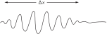
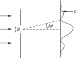
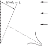
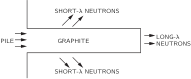
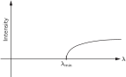

SOURCE: Feynman Lectures on Physics, Volume I, Chapter 38
LANGUAGE: ru
TITLE: Глава 38. Соотношение между волновой и корпускулярной точками зрения
SOURCE_URL: https://www.feynmanlectures.caltech.edu/I_38.html
NOTEBOOKLM_USE: clean lecture text with TeX math and figure captions; reader navigation removed.

# Глава 38. Соотношение между волновой и корпускулярной точками зрения

## 38–1 Волны амплитуды вероятности

В этой главе мы с вами обсудим соотношение между волновой и корпускулярной точками зрения. Из предыдущей главы мы уже знаем, что ни та, ни другая неверны. Обычно мы всегда старались формулировать понятия аккуратно или по крайней мере достаточно точно, чтобы при дальнейшем изучении их не пришлось бы менять. Разрешалось их расширять, обобщать, но уже никак не менять! Но как только мы пытаемся говорить об электроне как волне или об электроне как частице, то любая из этих точек зрения рано или поздно меняется, ведь обе они приблизительны. Поэтому все, что мы изучим в этой главе, в каком-то смысле неправильно; будут высказаны некие полуинтуитивные соображения, которым со временем предстоит уточняться, и кое-что придется слегка изменить, когда мы их уточним с помощью квантовой механики. Причина в том, что, не собираясь сейчас штудировать квантовую механику по всем правилам, мы хотим получить по крайней мере представление о характере эффектов, которые мы там обнаружим. Да и к тому же весь наш опыт относится либо к волнам, либо к частицам, и поэтому весьма удобно использовать то те, то другие представления, чтобы добиться некоторого понимания того, что произойдет в определенных обстоятельствах, пока мы еще не знаем всей математики квантовомеханических амплитуд. По мере нашего продвижения вперед мы будем стараться прояснять самые слабые места. Впрочем, многие из этих мест почти верны, все дело просто в толковании.

Прежде всего мы знаем, что новый способ представления мира в квантовой механике — новая система мира — состоит в том, чтобы задавать амплитуду любого события, которое может произойти, и если это событие состоит в регистрации одной частицы, то мы можем задать амплитуду обнаружения этой частицы в различных местах и в разное время. Вероятность обнаружить частицу тогда пропорциональна квадрату абсолютной величины амплитуды. Вообще говоря, амплитада обнаружения частицы в различных местах и в разное время меняется в зависимости от положения и времени.

В частном случае амплитуда изменяется синусоидально в пространстве и времени по закону \(e^{i(\omega t - \FLPk\cdot\FLPr)}\) (не забывайте, что эти амплитуды — комплексные числа, а не действительные) и содержит определенную частоту \(\omega\) и волновое число \(\FLPk\) . Тогда оказывается, что это соответствует предельной классической ситуации, когда мы считали бы, что имеем частицу, энергия \(E\) которой известна и связана с частотой соотношением
\[
\begin{equation}
\label{Eq:I:38:1}
E=\hbar\omega,
\end{equation}
\]
, а импульс \(\FLPp\) также известен и связан с волновым числом формулой
\[
\begin{equation}
\label{Eq:I:38:2}
\FLPp=\hbar\FLPk.
\end{equation}
\]

Это означает, что понятие частицы ограниченно. Само понятие частицы, понятие ее положения, ее импульса и т. д., которым мы так часто пользуемся, в некотором смысле не является удовлетворительным. Например, если амплитуда обнаружения частицы в различных местах дается функцией \(e^{i(\omega t -
\FLPk\cdot\FLPr)}\) , квадрат абсолютной величины которой постоянен, это означает, что вероятность обнаружить частицу одинакова для любой точки. Это значит, что мы не знаем, где она находится — она может оказаться где угодно, — ее положение в высшей степени неопределенно.

Когда же положение частицы более или менее известно, когда оно может быть предсказано довольно точно, то вероятность обнаружить ее в различных местах должна быть сосредоточена в определенной области, длину которой мы назовем \(\Delta x\) . Вне этой области вероятность равна нулю. Вероятность — это квадрат абсолютной величины амплитуды, и если этот квадрат равен нулю, то и амплитуда равна нулю, так что мы имеем цуг волн протяженностью \(\Delta x\) (фиг. 38.1), а длина волны (расстояние между горбами волн в цуге) — это то, что соответствует импульсу частицы.

### Figure Ch38-F1
Caption: Фиг. 38.1. Волновой пакет длиной \(\Delta x\) .
Image: figures/Ch38-F1.svg

Здесь мы сталкиваемся со странным и в то же время очень простым явлением, никак непосредственно с квантовой механикой не связанным. Оно известно всем, кто занимался волнами, даже не зная квантовой механики, а именно: нельзя однозначно определить длину волны для короткого цуга волн. У такого цуга нет определенной длины волн; в волновом числе имеется неопределенность, связанная с конечной длиной цуга, а значит, и неопределенность в импульсе.

## 38–2 Измерение положения и импульса

Рассмотрим два примера этой идеи, чтобы понять, почему возникает неопределенность в положении и (или) в импульсе, если квантовая механика верна. Мы уже видели раньше, что если бы этого не было — если бы можно было параллельно измерять и местонахождение, и импульс чего бы то ни было, — то возник бы парадокс. К счастью, парадокса не возникает, а то обстоятельство, что неопределенность естественным образом вытекает из волновой картины, свидетельствует, что все здесь взаимосвязано.

### Figure Ch38-F2
Caption: Фиг. 38.2. Дифракция частиц, проходящих сквозь щель.
Image: figures/Ch38-F2.svg

Вот пример, показывающий связь между координатой и импульсом в условиях, которые легко себе представить. Предположим, что у нас есть одиночная щель, а частицы приходят издалека с определенной энергией — так что движутся все они практически горизонтально (фиг. 38.2). Сосредоточим наше внимание на вертикальной составляющей импульса. Все эти частицы обладают (скажем, в классическом смысле) определенным горизонтальным импульсом \(p_0\) . Таким образом, в классическом смысле вертикальный импульс \(p_y\) до того, как частица пройдет сквозь отверстие, точно известен. Частица не движется ни вверх, ни вниз, поскольку она пришла от очень удаленного источника, — и поэтому ее вертикальный импульс, конечно же, равен нулю. А теперь предположим, что она проходит через отверстие, ширина которого равна \(B\) . Тогда после того, как она выйдет из отверстия, мы будем знать ее вертикальное положение — координату \(y\) — с хорошей точностью, а именно \(\pm
B\) . 1 То есть неопределенность положения, \(\Delta y\) , имеет порядок \(B\) . Теперь мы, возможно, также захотим сказать (поскольку мы знаем, что импульс абсолютно горизонтален), что \(\Delta p_y\) равен нулю; но это неверно. Прежде мы знали, что импульс горизонтален, но теперь мы этого уже не знаем. Перед тем как частицы прошли сквозь отверстие, мы не знали их вертикального положения. Теперь, когда мы определили вертикальное положение, пропустив частицу через отверстие, мы потеряли информацию о ее вертикальном импульсе! Почему? Согласно волновой теории, после прохождения через щель происходит расплывание, или дифракция, волн, точно так же, как и для света. Поэтому существует определенная вероятность того, что частицы, выходящие из щели, полетят не точно прямо. Вся картина размывается за счет дифракционного эффекта, и угол расхождения, который мы можем определить как угол первого минимума, служит мерой неопределенности конечного угла.

Каким образом происходит расплывание изображения в ширину? Расплывание означает, что существует некая вероятность того, что частица отправится вверх или вниз, т. е. приобретет компоненту импульса, направленную вверх или вниз. Мы говорим о вероятности и о частице, потому что мы можем обнаружить эту дифракционную картину с помощью счетчика частиц, и когда счетчик регистрирует частицу, скажем, в \(C\) на фиг. 38.2, то он регистрирует частицу целиком, так что в классическом смысле частица имеет вертикальный импульс, направляющий ее из щели прямо в \(C\) .

Чтобы примерно представить себе степень расплывания импульса, вертикальный импульс \(p_y\) имеет разброс, равный \(p_0\,\Delta\theta\) , где \(p_0\) — горизонтальный импульс. Чему же равно \(\Delta\theta\) в размазанной картине? Известно, что первый минимум наблюдается при угле \(\Delta\theta\) таком, что волна от одного края щели должна пройти путь на одну длину волны больше, чем волна от другого края (мы об этом уже говорили в гл. 30). Стало быть, \(\Delta\theta\) равно \(\lambda/B\) , и тем самым \(\Delta p_y\) в этом эксперименте равен \(p_0\lambda/B\) . Заметим, что если мы сделаем \(B\) меньше, чтобы точнее измерить положение частицы, то дифракционная картина станет шире. Вспомните: когда мы сужали щели в эксперименте с микроволнами, интенсивность в стороне от щели возрастала. Значит, чем уже щель, тем шире становится картина дифракции, тем правдоподобнее, что мы обнаружим у частицы импульс, направленный в сторону. Таким образом, неопределенность в вертикальном импульсе обратно пропорциональна неопределенности \(y\) . Фактически мы видим, что их произведение равно \(p_0\lambda\) . Но \(\lambda\) — это длина волны, а \(p_0\) — импульс, и в соответствии с квантовой механикой произведение длины волны на импульс — это постоянная Планка \(h\) . Получается, что произведение неопределенностей в вертикальном импульсе и в вертикальном положении имеет порядок величины \(h\) :
\[
\begin{equation}
\label{Eq:I:38:3}
\Delta y\,\Delta p_y\geq\hbar/2.
\end{equation}
\]
Мы не можем приготовить систему, в которой было бы известно вертикальное положение частицы и мы могли бы предсказать ее движение по вертикали с определенностью, большей, чем дает соотношение (38.3). Иными словами, неопределенность в вертикальном импульсе должна превышать \(\hbar/2\Delta y\) , где \(\Delta y\) — неопределенность, с какой мы знаем положение частицы.

Некоторые люди утверждают, что в квантовой механике все неправильно. Когда, говорят они, частица приближалась слева, ее вертикальный импульс был равен нулю. А когда она прошла через щель, стало известно ее положение. И то, и другое может быть определено с любой точностью. Совершенно верно. Мы можем зарегистрировать частицу и определить, каково ее положение и каким должен был быть ее импульс, чтобы она попала туда, куда она попала. Это все верно. Но соотношение неопределенностей (38.3) ничего общего с этим не имеет. Уравнение (38.3) относится к возможности предсказания, а не к замечаниям о том, что произошло в прошлом. Какая польза в том, что мы скажем: «Я знал, каков был импульс до прохода частицы сквозь щель, а теперь узнал к тому же и координату»? Ведь теперь-то знание об импульсе частицы уже утеряно. Раз она прошла сквозь щель, то мы уже не можем больше предсказывать ее вертикальный импульс. Речь идет о теории, способной к предсказаниям, а не об измерениях после того, как все завершилось. Мы и обсуждаем вопрос о том, что можно предвидеть.

Попробуем теперь по-иному подойти к этим вещам. Приведем другой пример того же явления, на этот раз с более подробными количественными оценками. Прежде мы измеряли импульс классическим способом: мы рассматривали направление, скорость, углы и тому подобное; в этом заключался способ получения импульса путем классического анализа. Но раз импульс связан с волновым числом, то в природе существует и другой, совершенно иной путь измерения импульса частиц (все равно, фотона или любой другой), не имеющий классического аналога, потому что в нем используется уравнение (38.2). Мы измеряем длину волны. Давайте попробуем таким способом измерить импульс.

### Figure Ch38-F3
Caption: Фиг. 38.3. Определение импульса с помощью дифракционной решетки.
Image: figures/Ch38-F3.svg

Пусть имеется решетка со множеством линий (фиг. 38.3), на которую направлен пучок частиц. Мы неоднократно рассматривали эту задачу: когда у частиц есть определенный импульс, то вследствие интерференции в некотором направлении возникает очень резкий максимум. Мы также говорили о том, насколько точно можно определить этот импульс, т. е. какова разрешающая сила решетки. Мы не будем заново это все выводить, а сошлемся на гл. 30; там мы выяснили, что относительная неопределенность в длине волны, связанная с данной решеткой, равна \(1/Nm\) , где \(N\) — количество линий решетки, а \(m\) — порядок дифракционного максимума. Иначе говоря,
\[
\begin{equation}
\label{Eq:I:38:4}
\Delta\lambda/\lambda=1/Nm.
\end{equation}
\]

Перепишем теперь формулу (38.4) в виде
\[
\begin{equation}
\label{Eq:I:38:5}
\Delta\lambda/\lambda^2=1/Nm\lambda=1/L,
\end{equation}
\]
где расстояние \(L\) показано на фиг. 38.3. Это — разность двух расстояний: расстояния, которое должна пройти волна (или частица), отразившись от нижней части решетки, и расстояния, которое ей нужно пройти при отражении от верха решетки. Другими словами, волны, образующие дифракционный максимум, — это волны, приходящие от разных частей решетки. Первыми прибывают волны, вышедшие снизу, — это начало цуга волн, а потом следуют дальнейшие части цуга от средних частей решетки, пока не придут волны от верха: точка цуга, удаленная от его начала на расстояние \(L\) . Значит, чтобы получить в спектре резкую линию, отвечающую определенному импульсу [с неопределенностью, даваемой формулой (38.4)], для этого нужен цуг волн длиной не менее \(L\) . Если цуг волн слишком короток, мы не используем всю решетку. Волны, образующие спектр, будут отражаться при этом только от небольшого куска решетки, и решетка не будет хорошо работать — получится сильное размытие по углу. Чтобы его сузить, надо использовать всю ширину решетки так, чтобы хотя бы на одно мгновение весь цуг волн улегся одновременно на решетке и рассеялся ото всех ее частей. Потому-то длина цуга должна быть равна \(L\) ; тогда только неопределенность в длине волны окажется меньше, чем указано формулой (38.5). Заметим, что
\[
\begin{equation}
\label{Eq:I:38:6}
\Delta\lambda/\lambda^2=\Delta(1/\lambda)=\Delta k/2\pi.
\end{equation}
\]
поэтому
\[
\begin{equation}
\label{Eq:I:38:7}
\Delta k = 2\pi/L,
\end{equation}
\]
где \(L\) — длина цуга волн.

Это означает, что когда цуг волн короче \(L\) , то неопределенность в волновом числе превосходит \(2\pi/L\) . Иначе говоря, неопределенность в волновом числе, умноженная на длину волнового цуга (назовем ее на минутку \(\Delta x\) ), больше \(2\pi\) . Мы назвали ее \(\Delta x\) потому, что это как раз неопределенность в положении частицы. Если цуг волн тянется только на конечном промежутке, то лишь там мы и можем обнаружить частицу с неопределенностью \(\Delta
x\) . Это свойство волн (тот факт, что произведение длины цуга волн на неопределенность в волновом числе, связанном с этим цугом, не меньше \(2\pi\) ) опять-таки хорошо знакомо всем, кто занимался волнами. И никакого отношения к волновой механике оно не имеет. Просто нельзя очень точно подсчитать число волн в конечной их веренице. Объяснить это можно и по-другому.

Пусть длина цуга волн \(L\) . Так как на концах цуга волны спадают (как на фиг. 38.1), то количество волн на длине \(L\) известно с точностью порядка \(\pm1\) . Но число волн на длине \(L\) равно \(kL/2\pi\) . Значит, \(k\) неопределенно, и мы опять получаем результат (38.7) как простое свойство всяких волн. Это остается верным всегда: и для волн в пространстве, когда \(k\) есть количество радиан на 1 см, а \(L\) — длина цуга, и для волн во времени, когда \(\omega\) есть число радиан в 1 сек, а \(T\) — «длина» во времени, в течение которой приходит волновой цуг. Иначе говоря, если цуг волн длится только конечное время \(T\) , то неопределенность в частоте дается формулой
\[
\begin{equation}
\label{Eq:I:38:8}
\Delta\omega=2\pi/T.
\end{equation}
\]
Мы все время старались подчеркнуть, что это свойства самих волн, что все это хорошо известно, например в теории звука.

А квантовомеханические применения этих свойств опираются на толкование волнового числа как меры импульса частицы по правилу \(p =
\hbar k\) , так что (38.7) уже утверждает, что \(\Delta
p\approx h/\Delta x\) . Это устанавливает предел классическому представлению об импульсе. (Естественно, оно и должно быть как-то подвергнуто ограничению, если мы собираемся изображать частицы как волны!) И очень хорошо, что мы нашли правило, которое каким-то образом берется указать, где нарушаются классические представления.

## 38–3 Дифракция на кристалле

Теперь рассмотрим отражение волн частиц от кристалла. Кристалл — это объемное тело, содержащее множество одинаковых атомов (некоторые усложнения мы введем позже), расположенных стройными рядами. Вопрос состоит в том, как расположить этот строй, чтобы получить сильный отраженный максимум в данном направлении для данного пучка, скажем, света (рентгеновских лучей), электронов, нейтронов или чего-либо еще. Чтобы получить сильное отражение, рассеяние от всех атомов должно происходить в фазе. Не может быть так, чтобы равное количество волн было в фазе и в противофазе, иначе они погасят друг друга. Для этого нужно найти области постоянной фазы, как мы уже объясняли; это плоскости, образующие равные углы с начальным и конечным направлениями (фиг. 38.4).

### Figure Ch38-F4
Caption: Фиг. 38.4. Рассеяние волн плоскостями кристалла.
Image: figures/Ch38-F4.svg

Если мы рассмотрим две параллельные плоскости, как на фиг. 38.4, то волны, рассеянные на них, окажутся в фазе только тогда, когда разность расстояний, пройденных фронтом волны, будет равна целому числу длин волн. Эта разность, как легко видеть, равна \(2d\sin\theta\) , где \(d\) — расстояние между плоскостями. Итак, условие когерентного отражения имеет вид
\[
\begin{equation}
\label{Eq:I:38:9}
2d\sin\theta=n\lambda\quad
(n=1,2,\dotsc).
\end{equation}
\]

Если, скажем, кристалл таков, что атомы в нем укладываются на плоскостях, удовлетворяющих условию (38.9) с \(n = 1\) , то будет наблюдаться сильное отражение. Если, с другой стороны, существуют другие атомы той же природы (и расположенные с той же плотностью) как раз посредине между слоями, то на этих промежуточных плоскостях произойдет рассеяние равной силы; оно интерферирует с первым и погасит его. Поэтому \(d\) в выражении (38.9) должно означать расстояние между примыкающими плоскостями; нельзя взять две плоскости, разделенные пятью слоями, и применить к ним эту формулу!

Интересно, что настоящие кристаллы обычно не столь просты, — это не одинаковые атомы, повторяющиеся по определенному закону. Они скорее похожи, если прибегнуть к двумерной аналогии, на обои, на которых повторяется один и тот же сложный узор. Для атомов «узор» — это некоторая их расстановка, куда может входить довольно большое число атомов; скажем, для углекислого кальция — атомов кальция, углерода и трех атомов кислорода и так далее. Важно не то, каков рисунок, а то, что он повторяется. Этот основной рисунок называется ячейкой.

Основной способ повторения определяет то, что мы называем типом решетки; тип решетки можно сразу определить, взглянув на отражения и рассмотрев их симметрию. Другими словами, то, где вообще наблюдаются отражения, определяет тип решетки, но чтобы определить, что находится в каждом из элементов решетки, надо учесть интенсивность рассеяния по различным направлениям. Направления рассеяния зависят от типа решетки, а сила рассеяния определяется тем, что находится внутри каждой ячейки; этим способом и было изучено строение кристаллов.

Две фотографии дифракции рентгеновских лучей даны на фиг. 38.5 и 38.6; они иллюстрируют рассеяние на каменной соли и миоглобине соответственно.

### Figure Ch38-F5
Caption: Фиг. 38.5
Image: figures/Ch38-F5.svg

### Figure Ch38-F6
Caption: Фиг. 38.6
Image: figures/Ch38-F6.svg

Кстати, интересная вещь получается, если расстояние между ближайшими плоскостями меньше \(\lambda/2\) . В этом случае (38.9) не имеет решений для \(n\) . Таким образом, если \(\lambda\) больше удвоенного расстояния между соседними плоскостями, то никакой боковой дифракционной картины не возникает, и свет — или что бы там ни было — проходит прямо сквозь вещество, не отскакивая и не теряясь. Вот почему в случае света, когда \(\lambda\) много больше расстояния между плоскостями, он, конечно, проходит насквозь и никакой картины отражения от плоскостей кристалла не возникает.

### Figure Ch38-F7
Caption: Фиг. 38.7. Диффузия котельных нейтронов сквозь графитовый блок.
Image: figures/Ch38-F7.svg

Этот факт приводит также к интересному следствию для реакторов, в которых рождаются нейтроны (уж они-то, бесспорно, частицы!). Если мы возьмем эти нейтроны и пустим их в длинный графитовый блок, то они будут диффундировать и пробираться вдоль него (фиг. 38.7). Они диффундируют потому, что сталкиваются с атомами, но с точки зрения волновой теории они отскакивают от атомов вследствие дифракции на кристаллических плоскостях. Оказывается, если взять очень длинный кусок графита, то все нейтроны, выходящие с противоположного конца, будут иметь большую длину волны! Действительно, если построить кривую зависимости интенсивности от длины волны, то мы ничего не обнаружим, кроме волн длиннее определенного минимума (фиг. 38.8). Иными словами, таким путем можно получать очень медленные нейтроны. Проходят только самые медленные нейтроны; они не испытывают ни дифракции, ни рассеяния на кристаллических плоскостях графита, а проходят прямо насквозь, как свет сквозь стекло, и не рассеиваются в стороны. Существует и много других доказательств реальности нейтронных волн, как и волн других частиц.

### Figure Ch38-F8
Caption: Фиг. 38.8. Интенсивность нейтронов, выходящих из графитового стержня, в зависимости от длины волны.
Image: figures/Ch38-F8.svg

## 38–4 Размеры атома

Рассмотрим теперь другое применение соотношения неопределенностей (38.3). К этому расчету не следует относиться слишком серьезно; идея правильна, но анализ не очень точен. Идея связана с определением размеров атомов и с тем фактом, что с классической точки зрения электроны должны были бы излучать свет и падать по спирали на ядро, пока не уселись бы прямо на него. Но с квантовомеханической точки зрения это невозможно, поскольку тогда мы знали бы, где находится каждый электрон и с какой скоростью он движется.

Представим себе атом водорода и попробуем измерить положение электрона. Мы не должны иметь возможности точно предсказать, где он окажется, иначе разброс импульсов станет бесконечным. Всякий раз, когда мы смотрим на электрон, он где-то находится, но у него есть амплитуда быть в разных местах, и, следовательно, существует вероятность обнаружить его в различных местах. Эти места не могут все совпадать с ядром; мы предположим, что разброс положений имеет порядок \(a\) . Это означает, что расстояние электрона от ядра обычно равно примерно \(a\) . Мы найдем \(a\) , минимизируя полную энергию атома.

Разброс по импульсам из-за соотношения неопределенностей составляет примерно \(\hbar/a\) , так что если мы попытаемся как-то измерить импульс электрона, скажем, рассеивая на нем рентгеновские лучи и отыскивая эффект Доплера от движущегося рассеивателя, мы должны ожидать, что не будем каждый раз получать нуль (электрон ведь не стоит на месте!), а импульсы должны быть порядка \(p \approx \hbar/a\) . Тогда кинетическая энергия примерно равна \(\tfrac{1}{2}mv^2 = p^2/2m =
\hbar^2/2ma^2\) . (В некотором смысле это своего рода анализ размерностей, позволяющий выяснить, как кинетическая энергия зависит от постоянной Планка, от \(m\) и от размеров атома. Нам не обязательно верить нашему ответу с точностью до таких сомножителей, как \(2\) , \(\pi\) и т. д. Мы ведь даже \(a\) определили не слишком точно.) Потенциальная же энергия равна минус \(e^2\) , деленному на расстояние от центра, скажем \(-e^2/a\) , где, как мы помним, \(e^2\) — это квадрат заряда электрона, деленный на \(4\pi\epsO\) . Суть дела в том, что потенциальная энергия уменьшается при уменьшении \(a\) , но чем меньше \(a\) , тем больший импульс требуется по принципу неопределенности и, следовательно, тем выше кинетическая энергия. Полная энергия равна
\[
\begin{equation}
\label{Eq:I:38:10}
E=\hbar^2/2ma^2-e^2/a.
\end{equation}
\]
. Мы не знаем, чему равно \(a\) , но знаем, что атом устроится так, чтобы найти какой-то компромисс, при котором энергия будет наименьшей. Чтобы минимизировать \(E\) , продифференцируем ее по \(a\) , приравняем производную к нулю и найдем \(a\) . Производная от \(E\) равна
\[
\begin{equation}
\label{Eq:I:38:11}
dE/da=-\hbar^2/ma^3+e^2/a^2,
\end{equation}
\]
, и, положив \(dE/da = 0\) , мы получаем для \(a\) значение
\[
\begin{align}
a_0=\hbar^2/me^2 &=0.529\text{ angstrom},\notag\\[.5ex]
\label{Eq:I:38:12}
&=0.529\times10^{-10}\text{ meter}.
\end{align}
\]
. Это конкретное расстояние называют боровским радиусом, и мы, таким образом, узнали, что размеры атома имеют порядок ангстрема, что правильно. Это очень неплохо; более того, это поразительно, поскольку до сих пор у нас не было никакой основы для понимания размеров атомов! С классической точки зрения существование атомов совершенно невозможно, так как электроны упали бы по спирали на ядро.

Если теперь подставить значение (38.12) для \(a_0\) в (38.10), чтобы найти энергию, то получится
\[
\begin{equation}
\label{Eq:I:38:13}
E_0=-e^2/2a_0=-me^4/2\hbar^2=-13.6\text{ eV}.
\end{equation}
\]
Что означает отрицательная энергия? Это означает, что у электрона в атоме меньше энергии, чем когда он свободен. Это значит, что он связан. Это означает, что для выбивания электрона требуется энергия; для ионизации атома водорода нужна энергия порядка \(13.6\) эВ. У нас нет никаких оснований считать, что она не может быть в два или три раза больше — или в два раза меньше, — или в \((1/\pi)\) раз больше, ведь наши рассуждения были столь нестрогими. Тем не менее мы сплутовали, подобрав все константы так, что в итоге получилось как раз верное число! Это число, \(13.6\) электрон-вольт, называется энергией Ридберга; это энергия ионизации водорода.

Теперь мы понимаем, почему мы не проваливаемся сквозь пол. Когда мы идем, наши ботинки с их массами атомов давят на пол с его массой атомов. Чтобы сжать атомы плотнее, электроны пришлось бы ограничить меньшим пространством, и, согласно принципу неопределенности, их импульсы в среднем должны были бы возрасти, а это означает высокую энергию; сопротивление атомов сжатию — это квантовомеханический эффект, а не классический. С классической точки зрения следовало бы ожидать, что если бы мы сблизили все электроны и протоны, энергия уменьшилась бы еще больше, а наилучшим расположением положительных и отрицательных зарядов в классической физике было бы их нахождение друг на друге. Это было хорошо известно в классической физике и представляло собой загадку ввиду самого существования атома. Конечно, прежние ученые изобретали какие-то выходы из этого затруднения — но неважно, теперь-то у нас есть правильный выход! (Может быть.)

Кстати говоря, хотя у нас сейчас и нет причин понимать это, оказывается, что в ситуации, когда имеется много электронов, они стараются держаться подальше друг от друга. Если один электрон занимает определенное пространство, то другой это же пространство не занимает. Точнее говоря, существуют два состояния спина, так что двое могут усесться друг на друга: один вращается в одну сторону, другой — в другую. Но после этого мы больше не можем поместить туда ни одного. Нам приходится помещать остальные в другие места, и именно в этом кроется истинная причина прочности вещества. Если бы мы могли поместить все электроны в одно и то же место, вещество сжалось бы еще сильнее, чем оно сжимается. Именно тот факт, что электроны не могут все усесться друг на друга, делает столы и все остальное твердым.

Очевидно, для того чтобы понять свойства вещества, нам придется пользоваться квантовой механикой, а не удовлетворяться классической.

## 38–5 Уровни энергии

Мы говорили об атоме в его низшем из возможных энергетических состояний, но оказывается, что электрон может делать и другие вещи. Он может колебаться и метаться более энергично, так что для атома существует много различных возможных движений. Согласно квантовой механике, в стационарном состоянии у атома могут быть только вполне определенные энергии. Мы строим диаграмму (фиг. 38.9), на которой откладываем энергию по вертикали, и проводим горизонтальную линию для каждого разрешенного значения энергии. Когда электрон свободен, т. е. когда его энергия положительна, он может иметь любую энергию; он может двигаться с любой скоростью. Но энергии связанных состояний не произвольны. Атом должен обладать тем или иным значением из набора разрешенных значений, таких, как на фиг. 38.9.

### Figure Ch38-F9
Caption: Фиг. 38.9. Схема уровней энергии атома, показывающая несколько возможных переходов.
Image: figures/Ch38-F9.svg

Обозначим теперь дозволенные значения энергии через \(E_0\) , \(E_1\) , \(E_2\) , \(E_3\) . Если вначале атом находился в одном из этих «возбужденных состояний», \(E_1\) , \(E_2\) и т. д., он не останется в нем навечно. Рано или поздно он перейдет в состояние с меньшей энергией, излучив энергию в виде света. Частота испускаемого света определяется законом сохранения энергии и квантовомеханическим представлением о том, что частота света связана с его энергией соотношением (38.1). Стало быть, частота света, освобождающегося при переходе (к примеру) от уровня с энергией \(E_3\) к уровню с энергией \(E_1\) , равна
\[
\begin{equation}
\label{Eq:I:38:14}
\omega_{31}=(E_3-E_1)/\hbar.
\end{equation}
\]
. Это и есть характеристическая частота атома, определяющая спектральную линию излучения. Другой возможный переход — от \(E_3\) к \(E_0\) . Ему будет отвечать иная частота
\[
\begin{equation}
\label{Eq:I:38:15}
\omega_{30}=(E_3-E_0)/\hbar.
\end{equation}
\]
. Возможен и такой случай: атом, возбужденный до состояния \(E_1\) , может перейти в основное состояние \(E_0\) , испуская фотон с частотой
\[
\begin{equation}
\label{Eq:I:38:16}
\omega_{10}=(E_1-E_0)/\hbar.
\end{equation}
\]
. Мы привели здесь три перехода ради того, чтобы указать на одно интересное соотношение. Из (38.14), (38.15) и (38.16) нетрудно заметить, что
\[
\begin{equation}
\label{Eq:I:38:17}
\omega_{30}=\omega_{31}+\omega_{10}.
\end{equation}
\]
. Вообще, обнаружив две спектральные линии, мы вправе ожидать появления и третьей линии на суммарной частоте (или на их разности), а все эти линии можно понять, найдя такую последовательность уровней, чтобы каждая линия отвечала разности энергий какой-то пары уровней. Это примечательное совпадение спектральных частот было замечено еще до открытия квантовой механики и получило название комбинационного принципа Ритца. Для классической механики это очередная загадка. Мы не будем распространяться о неприменимости классической механики в области атома; кажется, это и так уже достаточно хорошо показано.

Мы уже говорили о том, что квантовая механика описывается амплитудами, которые ведут себя подобно волнам с определенными частотами и волновыми числами. Давайте посмотрим с точки зрения амплитуд, откуда у атома берутся определенные энергетические состояния. Из того, что мы уже рассказали, этого понять нельзя. Но все мы хорошо знаем, что волны, зажатые в каких-то границах, имеют строго определенные частоты. Например, если звук заперт в органной трубе (или в чем-то аналогичном), то он может колебаться не одним способом, но для каждого способа существует своя вполне определенная частота. Таким образом, тело, в котором заперты волны, обладает определенными резонансными частотами. Следовательно, свойство волн в ограниченном пространстве (вопрос, который мы подробно разберем с формулами несколько позже) состоит в том, что они существуют только при определенных частотах. А раз существует общая связь между частотой амплитуды и энергией, то мы не должны удивляться, обнаружив, что с электронами, связанными в атомах, ассоциируются определенные энергии.

## 38–6 Философские выводы

Рассмотрим вкратце некоторые философские выводы из квантовой механики. Как всегда, здесь есть две стороны вопроса: во-первых, это значение квантовой механики для самой физики, а во-вторых, распространение этих философских выводов на другие области. Когда философские идеи, связанные с наукой, переносят в другие области, их обычно полностью искажают. Поэтому мы по возможности ограничимся замечаниями, относящимися к самой физике.

Прежде всего, самый интересный аспект — это идея принципа неопределенности: наблюдение влияет на явление. О том, что наблюдение влияет на явление, было известно всегда, но дело в том, что это влияние нельзя ни проигнорировать, ни свести к минимуму, ни уменьшить произвольным образом, перестраивая прибор. Пытаясь обнаружить то или иное явление, мы неизбежно вносим в него некоторое минимальное возмущение, и это возмущение необходимо для внутренней непротиворечивости нашей точки зрения. В доквантовой физике наблюдатель тоже иногда играл роль, но лишь в довольно тривиальном смысле. Иногда ставится такой вопрос: если в лесу падает дерево и рядом никого нет, чтобы это услышать, производит ли оно шум? Разумеется, настоящее дерево, падая в настоящем лесу, издает звук, даже если там никого нет. Даже если никто этого звука не слышит, остаются другие следы. Звук заколеблет листья, и если мы будем достаточно аккуратны, то сможем обнаружить, что где-то колючка потерлась о лист и оставила крошечную царапину, которую невозможно объяснить, не предположив, что лист колебался. Так что в некотором смысле нам придется признать, что звук был произведен. Мы могли бы спросить: возникло ли ощущение звука? Нет, ощущения связаны, по-видимому, с сознанием. А обладают ли сознанием муравьи и были ли они в лесу, или обладало ли сознанием само дерево, мы не знаем. Оставим этот вопрос в таком виде.

Еще одна мысль, которую стали подчеркивать с тех пор, как была создана квантовая механика, заключается в том, что нам не следует говорить о вещах, которые мы не можем измерить. (Собственно, теория относительности тоже утверждала это.) Если объект невозможно определить с помощью измерения, ему нет места в теории. А поскольку точное значение импульса локализованной частицы нельзя определить путем измерения, ему, следовательно, нет места в теории. Представление о том, что именно в этом и заключался изъян классической теории, неверно. Это результат небрежного анализа ситуации. То, что мы не можем точно измерить положение и импульс, еще не означает априори, что мы не можем говорить о них. Это означает лишь то, что мы не обязаны о них говорить. На самом деле в науках бывает иначе: идея или понятие, которые невозможно прямо связать с опытом или замерить, могут быть полезными, а могут быть бесполезными. О них можно только сказать, что они не обязаны присутствовать в теории. Пусть, например, мы сравниваем классическую теорию мира с квантовой теорией, а из эксперимента следует, что координата и импульс могут измеряться лишь неточно. Мы спрашиваем себя, имеет ли смысл понятие точного положения частицы или точного ее импульса. Классическая теория отвечает «да», а квантовая — «нет». Но это само по себе не означает, что классическая физика ошибается. Когда была открыта новая, квантовая, механика, приверженцы классической теории, т. е. все физики, кроме Гейзенберга, Шредингера и Борна, говорили: «Что же хорошего в ней, в вашей теории, раз она не может ответить на простейшие вопросы: Каково точное положение частицы? Через какую щель она проскочит? и другие». Ответ Гейзенберга гласил: «Я не обязан отвечать на такие вопросы, ибо вы не можете их задать экспериментально». Иначе говоря, отвечать — означало бы делать то, что делать необязательно. Рассмотрим две теории, (А) и (Б). Теория (А) содержит в себе идею, которую нельзя проверить непосредственно, но которая используется в анализе; теория (Б) этой идеи не содержит. Если их предсказания расходятся, то нельзя утверждать, что теория (Б) ошибочна на том основании, что она не может объяснить идею из теории (А); ведь эта идея как раз из тех вещей, которые нельзя непосредственно проверить. Хорошо, конечно, знать, какие из идей экспериментальной проверке не поддаются, но нет необходимости отбрасывать их все. Неверно, что науку можно создавать только из тех понятий, которые прямо связаны с опытом.

В самой квантовой механике есть и амплитуда волновой функции, и потенциал, и многие другие умственные построения, не поддающиеся прямому измерению. Основа науки — в ее способности предвидеть. Предвидеть — это значит сообщать, что случится в опыте, который никогда прежде не ставился. Как этого можно добиться? Предполагая, что мы независимо от эксперимента знаем, что там есть. Мы должны экстраполировать наши опыты на область, в которой они еще не проводились. Мы должны взять наши представления и расширить их до пределов, в которых они еще не проверялись. Если мы этого не сделаем — никакого предсказания нет. Поэтому вполне разумно было для физиков-классиков в счастливом неведении продолжать работу и предполагать, что положение — которое, бесспорно, имеет смысл в футболе — имеет какой-то смысл и для электрона. Это была не глупость. Это была разумная процедура. Сегодня мы говорим, что закон относительности должен быть верен при любых энергиях, но в один прекрасный день явится кто-нибудь и скажет, насколько мы были глупы. Мы не узнаем, в каком месте мы «глупы», пока не «вырастем над собой», так что вся суть в том, чтобы «вырасти над собой». И единственный способ обнаружить, в чем мы ошибаемся, — это понять, в чем состоят наши предсказания. Так что без умственных построений не обойтись.

Мы уже делали ряд замечаний о недетерминированности квантовой механики, т. е. о том, что мы теперь не способны предсказать, что произойдет в данных физических условиях, как бы аккуратно они ни были на опыте осуществлены. Если у нас есть атом, находящийся в возбужденном состоянии и собирающийся излучить фотон, мы не можем сказать, когда он излучит фотон. Он имеет определенную амплитуду испустить фотон в любой момент времени, и мы можем предсказать только вероятность испускания; мы не можем точно предсказать будущее. Это породило разного рода глупости и вопросы о смысле свободы воли, а также о представлении, что мир неопределенен.

Следует, конечно, подчеркнуть, что и классическая физика в каком-то смысле недетерминирована. Обычно думают, что эта недетерминированность — невозможность предсказать будущее — это важная квантовомеханическая вещь, и именно ею объясняют поведение разума, чувство свободы воли и т. д. Но если бы мир был классическим — если бы законы механики были классическими, — не вполне очевидно, что разум не чувствовал бы себя более или менее так же. Для классической физики верно, что если бы мы знали положение и скорость каждой частицы в мире или в сосуде с газом, мы могли бы точно предсказать, что произойдет. И поэтому классический мир детерминирован. Предположим, однако, что наша точность конечна и мы не знаем точно положение всего лишь одного атома, скажем, с точностью до одной миллиардной. Тогда, двигаясь дальше, он сталкивается с другим атомом, и поскольку мы знали его положение с точностью не лучше одной миллиардной, после столкновения мы обнаружим еще большую ошибку в его положении. И это, конечно, усиливается при следующем столкновении, так что, если мы начнем всего лишь с крошечной ошибки, она быстро вырастет до очень большой неопределенности. Приведем пример: если вода падает с плотины, она брызжет. Если мы стоим поблизости, время от времени капля будет попадать нам на нос. Это кажется совершенно случайным, и все же такое поведение предсказывалось бы чисто классическими законами. Точное положение всех капель зависит от точных колебаний воды перед тем, как она переливается через плотину. Как? Мельчайшие нерегулярности усиливаются при падении, так что мы получаем полную случайность. Очевидно, мы не можем по-настоящему предсказать положение капель, если не знаем движения воды абсолютно точно.

Правильнее будет сказать, что для данной точности (сколь угодно большой, но конечной) можно всегда указать такой большой промежуток времени, что для него становится невозможным сделать предсказания. И этот промежуток (в этом вся соль) не так уж велик. Он не равен миллиону лет при точности в одну миллиардную! Время с уменьшением ошибки растет только логарифмически, и оказывается, что за очень и очень малое время вся наша информация теряется. Если точность равна даже одной миллиард-миллиард-миллиардной (ставьте сколько угодно миллиардов, но только когда-нибудь остановитесь!), все равно можно указать промежуток времени, меньший чем время, нужное для того, чтобы произнести эту точность, после которого уже невозможно будет предугадывать, что случится! Поэтому нечестно говорить, что уже в видимой свободе и недетерминированности человеческого мышления мы видим доказательства невозможности его изучения в рамках классической «детерминистской» физики и приветствовать квантовую механику как избавительницу нашего духа от «абсолютно механистической» Вселенной. С практической точки зрения «детерминизм» отсутствовал и в классической механике.
