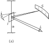
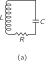
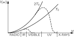
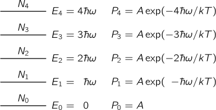
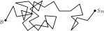

SOURCE: Feynman Lectures on Physics, Volume I, Chapter 41
LANGUAGE: ru
TITLE: Глава 41. Броуновское движение
SOURCE_URL: https://www.feynmanlectures.caltech.edu/I_41.html
NOTEBOOKLM_USE: clean lecture text with TeX math and figure captions; reader navigation removed.

# Глава 41. Броуновское движение

## 41–1 Равнораспределение энергии

Броуновское движение открыл в 1827 г. ботаник Роберт Броун. Изучая жизнь под микроскопом, он заметил, что мельчайшие частицы цветочной пыльцы пляшут в его поле зрения; в то же время он был достаточно сведущ, чтобы понимать, что перед ним не живые существа, а просто плавающие в воде соринки. Чтобы окончательно доказать, что это не живые существа, Броун разыскал обломок кварца, внутри которого была заполненная водой полость. Вода попала туда много миллионов лет назад, но и в такой воде соринки все продолжали свою пляску. Казалось, что очень мелкие частицы пляшут непрерывно.

Позднее было доказано, что это один из эффектов молекулярного движения, и понять его качественно можно, представив себе огромный мяч для игры в пушбол на игровом поле, за которым наблюдают с большого расстояния, и под которым находится множество людей, толкающих его в самых разных направлениях. Мы не видим людей, потому что воображаем, будто находимся слишком далеко, но мы видим мяч и замечаем, что он перемещается довольно беспорядочно. Мы также знаем из разобранных в предыдущих главах теорем, что средняя кинетическая энергия взвешенной в жидкости или газе маленькой частицы будет \(\tfrac{3}{2}kT\) , даже если она очень тяжела по сравнению с молекулой. Если она очень тяжела, это означает, что ее скорость относительно мала, но на самом деле оказывается, что скорость не так уж мала. На самом деле заметить скорость такой частицы не очень легко, потому что, хотя средняя кинетическая энергия равна \(\tfrac{3}{2}kT\) , что соответствует скорости около миллиметра в секунду для объекта диаметром в один-два микрона, это очень трудно увидеть даже под микроскопом, так как частица постоянно меняет направление своего движения и никуда не продвигается. Насколько далеко она может уйти, мы обсудим в конце этой главы. Этот вопрос впервые был разрешен Эйнштейном в начале XX века.

Между прочим, когда мы говорим, что средняя кинетическая энергия этой частицы равна \(\tfrac{3}{2}kT\) , мы утверждаем, что вывели этот результат из кинетической теории, то есть из законов Ньютона. Мы увидим, что с помощью кинетической теории можно получить самые разные удивительные вещи, и самое интересное — что нам, по-видимому, удается получить так много из столь малого. Конечно, мы не имеем в виду, что законы Ньютона — это «малое», на самом деле они дают для этого все необходимое; мы хотим сказать лишь то, что нам самим пришлось потрудиться совсем немного. Как же нам удается получить так много? Ответ в том, что мы постоянно делали одно важное предположение: если данная система находится в тепловом равновесии при некоторой температуре, то она будет находиться в тепловом равновесии и с чем угодно другим при той же температуре. Например, если бы мы захотели посмотреть, как двигалась бы частица при реальных столкновениях с водой, мы могли бы представить, что присутствует еще и газ, состоящий из частиц другого сорта — маленьких дробинок, которые (как мы предполагаем) с водой не взаимодействуют, а только сильно ударяют по нашей частице. Предположим, что из частицы торчит шип; все, что требуется от наших дробинок — это ударять по этому шипу. Об этом воображаемом газе из дробинок при температуре \(T\) нам известно все — это идеальный газ. Вода — дело сложное, а идеальный газ — попроще. И вот наша частица должна находиться в равновесии с газом из дробинок. Следовательно, среднее движение частицы должно быть таким, каким оно получается вследствие столкновений с газом, потому что если бы она двигалась относительно воды не с той скоростью, с какой следует, а, скажем, быстрее, то это означало бы, что дробинки будут отбирать у нее энергию и нагреются сильнее, чем вода. Но ведь мы начали с одинаковой температуры, и мы предполагаем, что если система однажды пришла в равновесие, она в нем и остается — не может одна её часть самопроизвольно нагреться, а другая остыть.

Это предположение справедливо, и его можно доказать, используя законы механики, но доказательство очень сложно и понять его можно, только хорошо зная механику. С помощью квантовой механики доказать это гораздо легче, чем с помощью классической. Впервые эту теорему доказал Больцман, а мы пока просто примем, что она верна; тогда мы можем утверждать, что наша частица должна обладать энергией \(\tfrac{3}{2}kT\) при столкновениях с искусственными дробинками, поэтому она также должна обладать энергией \(\tfrac{3}{2}kT\) , когда она сталкивается с водой при той же температуре и мы удалим дробинки; следовательно, она равна \(\tfrac{3}{2}kT\) . Это странная, но правильная цепь рассуждений.

Кроме движения коллоидных частиц, на которых и было впервые открыто броуновское движение, имеется еще целый ряд других явлений, и не только в лабораторных, но и в других условиях, позволяющих обнаружить броуновское движение. Если бы мы смогли соорудить чрезвычайно тонкое измерительное устройство, скажем, крохотное зеркальце, прикрепленное к тонкой кварцевой нити очень чувствительного баллистического гальванометра (фиг. 41.1), то зеркальце не стояло бы на месте, а непрерывно плясало бы, поэтому если бы мы осветили это зеркальце лучом света и проследили за отраженным пятном, то потеряли бы надежду создать совершенный измерительный инструмент, так как зеркальце все время пляшет. Почему? Потому что средняя кинетическая энергия вращения этого зеркальца должна быть в среднем равна \(\tfrac{1}{2}kT\) .

### Figure Ch41-F1
Caption: Фиг. 41.1. а) Чувствительный зеркальный гальванометр. Пучок света из источника \(L\) отражается от маленького зеркальца на шкале. б) Схематическая запись показаний шкалы как функция времени.
Image: figures/Ch41-F1.svg

Чему равен средний квадратичный угол качаний зеркальца? Предположим, что мы определили период собственных колебаний зеркальца, стукнув слегка по одной его стороне и наблюдая, как долго будет оно качаться взад и вперед, и пусть нам также известен момент инерции \(I\) . Формулу для кинетической энергии вращения мы знаем, это равенство (19.8): \(T = \tfrac{1}{2}I\omega^2\) . Это кинетическая энергия, а связанная с ней потенциальная энергия пропорциональна квадрату угла — это \(V = \tfrac{1}{2}\alpha\theta^2\) . Но если мы знаем период \(t_0\) и можем вычислить собственную частоту \(\omega_0 =
2\pi/t_0\) , то потенциальная энергия равна \(V =
\tfrac{1}{2}I\omega_0^2\theta^2\) . Мы знаем, что средняя кинетическая энергия равна \(\tfrac{1}{2}kT\) , но поскольку перед нами гармонический осциллятор, то средняя потенциальная энергия также равна \(\tfrac{1}{2}kT\) . Следовательно,
\[
\begin{equation}
\tfrac{1}{2}I\omega_0^2\avg{\theta^2} =
\tfrac{1}{2}kT,\notag
\end{equation}
\]
или
\[
\begin{equation}
\label{Eq:I:41:1}
\avg{\theta^2} = kT/I\omega_0^2.
\end{equation}
\]
. Таким образом мы можем рассчитать колебания зеркальца гальванометра и тем самым найти предел точности нашего инструмента. Если нам нужно уменьшить колебания, то следует охладить зеркальце. Но здесь возникает интересный вопрос — в каком месте его охладить? Все зависит от того, откуда оно получает больше «пинков». Если в колебаниях повинна кварцевая нить, то охлаждать нужно ее верхний конец, если же зеркальце находится в газовой среде и раскачивается в основном за счет соударений с молекулами газа, то лучше охладить газ. Итак, практически, если известно, почему происходит затухание колебаний, то оказывается, что имеется всегда какой-то источник флуктуаций; к этому вопросу мы еще вернемся.

### Figure Ch41-F2
Caption: Фиг. 41.2. Резонансная цепь с большим \(Q\) . а — реальная цепь при температуре \(T\) ; б — искусственная цепь с идеальным (бесшумным) сопротивлением и «генератором шума» \(G\) .
Image: figures/Ch41-F2.svg

Те же флуктуации работают, и довольно удивительным образом, в электрических цепях. Предположим, что мы построили очень чувствительный, точный усилитель для какой-нибудь определенной частоты и к его входу подключили резонансную цепь (фиг. 41.2), настроенную на эту же частоту, наподобие радиоприемника, только получше. Предположим, что мы захотели как можно точнее изучить флуктуации, для этого мы сняли напряжение, скажем, с индуктивности и подали его на усилитель. Конечно, во всякой цепи такого рода имеются некоторые потери. Это не идеальная резонансная цепь, но все же очень хорошая цепь, и обладает она малым сопротивлением (на схеме сопротивление показано, надо только помнить, что оно очень мало). А теперь мы хотим узнать, как велики флуктуации падения напряжения на индуктивности? Ответ. Нам известно, что \(\tfrac{1}{2}LI^2\) — это «кинетическая энергия», запасенная катушкой резонансной цепи (см. гл. 25). Поэтому среднее значение \(\tfrac{1}{2}LI^2\) равно \(\tfrac{1}{2}kT\) — это дает нам среднее квадратичное значение тока, а отсюда можно определить и среднее квадратичное значение напряжения. Если мы хотим знать падение напряжения на индуктивности, нам пригодится формула \(\hat{V}_L =
i\omega L\hat{I}\) , тогда средний квадрат модуля падения напряжения на индуктивности равен \(\avg{V_L^2} = L^2\omega_0^2\avg{I^2}\) , а полагая \(\tfrac{1}{2}L\avg{I^2} = \tfrac{1}{2}kT\) , получаем
\[
\begin{equation}
\label{Eq:I:41:2}
\avg{V_L^2} = L\omega_0^2 kT.
\end{equation}
\]
Итак, теперь мы можем рассчитать контур и предсказать, каким в нем будет так называемый шум Джонсона, т. е. шум, связанный с тепловыми флуктуациями!

Но откуда же эти флуктуации берутся? А все из-за сопротивления, точнее говоря, в результате пляски электронов в сопротивлении. Ведь они находятся в тепловом равновесии с остальным материалом сопротивления, а это приводит к флуктуациям плотности электронов. Таким образом они порождают крошечные электрические поля, управляющие резонансной цепью.

Инженеры-электрики представляют этот ответ иначе. Физически источником шума фактически является сопротивление. Однако мы можем заменить реальную цепь с настоящим физическим сопротивлением, создающим шум, искусственной цепью, содержащей маленький генератор, который будет представлять этот шум, а само сопротивление сделать в остальном идеальным — оно уже не шумит. Весь шум исходит от искусственного генератора. И поэтому, если бы мы знали характеристики шума, порождаемого сопротивлением, если бы у нас была для этого формула, то мы могли бы рассчитать, как поведет себя цепь в ответ на этот шум. Следовательно, нам нужна формула для шумовых флуктуаций. Шум, порождаемый сопротивлением, распределен по всем частотам, поскольку само по себе сопротивление не является резонансным. Конечно, резонансный контур «слышит» лишь ту часть, которая близка к нужной частоте, но в сопротивлении присутствует много других частот. Силу генератора можно описать следующим образом: средняя мощность, которую поглощало бы сопротивление, если бы оно было подключено непосредственно к генератору шума, равнялась бы \(\avg{E^2}/R\) , если бы \(E\) было напряжением генератора. Но нам хотелось бы подробнее знать, сколько мощности приходится на каждую частоту. На каждую отдельную частоту приходится очень малая мощность; это распределение. Пусть \(P(\omega)\,d\omega\) — мощность, которую генератор передавал бы тому же самому сопротивлению в интервале частот \(d\omega\) . Тогда мы можем доказать (мы докажем это для другого случая, но математика там абсолютно та же), что мощность равна
\[
\begin{equation}
\label{Eq:I:41:3}
P(\omega)\,d\omega = (2/\pi)kT\,d\omega,
\end{equation}
\]
и в таком виде не зависит от сопротивления.

## 41–2 Тепловое равновесие излучения

Мы приступаем к обсуждению более сложной и интересной теоремы, суть которой состоит в следующем. Предположим, что у нас имеется заряженный осциллятор, вроде тех, о которых мы говорили, когда речь шла о свете, скажем, электрон, колеблющийся в атоме вверх и вниз. Если он колеблется вверх и вниз, то излучает свет. Предположим теперь, что этот осциллятор находится в очень разреженном газе из других атомов и время от времени эти атомы с ним сталкиваются. Тогда при равновесии, по прошествии долгого времени, этот осциллятор приобретет такую энергию, что кинетическая энергия его колебаний будет равна \(\tfrac{1}{2}kT\) , а поскольку это гармонический осциллятор, то вся его энергия станет равной \(kT\) . Это, конечно, пока еще неверное описание, потому что осциллятор несет электрический заряд, и если он обладает энергией \(kT\) , то, качаясь вверх и вниз, он излучает свет. Поэтому невозможно получить равновесие только самого реального вещества без того, чтобы находящиеся в нем заряды не излучали свет; а когда свет излучается, энергия утекает, осциллятор со временем теряет свою \(kT\) , и, таким образом, весь газ, сталкивающийся с осциллятором, постепенно остывает. И именно так, конечно, остывает теплая печка, излучая свет в небо: ведь атомы колеблют свои заряды и непрерывно излучают, и постепенно из-за этого излучения их колебательное движение замедляется.

Но если заключить все это в ящик, так чтобы свет не смог уйти в бесконечность, тепловое равновесие может наступить. Мы можем поместить газ в ящик, в стенках которого есть и другие излучатели, испускающие свет внутрь ящика, а еще лучше соорудить ящик с зеркальными стенками. Этот пример поможет лучше понять, что произойдет. Итак, мы предполагаем, что все излучение от осциллятора остается внутри ящика. Осциллятор и в этом случае начинает излучать, но довольно скоро он все же сможет поддерживать свою энергию \(kT\) , несмотря на то, что он излучает, так как он будет освещаться, так сказать, собственным светом, отраженным от стенок ящика. Вскоре в ящике будет много света и, хотя осциллятор продолжает излучать, часть света будет возвращаться и возмещать осциллятору потерянную им энергию.

А теперь подсчитаем, насколько должен быть освещен ящик при температуре \(T\) , чтобы рассеяние света на осцилляторе обеспечивало его как раз такой энергией, какая нужна для поддержания излучения.

Пусть атомов газа совсем немного и находятся они далеко друг от друга, так что наш осциллятор идеальный, не имеющий иного трения, кроме радиационного. Затем мы считаем, что при тепловом равновесии осциллятор делает сразу два дела. Во-первых, он обладает средней энергией \(kT\) , и мы вычисляем, сколько он излучает. Во-вторых, это излучение должно в точности соответствовать тому количеству, которое получается вследствие рассеяния падающего на осциллятор света. Поскольку энергии больше некуда деваться, это эффективное излучение — на самом деле просто рассеянный свет от того света, который там находится.

Таким образом, прежде всего мы вычисляем энергию, излучаемую в 1 сек осциллятором с заданной энергией. (Мы позаимствуем для этого в гл. 32, посвященной радиационному трению, несколько равенств и не будем здесь приводить их выводы.) Отношение энергии, излученной за радиан, к энергии осциллятора называется \(1/Q\) [см. уравнение (32.8)]: \(1/Q = (dW/dt)/\omega_0W\) . Используя величину \(\gamma\) (постоянную затухания), можно записать это в виде \(1/Q =
\gamma/\omega_0\) , где \(\omega_0\) — собственная частота осциллятора, если γ очень мало, а \(Q\) очень велико. Излученная за 1 сек энергия равна
\[
\begin{equation}
\label{Eq:I:41:4}
\ddt{W}{t} = \frac{\omega_0W}{Q} = \frac{\omega_0W\gamma}{\omega_0} =
\gamma W.
\end{equation}
\]
Излученная за 1 сек энергия просто равна произведению γ на энергию осциллятора. Средняя энергия нашего осциллятора равна \(kT\) , поэтому произведение γ на \(kT\) — это среднее значение излученной за 1 сек энергии:
\[
\begin{equation}
\label{Eq:I:41:5}
\avg{dW/dt} = \gamma kT.
\end{equation}
\]
Теперь нам нужно только узнать, что такое γ. Эту величину легко найти из уравнения (32.12):
\[
\begin{equation}
\label{Eq:I:41:6}
\gamma = \frac{\omega_0}{Q} = \frac{2}{3}\,
\frac{r_0\omega_0^2}{c},
\end{equation}
\]
где \(r_0 = e^2/mc^2\) — классический радиус электрона, и мы положили \(\lambda = 2\pi c/\omega_0\) .

Таким образом, окончательный результат для средней скорости излучения света вблизи частоты \(\omega_0\) таков:
\[
\begin{equation}
\label{Eq:I:41:7}
\avg{dW/dt} = \frac{2}{3}\,
\frac{r_0\omega_0^2kT}{c}.
\end{equation}
\]

Теперь надо выяснить, сильно ли должен быть освещен осциллятор. Освещение должно быть таким, чтобы поглощенная осциллятором энергия (и впоследствии рассеянная) была в точности равна предыдущей величине. Иначе говоря, излученный свет — это свет, рассеянный при освещении осциллятора в полости. Итак, нам остается рассчитать, сколько света рассеивается осциллятором, если на него падает какая-то — неизвестная — доза излучения. Пусть \(I(\omega)\,d\omega\) — энергия света частоты \(\omega\) в интервале частот \(d\omega\) (ведь у нас нет света точно заданной частоты; излучение распределено по спектру). Таким образом, \(I(\omega)\) — это спектральное распределение, которое нам надо найти, — это тот цвет огня, который мы увидим внутри печи при температуре \(T\) , если откроем дверцу и заглянем внутрь. Сколько же все-таки света поглотится? Мы уже определяли количество излучения, поглощаемого из заданного падающего пучка света, и выразили его через эффективное сечение. Это соответствует тому, как если бы мы предполагали, что весь свет, падающий на площадку определенной площади, поглощается. Таким образом, полная переизлученная (рассеянная) интенсивность равна произведению интенсивности падающего света \(I(\omega)\,d\omega\) на эффективное сечение \(\sigma\) .

Формула для эффективного сечения, которую мы вывели (уравнение 32.19), не включала затухания. Нетрудно повторить этот вывод снова и учесть трение, которым мы тогда пренебрегли. Если это сделать, то, вычисляя эффективное сечение по прежнему образцу, мы получим
\[
\begin{equation}
\label{Eq:I:41:8}
\sigma_s = \frac{8\pi r_0^2}{3}\biggl(
\frac{\omega^4}{(\omega^2 - \omega_0^2)^2 + \gamma^2\omega^2}
\biggr).
\end{equation}
\]

Как функция частоты \(\sigma_s\) имеет заметную величину только для \(\omega\) , очень близких к собственной частоте \(\omega_0\) . (Вспомним, что \(Q\) для излучающего осциллятора — порядка \(10^8\) .) Когда \(\omega\) равно \(\omega_0\) , осциллятор рассеивает очень сильно, а при других значениях \(\omega\) — очень слабо. Поэтому мы можем заменить \(\omega\) на \(\omega_0\) , а \(\omega^2 - \omega_0^2\) — на \(2\omega_0(\omega -
\omega_0)\) , и получим
\[
\begin{equation}
\label{Eq:I:41:9}
\sigma_s = \frac{2\pi r_0^2\omega_0^2}
{3[(\omega - \omega_0)^2 + \gamma^2/4]}.
\end{equation}
\]
Теперь вся кривая локализована вблизи \(\omega = \omega_0\) . (На самом деле нам не обязательно делать какие-либо приближения, но вычислять интегралы гораздо проще, если немного упростить уравнение.) Теперь умножим интенсивность в данном интервале частот на сечение рассеяния, чтобы получить количество энергии, рассеянной в интервале \(d\omega\) . Полная рассеянная энергия — это интеграл от этой величины по всем \(\omega\) . Таким образом,
\[
\begin{equation}
\begin{aligned}
\ddt{W_s}{t} &= \int_0^\infty
I(\omega)\sigma_s(\omega)\,d\omega\\[1ex]
&= \int_0^\infty\frac{2\pi r_0^2\omega_0^2I(\omega)\,d\omega}
{3[(\omega - \omega_0)^2 + \gamma^2/4]}.
\end{aligned}
\label{Eq:I:41:10}
\end{equation}
\]

Теперь мы положим \(dW_s/dt = 3\gamma kT\) . Но почему здесь стоит 3? Потому что в гл. 32 мы предполагали, что свет поляризован так, что может раскачивать осциллятор. Если бы мы использовали осциллятор, способный раскачиваться только в одном направлении, а свет был бы, скажем, поляризован неверно, то он не рассеивался бы совсем. Поэтому мы должны либо усреднить эффективное сечение рассеяния на осцилляторе, способном раскачиваться только в одном направлении, по всем направлениям падающих пучков и поляризации света в пучке, либо, что легче сделать, представить себе, что наш осциллятор послушно следует за полем, каким бы оно ни было там, где он находится. Такой осциллятор, который одинаково легко раскачивается в любом из трех направлений, имеет среднюю энергию \(3kT\) , потому что у него \(3\) степени свободы. Поэтому надо писать \(3\gamma kT\) , раз у него \(3\) степени свободы.

### Figure Ch41-F3
Caption: Фиг. 41.3. Сомножители подынтегрального выражения (41.10). Пик — это резонансная кривая \(1/\bigl[(\omega - \omega_0)^2 + \gamma^2/4\bigr]\) . Множитель \(I(\omega)\) можно с хорошим приближением заменить на \(I(\omega_0)\) .
Image: figures/Ch41-F3.svg
![Фиг. 41.3. Сомножители подынтегрального выражения (41.10). Пик — это резонансная кривая \(1/\bigl[(\omega - \omega_0)^2 + \gamma^2/4\bigr]\) . Множитель \(I(\omega)\) можно с хорошим приближением заменить на \(I(\omega_0)\) .](figures/Ch41-F3.svg)

Займемся теперь интегралом. Предположим, что неизвестное спектральное распределение света \(I(\omega)\) — это плавная кривая, которая в той узкой области частот, где \(\sigma_s\) имеет острый максимум, меняется не слишком сильно (фиг. 41.3). Тогда сколько-нибудь существенный вклад в интеграл дают только частоты, когда \(\omega\) очень близко к \(\omega_0\) , в пределах очень малой величины гамма. Поэтому, хотя \(I(\omega)\) может быть неизвестной и сложной функцией, она важна только вблизи \(\omega = \omega_0\) , и там мы можем заменить плавную кривую плоской — «постоянной» — всюду одной высоты. Иначе говоря, мы просто вынесем \(I(\omega)\) из-под знака интеграла и назовем это \(I(\omega_0)\) . Мы можем также вынести остальные постоянные за знак интеграла, и у нас останется
\[
\begin{equation}
\label{Eq:I:41:11}
\tfrac{2}{3}\pi r_0^2\omega_0^2I(\omega_0)
\int_0^\infty\frac{d\omega}
{(\omega - \omega_0)^2 + \gamma^2/4}
= 3\gamma kT.
\end{equation}
\]
Интеграл должен браться от \(0\) до \(\infty\) , но \(0\) отстоит так далеко от \(\omega_0\) , что к этому времени кривая уже сходит на нет, поэтому мы заменим его на минус \(\infty\) — разницы никакой, а взять интеграл гораздо легче. Интеграл представляет собой арктангенс вида \(\int dx/(x^2 + a^2)\) . Если заглянуть в справочник, то мы увидим, что он равен \(\pi/a\) . Итак, для нашего случая это равно \(2\pi/\gamma\) . Поэтому после некоторых преобразований мы получаем
\[
\begin{equation}
\label{Eq:I:41:12}
I(\omega_0) = \frac{9\gamma^2kT}{4\pi^2r_0^2\omega_0^2}.
\end{equation}
\]
Затем мы подставим сюда формулу (41.6) для гамма (не будем стараться писать \(\omega_0\) ; раз это верно для любой \(\omega_0\) , мы можем назвать ее просто \(\omega\) ), и формула для \(I(\omega)\) тогда примет вид
\[
\begin{equation}
\label{Eq:I:41:13}
I(\omega) = \frac{\omega^2kT}{\pi^2c^2}.
\end{equation}
\]
Она и определяет распределение света в горячей печке. Это называется излучением абсолютно черного тела. Черного потому, что отверстие в печке, на которое мы смотрим, выглядит черным, когда температура равна нулю.

Формула (41.13) задает распределение энергии излучения внутри ящика при температуре \(T\) согласно классической теории. Отметим сначала замечательную особенность этого выражения. Заряд осциллятора, масса осциллятора, все частные его свойства выпали из формулы; ведь если мы достигли равновесия с одним осциллятором, мы должны позаботиться о равновесии и с любым другим осциллятором другой массы, иначе будут неприятности. Таким образом, это важный способ проверки нашей теоремы о том, что равновесие зависит только от температуры, а не от того, что приводит к равновесию. Теперь можно начертить кривую \(I(\omega)\) (фиг. 41.4). Она покажет нам, какова освещенность при разных частотах.

### Figure Ch41-F4
Caption: Фиг. 41.4. Распределение интенсивности излучения черного тела при двух температурах согласно классической физике (сплошные кривые). Пунктирные кривые показывают настоящее распределение.
Image: figures/Ch41-F4.svg

В выражение для интенсивности в ящике на единицу частоты входит, как видно, квадрат частоты; это значит, что если взять ящик при любой температуре, то в нем обнаружится бездна рентгеновских лучей!

Конечно, мы знаем, что это не так. Когда мы открываем печь и заглядываем в нее, мы вовсе не выжигаем себе глаза рентгеновскими лучами. Это совершенно неверно. Более того, полная энергия в ящике — сумма всей этой интенсивности по всем частотам — была бы равна площади под этой бесконечной кривой. Следовательно, что-то здесь в самом корне, глубоко и абсолютно неверно.

Таким образом, классическая теория оказалась абсолютно неспособной правильно описать распределение излучения черного тела, точно так же как она была неспособна правильно описать теплоемкости газов. Физики рассматривали этот вывод со всех сторон и с самых разных точек зрения, но спасения не было. Таково предсказание классической физики. Уравнение (41.13) называется законом Рэлея; это предсказание классической физики, и оно, очевидно, нелепо.

## 41–3 Равнораспределение и квантовый осциллятор

Описанная выше трудность была еще одной частью непрекращающихся проблем классической физики, начавшихся с трудности объяснения теплоемкости газов, а теперь сосредоточившихся на распределении излучения абсолютно черного тела. Конечно, в то время, когда теоретики изучали этот вопрос, существовало уже много измерений реальной кривой. И оказалось, что истинная кривая похожа на штриховые кривые на фиг. 41.4. Иными словами, никаких рентгеновских лучей там не было. Согласно классической теории, при понижении температуры вся кривая опускается пропорционально \(T\) , однако наблюдаемая кривая при более низкой температуре обрывается раньше. Таким образом, низкочастотный конец кривой верен, а высокочастотный ошибочен. Почему? Когда сэр Джеймс Джинс размышлял над теплоемкостями газов, он заметил, что при слишком низкой температуре высокочастотные колебания «вымораживаются». То есть если температура слишком низка, а частота слишком высока, то осцилляторы в среднем не обладают энергией \(kT\) . Вспомним теперь, как мы выводили формулу (41.13): все зависело от энергии осциллятора при тепловом равновесии. То, чем было \(kT\) в (41.5), и то же самое \(kT\) в (41.13), представляет собой среднюю энергию гармонического осциллятора частоты \(\omega\) при температуре \(T\) . Классически это \(kT\) , но на опыте — нет! Это не так, когда температура слишком низка или частота осциллятора слишком высока. И кривая идет вниз по той же самой причине, по которой теория теплоемкостей газов терпит неудачу. Изучать кривую излучения черного тела проще, чем теплоемкости столь сложных систем, как газы. Поэтому наше внимание и сосредоточено на отыскании истинной кривой излучения абсолютно черного тела: ведь эта кривая правильно указывает для каждой частоты, какова в действительности средняя энергия гармонических осцилляторов как функция температуры.

Планк исследовал эту кривую. Сначала он нашел ответ эмпирически, подобрав хорошую функцию, которая очень хорошо описывала наблюдаемую кривую. Таким образом, он получил эмпирическую формулу для средней энергии гармонического осциллятора как функции частоты. Другими словами, вместо \(kT\) он получил правильную формулу, а затем, немного повозившись, нашел для нее простой вывод, основанный на очень странном допущении. Это допущение состояло в том, что гармонический осциллятор может принимать энергию только порциями по \(\hbar\omega\) . Представление о том, что они могут обладать вообще любой энергией, неверно. Разумеется, это было началом конца классической механики.

### Figure Ch41-F5
Caption: Фиг. 41.5. Уровни энергии гармонического осциллятора расположены на равных расстояниях друг от друга: \(E_n = n\hbar\omega\) .
Image: figures/Ch41-F5.svg

Сейчас мы выведем самую первую из правильно найденных квантовомеханических формул. Предположим, что разрешенные уровни энергии гармонического осциллятора отстоят друг от друга на равные интервалы \(\hbar\omega_0\) , так что осциллятор может принимать только эти различные значения энергии (фиг. 41.5). Планк пользовался несколько более сложными рассуждениями, чем те, которые приводятся здесь, потому что это было самое начало квантовой механики и ему приходилось доказывать некоторые вещи. Но мы примем за факт (который он доказал для этого случая), что вероятность нахождения на уровне с энергией \(E\) равна \(P(E) = \alpha e^{-E/kT}\) . Если мы согласимся с этим, то получим правильный результат.

Предположим теперь, что у нас имеется множество осцилляторов, причем каждый из них представляет собой вибратор с частотой \(\omega_0\) . Некоторые из этих вибраторов будут находиться в самом нижнем квантовом состоянии, некоторые — в следующем и т. д. Мы хотели бы узнать среднюю энергию всех этих осцилляторов. Для этого давайте найдем полную энергию всех осцилляторов и разделим ее на число осцилляторов. Это будет средняя энергия одного осциллятора при тепловом равновесии; она же будет энергией, находящейся в равновесии с излучением абсолютно черного тела, которую нужно подставить в уравнение (41.13) вместо \(kT\) . Пусть \(N_0\) — число осцилляторов в основном состоянии (состоянии с наименьшей энергией); \(N_1\) — число осцилляторов в состоянии \(E_1\) ; \(N_2\) — число в состоянии \(E_2\) и т. д. Согласно гипотезе (которую мы не доказали), утверждающей, что в квантовой механике классический закон распределения вероятностей \(e^{-\text{P.E.}/kT}\) или \(e^{-\text{K.E.}/kT}\) заменяется законом, по которому вероятность убывает как \(e^{-\Delta E/kT}\) , где \(\Delta E\) — избыточная энергия, мы примем, что число осцилляторов \(N_1\) в первом состоянии равно числу осцилляторов в основном состоянии \(N_0\) , умноженному на \(e^{-\hbar\omega/kT}\) . Аналогично число осцилляторов во втором состоянии \(N_2\) равно \(N_2 = N_0e^{-2\hbar\omega/kT}\) . Чтобы упростить алгебраические выкладки, обозначим \(e^{-\hbar\omega/kT} = x\) . Тогда мы просто получим \(N_1 = N_0x\) , \(N_2 = N_0x^2\) , …, \(N_n = N_0x^n\) .

Сначала нужно подсчитать полную энергию всех осцилляторов. Если осциллятор находится в основном состоянии, его энергия равна нулю. Если он находится в первом состоянии, его энергия равна \(\hbar\omega\) , а число таких осцилляторов равно \(N_1\) . Следовательно, энергия, которую они дают, равна \(N_1\hbar\omega\) , или \(\hbar\omega N_0x\) . Осцилляторы во втором состоянии имеют энергию \(2\hbar\omega\) , а число их равно \(N_2\) , так что они дают энергию \(N_2\cdot 2\hbar\omega
= 2\hbar\omega N_0x^2\) и т. д. Сложив все это вместе, мы получим \(E_{\text{tot}} = N_0\hbar\omega(0 + x
+2x^2 + 3x^3 + \dotsb)\) .

А сколько всего имеется осцилляторов? Конечно, \(N_0\) — это число осцилляторов в основном состоянии, \(N_1\) — в первом состоянии и т. д., и мы складываем их вместе: \(N_{\text{tot}} = N_0(1 + x + x^2 + x^3
+ \dotsb)\) . Таким образом, средняя энергия равна
\[
\begin{equation}
\label{Eq:I:41:14}
\avg{E} = \frac{E_{\text{tot}}}{N_{\text{tot}}} =
\frac{N_0\hbar\omega(0 + x +2x^2 + 3x^3 + \dotsb)}
{N_0(1 + x + x^2 + x^3 + \dotsb)}.
\end{equation}
\]
. Предоставим теперь читателю самому повозиться с двумя появившимися здесь суммами и получить от этого удовольствие. Когда мы просуммируем все до конца и подставим в сумму \(x\) , мы должны получить (если не сделаем ошибок при сложении)
\[
\begin{equation}
\label{Eq:I:41:15}
\avg{E} = \frac{\hbar\omega}{e^{\hbar\omega/kT} - 1}.
\end{equation}
\]
. Это и была первая в истории квантовомеханическая формула, которая когда-либо была известна или обсуждалась; она явилась прекрасным завершением десятилетий недоумения. Максвелл знал, что здесь что-то неладно, и вопрос заключался в том, а как же правильно? Вот количественный ответ на то, что верно вместо \(kT\) . Это выражение должно, конечно, стремиться к \(kT\) при \(\omega \to 0\) или при \(T
\to \infty\) . Попробуйте доказать, что это так, — поучитесь математике.

Это и есть тот знаменитый «обрезающий» множитель, который искал Джинс; если использовать его вместо \(kT\) в (41.13), то для распределения света в черном ящике мы получим
\[
\begin{equation}
\label{Eq:I:41:16}
I(\omega)\,d\omega = \frac{\hbar\omega^3\,d\omega}
{\pi^2c^2(e^{\hbar\omega/kT} - 1)}.
\end{equation}
\]
Мы видим, что при больших \(\omega\) , несмотря на то что в числителе стоит \(\omega^3\) , в знаменателе \(e\) возводится в огромную степень, так что кривая снова идет вниз и не «взрывается» — мы не получаем ультрафиолетового излучения и рентгеновских лучей там, где мы их не ждем!

Кто-то может возразить, что при выводе (41.16) мы воспользовались квантовой теорией для уровней энергии гармонического осциллятора и классической теорией при определении сечения \(\sigma_s\) . Но квантовая теория взаимодействия света с гармоническим осциллятором дает точно такой же результат, что и классическая теория. Собственно говоря, именно поэтому мы имели полное право тратить так много времени на анализ показателя преломления и рассеяния света с помощью модели атомов как маленьких осцилляторов — квантовые формулы по существу те же самые.

Теперь вернемся к шуму Джонсона в сопротивлении. Мы уже замечали, что теория мощности этого шума совпадает с теорией классического распределения излучения черного тела. Действительно, довольно забавно, что мы уже говорили: если бы сопротивление в цепи было не настоящим сопротивлением, а антенной (антенна действует подобно сопротивлению, потому что она излучает энергию), т. е. сопротивлением излучения, то нам было бы очень легко вычислить эту мощность. Это была бы просто мощность, поступающая в антенну от окружающего ее света, и мы получили бы то же самое распределение, отличающееся только одним или двумя множителями. Мы можем предположить, что сопротивление представляет собой генератор с неизвестным спектром мощности \(P(\omega)\) . Спектр определяется тем, что этот же генератор, подключенный к резонансному контуру на любую частоту, как на фиг. 41.2, б, создает на индуктивности напряжение, величина которого дается выражением (41.2). Таким образом, мы приходим к тому же интегралу, что и в (41.10), и тот же самый метод приводит к формуле (41.3). При низких температурах величину \(kT\) в формуле (41.3), конечно, нужно заменить на (41.15). Обе эти теории (излучения черного тела и шума Джонсона) тесно связаны между собой физически, ибо мы можем, разумеется, подключить резонансный контур к антенне, так что сопротивление \(R\) будет чистым сопротивлением излучения. Поскольку выражение (41.2) не зависит от физического происхождения сопротивления, мы знаем, что генератор \(G\) для реального сопротивления и для сопротивления излучения один и тот же. Каково происхождение генерируемой мощности \(P(\omega)\) , если сопротивление \(R\) — это всего лишь идеальная антенна, находящаяся в равновесии с окружающей средой при температуре \(T\) ? Это излучение \(I(\omega)\) в пространстве при температуре \(T\) , которое падает на антенну и, играя роль «принимаемых сигналов», создает эффективный генератор. Поэтому можно установить прямую связь между \(P(\omega)\) и \(I(\omega)\) , что приводит затем от (41.13) к (41.3).

Все, о чем мы здесь говорили, — так называемые шумы Джонсона, распределение Планка и строгая теория броуновского движения, которую мы сейчас опишем, — относится к открытиям первого десятилетия нашего века. Теперь, помня об этих фактах и истории, вернемся к броуновскому движению.

## 41–4 Случайные блуждания

### Figure Ch41-F6
Caption: Фиг. 41.6. Случайное блуждание из \(36\) шагов длиной \(l\) . Как далеко отстоит \(S_{36}\) от \(B\) ? Ответ: в среднем примерно на \(6l\) .
Image: figures/Ch41-F6.svg

Давайте рассмотрим, как должно меняться со временем положение дрожащей частицы за промежутки времени, очень большие по сравнению с временем между «толчками». Рассмотрим маленькую броуновскую частицу, которая совершает беспорядочные движения из-за того, что ее бомбардируют со всех сторон хаотически движущиеся молекулы воды. Вопрос: как далеко она может уйти от своего начального положения по истечении заданного промежутка времени? Эта задача была решена Эйнштейном и Смолуховским. Если мы мысленно разобьем время на малые промежутки, скажем на сотые доли секунды, то за первую сотую секунды частица сместится сюда, за следующую сотую — еще куда-то, за следующую сотую секунды — еще куда-то и т. д. С точки зрения частоты бомбардировки сотая доля секунды — это очень большое время. Читатель легко может убедиться, что число соударений, испытываемых одной молекулой воды за секунду, составляет около \(10^{14}\) , так что за сотую долю секунды происходит \(10^{12}\) соударений, а это очень много! Поэтому по истечении сотой доли секунды она уже не будет помнить, что происходило до этого. Иными словами, все соударения случайны, так что очередной «шаг» никак не связан с предыдущим. Это похоже на знаменитую задачу о пьяном матросе: матрос выходит из бара и делает ряд шагов, но каждый шаг выбирается случайным образом под произвольным углом (фиг. 41.6). Спрашивается: где окажется матрос спустя долгое время? Конечно, мы этого не знаем! Этого сказать нельзя. Что мы имеем в виду? Он просто находится где-то в случайном месте. Ну хорошо, а в среднем где он находится? На каком среднем расстоянии от бара он окажется? Мы уже отвечали на этот вопрос, когда обсуждали суперпозицию света от множества различных источников с разными фазами, а это означало сложение множества стрелок под разными углами (гл. 30). Тогда мы обнаружили, что средний квадрат расстояния от одного конца цепочки случайных шагов до другого, который соответствовал интенсивности света, равен сумме интенсивностей отдельных участков. Поэтому с помощью точно таких же математических рассуждений мы можем сразу доказать, что если \(\FLPR_N\) — вектор расстояния от начала координат после \(N\) шагов, то средний квадрат расстояния от начала координат пропорционален числу шагов \(N\) . Это значит, что \(\avg{R_N^2} = NL^2\) , где \(L\) — длина каждого шага. Поскольку число шагов пропорционально выделенному нам условиями задачи времени, то средний квадрат расстояния пропорционален времени:
\[
\begin{equation}
\label{Eq:I:41:17}
\avg{R^2} = \alpha t.
\end{equation}
\]
Это не означает, что среднее расстояние пропорционально времени. Если бы среднее расстояние было пропорционально времени, то частица двигалась бы с вполне определенной постоянной скоростью. Матрос, несомненно, идет вперед, но движение его таково, что квадрат среднего расстояния пропорционален времени. Это и есть характерная особенность случайных блужданий.

Мы легко докажем, что каждый шаг увеличивает квадрат расстояния в среднем на \(L^2\) . Если записать \(\FLPR_N
= \FLPR_{N - 1} + \FLPL\) , то окажется, что \(\FLPR_N^2\) равно
\[
\begin{equation*}
\FLPR_N\!\cdot\!\FLPR_N = R_N^2 = R_{N - 1}^2 +
2\FLPR_{N - 1}\!\cdot\!\FLPL + L^2,
\end{equation*}
\]
, а усредняя по многим попыткам, получим \(\avg{R_N^2} = \avg{R_{N -
1}^2} + L^2\) , потому что \(\avg{\FLPR_{N - 1}\cdot\FLPL} = 0\) . Таким образом, по индукции
\[
\begin{equation}
\label{Eq:I:41:18}
\avg{R_N^2} = NL^2.
\end{equation}
\]

Теперь хорошо бы вычислить коэффициент \(\alpha\) в уравнении (41.17); для этого нужно еще кое-что добавить. Предположим, что если к частице приложена сила (она не имеет никакого отношения к броуновскому движению, просто мы подыскиваем выражение для импульса), то частица будет противодействовать силе следующим образом. Прежде всего должна проявиться инерция. Пусть \(m\) — коэффициент инерции, эффективная масса частицы (не обязательно настоящая масса настоящей частицы, потому что если протаскивать частицу сквозь воду, то движется и вода). Поэтому если мы рассматриваем движение в одном направлении, то нужно обзавестись с одной стороны слагаемым типа \(m(d^2x/dt^2)\) . Далее мы также предположим, что если мы будем постоянно тянуть тело, то со стороны жидкости возникнет сила сопротивления, пропорциональная его скорости. Кроме инерции жидкости, существует еще сопротивление течению, вызванное вязкостью и сложным строением жидкости. Для возникновения флуктуаций абсолютно необходимо существование необратимых потерь, нечто вроде сопротивления. Пока таких потерь нет, нет способа получить \(kT\) . Причина флуктуаций тесно связана с такими потерями. Мы еще обсудим, каков механизм такого трения, мы поговорим о силах, пропорциональных скорости, и выясним, откуда они берутся. А пока давайте просто предположим, что такое сопротивление существует. Тогда формула для движения под действием внешней силы, если мы тянем ее самым обычным способом, выглядит так:
\[
\begin{equation}
\label{Eq:I:41:19}
m\,\frac{d^2x}{dt^2} + \mu\,\ddt{x}{t} = F_{\text{ext}}.
\end{equation}
\]
Величину \(\mu\) можно определить непосредственно из эксперимента. Например, мы можем изучить падение капли под действием силы тяжести. Тогда известно, что сила равна \(mg\) , а \(\mu\) — это \(mg\) , деленное на окончательно установившуюся скорость падения капли. Или можно поместить каплю в центрифугу и следить за скоростью осаждения. А если она заряжена, то можно приложить электрическое поле. Таким образом, \(\mu\) — это измеряемая величина, а не какая-нибудь искусственная вещь, и она известна для коллоидных частиц многих типов и т. д.

Применим теперь эту же формулу в случае, когда сила не внешняя, а равна беспорядочным силам броуновского движения. Попробуем определить средний квадрат пройденного телом пути. Вместо того чтобы рассматривать расстояния в трех измерениях, возьмем только одно измерение и найдем среднее значение \(x^2\) , просто чтобы подготовить себя. (Разумеется, среднее значение \(x^2\) равно среднему значению \(y^2\) и равно среднему значению \(z^2\) , поэтому средний квадрат расстояния будет просто в \(3\) раза больше того, что мы сейчас вычислим.) \(x\) -составляющая беспорядочной силы, конечно, столь же беспорядочна, как и любая другая составляющая. Чему же равна скорость изменения \(x^2\) ? Она равна \(d(x^2)/dt = 2x(dx/dt)\) , поэтому нам нужно найти среднее значение произведения координаты на скорость. Мы покажем, что это постоянная величина, и поэтому средний квадрат радиуса возрастает пропорционально времени, и найдем скорость этого возрастания. Теперь, если мы умножим уравнение (41.19) на \(x\) , мы получим \(mx(d^2x/dt^2) + \mu
x(dx/dt) = xF_x\) . Нас интересует среднее по времени от \(x(dx/dt)\) , поэтому усредним по времени все уравнение целиком и изучим все три слагаемых. Теперь, что можно сказать о произведении \(x\) на силу? Если частица успела пройти некоторое расстояние \(x\) , то, поскольку случайная сила совершенно случайна и «не знает», откуда частица начала движение, следующий толчок может быть направлен в любом направлении по отношению к \(x\) . Если \(x\) положительно, у средней силы нет никаких оснований быть направленной в этом же направлении. Для нее это столь же вероятно в одну сторону, как и в другую. Бомбардирующие силы не толкают ее в определенном направлении. Поэтому среднее значение произведения \(x\) на \(F\) равно нулю. С другой стороны, слагаемому \(mx(d^2x/dt^2)\) можно, немного помудрив, придать вид
\[
\begin{equation*}
mx\,\frac{d^2x}{dt^2} = m\,\frac{d[x(dx/dt)]}{dt} -
m\biggl(\ddt{x}{t}\biggr)^2.
\end{equation*}
\]
. Таким образом, мы подставим эти два члена и возьмем среднее от обоих. Посмотрим, чему же равен первый член. Произведение \(x\) на скорость имеет среднее значение, не меняющееся со временем, потому что, когда частица попадает в заданное положение, она уже не помнит, где она была раньше, так что со временем больше ничего не меняется. Поэтому эта величина в среднем равна нулю. У нас осталась лишь величина \(mv^2\) , и это единственное, что нам известно: \(mv^2/2\) имеет среднее значение \(\tfrac{1}{2}kT\) . Следовательно, мы находим, что
\[
\begin{equation}
\biggl\langle mx\,\frac{d^2x}{dt^2}\biggr\rangle +
\mu\,\biggl\langle x\,\ddt{x}{t}\biggr\rangle =
\avg{xF_x}\notag
\end{equation}
\]
влечет за собой
\[
\begin{equation}
-\avg{mv^2} + \frac{\mu}{2}\,\ddt{}{t}\,\avg{x^2} = 0,\notag
\end{equation}
\]
или
\[
\begin{equation}
\label{Eq:I:41:20}
\ddt{\avg{x^2}}{t} = 2\,\frac{kT}{\mu}.
\end{equation}
\]
. Поэтому средний квадрат расстояния \(\avg{R^2}\) по прошествии времени \(t\) равен
\[
\begin{equation}
\label{Eq:I:41:21}
\avg{R^2} = 6kT\,\frac{t}{\mu}.
\end{equation}
\]
. И таким образом мы действительно можем определить, как далеко уходят частицы! Сначала мы должны определить, как они реагируют на постоянную силу, с какой скоростью они дрейфуют под действием известной силы (чтобы найти \(\mu\) ), а затем мы сможем определить, как далеко они уходят при своем случайном движении. Это уравнение имело большое историческое значение, поскольку оно послужило одним из первых способов определения постоянной \(k\) . Ведь в конце концов мы можем измерить \(\mu\) , время, расстояние, на которое уходят частицы, и найти средние значения. Причина, по которой определение \(k\) было столь важно, заключается в том, что в законе \(PV = RT\) для одного моля величина \(R\) , которую также можно измерить, равна числу атомов в моле, умноженному на \(k\) . Моль изначально определялся как столько-то граммов кислорода-16 (теперь используется углерод), поэтому число атомов в моле изначально не было известно. Это, конечно, очень интересный и важный вопрос. Каковы размеры атомов? Много ли их? Таким образом, одно из самых ранних определений числа атомов свелось к определению того, как далеко сместится крошечная соринка, если мы будем терпеливо наблюдать за ней в микроскоп в течение определенного времени. И таким образом были определены постоянная Больцмана \(k\) и число Авогадро \(N_0\) , поскольку \(R\) к этому времени было уже измерено.
