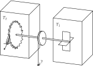
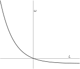

SOURCE: Feynman Lectures on Physics, Volume I, Chapter 46
LANGUAGE: ru
TITLE: Глава 46. Храповик и собачка
SOURCE_URL: https://www.feynmanlectures.caltech.edu/I_46.html
NOTEBOOKLM_USE: clean lecture text with TeX math and figure captions; reader navigation removed.

# Глава 46. Храповик и собачка

## 46–1 Как действует храповик

В этой главе мы поговорим о храповике и собачке — очень простом устройстве, позволяющем оси вращаться только в одном направлении. Возможность получать одностороннее вращение заслуживает глубокого и тщательного анализа, из него проистекут интересные заключения.

Вопросы, которые мы будем обсуждать, возникают при попытке найти с молекулярной или кинетической точки зрения простое объяснение тому, что существует предел работы, которая может быть получена от тепловой машины. Правда, мы уже знаем сущность доказательства Карно, но было бы приятно найти и элементарное его объяснение — такое, которое показало бы, что там физически на самом деле происходит. Существуют, конечно, сложные, покоящиеся на законах Ньютона математические доказательства ограниченности количества работы, которое можно получить, когда тепло перетекает с одного места в другое; но очень непросто сделать эти доказательства элементарными. Короче говоря, мы не понимаем их, хотя можем проследить выкладки.

В доказательстве Карно то обстоятельство, что при переходе от одной температуры к другой нельзя извлечь неограниченное количество тепла, следует из другой аксиомы: если все происходит при одной температуре, то тепло не может быть превращено в работу посредством циклического процесса. Поэтому первым делом попытаемся понять, хотя бы на одном элементарном примере, почему верно это более простое утверждение.

### Figure Ch46-F1
Caption: Фиг. 46.1. Машина, состоящая из храповика и собачки.
Image: figures/Ch46-F1.svg

Попробуем придумать такое устройство, чтобы второй закон термодинамики нарушался, т. е. чтобы работу из теплового резервуара получали, а перепада температур не было. Пусть в сосуде находится газ при некоторой температуре, а внутри имеется вертушка (см. фиг. 46.1, но будем считать, что \(T_1 =\) \(T_2 =\) \(T\) , например). От ударов молекул газа вертушка будет покачиваться. Нам остается лишь пристроить к другому концу оси колесико, которое может вертеться только в одну сторону, — храповичок с собачкой. Собачка пресечет попытки вертушки поворачиваться в одну сторону, а повороты в другую — разрешит. Колесико будет медленно поворачиваться; может быть, удастся даже подвесить на ниточку блошку, привязать нить к барабану, насаженному на ось, и поднять эту блошку! Возможно ли это? По гипотезе Карно — нет. Но по первому впечатлению — очень даже возможно (если только мы верно рассудили). Видно, надо посмотреть повнимательнее. И действительно, если вдумаешься в работу храповика с собачкой, все оказывается не так просто.

Во-первых, хотя наш идеализированный храповик и предельно прост, но есть еще собачка, а при ней положено быть пружинке. Проскочив очередной зубец, собачка должна возвратиться в прежнее положение, так что без пружинки не обойтись.

Весьма существенно и другое свойство храповика и собачки (на рисунке его нельзя показать). Предположим, что части нашего устройства идеально упруги. Когда собачка пройдет через конец зубца и сработает пружинка, собачка ударится о колесико и начнет подпрыгивать. Если в это время произойдет очередная флуктуация, вертушка может повернуться в другую сторону, так как зубец может проскользнуть под собачкой, когда та приподнята! Значит, для необратимости вертушки важно, чтобы было устройство, способное гасить прыжки собачки. Но при этом гашении энергия собачки перейдет к храповику и примет вид тепловой энергии. Выходит, что по мере вращения храповик будет все сильнее нагреваться. Для простоты пусть газ вокруг храповика уносит часть тепла. Во всяком случае, вместе с храповиком начнет нагреваться и сам газ. И что же, так будет продолжаться вечно? Нет! Собачка и храповик, сами обладая некоторой температурой \(T\) , подвержены также и броуновскому движению. Это значит, что время от времени собачка случайно поднимается и проходит мимо зубца как раз в тот момент, когда броуновское движение вертушки пытается повернуть ее назад. И чем горячее предмет, тем чаще это бывает.

Вот отчего наш механизм не будет находиться в вечном движении. Иногда от щелчков по крыльям вертушки собачка поднимается и вертушка поворачивается. Но иногда, когда вертушка стремится повернуть назад, собачка оказывается уже приподнятой (из-за флуктуаций движений этого конца оси) и храповик действительно поворачивает обратно. В итоге — чистый нуль. И совсем нетрудно показать, что, когда температура в обоих сосудах одинакова, в среднем вращения не будет. Будет, конечно, множество поворотов в ту или иную сторону, но чего мы хотим — одностороннего вращения, — тому не бывать.

Рассмотрим причину этого. Чтобы поднять собачку до верха зубца, надо проделать работу против натяжения пружинки. Назовем эту работу \(\epsilon\) ; пусть \(\theta\) — угол между зубцами. Шанс, что система накопит достаточно энергии \(\epsilon\) , чтобы поднять собачку до края зубца, есть \(e^{-\epsilon/kT}\) . Но вероятность того, что собачка поднимется случайно, тоже есть \(e^{-\epsilon/kT}\) . Значит, сколько раз собачка случайно поднимется, давая храповику свободно повернуться назад, столько же раз окажется достаточно энергии, чтобы при прижатой собачке вертушка повернулась вперед. Выйдет равновесие, а не вращение.

## 46–2 Храповик как машина

Пойдем дальше. Рассмотрим другой пример: температура вертушки \(T_1\) , а температура колеса, или храповика, \(T_2\) , причем \(T_2\) меньше \(T_1\) . Так как храповик холодный и флуктуации собачки сравнительно редки, ей теперь очень трудно раздобыть энергию \(\epsilon\) . Из-за высокой температуры \(T_1\) вертушка часто получает энергию \(\epsilon\) , и наше устройство начнет, как и задумано, вертеться в одну сторону.

Посмотрим-ка, удастся ли нам теперь поднимать грузы. Привяжем к барабану нить и привесим к ней грузик вроде нашей блошки. Пусть \(L\) будет момент, создаваемый грузом. Если \(L\) не очень велик, наша машина груз поднимет, так как из-за броуновских флуктуаций повороты в одну сторону вероятнее, чем в другую. Определим, какой вес мы сможем поднять, как быстро он будет подниматься и т. д.

Сперва рассмотрим движение вперед, для которого храповик и предназначен. Сколько энергии нужно занять у вертушки, чтобы продвинуться на шаг? Чтобы поднять собачку, нужна энергия \(\epsilon\) . Чтобы повернуть храповик на угол \(\theta\) против момента \(L\) , нужна энергия \(L\theta\) . Всего нужно занять энергию \(\epsilon + L\theta\) . Вероятность заполучить ее пропорциональна \(e^{-(\epsilon + L\theta)/kT_1}\) . В действительности дело не только в самой этой энергии, но и в том, сколько раз в секунду она окажется в нашем распоряжении. Вероятность в секунду пропорциональна \(e^{-(\epsilon + L\theta)/kT_1}\) ; обозначим коэффициент пропорциональности \(1/\tau\) (он в конце выкладок выпадет). После каждого шага вперед совершенная над грузом работа равна \(L\theta\) . Энергия, взятая у вертушки, равна \(\epsilon + L\theta\) . Пружина заводится с энергией \(\epsilon\) , затем раздается щелк, щелк, хлоп, и эта энергия переходит в тепло. Вся одолженная энергия идет на то, чтобы поднять груз и собачку, которая затем падает и отдает тепло другой стороне.

Рассмотрим теперь противоположный случай — движение назад. Что происходит здесь? Чтобы заставить колесо вращаться назад, надо лишь снабдить собачку такой энергией, чтоб ей хватило сил подняться и пропустить храповик. Эта энергия по-прежнему равна \(\epsilon\) . Вероятность (в пересчете на секунду) того, что собачка поднимется на эту высоту, теперь равна \((1/\tau)e^{-\epsilon/kT_2}\) . Коэффициент пропорциональности тот же, но на этот раз из-за иной температуры появляется \(kT_2\) . Когда это случается, работа высвобождается, так как колесо проскальзывает назад. Оно проскальзывает на один зубец, так что высвобождается работа \(L\theta\) . Энергия, взятая у системы храповика, равна \(\epsilon\) , а энергия, переданная газу при температуре \(T_1\) на стороне вертушки, равна \(L\theta + \epsilon\) . Чтобы понять причину этого, нужно немного подумать. Положим, что собачка поднялась сама собой за счет флуктуации. Тогда, когда она падает обратно и пружина прижимает ее к зубцу, возникает сила, стремящаяся повернуть колесо, поскольку зубец давит на наклонную плоскость. Эта сила производит работу, как и сила, создаваемая грузом. Обе силы суммируются, и вся медленно высвобождаемая энергия появляется в виде тепла на стороне вертушки. (Конечно, так и должно быть по закону сохранения энергии, но мы обязаны тщательно все до конца продумать!) Мы замечаем, что все эти энергии в точности те же, только переставлены. Итак, смотря по тому, какая из этих двух скоростей больше, груз либо медленно поднимается, либо медленно опускается. Конечно, он непрерывно колеблется, то поднимаясь, то опускаясь, но мы говорим об усредненном поведении.

Положим, что при определенном весе вероятности окажутся равными. Тогда привесим к нити бесконечно легкий грузик. Весь груз медленно пойдет вниз, и машина будет совершать работу, энергия будет откачиваться от храповика и пересылаться вертушке. Если же убрать часть груза, неравновесность перекинется на другую сторону. Груз поднимается, тепло отбирается от вертушки и поставляется шестерне. Мы попадаем в условия обратимого цикла Карно благодаря тому, что груз выбран как раз так, чтобы обе вероятности были равны. Это условие таково: \((\epsilon + L\theta)/T_1 = \epsilon/T_2\) . Пусть машина медленно тянет груз вверх. Энергия \(Q_1\) отбирается от лопастей, а энергия \(Q_2\) доставляется шестерне, и эти энергии находятся в отношении \((\epsilon + L\theta)/\epsilon\) . Когда мы опускаем груз, то опять \(Q_1/Q_2 =(\epsilon + L\theta)/\epsilon\) . Итак (табл. 46.1), мы имеем
\[
\begin{equation*}
Q_1/Q_2 = T_1/T_2.
\end{equation*}
\]
. Далее, полученная работа относится к энергии, взятой у вертушки, как \(L\theta\) к \(L\theta + \epsilon\) , т. е. как \((T_1 - T_2)/T_1\) . Мы видим, что наше устройство, работая обратимо, ни за что не сможет высосать работы больше, чем позволяет это отношение. Это тот вывод, которого мы и ожидали на основе доказательства Карно, а одновременно и главный результат этой лекции. Однако мы можем использовать наше устройство, чтобы понять еще кое-какие явления, даже неравновесные, лежащие вне области применимости термодинамики.

### Table Ch46-T1

Caption: Таблица 46.1. Сводка работы храповика и собачки.

- Forward: | Needs energy | \(\epsilon + L\theta\) | from vane. \(~\therefore\text{ Rate} = \dfrac{1}{\tau}\,e^{-(L\theta +\epsilon)/kT_1}\)
- Takes from vane | \(L\theta + \epsilon\)
- Does work | \(L\theta\)
- Gives to ratchet | \(\epsilon\)
- Backward: | Needs energy | \(\epsilon\) | for pawl. \(~\therefore\text{ Rate} = \dfrac{1}{\tau}\,e^{-\epsilon/kT_2}\)
- Takes from ratchet | \(\epsilon\) | same as above with sign reversed.
- Releases work | \(L\theta\)
- Gives to vane | \(L\theta + \epsilon\)
- If system is reversible, rates are equal, hence \(~\dfrac{\epsilon + L\theta}{T_1} = \dfrac{\epsilon}{T_2}\) .
- \(\dfrac{\text{Heat to ratchet}}{\text{Heat from vane}} = \dfrac{\epsilon}{L\theta + \epsilon}.~\) Hence \(~\dfrac{Q_2}{Q_1} = \dfrac{T_2}{T_1}\) .

Давайте подсчитаем теперь, как быстро наш односторонний механизм будет вращаться, если все его части одинаково нагреты, а к барабану подвешен грузик. Если мы потянем очень, очень сильно, конечно, могут произойти любые неприятности. Собачка соскользнет вдоль храповика, пружинка лопнет или еще что-нибудь случится. Но предположим, мы тянем так осторожно, что все работает гладко. В этих условиях верен вышеприведенный анализ вероятностей поворота храповика вперед или назад, если только учесть равенство температур. С каждым скачком валик поворачивается на угол \(\theta\) , так что угловая скорость равна \(\theta\) , помноженной на вероятность одного из этих скачков в секунду. Ось поворачивается вперед с вероятностью \((1/\tau)e^{-(\epsilon
+ L\theta)/kT}\) , а назад она поворачивается с вероятностью \((1/\tau)e^{-\epsilon/kT}\) , так что для угловой скорости мы имеем
\[
\begin{align}
\omega &= (\theta/\tau)(e^{-(\epsilon + L\theta)/kT} -
e^{-\epsilon/kT})\notag\\[.5ex]
\label{Eq:I:46:1}
&= (\theta/\tau)e^{-\epsilon/kT}(e^{-L\theta/kT} - 1).
\end{align}
\]
. Если мы построим график зависимости \(\omega\) от \(L\) , то получим кривую, показанную на фиг. 46.2. Мы видим, что играет большую роль, положительно \(L\) или отрицательно. Если \(L\) растет, будучи положительным, что бывает, когда мы хотим повернуть храповик назад, скорость вращения назад близка к постоянной величине. А когда \(L\) становится отрицательным, \(\omega\) поистине «рвется вперед», так как \(e\) в огромной степени очень велико!

### Figure Ch46-F2
Caption: Фиг. 46.2. Угловая скорость храповика как функция вращательного момента.
Image: figures/Ch46-F2.svg

Таким образом, угловая скорость, вызываемая действием разных сил, весьма несимметрична. Пойти в одну сторону легко: мы получаем большую угловую скорость от маленькой силы. Идя в обратную сторону, мы можем приложить много усилий, а вал все же будет двигаться еле-еле.

Такое же положение возникает в электрическом выпрямителе. Вместо силы там имеется электрическое поле, а взамен угловой скорости — сила тока. Для выпрямителя напряжение тоже не пропорционально сопротивлению, наблюдается та же несимметричность. Анализ, проделанный нами для механического выпрямителя, годится и для электрического. Вид полученной выше формулы типичен для зависимости пропускной способности выпрямителя от напряжения.

Уберем теперь все грузики и обратимся к первоначальному механизму. Если бы \(T_2\) было меньше \(T_1\) , то храповик вертелся бы вперед. Этому поверит любой. Но вот во что трудно поверить сразу, так это в обратное. Если \(T_2\) больше \(T_1\) , то храповик вращается назад! Динамический храповик с избытком теплоты внутри вертится назад, потому что собачка храповика отскакивает. Если собачка в какой-то момент находится на наклонной плоскости, она толкает эту плоскость в сторону подъема. Но это происходит все время, ведь если случится, что собачка поднимется достаточно высоко, чтобы проскочить край зубца, она окажется на новой наклонной плоскости. Словом, горячие храповик с собачкой идеально приспособлены для вращения в сторону, обратную той, в какую им первоначально предназначено было вертеться!

Как бы хитроумно мы ни сконструировали «однобокий» механизм, при равенстве температур он не захочет вертеться в одну сторону чаще, чем в другую. Когда мы смотрим на него, он может поворачиваться либо туда, либо сюда, но при продолжительной работе ему никуда не уйти. Тот факт, что он не уйдет никуда, на самом деле фундаментальный, глубокий принцип: все в термодинамике покоится на нем.

## 46–3 Обратимость в механике

Что же это за глубокий механический принцип, который утверждает, что при постоянстве температуры и достаточно продолжительной работе наше устройство не уйдет ни назад, ни вперед? Очевидно, мы получили фундаментальное утверждение о том, что нельзя придумать машину, которая, будучи предоставлена самой себе в течение долгого времени, охотней повернулась бы в какую-то одну определенную сторону. Попробуем выяснить, как это вытекает из законов механики.

Законы механики действуют примерно так: сила есть масса на ускорение; сила, действующая на частицу, есть сложная функция положений всех прочих частиц. Бывает, что силы зависят и от скорости, например в магнетизме, но не о них сейчас речь. Возьмем простой случай, скажем тяготение, когда силы определяются только расположением частиц. Положим, что мы решили нашу систему уравнений и получили для каждой частицы определенную траекторию \(x(t)\) . Для достаточно сложных систем и решения очень сложны; с течением времени возможно появление самых невероятных конфигураций. Если мы придумаем любое, какое только нам придет в голову, расположение частиц и терпеливо подождем, то это расположение непременно наступит! Следя за решением в течение долгого времени, мы увидим, что оно как бы перепробует все, что возможно. В простейших устройствах это не обязательно, но в более или менее сложных системах с большим числом атомов такая вещь происходит. Но решения способны и на большее. Решая уравнения движения, мы можем получить некоторую функцию, скажем \(t + t^2
+ t^3\) . Мы утверждаем, что другим решением будет \(-t + t^2 - t^3\) . Иными словами, если всюду в решение подставить \(-t\) вместо \(t\) , то мы получим еще одно решение того же уравнения. Это произойдет оттого, что при подстановке \(-t\) вместо \(t\) в первоначальном дифференциальном уравнении ничего не изменится: в нем присутствуют лишь вторые производные по \(t\) . Значит, если наблюдается некоторое движение, то возможно и точно противоположное движение. К нашему замешательству, может оказаться, когда мы следим за движением достаточно долго, что оно временами совершается в одну сторону, а временами — в обратную. Одно направление ничем не привлекательней другого. Поэтому невозможно сконструировать машину, для которой после длительной работы одно направление окажется более вероятным, чем другое, если только машина достаточно сложна.

Можно, правда, придумать пример, для которого это явным образом неверно. Взять, например, колесо, закрутить его в пустом пространстве, и оно навсегда пойдет вертеться в одну сторону. Имеются поэтому некоторые условия, вроде сохранения момента вращения, из-за которых наши рассуждения нарушаются. Но это только означает, что наши доказательства надо проделать поаккуратней. Надо, например, учесть, что вращательный момент забирают себе стенки или еще что-то, так что специальные законы сохранения перестают действовать. Тогда опять, если система достаточно сложна, наше доказательство годится. Оно основано на обратимости законов механики.

Отдавая должное истории, мы хотели бы отметить устройство, изобретенное Максвеллом, впервые разработавшим динамическую теорию газов. Он нарисовал такую картину: пусть имеются два сосуда с газом при одной и той же температуре. Между сосудами имеется маленькое отверстие. Возле него сидит небольшой чертик (конечно, это может быть и прибор!). В отверстии есть дверца, чертик может ее открывать и закрывать. Он следит за молекулами, подлетающими слева. Как только он замечает быструю молекулу, он отворяет дверцу. Увидит медленную — дверцу на замок! Можно сделать его чертиком высшей квалификации, пристроив на затылок ему еще пару глаз, чтобы с молекулами в другом сосуде он поступал наоборот: пропускал налево медленные, а быстрые не выпускал. Вскоре левый сосуд остынет, а правый нагреется. Спрашивается, будут ли нарушены идеи термодинамики существованием этакого чертика?

Оказывается, что если чертик конечного размера, то сам он вскоре так нагреется, что ничего не увидит. Простейшим чертиком явится, скажем, откидная дверца с пружинкой. Быстрой молекуле хватает сил открыть дверцу и проскочить, а медленной не хватит, и она отлетит прочь. Но это опять-таки знакомая нам система храповик — собачка, только в другом виде; в конце концов механизм просто нагреется. Чертик не может не нагреться, если его теплоемкость не бесконечна. В нем, во всяком случае, имеется конечное число шестеренок и колесиков, так что он не сможет отделаться от излишка тепла, которое приобретет, наблюдая молекулы. Вскоре он так начнет дрожать от броуновского движения, что не сможет сказать, что это там за молекулы, приближаются ли они, удаляются ли, словом, не сможет работать.

## 46–4 Необратимость

Все ли законы физики обратимы? Конечно, нет! Попробуйте-ка, например, из яичницы слепить обратно яйцо! Или пустите фильм в обратную сторону — публика в зале тотчас же начнет смеяться. Необратимость — самая яркая черта всех событий.

Откуда же она появляется? Ведь ее нет в законах Ньютона. Если мы считаем, что любое явление может быть в конечном счете объяснено законами физики, и если также оказывается, что все уравнения обладают фантастическим свойством давать при \(t =
-t\) другое решение, то ведь тогда обратимо любое явление. Но как же тогда получается, что в природе, в явлениях большого масштаба, все необратимо? Видимо, значит, есть какие-то законы, какие-то неизвестные нам, но важные уравнения, быть может, даже в электричестве, а может, в нейтринной физике, для которых уже существенно, куда идет время.

Рассмотрим теперь этот вопрос. Один закон такого рода мы уже знаем — он утверждает, что энтропия только растет. Когда одно тело теплое, а другое холодное, тепло переходит от теплого к холодному. Это утверждение нам подошло бы. Но хорошо бы и этот закон понять с точки зрения механики. Нам уже удалось получить при помощи чисто механических соображений все следствия из постулата о том, что тепло не может течь в обратную сторону; это помогло нам понять второй закон. Значит, необратимость из обратимых уравнений получать мы способны. Но использовали ли мы при этом только законы механики? Разберемся в этом глубже.

Так как речь зашла об энтропии, то нам придется найти ее микроскопическое описание. Когда мы говорим, что в чем-то (например, в газе) содержится определенное количество энергии, то мы можем обратиться к микроскопической картине этого явления и сказать, что каждый атом имеет определенную энергию. Полная энергия есть сумма энергий атомов. Равным образом, у каждого атома есть своя определенная энтропия. Суммируя, получим полную энтропию. На самом деле здесь все обстоит не так уж гладко, но все же давайте посмотрим, что получится.

В виде примера подсчитаем разницу энтропий газа при одной температуре, но в разных объемах. Из гл. 44 мы помним, что для изменения энтропии мы имели
\[
\begin{equation*}
\Delta S = \int\frac{dQ}{T}.
\end{equation*}
\]
В нашем случае энергия газа до и после расширения одна и та же, потому что температура не менялась. Значит, чтобы восполнить работу, проделанную газом, нужно придать ему какое-то количество тепла, или для каждого малого изменения объема
\[
\begin{equation*}
dQ = P\,dV.
\end{equation*}
\]
Подставив это вместо \(dQ\) , получим, как и в гл. 44,
\[
\begin{align*}
\Delta S &= \int_{V_1}^{V_2}P\,\frac{dV}{T} =
\int_{V_1}^{V_2}\frac{NkT}{V}\,\frac{dV}{T}\\[.5ex]
&= Nk\ln\frac{V_2}{V_1},
\end{align*}
\]
Например, при увеличении объема в \(2\) раза энтропия меняется на \(Nk\ln 2\) .

Рассмотрим теперь другой интересный пример. Пусть имеется цилиндр с перегородкой посредине. По одну ее сторону — неон («черные» молекулы), а по другую — аргон («белые» молекулы). Уберем перегородку и позволим газам перемешаться. Как изменится энтропия? Можно представить себе, что вместо перегородки между газами стоит поршень с отверстиями, в которые проходят белые молекулы и не проходят черные, и другой поршень с обратными свойствами. Сдвигая поршень к основанию цилиндра, легко понять, что для каждого газа задача сводится к только что решенной. Энтропия, таким образом, меняется на \(Nk\ln
2\) ; это значит, что энтропия на одну молекулу возрастает на \(k\ln 2\) . Цифра \(2\) появилась оттого, что вдвое увеличился объем, приходящийся на одну молекулу. Странное обстоятельство! В нем проявилось свойство не самой молекулы, а свободного места вокруг нее. Выходит, что энтропия увеличивается, когда температура и энергия не меняются, а изменилось только распределение молекул!

Мы знаем, что стоит убрать перегородку, и газы через некоторое время перемешаются из-за столкновений, колебаний, ударов молекул и т. д. Стоит убрать перегородку, и какая-то белая молекула начнет приближаться к черной, а черная — к белой, они проскочат мимо друг друга и т. д. Постепенно какие-то из белых молекул проникнут случайно в объем, занятый черными, а черные — в область белых. Через какое-то время получится смесь. В общем это необратимый процесс реального мира, он должен привести к росту энтропии.

Перед нами простой пример необратимого процесса, полностью состоящего из обратимых событий. Каждый раз, когда происходит столкновение двух молекул, они разлетаются в определенных направлениях. Если запустить киноленту, на которой засняты столкновения, в обратную сторону, то ничего неправильного на экране не появится. Ведь один вид столкновений столь же вероятен, как и другой. Поэтому перемешивание полностью обратимо, и тем не менее оно необратимо. Каждому известно, что, взяв отдельно белое и отдельно черное и перемешав их, мы через несколько минут получим смесь. Подождем еще сколько-то там минут — они не отделятся, смесь останется смесью. Значит, бывает необратимость, основанная на обратимых ситуациях. Но теперь нам ясна и причина. Мы начали с расположения, которое в каком-то смысле упорядочено. В хаосе столкновений оно стало неупорядоченным. Переход от упорядоченного расположения к беспорядочному является источником необратимости.

Конечно, если бы мы сняли на киноленту это движение и пустили бы потом пленку назад, то увидели бы, как постепенно устанавливается порядок. Кто-нибудь мог бы возразить: «Но это — против всех законов физики!» Тогда мы бы прокрутили фильм еще раз и просмотрели бы каждое столкновение. Все они были бы безупречны, каждое подчинялось бы законам физики. Все дело, конечно, в том, что скорости каждой молекулы были бы выдержаны в точности, так что, если проследить их пути вспять, мы возвратимся к начальным условиям. Но такая ситуация крайне маловероятна. Если иметь дело не со специально приготовленным газом, а просто с белыми и черными молекулами, их никогда не удалось бы вернуть назад.

## 46–5 Порядок и энтропия

Итак, мы должны теперь потолковать о том, что понимать под беспорядком и что — под порядком. Дело не в том, что порядок приятен, а беспорядок неприятен. Наши смешанные и несмешанные газы отличаются следующим. Пусть мы разделили пространство на маленькие элементы объема. Сколькими способами можно разместить белые и черные молекулы в элементах объема так, чтобы белые оказались на одной стороне, а черные — на противоположной? И сколькими способами можно их разместить без этого ограничения? Ясно, во втором случае способов гораздо больше. Мы измеряем «беспорядок» в чем-то по числу способов, каким может быть переставлено его содержимое, лишь бы внешне все выглядело без изменения. Логарифм числа способов — это энтропия. В цилиндре с разделенными газами число способов меньше и энтропия меньше, т. е. меньше «беспорядок».

Пользуясь этим техническим определением «беспорядка», можно понять наше утверждение. Во-первых, энтропия измеряет «беспорядок». Во-вторых, Вселенная всегда переходит от «порядка» к «беспорядку», поэтому энтропия всегда растет. Порядок не есть порядок в том смысле, что именно эта расстановка молекул нам нравится; смысл в том, что число разных способов расставить молекулы (лишь бы со стороны расстановки выглядели одинаково) относительно ограничено. Когда мы крутили назад наш фильм о перемешивании газов, было не так уж много беспорядка. Каждый отдельный атом имел в точности необходимые скорость и направление, чтобы выйти куда положено! Энтропия была в общем невысока, хотя это и не было заметно.

А что можно сказать о необратимости других физических законов? Когда мы рассматривали электрическое поле ускоряемого заряда, было сказано, что мы должны брать запаздывающее поле. В момент \(t\) на расстоянии \(r\) от заряда надо брать поле, созданное ускорением в момент \(t - r/c\) , а не в момент \(t + r/c\) . Поэтому законы электричества на первый взгляд необратимы. Вместе с тем очень странно, что эти законы следуют из уравнений Максвелла, которые в действительности обратимы. Однако можно привести довод, что если бы мы пользовались только опережающим полем, полем, отвечающим положению дел в момент \(t + r/c\) , и сделали это совершенно последовательно в полностью замкнутом пространстве, то все происходило бы в точности так же, как при употреблении запаздывающих полей! Эта кажущаяся необратимость в теории электричества, таким образом (по крайней мере в замкнутой полости), вовсе не является необратимостью. Вы это должны уже слегка сами чувствовать; вы знаете уже, что когда колеблющийся заряд создает поле, отражающееся от стен оболочки, то в конечном счете устанавливается равновесие, в котором односторонности нет места. Запаздывающие поля — только прием, удобный метод решения.

Насколько нам известно, все основные законы физики, подобно уравнениям Ньютона, обратимы. Тогда откуда необратимость? Она — из-за превращения порядка в беспорядок. Но это утверждение все равно не понятно, пока мы не знаем, откуда порядок. Почему ситуации, в которых мы оказываемся ежедневно, никогда не бывают равновесными? Одно мыслимое объяснение таково. Рассмотрим снова наш цилиндр со смесью белых и черных молекул. Если следить за ним достаточно долго, может оказаться, что по чисто случайному, крайне невероятному, но все же мыслимому стечению обстоятельств белые молекулы распределятся главным образом у дна, а черные — у крышки. После этого с течением времени они опять начнут перемешиваться.

Стало быть, одно возможное объяснение высокой степени упорядоченности нынешнего мира заключается в том, что нам просто повезло. Вероятно, как-то однажды во Вселенной случилась флуктуация, все как-то разделилось, а теперь вновь возвращается к прежнему. Такая теория не несимметрична; на вопрос, как мог бы выглядеть разделенный газ немного раньше или немного позже, она ответит: в любом случае мы увидели бы серое пятно, потому что молекулы опять смешались бы. Как бы ни потекло время, вперед или назад, газ все равно перемешался бы. Таким образом, по этой теории именно необратимость является одной из случайностей жизни.

Легко показать, что это не так. Предположим, что мы смотрим не на весь цилиндр сразу, а на какую-то часть его. Пусть в какой-то момент мы открыли в этой части определенную степень порядка: белое с черным в ней разделены. Что отсюда следует для частей, которые мы еще не рассматривали? Если мы и впрямь считаем, что порядок возникает из беспорядка путем флуктуации, то мы обязаны рассмотреть самую вероятную флуктуацию из тех, которые способны в нашей части установить порядок. Но при такой наивероятнейшей флуктуации остальная часть сосуда вовсе не должна рассортироваться — совсем наоборот! Значит, из гипотезы, что мир — это флуктуация, следует, что, когда мы взглянем на часть мира, прежде нами не виденную, мы должны обнаружить в ней смесь, беспорядок, в отличие от известного нам прежде мира. Если весь наш порядок есть флуктуация, выброс, мы не смеем надеяться на порядок где-либо сверх того; где он уже обнаружен.

Теперь мы предполагаем, что разделение произошло от того, что в прошлом Вселенная была действительно упорядочена. Это произошло не из-за флуктуации, а просто всё это было белым и черным. Эта теория теперь предсказывает, что в других местах тоже будет порядок — порядок не из-за флуктуации, а из-за гораздо более высокой упорядоченности в начале времен. Тогда мы ожидали бы обнаружить порядок в местах, куда мы еще не заглядывали.

Астрономы, например, пока наблюдали не все звезды. Каждую ночь они наводят свои телескопы на новые звезды, и эти звезды ведут себя так же, как и старые. Из этого мы заключаем, что Вселенная — не флуктуация и что наш порядок — это память о тех временах, когда все только начиналось. Мы не говорим, что нам понятна логика этого. По каким-то причинам Вселенная когда-то имела очень малую для своего энергосодержания энтропию, и с той поры энтропия выросла. Это — путь по направлению в будущее. В этом начало всех необратимостей. Именно это порождает процессы роста и распада. Именно из-за этого мы вспоминаем не будущее, а прошлое, вспоминаем события, которые ближе к тому моменту в истории мира, когда порядок был лучше нынешнего. Именно поэтому мы не способны вспомнить события того времени, беспорядок при котором сильней теперешнего, — мы называем это время будущим. Мы уже говорили когда-то, что в стакане вина откроется нам вся Вселенная, стоит только заглянуть в него поглубже. Стакан вина — штука достаточно сложная, есть там и влага, и стекло, и свет, и еще многое другое.

Прелесть физики еще и в том, что даже такие простые и идеализированные вещи, как храповик с собачкой, действуют лишь оттого, что и они — часть Вселенной. Храповик с собачкой работают в одну сторону только потому, что они находятся в тесном контакте с остальной Вселенной. Если бы храповик с собачкой поместить в сосуд и изолировать на некоторое время, то колесико перестанет предпочитать одно направление вращения другому. Но по той же причине, по какой мы, открывая шторы, впускаем свет, из-за чего мы идем остывать в тень и греться на солнце, по той же причине храповик с собачкой вертятся лишь в одну сторону. Односторонность связана как-то с тем, что храповик — это часть нашей Вселенной. Часть Вселенной не только в том смысле, что храповик подчиняется законам Вселенной, но и в том, что его одностороннее поведение связано с односторонним поведением всей Вселенной. Поведение храповика не будет понято до конца, пока тайна начала начал Вселенной из смутных гипотез не перейдет в область научного познания.
