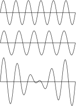
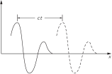
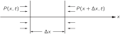

SOURCE: Feynman Lectures on Physics, Volume I, Chapter 47
LANGUAGE: ru
TITLE: Глава 47. Звук. Волновое уравнение
SOURCE_URL: https://www.feynmanlectures.caltech.edu/I_47.html
NOTEBOOKLM_USE: clean lecture text with TeX math and figure captions; reader navigation removed.

# Глава 47. Звук. Волновое уравнение

## 47–1 Волны

В этой главе мы будем обсуждать явление волн. Это явление встречается во многих областях физики, и поэтому наше внимание должно быть сконцентрировано на нем не только потому, что здесь рассматривается частный пример — звук, — но и потому, что эти идеи имеют гораздо более широкое применение во всех областях физики.

Изучая гармонический осциллятор, мы уже отмечали, что существуют не только механические примеры колеблющихся систем, но и электрические. Волны связаны с колебательными системами, однако волновые колебания проявляются не только как колебания во времени в одном месте, но и распространяются в пространстве.

Мы уже на самом деле изучали волны. Когда мы говорили о волновых свойствах света, мы обращали особое внимание на пространственную интерференцию волн одной и той же частоты от различных источников, расположенных в разных местах. Существуют еще два важных явления, о которых мы не упоминали и которые свойственны как свету, т. е. электромагнитным волнам, так и любой другой форме волнового движения. Первое из них — это явление интерференции, но уже не в пространстве, а во времени. Когда мы слушаем звуки сразу от двух источников, причем частоты их слегка отличаются, к нам приходят то гребни обеих волн, то гребень одной волны и впадина другой (фиг. 47.1). Звук то усиливается, то ослабевает, возникают биения, или, другими словами, происходит интерференция во времени. Второе явление — это волновое движение в замкнутом объеме, когда волны отражаются то от одной, то от другой стенки.

### Figure Ch47-F1
Caption: Фиг. 47.1. Интерференция звука во времени от двух источников с несколько отличающимися частотами приводит к биениям.
Image: figures/Ch47-F1.svg

Все эти эффекты можно было, конечно, рассмотреть и на примере электромагнитных волн. Мы этого не сделали по той причине, что на одном примере мы не почувствовали бы общего характера явления, свойственного самым разным процессам. Чтобы подчеркнуть общность понятия вне рамок электродинамики, мы рассмотрим здесь другой пример — звуковые волны.

Другими примерами волн служат водяные волны, состоящие из длинных валов, которые, как мы видим, набегают на берег, или более мелкие водяные волны — рябь, вызванная поверхностным натяжением. В качестве другого примера можно привести два рода упругих волн в твердых телах: волну сжатия (или продольную волну), в которой частицы тела колеблются вперед и назад в направлении распространения волны (звуковые волны в газе именно такого типа), и поперечную волну, когда частицы тела колеблются перпендикулярно направлению движения волны. Сейсмические волны содержат упругие волны обоих типов, порождаемые движением в каком-то месте земной коры.

И, наконец, есть еще один тип волн, который нам дает современная физика. Это волны, определяющие амплитуду вероятности нахождения частицы в данном месте, — «волны материи», о которых мы уже говорили. Их частота пропорциональна энергии, а волновое число пропорционально импульсу. Эти волны встречаются в квантовой механике.

В этой главе мы будем рассматривать только такие волны, скорость которых не зависит от длины волны. Это, например, имеет место для света в вакууме. Скорость света в этом случае одна и та же для радиоволн, синего и зеленого света или для любой другой длины волны. Именно поэтому, когда мы начали описывать волновые явления, мы сначала и не заметили, что имеем дело с распространением волн. Вместо этого мы говорили, что если сдвинуть заряд в одном месте, то электрическое поле на расстоянии \(x\) будет пропорционально ускорению, но не в момент времени \(t\) , а в более ранний момент времени \(t - x/c\) . Поэтому, если бы мы изобразили электрическое поле в пространстве в некоторый момент времени, как на фиг. 47.2, то спустя время \(t\) оно передвинулось бы на расстояние \(ct\) , как показано на рисунке. Выражаясь математически, можно сказать, что в рассматриваемом нами одномерном случае электрическое поле есть функция от \(x - ct\) . Мы видим, что при \(t = 0\) оно оказывается некоторой функцией от \(x\) . Если рассмотреть более поздний момент времени, нам нужно лишь несколько увеличить \(x\) , чтобы получить то же самое значение электрического поля. Например, если максимум поля возникал при \(x = 3\) в нулевой момент времени, то, чтобы найти новое положение максимума поля в момент времени \(t\) , нам требуется
\[
\begin{equation*}
x - ct = 3\quad
\text{or}\quad
x = 3 + ct.
\end{equation*}
\]
. Мы видим, что такая функция отвечает распространению волны.

### Figure Ch47-F2
Caption: Фиг. 47.2. Сплошная кривая показывает, каким может быть электрическое поле в некоторый момент времени, а штриховая кривая показывает электрическое поле через промежуток времени \(t\) .
Image: figures/Ch47-F2.svg

Такая функция, \(f(x - ct)\) , описывает волну. Мы можем записать это описание волны кратко:
\[
\begin{equation*}
f(x - ct) = f(x + \Delta x - c(t + \Delta t)),
\end{equation*}
\]
, если \(\Delta x = c\,\Delta t\) . Конечно, существует и другая возможность, когда вместо источника слева, как указано на фиг. 47.2, источник находится справа, так что волна распространяется в сторону отрицательных \(x\) . Тогда волна описывалась бы функцией \(g(x + ct)\) .

Существует также возможность того, что в пространстве одновременно существует несколько волн, и тогда электрическое поле представляет собой сумму двух полей, причем каждое из них распространяется независимо. Такое поведение электрических полей можно описать так: если \(f_1(x - ct)\) — это волна, а \(f_2(x - ct)\) — другая волна, то их сумма также является волной. Это называется принципом суперпозиции. Этот же принцип справедлив и для звука.

Мы хорошо знаем, что если создается звук, мы с полной точностью слышим ту же последовательность звуков, какая была порождена. Если бы высокие частоты распространялись быстрее, чем низкие, то резкий и отрывистый шум слышался бы как последовательность музыкальных звуков. Точно так же, если бы красный свет двигался быстрее, чем синий, то вспышка белого света выглядела бы сначала красной, затем белой и наконец синей. Мы хорошо знаем, что на самом деле этого не происходит. И звук, и свет движутся в воздухе со скоростью, почти не зависящей от частоты. Примеры волнового движения, для которых эта независимость не выполняется, будут рассмотрены в главе 48.

Для света (электромагнитных волн) мы получили формулу, определяющую электрическое поле в данной точке, которое возникает при ускорении заряда. Казалось бы, нам остается теперь подобным образом определить какую-нибудь характеристику воздуха, скажем давление на заданном расстоянии от источника через движение источника, и учесть запаздывание при распространении звука. В случае света такой подход был приемлем, так как все наши знания сводились к тому, что заряд в одном месте действует с некоторой силой на заряд в другом месте. Подробности распространения взаимодействия из одной точки в другую были абсолютно несущественны. Но звук, как известно, распространяется по воздуху от источника к уху, и естественно спросить, чему равно давление воздуха в каждый данный момент. Кроме того, хотелось бы знать, как именно движется воздух. В случае электричества мы могли поверить в правило, поскольку законы электричества мы еще не проходили, но для звука это не так. Нам недостаточно сформулировать закон, определяющий распространение звукового давления в воздухе; этот процесс должен быть объяснен на основе законов механики. Короче, звук есть часть механики, и он должен быть объяснен с помощью законов Ньютона. Распространение звука из одной точки в другую есть просто следствие механики и свойств газов, если звук распространяется в газе, или свойств жидкостей и твердых тел, если звук проходит через эти среды. Позднее мы выведем также свойства света и его волновое движение из законов электродинамики.

## 47–2 Распространение звука

Давайте выведем теперь свойства распространения звука между источником и приемником, основываясь на законах Ньютона, но не учитывая при этом взаимодействия звука с источником и приемником. Обычно мы более подробно останавливались на результате, а не на его выводе. В этой главе мы используем противоположный подход. Главным здесь будет в некотором смысле само получение результата. Метод объяснения новых явлений с помощью старых, законы которых уже известны, представляет собой, пожалуй, величайшее искусство математической физики. Математическая физика решает две проблемы: найти решение заданного уравнения и найти уравнения, описывающие новое явление. То, чем мы будем заниматься, относится как раз ко второй проблеме.

Рассмотрим простейший пример — распространение звука в одномерном пространстве. Для вывода нам сначала необходимо понять, что же в действительности происходит. В основе явления лежит следующий факт: когда тело перемещается в воздухе, возникает возмущение, которое как-то распространяется по воздуху. На вопрос, что это за возмущение, мы можем ответить: это такое движение тела, которое вызывает изменение давления. Конечно, если тело движется медленно, воздух лишь обтекает его, но нас интересует быстрое движение, когда воздух не успевает обойти вокруг тела. При этих условиях воздух в процессе движения сжимается и возникает избыточное давление, толкающее окружающие слои воздуха. Эти слои в свою очередь сжимаются, снова возникает избыточное давление, и вот начинает распространяться волна.

Опишем этот процесс на языке формул. Прежде всего решим, какие нам нужны переменные. В нашей задаче нам нужно знать, насколько переместился воздух, поэтому смещение воздуха в звуковой волне, несомненно, будет первой нашей переменной. Вдобавок хотелось бы знать, как меняется плотность воздуха при смещении. Давление воздуха тоже меняется, и это еще одна интересная переменная. Кроме того, воздух движется с некоторой скоростью, и мы должны уметь определить скорость частиц воздуха. Частицы воздуха имеют еще и ускорение, но, записав все эти переменные, мы сразу же поймем, что и скорость, и ускорение будут нам известны, если известно смещение воздуха как функция времени.

Как уже говорилось, мы рассмотрим волну в одном измерении. Так можно поступить, если мы находимся достаточно далеко от источника и так называемый фронт волны мало отличается от плоскости. На этом примере наше доказательство будет проще, поскольку мы сможем сказать, что смещение \(\chi\) зависит только от \(x\) и \(t\) , а не от \(y\) и \(z\) . Поэтому поведение воздуха описывается функцией \(\chi(x,t)\) .

Насколько полно такое описание? Казалось бы, оно очень не полно, потому что нам не известны подробности движения молекул воздуха. Они движутся во всех направлениях, и этот факт не отражается функцией \(\chi(x,t)\) . С точки зрения кинетической теории, если в одном месте наблюдается большая плотность молекул, а в соседнем меньшая, молекулы будут переходить из области с большей плотностью в область с меньшей плотностью, так чтобы уравнять плотности. Очевидно, что при этом никаких колебаний не происходит и звук не возникает. Для получения звуковой волны нужно, чтобы молекулы, вылетая из области с большей плотностью и давлением, передавали импульс другим молекулам, находящимся в области разрежения. Звук возникает в том случае, если размеры области изменения плотности и давления намного больше расстояния, проходимого молекулами до соударения с другими молекулами. Это расстояние есть длина свободного пробега, и оно должно быть много меньше расстояния между гребнями и впадинами давления. В противном случае молекулы перейдут из гребня во впадину, и волна моментально выровняется.

Очевидно, что мы собираемся описать поведение газа в масштабе, большем по сравнению с длиной свободного пробега, так что свойства газа не будут описываться через поведение отдельных молекул. Смещение, например, будет смещением центра масс малого элемента газа, а давление или плотность — давлением или плотностью в этой области. Мы обозначим давление через \(P\) , а плотность через \(\rho\) , и они будут функциями от \(x\) и \(t\) . Необходимо помнить, что это описание приближенное и справедливо лишь тогда, когда эти свойства газа не слишком быстро меняются с расстоянием.

## 47–3 Волновое уравнение

Таким образом, физика явлений в звуковой волне включает в себя три особенности: газ движется и меняет свою плотность; изменение плотности соответствует изменению давления; неравномерность распределения давления вызывает движение газа. Рассмотрим сначала свойство II. Для любого газа, жидкости или твердого тела давление является некоторой функцией плотности. До прихода звуковой волны мы имеем равновесное состояние с давлением \(P_0\) и соответствующей плотностью \(\rho_0\) . Давление \(P\) в среде связано с плотностью некоторым характерным соотношением \(P = f(\rho)\) , и, в частности, равновесное давление \(P_0\) определяется как \(P_0 =
f(\rho_0)\) . Отклонения давления в звуке от равновесного значения чрезвычайно малы. Удобной единицей измерения давления является бар, где \(1\) бар \({}= 10^5\) Н/м². Давление в \(1\) стандартную атмосферу очень близко к \(1\) бар: \(1\) атм \({} = 1.0133\) бар. Для звука мы используем логарифмическую шкалу интенсивности, поскольку чувствительность уха, грубо говоря, логарифмическая. Эта шкала представляет собой децибельную шкалу, в которой уровень звукового давления для амплитуды давления \(P\) определяется как
\[
\begin{equation}
\label{Eq:I:47:1}
I
\begin{pmatrix}
\text{acoustic}\\[-.75ex]
\text{pressure}\\[-.75ex]
\text{level}
\end{pmatrix}
= 20\log_{10}(P/P_{\text{ref}})\text{ in dB},
\end{equation}
\]
где опорное давление \(P_{\text{ref}} = 2\times10^{-10}\) бар. Амплитуда давления \(P =\) \(10^3P_{\text{ref}} =\) \(2\times10^{-7}\) бар соответствует умеренно интенсивному звуку в \(60\) децибел. Мы видим, что изменения давления в звуке чрезвычайно малы по сравнению с равновесным, или средним, давлением в \(1\) атм. Смещения и изменения плотности также чрезвычайно малы. При взрывах мы не имеем столь малых изменений; создаваемые избыточные давления могут превышать \(1\) атм. Эти большие изменения давления приводят к новым эффектам, которые мы рассмотрим позже. Для звука мы редко рассматриваем уровни интенсивности звука выше \(100\) дБ; уровень в \(120\) дБ — это уровень, который вызывает боль в ушах. Поэтому для звука, если мы запишем
\[
\begin{equation}
\label{Eq:I:47:2}
P = P_0 + P_e,\quad
\rho = \rho_0 + \rho_e,
\end{equation}
\]
, изменение давления \(P_e\) всегда будет очень малым по сравнению с \(P_0\) , а изменение плотности \(\rho_e\) — очень малым по сравнению с \(\rho_0\) . Тогда
\[
\begin{equation}
\label{Eq:I:47:3}
P_0 + P_e = f(\rho_0 + \rho_e) = f(\rho_0) +\rho_ef'(\rho_0),
\end{equation}
\]
, где \(P_0 = f(\rho_0)\) , а \(f'(\rho_0)\) означает производную от \(f(\rho)\) , взятую при значении \(\rho = \rho_0\) . Мы можем сделать второй шаг в этом равенстве только потому, что \(\rho_e\) очень мало. Таким образом, мы находим, что избыточное давление \(P_e\) пропорционально избыточной плотности \(\rho_e\) , и коэффициент пропорциональности мы можем назвать \(\kappa\) :
\[
\begin{equation}
\label{Eq:I:47:4}
P_e = \kappa\rho_e,
\,\text{where }\kappa = f'(\rho_0) = (dP/d\rho)_0.\;\text{(II)}
\end{equation}
\]
Это очень простое соотношение и есть то, которое требовалось для свойства II.

### Figure Ch47-F3
Caption: Фиг. 47.3. Смещение воздуха в точке \(x\) есть \(\chi(x, t)\) , а в точке \(x
 + \Delta x\) оно равно \(\chi(x + \Delta x, t)\) . Первоначальный объем воздуха, приходящийся на единицу площади плоской волны, равен \(\Delta x\) ; новый объем равен \(\Delta x + \chi(x + \Delta x, t) - \chi(x, t)\) .
Image: figures/Ch47-F3.svg

Рассмотрим теперь свойство I. Предположим, что положение элемента объема воздуха, не возмущенного звуковой волной, есть \(x\) , а смещение в момент времени \(t\) , вызванное звуком, равно \(\chi(x,t)\) , так что его новое положение есть \(x + \chi(x,t)\) , как на фиг. 47.3. Далее, положение соседнего элемента объема воздуха в невозмущенном состоянии есть \(x + \Delta x\) , а его новое положение есть \(x + \Delta x + \chi(x + \Delta x,t)\) . Теперь мы можем найти изменения плотности следующим образом. Поскольку мы ограничиваемся плоскими волнами, мы можем взять единичную площадку, перпендикулярную направлению \(x\) , которое является направлением распространения звуковой волны. Количество воздуха на единицу площади в интервале \(\Delta x\) составляет тогда \(\rho_0\,\Delta x\) , где \(\rho_0\) — невозмущенная, или равновесная, плотность воздуха. Этот воздух, смещенный звуковой волной, теперь находится между \(x + \chi(x,t)\) and \(x + \Delta x + \chi(x + \Delta x,t)\) , так что в этом интервале содержится то же вещество, которое находилось в интервале \(\Delta x\) в невозмущенном состоянии. Если \(\rho\) — новая плотность, то
\[
\begin{gather}
\label{Eq:I:47:5}
\rho_0\,\Delta x =\\[.5ex]
\rho[x + \Delta x + \chi(x + \Delta x,t) - x - \chi(x,t)].\notag
\end{gather}
\]
. Поскольку \(\Delta x\) мало, мы можем написать \(\chi(x + \Delta x,t) -
\chi(x,t) = (\ddpl{\chi}{x})\,\Delta x\) . Эта производная является частной, так как \(\chi\) зависит как от времени, так и от \(x\) . Тогда наше уравнение имеет вид
\[
\begin{equation}
\label{Eq:I:47:6}
\rho_0\,\Delta x = \rho\biggl(\ddp{\chi}{x}\,\Delta x + \Delta x\biggr)
\end{equation}
\]
или
\[
\begin{equation}
\label{Eq:I:47:7}
\rho_0 = (\rho_0 + \rho_e)\ddp{\chi}{x} + \rho_0 + \rho_e.
\end{equation}
\]
. Но в звуковых волнах все изменения малы, так что \(\rho_e\) мало, \(\chi\) мало и \(\ddpl{\chi}{x}\) также мало. Поэтому в соотношении, которое мы только что нашли,
\[
\begin{equation}
\label{Eq:I:47:8}
\rho_e = -\rho_0\,\ddp{\chi}{x} -\rho_e\,\ddp{\chi}{x},
\end{equation}
\]
мы можем пренебречь \(\rho_e\,\ddpl{\chi}{x}\) по сравнению с \(\rho_0\,\ddpl{\chi}{x}\) . Таким образом, мы получаем соотношение, которое требовалось для I:
\[
\begin{equation}
\label{Eq:I:47:9}
\rho_e = -\rho_0\,\ddp{\chi}{x}.\quad\text{(I)}
\end{equation}
\]
. Именно такое уравнение можно было ожидать из физических соображений. Если смещения меняются с \(x\) , то плотность будет изменяться. Знак также правильный: если смещение \(\chi\) растет с ростом \(x\) , так что воздух расширяется, плотность должна уменьшаться.

### Figure Ch47-F4
Caption: Фиг. 47.4. Результирующая сила в направлении оси \(x\) , возникающая за счет давления на единичную площадку, перпендикулярную к оси \(x\) , есть \(-(\ddpl{P}{x})\,\Delta x\) .
Image: figures/Ch47-F4.svg

Теперь нам нужно третье уравнение — уравнение движения, производимого давлением. Зная связь между силой и давлением, мы сможем получить уравнение движения. Если мы возьмем тонкий слой воздуха толщиной \(\Delta x\) и с единичной площадью грани, перпендикулярной \(x\) , то масса воздуха в этом слое равна \(\rho_0\,\Delta x\) , а его ускорение равно \(\partial^2\chi/\partial t^2\) , так что масса, умноженная на ускорение для этого слоя вещества, равна \(\rho_0\,\Delta
x(\partial^2\chi/\partial t^2)\) . (Для малого \(\Delta x\) безразлично, берется ли ускорение \(\partial^2\chi/\partial t^2\) на краю слоя или в каком-то промежуточном положении.) Если теперь мы найдем силу, действующую на это вещество в расчете на единицу площади, перпендикулярную \(x\) , то она будет равна \(\rho_0\,\Delta
x(\partial^2\chi/\partial t^2)\) . Мы имеем силу в направлении \(+x\) , в точке \(x\) , величиной \(P(x,t)\) на единицу площади, и силу в противоположном направлении, в точке \(x + \Delta x\) , величиной \(P(x
+ \Delta x,t)\) на единицу площади (фиг. 47.4):
\[
\begin{align}
P(x,t)\!-\!P(x + \Delta x,t) &= -\ddp{P}{x}\,\Delta x\notag\\[1.5ex]
\label{Eq:I:47:10}
&= -\ddp{P_e}{x}\,\Delta x,
\end{align}
\]
так как \(\Delta x\) мало и так как единственная меняющаяся часть \(P\) — это избыточное давление \(P_e\) . Теперь мы имеем III:
\[
\begin{equation}
\label{Eq:I:47:11}
\rho_0\,\frac{\partial^2\chi}{\partial t^2} =
-\ddp{P_e}{x},\quad\text{(III)}
\end{equation}
\]
и теперь у нас достаточно уравнений, чтобы связать все величины и свести их к одной переменной, скажем к \(\chi\) . Мы можем исключить \(P_e\) из III с помощью II, так что получим
\[
\begin{equation}
\label{Eq:I:47:12}
\rho_0\,\frac{\partial^2\chi}{\partial t^2} =
-\kappa\,\ddp{\rho_e}{x},
\end{equation}
\]
а затем мы можем использовать I, чтобы исключить \(\rho_e\) . Таким образом мы находим, что \(\rho_0\) сокращается и у нас остается
\[
\begin{equation}
\label{Eq:I:47:13}
\frac{\partial^2\chi}{\partial t^2} =
\kappa\,\frac{\partial^2\chi}{\partial x^2}.
\end{equation}
\]
Мы обозначим \(c_s^2 = \kappa\) , так что сможем записать
\[
\begin{equation}
\label{Eq:I:47:14}
\frac{\partial^2\chi}{\partial x^2} =
\frac{1}{c_s^2}\,\frac{\partial^2\chi}{\partial t^2}.
\end{equation}
\]
Это волновое уравнение, которое описывает поведение звука в веществе.

## 47–4 Решения волнового уравнения

Посмотрим теперь, действительно ли волновое уравнение описывает основные свойства звуковых волн в среде. Прежде всего мы хотим вывести, что звуковое колебание, или возмущение, движется с постоянной скоростью. Кроме того, нам нужно доказать, что два различных колебания могут свободно проходить друг через друга, т. е. принцип суперпозиции. Мы хотим еще доказать, что звук может распространяться и вправо и влево. Все эти свойства должны содержаться в нашем одном уравнении.

Раньше мы отмечали, что любое возмущение, имеющее вид плоской волны и движущееся с постоянной скоростью \(v\) , записывается в виде \(f(x - vt)\) . Посмотрим теперь, является ли \(\chi(x,t) = f(x - vt)\) решением волнового уравнения. Вычисляя \(\ddpl{\chi}{x}\) , получаем производную функцию \(\ddpl{\chi}{x} = f'(x - vt)\) . Дифференцируя еще раз, находим
\[
\begin{equation}
\label{Eq:I:47:15}
\frac{\partial^2\chi}{\partial x^2} =
f''(x - vt).
\end{equation}
\]

Дифференцируя эту же функцию по \(t\) , получаем значение \(-v\) , умноженное на производную функции, или \(\ddpl{\chi}{t} = -vf'(x
- vt)\) , а вторая производная по времени равна
\[
\begin{equation}
\label{Eq:I:47:16}
\frac{\partial^2\chi}{\partial t^2} =
v^2f''(x - vt).
\end{equation}
\]
. Очевидно, что \(f(x - vt)\) будет удовлетворять волновому уравнению, если скорость волны \(v\) равна \(c_s\) .

Таким образом, из законов механики мы получаем, что любое звуковое возмущение распространяется со скоростью \(c_s\) и, кроме того,
\[
\begin{equation*}
c_s = \kappa^{1/2} = (dP/d\rho)_0^{1/2},
\end{equation*}
\]
тем самым мы связали скорость звуковых волн со свойствами среды.

Если мы рассмотрим волну, распространяющуюся в противоположном направлении, так что \(\chi(x,t) = g(x + vt)\) , то легко увидеть, что такое возмущение также удовлетворяет волновому уравнению. Единственное отличие такой волны от той, которая распространяется слева направо, заключается в знаке \(v\) , но то, имеем ли мы \(x + vt\) или \(x - vt\) в качестве переменной в функции, не влияет на знак \(\partial^2\chi/\partial t^2\) , поскольку туда входит только \(v^2\) . Отсюда следует, что мы имеем решение для волн, распространяющихся в любом направлении со скоростью \(c_s\) .

Особый интерес представляет вопрос о суперпозиции решений. Допустим, мы нашли одно решение, скажем \(\chi_1\) . Это значит, что вторая производная \(\chi_1\) по \(x\) равно \(1/c_s^2\) умноженное на вторую производную \(\chi_1\) по \(t\) . Теперь любое другое решение \(\chi_2\) обладает тем же свойством. Сложим эти два решения, тогда получается
\[
\begin{equation}
\label{Eq:I:47:17}
\chi(x,t) = \chi_1(x,t) + \chi_2(x,t),
\end{equation}
\]
и мы хотим удостовериться, что \(\chi(x,t)\) тоже представляет некую волну, т. е. что \(\chi\) удовлетворяет волновому уравнению. Это очень просто доказать, так как
\[
\begin{equation}
\label{Eq:I:47:18}
\frac{\partial^2\chi}{\partial x^2} =
\frac{\partial^2\chi_1}{\partial x^2} +
\frac{\partial^2\chi_2}{\partial x^2}
\end{equation}
\]
и вдобавок,
\[
\begin{equation}
\label{Eq:I:47:19}
\frac{\partial^2\chi}{\partial t^2} =
\frac{\partial^2\chi_1}{\partial t^2} +
\frac{\partial^2\chi_2}{\partial t^2}.
\end{equation}
\]
Отсюда следует, что \(\partial^2\chi/\partial x^2 =
(1/c_s^2)\,\partial^2\chi/\partial t^2\) , так что справедливость принципа суперпозиции проверена. Само существование принципа суперпозиции связано с тем, что волновое уравнениелинейныйв \(\chi\) .

Теперь естественно было бы ожидать, что плоская световая волна, распространяющаяся вдоль оси \(x\) и поляризованная так, что электрическое поле направлено по оси \(y\) , тоже удовлетворяет волновому уравнению
\[
\begin{equation}
\label{Eq:I:47:20}
\frac{\partial^2E_y}{\partial x^2} =
\frac{1}{c^2}\,\frac{\partial^2E_y}{\partial t^2},
\end{equation}
\]
где \(c\) — скорость света. Волновое уравнение для световой волны есть одно из следствий уравнений Максвелла. Уравнения электродинамики приводят к волновому уравнению для света точно так же, как уравнения механики приводят к волновому уравнению для звука.

## 47–5 Скорость звука

При выводе волнового уравнения для звука мы получили формулу, которая связывает при нормальном давлении скорость движения волны и относительное изменение давления с плотностью:
\[
\begin{equation}
\label{Eq:I:47:21}
c_s^2 = \biggl(\ddt{P}{\rho}\biggr)_0.
\end{equation}
\]
Чтобы оценить скорость изменения давления, очень важно знать, как при этом меняется температура. Можно ожидать, что в местах сгущения звуковой волны температура повысится, а в местах разрежения — понизится. Ньютон первым вычислил скорость изменения давления с плотностью, предположив, что температура при этом не меняется. Он считал, что тепло передается из одной области звуковой волны в другую так быстро, что температура измениться не успеет. Способ Ньютона дает изотермическую скорость звука, что неправильно. Правильное вычисление было сделано позже Лапласом, считавшим вопреки Ньютону, что давление и температура в звуковой волне меняются адиабатически. Поток тепла из области сгущения в область разрежения пренебрежимо мал, если только длина волны велика по сравнению с длиной свободного пробега. При этих условиях ничтожная утечка тепла в звуковой волне не влияет на скорость звука, хотя и приводит к небольшому поглощению звуковой энергии. Мы можем, естественно, ожидать, что поглощение тепла усилится, когда длина волны приблизится к длине свободного пробега, но такие длины волн примерно в миллион раз меньше длины волны слышимого звука.

Истинное изменение давления с плотностью в звуковой волне происходит без теплообмена. Это соответствует адиабатическому изменению, для которого мы нашли, что \(PV^\gamma = \text{const}\) , где \(V\) — объем. Поскольку плотность \(\rho\) обратно пропорциональна \(V\) , адиабатическая связь между \(P\) и \(\rho\) дается соотношением
\[
\begin{equation}
\label{Eq:I:47:22}
P = \text{const}\,\rho^\gamma,
\end{equation}
\]
, откуда мы получаем \(dP/d\rho = \gamma P/\rho\) . Тогда для скорости звука мы получаем соотношение
\[
\begin{equation}
\label{Eq:I:47:23}
c_s^2 = \frac{\gamma P}{\rho}.
\end{equation}
\]
. Мы также можем написать \(c_s^2 = \gamma PV/\rho V\) и использовать соотношение \(PV = NkT\) . Кроме того, мы видим, что \(\rho V\) — это масса газа, которую также можно выразить как \(Nm\) или как \(\mu\) на моль, где \(m\) — масса молекулы, а \(\mu\) — молекулярный вес. Таким образом мы находим, что
\[
\begin{equation}
\label{Eq:I:47:24}
c_s^2 = \frac{\gamma kT}{m} = \frac{\gamma RT}{\mu},
\end{equation}
\]
, откуда видно, что скорость звука зависит только от температуры газа и не зависит от давления или плотности. Мы также отмечали, что
\[
\begin{equation}
\label{Eq:I:47:25}
kT = \tfrac{1}{3}m\avg{v^2},
\end{equation}
\]
, где \(\avg{v^2}\) — средний квадрат скорости молекул. Отсюда следует, что \(c_s^2 = (\gamma/3)\avg{v^2}\) , или
\[
\begin{equation}
\label{Eq:I:47:26}
c_s = \biggl(\frac{\gamma}{3}\biggr)^{1/2}v_{\text{av}}.
\end{equation}
\]
. Это уравнение означает, что скорость звука равна некоторому числу, которое примерно в \(1/(3)^{1/2}\) раз больше некоторой средней скорости молекул, \(v_{\text{av}}\) (корня квадратного из среднего квадрата скорости). Другими словами, скорость звука имеет тот же порядок величины, что и скорость молекул, и на самом деле несколько меньше этой средней скорости.

В общем-то мы могли этого ожидать, потому что такое возмущение, как изменение давления, передается в конечном счете движением молекул. Однако подобного рода соображения не подсказывают нам точного значения скорости; могло ведь оказаться, что звук переносится самыми быстрыми или самыми медленными молекулами. Разумно и весьма утешительно, что скорость звука оказалась равной приблизительно \(\tfrac{1}{2}\) средней молекулярной скорости \(v_{\text{av}}\) .
