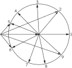
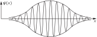

SOURCE: Feynman Lectures on Physics, Volume I, Chapter 48
LANGUAGE: ru
TITLE: Глава 48. Биения
SOURCE_URL: https://www.feynmanlectures.caltech.edu/I_48.html
NOTEBOOKLM_USE: clean lecture text with TeX math and figure captions; reader navigation removed.

# Глава 48. Биения

## 48–1 Сложение двух волн

Не так давно мы довольно подробно обсуждали свойства световых волн и их интерференцию, т. е. эффект суперпозиции двух волн от различных источников. Но при этом предполагалось, что частоты источников одинаковы. В этой же главе мы остановимся на некоторых явлениях, возникающих при интерференции двух источников с различными частотами.

Нетрудно догадаться, что при этом произойдет. Действуя так же, как прежде, давайте предположим, что имеются два одинаковых осциллирующих источника с одной и той же частотой, причем фазы их подобраны так, что в некоторую точку \(P\) сигналы приходят с одинаковой фазой. В этой точке, если это свет, то он очень ярок; если это звук, то он очень громок; а если это электроны, то их приходит очень много. С другой стороны, если приходящие сигналы отличаются по фазе на \(180^\circ\) , то в точке \(P\) не будет никаких сигналов, ибо полная амплитуда будет иметь здесь минимум. Предположим теперь, что некто крутит ручку «регулировка фазы» одного из источников и меняет фазу в точке \(P\) то туда, то сюда, скажем, сначала делает ее равной \(0^\circ\) , а затем \(180^\circ\) и так далее. При этом, разумеется, мы обнаружим изменения в силе результирующего сигнала. Теперь мы также видим, что если фаза одного источника медленно меняется относительно другого постепенным, равномерным образом, начиная с нуля, возрастая до десяти, двадцати, тридцати, сорока градусов и так далее, то в точке \(P\) мы зарегистрируем ряд сильных и слабых «пульсаций», ибо когда сдвиг фазы проходит через \(360^\circ\) , амплитуда снова возвращается к максимуму. Конечно, утверждать, что один источник меняет свою фазу относительно другого с постоянной скоростью, равносильно утверждению, что число колебаний в секунду у этих двух источников слегка различно.

Итак, теперь известен ответ: если взять два источника, частоты которых немного различны, то в результате сложения получаются колебания с медленно пульсирующей интенсивностью. Иначе говоря, все сказанное здесь действительно имеет отношение к делу!

### Figure Ch48-F1
Caption: Фиг. 48.1. Суперпозиция двух косинусообразных волн с отношением частот \(8:10\) . Точное повторение колебаний внутри каждого биения для общего случая не типично.
Image: figures/Ch48-F1.svg

Этот результат легко получить и математически. Предположим, например, что у нас есть две волны и забудем на минуту о всех пространственных соотношениях, а просто посмотрим, что приходит в точку \(P\) . Пусть от одного источника приходит волна \(\cos\omega_1t\) , а от другого — волна \(\cos\omega_2t\) , причем обе \(\omega\) не равны в точности друг другу. Разумеется, амплитуды их тоже могут быть различными, но сначала давайте предположим, что амплитуды равны. Общую задачу мы рассмотрим позднее. Полная амплитуда в точке \(P\) при этом будет суммой двух косинусов. Если мы построим график зависимости амплитуды от времени, как на фиг. 48.1, то увидим, что когда гребни совпадают, получается большое отклонение, когда совпадают гребень и впадина — практически нуль, а когда гребни снова совпадают, вновь получается большая волна.

Математически нам нужно просто сложить два косинуса и как-то перестроить результат. Существует ряд полезных соотношений между косинусами, которые несложно получить. Вы знаете, конечно, что
\[
\begin{equation}
\label{Eq:I:48:1}
e^{i(a + b)} = e^{ia}e^{ib},
\end{equation}
\]
и что \(e^{ia}\) имеет вещественную часть \(\cos a\) и мнимую часть \(\sin a\) . Если мы возьмем вещественную часть \(e^{i(a + b)}\) , то получим \(\cos\,(a
+ b)\) . Если мы перемножим:
\[
\begin{equation*}
e^{ia}e^{ib} = (\cos a + i\sin a)(\cos b + i\sin b),
\end{equation*}
\]
то получим \(\cos a\cos b - \sin a\sin b\) плюс некоторые мнимые части. Но сейчас нам нужна только вещественная часть, поэтому мы получаем
\[
\begin{equation}
\label{Eq:I:48:2}
\cos\,(a + b) = \cos a\cos b - \sin a\sin b.
\end{equation}
\]
Если теперь изменить знак величины \(b\) , то, поскольку косинус при этом не изменяет знака, а синус изменяет его на противоположный, то же уравнение для отрицательного \(b\) имеет вид
\[
\begin{equation}
\label{Eq:I:48:3}
\cos\,(a - b) = \cos a\cos b + \sin a\sin b.
\end{equation}
\]
После сложения этих двух уравнений произведение синусов сократится, и мы находим, что произведение двух косинусов равно половине косинуса суммы плюс половина косинуса разности:
\[
\begin{equation}
\label{Eq:I:48:4}
\cos a\cos b = \tfrac{1}{2}\cos\,(a + b) + \tfrac{1}{2}\cos\,(a - b).
\end{equation}
\]
Теперь можно также обратить эту формулу и найти выражение для \(\cos\alpha
+ \cos\beta\) , если просто положить \(\alpha = a + b\) и \(\beta = a -
b\) . То есть \(a = \tfrac{1}{2}(\alpha + \beta)\) и \(b =
\tfrac{1}{2}(\alpha - \beta)\) , так что
\[
\begin{equation}
\label{Eq:I:48:5}
\cos\alpha + \cos\beta = 2\cos\tfrac{1}{2}(\alpha + \beta)
\cos\tfrac{1}{2}(\alpha - \beta).
\end{equation}
\]

Но вернемся к нашей проблеме. Сумма \(\cos\omega_1t\) и \(\cos\omega_2t\) равна
\[
\begin{align}
\cos\omega_1t &+ \cos\omega_2t =\notag\\[.5ex]
\label{Eq:I:48:6}
&~2\cos\tfrac{1}{2}(\omega_1 + \omega_2)t
\cos\tfrac{1}{2}(\omega_1 - \omega_2)t.
\end{align}
\]
Пусть теперь частоты приблизительно одинаковы, так что \(\tfrac{1}{2}(\omega_1 + \omega_2)\) равна какой-то средней частоте, которая более или менее та же, что и каждая из них. Но \(\omega_1 - \omega_2\) гораздо меньше, чем \(\omega_1\) или \(\omega_2\) , поскольку мы предположили, что \(\omega_1\) и \(\omega_2\) приблизительно равны друг другу. Это означает, что результат сложения можно истолковать так, что будто есть косинусообразная волна с частотой, более или менее равной первоначальным, но что «размах» ее медленно меняется: он пульсирует с частотой, равной \(\tfrac{1}{2}(\omega_1 - \omega_2)\) . Но та ли это частота, с которой мы слышим биения? Уравнение (48.6) говорит, что амплитуда ведет себя как \(\cos\tfrac{1}{2}(\omega_1 - \omega_2)t\) , и это надо понимать так, что высокочастотные колебания заключены между двумя косинусоидами с противоположными знаками (пунктирная линия на фиг. 48.1). Хотя амплитуда действительно меняется с частотой \(\tfrac{1}{2}(\omega_1 - \omega_2)\) , однако если речь идет об интенсивности волн, то мы должны представлять себе частоту в два раза большую. Иначе говоря, модуляция амплитуды в смысле ее интенсивности происходит с частотой \(\omega_1 - \omega_2\) , хотя мы и умножаем на косинус половинной частоты. Техническая причина этого различия заключается в том, что высокочастотная волна имеет несколько иное фазовое соотношение во втором полупериоде.

Пренебрегая этими небольшими усложнениями, мы можем заключить, что если складывать две волны с частотами \(\omega_1\) и \(\omega_2\) , то получим волну с частотой, равной средней частоте \(\tfrac{1}{2}(\omega_1 +
\omega_2)\) , «сила» которой осциллирует с частотой \(\omega_1 -
\omega_2\) .

Если амплитуды двух волн различны, то можно, конечно, повторить все вычисления снова, умножив предварительно косинусы на различные амплитуды \(A_1\) и \(A_2\) и произведя массу всяких математических вычислений, перестроек и т. п. с использованием уравнений, подобных (48.2)–(48.5). Однако есть и другой, более легкий путь провести этот же анализ. Известно, например, что гораздо легче работать с экспонентами, чем с синусами и косинусами, и что мы можем представить \(A_1\cos\omega_1t\) как реальную часть \(A_1e^{i\omega_1t}\) . Подобным же образом вторая волна будет реальной частью \(A_2e^{i\omega_2t}\) . Если мы сложим их, то получим \(A_1e^{i\omega_1t} +
A_2e^{i\omega_2t}\) . Если затем выделить в качестве множителя среднюю частоту, мы получим
\[
\begin{gather}
A_1e^{i\omega_1t} + A_2e^{i\omega_2t} =\notag\\[1ex]
\label{Eq:I:48:7}
e^{i(\omega_1 + \omega _2)t/2}[
A_1e^{i(\omega_1 - \omega _2)t/2} +
A_2e^{-i(\omega_1 - \omega_2)t/2}].
\end{gather}
\]
И снова мы имеем высокочастотную волну с модуляцией на более низкой частоте.

## 48–2 Некоторые замечания о биениях и модуляции

Предположим теперь, что нас интересует интенсивность волны, описываемой уравнением (48.7). Чтобы найти ее, нужно взять квадрат абсолютной величины либо правой, либо левой части этого уравнения. Давайте возьмем левую часть. Интенсивность при этом будет равна
\[
\begin{equation}
\label{Eq:I:48:8}
I = A_1^2 + A_2^2 + 2A_1A_2\cos\,(\omega_1 - \omega_2)t.
\end{equation}
\]
Видите, интенсивность возрастает и падает с частотой \(\omega_1 -
\omega_2\) , изменяясь в пределах между \((A_1 + A_2)^2\) и \((A_1 - 
A_2)^2\) . Если \(A_1 \neq A_2\) , то минимальная интенсивность не равна нулю.

### Figure Ch48-F2
Caption: Фиг. 48.2. Результат сложения двух комплексных векторов с равными частотами.
Image: figures/Ch48-F2.svg

Еще один способ представить эту идею — с помощью рисунка, подобного фиг. 48.2. Мы изобразим одну из волн в комплексной плоскости в виде вектора длиной \(A_1\) , вращающегося с частотой \(\omega_1\) . Вторую волну мы изобразим другим вектором длиной \(A_2\) , вращающимся с частотой \(\omega_2\) . Если эти две частоты в точности равны между собой, то их результирующий вектор имеет постоянную длину при вращении, и мы получаем от них определенную, постоянную интенсивность. Если же частоты немного отличаются друг от друга, то эти два комплексных вектора будут вращаться с различными скоростями. На фиг. 48.3 показано, как выглядит эта ситуация относительно вектора \(A_1e^{i\omega_1t}\) . Мы видим, что \(A_2\) медленно «отворачивается» от \(A_1\) , так что амплитуда, получаемая при сложении этих двух векторов, сначала велика, а затем, по мере ее раскрытия, когда она доходит до взаимного положения \(180^\circ\) , результирующий вектор становится особенно слабым, и так далее. По мере вращения векторов амплитуда суммарного вектора становится то больше, то меньше, а интенсивность, таким образом, пульсирует. Идея сравнительно простая, и существует множество различных способов представить то же самое.

### Figure Ch48-F3
Caption: Фиг. 48.3. Результат сложения двух комплексных векторов с различными частотами во вращающейся системе отсчета первого вектора. Показаны девять последовательных положений медленно вращающегося вектора.
Image: figures/Ch48-F3.svg

Этот эффект очень легко наблюдать экспериментально. Можно установить, например, два громкоговорителя, каждый из которых связан со своим генератором колебаний и может давать свой собственный тон. Таким образом, мы принимаем один сигнал от первого источника, а другой сигнал от второго. Если частоты этих сигналов в точности одинаковы, то в результате в каждой точке пространства получится эффект определенной силы. Но если генераторы немного расстроить, то мы услышим некоторые изменения интенсивности. Чем больше мы расстраиваем генераторы, тем более быстрыми будут изменения силы звука. Однако уху становится трудно уследить за изменениями, скорость которых превышает 10 колебаний в секунду или что-то около этого.

Тот же эффект можно наблюдать и на осциллографе, который просто показывает сумму токов двух динамиков. Если частота пульсаций сравнительно мала, то мы просто видим синусоидальный цуг волн, амплитуда которого пульсирует, но если сделать пульсации более быстрыми, то мы увидим нечто похожее на то, что показано на фиг. 48.1. По мере увеличения разницы между частотами «вершины» сближаются все больше и больше. Кроме того, если амплитуды не равны и мы сделаем один сигнал сильнее другого, то образуется волна, амплитуда которой, как это и ожидается, никогда не становится равной нулю. Все получается так, как нужно, независимо от того, электричество это или звук.

Но возможно и обратное явление! При радиопередаче с использованием так называемой амплитудной модуляции (AM) звук транслируется радиостанцией следующим образом: радиопередатчик возбуждает электрические колебания переменного тока очень высокой частоты, например \(800\) килоциклов в секунду, в диапазоне вещания. Если этот несущий сигнал включен, то радиостанция излучает волну постоянной амплитуды с частотой \(800{,}000\) колебаний в секунду. «Информация» же (бесполезная информация вроде того, какую марку автомобиля вам следует приобрести) передается следующим образом: когда кто-то говорит в микрофон, амплитуда несущего сигнала изменяется «в ногу» с колебаниями звука, приходящего в микрофон.

### Figure Ch48-F4
Caption: Фиг. 48.4. Модулированная несущая волна. На этом схематическом рисунке \(\omega_c/\omega_m=5\) . В настоящей радиоволне \(\omega_c/\omega_m\sim100\) .
Image: figures/Ch48-F4.svg

Возьмем простейший с точки зрения математики случай, когда певица берет безупречную ноту с безупречным синусоидальным колебанием голосовых связок, причем получается сигнал, сила которого меняется, как это показано на фиг. 48.4. Изменения слышимой частоты принимаются затем приемником; мы избавляемся от несущей волны и смотрим просто на «обертку», которая представляет собой колебания голосовых связок, или звук голоса певицы. Громкоговоритель же производит колебания той же частоты в воздухе, и в принципе слушатель не может обнаружить разницы между настоящим голосом певицы и передачей, слышимой по радио. В действительности же из-за некоторых искажений и других тончайших эффектов можно все же определить, слышим ли мы радио или «живой» голос певицы; в других же отношениях все происходит так, как мы описали.

## 48–3 Боковые полосы

Математически описанная выше модулированная волна выражается в виде
\[
\begin{equation}
\label{Eq:I:48:9}
S = (1 + b\cos\omega_mt)\cos\omega_ct,
\end{equation}
\]
, где \(\omega_c\) представляет собой частоту несущей, а \(\omega_m\) — частоту звукового тона. Мы снова используем все эти теоремы о косинусах или можем воспользоваться \(e^{i\theta}\) ; разницы нет никакой — с \(e^{i\theta}\) проще, но это то же самое. В результате мы получаем
\[
\begin{align}
\label{Eq:I:48:10}
S = \cos\omega_ct &+
\tfrac{1}{2}b\cos\,(\omega_c + \omega_m)t\notag\\[.5ex]
&+ \tfrac{1}{2}b\cos\,(\omega_c - \omega_m)t.
\end{align}
\]
. С другой точки зрения можно сказать, что выходящая волна состоит из суперпозиции трех волн: обычной волны с частотой \(\omega_c\) , то есть несущей частоты, и затем двух новых волн с двумя другими частотами. Одна из них равна сумме несущей и модулирующей частот, а другая — разности. Поэтому если построить нечто вроде графика зависимости интенсивности излучения генератора от частоты, то сначала мы, естественно, обнаружим большую интенсивность при несущей частоте, но как только певица начнет петь, мы неожиданно обнаружим интенсивность, пропорциональную силе голоса певицы \(b^2\) , при частотах \(\omega_c + \omega_m\) и \(\omega_c - \omega_m\) , как это показано на фиг. 48.5. Они называются боковыми полосами; когда из передатчика выходит модулированный сигнал, возникают боковые полосы. Если в одно и то же время звучит более одной ноты, скажем, \(\omega_m\) и \(\omega_{m'}\) (например, играют два инструмента), или если передается какая-то другая сложная косинусоидальная волна, то, конечно, из математики видно, что мы получаем еще несколько волн, соответствующих частотам \(\omega_c \pm \omega_{m'}\) .

### Figure Ch48-F5
Caption: Фиг. 48.5. Спектр частот несущей волны \(\omega_c\) , модулированной одной косинусоидой \(\omega_m\) .
Image: figures/Ch48-F5.svg

Поэтому, когда имеется сложная модуляция, которая может быть представлена в виде суммы многих косинусов, 1 оказывается, что в действительности передатчик работает в целой области частот, именно несущей частоты плюс-минус максимальная частота, содержащаяся в модулирующем сигнале.

Хотя сначала нам может показаться, что радиопередатчик излучает только на номинальной несущей частоте, поскольку в нем имеются большие, сверхустойчивые кварцевые генераторы и все настроено так, чтобы частота была равна в точности \(800\) кгц, но в тот момент, когда диктор объявляет, что станция работает на частоте \(800\) кгц, он модулирует частоту \(800\) кгц, и поэтому передача уже не идет точно на частоте \(800\) кгц! Предположим, что усилители построены так, что они могут передавать в широкой полосе частот в области, воспринимаемой ухом (ухо может слышать частоты вплоть до \(20{,}000\) гц, но обычно радиопередатчики и радиоприемники не работают выше \(10{,}000\) , так что мы не слышим самых высоких частот); тогда, когда человек говорит, его голос может содержать частоты, доходящие, скажем, до \(10{,}000\) гц, так что передатчик излучает частоты в области от \(790\) до \(810\) кгц. Если бы при этом на частоте \(795\) кгц работала еще одна станция, возникло бы много помех. Кроме того, если мы сделаем наш приемник столь чувствительным, что он будет принимать только \(800\) и не будет захватывать по \(10\) кгц с каждой стороны, мы не услышим, что говорит человек, ведь информация передается именно на этих других частотах! Поэтому абсолютно необходимо, чтобы станции были разделены некоторым расстоянием, чтобы их боковые полосы не перекрывались, а также приемник не должен быть столь избирательным, чтобы не позволять принимать боковые полосы вместе с основной номинальной частотой. В случае звука эта проблема на самом деле не вызывает больших затруднений. Мы можем слышать в диапазоне \(\pm20\) кгц, а в вещательном диапазоне у нас обычно имеется от \(500\) до \(1500\) кгц, так что места должно хватить для множества станций.

Проблема телевидения намного труднее. Когда электронный луч бежит по экрану телевизионной трубки, он создает множество светлых и темных точек. Это «светлое» и «темное» и есть «сигнал». Обычно, чтобы «показать» весь кадр, лучу требуется примерно в тридцатую долю секунды пробежать \(500\) строк. Пусть разрешение по горизонтали и по вертикали более или менее одинаково, то есть на дюйм каждой строки приходится ровно столько же точек, сколько строк приходится на дюйм высоты. Нужно, чтобы мы могли различать последовательность светлое — темное, светлое — темное, светлое — темное на протяжении, скажем, \(500\) линий. Чтобы это можно было сделать с помощью косинусообразных волн, требуется длина волны (расстояние от максимума до максимума), соответствующая 1/ \(250\) части экрана. Таким образом, мы получаем \(250\times500\times30\) «единичек информации» в секунду. Поэтому наивысная частота, которую нужно передать, оказывается близкой к \(4\) Мгц. На самом деле, чтобы отделить телевизионные станции одну от другой, мы должны использовать несколько большую ширину — около \(6\) Мгц; часть ее используется для передачи звукового сигнала и другой информации. Таким образом, телевизионный канал имеет ширину \(6\) Мгц. Разумеется, вести передачу телевидения на несущей частоте \(800\) кгц невозможно, поскольку мы не можем модулировать сигнал с частотой, превышающей частоту несущей.

Во всяком случае, телевизионная полоса начинается с частоты \(54\) Мгц. Первый канал передач, а именно канал \(2\) (!), работает в полосе частот от \(54\) до \(60\) Мгц, т. е. имеет ширину \(6\) Мгц. «Постойте, — можете сказать вы, — ведь только сейчас мы доказали, что боковые полосы должны быть с обеих сторон, а поэтому ширина должна быть вдвое больше». Оказывается, радиоинженеры довольно хитрый народ. Если при анализе модулирующего сигнала использовать не только косинус, а косинус и синус, чтобы учесть разность фаз, то между высокочастотной и низкочастотной боковыми полосами обнаружится наличие определенного постоянного соотношения. Этим мы хотим сказать, что вторая боковая полоса не содержит никакой новой информации. Поэтому одну боковую полосу подавляют, а приемник устроен внутри таким образом, что недостающая информация восстанавливается из несущей частоты и одной боковой полосы. Передача с помощью одной боковой полосы — очень интересный метод уменьшения ширины полосы, необходимой для передачи информации.

## 48–4 Локализованный волновой пакет

Следующий вопрос, который мы хотим обсудить, — это интерференция волн как в пространстве, так и во времени. Предположим, что в пространстве распространяются две волны. Вы, конечно, знаете, что мы можем представить волну, распространяющуюся в пространстве, в виде \(e^{i(\omega t - kx)}\) . Это может быть, например, смещение в звуковой волне. Это является решением волнового уравнения при условии, что \(\omega^2 = k^2c^2\) , где \(c\) — скорость распространения волны. В этом случае мы можем записать её в виде \(e^{-ik(x - ct)}\) , что имеет общий вид \(f(x - ct)\) . Следовательно, это должна быть волна, распространяющаяся с этой скоростью, \(\omega/k\) , то есть \(c\) , и здесь все в порядке.

Давайте теперь сложим две такие волны. Предположим, что одна волна распространяется с одной частотой, а другая волна — с какой-то другой. Случай неравных амплитуд рассмотрите самостоятельно, хотя существенного отличия здесь нет. Таким образом, мы хотим сложить \(e^{i(\omega_1t - k_1x)} + e^{i(\omega_2t - k_2x)}\) . Это можно сделать с помощью математики, аналогичной использованной нами при сложении сигналов. Конечно, если \(c\) одинакова для обеих волн, то сделать это легко, так как это то же самое, что мы делали раньше:
\[
\begin{equation}
\label{Eq:I:48:11}
e^{i\omega_1(t - x/c)} + e^{i\omega_2(t - x/c)} =
e^{i\omega_1t'} + e^{i\omega_2t'},
\end{equation}
\]
за исключением того, что роль переменной играет \(t' = t - x/c\) вместо \(t\) . При этом, естественно, мы получаем такие же модуляции, но мы видим, конечно, что эти модуляции движутся вместе с волной. Другими словами, если сложить две волны, которые не просто осциллируют, но и перемещаются в пространстве, то получившаяся волна также будет двигаться с той же скоростью.

Теперь хотелось бы обобщить это на случай волн, у которых связь между частотой и волновым числом \(k\) не столь проста. Пример: вещество с показателем преломления. В главе 31 мы уже изучали теорию показателя преломления и обнаружили, что можем записать \(k =
n\omega/c\) , где \(n\) — показатель преломления. В качестве интересного примера для рентгеновских лучей мы нашли, что показатель \(n\) равен
\[
\begin{equation}
\label{Eq:I:48:12}
n = 1 - \frac{Nq_e^2}{2\epsO m\omega^2}.
\end{equation}
\]
На самом деле в главе 31 мы вывели более сложную формулу, но эта ничуть не хуже любой другой в качестве примера.

Кстати говоря, нам известно, что даже когда \(\omega\) и \(k\) не пропорциональны линейно, отношение \(\omega/k\) , безусловно, является скоростью распространения для данной частоты и волнового числа. Мы называем это отношение фазовой скоростью; это скорость, с которой фаза или узлы отдельной волны перемещались бы вдоль:
\[
\begin{equation}
\label{Eq:I:48:13}
v_p = \frac{\omega}{k}.
\end{equation}
\]
Эта фазовая скорость для случая рентгеновских лучей в стекле больше скорости света в пустоте (поскольку \(n\) в 48.12 меньше \(1\) ), и это несколько неприятно, ведь мы не думаем, что можем посылать сигналы быстрее скорости света!

Обсудим теперь интерференцию двух волн, у которых значения \(\omega\) и \(k\) связаны какой-то определенной зависимостью. Написанная выше формула для \(n\) говорит, что \(k\) есть определенная функция \(\omega\) . Для большей определенности в данной частной задаче формула зависимости \(k\) от \(\omega\) имеет вид
\[
\begin{equation}
\label{Eq:I:48:14}
k = \frac{\omega}{c} - \frac{a}{\omega c},
\end{equation}
\]
, где \(a = Nq_e^2/2\epsO m\) — постоянная. Во всяком случае, мы хотим сложить такие две волны, у которых для каждой частоты существует определенное волновое число.

Давайте сделаем это точно так же, как и при получении уравнения (48.7):
\[
\begin{align}
\label{Eq:I:48:15}
e^{i(\omega_1t - k_1x)} + \;&e^{i(\omega_2t - k_2x)} =\\[1ex]
e^{i[(\omega_1 + \omega_2)t - (k_1 + k_2)x]/2}
\times\bigl[
&e^{i[(\omega_1 - \omega_2)t - (k_1 - k_2)x]/2}\; +\notag\\[-.3ex]
&\quad e^{-i[(\omega_1 - \omega_2)t - (k_1 - k_2)x]/2}\bigr].\notag
\end{align}
\]
Таким образом, снова получается модулированная волна, распространяющаяся со средней частотой и средним волновым числом, однако сила ее меняется в соответствии с выражением, зависящим от разности частот и разности волновых чисел.

Рассмотрим теперь случай, когда разности между двумя волнами относительно малы. Предположим, что мы складываем две волны с приблизительно равными частотами; тогда \((\omega_1 + \omega_2)/2\) практически равно каждой из \(\omega\) , и то же можно сказать о \((k_1 + k_2)/2\) . Таким образом, скорость волны, быстрых осцилляций, узлов действительно остается равной \(\omega/k\) . Но смотрите, скорость распространения модуляции не та же самая! Как нужно изменить \(x\) , чтобы сбалансировать некоторую величину \(t\) ? Скорость этой модулирующей волны равна отношению
\[
\begin{equation}
\label{Eq:I:48:16}
v_M = \frac{\omega_1 - \omega_2}{k_1 - k_2}.
\end{equation}
\]
. Скорость движения модуляций иногда называют групповой скоростью. Если мы возьмем случай относительно малой разности между частотами и соответственно относительно малой разности между волновыми числами, то это выражение переходит в пределе в
\[
\begin{equation}
\label{Eq:I:48:17}
v_g = \ddt{\omega}{k}.
\end{equation}
\]
. Другими словами, для самой медленной модуляции, самых медленных биений существует определенная скорость их распространения, которая не равна фазовой скорости волн — какая загадочная вещь! Групповая скорость равна производной \(\omega\) по \(k\) , а фазовая скорость равна \(\omega/k\) .

Посмотрим, можно ли понять, почему так происходит. Рассмотрим две волны с несколько различными длинами, как это показано на фиг. 48.1. Они то совпадают по фазе, то различаются, то снова совпадают и т. д. Однако теперь эти волны в действительности представляют волны в пространстве, распространяющиеся с немного различными скоростями. Но поскольку фазовая скорость, скорость узлов этих двух волн, не в точности одинакова, то происходит нечто новое. Предположим, что мы едем рядом с одной из волн и смотрим на другую. Если бы они двигались с одинаковой скоростью, то вторая волна оставалась бы относительно нас там же, где и была с самого начала, поскольку мы едем как бы на гребне одной волны и видим гребень второй прямо около себя. Однако в действительности скорости не равны. Частоты немного отличаются друг от друга, а поэтому немного отличаются и скорости. Из-за этой небольшой разницы в скоростях другая волна либо медленно обгоняет нас, либо отстает. Что же с течением времени происходит с узлом? Если чуть-чуть продвинуть одну из волн, то узел при этом уйдет на значительное расстояние вперед (или назад), т. е. сумма этих двух волн имеет какую-то огибающую, которая вместе с распространением волн скользит по ним с другой скоростью. Групповая скорость является той скоростью, с которой передаются модулирующие сигналы.

Если мы посылаем сигнал, т. е. производим какие-то изменения волны, которые могут быть услышаны и расшифрованы кем-то, то это является своего рода модуляцией, но такая модуляция при условии, что она относительно медленная, будет распространяться с групповой скоростью (быстрые модуляции значительно труднее анализировать).

Теперь мы можем показать (наконец-то!), что скорость распространения рентгеновских лучей в куске угля не больше, чем скорость света, хотя фазовая скорость больше скорости света. Чтобы сделать это, нужно найти \(d\omega/dk\) , которое мы получим дифференцированием (48.14): \(dk/d\omega = 1/c + a/\omega^2c\) . Групповая скорость, следовательно, равна обратной величине, а именно
\[
\begin{equation}
\label{Eq:I:48:18}
v_g = \frac{c}{1 + a/\omega^2},
\end{equation}
\]
, что меньше, чем \(c\) ! Таким образом, хотя фазы могут бежать быстрее скорости света, модулирующие сигналы движутся медленнее, и в этом состоит разрешение кажущегося парадокса! Разумеется, в простейшем случае \(\omega= kc\) , \(d\omega/dk\) тоже равна \(c\) . Так что, когда все фазы движутся с одинаковой скоростью, естественно, и групповая скорость будет той же самой.

## 48–5 Амплитуда вероятности частиц

Рассмотрим еще один необычайно интересный пример фазовой скорости. Он относится к области квантовой механики. Известно, что амплитуда вероятности найти частицу в данном месте изменяется при некоторых обстоятельствах в пространстве и времени (давайте возьмем одно измерение) следующим образом:
\[
\begin{equation}
\label{Eq:I:48:19}
\psi = Ae^{i(\omega t -kx)},
\end{equation}
\]
где \(\omega\) — частота, связанная с классическим понятием энергии соотношением \(E = \hbar\omega\) , а \(k\) — волновое число, которое связано с импульсом соотношением \(p = \hbar k\) . Мы бы сказали, что частица имеет определенный импульс \(p\) , если бы волновое число было в точности равно \(k\) , то есть если бежит идеальная волна повсюду с одинаковой амплитудой. Уравнение (48.19) дает амплитуду, и если мы возьмем квадрат абсолютной величины, то получим относительную вероятность обнаружения частицы как функцию положения и времени. Она равна постоянной, что означает, что вероятность обнаружить частицу одинакова в любом месте. Теперь предположим вместо этого, что мы имеем ситуацию, когда известно, что обнаружить частицу в каком-то месте более вероятно, чем в других местах. Подобную ситуацию мы описали бы волной, которая имеет максимум и сходит на нет по обе стороны (фиг. 48.6). (Это не совсем то же самое, что волна вроде изображенной на фиг. 48.1, которая имеет целый ряд максимумов, но, сложив вместе несколько волн с приблизительно одинаковыми значениями \(\omega\) и \(k\) , можно избавиться от всех максимумов, кроме одного.)

### Figure Ch48-F6
Caption: Фиг. 48.6. Локализованный волновой пакет.
Image: figures/Ch48-F6.svg

При этих обстоятельствах, поскольку квадрат выражения (48.19) представляет вероятность найти частицу в некотором месте, мы знаем, что в данный момент больше шансов найти частицу вблизи центра «колокола», где амплитуда максимальна. Если подождать немного, то волна передвинется, и по прошествии некоторого промежутка времени «колокол» перейдет в какое-то другое место. Зная, что частица вначале где-то была расположена, мы ожидали бы, согласно классической механике, что она будет где-то и позднее, ведь есть же у нее скорость и импульс в конце концов. При этом квантовая теория дает в пределе правильные классические соотношения между энергией, импульсом и скоростью, если только групповая скорость, скорость модуляции, будет равна скорости классической частицы с тем же самым импульсом.

Сейчас необходимо показать, так ли это на самом деле или нет. Согласно классической теории, энергия связана со скоростью уравнением типа
\[
\begin{equation}
\label{Eq:I:48:20}
E = \frac{mc^2}{\sqrt{1 - v^2/c^2}}.
\end{equation}
\]
. Точно таким же образом импульс равен
\[
\begin{equation}
\label{Eq:I:48:21}
p = \frac{mv}{\sqrt{1 - v^2/c^2}}.
\end{equation}
\]
. Это классическая теория, и как ее следствие, исключив \(v\) , можно показать, что
\[
\begin{equation*}
E^2 - p^2c^2 = m^2c^4.
\end{equation*}
\]
. Это величайший результат четырехмерья, о котором мы уже говорили много раз, состоящий в том, что \(p_\mu p_\mu = m^2\) ; это связь между энергией и импульсом в классической теории. Теперь это означает, что, поскольку эти \(E\) и \(p\) должны превратиться в \(\omega\) и \(k\) путем подстановки \(E = \hbar\omega\) и \(p = \hbar k\) , для квантовой механики необходимо, чтобы
\[
\begin{equation}
\label{Eq:I:48:22}
\frac{\hbar^2\omega^2}{c^2} - \hbar^2k^2 = m^2c^2.
\end{equation}
\]
. Таким образом, это соотношение между частотой и волновым числом волны квантовомеханической амплитуды, описывающей частицу с массой \(m\) . Из этого уравнения можно получить, что \(\omega\) равно
\[
\begin{equation*}
\omega = c\sqrt{k^2 + m^2c^2/\hbar^2}.
\end{equation*}
\]
. Фазовая скорость, \(\omega/k\) , здесь снова больше скорости света!

Рассмотрим теперь групповую скорость. Групповая скорость должна быть равна \(d\omega/dk\) — скорости, с которой движется модуляция. Чтобы найти ее, нужно продифференцировать квадратный корень; это дело нехитрое. Производная равна
\[
\begin{equation*}
\ddt{\omega}{k} = \frac{kc}{\sqrt{k^2 + m^2c^2/\hbar^2}}.
\end{equation*}
\]
. Но входящий сюда квадратный корень есть попросту \(\omega/c\) , так что эту формулу можно записать в виде \(d\omega/dk = c^2k/\omega\) . Далее, так как \(k/\omega\) равно \(p/E\) , то
\[
\begin{equation*}
v_g = \frac{c^2p}{E}.
\end{equation*}
\]
. Но, согласно (48.20) и (48.21), \(c^2p/E = v\) равно υ — скорости частицы в классической механике. Таким образом видно, что, принимая во внимание основные квантовомеханические соотношения \(E =
\hbar\omega\) и \(p = \hbar k\) , определяющие \(\omega\) и \(k\) через классические \(E\) и \(p\) и дающие только уравнение \(\omega^2 - k^2c^2 = m^2c^4/\hbar^2\) , теперь можно понять также соотношения (48.20) и (48.21), связывающие \(E\) и \(p\) со скоростью. Групповая скорость, разумеется, должна быть скоростью частицы, если эта интерпретация вообще имеет какой-либо смысл. Пусть в какой-то момент, как мы полагаем, частица находится в одном месте, а затем, скажем через 10 минут, — в другом. Тогда, согласно квантовой механике, расстояние, пройденное «колоколом», разделенное на интервал времени, должно равняться классической скорости частицы.

## 48–6 Волны в пространстве трех измерений

Мы заканчиваем наше обсуждение волн несколькими общими замечаниями о волновом уравнении. Эти замечания, призванные дать нам картину того, чем нам предстоит заниматься в будущем, вовсе не претендуют на то, чтобы мы поняли все прямо сейчас; они должны скорее показать, как будут выглядеть все эти вещи, когда мы несколько больше познакомимся с волнами. Прежде всего, волновое уравнение для звука в одном измерении имело вид
\[
\begin{equation*}
\frac{\partial^2\chi}{\partial x^2} =
\frac{1}{c^2}\,\frac{\partial^2\chi}{\partial t^2},
\end{equation*}
\]
, где \(c\) — скорость самой волны: в случае звука это скорость звука, в случае света — скорость света. Мы показали, что для звуковой волны перемещения должны распространяться с некоторой скоростью. Но избыточное давление, как и избыточная плотность, тоже распространяется с некоторой скоростью. Таким образом, можно ожидать, что и давление будет удовлетворять этому же уравнению. Так оно и есть на самом деле. Мы предоставляем читателю доказать это самостоятельно. Указание: \(\rho_e\) пропорционально скорости изменения \(\chi\) с расстоянием \(x\) . Следовательно, продифференцировав волновое уравнение по \(x\) , мы немедленно обнаружим, что \(\ddpl{\chi}{x}\) удовлетворяет тому же самому уравнению. Другими словами, \(\rho_e\) удовлетворяет тому же самому уравнению. Но \(P_e\) пропорционально \(\rho_e\) , поэтому и \(P_e\) удовлетворяет тому же самому уравнению. Таким образом, и давление, и перемещения — все удовлетворяет одному и тому же волновому уравнению.

Обычно волновое уравнение для звука записывается через давление, а не через перемещение. Это проще, потому что давление — скаляр и не имеет никакого направления. Но перемещение есть вектор, и поэтому лучше иметь дело с давлением.

Следующий вопрос, который нам предстоит обсудить, относится к волновому уравнению в трехмерном пространстве. Мы знаем, что решение для звуковой волны в одномерном пространстве имеет вид \(e^{i(\omega t - kx)}\) , где \(\omega = kc_s\) , но нам также известно, что в трех измерениях волна описывается выражением \(e^{i(\omega t - k_xx
- k_yy - k_zz)}\) , где в данном случае \(\omega^2 = k^2c_s^2\) , что, конечно, есть \((k_x^2 + k_y^2 + k_z^2)c_s^2\) . Сейчас мы хотим просто угадать, как выглядит правильное волновое уравнение в трехмерном пространстве. Естественно, что в случае звука это уравнение можно получить с помощью тех же самых динамических соображений, но уже в трехмерном пространстве. Однако мы не будем делать этого, а просто напишем то, что получается: уравнение для давления (или перемещения, или чего-то другого) имеет вид
\[
\begin{equation}
\label{Eq:I:48:23}
\frac{\partial^2P_e}{\partial x^2} +
\frac{\partial^2P_e}{\partial y^2} +
\frac{\partial^2P_e}{\partial z^2} =
\frac{1}{c_s^2}\,
\frac{\partial^2P_e}{\partial t^2}.
\end{equation}
\]
Правильность этого уравнения может быть легко проверена подстановкой в него \(e^{i(\omega t -
\FLPk\cdot\FLPr)}\) . Ясно, что при каждом дифференцировании по \(x\) происходит умножение на \(-ik_x\) . Если мы дифференцируем дважды, то это эквивалентно умножению на \(-k_x^2\) , так что для такой волны первый член получится равным \(-k_x^2P_e\) . Точно таким же образом второй член окажется равным \(-k_y^2P_e\) , а третий — равным \(-k_z^2P_e\) . С правой стороны мы получим \(-(\omega^2/c_s^2)P_e\) . Тогда, если мы уберем \(P_e\) и изменим знаки, то увидим, что соотношение между \(k\) и \(\omega\) — как раз то, что нам нужно.

Возвращаясь назад, мы не можем удержаться от того, чтобы написать основное уравнение, соответствующее дисперсионному соотношению (48.22) для квантовомеханических волн. Если \(\phi\) — амплитуда нахождения частицы в точке с координатами \(x,y,z\) в момент времени \(t\) , то основное уравнение квантовой механики для свободной частицы имеет вид
\[
\begin{equation}
\label{Eq:I:48:24}
\frac{\partial^2\phi}{\partial x^2} +
\frac{\partial^2\phi}{\partial y^2} +
\frac{\partial^2\phi}{\partial z^2} -
\frac{1}{c^2}\,
\frac{\partial^2\phi}{\partial t^2} =
\frac{m^2c^2}{\hbar^2}\,\phi.
\end{equation}
\]
Прежде всего, релятивистский характер этого выражения подсказывается появлением \(x\) , \(y\) , \(z\) и \(t\) в той удачной комбинации, которую обычно предполагает теория относительности. Во-вторых, это волновое уравнение; если мы подставим в него плоскую волну, то в качестве следствия получим \(-k^2 +
\omega^2/c^2 = m^2c^2/\hbar^2\) , что является правильным соотношением для квантовой механики. В этом волновом уравнении содержится еще одна фундаментальная вещь: тот факт, что любая суперпозиция волн также будет его решением. Таким образом, это уравнение содержит всю квантовую механику и всю теорию относительности, которую мы обсуждали до сих пор, — по крайней мере, до тех пор, пока мы имеем дело с единственной частицей в пустом пространстве без всяких потенциалов и воздействующих на нее сил!

## 48–7 Собственные колебания

Вернемся теперь к другим очень любопытным примерам биений, которые немного отличаются от того, что мы рассматривали до сих пор. Представьте себе два одинаковых маятника, которые связаны между собой слабой пружинкой. Длины их должны быть одинаковыми с возможно большей точностью. Если мы оттянем один маятник и отпустим его, то он будет качаться взад и вперед и будет тянуть то взад, то вперед связывающую пружинку, т. е. получится устройство, создающее силу с собственной частотой второго маятника. Можно заключить из знакомой нам теории резонансов, что если к какому-то предмету прикладывать с надлежащей частотой силу, то она будет двигать этот предмет. Таким образом, ясно, что один маятник, двигаясь взад и вперед, будет раскачивать второй. Однако при этих условиях происходит некое новое явление, связанное с тем, что энергия системы конечна. Первый маятник постепенно растрачивает свою энергию, вызывая движение другого маятника, и в конце концов полностью отдаст свою энергию и остановится. Вся энергия теперь будет сосредоточена во втором маятнике. Но пройдет немного времени и все будет происходить наоборот: энергия из второго маятника будет перекачиваться назад, в первый маятник. Это очень интересное и занимательное явление. Мы сказали, однако, что это связано с теорией биений, и сейчас мы должны показать, как можно проанализировать это движение с точки зрения теории биений.

Обратите внимание, что движение каждого из двух маятников — это колебания с циклически изменяющейся амплитудой. Поэтому движение одного из маятников можно, очевидно, рассматривать с различных точек зрения, в частности как сумму двух одновременных колебаний с мало отличающимися частотами. Таким образом должно быть возможно обнаружить в этой системе два других движения и утверждать, что поскольку система наша, безусловно, линейная, то мы видим суперпозицию этих двух решений. Действительно, легко найти два способа так запустить нашу систему, что каждый из них даст в результате идеальное абсолютно периодическое колебание с одной частотой. Движение, с которого мы начали, не строго периодично, оно не продолжается все время (один маятник постепенно передает свою энергию другому и изменяет свою амплитуду), но есть способы так начать движение, что не будет никаких подобных изменений. Как только вы узнаете, что это за способы, то сразу же поймете почему. Если, например, мы запустим оба маятника одновременно, то, поскольку длина их одинакова и пружинка в этом случае бездействует, оба маятника так и будут продолжать качаться все время вместе. (Разумеется, если нет трения и все достаточно хорошо подогнано.) С другой стороны, существует еще одна возможность создать строго периодическое движение, которое также имеет определенную частоту, — когда маятники, оттянутые вначале в разные стороны на точно равные расстояния, движутся в противоположных направлениях. Нетрудно сообразить, что пружинка немного увеличивает «восстанавливающую силу», возникающую из-за действия силы тяжести, и система колеблется с несколько большей частотой, чем в первом случае, — вот и все. Почему с большей? Да потому что пружинка тянет, помогая силе тяжести, и это делает систему более «жесткой», так что частота такого колебания чуть-чуть больше.

Итак, создать колебания с постоянной амплитудой в нашей системе можно двумя способами: либо оба маятника качаются все время вместе с одной частотой, либо они качаются в противоположных направлениях с несколько большей частотой.

Действительное же движение системы, поскольку она линейна, можно представить в виде суперпозиции этих двух способов. (Напомним, что предметом этой главы являются эффекты сложения двух движений с различными частотами.) Давайте подумаем, что произошло бы, если бы мы сложили эти два решения. Если в момент \(t = 0\) запустить оба эти движения (причем с равными амплитудами и одинаковой фазой), то сумма этих двух движений означает, что один маятник, на который каким-то образом воздействовало первое движение и противоположным образом воздействовало второе, должен оставаться на месте, тогда как другой маятник, двигаясь одинаково при обоих способах движения, качается с удвоенной амплитудой. С течением времени, однако, оба эти основных движения, существуя независимо одно от другого, медленно сдвигаются по фазе одно относительно другого. Это означает, что после достаточно большого промежутка времени, такого, что в первом движении произойдет, скажем, « \(900\tfrac{1}{2}\) » колебания, а во втором — только « \(900\) », относительная фаза станет как раз обратной по отношению к тому, что было вначале. Иначе говоря, маятник, имевший вначале большую амплитуду, остановится, тогда как маятник, неподвижный вначале, начнет качаться изо всех сил!

Итак, мы видим, что такое сложное движение можно рассматривать в рамках идеи резонансов, когда энергия от одного маятника переходит к другому, или как суперпозицию двух движений с постоянной амплитудой и различными частотами.
