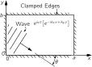

SOURCE: Feynman Lectures on Physics, Volume I, Chapter 49
LANGUAGE: ru
TITLE: Глава 49. Собственные колебания
SOURCE_URL: https://www.feynmanlectures.caltech.edu/I_49.html
NOTEBOOKLM_USE: clean lecture text with TeX math and figure captions; reader navigation removed.

# Глава 49. Собственные колебания

## 49.1. Отражение волн

В этой главе мы рассмотрим ряд замечательных явлений, возникающих в результате «заключения» волны в некоторую ограниченную область. Сначала нам придется установить несколько частных фактов, относящихся, например, к колебанию струны, а затем, обобщив эти факты, мы придем, по-видимому, к наиболее далеко идущему принципу математической физики.

Первый пример волн в ограниченном пространстве — это волны в пространстве, ограниченном с одной стороны. Давайте возьмем простой случай одномерной волны на струне. Можно было бы рассмотреть плоскую звуковую волну в пространстве, ограниченном с одной стороны стенкой, или какие-то другие примеры той же природы, но для наших теперешних целей вполне достаточно простой струны. Предположим, что один конец струны закреплен, ну, например, вмурован в «абсолютно жесткую» стенку. Математически это можно описать, указав, что перемещение струны \(y\) в точке \(x = 0\) должно быть нулем, ибо конец струны не может двигаться. Далее, если бы в этом деле не участвовала стенка, то, как мы знаем, общее решение, описывающее движение струны, можно было бы представить в виде суммы двух функций \(F(x - ct)\) и \(G(x + ct)\) , причем первая описывает волну, бегущую по струне в одну сторону, а вторая — в другую:
\[
\begin{equation}
\label{Eq:I:49:1}
y = F(x - ct) + G(x + ct)
\end{equation}
\]
будет общим решением для любой струны. Но нам, помимо этого, нужно еще удовлетворить условию неподвижности одного конца. Если в уравнении (49.1) мы положим \(x =
0\) и посмотрим, какие будут \(y\) в любой момент \(t\) , то получим \(y = F(-ct) + G(+ct)\) . Но если эта сумма должна быть нулем в любой момент времени, то это означает, что функция \(G(ct)\) должна быть равна \(-F(-ct)\) . Другими словами, функция \(G\) от некоторой величины должна быть равна функции \(-F\) от той же величины со знаком минус. Подставляя снова полученный результат в уравнение (49.1), находим решение поставленной задачи:
\[
\begin{equation}
\label{Eq:I:49:2}
y = F(x - ct) - F(-x - ct).
\end{equation}
\]
Легко проверить, что мы получим \(y = 0\) , если положим \(x = 0\) .

### Figure Ch49-F1
Caption: Фиг. 49.1. Отражение от стенки как суперпозиция двух бегущих волн.
Image: figures/Ch49-F1.svg

На фиг. 49.1 представлена волна, идущая в отрицательном \(x\) -направлении вблизи \(x = 0\) , и гипотетическая волна, идущая в противоположном направлении с обратным знаком и с другой стороны от начала координат. Мы говорим «гипотетическая», потому что с другой стороны, конечно, никакой колеблющейся струны нет. Истинное же движение струны должно рассматриваться как сумма этих двух волн в области положительных \(x\) . Достигнув начала координат, они при \(x = 0\) полностью уничтожат друг друга, а затем вторая (отраженная) волна, идущая, разумеется, в противоположном направлении, окажется единственной волной в области положительных \(x\) . Эти результаты эквивалентны следующему утверждению: волна, достигнув защемленного конца струны, отражается от него с изменением знака. Такое отражение всегда можно понять, если представить себе, как нечто дошедшее до конца струны вылетит затем из-за стены «вверх ногами». Короче говоря, если мы предположим, что струна бесконечна и что, где бы ни находилась волна, бегущая в одном направлении, всегда существует другая волна, бегущая в противоположном направлении с указанной симметрией, то перемещение при \(x = 0\) всегда будет равным нулю, а поэтому безразлично, защемлена ли струна в этом месте или нет.

Следующий наш пример — отражение периодической волны. Предположим, что волна, описываемая \(F(x - ct)\) , представляет собой синусоидальную волну, которая затем отражается; тогда отраженная волна \(-F(-x - ct)\) тоже будет синусоидальной волной той же частоты, но пойдет она в противоположном направлении. Эту ситуацию проще всего описать с помощью комплексных функций: \(F(x - ct) = e^{i\omega(t - x/c)}\) и \(F(-x - ct) = e^{i\omega(t + x/c)}\) . Нетрудно убедиться, что если подставить их в (49.2) и положить \(x\) равным \(0\) , то \(y = 0\) для всех значений \(t\) , так что необходимое условие оказывается выполненным. Воспользовавшись свойствами экспоненты, это можно записать в более простом виде:
\[
\begin{equation}
\label{Eq:I:49:3}
y = e^{i\omega t}(e^{-i\omega x/c} \!- e^{i\omega x/c}) =
-2ie^{i\omega t}\sin\,(\omega x/c).
\end{equation}
\]

Мы получили нечто новое и интересное: из этого решения ясно, что если мы посмотрим на любую фиксированную точку \(x\) , то увидим, что струна колеблется с частотой \(\omega\) . Совершенно неважно, где находится эта точка, все равно частота будет той же самой! Однако на струне есть такие места, в частности везде, где \(\sin\,(\omega x/c) = 0\) , которые вообще не перемещаются. Более того, если в любой момент времени \(t\) сделать моментальный снимок колеблющейся струны, то на фотографии получится синусоидальная волна. Однако смещение этой синусоидальной волны будет зависеть от времени \(t\) . Из уравнения (49.3) можно видеть, что длина одного периода синусоидальной волны равна длине волны любой из накладывающихся волн:
\[
\begin{equation}
\label{Eq:I:49:4}
\lambda = 2\pi c/\omega.
\end{equation}
\]
Неподвижные точки удовлетворяют условию \(\sin\,(\omega x/c) = 0\) , которое означает, что \((\omega x/c) = 0\) , \(\pi\) , \(2\pi\) , …, \(n\pi\) , … Эти точки называются узлами. Между любыми двумя соседними узлами каждая точка движется синусоидально вверх и вниз, но характер ее движения остается фиксированным в пространстве. Это основная характеристика того, что мы называем модой. Если удается найти такой характер движения, который обладает тем свойством, что в любой точке объект движется строго синусоидально и все точки движутся с одинаковой частотой (хотя одни движутся больше, а другие меньше), то мы имеем дело с тем, что называется модой.

## 49–2 Волны в ограниченном пространстве и собственные частоты

Перейдем к обсуждению следующей интересной задачи. Что произойдет, если струну закрепить с двух концов, скажем в точках \(x = 0\) и \(x = L\) ? Давайте начнем с идеи отражения волны, с некоего горба, движущегося в одном направлении. С течением времени этот горб подойдет к одному концу струны и в конце концов превратится в небольшой всплеск, поскольку здесь он складывается с перевернутым ответным горбом, идущим с другой стороны. Наконец первый горб совсем исчезнет, а в обратном направлении побежит другой, «ответный» горб, и весь процесс повторится уже на другом конце. Как видите, задача решается совсем просто, впрочем здесь возникает интересный вопрос: можно ли в этом случае получить синусоидальную волну (только это описанное решение периодично, но, разумеется, не синусоидально периодично). Давайте попытаемся «вставить» в нашу струну синусоидально периодическую волну. Если один конец струны закреплен, то мы знаем, что должно получиться нечто похожее на наше предыдущее решение (49.3). Но то же самое должно получиться и у второго конца, ведь он тоже закреплен. Поэтому единственная возможность получить периодическое синусоидальное движение — это взять волну, которая в точности укладывается на длине струны. В противоположном случае мы не получим собственной частоты, с которой струна могла бы продолжать свои колебания. Короче говоря, если по струне пустить синусоидальную волну, которая в точности укладывается на ее длине, то она сохраняет свою идеальную синусообразную форму и будет гармонически колебаться с некоторой частотой.

Математически мы можем записать \(\sin kx\) для формы волны, где \(k\) равно коэффициенту \((\omega/c)\) в уравнениях (49.3) и (49.4), и эта функция обращается в нуль при \(x = 0\) . Однако она также должна обращаться в нуль на другом конце. Суть этого в том, что \(k\) уже не является произвольным, как в случае полуограниченной струны. Если струна закреплена с обоих концов, то единственная возможность состоит в том, что \(\sin\,(kL) = 0\) , потому что это единственное условие, при котором оба конца остаются закрепленными. Но чтобы синус был равен нулю, угол должен быть равен либо \(0\) , либо \(\pi\) , либо \(2\pi\) , либо быть каким-то другим целым числом, кратным \(\pi\) . Поэтому уравнение
\[
\begin{equation}
\label{Eq:I:49:5}
kL = n\pi
\end{equation}
\]
в зависимости от подставляемого целого числа будет давать любое из возможных значений \(k\) . Каждому из значений \(k\) соответствует определенная частота \(\omega\) , которая, согласно (49.3), равна просто
\[
\begin{equation}
\label{Eq:I:49:6}
\omega = kc = n\pi c/L.
\end{equation}
\]

Итак, мы нашли, что синусоидальные колебания струны могут происходить только с некоторыми определенными частотами. Это — наиболее важная характеристика волн в ограниченной области. Сколь бы сложна ни была система, всегда оказывается, что в ней могут быть чисто синусоидальные колебания, но частота их определяется свойствами данной системы и природой ее границ. В случае струны возможно множество различных частот, каждой из которых соответствует определенное собственное колебание — движение, синусоидально повторяющее самое себя. На фиг. 49.2 показаны первые три собственные гармоники струны. Для первой гармоники длина волны \(\lambda\) равна \(2L\) . В этом легко убедиться, продолжив волну до \(x = 2L\) и получив полный цикл синусоидальной волны. Угловая частота \(\omega\) равна в общем случае \(2\pi c\) , деленному на длину волны, а в данном случае, поскольку \(\lambda\) равно \(2L\) , частота будет равна \(\pi c/L\) , что согласуется с (49.6) при \(n = 1\) . Обозначим частоту первой гармоники через \(\omega_1\) . Следующая собственная гармоника напоминает бантик из двух петель с узлом посредине. Для этой гармоники длина волны, следовательно, просто равна \(L\) . Соответствующая величина \(k\) вдвое больше, а частота вдвое больше; она равна \(2\omega_1\) . Для третьей гармоники она равна \(3\omega_1\) и так далее. Таким образом, все различные частоты струны представляют собой кратные величины: \(1\) , \(2\) , \(3\) , \(4\) и так далее от наименьшей частоты \(\omega_1\) .

### Figure Ch49-F2
Caption: Фиг. 49.2. Первые три гармоники колеблющейся струны.
Image: figures/Ch49-F2.svg

Вернемся теперь к общему движению струны. Оказывается, что любое возможное движение можно рассматривать как одновременное действие некоторого числа собственных колебаний. На самом деле для описания наиболее общего движения должно быть одновременно возбуждено бесконечное число собственных гармоник. Чтобы получить некоторое представление об этом, давайте проиллюстрируем, что происходит при одновременном колебании двух собственных гармоник. Предположим, что первая из них колеблется так, как это показано в ряде схематических чертежей фиг. 49.3, где изображены отклонения струны через равные промежутки времени на протяжении полуцикла низшей частоты.

### Figure Ch49-F3
Caption: Фиг. 49.3. Две гармоники, напоминающие при сложении бегущую волну.
Image: figures/Ch49-F3.svg

Предположим теперь, что одновременно происходит и колебание второй собственной гармоники. На фиг. 49.3 также показана последовательность положений этой гармоники, которая в начальный момент сдвинута по фазе на \(90^\circ\) по отношению к первой. Это означает, что в начальный момент никакого отклонения нет, но скорости двух половинок струны направлены в противоположные стороны. Вспомним теперь общий принцип линейных систем: если взять любые два решения, то сумма их тоже будет решением. Поэтому третьим возможным движением струны будет перемещение, полученное сложением двух решений, показанных на фиг. 49.3. Результат, также показанный на рисунке, начинает напоминать горб, пробегающий взад и вперед по струне от одного конца до другого, хотя с помощью только двух гармоник нельзя построить достаточно хорошей картины такого движения; их нужно больше. Этот результат представляет на самом деле частный случай великого принципа линейных систем: любое движение вообще можно анализировать, предполагая, что оно является суммой движений всех различных собственных гармоник, взятых с надлежащими амплитудами и фазами. Значение этого принципа обусловлено тем фактом, что каждое собственное колебание очень просто — это всего лишь синусоидальное движение во времени. По правде говоря, даже общее движение струны не так уж сложно, но существуют другие системы, например вибрация крыла самолета, в которых движение гораздо сложнее. Тем не менее даже у крыла самолета можно обнаружить определенный вид кручения с одной частотой и другие виды кручения с другими частотами. Если эти собственные колебания удастся найти, то полное движение всегда можно представить как суперпозицию гармонических колебаний (за исключением тех случаев, когда вибрация столь велика, что систему уже нельзя считать линейной).

## 49–3 Двумерные собственные колебания

Следующий пример, который следует рассмотреть, — это интересная ситуация с собственными колебаниями в двух измерениях. До сих пор мы говорили только об одномерных случаях — натянутой струне или звуковых волнах в трубе. В конечном счете нам следовало бы рассмотреть три измерения, но более простым шагом будет переход к двум измерениям. Рассмотрим для определенности прямоугольный резиновый барабан, закрепленный так, чтобы перемещение на его прямоугольном крае везде равнялось нулю, и пусть размеры прямоугольника будут равны \(a\) и \(b\) , как показано на фиг. 49.4. Теперь вопрос в том, каковы характеристики возможного движения? Мы можем начать с той же процедуры, что и для струны. Если бы никакого закрепления не было вовсе, мы бы ожидали появления волн, бегущих в некотором направлении. Например, \((e^{i\omega t})(e^{-ik_xx + ik_yy})\) представляла бы собой синусоидальную волну, бегущую в некотором направлении, которое зависит от относительной величины \(k_x\) и \(k_y\) . А как теперь сделать ось \(x\) , то есть линию \(y = 0\) , узлом? Используя идеи, развитые для одномерной струны, мы можем представить себе другую волну, описываемую комплексной функцией \((-e^{i\omega t})(e^{-ik_xx - ik_yy})\) . Суперпозиция этих волн даст нулевое перемещение при \(y = 0\) независимо от значений \(x\) и \(t\) . (Хотя эти функции определены для отрицательных значений \(y\) там, где мембраны барабана нет и колебаться нечему, на это можно не обращать внимания, так как перемещение действительно равно нулю при \(y = 0\) .) В этом случае мы можем рассматривать вторую функцию как отраженную волну.

### Figure Ch49-F4
Caption: Фиг. 49.4. Колебание прямоугольной пластинки.
Image: figures/Ch49-F4.svg

Однако нам нужна узловая линия при \(y = b\) , так же как и при \(y = 0\) . Как же это сделать? Решение связано с тем, чем мы занимались при изучении отражения от кристаллов. Эти волны, гасящие друг друга при \(y =
0\) , сделают то же самое и при \(y = b\) , только если \(2b\sin\theta\) является целым кратным \(\lambda\) , где \(\theta\) — угол, показанный на фиг. 49.4:
\[
\begin{equation}
\label{Eq:I:49:7}
m\lambda = 2b\sin\theta,\quad
\text{$m = 0$, $1$, $2$, $\ldots$}
\end{equation}
\]

Точно таким же образом мы можем сделать ось \(y\) узловой линией, добавив еще две функции \(-(e^{i\omega t})(e^{+ik_xx + ik_yy})\) и \(+(e^{i\omega t})(e^{+ik_xx - ik_yy})\) , каждая из которых представляет собой отражение одной из двух других волн от линии \(x = 0\) . Условие для узловой линии при \(x = a\) аналогично условию при \(y = b\) . Оно состоит в том, что \(2a\cos\theta\) должно также быть целым кратным \(\lambda\) :
\[
\begin{equation}
\label{Eq:I:49:8}
n\lambda = 2a\cos\theta.
\end{equation}
\]
Тогда окончательный результат состоит в том, что волны, мечущиеся в ящике, образуют картину стоячих волн, то есть определенный тип колебаний.

Таким образом, если мы хотим иметь дело с собственными гармониками, то должны удовлетворить двум написанным выше условиям. Для начала давайте найдем длину волны. Исключив из уравнений (49.7) и (49.8) угол \(\theta\) , можно выразить длину волны через \(a\) , \(b\) , \(n\) и \(m\) . Легче всего это сделать так: сначала разделить обе части уравнений соответственно на \(2b\) и \(2a\) , а затем возвести их в квадрат и сложить. В результате мы получим уравнение \(\sin^2\theta + \cos^2\theta = 1\) \(\;=
(n\lambda/2a)^2 + (m\lambda/2b)^2\) , которое легко разрешить относительно \(\lambda\) :
\[
\begin{equation}
\label{Eq:I:49:9}
\frac{1}{\lambda^2} = \frac{n^2}{4a^2} + \frac{m^2}{4b^2}.
\end{equation}
\]
Итак, мы определили длину волны через два целых числа, а по длине волны мы немедленно получаем частоту \(\omega\) , ибо, как известно, частота равна \(2\pi c\) , деленной на длину волны.

Этот результат настолько важен и интересен, что необходимо теперь получить его строго математически без использования аналогий с отражением. Давайте представим колебание в виде суперпозиции четырех волн, подобранных таким образом, чтобы все четыре линии \(x = 0\) , \(x = a\) , \(y = 0\) и \(y = b\) были узловыми. Потребуем еще, чтобы все эти волны имели одинаковую частоту, т. е. чтобы результирующее движение представляло собственное колебание. Из нашего прежнего рассмотрения отражения света мы знаем, что \((e^{i\omega t})(e^{-ik_xx + ik_yy})\) описывает волну, идущую в направлении, указанном на фиг. 49.4. По-прежнему остается справедливым уравнение (49.6), т. е. \(k = \omega/c\) , с той разницей, что теперь
\[
\begin{equation}
\label{Eq:I:49:10}
k^2 = k_x^2 + k_y^2.
\end{equation}
\]
. Из рисунка ясно, что \(k_x = k\cos\theta\) , а \(k_y =
k\sin\theta\) .

Теперь наше выражение для перемещения прямоугольной перепонки барабана (назовем это перемещение \(\phi\) ) запишется в виде
\[
\begin{align*}
\label{Eq:I:49:11a}
\tag{49.11a}
\phi = [e^{i\omega t}]\bigl[&e^{(-ik_xx + ik_yy)} - e^{(+ik_xx + ik_yy)}\\
&- e^{(-ik_xx - ik_yy)} + e^{(+ik_xx - ik_yy)}\bigr].
\end{align*}
\]
Хотя выглядит это довольно неприглядно, сумма этих экспонент теперь не так уж громоздка. Их можно свернуть в синусы, так что перемещение, как оказывается, приобретает вид
\[
\begin{equation*}
\label{Eq:I:49:11b}
\phi = [4\sin k_xx\sin k_yy][e^{i\omega t}].
\tag{49.11b}
\end{equation*}
\]

\[
\begin{equation}
hidden equation shim to bump the equation number
\end{equation}
\]
Другими словами, это действительно синусоидальное колебание, форма которого тоже синусоидальна как в направлении \(x\) , так и в направлении \(y\) . Граничные условия, конечно, удовлетворяются при \(x =
0\) и \(y = 0\) . Мы также хотим, чтобы \(\phi\) обращалось в нуль при \(x = a\) и при \(y = b\) . Поэтому мы должны наложить два других условия: \(k_xa\) должно быть целым кратным \(\pi\) , а \(k_yb\) должно быть другим целым кратным \(\pi\) . Но поскольку, как мы видели, \(k_x = k\cos\theta\) и \(k_y = k\sin\theta\) , то отсюда немедленно получаются уравнения (49.7) и (49.8), а из них следует окончательный результат (49.9).

Возьмем теперь для примера прямоугольник, ширина которого вдвое больше высоты. Если положить \(a = 2b\) и воспользоваться уравнениями (49.4) и (49.9), то можно вычислить частоты всех гармоник:
\[
\begin{equation}
\label{Eq:I:49:12}
\omega^2 = \biggl(\frac{\pi c}{b}\biggr)^2
\frac{4m^2 + n^2}{4}.
\end{equation}
\]
В табл. 49.1 перечислено несколько простых гармоник и качественно показана их форма.

### Table Ch49-T1

Caption: Таблица 49.1

- Mode shape | \(m\) | \(n\) | \((\omega/\omega_0)^2\) | \(\omega/\omega_0\)
- \(1\) | \(1\) | \(1.25\) | \(1.12\)
- \(1\) | \(2\) | \(2.00\) | \(1.41\)
- \(1\) | \(3\) | \(3.25\) | \(1.80\)
- \(2\) | \(1\) | \(4.25\) | \(2.06\)
- \(2\) | \(2\) | \(5.00\) | \(2.24\)

Следует отметить наиболее важную особенность этого частного случая — частоты не кратны ни друг другу, ни какому-то другому числу. Представление о том, что собственные частоты гармонически связаны друг с другом, в общем случае неверно. Оно неверно ни для системы размерности, большей единицы, ни даже для одномерной системы, более сложной, чем однородная и равномерно натянутая струна. Простейшим примером может служить подвешенная цепочка, натяжение которой вверху больше, чем внизу. Если возбудить в такой цепочке гармонические колебания, то возникнут собственные гармоники с различными частотами, однако частоты не будут просто кратными какому-то числу, да и сама форма гармоник больше не будет синусоидальной.

Еще причудливей оказываются гармоники более сложных систем. Человеческий рот, например, представляет собой полость, расположенную над голосовыми связками. Движением языка и губ можно создать либо трубу с открытым концом, либо трубу с закрытым концом, причем диаметры и формы этой трубы будут различными. В общем это страшно сложный резонатор, но тем не менее все же резонатор. При разговоре мы с помощью голосовых связок создаем какой-то тон. Тон этот довольно сложен, в него входит множество звуков, но благодаря различным резонансным частотам полость рта еще больше модифицирует его. Певец, например, может петь различные гласные: «а», «о», «у» и еще другие с той же самой высотой, но звучат они по-разному, ибо различные гармоники по-разному резонируют в этой полости. Огромную роль резонансных частот полости в образовании голосовых звуков можно продемонстрировать на очень простом опыте. Как известно, скорость звука обратно пропорциональна квадратному корню из плотности, поэтому для разных газов она различна. Если вместо воздуха мы используем гелий, плотность которого меньше, то скорость звука в нем окажется больше и все резонансные частоты полости будут больше. Следовательно, если бы мы могли перед тем, как начать говорить, наполнить наши легкие гелием, то, хотя голосовые связки по-прежнему колебались бы с той же частотой, характер нашего голоса резко изменился бы.

## 49–4 Связанные маятники

Напоследок необходимо подчеркнуть, что гармоники возникают не только в сложных непрерывных системах, но и в очень простых механических системах. Хорошим примером этого служит рассмотренная в предыдущей главе система двух связанных маятников. Там мы показали, что общее движение этой системы можно рассматривать как суперпозицию двух типов гармонических движений с различными частотами, так что даже такую систему можно рассматривать с точки зрения собственных гармоник. В струне возбуждается бесконечное число собственных гармоник, у двумерной поверхности их тоже бесконечно много. В каком-то смысле здесь получается даже двойная бесконечность (если бы мы только знали, как работать с бесконечностями!). Но в простом механическом устройстве, обладающем только двумя степенями свободы и требующем для своего описания лишь двух переменных, возбуждаются всего две гармоники.

### Figure Ch49-F5
Caption: Фиг. 49.5. Два связанных маятника.
Image: figures/Ch49-F5.svg

Попробуем найти математически эти две гармоники для случая, когда длины маятников одинаковы. Пусть отклонение одного маятника будет \(x\) , а другого — \(y\) , как это показано на фиг. 49.5. При отсутствии пружины сила тяжести, действующая на первый маятник, пропорциональна его отклонению. Если бы здесь не было пружины, то для одного маятника появилась бы некоторая собственная частота \(\omega_0\) , а уравнение движения в этом случае приобрело бы вид
\[
\begin{equation}
\label{Eq:I:49:13}
m\,\frac{d^2x}{dt^2} = -m\omega_0^2x.
\end{equation}
\]
Второй маятник при отсутствии пружины качался бы точно так же, как и первый. В дополнение к восстанавливающей силе, возникающей в результате гравитации, появляется еще добавочная сила, действующая на первый маятник. Эта сила зависит от превышения отклонения \(x\) над отклонением \(y\) и пропорциональна их разности, т. е. она равна некоторой постоянной, зависящей только от геометрии, умноженной на \((x - y)\) . Та же сила, но в обратном направлении действует на второй маятник. Поэтому уравнения движения, которые мы должны решить, будут следующими:
\[
\begin{equation}
\begin{aligned}
m\,\frac{d^2x}{dt^2} = -m\omega_0^2x - k(x - y),\\[1.5ex]
m\,\frac{d^2y}{dt^2} = -m\omega_0^2y - k(y - x).
\end{aligned}
\label{Eq:I:49:14}
\end{equation}
\]

Чтобы найти движение, при котором оба маятника колеблются с одинаковой частотой, мы должны определить, насколько отклоняется каждый из них. Другими словами, маятник \(x\) и маятник \(y\) будут колебаться с одинаковой частотой, но их амплитуды должны иметь определенные значения, \(A\) и \(B\) , отношение которых фиксировано. Давайте проверим, насколько подходит такое решение:
\[
\begin{equation}
\label{Eq:I:49:15}
x = Ae^{i\omega t},\quad
y = Be^{i\omega t}.
\end{equation}
\]
Если подставить их в уравнения (49.14) и собрать подобные члены, то получим
\[
\begin{equation}
\begin{aligned}
\biggl(\omega^2 - \omega_0^2 - \frac{k}{m}\biggr)A &=
-\frac{k}{m}\,B,\\[1ex]
\biggl(\omega^2 - \omega_0^2 - \frac{k}{m}\biggr)B &=
-\frac{k}{m}\,A.
\end{aligned}
\label{Eq:I:49:16}
\end{equation}
\]
При выводе этих уравнений мы сократили общий множитель \(e^{i\omega t}\) и разделили все на \(m\) .

Теперь мы видим, что получились два уравнения для, казалось бы, двух неизвестных. Однако на самом деле здесь не два неизвестных, ибо общие масштабы движения нельзя найти из этих уравнений. Они могут дать нам только отношение \(A\) к \(B\) , причем оба уравнения должны дать одинаковую величину. Требование согласованности уравнений друг с другом накладывает требование на частоту: она должна быть какой-то очень специальной.

В этом частном случае это можно проделать довольно легко. Если перемножить оба уравнения, то мы получим
\[
\begin{equation}
\label{Eq:I:49:17}
\biggl(\omega^2 - \omega_0^2 - \frac{k}{m}\biggr)^2AB =
\biggl(\frac{k}{m}\biggr)^2AB.
\end{equation}
\]
В обеих сторонах можно сократить \(AB\) , за исключением тех случаев, когда \(A\) и \(B\) равны нулю, что означает отсутствие движения вообще. Но если движение есть, то должны быть равны между собой и другие сомножители, что приводит к квадратному уравнению. В результате получаются две возможные частоты:
\[
\begin{equation}
\label{Eq:I:49:18}
\omega_1^2 = \omega_0^2,\quad
\omega_2^2 = \omega_0^2 + \frac{2k}{m}.
\end{equation}
\]
Более того, если подставить эти значения частоты обратно в уравнения (49.16), мы найдем, что для первой частоты \(A =
B\) , а для второй частоты \(A = -B\) . Это «формы колебаний», в чем легко убедиться на опыте.

Ясно, что при первом типе колебаний, когда \(A = B\) , пружина вообще не растягивается и обе массы колеблются с частотой \(\omega_0\) , как если бы пружины вообще не было. В другом решении, когда \(A = -B\) , пружина увеличивает восстанавливающую силу и частота возрастает. Более интересен случай, когда маятники имеют различные длины. Анализ этого случая, который очень похож на то, что мы недавно проделали, рекомендуем в качестве упражнения провести самим читателям.

## 49–5 Линейные системы

Давайте теперь подытожим рассмотренные выше идеи, которые все являются аспектами, по-видимому, наиболее общего и удивительного принципа математической физики. Если у нас есть линейная система, характеристики которой не зависят от времени, то движение ее не обязательно должно отличаться какой-то особой простотой и на самом деле может быть чрезвычайно сложным, но существуют очень особые движения, обычно целый ряд особых движений, при которых вся картина движения изменяется экспоненциально со временем. Для колеблющихся систем, о которых сейчас шла речь, экспонента является мнимой, и вместо того, чтобы сказать «экспоненциально», мы, возможно, предпочли бы сказать «синусоидально» со временем. Однако можно рассуждать более общо и сказать, что движения будут изменяться экспоненциально со временем в очень особых модах, имеющих очень специальную форму. Наиболее общее движение системы всегда можно представить в виде суперпозиции движений, включающих каждую из различных экспонент.

Есть смысл подчеркнуть еще раз специально для случая синусоидального движения: линейная система не обязательно должна двигаться чисто синусоидально, т. е. с одной определенной частотой, но как бы она ни двигалась, это движение можно представить в виде суперпозиции чисто синусоидальных колебаний. Частота каждого из этих колебаний, как и форма волны, зависит от свойств системы. Общее движение любой такой системы характеризуется заданием амплитуды и фазы каждой из гармоник при их сложении. Можно сказать это и по-другому: колебание любой линейной системы эквивалентно набору гармонических независимых осцилляторов, частоты которых соответствуют частотам собственных гармоник данной системы.

Эту главу мы закончим замечанием о связи гармоник с квантовой механикой. Колеблющимися объектами и величинами, которые изменяются со временем в квантовой механике, являются амплитуды вероятности, которые определяют вероятность обнаружения электрона или системы электронов в данном месте. Эта амплитуда может изменяться в пространстве и времени и удовлетворяет линейному уравнению. Но при переходе к квантовой механике происходит переименование. То, что мы называли частотой амплитуды вероятности, переходит в энергию в ее классическом смысле. Поэтому установленный выше принцип можно перевести на язык квантовой механики, заменив слово частота словом энергия. Получится примерно так: квантовомеханическая система, например атом, не обязательно обладает определенной энергией, точно так же, как простая механическая система не обязательно имеет определенную частоту, но каково бы ни было поведение системы, его всегда можно представить в виде суперпозиции состояний с определенной энергией. Энергия каждого состояния, как и форма амплитуды, которая дает вероятность нахождения частицы в различных местах, определяется свойствами атома. Общее движение может быть описано заданием амплитуд каждого из различных энергетических состояний. Именно здесь кроется причина возникновения энергетических уровней в квантовой механике. Поскольку квантовая механика все описывает в виде волн, то при некоторых обстоятельствах, когда электрон не обладает достаточной энергией, чтобы бесповоротно оторваться от протона, он представляет собой просто волну в ограниченном пространстве. Поэтому, так же как и для ограниченной струны, при решении волнового уравнения в квантовой механике в подобном случае возникают определенные дискретные частоты. В квантовомеханической интерпретации это будут определенные энергии. Следовательно, квантовомеханическая система, вследствие того что она описывается с помощью волн, может иметь определенные состояния с фиксированной энергией; примером могут служить дискретные энергетические уровни атомов.
