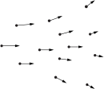
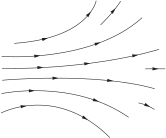
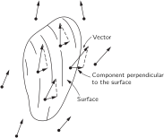
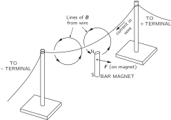
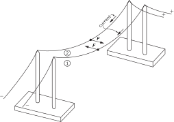
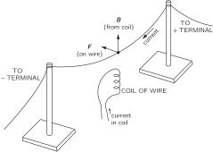
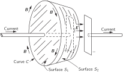

SOURCE: Feynman Lectures on Physics, Volume II, Chapter 1
LANGUAGE: ru
TITLE: Глава 1. ЭЛЕКТРОМАГНЕТИЗМ
SOURCE_URL: https://www.feynmanlectures.caltech.edu/II_01.html
NOTEBOOKLM_USE: clean lecture text with TeX math and figure captions; reader navigation removed.

# Глава 1. ЭЛЕКТРОМАГНЕТИЗМ

## 1–1 Электрические силы

Рассмотрим силу, которая, подобно тяготению, меняется обратно квадрату расстояния, но только в миллион биллионов биллионов биллионов раз более сильную. И которая отличается еще в одном. Пусть существуют два сорта «вещества», которые можно назвать положительным и отрицательным. Пусть одинаковые сорта отталкиваются, а разные — притягиваются в отличие от тяготения, при котором происходит только притяжение. Что же тогда случится?

Все положительное оттолкнется со страшной силой и разлетится в разные стороны. Все отрицательное — тоже. Но совсем другое произойдет, если положительное и отрицательное перемешать поровну. Тогда они с огромной силой притянутся друг к другу, и в итоге эти невероятные силы почти нацело сбалансируются, образуя плотные, «мелкозернистые» смеси положительного и отрицательного; между двумя грудами таких смесей практически не будет ощущаться ни притяжения, ни отталкивания.

Такая сила существует: это электрическая сила. И все вещество является смесью положительных протонов и отрицательных электронов, притягивающихся и отталкивающихся с неимоверной силой. Однако баланс между ними столь совершенен, что, когда вы стоите возле кого-нибудь, вы не ощущаете никакого действия этой силы. А если бы баланс нарушился хоть немножко, вы бы это сразу почувствовали. Если бы в вашем теле или в теле вашего соседа (стоящего от вас на расстоянии вытянутой руки) электронов оказалось бы всего на 1% больше, чем протонов, то сила вашего отталкивания была бы невообразимо большой. Насколько большой? Достаточной, чтобы поднять небоскреб? Больше! Достаточной, чтобы поднять гору Эверест? Больше! Силы отталкивания хватило бы, чтобы поднять «вес», равный весу нашей Земли!

Раз такие огромные силы в этих тонких смесях столь совершенно сбалансированы, то нетрудно понять, что вещество, стремясь удержать свои положительные и отрицательные заряды в тончайшем равновесии, должно обладать большой жесткостью и прочностью. Верхушка небоскреба, скажем, отклоняется при порывах ветра лишь на пару метров, потому что электрические силы удерживают каждый электрон и каждый протон более или менее на своих местах. А с другой стороны, если рассмотреть достаточно малое количество вещества так, чтобы в нем насчитывалось лишь немного атомов, то там необязательно будет равное число положительных и отрицательных зарядов, и могут проявиться большие остаточные электрические силы. Даже если числа тех и других зарядов одинаковы, все равно между соседними областями может действовать значительная электрическая сила. Потому что силы, действующие между отдельными зарядами, изменяются обратно пропорционально квадратам расстояний между ними и может оказаться, что отрицательные заряды одной части вещества ближе к положительным зарядам (другой части), чем к отрицательным. Силы притяжения тогда превзойдут силы отталкивания, и в итоге возникнет притяжение между двумя частями вещества, в которых нет избыточного заряда. Сила, удерживающая атомы, и химические силы, скрепляющие между собой молекулы, — все это силы электрические, действующие там, где число зарядов неодинаково или где промежутки между ними малы.

Вы знаете, конечно, что в атоме имеются положительные протоны в ядре и электроны вне ядра. Вы можете спросить: «Если эти электрические силы так велики, то почему же протоны и электроны не налезают друг на друга? Если они стремятся образовать тесную компанию, почему бы ей не стать еще теснее?» Ответ связан с квантовыми эффектами. Если попытаться заключить наши электроны в малый объем, окружающий протон, то, согласно принципу неопределенности, у них должен возникнуть среднеквадратичный импульс, тем больший, чем сильнее мы их ограничим. Именно это движение (требуемое законами квантовой механики) мешает электрическому притяжению еще больше сблизить заряды.

Тут возникает другой вопрос: «Что скрепляет ядро?» В ядре имеется несколько протонов, и все они положительно заряжены. Почему же они не разлетаются? Оказывается, что в ядре, помимо электрических сил, еще действуют и неэлектрические силы, называемые ядерными. Эти силы более мощные, чем электрические, и они способны, несмотря на электрическое отталкивание, удержать протоны вместе. Действие ядерных сил, однако, простирается недалеко; оно падает гораздо быстрее, чем \(1/r^2\) . И это приводит к важному результату. Если в ядре имеется слишком много протонов, то ядро становится чересчур большим и оно уже не может удержаться. Примером может служить уран с его 92 протонами. Ядерные силы действуют в основном между протоном (или нейтроном) и его ближайшим соседом, а электрические силы действуют на большие расстояния и вызывают отталкивание каждого протона в ядре от всех остальных. Чем больше в ядре протонов, тем сильнее электрическое отталкивание, пока (как у урана) равновесие не станет столь шатким, что ядру почти ничего не стоит разлететься от действия электрического отталкивания. Стоит его чуть-чуть «толкнуть» (например, послав внутрь медленный нейтрон)—и оно разваливается надвое, на две положительно заряженные части, разлетающиеся врозь в результате электрического отталкивания. Энергия, которая при этом высвобождается, — это энергия атомной бомбы. Ее обычно именуют «ядерной» энергией, хотя на самом деле это «электрическая» энергия, высвобождаемая, как только электрические силы превзойдут ядерные силы притяжения.

### Table Ch1-T1

Caption: Строчные греческие буквы и часто используемые прописные буквы

- \(\alpha\) | alpha | \(\iota\) | iota | \(\rho\) | rho
- \(\beta\) | beta | \(\kappa\) | kappa | \(\sigma\) | \(\Sigma\) | sigma
- \(\gamma\) | \(\Gamma\) | gamma | \(\lambda\) | \(\Lambda\) | lambda | \(\tau\) | tau
- \(\delta\) | \(\Delta\) | delta | \(\mu\) | mu | \(\upsilon\) | \(\Upsilon\) | upsilon
- \(\epsilon\) | epsilon | \(\nu\) | nu | \(\phi\) | \(\Phi\) | phi
- \(\zeta\) | zeta | \(\xi\) | \(\Xi\) | xi (ksi) | \(\chi\) | chi (khi)
- \(\eta\) | eta | \(o\) | omicron | \(\psi\) | \(\Psi\) | psi
- \(\theta\) | \(\Theta\) | theta | \(\pi\) | \(\Pi\) | pi | \(\omega\) | \(\Omega\) | omega

Наконец, можно спросить, чем скрепляется отрицательно заряженный электрон (ведь в нем нет ядерных сил)? Если электрон весь состоит из вещества одного сорта, то каждая его часть должна отталкивать остальные. Тогда почему же они не разлетаются в разные стороны? А точно ли существуют у электрона «части»? Может быть, следует считать электрон просто точкой и говорить, что электрические силы действуют только между разными точечными зарядами, так что электрон не действует сам на себя? Возможно. Единственно, что можно сейчас сказать, — что вопрос о том, чем скреплен электрон, вызвал много трудностей при попытке создать полную теорию электромагнетизма. И ответа на этот вопрос так и не получили. Мы займемся обсуждением этого вопроса немного позже в других главах.

Как мы видели, можно надеяться, что сочетание электрических сил и квантовомеханических эффектов определит структуру больших количеств вещества и, следовательно, их свойства. Одни материалы — твердые, другие — мягкие. Некоторые из них — электрические «проводники», потому что их электроны свободны и могут двигаться; другие — «изоляторы», их электроны привязаны каждый к своему атому. Мы выясним позже, откуда появляются такие свойства, но вопрос этот очень сложен, поэтому начнем с изучения одних только электрических сил в самых простых ситуациях. Мы начнем с рассмотрения только законов электричества, включая магнетизм, который в действительности является частью той же самой области.

Мы сказали, что электрические силы, как и силы тяготения, уменьшаются обратно пропорционально квадрату расстояния между зарядами. Это соотношение называется законом Кулона. Однако этот закон перестает выполняться точно, если заряды движутся: электрические силы зависят также сложным образом и от движения зарядов. Одну из частей силы, действующей между движущимися зарядами, мы называем магнитной силой. На самом же деле это только одно из проявлений электрического действия. Потому мы и говорим об «электромагнетизме».

Существует важный общий принцип, позволяющий относительно просто изучать электромагнитные силы. Мы обнаруживаем экспериментально, что сила, действующая на отдельный заряд (независимо от того, сколько там еще есть зарядов или как они движутся), зависит только от положения этого отдельного заряда, от его скорости и величины. Силу \(\FLPF\) , действующую на заряд \(q\) , движущийся со скоростью \(\FLPv\) , мы можем написать в виде
\[
\begin{equation}
\label{Eq:II:1:1}
\FLPF=q(\FLPE+\FLPv\times\FLPB).
\end{equation}
\]
Мы называем \(\FLPE\) электрическим полем, а \(\FLPB\) — магнитным полем в точке расположения заряда. Существенно, что электрические силы, действующие со стороны всех прочих зарядов Вселенной, можно свести к заданию всего лишь этих двух векторов. Их значения зависят от того, где находится заряд, и могут меняться со временем. Кроме того, если мы заменим этот заряд другим, то сила, действующая на новый заряд, изменится точно пропорционально величине заряда, если только все прочие заряды мира не меняют своего движения или положения. (В реальных условиях, конечно, каждый заряд действует на все прочие расположенные по соседству заряды и может заставить их двигаться, так что иногда при замене одного данного заряда другим поля могут измениться.)

Из материала, изложенного в первом томе, мы знаем, как определить движение частицы, если сила, действующая на нее, известна. Уравнение (1.1) в сочетании с уравнением движения дает
\[
\begin{equation}
\label{Eq:II:1:2}
\ddt{}{t}\biggl[\frac{m\FLPv}{(1-v^2/c^2)^{1/2}}\biggr]=
\FLPF=q(\FLPE+\FLPv\times\FLPB).
\end{equation}
\]
Значит, если \(\FLPE\) и \(\FLPB\) известны, то можно определить движение зарядов. Остается только узнать, как получаются \(\FLPE\) и \(\FLPB\) .

Один из наиболее важных принципов, упрощающих получение величины полей, состоит в следующем: пусть некоторое количество движущихся каким-то образом зарядов создает поле \(\FLPE_1\) , а другая совокупность зарядов — поле \(\FLPE_2\) . Если действуют оба набора зарядов одновременно (сохраняя те же свои положения и движения, какими они обладали, когда рассматривались порознь), то возникающее поле равно в точности сумме
\[
\begin{equation}
\label{Eq:II:1:3}
\FLPE=\FLPE_1+\FLPE_2.
\end{equation}
\]
. Этот факт называется принципом наложения полей (или принципом суперпозиции). Он выполняется и для магнитных полей.

Этот принцип означает, что если нам известен закон для электрического и магнитного полей, образуемых одиночным зарядом, движущимся произвольным образом, то, значит, нам известны все законы электродинамики. Если мы хотим знать силу, действующую на заряд \(A\) , нам нужно только рассчитать величину полей \(\FLPE\) и \(\FLPB\) , созданных каждым из зарядов \(B\) , \(C\) , \(D\) и т. д., и сложить все эти \(\FLPE\) и \(\FLPB\) от всех зарядов, чтобы найти поля, а из них — силы, действующие на заряд \(A\) . Если бы оказалось, что поле, создаваемое одиночным зарядом, отличается простотой, то это стало бы самым изящным способом описания законов электродинамики. Мы уже описывали этот закон (см. вып. 1, гл. 28), и, к сожалению, он довольно сложен.

Оказывается, что форма, в которой законы электродинамики становятся простыми, совсем не такая, какой можно было бы ожидать. Она не проста, если мы захотим иметь формулу для силы, с которой один заряд действует на другой. Правда, когда заряды покоятся, закон силы — закон Кулона — прост, но когда заряды движутся, соотношения усложняются из-за запаздывания во времени, влияния ускорения и т. п. В итоге мы не хотим представлять электродинамику с помощью одних лишь законов сил, действующих между зарядами; гораздо более приемлема другая точка зрения, при которой с законами электродинамики легче управляться.

## 1–2 Электрические и магнитные поля

Первым делом нужно несколько расширить наши представления об электрическом и магнитном векторах, \(\FLPE\) и \(\FLPB\) . Мы определили их через силы, действующие на заряд. Теперь мы намереваемся говорить об электрическом и магнитном полях в точке, даже если там нет никакого заряда. Следовательно, мы утверждаем, что раз на заряд «действуют» силы, то в том месте, где он стоял, остается «нечто» и тогда, когда заряд оттуда убрали. Если заряд, расположенный в точке \((x,y,z)\) в момент \(t\) , ощущает действие силы \(\FLPF\) , согласно уравнению (1.1), то мы связываем векторы \(\FLPE\) и \(\FLPB\) с точкой в пространстве \((x,y,z)\) . Можно считать, что \(\FLPE(x,y,z,t)\) и \(\FLPB(x,y,z,t)\) дают силы, действие которых ощутит в момент \(t\) заряд, расположенный в \((x,y,z)\) , при условии, что помещение заряда в этой точке не потревожит ни расположения, ни движения всех прочих зарядов, ответственных за поля.

Следуя этому представлению, мы связываем с каждой точкой \((x,y,z)\) пространства два вектора \(\FLPE\) и \(\FLPB\) , способных меняться со временем. Электрические и магнитные поля тогда рассматриваются как векторные функции от \(x\) , \(y\) , \(z\) и \(t\) . Поскольку вектор определяется своими компонентами, то каждое из полей \(\FLPE(x,y,z,t)\) и \(\FLPB(x,y,z,t)\) представляет собой три математические функции от \(x\) , \(y\) , \(z\) и \(t\) .

Именно потому, что \(\FLPE\) (или \(\FLPB\) ) может быть определено для каждой точки пространства, его и называют «полем». Поле — это любая физическая величина, которая в разных точках пространства принимает различные значения. Скажем, температура — это поле (в этом случае скалярное), которое можно записать в виде \(T(x,y,z)\) . Кроме того, температура может меняться и во времени, тогда мы скажем, что температурное поле зависит от времени, и напишем \(T(x,y,z,t)\) . Другим примером поля может служить «поле скоростей» текущей жидкости. Мы записываем \(\FLPv(x,y,z,t)\) для скорости жидкости в любой точке пространства в момент \(t\) . Это поле векторное.

Вернемся к электромагнитным полям. Хотя формулы, по которым они создаются зарядами, и сложны, у них есть следующее важное свойство: связь между значениями полей в некоторой точке и значениями их в соседней точке очень проста. Нескольких таких соотношений (в форме дифференциальных уравнений) достаточно, чтобы полностью описать поля. Именно в такой форме законы электродинамики и выглядят особенно просто.

Немало изобретательности было потрачено на то, чтобы помочь людям мысленно представить поведение полей. И самая правильная точка зрения — это самая отвлеченная: надо просто рассматривать поля как математические функции координат и времени. Можно также попытаться получить мысленную картину поля, начертив во многих точках пространства по вектору так, чтобы каждый из них показывал напряженность и направление поля в этой точке. Такое представление приводится на фиг. 1.1. Можно пойти и дальше: начертить линии, которые в любой точке будут касательными к этим векторам. Они как бы следуют за стрелками и сохраняют направление поля. Если это сделать, то сведения о длинах векторов будут утеряны, но их можно сохранить, если в тех местах, где напряженность поля мала, провести линии пореже, а где велика — погуще. Договоримся, что число линий на единицу площади, расположенной поперек линий, будет пропорционально напряженности поля. Это, конечно, всего лишь приближение; иногда нам придется добавлять новые линии, чтобы их количество отвечало напряженности поля. Поле, изображенное на фиг. 1.1, представлено линиями поля на фиг. 1.2.

### Figure Ch1-F1
Caption: Фиг. 1.1. Векторное поле, представленное множеством стрелок, длина и направление которых отмечают величину векторного поля в тех точках, откуда выходят стрелки.
Image: figures/Ch1-F1.svg

### Figure Ch1-F2
Caption: Фиг. 1.2. Векторное поле можно представить, проведя линии, касательные к направлению вектора поля в каждой точке, и сделав их плотность пропорциональной величине вектора поля.
Image: figures/Ch1-F2.svg

## 1–3 Характеристики векторных полей

Существуют два математически важных свойства векторного поля, которыми мы будем пользоваться при описании законов электричества с полевой точки зрения. Представим себе замкнутую поверхность и зададим вопрос, вытекает ли из нее «нечто», т. е. обладает ли поле свойством «истечения»? Скажем, для поля скоростей мы можем поинтересоваться, всегда ли скорость направлена от поверхности, или, в более общем случае, вытекает ли из поверхности больше жидкости (в единицу времени), нежели втекает. Общее количество жидкости, вытекающее через поверхность в единицу времени, мы назовем «потоком скорости» через поверхность. Поток через элемент поверхности равен составляющей скорости, перпендикулярной к элементу, умноженной на его площадь. Для произвольной замкнутой поверхности суммарный поток (или поток наружу) равен среднему значению нормальной компоненты скорости, умноженному на площадь поверхности:
\[
\begin{equation}
\label{Eq:II:1:4}
\text{Flux}=
\begin{pmatrix}
\text{average}\\[-.75ex]
\text{normal}\\[-.75ex]
\text{component}
\end{pmatrix}
\cdot
\begin{pmatrix}
\text{surface}\\[-.75ex]
\text{area}
\end{pmatrix}.
\end{equation}
\]

### Figure Ch1-F3
Caption: Фиг. 1.3. Поток векторного поля через поверхность, определяемый как произведение среднего значения нормальной составляющей вектора на площадь этой поверхности.
Image: figures/Ch1-F3.svg

В случае электрического поля можно математически определить понятие, сходное с потоком жидкости; мы тоже называем его потоком, но, конечно, это уже не течение какой-то жидкости, потому что электрическое поле нельзя считать скоростью чего-то. Оказывается все же, что математическая величина, определяемая как средняя нормальная компонента поля, по-прежнему имеет полезное значение. Тогда мы говорим о потоке электричества, также определяемом уравнением (1.4). Наконец, полезно говорить и о потоке не только сквозь замкнутую, но и сквозь любую ограниченную поверхность. Как и прежде, поток сквозь такую поверхность определяется как средняя нормальная компонента вектора, умноженная на площадь поверхности. Эти представления иллюстрируются фиг. 1.3.

### Figure Ch1-F4
Caption: Фиг. 1.4. (а) Поле скоростей в жидкости. Представьте себе трубку постоянного сечения, уложенную вдоль произвольной замкнутой кривой, как на (б). Если жидкость внезапно заморозить повсюду, кроме трубки, то жидкость в трубке начнет циркулировать, как показано на (в).
Image: figures/Ch1-F4.svg

Существует второе свойство векторного поля, относящееся скорее к линии, нежели к поверхности. Представим себе опять поле скоростей, описывающее поток жидкости. Можно задать интересный вопрос: циркулирует ли жидкость? Это значит: существует ли вращательное ее движение вдоль некоторого замкнутого контура (петли)? Вообразите себе, что мы мгновенно заморозили жидкость повсюду, за исключением внутренней части замкнутой в виде петли трубки постоянного сечения, как на фиг. 1.4. Снаружи трубки жидкость остановится, но внутри она может продолжать двигаться, если в ней (в жидкости) сохранился импульс, т. е. если импульс, который гонит ее в одном направлении, больше импульса в обратном. Мы определяем величину, называемую циркуляцией, как скорость жидкости в трубке, умноженную на длину трубки. Опять-таки мы можем расширить наши представления и определить «циркуляцию» для любого векторного поля (даже если там нет ничего движущегося). У всякого векторного поля циркуляция по любому воображаемому замкнутому контуру определяется как средняя касательная компонента вектора (с учетом направления обхода), умноженная на протяженность контура (фиг. 1.5):
\[
\begin{equation}
\label{Eq:II:1:5}
\text{Circulation}=
\begin{pmatrix}
\text{average}\\[-.75ex]
\text{tangential}\\[-.75ex]
\text{component}
\end{pmatrix}
\cdot
\begin{pmatrix}
\text{distance}\\[-.75ex]
\text{around}
\end{pmatrix}
\end{equation}
\]
Вы видите, что это определение действительно дает число, пропорциональное циркуляции скорости в трубке, просверленной в быстрозамороженной жидкости.

### Figure Ch1-F5
Caption: Фиг. 1.5. Циркуляция векторного поля, равная произведению средней касательной составляющей вектора (с учетом ее знака по отношению к направлению обхода) на длину контура.
Image: figures/Ch1-F5.svg

Пользуясь только этими двумя понятиями — понятием о потоке и понятием о циркуляции, — мы способны описать все законы электричества и магнетизма. Вам, быть может, трудно будет отчетливо понять значение законов, но они дадут вам некоторое представление о том, каким способом в конечном счете может быть описана физика электромагнитных явлений.

## 1–4 Законы электромагнетизма

Первый закон электромагнетизма описывает поток электрического поля:
\[
\begin{equation}
\label{Eq:II:1:6}
\begin{pmatrix}
\text{Flux of $\FLPE$}\\[-.5ex]
\text{through any}\\[-.5ex]
\text{closed surface}
\end{pmatrix}
=
\frac{\begin{pmatrix}
\text{net charge}\\[-.5ex]
\text{inside}
\end{pmatrix}
}{\epsO},
\end{equation}
\]
где \(\epsO\) — некоторая постоянная. (Постоянная \(\epsO\) обычно читается как «эпсилон-нуль».) Если внутри поверхности нет зарядов, а вне ее (даже совсем рядом) есть, то все равно средняя нормальная компонента \(\FLPE\) равна нулю, так что никакого потока через поверхность нет. Чтобы показать пользу от такого типа утверждений, мы докажем, что уравнение (1.6) совпадает с законом Кулона, если только учесть, что поле отдельного заряда обязано быть сферически симметричным. Проведем вокруг точечного заряда сферу. Тогда средняя нормальная компонента в точности равна значению \(\FLPE\) в любой точке, потому что поле должно быть направлено по радиусу и иметь одну и ту же величину во всех точках сферы. Тогда наше правило утверждает, что поле на поверхности сферы, умноженное на площадь сферы (т. е. вытекающий из сферы поток), пропорционально заряду внутри нее. Если увеличивать радиус сферы, то ее площадь растет, как квадрат радиуса. Произведение средней нормальной компоненты электрического поля на эту площадь должно по-прежнему быть равно внутреннему заряду, значит, поле должно убывать, как квадрат расстояния; так получается поле «обратных квадратов».

Если взять в пространстве произвольную кривую и измерить циркуляцию электрического поля вдоль этой кривой, то окажется, что она в общем случае не равна нулю (хотя в кулоновом поле это так). Вместо этого для электричества справедлив второй закон, утверждающий, что для любой поверхности \(S\) (не замкнутой), краем которой является кривая \(C\) ,
\[
\begin{equation}
\label{Eq:II:1:7}
\begin{pmatrix}
\text{Circulation of $\FLPE$}\\[-.5ex]
\text{around $C$}
\end{pmatrix}
=-\ddt{}{t}\begin{pmatrix}
\text{flux of $\FLPB$}\\[-.5ex]
\text{through $S$}
\end{pmatrix}.
\end{equation}
\]

И, наконец, формулировка законов электромагнитного поля будет закончена, если написать два соответствующих уравнения для магнитного поля \(\FLPB\) :
\[
\begin{equation}
\label{Eq:II:1:8}
\begin{pmatrix}
\text{Flux of $\FLPB$}\\[-.5ex]
\text{through any}\\[-.5ex]
\text{closed surface}
\end{pmatrix}
=0.
\end{equation}
\]
А для поверхности \(S\) , ограниченной кривой \(C\) :
\[
\begin{gather}
\label{Eq:II:1:9}
c^2
\begin{pmatrix}
\text{circulation of $\FLPB$}\\[-.5ex]
\text{around $C$}
\end{pmatrix}
=\\[1.5ex]
\ddt{}{t}
\begin{pmatrix}
\text{flux of $\FLPE$}\\[-.5ex]
\text{through $S$}
\end{pmatrix}
+\frac{
\begin{pmatrix}
\text{flux of}\\[-.75ex]
\text{electric current}\\[-.5ex]
\text{through $S$}
\end{pmatrix}
}{\epsO}.\notag
\end{gather}
\]

Появившаяся в уравнении (1.9) постоянная \(c^2\) — это квадрат скорости света. Ее появление оправдано тем, что магнетизм по существу есть релятивистское проявление электричества. А константа \(\epsO\) поставлена для того, чтобы возникли привычные единицы силы электрического тока.

Уравнения (1.6) — (1.9), а также уравнение (1.1) — это все законы электродинамики . Как вы помните, законы Ньютона написать было очень просто, но из них зато вытекало множество сложных следствий, так что понадобилось немало времени, чтобы изучить их все. Законы электромагнетизма написать несравненно трудней, и мы должны ожидать, что следствия из них будут намного более запутаны, и теперь нам придется очень долго в них разбираться.

### Figure Ch1-F6
Caption: Фиг. 1.6. Магнитная палочка, создающая возле провода поле \(\FigB\) . Когда по проводу идет ток, провод смещается из-за действия силы \(\FigF =
q\Figv\times\FigB\) .
Image: figures/Ch1-F6.svg

Мы можем проиллюстрировать некоторые законы электродинамики серией несложных опытов, которые смогут нам показать хотя бы качественно взаимоотношения электрического и магнитного полей. С первым членом в уравнении (1.1) вы знакомитесь, расчесывая себе волосы, так что о нем мы говорить не будем. Второй член в уравнении (1.1) можно продемонстрировать, пропустив ток по проволоке, висящей над магнитным бруском, как показано на фиг. 1.6. При включении тока проволока сдвигается из-за того, что на нее действует сила \(\FLPF=q\FLPv\times\FLPB\) . Когда по проводу идет ток, заряды внутри него движутся, т. е. имеют скорость \(\FLPv\) , и на них действует магнитное поле магнита, в результате чего провод отходит в сторону.

Когда провод сдвигается влево, можно ожидать, что сам магнит испытает толчок вправо. (Иначе все это устройство можно было бы водрузить на платформу и получить реактивную систему, в которой импульс не сохранялся бы!) Хотя сила чересчур мала, чтобы можно было заметить движение магнитной палочки, однако движение более чувствительного устройства, скажем стрелки компаса, вполне заметно.

Каким же образом ток в проводе толкает магнит? Ток, текущий по проводу, создает вокруг него свое собственное магнитное поле, которое и действует на магнит. В соответствии с последним членом в уравнении (1.9) ток должен приводить к циркуляции вектора \(\FLPB\) ; в нашем случае линии поля \(\FLPB\) замкнуты вокруг провода, как показано на фиг. 1.7. Именно это поле \(\FLPB\) и ответственно за силу, действующую на магнит.

### Figure Ch1-F7
Caption: Фиг. 1.7. Магнитное поле тока, текущего по проводу, действует на магнит с некоторой силой.
Image: figures/Ch1-F7.svg

Уравнение ( 1.9 ) сообщает нам, что при данной величине тока, текущего по проводу, циркуляция поля \(\FLPB\) одинакова для любой кривой, окружающей провод. У тех кривых (окружностей, например), которые лежат далеко от провода, длина оказывается больше, так что касательная компонента \(\FLPB\) должна убывать. Вы видите, что следует ожидать линейного убывания \(\FLPB\) с удалением от длинного прямого провода.

Мы сказали, что ток, текущий по проводу, образует вокруг него магнитное поле и что если имеется магнитное поле, то оно действует с некоторой силой на провод, по которому идет ток. Значит, следует думать, что если магнитное поле будет создано током, текущим в одном проводе, то оно будет действовать с некоторой силой и на другой провод, по которому тоже идет ток. Это можно показать, применив два свободно подвешенных провода (фиг. 1.8). Когда направление токов одинаково, провода притягиваются, а когда направления противоположны, — отталкиваются.

### Figure Ch1-F8
Caption: Фиг. 1.8. Два провода, по которым течет ток, действуют друг на друга с силами.
Image: figures/Ch1-F8.svg

Короче говоря, электрические токи, так же как и магниты, создают магнитные поля. Но постойте, что же такое магнит? Если магнитные поля создаются движущимися зарядами, не может ли быть так, что магнитное поле куска железа на самом деле является результатом действия токов? По-видимому, так оно и есть. Мы можем заменить полосовой магнит в нашем эксперименте катушкой из провода, как показано на фиг. 1.9. Когда по катушке — как и по прямому проводу над нею — пропускается ток, наблюдается точно такое же движение проводника, как и прежде, когда вместо катушки стоял магнит. Иными словами, ток в катушке имитирует магнит. Все выглядит так, как если бы кусок железа содержал непрерывно циркулирующий ток. Действительно, свойства магнитов можно понять как непрерывные токи внутри атомов железа. Сила, действующая на магнит на фиг. 1.7, объясняется вторым членом в уравнении (1.1).

### Figure Ch1-F9
Caption: Фиг. 1.9. Магнитную палочку, показанную на фиг. 1.6, можно заменить катушкой, по которой течет ток. На провод по-прежнему будет действовать сила.
Image: figures/Ch1-F9.svg

Откуда берутся токи? Одна из возможностей — движение электронов по атомным орбитам. На самом деле для железа это не так, хотя для некоторых других веществ — именно так. Помимо движения по орбите в атоме, электрон еще и вращается вокруг собственной оси — подобно вращению Земли, — и именно ток, создаваемый этим вращением, дает магнитное поле в железе. (Мы говорим «подобно вращению Земли» потому, что этот вопрос уходит так глубоко в квантовую механику, что классические представления описывают его не слишком хорошо.) В большинстве веществ одни электроны вращаются в одну сторону, а другие — в другую, поэтому магнетизм компенсируется, но в железе — по загадочной причине, которую мы обсудим позже — многие электроны вращаются так, что их оси выстроены параллельно, и это служит источником магнетизма.

Поскольку поля магнитов обусловлены токами, нам не нужно добавлять никаких дополнительных членов к уравнениям или , чтобы учесть влияние магнитов. Мы просто берем все токи, включая круговые токи вращающихся электронов, и тогда закон будет верен. Вы также должны заметить, что уравнение говорит о том, что не существует магнитных «зарядов», аналогичных электрическим зарядам, стоящим в правой части уравнения . Ни одного такого заряда обнаружено не было.

### Figure Ch1-F10
Caption: Фиг. 1.10. Циркуляция \(\FigB\) по кривой \(C\) определяется либо током, проходящим через поверхность \(S_1\) , либо скоростью изменения потока \(\FigE\) через поверхность \(S_2\) .
Image: figures/Ch1-F10.svg

Первый член в правой части уравнения (1.9) был открыт Максвеллом теоретически и имеет огромное значение. Он означает, что изменяющиеся электрические поля создают магнитные эффекты. На самом деле без этого члена уравнение не имело бы смысла, поскольку в противном случае не могло бы быть токов в цепях, не являющихся замкнутыми контурами. Но такие токи существуют, в чем можно убедиться на следующем примере. Представьте себе конденсатор, состоящий из двух плоских пластин. Он заряжается током, который течет к одной пластине и от другой, как показано на фиг. 1–10. Мы проводим кривую \(C\) вокруг одного из проводов и затягиваем её поверхностью, которая пересекает провод, как показано поверхностью \(S_1\) на рисунке. Согласно уравнению (1.9), циркуляция \(\FLPB\) по контуру \(C\) (умноженная на \(c^2\) ) определяется током в проводе (деленным на \(\epsO\) ). Но что, если мы затянем эту кривую другой поверхностью \(S_2\) , которая по форме напоминает чашу и проходит между пластинами конденсатора, не касаясь провода? Через эту поверхность, безусловно, никакой ток не проходит. Однако изменение положения и формы воображаемой поверхности не должно изменять реального магнитного поля! Циркуляция поля \(\FLPB\) должна остаться прежней. И действительно, первый член в правой части уравнения (1.9) так комбинируется со вторым членом, что для обеих поверхностей \(S_1\) и \(S_2\) возникает одинаковый эффект. Для \(S_2\) циркуляция вектора \(\FLPB\) выражается через скорость изменения потока вектора \(\FLPE\) между пластинами конденсатора. И получается, что изменение \(\FLPE\) связано с током как раз так, что уравнение (1.9) оказывается выполненным. Максвелл видел необходимость этого и был первым, кто написал полное уравнение.

С помощью устройства, изображенного на фиг. 1–6, можно продемонстрировать другой закон электромагнетизма. Отсоединим концы висящей проволочки от батарейки и присоединим их к гальванометру, который показывает, течет ли по проводу ток. Стоит лишь в поле магнита качнуть проволоку, как по ней сразу пойдет ток. Это новое следствие уравнения \(\FLPF=q\FLPv\times\FLPB\) : электроны в проводе почувствуют действие силы \(\FLPv\) . Скорость электронов сейчас направлена в сторону, потому что они отклоняются вместе с проволочкой. Это \(\FLPB\) вместе с вертикально направленным полем магнита приводит к силе, действующей на электроны вдоль провода, и электроны отправляются к гальванометру.

Положим, однако, что мы оставили проволочку в покое и принялись перемещать магнит. Мы чувствуем, что никакой разницы быть не должно, ведь относительное движение тоже самое, и впрямь ток по гальванометру идет. Но как же магнитное поле действует на покоящиеся заряды? В соответствии с уравнением ( 1.1 ) должно возникнуть электрическое поле. Движущийся магнит должен создавать электрическое поле. На вопрос — как это происходит, отвечает количественно уравнение ( 1.7 ). Это уравнение описывает множество практически очень важных явлений, происходящих в электрических генераторах и трансформаторах.

Наиболее замечательное следствие наших уравнений — это то, что, сочетая уравнения ( 1.7 ) и ( 1.9 ), можно понять, отчего электромагнитные явления распространяются на дальние расстояния. Причина этого, грубо говоря, примерно такова: предположим, что где-то имеется магнитное поле, которое возрастает, скажем, оттого, что внезапно пустили ток по проводу. Тогда из уравнения ( 1.7 ) следует, что должна возникнуть циркуляция электрического поля. Когда электрическое поле начинает постепенно возрастать для возникновения циркуляции, тогда, согласно уравнению ( 1.9 ), должна возникать и магнитная циркуляция. Но возрастание этого магнитного поля создаст новую циркуляцию электрического поля и т. д. Таким способом поля распространяются сквозь пространство, не нуждаясь ни в зарядах, ни в токах нигде, кроме источника полей. Именно таким способом мы видим друг друга! Все это спрятано в уравнениях электромагнитного поля.

## 1–5 Что это такое — «поля»?

Теперь сделаем несколько замечаний о нашем подходе к этой теме. Вы можете сказать: «Все эти потоки и циркуляции довольно абстрактны. В каждой точке пространства существует электрическое поле; кроме того, имеются эти самые «законы». Но что же там на самом деле происходит? Почему вы не можете объяснить это, скажем, тем, что что-то протекает между зарядами?» Все зависит от ваших предрассудков. Многие физики часто говорили, что прямое действие сквозь пустоту, сквозь ничто, немыслимо. (Как они могут называть идею немыслимой, если она уже вымышлена?) Они говорили: «Посмотрите, ведь единственные силы, которые нам известны, — это прямое действие одной части вещества на другую. Невозможно, чтобы существовала сила без чего-то, передающего ее». Но что в действительности происходит, когда мы изучаем «прямое действие» одного куска вещества на другой? Мы обнаруживаем, что первый из них вовсе не «упирается» во второй; они слегка отстоят друг от друга, и между ними существуют электрические силы, действующие в малом масштабе. Иначе говоря, мы обнаруживаем, что собрались объяснить так называемое «действие посредством прямого контакта» при помощи картины электрических сил. Конечно, неразумно пытаться стоять на том, что электрическая сила должна выглядеть так же, как старый привычный мышечный тяни-толкай, если все равно оказывается, что все наши попытки тянуть или толкать приводят к электрическим силам! Единственно разумная постановка вопроса — спросить, какой путь рассмотрения электрических эффектов наиболее удобен. Одни предпочитают представлять их как взаимодействие зарядов на расстоянии и пользоваться сложным законом. Другим по душе силовые линии. Они их все время чертят, и им кажется, что писать разные \(\FLPE\) и \(\FLPB\) слишком абстрактно. Но линии поля — это всего лишь грубый способ описания поля, и очень трудно сформулировать строгие, количественные законы непосредственно в терминах линий поля. К тому же понятие о линиях поля не содержит глубочайшего из принципов электродинамики — принципа суперпозиции. Даже если мы знаем, как выглядят силовые линии одной совокупности зарядов, а затем другой, мы все равно не получим никакого представления о картине силовых линий, когда обе совокупности зарядов действуют вместе. А с математических позиций наложение проделать легко, надо просто сложить два вектора. У силовых линий есть свои достоинства, они дают наглядную картину, но есть у них и свои недостатки. Способ рассуждений, основанный на понятии о непосредственном взаимодействии, обладает большими преимуществами, пока речь идет о покоящихся электрических зарядах, но обладает и большими недостатками, если иметь дело с быстрым движением зарядов.

Лучше всего пользоваться абстрактным представлением о поле. Жаль, конечно, что оно абстрактно, но ничего не поделаешь. Попытки представить электрическое поле как движение каких-то зубчатых колесиков или с помощью силовых линий или как напряжения в каких-то материалах потребовали от физиков больше усилий, чем понадобилось бы для того, чтобы просто получить правильные ответы на задачи электродинамики. Интересно, что правильные уравнения поведения света были выведены Мак-Куллохом еще в 1839 г. Но все ему говорили: «Позвольте, ведь нет же ни одного реального материала, механические свойства которого могли бы удовлетворить этим уравнениям, а поскольку свет — это колебания, которые должны происходить в чем-то, постольку мы не можем поверить этим абстрактным уравнениям». Если бы у его современников не было этой предвзятости, они бы поверили в правильные уравнения поведения света намного раньше того, чем это на самом деле случилось.

А что касается магнитных полей, то можно высказать следующее замечание. Предположим, что вам в конце концов удалось нарисовать картину магнитного поля при помощи каких-то линий или каких-то шестеренок, катящихся сквозь пространство. Тогда вы попытаетесь объяснить, что происходит с двумя зарядами, движущимися в пространстве параллельно друг другу и с одинаковыми скоростями. Раз они движутся, то они ведут себя как два тока и обладают связанным с ними магнитным полем (как токи в проводах на фиг. 1.8). Но наблюдатель, который мчится вровень с этими двумя зарядами, будет считать их неподвижными и скажет, что никакого магнитного поля там нет. И «шестеренки», и «линии» пропадают, когда вы мчитесь рядом с предметом! Все, чего вы добились,— это изобрели новую проблему. Куда могли деваться эти шестерни?! Если вы чертили силовые линии — у вас появится та же забота. Не только нельзя определить, движутся ли эти линии вместе с зарядами или не движутся, но и вообще они могут полностью исчезнуть в какой-то системе координат.

Мы хотим подчеркнуть, что явление магнетизма — это на самом деле чисто релятивистский эффект. В только что рассмотренном случае двух зарядов, движущихся параллельно друг другу, можно было бы ожидать, что понадобится сделать релятивистские поправки к их движению порядка \(v^2/c^2\) . Эти поправки должны отвечать магнитной силе. Но как быть с силой взаимодействия двух проводников в нашем опыте (фиг. 1.8)? Ведь там магнитная сила — это вся действующая сила. Она не очень-то смахивает на «релятивистскую поправку». Кроме того, если оценить скорости электронов в проводе (вы сами можете это проделать), то вы получите, что их средняя скорость вдоль провода составляет около \(0.01\) см/сек. Итак, \(v^2/c^2\) равно примерно \(10^{-25}\) . Вполне пренебрежимая «поправка». Но нет! Хоть в этом случае магнитная сила и составляет \(10^{-25}\) от «нормальной» электрической силы, действующей между движущимися электронами, вспомните, что «нормальные» электрические силы исчезли в результате почти идеального баланса из-за того, что количества протонов и электронов в проводах одинаковы. Этот баланс намного более точен, чем 1/ \(10^{25}\) , и тот малый релятивистский член, который мы называем магнитной силой, — это единственный остающийся член. Он становится преобладающим.

Почти полное взаимное уничтожение электрических эффектов и позволило физикам изучить релятивистские эффекты (т. е. магнетизм) и открыть правильные уравнения (с точностью до \(v^2/c^2\) ), даже не зная, что в них происходит. И по этой-то причине после открытия принципа относительности законы электромагнетизма не пришлось менять. В отличие от механики они уже были правильны с точностью до \(v^2/c^2\) .

## 1–6 Электромагнетизм в науке и технике

В заключение мне хочется закончить эту главу следующим рассказом. Среди многих явлений, изучавшихся древними греками, были два очень странных: натертый кусочек янтаря мог поднять маленькие клочки папируса, и близ города Магнезия были удивительные камни, которые притягивали железо. Странно думать, что это были единственные известные грекам явления, в которых проявлялись электричество и магнетизм. А почему только это и было им известно, объясняется прежде всего сказочной точностью, с которой сбалансированы в телах заряды, о чем мы уже упоминали. Ученые, жившие в позднейшие времена, раскрыли одно за другим новые явления, в которых выражались некоторые стороны тех же эффектов, связанных с янтарем и с магнитным камнем. Сейчас нам ясно, что и явления химического взаимодействия и в конечном счете саму жизнь нужно объяснять с помощью понятий электромагнетизма.

По мере того как развивалось понимание предмета электромагнетизма, появлялись такие технические возможности, о которых древние не могли даже мечтать: стало возможным посылать сигналы по телеграфу на большие расстояния, беседовать с человеком, который находится за много километров от вас, без помощи какой-либо линии связи, включать огромные энергетические системы — большие водяные турбины, соединенные многосоткилометровыми линиями проводов с другой машиной, которую пускает в ход один рабочий простым поворотом колеса; многие тысячи разветвляющихся проводов и десятки тысяч машин в тысячах мест приводят в движение различные механизмы на фабриках и в квартирах. Все это вращается, двигается, работает благодаря нашему знанию законов электромагнетизма.

Сегодня мы используем и еще более тонкие эффекты. Гигантские электрические силы можно сделать очень точными, их можно контролировать и использовать на всякий лад. Наши приборы так чувствительны, что мы способны узнать, что сейчас делает человек только по тому, как он воздействует на электроны, заключенные в тонком металлическом прутике за сотни километров от него. Для этого только нужно приспособить этот прутик в качестве телевизионной антенны!

Если смотреть на историю человечества с большого расстояния — скажем, через десять тысяч лет, — то можно не сомневаться, что самым значительным событием XIX столетия будет признано открытие Максвеллом законов электродинамики. Гражданская война в Америке в том же десятилетии на фоне этого важного научного события будет выглядеть мелким провинциальным происшествием.
