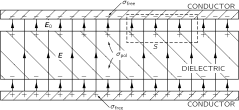
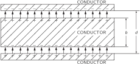
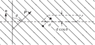
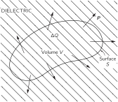
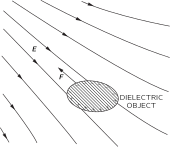

SOURCE: Feynman Lectures on Physics, Volume II, Chapter 10
LANGUAGE: ru
TITLE: Глава 10. Диэлектрики
SOURCE_URL: https://www.feynmanlectures.caltech.edu/II_10.html
NOTEBOOKLM_USE: clean lecture text with TeX math and figure captions; reader navigation removed.

# Глава 10. Диэлектрики

## 10–1 Диэлектрическая проницаемость

Сейчас мы разберем еще одно характерное свойство материи, возникающее под влиянием электрического поля. В одной из предыдущих глав мы рассмотрели поведениепроводников, в которых заряды под влиянием электрического поля свободно текут в такие участки, что поле внутри проводника обращается в нуль. Теперь мы будем говоритьизоляторыматериалы, которые не проводят электричество. Сначала можно было бы подумать, что в них вообще ничего не происходит. Но Фарадей с помощью простого электроскопа и конденсатора, состоящего из двух параллельных пластин, обнаружил, что это не так. Его опыт показал, что емкость такого конденсатораувеличиласькогда между пластинами помещается изолятор. Если изолятор целиком заполняет пространство между пластинами, емкость возрастает в \(\kappa\) который зависит только от свойств изолирующего материала. Изолирующие материалы называют такжедиэлектрики; множитель \(\kappa\) является свойством диэлектрика и называется диэлектрической проницаемостью.диэлектрическая проницаемостьДиэлектрическая проницаемость вакуума, конечно, равна единице.

Наша задача теперь состоит в том, чтобы объяснить, почему вообще возникает электрический эффект, раз изоляторы фактически являются изоляторами и не проводят электричества. Начнем с экспериментального факта, что емкость увеличивается, и попытаемся разобраться, что же там может происходить. Рассмотрим плоский конденсатор, на проводящих пластинах которого имеются заряды, скажем, отрицательный заряд на верхней пластине и положительный — на нижней. Пусть расстояние между пластинами равно \(d\) , а площадь каждой пластины \(A\) . Как мы показали раньше, емкость равна
\[
\begin{equation}
\label{Eq:II:10:1}
C=\frac{\epsO A}{d},
\end{equation}
\]
, а заряд и потенциал конденсатора связаны соотношением
\[
\begin{equation}
\label{Eq:II:10:2}
Q=CV.
\end{equation}
\]
. Теперь экспериментальный факт состоит в том, что если мы положим между пластинами кусок изолирующего материала, например плексигласа или стекла, то емкость возрастет. Это, разумеется, означает, что при том же заряде потенциал стал меньше. Но разность потенциалов есть интеграл от электрического поля, взятый поперек конденсатора; отсюда мы должны заключить, что электрическое поле внутри конденсатора стало меньше, хотя заряды на пластинах и не изменились.

### Figure Ch10-F1
Caption: Фиг. 10.1. Плоский конденсатор с диэлектриком. Показаны линии поля \(\FigE\) .
Image: figures/Ch10-F1.svg

Но как может это быть? Нам известна теорема Гаусса, которая утверждает, что поток электрического поля прямо связан с находящимся внутри объемом электрическим зарядом. Рассмотрим поверхность Гаусса \(S\) , изображенную пунктиром на фиг. 10.1. Поскольку электрическое поле в присутствии диэлектрика уменьшается, мы заключаем, что полный заряд внутри поверхности должен теперь быть меньше, чем без этого материала. Остается сделать единственный вывод: на поверхности диэлектрика должны находиться положительные заряды. Раз поле уменьшилось, но все же не обратилось в нуль, значит, этот положительный заряд меньше отрицательного заряда в проводнике. Итак, явление можно объяснить, если мы поймем, почему при помещении диэлектрика в электрическое поле на одной его поверхности индуцируется положительный заряд, а на другой — отрицательный.

### Figure Ch10-F2
Caption: Фиг. 10.2. Если поместить пластинку проводника внутрь плоского конденсатора, наведенные заряды обратят поле в проводнике в нуль.
Image: figures/Ch10-F2.svg

Мы ожидали бы, что это произойдет в случае проводника. Например, предположим, что у нас есть конденсатор с расстоянием между пластинами \(d\) , и мы поместили между пластинами незаряженный проводник толщиной \(b\) , как показано на фиг. 10.2. Электрическое поле индуцирует положительный заряд на верхней поверхности и отрицательный заряд на нижней поверхности, так что поле внутри проводника равно нулю. Поле в остальной части пространства такое же, каким оно было без проводника, поскольку оно равно поверхностной плотности заряда, деленной на \(\epsO\) ; однако расстояние, по которому мы должны интегрировать, чтобы получить напряжение (разность потенциалов), уменьшилось. Напряжение равно
\[
\begin{equation*}
V=\frac{\sigma}{\epsO}\,(d-b).
\end{equation*}
\]
Полученное выражение для емкости подобно (10.1), где \((d-b)\) нужно заменить на \(d\) :
\[
\begin{equation}
\label{Eq:II:10:3}
C=\frac{\epsO A}{d[1-(b/d)]}.
\end{equation}
\]
Емкость увеличилась в некоторое число раз, зависящее от \((b/d)\) , доли объема, занятого проводником.

### Figure Ch10-F3
Caption: Фиг. 10.3. Модель диэлектрика: маленькие проводящие шарики, внедренные в идеальный изолятор.
Image: figures/Ch10-F3.svg

Отсюда мы получаем модель того, что происходит в диэлектриках: внутри материала имеется множество мелких проводящих слоев. Беда такой модели состоит в том, что в ней должна иметься выделенная ось — перпендикуляр ко всем слоям, а у большинства диэлектриков такой оси нет. Эту трудность, однако, можно устранить, предположив, что все изолирующие материалы содержат маленькие проводящие шарики, отделенные друг от друга изолятором, как показано на фиг. 10.3. Появление диэлектрической проницаемости \(\kappa\) объясняется действием зарядов, индуцируемых в каждом шарике. В этом и состоит одна из самых первых физических моделей диэлектриков, предложенная для объяснения явления, которое наблюдал Фарадей. Точнее, предполагалось, что каждый атом материала есть идеальный проводник, изолированный от остальных атомов. Диэлектрическая проницаемость тогда должна была определяться долей того объема, который занимают проводящие шарики. Теперь, однако, пользуются другой моделью.

## 10–2 Вектор поляризации \(\FLPP\)

Продолжив наш анализ, мы обнаружим, что идея о проводящих и непроводящих участках не так уж существенна. Каждый из маленьких шариков действует как диполь, момент которого создается внешним полем. Для понимания диэлектриков существенной является идея о том, что в материале возбуждается множество маленьких диполей. Почему они возбуждаются — то ли потому, что в материале есть проводящие шарики, то ли по каким-либо другим причинам — абсолютно несущественно.

Почему поле должно индуцировать дипольный момент у атома, хотя атом не является проводящим шариком? Мы обсудим этот вопрос гораздо подробнее в следующей главе, которая будет посвящена внутреннему механизму диэлектрических материалов. А сейчас мы дадим лишь один пример, только чтобы проиллюстрировать возможный механизм. Атом имеет ядро с положительным зарядом, окруженное отрицательными электронами. В электрическом поле ядро притягивается в одну сторону, а электроны — в другую. Орбиты или плотности вероятности электронов (или какая-либо другая картина, используемая в квантовой механике) несколько искажаются, как показано на фиг. 10.4; центр тяжести отрицательных зарядов сместится и больше не будет совпадать с положительным зарядом ядра. Мы уже обсуждали такие распределения заряда. Если взглянуть на него издалека, то подобная нейтральная конфигурация в первом приближении эквивалентна маленькому диполю.

### Figure Ch10-F4
Caption: Фиг. 10.4. В электрическом поле распределение электронов атома смещается относительно ядра.
Image: figures/Ch10-F4.svg

Если поле не слишком велико, естественно считать величину индуцированного дипольного момента пропорциональной полю. Иначе говоря, небольшое поле сместит заряды чуть-чуть, а более сильное поле раздвинет их дальше — пропорционально величине поля, пока смещение не станет чересчур большим. До конца этой главы мы будем считать, что дипольный момент в точности пропорционален полю.

Предположим теперь, что в каждом атоме заряды \(q\) разделены промежутком \(\FLPdelta\) , так что \(q\FLPdelta\) есть дипольный момент одного атома. (Мы пишем \(\FLPdelta\) , потому что \(d\) уже использовано для обозначения расстояния между пластинами.) Если в единице объема имеется \(N\) атомов, то дипольный момент в единице объема равен \(Nq\FLPdelta\) . Этот дипольный момент в единице объема мы запишем в виде вектора \(\FLPP\) . Нет необходимости подчеркивать, что он лежит в направлении всех отдельных дипольных моментов, т. е. в направлении смещения зарядов \(\FLPdelta\) :
\[
\begin{equation}
\label{Eq:II:10:4}
\FLPP=Nq\FLPdelta.
\end{equation}
\]

Вообще говоря, \(\FLPP\) будет меняться в диэлектрике от точки к точке. Но в каждой точке \(\FLPP\) пропорционален электрическому полю \(\FLPE\) . Константа пропорциональности, которая определяется тем, насколько легко можно сместить электрон, зависит от сорта атомов в материале.

О том, что действительно определяет поведение этой константы и степень ее постоянства для больших полей, а также о том, что происходит внутри разных материалов, мы поговорим позже. А пока мы просто предположим, что существует какой-то механизм, благодаря которому индуцируется дипольный момент, пропорциональный электрическому полю.

## 10–3 Поляризационные заряды

Теперь посмотрим, что дает эта модель для теории конденсатора с диэлектриком. Сначала рассмотрим лист материала, в котором на единицу объема приходится определенный дипольный момент. Получится ли в результате в среднем какая-нибудь плотность зарядов? Нет, если \(\FLPP\) постоянен. Если положительные и отрицательные заряды, смещенные относительно друг друга, имеют одну и ту же среднюю плотность, то сам факт их смещения не приводит к появлению суммарного заряда внутри объема. С другой стороны, если бы \(\FLPP\) в одном месте был больше, а в другом меньше, то это означало бы, что в некоторые области попало больше зарядов, чем оттуда ушло; тогда мы бы могли ожидать появления объемной плотности заряда. В случае плоского конденсатора мы предполагаем, что \(\FLPP\) постоянен, поэтому достаточно будет только посмотреть, что происходит на поверхностях. На одной поверхности отрицательные заряды (электроны) эффективно выдвинулись на расстояние \(\delta\) ; на другой поверхности они сдвинулись внутрь, оставив положительные заряды снаружи на эффективном расстоянии \(\delta\) . Возникает, как показано на фиг. 10.5, поверхностная плотность зарядов, которую мы будем называть поляризационным зарядом.

### Figure Ch10-F5
Caption: Фиг. 10.5. Диэлектрик в однородном поле. Положительные заряды сместились на расстояние \(\delta\) относительно отрицательных.
Image: figures/Ch10-F5.svg

Этот заряд можно подсчитать следующим образом. Если \(A\) есть площадь пластинки, то число электронов, которое окажется на поверхности, есть произведение \(A\) и \(N\) , числа электронов на единицу объема, а также смещения \(\delta\) , которое, как мы предполагаем, направлено перпендикулярно к поверхности. Полный заряд получится умножением на заряд электрона \(q_e\) . Чтобы найти поверхностную плотность поляризационных зарядов, индуцируемую на поверхности, разделим на \(A\) . Величина поверхностной плотности зарядов равна
\[
\begin{equation*}
\sigma_{\text{pol}}=Nq_e\delta.
\end{equation*}
\]
. Но она равна как раз длине \(P\) вектора поляризации \(\FLPP\) , формула (10.4):
\[
\begin{equation}
\label{Eq:II:10:5}
\sigma_{\text{pol}}=P.
\end{equation}
\]
. Поверхностная плотность зарядов равна поляризации внутри материала. Поверхностный заряд, конечно, на одной поверхности положителен, а на другой отрицателен.

Предположим теперь, что наша пластинка служит диэлектриком в плоском конденсаторе. Пластины конденсатора также имеют поверхностный заряд (который мы обозначим \(\sigma_{\text{free}}\) , потому что заряды в проводнике могут двигаться «свободно» куда угодно). Конечно, это тот самый заряд, который мы сообщили конденсатору при его зарядке. Следует подчеркнуть, что \(\sigma_{\text{pol}}\) существует только благодаря \(\sigma_{\text{free}}\) . Если, разрядив конденсатор, удалить \(\sigma_{\text{free}}\) , то \(\sigma_{\text{pol}}\) также исчезнет, но он не стечет по проволоке, которой разряжают конденсатор, а уйдет назад внутрь материала, за счет релаксации поляризации в диэлектрике.

Теперь мы можем применить теорему Гаусса к поверхности \(S\) , изображенной на фиг. 10.1. Электрическое поле \(\FLPE\) в диэлектрике равно полной поверхностной плотности зарядов, деленной на \(\epsO\) . Очевидно, что \(\sigma_{\text{pol}}\) и \(\sigma_{\text{free}}\) имеют разные знаки, так что
\[
\begin{equation}
\label{Eq:II:10:6}
E=\frac{\sigma_{\text{free}}-\sigma_{\text{pol}}}{\epsO}.
\end{equation}
\]

Заметьте, что поле \(E_0\) между металлической пластиной и поверхностью диэлектрика больше поля \(E\) ; оно соответствует только \(\sigma_{\text{free}}\) . Но нас здесь интересует поле внутри диэлектрика, которое занимает почти весь объем, если диэлектрик заполняет почти весь промежуток между пластинами. Используя формулу (10.5), можно написать
\[
\begin{equation}
\label{Eq:II:10:7}
E=\frac{\sigma_{\text{free}}-P}{\epsO}.
\end{equation}
\]
Из этого уравнения мы не можем определить электрическое поле, пока не узнаем, чему равно \(P\) . Здесь мы, однако, предполагаем, что \(P\) зависит от \(E\) — более того, что оно пропорционально \(E\) . Эта пропорциональность обычно записывается в виде
\[
\begin{equation}
\label{Eq:II:10:8}
\FLPP=\chi\epsO\FLPE.
\end{equation}
\]
Постоянная \(\chi\) (греческое «хи») называется диэлектрической восприимчивостью диэлектрика.

Тогда выражение
\[
\begin{equation}
\label{Eq:II:10:9}
E=\frac{\sigma_{\text{free}}}{\epsO}\,\frac{1}{(1+\chi)},
\end{equation}
\]
принимает вид, из которого мы получаем множитель \(1/(1+\chi)\) , показывающий, во сколько раз уменьшилось поле.

Напряжение между пластинами есть интеграл от электрического поля. Раз поле однородно, интеграл сводится просто к произведению \(E\) и расстояния между пластинами \(d\) . Мы получаем
\[
\begin{equation*}
V=Ed=\frac{\sigma_{\text{free}}d}{\epsO(1+\chi)}.
\end{equation*}
\]

Полный заряд конденсатора есть \(\sigma_{\text{free}}A\) , так что емкость, определяемая формулой (10.2), оказывается равной
\[
\begin{equation}
\label{Eq:II:10:10}
C=\frac{\epsO A(1+\chi)}{d}=\frac{\kappa\epsO A}{d}.
\end{equation}
\]

Мы объяснили явление, наблюдавшееся на опыте. Если заполнить плоский конденсатор диэлектриком, емкость возрастает на множитель
\[
\begin{equation}
\label{Eq:II:10:11}
\kappa=1+\chi,
\end{equation}
\]
который характеризует свойства данного материала. Наше объяснение останется, конечно, неполным, пока мы не объясним (а это мы сделаем позже), как возникает атомная поляризация.

Обратимся теперь к чуть более сложному случаю — когда поляризация \(\FLPP\) не всюду одинакова. Как мы уже говорили, если поляризация неоднородна, то вообще может возникнуть объемная плотность заряда, потому что с одной стороны в маленький элемент объема может войти больше зарядов, чем выйдет с другой. Как определить, сколько зарядов теряется или приобретается в маленьком объеме?

Сначала подсчитаем, сколько зарядов проходит через воображаемую поверхность, когда материал поляризуется. Количество заряда, проходящее через поверхность, есть просто \(P\) , умноженное на площадь поверхности, если поляризация направлена по нормали к поверхности. Разумеется, если поляризация касательна к поверхности, то через нее не пройдет ни одного заряда.

Продолжая прежние рассуждения, легко понять, что количество заряда, прошедшее через любой элемент поверхности, пропорционально компоненте \(\FLPP\) , перпендикулярной к поверхности. Сравним фиг. 10.6 и 10.5. Мы видим, что уравнение (10.5) в общем случае должно быть записано так:
\[
\begin{equation}
\label{Eq:II:10:12}
\sigma_{\text{pol}}=\FLPP\cdot\FLPn.
\end{equation}
\]

### Figure Ch10-F6
Caption: Фиг. 10.6. Количество заряда, прошедшее через элемент воображаемой поверхности в диэлектрике, пропорционально компоненте \(\FigP\) , нормальной к поверхности.
Image: figures/Ch10-F6.svg

Если мы имеем в виду воображаемый элемент поверхности внутри диэлектрика, то формула ( 10.12 ) дает заряд, который прошел через поверхность, но не приводит к результирующему поверхностному заряду, потому что возникают равные и противоположно направленные вклады от диэлектрика по обе стороны поверхности.

### Figure Ch10-F7
Caption: Фиг. 10.7. Неоднородная поляризация \(\FigP\) может приводить к появлению результирующего заряда внутри диэлектрика.
Image: figures/Ch10-F7.svg

Однако смещение зарядов может привести к появлению объемной плотности зарядов. Полный заряд, выдвинутый из объема \(V\) за счет поляризации, есть интеграл от внешней нормальной составляющей \(\FLPP\) по поверхности \(S\) , охватывающей объем (фиг. 10.7). Такой же излишек зарядов противоположного знака остается внутри. Обозначая суммарный заряд внутри \(V\) через \(\Delta Q_{\text{pol}}\) , запишем
\[
\begin{equation}
\label{Eq:II:10:13}
\Delta Q_{\text{pol}}=-\int_S\FLPP\cdot\FLPn\,da.
\end{equation}
\]
Мы можем отнести \(\Delta Q_{\text{pol}}\) за счет объемного распределения заряда с плотностью \(\rho_{\text{pol}}\) , так что
\[
\begin{equation}
\label{Eq:II:10:14}
\Delta Q_{\text{pol}}=\int_V\rho_{\text{pol}}\,dV.
\end{equation}
\]
Комбинируя оба уравнения, получаем
\[
\begin{equation}
\label{Eq:II:10:15}
\int_V\rho_{\text{pol}}\,dV=-\int_S\FLPP\cdot\FLPn\,da.
\end{equation}
\]
Мы получили разновидность теоремы Гаусса, связывающую плотность заряда поляризованного материала с вектором поляризации \(\FLPP\) . Мы видим, что она согласуется с результатом, полученным для поверхностного поляризационного заряда или же для диэлектрика в плоском конденсаторе. Уравнение (10.15) с гауссовой поверхностью, изображенной на фиг. 10.1, дает в правой части интеграл по поверхности, равный \(P\,\Delta A\) , а в левой части заряд внутри объема оказывается \(\sigma_{\text{pol}}\,\Delta A\) , так что мы снова получаем \(\sigma_{\text{pol}}=P\) .

Точно так же, как мы делали в случае закона Гаусса для электростатики, мы можем перейти в уравнении (10.15) к дифференциальной форме, пользуясь математической теоремой Гаусса:
\[
\begin{equation}
\int_S\FLPP\cdot\FLPn\,da=\int_V\FLPdiv{\FLPP}\,dV.\notag
\end{equation}
\]
Мы получаем
\[
\begin{equation}
\label{Eq:II:10:16}
\rho_{\text{pol}}=-\FLPdiv{\FLPP}.
\end{equation}
\]
Если поляризация неоднородна, ее дивергенция определяет появляющуюся в материале результирующую плотность зарядов. Подчеркнем, что это совсем настоящая плотность зарядов; мы называем ее «поляризационным зарядом», только чтобы помнить, откуда она взялась.

## 10–4 Уравнения электростатики для диэлектриков

Давайте теперь свяжем полученные нами результаты с тем, что мы уже узнали в электростатике. Основное уравнение имеет вид
\[
\begin{equation}
\label{Eq:II:10:17}
\FLPdiv{\FLPE}=\frac{\rho}{\epsO}.
\end{equation}
\]
где \(\rho\) — плотность всех электрических зарядов. Поскольку уследить за поляризационными зарядами непросто, удобно разбить \(\rho\) на две части. Обозначим снова через \(\rho_{\text{pol}}\) заряды, появляющиеся за счет неоднородной поляризации, а остальную часть назовем \(\rho_{\text{free}}\) . Обычно \(\rho_{\text{free}}\) означает заряд, сообщаемый проводникам или распределенный известным образом в пространстве. В этом случае уравнение (10.17) приобретает вид
\[
\begin{equation}
\FLPdiv{\FLPE}=\frac{\rho_{\text{free}}+\rho_{\text{pol}}}{\epsO}=
\frac{\rho_{\text{free}}-\FLPdiv{\FLPP}}{\epsO}\notag
\end{equation}
\]
или
\[
\begin{equation}
\label{Eq:II:10:18}
\FLPdiv{\biggl(\FLPE+\frac{\FLPP}{\epsO}\biggr)}=
\frac{\rho_{\text{free}}}{\epsO}.
\end{equation}
\]
Уравнение для ротора от \(\FLPE\) , конечно, не меняется:
\[
\begin{equation}
\label{Eq:II:10:19}
\FLPcurl{\FLPE}=\FLPzero.
\end{equation}
\]

Подставляя \(\FLPP\) из уравнения (10.8), получаем более простое уравнение:
\[
\begin{equation}
\label{Eq:II:10:20}
\FLPdiv{[(1+\chi)\FLPE]}=\FLPdiv{(\kappa\FLPE)}=
\frac{\rho_{\text{free}}}{\epsO}.
\end{equation}
\]
Это и есть уравнения электростатики в присутствии диэлектриков. Они, конечно, не дают ничего нового, но имеют вид, более удобный для расчетов в тех случаях, когда \(\rho_{\text{free}}\) известно, а поляризация \(\FLPP\) пропорциональна \(\FLPE\) .

Заметьте, что мы не вытащили «константу» диэлектрической проницаемости \(\kappa\) за знак дивергенции. Это потому, что она может не быть всюду одинаковой. Если она повсюду одинакова, то ее можно выделить в качестве множителя и уравнения станут в точности обычными уравнениями электростатики, где только плотность заряда \(\rho_{\text{free}}\) нужно поделить на \(\kappa\) . В написанной нами форме уравнения годятся в общем случае, когда в разных местах поля расположены разные диэлектрики. В таких случаях решить уравнения иногда бывает очень трудно.

Здесь следует отметить один момент, имеющий историческое значение. На заре рождения электричества атомный механизм поляризации не был еще известен и о существовании \(\rho_{\text{pol}}\) не знали. Заряд \(\rho_{\text{free}}\) считался равным всей плотности зарядов. Чтобы придать уравнениям Максвелла простой вид, вводили новый вектор \(\FLPD\) как линейную комбинацию \(\FLPE\) и \(\FLPP\) :
\[
\begin{equation}
\label{Eq:II:10:21}
\FLPD=\epsO\FLPE+\FLPP.
\end{equation}
\]
В результате уравнения (10.18) и (10.19) записывались в очень простом виде:
\[
\begin{equation}
\label{Eq:II:10:22}
\FLPdiv{\FLPD}=\rho_{\text{free}},\quad\FLPcurl{\FLPE}=\FLPzero.
\end{equation}
\]
Можно ли их решить? Только когда задано третье уравнение, связывающее \(\FLPD\) и \(\FLPE\) . Если справедливо уравнение (10.8), то эта связь есть
\[
\begin{equation}
\label{Eq:II:10:23}
\FLPD=\epsO(1+\chi)\FLPE=\kappa\epsO\FLPE.
\end{equation}
\]
Последнее уравнение обычно записывается так:
\[
\begin{equation}
\label{Eq:II:10:24}
\FLPD=\epsilon\FLPE,
\end{equation}
\]
где \(\epsilon\) — еще одна постоянная, описывающая диэлектрические свойства материалов. Она также называется «проницаемостью». (Теперь вы понимаете, почему в наших уравнениях появилось \(\epsilon_0\) , это «проницаемость пустого пространства».) Очевидно,
\[
\begin{equation}
\label{Eq:II:10:25}
\epsilon=\kappa\epsO=(1+\chi)\epsO.
\end{equation}
\]

Сейчас мы рассматриваем эти вещи уже с другой точки зрения, а именно что в вакууме всегда имеются самые простые уравнения, и если в каждом случае учесть все заряды, какова бы ни была причина их возникновения, то они всегда справедливы. Выделяя часть зарядов либо из соображений удобства, либо потому, что мы не хотим вникать в детали процесса, мы всегда можем при желании написать уравнения в любой удобной для нас форме.

Сделаем еще одно замечание. Уравнение \(\FLPD=\epsilon\FLPE\) представляет собой попытку описать свойства вещества. Но вещество исключительно сложно по своей природе, и подобное уравнение на самом деле неправильно. Так, если \(\FLPE\) становится очень большим, то \(\FLPD\) перестает быть пропорциональным \(\FLPE\) . В некоторых веществах пропорциональность нарушается уже при достаточно слабых полях. Кроме того, «константа» пропорциональности может зависеть от того, насколько быстро \(\FLPE\) меняется со временем. Следовательно, уравнение такого типа есть нечто вроде приближенного уравнения типа закона Гука. Оно не может быть глубоким, фундаментальным уравнением. С другой стороны, наши основные уравнения для \(\FLPE\) , (10.17) и (10.19), выражают наиболее полное и глубокое понимание электростатики.

## 10–5 Поля и силы в присутствии диэлектриков

Мы докажем сейчас ряд довольно общих теорем электростатики для тех случаев, когда имеются диэлектрики. Мы уже видели, что емкость плоского конденсатора при заполнении его диэлектриком увеличивается в определенное число раз. Сейчас можно показать, что это верно для емкости любой формы, если вся область вокруг двух проводников заполнена однородным линейным диэлектриком. В отсутствие диэлектрика уравнения, которые требуется решить, такие:
\[
\begin{equation*}
\FLPdiv{\FLPE_0}=\frac{\rho_{\text{free}}}{\epsO}\quad
\text{and}
\quad
\FLPcurl{\FLPE_0}=\FLPzero.
\end{equation*}
\]
Когда имеется диэлектрик, первое из этих уравнений изменяется, и мы получаем
\[
\begin{equation}
\label{Eq:II:10:26}
\FLPdiv{(\kappa\FLPE)}=\frac{\rho_{\text{free}}}{\epsO}\quad
\text{and}
\quad
\FLPcurl{\FLPE}=\FLPzero.
\end{equation}
\]
Далее, поскольку мы считаем \(\kappa\) всюду одинаковой, последние два уравнения можно записать в виде
\[
\begin{equation}
\label{Eq:II:10:27}
\FLPdiv{(\kappa\FLPE)}=\frac{\rho_{\text{free}}}{\epsO}\quad
\text{and}
\quad
\FLPcurl{(\kappa\FLPE)}=\FLPzero.
\end{equation}
\]

Следовательно, для \(\kappa\FLPE\) получаются такие же уравнения, как для \(\FLPE_0\) , и тогда они имеют решение \(\kappa\FLPE=\FLPE_0\) . Иными словами, поле всюду в \(1/\kappa\) раз меньше, чем в отсутствие диэлектрика. Поскольку разность потенциалов есть линейный интеграл от поля, она уменьшится во столько же раз. А так как заряд на электродах конденсатора в обоих случаях тот же самый, то уравнение ( 10.2 ) говорит, что емкость в присутствии всюду однородного диэлектрика увеличивается в \(\kappa\) раз.

Зададимся теперь вопросом, как взаимодействуют два заряженных проводника в диэлектрике. Рассмотрим жидкий диэлектрик, повсюду однородный. Мы уже видели раньше, что один из способов найти силу — это продифференцировать энергию по соответствующему расстоянию. Если заряды на проводниках равны и противоположны по знаку, то энергия \(U=Q^2/2C\) , где \(C\) — их емкость. С помощью принципа виртуальной работы любая компонента силы получается некоторым дифференцированием; например,
\[
\begin{equation}
\label{Eq:II:10:28}
F_x=-\ddp{U}{x}=-\frac{Q^2}{2}\,\ddp{}{x}\biggl(\frac{1}{C}\biggr).
\end{equation}
\]
Поскольку диэлектрик увеличивает емкость в \(\kappa\) раз, все силы уменьшатся в такое же число раз.

Следует подчеркнуть одно обстоятельство. Сказанное справедливо, только если диэлектрик жидкий. Любое перемещение проводников, окруженных твердым диэлектриком, изменяет условия механических напряжений в диэлектрике и его электрические свойства, а также несколько меняет механическую энергию диэлектрика. Движение проводников в жидкости не меняет свойств жидкости. Жидкость перетекает в другое место, но ее электрические свойства остаются неизменными.

Во многих старых книгах по электричеству изложение начинается с «основного» закона, по которому сила, действующая между двумя зарядами, есть
\[
\begin{equation}
\label{Eq:II:10:29}
F=\frac{q_1q_2}{4\pi\epsO\kappa r^2},
\end{equation}
\]
а эта точка зрения абсолютно неприемлема. Во-первых, это не всегда верно; это справедливо только в мире, заполненном жидкостью; во-вторых, так получается лишь для постоянного значения \(\kappa\) , что для большинства реальных материалов выполняется приближенно. Гораздо легче начинать со всегда справедливого (для неподвижных зарядов) закона Кулона для зарядов в вакууме.

Что же происходит с зарядами в твердом теле? На это трудно ответить, потому что даже не вполне ясно, о чем идет речь. Если вы вносите заряды внутрь твердого диэлектрика, то возникают всякого рода давления и напряжения. Вы не можете считать работу виртуальной, не включив сюда также механическую энергию, необходимую для сжатия тела, а отличить однозначным образом электрические силы от механических, возникающих за счет самого материала, вообще говоря, очень трудно. К счастью, никому на самом деле не бывает нужно знать ответ на предложенный вопрос. Иногда нужно знать величину натяжений, которые могут возникнуть в твердом теле, а это можно вычислить. Но результаты здесь оказываются гораздо сложнее, чем простой ответ, полученный нами для жидкостей.

Неожиданно сложной оказывается следующая проблема в теории диэлектриков: почему заряженное тело подбирает маленькие кусочки диэлектрика? Если вы в сухой день причесываетесь, то ваша расческа потом легко будет подбирать маленькие кусочки бумаги. Если вы не вдумались в этот вопрос, то, вероятно, сочтете, что на расческе заряды одного знака, а на бумаге противоположного. Но бумага ведь была сначала электрически нейтральной. У нее нет суммарного заряда, а она все же притягивается. Правда, иногда бумажки подскакивают к расческе, а затем отлетают, сразу же отталкиваясь от нее. Причина, конечно, заключается в том, что, коснувшись расчески, бумага сняла с нее немного отрицательных зарядов, а одноименные заряды отталкиваются. Но это все еще не дает ответа на первоначальный вопрос. Прежде всего, почему бумажки вообще притягиваются к расческе?

Ответ заключается в поляризации диэлектрика, помещенного в электрическое поле. Возникают поляризационные заряды обоих знаков, притягиваемые и отталкиваемые расческой. Однако в результате получается притяжение, потому что поле поблизости от расчески сильнее, чем вдали от нее, ведь расческа не бесконечна. Ее заряд локализован. Нейтральный кусочек бумаги не притянется ни к одной из пластин внутри плоского конденсатора. Изменение поля составляет существенную часть механизма притяжения.

### Figure Ch10-F8
Caption: Фиг. 10.8. На диэлектрик в неоднородном поле действует сила, направленная в сторону областей с большей напряженностью поля.
Image: figures/Ch10-F8.svg

Как показано на фиг. 10.8, диэлектрик всегда стремится из области слабого поля в область, где поле сильнее. В действительности можно показать, что сила, действующая на малые объекты, пропорциональна градиенту квадрата электрического поля. Почему она зависит от квадрата поля? Потому что индуцированные поляризационные заряды пропорциональны полям, а для данных зарядов силы пропорциональны полю. Однако, как мы уже указывали, результирующая сила возникает, только если квадрат поля меняется от точки к точке. Следовательно, сила пропорциональна градиенту квадрата поля. Константа пропорциональности включает помимо всего прочего еще диэлектрическую проницаемость данного тела и зависит также от размеров и формы тела.

### Figure Ch10-F9
Caption: Фиг. 10.9. Сила, действующая на диэлектрик в плоском конденсаторе, может быть вычислена с помощью закона сохранения энергии.
Image: figures/Ch10-F9.svg

Есть еще одна близкая задача, в которой сила, действующая на диэлектрик, может быть найдена точно. Если мы возьмем плоский конденсатор, в котором плитка диэлектрика задвинута лишь частично, как показано на фиг. 10.9, то возникнет сила, вдвигающая диэлектрик внутрь. Провести детальное исследование силы очень трудно; оно связано с неоднородностями поля вблизи концов диэлектрика и пластин. Однако если мы не интересуемся деталями, а просто используем закон сохранения энергии, то силу легко вычислить. Мы можем определить силу с помощью ранее выведенной формулы. Уравнение (10.28) эквивалентно такому:
\[
\begin{equation}
\label{Eq:II:10:30}
F_x=-\ddp{U}{x}=+\frac{V^2}{2}\,\ddp{C}{x}.
\end{equation}
\]
Нам осталось только найти, как меняется емкость в зависимости от положения плитки диэлектрика.

Пусть полная длина пластин есть \(L\) , ширина пластин равна \(W\) , расстояние между пластинами и толщина диэлектрика равны \(d\) , а расстояние, на которое вдвинут диэлектрик, есть \(x\) . Емкость есть отношение полного свободного заряда на пластинах к разности потенциалов между пластинами. Выше мы видели, что при данном потенциале \(V\) поверхностная плотность свободных зарядов равна \(\kappa\epsO V/d\) . Следовательно, полный заряд пластин равен
\[
\begin{equation*}
Q=\frac{\kappa\epsO V}{d}\,xW+\frac{\epsO V}{d}\,(L-x)W,
\end{equation*}
\]
откуда мы находим емкость:
\[
\begin{equation}
\label{Eq:II:10:31}
C=\frac{\epsO W}{d}\,(\kappa x+L-x).
\end{equation}
\]
С помощью (10.30) получаем
\[
\begin{equation}
\label{Eq:II:10:32}
F_x=\frac{V^2}{2}\,\frac{\epsO W}{d}\,(\kappa-1).
\end{equation}
\]
Но пользы от этого выражения не очень много, разве только вам понадобится определить силу именно в таких условиях. Мы хотели лишь показать, что можно подчас избежать страшных осложнений при определении сил, действующих на диэлектрики, если пользоваться энергией, как это было в настоящем случае.

В нашем изложении теории диэлектриков мы имели дело только с электрическими явлениями, принимая как факт, что поляризация вещества пропорциональна электрическому полю. Почему возникает такая пропорциональность — вопрос, представляющий, пожалуй, еще больший интерес для физики. Стоит нам понять механизм возникновения диэлектрической проницаемости с атомной точки зрения, как мы сможем использовать измерения диэлектрической проницаемости в изменяющихся условиях для получения подробных сведений о строении атомов и молекул. Эти вопросы будут частично изложены в следующей главе.
