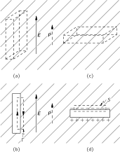
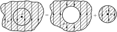
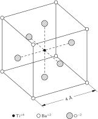
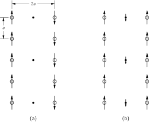

SOURCE: Feynman Lectures on Physics, Volume II, Chapter 11
LANGUAGE: ru
TITLE: Глава 11. Внутреннее устройство диэлектриков
SOURCE_URL: https://www.feynmanlectures.caltech.edu/II_11.html
NOTEBOOKLM_USE: clean lecture text with TeX math and figure captions; reader navigation removed.

# Глава 11. Внутреннее устройство диэлектриков

## 11–1 Молекулярные диполи

В этой главе мы поговорим о том, почему вещество бывает диэлектриком. В предыдущей главе мы указывали, что свойства электрических систем с диэлектриками можно было бы понять, предположив, что электрическое поле, действуя на диэлектрик, индуцирует в атомах дипольный момент. Именно, если электрическое поле \(E\) индуцирует средний дипольный момент в единице объема \(P\) , то диэлектрическая проницаемость \(\kappa\) дается выражением
\[
\begin{equation}
\label{Eq:II:11:1}
\kappa-1=\frac{P}{\epsO E}.
\end{equation}
\]

Мы уже говорили о применениях этого выражения; сейчас же нам нужно обсудить механизм возникновения поляризации внутри материала под действием электрического поля. Начнем с самого простого примера — поляризации газов. Но даже в газах возникают сложности: существуют два типа газов. Молекулы некоторых газов, например кислорода, в каждой молекуле которого имеются два симметричных атома, лишены собственного дипольного момента. Зато молекулы других газов, вроде водяного пара (у которого атомы водорода и кислорода образуют несимметричную молекулу), обладают постоянным электрическим дипольным моментом. Как мы отмечали в гл. 6, в молекуле водяного пара атомы водорода в среднем имеют положительный заряд, а атом кислорода — отрицательный. Поскольку центры тяжести положительного и отрицательного зарядов не совпадают, то распределение всего заряда в молекуле обладает дипольным моментом. Такая молекула называется полярной молекулой. А у кислорода вследствие симметрии молекулы центр тяжести и положительных, и отрицательных зарядов один и тот же, так что это неполярная молекула. Она, правда, может стать диполем, если ее поместить в электрическое поле. Формы этих двух типов молекул нарисованы на фиг. 11–1.

### Figure Ch11-F1
Caption: Фиг. 11.1. (а) Молекула кислорода с нулевым дипольным моментом. (б) Молекула воды обладает постоянным дипольным моментом \(\Figp_0\) .
Image: figures/Ch11-F1.svg

## 11–2 Электронная поляризация

Займемся сначала поляризацией неполярных молекул. Начнем с простейшего случая одноатомного газа (например, гелия). Когда атом такого газа находится в электрическом поле, электроны его тянутся в одну сторону, а ядро — в другую, как показано на фиг. 10.4. Хотя атомы имеют очень большую жесткость по отношению к электрическим силам, которые мы можем приложить к ним на опыте, центры зарядов чуть-чуть смещаются относительно друг друга и индуцируется дипольный момент. В слабых полях величина смещения, а следовательно, и дипольного момента пропорциональна напряженности электрического поля. Смещение электронного распределения, которое приводит к этому типу индуцированного дипольного момента, называется электронной поляризацией.

Мы уже обсуждали воздействие электрического поля на атом в гл. 31 (вып. 3), когда занимались теорией показателя преломления. Подумав немного, вы сообразите, что теперь нужно сделать то же, что и тогда. Только теперь нас заботят поля, не меняющиеся со временем, тогда как показатель преломления был связан с полями, зависящими от времени.

В гл. 31 (вып. 3) мы предполагали, что центр электронного заряда атома, помещенного в осциллирующее электрическое поле, подчиняется уравнению
\[
\begin{equation}
\label{Eq:II:11:2}
m\,\frac{d^2x}{dt^2}+m\omega_0^2x=q_eE.
\end{equation}
\]
Первый член — это произведение массы электрона на его ускорение, а второй — возвращающая сила; справа стоит сила, действующая со стороны внешнего электрического поля. Если электрическое поле меняется с частотой \(\omega\) , то уравнение (11.2) допускает решение
\[
\begin{equation}
\label{Eq:II:11:3}
x=\frac{q_eE}{m(\omega_0^2-\omega^2)},
\end{equation}
\]
имеющее резонанс при \(\omega=\omega_0\) . Когда раньше мы нашли это решение, то интерпретировали \(\omega_0\) как частоту, при которой атом поглощает свет (она лежит либо в оптической, либо в ультрафиолетовой области, в зависимости от атома). Для нашей цели, однако, достаточно случая постоянных полей, т. е. \(\omega=0\) ; поэтому мы можем пренебречь членом с ускорением в (11.2) и получаем смещение
\[
\begin{equation}
\label{Eq:II:11:4}
x=\frac{q_eE}{m\omega_0^2}.
\end{equation}
\]

Отсюда мы находим, что дипольный момент \(p\) одного атома равен
\[
\begin{equation}
\label{Eq:II:11:5}
p=q_ex=\frac{q_e^2E}{m\omega_0^2}.
\end{equation}
\]
В таком подходе дипольный момент \(p\) действительно пропорционален электрическому полю.

Обычно пишут
\[
\begin{equation}
\label{Eq:II:11:6}
\FLPp=\alpha\epsO\FLPE.
\end{equation}
\]
(Снова \(\epsO\) вошло по историческим причинам.) Постоянная \(\alpha\) называется поляризуемостью атома и имеет размерность \(L^3\) . Это мера того, насколько легко индуцировать электрическим полем дипольный момент у атома. Сравнивая (11.5) и (11.6), получаем, что в нашей простой теории
\[
\begin{equation}
\label{Eq:II:11:7}
\alpha=\frac{q_e^2}{\epsO m\omega_0^2}=\frac{4\pi e^2}{m\omega_0^2}.
\end{equation}
\]

Если в единице объема содержится \(N\) атомов, то поляризация \(P\) — дипольный момент единицы объема — дается формулой
\[
\begin{equation}
\label{Eq:II:11:8}
\FLPP=N\FLPp=N\alpha\epsO\FLPE.
\end{equation}
\]

Объединяя (11.1) и (11.8), получаем
\[
\begin{equation}
\label{Eq:II:11:9}
\kappa-1=\frac{P}{\epsO E}=N\alpha
\end{equation}
\]
или, в силу (11.7),
\[
\begin{equation}
\label{Eq:II:11:10}
\kappa-1=\frac{4\pi Ne^2}{m\omega_0^2}.
\end{equation}
\]

С помощью уравнения (11.10) можно предсказать, что диэлектрическая проницаемость \(\kappa\) различных газов должна зависеть от плотности газа и от резонансной частоты \(\omega_0\) .

Наша формула, конечно, лишь очень грубое приближение, потому что в уравнении (11.2) мы воспользовались моделью, игнорирующей тонкости квантовой механики. Например, мы считали, что атом имеет только одну резонансную частоту, тогда как на самом деле их много. Чтобы по-настоящему вычислить поляризуемость \(\alpha\) атомов, нужно воспользоваться последовательной квантовомеханической теорией, однако и классический подход, изложенный выше, дает вполне разумную оценку.

Посмотрим, сможем ли мы получить правильный порядок величины диэлектрической проницаемости какого-нибудь вещества. Возьмем, к примеру, водород. Мы уже оценивали (вып. 4, гл. 38) энергию, необходимую для ионизации атома водорода, и получили приближенно
\[
\begin{equation}
\label{Eq:II:11:11}
E\approx\frac{1}{2}\,\frac{me^4}{\hbar^2}.
\end{equation}
\]
Для оценки собственной частоты \(\omega_0\) можно положить эту энергию равной \(\hbar\omega_0\) — энергии атомного осциллятора с собственной частотой \(\omega_0\) . Получаем
\[
\begin{equation*}
\omega_0\approx\frac{1}{2}\,\frac{me^4}{\hbar^3}.
\end{equation*}
\]
Пользуясь этой величиной \(\omega_0\) в уравнении (11.7), находим электронную поляризуемость
\[
\begin{equation}
\label{Eq:II:11:12}
\alpha\approx16\pi\biggl[\frac{\hbar^2}{me^2}\biggr]^3.
\end{equation}
\]
Величина \((\hbar^2/me^2)\) есть радиус основной орбиты атома Бора (см. вып. 4, гл. 38), равный \(0.529\) А. При нормальных давлении и температуре ( \(1\) атм, \(0^\circ\) °С) в газе на 1 см \(2.69\times10^{19}\) приходится \(^3\) атомов, и уравнение (11.9) дает
\[
\begin{align}
\kappa&=1+(2.69\times10^{19})16\pi(0.529\times10^{-8})^3\notag\\[1ex]
\label{Eq:II:11:13}
&=1.00020.
\end{align}
\]

Измеренная на опыте диэлектрическая проницаемость водорода равна
\[
\begin{equation*}
\kappa_{\text{exp}}=1.00026.
\end{equation*}
\]
. Видите, наша теория почти правильна. Лучшего нельзя было и ожидать, потому что измерения проводились, конечно, с обычным водородом, обладающим двухатомными молекулами, а не одиночными атомами. Не следует удивляться тому, что поляризация атомов в молекуле не совсем такая, как поляризация отдельных атомов. На самом деле молекулярный эффект не столь велик. Точное квантовомеханическое вычисление величины \(\alpha\) для атомов водорода дает результат, превышающий (11.12) примерно на \(12\%\) (вместо \(16\pi\) получается \(18\pi\) ), поэтому он предсказывает для диэлектрической проницаемости значение, более близкое к наблюденному. Во всяком случае, совершенно очевидно, что наша модель диэлектрика вполне хороша.

Еще одна проверка нашей теории: попробуем применить уравнение \(24.6\) к атомам с большей частотой возбуждения. Например, чтобы отобрать электрон у гелия, требуется \(13.6\) эВ, тогда как для ионизации водорода необходимы \(\omega_0\) эВ. Поэтому мы предположим, что частота поглощения \(\alpha\) для гелия должна быть примерно в два раза больше, чем для водорода, а
\[
\begin{equation*}
\kappa_{\text{helium}}\approx1.000050.
\end{equation*}
\]
должна быть меньше в четыре раза. Мы ожидаем, что
\[
\begin{equation*}
\kappa_{\text{helium}}=1.000068,
\end{equation*}
\]
, а экспериментально получено 1,000068, так что наши грубые оценки показывают, что мы на верном пути. Итак, мы поняли диэлектрическую проницаемость неполярного газа, но только качественно, потому что пока мы еще не использовали правильную атомную теорию движения атомных электронов.

## 11–3 Полярные молекулы; ориентационная поляризация

### Figure Ch11-F2
Caption: Фиг. 11.2. В газе полярных молекул отдельные моменты ориентированы случайным образом, средний момент в небольшом объеме равен нулю (а); под действием электрического поля в среднем возникает некоторое выстраивание молекул (б).
Image: figures/Ch11-F2.svg

Теперь рассмотрим молекулу, обладающую постоянным дипольным моментом \(p_0\) — например, молекулу воды. В отсутствие электрического поля отдельные диполи смотрят в разных направлениях, так что суммарный момент в единице объема равен нулю. Но если приложить электрическое поле, то сразу же происходят две вещи: во-первых, индуцируется добавочный дипольный момент из-за сил, действующих на электроны; эта часть приводит к той же самой электронной поляризуемости, которую мы нашли для неполярной молекулы. При очень точном исследовании этот эффект, конечно, нужно учитывать, но мы пока пренебрежем им. (Его всегда можно добавить в конце.) Во-вторых, электрическое поле стремится выстроить отдельные диполи, создавая результирующий момент в единице объема. Если бы в газе выстроились все диполи, поляризация была бы очень большой, но этого не происходит. При обычных температурах и напряженностях поля столкновения молекул при их тепловом движении не позволяют им как следует выстроиться. Но некоторое выстраивание все же происходит, а отсюда и небольшая поляризация (фиг. 11.2). Возникающая поляризация может быть подсчитана методами статистической механики, описанными в гл. 40 (вып. 4).

### Figure Ch11-F3
Caption: Фиг. 11.3. Энергия диполя \(\Figp_0\) в поле \(\FigE\) равна \(-\Figp_0\cdot\FigE\) .
Image: figures/Ch11-F3.svg

Чтобы использовать этот метод, нужно знать энергию диполя в электрическом поле. Рассмотрим диполь с моментом \(\FLPp_0\) в электрическом поле, как показано на фиг. 11.3. Энергия положительного заряда равна \(q\phi(1)\) , а энергия отрицательного заряда есть \(-q\phi(2)\) . Отсюда получаем энергию диполя
\[
\begin{equation}
U=q\phi(1)-q\phi(2)=q\FLPd\cdot\FLPgrad{\phi},\notag
\end{equation}
\]
или
\[
\begin{equation}
\label{Eq:II:11:14}
U=-\FLPp_0\cdot\FLPE=-p_0E\cos\theta,
\end{equation}
\]
где \(\theta\) — угол между \(\FLPp_0\) и \(\FLPE\) . Как и следовало ожидать, энергия становится меньше, когда диполи выстраиваются вдоль поля.

Теперь с помощью методов статистической механики мы выясним, насколько сильно диполи выстраиваются. В гл. 40 (вып. 4) мы нашли, что в состоянии теплового равновесия относительное число молекул с потенциальной энергией \(U\) пропорционально
\[
\begin{equation}
\label{Eq:II:11:15}
e^{-U/kT},
\end{equation}
\]
где \(U(x,y,z)\) — потенциальная энергия как функция положения. Оперируя теми же аргументами, можно сказать, что если потенциальная энергия как функция угла имеет вид (11.14), то число молекул под углом \(\theta\) , приходящееся на единичный телесный угол, пропорционально \(e^{-U/kT}\) .

Обозначая через \(n(\theta)\) число молекул в единичном телесном угле, ориентированных под углом \(\theta\) , мы имеем
\[
\begin{equation}
\label{Eq:II:11:16}
n(\theta)=n_0e^{+p_0E\cos\theta/kT}.
\end{equation}
\]
Для обычных температур и полей показатель экспоненты мал, и, разлагая экспоненту, можно воспользоваться приближенным выражением
\[
\begin{equation}
\label{Eq:II:11:17}
n(\theta)=n_0\biggl(1+\frac{p_0E\cos\theta}{kT}\biggr).
\end{equation}
\]

Найдем \(n_0\) , проинтегрировав (11.17) по всем углам; результат должен быть равен \(N\) , т. е. числу молекул в единице объема. Среднее значение \(\cos\theta\) при интегрировании по всем углам есть нуль, так что интеграл равен просто \(n_0\) , умноженному на полный телесный угол \(4\pi\) . Получаем
\[
\begin{equation}
\label{Eq:II:11:18}
n_0=\frac{N}{4\pi}.
\end{equation}
\]

Из (11.17) видно, что вдоль поля ( \(\cos\theta=1\) ) будет ориентировано больше молекул, чем против поля ( \(\cos\theta=-1\) ). Поэтому в любом малом объеме, содержащем много молекул, возникнет суммарный дипольный момент на единицу объема, т. е. поляризация \(P\) . Чтобы вычислить \(P\) , нужно знать векторную сумму всех молекулярных моментов в единице объема. Мы знаем, что результат будет направлен вдоль \(\FLPE\) , поэтому нужно только просуммировать компоненты в этом направлении (компоненты, перпендикулярные \(\FLPE\) , при суммировании дадут нуль):
\[
\begin{equation*}
P=\underset{\substack{\text{unit}\\\text{volume}}}{\sum}
p_0\cos\theta_i.
\end{equation*}
\]

Мы можем оценить сумму, проинтегрировав по угловому распределению. Телесный угол, отвечающий \(\theta\) , есть \(2\pi\sin\theta\,d\theta\) ; отсюда
\[
\begin{equation}
\label{Eq:II:11:19}
P=\int_0^\pi n(\theta)p_0\cos\theta\,2\pi\sin\theta\,d\theta.
\end{equation}
\]
Подставляя вместо \(n(\theta)\) его выражение из (11.17), имеем
\[
\begin{equation*}
P=-\frac{N}{2}\int_1^{-1}
\biggl(1+\frac{p_0E}{kT}\cos\theta\biggr)
p_0\cos\theta\,d(\cos\theta),
\end{equation*}
\]
что легко интегрируется и приводит к следующему результату:
\[
\begin{equation}
\label{Eq:II:11:20}
P=\frac{Np_0^2E}{3kT}.
\end{equation}
\]
Поляризация пропорциональна полю \(E\) , поэтому диэлектрические свойства будут обычные. Кроме того, как мы и ожидаем, поляризация обратно пропорциональна температуре, потому что при более высоких температурах столкновения больше разрушают выстроенность. Эта зависимость вида \(1/T\) называется законом Кюри. Квадрат постоянного момента \(p_0\) появляется по следующей причине: в данном электрическом поле выстраивающая сила зависит от \(p_0\) , а средний момент, возникающий при выстраивании, снова пропорционален \(p_0\) . Средний индуцируемый момент пропорционален \(p_0^2\) .

Теперь мы посмотрим, насколько хорошо уравнение \(p_0\) согласуется с экспериментом. Возьмем водяной пар. Поскольку мы не знаем, чему равно \(P\) , то не можем прямо вычислить \(\kappa-1\) , но уравнение (11.20) предсказывает, что κ—1 должна меняться обратно пропорционально температуре, и это нам следует проверить.

Из (11.20) получаем
\[
\begin{equation}
\label{Eq:II:11:21}
\kappa-1=\frac{P}{\epsO E}=\frac{Np_0^2}{3\epsO kT},
\end{equation}
\]
, так что \(\kappa-1\) должна меняться прямо пропорционально плотности \(N\) и обратно пропорционально абсолютной температуре. Диэлектрическая проницаемость была измерена при нескольких значениях давления и температуры, выбранных таким образом, чтобы число молекул в единице объема оставалось постоянным. [Заметим, что если бы все измерения выполнялись при постоянном давлении, число молекул в единице объема уменьшалось бы линейно с повышением температуры, а \(\kappa-1\) изменялась бы как \(T^{-2}\) , а не как \(T^{-1}\) .] На фиг. 11.4 мы отложили измеренные значения \(\kappa-1\) как функцию \(1/T\) . Зависимость, предсказываемая формулой (11.21), выполняется хорошо.

### Figure Ch11-F4
Caption: Фиг. 11.4. Измеренные значения диэлектрической проницаемости водяного пара при нескольких температурах.
Image: figures/Ch11-F4.svg

Есть еще одна особенность диэлектрической проницаемости полярных молекул — ее изменение в зависимости от частоты внешнего поля. Благодаря тому что молекулы имеют момент инерции, тяжелым молекулам требуется определенное время, чтобы повернуться в направлении поля. Поэтому, если использовать частоты из верхней микроволновой зоны или из еще более высокой, полярный вклад в диэлектрическую проницаемость начинает спадать, так как молекулы не успевают следовать за полем. В противоположность этому электронная поляризуемость все еще остается неизменной вплоть до оптических частот, поскольку инерция электронов меньше.

## 11–4 Электрические поля в пустотах диэлектрика

Теперь мы переходим к интересному, но сложному вопросу — проблеме диэлектрической проницаемости в плотных веществах. Возьмем, например, жидкий гелий, или жидкий аргон, или еще какое-нибудь неполярное вещество. Мы по-прежнему ожидаем, что у них есть электронная поляризуемость. Но в плотных средах значение \(\FLPP\) может быть велико, поэтому в поле, действующее на отдельный атом, вклад будет давать поляризация атомов, находящихся по соседству. Возникает вопрос, чему равно электрическое поле, действующее на отдельный атом?

Вообразите, что между пластинами конденсатора находится жидкость. Если пластины заряжены, они создадут в жидкости электрическое поле. Но каждый атом имеет заряды, и полное поле \(\FLPE\) есть сумма обоих этих вкладов. Это истинное электрическое поле в жидкости меняется очень-очень быстро от точки к точке. Оно чрезвычайно велико внутри атомов, особенно вблизи ядра, и сравнительно мало между атомами. Разность потенциалов между пластинами есть интеграл от этого полного поля. Если мы пренебрежем всеми быстрыми изменениями, то можем представить себе некое среднее электрическое поле \(E\) , равное как раз \(V/d\) . (Именно это поле мы использовали в предыдущей главе.) Это поле мы должны себе представлять как среднее по пространству, содержащему много атомов.

Вы можете подумать, что «средний» атом в «среднем» положении почувствует именно это среднее поле. Но все не так просто, и в этом можно убедиться, представив, что в диэлектрике имеются отверстия разной формы. Предположим, что мы вырезали в поляризованном диэлектрике щель, ориентированную параллельно полю (фиг. 11.5,а). Поскольку мы знаем, что \(\FLPcurl{\FLPE}=\FLPzero\) , то линейный интеграл от \(\FLPE\) вдоль кривой \(\Gamma\) , направленной так, как показано на фиг. 11.5,б, должен быть равен нулю. Поле внутри щели должно давать такой вклад, который в точности погасит вклад от поля вне щели. Поэтому поле \(E_0\) в центре длинной тонкой щели равно \(E\) , т. е. среднему электрическому полю, найденному в диэлектрике.

### Figure Ch11-F5
Caption: Фиг. 11.5. Поле в щели, вырезанной в диэлектрике, зависит от формы и ориентации щели.
Image: figures/Ch11-F5.svg

Рассмотрим теперь другую щель, повернутую своей широкой стороной перпендикулярно \(E\) , как показано на части (в) фиг. 11–5. В этом случае поле \(E_0\) в щели не совпадает с \(E\) , потому что на стенках щели возникают поляризационные заряды. Применив закон Гаусса к поверхности \(S\) , изображенной на части (г) фиг., мы находим, что поле \(E_0\) внутри щели дается выражением
\[
\begin{equation}
\label{Eq:II:11:22}
E_0=E+\frac{P}{\epsO},
\end{equation}
\]
где \(E\) , как и раньше, — электрическое поле в диэлектрике. (Гауссова поверхность охватывает поверхностный поляризационный заряд \(\sigma_{\text{pol}}=P\) .) Мы отмечали в гл. 10, что \(\epsO E+P\) часто обозначают через \(D\) , поэтому \(\epsO E_0=D_0\) равно величине \(D\) в диэлектрике.

В ранний период истории физики, когда считалось очень важным определять каждую величину прямым экспериментом, физики были очень довольны, обнаружив, что они могут определить то, что понимают под \(E\) и \(D\) в диэлектрике, не ползая в промежутках между атомами. Среднее поле \(\FLPE\) численно равно полю \(\FLPE_0\) , измеренному в щели, параллельной полю. А поле \(\FLPD\) могло быть измерено с помощью \(E_0\) , найденной в щели, перпендикулярной полю. Но никто эти поля никогда не измерял (таким способом во всяком случае), так что это одна из многих бесплодных проблем.

### Figure Ch11-F6
Caption: Рис. 11.6. Поле в любой точке \(A\) диэлектрика можно представить в виде суммы поля сферической дырки и поля сферического вкладыша.
Image: figures/Ch11-F6.svg

В большинстве жидкостей, не слишком сложных по своему строению, каждый атом в среднем так окружен другими атомами, что можно с хорошей точностью считать его находящимся в сферической полости. И тогда мы спросим: «Чему равно поле в сферической полости?» Мы замечаем, что вырезание сферической дырки в однородном поляризованном диэлектрике равносильно отбрасыванию шарика из поляризованного материала, так что мы можем ответить на этот вопрос. (Мы должны представить себе, что поляризация была «заморожена» до того, как мы вырезали дырку.) Однако в силу принципа суперпозиции поле внутри диэлектрика, до того как оттуда был вынут шарик, есть сумма полей от всех зарядов вне объема шарика и полей от зарядов внутри поляризованного шарика. Следовательно, если поле внутри однородного диэлектрика мы назовем \(E\) , то можно записать
\[
\begin{equation}
\label{Eq:II:11:23}
E=E_{\text{hole}}+E_{\text{plug}},
\end{equation}
\]
где \(E_{\text{hole}}\) — поле в дырке, а \(E_{\text{plug}}\) — поле в однородно поляризованном шарике (фиг. 11.6). Поле однородно поляризованного шарика показано на фиг. 11.7. Электрическое поле внутри шарика однородно и равно
\[
\begin{equation}
\label{Eq:II:11:24}
E_{\text{plug}}=-\frac{P}{3\epsO}.
\end{equation}
\]
С помощью
\[
\begin{equation}
\label{Eq:II:11:25}
E_{\text{hole}}=E+\frac{P}{3\epsO}.
\end{equation}
\]
получаем \(P/3\epsO\) . (Сферическая дырка дает поле, находящееся на \(1/3\) пути от поля параллельной щели к полю перпендикулярной щели.)

### Figure Ch11-F7
Caption: Фиг. 11.7. Электрическое поле однородно поляризованного шарика.
Image: figures/Ch11-F7.svg

## 11–5 Диэлектрическая проницаемость жидкостей; формула Клаузиуса — Моссотти

В жидкости мы ожидаем, что поле, поляризующее отдельный атом, скорее похоже на \(E_{\text{hole}}\) , чем просто на \(E\) . Если взять \(E_{\text{hole}}\) из (11.25) в качестве поляризующего поля, входящего в (11.6), то уравнение (11.8) приобретет вид
\[
\begin{equation}
\label{Eq:II:11:26}
P=N\alpha\epsO\biggl(E+\frac{P}{3\epsO}\biggr),
\end{equation}
\]
или
\[
\begin{equation}
\label{Eq:II:11:27}
P=\frac{N\alpha}{1-(N\alpha/3)}\,\epsO E.
\end{equation}
\]
Вспоминая, что \(\kappa-1\) как раз равна \(P/\epsO E\) , получаем
\[
\begin{equation}
\label{Eq:II:11:28}
\kappa-1=\frac{N\alpha}{1-(N\alpha/3)},
\end{equation}
\]
что определяет диэлектрическую проницаемость жидкости через \(\alpha\) , атомную поляризуемость. Это формула Клаузиуса — Моссотти.

Если \(N\alpha\) очень мало, как, например, для газа (потому что там мала плотность \(N\) ), то членом \(N\alpha/3\) можно пренебречь по сравнению с \(1\) , и мы получаем наш старый результат — уравнение (11.9), т. е.
\[
\begin{equation}
\label{Eq:II:11:29}
\kappa-1=N\alpha.
\end{equation}
\]

Сравним уравнение (11.28) с некоторыми экспериментальными результатами. Сначала необходимо рассмотреть газы, для которых, используя измерение \(\kappa\) , мы можем найти \(\alpha\) из уравнения (11.29). Например, для дисульфида углерода при нуле градусов по Цельсию диэлектрическая проницаемость равна \(1.0029\) , так что \(N\alpha\) составляет \(0.0029\) . Плотность газа легко вычислить, а плотность жидкости можно найти в справочниках. При \(20^\circ\) °С плотность жидкого CS \(_2\) в \(381\) раз выше плотности газа при \(0^\circ\) °С. Это означает, что \(N\) в \(381\) раз больше в жидкости, чем в газе, а отсюда (если сделать допущение, что исходная атомная поляризуемость дисульфида углерода не меняется при его конденсации в жидкое состояние) \(N\alpha\) в жидкости равно \(381\) умножить на \(0.0029\) , или \(1.11\) . Заметьте, что член \(N\alpha/3\) составляет почти \(0.4\) , так что он весьма существенен. С помощью этих чисел мы предсказываем, что величина диэлектрической проницаемости равна \(2.76\) , что достаточно хорошо согласуется с наблюденным значением \(2.64\) .

В табл. 11.1 мы приводим ряд экспериментальных данных по разным веществам, а также значения диэлектрической проницаемости, вычисленной, как только что было описано, по формуле (11.28). Согласие между опытом и теорией для аргона и кислорода даже лучше, чем для CS \(_2\) , и не столь хорошее для четыреххлористого углерода. В целом результаты показывают, что уравнение (11.28) работает с хорошей точностью.

### Table Ch11-T1

Caption: Таблица 11–1 Вычисление диэлектрических проницаемостей жидкостей по диэлектрической проницаемости газа.

- Gas | Liquid
- Substance | κ(exp) | Nα | Density | Density | Ratio1 | Nα | κ(predict) | κ(exp)
- CS2 | \(1.0029\phantom{00}\) | \(0.0029\phantom{00}\) | \(0.00339\) | \(1.293\) | \(381\) | \(1.11\phantom{0}\) | \(2.76\phantom{0}\) | \(2.64\phantom{0}\)
- O2 | \(1.000523\) | \(0.000523\) | \(0.00143\) | \(1.19\phantom{0}\) | \(832\) | \(0.435\) | \(1.509\) | \(1.507\)
- CCl4 | \(1.0030\phantom{00}\) | \(0.0030\phantom{00}\) | \(0.00489\) | \(1.59\phantom{0}\) | \(325\) | \(0.977\) | \(2.45\phantom{0}\) | \(2.24\phantom{0}\)
- Ar | \(1.000545\) | \(0.000545\) | \(0.00178\) | \(1.44\phantom{0}\) | \(810\) | \(0.441\) | \(1.517\) | \(1.54\phantom{0}\)
- 1Ratio = density of liquid/density of gas.

Наш вывод уравнения (11.28) справедлив только для электронной поляризации в жидкостях. Для полярных молекул вроде Н \(_2\) О он неверен. Если провести такие же вычисления для воды, то для \(13.2\) получим значение \(N\alpha\) , что означает, что диэлектрическая проницаемость этой жидкости отрицательна, тогда как опытное значение \(\kappa\) равно \(80\) . Дело здесь связано с неправильной трактовкой постоянных диполей, и Онзагер указал правильный способ решения. Мы не можем сейчас останавливаться на этом вопросе, но если он вас интересует, то подробно это обсуждается в книге Киттеля «Введение в физику твердого тела».

## 11–6 Твердые диэлектрики

Теперь перейдем к твердым телам. Первый интересный факт о твердых телах состоит в том, что в них может быть «встроена» постоянная поляризация, которая существует даже в отсутствие внешнего электрического поля. Примером может служить воск, содержащий длинные молекулы, обладающие постоянным дипольным моментом. Если растопить немного воску и, пока он еще не затвердел, наложить на него сильное электрическое поле, чтобы дипольные моменты частично выстроились, то они останутся в таком положении и после того, как воск затвердеет. Твердое вещество будет обладать постоянной поляризацией, которая остается и в отсутствие поля. Такое вещество называется электретом.

У электрета на поверхности имеются постоянные поляризационные заряды. Это электрический аналог магнита. Однако пользы от него гораздо меньше, потому что свободные заряды воздуха притягиваются к его поверхности и в конце концов нейтрализуют поляризационные заряды. Электрет «разряжается» и заметного внешнего поля не создает.

Постоянная внутренняя поляризация \(P\) встречается также и в некоторых кристаллических веществах. В таких кристаллах каждая элементарная ячейка решетки обладает одинаковым постоянным дипольным моментом, как показано на фиг. 11.8. Все диполи направлены в одну сторону даже в отсутствие электрического поля. Многие сложные кристаллы обладают такой поляризацией; обычно мы этого не замечаем, потому что создаваемое ими внешнее поле, как и у электретов, разряжается.

### Figure Ch11-F8
Caption: Фиг. 11.8. Сложная кристаллическая решетка может иметь постоянную внутреннюю поляризацию \(\FigP\) .
Image: figures/Ch11-F8.svg

Если эти внутренние дипольные моменты кристалла изменяются, возникают внешние поля, поскольку посторонние заряды не успевают накопиться и компенсировать поляризационные заряды. Если диэлектрик находится в конденсаторе, то на обкладках индуцируются свободные заряды. Например, моменты могут изменяться при нагревании диэлектрика из-за теплового расширения. Это явление называется пироэлектричеством. Подобным образом, если мы изменяем напряжения в кристалле — например, при его изгибе, — момент снова может немного измениться, и можно обнаружить небольшой электрический эффект, называемый пьезоэлектричеством.

Для кристаллов, не обладающих постоянным моментом, можно построить теорию диэлектрической проницаемости, включающую электронную поляризуемость атомов. Это делается почти так же, как и для жидкостей. Некоторые кристаллы также содержат вращающиеся диполи, и вращение этих диполей будет также вносить вклад в \(\kappa\) . В ионных кристаллах, таких как NaCl, существует также ионная поляризуемость. Кристалл состоит из чередующихся положительных и отрицательных ионов, и в электрическом поле положительные ионы смещаются в одну сторону, а отрицательные — в другую; возникает результирующее относительное смещение положительных и отрицательных зарядов, а следовательно, и объемная поляризация. Мы могли бы оценить величину ионной поляризуемости, зная жесткость кристаллов соли, но мы не будем сейчас останавливаться на этом вопросе.

## 11–7 Сегнетоэлектричество; ВаТіО \(_{\boldsymbol{3}}\)

Мы хотим теперь описать особый класс кристаллов, которые почти случайно обладают «встроенным» постоянным моментом. Ситуация здесь настолько погранична, что при небольшом повышении температуры они полностью теряют этот момент. С другой стороны, если это почти кубические кристаллы, так что их моменты могут поворачиваться в разных направлениях, мы можем обнаружить значительное изменение момента при изменении приложенного электрического поля. Все моменты поворачиваются, и мы получаем большой эффект. Вещества, обладающие таким постоянным моментом, называются сегнетоэлектриками, по аналогии с соответствующими ферромагнитными эффектами, которые впервые были обнаружены в железе.

Мы хотели бы объяснить, как работает сегнетоэлектричество, описав конкретный пример сегнетоэлектрического материала. Существует несколько способов возникновения сегнетоэлектрических свойств, но мы рассмотрим лишь один загадочный случай — титанат бария, BaTiO \(_3\) . Этот материал имеет кристаллическую решетку, элементарная ячейка которой изображена на фиг. 11.9. Оказывается, что выше определенной температуры, а именно \(118^\circ\) C, титанат бария является обычным диэлектриком с огромной диэлектрической проницаемостью. Однако ниже этой температуры он неожиданно приобретает постоянный момент.

### Figure Ch11-F9
Caption: Фиг. 11.9. Элементарная ячейка BaTiO \(_3\) . Атомы в действительности заполняют большую часть пространства; для ясности показаны только положения их центров.
Image: figures/Ch11-F9.svg

При расчете поляризации твердого тела мы должны прежде всего найти локальные поля в каждой элементарной ячейке. Мы должны включить поля от самой поляризации, точно так же, как мы делали это для случая жидкости. Но кристалл — это не однородная жидкость, поэтому мы не можем использовать для локального поля то выражение, которое получили бы для сферической полости. Если провести расчет для кристалла, то окажется, что множитель \(1/3\) в уравнении (11.24) становится немного другим, но не сильно отличающимся от \(1/3\) . (Для простой кубической решетки он в точности равен \(1/3\) .) Поэтому для предварительного обсуждения мы будем считать, что этот множитель равен \(1/3\) для BaTiO \(_3\) .

Теперь, когда мы записали уравнение ( 11.28 ), вы могли задаться вопросом, что произойдет, если \(N\alpha\) станет больше, чем \(3\) . Кажется, что \(\kappa\) должно стать отрицательным. Но это, конечно, не может быть верным. Давайте посмотрим, что должно произойти, если мы будем постепенно увеличивать \(\alpha\) в некотором кристалле. По мере роста \(\alpha\) поляризация увеличивается, создавая большее локальное поле. Но увеличившееся локальное поле поляризует атом еще сильнее, еще больше повышая локальные поля. Если атомы достаточно «податливы», процесс продолжается; возникает своего рода обратная связь, приводящая к безудержному росту поляризации — при условии, что поляризация каждого атома увеличивается пропорционально полю. Условие «разгона» возникает при \(N\alpha=3\) . Поляризация, конечно, не обращается в бесконечность, потому что при сильных полях пропорциональность между индуцированным моментом и электрическим полем нарушается, так что наши формулы становятся неверными. А происходит то, что в решетку «встраивается» большая, самопроизвольно возникающая внутренняя поляризация.

В случае BaTiO \(_3\) вдобавок к электронной поляризации имеется довольно большая ионная поляризация, обусловленная, как предполагают, ионами титана, которые могут слегка сдвигаться внутри кубической решетки. Решетка сопротивляется большим смещениям, так что ион титана, переместившись на небольшое расстояние, затормаживается и останавливается. Но тогда у кристаллической решетки образуется постоянный дипольный момент.

У большинства кристаллов такая ситуация действительно возникает при всех достижимых температурах. Однако титанат бария представляет особый интерес: он так деликатно устроен, что при малейшем уменьшении \(N\alpha\) момент «высвобождается». Поскольку \(N\) с повышением температуры уменьшается (вследствие теплового расширения), то можно изменять \(N\alpha\) , меняя температуру. Ниже критической температуры момент сразу образуется, и тогда, накладывая внешнее поле, поляризацию легко повернуть и закрепить в нужном направлении.

Попробуем разобраться в происходящем более подробно. Назовем критической температуру \(T_c\) , при которой \(N\alpha\) равно в точности \(3\) . При увеличении температуры значение \(N\) немного уменьшается вследствие расширения решетки. Поскольку расширение мало, мы можем сказать, что вблизи критической температуры
\[
\begin{equation}
\label{Eq:II:11:30}
N\alpha=3-\beta(T-T_c),
\end{equation}
\]
где \(\beta\) — малая константа, того же порядка величины, что и коэффициент теплового расширения, т. е. около \(10^{-5}\) — \(10^{-6}\) град^-1. Подставляя это в выражение (11.28), получаем
\[
\begin{equation*}
\kappa-1=\frac{3-\beta(T-T_c)}{\beta(T-T_c)/3}.
\end{equation*}
\]
Поскольку мы считаем величину \(\beta(T-T_c)\) малой по сравнению с единицей, можно записать приближенно
\[
\begin{equation}
\label{Eq:II:11:31}
\kappa-1=\frac{9}{\beta(T-T_c)}.
\end{equation}
\]

Это, конечно, справедливо только для \(T>T_c\) . Мы видим, что если температура чуть выше критической, то величина \(\kappa\) огромна. Из-за того, что \(N\alpha\) так близко к \(3\) , возникает громадный эффект усиления и диэлектрическая проницаемость легко достигает величины от \(50{,}000\) до \(100{,}000\) . Она тоже весьма чувствительна к температуре. При увеличении температуры диэлектрическая проницаемость уменьшается обратно пропорционально температуре, но в отличие от дипольного газа, где разность \(\kappa-1\) обратно пропорциональна абсолютной температуре, у сегнетоэлектриков она меняется обратно пропорционально разности между абсолютной и критической температурами (этот закон называется законом Кюри — Вейсса).

Что происходит, когда мы понижаем температуру до критического значения? Если мы представим себе кристаллическую решетку из элементарных ячеек, как на фиг. 11.9, то увидим, что можно выделить цепочки ионов вдоль вертикальных линий. Одна из них состоит попеременно из ионов кислорода и титана. Имеются другие линии, состоящие либо из ионов бария, либо из ионов кислорода, но расстояния между ионами вдоль таких линий больше. Мы построим простую модель для имитации этой ситуации, вообразив, как показано на фиг. 11.10,а, ряд ионных цепочек. Вдоль цепочки, которую мы назовем главной, расстояние между ионами равно \(a\) , что составляет половину постоянной решетки; поперечное расстояние между одинаковыми цепочками равно \(2a\) . В промежутке имеются менее плотные цепочки, которые мы пока не будем рассматривать. Чтобы немного упростить анализ, мы предположим еще, что все ионы главной цепочки одинаковы. (Упрощение не очень значительное, потому что все важные эффекты еще проявятся. Это просто одна из хитростей теоретической физики. Сначала решают видоизмененную задачу, потому что так в первый раз ее легче понять, а затем, разобравшись, как все происходит, вносят все усложнения.)

### Figure Ch11-F10
Caption: Фиг. 11.10. Модели сегнетоэлектрика: а — антисегнетоэлектрик; б — нормальный сегнетоэлектрик.
Image: figures/Ch11-F10.svg

Попробуем теперь выяснить, что будет происходить в нашей модели. Предположим, что дипольный момент каждого иона равен \(p\) , и пусть мы хотим вычислить поле вблизи одного из ионов в цепочке. Мы должны найти сумму полей от всех остальных ионов. Сначала вычислим поле от диполей только в одной вертикальной цепочке; об остальных цепочках поговорим позже. Поле на расстоянии \(r\) от диполя в направлении вдоль его оси дается формулой
\[
\begin{equation}
\label{Eq:II:11:32}
E=\frac{1}{4\pi\epsO}\,\frac{2p}{r^3}.
\end{equation}
\]
Для точки вблизи любого иона прочие диполи, расположенные на одинаковом расстоянии кверху и книзу от него, дают поля в одном и том же направлении, поэтому для всей цепочки получаем
\[
\begin{align}
E_{\text{chain}}&=\frac{p}{4\pi\epsO}\,\frac{2}{a^3}\cdot
\biggl(2+\frac{2}{8}+\frac{2}{27}+\frac{2}{64}+\dotsb\biggr)\notag\\[1.5ex]
\label{Eq:II:11:33}
&=\;\,\frac{p}{\epsO}\,\frac{0.383}{a^3}.
\end{align}
\]
Не представляет большого труда показать, что если бы наша модель была подобна кубическому кристаллу, т. е. если бы следующая идентичная линия проходила на расстоянии \(a\) , число \(0.383\) превратилось бы в \(1/3\) . Другими словами, если бы соседние линии проходили на расстоянии \(a\) , они вносили бы в нашу сумму всего лишь \(-0.050\) . Однако следующая главная цепочка, которую мы рассматриваем, находится на расстоянии \(2a\) , и, как вы помните из гл. 7, поле, создаваемое периодической структурой, спадает с расстоянием экспоненциально. Поэтому эти линии вносят в сумму гораздо меньше \(-0.050\) , и мы можем просто пренебречь всеми остальными цепочками.

Теперь нужно выяснить, какова должна быть поляризуемость \(\alpha\) , чтобы привести в действие механизм разгона. Предположим, что индуцированный момент \(p\) каждого атома цепочки в соответствии с уравнением (11.6) пропорционален действующему на него полю. Поляризующее поле, действующее на атом, мы получаем из \(E_{\text{chain}}\) с помощью формулы (11.32). Итак, мы имеем два уравнения:
\[
\begin{equation*}
p=\alpha\epsO E_{\text{chain}}
\end{equation*}
\]
и
\[
\begin{equation*}
E_{\text{chain}}=\frac{0.383}{a^3}\,\frac{p}{\epsO}.
\end{equation*}
\]
. Имеются два решения: \(E_{\text{chain}}\) и \(p\) оба равны нулю, или
\[
\begin{equation*}
\alpha=\frac{a^3}{0.383},
\end{equation*}
\]
при условии, что \(E_{\text{chain}}\) и \(p\) оба не равны нулю. Таким образом, если \(\alpha\) достигает величины \(a^3/0.383\) , устанавливается постоянная поляризация, поддерживаемая своим собственным полем. Это критическое равенство должно достигаться для титаната бария как раз при температуре \(T_c\) . (Заметьте, что если бы поляризуемость \(\alpha\) была больше критического значения для слабых полей, то она уменьшилась бы при больших полях и в точке равновесия установилось бы полученное нами равенство.)

Для BaTiO \(_3\) промежуток \(a\) равен \(2\times10^{-8}\) см, поэтому мы должны ожидать значения \(\alpha=21.8\times10^{-24}\) см \(^3\) . Мы можем сравнить эту величину с известными величинами поляризуемости отдельных атомов. Для кислорода \(\alpha=30.2\times10^{-24}\) см \(^3\) ; мы на верном пути! Но для титана \(\alpha=2.4\times10^{-24}\) см \(^3\) ; слишком мало. В нашей модели нам, видимо, следует взять среднее. (Мы могли бы рассчитать снова цепочку для перемежающихся атомов, но результат был бы почти такой же.) Итак, \(\alpha(\text{average})=16.3\times10^{-24}\) см \(^3\) , что недостаточно велико для установления постоянной поляризации.

Но подождите! Мы ведь до сих пор складывали только электронные поляризуемости. А есть еще и ионная поляризация, возникающая из-за смещения иона титана. Однако потребуется ионная поляризуемость величиной \(9.2\times10^{-24}\) см \(^3\) . (Более точное вычисление с учетом перемежающихся атомов показывает, что на самом деле требуется даже \(11.9\times10^{-24}\) см \(^3\) ). Чтобы понять свойства BaTiO \(_3\) , мы должны предположить, что возникает именно такая ионная поляризуемость.

Почему ион титана в титанате бария имеет столь большую ионную поляризуемость, неизвестно. Более того, непонятно, почему при меньших температурах он поляризуется одинаково хорошо и в направлении диагонали куба и в направлении диагонали грани. Если мы вычислим действительные размеры шариков на фиг. 11.9 и попробуем найти, достаточно ли свободно титан держится в коробке, образованной соседними атомами кислорода (а этого хотелось бы, потому что тогда его было бы легко сдвинуть), то получится совсем противоположный ответ. Он сидит очень плотно. Атомы бария держатся немного свободнее, но если считать, что это они движутся, то ничего не получится. Так что, как видите, вопрос совсем не ясен; остаются еще загадки, которые очень хотелось бы разгадать.

Возвращаясь к нашей простой модели на фиг. 11.10 (а), мы видим, что поле от одной цепочки будет стремиться поляризовать соседнюю цепочку в противоположном направлении, что означает, что, хотя каждая цепочка будет «заморожена», постоянный момент на единицу объема будет равен нулю! (Хотя внешние электрические проявления отсутствуют, все еще существуют определенные термодинамические эффекты, которые можно наблюдать.) Такие системы существуют, и они называются антисегнетоэлектриками. Поэтому то, что мы объяснили, на самом деле является антисегнетоэлектриком. Однако титанат бария на самом деле устроен так, как показано на фиг. 11.10 (б). Все цепочки кислород — титан поляризованы в одном и том же направлении, потому что между ними располагаются промежуточные цепочки атомов. Хотя атомы в этих цепочках не обладают большой поляризуемостью или плотностью, они будут несколько поляризованы в направлении, антипараллельном цепочкам кислород — титан. Небольшие поля, создаваемые у следующей цепочки кислород — титан, заставят ее поляризоваться параллельно первой. Таким образом, BaTiO \(_3\) на самом деле является сегнетоэлектриком, и это происходит благодаря атомам, находящимся в промежутке. Вы можете спросить: «А как насчет прямого взаимодействия между двумя цепочками O — Ti?» Помните, однако, что прямое взаимодействие убывает с расстоянием экспоненциально; действие цепочки сильных диполей на расстоянии \(2a\) может быть меньше, чем действие цепочки слабых диполей на расстоянии \(a\) .

На этом мы закончим довольно подробное изложение наших сегодняшних познаний о диэлектрических свойствах газов, жидкостей и твердых тел.
