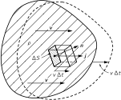
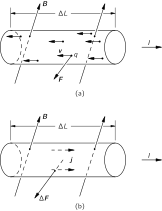
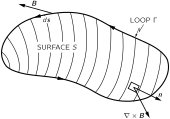
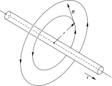
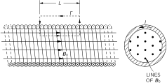
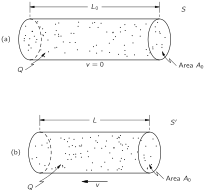

SOURCE: Feynman Lectures on Physics, Volume II, Chapter 13
LANGUAGE: ru
TITLE: Глава 13. Магнитостатика
SOURCE_URL: https://www.feynmanlectures.caltech.edu/II_13.html
NOTEBOOKLM_USE: clean lecture text with TeX math and figure captions; reader navigation removed.

# Глава 13. Магнитостатика

## 13–1 Магнитное поле

Сила, действующая на электрический заряд, зависит не только от того, где он находится, но и от того, с какой скоростью он движется. Каждая точка в пространстве характеризуется двумя векторными величинами, которые определяют силу, действующую на любой заряд. Во-первых, имеется электрическая сила, дающая ту часть силы, которая не зависит от движения заряда. Мы описываем ее с помощью электрического поля \(\FLPE\) . Во-вторых, есть еще добавочная компонента силы, называемая магнитной силой, которая зависит от скорости заряда. Эта магнитная сила имеет удивительное свойство: в любой данной точке пространства как направление, так и величина силы зависят от направления движения частицы; в каждый момент сила всегда перпендикулярна вектору скорости; кроме того, в любом месте сила всегда перпендикулярна определенному направлению в пространстве (фиг. 13.1), и, наконец, величина силы пропорциональна компоненте скорости, перпендикулярной этому выделенному направлению. Все эти свойства можно описать, если ввести вектор магнитного поля \(\FLPB\) , который определяет выделенное направление в пространстве и одновременно служит константой пропорциональности между силой и скоростью, и записать магнитную силу в виде \(q\FLPv\times\FLPB\) . Полная электромагнитная сила, действующая на заряд, может тогда быть записана так:
\[
\begin{equation}
\label{Eq:II:13:1}
\FLPF=q(\FLPE+\FLPv\times\FLPB).
\end{equation}
\]
Она называется силой Лоренца.

### Figure Ch13-F1
Caption: Фиг. 13.1. Зависящая от скорости компонента силы на движущийся заряд направлена перпендикулярно \(\Figv\) и вектору \(\FigB\) . Она пропорциональна также компоненте \(\Figv\) , перпендикулярной \(\FigB\) , т. е. \(v\sin\theta\) .
Image: figures/Ch13-F1.svg

Магнитную силу можно легко продемонстрировать, если поднести магнит вплотную к катодной трубке. Отклонение электронного луча указывает на то, что магнит возбуждает силы, действующие на электроны перпендикулярно направлению их движения (мы уже об этом говорили в вып. 1, гл. 12).

Единицей магнитного поля \(\FLPB\) , очевидно, является 1 ньютон \(\cdot\) -секунда, деленный на кулон-метр. Та же единица может быть написана как вольт \(\cdot\) -секунда на квадратный метр \(^2\) . Ее называют еще вебер на квадратный метр.

## 13–2 Электрический ток; сохранение заряда

Теперь подумаем о том, почему магнитные силы действуют на провода, по которым течет электрический ток. Для этого определим, что понимается под плотностью тока. Электрический ток состоит из движущихся электронов или других зарядов, которые образуют результирующее течение, или поток. Мы можем представить поток зарядов вектором, определяющим количество зарядов, которое проходит в единицу времени через единичную площадку, перпендикулярную потоку (точь-в-точь как мы это делали, определяя поток тепла). Назовем эту величину плотностью тока и обозначим ее вектором \(\FLPj\) . Он направлен вдоль движения зарядов. Если взять маленькую площадку \(\Delta S\) в данном месте материала, то количество зарядов, текущее через площадку в единицу времени, равно
\[
\begin{equation}
\label{Eq:II:13:2}
\FLPj\cdot\FLPn\,\Delta S,
\end{equation}
\]
где \(\FLPn\) — единичный вектор нормали к \(\Delta S\) .

### Figure Ch13-F2
Caption: Фиг. 13.2. Если распределение зарядов с плотностью \(\rho\) движется со скоростью \(\Figv\) , то количество заряда, проходящее в единицу времени через площадку \(\Delta S\) , есть \(\rho\Figv\cdot\Fign\,\Delta S\) .
Image: figures/Ch13-F2.svg

Плотность тока связана со средней скоростью течения зарядов. Предположим, что имеется распределение зарядов, в среднем дрейфующих со скоростью \(\FLPv\) . Когда это распределение проходит через элемент поверхности \(\Delta S\) , то заряд \(\Delta q\) , проходящий через поверхность за время \(\Delta t\) , равен заряду, содержащемуся в параллелепипеде с основанием \(\Delta S\) и высотой \(v\,\Delta t\) (как показано на фиг. 13.2). Объем параллелепипеда есть произведение проекции \(\Delta S\) , перпендикулярной к \(\FLPv\) , на \(v\,\Delta t\) , что при умножении на плотность зарядов \(\rho\) дает \(\Delta q\) . Таким образом,
\[
\begin{equation*}
\Delta q=\rho\FLPv\cdot\FLPn\,\Delta S\,\Delta t.
\end{equation*}
\]
Заряд, проходящий в единицу времени, тогда равен \(\rho\FLPv\cdot\FLPn\,\Delta S\) , откуда получаем
\[
\begin{equation}
\label{Eq:II:13:3}
\FLPj=\rho\FLPv.
\end{equation}
\]

Если распределение зарядов состоит из отдельных зарядов, скажем электронов, каждый из которых имеет заряд \(q\) и движется со средней скоростью \(\FLPv\) , то плотность тока равна
\[
\begin{equation}
\label{Eq:II:13:4}
\FLPj=Nq\FLPv.
\end{equation}
\]
, где \(N\) — число зарядов в единице объема.

### Figure Ch13-F3
Caption: Фиг. 13.3. Ток \(I\) через поверхность \(S\) равен \(\int\Figj\cdot\Fign\,dS\) .
Image: figures/Ch13-F3.svg

Полное количество заряда, проходящее в единицу времени через какую-то поверхность \(S\) , называется электрическим током \(I\) . Он равен интегралу от нормальной составляющей потока по всем элементам поверхности:
\[
\begin{equation}
\label{Eq:II:13:5}
I=\int_S\FLPj\cdot\FLPn\,dS
\end{equation}
\]
(см. фиг. 13.3).

### Figure Ch13-F4
Caption: Фиг. 13.4. Интеграл от \(\Figj\cdot\Fign\) по замкнутой поверхности равен скорости изменения полного заряда \(Q\) внутри.
Image: figures/Ch13-F4.svg

Ток \(I\) из замкнутой поверхности \(S\) представляет собой скорость, с которой заряды покидают объем \(V\) , окруженный поверхностью \(S\) . Один из основных законов физики говорит, что электрический заряд не уничтожаем; он никогда не теряется и не создается. Электрические заряды могут перемещаться с места на место, но никогда не возникают из ничего. Мы говорим, что заряд сохраняется. Если из замкнутой поверхности возникает результирующий ток, то количество заряда внутри должно соответственно уменьшаться (фиг. 13.4). Поэтому мы можем записать закон сохранения заряда в таком виде:
\[
\begin{equation}
\label{Eq:II:13:6}
\underset{\substack{\text{any closed}\\\text{surface}}}{\int}
\FLPj\cdot\FLPn\,dS=-\ddt{}{t}(Q_{\text{inside}}).
\end{equation}
\]
Заряд внутри можно записать как объемный интеграл от плотности заряда:
\[
\begin{equation}
\label{Eq:II:13:7}
Q_{\text{inside}}=
\underset{\substack{\text{$V$}\\\text{inside $S$}}}{\int}
\rho\,dV.
\end{equation}
\]

Применяя (13.6) к малому объему \(\Delta V\) , можно учесть, что интеграл слева есть \(\FLPdiv{\FLPj}\,\Delta V\) . Заряд внутри равен \(\rho\,\Delta V\) , поэтому сохранение заряда можно еще записать и так:
\[
\begin{equation}
\label{Eq:II:13:8}
\FLPdiv{\FLPj}=-\ddp{\rho}{t}
\end{equation}
\]
(опять теорема Гаусса из математики!).

## 13–3 Магнитная сила, действующая на ток

### Figure Ch13-F5
Caption: Фиг. 13.5. Магнитная сила на проволоку с током равна сумме сил на отдельные движущиеся заряды.
Image: figures/Ch13-F5.svg

Теперь мы достаточно подготовлены, чтобы определить силу, действующую на находящуюся в магнитном поле проволоку, по которой идет ток. Ток состоит из заряженных частиц, движущихся по проволоке со скоростью \(\FLPv\) . Каждый заряд чувствует поперечную силу
\[
\begin{equation*}
\FLPF=q\FLPv\times\FLPB
\end{equation*}
\]
(фиг. 13.5, а). Если в единичном объеме таких зарядов имеется \(N\) , то их число в малом объеме \(\Delta V\) внутри проволоки равно \(N\,\Delta V\) . Полная магнитная сила \(\Delta\FLPF\) , действующая на объем \(\Delta V\) , есть сумма сил на отдельные заряды, то есть
\[
\begin{equation*}
\Delta\FLPF=(N\,\Delta V)(q\FLPv\times\FLPB).
\end{equation*}
\]
Но \(Nq\FLPv\) ведь как раз равно \(\FLPj\) , так что
\[
\begin{equation}
\label{Eq:II:13:9}
\Delta\FLPF=\FLPj\times\FLPB\,\Delta V
\end{equation}
\]
(фиг. 13.5, б). Сила, действующая на единицу объема, равна \(\FLPj\times\FLPB\) .

Если по проволоке с поперечным сечением \(A\) равномерно по сечению течет ток, то можно в качестве элемента объема взять цилиндр с основанием \(A\) и длиной \(\Delta L\) . Тогда
\[
\begin{equation}
\label{Eq:II:13:10}
\Delta\FLPF=\FLPj\times\FLPB A\,\Delta L.
\end{equation}
\]
Теперь можно \(\FLPj A\) назвать вектором тока \(\FLPI\) в проволоке. (Его величина есть электрический ток в проволоке, а его направление совпадает с направлением проволоки.) Тогда
\[
\begin{equation}
\label{Eq:II:13:11}
\Delta\FLPF=\FLPI\times\FLPB\,\Delta L.
\end{equation}
\]
Сила, действующая на единицу длины проволоки, есть \(\FLPI\times\FLPB\) .

Это уравнение содержит важный результат — магнитная сила, действующая на проволоку и возникающая от движения в ней зарядов, зависит только от полного тока, а не от величины заряда, переносимого каждой частицей (и даже не зависит от его знака!). Магнитная сила, действующая на проволоку вблизи магнита, легко обнаруживается по отклонению проволоки при включении тока, как было нами описано в гл. 1 (см. фиг. 1.6).

## 13–4 Магнитное поле постоянного тока; закон Ампера

Мы видели, что на проволоку в магнитном поле, создаваемом, скажем, магнитом, действует сила. Исходя из принципа, что действие равно противодействию, можно ожидать, что, когда по проволоке протекает ток, возникает сила, действующая на источник магнитного поля, т. е. на магнит. Такие силы действительно существуют; в этом можно убедиться по отклонению стрелки компаса вблизи проволоки с током. Далее, мы знаем, что магниты испытывают действие сил со стороны других магнитов, а отсюда вытекает, что когда по проволоке течет ток, то он создает собственное магнитное поле. Значит, движущиеся заряды создают магнитное поле. Попытаемся теперь понять законы, которым подчиняются такие магнитные поля. Вопрос ставится так: дан ток, какое магнитное поле он создаст? Ответ на этот вопрос был получен экспериментально тремя опытами и подтвержден блестящим теоретическим доказательством Ампера. Мы не будем останавливаться на этой интересной истории, а просто скажем, что большое число экспериментов наглядно показало справедливость уравнений Максвелла. Их мы и возьмем в качестве отправной точки. Опуская в уравнениях члены с производными по времени, мы получаем уравнения магнитостатики:
\[
\begin{equation}
\label{Eq:II:13:12}
\FLPdiv{\FLPB}=0
\end{equation}
\]
и
\[
\begin{equation}
\label{Eq:II:13:13}
c^2\FLPcurl{\FLPB}=\frac{\FLPj}{\epsO}.
\end{equation}
\]
Эти уравнения справедливы только при условии, что все плотности электрических зарядов и все токи постоянны, так что электрические и магнитные поля не меняются со временем — все поля «статические».

Можно тут заметить, что верить в существование статического магнитного поля довольно опасно, потому что вообще-то для получения магнитного поля нужны токи, а токи возникают только от движущихся зарядов. Следовательно, «магнитостатика» — только приближение. Она связана с особым случаем динамики, когда движется большое число зарядов, которые можно приближенно описывать как постоянный поток зарядов. Только в этом случае можно говорить о плотности тока \(\FLPj\) , которая не меняется со временем. Более точно эту область следовало бы назвать изучением постоянных токов. Предполагая, что все поля постоянны, мы отбрасываем члены с \(\ddpl{\FLPE}{t}\) и \(\ddpl{\FLPB}{t}\) в полных уравнениях Максвелла [уравнения (2.41)] и получаем два написанных выше уравнения (13.12) и (13.13). Заметьте также, что поскольку дивергенция ротора любого вектора всегда нуль, то уравнение (13.13) требует, чтобы \(\FLPdiv{\FLPj}=0\) . В силу уравнения (13.8) это верно, только если \(\ddpl{\rho}{t}\) равно нулю. Но такое может быть, если \(\FLPE\) не меняется со временем, следовательно, наши предположения внутренне согласованы.

Условие, что \(\FLPdiv{\FLPj}=0\) , означает, что у нас могут быть только заряды, текущие по замкнутым путям. Они могут, например, течь по проводам, образующим замкнутые петли, которые называются цепями. Цепи могут, конечно, содержать генераторы или батареи, поддерживающие ток зарядов. Но в них не должно быть конденсаторов, которые заряжаются или разряжаются. (Мы, конечно, расширим теорию, включив переменные поля, но сначала мы хотим взять более простой случай постоянных токов.)

Обратимся теперь к уравнениям (13.12) и (13.13) и посмотрим, что они означают. Первое говорит, что дивергенция \(\FLPB\) равна нулю. Сравнивая его с аналогичным уравнением электростатики, по которому \(\FLPdiv{\FLPE}=\rho/\epsO\) , можно заключить, что магнитного аналога электрического заряда не существует. Не бывает магнитных зарядов, из которых могли бы исходить линии \(\FLPB\) . Если говорить о «линиях» векторного поля \(\FLPB\) , то они нигде не начинаются и нигде не оканчиваются. Но тогда откуда же они берутся? Магнитные поля «появляются» в присутствии токов; ротор, взятый от них, пропорционален плотности тока. Когда есть токи, есть и линии магнитного поля, образующие петли вокруг токов. Поскольку линии \(\FLPB\) не имеют ни конца, ни начала, они часто возвращаются в исходную точку, образуя замкнутые петли. Но могут возникнуть и более сложные случаи, когда линии не представляют собой простых петель. Однако как бы они ни шли, они никогда не исходят из точек. Никаких магнитных зарядов никто никогда не находил, поэтому \(\FLPdiv{\FLPB}=0\) . Это же утверждение справедливо не только для магнитостатики, но справедливо всегда — даже для динамических полей.

### Figure Ch13-F6
Caption: Фиг. 13.6. Линейный интеграл от тангенциальной составляющей \(\FigB\) равен поверхностному интегралу от нормальной составляющей \(\Fignabla\times\FigB\) .
Image: figures/Ch13-F6.svg

Связь между полем \(\FLPB\) и токами дается уравнением (13.13). Положение здесь совсем другое, в корне отличное от электростатики, где у нас было \(\FLPcurl{\FLPE}=\FLPzero\) . Это уравнение означало, что линейный интеграл от \(\FLPE\) по любому замкнутому пути равен нулю:
\[
\begin{equation*}
\underset{\text{loop}}{\oint}\FLPE\cdot d\FLPs=0.
\end{equation*}
\]
Мы получили этот результат с помощью теоремы Стокса, согласно которой интеграл по любому замкнутому пути от любого векторного поля равен поверхностному интегралу от нормальной компоненты ротора этого вектора (интеграл берется по любой поверхности, натянутой на данный контур). Применяя эту же теорему к вектору магнитного поля и используя обозначения, показанные на фиг. 13.6, получаем
\[
\begin{equation}
\label{Eq:II:13:14}
\oint_\Gamma\FLPB\cdot d\FLPs=
\int_S(\FLPcurl{\FLPB})\cdot\FLPn\,dS.
\end{equation}
\]
Найдя rot \(\FLPB\) из уравнения (13.13), имеем
\[
\begin{equation}
\label{Eq:II:13:15}
\oint_\Gamma\FLPB\cdot d\FLPs=
\frac{1}{\epsO c^2}
\int_S\FLPj\cdot\FLPn\,dS.
\end{equation}
\]
Интеграл от \(S\) по \(I\) , согласно (13.5), есть полный ток \(S\) через поверхность \(S\) . Поскольку для постоянных токов ток через \(S\) не зависит от формы \(\Gamma\) , если она ограничена кривой \(\Gamma\) , то обычно говорят о «токе через замкнутую петлю \(\FLPB\) ». Мы имеем, таким образом, общий закон: циркуляция \(I\) по любой замкнутой кривой равна току \(\epsO c^2\) сквозь петлю, деленному на
\[
\begin{equation}
\label{Eq:II:13:16}
\oint_\Gamma\FLPB\cdot d\FLPs=
\frac{I_{\text{through $\Gamma$}}}{\epsO c^2}.
\end{equation}
\]
: \(\FLPB\) Этот закон, называемый законом Ампера, играет такую же роль в магнитостатике, как закон Гаусса в электростатике. Один лишь закон Ампера не определяет \(\FLPdiv{\FLPB}=0\) через токи; мы должны, вообще говоря, использовать также V · В = 0. Но, как мы увидим в следующем параграфе, он может быть использован для нахождения поля в тех особых случаях, которые обладают некоторой простой симметрией.

## 13–5 Магнитное поле прямого провода и соленоида; атомные токи

### Figure Ch13-F7
Caption: Фиг. 13.7. Магнитное поле вне длинного провода с током \(I\) .
Image: figures/Ch13-F7.svg

Мы можем показать, как пользоваться законом Ампера, определив магнитное поле вблизи провода. Зададим вопрос: чему равно поле вне длинного прямолинейного провода цилиндрического сечения? Мы сделаем одно предположение, может быть, не столь уж очевидное, но тем не менее правильное: линии поля \(\FLPB\) идут вокруг провода по окружности. Если мы сделаем такое предположение, то закон Ампера [уравнение (13.16)] говорит нам, какова величина поля. В силу симметрии задачи \(\FLPB\) имеет одинаковую величину во всех точках окружности, концентрической с проводом (фиг. 13.7). Тогда можно легко взять линейный интеграл от \(\FLPB\cdot
d\FLPs\) ; он равен просто величине \(\FLPB\) , умноженной на длину окружности. Если \(r\) — радиус окружности, то
\[
\begin{equation*}
\oint\FLPB\cdot d\FLPs=B\cdot2\pi r.
\end{equation*}
\]
Полный ток через петлю есть просто ток \(I\) в проводе, поэтому
\[
\begin{equation}
B\cdot2\pi r=\frac{I}{\epsO c^2},\notag
\end{equation}
\]
или
\[
\begin{equation}
\label{Eq:II:13:17}
B=\frac{1}{4\pi\epsO c^2}\,\frac{2I}{r}.
\end{equation}
\]
Напряженность магнитного поля спадает обратно пропорционально \(r\) , расстоянию от оси провода. При желании уравнение (13.17) можно записать в векторной форме. Вспоминая, что \(\FLPB\) направлено перпендикулярно как \(\FLPI\) , так и \(\FLPr\) , имеем
\[
\begin{equation}
\label{Eq:II:13:18}
\FLPB=\frac{1}{4\pi\epsO c^2}\,\frac{2\FLPI\times\FLPe_r}{r}.
\end{equation}
\]
Мы выделили множитель \(1/4\pi\epsO c^2\) , потому что он часто появляется. Стоит запомнить, что он равен в точности \(10^{-7}\) (в системе единиц СИ), потому что уравнение вида (13.17) используется для определения единицы тока, ампера. На расстоянии 1 м ток в 1 а создает магнитное поле, равное \(2\times10^{-7}\) вебер/м2.

Раз ток создает магнитное поле, то он будет действовать с некоторой силой на соседний провод, по которому также проходит ток. В гл. 1 мы описывали простой опыт, показывающий силы между двумя проводами, по которым течет ток. Если провода параллельны, то каждый из них перпендикулярен полю \(\FLPB\) другого провода; тогда провода будут отталкиваться или притягиваться друг к другу. Когда токи текут в одну сторону, провода притягиваются, когда токи противоположно направлены — они отталкиваются.

Возьмем другой пример, который тоже можно проанализировать с помощью закона Ампера, если еще добавить кое-какие сведения о характере поля. Пусть имеется длинный провод, свернутый в тугую спираль, сечение которой показано на фиг. 13.8. Такая спираль называется соленоидом. На опыте мы наблюдаем, что когда длина соленоида очень велика по сравнению с диаметром, то поле вне его очень мало по сравнению с полем внутри. Используя только этот факт и закон Ампера, можно найти величину поля внутри.

### Figure Ch13-F8
Caption: Фиг. 13.8. Магнитное поле длинного соленоида.
Image: figures/Ch13-F8.svg

Поскольку поле остается внутри (и имеет нулевую дивергенцию), его линии должны идти параллельно оси, как показано на фиг. 13.8. Если это так, то мы можем использовать закон Ампера для прямоугольной «кривой» \(\Gamma\) на рисунке. Эта петля проходит расстояние \(L\) внутри соленоида, где поле, скажем, равно \(\FLPB_0\) , затем идет под прямым углом к полю и возвращается назад по внешней области, где полем можно пренебречь. Линейный интеграл от \(\FLPB\) вдоль этой кривой равен в точности \(B_0L\) , и это должно равняться \(1/\epsO c^2\) умноженному на полный ток внутри \(\Gamma\) , т. е. на \(NI\) (где \(N\) — число витков соленоида на длине \(L\) ). Мы имеем
\[
\begin{equation*}
B_0L=\frac{NI}{\epsO c^2}.
\end{equation*}
\]
Или же, вводя \(n\) — число витков на единицу длины соленоида (так что \(n=N/L\) ), мы получаем
\[
\begin{equation}
\label{Eq:II:13:19}
B_0=\frac{nI}{\epsO c^2}.
\end{equation}
\]

Что происходит с линиями \(\FLPB\) , когда они доходят до конца соленоида? По-видимому, они как-то расходятся и возвращаются в соленоид с другого конца (фиг. 13.9). В точности такое же поле наблюдается вне магнитной палочки. Ну а что же такое магнит? Наши уравнения говорят, что поле \(\FLPB\) возникает от присутствия токов. А мы знаем, что обычные железные бруски (не батареи и не генераторы) тоже создают магнитные поля. Вы могли бы ожидать, что в правой части (13.12) или (13.13) должны были бы быть другие члены, представляющие «плотность намагниченного железа» или какую-нибудь подобную величину. Но такого члена нет. Наша теория говорит, что магнитные эффекты железа возникают от каких-то внутренних токов, уже учтенных членом \(\FLPj\) .

### Figure Ch13-F9
Caption: Фиг. 13.9. Магнитное поле вне соленоида.
Image: figures/Ch13-F9.svg

Вещество устроено очень сложно, если рассматривать его с фундаментальной точки зрения; в этом мы уже убедились, когда пытались понять диэлектрики. Чтобы не прерывать нашего изложения, мы отложим на потом подробное обсуждение внутреннего механизма магнитных материалов, таких как железо. Вам придется пока принять, что любой магнетизм возникает за счет токов и что в постоянном магните имеются постоянные внутренние токи. В случае железа эти токи создаются электронами, вращающимися вокруг собственных осей. Каждый электрон имеет такой спин, который соответствует крошечному циркулирующему току. Один электрон, конечно, не дает большого магнитного поля, но в обычном куске вещества содержатся миллиарды и миллиарды электронов. Обычно они вращаются хаотически, так что суммарный эффект исчезает. Удивительно то, что в немногих веществах, подобных железу, большая часть электронов крутится вокруг осей, направленных в одну сторону, — у железа два электрона из каждого атома принимают участие в этом совместном движении. В магните имеется большое число электронов, вращающихся в одном направлении, и, как мы увидим, их суммарный эффект эквивалентен току, циркулирующему по поверхности магнита. (Это очень похоже на то, что мы нашли в диэлектриках, — однородно поляризованный диэлектрик эквивалентен распределению зарядов на его поверхности.) Поэтому не случайно, что магнитная палочка эквивалентна соленоиду.

## 13–6 Относительность магнитных и электрических полей

Когда мы сказали, что магнитная сила на заряд пропорциональна его скорости, вы, наверное, подумали: «Какой скорости? По отношению к какой системе отсчета?» Из определения \(\FLPB\) , данного в начале этой главы, на самом деле ясно, что этот вектор будет разным в зависимости от выбора системы отсчета, в которой мы определяем скорость зарядов. Но мы ничего не сказали о том, какая же система подходит для определения магнитного поля.

Оказывается, что годится любая инерциальная система. Мы увидим также, что магнетизм и электричество — не независимые вещи, они всегда должны быть взяты в совокупности как одно полное электромагнитное поле. Хотя в статическом случае уравнения Максвелла разделяются на две отдельные пары: одна пара для электричества и одна для магнетизма, без видимой связи между обоими полями, тем не менее в самой природе существует очень глубокая взаимосвязь между ними, возникающая из принципа относительности. Исторически принцип относительности был открыт после уравнений Максвелла. В действительности же именно изучение электричества и магнетизма привело Эйнштейна к открытию принципа относительности. Но посмотрим, что наше знание принципа относительности подскажет нам о магнитных силах, если предположить, что принцип относительности применим (а в действительности так оно и есть) к электромагнетизму.

Давайте подумаем, что произойдет с отрицательным зарядом, движущимся со скоростью \(v_0\) параллельно проволоке, по которой течет ток (фиг. 13.10). Постараемся разобраться в происходящем, используя две системы отсчета: одну, связанную с проволокой, как на фиг. 13.10, а, а другую — с частицей, как на фиг. 13.10, б. Мы будем называть первую систему отсчета \(S\) , а вторую \(S'\) .

### Figure Ch13-F10
Caption: Фиг. 13.10. Взаимодействие проволоки с током и частицы с зарядом \(q\) , рассматриваемое в двух системах отсчета. В системе \(S\) (а) проволока покоится; в системе \(S'\) (б) покоится заряд.
Image: figures/Ch13-F10.svg

В системе \(S\) на частицу явно действует магнитная сила. Сила направлена к проволоке, поэтому, если заряду ничего не мешает, его траектория загнется в сторону проволоки. Но в системе \(S'\) магнитной силы на частицу быть не может, потому что скорость частицы равна нулю. Что же, следовательно, она так и будет стоять на месте? Увидим ли мы в разных системах разные вещи? Принцип относительности утверждает, что в системе \(S'\) мы увидели бы то же, как частица приближается к проволоке. Мы должны попытаться понять, почему такое могло бы произойти.

Вернемся к нашему атомному описанию проволоки, по которой идет ток. В обычном проводнике, вроде меди, электрические токи возникают за счет движения части отрицательных электронов (называемых электронами проводимости), тогда как положительные ядерные заряды и остальные электроны остаются закрепленными внутри материала. Пусть плотность электронов проводимости есть \(\rho_-\) , а их скорость в \(S\) есть \(\FLPv\) . Плотность неподвижных зарядов в \(S\) есть \(\rho_+\) , что должно быть равно \(\rho_-\) с обратным знаком, потому что мы берем незаряженную проволоку. Поэтому вне проволоки электрического поля нет, и сила на движущуюся частицу равна просто
\[
\begin{equation*}
\FLPF=q\FLPv_0\times\FLPB.
\end{equation*}
\]

Используя результат, найденный нами в уравнении (13.18) для магнитного поля на расстоянии \(r\) от оси проволоки, мы заключаем, что сила, действующая на частицу, направлена к проволоке и равна по величине
\[
\begin{equation*}
F=\frac{1}{4\pi\epsO c^2}\cdot\frac{2Iqv_0}{r}.
\end{equation*}
\]
С помощью уравнений (13.3) и (13.5) ток \(I\) может быть записан как \(\rho_-vA\) , где \(A\) — площадь поперечного сечения проволоки. Тогда
\[
\begin{equation}
\label{Eq:II:13:20}
F=\frac{1}{4\pi\epsO c^2}\cdot\frac{2q\rho_-Avv_0}{r}.
\end{equation}
\]

Мы могли бы продолжить рассмотрение общего случая произвольных скоростей \(v\) и \(v_0\) , но ничуть не хуже будет взять частный случай, когда скорость \(v_0\) частицы совпадает со скоростью \(v\) электронов проводимости. Поэтому мы запишем \(v_0=v\) , и уравнение (13.20) приобретет вид
\[
\begin{equation}
\label{Eq:II:13:21}
F=\frac{q}{2\pi\epsO}\,\frac{\rho_-A}{r}\,\frac{v^2}{c^2}.
\end{equation}
\]

Теперь обратимся к тому, что происходит в системе \(S'\) , где частица покоится, а проволока движется мимо нее (влево на рисунке) со скоростью \(v\) . Положительные заряды, движущиеся вместе с проволокой, создадут около частицы некоторое магнитное поле \(\FLPB'\) . Но частица теперь покоится, так что магнитная сила на нее не действует! Если на частицу и действует какая-то сила, то она должна быть обусловлена электрическим полем. Значит, движущаяся проволока создает электрическое поле. Но она может это сделать только в том случае, если она кажется заряженной; должно получаться так, что нейтральная проволока с током кажется заряженной, если ее привести в движение.

Нужно в этом разобраться. Попробуем вычислить плотность зарядов в проволоке в системе \(S'\) , пользуясь тем, что мы знаем о ней в системе \(S\) . На первый взгляд можно было бы подумать, что плотности одинаковы, но мы знаем, что при переходе от системы \(S\) к \(S'\) длины меняются (см. гл. 15, вып. 1), следовательно, объемы также изменятся. Поскольку плотности зарядов зависят от объема, занимаемого зарядами, плотности будут также меняться.

Прежде чем определить плотности зарядов в системе \(S'\) , нужно знать, что происходит с электрическим зарядом группы электронов, когда заряды движутся. Мы знаем, что кажущаяся масса частицы приобретает множитель \(1/\sqrt{1-v^2/c^2}\) . Происходит ли что-нибудь подобное с ее зарядом? Нет! Заряды никогда не меняются независимо от того, движутся ли они или нет. Иначе мы не могли бы наблюдать на опыте сохранение полного заряда.

Возьмем кусок вещества, например проводника, и пусть он вначале незаряжен. Теперь нагреем его. Поскольку масса электронов иная, чем у протонов, скорости электронов и протонов изменятся по-разному. Если бы заряд частицы зависел от скорости частицы, которая его переносит, то в нагретом куске заряды электронов и протонов не были бы скомпенсированы. Кусок материала при нагревании становился бы заряженным. Как мы видели раньше, очень малое изменение заряда у каждого из электронов в куске привело бы к возникновению колоссальных электрических полей. Ничего подобного никогда не наблюдалось.

Кроме того, можно заметить, что средняя скорость электронов в веществе зависит от его химического состава. Если бы заряд электрона менялся со скоростью, суммарный заряд в куске вещества изменялся бы в ходе химической реакции. Как и раньше, прямое вычисление показывает, что даже совсем малая зависимость заряда от скорости привела бы в простейших химических реакциях к огромным полям. Ничего похожего не наблюдалось, и мы приходим к выводу, что электрический заряд отдельной частицы не зависит от состояния движения или покоя.

Итак, заряд \(q\) частицы есть инвариантная скалярная величина, не зависящая от системы отсчета. Это означает, что в любой системе плотность зарядов у некоторого распределения электронов просто пропорциональна числу электронов в единице объема. Нам нужно только учесть тот факт, что объем может меняться из-за релятивистского сокращения расстояний.

Применим теперь эти идеи к нашей движущейся проволоке. Если взять проволоку длиной \(L_0\) , в которой плотность неподвижных зарядов есть \(\rho_0\) , то в ней будет содержаться полный заряд \(Q=\rho_0L_0A_0\) . Если те же заряды движутся в другой системе со скоростью \(v\) , то они все будут находиться в куске материала меньшей длины
\[
\begin{equation}
\label{Eq:II:13:22}
L=L_0\sqrt{1-v^2/c^2},
\end{equation}
\]
, но того же сечения \(A_0\) (поскольку размеры в направлении, перпендикулярном движению, не меняются). См. фиг. 13.11.

### Figure Ch13-F11
Caption: Рис. 13.11.Если распределение покоящихся заряженных частиц имеет плотность заряда \(\rho_0\) , те же самые заряды будут иметь плотность \(\rho=\rho_0/\sqrt{1-v^2/c^2}\) при наблюдении из системы отсчета, движущейся с относительной скоростью \(v\) .
Image: figures/Ch13-F11.svg

Если через \(\rho\) обозначить плотность зарядов в системе, где они движутся, то полный заряд \(Q\) будет \(\rho LA_0\) . Но это должно быть также равно \(\rho_0L_0A_0\) , потому что заряд в любой системе одинаков, следовательно, \(\rho L=\rho_0L_0\) или, с помощью ( 13.22 ),
\[
\begin{equation}
\label{Eq:II:13:23}
\rho=\frac{\rho_0}{\sqrt{1-v^2/c^2}}.
\end{equation}
\]
Плотность зарядов движущейся совокупности зарядов меняется таким же образом, как и релятивистская масса частицы.

Применим теперь этот результат к плотности положительных зарядов \(\rho_+\) в нашей проволоке. Эти заряды покоятся в системе \(S\) . Однако в системе \(S'\) , где проволока движется со скоростью \(v\) , плотность положительных зарядов становится равной
\[
\begin{equation}
\label{Eq:II:13:24}
\rho_+'=\frac{\rho_+}{\sqrt{1-v^2/c^2}}.
\end{equation}
\]

Отрицательные заряды покоятся в системе \(S'\) . Поэтому их плотность в этой системе есть «плотность покоя» \(\rho_0\) . В уравнении (13.23) \(\rho_0=\rho_-'\) , потому что их плотность заряда равна \(\rho_-\) , когда проволока покоится, т. е. в системе \(S\) , где скорость отрицательных зарядов равна \(v\) . Тогда для электронов проводимости мы получаем
\[
\begin{equation}
\label{Eq:II:13:25}
\rho_-=\frac{\rho_-'}{\sqrt{1-v^2/c^2}},
\end{equation}
\]
или
\[
\begin{equation}
\label{Eq:II:13:26}
\rho_-'=\rho_-\sqrt{1-v^2/c^2}.
\end{equation}
\]

Теперь мы можем понять, почему в системе \(S'\) возникают электрические поля: потому что в этой системе в проволоке имеется результирующая плотность зарядов \(\rho'\) , даваемая формулой
\[
\begin{equation*}
\rho'=\rho_+'+\rho_-'.
\end{equation*}
\]
С помощью ( 13.24 ) и ( 13.26 ) имеем
\[
\begin{equation*}
\rho'=\frac{\rho_+}{\sqrt{1-v^2/c^2}}+\rho_-\sqrt{1-v^2/c^2}.
\end{equation*}
\]
Поскольку покоящаяся проволока нейтральна, \(\rho_-=-\rho_+\) , и мы получаем
\[
\begin{equation}
\label{Eq:II:13:27}
\rho'=\rho_+\,\frac{v^2/c^2}{\sqrt{1-v^2/c^2}}.
\end{equation}
\]
Наша движущаяся проволока заряжена положительно и должна создавать поле \(E'\) в точке, где находится внешняя покоящаяся частица. Мы уже решали электростатическую задачу об однородно заряженном цилиндре. Электрическое поле на расстоянии \(r\) от оси цилиндра есть
\[
\begin{equation}
\label{Eq:II:13:28}
E'=\frac{\rho'A}{2\pi\epsO r}=
\frac{\rho_+Av^2/c^2}{2\pi\epsO r\sqrt{1-v^2/c^2}}.
\end{equation}
\]
Сила, действующая на отрицательно заряженную частицу, направлена к проволоке. У нас есть, по крайней мере, сила, направленная одинаково в обеих системах; электрическая сила в системе \(S'\) направлена так же, как магнитная сила в системе \(S\) .

Величина силы в системе \(S'\) равна
\[
\begin{equation}
\label{Eq:II:13:29}
F'=\frac{q}{2\pi\epsO}\,\frac{\rho_+A}{r}\,
\frac{v^2/c^2}{\sqrt{1-v^2/c^2}}.
\end{equation}
\]
Сравнивая этот результат для \(F'\) с нашим результатом для \(F\) в уравнении (13.21), мы видим, что величины сил с точки зрения двух наблюдателей почти одинаковы. Точнее,
\[
\begin{equation}
\label{Eq:II:13:30}
F'=\frac{F}{\sqrt{1-v^2/c^2}},
\end{equation}
\]
поэтому для малых скоростей, которые мы рассматриваем, обе силы одинаковы. Мы можем сказать, что по меньшей мере для малых скоростей магнетизм и электричество суть просто «две разные стороны одной и той же вещи».

Но оказывается, что все обстоит даже еще лучше, чем мы сказали. Если принять во внимание тот факт, что силы также преобразуются при переходе от одной системы к другой, то окажется, что оба способа наблюдения за происходящим дают на самом деле одинаковые физические результаты при любой скорости.

Один из способов увидеть это — задать вопрос: какой поперечный импульс приобретет частица, на которую в течение некоторого времени действовала сила? Мы знаем из гл. 16 вып. 1, что поперечный импульс частицы должен быть один и тот же как в системе \(S\) , так и в системе \(S'\) . Обозначим поперечную координату \(y\) и сравним \(\Delta p_y\) и \(\Delta p_y'\) . Используя релятивистски правильное уравнение движения \(\FLPF=d\FLPp/dt\) , мы ожидаем, что за время \(\Delta t\) наша частица приобретет поперечный импульс \(\Delta p_y\) в системе \(S\) , даваемый выражением
\[
\begin{equation}
\label{Eq:II:13:31}
\Delta p_y=F\,\Delta t.
\end{equation}
\]
В системе \(S'\) поперечный импульс будет равен
\[
\begin{equation}
\label{Eq:II:13:32}
\Delta p_y'=F'\,\Delta t'.
\end{equation}
\]
Мы должны, конечно, сравнивать \(\Delta p_y\) и \(\Delta p_y'\) для соответствующих интервалов времени \(\Delta t\) и \(\Delta t'\) . В гл. 15 вып. 1 мы видели, что интервалы времени, относящиеся к движущейся частице, кажутся длиннее интервалов в системе покоя частицы. Поскольку наша частица первоначально была в покое в системе \(S'\) , то мы ожидаем, что для малых \(\Delta t\)
\[
\begin{equation}
\label{Eq:II:13:33}
\Delta t=\frac{\Delta t'}{\sqrt{1-v^2/c^2}},
\end{equation}
\]
и все получается великолепно. Из (13.31) и (13.32)
\[
\begin{equation*}
\frac{\Delta p_y'}{\Delta p_y}=\frac{F'\,\Delta t'}{F\,\Delta t},
\end{equation*}
\]
что равно единице, если скомбинировать (13.30) и (13.33) \(=1\)

Мы обнаружили, что получаем один и тот же физический результат независимо от того, анализируем ли мы движение частицы, летящей вдоль проволоки, в системе отсчета, покоящейся относительно проволоки, или в системе, покоящейся относительно частицы. В первом случае сила была чисто «магнитной», во втором — чисто «электрической». Оба способа наблюдения показаны на фиг. 13.12 (хотя во второй системе еще есть магнитное поле \(B'\) , оно не воздействует на неподвижную частицу).

### Figure Ch13-F12
Caption: Фиг. 13.12. В системе \(S\) плотность зарядов есть нуль, а плотность тока равна \(\Figj\) . Есть только магнитное поле. В системе \(S'\) плотность зарядов равна \(\rho'\) , а плотность тока \(\Figj'\) . Магнитное поле здесь равно \(\FigB'\) и существует электрическое поле \(\FigE'\) .
Image: figures/Ch13-F12.svg

Если бы мы выбрали еще одну систему координат, мы бы нашли некую другую смесь полей \(\FLPE\) и \(\FLPB\) . Электрические и магнитные силы составляют части одного физического явления — электромагнитного взаимодействия частиц. Разделение этого взаимодействия на электрическую и магнитную части в большой степени зависит от системы отсчета, в которой мы описываем взаимодействие. Но полное электромагнитное описание инвариантно; электричество и магнетизм, вместе взятые, согласуются с принципом относительности, открытым Эйнштейном.

Раз электрические и магнитные поля появляются в разных соотношениях при изменении системы отсчета, мы должны проявлять осторожность в обращении с полями \(\FLPE\) и \(\FLPB\) . Если, например, мы говорим о «линиях» \(\FLPE\) или \(\FLPB\) , то не нужно преувеличивать реальность их существования. Линии могут исчезнуть, если мы захотим увидеть их в другой системе координат. Например, в системе \(S'\) имеются линии электрического поля, однако мы не видим их «движущимися мимо нас со скоростью \(v\) в системе \(S\) ». В системе \(S\) линий электрического поля нет вообще! Поэтому бессмысленно говорить что-нибудь вроде: «Когда я двигаю магнит, он несет свое поле с собой, поэтому линии поля \(\FLPB\) тоже движутся». Нет никакого способа сделать вообще осмысленным понятие о «скорости движущихся линий поля». Поля суть способ описания того, что происходит в некоторой точке пространства. В частности, \(\FLPE\) и \(\FLPB\) говорят нам о силах, которые будут действовать на движущуюся частицу. Вопрос «чему равна сила, действующая на заряд со стороны движущегося магнитного поля?» не имеет сколько-нибудь точного содержания. Сила дается величинами \(\FLPE\) и \(\FLPB\) в точке заряда, и формула (13.1) не изменится, если источник полей \(\FLPE\) или \(\FLPB\) движется (изменятся в результате движения как раз значения \(\FLPE\) и \(\FLPB\) ). Наше математическое описание относится только к полям как функциям \(x\) , \(y\) , \(z\) и \(t\) , взятым в некоторой инерциальной системе отсчета.

Позднее мы будем говорить о «волне электрического и магнитного полей, распространяющейся в пространстве», например о световой волне. Но это все равно что говорить о волне, бегущей по веревке. Мы при этом не имеем в виду, что какая-нибудь часть веревки движется в направлении волны, а подразумеваем, что смещение веревки появляется сначала в одном месте, а затем в другом. Аналогично для электромагнитной волны — сама волна распространяется, а величина полей изменяется. Так что в будущем, когда мы — или кто-нибудь еще — будем говорить о «движущемся» поле, вы должны понимать, что речь идет просто о коротком и удобном способе описания изменяющегося поля в определенных условиях.

## 13–7 Преобразование токов и зарядов

Вы, вероятно, были обеспокоены сделанным нами упрощением, когда мы взяли одну и ту же скорость \(v\) для частицы и электронов проводимости в проволоке. Можно было бы вернуться назад и снова проделать анализ с двумя разными скоростями, но легче просто заметить, что плотность заряда и тока являются компонентами четырехвектора (см. гл. 17, вып. 2).

Мы уже видели, что если \(\rho_0\) есть плотность зарядов в их системе покоя, то в системе, где они имеют скорость \(\FLPv\) , плотность равна
\[
\begin{equation*}
\rho=\frac{\rho_0}{\sqrt{1-v^2/c^2}}.
\end{equation*}
\]
В этой системе их плотность тока есть
\[
\begin{equation}
\label{Eq:II:13:34}
\FLPj=\rho\FLPv=\frac{\rho_0\FLPv}{\sqrt{1-v^2/c^2}}.
\end{equation}
\]

Теперь мы знаем, что энергия \(U\) и импульс \(\FLPp\) частицы, движущейся со скоростью \(\FLPv\) , даются выражениями
\[
\begin{equation*}
U=\frac{m_0c^2}{\sqrt{1-v^2/c^2}},\quad
\FLPp=\frac{m_0\FLPv}{\sqrt{1-v^2/c^2}},
\end{equation*}
\]
где \(m_0\) — ее масса покоя. Мы знаем также, что \(U/c = m_0c/\sqrt{1-v^2/c^2}\) и \(\FLPp\) образуют релятивистский четырехвектор. Поскольку \(c\rho = c\rho_0/\sqrt{1-v^2/c^2}\) и \(\FLPj\) зависят от скорости \(\FLPv\) в точности, как \(U/c\) и \(\FLPp\) , можно заключить, что \(c\rho\) и \(\FLPj\) также являются компонентами релятивистского четырехвектора. Это свойство есть ключ к общему анализу поля проволоки, движущейся с любой скоростью, который нам понадобился бы, если бы мы захотели снова решить задачу со скоростью частицы \(\FLPv_0\) , не равной скорости электронов проводимости.

Если нам нужно перевести \(\rho\) и \(\FLPj\) в систему координат, движущуюся со скоростью \(u\) в направлении \(x\) , то мы знаем, что они преобразуются в точности как \(t\) и \((x,y,z)\) ; поэтому мы имеем (см. вып. 2, гл. 15)
\[
\begin{alignat}{2}
x'&=\frac{x-ut}{\sqrt{1-u^2/c^2}},
\quad&j_x'&=\frac{j_x-u\rho}{\sqrt{1-u^2/c^2}}\notag\\
y'&=y,
&j_y'&=j_y,\notag\\[1ex]
z'&=z,
&j_z'&=j_z,\notag\\
\label{Eq:II:13:35}
t'&=\frac{t-ux/c^2}{\sqrt{1-u^2/c^2}},
\quad&\rho'&=\frac{\rho-uj_x/c^2}{\sqrt{1-u^2/c^2}}.
\end{alignat}
\]

С помощью этих уравнений можно связать заряды и токи в одной системе с зарядами и токами в другой. Взяв заряды и токи в какой-то системе, можно решить электромагнитную задачу в этой системе, пользуясь уравнениями Максвелла. Результат, который мы получим для движения частиц, будет одним и тем же, независимо от выбранной системы отсчета. Позже мы вернемся к релятивистским преобразованиям электромагнитных полей.

## 13–8 Суперпозиция; правило правой руки

Мы закончим эту главу еще двумя замечаниями по вопросам магнитостатики. Первое: наши основные уравнения для магнитного поля,
\[
\begin{equation*}
\FLPdiv{\FLPB}=0,\quad\FLPcurl{\FLPB}=\FLPj/c^2\epsO,
\end{equation*}
\]
линейны по \(\FLPB\) и \(\FLPj\) . Это означает, что принцип суперпозиции (наложения) приложим и к магнитному полю. Поле, создаваемое двумя разными постоянными токами, есть сумма собственных полей от каждого тока, действующего по отдельности. Наше второе замечание относится к правилам правой руки, с которыми мы уже сталкивались (правило правой руки для магнитного поля, создаваемого током). Мы указывали также, что намагничивание железного магнита объясняется вращением электронов в материале. Направление магнитного поля вращающегося электрона связано с осью его вращения тем же самым правилом правой руки. Поскольку \(\FLPB\) определяется правилом «определенной руки» — с помощью либо векторного произведения, либо ротора, — он называется аксиальным вектором. (Векторы, направление которых в пространстве не зависит от ссылок на левую или правую руку, называются полярными векторами. Например, смещение, скорость, сила и \(\FLPE\) — полярные векторы.)

Физически наблюдаемые величины в электромагнетизме, однако, не связаны с правой или левой рукой. Электромагнитные взаимодействия симметричны по отношению к отражению (см. гл. 52, вып. 1). При вычислении магнитных сил между двумя наборами токов результат всегда инвариантен по отношению к перемене рук. Наши уравнения, независимо от условия правой руки, приводят к конечному результату, что параллельные токи притягиваются, а противоположные — отталкиваются. (Попробуйте вычислить силу с помощью «правила левой руки».) Притяжение или отталкивание есть полярный вектор. Так получается потому, что при описании любого полного взаимодействия мы пользуемся правилом правой руки дважды — один раз, чтобы найти \(\FLPB\) из токов, а затем, чтобы найти силу, оказываемую этим полем \(\FLPB\) на второй ток. Два раза пользоваться правилом правой руки — все равно, что два раза пользоваться правилом левой руки. Если бы мы условились перейти к системе левой руки, все наши поля \(\FLPB\) изменили бы знак, но все силы — или, что, пожалуй, нагляднее, наблюдаемые ускорения объектов — не изменились бы.

Хотя физики недавно, к своему удивлению, обнаружили, что не все законы природы всегда инвариантны по отношению к зеркальным отражениям, тем не менее законы электромагнетизма обладают этой фундаментальной симметрией.
