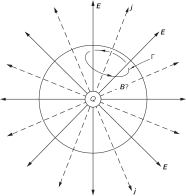
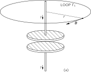
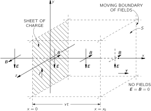
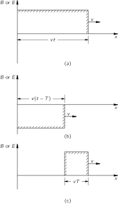
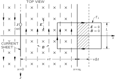
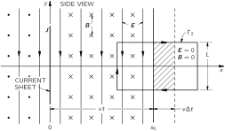

SOURCE: Feynman Lectures on Physics, Volume II, Chapter 18
LANGUAGE: ru
TITLE: Глава 18. Уравнения Максвелла
SOURCE_URL: https://www.feynmanlectures.caltech.edu/II_18.html
NOTEBOOKLM_USE: clean lecture text with TeX math and figure captions; reader navigation removed.

# Глава 18. Уравнения Максвелла

## 18–1 Уравнения Максвелла

В этой главе мы вернемся к полной системе из четырех уравнений Максвелла, которые мы приняли как отправной пункт в гл. 1. До сих пор мы изучали уравнения Максвелла небольшими частями, кусочками; теперь пора уже прибавить последнюю часть и соединить их все воедино. Тогда мы будем иметь полное и точное описание электромагнитных полей, которые могут изменяться со временем произвольным образом. Все сказанное в этой главе, если даже оно и будет противоречить чему-то сказанному ранее, правильно, а то, что говорилось ранее в этих случаях, неверно, потому что все высказанное ранее применялось к таким частным случаям, как, скажем, случаи постоянного тока или фиксированных зарядов. Хотя всякий раз, когда мы записывали уравнение, мы весьма старательно указывали ограничения, легко позабыть все эти оговорки и слишком хорошо заучить ошибочные уравнения. Теперь мы можем изложить всю истину, без всяких ограничений (или почти без них).

Все уравнения Максвелла записаны в табл. 18.1 как словесно, так и в математических символах. Тот факт, что слова эквивалентны уравнениям, должен быть сейчас вам уже знаком — вы должны уметь переводить одну форму в другую и обратно.

### Table Ch18-T1

Caption: Таблица 18.1 Классическая физика

- Maxwell’s equations
- I. | \(\displaystyle\FLPdiv{\FLPE}=\frac{\rho}{\epsO}\) | \(\text{(Flux of $\FLPE$ through a closed surface)}\) \(=\text{(Charge inside)}/\epsO\)
- II. | \(\displaystyle\FLPcurl{\FLPE}=-\ddp{\FLPB}{t}\) | \(\text{(Line integral of $\FLPE$ round a loop)}\) \(=\displaystyle-\ddt{}{t}\text{(Flux of $\FLPB$ through the loop)}\)
- III. | \(\FLPdiv{\FLPB}=0\) | \(\text{(Flux of $\FLPB$ through a closed surface)}\) \(=0\)
- IV. | \(\displaystyle c^2\FLPcurl{\FLPB}=\frac{\FLPj}{\epsO}+\ddp{\FLPE}{t}\) | \(c^2\text{(Integral of $\FLPB$ around a loop)}\) \(=\text{(Current through the loop)}/\epsO\) \(\displaystyle+\ddt{}{t}\text{(Flux of $\FLPE$ through the loop)}\)
- Conservation of charge
- \(\displaystyle\FLPdiv{\FLPj}=-\ddp{\rho}{t}\) | \(\text{(Flux of current through a closed surface)}\) \(=\displaystyle-\ddt{}{t}\text{(Charge inside)}\)
- Force law
- \(\FLPF=q(\FLPE+\FLPv\times\FLPB)\)
- Law of motion
- \(\displaystyle\ddt{}{t}(\FLPp)=\FLPF,\) \(\text{ where }\displaystyle\FLPp=\frac{m\FLPv}{\sqrt{1-v^2/c^2}}\;\) | (Newton’s law, with Einstein’s modification)
- Gravitation
- \(\displaystyle\FLPF=-G\,\frac{m_1m_2}{r^2}\,\FLPe_r\)

Первое уравнение — дивергенция \(\FLPE\) равна плотности заряда, деленной на \(\epsO\) — правильно всегда. Закон Гаусса справедлив всегда как в динамических, так и в статических полях. Поток \(\FLPE\) через любую замкнутую поверхность пропорционален заключенному внутри заряду. Третье уравнение — соответствующий общий закон для магнитных полей. Поскольку магнитных зарядов нет, поток \(\FLPB\) через любую замкнутую поверхность всегда равен нулю. Второе уравнение — ротор \(\FLPE\) равен \(-\ddpl{\FLPB}{t}\) — это закон Фарадея, и обсуждался он в последних двух главах. Он тоже верен в общем случае. Но последнее уравнение содержит нечто новое. Раньше мы встречались только с частью его, которая годится для постоянных токов. В этом случае мы говорили, что ротор \(\FLPB\) равен \(\FLPj/\epsO c^2\) , но правильное общее уравнение имеет новый член, который был открыт Максвеллом.

До появления работы Максвелла известные законы электричества и магнетизма были такими же, как те, что мы изучали в гл. 3—17. В частности, уравнение для магнитного поля постоянных токов было известно только в виде
\[
\begin{equation}
\label{Eq:II:18:1}
\FLPcurl{\FLPB}=\frac{\FLPj}{\epsO c^2}.
\end{equation}
\]
Максвелл начал с рассмотрения этих известных законов и выразил их в виде дифференциальных уравнений, так же как мы поступили здесь. (Хотя символ \(\FLPnabla\) еще не был придуман, впервые, в основном благодаря Максвеллу, стала очевидной важность таких комбинаций производных, которые мы сегодня называем ротором и дивергенцией.) Максвелл тогда заметил, что в уравнении (18.1) есть нечто странное. Если взять дивергенцию от этого уравнения, то левая сторона обратится в нуль, потому что дивергенция ротора всегда равна нулю. Таким образом, это уравнение требует, чтобы дивергенция \(\FLPj\) также была равна нулю. Но если дивергенция \(\FLPj\) равна нулю, то полный поток тока через любую замкнутую поверхность тоже равен нулю.

Полный ток через замкнутую поверхность равен уменьшению заряда внутри этой поверхности. Он наверняка не может быть всегда равен нулю, так как мы знаем, что заряды могут перемещаться из одного места в другое. Уравнение
\[
\begin{equation}
\label{Eq:II:18:2}
\FLPdiv{\FLPj}=-\ddp{\rho}{t}
\end{equation}
\]
фактически есть наше определение \(\FLPj\) . Это уравнение выражает самый фундаментальный закон — сохранение электрического заряда: любой поток заряда должен поступать из какого-то запаса. Максвелл заметил эту трудность и, чтобы избежать ее, предложил добавить \(\ddpl{\FLPE}{t}\) в правую часть уравнения (18.1); тогда он и получил уравнение IV в табл. 18.1:
\[
\begin{equation*}
\text{IV.}\quad c^2\FLPcurl{\FLPB}=\frac{\FLPj}{\epsO}+\ddp{\FLPE}{t}.
\end{equation*}
\]

Во времена Максвелла еще не было принято мыслить в терминах абстрактных полей. Максвелл обсуждал свои идеи с помощью модели, в которой вакуум был подобен упругому телу. Он пытался также объяснить смысл своего нового уравнения с помощью механической модели. Теория Максвелла принималась очень неохотно, во-первых, из-за модели, а во-вторых, потому, что вначале не было экспериментального подтверждения. Сейчас мы лучше понимаем, что дело в самих уравнениях, а не в модели, с помощью которой они были получены. Мы можем лишь задаться вопросом, правильны ли эти уравнения или они ошибочны. Ответ на это дают эксперименты, и бессчетное число опытов подтвердило уравнения Максвелла. Если мы отбросим все строительные леса, которыми пользовался Максвелл, чтобы построить уравнения, мы придем к заключению, что прекрасное здание, созданное Максвеллом, держится само по себе. Он свел воедино все законы электричества и магнетизма и создал законченную и прекрасную теорию.

Давайте покажем, что добавочный член имеет именно тот вид, который требуется, чтобы преодолеть обнаруженную Максвеллом трудность. Взяв дивергенцию его уравнения (IV в табл. 18.1), мы должны получить, что дивергенция правой части равна нулю:
\[
\begin{equation}
\label{Eq:II:18:3}
\FLPdiv{\frac{\FLPj}{\epsO}}+\FLPdiv{\ddp{\FLPE}{t}}=0.
\end{equation}
\]
Во втором слагаемом можно переставить порядок дифференцирования по координатам и времени, так что уравнение может быть переписано в виде
\[
\begin{equation}
\label{Eq:II:18:4}
\FLPdiv{\FLPj}+\epsO\,\ddp{}{t}\,\FLPdiv{\FLPE}=0.
\end{equation}
\]
Но, согласно первому из уравнений Максвелла, дивергенция \(\FLPE\) равна \(\rho/\epsO\) . Подставляя это равенство в (18.4), мы придем к уравнению (18.2), которое, как мы знаем, правильно. И наоборот, если мы принимаем уравнения Максвелла (а мы принимаем их потому, что никто никогда не обнаружил эксперимента, который опроверг бы их), мы должны прийти к выводу, что заряд всегда сохраняется.

Законы физики не дают ответа на вопрос: «Что случится, если заряд внезапно возникнет в этой точке, какие будут при этом электромагнитные эффекты?» Ответ дать нельзя, потому что наши уравнения утверждают, что такого не происходит. Если бы это случилось, нам понадобились бы новые законы, но мы не можем сказать, какими бы они были. Нам не приходилось наблюдать, как ведет себя мир без сохранения заряда. Согласно нашим уравнениям, если вы внезапно поместите заряд в некоторой точке, вы должны принести его туда откуда-то еще. В таком случае мы можем говорить о том, что произошло.

Когда мы добавили новый член в уравнение для ротора \(\FLPE\) , мы обнаружили, что им описывается целый новый класс явлений. Мы увидим также, что небольшая добавка Максвелла к уравнению для \(\FLPcurl{\FLPB}\) имеет далеко идущие последствия. Мы затронем лишь некоторые из них в этой главе.

## 18–2 Как работает новый член

В качестве нашего первого примера рассмотрим, что происходит со сферически симметричным радиальным распределением тока. Представим себе маленькую сферу с нанесенным на ней радиоактивным веществом. Это радиоактивное вещество испускает наружу заряженные частицы. (Мы можем представить также большой кусок желе с маленьким отверстием в центре, в которое с помощью шприца впрыскиваются какие-то заряды и из которого заряды медленно просачиваются.) В любом случае мы имели бы ток, который повсюду направлен по радиусу наружу. Будем считать, что величина его одинакова во всех направлениях.

Пусть полный заряд внутри любого радиуса \(r\) равен \(Q(r)\) . Если плотность радиального тока при таком же радиусе равна \(\FLPj(r)\) , то уравнение (18.2) требует, чтобы \(Q\) уменьшался со скоростью
\[
\begin{equation}
\label{Eq:II:18:5}
\ddp{Q(r)}{t}=-4\pi r^2j(r).
\end{equation}
\]

Спросим теперь о магнитном поле, создаваемом токами в этом случае. Предположим, мы начертили какую-то петлю \(\Gamma\) на сфере радиуса \(r\) (фиг. 18.1). Сквозь петлю проходит какой-то ток, поэтому можно ожидать, что магнитное поле циркулирует в направлении, указанном на фигуре.

### Figure Ch18-F1
Caption: Фиг. 18.1. Каково магнитное поле сферически симметричного тока?
Image: figures/Ch18-F1.svg

Но мы уже попали в затруднительное положение. Как может \(\FLPB\) иметь какое-то особое направление на сфере? При другом выборе \(\Gamma\) мы бы заключили, что ее направление прямо противоположно указанному. Поэтому возможна ли какая-либо циркуляция \(\FLPB\) вокруг токов?

Нас спасают уравнения Максвелла. Циркуляция \(\FLPB\) зависит не только от полного тока, проходящего сквозь \(\Gamma\) , но и от скорости изменения со временем электрического потока через нее. Должно быть так, чтобы эти две части как раз погашались. Посмотрим, получается ли это.

Электрическое поле на расстоянии \(r\) должно быть равно \(Q(r)/4\pi\epsO r^2\) , пока, как мы предположили, заряд распределен симметрично. Поле радиально, и скорость его изменения тогда равна
\[
\begin{equation}
\label{Eq:II:18:6}
\ddp{E}{t}=\frac{1}{4\pi\epsO r^2}\,\ddp{Q}{t}.
\end{equation}
\]
Сравнивая это с (18.5), мы видим, что для любого расстояния
\[
\begin{equation}
\label{Eq:II:18:7}
\ddp{E}{t}=-\frac{j}{\epsO}.
\end{equation}
\]
В уравнении IV (табл. 18.1) оба члена от источника погашаются и ротор \(\FLPB\) равен всегда нулю. Магнитного поля в нашем примере нет.

В качестве второго нашего примера рассмотрим магнитное поле провода, используемого для зарядки плоского конденсатора (фиг. 18.2). Если заряд \(Q\) на пластинах со временем изменяется (но не слишком быстро), ток в проводах равен \(dQ/dt\) . Мы ожидаем, что этот ток создаст магнитное поле, которое окружает провод. Конечно, ток вблизи пластины должен создавать обычное магнитное поле, оно не может зависеть от того, куда идет ток.

### Figure Ch18-F2
Caption: Фиг. 18.2. Магнитное поле вблизи заряжаемого конденсатора.
Image: figures/Ch18-F2.svg

Предположим, мы выбрали петлю \(\Gamma_1\) в виде окружности с радиусом \(r\) , как показано на части (а) фигуры. Контурный интеграл от магнитного поля будет равен току \(I\) , деленному на \(\epsO c^2\) . Мы имеем
\[
\begin{equation}
\label{Eq:II:18:8}
2\pi rB=\frac{I}{\epsO c^2}.
\end{equation}
\]
Все это мы получили бы для постоянного тока, но результат не изменится, если учесть добавку Максвелла, потому что, если мы рассмотрим плоскую поверхность \(S\) внутри окружности, электрического поля на ней нет (считая, что провод очень хороший проводник). Поверхностный интеграл от \(\ddpl{\FLPE}{t}\) равен нулю.

Предположим, однако, что теперь мы медленно продвигаем кривую \(\Gamma\) вниз. Мы будем получать всегда тот же самый результат до тех пор, пока не нарисуем кривую вровень с пластинами конденсатора. Тогда ток \(I\) будет стремиться к нулю. Исчезнет ли при этом магнитное поле? Это было бы очень странно. Давайте поглядим, что говорит уравнение Максвелла для кривой \(\Gamma_2\) , которая представляет собой окружность радиуса \(r\) , плоскость которой проходит между пластинами конденсатора (фиг. 18.2,б). Контурный интеграл от \(\FLPB\) вокруг \(\Gamma_2\) есть \(2\pi rB\) . Он должен быть равен производной по времени потока \(\FLPE\) , проходящего сквозь плоскую поверхность круга \(S_2\) . Этот поток \(\FLPE\) , как мы знаем из закона Гаусса, должен быть равен \(1/\epsO\) заряду \(Q\) на одной из пластин конденсатора. Мы имеем
\[
\begin{equation}
\label{Eq:II:18:9}
c^2\,2\pi rB=\ddt{}{t}\biggl(\frac{Q}{\epsO}\biggr).
\end{equation}
\]

Это очень удобно. Результат тот же, что мы нашли в (18.8). Интегрирование по меняющемуся электрическому полю дает то же магнитное поле, что и интегрирование по току в проводе. Конечно, как раз об этом и говорит уравнение Максвелла. Легко видеть, что так должно быть всегда, если применить наши рассуждения к двум поверхностям \(S_1\) и \(S_1'\) , ограниченным одной и той же окружностью \(\Gamma_1\) на фиг. 18.2,б. Сквозь \(S_1\) проходит ток \(I\) , но нет электрического потока. Сквозь \(S_1'\) нет тока, но есть электрический поток, меняющийся со скоростью \(I/\epsO\) . То же поле \(\FLPB\) получится, если мы применим уравнение IV к каждой поверхности.

Из нашего обсуждения добавки, введенной Максвеллом, у вас могло сложиться впечатление, что она добавляет немного— просто подправляет уравнения в согласии с тем, что мы уже ожидали. Это верно, пока мы рассматриваем уравнение IV само по себе, ничего особенно нового не появляется. Слова «само по себе», однако, весьма важны. Небольшое изменение, введенное Максвеллом в уравнение IV в сочетании с другими уравнениями, на самом деле дает много нового и важного. Но прежде чем заняться этим вопросом, поговорим подробнее о табл. 18.1.

## 18–3 Все о классической физике

В табл. 18.1 сведено все, что знала фундаментальная классическая физика, т. е. та физика, которая была известна до 1905 г. В одной этой таблице есть все. С помощью этих уравнений можно понять все достижения классической физики.

Прежде всего, у нас есть уравнения Максвелла, записанные как в расширенном, так и в короткой математической форме. Затем есть сохранение заряда, которое даже записано в скобках, потому что, имея полные уравнения Максвелла, мы можем вывести из них сохранение заряда. Так что таблица даже содержит небольшие излишки. Далее мы записали закон силы, поскольку наличие всех электрических и магнитных полей ничего нам не дает до тех пор, пока мы не знаем, как они действуют на заряды. Зная \(\FLPE\) и \(\FLPB\) , однако, мы можем найти силу, действующую на объект с зарядом \(q\) , движущийся со скоростью \(\FLPv\) . Наконец, знание силы ничего нам не дает до тех пор, пока мы не знаем, что происходит, когда сила воздействует на что-то; нам необходим закон движения, который гласит, что сила равна скорости изменения импульса. (Помните? Об этом говорилось в первом томе.) Мы даже включили релятивистские эффекты, записав импульс в виде \(\FLPp=m_0\FLPv/\sqrt{1-v^2/c^2}\) .

Если мы действительно хотим законченности, нам следует добавить еще один закон — закон тяготения Ньютона, — поэтому мы поставили его в конце.

Итак, в одной небольшой таблице мы собрали все фундаментальные законы классической физики, даже хватило места выписать их словами и еще с некоторым излишком. Это великий момент. Мы покорили большую высоту. Мы на вершине К-2, мы почти готовы к восхождению на Эверест — квантовую механику. Мы взобрались на вершину «Великого водораздела», и теперь мы можем начать спуск по другую сторону.

В основном мы пытались научиться понимать эти уравнения. А теперь, когда мы собрали их воедино, мы собираемся разобраться, что означают эти уравнения, что нового скажут они о том, чего мы еще не поняли. Мы много потрудились, чтобы вскарабкаться к этой точке. Это потребовало больших усилий, а теперь мы собираемся начать приятное путешествие — спуск с горы в долину, там мы увидим все, чего мы достигли.

## 18–4 Передвигающееся поле

А теперь о новых следствиях. Они возникают из сопоставления всех уравнений Максвелла. Сначала давайте посмотрим, что произошло бы в особенно простом случае. Предположим, что изменяется только одна координата у всех величин, т. е. рассмотрим задачу одного измерения. Случай этот показан на фиг. 18.3. Перед нами заряженный лист, помещенный на плоскости \(yz\) . Сначала он неподвижен, а затем мгновенно приобретает скорость \(u\) в направлении \(y\) и движется с этой постоянной скоростью. Вас может беспокоить присутствие такого «бесконечного» ускорения, но фактически это не имеет значения; просто представьте себе, что скорость достигает значения \(u\) очень быстро. Итак, мы внезапно получаем поверхностный ток \(J\) ( \(J\) — ток на единицу ширины в \(z\) -направлении). Чтобы упростить проблему, предположим, что имеется еще неподвижный лист, заряженный противоположно и наложенный на плоскость \(yz\) , так что электростатические эффекты отсутствуют. Представим себе также (хотя на фигуре мы показали лишь то, что происходит в конечной области), что лист простирается до бесконечности в направлениях \(\pm y\) и \(\pm z\) . Другими словами, здесь мы имеем случай, когда тока нет, а затем внезапно появляется однородный лист с током. Что же произойдет?

### Figure Ch18-F3
Caption: Фиг. 18.3. Бесконечная заряженная плоскость внезапно приводится в поступательное движение. Возникают магнитное и электрическое поля, распространяющиеся от плоскости с постоянной скоростью.
Image: figures/Ch18-F3.svg

Мы знаем, что когда имеется лист с током в положительном \(y\) -направлении, возникает магнитное поле, направленное в отрицательном \(z\) -направлении при \(x>0\) и в противоположном направлении при \(x<0\) . Мы могли бы найти величину \(\FLPB\) , используя тот факт, что контурный интеграл от магнитного поля будет равен току на \(\epsO c^2\) . Мы получили бы, что \(B=J/2\epsO c^2\) (поскольку ток \(I\) в полосе шириной \(w\) равен \(Jw\) , а контурный интеграл от \(\FLPB\) есть \(2Bw\) ).

Так мы определяем поле вблизи листа для малых значений \(x\) , но, поскольку мы считаем лист бесконечным, хотелось бы получить с помощью тех же рассуждений магнитное поле подальше, для больших значений \(x\) . Однако это означало бы, что в момент, когда мы включаем ток, магнитное поле внезапно изменяется повсюду от нуля до конечной величины. Но погодите! При внезапном изменении магнитного поля возникают огромные электрические эффекты. (Как бы оно ни менялось, электрические эффекты возникнут.) Так что в результате движения заряженного листа создается меняющееся магнитное поле и, следовательно, должны возникнуть электрические эффекты. Если электрические поля образовались, они должны начинаться с нуля и меняться к какому-то значению. Возникнет некая производная \(\ddpl{\FLPE}{t}\) , которая будет вносить вклад вместе с током \(J\) в создание магнитного поля. Так разные уравнения зацепляются друг за друга, и мы должны попытаться найти решения для всех полей сразу.

Рассматривая уравнения Максвелла порознь, нелегко сразу получить решение. Поэтому сначала мы сообщим вам ответ, а затем уже проверим, действительно ли он удовлетворяет уравнениям. Ответ таков: поле \(\FLPB\) , которое мы вычислили, на самом деле создается прямо вблизи листа с током (для малых \(x\) ). Так и должно быть, потому что если мы проведем крошечную петлю вокруг листа, то в ней не будет места для прохождения электрического потока. Но поле \(\FLPB\) подальше — для больших \(x\) — сначала равно нулю. Оно в течение некоторого времени остается нулевым, а затем внезапно включается. Короче говоря, мы включаем ток и немедленно вблизи него включается магнитное поле с постоянным значением \(\FLPB\) ; затем включенное поле \(\FLPB\) распространяется от области источника. Через некоторое время появляется однородное магнитное поле всюду, вплоть до некоторого значения \(x\) , а за ним оно равно нулю. Вследствие симметрии оно распространяется как в положительном, так и в отрицательном \(x\) -направлении.

### Figure Ch18-F4
Caption: Фиг. 18.4. Зависимость величины \(\FigB\) (или \(\FigE\) ) от \(x\) в момент \(t\) после начала движения заряженной плоскости. (b) Поля от заряженной плоскости, начавшей движение в сторону отрицательных \(y\) в момент \(t=T\) . (c) Сумма (a) и (b).
Image: figures/Ch18-F4.svg

Поле \(\FLPE\) делает то же самое. До момента \(t=0\) (когда мы включаем ток) поле повсюду равно нулю. Затем, спустя время \(t\) , как \(\FLPE\) , так и \(\FLPB\) постоянны вплоть до расстояния \(x=vt\) , а за ним равны нулю. Поля продвигаются вперед, подобно приливной волне, причем фронт их движется с постоянной скоростью, которая оказывается равной \(c\) , но пока мы будем называть ее \(v\) . Изображение зависимости величины \(\FLPE\) или \(\FLPB\) от \(x\) (как они кажутся в момент \(t\) ) показано на фиг. 18.4, а. Если снова посмотреть на фиг. 18.3 в момент \(t\) , то мы увидим, что область между \(x=\pm vt\) «занята» полями, но они еще не достигли области за ней. Мы снова подчеркиваем — мы предполагаем, что лист заряжен, а следовательно, поля \(\FLPE\) и \(\FLPB\) простираются бесконечно далеко в \(y\) - и \(z\) -направлениях. (Мы не можем изобразить бесконечный лист, поэтому мы показываем лишь то, что происходит в конечной области.)

### Figure Ch18-F5
Caption: Фиг. 18.5. Вид сверху, как на фиг. 18.3.
Image: figures/Ch18-F5.svg

Теперь мы хотим проанализировать количественно то, что происходит. Чтобы сделать это, рассмотрим два поперечных разреза: вид сверху, если смотреть вниз вдоль оси \(y\) (фиг. 18.5), и вид сбоку, если смотреть назад вдоль оси \(z\) (фиг. 18.6). Начнем с вида сбоку. Мы видим заряженный лист, движущийся вверх; магнитное поле направлено внутрь страницы для \(+x\) , от страницы для \(-x\) , а электрическое поле направлено вниз всюду, вплоть до \(x=\pm vt\) .

### Figure Ch18-F6
Caption: Фиг. 18.6. То же, что на фиг. 18.3 (вид сбоку).
Image: figures/Ch18-F6.svg

Посмотрим, согласуются ли такие поля с уравнениями Максвелла. Сначала нарисуем одну из тех петель, которыми мы пользовались для вычисления контурного интеграла, скажем прямоугольник \(\Gamma_2\) на фиг. 18.6. Заметьте, что одна сторона прямоугольника проходит в области, где есть поля, а другая — в области, до которой поля еще не дошли. Через эту петлю проходит какой-то магнитный поток. Если он изменяется, должна появиться э. д. с. вдоль петли. Если волновой фронт движется, мы будем иметь меняющийся магнитный поток, поскольку поверхность, внутри которой существует поле \(\FLPB\) , непрерывно увеличивается со скоростью \(v\) . Поток внутри \(\Gamma_2\) равен произведению \(B\) на ту часть поверхности внутри \(\Gamma_2\) , где есть магнитное поле. Скорость изменения потока (поскольку величина \(\FLPB\) постоянна) равна величине поля, умноженной на скорость изменения поверхности. Скорость изменения поверхности найти легко. Если ширина прямоугольника \(\Gamma_2\) равна \(L\) , то поверхность, в которой \(\FLPB\) существует, меняется как \(Lv\,\Delta t\) за отрезок времени \(\Delta t\) (см. фиг. 18.6). Скорость изменения потока тогда равна \(BLv\) . По закону Фарадея она должна быть равна контурному интегралу от \(\FLPE\) вокруг \(\Gamma_2\) , который есть просто \(EL\) . Мы получаем равенство
\[
\begin{equation}
\label{Eq:II:18:10}
E=vB.
\end{equation}
\]
Таким образом, если отношение \(E\) к \(B\) равно \(v\) , то рассматриваемые нами поля будут удовлетворять уравнению Фарадея.

Но это не единственное уравнение; у нас есть еще одно, связывающее \(\FLPE\) и \(\FLPB\) :
\[
\begin{equation}
\label{Eq:II:18:11}
c^2\FLPcurl{\FLPB}=\frac{\FLPj}{\epsO}+\ddp{\FLPE}{t}.
\end{equation}
\]
Чтобы применить это уравнение, посмотрим на вид сверху, изображенный на фиг. 18.5. Мы уже видели, что это уравнение дает нам значение \(B\) вблизи заряженного листа. Кроме того, для любой петли, нарисованной вне листа, но позади волнового фронта, нет ни ротора \(\FLPB\) , ни \(\FLPj\) , ни меняющегося поля \(\FLPE\) , так что уравнение там справедливо. А теперь посмотрим, что происходит в петле \(\Gamma_1\) , которая пересекает волновой фронт, как показано на фиг. 18.5. Здесь нет токов, поэтому уравнение (18.11) можно записать в интегральной форме так:
\[
\begin{equation}
\label{Eq:II:18:12}
c^2\oint_{\Gamma_1}\FLPB\cdot d\FLPs=\ddt{}{t}\!\!
\underset{\text{inside $\Gamma_1$}}{\int}
\!\FLPE\cdot\FLPn\,da.
\end{equation}
\]
Контурный интеграл от \(\FLPB\) есть просто произведение \(B\) на \(L\) . Скорость изменения потока \(\FLPE\) возникает только благодаря продвигающемуся волновому фронту. Область внутри \(\Gamma_1\) , где \(\FLPE\) не равно нулю, увеличивается со скоростью \(vL\) . Правая сторона (18.12) тогда равна \(vLE\) . Уравнение это приобретает вид
\[
\begin{equation}
\label{Eq:II:18:13}
c^2B=Ev.
\end{equation}
\]

Мы получили решение, в котором поля \(\FLPB\) и \(\FLPE\) постоянны за фронтом, причем оба направлены под прямыми углами к направлению, в котором движется фронт, и под прямыми углами друг к другу. Уравнения Максвелла определяют отношение \(E\) к \(B\) . Из уравнений (18.10) и (18.13) получаем
\[
\begin{equation*}
E=vB,\quad\text{and}\quad E=\frac{c^2}{v}\,B.
\end{equation*}
\]
Но одну минутку! Мы нашли два разных условия для отношения \(E/B\) . Может ли такое поле, как мы описываем, действительно существовать? Имеется, конечно, лишь одна скорость \(v\) , для которой оба уравнения могут быть справедливы, а именно \(v=c\) . Волновой фронт должен передвигаться со скоростью \(c\) . Мы имеем пример, когда электрическое возмущение от тока распространяется с определенной конечной скоростью \(c\) .

А теперь спросим, что произойдет, если мы внезапно остановим заряженный лист, после того как он двигался в течение короткого времени \(T\) . Увидеть, что случится, можно с помощью принципа суперпозиции. У нас был ток, равный нулю, а затем его внезапно включали. Мы знаем решение для этого случая. Теперь мы собираемся добавить другой ряд полей. Мы берем другой заряженный лист и внезапно начинаем его двигать в противоположном направлении с той же скоростью, только спустя время \(T\) после начала движения первого листа. Полный ток от двух листов вместе сначала равен нулю, потом он включается в течение времени \(T\) , затем выключается снова, потому что оба тока погашаются. Так мы получаем прямоугольный «импульс» тока.

Новый отрицательный ток создает такие же поля, как и положительный, но с обратными знаками и, разумеется, с запаздыванием во времени \(T\) . Волновой фронт по-прежнему движется со скоростью \(c\) . В момент времени \(t\) он достигает расстояния \(x=\pm c(t-T)\) (см. фиг. 18.4, б). Итак, мы имеем два «куска» поля, перемещающихся со скоростью \(c\) (см. фиг. 18.4, а и б). Соединенные поля будут такими, как показано на фиг. 18.4, в. Для \(x>ct\) поля равны нулю, между \(x=c(t-T)\) и \(x=ct\) они постоянны (со значениями, которые мы нашли выше), и для \(x<c(t - T)\) они снова равны нулю.

Короче говоря, мы получаем маленький кусочек поля — «брусок» толщиной \(cT\) , — который покинул заряженный лист и передвигается через все пространство сам по себе. Поля «оторвались»; они распространяются свободно в пространстве и больше не связаны каким-то образом с источником. Куколка превратилась в бабочку!

Как же эти совокупности электрического и магнитного полей могут сохранять сами себя? Ответ: За счет сочетания эффектов из закона Фарадея \(\FLPcurl{\FLPE}=-\ddpl{\FLPB}{t}\) и нового члена, добавленного Максвеллом \(c^2\FLPcurl{\FLPB}=\ddpl{\FLPE}{t}\) . Они не могут не сохранять себя. Предположим, что магнитное поле исчезло бы. Тогда появилось бы меняющееся магнитное поле, которое создавало бы электрическое поле. Если бы это электрическое поле попыталось исчезнуть, то изменяющееся электрическое поле создало бы магнитное поле снова. Следовательно, за счет непрерывного взаимодействия — перекачивания туда и обратно от одного поля к другому — они должны сохраняться вечно. Они не могут исчезнуть. Они сохраняются, вовлеченные в общий танец — одно поле создает другое, а второе создает первое, — распространяясь все дальше и дальше в пространстве.

## 18.5. Скорость света

У нас есть волна, которая уходит от материального источника и движется со скоростью \(c\) (это скорость света). Вернемся немного назад. Исторически не было известно, что коэффициент \(c\) в уравнениях Максвелла тот же, что и скорость распространения света. Это была просто константа в уравнениях. Мы назвали ее \(c\) с самого начала, так как знали, что в конце концов должно получиться. Мы не думаем, что было бы разумнее сначала заставить вас выучить формулы с разными константами, а затем вернуться обратно и подставить \(c\) повсюду, где оно должно стоять. С точки зрения электричества и магнетизма, однако, мы прямо начинаем с двух констант \(\epsO\) и \(c^2\) , которые появляются в уравнениях электростатики и магнитостатики:
\[
\begin{equation}
\label{Eq:II:18:14}
\FLPdiv{\FLPE} =\frac{\rho}{\epsO}
\end{equation}
\]
и
\[
\begin{equation}
\label{Eq:II:18:15}
\FLPcurl{\FLPB} =\frac{\FLPj}{\epsO c^2}.
\end{equation}
\]
Если взять любое произвольное определение единицы заряда, можно экспериментально определить постоянную \(\epsO\) , входящую в уравнение (18.14), скажем, измеряя силу между двумя неподвижными единичными зарядами по закону Кулона. Мы должны также определить экспериментально постоянную \(\epsO c^2\) , которая появляется в уравнении (18.15), что можно сделать, скажем, измерив силу между двумя единичными токами. (Единичный ток означает единичный заряд в секунду.) Отношение этих двух экспериментальных постоянных есть \(c^2\) — как раз другая «электромагнитная постоянная».

Заметим теперь, что постоянная \(c^2\) получается одна и та же независимо от того, какова выбранная наша единица заряда. Если мы выберем «заряд» в два раза больше (скажем, удвоенный заряд протона), то в нашей «единице» заряда \(\epsO\) должна уменьшиться в четыре раза. Когда мы пропускаем два таких «единичных» тока по двум проводам, в каждом проводе будет в два раза больше «зарядов» в секунду, так что силы между двумя проводами будут в четыре раза больше. Постоянная \(\epsO c^2\) должна уменьшиться в четыре раза. Но отношение \(\epsO c^2/\epsO\) не меняется.

Следовательно, непосредственно из экспериментов с зарядами и токами мы находим число \(c^2\) , которое оказывается равным квадрату скорости распространения электромагнитных возбуждений. Из статических измерений — измеряя силы между двумя единичными зарядами и между двумя единичными токами — мы находим, что \(c=3.00\times10^8\) м/сек. Когда Максвелл впервые проделал это вычисление со своими уравнениями, он сказал, что совокупности электрического и магнитного полей будут распространяться с этой скоростью. Он отметил также таинственное совпадение: эта скорость была равна скорости света. «Мы едва ли можем избежать заключения, — сказал Максвелл, — что свет — это поперечное волнообразное движение той же самой среды, которая вызывает электрические и магнитные явления».

Так Максвелл совершил одно из великих обобщений физики! До него существовали свет, электричество и магнетизм. Два последних явления были объединены экспериментальными работами Фарадея, Эрстеда и Ампера. Затем, внезапно, свет перестал быть «чем-то еще», а оказался лишь электричеством и магнетизмом в новой форме — небольшими кусками электрического и магнитного полей, которые распространяются в пространстве самостоятельно.

Мы обращали ваше внимание на некоторые черты этого особого решения, которые, однако, справедливы для любой электромагнитной волны: магнитное поле перпендикулярно направлению движения фронта волны; электрическое поле также перпендикулярно направлению движения фронта волны; и два вектора \(\FLPE\) и \(\FLPB\) перпендикулярны друг другу. Далее, величина электрического поля \(E\) равна произведению \(c\) на величину магнитного поля \(B\) . Эти три факта — что оба поля поперечны направлению распространения, что \(\FLPB\) перпендикулярно \(\FLPE\) , и что \(E=cB\) — верны вообще для любой электромагнитной волны. Наш частный случай — хороший пример, он показывает все основные свойства электромагнитных волн.

## 18–6 Решение уравнений Максвелла; потенциалы и волновое уравнение

Теперь стоило бы заняться немного математикой; мы хотим записать уравнения Максвелла в более простой форме. Вы, пожалуй, сочтете, что мы усложняем их, но если вы наберетесь терпения, то внезапно обнаружите их большую простоту. Хотя вы уже вполне привыкли к каждому из уравнений Максвелла, имеется все же много частей, которые стоит соединить воедино. Вот как раз этим мы и займемся.

Мы начнем с \(\FLPdiv{\FLPB}=0\) — простейшего из уравнений. Мы знаем, оно подразумевает, что \(\FLPB\) — есть ротор чего-то. Поэтому, если мы запишем
\[
\begin{equation}
\label{Eq:II:18:16}
\FLPB=\FLPcurl{\FLPA},
\end{equation}
\]
то считайте, что уже решили одно из уравнений Максвелла. (Между прочим, заметьте, что оно остается верно для другого вектора \(\FLPA'\) , если \(\FLPA'=\FLPA+\FLPgrad{\psi}\) — где \(\psi\) — любое скалярное поле, потому что ротор \(\FLPgrad{\psi}\) — нуль и \(\FLPB\) — по-прежнему то же самое. Мы говорили об этом раньше.)

Теперь разберем закон Фарадея \(\FLPcurl{\FLPE}=-\ddpl{\FLPB}{t}\) , потому что он не содержит никаких токов или зарядов. Если мы запишем \(\FLPB\) как \(\FLPcurl{\FLPA}\) и продифференцируем по \(t\) , то сможем переписать закон Фарадея в форме
\[
\begin{equation*}
\FLPcurl{\FLPE}=-\ddp{}{t}\,\FLPcurl{\FLPA}.
\end{equation*}
\]
Поскольку мы можем дифференцировать сначала либо по времени, либо по координатам, то можно написать это уравнение также в виде
\[
\begin{equation}
\label{Eq:II:18:17}
\FLPcurl{\biggl(\FLPE+\ddp{\FLPA}{t}\biggr)}=\FLPzero.
\end{equation}
\]
Мы видим, что \(\FLPE+\ddpl{\FLPA}{t}\) — это вектор, ротор которого равен нулю. Поэтому такой вектор есть градиент чего-то. Когда мы занимались электростатикой, у нас было \(\FLPcurl{\FLPE}=\FLPzero\) , и мы тогда решили, что \(\FLPE\) — само градиент чего-то. Пусть это градиент от \(-\phi\) (минус для технических удобств). То же самое сделаем и для \(\FLPE+\ddpl{\FLPA}{t}\) ; мы полагаем
\[
\begin{equation}
\label{Eq:II:18:18}
\FLPE+\ddp{\FLPA}{t}=-\FLPgrad{\phi}.
\end{equation}
\]
Мы используем то же обозначение \(\phi\) , так что в электростатическом случае, когда ничто не меняется со временем и член \(\ddpl{\FLPA}{t}\) исчезает, \(\FLPE\) будет нашим старым \(-\FLPgrad{\phi}\) . Итак, закон Фарадея можно представить в форме
\[
\begin{equation}
\label{Eq:II:18:19}
\FLPE=-\FLPgrad{\phi}-\ddp{\FLPA}{t}.
\end{equation}
\]

Мы уже решили два из уравнений Максвелла и нашли, что для описания электромагнитных полей \(\FLPE\) и \(\FLPB\) нужны четыре потенциальные функции: скалярный потенциал \(\phi\) и векторный потенциал \(\FLPA\) , который, разумеется, представляет три функции.

Теперь \(\FLPA\) определяет часть \(\FLPE\) , так же как и \(\FLPB\) . Что же произойдет, когда мы заменим \(\FLPA\) на \(\FLPA'=\FLPA+\FLPgrad{\psi}\) ? В общем, \(\FLPE\) должно было бы измениться, если не принять особых мер. Мы можем, однако, допустить, что \(\FLPA\) изменяется так, чтобы не влиять на поля \(\FLPE\) и \(\FLPB\) (т. е. не меняя физики), если будем всегда изменять \(\FLPA\) и \(\phi\) вместе по правилам
\[
\begin{equation}
\label{Eq:II:18:20}
\FLPA'=\FLPA+\FLPgrad{\psi},\quad
\phi'=\phi-\ddp{\psi}{t}.
\end{equation}
\]
Тогда ни \(\FLPB\) , ни \(\FLPE\) , полученные из уравнения (18.19), не меняются.

Ранее мы выбирали \(\FLPdiv{\FLPA}=0\) , чтобы как-то упростить уравнения статики. Теперь мы не собираемся так поступать; мы хотим сделать другой выбор. Но подождите немного, прежде чем мы скажем, какой это выбор, потому что позднее станет ясно, почему вообще делается выбор.

Теперь вернемся к двум оставшимся уравнениям Максвелла, которые свяжут потенциалы и источники \(\rho\) и \(\FLPj\) . Раз мы можем определить \(\FLPA\) и \(\phi\) из токов и зарядов, то можно всегда получить \(\FLPE\) и \(\FLPB\) из уравнений (18.16) и (18.19), и мы будем иметь другую форму уравнений Максвелла.

Мы начнем с подстановки уравнения (18.19) в \(\FLPdiv{\FLPE}=\rho/\epsO\) ; получаем
\[
\begin{equation*}
\FLPdiv{\biggl(-\FLPgrad{\phi}-\ddp{\FLPA}{t}\biggr)}=\frac{\rho}{\epsO},
\end{equation*}
\]
это можно записать еще в виде
\[
\begin{equation}
\label{Eq:II:18:21}
-\nabla^2\phi-\ddp{}{t}\,\FLPdiv{\FLPA}=\frac{\rho}{\epsO}.
\end{equation}
\]
Таково первое уравнение, связывающее \(\phi\) и \(\FLPA\) с источниками.

Наше последнее уравнение будет самым трудным. Мы начнем с того, что перепишем четвертое уравнение Максвелла:
\[
\begin{equation*}
c^2\FLPcurl{\FLPB}-\ddp{\FLPE}{t}=\frac{\FLPj}{\epsO},
\end{equation*}
\]
а затем выразим \(\FLPB\) и \(\FLPE\) через потенциалы, используя уравнения (18.16) и (18.19):
\[
\begin{equation*}
c^2\FLPcurl{(\FLPcurl{\FLPA})}-\ddp{}{t}\,
\biggl(-\FLPgrad{\phi}-\ddp{\FLPA}{t}\biggr)=
\frac{\FLPj}{\epsO}.
\end{equation*}
\]
Первый член можно переписать, используя алгебраическое тождество: \(\FLPcurl{(\FLPcurl{\FLPA})}=\) \(\FLPgrad{(\FLPdiv{\FLPA})}-\nabla^2\FLPA\) ; мы получаем
\[
\begin{align}
-c^2\nabla^2\FLPA&+c^2\FLPgrad{(\FLPdiv{\FLPA})}\notag\\[.5ex]
\label{Eq:II:18:22}
&+\ddp{}{t}\,\FLPgrad{\phi}+\frac{\partial^2\FLPA}{\partial t^2}=
\frac{\FLPj}{\epsO}.
\end{align}
\]
Не очень-то оно простое!

К счастью, теперь мы можем воспользоваться нашей свободой произвольного выбора дивергенции \(\FLPA\) . Мы собираемся сделать такой выбор, чтобы уравнения для \(\FLPA\) и для \(\phi\) разделились, но имели одну и ту же форму. Мы можем сделать это, выбирая
\[
\begin{equation}
\label{Eq:II:18:23}
\FLPdiv{\FLPA}=-\frac{1}{c^2}\,\ddp{\phi}{t}.
\end{equation}
\]
Когда мы поступаем так, то два средних члена в \(\FLPA\) и \(\phi\) в ур. (18.22) взаимно уничтожаются, и оно становится много проще:
\[
\begin{equation}
\label{Eq:II:18:24}
\nabla^2\FLPA-\frac{1}{c^2}\,\frac{\partial^2\FLPA}{\partial t^2}=
-\frac{\FLPj}{\epsO c^2}.
\end{equation}
\]
А наше уравнение для \(\phi\) — ур. (18.21) — принимает такую же форму:
\[
\begin{equation}
\label{Eq:II:18:25}
\nabla^2\phi-\frac{1}{c^2}\,\frac{\partial^2\phi}{\partial t^2}=
-\frac{\rho}{\epsO}.
\end{equation}
\]

Какие красивые уравнения! Они великолепны прежде всего потому, что хорошо разделились — с плотностью заряда стоит \(\phi\) ; с током стоит \(\FLPA\) . Далее, хотя левая сторона выглядит немного нелепо — лапласиан вместе с \(\partial^2/\partial t^2\) , когда мы раскроем ее, то обнаружим
\[
\begin{equation}
\label{Eq:II:18:26}
\frac{\partial^2\phi}{\partial x^2}+
\frac{\partial^2\phi}{\partial y^2}+
\frac{\partial^2\phi}{\partial z^2}-
\frac{1}{c^2}\,\frac{\partial^2\phi}{\partial t^2}=
-\frac{\rho}{\epsO}.
\end{equation}
\]
Это уравнение имеет приятную симметрию по \(x\) , \(y\) , \(z\) , \(t\) — \(-1/c^2\) нужно, конечно, потому, что время и координаты различаются; у них разные единицы.

Уравнения Максвелла привели нас к нового типа уравнению для потенциалов \(\phi\) и \(\FLPA\) , но с одной и той же математической формой для всех четырех функций \(\phi\) , \(A_x\) , \(A_y\) и \(A_z\) . Раз мы научились решать эти уравнения, то можем получить \(\FLPB\) и \(\FLPE\) из \(\FLPcurl{\FLPA}\) и \(-\FLPgrad{\phi}-\ddpl{\FLPA}{t}\) . Мы приходим к другой форме электромагнитных законов, в точности эквивалентной уравнениям Максвелла; с ними во многих случаях обращаться гораздо проще.

Фактически мы уже решали уравнение, весьма похожее на (18.26). Когда мы изучали звук в гл. 47 (вып. 4), мы имели уравнение в форме
\[
\begin{equation*}
\frac{\partial^2\phi}{\partial x^2}=
\frac{1}{c^2}\,\frac{\partial^2\phi}{\partial t^2},
\end{equation*}
\]
и видели, что оно описывает распространение волн в \(x\) -направлении со скоростью \(c\) . Уравнение (18.26) — это соответствующее волновое уравнение для трех измерений. Поэтому в области, где больше нет зарядов и токов, решение этих уравнений не означает, что \(\phi\) и \(\FLPA\) — нули. (Хотя на самом деле нулевое решение есть одно из возможных решений.) Имеются решения, представляющие некоторую совокупность \(\phi\) и \(\FLPA\) , которые меняются со временем, но всегда движутся со скоростью \(c\) . Поля передвигаются вперед через свободное пространство, как в нашем примере в начале главы.

С новым членом, добавленным Максвеллом в уравнение IV, мы смогли записать полевые уравнения в терминах \(\FLPA\) и \(\phi\) в форме, которая проста и сразу же позволяет выявить существование электромагнитных волн. Для многих практических целей еще будет удобно использовать первоначальные уравнения в терминах \(\FLPE\) и \(\FLPB\) . Но они — по ту сторону горы, на которую мы уже вскарабкались. Теперь мы можем посмотреть вокруг. Все будет выглядеть иначе — нас ожидают новые, прекрасные пейзажи.
