SOURCE: Feynman Lectures on Physics, Volume II, Chapter 19
LANGUAGE: ru
TITLE: Глава 19. ПРИНЦИП НАИМЕНЬШЕГО ДЕЙСТВИЯ
SOURCE_URL: https://www.feynmanlectures.caltech.edu/II_19.html
NOTEBOOKLM_USE: clean lecture text with TeX math and figure captions; reader navigation removed.

# Глава 19. ПРИНЦИП НАИМЕНЬШЕГО ДЕЙСТВИЯ

### Figure Ch19-F0
Caption: Ch19-F0
Image: figures/Ch19-F0.png
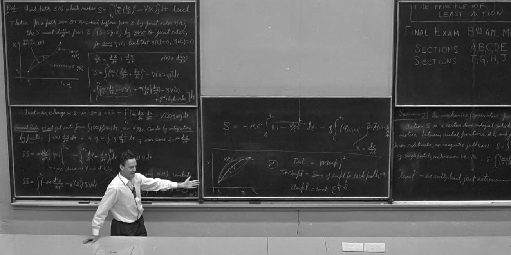

## 19–1 Специальная лекция — почти дословно

«Когда я учился в школе, наш учитель физики, по фамилии Бадер, однажды зазвал меня к себе после урока и сказал: «У тебя вид такой, как будто тебе все страшно надоело; послушай-ка об одной интересной вещи». И он рассказал мне нечто, что мне показалось по-истине захватывающим. Даже сейчас, хотя с тех пор прошла уже уйма времени, это продолжает меня увлекать. И всякий раз, когда я вспоминаю о сказанном, я вновь принимаюсь за работу. И на этот раз, готовясь к лекции, я поймал себя на том, что вновь анализирую все то же самое. И, вместо того чтобы готовиться к лекции, я взялся за решение новой задачи. Предмет, о котором я говорю, — это принцип наименьшего действия.

### Figure Ch19-F1
Caption: Рис. 19–1.
Image: figures/Ch19-F1.jpg
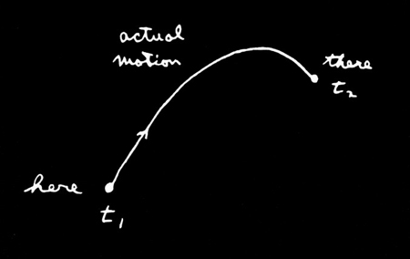

«Вот что сказал мне тогда мой учитель Бадер: „Пусть, к примеру, у тебя имеется частица в поле тяжести; эта частица, выйдя откуда-то, свободно движется куда-то в другую точку. Ты подбросил ее, скажем, кверху, а она взлетела, а потом упала (рис. 19–1). От исходного места к конечному она прошла за какое-то время. Попробуй теперь какое-то другое движение. Пусть для того, чтобы перейти „отсюда сюда“, она двигалась уже не так, как раньше, вот так (рис. 19–2), но все равно очутилась на нужном месте в тот же самый момент времени, что и раньше“. „И вот, — продолжал учитель, — если ты подсчитаешь кинетическую энергию в каждый момент времени на пути частицы, вычтешь из нее потенциальную энергию и проинтегрируешь разность по всему тому времени, когда происходило движение, то увидишь, что число, которое получится, будет больше, чем при истинном движении частицы“.»

### Figure Ch19-F2
Caption: Рис. 19–2.
Image: figures/Ch19-F2.jpg
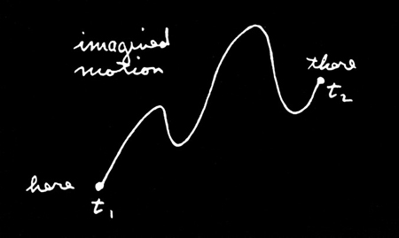

«Иными словами, законы Ньютона можно сформулировать не в виде \(F=ma\) , а вот как: средняя кинетическая энергия минус средняя потенциальная энергия достигает своего самого наименьшего значения на той траектории, по которой предмет двигается в действительности от одного места к другому.

«Попробую пояснить тебе это чуть понятнее. Если взять поле тяготения и обозначить траекторию частицы \(x(t)\) , где \(x\) — высота над землей (обойдемся пока одним измерением; пусть траектория пролегает только вверх и вниз, а не в стороны), то кинетическая энергия будет \(\tfrac{1}{2}m\,(dx/dt)^2\) , а потенциальная энергия в произвольный момент времени будет равна \(mgx\) . Теперь для какого-то момента движения по траектории я беру разность кинетической и потенциальной энергий и интегрирую по всему времени от начала до конца. Пусть в начальный момент времени \(t_1\) движение началось на какой-то высоте, а кончилось в момент \(t_2\) на другой определенной высоте».

### Figure Ch19-F3
Caption: Рис. 19–3.
Image: figures/Ch19-F3.jpg
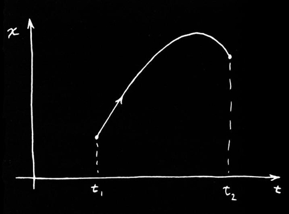

«Тогда интеграл равен
\[
\begin{equation*}
\int_{t_1}^{t_2}\biggl[
\frac{1}{2}m\biggl(\ddt{x}{t}\biggr)^2-mgx\biggr]dt.
\end{equation*}
\]
Истинное движение совершается по некоторой кривой (как функция времени она является параболой) и приводит к какому-то определенному значению интеграла. Но можно представить себе какое-то другое движение: сперва резкий подъем, а потом какие-то причудливые колебания. Можно подсчитать разность кинетической и потенциальной энергий на таком пути... или на любом другом. И самое поразительное — что настоящий путь это тот, по которому этот интеграл наименьший.

### Figure Ch19-F4
Caption: Рис. 19–4.
Image: figures/Ch19-F4.jpg
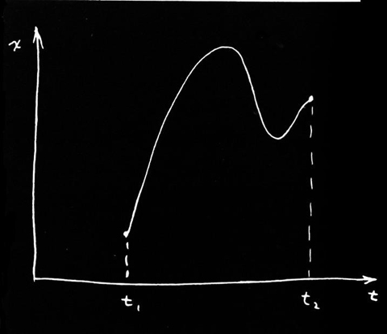

«Давайте попробуем. Сначала предположим, что мы имеем дело со свободной частицей, для которой потенциальная энергия вовсе отсутствует. Тогда правило говорит, что при переходе от одной точки к другой за заданное время интеграл от кинетической энергии должен оказаться наименьшим, а значит, частица обязана двигаться с постоянной скоростью. (Мы знаем, что это правильный ответ — двигаться с постоянной скоростью.) Почему так? Потому что, если бы частица двигалась как-то иначе, ее скорость временами была бы выше, а временами ниже средней. Средняя скорость одинакова для любого случая, поскольку частице необходимо попасть «отсюда» «туда» за заданное время.

«Например, предположим, что ваша задача — добраться из дома до школы за определённое время на автомобиле. Сделать это можно по-разному: можно сперва гнать, как сумасшедший, а в конце притормозить, можно ехать с постоянной скоростью, а можно сначала даже отправиться в обратную сторону, а уж потом повернуть к школе и т. д. Во всех случаях средняя скорость, конечно, должна быть одной и той же — частное от деления пройденного расстояния на время. Но если вы будете двигаться как-то иначе, а не с постоянной скоростью, то иногда вы будете ехать слишком быстро, а иногда чересчур медленно. А средний квадрат чего-то, что отклоняется от среднего, как известно, всегда больше квадрата среднего; значит, интеграл от кинетической энергии всегда будет больше, если вы будете изменять скорость, нежели при движении с постоянной скоростью. Таким образом, мы видим, что интеграл достигает минимума, когда скорость постоянна (при отсутствии сил). Правильный путь показан на рис. 19–5.

### Figure Ch19-F5
Caption: Рис. 19–5.
Image: figures/Ch19-F5.jpg
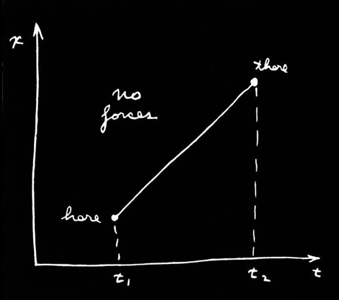

«Теперь, тело, брошенное вверх в гравитационном поле, сначала движется быстрее, а затем замедляется. Это происходит потому, что существует также и потенциальная энергия, и в среднем мы должны получить наименьшую разность между кинетической и потенциальной энергией. Поскольку потенциальная энергия возрастает при движении вверх в пространстве, мы получим меньшую разность, если сможем как можно быстрее подняться туда, где потенциальная энергия велика. Тогда мы сможем вычесть этот высокий потенциал из кинетической энергии и получить меньшее среднее значение. Так что выгоднее такой путь, который идет вверх и поставляет добрый отрицательный кусок за счет потенциальной энергии (рис. 19–6).

### Figure Ch19-F6
Caption: Рис.
Image: figures/Ch19-F6.jpg
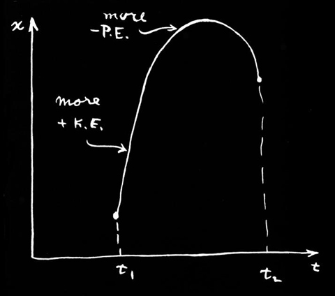

«С другой стороны, нельзя подниматься слишком быстро или слишком высоко, потому что тогда потребуется слишком много кинетической энергии — вам придется двигаться очень быстро, чтобы подняться вверх и снова опуститься за заданное время. Поэтому вы не хотите подниматься слишком высоко, но стремитесь подняться на некоторую высоту. В конечном итоге решение представляет собой своего рода баланс между стремлением получить больше потенциальной энергии при наименьших затратах кинетической энергии — стремлением сделать разность, кинетическую энергию минус потенциальную, как можно меньше».

«Вот и все, что сказал мне учитель, потому что он был очень хорошим учителем и знал, когда пора остановиться. Но я не знаю, когда пора остановиться. Поэтому, вместо того чтобы оставить это как интересное замечание, я собираюсь ужаснуть и привести вас в замешательство сложностями жизни, доказав, что это действительно так. Математическая задача, с которой мы столкнемся, очень сложна и принадлежит к новому типу. У нас есть некоторая величина, которая называется действием, \(S\) . Она представляет собой кинетическую энергию минус потенциальная энергия, проинтегрированные по времени.
\[
\begin{equation*}
\text{Action}=S=\int_{t_1}^{t_2}
(\text{KE}-\text{PE})\,dt.
\end{equation*}
\]
Помните, что и потенциальная, и кинетическая энергия являются функциями времени. Для каждого из различных возможных путей вы получаете разное число для этого действия. Наша математическая задача — выяснить, для какой кривой это число минимально».

«Вы скажете: «О, это же обычное исчисление максимумов и минимумов. Вы вычисляете действие и просто дифференцируете, чтобы найти минимум».

«Но будьте осторожны. Обычно мы имеем дело с функцией некоторой переменной и должны найти значение этой переменной, при котором функция принимает наибольшее или наименьшее значение. Например, у нас есть стержень, нагретый посередине, и тепло распределено по нему. Для каждой точки стержня мы имеем значение температуры, и мы должны найти точку, в которой эта температура максимальна. Однако теперь для каждого пути в пространстве у нас имеется число — это совсем другое дело, — и мы должны найти такой путь в пространстве, для которого это число является минимальным. Это совершенно иная область математики. Это не обычное исчисление. Фактически она называется вариационным исчислением.

«Существует много задач в математике такого рода. Например, окружность обычно определяется как геометрическое место точек, находящихся на постоянном расстоянии от фиксированной точки, но есть и другой способ определения окружности: окружность — это кривая заданной длины, которая охватывает наибольшую площадь. Любая другая кривая при заданном периметре охватывает меньшую площадь, чем окружность. Поэтому, если поставить задачу: найти кривую, которая охватывает наибольшую площадь при заданном периметре, мы получим задачу вариационного исчисления — особого раздела исчисления, с которым вы раньше не сталкивались.

«Итак, мы проводим расчет для пути объекта. Вот каким образом мы собираемся это сделать. Идея состоит в том, что мы представляем себе существование истинного пути и что любая другая кривая, которую мы проведем, — это ложный путь, так что, если мы вычислим действие для ложного пути, мы получим значение, которое больше, чем если бы мы вычислили действие для истинного пути (рис. 19–7).

### Figure Ch19-F7
Caption: Рис. 19–7.
Image: figures/Ch19-F7.jpg
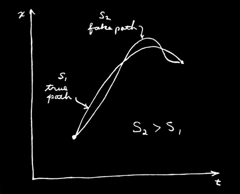

«Задача: найти истинный путь. Где он? Один из способов, конечно, состоит в том, чтобы вычислить действие для миллионов и миллионов путей и посмотреть, какой из них наименьший. Когда вы найдете наименьший, это и будет истинный путь.

«Это возможный способ. Но можно сделать и лучше. Когда мы имеем величину, обладающую минимумом — например, обычную функцию, как температура, — одним из свойств минимума является то, что, если мы отклоняемся от него в первом порядке, изменение значения функции по сравнению с ее минимальным значением будет только второго порядка. В любой другой точке кривой, если мы сместимся на малое расстояние, значение функции изменится также в первом порядке. Но в точке минимума крошечное смещение, в первом приближении, не приводит ни к какому изменению (рис. 19–8).

### Figure Ch19-F8
Caption: Рис.
Image: figures/Ch19-F8.jpg
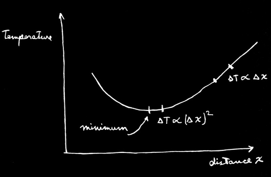

«Это именно то, что мы собираемся использовать для вычисления истинного пути. Если мы имеем истинный путь, то кривая, которая отличается от него лишь незначительно, в первом приближении не приведет к изменению действия. Всякое изменение будет лишь во втором приближении, если у нас действительно имеется минимум.

«Это легко доказать. Если при определенном отклонении кривой изменение первого порядка существует, то изменение действия пропорционально этому отклонению. Предположительно, это изменение увеличивает действие; в противном случае у нас нет минимума. Но если изменение пропорционально отклонению, то при смене знака отклонения действие станет меньше. У нас получилось бы, что в одну сторону действие возрастает, а в другую — убывает. Единственный способ, при котором действительно может быть минимум, состоит в том, что в первом приближении изменение отсутствует, а сами изменения пропорциональны квадрату отклонений от истинного пути».

«Итак, мы работаем следующим образом: назовем \(\underline{x(t)}\) (с подчеркиванием) истинный путь — тот, который мы пытаемся найти. Мы берем некоторый пробный путь \(x(t)\) , который отличается от истинного пути на малую величину, которую мы назовем \(\eta(t)\) (эта от \(t\) ; рис. 19–9).

### Figure Ch19-F9
Caption: Рис. 19–9.
Image: figures/Ch19-F9.jpg
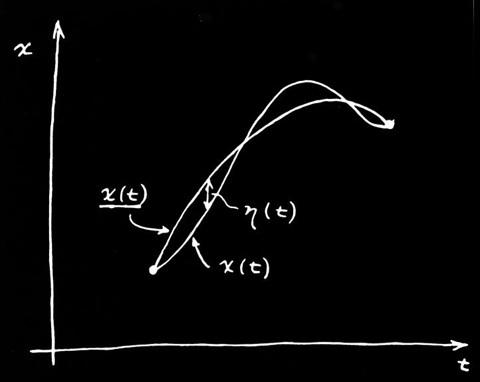

«Идея теперь в том, что если мы вычислим действие \(S\) для пути \(x(t)\) , то разность между этим \(S\) и действием, которое мы вычислили для пути \(\underline{x(t)}\) — для краткости мы можем назвать его \(\underline{S}\) — разность \(\underline{S}\) и \(S\) должна быть равна нулю в первом порядке приближения по малой величине \(\eta\) . Она может отличаться во втором порядке, но в первом порядке эта разность должна равняться нулю».

«И это должно быть верно для любой \(\eta\) . Ну, не совсем так. Метод ничего не значит, пока вы не рассматриваете пути, которые начинаются и заканчиваются в одних и тех же двух точках — каждый путь начинается в определенной точке в момент \(t_1\) и заканчивается в другой определенной точке в момент \(t_2\) , и эти точки и моменты времени остаются фиксированными. Поэтому отклонения в наших \(\eta\) должны быть равны нулю на каждом конце, \(\eta(t_1)=0\) и \(\eta(t_2)=0\) . При этом условии мы полностью определили нашу математическую задачу».

«Если бы вы не знали исчисления, вы могли бы проделать то же самое, чтобы найти минимум обычной функции \(f(x)\) . Вы могли бы обсудить, что произойдет, если взять \(f(x)\) и добавить небольшую величину \(h\) к \(x\) , и доказать, что поправка к \(f(x)\) в первом порядке по \(h\) должна быть равна нулю в точке минимума. Вы подставили бы \(x+h\) вместо \(x\) и разложили бы по степеням до первого порядка по \(h\) … точно так же, как мы собираемся поступить с \(\eta\) .

Тогда идея заключается в том, что мы подставляем \(x(t)=\underline{x(t)}+\eta(t)\) в формулу для действия:
\[
\begin{equation*}
S=\int\biggl[
\frac{m}{2}\biggl(\ddt{x}{t}\biggr)^2-V(x)
\biggr]dt,
\end{equation*}
\]
где я называю потенциальную энергию \(V(x)\) . Производная \(dx/dt\) , конечно, представляет собой производную от \(\underline{x(t)}\) плюс производная от \(\eta(t)\) , поэтому для действия я получаю такое выражение:
\[
\begin{equation*}
S=\int_{t_1}^{t_2}\biggl[
\frac{m}{2}\biggl(
\ddt{\underline{x}}{t}+\ddt{\eta}{t}
\biggr)^2-V(\underline{x}+\eta)
\biggr]dt.
\end{equation*}
\]

«Теперь я должен расписать это более подробно. Для квадратичного члена я получаю
\[
\begin{equation*}
\biggl(\ddt{\underline{x}}{t}\biggr)^2+
2\,\ddt{\underline{x}}{t}\,\ddt{\eta}{t}+
\biggl(\ddt{\eta}{t}\biggr)^2.
\end{equation*}
\]
Но постойте. Я не беспокоюсь о членах выше первого порядка, поэтому я возьму все члены, которые включают \(\eta^2\) и более высокие степени, и помещу их в небольшую коробочку под названием «второй и более высокие порядки». Из этого члена я получаю только второй порядок, но будет еще больше из чего-то другого. Таким образом, часть кинетической энергии равна
\[
\begin{equation*}
\frac{m}{2}\biggl(\ddt{\underline{x}}{t}\biggr)^2+
m\,\ddt{\underline{x}}{t}\,\ddt{\eta}{t}+
(\text{second and higher order}).
\end{equation*}
\]

«Теперь нам нужен потенциал \(V\) в точке \(\underline{x}+\eta\) . Я считаю \(\eta\) малым, поэтому могу записать \(V(x)\) в виде ряда Тейлора. Это приближенно \(V(\underline{x})\) ; в следующем приближении (исходя из обычного определения производных) поправка равна \(\eta\) , умноженному на скорость изменения \(V\) по \(x\) , и так далее:
\[
\begin{equation*}
V(\underline{x}+\eta)=V(\underline{x})+
\eta V'(\underline{x})+\frac{\eta^2}{2}\,V''(\underline{x})+\dotsb
\end{equation*}
\]
Я записал \(V'\) для производной \(V\) по \(x\) , чтобы сократить запись. Член с \(\eta^2\) и все последующие относятся к категории «второго и более высоких порядков», и нам не нужно о них беспокоиться. Собирая все вместе, получаем
\[
\begin{aligned}
S=\int_{t_1}^{t_2}\biggl[
&\frac{m}{2}\biggl(\ddt{\underline{x}}{t}\biggr)^2-V(\underline{x})+
m\,\ddt{\underline{x}}{t}\,\ddt{\eta}{t}\notag\\
&-\eta V'(\underline{x})+(\text{second and higher order})\biggr]dt.\notag
\end{aligned}
\]
Теперь, если мы внимательно посмотрим на это выражение, то увидим, что первые два члена, которые я здесь расположил, соответствуют действию \(\underline{S}\) , которое я вычислил бы для истинного пути \(\underline{x}\) . То, на чем я хочу сосредоточиться, — это изменение \(S\) , разность между \(S\) и \(\underline{S}\) , которую мы получили бы для правильного пути. Эту разность мы запишем как \(\delta S\) , называемую вариацией \(S\) . Отбрасывая члены «второго и более высоких порядков», для \(\delta S\) имеем
\[
\begin{equation*}
\delta S=\int_{t_1}^{t_2}\biggl[
m\,\ddt{\underline{x}}{t}\,\ddt{\eta}{t}-\eta V'(\underline{x})
\biggr]dt.
\end{equation*}
\]

«Теперь проблема состоит в следующем: у нас есть некий интеграл. Я еще не знаю, что такое \(\underline{x}\) , но я знаю, что, чем бы ни было \(\eta\) , этот интеграл должен быть равен нулю. Вы подумаете, что единственный способ добиться этого — потребовать, чтобы множитель при \(\eta\) был равен нулю. А как быть с первым членом, содержащим \(d\eta/dt\) ? В конце концов, если \(\eta\) может быть чем угодно, то и его производная тоже может быть чем угодно, поэтому вы заключаете, что коэффициент при \(d\eta/dt\) тоже должен быть равен нулю. Это не совсем верно. Не совсем верно потому, что существует связь между \(\eta\) и его производной; они не являются абсолютно независимыми, поскольку \(\eta(t)\) должно быть равно нулю как в \(t_1\) , так и в \(t_2\) ».

«Метод решения всех задач в вариационном исчислении всегда использует один и тот же общий принцип. Вы делаете сдвиг той величины, которую хотите варьировать (как мы делали, добавляя \(\eta\) ); вы рассматриваете члены первого порядка; затем вы всегда приводите все к такому виду, чтобы получился интеграл вида «какая-то величина, умноженная на сдвиг \((\eta)\) », но без каких-либо других производных (никаких \(d\eta/dt\) ). Выражение должно быть преобразовано так, чтобы оно всегда представляло собой «нечто», умноженное на \(\eta\) . Вы скоро увидите, насколько это ценно. (Существуют формулы, которые показывают, как сделать это в некоторых случаях без непосредственных вычислений, но они недостаточно общие, чтобы стоило о них беспокоиться; лучший способ — рассчитать все именно так).»

«Как я могу преобразовать выражение в \(d\eta/dt\) так, чтобы в нем появился \(\eta\) ? Я могу сделать это путем интегрирования по частям. Оказывается, что вся хитрость вариационного исчисления заключается в том, чтобы записать вариацию \(S\) , а затем интегрировать по частям так, чтобы производные от \(\eta\) исчезли. Это всегда одно и то же во всех задачах, в которых встречаются производные».

«Вы помните общий принцип интегрирования по частям. Если у вас есть любая функция \(f\) , умноженная на \(d\eta/dt\) , и вы интегрируете ее по \(t\) , то вы записываете производную от \(\eta f\) :
\[
\begin{equation*}
\ddt{}{t}(\eta f)=\eta\,\ddt{f}{t}+f\,\ddt{\eta}{t}.
\end{equation*}
\]
Интеграл, который вы хотите получить, равен последнему члену, поэтому
\[
\begin{equation*}
\int f\,\ddt{\eta}{t}\,dt=\eta f-\int\eta\,\ddt{f}{t}\,dt.
\end{equation*}
\]

«В нашей формуле для \(\delta S\) функция \(f\) равна \(m\) , умноженной на \(d\underline{x}/dt\) ; поэтому я имею следующую формулу для \(\delta S\) :
\[
\begin{align*}
\delta S=\left.m\,\ddt{\underline{x}}{t}\,\eta(t)\right|_{t_1}^{t_2}-
\int_{t_1}^{t_2}\ddt{}{t}\biggl(m\,\ddt{\underline{x}}{t}\biggr)\eta(t)\,&dt\\[1ex]
-\int_{t_1}^{t_2}V'(\underline{x})\,\eta(t)\,&dt.
\end{align*}
\]
Первый член должен быть вычислен на двух пределах: \(t_1\) и \(t_2\) . Затем я должен взять интеграл от остатка после интегрирования по частям. Последний член переносится без изменений».

«Теперь происходит то, что случается всегда — проинтегрированная часть исчезает. (На самом деле, если проинтегрированная часть не исчезает, вы переформулируете принцип, добавляя условия, чтобы гарантировать это!) Мы уже сказали, что \(\eta\) должно быть равно нулю в обоих концах пути, потому что принцип гласит, что действие минимально при условии, что варьируемая кривая начинается и заканчивается в выбранных точках. Условие состоит в том, что \(\eta(t_1)=0\) и \(\eta(t_2)=0\) . Таким образом, проинтегрированный член равен нулю. Мы собираем остальные члены вместе и получаем следующее:
\[
\begin{equation*}
\delta S=\int_{t_1}^{t_2}\biggl[
-m\,\frac{d^2\underline{x}}{dt^2}-V'(\underline{x})
\biggr]\eta(t)\,dt.
\end{equation*}
\]
Вариация \(S\) теперь имеет тот вид, который нам нужен — есть выражение в скобках, скажем \(F\) , всё умноженное на \(\eta(t)\) и проинтегрированное от \(t_1\) до \(t_2\) ».

«У нас есть интеграл от чего-то, умноженного на \(\eta(t)\) , который всегда равен нулю:
\[
\begin{equation*}
\int F(t)\,\eta(t)\,dt=0.
\end{equation*}
\]
У меня есть некоторая функция от \(t\) ; я умножаю ее на \(\eta(t)\) ; и интегрирую от одного конца до другого. И независимо от того, чему равно \(\eta\) , я получаю ноль. Это означает, что функция \(F(t)\) равна нулю. Это очевидно, но, во всяком случае, я покажу вам один вид доказательства.

### Figure Ch19-F10
Caption: Рис. 19–10.
Image: figures/Ch19-F10.jpg
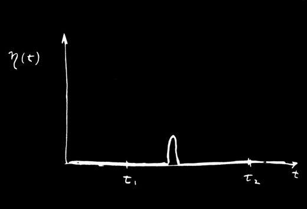

«Предположим, что для \(\eta(t)\) я взял нечто, равное нулю для всех \(t\) , за исключением узкой области вблизи одного конкретного значения. Оно остается нулевым, пока не достигнет этого \(t\) , затем на мгновение подскакивает и тут же возвращается обратно (рис. 19–10). Когда мы вычисляем интеграл от этого \(\eta\) , умноженного на любую функцию \(F\) , единственное место, где получается результат, отличный от нуля, — это там, где \(\eta(t)\) совершало скачок, и тогда вы получаете значение \(F\) в этом месте, умноженное на интеграл по области скачка. Интеграл по одному лишь скачку не равен нулю, но при умножении на \(F\) он должен обращаться в нуль; следовательно, функция \(F\) должна быть равна нулю там, где был скачок. Но скачок был в любом месте, куда бы я его ни поместил, поэтому \(F\) должно быть равно нулю всюду».

Мы видим, что если наш интеграл равен нулю для любого \(\eta\) , то коэффициент при \(\eta\) должен быть равен нулю. Интеграл действия будет иметь минимум для того пути, который удовлетворяет этому сложному дифференциальному уравнению:
\[
\begin{equation*}
\biggl[-m\,\frac{d^2\underline{x}}{dt^2}-V'(\underline{x})\biggr]=0.
\end{equation*}
\]
В действительности оно не такое уж сложное; вы уже встречали его ранее. Это просто \(F=ma\) . Первый член — это масса, умноженная на ускорение, а второй — производная потенциальной энергии, то есть сила.

«Итак, по крайней мере для консервативной системы мы показали, что принцип наименьшего действия дает правильный ответ; он гласит, что путь, вдоль которого действие минимально, — это и есть путь, удовлетворяющий закону Ньютона».

«Одно замечание: я не доказывал, что это минимум, — может быть, это максимум. На самом деле, это вовсе не обязательно должен быть минимум. Все совершенно аналогично тому, что мы обнаружили для «принципа наименьшего времени», который обсуждали в оптике. Там мы тоже сначала говорили о «наименьшем» времени. Однако оказалось, что бывают ситуации, когда это не наименьшее время. Фундаментальный принцип состоял в том, что для любого изменения первого порядка, отличного от оптического пути, изменение времени равно нулю; здесь та же история. На самом деле под «наименьшим» мы подразумеваем, что изменение первого порядка величины \(S\) при изменении пути равно нулю. Это не обязательно «минимум»».

«Теперь я хочу сделать несколько обобщений. Во-первых, все это можно проделать в трех измерениях. Вместо одного \(x\) у нас будут \(x\) , \(y\) и \(z\) как функции \(t\) ; действие становится более сложным. Для движения в трехмерном пространстве нужно использовать полную кинетическую энергию — \((m/2)\) , умноженную на квадрат полной скорости. То есть,
\[
\begin{equation*}
\text{KE}=\frac{m}{2}\biggl[
\biggl(\ddt{x}{t}\biggr)^2\!\!+\biggl(\ddt{y}{t}\biggr)^2\!\!+
\biggl(\ddt{z}{t}\biggr)^2\,\biggr].
\end{equation*}
\]
. Кроме того, потенциальная энергия является функцией \(x\) , \(y\) и \(z\) . А как быть с путем? Путь — это некоторая общая кривая в пространстве, которую не так легко начертить, но идея остается той же. А как насчет \(\eta\) ? Что ж, \(\eta\) может иметь три компоненты. Вы можете смещать пути в направлении \(x\) , или \(y\) , или \(z\) — или можно смещать сразу по всем трем направлениям. Таким образом, \(\eta\) будет вектором. Однако это не очень сильно усложняет дело. Поскольку только вариация первого порядка должна быть равна нулю, мы можем провести вычисления с помощью трех последовательных смещений. Мы можем сместить \(\eta\) только в направлении \(x\) и сказать, что соответствующий коэффициент должен быть равен нулю. Мы получим одно уравнение. Затем мы смещаем его в направлении \(y\) и получаем другое. И в направлении \(z\) — еще одно. Или, конечно, в любом порядке, каком захотите. В любом случае вы получаете три уравнения. И, разумеется, закон Ньютона — это на самом деле три уравнения в трех измерениях, по одному для каждой компоненты. Думаю, вы практически видите, что это обязано работать, но мы оставим вам возможность самостоятельно показать, что это будет работать для трех измерений. Кстати, вы можете использовать любую систему координат, полярную или какую-либо еще, и сразу получить уравнения Ньютона, соответствующие этой системе, наблюдая, что происходит при смещении \(\eta\) по радиусу, углу и т. д.»

«Подобным образом этот метод можно обобщить на любое число частиц. Если у вас есть, скажем, две частицы, между которыми действует сила, так что существует взаимная потенциальная энергия, то вы просто складываете кинетическую энергию обеих частиц и берете потенциальную энергию их взаимного взаимодействия. И что же вы варьируете? Вы варьируете пути обеих частиц. Тогда для двух частиц, движущихся в трехмерном пространстве, получается шесть уравнений. Вы можете варьировать положение частицы \(1\) в направлении \(x\) , в направлении \(y\) и в направлении \(z\) , и аналогично для частицы \(2\) ; таким образом, получается шесть уравнений. И так оно и должно быть. Существуют три уравнения, которые определяют ускорение частицы \(1\) через действующую на нее силу, и три — для ускорения частицы \(2\) , исходя из действующей на нее силы. Вы проделываете те же самые операции и получаете закон Ньютона в трех измерениях для любого количества частиц.

«Я говорил, что мы получаем закон Ньютона. Это не совсем так, поскольку закон Ньютона включает неконсервативные силы, например трение. Ньютон сказал, что \(ma\) равно \(F\) . Однако принцип наименьшего действия применим только к консервативным системам, где все силы могут быть получены из потенциальной функции. Вы, однако, знаете, что на микроскопическом уровне — на самом глубоком уровне физики — неконсервативных сил не существует. Неконсервативные силы, такие как трение, возникают лишь потому, что мы пренебрегаем микроскопическими сложностями — частиц слишком много, чтобы их можно было анализировать. Но фундаментальные законы могут быть представлены в виде принципа наименьшего действия.

«Позвольте мне обобщить еще дальше. Предположим, мы зададимся вопросом, что произойдет, если частица движется релятивистски. Мы не получили правильного релятивистского уравнения движения; \(F=ma\) верно только в нерелятивистском случае. Вопрос в следующем: существует ли соответствующий принцип наименьшего действия для релятивистского случая? Существует. Формула в случае теории относительности выглядит следующим образом:
\[
\begin{align*}
S=-m_0c^2&\int_{t_1}^{t_2}\sqrt{1-v^2/c^2}\,dt\\[1.25ex]
-q&\int_{t_1}^{t_2}[\phi(x,y,z,t)-\FLPv\cdot
\FLPA(x,y,z,t)]\,dt.
\end{align*}
\]
Первая часть интеграла действия представляет собой массу покоя \(m_0\) , умноженную на \(c^2\) и на интеграл от функции скорости \(\sqrt{1-v^2/c^2}\) . Далее, вместо потенциальной энергии у нас стоит интеграл от скалярного потенциала \(\phi\) и от \(\FLPv\) , умноженного на векторный потенциал \(\FLPA\) . Конечно, при этом мы учитываем только электромагнитные силы. Все электрические и магнитные поля задаются через \(\phi\) и \(\FLPA\) . Эта функция действия дает законченную теорию релятивистского движения одиночной частицы в электромагнитном поле».

«Конечно, везде, где я написал \(\FLPv\) , вы понимаете, что прежде чем пытаться что-либо вычислить, вы должны подставить \(dx/dt\) вместо \(v_x\) и так далее для других компонент. Также вы подставляете точку вдоль пути в момент времени \(t\) , \(x(t)\) , \(y(t)\) , \(z(t)\) там, где я просто написал \(x\) , \(y\) , \(z\) . Правильно будет сказать, что только после того, как вы произвели эти замены для \(\FLPv\) , у вас получается формула действия для релятивистской частицы. Я предоставлю более изобретательным из вас задачу доказать, что эта формула действия действительно дает правильные уравнения движения для теории относительности. Позвольте предложить вам сделать это сначала без \(\FLPA\) , то есть при отсутствии магнитного поля. Тогда вы должны получить компоненты уравнения движения \(d\FLPp/dt=-q\,\FLPgrad{\phi}\) , где, как вы помните, \(\FLPp=m_0\FLPv/\sqrt{1-v^2/c^2}\) ».

«Включить сюда также случай с векторным потенциалом гораздо сложнее. Вариации становятся гораздо запутаннее. Но в конечном итоге выражение для силы действительно получается равным \(q(\FLPE+\FLPv\times\FLPB)\) , как и должно быть. Но я оставлю это вам для самостоятельных упражнений».

«Я хотел бы подчеркнуть, что в общем случае, например в релятивистской формуле, подынтегральное выражение действия уже не имеет вида кинетической энергии минус потенциальная энергия. Это верно лишь в нерелятивистском приближении. Например, выражение \(m_0c^2\sqrt{1-v^2/c^2}\) — это не то, что мы называли кинетической энергией. Вопрос о том, каким должно быть действие для любого конкретного случая, должен решаться путем проб и ошибок. Это точно такая же задача, как и определение самих законов движения. Вам просто нужно повозиться с известными вам уравнениями и посмотреть, можно ли привести их к форме принципа наименьшего действия».

«Еще один момент относительно терминологии. Функция, которая интегрируется по времени для получения действия \(S\) , называется лагранжианом \(\Lagrangian\) ; она зависит только от скоростей и координат частиц. Поэтому принцип наименьшего действия также записывается в виде
\[
\begin{equation*}
S=\int_{t_1}^{t_2}\Lagrangian(x_i,v_i)\,dt,
\end{equation*}
\]
, где под \(x_i\) и \(v_i\) понимаются все компоненты координат и скоростей. Таким образом, если вы слышите, что кто-то говорит о «лагранжиане», вы знаете, что речь идет о функции, используемой для нахождения \(S\) . Для релятивистского движения в электромагнитном поле
\[
\begin{equation*}
\Lagrangian=-m_0c^2\sqrt{1-v^2/c^2}-q(\phi-\FLPv\cdot\FLPA).
\end{equation*}
\]

«Должен также сказать, что \(S\) не совсем точно называть «действием» с точки зрения наиболее дотошных и педантичных людей. Её называют «первой главной функцией Гамильтона». Мне не хотелось бы читать лекцию о «принципе наименьшей первой главной функции Гамильтона». Поэтому я называю её «действием». К тому же всё больше людей называют её действием. Видите ли, исторически действием называли нечто другое, не столь полезное, но я считаю более разумным перейти к новому определению. Так что теперь и вы будете называть эту новую функцию действинием, и вскоре все будут называть её этим простым именем».

Теперь я хочу сказать несколько слов на эту тему, что будет похоже на обсуждение принципа наименьшего времени. Существует значительная разница между характером закона, который утверждает, что некоторый интеграл от одной точки до другой принимает минимальное значение — то есть говорит нечто обо всем пути целиком, — и закона, который говорит, что по мере движения частицы на нее действует сила, вызывающая ускорение. Второй способ описывает, как вы продвигаетесь шаг за шагом вдоль пути, а первый представляет собой общее утверждение о всем пути. В случае со светом мы говорили о связи между этими двумя подходами. Сейчас я хотел бы объяснить, почему это правда, что существуют дифференциальные законы, когда есть принцип наименьшего действия такого рода. Причина следующая: рассмотрим реальный путь в пространстве и времени. Как и прежде, возьмем только одно измерение, чтобы мы могли построить график \(x\) как функции \(t\) . Вдоль истинного пути \(S\) имеет минимум. Допустим, у нас есть истинный путь, который проходит через некоторую точку \(a\) в пространстве и времени, а также через другую близлежащую точку \(b\) (рис. 19–11). Теперь, если весь интеграл от \(t_1\) до \(t_2\) является минимумом, то необходимо, чтобы и интеграл вдоль маленького участка от \(a\) до \(b\) также был минимумом. Не может быть так, чтобы часть от \(a\) до \(b\) была чуть больше. В противном случае вы могли бы просто поработать с этим кусочком пути и сделать весь интеграл немного меньше.

### Figure Ch19-F11
Caption: Рис. 19–11.
Image: figures/Ch19-F11.jpg
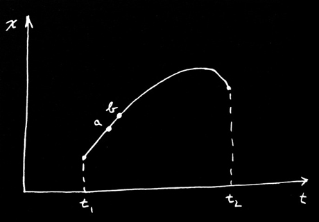

«Таким образом, любой малый участок пути также должен отвечать условию минимума. Это верно для участка любой длины. Следовательно, принцип, согласно которому весь путь дает минимум, можно сформулировать и так: бесконечно малый участок пути также должен представлять собой кривую, для которой действие минимально. Если мы возьмем достаточно короткий участок пути между двумя очень близкими точками \(a\) и \(b\) , то изменение потенциала вдали от этого участка не будет иметь значения, поскольку на всем малом отрезке пути мы остаемся почти в одной и той же точке. Единственное, что нужно рассмотреть, — это изменение потенциала в первом порядке малости. Ответ может зависеть только от производной потенциала, а не от потенциала во всем пространстве. Таким образом, утверждение о глобальном свойстве всего пути превращается в утверждение о том, что происходит на малом участке пути, — в дифференциальное утверждение. И это дифференциальное утверждение включает в себя только производные потенциала, то есть силу в данной точке. Таково качественное объяснение связи между глобальным законом и дифференциальным законом».

«В случае со светом мы также обсуждали вопрос: как частица находит правильный путь? С дифференциальной точки зрения это легко понять. В каждый момент времени она получает ускорение и знает только то, что должна делать в данный миг. Но все ваши представления о причине и следствии приходят в замешательство, когда вы говорите, что частица решает выбрать путь, который даст минимальное действие. «Ощупывает» ли она соседние пути, чтобы выяснить, больше у них действие или меньше? В случае со светом, когда мы преграждали путь так, что фотоны не могли проверить все траектории, мы обнаружили, что они не могли «понять», в какую сторону идти, и мы наблюдали явление дифракции».

Верно ли то же самое в механике? Правда ли, что частица не просто «выбирает правильную траекторию», а «рассматривает» все остальные возможные траектории? И если мы преградим ей путь, не позволяя «рассматривать» их, получим ли мы аналог дифракции? Чудо заключается в том, что именно так всё и происходит. Именно об этом говорят законы квантовой механики. Поэтому наш принцип наименьшего действия сформулирован неполно. Дело не в том, что частица выбирает путь наименьшего действия, а в том, что она «ощупывает» все пути в окрестности и выбирает тот, у которого действие наименьшее, методом, аналогичным тому, каким свет выбирает кратчайшее время. Вы помните, что свет выбирает путь кратчайшего времени следующим образом: если он движется по пути, требующему иного времени, он приходит с другой фазой. Полная амплитуда в некоторой точке — это сумма вкладов амплитуд от всех возможных способов, которыми свет может туда прийти. Все пути, дающие сильно отличающиеся фазы, при сложении дают нуль. Но если можно найти целую последовательность путей, фазы которых почти одинаковы, то малые вклады сложатся, и вы получите заметную полную амплитуду прибытия. Важным становится тот путь, в окрестности которого есть много других путей, дающих ту же фазу.

«В квантовой механике все обстоит точно так же. Полная квантовая механика (для нерелятивистского случая и без учета спина электрона) работает следующим образом: вероятность того, что частица, начав движение в точке \(1\) в момент времени \(t_1\) , прибудет в точку \(2\) в момент времени \(t_2\) , равна квадрату модуля амплитуды вероятности. Полная амплитуда может быть записана как сумма амплитуд для каждого возможного пути — для каждого способа достижения цели. Для каждой траектории \(x(t)\) — для каждой возможной воображаемой траектории — мы должны вычислить амплитуду. Затем мы складываем их все вместе. Что мы берем в качестве амплитуды для каждого пути? Наш интеграл действия подсказывает нам, какова должна быть амплитуда для одного пути. Амплитуда пропорциональна некоторой константе, умноженной на \(e^{iS/\hbar}\) , где \(S\) — действие для данного пути. Иными словами, если мы представим фазу амплитуды комплексным числом, то фазовый угол будет равен \(S/\hbar\) . Действие \(S\) имеет размерность энергии, умноженной на время, и постоянная Планка \(\hbar\) имеет ту же размерность. Это и есть та константа, которая определяет, когда квантовая механика становится важной».

«Вот как это работает: предположим, что для всех путей \(S\) очень велико по сравнению с \(\hbar\) . Один путь дает определенную амплитуду. Для соседнего пути фаза будет совершенно иной, потому что при огромном \(S\) даже небольшое изменение \(S\) означает совершенно другую фазу — из-за того, что \(\hbar\) столь мала. Поэтому соседние пути в сумме обычно взаимно уничтожаются, за исключением одной области, а именно той, где данный путь и соседний с ним дают в первом приближении одну и ту же фазу (точнее говоря, одно и то же действие в пределах \(\hbar\) ). Только эти пути будут иметь значение. Таким образом, в предельном случае, когда постоянная Планка \(\hbar\) стремится к нулю, правильные квантовомеханические законы можно кратко сформулировать так: «Забудьте обо всех этих амплитудах вероятности. Частица движется по особому пути, а именно по тому, для которого \(S\) не меняется в первом приближении». Такова связь между принципом наименьшего действия и квантовой механикой. Тот факт, что квантовую механику можно сформулировать таким образом, был открыт в 1942 году студентом того же учителя, Бэйдера, о котором я говорил в начале этой лекции. [Первоначально квантовая механика была сформулирована путем задания дифференциального уравнения для амплитуды (Шрёдингер), а также с помощью другой матричной математики (Гейзенберг)].

«Теперь я хочу поговорить о других принципах минимума в физике. Их существует очень много, и все они весьма интересны. Я не буду пытаться перечислить их все сейчас, а опишу лишь один. В дальнейшем, когда мы будем рассматривать физическое явление, для которого существует красивый принцип минимума, я буду о нем рассказывать. Сейчас же я хочу показать, что электростатику можно описать не только с помощью дифференциального уравнения для поля, но и сказав, что некоторый интеграл достигает максимума или минимума. Сначала возьмем случай, когда плотность заряда известна всюду, и задача состоит в том, чтобы найти потенциал \(\phi\) во всем пространстве. Вы знаете, что ответом должно быть
\[
\begin{equation*}
\nabla^2\phi=-\rho/\epsO.
\end{equation*}
\]
. Однако тот же факт можно сформулировать и иначе: вычислим интеграл \(U\stared\) , где
\[
\begin{equation*}
U\stared=\frac{\epsO}{2}\int(\FLPgrad{\phi})^2\,dV-
\int\rho\phi\,dV,
\end{equation*}
\]
представляет собой объемный интеграл, который берется по всему пространству. Эта величина достигает минимума при правильном распределении потенциала \(\phi(x,y,z)\) ».

«Мы можем показать, что два утверждения об электростатике эквивалентны. Предположим, что мы выбрали любую функцию \(\phi\) . Мы хотим показать, что если мы возьмем в качестве \(\phi\) правильный потенциал \(\underline{\phi}\) плюс небольшое отклонение \(f\) , то в первом приближении изменение \(U\stared\) будет равно нулю. Итак, мы пишем
\[
\begin{equation*}
\phi=\underline{\phi}+f.
\end{equation*}
\]
 \(\underline{\phi}\) — это то, что мы ищем, но мы варьируем эту функцию, чтобы найти, какой она должна быть, дабы изменение \(U\stared\) в первом порядке было равно нулю. Для первой части \(U\stared\) нам нужно
\[
\begin{equation*}
(\FLPgrad{\phi})^2=(\FLPgrad{\underline{\phi}})^2+
2\,\FLPgrad{\underline{\phi}}\cdot\FLPgrad{f}+
(\FLPgrad{f})^2.
\end{equation*}
\]
. Единственный член первого порядка, который будет варьироваться, — это
\[
\begin{equation*}
2\,\FLPgrad{\underline{\phi}}\cdot\FLPgrad{f}.
\end{equation*}
\]
. Во втором члене величины \(U\stared\) подынтегральное выражение представляет собой
\[
\begin{equation*}
\rho\phi=\rho\underline{\phi}+\rho f,
\end{equation*}
\]
, варьируемая часть которого равна \(\rho f\) . Таким образом, сохраняя только варьируемые части, мы получаем интеграл
\[
\begin{equation*}
\Delta U\stared=\int(\epsO\FLPgrad{\underline{\phi}}\cdot\FLPgrad{f}-
\rho f)\,dV.
\end{equation*}
\]
»

«Теперь, следуя старой общей схеме, мы должны избавиться от всех производных \(f\) . Посмотрим, что представляют собой эти производные. Скалярное произведение равно
\[
\begin{equation*}
\ddp{\underline{\phi}}{x}\,\ddp{f}{x}+
\ddp{\underline{\phi}}{y}\,\ddp{f}{y}+
\ddp{\underline{\phi}}{z}\,\ddp{f}{z},
\end{equation*}
\]
, и его нам нужно проинтегрировать по \(x\) , по \(y\) и по \(z\) . А вот и прием: чтобы избавиться от \(\ddpl{f}{x}\) , мы интегрируем по частям по \(x\) . Это перенесет производную на \(\underline{\phi}\) . Это та же самая общая идея, которую мы использовали, чтобы избавиться от производных по \(t\) . Мы воспользуемся равенством
\[
\begin{equation*}
\int\ddp{\underline{\phi}}{x}\,\ddp{f}{x}\,dx=
f\,\ddp{\underline{\phi}}{x}-
\int f\,\frac{\partial^2\underline{\phi}}{\partial x^2}\,dx.
\end{equation*}
\]
Интегрируемый член равен нулю, так как мы должны сделать \(f\) равным нулю на бесконечности. (Это соответствует тому, что \(\eta\) равно нулю при \(t_1\) и \(t_2\) . Таким образом, наш принцип должен быть сформулирован более точно: \(U\stared\) меньше для истинного \(\phi\) , чем для любого другого \(\phi(x,y,z)\) , имеющего те же значения на бесконечности.) Затем мы проделываем то же самое для \(y\) и \(z\) . Итак, наш интеграл \(\Delta U\stared\) равен
\[
\begin{equation*}
\Delta U\stared=\int(-\epsO\nabla^2\underline{\phi}-\rho)f\,dV.
\end{equation*}
\]
Чтобы это варьирование было равно нулю при любом \(f\) , независимо ни от чего, коэффициент при \(f\) должен быть равен нулю, и, следовательно,
\[
\begin{equation*}
\nabla^2\underline{\phi}=-\rho/\epsO.
\end{equation*}
\]
Мы получили наше старое уравнение. Значит, наше «минимума» утверждение верно».

«Мы можем обобщить наше утверждение, если проведем алгебраические преобразования несколько иным способом. Вернемся назад и проведем интегрирование по частям, не переходя к компонентам. Начнем с рассмотрения следующего равенства:
\[
\begin{equation*}
\FLPdiv{(f\,\FLPgrad{\underline{\phi}})}=
\FLPgrad{f}\cdot\FLPgrad{\underline{\phi}}+f\,\nabla^2\underline{\phi}.
\end{equation*}
\]
Если я распишу дифференциал левой части, то смогу показать, что он просто равен правой части. Теперь мы можем использовать это уравнение для интегрирования по частям. В нашем интеграле \(\Delta U\stared\) мы заменим \(\FLPgrad{\underline{\phi}}\cdot\FLPgrad{f}\) на \(\FLPdiv{(f\,\FLPgrad{\underline{\phi}})}-f\,\nabla^2\underline{\phi}\) , который интегрируется по объему. Дивергентный член, проинтегрированный по объему, можно заменить поверхностным интегралом:
\[
\begin{equation*}
\int\FLPdiv{(f\,\FLPgrad{\underline{\phi}})}\,dV=
\int f\,\FLPgrad{\underline{\phi}}\cdot\FLPn\,da.
\end{equation*}
\]
Поскольку мы интегрируем по всему пространству, поверхность, по которой ведется интегрирование, находится на бесконечности. Там \(f\) равно нулю, и мы получаем тот же ответ, что и раньше.

«Только теперь мы видим, как решать задачу, когда мы не знаем, где расположены все заряды. Предположим, что у нас есть проводники с распределенными по ним каким-то образом зарядами. Мы все равно можем использовать наш принцип минимума, если потенциалы всех проводников фиксированы. Мы вычисляем интеграл \(U\stared\) только в пространстве вне всех проводников. Тогда, поскольку мы не можем варьировать \(\underline{\phi}\) на проводнике, \(f\) равно нулю на всех этих поверхностях, и поверхностный интеграл
\[
\begin{equation*}
\int f\,\FLPgrad{\underline{\phi}}\cdot\FLPn\,da
\end{equation*}
\]
по-прежнему равен нулю. Оставшийся объемный интеграл
\[
\begin{equation*}
\Delta U\stared=\int(-\epsO\,\nabla^2\underline{\phi}-\rho)f\,dV
\end{equation*}
\]
вычисляется только в промежутках между проводниками. Конечно, мы снова получаем уравнение Пуассона:
\[
\begin{equation*}
\nabla^2\underline{\phi}=-\rho/\epsO.
\end{equation*}
\]
. Таким образом, мы показали, что наш исходный интеграл \(U\stared\) также достигает минимума, если мы вычисляем его по пространству вне проводников, находящихся при фиксированных потенциалах (то есть так, что любая пробная функция \(\phi(x,y,z)\) должна быть равна заданному потенциалу проводников, когда \((x,y,z)\) — это точка на поверхности проводника)».

«Есть интересный случай, когда заряды находятся только на проводниках. Тогда
\[
\begin{equation*}
U\stared=\frac{\epsO}{2}\int(\FLPgrad{\phi})^2\,dV.
\end{equation*}
\]
. Наш принцип минимума гласит, что в том случае, когда имеются проводники с заданными потенциалами, потенциал между ними устанавливается так, чтобы интеграл \(U\stared\) был минимальным. Что это за интеграл? Член \(\FLPgrad{\phi}\) представляет собой электрическое поле, поэтому интеграл является электростатической энергией. Истинное поле — это то из всех полей, являющихся градиентом потенциала, которое обладает минимальной полной энергией».

### Figure Ch19-F12
Caption: Рис. 19–12.
Image: figures/Ch19-F12.jpg
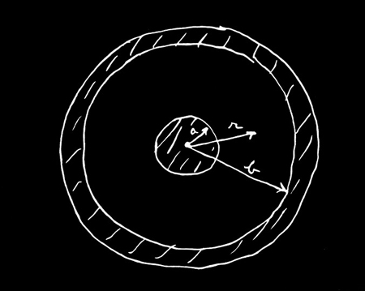

«Я хотел бы воспользоваться этим результатом для проведения конкретного расчета, чтобы показать вам, что эти вещи действительно весьма практичны. Предположим, я возьму два проводника в форме цилиндрического конденсатора (рис. 19–12). У внутреннего проводника потенциал равен \(V\) , а у внешнего — нулю. Пусть радиус внутреннего проводника будет равен \(a\) , а внешнего — \(b\) . Теперь мы можем предположить любое распределение потенциалов между ними. Если мы возьмем правильное \(\underline{\phi}\) и вычислим \(\epsO/2\int(\FLPgrad{\underline{\phi}})^2\,dV\) , то это должна быть энергия системы \(\tfrac{1}{2}CV^2\) . Таким образом, мы можем также вычислить \(C\) с помощью нашего принципа. Но если мы возьмем неверное распределение потенциалов и попытаемся вычислить емкость \(C\) этим методом, мы получим завышенное значение емкости, поскольку \(V\) задано. Любой предполагаемый потенциал \(\phi\) , который не является в точности верным, даст ложное значение \(C\) , которое будет больше правильного. Но если мой неверный \(\phi\) является хотя бы грубым приближением, то \(C\) будет хорошим приближением, поскольку ошибка в \(C\) является величиной второго порядка малости по отношению к ошибке в \(\phi\) ».

«Предположим, я не знаю емкости цилиндрического конденсатора. Я могу воспользоваться этим принципом, чтобы найти ее. Я просто подбираю пробную функцию потенциала \(\phi\) до тех пор, пока не получу наименьшее значение \(C\) . Предположим, например, я выберу потенциал, соответствующий постоянному полю. (Вы, конечно, знаете, что на самом деле поле здесь не постоянно; оно меняется как \(1/r\) .) Постоянное поле означает потенциал, изменяющийся линейно с расстоянием. Чтобы удовлетворить граничным условиям на двух проводниках, он должен иметь вид
\[
\begin{equation*}
\phi=V\biggl(1-\frac{r-a}{b-a}\biggr).
\end{equation*}
\]
Эта функция равна \(V\) при \(r=a\) , нулю при \(r=b\) , а между ними имеет постоянный наклон, равный \(-V/(b-a)\) . Итак, чтобы найти интеграл \(U\stared\) , нужно умножить квадрат этого градиента на \(\epsO/2\) и проинтегрировать по всему объему. Проведем этот расчет для цилиндра единичной длины. Элемент объема при радиусе \(r\) равен \(2\pi
r\,dr\) . Проводя интегрирование, я нахожу, что моя первая проба дает такую емкость:
\[
\begin{equation*}
\frac{1}{2}\,CV^2(\text{first try})=\frac{\epsO}{2}
\int_a^b\frac{V^2}{(b-a)^2}\,2\pi r\,dr.
\end{equation*}
\]
Интеграл здесь просто равен
\[
\begin{equation*}
\pi V^2\biggl(\frac{b+a}{b-a}\biggr).
\end{equation*}
\]
Так я получаю формулу для емкости, которая не является точной, но дает некоторое приближение:
\[
\begin{equation*}
\frac{C}{2\pi\epsO}=\frac{b+a}{2(b-a)}.
\end{equation*}
\]
Конечно, она отличается от правильного ответа \(C=2\pi\epsO/\ln(b/a)\) , но в общем-то она не так уж плоха. Давайте сравним ее с правильным ответом для нескольких значений \(b/a\) . Вычисленные мною числа приведены в таблице 19–1. Даже когда \(b/a\) достигает \(2\) — а это приводит уже к довольно большим отличиям поля от линейно изменяющегося, — я все еще получаю довольно сносное приближение. Ответ, конечно, как и ожидалось, чуть завышен. Все выглядит уже гораздо хуже, если у вас тонкая проволочка внутри большого цилиндра. Тогда поле изменяется очень сильно, и если вы заменяете его постоянным, то ничего хорошего из этого не выходит. При \(b/a=100\) мы завышаем ответ почти вдвое. Для малых \(b/a\) положение выглядит намного лучше. В противоположном пределе, когда проводники расположены не очень далеко друг от друга — скажем, \(b/a=1.1\) — постоянное поле оказывается весьма хорошим приближением, и мы получаем значение \(C\) с точностью до десятых процента.

### Table Ch19-T1

Caption: Ch19-T1

- \(\displaystyle\frac{b}{a}\) | \(\displaystyle\frac{C_{\text{true}}}{2\pi\epsO}\) | \(\displaystyle\frac{C (\text{first approx.})}{2\pi\epsO}\)
- \(\phantom{00}2\phantom{.0}\) | \(\phantom{0}1.4427\phantom{00}\) | \(\phantom{0}1.500\phantom{000}\)
- \(\phantom{00}4\phantom{.0}\) | \(\phantom{0}0.721\phantom{000}\) | \(\phantom{0}0.833\phantom{000}\)
- \(\phantom{0}10\phantom{.0}\) | \(\phantom{0}0.434\phantom{000}\) | \(\phantom{0}0.611\phantom{000}\)
- \(100\phantom{.0}\) | \(\phantom{0}0.217\phantom{000}\) | \(\phantom{0}0.51\phantom{0000}\)
- \(\phantom{00}1.5\) | \(\phantom{0}2.4663\phantom{00}\) | \(\phantom{0}2.50\phantom{0000}\)
- \(\phantom{00}1.1\) | \(10.492059\) | \(10.500000\)

«А теперь я расскажу вам, как усовершенствовать этот расчет. (Ответ для цилиндра вам, разумеется, известен, но тот же способ годится и для некоторых других необычных форм конденсаторов, для которых правильный ответ вам может быть и не известен.) Следующим шагом будет подыскание лучшего приближения для неизвестного нам истинного потенциала \(\phi\) . Скажем, можно испытать константу плюс экспоненту \(\phi\) и т. д. Но как вы узнаете, что у вас получилось лучшее приближение, если вы не знаете истинного \(\phi\) ? Ответ: Подсчитайте \(C\) ; чем оно ниже, тем к истине ближе. Давайте проверим эту идею. Пусть потенциал будет не линейным, а, скажем, квадратичным по \(C\) — так что электрическое поле будет не постоянным, а линейным. Самая общая квадратичная форма, которая обращается в \(r\) при \(\phi=0\) и в \(r=b\) при \(\phi=V\) , такова: \(r=a\) где
\[
\begin{equation*}
\phi=V\biggl[1+\alpha\biggl(\frac{r-a}{b-a}\biggr)-
(1+\alpha)\biggl(\frac{r-a}{b-a}\biggr)^2
\biggr],
\end{equation*}
\]
— постоянное число. Эта формула чуть сложнее прежней. В нее входит и квадратичный член, и линейный. Из нее очень легко получить поле. Оно равно просто \(\alpha\) . Теперь это нужно возвести в квадрат и проинтегрировать по объему. Но подождите минутку. Что же мне принять за
\[
\begin{equation*}
E=-\ddt{\phi}{r}=-\frac{\alpha V}{b-a}+
2(1+\alpha)\,\frac{(r-a)V}{(b-a)^2}.
\end{equation*}
\]
? За \(\alpha\) я могу принять параболу, но какую? Вот что я сделаю: подсчитаю емкость при произвольном \(\phi\) . Я получу \(\alpha\) . Это выглядит несколько запутанно, но так уж выходит после интегрирования квадрата поля. Теперь я могу выбирать себе
\[
\begin{equation*}
\frac{C}{2\pi\epsO}=\frac{a}{b-a}
\biggl[\frac{b}{a}\biggl(\frac{\alpha^2}{6}+
\frac{2\alpha}{3}+1\biggr)+
\frac{1}{6}\,\alpha^2+\frac{1}{3}\biggr].
\end{equation*}
\]
. Я знаю, что истина лежит ниже, чем все, что я собираюсь вычислить, поэтому что бы я ни поставил вместо \(\alpha\) , ответ все равно получится слишком большим. Но если я продолжу свою игру с \(\alpha\) и постараюсь добиться наинизшего возможного значения, то это наинизшее значение будет ближе к правде, чем любое другое значение. Следовательно, мне теперь надо подобрать \(\alpha\) , которое дает минимальное значение для \(\alpha\) . Обращаясь к обычному дифференциальному исчислению, я убеждаюсь, что минимум \(C\) будет тогда, когда \(C\) . Подставляя это значение в формулу, я получаю для наименьшей емкости \(\alpha=-2b/(b+a)\)
\[
\begin{equation*}
\frac{C}{2\pi\epsO}=\frac{b^2+4ab+a^2}{3(b^2-a^2)}.
\end{equation*}
\]

Я подсчитал, что дает эта формула для \(C\) при различных значениях \(b/a\) . Эти числа я назвал \(C (\text{quadratic})\) . В таблице 19–2 сравниваются \(C (\text{quadratic})\) с истинным \(C\) .

### Table Ch19-T2

Caption: Ch19-T2

- \(\displaystyle\frac{b}{a}\) | \(\displaystyle\frac{C_{\text{true}}}{2\pi\epsO}\) | \(\displaystyle\frac{C (\text{quadratic})}{2\pi\epsO}\)
- \(\phantom{00}2\phantom{.0}\) | \(\phantom{0}1.4427\phantom{00}\) | \(\phantom{0}1.444\phantom{000}\)
- \(\phantom{00}4\phantom{.0}\) | \(\phantom{0}0.721\phantom{000}\) | \(\phantom{0}0.733\phantom{000}\)
- \(\phantom{0}10\phantom{.0}\) | \(\phantom{0}0.434\phantom{000}\) | \(\phantom{0}0.475\phantom{000}\)
- \(100\phantom{.0}\) | \(\phantom{0}0.217\phantom{000}\) | \(\phantom{0}0.347\phantom{000}\)
- \(\phantom{00}1.5\) | \(\phantom{0}2.4663\phantom{00}\) | \(\phantom{0}2.4667\phantom{00}\)
- \(\phantom{00}1.1\) | \(10.492059\) | \(10.492063\)

«Например, когда отношение радиусов равно \(2\) к \(1\) , я получаю \(1.444\) , что является очень хорошим приближением к правильному ответу \(1.4427\) . Даже для больших \(b/a\) оно остается довольно хорошим — намного лучше первого приближения. Оно остается сносным (завышение только на \(10\) процентов) даже при \(b/a\) равном \(10\) к \(1\) . Но когда доходит до \(100\) к \(1\) — что ж, тут все начинает идти не так. Я получаю \(C\) равным \(0.347\) вместо \(0.217\) . С другой стороны, для отношения радиусов \(1.5\) совпадение превосходное, а при \(b/a\) равном \(1.1\) ответ получается \(10.492063\) вместо положенного \(10.492059\) . Там, где следует ожидать хорошего ответа, он оказывается очень и очень хорошим».

Я привел эти примеры, во-первых, чтобы показать теоретическую ценность принципа наименьшего действия и вообще всяких принципов минимума, и, во-вторых, чтобы показать вам их практическую полезность, а вовсе не для того, чтобы подсчитать емкость, которую мы и так великолепно знаем. Для любой другой формы вы можете испробовать приближенное поле с несколькими неизвестными параметрами (наподобие \(\alpha\) ) и подогнать их под минимум. Вы получите превосходные численные результаты в задачах, которые другим способом не решаются.

## 19–2 Добавление, сделанное после лекции

Мне хотелось бы добавить кое-что, на что у меня не хватило времени во время лекции. (Я всегда готовлю больше, чем успеваю рассказать.) Как я уже упоминал ранее, работая над этой лекцией, я заинтересовался одной задачей. Я хочу рассказать вам, в чем она заключается. Среди принципов минимума, о которых я мог бы упомянуть, я заметил, что большинство из них в той или иной степени вытекают из принципа наименьшего действия в механике и электродинамике. Однако существует и такой класс принципов, которые из него не вытекают. Например, если пропускать токи через кусок материала, подчиняющегося закону Ома, токи распределятся внутри него так, чтобы скорость выделения тепла была минимальной. Можно также сказать (если процесс изотермический), что скорость выделения энергии минимальна. Согласно классической теории, этот принцип справедлив даже для определения распределения скоростей электронов внутри металла, по которому течет ток. Распределение скоростей не является в точности равновесным [гл. 40, т. I, уравнение ( 40.6 )], поскольку электроны дрейфуют в сторону. Новое распределение можно найти исходя из того, что при заданном токе оно должно быть таким, чтобы энтропия, возникающая в секунду за счет столкновений, была минимальной. Однако правильное описание поведения электронов должно быть квантовомеханическим. Вопрос в следующем: выполняется ли этот же принцип минимума генерации энтропии, когда ситуация описывается квантовомеханически? Я этого еще не выяснил.

Конечно, этот вопрос интересен сам по себе. Подобные принципы возбуждают воображение, и всегда стоит попытаться выяснить, насколько они общи. Но мне необходимо это знать и по более практической причине. Вместе с несколькими коллегами я опубликовал работу, в которой с помощью квантовой механики мы примерно рассчитали электрическое сопротивление, испытываемое электроном, пробирающимся сквозь ионный кристалл, подобный NaCl. [Фейнман, Хеллварт, Иддингс и Платцман, «Подвижность медленных электронов в полярных кристаллах», Phys. Rev. 127, 1004 (1962).] Но если бы существовал принцип минимума, мы могли бы воспользоваться им, чтобы сделать результат намного более точным, аналогично тому как принцип минимума емкости конденсатора позволил нам добиться столь высокой точности для емкости, хотя об электрическом поле наши сведения были весьма неточными.
