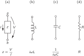
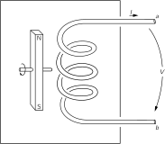
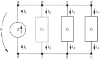
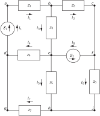
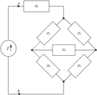
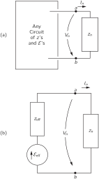
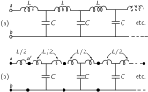
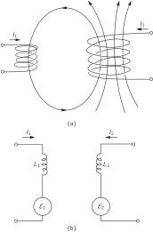
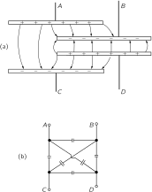

SOURCE: Feynman Lectures on Physics, Volume II, Chapter 22
LANGUAGE: ru
TITLE: Глава 22. ЦЕПИ ПЕРЕМЕННОГО ТОКА
SOURCE_URL: https://www.feynmanlectures.caltech.edu/II_22.html
NOTEBOOKLM_USE: clean lecture text with TeX math and figure captions; reader navigation removed.

# Глава 22. ЦЕПИ ПЕРЕМЕННОГО ТОКА

## Глава 22 ЦЕПИ ПЕРЕМЕННОГО ТОКА § 1. Импедансы

В основном наши усилия при чтении этих лекций были направлены на то, чтобы получить полные уравнения Максвелла. В предыдущих двух главах мы обсудили следствия этих уравнений. Выяснилось, что они содержат объяснение всех статических явлений, которые мы изучали раньше, а также явлений электромагнитных волн и света, подробно изучавшихся в первом томе. Уравнения Максвелла дают и то и другое, смотря по тому, где эти поля вычисляются: поблизости от токов и зарядов или же вдали от них. Есть и промежуточная область, но о ней ничего интересного сказать нельзя; там никаких особых явлений не происходит.

Впрочем, в электромагнетизме остается еще несколько вопросов, которые стоит осветить. Надо будет обсудить вопрос связи относительности и уравнений Максвелла, т. е. выяснить, что произойдет, если на уравнения Максвелла посмотреть из движущейся системы координат. Важен еще и вопрос о сохранении энергии в электромагнитных системах. Кроме того, существует обширная область электромагнитных свойств материалов; до сих пор, если не считать изучения свойств диэлектриков, мы рассматривали только электромагнитные поля в пустом пространстве. И хотя мы довольно подробно осветили вопрос о свете в первом томе, есть еще несколько моментов, которые хотелось бы рассмотреть заново с точки зрения уравнений поля.

В частности, надо бы еще раз вернуться к вопросу о показателе преломления (особенно у плотных веществ). Наконец, интересны явления, связанные с волнами, заключенными внутри ограниченной области пространства. Мы кратко коснулись этой проблемы, когда изучали звуковые волны. Но уравнения Максвелла тоже приводят к решениям, которые представляют волны электрических и магнитных полей, замкнутые в некотором объеме. В одной из последующих глав мы рассмотрим этот вопрос, имеющий важные технические применения. И чтобы подойти к нему, мы начнем с того, что изложим свойства электрических цепей при низких частотах. После этого мы сможем сравнить такие системы, когда к уравнениям Максвелла применимо почти статическое приближение, и системы, в которых преобладают высокочастотные эффекты.

Итак, мы спускаемся с величественных и труднодоступных высот последних нескольких глав и обращаем свой взор на сравнительно низменную задачу — задачу об электрических цепях. Впрочем, мы убедимся в том, что даже столь мирские дела оказываются весьма запутанными, если в них вникнуть достаточно глубоко.

В гл. 23 и 25 (вып. 2) мы уже обсуждали некоторые свойства электрических цепей (контуров). Теперь мы повторим часть изложенного там материала, но более подробно. Мы по-прежнему будем иметь дело с линейными системами и с напряжениями и токами, которые меняются синусоидально; поэтому мы можем представить все напряжения и токи в виде комплексных чисел, пользуясь экспоненциальными обозначениями, введенными в гл. 23 (вып. 2). Так, меняющееся во времени напряжение \(V(t)\) будет записываться в виде
\[
\begin{equation}
\label{Eq:II:22:1}
V(t)=\hat{V}e^{i\omega t},
\end{equation}
\]
, где \(\hat{V}\) — комплексное число, не зависящее от \(t\) . При этом, конечно, подразумевается, что настоящее переменное по времени напряжение \(V(t)\) представляется действительной частью комплексной функции в правой части уравнения.

Подобным же образом и все другие меняющиеся во времени величины будут считаться изменяющимися синусоидально с той же частотой \(\omega\) . Мы будем писать
\[
\begin{equation}
\begin{aligned}
I&=\hat{I}\,e^{i\omega t}\quad(\text{current}),\\[3pt]
\emf&=\hat{\emf}\,e^{i\omega t}\quad(\text{emf}),\\[3pt]
\FLPE&=\hat{\FLPE}\,e^{i\omega t}\quad(\text{electric field}),
\end{aligned}
\label{Eq:II:22:2}
\end{equation}
\]
и т. д.

Большую часть времени мы будем записывать уравнения, используя обозначения \(V\) , \(I\) , \(\emf\) , … (вместо \(\hat{V}\) , \(\hat{I}\) , \(\hat{\emf}\) , …), помня при этом, что они изменяются со временем всегда так, как в (22.2).

В наших прежних рассуждениях об электрических цепях мы полагали, что такие вещи, как индуктивность, емкость и сопротивление, вам знакомы. Сейчас мы немного подробнее объясним, что понимают под этими идеализированными элементами схем. Начнем с индуктивности.

### Figure Ch22-F1
Caption: Фиг. 22.1. Индуктивность.
Image: figures/Ch22-F1.svg

Индуктивность — это навитая в несколько рядов проволока в форме катушки, два конца которой выведены к зажимам на некотором расстоянии от катушки (фиг. 22.1). Мы предположим, что магнитное поле, создаваемое токами в катушке, не распространяется широко в пространстве и не взаимодействует с другими частями цепи. Обычно этого добиваются, придав катушке форму лепешки, или сжимая магнитное поле, намотав катушку на подходящий железный сердечник, или поместив ее в подходящую металлическую коробочку, как схематически показано на фиг. 22.1. В любом случае мы предполагаем, что во внешней области у зажимов \(a\) и \(b\) магнитным полем можно пренебречь. Мы также будем считать, что можно не учитывать электрическое сопротивление проводов в катушке. И наконец, мы предположим, что можно пренебречь электрическим зарядом, появляющимся на поверхности провода при создании электрических полей.

С учетом всех этих приближений и возникает то, что называют «идеальной» индуктивностью. (Позже мы вернемся к этому пункту и поговорим о том, что бывает в реальных индуктивностях.) Про идеальную индуктивность говорят, что напряжение на ее зажимах равно \(L(dI/dt)\) . Почему? Когда через индуктивность идет ток, то внутри катушки создается магнитное поле, пропорциональное силе тока. Если ток во времени меняется, то меняется и магнитное поле. Вообще говоря, ротор \(\FLPE\) равен \(-\ddpl{\FLPB}{t}\) ; можно сказать и по-другому: контурный интеграл от \(\FLPE\) по любому замкнутому пути равен (с минусом) быстроте изменения потока \(\FLPB\) через контур. Представьте теперь себе следующий путь: начинается он на зажиме \(a\) и тянется вдоль катушки (оставаясь все время внутри провода) к зажиму \(b\) ; затем возвращается от зажима \(b\) к зажиму \(a\) по воздуху в пространстве вне катушки. Контурный интеграл от \(\FLPE\) по этому замкнутому пути можно записать в виде суммы двух частей:
\[
\begin{equation}
\label{Eq:II:22:3}
\oint\FLPE\cdot d\FLPs=\kern{-1ex}
\underset{\substack{\text{via}\\\text{coil}}}{\int_a^b}
\kern{-.5ex}\FLPE\cdot d\FLPs\;+\kern{-.75ex}
\underset{\text{outside}}{\int_b^a}
\kern{-1.5ex}\FLPE\cdot d\FLPs.
\end{equation}
\]
Как мы уже выяснили раньше, внутри идеального проводника электрических полей существовать не может. (Малейшие поля вызвали бы бесконечно большие токи.) Поэтому интеграл от \(a\) до \(b\) через катушку равен нулю. Весь вклад в контурный интеграл от \(\FLPE\) приходится на путь снаружи индуктивности, от зажима \(b\) к зажиму \(a\) . А так как было предположено, что в пространстве вне «коробки» нет никаких магнитных полей, то эта часть интеграла не зависит от выбора пути, и мы можем определить понятие потенциала обоих зажимов. Разность этих двух потенциалов и есть то, что называют напряжением \(V\) , так что
\[
\begin{equation*}
V=-\int_b^a\kern{-1ex}\FLPE\cdot d\FLPs=-\oint\FLPE\cdot d\FLPs.
\end{equation*}
\]

Полный интеграл по контуру — это то, что мы раньше называли э. д. с. \(\emf\) . Он, естественно, равен скорости изменения магнитного потока в катушке. Мы уже знаем, что э. д. с. равна (со знаком минус) быстроте изменения тока, так что
\[
\begin{equation*}
V=-\emf=L\,\ddt{I}{t},
\end{equation*}
\]
где \(L\) — индуктивность катушки. Поскольку \(dI/dt=i\omega I\) , мы имеем
\[
\begin{equation}
\label{Eq:II:22:4}
V=i\omega LI.
\end{equation}
\]

Тот способ, которым мы описали идеальную индуктивность, иллюстрирует общий подход к другим идеальным элементам цепи — обычно их называют «сосредоточенными» элементами. Свойства элемента полностью описываются на языке токов и напряжений, возникающих на его зажимах. Прибегнув к подходящим приближениям, можно игнорировать огромную сложность тех полей, которые возникают внутри объекта. То, что происходит внутри, отделяется от того, что происходит снаружи.

Для всех элементов цепи мы намерены сейчас найти соотношения, подобные формуле (22.4). В ней напряжение пропорционально силе тока с константой пропорциональности, которая, вообще говоря, есть комплексное число. Этот комплексный коэффициент пропорциональности называется импедансом, и его привыкли обозначать через \(z\) (не следует путать с координатой \(z\) ). В общем случае это функция частоты \(\omega\) . Стало быть, для каждого сосредоточенного элемента мы напишем
\[
\begin{equation}
\label{Eq:II:22:5}
\frac{V}{I}=\frac{\hat{V}}{\hat{I}}=z.
\end{equation}
\]
Для индуктивности мы имеем
\[
\begin{equation}
\label{Eq:II:22:6}
z\,(\text{inductance})=z_L=i\omega L.
\end{equation}
\]

Рассмотрим теперь с этой точки зрения емкость. Она состоит из двух проводящих пластин (обкладок), от которых к нужным зажимам отходят два провода. Пластины могут быть любой формы и часто отделяются друг от друга каким-нибудь диэлектриком. Это схематически изображено на фиг. 22.2. Мы снова делаем несколько упрощающих предположений. Мы считаем, что пластины и провода — идеальные проводники, а изоляция между пластинами тоже идеальна, так что через нее никакие заряды с пластины на пластину перейти не могут. Затем мы предполагаем, что проводники находятся близко друг от друга, но зато значительно удалены ото всех остальных проводников, так что все линии поля, выйдя из одной пластины, непременно оканчиваются на другой. И тогда заряды на пластинах всегда равны и противоположны друг другу, причем по величине намного превосходят величину заряда на поверхности проводов. И наконец, мы считаем, что поблизости от конденсатора магнитных полей нет.

### Figure Ch22-F2
Caption: Фиг. 22–2. Конденсатор.
Image: figures/Ch22-F2.svg

Рассмотрим теперь контурный интеграл от \(\FLPE\) вдоль замкнутой петли, которая начинается на клемме \(a\) , проходит внутри провода до верхней обкладки конденсатора, перескакивает промежуток между пластинами, проходит с нижней обкладки на клемму \(b\) через провод и возвращается к клемме \(a\) по пространству снаружи конденсатора. Раз магнитного поля нет, контурный интеграл от \(\FLPE\) по этому замкнутому пути равен нулю. Интеграл можно разбить на три части:
\[
\begin{equation}
\label{Eq:II:22:7}
\oint\FLPE\cdot d\FLPs=\kern{-1.3ex}
\underset{\substack{\text{along}\\\text{wires}}}{\int} % ebook insert: \kern -0.7ex
\FLPE\cdot d\FLPs+\kern{-2.2ex}
\underset{\substack{\text{between}\\\text{plates}}}{\int}
\kern{-1.5ex}\FLPE\cdot d\FLPs+\kern{-1.2ex}
\underset{\text{outside}}{\int_b^a}
\kern{-1.6ex}\FLPE\cdot d\FLPs.
\end{equation}
\]
Интеграл вдоль проводов равен нулю, потому что внутри идеальных проводников электрического поля не бывает. Интеграл от \(b\) до \(a\) снаружи конденсатора равен разности потенциалов между клеммами со знаком минус. А поскольку мы считаем, что обе обкладки как-то изолированы от прочего мира, то общий заряд двух обкладок должен быть равен нулю; если на верхней обкладке есть заряд \(Q\) , то на нижней имеется равный и противоположный заряд \(-Q\) . Раньше мы уже видели, что если два проводника имеют равные и противоположные заряды, плюс и минус \(Q\) , то разность потенциалов между пластинами равна \(Q/C\) , где \(C\) называется емкостью этих проводников. Из уравнения (22.7) следует, что разность потенциалов между зажимами \(a\) и \(b\) равна разности потенциалов между обкладками. Поэтому мы имеем
\[
\begin{equation*}
V=\frac{Q}{C}.
\end{equation*}
\]
Электрический ток \(I\) , втекающий в конденсатор через клемму \(a\) (и покидающий его через клемму \(b\) ), равен \(dQ/dt\) — быстроте изменения электрического заряда на обкладках. Записывая \(dV/dt\) в виде \(i\omega V\) , связь между током и напряжением для конденсатора можно дать в следующем виде:
\[
\begin{equation}
i\omega V=\frac{I}{C},\notag
\end{equation}
\]
или
\[
\begin{equation}
\label{Eq:II:22:8}
V=\frac{I}{i\omega C}.
\end{equation}
\]
Импеданс \(z\) конденсатора равен
\[
\begin{equation}
\label{Eq:II:22:9}
z\,(\text{capacitor})=z_C=\frac{1}{i\omega C}.
\end{equation}
\]

### Figure Ch22-F3
Caption: Фиг. 22.3. Сопротивление
Image: figures/Ch22-F3.svg

Третий элемент, который нужно рассмотреть, — это сопротивление. Но, поскольку мы пока еще не рассматривали электрических свойств реальных веществ, мы не готовы обсуждать то, что творится внутри реального проводника. Придется просто принять как факт, что внутри реальных веществ могут существовать электрические поля, что эти поля порождают поток электрического заряда (т. е. ток) и что этот ток пропорционален интегралу электрического поля от одного конца проводника до другого. Затем надо представить себе идеальное сопротивление, сделанное так, как показано на фиг. 22.3. Два провода, которые мы считаем идеальными проводниками, тянутся от клемм \(a\) и \(b\) к двум концам бруска, сделанного из материала, оказывающего сопротивление току. Следуя нашей обычной линии рассуждений, приходим к выводу, что разность потенциалов между зажимами \(a\) и \(b\) равна контурному интегралу от внешнего электрического поля, равному также контурному интегралу от электрического поля по пути, проходящему через брусок. Отсюда следует, что ток \(I\) через сопротивление пропорционален напряжению \(V\) :
\[
\begin{equation*}
I=\frac{V}{R},
\end{equation*}
\]
где \(R\) называется сопротивлением. Позже мы убедимся, что связь между силой тока и напряжением для реальных проводящих материалов только приближенно можно считать линейной. Мы убедимся также, что считать эту приближенную пропорциональность не зависящей от частоты изменений тока и напряжения можно лишь тогда, когда частота не слишком высока. И тогда для переменных токов напряжение на зажимах оказывается в фазе с током, а это значит, что сопротивление — число действительное:
\[
\begin{equation}
\label{Eq:II:22:10}
z\,(\text{resistance})=z_R=R.
\end{equation}
\]

### Figure Ch22-F4
Caption: Фиг. 22.4. Идеальные сосредоточенные элементы цепи (пассивные).
Image: figures/Ch22-F4.svg

Результаты наших рассуждений о трех сосредоточенных элементах цепи — индуктивности, емкости и сопротивлении — подытожены на фиг. 22.4. На этом рисунке, как и на предыдущих, напряжение отмечено стрелкой, направленной от одной клеммы к другой. Если напряжение «положительно», т. е. если потенциал на клемме \(a\) выше, чем на клемме \(b\) , то стрелка указывает направление «падения напряжения».

Хотя мы сейчас говорим о переменных токах, конечно, можно включить сюда и особый случай цепей постоянного тока, если перейти к пределу, когда частота \(\omega\) стремится к нулю. При нулевой частоте, т. е. при постоянном токе, импеданс индуктивности стремится к нулю; между клеммами наступает короткое замыкание. Импеданс же емкости при постоянном токе стремится к бесконечности; цепь между клеммами размыкается. Принимать в расчет при постоянных токах нужно только обычные сопротивления: они не зависят от частоты.

В описанных до сих пор элементах цепи ток и напряжение были пропорциональны друг другу. Если одно равно нулю, то и другое равно нулю. Обычно мы мыслим на таком языке: приложенное напряжение «ответственно» за ток или ток «создает» напряжение на клеммах. Элемент словно в некотором смысле «отвечает» на «приложенные» внешние условия. По этой причине такие элементы называются пассивными. Тем самым их можно противопоставить активным элементам, таким как генераторы, которые мы рассмотрим в следующем параграфе и которые представляют собой источники колебаний токов или напряжений в цепи.

## 22–2 Генераторы

Теперь мы перейдем к рассмотрению активного элемента цепи, который является источником токов и напряжений в цепи, а именно генератора.

### Figure Ch22-F5
Caption: Фиг. 22.5. Генератор, состоящий из неподвижной катушки и вращающегося магнитного поля.
Image: figures/Ch22-F5.svg

Представим, что у нас есть катушка, наподобие катушки индуктивности, но только витков у нее совсем немного, так что мы можем пренебречь магнитным полем ее собственного тока. Эта катушка, однако, находится в переменном магнитном поле, подобном тому, какое создается вращающимся магнитом, как показано на фиг. 22–5. (Мы уже видели ранее, что такое вращающееся магнитное поле можно также создать с помощью подходящей системы катушек с переменными токами.) Мы должны снова сделать несколько упрощающих допущений. Это все те же допущения, которые мы описали для случая индуктивности. В частности, мы предполагаем, что меняющееся магнитное поле ограничено лишь небольшой областью поблизости от катушки и не проявляется вне генератора, в пространстве между клеммами.

Повторяя опять в точности тот же анализ, что и для индуктивности, рассмотрим контурный интеграл от \(\FLPE\) вдоль замкнутой петли, которая начинается на зажиме \(a\) , проходит по катушке до зажима \(b\) и возвращается к началу по пространству между зажимами. Снова заключаем, что разность потенциалов между зажимами равна всему интегралу от \(\FLPE\) вдоль петли:
\[
\begin{equation*}
V=-\oint\FLPE\cdot d\FLPs.
\end{equation*}
\]
Этот контурный интеграл равен э. д. с. в цепи, и поэтому разность потенциалов \(V\) на выводах генератора тоже равна скорости изменения магнитного потока сквозь катушку:
\[
\begin{equation}
\label{Eq:II:22:11}
V=-\emf=\ddt{}{t}\,(\text{flux}).
\end{equation}
\]
Предполагается далее, что у идеального генератора магнитный поток через катушку определяется внешними условиями (такими, как угловая скорость вращающегося магнитного поля) и что на него никак не влияют токи, текущие через генератор. Таким образом, генератор (по крайней мере рассматриваемый нами идеальный) — это не импеданс. Разность потенциалов на его зажимах определяется произвольно задаваемой э. д. с. \(\emf(t)\) . Такой идеальный генератор представляют схемой, показанной на фиг. 22.6. Маленькая стрелка дает направление положительной э. д. с. Положительная э. д. с. в генераторе, изображенном на фиг. 22.6, создает напряжение \(V=\emf\) , с более высоким потенциалом на зажиме \(a\) , чем на зажиме \(b\) .

### Figure Ch22-F6
Caption: Фиг. 22.6. Обозначение идеального генератора.
Image: figures/Ch22-F6.svg

Существует и другой способ создания генератора, который устроен внутри совсем иначе, но внешне, на зажимах, ничем не отличается от только что описанного нами устройства. Предположим, что у нас есть проволочная катушка, вращающаяся в неподвижном магнитном поле, как показано на фиг. 22.7. Мы изобразили полосовой магнит, чтобы показать наличие магнитного поля; его, конечно, можно заменить любым другим источником постоянного магнитного поля, например дополнительной катушкой, по которой течет постоянный ток. Как показано на рисунке, соединения от вращающейся катушки с внешним миром осуществляются с помощью скользящих контактов, или «колец». Нас снова интересует разность потенциалов, которая возникает между двумя зажимами \(a\) и \(b\) , что, конечно, представляет собой интеграл от электрического поля от зажима \(a\) до зажима \(b\) по пути вне генератора.

### Figure Ch22-F7
Caption: Фиг. 22.7. Генератор, состоящий из катушки, вращающейся в неподвижном магнитном поле.
Image: figures/Ch22-F7.svg

Теперь в системе, изображенной на фиг. 22.7, нет никаких изменяющихся магнитных полей, и на первый взгляд кажется удивительным, откуда на зажимах генератора берется напряжение. Действительно, ведь нигде же внутри генератора нет никаких электрических полей. Мы, как обычно, предполагаем для наших идеальных элементов, что внутри них провода сделаны из идеально проводящего материала; а, как уже неоднократно повторялось, электрическое поле внутри идеального проводника равно нулю. Но это не всегда верно. Это неверно тогда, когда проводник движется в магнитном поле. Правильное утверждение таково: общая сила, действующая на произвольный заряд внутри идеального проводника, должна быть равна нулю. Иначе в нем возник бы бесконечный ток свободных зарядов. Так что надо брать сумму электрического поля \(\FLPE\) и векторного произведения скорости проводника и магнитного поля \(\FLPB\) — это есть полная сила, действующая на единичный заряд, и вот она-то всегда равна нулю внутри проводника:
\[
\begin{align}
\FLPF/\text{unit charge}&=\FLPE+\FLPv\times\FLPB\notag\\
\label{Eq:II:22:12}
&=\FLPzero\;(\text{in a perfect conductor}),
\end{align}
\]
где \(\FLPv\) представляет собой скорость проводника. Наше прежнее утверждение о том, что внутри идеальных проводников электрических полей не бывает, верно лишь тогда, когда скорость проводника \(\FLPv\) равна нулю; в противном случае справедливо выражение (22.12).

Вернемся к нашему генератору, показанному на фиг. 22.7. Теперь мы видим, что контурный интеграл от электрического поля \(\FLPE\) между зажимом \(a\) и зажимом \(b\) по проводящим путям генератора должен быть равен контурному интегралу от \(\FLPv\times\FLPB\) по тому же пути:
\[
\begin{equation}
\label{Eq:II:22:13}
\underset{\substack{\text{inside}\\\text{conductor}}}{\int_a^b}
\kern{-1.75ex}\FLPE\cdot d\FLPs\;=-\kern{-1.75ex}
\underset{\substack{\text{inside}\\\text{conductor}}}{\int_a^b}
\kern{-1.5ex}(\FLPv\times\FLPB)\cdot d\FLPs.
\end{equation}
\]
Однако по-прежнему остается верным, что контурный интеграл от \(\FLPE\) по замкнутой петле, включая возвращение от \(b\) к \(a\) вне генератора, должен быть равен нулю, потому что меняющиеся магнитные поля отсутствуют. Так что первый интеграл в (22.13) по-прежнему равен \(V\) — напряжению между двумя зажимами. Оказывается, что интеграл в правой части (22.13) просто равен быстроте изменения потока через катушку, а значит, по правилу потока, равен э. д. с. катушки. И опять получается, что разность потенциалов между зажимами равна э. д. с. цепи, в согласии с уравнением (22.11). Так что все равно, какой у нас генератор: меняется ли в нем магнитное поле возле закрепленной катушки или вертится ли в закрепленном магнитном поле катушка, — внешние свойства генераторов одни и те же. На клеммах всегда существует напряжение \(V\) , которое не зависит от тока в цепи, а определяется только условиями внутри генератора, формируемыми по нашему произволу.

### Figure Ch22-F8
Caption: Фиг. 22.8. Химический элемент.
Image: figures/Ch22-F8.svg

Поскольку мы пытаемся понять работу генератора, основываясь на уравнениях Максвелла, может возникнуть вопрос об обычном химическом элементе, например, о батарейке для карманного фонарика. Это тоже генератор, т. е. источник напряжения, хотя, разумеется, он применяется только в цепях постоянного тока. Проще всего разобраться в элементе, изображенном на фиг. 22.8. Представьте две металлические пластинки, погруженные в какой-то химический раствор. Мы предположим, что раствор содержит положительные и отрицательные ионы. Мы предположим также, что ионы одного сорта, скажем отрицательные, много массивнее ионов, имеющих противоположную полярность, так что их движение в растворе посредством диффузии происходит намного медленнее. Наконец, положим, что тем или иным способом удалось добиться изменения концентрации раствора от одного места к другому, так что число ионов обеих полярностей, скажем у нижней пластинки, намного больше концентрации ионов у верхней пластинки. Благодаря большей подвижности положительные ионы будут легче проникать в область низких концентраций, так что будет наблюдаться легкий избыток положительного заряда, достигающего верхней пластинки. Верхняя пластинка зарядится положительно, а нижняя будет обладать избытком отрицательного заряда.

По мере того как все больше и больше зарядов диффундирует к верхней пластинке, потенциал ее будет расти, пока возникающее между пластинками электрическое поле не создаст силу, действующую на ионы, которая компенсирует их избыточную подвижность. Два электрода быстро достигают разности потенциалов, характерной для внутреннего устройства этого элемента.

Рассуждая так же, как мы это делали для идеального конденсатора, мы убедимся, что разность потенциалов между зажимами \(a\) и \(b\) равна просто контурному интегралу от электрического поля между двумя пластинами, когда суммарная диффузия ионов прекращается. Конечно, существует существенная разница между конденсатором и таким химическим элементом. Если на мгновение закоротить выводы конденсатора, он разрядится и разности потенциалов между выводами уже не будет. В случае же химического элемента ток с зажимов можно снимать непрерывно, никак не изменяя при этом э. д. с., пока, конечно, реактивы внутри элемента не израсходуются. Известно, что в реальном элементе разность потенциалов на зажимах убывает по мере возрастания снимаемого с него тока. Однако в соответствии с принятой нами идеализацией можно представить себе идеальный элемент, в котором напряжение на зажимах не зависит от силы тока. Тогда реальный элемент можно рассматривать как идеальный элемент, соединенный последовательно с сопротивлением.

## 22–3 Сети идеальных элементов; правила Кирхгофа

Как мы видели в предыдущем параграфе, описание идеального элемента цепи через то, что происходит вне этого элемента, весьма просто. Ток и напряжение связаны линейно. Но то, что на самом деле происходит внутри элемента, довольно сложно, и дать точное описание на языке уравнений Максвелла очень трудно. Представьте, что вам нужно дать точное описание электрических и магнитных полей внутри радиоприемника, содержащего сотни сопротивлений, конденсаторов и катушек индуктивности. Было бы невыполнимой задачей анализировать такую систему с помощью уравнений Максвелла. Однако, делая множество приближений, которые мы описали в § 22–2, и сводя существенные особенности реальных элементов цепи к идеализациям, становится возможным анализировать электрическую цепь сравнительно простым способом. Сейчас мы покажем, как это делается.

### Figure Ch22-F9
Caption: Фиг. 22.9. Сумма падений напряжения вдоль любого замкнутого пути равна нулю.
Image: figures/Ch22-F9.svg

Пусть имеется цепь, состоящая из генератора и нескольких импедансов, связанных между собой так, как показано на фиг. 22.9. Согласно нашим приближениям, в областях вне отдельных элементов цепи магнитного поля нет. Поэтому криволинейный интеграл от \(\FLPE\) вдоль любой кривой, которая не проходит ни через один из элементов, равен нулю. Рассмотрим теперь кривую \(\Gamma\) , показанную штриховой линией, которая обходит по цепи кругом, как показано на фиг. 22.9. Контурный интеграл от \(\FLPE\) вдоль этой кривой состоит из нескольких частей. Каждая часть — это интеграл от одного зажима элемента цепи до другого. Этот интеграл мы назвали падением напряжения на элементе цепи. Полный контурный интеграл тогда есть просто сумма падений напряжения на всех элементах цепи:
\[
\begin{equation*}
\oint\FLPE\cdot d\FLPs=\sum V_n.
\end{equation*}
\]
А поскольку контурный интеграл равен нулю, мы получаем, что сумма разностей потенциалов вдоль всего замкнутого контура цепи равна нулю:
\[
\begin{equation}
\label{Eq:II:22:14}
\underset{\substack{\text{around}\\\text{any loop}}}{\sum}
V_n=0.
\end{equation}
\]
Этот результат следует из одного из уравнений Максвелла: в области, где отсутствуют магнитные поля, криволинейный интеграл от \(\FLPE\) вдоль любого замкнутого контура равен нулю.

### Figure Ch22-F10
Caption: Фиг. 22.10. Сумма токов, входящих в любой узел, равна нулю.
Image: figures/Ch22-F10.svg

Теперь рассмотрим другую цепь (фиг. 22.10). Горизонтальная линия, соединяющая выводы \(a\) , \(b\) , \(c\) и \(d\) , нарисована для того, чтобы показать, что все эти выводы соединены друг с другом или связаны проводами с ничтожно малым сопротивлением. Во всяком случае, чертеж означает, что выводы \(a\) , \(b\) , \(c\) и \(d\) находятся под одним потенциалом, а выводы \(e\) , \(f\) , \(g\) и \(h\) также имеют один общий потенциал. Тогда падение напряжения \(V\) на каждом из четырех элементов одинаково.

Одна из наших идеализаций состояла в том, что на выводах импедансов сосредоточиваются пренебрежимо малые количества электричества. Предположим теперь, что и электрическим зарядом, накапливаемым на соединительных проводах, тоже можно пренебречь. Тогда сохранение заряда требует, чтобы любой заряд, покинувший один из элементов цепи, немедленно входил в какой-либо другой элемент цепи. Или, что то же самое, чтобы алгебраическая сумма токов, входящих в любую из точек соединения, была равна нулю. Под точкой соединения мы понимаем любую совокупность выводов, таких, как \(a\) , \(b\) , \(c\) и \(d\) , которые соединены друг с другом. Такая совокупность соединенных между собой выводов обычно называется «узлом». Сохранение заряда, стало быть, требует, чтобы в цепи, показанной на фиг. 22.10, было
\[
\begin{equation}
\label{Eq:II:22:15}
I_1-I_2-I_3-I_4=0.
\end{equation}
\]
. Сумма токов, входящих в узел, состоящий из четырех выводов \(e\) , \(f\) , \(g\) и \(h\) , тоже должна быть равна нулю:
\[
\begin{equation}
\label{Eq:II:22:16}
-I_1+I_2+I_3+I_4=0.
\end{equation}
\]
. Это, конечно, то же самое уравнение, что и (22.15). Оба эти уравнения не независимы. Общее правило гласит, что сумма токов, втекающих в любой узел, обязана быть равна нулю:
\[
\begin{equation}
\label{Eq:II:22:17}
\underset{\substack{\text{into}\\\text{a node}}}{\sum}
I_n=0.
\end{equation}
\]
.

Наше прежнее заключение о том, что сумма падений напряжений вдоль замкнутого контура равна нулю, должно выполняться для каждого контура сложной цепи. Точно так же наш результат, что сумма сил токов, втекающих в узел, равна нулю, тоже должен выполняться для любого узла. Эти два уравнения известны под названием правил Кирхгофа. С их помощью можно найти силы токов и напряжения в какой угодно цепи.

### Figure Ch22-F11
Caption: Фиг. 22.11. Анализ цепи с помощью правил Кирхгофа.
Image: figures/Ch22-F11.svg

Рассмотрим более сложную цепь, изображенную на фиг. 22.11. Как определить токи и напряжения в ней? Это можно сделать прямым путем. Рассмотрим каждый из четырех вспомогательных замкнутых контуров, имеющихся в цепи. (Например, один контур проходит от зажима \(a\) к зажиму \(b\) , затем к зажиму \(e\) , к зажиму \(d\) и обратно к зажиму \(a\) .) Для каждого из этих контуров мы запишем уравнение первого правила Кирхгофа — сумма падений напряжений вдоль любого замкнутого контура равна нулю. При этом нужно помнить, что падение напряжения считается положительным, если мы движемся в направлении тока, и отрицательным, если мы проходим через элемент в направлении, противоположном току; также следует помнить, что падение напряжения на генераторе равно отрицательному значению э. д. с. в этом направлении. Таким образом, если рассмотреть малый контур, который начинается и заканчивается на зажиме \(a\) , мы получим уравнение
\[
\begin{equation*}
z_1I_1+z_3I_3+z_4I_4-\emf_1=0.
\end{equation*}
\]
Применяя те же правила к остальным контурам, мы получим еще три подобных уравнения.

Далее нужно написать уравнения для токов в каждом узле цепи. Например, складывая все токи, входящие в узел \(b\) , получаем уравнение
\[
\begin{equation*}
I_1-I_3-I_2=0.
\end{equation*}
\]
Аналогично, для узла, обозначенного \(e\) , мы получили бы уравнение для токов
\[
\begin{equation*}
I_3-I_4+I_8-I_5=0.
\end{equation*}
\]
В изображенной схеме таких уравнений для токов пять. Оказывается, однако, что любое из этих уравнений можно вывести из остальных четырех; поэтому независимых уравнений для токов только четыре. Итого в нашем распоряжении восемь независимых линейных уравнений: четыре для напряжений и четыре для токов. С помощью этих восьми уравнений можно найти восемь неизвестных токов. Как только токи станут известны, цепь будет полностью рассчитана. Падение напряжения на любом элементе определяется как произведение тока, протекающего через этот элемент, на его импеданс (или, в случае источников напряжения, оно уже известно).

Мы видели, что при записи уравнений для токов одно из уравнений оказывается зависимым от остальных. Вообще говоря, можно написать и слишком много уравнений для напряжений. Например, в схеме на фиг. 22.11, хотя мы рассмотрели только четыре маленьких контура, существует множество других контуров, для которых можно написать уравнение напряжений. Есть, например, контур, проходящий по пути \(abcfeda\) . Есть другой контур, который следует по пути \(abcfehgda\) . Вы видите, что таких контуров много. При анализе сложных цепей очень легко получить слишком много уравнений. Существуют правила, которые говорят нам, как действовать, чтобы записать только минимально необходимое число уравнений, но обычно, немного подумав, можно понять, как получить нужное количество уравнений в простейшем виде. К тому же написание лишнего уравнения или двух не причинит вреда. Они не приведут к неправильным ответам, а лишь, возможно, потребуют немного лишней алгебраической работы.

### Figure Ch22-F12
Caption: Фиг. 22.12. Цепь, которую можно проанализировать с помощью последовательных и параллельных комбинаций.
Image: figures/Ch22-F12.svg

В гл. 25 (вып. 1) мы показали, что если два импеданса \(z_1\) и \(z_2\) соединены последовательно, они эквивалентны одиночному импедансу \(z_s\) , равному
\[
\begin{equation}
\label{Eq:II:22:18}
z_s=z_1+z_2.
\end{equation}
\]
Кроме того, было показано, что, когда два импеданса соединены параллельно, они эквивалентны одиночному импедансу \(z_p\) , равному
\[
\begin{equation}
\label{Eq:II:22:19}
z_p=\frac{1}{(1/z_1)+(1/z_2)}=\frac{z_1z_2}{z_1+z_2}.
\end{equation}
\]
Если вы теперь оглянетесь назад, то увидите, что, выводя эти результаты, на самом деле вы пользовались правилами Кирхгофа. Часто можно проанализировать сложную цепь путем повторного применения формул для последовательных и параллельных импедансов. Например, цепь на фиг. 22.12 можно проанализировать таким способом. Сначала импедансы \(z_4\) и \(z_5\) можно заменить их параллельным эквивалентом, то же самое можно сделать для \(z_6\) и \(z_7\) . Затем импеданс \(z_2\) можно объединить с параллельным эквивалентом \(z_6\) и \(z_7\) с помощью правила последовательного соединения. Действуя таким образом, можно свести всю цепь к генератору, соединенному последовательно с одним импедансом \(Z\) . Ток через генератор при этом просто равен \(\emf/Z\) . Затем, работая в обратном порядке, можно определить токи в каждом из импедансов.

### Figure Ch22-F13
Caption: Фиг. 22.13. Цепь, которую нельзя проанализировать с помощью последовательных и параллельных комбинаций.
Image: figures/Ch22-F13.svg

Существуют, однако, совсем простые цепи, которые нельзя проанализировать этим методом, как, например, схема на фиг. 22.13. Чтобы проанализировать эту цепь, надо выписать уравнения для токов и напряжений по правилам Кирхгофа. Давайте сделаем это. Имеется только одно уравнение для токов:
\[
\begin{equation*}
I_1+I_2+I_3=0,
\end{equation*}
\]
так что мы сразу знаем, что
\[
\begin{equation*}
I_3=-(I_1+I_2).
\end{equation*}
\]
Мы можем сэкономить немного алгебраических выкладок, если сразу воспользуемся этим результатом при составлении уравнений для напряжений. Для этой цепи есть два независимых уравнения для напряжений; они имеют вид
\[
\begin{equation*}
-\emf_1+I_2z_2-I_1z_1=0
\end{equation*}
\]
и
\[
\begin{equation*}
\emf_2-(I_1+I_2)z_3-I_2z_2=0.
\end{equation*}
\]
Имеется два уравнения и два неизвестных тока. Решая эти уравнения для \(I_1\) и \(I_2\) , мы получаем
\[
\begin{equation}
\label{Eq:II:22:20}
I_1=\frac{z_2\emf_2-(z_2+z_3)\emf_1}{z_1(z_2+z_3)+z_2z_3}
\end{equation}
\]
и
\[
\begin{equation}
\label{Eq:II:22:21}
I_2=\frac{z_1\emf_2+z_3\emf_1}{z_1(z_2+z_3)+z_2z_3}.
\end{equation}
\]
Третий ток находится как сумма этих двух.

### Figure Ch22-F14
Caption: Фиг. 22.14. Мостиковая схема.
Image: figures/Ch22-F14.svg

Еще один пример цепи, которую нельзя проанализировать с помощью правил для последовательных и параллельных импедансов, показан на фиг. 22.14. Такую схему называют «мостик». Она встречается во многих приборах, измеряющих импедансы. В таких схемах обычно интересуются таким вопросом: как должны соотноситься различные импедансы, чтобы ток через импеданс \(z_3\) был равен нулю? Вам предоставляется право найти те условия, при которых это действительно так.

## 22–4 Эквивалентные контуры

### Figure Ch22-F15
Caption: Фиг. 22.15. Любая цепь пассивных элементов с двумя выводами эквивалентна эффективному импедансу.
Image: figures/Ch22-F15.svg

Положим, мы подключили генератор \(\emf\) к цепи, в которой есть множество сложных переплетений импедансов (схематически это показано на фиг. 22.15, а). Все уравнения, вытекающие из правил Кирхгофа, линейны, и поэтому, вычислив из них ток \(I\) через генератор, мы получим величину \(I\) , пропорциональную \(\emf\) . Можно написать
\[
\begin{equation*}
I=\frac{\emf}{z_{\text{eff}}},
\end{equation*}
\]
, где теперь \(z_{\text{eff}}\) — это некоторое комплексное число, алгебраическая функция всех элементов цепи. (Если в цепи нет никаких генераторов, кроме упомянутого, то в формуле не будет добавочной части, не зависящей от \(\emf\) .) Но получившееся уравнение — это как раз то, которое нужно было бы написать для схемы фиг. 22.15, б. И покуда нас интересует только то, что происходит слева от зажимов \(a\) и \(b\) , до тех пор обе схемы фиг. 22.15 эквивалентны. И поэтому можно сделать общее утверждение, что любую цепь пассивных элементов с двумя выводами можно заменить одним-единственным импедансом \(z_{\text{eff}}\) , не изменив в остальной части цепи ни токов, ни напряжений. Утверждение это, естественно, всего лишь мелкое замечание о том, что следует из правил Кирхгофа, а в конечном счете — из линейности уравнений Максвелла.

### Figure Ch22-F16
Caption: Фиг. 22.16. Любую цепь с двумя выводами можно заменить генератором, последовательно соединенным с импедансом.
Image: figures/Ch22-F16.svg

Эту идею можно обобщить на схемы, в которые входят как генераторы, так и импедансы. Представьте, что мы глядим на эту схему «с точки зрения» одного из импедансов, который мы обозначим \(z_n\) (фиг. 22.16, а). Если бы мы решили уравнения для всей цепи, мы бы увидели, что напряжение \(V_n\) между зажимами \(a\) и \(b\) есть линейная функция \(I_n\) , которую можно записать в виде
\[
\begin{equation}
\label{Eq:II:22:22}
V_n=A-BI_n,
\end{equation}
\]
где \(A\) и \(B\) зависят от генераторов и импедансов в цепи слева от зажимов. Например, в схеме, показанной на фиг. 22.13, мы находим \(V_1=I_1z_1\) . Это можно переписать [используя (22.20)] в виде
\[
\begin{equation}
\label{Eq:II:22:23}
V_1=\biggl[
\biggl(\frac{z_2}{z_2+z_3}\biggr)\emf_2-\emf_1
\biggr]-\frac{z_2z_3}{z_2+z_3}\,I_1.
\end{equation}
\]
Тогда полное решение мы получаем, комбинируя это уравнение с уравнением для импеданса \(z_1\) , т. е. с \(V_1=I_1z_1\) , или в общем случае комбинируя (22.22) с
\[
\begin{equation*}
V_n=I_nz_n.
\end{equation*}
\]

Если мы рассмотрим теперь случай, когда \(z_n\) подключается к простой цепи из последовательно соединенных генератора и импеданса (см. фиг. 22.16, б), то уравнение, соответствующее (22.22), примет вид
\[
\begin{equation*}
V_n=\emf_{\text{eff}}-I_nz_{\text{eff}},
\end{equation*}
\]
что совпадает с (22.22), если принять \(\emf_{\text{eff}}=A\) и \(z_{\text{eff}}=B\) . Значит, если нас интересует лишь то, что происходит направо от выводов \(a\) и \(b\) , то произвольную схему фиг. 22.16 можно всегда заменить эквивалентным сочетанием генератора, последовательно соединенного с импедансом.

## 22–5 Энергия

Мы видели, что для создания в индуктивности тока \(I\) из внешней цепи надо доставить энергию \(U=\tfrac{1}{2}LI^2\) . Когда ток спадает до нуля, эта энергия уводится обратно во внешнюю цепь. В идеальной индуктивности механизма потерь энергии нет. Когда через индуктивность течет переменный ток, энергия перетекает то туда, то сюда — от индуктивности к остальной части цепи и обратно, но средняя скорость, с какой энергия передается в цепь, равна нулю. Мы говорим, что индуктивность — недиссипативный элемент, в ней не растрачивается (не «диссипирует») электрическая энергия.

Точно так же энергия конденсатора, \(U=\tfrac{1}{2}CV^2\) , возвращается во внешнюю цепь, когда конденсатор разряжается. Когда конденсатор находится в цепи переменного тока, энергия перетекает то в него, то из него, но полный поток энергии за каждый цикл равен нулю. Идеальный конденсатор — тоже недиссипативный элемент.

Мы знаем, что э. д. с. — это источник энергии. Когда ток \(I\) течет в направлении э. д. с., энергия поставляется во внешнюю цепь со скоростью \(dU/dt=\emf I\) . Если электричество гонят против э. д. с. (с помощью других генераторов в цепи), то э. д. с. поглощает энергию со скоростью \(\emf I\) ; поскольку \(I\) отрицательно, \(dU/dt\) также будет отрицательным.

Если генератор подключен к сопротивлению \(R\) , то ток через сопротивление равен \(I=\emf/R\) . Энергия, поставляемая генератором со скоростью \(\emf I\) , поглощается сопротивлением. Эта энергия тратится на нагрев сопротивления и для электрической энергии цепи фактически уже потеряна. Мы говорим, что электрическая энергия рассеивается, диссипирует в сопротивлении. Скорость, с какой она рассеивается, равна \(dU/dt=RI^2\) .

В цепи переменного тока средняя скорость потерь энергии в сопротивлении — это среднее значение \(RI^2\) за цикл. Поскольку \(I=\hat{I}e^{i\omega t}\) — что, собственно, означает, что \(I\) меняется как \(\cos\omega t\) , — среднее значение \(I^2\) за цикл равно \(\abs{\hat{I}}^2/2\) , потому что ток в максимуме — это \(\abs{\hat{I}}\) , а среднее значение \(\cos^2\omega t\) равно \(1/2\) .

А что можно сказать о потерях энергии, когда генератор подключен к произвольному импедансу \(z\) ? (Под «потерями» мы, конечно, понимаем превращение электрической энергии в тепловую.) Всякий импеданс \(z\) может быть разбит на действительную и мнимую части, т. е.
\[
\begin{equation}
\label{Eq:II:22:24}
z=R+iX,
\end{equation}
\]
где \(R\) и \(X\) — числа действительные. С точки зрения эквивалентных схем можно сказать, что всякий импеданс эквивалентен сопротивлению, последовательно соединенному с чисто мнимым импедансом, называемым реактансом (фиг. 22.17).

### Figure Ch22-F17
Caption: Фиг. 22.17. Любой импеданс эквивалентен последовательному соединению чистого сопротивления и чистого реактанса.
Image: figures/Ch22-F17.svg

Мы уже видели раньше, что любая цепь, содержащая только \(L\) и \(C\) , обладает импедансом, выражаемым чисто мнимым числом. А раз в любом из \(L\) и \(C\) в среднем никаких потерь не бывает, то и в чистом реактансе, в котором имеются только \(L\) и \(C\) , потерь энергии не бывает. Можно показать, что это должно быть верно для всякого реактанса.

Если генератор с э. д. с. \(\emf\) подсоединен к импедансу \(z\) (см. фиг. 22.17), то его э. д. с. должна быть связана с током \(I\) из генератора соотношением
\[
\begin{equation}
\label{Eq:II:22:25}
\emf=I(R+iX).
\end{equation}
\]
Чтобы найти, с какой средней скоростью подводится энергия, нужно усреднить произведение \(\emf I\) . Но теперь следует быть осторожным. Оперируя с такими произведениями, надо иметь дело только с действительными величинами \(\emf(t)\) и \(I(t)\) . (Действительные части комплексных функций изображают настоящие физические величины только тогда, когда уравнения линейны; сейчас же речь идет о произведении, а это, несомненно, вещь нелинейная.)

Пусть мы начали отсчитывать t так, что амплитуда \(t\) оказалась действительным числом, скажем \(\hat{I}\) ; тогда истинное изменение \(I_0\) во времени дается формулой \(I\) Э. д. с. из уравнения (22.25) — это действительная часть от
\[
\begin{equation*}
I=I_0\cos\omega t.
\end{equation*}
\]
, или
\[
\begin{equation}
I_0e^{i\omega t}(R+iX)\notag
\end{equation}
\]

\[
\begin{equation}
\label{Eq:II:22:26}
\emf=I_0R\cos\omega t-I_0X\sin\omega t.
\end{equation}
\]

Два слагаемых в (22.26) представляют падение напряжений на \(R\) и \(X\) (см. фиг. 22.17). Мы видим, что падение напряжения на сопротивлении находится в фазе с током, тогда как падение напряжения на чисто реактивной части находится с током в противофазе.

Средняя скорость потерь энергии, \(\av{P}\) , текущей от генератора, представляет собой интеграл от произведения \(\emf I\) за один цикл, деленный на период \(T\) ; иными словами,
\[
\begin{align*}
\av{P} = \frac{1}{T}\!\int_0^T\!\! &\emf I\,dt\\[1.5ex]
=\frac{1}{T}\!\int_0^T\!\! &I_0^2R\cos^2\omega t\,dt\\[-.25ex]
-\;&\frac{1}{T}\!\int_0^T\!\!\!I_0^2X\cos\omega t\sin\omega t\,dt.
\end{align*}
\]

Первый интеграл равен \(\tfrac{1}{2}I_0^2R\) , а второй равен нулю. Стало быть, средняя потеря энергии в импедансе \(z=R+iX\) зависит лишь от действительной части \(z\) и равна \(I_0^2R/2\) , что согласуется с нашим прежним выводом о потерях энергии в сопротивлении. В реактивной части потерь энергии не бывает.

## 22–6 Лестничная сеть

### Figure Ch22-F18
Caption: Фиг. 22.18. Эффективный импеданс лестницы.
Image: figures/Ch22-F18.svg

А теперь мы рассмотрим интереснейшую цепь, которую можно выражать через параллельные и последовательные сочетания. Начнем с цепи, изображенной на фиг. 22.18, а. Сразу видно, что импеданс между зажимами \(a\) и \(b\) просто равен \(z_1+z_2\) . Возьмем теперь цепь потруднее (фиг. 22.18, б). Ее можно проанализировать с помощью правил Кирхгофа, но нетрудно обойтись и последовательными и параллельными комбинациями. Два импеданса на правом конце можно заменить одним \(z_3=z_1+z_2\) (см. фиг. 22.18, в). Тогда два импеданса \(z_2\) и \(z_3\) можно заменить их эквивалентным параллельным импедансом \(z_4\) (фиг. 22.18, г). И наконец, \(z_1\) и \(z_4\) эквивалентны одному импедансу \(z_5\) (фиг. 22.18, д).

### Figure Ch22-F19
Caption: Фиг. 22.19. Эффективный импеданс бесконечной лестницы.
Image: figures/Ch22-F19.svg

А теперь можно поставить забавный вопрос: что произойдет, если к цепи, показанной на фиг. 22.18, б, бесконечно подключать все новые и новые звенья (штриховая линия на фиг. 22.19, а)? Можно ли решить задачу о такой бесконечной цепи? Представьте, это совсем не трудно. Прежде всего мы замечаем, что такая бесконечная цепь не меняется, если новое звено подключить к «переднему» концу. Ведь если к бесконечной цепи добавляется одно звено, она остается все той же бесконечной цепью. Пусть мы обозначили импеданс между зажимами \(a\) и \(b\) бесконечной цепи через \(z_0\) ; тогда импеданс всего того, что справа от зажимов \(c\) и \(d\) , тоже равен \(z_0\) . Поэтому, если смотреть с переднего конца, то вся цепь представляется в виде, показанном на фиг. 22.19, б. Заменяя два параллельных импеданса \(z_2\) и \(z_0\) одним и складывая его с \(z_1\) , мы можем сразу же записать импеданс всего сочетания:
\[
\begin{equation*}
z=z_1\!+\!\frac{1}{(1/z_2)\!+\!(1/z_0)}\quad\text{or}\quad
z=z_1\!+\!\frac{z_2z_0}{z_2\!+\!z_0}.
\end{equation*}
\]
Но этот импеданс тоже равен \(z_0\) , так что получается уравнение
\[
\begin{equation}
z_0=z_1+\frac{z_2z_0}{z_2+z_0}.\notag
\end{equation}
\]
Найдем из него \(z_0\) :
\[
\begin{equation}
\label{Eq:II:22:27}
z_0=\frac{z_1}{2}+\sqrt{(z_1^2/4)+z_1z_2}.
\end{equation}
\]
Таким образом, мы нашли решение для импеданса бесконечной лестницы повторяющихся параллельных и последовательных импедансов. Импеданс \(z_0\) называется характеристическим импедансом такой бесконечной цепи.

### Figure Ch22-F20
Caption: Фиг. 22.20. Лестница \(L\) — \(C\) , изображенная двумя эквивалентными способами.
Image: figures/Ch22-F20.svg

Рассмотрим теперь частный пример, когда последовательный элемент — всегда индуктивность \(L\) , а шунтовой элемент — емкость \(C\) (фиг. 22.20,а). В этом случае импеданс бесконечной сети получается, если положить \(z_1=i\omega L\) и \(z_2=1/i\omega
C\) . Заметьте, что первое слагаемое \(z_1/2\) в (22.27) равно просто половине импеданса первого элемента. Естественнее было бы поэтому (или по крайней мере проще) рисовать нашу бесконечную сеть так, как показано на фиг. 22.20,б. Глядя на бесконечную сеть из зажима \(a'\) , мы бы увидали характеристический импеданс
\[
\begin{equation}
\label{Eq:II:22:28}
z_0=\sqrt{(L/C)-(\omega^2L^2/4)}.
\end{equation}
\]

Смотря по тому, какова частота \(\omega\) , наблюдаются два интересных случая. Если \(\omega^2\) меньше \(4/LC\) , то второе слагаемое под корнем меньше первого, и импеданс \(z_0\) станет действительным числом. Если же \(\omega^2\) больше \(4/LC\) , то импеданс \(z_0\) станет чисто мнимым числом и его можно записать в виде
\[
\begin{equation*}
z_0=i\sqrt{(\omega^2L^2/4)-(L/C)}.
\end{equation*}
\]

Раньше мы сказали, что цепь, составленная из одних только мнимых импедансов, таких, как индуктивности и емкости, будет иметь чисто мнимый импеданс. Но как же тогда выходит, что в той цепи, которую мы сейчас рассматриваем (а в ней есть только одни \(L\) и \(C\) ), импеданс при частотах ниже \(\sqrt{4/LC}\) представляет собой чистое сопротивление? Для высоких частот импеданс чисто мнимый, в полном согласии с нашим прежним утверждением. Для низких же частот импеданс — чистое сопротивление и поэтому поглощает энергию. Но как может цепь, подобно сопротивлению, непрерывно поглощать энергию, если она составлена только из индуктивностей и емкостей? Ответ состоит в том, что этих емкостей и самоиндукций бесконечное множество, и получается, что, когда источник соединен с цепью, он обязан сперва снабдить энергией первую индуктивность и емкость, затем вторую, третью и т. д. В цепях подобного рода энергия непрерывно и с постоянной скоростью отсасывается из генератора и безостановочно течет в цепь, где она запасается в индуктивностях и емкостях вдоль линии.

Эта идея подсказывает интересную мысль о том, что фактически происходит внутри цепи. Следует ожидать, что если к переднему концу цепи подключить источник, то действие этого источника начнет распространяться вдоль по цепи к бесконечному концу. Распространение волн вдоль линии очень похоже на излучение от антенны, которая отбирает энергию от питающего ее источника; точнее, можно ожидать, что такое распространение происходит, когда импеданс действителен, т. е. когда \(\omega\) меньше \(\sqrt{4/LC}\) . Но когда импеданс чисто мнимый, т. е. при \(\omega\) , больших \(\sqrt{4/LC}\) , то такого распространения ожидать не следует.

## 22–7 Фильтры

В предыдущем параграфе мы видели, что бесконечная лестничная сеть (см. фиг. 22.20) непрерывно поглощает энергию, если эта энергия подводится с частотой, которая ниже некоторого критического значения \(\sqrt{4/LC}\) , называемого граничной частотой \(\omega_0\) . У нас возникла мысль, что этот эффект можно понять, основываясь на представлении о непрерывном переносе энергии вдоль линии. С другой стороны, на высоких частотах, при \(w>\omega_0\) , непрерывного поглощения энергии не бывает; тогда следует ожидать, что токи, видимо, не смогут «проникнуть» далеко вдоль линии. Поглядим, верны ли эти представления.

Пусть передний конец лестницы соединен с каким-то генератором переменного тока, и нас интересует, как выглядит напряжение, скажем, в \(754\) -м звене лестницы. Поскольку сеть бесконечна, при переходе от одного звена к другому происходит всегда одно и то же; так что можно просто посмотреть, что случается, когда мы переходим от какого-то звена, скажем, \(n\) -го, к следующему. Токи \(I_n\) и напряжения \(V_n\) мы определим так, как показано на фиг. 22.21, а.

### Figure Ch22-F21
Caption: Фиг. 22.21. Нахождение фактора распространения лестницы.
Image: figures/Ch22-F21.svg

Напряжение \(V_{n+1}\) можно получить из \(V_n\) , если вспомнить, что остаток лестницы (после \(n\) -го звена) всегда можно заменить ее характеристическим импедансом \(z_0\) ; тогда достаточно проанализировать только схему фиг. 22.21, б. Мы прежде всего замечаем, что каждое \(V_n\) , поскольку это напряжение на зажимах \(z_0\) , должно быть равно \(I_nz_0\) . Кроме того, разность между \(V_n\) и \(V_{n+1}\) равна просто \(I_nz_1\) :
\[
\begin{equation*}
V_n-V_{n+1}=I_nz_1=V_n\,\frac{z_1}{z_0}.
\end{equation*}
\]
Получается отношение
\[
\begin{equation*}
\frac{V_{n+1}}{V_n}=1-\frac{z_1}{z_0}=\frac{z_0-z_1}{z_0}.
\end{equation*}
\]
которое можно назвать фактором распространения для одного звена лестницы; обозначим его \(\alpha\) . Он, конечно, один и тот же для всех звеньев:
\[
\begin{equation}
\label{Eq:II:22:29}
\alpha=\frac{z_0-z_1}{z_0}.
\end{equation}
\]
Напряжение за \(n\) -м звеном равно
\[
\begin{equation}
\label{Eq:II:22:30}
V_n=\alpha^n\emf.
\end{equation}
\]
Теперь нетрудно найти напряжение за \(754\) звеньями; оно просто равно произведению \(\alpha\) на \(754\) -ю степень \(\emf\) .

Посмотрим, как выглядит \(\alpha\) для L—C лестницы \(L\) - \(C\) на фиг. 22.20, а. Взяв \(z_0\) из уравнения (22.27) и \(z_1=i\omega L\) , получим
\[
\begin{equation}
\label{Eq:II:22:31}
\alpha=\frac{\sqrt{(L/C)-(\omega^2L^2/4)}-i(\omega L/2)}
{\sqrt{(L/C)-(\omega^2L^2/4)}+i(\omega L/2)}.
\end{equation}
\]
Если частота на входе ниже граничной частоты \(\omega_0=\sqrt{4/LC}\) , то корень — число действительное, и модули комплексных чисел в числителе и знаменателе одинаковы. Поэтому значение \(\alpha\) по модулю равно единице; можно написать
\[
\begin{equation*}
\alpha=e^{i\delta},
\end{equation*}
\]
а это означает, что величина напряжения в каждом звене одна и та же; меняется только фаза. Она меняется на число \(\delta\) ; оно на самом деле отрицательно и представляет собой «задержку» напряжения по мере того, как последнее проходит по сети.

Для частот выше граничной частоты \(\omega_0\) лучше вынести в числителе и знаменателе (22.31) множитель \(i\) и переписать это выражение в виде
\[
\begin{equation}
\label{Eq:II:22:32}
\alpha=\frac{\sqrt{(\omega^2L^2/4)-(L/C)}-(\omega L/2)}
{\sqrt{(\omega^2L^2/4)-(L/C)}+(\omega L/2)}.
\end{equation}
\]
Теперь фактор распространения \(\alpha\) — число действительное, притом меньшее единицы. Это означает, что напряжение в некотором звене всегда меньше напряжения в предыдущем звене; множитель пропорциональности равен \(\alpha\) . При частотах выше \(\omega_0\) напряжение быстро спадает по мере движения вдоль сети. Кривая модуля \(\alpha\) как функции частоты похожа на график, приведенный на фиг. 22.22.

### Figure Ch22-F22
Caption: Фиг. 22.22. Фактор распространения одного звена \(L\) - \(C\) лестницы.
Image: figures/Ch22-F22.svg

Мы видим, что поведение \(\alpha\) как выше, так и ниже \(\omega_0\) согласуется с нашим представлением о том, что сеть передает энергию при \(\omega<\omega_0\) и задерживает ее при \(\omega>\omega_0\) . Говорят, что сеть «пропускает» низкие частоты и «отбрасывает», или «отфильтровывает» высокие. Всякая сеть, устроенная так, чтобы ее характеристики менялись указанным образом, называется «фильтром». Мы проанализировали «фильтр низкого пропускания», или «низких частот».

Вас может удивить — к чему все это обсуждение бесконечных сетей, если на самом деле они невозможны? Но вся хитрость в том и заключается, что те же характеристики вы обнаружите и в конечной сети, если заключите ее импедансом, совпадающим с характеристическим импедансом \(z_0\) . Практически, конечно, невозможно точно воспроизвести характеристический импеданс несколькими простыми элементами, такими, как \(R\) , \(L\) и \(C\) . Но в некоторой полосе частот нередко этого можно добиться в хорошем приближении. Этим способом можно сделать конечную фильтрующую сеть со свойствами, очень близкими к тем, которые проявляются в бесконечном фильтре. Скажем, лестница \(L\) — \(C\) будет во многом вести себя так, как было описано, если на конце ее помещено чистое сопротивление \(R=\sqrt{L/C}\) .

### Figure Ch22-F23
Caption: Фиг. 22.23 (а) Высокочастотный фильтр; (б) его фактор распространения как функция от \(1/\omega\) .
Image: figures/Ch22-F23.svg

Если в нашей лестнице \(L\) - \(C\) мы поменяем местами \(L\) и \(C\) , чтобы получилась лестница, показанная на фиг. 22.23, а, то получится фильтр, который пропускает высокие частоты и отбрасывает низкие. Пользуясь уже полученными результатами, легко понять, что происходит в этой сети. Вы уже, наверно, заметили, что всегда, когда \(L\) заменяется на \(C\) и наоборот, то и \(i\omega\) заменяется на \(1/i\omega\) и наоборот. Значит, все, что происходило раньше с \(\omega\) , теперь будет происходить с \(1/\omega\) . В частности, можно узнать, как меняется \(\alpha\) с частотой, взяв фиг. 22.22 и повсюду вместо оси написав \(1/\omega\) , как мы это сделали на фиг. 22.23, б.

У описанных фильтров высоких и низких частот есть многочисленные технические приложения. Фильтр \(L\) - \(C\) низких частот часто используется как «сглаживающий» фильтр в цепях постоянного тока. Если нам нужно получить постоянный ток от источника переменного тока, мы включаем выпрямитель, который позволяет течь току только в одну сторону. Из выпрямителя выходит пульсирующий ток, график которого выглядит как функция \(V(t)\) показанная на фиг. 22.24. Постоянство такого тока — никудышное: он шатается вверх и вниз, а нам нужен постоянный ток, чистенький, гладенький, как от батареи аккумуляторов. Этого можно добиться, включив фильтр низких частот между выпрямителем и нагрузкой.

### Figure Ch22-F24
Caption: Фиг. 22.24. Напряжение на выходе полноволнового выпрямителя.
Image: figures/Ch22-F24.svg

Из гл. 50 (вып. 1) мы уже знаем, что временная функция на фиг. 22.24 может быть представлена в виде наложения постоянного напряжения на синусную волну плюс синусную волну большей частоты плюс еще более высокочастотную синусоиду и т. д., т. е. как ряд Фурье. Если наш фильтр — линейный (т. е. если, как мы предполагали, \(L\) и \(C\) при изменении токов или напряжений не меняются), то то, что выходит из фильтра, представляет собой тоже наложение выходов от каждой компоненты на входе. Если устроить так, чтобы граничная частота \(\omega_0\) нашего фильтра была значительно ниже наинизшей из частот функции \(V(t)\) , то постоянный ток (у которого \(\omega=0\) ) прекрасно пройдет через фильтр, а амплитуда первой гармоники будет крепко срезана; ну, а амплитуды высших гармоник — тем более. Значит, на выходе можно получить какую угодно гладкость, смотря по тому, на сколько звеньев фильтра у вас хватит денег.

Высокочастотный фильтр нужен тогда, когда необходимо срезать некоторые низкие частоты. Например, в граммофонном усилителе высокочастотный фильтр можно использовать, чтобы музыка не искажалась: он задержит низкочастотное громыхание моторчика и диска.

Можно еще делать и «полосовые» фильтры, отбрасывающие частоты ниже некоторой частоты \(\omega_1\) и частоты выше некоторой другой частоты \(\omega_2\) (большей \(\omega_1\) ), но зато пропускающие все частоты от \(\omega_1\) до \(\omega_2\) . Это можно сделать просто, совместив высокочастотный и низкочастотный фильтры, но обычно делают лестничную схему, в которой импедансы \(z_1\) и \(z_2\) имеют более сложный вид — они сами суть комбинации \(L\) и \(C\) . У такого полосового фильтра постоянная распространения может выглядеть так, как на фиг. 22.25, а. Его можно использовать, скажем, чтобы отделять сигналы, которые занимают только некоторый интервал частот, например, каждый из каналов телефонной связи в высокочастотном телефонном кабеле или модулированную несущую частоту при радиопередаче.

### Figure Ch22-F25
Caption: Фиг. 22.25. (а) Полосовой фильтр. (б) Простой резонансный фильтр.
Image: figures/Ch22-F25.svg

В гл. 25 (вып. 2) мы видели, что такое фильтрование можно производить еще, используя избирательность обычной резонансной кривой (для сравнения она приведена на фиг. 22.25,б). Но резонансный фильтр для некоторых целей подходит хуже, чем полосовой. Вы помните (это было в гл. 48, вып. 4), когда несущая частота \(\omega_c\) модулирована «сигнальной» частотой \(\omega_s\) , то общий сигнал содержит не только несущую, но и две боковые частоты \(\omega_c+\omega_s\) и \(\omega_c-\omega_s\) . В резонансном фильтре эти боковые полосы всегда как-то ослабляются, и чем выше сигнальная частота, тем, как видно из рисунка, больше это ослабление. Поэтому «отклик на частоту» здесь неважный. Высшие музыкальные тоны и вовсе не проходят. Но если взять полосовой фильтр, устроенный так, что ширина \(\omega_2-\omega_1\) по крайней мере вдвое больше наивысшей сигнальной частоты, то отклик на частоту будет для интересующих нас сигналов плоским.

Еще одно замечание о лестничном фильтре: лестница \(L\) — \(C\) на фиг. 22.20 — это также приближенное представление передающей линии (фидера). Если имеется длинный проводник, расположенный параллельно другому проводнику (скажем, провод, помещенный в коаксиальном кабеле или подвешенный над землей), то между ними существует какая-то емкость и некоторая индуктивность (из-за магнитного поля между ними). Если представить эту линию составленной из небольших участков \(\Delta\ell\) , то каждый участок похож на одно звено лестницы \(L\) — \(C\) с последовательной индуктивностью \(\Delta L\) и шунтирующей емкостью \(\Delta C\) . Поэтому мы вправе применять здесь наши результаты для лестничного фильтра. Перейдя к пределу при \(\Delta\ell\) -> 0, мы получим хорошее описание передающей линии. Заметьте, что, когда \(\Delta\ell\) становится все меньше и меньше, уменьшаются и \(\Delta L\) и \(\Delta
C\) , но они уменьшаются в одной и той же пропорции, так что отношение \(\Delta
L/\Delta C\) остается постоянным. Поэтому, перейдя в уравнении (22.28) к пределу при \(\Delta L\) и \(\Delta C\) , стремящихся к нулю, мы увидим, что характеристический импеданс \(z_0\) — это чистое сопротивление, величина которого равна \(\sqrt{\Delta L/\Delta C}\) . Отношение \(\Delta L/\Delta C\) можно записать также в виде \(L_0/C_0\) , где \(L_0\) и \(C_0\) — индуктивность и емкость единицы длины линии; тогда имеем
\[
\begin{equation}
\label{Eq:II:22:33}
z_0=\sqrt{\frac{L_0}{C_0}}.
\end{equation}
\]

Заметьте еще, что, когда \(\Delta L\) и \(\Delta C\) стремятся к нулю, граничная частота \(\omega_0=\sqrt{4/LC}\) уходит в бесконечность. У идеальной передающей линии нет граничной частоты.

## 22–8 Другие элементы цепи

### Figure Ch22-F26
Caption: Фиг. 22.26. Эквивалентная схема взаимной индукции.
Image: figures/Ch22-F26.svg

До сих пор мы определили только идеальные импедансы цепи — индуктивность, емкость и сопротивление, а также идеальный генератор напряжения. Теперь мы хотим показать, что другие элементы, такие как взаимоиндукция, транзисторы или радиолампы, можно описать, пользуясь теми же основными элементами. Пусть имеются две катушки, и пусть (это сделано нарочно или как-нибудь иначе) поток от одной из катушек пересекает другую (фиг. 22.26, а). Тогда возникает взаимная индукция \(M\) двух катушек, так что, когда ток в одной катушке меняется, в другой генерируется напряжение. Можно ли в наших эквивалентных контурах учесть такой эффект? Можно, поступив следующим образом. Мы видели, что наведенная в каждой из двух взаимодействующих катушек э. д. с. может быть представлена в виде суммы двух частей:
\[
\begin{equation}
\begin{aligned}
\emf_1&=-L_1\,\ddt{I_1}{t}\pm M\,\ddt{I_2}{t},\\[1.5ex]
\emf_2&=-L_2\,\ddt{I_2}{t}\pm M\,\ddt{I_1}{t}.
\end{aligned}
\label{Eq:II:22:34}
\end{equation}
\]
Первое слагаемое возникает из самоиндукции катушки, а второе — из ее взаимоиндукции с другой катушкой. Перед вторым слагаемым может стоять плюс или минус, смотря по тому, как поток от одной катушки пронизывает вторую. Делая те же приближения, как и тогда, когда мы описывали идеальную индуктивность, мы можем сказать, что разность потенциалов на зажимах каждой катушки равна э. д. с. катушки. И тогда оба уравнения (22.34) совпадут с теми, которые получились бы из цепи фиг. 22.26, б, если бы э. д. с. в каждом из двух начерченных контуров зависела от тока в противоположном контуре следующим образом:
\[
\begin{equation}
\label{Eq:II:22:35}
\emf_1=\pm i\omega MI_2,\quad
\emf_2=\pm i\omega MI_1.
\end{equation}
\]
Значит, можно представить действие самоиндукции нормальным образом, а действие взаимной индукции заменить вспомогательным идеальным генератором напряжения. Надо, конечно, иметь еще уравнение, связывающее эту э. д. с. с током в какой-то другой части цепи; но, поскольку это уравнение линейно, мы просто добавляем к нашим уравнениям еще одно линейное уравнение, и все наши прежние выводы насчет эквивалентных схем и тому подобного все равно остаются правильными.

Кроме взаимной индукции, можно еще говорить и о взаимной емкости. До сих пор, говоря о конденсаторах, мы всегда представляли, что у них только по два электрода, но во многих случаях (скажем, в радиолампах) могут быть и по нескольку электродов, расположенных вплотную друг к другу. Если на один из них поместить электрический заряд, то его электрическое поле наведет заряды на всех остальных электродах и повлияет на их потенциал. В качестве примера рассмотрим расположение четырех пластин (фиг. 22.27, а). Представим, что эти четыре пластины соединяются с внешней цепью проводами \(A\) , \(B\) , \(C\) и \(D\) . Так вот, пока нас интересуют только электростатические эффекты, эквивалентную схему такого расположения электродов можно считать такой, как на фиг. 22.27, б. Электростатическое взаимодействие любого электрода с каждым из остальных эквивалентно емкости между этой парой электродов.

### Figure Ch22-F27
Caption: Фиг. 22.27. Эквивалентная схема взаимной емкости.
Image: figures/Ch22-F27.svg

И наконец, посмотрим, как нужно представлять в цепях переменного тока такие сложные устройства, как транзисторы или радиолампы. Надо сначала подчеркнуть, что эти устройства часто действуют так, что связь между токами и напряжениями отнюдь не линейна. В этих случаях часть сделанных нами раньше утверждений, а именно те, которые зависят от линейности уравнений, естественно, перестают быть правильными. С другой стороны, во многих приложениях рабочие характеристики в достаточной мере линейны — так что и транзисторы и лампы можно считать линейными устройствами. Под этим подразумевается, что переменные токи, скажем в анодной цепи радиолампы, прямо пропорциональны разности потенциалов на других электродах, например потенциала сетки и анодного потенциала. Когда же такие линейные соотношения существуют, то к устройствам можно применять представление об эквивалентных схемах.

### Figure Ch22-F28
Caption: Фиг. 22.28. Низкочастотная эквивалентная схема вакуумного триода.
Image: figures/Ch22-F28.svg

Как и в случае взаимной индукции, это описание должно включать в себя добавочные генераторы напряжения, которые описывают влияние напряжений или токов в одной части устройства на токи или напряжения в другой его части. К примеру, анодный контур триода, как правило, можно представить сопротивлением, последовательно соединенным с идеальным генератором напряжения, у которого сила источника пропорциональна напряжению на сетке. Получится эквивалентный контур, изображенный на фиг. 22.28. Подобным же образом контур коллектора транзистора удобно представлять в виде сопротивления, последовательно соединенного с идеальным генератором напряжения, сила источника которого пропорциональна силе тока, текущего от эмиттера к базе транзистора. Эквивалентный контур тогда похож на изображенный на фиг. 22.29. До тех пор пока уравнения, описывающие их действие, остаются линейными, мы имеем полное право пользоваться таким представлением для ламп или транзисторов. И тогда, даже если они входят в сложную сеть, все равно наше общее заключение об эквивалентном представлении любого произвольного соединения элементов остается верным.

### Figure Ch22-F29
Caption: Фиг. 22.29. Низкочастотная эквивалентная схема транзистора.
Image: figures/Ch22-F29.svg

Контур транзистора и радиолампы имеет одну замечательную способность, которой лишены контуры, включающие одни импедансы: действительная часть эффективного импеданса \(z_{\text{eff}}\) может стать отрицательной. Мы видели, что действительная часть \(z\) представляет потери энергии. Но важная характеристика транзисторов и радиоламп состоит в том, что они снабжают контур энергией. (Конечно, они ее не «вырабатывают»; они берут энергию у цепи постоянного тока, у источника тока, и превращают ее в энергию переменного тока.) Стало быть, появляется возможность получить контур с отрицательным сопротивлением. Такой контур имеет интересное свойство: если подключить его к импедансу с положительной действительной частью, т. е. к положительному сопротивлению, и устроить все так, чтобы сумма двух действительных частей обратилась в нуль, то в этом объединенном контуре рассеяния энергии не будет. А раз нет потерь энергии, то любое переменное напряжение, стоит его однажды включить, никогда больше не исчезнет. Это основная идея работы осциллятора или генератора сигналов, который можно использовать в качестве источника переменного тока какой угодно частоты.
