SOURCE: Feynman Lectures on Physics, Volume II, Chapter 24
LANGUAGE: ru
TITLE: Глава 24. ВОЛНОВОДЫ
SOURCE_URL: https://www.feynmanlectures.caltech.edu/II_24.html
NOTEBOOKLM_USE: clean lecture text with TeX math and figure captions; reader navigation removed.

# Глава 24. ВОЛНОВОДЫ

## 24–1 Передающая линия

В предыдущей главе мы изучали, что происходит с сосредоточенными элементами цепи при их работе на очень высоких частотах, и пришли к выводу, что резонансный контур можно заменить полостью, внутри которой резонируют поля. Другой интересный технический вопрос состоит в соединении одного объекта с другим, чтобы можно было передавать электромагнитную энергию между ними. В низкочастотных цепях это соединение осуществляется с помощью проводов, но такой метод плохо работает на высоких частотах, поскольку цепи начинают излучать энергию в окружающее пространство, и трудно контролировать, куда эта энергия пойдет. Поля распространяются вокруг проводов; токи и напряжения не очень хорошо «направляются» проводами. В этой главе мы хотим разобраться в способах соединения объектов на высоких частотах. По крайней мере, это один из подходов к нашей теме.

Можно подойти к этому и по-другому, сказав, что мы пока обсуждали поведение волн в пустом пространстве, а теперь пришло время посмотреть, что случится, если колеблющиеся поля ограничить в одном или двух измерениях. Мы обнаружим новое интересное явление: если поля ограничить в двух измерениях и дать им свободу в третьем, они распространятся в виде волн. «Волны в волноводе» и будут предметом нашей главы.

Начнем с разработки общей теории линии передачи. Обычная линия электропередачи, которая тянется от мачты к мачте по полям и лесам, тратит часть своей мощности на излучение, но частота здесь так мала ( \(50\) — \(60\) гц), что эти потери незаметны. От излучения можно избавиться, поместив провод в металлическую трубу, но это непрактично, потому что при таких токах и напряжениях в сети без больших, тяжелых и дорогих труб не обойтись. Так что в ходу обычно «открытые линии».

На частотах чуть повыше (порядка нескольких килогерц) излучение уже вполне заметно. Но его можно уменьшить, пользуясь «двухжильной» линией передачи, как это делается при телефонной связи на малые расстояния. Однако при дальнейшем повышении частоты излучение вскоре становится нетерпимо сильным либо за счет потерь энергии, либо из-за того, что энергия перетекает в другие контуры, где она совсем не нужна. На частоте от нескольких килогерц до нескольких сотен мегагерц электромагнитные сигналы и электромагнитная энергия обычно передаются по коаксиальным линиям, т. е. по проводу, помещенному внутрь цилиндрического «внешнего проводника», или «защиты». Хотя дальнейшие рассуждения годятся для линии передачи из двух параллельных проводников любого сечения, мы будем проводить их применительно к коаксиальному кабелю.

### Figure Ch24-F1
Caption: Фиг. 24.1. Коаксиальная передающая линия.
Image: figures/Ch24-F1.svg

Возьмем простейшую коаксиальную линию, состоящую из центрального проводника (пусть это будет тонкостенный полый цилиндр) и внешнего проводника — тоже тонкостенного цилиндра, ось которого совпадает с осью внутреннего проводника (фиг. 24.1). Для начала представим себе, как примерно ведет себя эта линия при относительно низких частотах. Мы уже кое-что говорили о поведении при низких частотах, когда утверждали, что у двух таких проводников на каждую единицу длины приходится сколько-то там индуктивности и сколько-то емкости. И действительно, поведение любой передающей линии при низких частотах можно описать, задав ее индуктивность на единицу длины \(L_0\) и ее емкость на единицу длины \(C_0\) . Тогда линию можно было бы рассматривать как предельный случай фильтра \(L\) — \(C\) (см. гл. 22, § 7). Можно создать такой фильтр, который будет имитировать линию, если последовательно соединить между собой маленькие элементы индуктивности \(L_0\,\Delta x\) и зашунтировать их маленькими емкостями \(C_0\,\Delta x\) (где \(\Delta x\) — элемент длины линии). Применяя к бесконечному фильтру наши прежние результаты, мы бы увидали, что вдоль линии должны распространяться электрические сигналы. Но поступим иначе и вместо этого изучим свойства линии, опираясь на дифференциальные уравнения.

### Figure Ch24-F2
Caption: Фиг. 24–2. Токи и напряжения в передающей линии.
Image: figures/Ch24-F2.svg
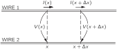

Предположим, мы наблюдаем за происходящим в двух соседних точках передающей линии, скажем, на расстояниях \(x\) и \(x+\Delta x\) от начала линии. Обозначим напряжение между проводниками через \(V(x)\) , а ток в верхнем проводнике — через \(I(x)\) (фиг. 24.2). Если ток в линии меняется, то индуктивность вызовет падение напряжения вдоль небольшого участка линии от \(x\) до \(x+\Delta x\) в размере
\[
\begin{equation*}
\Delta V=V(x+\Delta x)-V(x)=-L_0\,\Delta x\,\ddt{I}{t}.
\end{equation*}
\]
Или, беря предел при \(\Delta x\to0\) , мы получаем
\[
\begin{equation}
\label{Eq:II:24:1}
\ddp{V}{x}=-L_0\,\ddp{I}{t}.
\end{equation}
\]
Изменение тока приводит к перепаду напряжения.

Теперь еще раз взгляните на рисунок. Если напряжение в \(x\) меняется, то должны появляться заряды, которые на этом участке передаются емкости. Если взять небольшой участок линии от \(x\) до \(x+\Delta x\) , то заряд на нем равен \(q=C_0\,\Delta x V\) . Скорость изменения этого заряда равна \(C_0\,\Delta x\,dV/dt\) , но заряд меняется только тогда, когда ток \(I(x)\) , входящий в элемент, отличается от выходящего тока \(I(x+\Delta x)\) . Обозначая разность через \(\Delta I\) , имеем
\[
\begin{equation*}
\Delta I=-C_0\,\Delta x\,\ddt{V}{t}.
\end{equation*}
\]
Если перейти к пределу при \(\Delta x\to0\) , получается
\[
\begin{equation}
\label{Eq:II:24:2}
\ddp{I}{x}=-C_0\,\ddp{V}{t}.
\end{equation}
\]
Так что сохранение заряда предполагает, что градиент тока пропорционален скорости изменения напряжения во времени.

Уравнения и являются основными уравнениями линии передачи. При желании их можно видоизменить так, чтобы они учитывали сопротивление проводников или утечку зарядов через изоляцию между проводниками, но пока нам достаточно самого простого примера.

Оба уравнения передающей линии можно объединить, продифференцировав первое по \(t\) , а второе по \(x\) и исключив либо \(V\) , либо \(I\) . Получится либо
\[
\begin{equation}
\label{Eq:II:24:3}
\frac{\partial^2V}{\partial x^2} =C_0L_0\,\frac{\partial^2V}{\partial t^2}
\end{equation}
\]
или
\[
\begin{equation}
\label{Eq:II:24:4}
\frac{\partial^2I}{\partial x^2} =C_0L_0\,\frac{\partial^2I}{\partial t^2}
\end{equation}
\]

Мы снова узнаем волновое уравнение в \(x\) . В однородной передающей линии напряжение (и ток) распространяется вдоль линии как волна. Напряжение вдоль линии должно иметь вид \(V(x,t)=f(x-vt)\) или \(V(x,t)=g(x+vt)\) , или их сумму. А что такое здесь скорость \(v\) ? Мы знаем, что коэффициент при \(\partial^2/\partial t^2\) равен просто \(1/v^2\) , так что
\[
\begin{equation}
\label{Eq:II:24:5}
v=\frac{1}{\sqrt{L_0C_0}}.
\end{equation}
\]

Предлагаем вам самостоятельно показать, что напряжение для каждой волны в линии пропорционально току этой волны и что коэффициент пропорциональности — это просто характеристический импеданс \(z_0\) . Обозначив через \(V_+\) и \(I_+\) напряжение и ток для волны, бегущей в направлении \(x\) , вы должны будете получить
\[
\begin{equation}
\label{Eq:II:24:6}
V_+=z_0I_+.
\end{equation}
\]
. Равным образом для волны, бегущей в направлении минус \(x\) , соотношение имеет вид
\[
\begin{equation*}
V_-=z_0I_-.
\end{equation*}
\]

Характеристический импеданс, как мы уже видели из наших уравнений для фильтра, дается выражением
\[
\begin{equation}
\label{Eq:II:24:7}
z_0=\sqrt{\frac{L_0}{C_0}},
\end{equation}
\]
и поэтому есть чистое сопротивление.

Чтобы найти скорость распространения \(v\) и характеристический импеданс \(z_0\) передающей линии, нужно знать индуктивность и емкость единицы длины линии. Для коаксиального кабеля их легко подсчитать. Поглядим, как это делается. При расчете индуктивности мы будем следовать идеям, изложенным в гл. 17, § 8, и положим \(\tfrac{1}{2}LI^2\) равным магнитной энергии, в свою очередь получаемой интегрированием \(\epsO c^2B^2/2\) по объему. Пусть по внутреннему проводнику течет ток \(I\) ; тогда мы знаем, что \(B=I/2\pi\epsO c^2r\) , где \(r\) — расстояние от оси. Беря в качестве элемента объема цилиндрический слой толщины \(dr\) и длины \(l\) , получаем для магнитной энергии
\[
\begin{equation*}
U=\frac{\epsO c^2}{2}\int_a^b\biggl(
\frac{I}{2\pi\epsO c^2r}
\biggr)^2l\,2\pi r\,dr,
\end{equation*}
\]
где \(a\) и \(b\) — радиусы внутреннего и внешнего проводников. Интегрируя, получаем
\[
\begin{equation}
\label{Eq:II:24:8}
U=\frac{I^2l}{4\pi\epsO c^2}\ln\frac{b}{a}.
\end{equation}
\]
Приравниваем эту энергию к \(\tfrac{1}{2}LI^2\) и находим
\[
\begin{equation}
\label{Eq:II:24:9}
L=\frac{l}{2\pi\epsO c^2}\ln\frac{b}{a}.
\end{equation}
\]
Как и следовало ожидать, L пропорционально длине \(l\) линии, поэтому L0 (индуктивность на единицу длины) \(L_0\) равна
\[
\begin{equation}
\label{Eq:II:24:10}
L_0=\frac{\ln(b/a)}{2\pi\epsO c^2}.
\end{equation}
\]

Мы уже рассчитывали заряд на цилиндрическом конденсаторе (см. § 12–2). Деля теперь этот заряд на разность потенциалов, получаем
\[
\begin{equation*}
C=\frac{2\pi\epsO l}{\ln(b/a)}.
\end{equation*}
\]
Емкость же на единицу длины \(C_0\) — это \(C/l\) . Сопоставляя этот результат с (24.10), мы убеждаемся, что произведение \(L_0C_0\) равно просто \(1/c^2\) , так что \(v=1/\sqrt{L_0C_0}\) равно \(c\) . Волна бежит по линии со скоростью света. Нужно подчеркнуть, что этот результат зависит от сделанных предположений: а) что в промежутке между проводниками нет ни диэлектриков, ни магнитных материалов; б) что все токи текут только по поверхности проводников (так это бывает в идеальных проводниках). Позже мы увидим, что на высоких частотах все токи распределяются на поверхности хороших проводников, словно они идеальные проводники, так что это предположение правильно.

Любопытно, что до тех пор, пока предположения (а) и (б) верны, произведение \(L_0C_0\) равно \(1/c^2\) для любой пары параллельных проводников — даже, скажем, если внутренний шестигранный проводник расположен как угодно внутри эллиптического внешнего. Пока сечение постоянно и в пространстве между проводниками нет вещества, волны распространяются со скоростью света.

Подобных общих утверждений по поводу характеристического импеданса сделать нельзя. Для коаксиальной линии он равен
\[
\begin{equation}
\label{Eq:II:24:11}
z_0=\frac{\ln(b/a)}{2\pi\epsO c}.
\end{equation}
\]
. Множитель \(1/\epsO c\) имеет размерность сопротивления и равен \(120\pi\) ом. Геометрический фактор \(\ln(b/a)\) логарифмически зависит от размеров, поэтому для коаксиальной линии — как и для большинства других линий — характеристический импеданс обычно составляет от \(50\) ом или около того до нескольких сотен ом.

## 24–2 Прямоугольный волновод

Следующее явление, о котором мы хотим поговорить, на первый взгляд кажется поразительным: если убрать из коаксиальной линии центральный проводник, она все равно будет передавать электромагнитную энергию. Другими словами, на достаточно высоких частотах полая труба работает ничуть не хуже, чем труба с проводами. Это связано с тем таинственным обстоятельством, что на высоких частотах резонансный контур из конденсатора и катушки индуктивности заменяется просто пустой банкой.

Хотя это может показаться удивительным, если думать о передающей линии как о распределенных индуктивности и емкости, мы все знаем, что электромагнитные волны могут распространяться внутри полой металлической трубы. Если труба прямая, мы можем видеть сквозь нее! Значит, электромагнитные волны, безусловно, проходят через трубу. Но мы также знаем, что невозможно передавать низкочастотные волны (силовые или телефонные сигналы) внутри одной металлической трубы. Следовательно, электромагнитные волны могут проходить через нее лишь в том случае, если их длина волны достаточно мала. Поэтому мы хотим обсудить предельный случай самых длинных волн (или самых низких частот), которые могут пройти через трубу заданного размера. Поскольку труба в этом случае используется для переноса волн, она называется волноводом.

Начнем с прямоугольной трубы, ее проще всего анализировать. Сперва изложим все математически, а потом еще раз вернемся назад и рассмотрим вопрос более элементарно. Но этот более элементарный подход легко применить лишь к прямоугольным трубам. Основные же явления в любой трубе одни и те же, так что математические доводы звучат более основательно.

Наша задача состоит в том, чтобы найти, какого типа волны могут существовать внутри прямоугольной трубы. Выберем сначала удобные оси координат: ось \(z\) направим вдоль трубы, а оси \(x\) и \(y\) — вдоль ее сторон, как показано на фиг. 24.3.

### Figure Ch24-F3
Caption: Фиг. 24.3. Выбор осей координат для прямоугольного волновода.
Image: figures/Ch24-F3.svg

Известно, что когда волны света бегут по трубе, их электрическое поле поперечно; поэтому начнем с поиска таких решений, в которых \(\FLPE\) перпендикулярно \(z\) , скажем с одной только \(y\) -компонентой \(E_y\) . Это электрическое поле должно как-то меняться поперек волновода; действительно, ведь оно должно обратиться в нуль на сторонах, параллельных оси \(y\) : токи и заряды в проводнике устраиваются всегда так, чтобы на его поверхности не осталось никаких касательных составляющих электрического поля. Значит, график \(E_y\) от \(x\) должен напоминать некоторую дугу, как показано на фиг. 24.4. Может быть, это найденная нами для полости функция Бесселя? Нет, функции Бесселя появляются только в задачах с цилиндрической симметрией. При прямоугольных сечениях волны — это обычные гармонические функции, что-нибудь вроде \(\sin
k_xx\) .

### Figure Ch24-F4
Caption: Фиг. 24.4. Электрическое поле в волноводе при некотором значении \(z\) .
Image: figures/Ch24-F4.svg
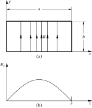

Раз мы ищем волны, которые бегут вдоль трубы, то следует ожидать, что поле как функция \(z\) будет колебаться между положительными и отрицательными значениями (фиг. 24.5) и что эти колебания будут бежать вдоль трубы с какой-то скоростью \(v\) . Если имеются колебания с определенной частотой \(\omega\) , то надо испытать, может ли волна меняться по \(z\) как \(\cos\,(\omega t-k_zz)\) или, в более удобной математической форме, как \(e^{i(\omega t-k_zz)}\) . Такая зависимость от \(z\) представляет волну, бегущую со скоростью \(v=\omega/k_z\) [см. гл. 29 (вып. 3)].

### Figure Ch24-F5
Caption: Фиг. 24.5. Зависимость \(z\) поля в волноводе.
Image: figures/Ch24-F5.svg

Значит, можно допустить, что волна в трубе имеет следующую математическую форму:
\[
\begin{equation}
\label{Eq:II:24:12}
E_y=E_0e^{i(\omega t-k_zz)}\sin k_xx.
\end{equation}
\]

Давайте-ка поглядим, можно ли при таком допущении удовлетворить правильным уравнениям поля. Во-первых, электрическое поле не должно иметь составляющих, касательных к проводнику. Для этого наше поле подходит; вверху и внизу оно направлено поперек стенок, а с боков равно нулю. Впрочем, для последнего необходимо, чтобы полволны \(k_x\) \(\sin k_xx\) как раз укладывалось на всей ширине волновода, т. е. чтобы было
\[
\begin{equation}
\label{Eq:II:24:13}
k_xa=\pi.
\end{equation}
\]
. Есть и иные возможности, например \(k_xa=2\pi\) , \(3\pi\) , \(\dotsc\) , или в общем случае
\[
\begin{equation}
\label{Eq:II:24:14}
k_xa=n\pi,
\end{equation}
\]
, где \(n\) — целое. Все они представляют различные сложные расположения полей, но мы дальше будем говорить о самом простом, когда \(k_x=\pi/a\) , а \(a\) — внутренняя ширина трубы.

Далее, дивергенция \(\FLPE\) в пустом пространстве внутри трубы должна быть равна нулю, потому что в трубе нет зарядов. У нашего \(\FLPE\) есть только \(y\) -компонента, но по \(y\) она не меняется, так что действительно \(\FLPdiv{\FLPE}=0\) .

Наконец, наше электрическое поле должно согласовываться с остальными уравнениями Максвелла для пустого пространства внутри трубы. Это все равно, что потребовать, чтобы оно удовлетворяло волновому уравнению
\[
\begin{equation}
\label{Eq:II:24:15}
\frac{\partial^2E_y}{\partial x^2}+
\frac{\partial^2E_y}{\partial y^2}+
\frac{\partial^2E_y}{\partial z^2}-
\frac{1}{c^2}\,\frac{\partial^2E_y}{\partial t^2}=0.
\end{equation}
\]
Нам надо проверить, подойдет ли сюда выбранная нами форма (24.12). Вторая производная \(E_y\) по \(x\) просто равна \(-k_x^2E_y\) . Вторая производная по \(y\) равна нулю, потому что от \(y\) ничего не зависит. Вторая производная по \(z\) есть \(-k_z^2E_y\) , а вторая производная по \(t\) есть \(-\omega^2E_y\) . Тогда уравнение (24.15) утверждает, что
\[
\begin{equation*}
k_x^2E_y+k_z^2E_y-\frac{\omega^2}{c^2}\,E_y=0.
\end{equation*}
\]
Если \(E_y\) не обращается всюду в нуль (этот случай нас не очень интересует), то это уравнение выполняется всегда, если
\[
\begin{equation}
\label{Eq:II:24:16}
k_x^2+k_z^2-\frac{\omega^2}{c^2}=0.
\end{equation}
\]
Число \(k_x\) мы уже закрепили, так что это уравнение говорит нам, что волны предположенного нами типа возможны лишь тогда, когда \(k_z\) связано с частотой \(\omega\) так, чтобы выполнялось уравнение (24.16), т. е. если
\[
\begin{equation}
\label{Eq:II:24:17}
k_z=\sqrt{(\omega^2/c^2)-(\pi^2/a^2)}.
\end{equation}
\]
Волны, которые мы описали, распространяются в направлении \(z\) с таким значением \(k_z\) .

Волновое число \(k_z\) , которое мы получили из (24.17), дает нам при данной частоте \(\omega\) скорость, с которой бегут вдоль трубы узлы волны. Фазовая скорость равна
\[
\begin{equation}
\label{Eq:II:24:18}
v=\frac{\omega}{k_z}.
\end{equation}
\]

Вспомните теперь, что длина \(\lambda\) бегущей волны дается формулой \(\lambda=2\pi v/\omega\) , так что \(k_z\) также равняется \(2\pi/\lambda_g\) , где \(\lambda_g\) — длина волны осцилляций в направлении \(z\) — «длина волны в волноводе». Длина волны в волноводе, конечно, отличается от длины электромагнитных волн той же частоты, но в пустом пространстве. Если длину волны в пустом пространстве обозначить \(\lambda_0\) (что равно \(2\pi
c/\omega\) ), то (24.17) можно переписать в таком виде:
\[
\begin{equation}
\label{Eq:II:24:19}
\lambda_g=\frac{\lambda_0}{\sqrt{1-(\lambda_0/2a)^2}}.
\end{equation}
\]

Помимо электрических полей существуют и магнитные поля, которые также движутся волнообразно, однако мы не будем сейчас заниматься выводом выражений для них. Поскольку \(c^2\FLPcurl{\FLPB}=\ddpl{\FLPE}{t}\) , линии \(\FLPB\) будут циркулировать вокруг областей, где \(\ddpl{\FLPE}{t}\) наибольшее, т. е. на полпути между максимумом и минимумом \(\FLPE\) . Петли \(\FLPB\) лежат параллельно плоскости \(xz\) и располагаются между гребнями и впадинами \(\FLPE\) , как показано на фиг. 24.6.

### Figure Ch24-F6
Caption: Фиг. 24.6. Магнитное поле в волноводе.
Image: figures/Ch24-F6.svg
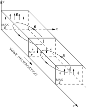

## 24–3 Граничная частота

Уравнение (24.16) для \(k_z\) на самом деле имеет два корня — один с плюсом, другой с минусом. Ответ следует писать так:
\[
\begin{equation}
\label{Eq:II:24:20}
k_z=\pm\sqrt{(\omega^2/c^2)-(\pi^2/a^2)}.
\end{equation}
\]
Смысл этих двух знаков просто в том, что волны в волноводе могут бежать и с отрицательной фазовой скоростью (в направлении \(-z\) ), и с положительной. Волны, естественно, должны иметь возможность бежать в любую сторону. И раз одновременно могут существовать оба типа волн, то решение в виде стоячих волн тоже возможно.

Наше уравнение для \(k_z\) сообщает нам также, что высшие частоты приводят к большим значениям \(k_z\) , т. е. к более коротким волнам, пока в пределе больших \(\omega\) величина \(k\) не станет равной \(\omega/c\) — тому значению, которое бывает, когда волна бежит в пустоте. Свет, который мы «видим» сквозь трубу, все еще бежит со скоростью \(c\) . Но посмотрите зато, какая странная вещь получается, когда частота убывает. Сперва волны становятся все длиннее и длиннее, но если \(\omega\) станет чересчур малой, то под корнем в (24.20) внезапно появится отрицательное число. Это произойдет, как только \(\omega\) станет меньше \(\pi c/a\) — или когда \(\lambda_0\) станет больше \(2a\) . Иначе говоря, когда частота становится меньше некоторой критической частоты \(\omega_c=\pi c/a\) , волновое число \(k_z\) (а также \(\lambda_g\) ) становится мнимым и никакого решения у нас не остается. Или остается? Кто, собственно, сказал, что \(k_z\) должно быть действительным? Что случится, если оно станет мнимым? Уравнения-то поля по-прежнему ведь будут удовлетворяться. Может быть, и мнимый \(k_z\) тоже представляет какую-то волну?

Предположим, что \(\omega\) меньше, чем \(\omega_c\) ; тогда можно написать
\[
\begin{equation}
\label{Eq:II:24:21}
k_z=\pm ik',
\end{equation}
\]
где \(k'\) — действительное положительное число:
\[
\begin{equation}
\label{Eq:II:24:22}
k'=\sqrt{(\pi^2/a^2)-(\omega^2/c^2)}.
\end{equation}
\]
Если теперь вернуться к нашей формуле (24.12) для \(E_y\) , то надо будет написать
\[
\begin{equation}
\label{Eq:II:24:23}
E_y =E_0e^{i(\omega t\mp ik'z)}\sin k_xx,
\end{equation}
\]
что можно также представить в виде
\[
\begin{equation}
\label{Eq:II:24:24}
E_y =E_0e^{\pm k'z}e^{i\omega t}\sin k_xx.
\end{equation}
\]

Это выражение приводит к полю \(\FLPE\) , которое во времени колеблется как \(e^{i\omega t}\) , а по \(z\) меняется как \(e^{\pm k'z}\) . Оно плавно убывает или возрастает с \(z\) , как всякая действительная экспонента. В нашем выводе мы не думали о том, откуда взялись волны, где их источник, но, конечно, где-то в волноводе он должен быть. И знак, который стоит при \(k'\) , должен быть таков, чтобы поле убывало при удалении от источника волн.

Итак, при частотах ниже \(\omega_c=\pi c/a\) волны вдоль трубы не распространяются; осциллирующее поле проникает в трубу лишь на расстояние порядка \(1/k'\) . По этой причине частоту \(\omega_c\) называют «граничной частотой» волновода. Глядя на уравнение (24.22), мы видим, что для частот чуть пониже \(\omega_c\) число \(k'\) мало, и поля могут проникать в трубу довольно далеко. Но если \(\omega\) намного меньше \(\omega_c\) , коэффициент в экспоненте \(k'\) равняется \(\pi/a\) и поле отмирает чрезвычайно быстро, как показано на фиг. 24.7. Поле убывает в \(1/e\) раз на расстоянии \(a/\pi\) , т. е. на трети ширины волновода. Поля проникают в волновод на очень малое расстояние от источника.

### Figure Ch24-F7
Caption: Фиг. 24.7. Изменение \(E_y\) с ростом \(z\) при \(\omega\ll\omega_c\) .
Image: figures/Ch24-F7.svg

Мы хотим еще раз подчеркнуть эту характерную черту нашего анализа прохождения волн по трубе — появление мнимого волнового числа \(k_z\) . Когда, решая уравнение в физике, мы получаем мнимое число, то это обычно ничего физического не означает. Для волн, однако, мнимое волновое число действительно нечто означает. Волновое уравнение по-прежнему удовлетворяется; оно только означает, что решение приводит к экспоненциально убывающему полю вместо распространяющихся волн. Итак, если в любой задаче на волны \(k\) при какой-то частоте становится мнимым, это означает, что форма волны меняется — синусоида переходит в экспоненту.

## 24–4 Скорость волн в волноводе

Та скорость волн, о которой мы пока говорили, — это фазовая скорость, т. е. скорость узлов волны; она есть функция частоты. Если подставить
\[
\begin{equation}
\label{Eq:II:24:25}
v_{\text{phase}}=\frac{c}{\sqrt{1-(\omega_c/\omega)^2}}.
\end{equation}
\]
, то можно написать: для частот выше граничной (для которых бегущая волна существует) \(\omega_c/\omega\) меньше единицы, \(v_{\text{phase}}\) — действительное число, большее скорости света. Мы уже видели в гл. 48 (вып. 4), что фазовые скорости, большие скорости света, возможны, потому что это просто движутся узлы волн, а не энергия и не информация. Чтобы узнать, как быстро движутся сигналы, надо подсчитать быстроту всплесков или модуляций, вызываемых интерференцией волн одной частоты с одной или несколькими волнами слегка иных частот [см. гл. 48 (вып. 4)]. Скорость огибающей такой группы волн мы назвали групповой скоростью; это не \(\omega/k\) , а \(d\omega/dk\) :
\[
\begin{equation}
\label{Eq:II:24:26}
v_{\text{group}}=\ddt{\omega}{k}.
\end{equation}
\]
Дифференцируя \(\omega\) по \(d\omega/dk\) , чтобы получить
\[
\begin{equation}
\label{Eq:II:24:27}
v_{\text{group}}=c\sqrt{1-(\omega_c/\omega)^2},
\end{equation}
\]
, мы находим, что это меньше скорости света.

Среднее геометрическое между \(v_{\text{phase}}\) и \(v_{\text{group}}\) в точности равно \(c\) — скорости света:
\[
\begin{equation}
\label{Eq:II:24:28}
v_{\text{phase}}v_{\text{group}}=c^2.
\end{equation}
\]
Это любопытно, ведь сходное соотношение мы встречали и в квантовой механике. У частицы с любой скоростью (даже у релятивистской) импульс \(p\) и энергия \(U\) связаны соотношением
\[
\begin{equation}
\label{Eq:II:24:29}
U^2=p^2c^2+m^2c^4.
\end{equation}
\]
Но в квантовой механике энергия — это \(\hbar\omega\) , а импульс — это \(\hbar/\lambdabar\) , что равно \(\hbar k\) ; значит, (24.29) можно записать так:
\[
\begin{equation}
\label{Eq:II:24:30}
\frac{\omega^2}{c^2}=k^2+\frac{m^2c^2}{\hbar^2},
\end{equation}
\]
или
\[
\begin{equation}
\label{Eq:II:24:31}
k=\sqrt{(\omega^2/c^2)-(m^2c^2/\hbar^2)},
\end{equation}
\]
а это очень похоже на (24.17)... Интересно, не правда ли?

Групповая скорость волн — это также скорость, с которой энергия передается по волноводу. Если нужно найти поток энергии сквозь волновод, его можно получить, умножив плотность энергии на групповую скорость. Если среднее квадратичное электрическое поле равно \(E_0\) , то средняя плотность электрической энергии равна \(\epsO E_0^2/2\) . Существует также энергия, связанная с магнитным полем. Мы не будем здесь это доказывать, но в любой полости или волноводе магнитная и электрическая энергии равны между собой, так что полная плотность электромагнитной энергии равна \(\epsO
E_0^2\) . Мощность \(dU/dt\) , передаваемая волноводом, поэтому равна
\[
\begin{equation}
\label{Eq:II:24:32}
\ddt{U}{t}=\epsO E_0^2abv_{\text{group}}.
\end{equation}
\]
(Позже мы рассмотрим другой, более общий способ вычисления потока энергии.)

## 24–5 Как наблюдать волны в волноводе

Энергию можно ввести в волновод с помощью какой-нибудь «антенны». Например, для этой цели подойдет вертикальная проволочка, или «штырь». Наличие направляемых волн можно обнаружить, отведя из него часть электромагнитной энергии с помощью приемной «антенны», которой опять же может служить небольшой штырь или петелька. На фиг. 24.8 показан волновод, часть стенок на рисунке выхвачена, чтобы были видны входной штырь и приемный «пробник». Входной штырь можно подключить к генератору сигналов через коаксиальный кабель, а приемный пробник аналогичным кабелем можно соединить с детектором. Обычно удобно вводить приемный пробник через длинную узкую прорезь в стенке волновода, как показано на фиг. 24.8. Тогда пробник можно перемещать туда и обратно вдоль волновода, чтобы измерять поле в различных точках.

### Figure Ch24-F8
Caption: Фиг. 24.8. Волновод с возбуждающим штырем и приемным пробником.
Image: figures/Ch24-F8.svg
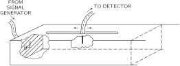

Если подать с сигнал-генератора частоту \(\omega\) , большую, чем граничная частота \(\omega_c\) , то по волноводу от штыря побегут волны. Если волновод бесконечной длины, то никаких волн, кроме этих, не будет (чтобы сделать его бесконечным, надо на конце его поставить тщательно сконструированный поглотитель, который не допустит отражения от этого конца). Тогда, поскольку детектор измеряет поле близ пробника, усредненное по времени, то он будет воспринимать сигнал, не зависящий от положения в волноводе; на выходе будет регистрироваться величина, пропорциональная передаваемой мощности.

Если теперь дальний конец волновода закрыт так, что возникает отраженная волна — в предельном случае, если мы закроем его металлической пластинкой, — то помимо первоначальной бегущей волны появится отраженная. Эти две волны будут интерферировать и создадут в волноводе стоячую волну, подобную стоячим волнам в струне, которые мы обсуждали в гл. 49 (вып. 1). В этом случае по мере перемещения приемного пробника вдоль линии показания детектора будут периодически повышаться и падать, демонстрируя максимум поля на каждом пучности стоячей волны и минимум в каждом узле. Расстояние между двумя последовательными узлами (или пучностями) равно в точности \(\lambda_g/2\) . Это дает удобный способ измерения длины волны в волноводе. Если теперь сдвигать частоту ближе к \(\omega_c\) , расстояние между узлами увеличивается, показывая, что длина волны в волноводе изменяется в соответствии с предсказанием формулы (24.19).

Пусть теперь наш сигнал-генератор включен на частоту, чуть-чуть меньшую, чем \(\omega_c\) . Тогда показания детектора будут постепенно падать по мере того, как пробник удаляется вдоль волновода. Если еще понизить частоту, напряженность поля начнет убывать быстрее, следуя кривой фиг. 24.7 и показывая, что волны не распространяются.

## 24–6 Сочленение волноводов

Важное практическое применение волноводов состоит в передаче высокочастотной мощности. Ими, например, соединяют высокочастотный осциллятор или выходной усилитель радиолокатора с антенной. Сама же антенна обычно состоит из параболического рефлектора, в фокус которого подается энергия от волновода, расширяющегося на конце в виде «рога», который излучает волны, приходящие по волноводу. Хотя высокую частоту можно передавать и по коаксиальному кабелю, волновод все же лучше — по нему можно передавать большую мощность. Во-первых, передаваемая по кабелю мощность ограничена опасностью пробоя изоляции (твердой или газообразной) между проводниками. Напряженности полей в волноводе при данной мощности обычно не столь велики, как в кабеле, так что можно передавать большие мощности, не опасаясь пробоя. Во-вторых, потери мощности в коаксиальном кабеле обычно больше, чем в волноводе. В кабель приходится ставить изоляционный материал, чтобы поддержать внутренний проводник, и в этом материале возникают потери энергии, особенно при высоких частотах. Кроме того, плотности тока во внутреннем проводе весьма высоки, а поскольку потери пропорциональны квадрату плотности тока, то чем слабее ток в стенках волновода, тем меньше потери энергии. Чтобы свести эти потери к минимуму, внутреннюю поверхность волновода часто покрывают хорошо проводящим материалом, скажем серебром.

### Figure Ch24-F9
Caption: Фиг. 24.9. Секции волновода, соединенные фланцами.
Image: figures/Ch24-F9.jpg
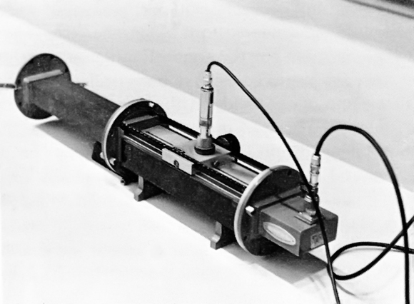

Проблема сочленения «контуров» с волноводами резко отличается от аналогичной задачи при низких частотах. Ее часто называют микроволновым «сочленением». Для этой цели было придумано много приборов. Например, две секции волновода обычно связываются при помощи фланцев, как показано на фиг. 24.9. Однако такое соединение может повлечь за собой серьезные потери энергии, потому что через него должны протекать поверхностные токи, сопротивление которых может быть довольно высоким. Один из способов избежать потерь — сделать фланцы так, как показано на сечении, изображенном на фиг. 24.10. Между соседними секциями волновода оставляют небольшой зазор, а на торце одного из фланцев делают желобок, образующий небольшую полость того типа, что показана на фиг. 23.16,в. Размеры выбирают так, чтобы эта полость резонировала на используемой частоте. У такой резонансной полости очень высокий «импеданс» для токов, поэтому через металлическое соединение (в точке \(a\) на фиг. 24.10) течет сравнительно слабый ток. Сильные токи в волноводе просто заряжают и разряжают «емкость» щели (в точке \(b\) на рисунке), где энергия рассеивается слабо.

### Figure Ch24-F10
Caption: Фиг. 24.10. Сочленение двух секций волновода, дающее малые потери.
Image: figures/Ch24-F10.svg
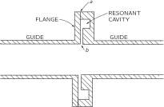

Представьте, что вам нужно закрыть волновод так, чтобы не возникло никаких отраженных волн. Значит, надо в конце поставить что-нибудь такое, что сможет имитировать бесконечность волновода. Нужно такое «конечное» устройство, которое действовало бы на волновод так, как действует на передающую линию ее характеристический импеданс — что-то, что только поглощает набегающие волны, но не отражает их. Тогда волновод будет действовать так, будто он бесконечный. Такие окончания получаются, если поставить внутрь трубы тщательно изготовленные клинья из поглощающего материала, которые поглощают энергию волны и почти не генерируют отраженных волн.

### Figure Ch24-F11
Caption: Фиг. 24.11. Волновод «Г». На фланцы надеты пластмассовые колпачки, предохраняющие внутреннюю часть «Г» от загрязнения в неработающем состоянии.
Image: figures/Ch24-F11.jpg
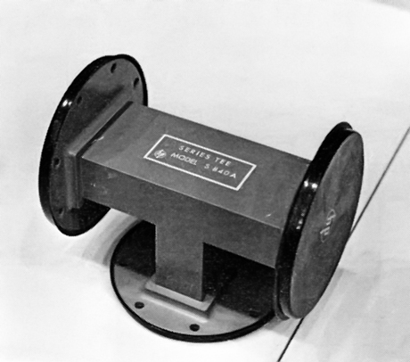

Если вам нужно соединить между собой три элемента, скажем один источник и две антенны, то для этого годится устройство в виде «Т», как показано на фиг. 24.11. Мощность, подводимая центральной секцией этого «Т», расщепляется и расходится по двум рукавам (здесь еще может произойти и отражение волн). Из схемы, представленной на фиг. 24.12, можно качественно увидеть, что поля на конце входной секции могут разойтись и создать электрические поля, которые дадут начало волнам, разбегающимся по рукавам. Смотря по тому, перпендикулярны ли электрические поля «верхушке» нашего «Т» или параллельны ей, поля в месте сочленения могут оказаться либо такими, как на фиг. 24.12, а, либо как на фиг. 24.12,6.

### Figure Ch24-F12
Caption: Фиг. 24.12. Электрические поля в волноводе «Г» при двух возможных ориентациях поля.
Image: figures/Ch24-F12.svg
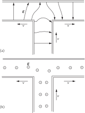

Наконец, хотелось бы описать прибор, именуемый «направленным ответвителем». Это очень полезное устройство, когда нужно узнать, что получилось после того, как вы сочленили между собой какое-то сложное расположение волноводов. Например, нужно узнать, в какую сторону бегут волны в той или иной секции трубы; скажем, необходимо представить себе, насколько сильна в ней отраженная волна. Направленный ответвитель отбирает немножко мощности у волновода, если по нему бежит волна в одну сторону, и не отбирает ничего, если она бежит в другую. Подключив выход соединителя к детектору, можно измерить «одностороннюю» мощность в волноводе.

### Figure Ch24-F13
Caption: Фиг. 24.13. Направленный ответвитель.
Image: figures/Ch24-F13.svg
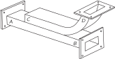

На фиг. 24.13 представлен направленный ответвитель; к одной из сторон куска волновода \(AB\) припаян другой кусок волновода \(CD\) . Труба \(CD\) отогнута в сторону так, чтобы поместился соединительный фланец. Прежде чем спаять трубы, через соседние их стенки насквозь просверлили пару (или несколько) отверстий, чтобы через них часть полей в главном волноводе \(AB\) могла пройти во вторичный волновод \(CD\) . Каждое отверстие действует как антенна — генерирует волны во вторичном волноводе. Если бы отверстие было одно, то волны расходились бы в обе стороны и были бы одинаковы независимо от того, куда направлены волны в первичном волноводе. Но когда отверстий два и когда расстояние между ними равно четверти длины волны в волноводе, то они представляют собой два источника \(90^\circ\) , сдвинутые по фазе. А вы помните, мы рассматривали в гл. 29 (вып. 3) интерференцию волн от двух антенн, раздвинутых на \(\lambda/4\) и возбуждаемых со сдвигом \(90^\circ\) по фазе? Мы установили тогда, что в одном направлении волны вычитаются, а в другом складываются. То же самое происходит и здесь. Волна, генерируемая в \(CD\) , будет бежать в ту же сторону, что и в \(AB\) .

Если волна в первичном волноводе бежит от \(A\) к \(B\) , то на выходе \(D\) вторичного волновода мы тоже заметим волну. Если же волна в первичном волноводе бежит от \(B\) к \(A\) , то во вторичном волноводе волна побежит к концу \(C\) . А на этом конце стоит такое окончание, что эта волна в нем поглотится и на выходе ответвителя волн вообще не будет.

## 24–7 Типы волн в волноводе

### Figure Ch24-F14
Caption: Фиг. 24.14. Еще одна возможная зависимость \(E_y\) от \(x\)
Image: figures/Ch24-F14.svg

Выбранная нами для анализа волна — всего лишь одно из решений уравнений поля. Их на самом деле куда больше. Каждое решение представляет собой свой «тип волны» (моду) в волноводе. Скажем, в нашей волне зависимость от \(x\) соответствовала лишь половине синусоиды. Ничуть не хуже решение, в котором укладывается вся синусоида; изменение \(E_y\) с \(x\) тогда показано на фиг. 24.14. У этого типа волн \(k_x\) вдвое больше, и граничная частота много выше. Кроме того, изученная нами волна \(\FLPE\) имеет лишь \(y\) -компоненту, но бывают и типы волн с более сложными электрическими полями. Если у электрического поля есть только \(x\) - и \(y\) -компоненты, так что оно всегда перпендикулярно оси \(z\) , то такой тип волн называется «поперечным электрическим» (или сокращенно ТЕ) типом волн. Магнитное поле в волне такого типа всегда обладает \(z\) -компонентой. Далее, оказывается, что если у \(\FLPE\) есть компонента в направлении \(z\) (вдоль направления распространения), то у магнитного поля есть только поперечные компоненты. Такие поля называются «поперечными магнитными» (сокращенно ТМ) типами волн. В прямоугольном волноводе все другие типы обладают более высокой граничной частотой, чем описанный нами простой ТЕ-тип. Поэтому всегда возможно (и так обычно делают) использовать такой волновод, в котором частота немного превышает граничную частоту этого наинизшего типа колебаний, но находится ниже граничных частот всех других типов. В таком волноводе распространяется волна только одного типа. В противном случае поведение волн усложняется и его трудно контролировать.

## 24–8 Другой способ рассмотрения волн в волноводе

Теперь я хочу по-другому объяснить вам, почему волновод так сильно ослабляет поля, частота которых ниже граничной частоты \(\omega_c\) . Я хочу, чтобы вы получили более «физическое» представление о том, почему так резко меняется поведение волновода при низких и при высоких частотах. Для прямоугольного волновода это можно сделать, анализируя поля на языке отражений (или изображений) в стенках волновода. Такой подход годится, однако, только для прямоугольных волноводов; вот почему мы начали с математического анализа, который в принципе годится для волноводов любой формы.

Для описанного нами типа колебаний вертикальные размеры (вдоль \(y\) ) не имели никакого значения, поэтому можно не обращать внимания на верх и низ волновода и представлять себе, что волновод в вертикальном направлении простирается бесконечно. Мы представляем себе тогда, что волновод просто состоит из двух вертикальных пластин, удаленных друг от друга на расстояние \(a\) .

Давайте возьмем в качестве источника полей вертикальный провод между пластинами; по нему течет ток, который меняется с частотой \(\omega\) . Если бы волновод не имел стенок, то от такого провода расходились бы цилиндрические волны.

Теперь мы считаем, что стенки волновода — идеальные проводники. Тогда, в точности как в электростатике, условия на поверхности будут выполнены, если к полю провода мы добавим поле одного или нескольких правильно подобранных его изображений. Представление об изображениях работает в электродинамике ничуть не хуже, чем в электростатике, при условии, конечно, что мы учитываем запаздывание. Мы знаем, что это так, потому что мы много раз видели в зеркале изображение источника света. А зеркало — это и есть «идеальный» проводник для электромагнитных волн оптической частоты.

### Figure Ch24-F15
Caption: Фиг. 24.15. Линейный источник \(S_0\) между проводящими плоскими стенками \(W_1\) и \(W_2\) . Стенки можно заменить бесконечной последовательностью изображений источников.
Image: figures/Ch24-F15.svg

Рассечем наш волновод горизонтально, как показано на фиг. 24.15, где \(W_1\) и \(W_2\) — стенки волновода, а \(S_0\) — источник (провод). Обозначим направление тока в проводе знаком плюс. Будь у волновода лишь одна стенка, скажем \(W_1\) , ее можно было бы убрать, поместив изображение источника (с противоположной полярностью) в точке \(S_1\) . Но при двух стенках появится также изображение \(S_0\) в стенке \(W_2\) ; обозначим его \(S_2\) . Этот источник также будет обладать своим изображением в \(W_1\) , обозначим его \(S_3\) . Дальше, сами \(S_1\) и \(S_3\) изобразятся в \(W_2\) точками \(S_4\) и \(S_6\) и т. д. И для нашей пары плоских проводников с источником посредине поле между проводниками совпадает с полем, генерируемым бесконечной цепочкой источников на расстоянии \(a\) друг от друга. (Это на самом деле как раз то, что вы увидите, посмотрев на провод, расположенный посредине между двумя параллельными зеркалами.) Чтобы поля обращались в нуль на стенках, полярности токов в изображениях должны меняться от одного изображения к следующему. Иначе говоря, их фаза меняется на \(180^\circ\) . Поле волновода — это просто суперпозиция полей всей этой бесконечной совокупности линейных источников.

Известно, что вблизи от источников поле очень напоминает статические поля. В гл. 7, § 5 мы рассматривали статическое поле сетки линейных источников и нашли, что оно похоже на поле заряженной пластины, если не считать членов ряда, убывающих по мере удаления от сетки экспоненциально. У нас средняя сила источников равна нулю, потому что у каждой пары соседних источников знаки противоположны. Любые поля, существующие здесь, должны с расстоянием убывать экспоненциально. Вплотную к источнику мы в основном воспринимаем поле этого ближайшего источника; на больших расстояниях уже воздействует несколько источников, и их суммарное влияние дает нуль. Мы теперь понимаем, отчего волновод ниже граничной частоты дает экспоненциально убывающее поле. При низких частотах годится статическое приближение, и оно предсказывает быстрое ослабление полей с расстоянием.

Теперь же возникает противоположный вопрос: почему в таком случае волны вообще распространяются? Это выглядит таинственно! А причина в том, что при высоких частотах запаздывание полей может внести в фазу добавочные изменения, которые могут привести к тому, что поля источников с противоположной фазой будут усиливать, а не гасить друг друга. В гл. 29 (вып. 1) мы уже изучали как раз для этой задачи поля, создаваемые системой антенн или оптической решеткой. Тогда мы обнаружили, что соответствующее расположение нескольких радиоантенн может привести к такой интерференционной картине, что в одном направлении сигнал будет очень сильный, а в других сигналов вообще не будет.

### Figure Ch24-F16
Caption: Фиг. 24.16. Одна совокупность когерентных волн от вереницы линейных источников.
Image: figures/Ch24-F16.svg
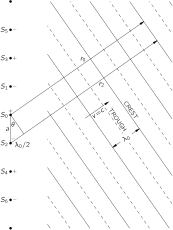

Вернемся к фиг. 24.15 и посмотрим на поля на большом расстоянии от линии изображений источников. Поля будут велики лишь в некоторых направлениях, зависящих от частоты, именно в тех направлениях, в каких поля всех источников попадают в фазу друг к другу и складываются. На заметном расстоянии от источников поле в этих специальных направлениях распространяется как плоские волны. Мы изобразили такую волну на фиг. 24.16, где сплошными линиями даны гребни волн, а штрихом — впадины. Направление волны должно быть таким, чтобы разность запаздываний от двух соседних источников до гребня волны отвечала полупериоду колебания. Иными словами, разность между \(r_2\) и \(r_0\) в фигуре равна половине длины волны в пустом пространстве:
\[
\begin{equation}
r_2-r_0=\frac{\lambda_0}{2}.\notag
\end{equation}
\]
Угол \(\theta\) дается условием
\[
\begin{equation}
\label{Eq:II:24:33}
\sin\theta=\frac{\lambda_0}{2a}.
\end{equation}
\]

Существует, конечно, и другая совокупность волн, бегущих вниз под симметричным углом по отношению к линии источников. Полное поле в волноводе (не слишком близко к источнику) является суперпозицией этих двух совокупностей волн, как показано на фиг. 24.17. Конечно, в действительности картина истинных полей совпадает с изображенной лишь в пространстве между стенками волновода.

### Figure Ch24-F17
Caption: Фиг. 24.17. Поле в волноводе можно рассматривать как наложение двух верениц плоских волн.
Image: figures/Ch24-F17.svg
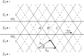

В таких точках, как \(A\) и \(C\) , гребни двух волновых картин совпадут, и у поля будет максимум; в точках же наподобие \(B\) пики обеих волн направлены в отрицательную сторону, и поле обладает минимумом (наименьшим отрицательным значением). С течением времени поле в волноводе будет двигаться вдоль него. Длина волны будет равна \(\lambda_g\) — расстоянию от \(A\) до \(C\) . Она связана с \(\theta\) формулой
\[
\begin{equation}
\label{Eq:II:24:34}
\cos\theta=\frac{\lambda_0}{\lambda_g}.
\end{equation}
\]
. Подставляя (24.33) вместо \(\theta\) , получаем
\[
\begin{equation}
\label{Eq:II:24:35}
\lambda_g=\frac{\lambda_0}{\cos\theta}=
\frac{\lambda_0}{\sqrt{1-(\lambda_0/2a)^2}},
\end{equation}
\]
, что в точности совпадает с (24.19).

Теперь нам понятно, почему волны распространяются только выше граничной частоты \(\omega_0\) . Если длина волны в пустом пространстве больше \(2a\) , то не существует угла, под которым может появиться волна, показанная на фиг. 24–16. Необходимая для этого конструктивная интерференция возникает внезапно, едва \(\lambda_0\) оказывается меньше \(2a\) , или, что то же самое, когда \(\omega\) становится больше \(\omega_0=\pi c/a\) .

Если частота достаточно высока, то может появиться два или больше возможных направления распространения волн. В нашем случае это произойдет при \(\lambda_0<\tfrac{2}{3}a\) . Но вообще-то это может происходить и при \(\lambda_0<a\) . Эти добавочные волны отвечают высшим типам волн, о которых мы говорили.

После нашего анализа становится также ясно, отчего фазовая скорость волн, бегущих по трубе, превышает \(c\) и почему эта скорость зависит от \(\omega\) . Когда меняется \(\omega\) , меняется угол, под которым в пустом пространстве распространяются волны (фиг. 24.16), а вместе с этим меняется и скорость вдоль трубы.

Хотя мы описали волны в волноводе в виде суперпозиции полей бесконечной совокупности линейных источников, можно убедиться в том, что тот же результат можно было бы получить, представив себе две совокупности волн в пустом пространстве, многократно отражаемых от двух идеальных зеркал вперед и назад, и вспоминая, что подобное отражение означает перемену знака фазы. Эти совокупности отражаемых волн гасили бы друг друга под всеми углами, кроме угла \(\theta\) , заданного в формуле (24.33). Одну и ту же вещь можно рассматривать многими способами.
