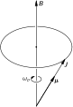
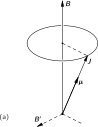
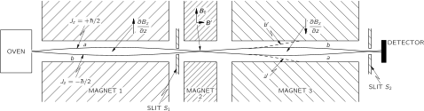
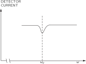
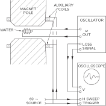

SOURCE: Feynman Lectures on Physics, Volume II, Chapter 35
LANGUAGE: ru
TITLE: Глава 35. ПАРАМАГНЕТИЗМ И МАГНИТНЫЙ РЕЗОНАНС
SOURCE_URL: https://www.feynmanlectures.caltech.edu/II_35.html
NOTEBOOKLM_USE: clean lecture text with TeX math and figure captions; reader navigation removed.

# Глава 35. ПАРАМАГНЕТИЗМ И МАГНИТНЫЙ РЕЗОНАНС

## 35–1 Квантованные магнитные состояния

В предыдущей главе мы говорили, что в квантовой механике момент количества движения системы не может иметь произвольного направления, а его компоненты вдоль данной оси могут принимать только определенные дискретные эквидистантные значения. Это поразительная, но характерная особенность квантовой механики. Вам может показаться, что еще слишком рано влезать в такие вещи, что надо подождать, пока вы хоть немного не привыкнете к ним и не будете готовы воспринимать подобные идеи. Но дело в том, что привыкнуть к ним вы никогда не сможете. Вы никогда не сможете легко их воспринимать. Это, пожалуй, самое сложное из всего, что я рассказывал вам до сих пор и, главное, нет способа описать это как-то более вразумительно, не так хитроумно и сложно по форме. Поведение вещества в малых масштабах, как я уже говорил много раз, отличается от всего того, к чему вы привыкли, и поистине весьма странно. Вы, конечно, согласитесь, что было бы неплохо попытаться поближе познакомиться с явлениями в малом масштабе, продолжая одновременно использовать классическую физику, и приобрести поначалу хоть какой-то опыт, пусть даже не понимая всего достаточно глубоко. Понимание этих вещей приходит очень медленно, если оно приходит вообще. Конечно, понемногу начинаешь чувствовать, что может и что не может произойти в данной квантовомеханической ситуации, а это, возможно, и называется «пониманием», но добиться приятного чувства «естественности» квантовомеханических правил здесь невозможно. Они-то, конечно, естественны, но с точки зрения нашего повседневного опыта на привычном уровне остаются очень уж необычными. Мне бы хотелось объяснить вам, что позиция, которую мы собираемся занять по отношению к этому правилу о дискретности значений момента количества движения, совершенно отлична от отношения ко многим другим вещам, о которых шла речь. Я даже не буду пытаться «объяснять» его, но должен хоть рассказать вам, что получается. Было бы нечестно с моей стороны, описывая магнитные свойства материалов, не указать, что классическое объяснение магнетизма, т. е. момента количества движения и магнитного момента, несостоятельно.

Одна из наиболее поразительных и тревожащих особенностей квантовой механики состоит в том, что момент количества движения вдоль любой оси всегда оказывается равным целому или полуцелому числу, умноженному на \(\hbar\) . И это справедливо для любой оси, которую вы выберете. Тонкости, связанные с этим любопытным фактом — что вы можете выбрать любую другую ось и обнаружить, что компонента вдоль нее также принимает значения из того же самого набора, — мы оставим до лучших времен, когда вы сможете насладиться тем, как этот кажущийся парадокс в конце концов разрешится.

Сейчас просто примите на веру, что у каждой атомной системы есть число \(j\) , называемое спином системы (оно может быть либо целым, либо полуцелым), и что компоненты момента количества движения относительно любой данной оси всегда принимают одно из значений между \(+j\hbar\) и \(-j\hbar\) :
\[
\begin{equation}
\label{Eq:II:35:1}
J_z=\text{one of}\,
\left\{
\begin{array}{@{}l@{}}
\phantom{-}j\\
\phantom{-}j-1\\
\phantom{-}j-2\\
\phantom{-j}\:\:\vdots\\
-j+2\\
-j+1\\
-j
\end{array}
\right\}
\cdot\hbar.
\end{equation}
\]

Мы также упоминали, что магнитный момент любой простой атомной системы имеет то же самое направление, что и ее момент количества движения. Это справедливо не только для атомов или ядер, но и для элементарных частиц. Каждая элементарная частица обладает характерной для нее величиной \(j\) и своим собственным магнитным моментом. (Для некоторых частиц обе они равны нулю.) Под «магнитным моментом системы» мы понимаем, что ее энергия в направленном по оси z магнитном поле для слабых полей может быть записана как \(z\) \(-\mu_zB\) . Мы должны условиться не брать слишком больших полей, ибо они будут возмущать внутренние движения системы и энергия не будет мерой магнитного момента, который система имела до включения магнитного поля. Но если поле достаточно слабо, то оно изменяет энергию на величину
\[
\begin{equation}
\label{Eq:II:35:2}
\Delta U=-\mu_zB,
\end{equation}
\]
с тем условием, что в этом выражении мы должны сделать подстановку \(\mu_z\)
\[
\begin{equation}
\label{Eq:II:35:3}
\mu_z=g\biggl(\frac{q}{2m}\biggr)J_z,
\end{equation}
\]
, причем \(J_z\) равно одному из значений (35.1).

Предположим, что мы взяли систему со спином \(j=3/2\) . В отсутствие магнитного поля у системы было бы четыре различных возможных состояния, соответствующих различным значениям \(J_z\) с одной и той же энергией. Но в тот момент, когда мы включаем магнитное поле, появляется дополнительная энергия взаимодействия, которая разделяет эти состояния на четыре состояния, слабо различающиеся по энергии. Энергии этих уровней определяются некоторой величиной, пропорциональной \(B\) , умноженной на \(\hbar\) и на \(3/2\) , \(1/2\) , \(-1/2\) и \(-3/2\) — значения \(J_z\) . Расщепление энергетических уровней в атомной системе со спинами \(1/2\) , \(1\) и \(3/2\) показаны на фиг. 35.1. (Вспомните, что для любого расположения электронов магнитный момент всегда направлен противоположно моменту количества движения.)

### Figure Ch35-F1
Caption: Фиг. 35.1. Атомная система со спином \(j\) имеет \((2j+1)\) возможных значений энергии в магнитном поле \(\FigB\) . При слабых полях сдвиг энергии пропорционален \(B\) .
Image: figures/Ch35-F1.svg

Обратите внимание, что «центр тяжести» энергетических уровней на диаграммах один и тот же как в присутствии магнитного поля, так и без него. Заметьте также, что все расстояния от одного уровня до следующего для данной частицы в данном магнитном поле равны между собой. Расстояние между уровнями для данного магнитного поля \(B\) мы будем записывать как \(\hbar\omega_p\) — что является просто определением \(\omega_p\) . Воспользовавшись (35.2) и (35.3), получим
\[
\begin{equation*}
\hbar\omega_p=g\,\frac{q}{2m}\,\hbar B
\end{equation*}
\]
или
\[
\begin{equation}
\label{Eq:II:35:4}
\phantom{\hbar}\omega_p=g\,\frac{q}{2m}\,B.
\end{equation}
\]
Величина \(g(q/2m)\) равна просто отношению магнитного момента к моменту количества движения и характеризует свойства частицы. Формула (35.4) в точности совпадает с формулой, полученной нами в гл. 34 для угловой скорости прецессии гироскопа с моментом количества движения \(\FLPJ\) и магнитным моментом \(\FLPmu\) в магнитном поле.

## 35–2 Опыт Штерна — Герлаха

### Figure Ch35-F2
Caption: Фиг. 35.2. Опыт Штерна — Герлаха.
Image: figures/Ch35-F2.svg

Факт квантования момента количества движения — вещь настолько удивительная, что мы поговорим немного об ее истории. Ученый мир был буквально потрясен, когда было сделано это открытие (даже несмотря на то, что это ожидалось теоретически). Первыми экспериментально наблюдали этот факт Штерн и Герлах в 1922 г. Если хотите, опыт Штерна — Герлаха можно рассматривать как прямое подтверждение квантования момента количества движения. Штерн и Герлах поставили эксперимент по измерению магнитного момента отдельных атомов серебра. Испаряя серебро в горячей печи и пропуская пары серебра через систему маленьких отверстий, они получали пучок атомов серебра. Этот пучок направлялся между полюсными наконечниками специального магнита, как показано на фиг. 35.2. Идея заключалась в следующем. Если магнитный момент атомов серебра равен \(\FLPmu\) , то в магнитном поле \(\FLPB\) они приобретут добавочную энергию \(-\mu_zB\) , где \(z\) — направление магнитного поля. В классической теории \(\mu_z\) было бы равно произведению магнитного момента на косинус угла между моментом и магнитным полем, так что дополнительная энергия в поле была бы равна
\[
\begin{equation}
\label{Eq:II:35:5}
\Delta U=-\mu B\cos\theta.
\end{equation}
\]
Разумеется, когда атомы вылетают из печи, их магнитные моменты имеют любые направления, поэтому возможны все значения \(\theta\) . Но если магнитное поле быстро изменяется с изменением \(z\) — т. е. если есть большой градиент, — магнитная энергия с изменением положения тоже меняется, а поэтому на магнитные моменты действует сила, направление которой зависит от того, будет ли косинус \(\theta\) положительным или отрицательным. Атомы при этом должны отклоняться вверх или вниз силой, пропорциональной производной магнитной энергии; из принципа виртуальной работы
\[
\begin{equation}
\label{Eq:II:35:6}
F_z=-\ddp{U}{z}=\mu\cos\theta\,\ddp{B}{z}.
\end{equation}
\]

Для получения очень быстрого изменения магнитного поля Штерн и Герлах сделали один из полюсных наконечников своего магнита очень острым. Пучок атомов серебра направлялся прямо вдоль этого острого края, так что на атомы в таком неоднородном поле должна была действовать вертикальная сила. Атомы серебра с горизонтально направленными магнитными моментами не чувствовали бы никакой силы и проходили бы через магнит без отклонения. На атомы, магнитный момент которых направлен в точности вертикально, действовала бы максимальная сила по направлению к острому краю магнита. А атомы с магнитным моментом, направленным вниз, чувствовали бы силу, тянущую их вниз. Следовательно, покинув магнит, атомы должны были «расползтись» в соответствии с вертикальными компонентами своих магнитных моментов. В классической теории возможны любые углы, так что после осаждения пучка на стеклянной пластинке следовало ожидать «размазывания» его по вертикальной линии. Высота линии при этом должна была быть пропорциональной величине магнитного момента. Полное поражение классических понятий стало очевидным, когда Штерн и Герлах увидели, что получается на самом деле. На стеклянной пластинке они обнаружили два отдельных пятнышка. Пучок атомов серебра распался на два пучка.

То, что пучок атомов, спины которых, казалось бы, должны были быть направлены совершенно случайно, расщепился на два отдельных пучка, является в высшей степени удивительным фактом. Откуда магнитный момент может знать, что ему полагается иметь только определенные компоненты вдоль направления магнитного поля? Что ж, это событие послужило началом открытия квантования момента количества движения, и вместо того, чтобы пытаться дать вам теоретическое объяснение, мы просто скажем, что вы должны принять результат этого эксперимента точно так же, как физикам того времени пришлось принять его, когда эксперимент был выполнен. Экспериментальным фактом является то, что энергия атома в магнитном поле принимает ряд дискретных значений. Для каждого из этих значений энергия пропорциональна напряженности поля. Таким образом, в области, где поле изменяется, принцип виртуальной работы говорит нам, что возможные магнитные силы, действующие на атомы, будут принимать набор дискретных значений; для каждого состояния силы оказываются различными, поэтому пучок атомов расщепляется на небольшое число отдельных пучков. Измеряя отклонение пучка, можно найти величину магнитного момента.

## 35–3 Метод молекулярных пучков Раби

Теперь мне бы хотелось описать улучшенную аппаратуру для измерения магнитных моментов, разработанную И. Раби и его сотрудниками. В экспериментах Штерна — Герлаха отклонение атомов было очень небольшим и измерения магнитных моментов не были очень точными. Метод Раби позволяет добиться фантастической точности при измерении магнитных моментов. Этот метод основан на том факте, что в магнитном поле первоначальная энергия атомов расщепляется на конечное число энергетических уровней. То, что энергия атома в магнитном поле может принимать только определенные дискретные значения, на самом деле не более удивительно, чем тот факт, что атомы в целом имеют лишь определенные дискретные энергетические уровни — о чем мы часто упоминали в первом томе. Почему бы этого не могло происходить и с атомами в магнитном поле? Именно так и происходит. Однако попытка связать это с идеей ориентированного магнитного момента выявляет некоторые странные выводы квантовой механики.

Когда атом имеет два уровня, отличающихся по энергии на величину \(\Delta
U\) , это может вызвать переход с верхнего уровня на нижний с излучением кванта света частоты \(\omega\) , где
\[
\begin{equation}
\label{Eq:II:35:7}
\hbar\omega=\Delta U.
\end{equation}
\]
. То же самое может произойти и с атомами в магнитном поле. Но только разность энергий настолько мала, что частота ее соответствует не свету, а микроволнам или радиочастотам. Переход с нижнего энергетического уровня на верхний может также происходить с поглощением света или (в случае атомов в магнитном поле) микроволновой энергии. Итак, если у нас есть атом в магнитном поле, то, прикладывая дополнительное электромагнитное поле надлежащей частоты, мы можем вызвать переход из одного состояния в другое. Другими словами, если у нас есть атом в сильном магнитном поле и мы будем «щекотать» его слабым переменным электромагнитным полем, то имеется некоторая вероятность «выбить» его на другой уровень, когда частота поля близка к \(\omega\) в ур. (35.7). Для атома в магнитном поле эта частота в точности равна частоте, названной нами \(\omega_p\) , которая зависит от магнитного поля, согласно формуле (35.4). Если атом «щекотать» с другой частотой, то вероятность перехода станет очень мала. Таким образом, вероятность перехода при частоте \(\omega_p\) имеет резкий резонанс. Измеряя частоту этого резонанса в известном магнитном поле \(B\) , можно измерить величину \(g(q/2m)\) , а следовательно, и \(g\) -фактор, причем с огромной точностью.

Интересно, что к такому же заключению можно прийти и с классической точки зрения. В соответствии с классической картиной, когда мы помещаем небольшой гироскоп, обладающий магнитным моментом \(\mu\) и моментом количества движения \(J\) , во внешнее магнитное поле, гироскоп начнет прецессировать вокруг оси, параллельной этому полю (см. фиг. 35.3). Предположим, нас интересует, как можно изменить угол классического гироскопа по отношению к полю, т. е. по отношению к оси \(z\) . Магнитное поле создает момент силы относительно горизонтальной оси. На первый взгляд кажется, что такой момент силы старается выстроить магниты в направлении поля, но он вызывает только прецессию. Если же мы хотим изменить угол гироскопа по отношению к оси \(z\) , мы должны приложить момент силы относительно оси \(z\) . Если мы приложим момент силы, действующий в том же направлении, что и прецессия, угол гироскопа изменится и это приведет к уменьшению компоненты \(\FLPJ\) в направлении оси \(z\) . Угол между направлением \(\FLPJ\) и осью \(z\) на фиг. 35.3 должен увеличиться. Если мы попытаемся воспрепятствовать прецессии, вектор \(\FLPJ\) будет двигаться по направлению к вертикали.

### Figure Ch35-F3
Caption: Фиг. 35.3. Классическая прецессия атома с магнитным моментом \(\Figmu\) и моментом количества движения \(\FigJ\) .
Image: figures/Ch35-F3.svg

Как же мы можем приложить к нашему прецессирующему атому в однородном магнитном поле нужный нам момент силы? Ответ: с помощью слабого магнитного поля, направленного в сторону. На первый взгляд вам может показаться, что направление этого магнитного поля должно вращаться вместе с прецессией магнитного момента, так чтобы оно всегда было направлено к нему под прямым углом, как это показано полем \(B'\) на фиг. 35.4, а. Такое поле работает очень хорошо, однако нисколько не хуже действует и переменное горизонтальное поле. Если у нас есть небольшое горизонтальное поле \(B'\) , которое всегда направлено по оси \(x\) (в положительную или отрицательную сторону) и которое осциллирует с частотой \(\omega_p\) , тогда через каждые полпериода действующая на магнитный момент пара сил переворачивается, так что получается суммарный эффект, который почти столь же эффективен, как и вращающееся магнитное поле. С точки зрения классической физики мы бы ожидали при этом изменения компоненты магнитного момента вдоль оси \(z\) , если у нас есть очень слабое магнитное поле, осциллирующее с частотой, в точности равной \(\omega_p\) . По классической физике, разумеется, \(\mu_z\) должно изменяться непрерывно, но в квантовой механике \(z\) -компонента магнитного момента не может изменяться непрерывно. Она должна внезапно «прыгать» от одного значения к другому. Я сравнивал следствия классической и квантовой механики, чтобы дать вам понятие о том, что может происходить классически и как это связано с тем, что происходит на самом деле в квантовой механике. Обратите внимание, между прочим, что в обоих случаях ожидаемая резонансная частота одна и та же.

### Figure Ch35-F4
Caption: Фиг. 35.4. Угол прецессии атомного магнитика можно изменить с помощью горизонтального магнитного поля, всегда направленного под прямым углом к \(\Figmu\) , как на (а), или с помощью осциллирующего поля, как на (б).
Image: figures/Ch35-F4.svg

Еще одно дополнительное замечание. Из того, что мы говорили о квантовой механике, не видно, почему переходы не могут происходить при частоте \(2\omega_p\) . Оказывается, что в классическом случае этому совершенно нет никакого аналога, но в квантовой механике такие переходы невозможны, по крайней мере в описанном нами способе вынужденных переходов. При горизонтальном осциллирующем магнитном поле вероятность того, что частота \(2\omega_p\) вызовет скачок сразу на два шага, равна нулю. Все переходы, будь то переход вверх или вниз, предпочитают происходить только при частоте \(\omega_p\) .

### Figure Ch35-F5
Caption: Фиг. 35.5. Молекулярно-пучковая установка Раби.
Image: figures/Ch35-F5.svg

Вот теперь мы готовы к описанию метода Раби для измерения магнитных моментов. Мы рассмотрим здесь только работу этого метода в случае атомов со спином \(1/2\) . Схема аппаратуры показана на фиг. 35.5. Имеются печь, создающая поток нейтральных атомов, и три магнита, расположенных на одной линии. Магнит \(1\) — такой же, как и на фиг. 35.2, он создает поле с большим, скажем положительным, градиентом \(\ddpl{B_z}{z}\) . Если атомы обладают магнитным моментом, то они будут отклоняться вниз при \(J_z=+\hbar/2\) или вверх при \(J_z=-\hbar/2\) (поскольку для электронов \(\FLPmu\) направлен противоположно \(\FLPJ\) ). Если мы будем рассматривать только те атомы, которые могут пройти через щель \(S_1\) , то, как это показано на рисунке, возможны две траектории. Чтобы попасть в щель, атомы с \(J_z=+\hbar/2\) должны лететь по кривой \(a\) , а атомы с \(J_z=-\hbar/2\) — по кривой \(b\) . Атомы, вылетающие из печи по другим направлениям, вообще не попадут в щель.

Магнит \(2\) создает однородное поле. В этой области на атомы никакие силы не действуют, поэтому они просто пролетают через нее и попадают в магнит \(3\) . Магнит \(3\) представляет собой копию магнита \(1\) , но с перевернутым полем, так что у него \(\ddpl{B_z}{z}\) имеет противоположный знак. Атомы с \(J_z=+\hbar/2\) (будем говорить «со спином, направленным вверх»), которые в магните \(1\) испытывали толчок вниз, в магните \(3\) будут испытывать толчок вверх; они продолжат свой полет по траектории \(a\) и через щель \(S_2\) попадут в детектор. Атомы с \(J_z=-\hbar/2\) («со спином, направленным вниз») в магнитах \(1\) и \(3\) тоже будут испытывать действие противоположных сил и полетят по траектории \(b\) , которая через щель \(S_2\) тоже приведет их в детектор.

Детектор можно сделать разными способами в зависимости от измеряемых атомов. Так, для атомов щелочного металла, подобного натрию, детектором может служить тонкая раскаленная вольфрамовая нить, подсоединенная к чувствительному гальванометру. Когда атомы натрия попадают на нить, они испаряются в виде ионов Na \(^+\) , оставляя на ней электрон. Возникает ток, пропорциональный числу осевших в 1 с атомов натрия.

В щели магнита \(2\) находится набор катушек, которые создают небольшое горизонтальное магнитное поле \(\FLPB'\) . Эти катушки питаются током, осциллирующим с переменной частотой \(\omega\) , так что между полюсами магнита \(2\) создается сильное постоянное вертикальное поле \(\FLPB_0\) и слабое осциллирующее горизонтальное магнитное поле \(\FLPB'\) .

Предположим теперь, что частота \(\omega\) осциллирующего поля подобрана равной \(\omega_p\) — частоте «прецессии» атомов в поле \(\FLPB\) . Переменное поле вызовет у некоторых из пролетающих атомов переход от одного значения \(J_z\) к другому. Атом, спин которого был первоначально направлен «вверх» ( \(J_z=+\hbar/2\) ), может перевернуться «вниз» ( \(J_z=-\hbar/2\) ). Теперь магнитный момент этого атома перевернут, так что в магните \(3\) он будет чувствовать силу, направленную вниз, и полетит по траектории \(a'\) , как показано на фиг. 35.5. Он уже не сможет пройти через щель \(S_2\) и попасть в детектор. Точно так же некоторые из атомов, спин которых был первоначально направлен вниз ( \(J_z=-\hbar/2\) ), перевернутся при прохождении через магнит \(J_z=+\hbar/2\) вверх. После этого они полетят по траектории \(2\) и не попадут в детектор \(b'\) .

Если частота осциллирующего поля \(\FLPB'\) значительно отличается от \(\omega_p\) , оно не сможет вызвать переворачивания спина, и атомы по своим «невозмущенным» орбитам пройдут прямо к детектору. Итак, как видите, можно найти частоту «прецессии» атомов \(\omega_p\) в поле \(\FLPB_0\) , подбирая частоту \(\omega\) магнитного поля \(\FLPB'\) , пока не получим уменьшения тока атомов, приходящих в детектор. Уменьшение тока будет происходить тогда, когда \(\omega\) попадет «в резонанс» с \(\omega_p\) . График зависимости тока в детекторе от \(\omega\) может напоминать кривую, изображенную на фиг. 35.6. Зная \(\omega_p\) , можно найти величину \(g\) для данного атома.

### Figure Ch35-F6
Caption: Фиг. 35.6. Ток атомов в пучке уменьшается при \(\omega=\omega_p\) .
Image: figures/Ch35-F6.svg

Такие резонансные эксперименты с атомными или, как их часто называют, «молекулярными» пучками представляют собой очень красивый и точный способ измерения магнитных свойств атомных объектов. Резонансную частоту \(\omega_p\) можно определить с очень большой точностью — по сути, значительно точнее, чем мы можем измерить магнитное поле \(\FLPB_0\) , которое необходимо знать для нахождения \(g\) .

## 35–4 Парагмагнетизм вещества

Теперь я хотел бы описать явление парамагнетизма вещества. Предположим, имеется вещество, в составе которого имеются атомы, обладающие постоянным магнитным моментом, например кристаллы медного купороса. В этих кристаллах содержатся ионы меди, у которых электроны на внутренних оболочках имеют суммарный момент количества движения и магнитный момент, не равные нулю. Таким образом, ионы меди будут источником постоянного магнитного момента. Буквально несколько слов о том, какие атомы имеют магнитный момент, а какие — нет. Любой атом, у которого число электронов нечетно, подобно натрию, например, будет иметь магнитный момент. На незаполненной оболочке натрия имеется один электрон. Этот электрон и определяет спин и магнитный момент атома. Однако обычно при образовании соединения эти дополнительные электроны на внешней оболочке спариваются с другими электронами, направление спина которых в точности противоположно, так что все моменты количества движения и магнитные моменты валентных электронов обычно компенсируют друг друга. Вот почему молекулы, вообще говоря, не обладают магнитным моментом. Конечно, если у вас есть газ атомов натрия, то там такой компенсации не происходит. Точно так же если у вас есть то, что в химии называется «свободным радикалом» — объект с нечетным числом валентных электронов, — то связи оказываются неполностью насыщенными и появляется ненулевой момент количества движения.

У подавляющего большинства материалов полный магнитный момент появляется только тогда, когда там присутствуют атомы с незаполненной внутренней электронной оболочкой. Благодаря этому они могут иметь суммарный момент количества движения и магнитный момент. Такие атомы принадлежат к «переходным элементам» периодической таблицы Менделеева, например: хром, марганец, железо, никель, кобальт, палладий и платина — элементы как раз такого сорта. Кроме того, все редкоземельные элементы имеют незаполненную внутреннюю оболочку, а следовательно, и постоянные магнитные моменты. Правда, встречаются еще странные вещества (к числу их относятся жидкий кислород), которые, оказывается, тоже обладают магнитным моментом, но объяснить причины этих странностей я предоставляю химикам.

Предположим теперь, что у нас есть ящик, наполненный молекулами или атомами с постоянным магнитным моментом, скажем газ, жидкость или кристалл. Нам хочется знать, что получится, если мы поместим его во внешнее магнитное поле. В отсутствие магнитного поля атомы сбиваются тепловым движением и их магнитные моменты распределяются по всем направлениям. Но когда действует магнитное поле, оно выстраивает эти маленькие магнитики, так что магнитных моментов, направленных по полю, становится больше, чем направленных против него. Материал «намагничивается».

Намагниченность \(\FLPM\) материала мы определяем как полный магнитный момент единицы объема, под которым мы понимаем векторную сумму всех атомных магнитных моментов единицы объема. Если среднее число атомов в единице объема равно \(N\) , а их средний момент равен \(\av{\FLPmu}\) , то \(\FLPM\) можно записать как \(N\) средний магнитный момент:
\[
\begin{equation}
\label{Eq:II:35:8}
\FLPM=N\av{\FLPmu}.
\end{equation}
\]
Это определение \(\FLPM\) аналогично определению электрической поляризации \(\FLPP\) , данному в гл. 10.

Классическая теория парамагнетизма в точности аналогична теории диэлектрической проницаемости, которую мы рассматривали в гл. 11. Предполагается, что каждый атом обладает магнитным моментом \(\FLPmu\) , который всегда имеет одну и ту же величину, но может быть направлен в любую сторону. В поле \(\FLPB\) магнитная энергия равна \(-\FLPmu\cdot\FLPB=-\mu
B\cos\theta\) , где \(\theta\) — угол между моментом и полем. Согласно статистической физике, относительная вероятность того, что угол будет иметь какое-то значение, равна \(e^{-\text{energy}/kT}\) , поэтому углы, близкие к нулю, более вероятны, чем углы, близкие к \(\pi\) . Следуя в точности по пути, проделанному нами в § 3 гл. 11, мы обнаружим, что для слабых магнитных полей \(\FLPM\) направлена параллельно \(\FLPB\) и имеет величину
\[
\begin{equation}
\label{Eq:II:35:9}
M=\frac{N\mu^2B}{3kT}.
\end{equation}
\]
[См. выражение (11.20).] Эта приближенная формула верна, только когда отношение \(\mu B/kT\) много меньше единицы.

Мы находим, что индуцированная намагниченность — магнитный момент единицы объема — пропорциональна магнитному полю. Это явление и называется парамагнетизмом. Вы увидите, что эффект сильнее проявляется при низких температурах и слабее при высоких. При помещении вещества в магнитное поле возникающий в нем магнитный момент в случае слабых полей пропорционален величине поля. Отношение \(M\) к \(B\) (для слабых полей) называется магнитной восприимчивостью.

Теперь мы хотим рассмотреть парамагнетизм с точки зрения квантовой механики. Обратимся сначала к атомам со спином \(1/2\) . Если в отсутствие магнитного поля атомы обладают вполне определенной энергией, то в магнитном поле возможны два значения энергии, по одному для каждого значения \(J_z\) . Для \(J_z=+\hbar/2\) магнитное поле изменяет энергию на величину
\[
\begin{equation}
\label{Eq:II:35:10}
\Delta U_1=+g\biggl(\frac{q_e\hbar}{2m}\biggr)\cdot\frac{1}{2}\cdot B.
\end{equation}
\]
(Для атомов сдвиг энергии \(\Delta U\) положителен, ибо заряд электрона отрицателен.) Для \(J_z=-\hbar/2\) энергия изменяется на величину
\[
\begin{equation}
\label{Eq:II:35:11}
\Delta U_2=-g\biggl(\frac{q_e\hbar}{2m}\biggr)\cdot\frac{1}{2}\cdot B.
\end{equation}
\]
Для сокращения записи обозначим
\[
\begin{equation}
\label{Eq:II:35:12}
\mu_0=g\biggl(\frac{q_e\hbar}{2m}\biggr)\cdot\frac{1}{2};
\end{equation}
\]
тогда
\[
\begin{equation}
\label{Eq:II:35:13}
\Delta U=\pm\mu_0B.
\end{equation}
\]
Совершенно ясен и смысл \(\mu_0\) : \(-\mu_0\) — это \(z\) -компонента магнитного момента в случае спина, направленного вверх, а \(+\mu_0\) — это \(z\) -компонента магнитного момента в случае спина, направленного вниз.

Статистическая механика говорит нам, что вероятность нахождения атома в каком-то состоянии пропорциональна
\[
\begin{equation*}
e^{-(\text{Energy of state})/kT}.
\end{equation*}
\]
В отсутствие магнитного поля энергия обоих состояний одна и та же, поэтому в случае равновесия в магнитном поле вероятности пропорциональны
\[
\begin{equation}
\label{Eq:II:35:14}
e^{-\Delta U/kT}.
\end{equation}
\]
Число же атомов в единице объема со спином, направленным вверх, равно
\[
\begin{equation}
\label{Eq:II:35:15}
N_{\text{up}}=ae^{-\mu_0B/kT},
\end{equation}
\]
а со спином, направленным вниз,
\[
\begin{equation}
\label{Eq:II:35:16}
N_{\text{down}}=ae^{+\mu_0B/kT}.
\end{equation}
\]
Постоянная \(a\) должна определяться из условия
\[
\begin{equation}
\label{Eq:II:35:17}
N_{\text{up}}+N_{\text{down}}=N,
\end{equation}
\]
т. е. равна полному числу атомов в единице объема. Таким образом, мы получаем
\[
\begin{equation}
\label{Eq:II:35:18}
a=\frac{N}{e^{+\mu_0B/kT}+e^{-\mu_0B/kT}}.
\end{equation}
\]

Однако нас интересует средний магнитный момент в направлении оси \(z\) . Каждый атом со спином, направленным вверх, дает в этот момент вклад, равный \(-\mu_0\) , а со спином, направленным вниз, \(+\mu_0\) , так что средний момент будет
\[
\begin{equation}
\label{Eq:II:35:19}
\av{\mu} =
\frac{N_{\text{up}}(-\mu_0)+N_{\text{down}}(+\mu_0)}{N}.
\end{equation}
\]

Магнитный момент единицы объема \(M\) равен \(N\av{\mu}\) . Воспользовавшись выражениями (35.15), (35.16) и (35.17), получим
\[
\begin{equation}
\label{Eq:II:35:20}
M=N\mu_0\,
\frac{e^{+\mu_0B/kT}-e^{-\mu_0B/kT}}{e^{+\mu_0B/kT}+e^{-\mu_0B/kT}}.
\end{equation}
\]
Это и есть квантовомеханическая формула для \(M\) в случае атомов со спином \(j=1/2\) . Кстати, эту формулу можно записать более коротко через гиперболический тангенс:
\[
\begin{equation}
\label{Eq:II:35:21}
M=N\mu_0\,\tanh\frac{\mu_0B}{kT}.
\end{equation}
\]

### Figure Ch35-F7
Caption: Фиг. 35.7. Изменение намагниченности парамагнетика при изменении напряженности магнитного поля \(B\) .
Image: figures/Ch35-F7.svg

График зависимости \(M\) от \(B\) приведен на фиг. 35.7. Когда \(B\) становится очень большим, гиперболический тангенс приближается к \(1\) , а \(M\) — к своему предельному значению \(N\mu_0\) . Таким образом, при сильных полях происходит насыщение. Нетрудно понять, почему так получается: ведь при достаточно больших полях все магнитные моменты выстраиваются в одном и том же направлении. Другими словами, все атомы находятся в состоянии со спинами, направленными вниз, и каждый из них дает вклад в магнитный момент, равный \(\mu_0\) .

Обычно при комнатной температуре и полях, которые можно получить (порядка \(10{,}000\) гс), отношение \(\mu_0B/kT\) равно приблизительно \(0.002\) . Чтобы наблюдать насыщение, необходимо спуститься до очень низких температур. Для комнатной и более высоких температур обычно можно \(\tanh x\) заменить на \(x\) и написать
\[
\begin{equation}
\label{Eq:II:35:22}
M=\frac{N\mu_0^2B}{kT}.
\end{equation}
\]

Точно так же, как и в классической теории, \(M\) оказывается пропорциональной \(B\) . Даже формула оказывается той же самой, за исключением того, что в ней, по-видимому, где-то потерян множитель \(1/3\) . Но нам еще нужно связать \(\mu_0\) в квантовомеханической формуле с величиной \(\mu\) , которая появилась в классическом результате, в выражении (35.9).

В классической формуле появляется \(\mu^2=\FLPmu\cdot\FLPmu\) , квадрат вектора магнитного момента, или
\[
\begin{equation}
\label{Eq:II:35:23}
\FLPmu\cdot\FLPmu=\biggl(g\,\frac{q_e}{2m}\biggr)^2\FLPJ\cdot\FLPJ.
\end{equation}
\]
В предыдущей главе я уже говорил, что очень часто правильный ответ можно получить из классических вычислений с заменой \(\FLPJ\cdot\FLPJ\) на \(j(j+1)\hbar^2\) . В нашем частном примере \(j=1/2\) , так что
\[
\begin{equation*}
j(j+1)\hbar^2=\tfrac{3}{4}\hbar^2.
\end{equation*}
\]
Подставляя этот результат вместо \(\FLPJ\cdot\FLPJ\) в (35.23), получаем
\[
\begin{equation*}
\FLPmu\cdot\FLPmu=\biggl(g\,\frac{q_e}{2m}\biggr)^2
\frac{3\hbar^2}{4},
\end{equation*}
\]
или, введя величину \(\mu_0\) , определенную соотношением (35.12), получаем
\[
\begin{equation*}
\FLPmu\cdot\FLPmu=3\mu_0^2.
\end{equation*}
\]
Подставляя это вместо \(\mu^2\) в классическое выражение (35.9), мы действительно воспроизведем истинный квантовомеханический результат — формулу (35.22).

Квантовая теория парамагнетизма легко распространяется на атомы с любым спином \(j\) . При этом для намагниченности в слабом поле получим
\[
\begin{equation}
\label{Eq:II:35:24}
M=Ng^2\,\frac{j(j+1)}{3}\,\frac{\mu_B^2B}{kT},
\end{equation}
\]
где
\[
\begin{equation}
\label{Eq:II:35:25}
\mu_B=\frac{q_e\hbar}{2m}
\end{equation}
\]
представляет комбинацию постоянных с размерностью магнитного момента. Моменты большинства атомов приблизительно равны этой величине. Она называется магнетоном Бора. Спиновый магнитный момент электрона почти в точности равен магнетону Бора.

## 35–5 Охлаждение адиабатическим размагничиванием

Парамагнетизм имеет одно весьма интересное применение. При очень низкой температуре и в сильном магнитном поле атомные магнитики выстраиваются. При этом с помощью процесса, называемого адиабатическим размагничиванием, можно получить самые низкие температуры. Возьмем какую-то парамагнитную соль (например, содержащую некоторое число редкоземельных атомов, как аммиачный нитрат празеодима) и начнем охлаждать ее жидким гелием до 1—2°К в сильном магнитном поле. Тогда показатель \(\mu B/kT\) будет больше \(1\) — скажем, \(2\) или \(3\) . Большинство спинов направлено вверх, и намагниченность почти достигает насыщения. Для облегчения давайте считать, что поле настолько велико, а температура так низка, что почти все атомы смотрят в одном направлении. Теплоизолируйте затем соль (удалив, например, жидкий гелий и создав вакуум) и выключите магнитное поле. При этом температура соли падает.

Если бы это поле вы выключили внезапно, то раскачивание и сотрясение атомов кристаллической решетки постепенно перепутало бы все спины. Некоторые из них остались бы направленными вверх, а другие повернулись бы вниз. Если никакого поля нет (и если не учитывать взаимодействия между атомными магнитами, которое привносит только небольшую ошибку), то на переворачивание магнитиков энергии не потребуется. Поэтому случайное распределение спинов установится без какого-либо изменения температуры.

Предположим, однако, что в то время как атомные магниты переворачиваются тепловым движением, магнитное поле еще не вполне исчезло. Тогда для переворачивания их против поля требуется некоторая работа — они должны затрачивать энергию на преодоление поля. Этот процесс отбирает энергию у теплового движения и понижает температуру. Таким образом, если сильное магнитное поле выключается не слишком быстро, температура соли будет уменьшаться — она охлаждается при размагничивании. С точки зрения квантовой механики, когда поле сильно, все атомы находятся в наинизшем состоянии, так как слишком велики шансы против того, чтобы они находились в высшем состоянии. Но как только напряженность поля понижается, тепловые флуктуации со все большей и большей вероятностью будут «выталкивать» атомы на высшее состояние. Когда это происходит, атом поглощает энергию \(\Delta
U=\mu_0B\) . Таким образом, если магнитное поле выключается медленно, магнитные переходы могут отбирать энергию у тепловых колебаний кристалла, тем самым охлаждая его. Этим способом можно понизить температуру от нескольких градусов абсолютной шкалы до температуры в несколько тысячных долей градуса.

А если нам захочется охладить что-то еще сильнее? Оказывается, что здесь природа тоже была очень предусмотрительной. Я уже упоминал, что магнитные моменты есть и у атомных ядер. Наши формулы для парамагнетизма работают и в случае ядер, только надо иметь в виду, что моменты ядер приблизительно в тысячу раз меньше. (По порядку величины они равны \(q\hbar/2m_p\) , где \(m_p\) — масса протона, так что они меньше в число раз, равное отношению масс протона и электрона.) Для таких магнитных моментов даже при температуре \(2^\circ\) К показатель \(\mu B/kT\) составляет всего несколько тысячных. Но если мы используем парамагнитное размагничивание и достигнем температуры нескольких тысячных долей градуса, то \(\mu B/kT\) становится порядка \(1\) ; при столь низких температурах мы уже можем говорить о насыщении ядерного магнетизма. Это очень кстати, ибо теперь, воспользовавшись адиабатическим размагничиванием системы магнитных ядер, можно достичь еще более низких температур. Таким образом, в магнитном охлаждении возможны две стадии. Сначала мы используем адиабатическое размагничивание парамагнитных ионов и спускаемся до нескольких тысячных долей градуса. Затем мы применяем холодную парамагнитную соль для охлаждения некоторых материалов, обладающих сильным ядерным магнетизмом. И, наконец, когда мы выключаем магнитное поле, температура материалов доходит до миллионных долей градуса от абсолютного нуля, если, конечно, все было проделано достаточно тщательно.

## 35–6 Ядерный магнитный резонанс

Я уже говорил, что атомный парамагнетизм очень слаб и что ядерный магнетизм еще в тысячу раз слабее его. Но все же с помощью явления, называемого «ядерным магнитным резонансом», наблюдать его относительно легко. Предположим, что мы взяли такое вещество, как вода, у которого все электронные спины в точности компенсируют друг друга, так что их полный магнитный момент равен нулю. У таких молекул все же останется очень-очень слабый магнитный момент благодаря наличию магнитного момента у ядер водорода. Предположим, что мы поместили небольшой образец воды в магнитное поле \(\FLPB\) . Поскольку спин протонов (входящих в атом водорода) равен \(1/2\) , то у них возможны два энергетических состояния. Если вода находится в тепловом равновесии, то протонов в нижнем энергетическом состоянии — с моментами, направленными параллельно полю, — будет немного больше. Каждая единица объема обладает очень маленьким магнитным моментом. А поскольку протонный момент составляет только одну тысячную долю атомного момента, то намагниченность, которая ведет себя как \(\mu^2\) [см. уравнение (35.22)], будет в миллион раз слабее обычной атомной парамагнитной намагниченности. (Вот почему мы должны выбирать материал, у которого отсутствует атомный парамагнетизм.) После того как мы подставим все величины, окажется, что разность между числом протонов со спином, направленным вверх, и спином, направленным вниз, составляет всего несколько единиц на \(10^8\) , так что эффект и в самом деле очень мал! Однако его все же можно наблюдать следующим образом.

Предположим, что мы поместили ампулу с водой внутрь небольшой катушки, которая создает слабое горизонтальное осциллирующее магнитное поле. Если это поле осциллирует с частотой \(\omega_p\) , то оно вызовет переходы между двумя энергетическими состояниями точно так же, как это было в опытах Раби, которые мы описывали в § 3. Когда протон «сваливается» с верхнего энергетического состояния на нижнее, он отдает энергию \(2\mu_zB\) , которая, как мы видели, равна \(\hbar\omega_p\) . Если же он переходит с нижнего состояния на верхнее, то будет отбирать энергию \(\hbar\omega_p\) у катушки. А поскольку в нижнем состоянии имеется немного больше протонов, чем в верхнем, то из катушки будет поглощаться энергия. И хотя эффект весьма мал, с помощью чувствительного электронного усилителя можно наблюдать даже столь малое поглощение энергии.

Как и в эксперименте Раби с молекулярными пучками, поглощение энергии будет заметно только тогда, когда осциллирующее поле находится в резонансе, т. е. когда
\[
\begin{equation*}
\omega=\omega_p=g\biggl(\frac{q_e}{2m_p}\biggr)B.
\end{equation*}
\]
Часто удобнее искать резонанс, изменяя \(B\) и оставляя постоянной \(\omega\) . Очевидно, что поглощение энергии происходит, когда
\[
\begin{equation*}
B=\frac{2m_p}{gq_e}\,\omega.
\end{equation*}
\]

Типичная установка, применяемая при изучении ядерного магнитного резонанса, показана на фиг. 35.8. Небольшая катушка, питаемая высокочастотным генератором, помещена между полюсами большого электромагнита. Вокруг наконечников полюсов магнитов намотаны две вспомогательные катушки, питаемые током с частотой \(60\) гц, так что магнитное поле немного «колеблется» вокруг своего среднего значения. Для примера скажу, что ток главного магнита создает поле в \(5000\) гс, а вспомогательные катушки изменяют его на \(\pm1\) гс. Если генератор настроен на частоту \(21.2\) Мгц, то протонный резонанс будет происходить всякий раз, когда поле проходит через \(5000\) гс [используйте соотношение (34.13) для протона с величиной \(g=5.58\) ].

### Figure Ch35-F8
Caption: Фиг. 35.8. Схема аппаратуры для изучения ядерного магнитного резонанса.
Image: figures/Ch35-F8.svg

Схема генератора устроена так, что дает на выход дополнительный сигнал, пропорциональный изменению мощности, поглощенной из генератора, а этот сигнал подается после усиления на вертикально отклоняющие пластины осциллографа. В горизонтальном направлении луч пробегает один раз за каждый период изменения дополнительного вспомогательного поля. (Впрочем, чаще горизонтальная развертка делается пропорциональной частоте вспомогательного поля.)

До того как внутрь высокочастотной катушки мы поместим ампулу с водой, мощность, отдаваемая генератором, имеет какую-то величину. (Она не изменяется с изменением магнитного поля.) Но как только внутрь катушки мы поместим небольшую ампулу с водой, на экране осциллографа появляется сигнал, как показано на рисунке. Мы непосредственно видим график мощности, поглощаемой протонами при их переворотах!

На практике трудно установить, когда основной магнит создает поле точно \(5000\) гс. Ток в главном магните обычно подбирают, изменяя его постепенно до тех пор, пока на экране не появится резонансный сигнал. Оказывается, на сегодняшний день это наиболее удобный способ точного измерения напряженности магнитного поля. Разумеется, кто-то должен был когда-то точно измерить магнитное поле и частоту и определить величину \(g\) для протона. Однако сейчас, после того как это уже сделано, протонную резонансную аппаратуру типа той, что изображена на рисунке, можно использовать как «протонный резонансный магнитометр».

Несколько слов о форме сигнала. Если бы мы очень медленно изменяли магнитное поле, то можно было бы ожидать, что мы увидим нормальную резонансную кривую. Поглощение энергии достигло бы максимума, когда \(\omega_p\) в точности совпала бы с частотой генератора. Небольшое поглощение происходило бы, конечно, и при близлежащих частотах, так как не все протоны находятся в точности в одинаковом поле, а различные поля означают несколько отличные резонансные частоты.

Кстати, можно было бы задаться вопросом, должны ли мы вообще видеть какой-то сигнал при резонансной частоте. Не следует ли ожидать, что высокочастотное поле выравнивает населенность обоих состояний, так что, за исключением первого момента, никакого сигнала не будет, когда вода помещается внутрь поля? Не совсем так, поскольку хотя мы и стараемся выравнять обе населенности, тепловое движение со своей стороны старается сохранить равновесные значения, присущие данной температуре \(T\) . Если мы находимся точно в резонансе, то мощность, поглощенная ядрами, в точности равна мощности, теряемой на тепловое движение. Однако «тепловой контакт» между системой протонных магнитных моментов и атомным движением довольно слабый. Каждый протон относительно изолирован в центре электронного облака. Таким образом, чистая вода дает слишком слабый резонансный сигнал, чтобы его можно было заметить. Для увеличения поглощения необходимо улучшить «тепловой контакт». Это обычно делается путем добавления в воду небольшого количества окиси железа. Атомы железа — совсем как маленькие магнитики, и когда они прыгают туда и сюда в своем «тепловом танце», то создают слабенькое прыгающее магнитное поле, которое действует на протоны. Эти изменяющиеся поля «связывают» протонные магнитные моменты с атомными колебаниями и стремятся восстановить тепловое равновесие. Именно из-за этого взаимодействия протоны в состояниях с большой энергией теряют свою энергию и снова становятся способными к поглощению энергии генератора.

На практике сигнал на выходе ядерной резонансной аппаратуры не похож на обычную резонансную кривую. Обычно это более сложный сигнал с осцилляциями, похожими на те, что изображены на рисунке. Такая форма сигнала обусловлена изменяющимися полями. Объяснять ее следовало бы с точки зрения квантовой механики, однако можно показать, что в таких экспериментах классические представления о прецессирующих моментах всегда дают правильный ответ. С точки зрения классической физики мы бы сказали, что когда мы попадаем в резонанс, то синхронно начинаем раскачивать множество прецессирующих ядерных магнитиков. В результате мы их заставляем прецессировать все вместе. А вращаясь все вместе, эти маленькие магнитики создают в катушке индуцированную э. д. с. с частотой, равной \(\omega_p\) . Но поскольку со временем магнитное поле увеличивается, то увеличивается и частота прецессии, поэтому наведенное напряжение вскоре приобретает частоту, немного большую, чем частота генератора. Так как при этом наведенная э. д. с. попеременно попадает то в фазу, то в противофазу с переменным внешним полем, «поглощенная» мощность становится попеременно то положительной, то отрицательной. Таким образом, на экране осциллографа мы видим запись биений между частотой протона и частотой генератора. Из-за того что частоты не всех протонов в точности одинаковы (разные протоны находятся в несколько различных полях), а возможно, и в результате возмущений, вносимых окисью железа, находящейся в воде, свободно прецессирующие моменты скоро выбиваются из фазы, и сигнал биений исчезает.

Эти явления магнитного резонанса используются во многих методах как орудие выяснения новых свойств вещества — особенно в химии и в ядерной физике. Я не говорю уже о том, что числовые значения магнитных моментов ядра говорят нам кое-что и о его структуре. В химии многое можно узнать из структуры (или формы) резонансов. Благодаря магнитным полям, создаваемым близлежащими ядрами, точное положение ядерного резонанса немного сдвигается в зависимости от окружения, в котором находится данное ядро. Измерение этих сдвигов помогает определить, какой атом находится рядом с каким, и проливает свет на детали структуры молекул. Столь же важен и электронный спиновый резонанс свободных радикалов. Хотя такие радикалы и не присутствуют в значительных количествах в состоянии равновесия, они часто являются промежуточными продуктами химических реакций. Измерение электронного спинового резонанса служит очень чувствительным индикатором при обнаружении свободных радикалов и часто дает ключ к пониманию механизма некоторых химических реакций.
