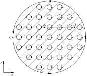
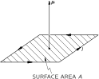
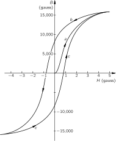

SOURCE: Feynman Lectures on Physics, Volume II, Chapter 36
LANGUAGE: ru
TITLE: Глава 36. ФЕРРОМАГНЕТИЗМ
SOURCE_URL: https://www.feynmanlectures.caltech.edu/II_36.html
NOTEBOOKLM_USE: clean lecture text with TeX math and figure captions; reader navigation removed.

# Глава 36. ФЕРРОМАГНЕТИЗМ

## 36–1 Токи намагничивания

В этой главе мы поговорим о некоторых материалах, в которых полный эффект магнитных моментов проявляется во много раз сильнее, чем в случае парамагнетизма или диамагнетизма. Это явление называется ферромагнетизмом. В парамагнитных и диамагнитных материалах индуцированные магнитные моменты обычно настолько слабы, что нам не приходится думать о добавочных магнитных полях, создаваемых этими магнитными моментами. Однако в ферромагнитных материалах магнитные моменты, создаваемые приложенным магнитным полем, очень велики и оказывают существенное воздействие на сами поля. На самом деле эти индуцированные моменты настолько огромны, что они часто вносят главный вклад в наблюдаемые поля. Поэтому нам следует позаботиться о математической теории больших индуцированных магнитных моментов. Это, разумеется, чисто технический вопрос. Физическая проблема состоит в том, почему магнитные моменты столь велики и как они «устроены». Но к этому вопросу мы подойдем немного позже.

Нахождение магнитных полей в ферромагнитных материалах несколько напоминает задачу о нахождении электрических полей в диэлектриках. Помните, сначала мы описывали внутренние свойства диэлектрика через векторное поле \(\FLPP\) — дипольный момент единицы объема. Затем мы сообразили, что эффект этой поляризации эквивалентен плотности заряда \(\rho_{\text{pol}}\) , определяемой дивергенцией \(\FLPP\) :
\[
\begin{equation}
\label{Eq:II:36:1}
\rho_{\text{pol}}=-\FLPdiv{\FLPP}.
\end{equation}
\]
Полный заряд в любой ситуации можно записать в виде суммы этого поляризационного заряда и всех других зарядов, плотность которых мы обозначим через \(\rho_{\text{other}}\) . Тогда уравнение Максвелла, которое связывает дивергенцию \(\FLPE\) с плотностью зарядов, примет вид:
\[
\begin{equation*}
\FLPdiv{\FLPE}=\frac{\rho}{\epsO}=
\frac{\rho_{\text{pol}}+\rho_{\text{other}}}{\epsO},
\end{equation*}
\]
или
\[
\begin{equation*}
\FLPdiv{\FLPE}=-\frac{\FLPdiv{\FLPP}}{\epsO}+
\frac{\rho_{\text{other}}}{\epsO}.
\end{equation*}
\]
Затем мы можем перебросить поляризационную часть заряда в левую сторону уравнения и получить новый закон:
\[
\begin{equation}
\label{Eq:II:36:2}
\FLPdiv{(\epsO\FLPE+\FLPP)}=\rho_{\text{other}}.
\end{equation}
\]
Этот новый закон говорит, что дивергенция величины \((\epsO\FLPE+\FLPP)\) равна плотности других зарядов.

Совместная запись \(\FLPE\) и \(\FLPP\) , как это сделано в уравнении (36.2), полезна, разумеется, только когда мы знаем какие-то соотношения между ними. Мы видели, что теория, связывающая наведенный электрический дипольный момент с полем, — вещь довольно сложная и ее на самом деле можно применять только в относительно простых случаях, но и то только как приближение. Я хочу напомнить вам об одном приближении. Чтобы найти наведенный дипольный момент атома внутри диэлектрика, необходимо знать электрическое поле, которое действует на отдельный атом. В свое время мы использовали приближение, пригодное во многих случаях; было предположено, что на атом действует поле, которое было бы в центре небольшой полости, оставшейся после удаления этого атома (считая, что дипольные моменты всех других соседних атомов при этом не изменяются). Вспомните также, что электрическое поле в полости внутри поляризованного диэлектрика зависит от формы этой полости. Эти результаты мы подытожили на фиг. 36.1. В тонкой дискообразной полости, перпендикулярной направлению поляризации, электрическое поле, как было показано с помощью закона Гаусса, имеет вид
\[
\begin{equation*}
\FLPE_{\text{hole}}=\FLPE_{\text{dielectric}}+\frac{\FLPP}{\epsO},
\end{equation*}
\]
. С другой стороны, используя равенство нулю ротора \(\FLPE\) , мы нашли, что электрическое поле внутри и вне иглообразной полости одно и то же. Наконец, мы обнаружили, что величина электрического поля внутри сферической полости лежит между этими двумя значениями:
\[
\begin{equation}
\label{Eq:II:36:3}
\FLPE_{\text{hole}}=\FLPE_{\text{dielectric}}+\frac{1}{3}\,
\frac{\FLPP}{\epsO}\:(\text{spherical hole}).
\end{equation}
\]
. Это и было то поле, которым мы пользовались, рассуждая о том, что происходит с атомами внутри поляризованного диэлектрика.

### Figure Ch36-F1
Caption: Фиг. 36.1. Электрическое поле в полости в диэлектрике зависит от формы полости.
Image: figures/Ch36-F1.svg

Теперь нам предстоит обсудить аналогичную задачу в случае магнетизма. Легче всего и короче просто сказать, что \(\FLPM\) — магнитный момент единицы объема (намагниченность) — в точности аналогичен \(\FLPP\) — электрическому дипольному моменту единицы объема (поляризация) — и что, следовательно, отрицательная дивергенция \(\FLPM\) эквивалентна «плотности магнитных зарядов» \(\rho_m\) , что бы это ни означало. Но беда в том, что в физическом мире не существует такой штуки, как «магнитный заряд». Как мы знаем, дивергенция \(\FLPB\) всегда равна нулю. Это, однако, не помешает нам провести искусственную аналогию и написать
\[
\begin{equation}
\label{Eq:II:36:4}
\FLPdiv{\FLPM}=-\rho_m,
\end{equation}
\]
где нужно понимать, что \(\rho_m\) — величина чисто математическая. Затем мы можем все делать полностью аналогично электростатике и использовать все старые электростатические уравнения. К этому часто прибегают. Когда-то такая аналогия считалась даже правильной. Ученые верили, что величина \(\rho_m\) представляет плотность «магнитных полюсов». Однако сейчас нам известно, что намагничивание материала происходит за счет токов, циркулирующих внутри атомов, т. е. либо за счет вращения электронов, либо за счет их движения в атоме. Следовательно, с физической точки зрения лучше описывать намагничивание при помощи реальных атомных токов, а не вводить плотность каких-то мистических «магнитных полюсов». Кстати, эти токи иногда называют еще «амперовскими», ибо Ампер первым предположил, что магнетизм вещества происходит за счет циркуляции атомных токов.

Микроскопические плотности токов в намагниченном веществе, разумеется, очень сложны. Их величина зависит от местоположения в атоме: в некоторых местах они велики, в других — малы, в одной части атома они текут в одну сторону, а в другой — в противоположную (точно так же, как микроскопическое электрическое поле внутри диэлектрика в высшей степени неоднородно). Однако во многих практических задачах нас интересуют только поля вне вещества или средние магнитные поля внутри него, причем под средним мы имеем в виду усреднение по очень многим атомам. Именно для таких макроскопических задач удобно описывать магнитное состояние вещества через \(\FLPM\) — средний магнитный момент единицы объема. Я расскажу сейчас, как атомные токи в намагниченном веществе приводят к возникновению макроскопических токов, которые связаны с \(\FLPM\) .

Итак, мы собираемся разделить плотность тока \(\FLPj\) , которая является реальным источником магнитных полей, на разные части: одна из них описывает циркулирующие токи атомных магнитиков, а остальные — другие возможные токи. Обычно удобнее делить токи на три части. В гл. 32 мы делали различие между токами, свободно текущими по проводникам, и токами, обусловленными движением связанных зарядов в диэлектрике то туда, то сюда. В § 32–2 мы писали
\[
\begin{equation*}
\FLPj=\FLPj_{\text{pol}}+\FLPj_{\text{other}},
\end{equation*}
\]
где \(\FLPj_{\text{pol}}\) представляла токи от движения связанных зарядов в диэлектриках, a \(\FLPj_{\text{other}}\) — все другие токи. Пойдем дальше. Мы хотим выделить часть \(\FLPj_{\text{other}}\) , которая описывает усредненные токи внутри намагниченных материалов, и дополнительный член, который мы будем называть \(\FLPj_{\text{mag}}\) , для всего остального. Этот последний член, вообще говоря, относится к токам в проводниках, но может описывать и другие токи, например токи зарядов, движущихся свободно через пустое пространство. Таким образом, полную плотность тока мы будем писать в виде \(\FLPj_{\text{cond}}\) Разумеется, именно этот ток входит в уравнение Максвелла для ротора
\[
\begin{equation}
\label{Eq:II:36:5}
\FLPj=\FLPj_{\text{pol}}+\FLPj_{\text{mag}}+\FLPj_{\text{cond}}.
\end{equation}
\]
: \(\FLPB\)
\[
\begin{equation}
\label{Eq:II:36:6}
c^2\FLPcurl{\FLPB}=\frac{\FLPj}{\epsO}+\ddp{\FLPE}{t}.
\end{equation}
\]

Теперь мы должны связать ток \(\FLPj_{\text{mag}}\) с величиной вектора намагниченности \(\FLPM\) . Чтобы вы представляли, к чему мы стремимся, скажу, что должен получиться такой результат:
\[
\begin{equation}
\label{Eq:II:36:7}
\FLPj_{\text{mag}}=\FLPcurl{\FLPM}.
\end{equation}
\]
Если в магнитном материале нам всюду задан вектор намагниченности \(\FLPM\) , то плотность циркуляционного тока определяется ротором \(\FLPM\) . Посмотрим, можно ли понять, почему так происходит.

### Figure Ch36-F2
Caption: Фиг. 36.2. Схематическая диаграмма циркулирующих атомных токов, видимых в поперечном сечении железного стержня, намагниченного в направлении \(z\) .
Image: figures/Ch36-F2.svg

Сначала возьмем цилиндрический стержень, равномерно намагниченный параллельно его оси. Мы знаем, что физически такая равномерная намагниченность означает на самом деле однородную повсюду внутри материала плотность атомных циркулирующих токов. Попытаемся представить себе, как выглядят эти реальные токи в поперечном сечении стержня. Мы ожидаем увидеть токи, напоминающие изображенные на фиг. 36.2. Каждый атомный ток течет по кругу, образуя крохотную цепь, причем все циркулирующие токи текут в одном и том же направлении. Каким же тогда будет эффективный ток? В большей части стержня он, конечно, не дает вообще никакого эффекта, ибо рядом с каждым током есть другой ток, текущий в противоположном направлении. Если представить себе небольшую поверхность, показанную на фиг. 36.2 линией \(\overline{AB}\) , которая, однако, чуть-чуть толще отдельного атома, то полный ток через такую поверхность должен быть равен нулю. Внутри материала никакого тока нет. Однако обратите внимание, что на поверхности материала атомные токи не компенсируются соседними токами, текущими в другом направлении. Поэтому по поверхности все время в одном направлении вокруг стержня течет ток. Теперь вам понятно, почему я утверждал, что равномерно намагниченный стержень эквивалентен соленоиду с текущим по нему электрическим током.

Как же эта точка зрения согласуется с выражением (36.7)? Прежде всего, внутри материала намагниченность \(\FLPM\) постоянна, так что все ее производные равны нулю. Это согласуется с нашей геометрической картиной. Однако М на поверхности на самом деле не постоянна: она постоянна вплоть до границы, а затем неожиданно падает до нуля. Таким образом, непосредственно на поверхности возникают огромные градиенты, которые, согласно (36.7), дают высокую плотность тока. Предположим, что мы наблюдаем за тем, что происходит вблизи точки \(\FLPM\) на фиг. 36.2. Если выбрать направления осей \(C\) и \(x\) так, как это показано на фигуре, то намагниченность \(y\) будет направлена по оси \(\FLPM\) . Выписывая компоненты уравнения (36.7), мы получаем \(z\) . В точке
\[
\begin{equation}
\begin{aligned}
\ddp{M_z}{y}&=(j_{\text{mag}})_x,\\[1ex]
-\ddp{M_z}{x}&=(j_{\text{mag}})_y.
\end{aligned}
\label{Eq:II:36:8}
\end{equation}
\]
производная \(C\) равна нулю, но \(\ddpl{M_z}{y}\) — большая и положительная. Выражение (36.7) говорит, что в отрицательном направлении оси \(\ddpl{M_z}{x}\) течет ток огромной плотности. Это согласуется с нашим представлением о поверхностном токе, текущем вокруг стержня \(y\) .

Теперь мы можем найти плотность тока в более сложном случае, когда намагниченность в материале меняется от точки к точке. Качественно нетрудно понять, что если в двух соседних областях намагниченность различная, то полной компенсации циркулирующих токов не происходит, поэтому внутри материала возникает суммарный ток. Именно этот эффект мы и хотим получить количественно.

### Figure Ch36-F3
Caption: Фиг. 36.3. Дипольный момент \(\mu\) контура тока равен \(IA\) .
Image: figures/Ch36-F3.svg

### Figure Ch36-F4
Caption: Фиг. 36.4. Небольшой намагниченный кубик эквивалентен циркулирующему поверхностному току.
Image: figures/Ch36-F4.svg

Прежде всего вспомните, что в гл. 14, § 5 мы выяснили, что циркулирующий ток \(I\) создает магнитный момент \(\mu\) , определяемый выражением
\[
\begin{equation}
\label{Eq:II:36:9}
\mu=IA,
\end{equation}
\]
где \(A\) — площадь, ограниченная контуром тока (см. фиг. 36.3). Рассмотрим маленький прямоугольный кубик внутри намагниченного материала (см. фиг. 36.4). Пусть кубик будет так мал, что намагниченность внутри него можно считать однородной. Если компонента намагниченности этого кубика в направлении оси \(M_z\) равна \(z\) , то полный эффект будет таким же, как если бы по его вертикальным граням тек поверхностный ток. Величину этих токов мы можем найти из равенства (36.9). Полный магнитный момент кубика равен произведению намагниченности на объем:
\[
\begin{equation*}
\mu=M_z(abc),
\end{equation*}
\]
откуда, вспоминая, что площадь контура равна \(ac\) , получаем
\[
\begin{equation*}
I=M_zb.
\end{equation*}
\]
Другими словами, величина тока на единицу длины (по вертикали) на каждой из вертикальных поверхностей равна \(M_z\) .

### Figure Ch36-F5
Caption: Фиг. 36.5. Если намагниченность двух соседних кубиков различна, то на их границе течет поверхностный ток.
Image: figures/Ch36-F5.svg

Теперь представьте себе два таких маленьких кубика, расположенных рядом друг с другом, как показано на фиг. 36.5. Поскольку кубик \(2\) несколько смещен по отношению к кубику \(1\) , его вертикальная компонента намагниченности будет немного другой, скажем \(M_z+\Delta M_z\) . Теперь на поверхности между двумя этими кубиками будет два вклада в полный ток. Кубик \(1\) создаст ток \(I_1\) , текущий в положительном направлении оси \(y\) , а кубик \(2\) создаст поверхностный ток \(I_2\) , текущий в отрицательном направлении оси \(y\) . Полный поверхностный ток в положительном направлении оси \(y\) будет равен сумме:
\[
\begin{align*}
I&=I_1-I_2=M_zb-(M_z+\Delta M_z)b\\[1ex]
&=-\Delta M_zb.
\end{align*}
\]
Мы можем записать \(\Delta M_z\) как произведение производной от \(M_z\) по направлению \(x\) на смещение от кубика \(1\) до кубика \(2\) , которое как раз равно \(a\) :
\[
\begin{equation*}
\Delta M_z=\ddp{M_z}{x}\,a.
\end{equation*}
\]
Ток, текущий между двумя кубиками, будет тогда равен
\[
\begin{equation*}
I=-\ddp{M_z}{x}\,ab.
\end{equation*}
\]
Чтобы связать ток \(I\) со средней объемной плотностью тока \(\FLPj\) , необходимо понять, что этот ток \(I\) на самом деле размазан по некоторой области поперечного сечения. Если мы вообразим, что весь объем материала заполнен такими маленькими кубиками, то с каждым из них можно соотнести одну такую боковую грань (перпендикулярную оси \(x\) ). Тогда мы увидим, что площадь, связанная с током \(I\) , как раз равна площади \(ab\) одной из фронтальных граней. В результате получаем
\[
\begin{equation*}
j_y=\frac{I}{ab}=-\ddp{M_z}{x}.
\end{equation*}
\]
У нас начинает получаться ротор \(\FLPM\) .

### Figure Ch36-F6
Caption: Фиг. 36.6. Два кубика, расположенные один над другим, также могут давать вклад в \(j_y\) .
Image: figures/Ch36-F6.svg

В \(j_y\) должно быть еще одно слагаемое, связанное с изменением \(x\) -компоненты намагниченности с изменением \(z\) . Этот вклад в \(\FLPj\) происходит от поверхности между двумя маленькими кубиками, поставленными один на другой, как показано на фиг. 36.6. Воспользовавшись только что проведенными рассуждениями, можно показать, что эта поверхность даст в \(j_y\) вклад, равный \(\ddpl{M_x}{z}\) . Только эти поверхности будут давать вклад в \(y\) -компоненту тока, так что полная плотность тока в направлении \(y\) равна
\[
\begin{equation*}
j_y=\ddp{M_x}{z}-\ddp{M_z}{x}.
\end{equation*}
\]
. Определяя токи на остальных гранях куба или используя тот факт, что направление оси \(z\) было выбрано совершенно произвольно, мы можем прийти к заключению, что вектор плотности тока действительно определяется выражением
\[
\begin{equation*}
\FLPj=\FLPcurl{\FLPM}.
\end{equation*}
\]

Итак, если вы решили описывать магнитное состояние вещества через средний магнитный момент единицы объема \(\FLPM\) , то оказывается, что циркулирующие атомные токи эквивалентны средней плотности тока в веществе, определяемой выражением (36.7). Если же материал обладает вдобавок еще диэлектрическими свойствами, то в нем может возникнуть и поляризационный ток \(\FLPj_{\text{pol}}=\ddpl{\FLPP}{t}\) . А если материал к тому же и проводник, то в нем может течь и ток проводимости \(\FLPj_{\text{cond}}\) . Таким образом, полный ток можно записать как
\[
\begin{equation}
\label{Eq:II:36:10}
\FLPj=\FLPj_{\text{cond}}+\FLPcurl{\FLPM}+\ddp{\FLPP}{t}.
\end{equation}
\]

## 36–2 Поле \(\FLPH\)

Теперь можно подставить выражение для тока (36.10) в уравнение Максвелла. Мы получаем
\[
\begin{align*}
c^2\FLPcurl{\FLPB}&=\frac{\FLPj}{\epsO}+\ddp{\FLPE}{t}\\[1ex]
&=\frac{1}{\epsO}\biggl(\!
\FLPj_{\text{cond}}\!+\!\FLPcurl{\FLPM}\!+\!\ddp{\FLPP}{t}
\!\biggr)\!+\!\ddp{\FLPE}{t}.
\end{align*}
\]
Слагаемое с \(\FLPM\) можно перенести в левую часть:
\[
\begin{equation}
\label{Eq:II:36:11}
c^2\FLPcurl{\biggl(\!\FLPB\!-\!\frac{\FLPM}{\epsO c^2}\!\biggr)}\!=
\frac{\FLPj_{\text{cond}}}{\epsO}\!+\!\ddp{}{t}\biggl(\!
\FLPE\!+\!\frac{\FLPP}{\epsO}\!\biggr).
\end{equation}
\]
Как мы уже отмечали в гл. 32, иногда удобно записывать \((\FLPE+\FLPP/\epsO)\) как новое векторное поле \(\FLPD/\epsO\) . Точно так же удобно \((\FLPB-\FLPM/\epsO c^2)\) записывать в виде единого векторного поля. Такое поле мы обозначим через \(\FLPH\) , т. е.
\[
\begin{equation}
\label{Eq:II:36:12}
\FLPH=\FLPB-\frac{\FLPM}{\epsO c^2}.
\end{equation}
\]
После этого уравнение (36.11) принимает вид
\[
\begin{equation}
\label{Eq:II:36:13}
\epsO c^2\FLPcurl{\FLPH}=\FLPj_{\text{cond}}+\ddp{\FLPD}{t}.
\end{equation}
\]
Выглядит оно просто, но вся его сложность теперь скрыта в буквах \(\FLPD\) и \(\FLPH\) .

Хочу предостеречь вас. Большинство людей, которые применяют систему СИ, пользуются другим определением \(\FLPH\) . Называя свое поле через \(\FLPH'\) (они, конечно, не пишут штриха и называют его \(\FLPH\) ), они определяют его как
\[
\begin{equation}
\label{Eq:II:36:14}
\FLPH'=\epsO c^2\FLPB-\FLPM.
\end{equation}
\]
(Кроме того, величину \(\epsO c^2\) они обычно записывают в виде \(1/\mu_0\) ; так что появляется еще одна постоянная, за которой все время нужно следить!) При таком определении уравнение ( 36.13 ) будет выглядеть еще проще:
\[
\begin{equation}
\label{Eq:II:36:15}
\FLPcurl{\FLPH'}=\FLPj_{\text{cond}}+\ddp{\FLPD}{t}.
\end{equation}
\]
Но трудность здесь заключается в том, что такое определение \(\FLPH'\) , во-первых, не согласуется с определением, принятым теми, кто не пользуется системой СИ, и, во-вторых, поля \(\FLPH'\) и \(\FLPB\) измеряются в различных единицах. Я думаю, что \(\FLPH\) удобнее измерять в тех же единицах, что и \(\FLPB\) , а не в единицах \(\FLPM\) , как \(\FLPH'\) . Но если вы собираетесь стать инженером и проектировать трансформаторы, магниты и т. п., то будьте внимательны. Вы столкнетесь со множеством книг, где в качестве определения \(\FLPH\) используется уравнение ( 36.14 ), а не наше определение ( 36.12 ), а в других книгах, особенно в справочниках о магнитных материалах, связь между \(\FLPB\) и \(\FLPH\) такая же, как и у нас. Нужно быть внимательным и понимать, какое где использовано соглашение.

Одна из примет, указывающих нам на соглашение, — это единицы измерения. Напомним, что в системе СИ величина \(\FLPB\) , а следовательно, и наше \(\FLPH\) , измеряются в единицах: один вебер на квадратный метр, что равно \(10{,}000\) гаусс. В системе СИ магнитный момент (произведение тока на площадь) измеряется в единицах: один ампер-метр \(^2\) . Тогда намагниченность \(\FLPM\) имеет размерность: один ампер на метр. Размерность \(\FLPH'\) та же, что и размерность \(\FLPM\) . Нетрудно видеть, что это согласуется с уравнением (36.15), поскольку \(\FLPnabla\) имеет размерность обратной длины. Те, кто работает с электромагнитами, привыкли измерять поле \(\FLPH\) (определенное как \(\FLPH'\) ) в ампер-витках на метр, имея при этом в виду витки провода в обмотке. Но «виток» ведь фактически величина безразмерная, и она не должна вас смущать. Поскольку наше \(H\) равно \(H'/\epsO c^2\) , если вы пользуетесь системой СИ, \(H\) (в веберах на метр \(^2\) ) равно \(4\pi\times10^{-7}\) умножить на \(H'\) (в амперах на метр). Может быть, более удобно помнить, что \(H\) (в гауссах) \({}=0.0126H'\) (в а/м).

Здесь есть еще одна ужасная вещь. Многие люди, использующие наше определение \(\FLPH\) , решили назвать единицы измерения \(\FLPH\) и \(\FLPB\) по-разному! И даже несмотря на одинаковую размерность, они называют единицу \(\FLPB\) гауссом, а единицу \(\FLPH\) — эрстедом (конечно, в честь Гаусса и Эрстеда). Таким образом, во многих книгах вы найдете графики зависимости \(\FLPB\) в гауссах от \(\FLPH\) в эрстедах. На самом деле это одна и та же единица, равная \(10^{-4}\) единиц СИ. Эту неразбериху в магнитных единицах мы увековечили в табл. 36.1.

### Table Ch36-T1

Caption: Таблица 36–1 Единицы магнитных величин

- \([B]=\text{weber/meter\(^2\)}=10^4\text{ gauss}\)
- \([H]=\text{weber/meter\(^2\)}=10^4\text{ gauss}\) \(\phantom{[H]=}~\mathit{or}\;10^4\text{ oersted}\)
- \([M]=\text{ampere/meter}\)
- \([H']=\text{ampere/meter}\)
- \(B\,\text{ (gauss)}=10^4\,B\text{ (weber/meter\(^2\))}\)
- \(H\text{ (gauss)}=H\text{ (oersted)}\)
- \(\phantom{H\text{ (gauss)}}=0.0126\,H'\text{ (amp/meter)}\)

## 36–3 Кривая намагничивания

Рассмотрим теперь некоторые простые случаи, когда магнитное поле остается постоянным или изменения поля настолько медленны, что можно пренебречь \(\ddpl{\FLPD}{t}\) по сравнению с \(\FLPj_{\text{cond}}\) . В этом случае поля подчиняются уравнениям
\[
\begin{gather}
\label{Eq:II:36:16}
\FLPdiv{\FLPB}=0,\\[1.5ex]
\label{Eq:II:36:17}
\FLPcurl{\FLPH}=\FLPj_{\text{cond}}/\epsO c^2,\\[1.5ex]
\label{Eq:II:36:18}
\FLPH=\FLPB-\FLPM/\epsO c^2.
\end{gather}
\]

### Figure Ch36-F7
Caption: Фиг. 36.7. (а) Железный тор, обмотанный витками изолированного провода. (б) Поперечное сечение тора, на котором показаны силовые линии поля.
Image: figures/Ch36-F7.svg

Предположим, что у нас есть железный тор, обмотанный медной проволокой, как это показано на фиг. 36.7, а. Пусть по проводу течет ток \(I\) . Каково при этом магнитное поле? Оно будет сосредоточено главным образом внутри железа, причем там (см. фиг. 36.7, б) силовые линии \(\FLPB\) должны быть круговыми. Вследствие постоянства потока \(\FLPB\) его дивергенция равна нулю, и уравнение (36.16) удовлетворяется автоматически. Запишем затем уравнение (36.17) в другой форме, проинтегрировав его по замкнутому контуру \(\Gamma\) , показанному на фиг. 36.7, б. Из теоремы Стокса мы получаем
\[
\begin{equation}
\label{Eq:II:36:19}
\oint_\Gamma\FLPH\cdot d\FLPs=\frac{1}{\epsO c^2}
\int_S\FLPj_{\text{cond}}\cdot\FLPn\,da,
\end{equation}
\]
где интеграл от \(\FLPj\) берется по поверхности \(S\) , ограниченной контуром \(\Gamma\) . Каждый виток обмотки пересекает эту поверхность один раз, поэтому каждый виток дает в интеграл вклад, равный \(I\) , а поскольку всего витков \(N\) штук, то интеграл будет равен \(NI\) . Из симметрии нашей задачи видно, что \(\FLPB\) одинаково на всем контуре \(\Gamma\) ; если предположить, что намагниченность, а следовательно, и поле \(H\) также постоянны на контуре \(\Gamma\) , то уравнение (36.19) принимает вид
\[
\begin{equation*}
Hl=\frac{NI}{\epsO c^2},
\end{equation*}
\]
где \(l\) — длина кривой \(\Gamma\) . Таким образом,
\[
\begin{equation}
\label{Eq:II:36:20}
H=\frac{1}{\epsO c^2}\,\frac{NI}{l}.
\end{equation}
\]
Именно из-за того, что в задачах подобного типа \(\FLPH\) прямо пропорционально намагничивающему току, его иногда называют намагничивающим полем \(\FLPH\) .

Теперь все, что нам нужно, — это уравнение, связывающее \(\FLPH\) с \(\FLPB\) . Однако такого уравнения просто не существует! У нас есть, конечно, уравнение (36.18), но от него мало проку, ибо в ферромагнитных материалах типа железа не существует прямой связи между \(\FLPM\) и \(\FLPB\) . Намагниченность \(\FLPM\) зависит от всей предыдущей истории данного образца железа, а не только от того, каково поле \(\FLPB\) в данный момент.

Впрочем, еще не все потеряно. В некоторых простых случаях мы все же можем найти решение. Если взять ненамагниченное железо, скажем отожженное при высокой температуре, то для такого простого тела, как тор, магнитная предыстория всего железа будет одной и той же. Затем из экспериментальных измерений мы можем кое-что сказать относительно \(\FLPM\) , а следовательно, и о связи между \(\FLPB\) и \(\FLPH\) . Из уравнения (36.20) видно, что поле \(\FLPH\) внутри тора равно произведению некоторой постоянной на величину тока \(I\) в обмотке. Поле \(\FLPB\) можно измерить интегрированием по времени э.д.с. в намагничивающей обмотке, изображенной на рисунке (или в дополнительной обмотке, намотанной поверх нее). Эта э.д.с. равна скорости изменения потока \(\FLPB\) , так что интеграл от э.д.с. по времени равен произведению \(\FLPB\) на площадь поперечного сечения тора.

### Figure Ch36-F8
Caption: Фиг. 36.8. Типичная кривая намагничивания и петля гистерезиса для мягкого железа.
Image: figures/Ch36-F8.svg

На фиг. 36.8 показано соотношение между \(\FLPB\) и \(\FLPH\) , наблюдаемое в сердечнике из мягкого железа. Когда ток включается в первый раз, \(\FLPB\) увеличивается с ростом \(\FLPH\) по кривой \(a\) . Обратите внимание на различие масштабов по осям \(\FLPB\) и \(\FLPH\) ; вначале, чтобы получить большое \(\FLPH\) , необходимо относительно малое \(\FLPB\) . Почему же в случае железа поле \(\FLPB\) намного больше, чем было бы без него? Да потому, что возникает большая намагниченность \(\FLPM\) , эквивалентная большому поверхностному току в железе, а поле \(\FLPB\) определяется суммой этого тока и тока проводимости в обмотке. А почему намагниченность \(\FLPM\) оказывается такой большой, мы обсудим позднее.

При больших значениях \(\FLPH\) кривая намагничивания «выравнивается». Мы говорим, что железо насыщается. В масштабах нашей фигуры кривая становится горизонтальной, на самом же деле намагниченность продолжает слабо расти: для больших полей \(\FLPB\) становится пропорциональным \(\FLPH\) , с единичным наклоном. Дальнейшего увеличения \(\FLPM\) не происходит. Кстати, заметим, что если бы сердечник был сделан из немагнитного материала, то \(\FLPM\) было бы равно нулю, а \(\FLPB\) было бы равно \(\FLPH\) для всех полей.

Прежде всего заметим, что кривая \(a\) на фиг. 36.8 — так называемая кривая намагничивания — в высшей степени нелинейна. Впрочем, положение здесь гораздо сложнее. Если после достижения насыщения мы уменьшим ток в катушке и вернем \(\FLPH\) снова к нулю, магнитное поле \(\FLPB\) будет падать по кривой \(b\) . Когда \(\FLPH\) достигнет нуля, \(\FLPB\) еще не будет нулем. Даже после выключения намагничивающего тока магнитное поле в железе остается: железо становится постоянно намагниченным. Если теперь включить в катушке ток в обратном направлении, то кривая \(B\) — \(H\) пойдет дальше по ветви \(b\) до тех пор, пока железо не намагнитится до насыщения в противоположном направлении. При дальнейшем уменьшении тока до нуля \(\FLPB\) пойдет по кривой \(c\) . Когда мы меняем ток от большой положительной до большой отрицательной величины, кривая \(B\) — \(H\) будет идти вверх и вниз очень близко к ветвям \(b\) и \(c\) . Если же, однако, \(\FLPH\) менять каким-то произвольным образом, то возникнут более сложные кривые, которые, вообще говоря, будут лежать между кривыми \(b\) и \(c\) . Кривая, полученная повторными изменениями полей, называется петлей гистерезиса.

Вы видите, что невозможно написать функциональное соотношение типа \(B=f(H)\) , так как В в любой момент зависит не только от \(\FLPB\) в тот же момент, но и от всей предыстории материала \(\FLPH\) . Естественно, что намагниченность и петли гистерезиса для разных веществ различны. Форма кривых критически зависит от химического состава материала, а также от деталей технологии его приготовления и последующей физической обработки. В следующей главе мы обсудим физическое объяснение некоторых из этих сложностей.

## 36–4 Индуктивность с железным сердечником

Одно из наиболее важных применений магнитные материалы находят в электрических устройствах, например трансформаторах, электрических моторах и т. п. Объясняется это прежде всего тем, что с помощью железа можно контролировать поведение магнитного поля, а также при данном электрическом токе получать значительно большие поля. Например, типичное «тороидальное» индуктивное устройство во многом напоминает то, что изображено на фиг. 36.7. При той же индуктивности устройство может иметь гораздо меньший объем и требовать намного меньше меди, чем эквивалентное устройство с «воздушным сердечником». Поэтому при той же индуктивности мы добиваемся гораздо меньшего сопротивления обмотки, так что индуктивность более близка к «идеальной», особенно при низких частотах. Нетрудно качественно проследить, как работает такое устройство. Если \(I\) — ток в обмотке, то создаваемое внутри поле \(\FLPH\) пропорционально \(I\) , как показано в уравнении (36.20). Напряжение \(\voltage\) на выводах связано с магнитным полем \(\FLPB\) . Если пренебречь сопротивлением обмотки, то напряжение \(\voltage\) будет пропорционально \(\ddpl{\FLPB}{t}\) . Индуктивность \(\selfInd\) , которая равна отношению \(\voltage\) к \(dI/dt\) (см. гл. 17, § 7), зависит, таким образом, от связи между \(B\) и \(H\) в железе. Поскольку \(\FLPB\) гораздо больше \(\FLPH\) , индуктивность возрастает во много раз. Физически это означает, что малый ток в катушке, который обычно создает слабое магнитное поле, заставляет выстраиваться маленькие «подчиненные» магнитики в железе, создавая «магнитный» ток, который в огромное число раз больше внешнего тока в обмотке. Все происходит так, как будто в катушке течет намного больший ток, чем на самом деле. Когда мы меняем направление тока, все маленькие магнитики переворачиваются, все внутренние токи меняют направление, и наведенная э.д.с. получается гораздо больше, чем без железа. Если мы хотим вычислить индуктивность, то это можно сделать через энергию, как описано в гл. 17, § 8. Скорость, с которой энергия отдается источником тока, равна \(I\voltage\) . Напряжение \(\voltage\) равно площади поперечного сечения сердечника \(A\) , умноженной на \(N\) и на \(dB/dt\) . Согласно уравнению (36.20), \(I=(\epsO c^2l/N)H\) . Таким образом,
\[
\begin{equation*}
\ddt{U}{t}=\voltage I=(\epsO c^2lA)H\,\ddt{B}{t}.
\end{equation*}
\]
Интегрируя по времени, получаем
\[
\begin{equation}
\label{Eq:II:36:21}
U=(\epsO c^2lA)\int H\,dB.
\end{equation}
\]
Заметьте, что \(lA\) равно объему тора, поэтому мы показали, что плотность энергии \(u=U/\text{vol}\) в магнитном материале определяется выражением
\[
\begin{equation}
\label{Eq:II:36:22}
u=\epsO c^2\int H\,dB.
\end{equation}
\]

Здесь выявляется одно интересное обстоятельство. Когда в обмотке течет переменный ток, то В в железе «ходит» по петле гистерезиса. А поскольку \(B\) не является однозначной функцией \(H\) , интеграл \(\int H\,dB\) по замкнутому циклу не равен нулю. Он равен площади, заключенной внутри петли гистерезиса. Таким образом, за каждый цикл источник тока отдает некоторую чистую энергию, пропорциональную площади, заключенной внутри петли гистерезиса. И эта энергия «теряется». Она уходит из электромагнитного процесса, но превращается в тепло в железе. Эти потери называются гистерезисными. Чтобы такие энергетические потери были малы, желательно, чтобы петля гистерезиса была как можно уже. Один из способов уменьшить площадь петли — это уменьшить максимальное поле, достигаемое за каждый цикл. Для меньших максимальных полей мы получаем гистерезисную кривую, подобную изображенной на фиг. 36.9. Кроме того, применяются особые материалы с очень узкой петлей. Чтобы получить это свойство, специально создано так называемое трансформаторное железо, которое представляет собой сплав железа с небольшой примесью кремния.

### Figure Ch36-F9
Caption: Фиг. 36.9. Петля гистерезиса, не достигающая насыщения.
Image: figures/Ch36-F9.svg

Когда индуктивность работает по малой петле гистерезиса, соотношение между \(B\) и \(H\) можно приближенно представить в виде линейного уравнения. Обычно пишут
\[
\begin{equation}
\label{Eq:II:36:23}
B=\mu H.
\end{equation}
\]
Постоянная \(\mu\) вовсе не тот магнитный момент, с которым мы встречались раньше. Она называется магнитной проницаемостью железа. (Иногда ее называют также относительной проницаемостью.) Типичная проницаемость обычных сортов железа равна нескольким тысячам. Однако существуют специальные сплавы, типа так называемого «супермаллоя», проницаемость которых может быть порядка миллиона.

Если мы воспользуемся приближением \(B=\mu H\) в уравнении (36.21), то энергию индуктивности, имеющей форму тора, можно записать как
\[
\begin{align}
U&=(\epsO c^2lA)\mu\int H\,dH\notag\\[1ex]
\label{Eq:II:36:24}
&=(\epsO c^2lA)\,\frac{\mu H^2}{2}.
\end{align}
\]
так что плотность энергии приближенно равна
\[
\begin{equation*}
u\approx\frac{\epsO c^2}{2}\,\mu H^2.
\end{equation*}
\]
Теперь мы можем выражение для энергии \(\selfInd I^2/2\) положить равным энергии индуктивности \(\selfInd\) и найти
\[
\begin{equation*}
\selfInd=(\epsO c^2lA)\mu\biggl(\frac{H}{I}\biggr)^2.
\end{equation*}
\]
. Получается \(H/I\) А воспользовавшись выражением
\[
\begin{equation}
\label{Eq:II:36:25}
\selfInd=\frac{\mu N^2A}{\epsO c^2l}.
\end{equation}
\]
из уравнения (36.20), находим \(\mu\) Таким образом, индуктивность пропорциональна \(B\) . Если вам нужна индуктивность для таких устройств, как звуковые усилители, то желательно иметь материал, у которого связь между \(H\) и \(B\) достаточно линейна. [Вы, должно быть, помните, что в гл. 50 (вып. 4) мы говорили о генерации гармоник в нелинейных системах.] Для таких задач уравнение (36.23) будет очень хорошим приближением. С другой стороны, если нужно генерировать гармоники, то используют индуктивности, ведущие себя в высшей степени нелинейно. При этом вы должны пользоваться сложной кривой \(H\) и применять при вычислениях графические или численные методы.

Обычно «трансформатор» изготавливают, помещая две катушки на один и тот же тор — или сердечник — из магнитного материала. (В больших трансформаторах для удобства сердечник делается прямоугольным.) При этом изменение тока в «первичной» обмотке вызывает изменение магнитного поля в сердечнике, которое индуцирует э. д. с. во «вторичной» обмотке. Поскольку поток через каждый виток обеих обмоток один и тот же, то величины э. д. с. в этих двух обмотках относятся так же, как число витков в каждой из них. Напряжение, приложенное к первичной обмотке, преобразуется во вторичной в напряжение другой величины. А поскольку для создания требуемых изменений магнитного поля необходим определенный полный ток, то алгебраическая сумма токов в двух обмотках должна оставаться постоянной и равной требуемому «намагничивающему» току. Если ток, потребляемый вторичной обмоткой, возрастает, то пропорционально должен увеличиваться и первичный ток — происходит «преобразование» как тока, так и напряжения.

## 36–5 Электромагниты

### Figure Ch36-F10
Caption: Фиг. 36.10. Электромагнит.
Image: figures/Ch36-F10.svg

Поговорим теперь о практической стороне дела, которая немного более сложна. Предположим, что мы имеем электромагнит стандартной формы, изображенный на фиг. 36.10. Он состоит из С-образного железного ярма, на которое намотано много витков провода. Чему равно магнитное поле \(\FLPB\) в зазоре?

Если ширина зазора мала по сравнению со всеми другими размерами, то в качестве первого приближения мы можем считать, что линии \(\FLPB\) образуют замкнутые кривые так же, как это происходит и в обычном торе. Они выглядят примерно так, как показано на фиг. 36.11, а. Они стремятся вылезти из зазора, но если он узок, то эффект этот очень мал. Предположение о постоянстве потока \(\FLPB\) через любое поперечное сечение ярма будет довольно хорошим приближением. Если поперечное сечение ярма постоянно и равно \(A\) — и если мы пренебрежем любыми краевыми эффектами на зазоре или на углах, — то можно сказать, что \(\FLPB\) по всей окружности ярма однородно.

### Figure Ch36-F11
Caption: Фиг. 36.11. Поперечное сечение электромагнита.
Image: figures/Ch36-F11.svg

Также \(\FLPB\) будет иметь то же самое значение в зазоре. Это следует из уравнений \(S\) . Представьте себе замкнутую поверхность \(\FLPB\) , изображенную на фиг. 36.11, б, одна грань которой находится в зазоре, а другая — в железе. Полный поток поля \(B_1\) через эту поверхность должен быть равен нулю. Обозначая через \(B_2\) поле в зазоре, а через
\[
\begin{equation*}
B_1A-B_2A=0.
\end{equation*}
\]
поле в железе, мы видим (в рамках нашего приближения), что \(B_1=B_2\) .

Посмотрим теперь на H. Мы снова можем воспользоваться уравнением (36.19), взяв криволинейный интеграл по контуру \(H\) (см. фиг. 36.11, б). Как и прежде, правая часть равна \(\Gamma\) — произведению числа витков на ток. Однако теперь \(NI\) в железе и в воздухе будет различным. Обозначая через \(H\) поле в железе, а через \(H_2\) длину пути по окружности ярма, мы видим, что эта часть кривой дает вклад в интеграл \(l_2\) . Если же поле в зазоре равно \(H_2l_2\) , а ширина его \(H_1\) , то вклад зазора оказывается равным \(l_1\) . Таким образом, получаем \(H_1l_1\)
\[
\begin{equation}
\label{Eq:II:36:26}
H_1l_1+H_2l_2=\frac{NI}{\epsO c^2}.
\end{equation}
\]

Но это еще не все. Нам известно еще, что намагниченность в воздушной щели пренебрежимо мала, так что \(B_1=H_1\) . А так как \(B_1=B_2\) , уравнение (36.26) принимает вид
\[
\begin{equation}
\label{Eq:II:36:27}
B_2l_1+H_2l_2=\frac{NI}{\epsO c^2}.
\end{equation}
\]
Остаются еще два неизвестных. Чтобы найти \(B_2\) и \(H_2\) , необходимо еще одно соотношение, которое связывает \(B\) с \(H\) в железе.

Если можно приближенно считать, что \(B_2=\mu H_2\) , то уравнение разрешается алгебраически. Рассмотрим более общий случай, для которого кривая намагничивания железа имеет вид, изображенный на фиг. 36.8. Единственное, что нам нужно, — это найти совместное решение этого функционального соотношения с уравнением (36.27). Его можно найти, строя зависимость (36.27) на одном графике с кривой намагничивания, как это сделано на фиг. 36.12. Точки, где эти кривые пересекутся, и будут нашими решениями.

### Figure Ch36-F12
Caption: Фиг. 36.12. Определение поля в электромагните.
Image: figures/Ch36-F12.svg

Для данного тока \(I\) уравнение (36.27) описывается прямой линией, обозначенной \(I>0\) на фиг. 36.12. Эта линия пересекает ось \(H\) ( \(B_2=0\) ) в точке \(H_2=NI/\epsO c^2l_2\) и имеет наклон \(-l_2/l_1\) . Различные величины токов приводят просто к горизонтальному сдвигу этой линии. Из фиг. 36.12 мы видим, что при данном токе существует несколько различных решений, зависящих от того, каким образом вы получили их. Если вы только что построили магнит и включили ток \(I\) , то поле \(B_2\) (которое равно \(B_1\) ) будет иметь величину, определяемую точкой \(a\) . Если вы сначала увеличили ток до очень большой величины, а затем понизили до \(I\) , то значение поля будет определяться точкой \(b\) . А если, увеличивая ток от большого отрицательного значения, вы дошли до \(I\) , то поле определяется точкой \(c\) . Поле в зазоре зависит от того, как вы поступали в прошлом.

Если ток в магните равен нулю, то соотношение между \(B_2\) и \(H_2\) в уравнении (36.27) изображается кривой, обозначенной \(I=0\) на фиг. Здесь опять возможны различные решения. Если вы первоначально «насытили» железо, то в магните может сохраниться значительное остаточное поле, определяемое точкой \(d\) . Вы можете снять обмотку и получить постоянный магнит. Нетрудно понять, что для хорошего постоянного магнита необходим материал с широкой петлей гистерезиса. Такую очень широкую петлю имеют специальные сплавы, подобные Алнико V.

## 36–6 Спонтанная намагниченность

Обратимся теперь к вопросу, почему в ферромагнитных материалах даже малые магнитные поля приводят к такой большой намагниченности. Намагниченность ферромагнитных материалов типа железа или никеля образуется благодаря магнитным моментам электронов одной из внутренних оболочек атома. Магнитный момент \(\FLPmu\) каждого электрона равен произведению \(q/2m\) на g-фактор и момент количества движения \(g\) . Для отдельного электрона при отсутствии чисто орбитального движения \(\FLPJ\) \(g=2\) , а компонента \(\FLPJ\) в любом направлении, скажем в направлении оси \(z\) , равна \(\pm\hbar/2\) , так что компонента \(\FLPmu\) в направлении оси \(z\) будет
\[
\begin{equation}
\label{Eq:II:36:28}
\mu_z=\frac{q\hbar}{2m}=0.928\times10^{-23}\text{ amp$\cdot$m$^2$}.
\end{equation}
\]
В атоме железа вклад в ферромагнетизм фактически дают только два электрона, так что для упрощения рассуждений мы будем говорить об атоме никеля, который является ферромагнетиком, подобно железу, но имеет на той же внутренней оболочке только один «ферромагнитный» электрон. (Все рассуждения нетрудно затем распространить и на железо.)

Все дело в том, что в присутствии внешнего поля \(\FLPB\) атомные магнитики стремятся выстроиться по полю, но их сбивает тепловое движение, точно так же, как мы описывали для парамагнитных материалов. В предыдущей главе мы выяснили, что равновесие между силами магнитного поля, старающимися выстроить атомные магнитики, и действием теплового движения, стремящегося их сбить, приводит к тому, что средний магнитный момент единицы объема оказывается равным
\[
\begin{equation}
\label{Eq:II:36:29}
M=N\mu\tanh\frac{\mu B_a}{kT}.
\end{equation}
\]
Под \(\FLPB_a\) мы подразумеваем поле, действующее на атом, а под \(kT\) — тепловую (больцмановскую) энергию. В теории парамагнетизма мы в качестве \(B_a\) использовали само поле \(B\) , пренебрегая при этом частью поля, действующего на каждый атом со стороны соседних. Но в случае ферромагнетиков возникает усложнение. Мы уже не можем в качестве \(\FLPB_a\) , действующего на индивидуальный атом, брать среднее поле в железе. Вместо этого нам следует поступить так же, как это делалось в случае диэлектрика: нам нужно найти локальное поле, действующее на отдельный атом. При точном расчете нам следовало бы сложить вклады всех полей от других атомов кристаллической решетки, действующих на рассматриваемый нами атом. Но подобно тому, как мы поступали в случае диэлектрика, сделаем приближение, состоящее в том, что поле, действующее на атом, будет таким же, как и в маленькой сферической полости внутри материала (предполагая при этом, что моменты соседних атомов не изменяются из-за наличия полости).

Следуя рассуждениям гл. 11, мы можем надеяться, что должна получиться формула
\[
\begin{equation*}
\FLPB_{\text{hole}}=\FLPB+\frac{1}{3}\,\frac{\FLPM}{\epsO c^2}\quad
(\text{wrong!}).
\end{equation*}
\]
Но это будет неправильно. Однако мы все же можем использовать полученные там результаты, если тщательно сравним уравнения из гл. 11 с уравнениями ферромагнетизма, которые мы напишем сейчас. Сопоставим сначала соответствующие исходные уравнения. Для областей, в которых токи проводимости и заряды отсутствуют, мы имеем:
\[
\begin{equation}
\begin{aligned}
&\text{Electrostatics}\\[.5ex]
&\FLPdiv{\biggl(\FLPE+\frac{\FLPP}{\epsO}\biggr)}=0\\[1ex]
&\FLPcurl{\FLPE}=\FLPzero\\[2ex]
&\text{Static ferromagnetism}\\[1ex]
&\FLPdiv{\FLPB}=0\\[1ex]
&\FLPcurl{\biggl(\FLPB-\frac{\FLPM}{\epsO c^2}\biggr)}=\FLPzero
\end{aligned}
\label{Eq:II:36:30}
\end{equation}
\]
Эти два набора уравнений можно считать аналогичными, если мы чисто математически сопоставим
\[
\begin{equation*}
\FLPE\to\FLPB-\frac{\FLPM}{\epsO c^2},\quad
\FLPE+\frac{\FLPP}{\epsO}\to\FLPB.
\end{equation*}
\]
Это то же самое, что и
\[
\begin{equation}
\label{Eq:II:36:31}
\FLPE\to\FLPH,\quad\FLPP\to\FLPM/c^2.
\end{equation}
\]
Другими словами, если уравнения ферромагнетизма записать как
\[
\begin{equation}
\begin{aligned}
&\FLPdiv{\biggl(\FLPH+\frac{\FLPM}{\epsO c^2}\biggr)}=0,\\[1ex]
&\FLPcurl{\FLPH}=\FLPzero,
\end{aligned}
\label{Eq:II:36:32}
\end{equation}
\]
то они будут похожи на уравнения электростатики.

В прошлом это чисто алгебраическое соответствие доставило нам некоторые неприятности. Многие начинали думать, что именно \(\FLPH\) и есть магнитное поле. Но, как мы уже убедились, физически фундаментальными полями являются \(\FLPB\) и \(\FLPE\) , а поле \(\FLPH\) — понятие производное. Таким образом, хотя уравнения и аналогичны, физика их совершенно различна. Однако это не может заставить нас отказаться от принципа, что одинаковые уравнения имеют одинаковые решения.

Мы можем воспользоваться нашими предыдущими результатами о полях внутри полости различной формы в диэлектриках, которые приведены на фиг. 36.1, для нахождения поля \(\FLPH\) . Зная \(\FLPH\) , можно определить и \(\FLPB\) . Например, поле \(\FLPH\) внутри иглообразной полости, параллельной \(\FLPM\) (согласно результату, приведенному в § 1), будет тем же самым, что и поле \(\FLPH\) внутри материала:
\[
\begin{equation*}
\FLPH_{\text{hole}}=\FLPH_{\text{material}}.
\end{equation*}
\]
Но поскольку в нашей полости \(\FLPM\) равна нулю, то мы получаем
\[
\begin{equation}
\label{Eq:II:36:33}
\FLPB_{\text{hole}}=\FLPB_{\text{material}}-\frac{\FLPM}{\epsO c^2}.
\end{equation}
\]

С другой стороны, для дискообразной полости, перпендикулярной \(\FLPM\) , мы имеем
\[
\begin{equation}
\FLPE_{\text{hole}}=\FLPE_{\text{dielectric}}+\frac{\FLPP}{\epsO},\notag
\end{equation}
\]
что в нашем случае превращается в
\[
\begin{equation}
\FLPH_{\text{hole}}=\FLPH_{\text{material}}+\frac{\FLPM}{\epsO c^2}.\notag
\end{equation}
\]
Или, в величинах \(\FLPB\) ,
\[
\begin{equation}
\label{Eq:II:36:34}
\FLPB_{\text{hole}}=\FLPB_{\text{material}}.
\end{equation}
\]
Наконец, для сферической полости аналогия с уравнением (36.3) дала бы
\[
\begin{equation}
\FLPH_{\text{hole}}=\FLPH_{\text{material}}+\frac{\FLPM}{3\epsO c^2}\notag
\end{equation}
\]
или
\[
\begin{equation}
\label{Eq:II:36:35}
\FLPB_{\text{hole}}=\FLPB_{\text{material}}-\frac{2}{3}\,
\frac{\FLPM}{\epsO c^2}.
\end{equation}
\]
Этот результат существенно отличается от того, что мы имели для \(\FLPE\) .

Конечно, их можно получить и более физически, непосредственно используя уравнения Максвелла. Например, уравнение (36.34) непосредственно следует из уравнения \(\FLPdiv{\FLPB}=0\) . (Возьмите гауссову поверхность, которая наполовину находится в материале, а наполовину — вне его.) Подобным же образом вы можете получить уравнение (36.33), воспользовавшись контурным интегралом по пути, который туда идет по полости, а назад возвращается через материал. Физически поле в полости уменьшается благодаря поверхностным токам, определяемым как \(\FLPcurl{\FLPM}\) . На вашу долю остается показать, что уравнение (36.35) можно получить, рассматривая эффекты поверхностных токов на границе сферической полости.

При нахождении равновесной намагниченности из уравнения (36.29) удобнее, оказывается, иметь дело с \(\FLPH\) , поэтому мы пишем
\[
\begin{equation}
\label{Eq:II:36:36}
\FLPB_a=\FLPH+\lambda\,\frac{\FLPM}{\epsO c^2}.
\end{equation}
\]
В приближении сферической полости коэффициент λ следует взять равным \(\lambda=\tfrac{1}{3}\) , но, как вы увидите позже, нам придется пользоваться несколько другим его значением, а пока оставим его как подгоночный параметр. Кроме того, все поля мы возьмем в одном и том же направлении, чтобы нам не нужно было заботиться о направлении векторов. Если бы теперь мы подставили уравнение (36.36) в (36.29), то получили бы уравнение, которое связывает намагниченность \(M\) с намагничивающим полем \(H\) :
\[
\begin{equation*}
M=N\mu\tanh\biggl(\mu\,\frac{H+\lambda M/\epsO c^2}{kT}\biggr).
\end{equation*}
\]
Однако это уравнение невозможно решить точно, так что мы будем делать это графически.

Сформулируем задачу в более общей форме, записывая уравнение (36.29) в виде
\[
\begin{equation}
\label{Eq:II:36:37}
\frac{M}{M_{\text{sat}}}=\tanh x,
\end{equation}
\]
где \(M_{\text{sat}}\) — намагниченность насыщения, т. е. \(N\mu\) , а \(x\) представляет \(\mu B_a/kT\) . Зависимость \(M/M_{\text{sat}}\) от \(x\) показана на фиг. 36.13 (кривая \(a\) ). Воспользовавшись еще уравнением (36.36) для \(x\) , можно записать \(M\) как функцию от \(B_a\) — в виде
\[
\begin{equation}
\label{Eq:II:36:38}
x=\frac{\mu B_a}{kT}=\frac{\mu H}{kT}+\biggl(\frac{\mu\lambda M_{\text{sat}}}
{\epsO c^2kT}\biggr)\frac{M}{M_{\text{sat}}}.
\end{equation}
\]
Для любого частного значения \(H\) это будет прямая, выражающая зависимость между \(M/M_{\text{sat}}\) и \(x\) . Прямая пересекается с осью \(x\) в точке \(x=\mu
H/kT\) , и наклон ее равен \(\epsO c^2kT/\mu\lambda M_{\text{sat}}\) . Для любого частного значения \(H\) это будет прямая, подобная прямой \(b\) на фиг. 36.13. Пересечение кривых \(a\) и \(b\) дает нам решение для \(M/M_{\text{sat}}\) . Итак, задача решена.

### Figure Ch36-F13
Caption: Фиг. 36.13. Графическое решение уравнений (36.37) и (36.38).
Image: figures/Ch36-F13.svg

Посмотрим теперь, годны ли эти решения при различных обстоятельствах. Начнем с \(H=0\) . Здесь представляются две возможности, показанные кривыми \(b_1\) и \(b_2\) на фиг. 36.14. Заметьте, что из уравнения (36.38) следует, что наклон прямой пропорционален абсолютной температуре \(T\) . Таким образом, при высоких температурах получится прямая, подобная \(b_1\) . Решением будет \(M/M_{\text{sat}}=0\) . Когда намагничивающее поле \(H\) равно нулю, намагниченность тоже равна нулю. Однако при низких температурах мы получили бы линию типа \(b_2\) , и стали возможны два решения для \(M/M_{\text{sat}}\) : одно с \(M/M_{\text{sat}}=0\) , а другое с \(M/M_{\text{sat}}\) порядка единицы. Оказывается, что только верхнее решение устойчиво, в чем можно убедиться, рассматривая малые вариации в окрестности этих решений.

### Figure Ch36-F14
Caption: Фиг. 36.14. Определение намагниченности при \(H=0\) .
Image: figures/Ch36-F14.svg

Согласно этим представлениям, магнитный материал должен намагничиваться самопроизвольно при достаточно низких температурах. Короче говоря, когда тепловое движение достаточно мало, взаимодействие между атомными магнитиками заставляет их выстраиваться параллельно друг другу — получается постоянно намагниченный материал, аналогичный сегнетоэлектрикам, о которых мы говорили в гл. 11.

Если мы отправимся от высоких температур и начнем двигаться вниз, то при некой критической температуре, называемой температурой Кюри \(T_c\) , неожиданно проявляется ферромагнитное поведение. Эта температура соответствует на фиг. 36.14 линии \(b_3\) , касательной к кривой \(a\) , наклон которой равен \(1\) . Так что температура Кюри определяется из равенства
\[
\begin{equation}
\label{Eq:II:36:39}
\frac{\epsO c^2kT_c}{\mu\lambda M_{\text{sat}}}=1.
\end{equation}
\]
При желании уравнение (36.38) можно записать в более простом виде через \(T_c\) :
\[
\begin{equation}
\label{Eq:II:36:40}
x=\frac{\mu H}{kT}+\frac{T_c}{T}\biggl(\frac{M}{M_{\text{sat}}}\biggr).
\end{equation}
\]

Теперь рассмотрим, что происходит при малых намагничивающих полях \(H\) . Из фиг. 36.14 нетрудно понять, что получится, если нашу прямую линию сдвинуть немного направо. В случае низкой температуры точка пересечения немного сдвинется направо по слабо наклоненной части кривой \(a\) , и \(M\) будет меняться сравнительно мало. Однако в случае высокой температуры точка пересечения побежит по крутой части кривой \(a\) , и \(M\) будет меняться относительно быстро. Эту часть кривой \(a\) мы фактически можем приближенно заменить прямой линией с единичным наклоном и написать:
\[
\begin{equation*}
\frac{M}{M_{\text{sat}}}=x=\frac{\mu H}{kT}+
\frac{T_c}{T}\biggl(\frac{M}{M_{\text{sat}}}\biggr).
\end{equation*}
\]
Теперь можно разрешить уравнение относительно \(M/M_{\text{sat}}\) :
\[
\begin{equation}
\label{Eq:II:36:41}
\frac{M}{M_{\text{sat}}}=\frac{\mu H}{k(T-T_c)}.
\end{equation}
\]
Мы получаем закон, несколько напоминающий закон для парамагнетизма. Для парамагнетизма мы имели
\[
\begin{equation}
\label{Eq:II:36:42}
\frac{M}{M_{\text{sat}}}=\frac{\mu B}{kT}.
\end{equation}
\]
. Одно отличие состоит в том, что мы получили намагниченность как функцию \(H\) , что учитывает некоторые эффекты взаимодействия атомных магнитиков, однако главное отличие в том, что намагниченность обратно пропорциональна разности температур \(T\) и \(T_c\) , а не просто абсолютной температуре \(T\) . Пренебрежение взаимодействием между соседними атомами соответствует \(\lambda=0\) , что, согласно уравнению (36.39), означает \(T_c=0\) . В этом случае результат получится в точности таким же, как в гл. 35.

Нашу теоретическую картину можно сверить с экспериментальными данными для никеля. На опыте обнаружено, что ферромагнитные свойства никеля исчезают, когда температура поднимается выше \(631^\circ\) К. Это значение можно сравнить со значением \(T_c\) , вычисленным из равенства (36.39). Вспоминая, что \(M_{\text{sat}}=\mu N\) , мы получаем
\[
\begin{equation*}
T_c=\lambda\,\frac{N\mu^2}{k\epsO c^2}.
\end{equation*}
\]
Из плотности и атомного веса никеля находим
\[
\begin{equation*}
N=9.1\times10^{28}\:\text{m}^{-3}.
\end{equation*}
\]
А вычисление \(\mu\) из уравнения (36.28) и подстановка \(\lambda=\tfrac{1}{3}\) дает
\[
\begin{equation*}
T_c=0.24^\circ\text{K}.
\end{equation*}
\]
Различие с экспериментом примерно в \(2600\) раз! Наша теория ферромагнетизма полностью провалилась!

Можно попытаться «подправить» нашу теорию, как это сделал Вейсс, предположив, что по каким-то неизвестным причинам \(\lambda\) равно не 1/3, а \((2600)\times\tfrac{1}{3}\) , т. е. около \(900\) . Оказывается, что подобная величина получается и для других ферромагнитных материалов типа железа. Вернемся к уравнению (36.36) и попробуем понять, что это может означать. Мы видим, что большая величина \(\lambda\) означает, что \(B_a\) (локальное поле, действующее на атом) должно быть много, много больше, чем мы думали. Фактически, записывая \(H=B-M/\epsO c^2\) , мы получили
\[
\begin{equation*}
B_a=B+\frac{(\lambda-1)M}{\epsO c^2}.
\end{equation*}
\]
. В соответствии с нашей первоначальной идеей, когда мы принимали \(\lambda=\tfrac{1}{3}\) , локальная намагниченность \(M\) уменьшает эффективное поле \(B_a\) на величину \(-\tfrac{2}{3}M/\epsO c^2\) . Даже если бы наша модель сферической полости была не очень хороша, мы все равно ожидали бы некоторого уменьшения. Вместо того чтобы объяснить явление ферромагнетизма, мы вынуждены считать, что намагниченность увеличивает локальное поле в огромное число раз: в тысячу и даже больше. По-видимому, не существует какого-то разумного способа для создания действующего на атом поля такой ужасной величины, ни даже поля нужного знака! Ясно, что наша «магнитная» теория ферромагнетизма потерпела досадный провал. Мы вынуждены заключить, что в ферромагнетизме мы имеем дело с какими-то немагнитными взаимодействиями между вращающимися электронами соседних атомов. Это взаимодействие должно порождать у соседних спинов сильную тенденцию к выстраиванию в одном направлении. Мы увидим позднее, что это взаимодействие связано с квантовой механикой и принципом запрета Паули.

И наконец, посмотрим, что происходит при низких температурах, когда \(T<T_c\) . Мы видели, что даже при \(H=0\) в этом случае должна существовать спонтанная намагниченность, определяемая пересечением кривых \(a\) и \(b_2\) на фиг. 36.14. Если мы, изменяя наклон линии \(M\) , будем находить \(b_2\) для различных температур, то получим теоретическую кривую, показанную на фиг. 36.15. Для всех ферромагнитных материалов, атомные моменты которых обусловлены одним электроном, эта кривая должна быть одной и той же. Для других материалов подобные кривые могут отличаться лишь немного.

### Figure Ch36-F15
Caption: Фиг. 36.15. Зависимость спонтанной намагниченности никеля от температуры.
Image: figures/Ch36-F15.svg

В пределе, когда \(T\) стремится к абсолютному нулю, \(M\) стремится к \(M_{\text{sat}}\) . При увеличении температуры намагниченность уменьшается, падая до нуля при температуре Кюри. Точками на фиг. 36.15 показаны экспериментальные данные для никеля. Они довольно хорошо ложатся на теоретическую кривую. Хотя мы и не понимаем лежащего в основе механизма, но общие свойства теории, по-видимому, все же правильны.

Наконец, в нашей попытке понять ферромагнетизм есть еще одна неприятная несогласованность, которая должна нас заботить. Мы нашли, что выше некоторой температуры материал должен вести себя как парамагнитное вещество, намагниченность которого \(M\) пропорциональна \(H\) (или \(B\) ), а ниже этой температуры должна возникать спонтанная намагниченность. Но при построении кривой намагничивания для железа мы этого как раз и не обнаружили. Железо становится постоянно намагниченным только после того, как мы его «намагнитим». А в соответствии с только что высказанными идеями оно должно намагничиваться само! Что же неверно? Оказывается, что если вы рассмотрите достаточно маленький кристалл железа или никеля, то увидите, что он и впрямь полностью намагничен! Но большой кусок железа состоит из массы таких маленьких областей, или «доменов», которые намагничены в различных направлениях, так что средняя намагниченность в большом масштабе оказывается равной нулю. Однако в каждом маленьком домене железо все же намагничивает само себя, причем \(M\) приблизительно равно \(M_{\text{sat}}\) . Как следствие этой доменной структуры свойства большого куска материала должны быть совершенно отличны от микроскопических, которые мы, собственно, и рассматривали. В следующей лекции мы расскажем о том, как ведут себя объемные магнитные материалы на практике.
